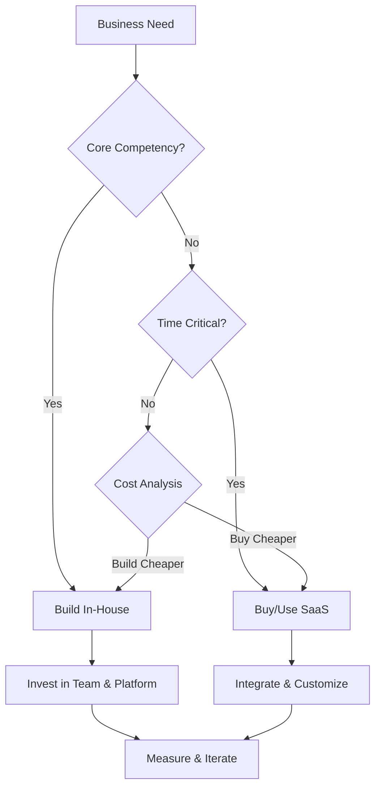
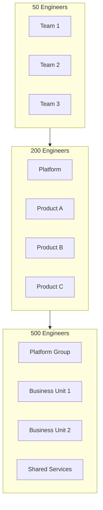

# CTO Round — Complete Interview Preparation Guide

---

## Table of Contents

1. [Introduction](#1-introduction)
2. [Learning Roadmap](#2-learning-roadmap)
3. [Theory Notes](#3-theory-notes)
4. [Key Concepts](#4-key-concepts)
5. [Interview Questions & Answers](#5-interview-questions--answers)
6. [Hands-on Practice](#6-hands-on-practice)
7. [FAANG Interview Questions](#7-faang-interview-questions)
8. [Common Mistakes to Avoid](#8-common-mistakes-to-avoid)
9. [Best Practices](#9-best-practices)
10. [Cheat Sheet](#10-cheat-sheet)
11. [Flash Cards](#11-flash-cards)
12. [Mind Map](#12-mind-map)
13. [Mermaid Diagrams](#13-mermaid-diagrams)
14. [Code Examples](#14-code-examples)
15. [Projects & Ideas](#15-projects--ideas)
16. [Resources](#16-resources)
17. [Interview Preparation Checklist](#17-interview-preparation-checklist)
18. [Revision Notes](#18-revision-notes)
19. [Mock Interview Questions](#19-mock-interview-questions)
20. [Difficulty Rating](#20-difficulty-rating)
21. [Summary](#21-summary)

---

## 1. Introduction

The CTO (Chief Technology Officer) Round is a senior-level interview that assesses technical leadership, strategic thinking, architectural decision-making, and business alignment. Unlike coding interviews, this round evaluates your ability to make high-level technical decisions, build engineering teams, and align technology with business goals.

### Why the CTO Round Matters

- **Strategic alignment** — Technology decisions must support business
- **Leadership assessment** — Can you lead technical teams?
- **Architecture decisions** — System design at scale
- **Technical vision** — Long-term technology roadmap
- **Business understanding** — Technology serves business needs

### What CTOs Evaluate

| Area | Focus |
|------|-------|
| Technical Vision | Long-term architecture decisions |
| Leadership | Team building, mentoring, culture |
| Business Acumen | Revenue impact, cost optimization |
| Communication | Explaining tech to non-tech stakeholders |
| Risk Management | Balancing innovation and stability |
| Execution | Delivering results, not just planning |

---

## 2. Learning Roadmap

### Phase 1: Strategic Thinking (Weeks 1-2)
- Study technical strategy frameworks
- Understand business model alignment
- Learn about technical debt management
- Study engineering metrics (DORA)

### Phase 2: Architecture & Scale (Weeks 3-4)
- Review system design patterns
- Study distributed systems trade-offs
- Learn about platform engineering
- Understand build vs. buy decisions

### Phase 3: Leadership (Weeks 5-6)
- Study engineering management principles
- Learn about team structure (Conway's Law)
- Understand hiring and culture
- Study conflict resolution

### Phase 4: Business & Communication (Weeks 7-8)
- Learn to translate tech to business impact
- Study stakeholder management
- Understand budgeting and ROI
- Practice executive communication

---

## 3. Theory Notes

### 3.1 Technical Strategy Frameworks

**Technology Adoption Lifecycle:**
- Innovators → Early Adopters → Early Majority → Late Majority → Laggards
- Match technology choices to your organization's position

**Build vs. Buy Decision Matrix:**
| Factor | Build | Buy |
|--------|-------|-----|
| Core competency | Yes | No |
| Competitive advantage | High | Low |
| Time to market | Longer | Faster |
| Customization | Full | Limited |
| Maintenance | Your team | Vendor |

### 3.2 Engineering Metrics (DORA)

| Metric | Elite | High | Medium | Low |
|--------|-------|------|--------|-----|
| Deployment frequency | On demand | Daily-weekly | Monthly | <6 months |
| Lead time | <1 hour | 1 day-1 week | 1 month-6 months | 6+ months |
| Change failure rate | 0-15% | 16-30% | 16-30% | >30% |
| Recovery time | <1 hour | <1 day | 1 week-1 month | 6+ months |

### 3.3 Conway's Law

"Organizations which design systems are constrained to produce systems which are copies of the communication structures of these organizations."

**Implications:**
- Team structure influences architecture
- Align teams with desired system boundaries
- Microservices → small, autonomous teams

### 3.4 Technical Debt Management

**Types:**
- **Design debt** — Architectural shortcuts
- **Code debt** — Quick fixes, workarounds
- **Testing debt** — Missing or inadequate tests
- **Documentation debt** — Undocumented systems
- **Infrastructure debt** — Outdated dependencies

**Management Framework:**
1. Identify and catalog debt items
2. Estimate impact (velocity, stability, cost)
3. Prioritize by business impact
4. Allocate capacity (20% rule)
5. Prevent new debt (standards, reviews)
6. Track metrics over time

---

## 4. Key Concepts

### 4.1 Architecture Decision Records (ADRs)

Lightweight documents capturing important architectural decisions:

```markdown
# ADR: Use Event-Driven Architecture for Notifications

## Status: Accepted
## Date: 2024-01-15

## Context
Our notification system is synchronous, causing cascading failures.

## Decision
We will adopt event-driven architecture using SQS/SNS.

## Consequences
+ Decoupled services
+ Better fault tolerance
- Increased complexity
- Eventually consistent
```

### 4.2 Platform Engineering

**Internal Developer Platforms (IDP):**
- Self-service infrastructure
- Golden paths (opinionated workflows)
- Developer experience (DX) focus
- Reduce cognitive load on developers

**Key Components:**
- CI/CD pipelines
- Service templates
- Monitoring dashboards
- Documentation portals

### 4.3 Engineering Culture

**Google's Project Aristotle Findings:**
1. Psychological safety
2. Dependability
3. Structure and clarity
4. Meaning
5. Impact

### 4.4 Stakeholder Management

**RACI Matrix:**
| Role | Responsible | Accountable | Consulted | Informed |
|------|-------------|-------------|-----------|----------|
| CTO | Set strategy | Final say | Board, CEO | Team |
| VP Eng | Execute | Delivery | CTO, PM | Team |
| PM | Requirements | Product | Users, Eng | Stakeholders |
| Tech Lead | Design | Quality | Team, VP | PM |

---

## 5. Interview Questions & Answers

### Technical Strategy

**Q1: How do you decide between building in-house vs. using a third-party service?**
**A:** Framework: (1) **Core competency** — If it's your competitive advantage, build; otherwise consider buying, (2) **Time to market** — If speed matters more than control, buy, (3) **Cost analysis** — Compare build cost vs. ongoing license + maintenance, (4) **Customization needs** — High customization = build; standard needs = buy, (5) **Vendor risk** — Lock-in, pricing changes, quality, (6) **Team capability** — Do you have expertise to build/maintain? Example: Auth (buy Auth0) vs. core algorithm (build). Always start with buy; build only when buy doesn't meet needs.

**Q2: How do you manage technical debt in a fast-growing startup?**
**A:** (1) **Track debt** — Maintain a technical debt register with items, impact, and estimated effort, (2) **20% rule** — Allocate ~20% of sprint capacity to debt reduction, (3) **Opportunistic refactoring** — Refactor when touching code for features, (4) **Business framing** — Present debt as risk: "This will take 3x longer to modify next quarter", (5) **Quality gates** — Prevent new debt through standards, linters, code review, (6) **Prioritize** — Address debt that most impacts velocity or stability, (7) **Make it visible** — Include debt metrics in sprint reports, (8) **Prevention** — Address root causes (unclear requirements, time pressure).

**Q3: Describe your approach to building an engineering team.**
**A:** (1) **Hiring bar** — Define clear competencies; hire for potential and culture fit, not just skills, (2) **Diversity** — Build diverse teams for better decision-making, (3) **Structure** — Align teams with system boundaries (Conway's Law), (4) **Culture** — Psychological safety, blameless postmortems, continuous learning, (5) **Growth** — Career ladders, mentorship, learning budget, (6) **Autonomy** — Small, empowered teams with clear ownership, (7) **Process** — Lightweight processes that enable, not hinder, (8) **Retention** — Competitive comp, meaningful work, work-life balance.

**Q4: How do you prioritize between technical excellence and shipping fast?**
**A:** Context-dependent: (1) **Early stage** — Speed over perfection; 80% quality is fine; technical debt is acceptable investment, (2) **Growth stage** — Balance; pay down critical debt; establish quality gates, (3) **Scale** — Technical excellence matters more; reliability is revenue, (4) **Product-market fit** — Ship fast to validate; optimize later, (5) **Regulated industries** — Compliance requires quality from day one. Always: Don't sacrifice security or data integrity for speed. Communicate trade-offs to business stakeholders.

**Q5: How do you approach a build vs. buy decision for a critical system?**
**A:** Decision framework: (1) **Strategic importance** — Is this a core differentiator? Build. (2) **Time to market** — Can we afford 6 months? (3) **Total cost of ownership** — 3-year TCO comparison (build + maintain vs. license + customize), (4) **Vendor assessment** — Financial stability, roadmap alignment, support quality, (5) **Exit strategy** — How hard to switch if vendor fails? (6) **Team readiness** — Do we have skills to build and maintain? (7) **Pilot** — Start with buy for non-critical; build competency before core systems.

### Architecture

**Q6: How would you design a system to handle 10x growth?**
**A:** (1) **Horizontal scaling** — Design for scale-out, not scale-up; stateless services, (2) **Database strategy** — Read replicas, sharding when needed, caching layer, (3) **CDN** — Cache static assets at edge, (4) **Async processing** — Queue non-critical operations, (5) **Microservices** — Decouple for independent scaling, (6) **Auto-scaling** — Let infrastructure scale with demand, (7) **Monitoring** — Know your bottlenecks before they hit, (8) **Load testing** — Validate capacity before growth, (9) **Cost planning** — Understand cost implications of 10x, (10) **Phased approach** — Don't over-engineer; scale what's actually growing.

**Q7: How do you make build vs. buy decisions at scale?**
**A:** At scale: (1) **Platform teams** — Build internal platforms that standardize and accelerate development, (2) **Paved roads** — Opinionated paths that make the right thing easy, (3) **Self-service** — Developers consume infrastructure without tickets, (4) **Abstraction layers** — Abstract cloud providers to avoid lock-in, (5) **Shared services** — Auth, logging, monitoring as shared platforms, (6) **Component architecture** — Clear boundaries between custom and third-party, (7) **Continuous evaluation** — Regularly reassess as needs evolve and market changes.

### Leadership

**Q8: How do you handle disagreement between engineering and product?**
**A:** (1) **Shared goals** — Both teams aligned on business outcomes, (2) **Data-driven** — Use metrics and evidence, not opinions, (3) **Trade-off framing** — "We can do X by sacrificing Y; which matters more?", (4) **Time-boxed experiments** — "Let's try the product way for 2 weeks; if metrics suffer, we revisit", (5) **Escalation path** — When stuck, escalate with clear context, (6) **Relationship building** — Invest in cross-functional relationships before conflicts arise, (7) **No-blame culture** — Focus on outcomes, not who was right.

**Q9: How do you introduce a new technology or practice to the organization?**
**A:** (1) **Start small** — Find a willing team for pilot, (2) **Prove value** — Demonstrate concrete benefits (faster development, fewer bugs), (3) **Document** — Create clear guides, templates, and examples, (4) **Champion** — Identify early adopters as advocates, (5) **Training** — Invest in team education, (6) **Gradual rollout** — Expand team by team, (7) **Measure** — Track adoption and impact metrics, (8) **Adjust** — Adapt approach based on feedback, (9) **Communicate** — Share successes and learnings, (10) **Commit** — Once proven, commit fully (don't go back).

---

## 6. Hands-on Practice

### Practice 1: Architecture Decision Record

```markdown
# ADR: Adopt Microservices Architecture

## Status: Proposed
## Date: 2024-01-15

## Context
Our monolith is becoming difficult to maintain and scale.
Team velocity has decreased 40% over 6 months.
Deployment frequency is once per month (was weekly).

## Decision
We will decompose the monolith into domain-aligned microservices.

## Options Considered
1. Continue with monolith + improve modularity
2. Microservices architecture
3. Modular monolith

## Decision Rationale
- Team size growing; microservices enable independent deployment
- Different components have different scaling needs
- Need to improve deployment frequency for competitive advantage

## Consequences
### Positive
+ Independent deployment and scaling
+ Team autonomy and ownership
+ Technology flexibility per service

### Negative
- Increased operational complexity
- Distributed system challenges
- Need for service mesh and observability

### Mitigations
- Start with 3-4 services (not 20)
- Invest in platform engineering
- Standardize on observability stack

## Review Date: 2024-06-15
```

### Practice 2: Engineering Metrics Dashboard

```python
from dataclasses import dataclass
from typing import List


@dataclass
class DORAMetrics:
    """Calculate DORA metrics for engineering teams."""
    
    deployment_frequency: float  # deploys per day
    lead_time_days: float        # days from commit to deploy
    change_failure_rate: float   # percentage of deployments causing failure
    recovery_time_hours: float   # hours to recover from failure
    
    def get_performance_level(self) -> str:
        """Determine performance level based on DORA metrics."""
        df_level = self._rate_deployment_frequency()
        lt_level = self._rate_lead_time()
        cfr_level = self._rate_change_failure_rate()
        rt_level = self._rate_recovery_time()
        
        levels = [df_level, lt_level, cfr_level, rt_level]
        
        if all(l == "Elite" for l in levels):
            return "Elite"
        elif levels.count("Elite") + levels.count("High") >= 3:
            return "High"
        elif any(l == "Low" for l in levels):
            return "Low"
        else:
            return "Medium"
    
    def _rate_deployment_frequency(self) -> str:
        if self.deployment_frequency >= 1:
            return "Elite"
        elif self.deployment_frequency >= 0.1:
            return "High"
        elif self.deployment_frequency >= 0.01:
            return "Medium"
        return "Low"
    
    def _rate_lead_time(self) -> str:
        if self.lead_time_days <= 0.04:  # <1 hour
            return "Elite"
        elif self.lead_time_days <= 7:
            return "High"
        elif self.lead_time_days <= 30:
            return "Medium"
        return "Low"
    
    def _rate_change_failure_rate(self) -> str:
        if self.change_failure_rate <= 15:
            return "Elite"
        elif self.change_failure_rate <= 30:
            return "High"
        return "Low"
    
    def _rate_recovery_time(self) -> str:
        if self.recovery_time_hours <= 1:
            return "Elite"
        elif self.recovery_time_hours <= 24:
            return "High"
        elif self.recovery_time_hours <= 168:  # 1 week
            return "Medium"
        return "Low"


# Example usage
metrics = DORAMetrics(
    deployment_frequency=2.0,
    lead_time_days=0.5,
    change_failure_rate=10,
    recovery_time_hours=0.5
)

print(f"Performance Level: {metrics.get_performance_level()}")
print(f"Deployment Frequency: {metrics._rate_deployment_frequency()}")
print(f"Lead Time: {metrics._rate_lead_time()}")
```

---

## 7. FAANG Interview Questions

### Google

**Q: How would you scale an engineering organization from 50 to 500 engineers?**
**A:** (1) **Structure** — Move from functional to product-aligned teams; introduce staff/principal engineer roles, (2) **Architecture** — Shift from monolith to service-oriented; establish platform teams, (3) **Process** — Implement lightweight processes; don't over-process, (4) **Culture** — Invest in culture before scaling; document values and practices, (5) **Hiring** — Build hiring pipeline; define clear levels and competencies, (6) **Tooling** — Invest in developer productivity tools; internal platforms, (7) **Communication** — Establish clear communication patterns (RFCs, ADRs, tech talks), (8) **Knowledge** — Prevent knowledge silos through documentation and rotation.

### Amazon

**Q: How do you balance technical debt with feature development in a large organization?**
**A:** (1) **Transparency** — Make debt visible; include in sprint planning and roadmaps, (2) **Quantify impact** — Track velocity trends; correlate with debt items, (3) **Allocation model** — Fixed percentage (15-25%) per team; adjustable based on context, (4) **Strategic debt** — Sometimes intentional debt is correct (speed to market); document and plan payoff, (5) **Quality gates** — Prevent new debt through automation (linting, testing, review), (6) **Team ownership** — Teams own their debt; incentivize reduction, (7) **Architecture reviews** — Regular reviews to identify systemic debt, (8) **Business context** — Frame debt reduction as velocity investment.

---

## 8. Common Mistakes to Avoid

| Mistake | Problem | Solution |
|---------|---------|----------|
| Over-engineering early | Wasted resources on unused features | Build for current needs; design for extension |
| Under-investing in platform | Developer productivity suffers | Invest 15-20% in platform engineering |
| Ignoring team culture | High turnover, low morale | Prioritize psychological safety and growth |
| Perfect being enemy of good | Never ships | Embrace "good enough" with iteration plan |
| Not measuring | Can't improve what you don't measure | Track DORA metrics and team health |
| Technology for technology's sake | Solutions without problems | Start with business needs, not tech trends |

---

## 9. Best Practices

1. **Align with business** — Technology serves business goals
2. **Measure everything** — DORA metrics, team health, costs
3. **Invest in people** — Hiring, growth, culture
4. **Balance speed and quality** — Context-dependent trade-offs
5. **Document decisions** — ADRs for architectural choices
6. **Build platforms** — Reduce cognitive load on developers
7. **Communicate clearly** — Tech to business, business to tech
8. **Learn continuously** — Stay current, experiment, share knowledge

---

## 10. Cheat Sheet

```
CTO ROUND CHEAT SHEET
══════════════════════

DORA METRICS
────────────
Deployment Frequency: How often you deploy
Lead Time: Commit to production time
Change Failure Rate: % of deployments causing failures
Recovery Time: Time to recover from failure

BUILD vs BUY
────────────
Build: Core competency, high customization, competitive advantage
Buy: Non-core, fast time-to-market, standard needs

TEAM STRUCTURE
──────────────
Small teams (5-9) aligned with system boundaries
Conway's Law: Organization structure → System architecture

TECHNICAL DEBT
──────────────
Track → Prioritize → Allocate capacity → Prevent new
20% rule: Allocate 20% of sprint to debt reduction

ADRS
────
Status → Context → Decision → Consequences → Review

STAKEHOLDER MANAGEMENT
──────────────────────
RACI: Responsible, Accountable, Consulted, Informed
Communicate trade-offs, not just decisions
```

---

## 11. Flash Cards

**Card 1:** What is Conway's Law?
→ Organizations design systems that mirror their communication structures.

**Card 2:** What are DORA metrics?
→ Deployment frequency, lead time, change failure rate, recovery time.

**Card 3:** What is the 20% rule for technical debt?
→ Allocate ~20% of sprint capacity to reducing technical debt.

**Card 4:** What is an ADR?
→ Architecture Decision Record; documents important technical decisions.

**Card 5:** What is platform engineering?
→ Building internal developer platforms to reduce cognitive load.

**Card 6:** What is the build vs. buy framework?
→ Consider core competency, time-to-market, cost, customization, and vendor risk.

**Card 7:** What is psychological safety?
→ Team members feel safe to take risks and speak up without fear.

**Card 8:** What is the Pareto principle in engineering?
→ 80% of value comes from 20% of effort; focus on high-impact work.

**Card 9:** What is technical strategy?
→ Long-term plan for technology decisions aligned with business goals.

**Card 10:** What is engineering velocity?
→ Rate at which a team delivers value; measured by story points or features.

---

## 12. Mind Map

```
CTO Round
│
├─── Technical Strategy
│    ├─── Build vs Buy
│    ├─── Technology Adoption
│    ├─── Architecture Vision
│    └─── Technical Debt
│
├─── Architecture
│    ├─── System Design
│    ├─── Scalability
│    ├─── Reliability
│    └─── Platform Engineering
│
├─── Leadership
│    ├─── Team Building
│    ├─── Culture
│    ├─── Career Growth
│    └─── Conflict Resolution
│
├─── Business
│    ├─── ROI Analysis
│    ├─── Cost Optimization
│    ├─── Stakeholder Management
│    └─── Risk Management
│
└─── Execution
     ├─── Delivery
     ├─── Metrics (DORA)
     ├─── Process
     └─── Communication
```

---

## 13. Mermaid Diagrams

### CTO Decision Framework



### Team Scaling Model



---

## 14. Code Examples

See Hands-on Practice section for DORA metrics calculation.

---

## 15. Projects & Ideas

| # | Project | Description | Difficulty | Tools |
|---|---------|-------------|------------|-------|
| 1 | ADR Template | Create ADR template and process | ⭐⭐ | Markdown |
| 2 | Metrics Dashboard | Build DORA metrics dashboard | ⭐⭐⭐ | Python, Grafana |
| 3 | Tech Debt Tracker | Tool for tracking technical debt | ⭐⭐⭐ | Web app |
| 4 | Platform MVP | Internal developer platform | ⭐⭐⭐⭐⭐ | Kubernetes, Backstage |
| 5 | Architecture Review | Create review process | ⭐⭐⭐ | Process, templates |

---

## 16. Resources

### Books
- **"An Elegant Puzzle"** by Will Larson
- **"Staff Engineer"** by Will Larson
- **"The Manager's Path"** by Camille Fournier
- **"Accelerate"** by Forsgren, Humble, Kim

### Frameworks
- **DORA Metrics** — Engineering effectiveness
- **OKR** — Goal setting
- **RACI** — Stakeholder management
- **ADRs** — Decision documentation

---

## 17. Interview Preparation Checklist

### Strategic Thinking
- [ ] Articulate technical strategy aligned with business
- [ ] Explain build vs. buy decision framework
- [ ] Discuss technical debt management approach
- [ ] Understand engineering metrics (DORA)

### Architecture
- [ ] Design scalable systems
- [ ] Explain architecture trade-offs
- [ ] Discuss platform engineering approach
- [ ] Understand Conway's Law implications

### Leadership
- [ ] Describe team building philosophy
- [ ] Explain culture and values
- [ ] Discuss conflict resolution approach
- [ ] Articulate hiring philosophy

### Business
- [ ] Translate tech to business impact
- [ ] Discuss ROI and cost optimization
- [ ] Explain stakeholder management
- [ ] Understand risk management

---

## 18. Revision Notes

### Key Frameworks

**DORA Metrics:** Deployment frequency, lead time, change failure rate, recovery time
**Build vs. Buy:** Core competency, time-to-market, cost, customization, vendor risk
**Conway's Law:** Team structure influences architecture
**ADRs:** Document architectural decisions with context and consequences

### Interview Flow

1. Understand the business context and constraints
2. Discuss trade-offs and alternatives
3. Make a recommendation with clear rationale
4. Address risks and mitigation strategies
5. Show awareness of team and execution implications

---

## 19. Mock Interview Questions

**Q1:** Our startup needs to decide between building a custom CMS vs. using WordPress. How do you approach this?

**Q2:** We're experiencing 50% engineer turnover. What would you do?

**Q3:** How would you explain to the board why we need to spend 6 months on platform engineering?

**Q4:** We need to scale from 10 to 100 engineers in 12 months. What's your plan?

**Q5:** How do you decide which technical debt to pay down first?

**Q6:** Describe your ideal engineering culture.

**Q7:** How do you handle a situation where product wants to ship faster than engineering thinks is safe?

**Q8:** What metrics would you use to measure engineering effectiveness?

---

## 20. Difficulty Rating

| Topic | Difficulty | Time to Master | Priority |
|-------|-----------|----------------|----------|
| Technical Strategy | ⭐⭐⭐⭐ | 3-4 weeks | High |
| Architecture Decisions | ⭐⭐⭐⭐ | 3-4 weeks | High |
| Leadership | ⭐⭐⭐⭐ | Ongoing | High |
| Business Acumen | ⭐⭐⭐ | 2-3 weeks | High |
| Communication | ⭐⭐⭐ | 2-3 weeks | High |
| Metrics & Measurement | ⭐⭐ | 1-2 weeks | Medium |

**Overall Interview Difficulty:** ⭐⭐⭐⭐⭐ (High)

---

## 21. Summary

The CTO Round assesses technical leadership, strategic thinking, and business alignment. Success requires demonstrating ability to make high-level architectural decisions, build effective teams, manage technical debt, and communicate technical concepts to business stakeholders. The round evaluates not just what you know, but how you think about problems at scale.

### Key Takeaways

1. **Align with business** — Technology serves business goals
2. **Think strategically** — Long-term vision, not just tactical solutions
3. **Balance trade-offs** — Speed vs. quality, build vs. buy
4. **Invest in people** — Team building and culture matter
5. **Measure what matters** — DORA metrics and team health
6. **Communicate clearly** — Translate tech to business impact
7. **Make decisions** — Document with ADRs; commit and iterate
8. **Stay current** — Technology evolves; so should you

---

> **Pro Tip:** CTO interviews test strategic thinking, not coding. Be able to discuss business implications of technical decisions, explain trade-offs clearly, and demonstrate leadership through examples. Show that you can think beyond code to business impact.