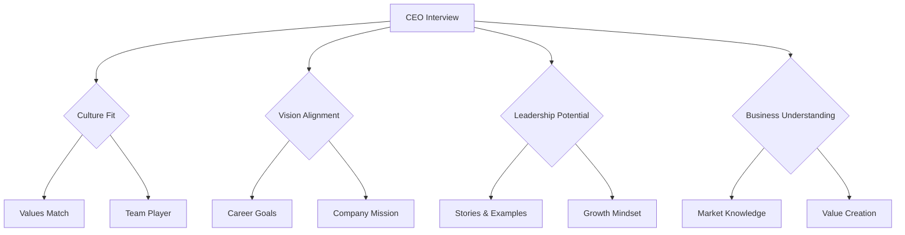
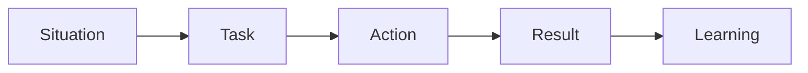
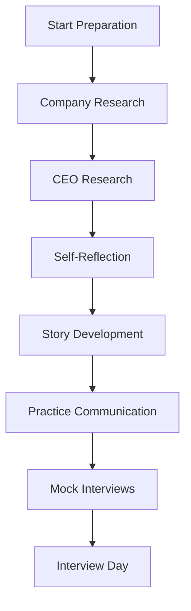

# CEO Round — Complete Interview Preparation Guide

---

## Table of Contents

1. [Introduction](#1-introduction)
2. [Learning Roadmap](#2-learning-roadmap)
3. [Theory Notes](#3-theory-notes)
4. [Key Concepts](#4-key-concepts)
5. [Interview Questions & Answers](#5-interview-questions--answers)
6. [Hands-on Practice](#6-hands-on-practice)
7. [FAANG Interview Questions](#7-faang-interview-questions)
8. [Common Mistakes to Avoid](#8-common-mistakes-to-avoid)
9. [Best Practices](#9-best-practices)
10. [Cheat Sheet](#10-cheat-sheet)
11. [Flash Cards](#11-flash-cards)
12. [Mind Map](#12-mind-map)
13. [Mermaid Diagrams](#13-mermaid-diagrams)
14. [Code Examples](#14-code-examples)
15. [Projects & Ideas](#15-projects--ideas)
16. [Resources](#16-resources)
17. [Interview Preparation Checklist](#17-interview-preparation-checklist)
18. [Revision Notes](#18-revision-notes)
19. [Mock Interview Questions](#19-mock-interview-questions)
20. [Difficulty Rating](#20-difficulty-rating)
21. [Summary](#21-summary)

---

## 1. Introduction

The CEO Round is the final interview stage where you meet with the company's top executive. This round assesses cultural fit, vision alignment, leadership potential, and business understanding. Unlike technical rounds, the CEO wants to understand who you are, how you think, and whether you'll thrive in the organization.

### Why the CEO Round Matters

- **Final decision maker** — CEO often has final hiring authority
- **Culture assessment** — Do you fit the company culture?
- **Vision alignment** — Are you excited about the mission?
- **Leadership potential** — Can you grow into leadership roles?
- **Business understanding** — Do you understand the business?

### What CEOs Evaluate

| Area | Focus |
|------|-------|
| Cultural Fit | Values alignment, team player |
| Vision | Alignment with company mission |
| Passion | Genuine interest in the problem space |
| Leadership | Potential to lead and influence |
| Business Acumen | Understanding of market and competition |
| Growth Mindset | Willingness to learn and adapt |

---

## 2. Learning Roadmap

### Phase 1: Company Research (Weeks 1-2)
- Study company mission, values, culture
- Understand products, customers, competitors
- Learn about recent news, funding, growth
- Research CEO's background and priorities

### Phase 2: Self-Reflection (Week 3)
- Clarify your career goals and motivations
- Prepare your story and unique value proposition
- Identify your strengths and growth areas
- Articulate why this company, why now

### Phase 3: Business Understanding (Week 4)
- Study the industry and market trends
- Understand business model and unit economics
- Learn about competitive landscape
- Prepare thoughtful questions for CEO

### Phase 4: Practice (Week 5)
- Practice storytelling and communication
- Rehearse answers to behavioral questions
- Prepare questions that show genuine interest
- Practice handling curveball questions

---

## 3. Theory Notes

### 3.1 CEO Interview Framework

**What CEOs Look For:**
1. **Mission alignment** — Do you believe in what we're doing?
2. **Values match** — Do your values align with ours?
3. **Growth potential** — Can you grow with the company?
4. **Cultural add** — What unique perspective do you bring?
5. **Leadership signal** — Can you lead without authority?

### 3.2 STAR Method for Behavioral Questions

- **Situation** — Set the context
- **Task** — Describe your responsibility
- **Action** — Explain what you did
- **Result** — Share the outcome and learnings

### 3.3 Company Research Framework

**The 5 Cs:**
1. **Company** — Mission, values, products, culture
2. **Customers** — Who they serve, pain points, value proposition
3. **Competitors** — Market position, differentiation
4. **Context** — Industry trends, market dynamics
5. **CEO** — Background, priorities, leadership style

### 3.4 Career Motivation Framework

**Why This Company:**
- Mission alignment
- Product/service interest
- Growth opportunity
- Team/culture
- Technical challenges

**Why This Role:**
- Skills match
- Impact opportunity
- Learning potential
- Career progression

**Why Now:**
- Career timing
- Company stage
- Market opportunity
- Personal circumstances

---

## 4. Key Concepts

### 4.1 Cultural Fit Assessment

**Values to Articulate:**
- Ownership and accountability
- Customer obsession
- Bias for action
- Learn and be curious
- Hire and develop the best
- Insist on highest standards

### 4.2 Storytelling Framework

**The Hero's Journey (Simplified):**
1. **Challenge** — What was the situation/problem?
2. **Action** — What did you specifically do?
3. **Result** — What was the measurable outcome?
4. **Learning** — What did you learn? How did you grow?

### 4.3 Question Strategy

**Questions That Show:**
- **Research** — "I saw your recent Series B; how will you use the funding?"
- **Thinking** — "How do you see AI impacting your industry in 5 years?"
- **Growth** — "What does success look like in this role at 12 months?"
- **Culture** — "What's the one thing you'd change about the company?"
- **Impact** — "How does this role directly contribute to company goals?"

### 4.4 Executive Communication

**Principles:**
- Be concise; respect their time
- Lead with the conclusion
- Use data and examples
- Show business understanding
- Demonstrate strategic thinking

---

## 5. Interview Questions & Answers

### Culture & Values

**Q1: Why do you want to work here?**
**A:** Structure: Mission + Product + Growth + You. Example: "I'm drawn to [Company] because your mission to [specific mission] resonates with my passion for [relevant area]. Your product [product name] solves a real problem for [customer type], and I've seen how [specific evidence]. I'm excited about the growth stage you're in — [specific growth metrics]. My experience in [relevant skill] positions me to contribute to [specific goal]. This feels like the intersection of what I'm good at, what I enjoy, and where I can make an impact."

**Q2: What's your biggest weakness?**
**A:** Be genuine and show self-awareness. Example: "I used to struggle with delegation — I'd take on too much myself because I wanted to ensure quality. I've learned to trust my team by: (1) Starting with lower-risk tasks, (2) Providing clear context and expectations, (3) Accepting that 'good enough' is often better than 'perfect' and 'late'. Now I focus on enabling others rather than doing everything myself. It's made me a better leader and freed me to focus on higher-impact work."

**Q3: Tell me about a time you failed.**
**A:** Use STAR with genuine failure. Example: "At [Company], I led a project to launch [feature] in 6 weeks. We shipped on time, but user adoption was 30% below target. I had focused on technical execution but didn't involve customers early enough in validation. The learning: I now advocate for customer discovery before building. On my next project, I ran weekly user interviews during development, resulting in 85% adoption at launch. Failure taught me that building the right thing is more important than building things right."

**Q4: How do you handle conflict with a colleague?**
**A:** "I approach conflict with curiosity, not confrontation. First, I seek to understand their perspective — usually there's a legitimate reason behind their position. I'll say something like: 'Help me understand your thinking on this.' Once I understand, I share my perspective with data, not opinions. If we still disagree, I look for a shared goal we can both agree on and work backwards from there. If needed, I'll escalate with context, not complaints. The goal isn't to 'win' — it's to find the best outcome for the company."

### Vision & Strategy

**Q5: Where do you see yourself in 5 years?**
**A:** "In 5 years, I want to be leading a team that's building products that matter. I see myself growing from [current level] to [target level], taking on more strategic responsibility while staying close to the technology. I want to be someone who develops other leaders, not just ships code. [Company] is the right place for this because [specific growth opportunities]. I'm not looking for a job — I'm looking for a place where I can build a career and make a lasting impact."

**Q6: What question would you ask our customers about our product?**
**A:** "I'd ask: 'What's the one thing you'd be lost without, and what's one thing you wish existed but doesn't?' This reveals both the core value proposition and unmet needs. It helps identify what to protect and where to innovate. I'd also ask: 'What almost made you not use our product?' to understand friction and competitive alternatives."

**Q7: How do you stay current with technology trends?**
**A:** "I'm intentional about learning: (1) Weekly: Read engineering blogs (Netflix, Uber, Airbnb), follow key thought leaders, (2) Monthly: Attend meetups or webinars, experiment with new tools, (3) Quarterly: Take a deep-dive course on an emerging area, (4) Annually: Attend a conference. But I'm selective — I focus on trends relevant to our space, not every shiny new thing. I ask: 'Will this matter in 2 years?' before investing time."

### Leadership

**Q8: Describe your leadership style.**
**A:** "I lead through empowerment and context. I believe people do their best work when they understand the 'why' behind what they're building and have autonomy in how they build it. I set clear goals and expectations, then get out of the way. I'm available for guidance but don't micromanage. I focus on removing obstacles, not creating them. When things go wrong, I take responsibility; when things go right, I give credit to the team. I'm also direct — I'd rather have an uncomfortable conversation now than let issues fester."

**Q9: How do you prioritize when everything feels urgent?**
**A:** "I use a simple framework: (1) **Impact** — What moves the needle most? (2) **Urgency** — What has a real deadline vs. perceived urgency? (3) **Effort** — Quick wins vs. long projects. I communicate trade-offs clearly: 'We can do A and B this week, or A, B, and C in two weeks — which matters more?' Most things feel urgent because of poor communication, not actual deadlines. I also push back on artificial urgency — 'Is this really due Friday, or would next Wednesday be fine?'"

**Q10: Tell me about a time you had to influence without authority.**
**A:** "At [Company], I noticed our onboarding flow had a 40% drop-off rate. No one owned this cross-functionally. I: (1) Built a data-driven case showing the revenue impact, (2) Shared findings with product, design, and engineering leads, (3) Proposed a small working group to tackle it, (4) Got alignment from each team's priorities. Within 3 months, we reduced drop-off to 15%, adding $2M in annual revenue. I learned that influence comes from data, empathy, and making others successful — not from title or authority."

---

## 6. Hands-on Practice

### Practice 1: Company Research Template

```markdown
# Company Research: [Company Name]

## Mission & Values
- Mission: [What they do]
- Values: [Core values from website]
- My alignment: [How my values match]

## Products & Customers
- Core product: [Description]
- Target customers: [Who]
- Value proposition: [Why customers choose them]
- Key metrics: [Growth, revenue if known]

## Market & Competition
- Industry: [Market]
- Market size: [TAM/SAM if known]
- Key competitors: [List]
- Differentiation: [What makes them unique]

## Recent News
- Funding: [Latest round, valuation]
- Product launches: [Recent releases]
- Partnerships: [Key partnerships]
- Leadership changes: [Notable hires]

## CEO Research
- Background: [Career history]
- Priorities: [What they talk about]
- Leadership style: [Public persona]
- Recent statements: [Interviews, talks]
```

### Practice 2: STAR Story Bank

```python
from dataclasses import dataclass
from typing import List, Optional


@dataclass
class STARStory:
    """STAR method story for behavioral interviews."""
    
    title: str
    situation: str
    task: str
    action: str
    result: str
    learning: str
    skills_demonstrated: List[str]
    
    def to_answer(self, question_context: str = "") -> str:
        """Format as a concise interview answer."""
        return f"""
Situation: {self.situation}
Task: {self.task}
Action: {self.action}
Result: {self.result}
Learning: {self.learning}
"""


# Example story bank
stories = [
    STARStory(
        title="Led Failed Project Recovery",
        situation="Our team was 3 weeks behind on a critical product launch with 50+ stakeholders waiting.",
        task="As tech lead, I needed to get the project back on track without burning out the team.",
        action="""I immediately: (1) Assessed what was actually done vs. what was left, (2) Identified 3 features that could be cut without impacting core value, (3) Reallocated 2 engineers from lower-priority work, (4) Set up daily standups focused only on blockers, (5) Communicated transparently with stakeholders about revised timeline.""",
        result="We launched 5 days late (not 3 weeks) with 95% of planned features. Stakeholder satisfaction actually increased because of transparent communication.",
        learning="Transparent communication builds trust even when delivering bad news. Also learned to negotiate scope before deadlines.",
        skills_demonstrated=["Leadership", "Communication", "Project Management", "Stakeholder Management"]
    ),
    STARStory(
        title="Implemented Automated Testing",
        situation="Our codebase had 20% test coverage and we were shipping 3-4 critical bugs per release.",
        task="I was tasked with improving quality without slowing down the team.",
        action="""I: (1) Analyzed which bugs caused most customer impact, (2) Added tests for critical paths first (not 100% coverage), (3) Set up CI/CD to run tests on every PR, (4) Created test templates and pair-programmed with team members, (5) Celebrated improvements publicly.""",
        result="Critical bugs dropped from 3-4 per release to 0-1. Test coverage went to 65% (critical paths at 90%). Team velocity actually increased because we spent less time fixing bugs.",
        learning="Focus on high-impact areas, not comprehensive coverage. Automation and culture change work together.",
        skills_demonstrated=["Quality", "Technical Leadership", "Process Improvement", "Team Development"]
    ),
]


def prepare_for_question(question: str) -> str:
    """Find the best story for a given question."""
    keywords = question.lower().split()
    
    best_match = None
    best_score = 0
    
    for story in stories:
        score = sum(1 for skill in story.skills_demonstrated 
                   if any(kw in skill.lower() for kw in keywords))
        if score > best_score:
            best_score = score
            best_match = story
    
    if best_match:
        return f"Using story: {best_match.title}\n{best_match.to_answer()}"
    return "No matching story found. Prepare more stories."


# Example
print(prepare_for_question("Tell me about a time you showed leadership"))
```

---

## 7. FAANG Interview Questions

### Google

**Q: How would you explain cloud computing to a non-technical CEO?**
**A:** "Cloud computing is like renting instead of owning. Instead of buying servers (like buying a car), you rent computing power from Amazon or Google (like using Uber). You pay only for what you use, and you can scale up or down instantly. It's why startups can compete with big companies — they get the same infrastructure without millions in upfront investment. The result: faster innovation, lower costs, and the ability to focus on your customers instead of managing servers."

### Amazon

**Q: Why Amazon? Why not start your own company?**
**A:** "I'm drawn to Amazon's customer obsession and long-term thinking. The leadership principles aren't just posters — they're how decisions actually get made. I could start a company, but I'd rather learn from the best operators in the world first. At Amazon, I'd get to solve problems at a scale I couldn't tackle alone, while learning from leaders who've built from zero to massive. My goal is to build something impactful eventually, and Amazon is the best place to develop the skills and judgment to do that well."

### Meta

**Q: How do you think about building products for 3 billion users?**
**A:** "Building for 3 billion users requires: (1) **Simplicity** — Features must work across cultures, languages, and connectivity levels, (2) **Reliability** — Even 0.1% failure rate means 3 million affected users, (3) **Performance** — Optimize for low-end devices and slow networks, (4) **Local knowledge** — What works in the US may not work in India or Brazil, (5) **Infrastructure** — Systems must scale horizontally with no single points of failure, (6) **Privacy** — Different regions have different regulations and expectations, (7) **Feedback loops** — Instrument everything to understand user behavior at scale."

### Apple

**Q: How do you think about building products that delight users?**
**A:** "Delight comes from: (1) **Attention to detail** — The pixels, the animations, the micro-interactions, (2) **Simplicity** — Remove complexity until only the essential remains, (3) **Consistency** — Every interaction follows the same mental model, (4) **Performance** — Fast feels good, slow feels broken, (5) **Emotional design** — Products should make you feel something, (6) **Privacy by design** — Users should trust you with their data, (7) **Accessibility** — Everyone should be able to use it."

### Netflix

**Q: How do you approach building products that scale to millions of concurrent users?**
**A:** "Scaling requires: (1) **CDN strategy** — Content close to users, (2) **Microservices** — Independent scaling of components, (3) **Caching** — Multi-layer caching (CDN, application, database), (4) **Asynchronous processing** — Non-blocking operations where possible, (5) **Graceful degradation** — Degrade features under load rather than fail entirely, (6) **Chaos engineering** — Proactively test failure scenarios, (7) **Observability** — Full stack monitoring and alerting."

---

## 8. Common Mistakes to Avoid

| Mistake | Problem | Solution |
|---------|---------|----------|
| Not researching the company | Shows lack of interest | Study mission, products, CEO, news |
| Being generic | Doesn't differentiate you | Prepare specific, personalized answers |
| Badmouthing previous employers | Raises red flags | Focus on what you learned |
| Not having questions | Seems uninterested | Prepare thoughtful questions |
| Being too humble | Doesn't show value | Quantify achievements |
| Being arrogant | Alienates interviewer | Show confidence with humility |

---

## 9. Best Practices

1. **Research deeply** — Know the company better than other candidates
2. **Be authentic** — CEOs can spot fakeness instantly
3. **Tell stories** — Use STAR method with specific examples
4. **Show passion** — Genuine enthusiasm is compelling
5. **Ask great questions** — Shows you've thought deeply
6. **Be concise** — CEOs are busy; respect their time
7. **Show business understanding** — Connect your work to business outcomes
8. **Follow up** — Send a thoughtful thank-you note

---

## 10. Cheat Sheet

```
CEO ROUND CHEAT SHEET
══════════════════════

STAR METHOD
───────────
Situation: Set context
Task: Your responsibility
Action: What you did (specifically)
Result: Measurable outcome
Learning: What you learned

COMPANY RESEARCH (5 Cs)
────────────────────────
Company: Mission, values, products
Customers: Who, pain points, value
Competitors: Market position
Context: Industry trends
CEO: Background, priorities

QUESTIONS THAT IMPRESS
──────────────────────
"Where do you see the company in 3 years?"
"What's the biggest challenge facing the team?"
"How does this role impact company goals?"
"What would you do differently if starting over?"

BODY LANGUAGE
─────────────
Eye contact
Firm handshake
Confident posture
Active listening
Genuine smile
```

---

## 11. Flash Cards

**Card 1:** What is the STAR method?
→ Situation, Task, Action, Result — framework for behavioral interview answers.

**Card 2:** What do CEOs value most?
→ Cultural fit, growth potential, passion, business understanding.

**Card 3:** How should you answer "Why this company?"
→ Combine mission alignment + product interest + growth opportunity + your contribution.

**Card 4:** What makes a good interview question for the CEO?
→ Shows research, strategic thinking, genuine curiosity about the business.

**Card 5:** How do you handle "What's your biggest weakness?"
→ Be genuine, show self-awareness, demonstrate growth and learning.

**Card 6:** What is the Hero's Journey for interviews?
→ Challenge → Action → Result → Learning framework for storytelling.

**Card 7:** How do you prepare for a CEO interview?
→ Research company, prepare stories, practice communication, prepare questions.

**Card 8:** What is cultural add vs. cultural fit?
→ Cultural fit: matches existing culture. Cultural add: brings new perspectives.

**Card 9:** How do you show passion in an interview?
→ Specific examples, genuine enthusiasm, deep knowledge of the company.

**Card 10:** What should you avoid in a CEO interview?
→ Generic answers, badmouthing others, arrogance, lack of preparation.

**Card 11:** How do you answer "Tell me about yourself"?
→ 2-minute version: current role, key achievements, why you're here, where you're going.

**Card 12:** What questions should you ask a CEO?
→ Strategic questions about vision, challenges, culture, and growth.

**Card 13:** How do you handle curveball questions?
→ Take a breath, acknowledge the question, buy time with a clarifying question, answer honestly.

**Card 14:** What is your unique value proposition?
→ The intersection of your skills, experience, and passion that no other candidate brings.

**Card 15:** How do you show business understanding?
→ Connect your technical work to business metrics: revenue, cost, customer satisfaction, speed to market.

**Card 16:** How do you handle "Why should we hire you over other candidates?"
→ Focus on unique combination of skills + passion + cultural alignment, not just qualifications.

**Card 17:** What is the most important thing in a CEO interview?
→ Authenticity. CEOs have seen thousands of candidates. Be genuinely you.

**Card 18:** How do you prepare for behavioral questions?
→ Build a story bank of 10+ STAR stories covering leadership, conflict, failure, innovation, teamwork.

**Card 19:** How do you end a CEO interview strong?
→ Ask a thoughtful question, express genuine enthusiasm, summarize your fit briefly.

**Card 20:** What is the follow-up strategy after a CEO interview?
→ Send a personalized thank-you note within 24 hours, referencing specific conversation topics.

---

## 12. Mind Map

```
CEO Round
│
├─── Culture & Values
│    ├─── Mission Alignment
│    ├─── Values Match
│    ├─── Cultural Add
│    └─── Team Player
│
├─── Vision & Strategy
│    ├─── Career Goals
│    ├─── Company Vision
│    ├─── Industry Trends
│    └─── Growth Mindset
│
├─── Leadership
│    ├─── Style
│    ├─── Conflict Resolution
│    ├─── Decision Making
│    └─── Influence
│
├─── Business
│    ├─── Market Understanding
│    ├─── Competitive Landscape
│    ├─── Customer Focus
│    └─── Value Creation
│
└─── Communication
     ├─── Storytelling (STAR)
     ├─── Conciseness
     ├─── Body Language
     └─── Questions
```

---

## 13. Mermaid Diagrams

### CEO Interview Framework



### STAR Method Flow



### CEO Interview Preparation Flow



---

## 14. Code Examples

See Hands-on Practice section for STAR story bank and company research templates.

---

## 15. Projects & Ideas

| # | Project | Description | Difficulty | Tools |
|---|---------|-------------|------------|-------|
| 1 | Company Research Doc | Deep-dive on target company | ⭐ | Research, writing |
| 2 | Story Bank | 10+ STAR stories for interviews | ⭐⭐ | Writing, practice |
| 3 | Mock CEO Interview | Practice with friend/mentor | ⭐⭐ | Communication |
| 4 | Personal Pitch | 2-minute intro about yourself | ⭐⭐ | Script, practice |
| 5 | Question Bank | 20 thoughtful questions for executives | ⭐ | Research |
| 6 | Executive Presence Plan | Develop your leadership persona | ⭐⭐ | Self-reflection |

---

## 16. Resources

### Books
- **"Decode and Conquer"** by Lewis Lin
- **"The STAR Interview"** by Misha Yurchenko
- **"Executive Presence"** by Sylvia Ann Hewlett
- **"Start with Why"** by Simon Sinek
- **"Good to Great"** by Jim Collins
- **"The Infinite Game"** by Simon Sinek
- **"Dare to Lead"** by Brene Brown

### Practice
- **Pramp** — Mock interviews
- **Interviewing.io** — Anonymous practice
- **Glassdoor** — Company interview experiences
- **Levels.fyi** — Compensation data and company insights
- **Blind** — Anonymous professional network for company intel

---

## 17. Interview Preparation Checklist

### Research
- [ ] Company mission, values, culture
- [ ] Products, customers, competitors
- [ ] Recent news and funding
- [ ] CEO background and priorities

### Self-Preparation
- [ ] 10+ STAR stories ready
- [ ] Career narrative clear
- [ ] Strengths and weaknesses articulated
- [ ] Unique value proposition defined

### Questions
- [ ] 5+ thoughtful questions prepared
- [ ] Questions show research and thinking
- [ ] Mix of strategic and tactical
- [ ] Include "What would you...?" questions

### Communication
- [ ] Practice conciseness
- [ ] Rehearse storytelling
- [ ] Body language awareness
- [ ] Follow-up plan ready

---

## 18. Revision Notes

### Key Stories to Prepare

1. **Failure story** — What you learned
2. **Leadership story** — Influencing without authority
3. **Conflict story** — Resolving disagreement
4. **Innovation story** — Improving something
5. **Team story** — Collaborative success
6. **Growth story** — Learning new skill
7. **Pressure story** — Delivering under constraints
8. **Customer story** — Impact on users

### Questions That Impress CEOs

- "What's the biggest challenge you're facing as a company?"
- "How does this role directly impact company goals?"
- "Where do you see the company in 3 years?"
- "What would you do differently if starting over?"
- "What's one thing you wish you'd known earlier?"

---

## 19. Mock Interview Questions

**Q1:** Tell me about yourself. (2-minute version)

**Q2:** Why do you want to work here specifically?

**Q3:** What's a mistake you made and what did you learn?

**Q4:** Where do you see yourself in 5 years?

**Q5:** What would your first 90 days look like?

**Q6:** How do you handle ambiguity?

**Q7:** What question would you ask our customers?

**Q8:** Why should we hire you over other candidates?

**Q9:** What's the most innovative thing you've done in your career?

**Q10:** How do you think about work-life balance?

**Q11:** What's a decision you made that you later regretted?

**Q12:** How do you stay motivated during difficult times?

**Q13:** What's the best advice you've ever received?

**Q14:** How do you handle criticism?

**Q15:** What would your team say about you?

---

## 20. Difficulty Rating

| Topic | Difficulty | Time to Master | Priority |
|-------|-----------|----------------|----------|
| Company Research | ⭐⭐ | 1-2 weeks | Critical |
| Storytelling | ⭐⭐⭐ | 2-3 weeks | Critical |
| Self-Awareness | ⭐⭐⭐ | Ongoing | High |
| Business Understanding | ⭐⭐⭐ | 2-3 weeks | High |
| Communication | ⭐⭐⭐ | Ongoing | High |
| Asking Questions | ⭐⭐ | 1 week | High |

**Overall Interview Difficulty:** ⭐⭐⭐⭐ (Moderate-High)

---

## 21. Summary

The CEO Round is the final gate to joining a company. It assesses cultural fit, vision alignment, leadership potential, and business understanding. Success requires deep company research, authentic storytelling through the STAR method, and demonstrating genuine passion for the mission. Unlike technical rounds, this interview is about who you are and how you think, not what you know.

### Key Takeaways

1. **Research deeply** — Know the company, CEO, and market
2. **Be authentic** — CEOs can spot fakeness instantly
3. **Tell stories** — STAR method with specific, quantified examples
4. **Show passion** — Genuine enthusiasm is compelling
5. **Ask great questions** — Shows you've thought deeply about the role
6. **Be concise** — Respect their time; lead with conclusions
7. **Show business understanding** — Connect your work to outcomes
8. **Follow up** — A thoughtful thank-you note matters

---

> **Pro Tip:** The CEO interview is about fit, not skills. They already know you're qualified (you passed the other rounds). Now they want to know: Will you thrive here? Will you make us better? Be yourself, show passion, and demonstrate that you've thought deeply about why this is the right next step in your career.
