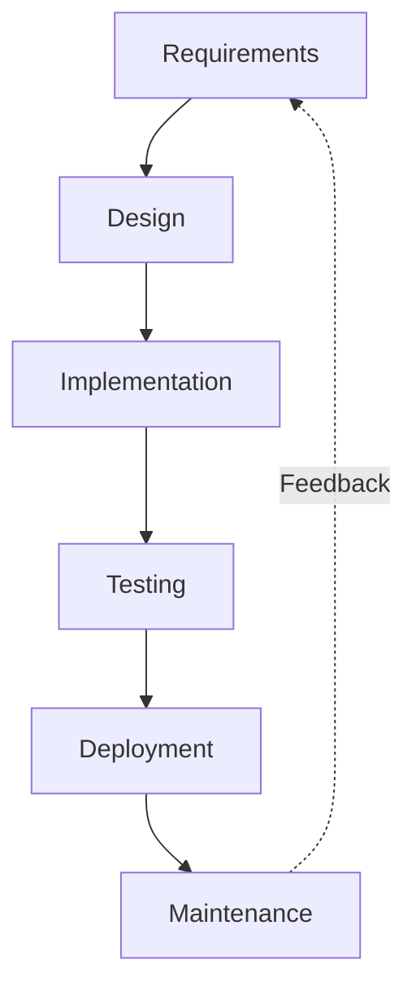
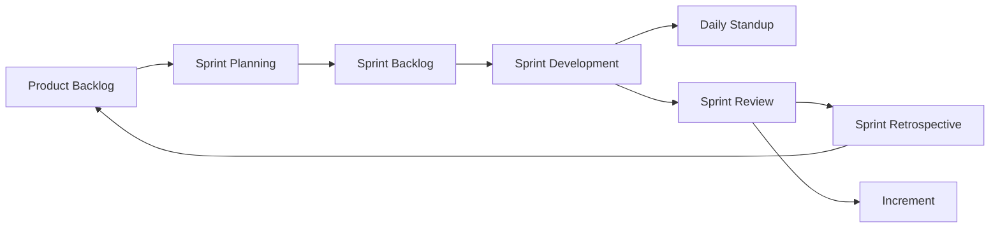
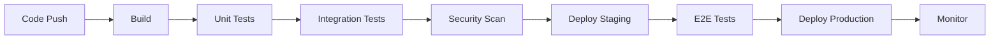
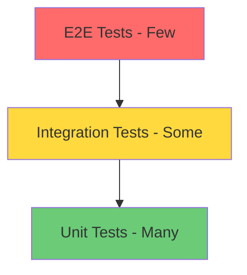
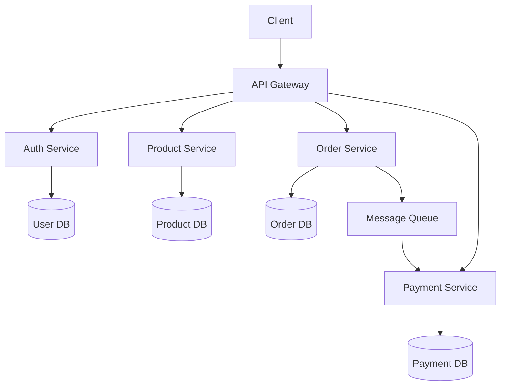

# Software Engineering Principles & Practices

## 1. Introduction

Software Engineering (SE) is the systematic application of engineering approaches to software development. It encompasses processes, methods, and tools for developing high-quality software that meets user requirements on time and within budget.

This guide covers the full spectrum of software engineering concepts you need to master for technical interviews, from SDLC models and Agile methodologies to architecture patterns, testing strategies, CI/CD pipelines, and code quality metrics.

**Why It Matters for Interviews:**
- Companies want engineers who think beyond code
- Understanding process improves team productivity
- Architecture decisions impact system scalability
- Testing knowledge prevents production failures
- DevOps practices accelerate delivery

---

## 2. Learning Roadmap

### Phase 1: Foundations (Weeks 1-2)
- [ ] SDLC models (Waterfall, V-Model, Spiral)
- [ ] Requirements engineering
- [ ] Software design principles (SOLID, DRY, KISS, YAGNI)
- [ ] UML diagrams

### Phase 2: Agile & Process (Weeks 3-4)
- [ ] Agile Manifesto and principles
- [ ] Scrum framework
- [ ] Kanban methodology
- [ ] User stories and estimation

### Phase 3: Architecture & Design (Weeks 5-6)
- [ ] Architectural patterns (MVC, Microservices, Event-Driven)
- [ ] Design patterns (GoF patterns)
- [ ] System design fundamentals
- [ ] API design principles

### Phase 4: Quality & Testing (Weeks 7-8)
- [ ] Testing pyramid
- [ ] Unit, integration, system testing
- [ ] Test-Driven Development (TDD)
- [ ] Code review practices

### Phase 5: DevOps & Delivery (Weeks 9-10)
- [ ] CI/CD pipelines
- [ ] Version control strategies
- [ ] Infrastructure as Code
- [ ] Monitoring and observability

---

## 3. Theory Notes

### Software Development Life Cycle (SDLC)

#### Waterfall Model
```
Requirements → Design → Implementation → Testing → Deployment → Maintenance
```
- **Sequential process**: Each phase must complete before the next begins
- **Best for**: Well-defined projects with stable requirements
- **Drawback**: Late testing, expensive to change

#### Agile Model
```
Iterative cycles of: Plan → Design → Build → Test → Review → Deploy
```
- **Iterative approach**: Short sprints (1-4 weeks)
- **Best for**: Evolving requirements, customer collaboration
- **Key values**: Individuals over processes, working software over documentation

#### Scrum Framework
```
Product Backlog → Sprint Planning → Sprint → Daily Standup → Sprint Review → Sprint Retrospective
```
- **Roles**: Product Owner, Scrum Master, Development Team
- **Artifacts**: Product Backlog, Sprint Backlog, Increment
- **Events**: Sprint, Sprint Planning, Daily Scrum, Sprint Review, Sprint Retrospective

#### Kanban
```
To Do → In Progress → Review → Done (WIP limits on each column)
```
- **Visual workflow management**
- **Pull-based system**: Only pull when capacity available
- **Continuous flow**: No fixed iterations

### SOLID Principles

1. **Single Responsibility**: A class should have only one reason to change
2. **Open/Closed**: Open for extension, closed for modification
3. **Liskov Substitution**: Subtypes must be substitutable for their base types
4. **Interface Segregation**: Many specific interfaces over one general-purpose
5. **Dependency Inversion**: Depend on abstractions, not concretions

### Software Architecture Patterns

#### Monolithic Architecture
- Single deployable unit
- Simple to develop and deploy
- Hard to scale independently
- Tight coupling risk

#### Microservices Architecture
- Independently deployable services
- Each service owns its data
- Communication via APIs/message queues
- Complex but scalable

#### Event-Driven Architecture
- Components communicate via events
- Loose coupling between producers and consumers
- Enables real-time processing
- Examples: Apache Kafka, RabbitMQ

#### Layered Architecture
```
Presentation → Business Logic → Data Access → Database
```
- Clear separation of concerns
- Each layer only communicates with adjacent layers
- Easy to test individual layers

---

## 4. Key Concepts

### Code Quality Metrics

| Metric | Description | Target |
|--------|-------------|--------|
| Cyclomatic Complexity | Number of independent paths through code | < 10 |
| Code Coverage | % of code covered by tests | > 80% |
| Technical Debt Ratio | Time to fix vs. time to develop | < 5% |
| Coupling Between Objects | Number of classes a class depends on | < 5 |
| Response for Class | Methods that can be executed in response to a message | < 20 |

### Technical Debt

**Types:**
- **Deliberate**: Consciously choosing shortcuts
- **Accidental**: Not knowing better at the time
- **Bitrot**: Code degrading over time as dependencies change

**Management Strategies:**
1. Track debt in issue tracker
2. Allocate sprint capacity for debt reduction
3. Use code quality tools to identify hotspots
4. Refactor incrementally, not big-bang

### Version Control Strategies

#### Git Flow
```
main → develop → feature/* → release/* → hotfix/*
```
- Best for scheduled releases
- Clear separation of concerns

#### GitHub Flow
```
main → feature branches → Pull Request → merge to main
```
- Simple and lightweight
- Best for continuous deployment

#### Trunk-Based Development
```
main (trunk) ← short-lived feature branches
```
- Frequent integration
- Feature flags for incomplete features
- Best for high-performing teams

### CI/CD Pipeline Stages

```
Code Commit → Build → Unit Tests → Integration Tests → Security Scan → Deploy to Staging → E2E Tests → Deploy to Production
```

**Key Practices:**
- Automated builds on every commit
- Fast feedback loops (< 10 minutes)
- Infrastructure as Code
- Blue-green or canary deployments
- Rollback automation

---

## 5. FAQ (20+ Q&A)

### Q1: What is the difference between verification and verification?
**A:** Verification asks "Are we building the product right?" (checking against requirements during development). Validation asks "Are we building the right product?" (checking if it meets user needs after development).

### Q2: What is the V-Model?
**A:** The V-Model extends Waterfall by pairing each development phase with a corresponding testing phase. Requirements map to acceptance testing, design maps to integration testing, and coding maps to unit testing.

### Q3: Explain the difference between Scrum and Kanban.
**A:** Scrum uses fixed-length sprints, defined roles (Scrum Master, Product Owner), and specific ceremonies. Kanban uses continuous flow with WIP limits, no prescribed roles, and focuses on visualizing work and limiting work-in-progress.

### Q4: What is Technical Debt?
**A:** Technical Debt is the implied cost of future rework caused by choosing an easy/quick solution now instead of a better approach that would take longer. Like financial debt, it accumulates interest over time.

### Q5: What is the Testing Pyramid?
**A:** A model suggesting you should have many unit tests (base), fewer integration tests (middle), and even fewer E2E/UI tests (top). This ensures fast feedback and reliable test suites.

### Q6: What is Continuous Integration?
**A:** CI is the practice of frequently merging code changes into a shared repository, with automated builds and tests running on each integration to detect issues early.

### Q7: What is Continuous Deployment vs. Continuous Delivery?
**A:** Continuous Delivery ensures code is always in a deployable state and requires manual approval to deploy. Continuous Deployment automatically deploys every change that passes the pipeline to production.

### Q8: What is a Code Review and why is it important?
**A:** Code Review is the systematic examination of code by peers before merging. It catches bugs, ensures code quality, shares knowledge, and maintains coding standards.

### Q9: What is the SOLID principle?
**A:** Five design principles: Single Responsibility, Open/Closed, Liskov Substitution, Interface Segregation, and Dependency Inversion. Together they make code more maintainable, flexible, and robust.

### Q10: What is Domain-Driven Design (DDD)?
**A:** DDD is an approach to software development that focuses on modeling software to match a domain's complexity. Key concepts include Bounded Contexts, Aggregates, Entities, Value Objects, and Ubiquitous Language.

### Q11: How do you handle conflicting requirements?
**A:** Prioritize stakeholders, document trade-offs, use MoSCoW method (Must/Should/Could/Won't), negotiate scope, and get signed-off from product owners.

### Q12: What is a System Design Document?
**A:** A comprehensive document describing the architecture, components, interfaces, and data flows of a system. It typically includes high-level architecture, detailed component design, API specifications, data models, and deployment diagrams.

### Q13: What is Blue-Green Deployment?
**A:** A deployment strategy maintaining two identical production environments. The blue environment serves current traffic while green is updated. Once tested, traffic switches from blue to green with zero downtime.

### Q14: What is Canary Deployment?
**A:** A strategy where a new version is gradually rolled out to a small subset of users before full deployment. This allows monitoring for issues with minimal risk.

### Q15: What is Infrastructure as Code (IaC)?
**A:** Managing and provisioning infrastructure through machine-readable configuration files rather than manual processes. Tools include Terraform, Ansible, CloudFormation.

### Q16: What is Observability?
**A:** The ability to understand a system's internal state from its external outputs. The three pillars are Logging, Metrics, and Tracing.

### Q17: What is a Feature Flag?
**A:** A toggle in code that enables or disables features without deploying new code. Used for gradual rollouts, A/B testing, and trunk-based development.

### Q18: What is the Twelve-Factor App methodology?
**A:** A set of best practices for building modern, scalable SaaS applications. Factors include codebase, dependencies, config, backing services, build/release/run, processes, port binding, concurrency, disposability, dev/prod parity, logs, and admin processes.

### Q19: What is Contract Testing?
**A:** Testing that verifies the interactions between services against a shared contract, ensuring that APIs produce outputs expected by consumers without full integration testing.

### Q20: What is the Bus Factor?
**A:** The minimum number of team members who must be hit by a bus (leave the project) before the project is in jeopardy. It measures knowledge concentration risk.

### Q21: What is Chaos Engineering?
**A:** The discipline of experimenting on a system to build confidence in its ability to withstand turbulent conditions in production. Popularized by Netflix's Chaos Monkey.

### Q22: How do you estimate software projects?
**A:** Use techniques like Planning Poker, T-shirt sizing, Function Point Analysis, or COCOMO. Combine historical velocity with expert judgment. Always include buffer for unknowns.

---

## 6. Hands-on Practice

### Exercise 1: Design a Scrum Board
Create a Scrum board for a team of 5 developers working on an e-commerce platform:

```
Product Backlog:
- User authentication (13 pts)
- Product catalog (8 pts)
- Shopping cart (5 pts)
- Payment processing (13 pts)
- Order management (8 pts)

Sprint 1 (21 pts):
- User authentication (13 pts)
- Product catalog (8 pts)
```

### Exercise 2: Code Review Checklist
Review this code and identify issues:

```python
# Find the problems in this code
def process_user_data(users):
    for i in range(len(users)):
        if users[i]['age'] > 0 and users[i]['age'] < 150:
            if users[i]['email'] != None:
                if '@' in users[i]['email']:
                    result = users[i]
                    # Do something with result
    return result
```

**Issues to identify:**
- Deeply nested conditionals (refactor to guard clauses)
- No error handling for missing keys
- `result` may be undefined if no users pass validation
- No input validation
- Loop style (enumerate preferred)

### Exercise 3: Write a CI/CD Pipeline
Create a GitHub Actions workflow for a Node.js project:

```yaml
name: CI/CD Pipeline
on:
  push:
    branches: [main, develop]
  pull_request:
    branches: [main]

jobs:
  build-and-test:
    runs-on: ubuntu-latest
    steps:
      - uses: actions/checkout@v3
      - uses: actions/setup-node@v3
        with:
          node-version: '18'
      - run: npm ci
      - run: npm run lint
      - run: npm test
      - run: npm run build
```

### Exercise 4: Technical Debt Assessment
Analyze this codebase metric report and create a prioritized improvement plan:

```
Module A: Cyclomatic Complexity=25, Bug Rate=3.2/kloc, Coverage=45%
Module B: Cyclomatic Complexity=8, Bug Rate=0.5/kloc, Coverage=92%
Module C: Cyclomatic Complexity=18, Bug Rate=2.1/kloc, Coverage=30%
Module D: Cyclomatic Complexity=12, Bug Rate=1.0/kloc, Coverage=78%
```

---

## 7. FAANG Questions

### Google
1. How would you design a CI/CD pipeline for a monorepo with 5000 engineers?
2. Describe how Google does code review at scale.
3. How do you manage technical debt in a large codebase?

### Amazon
4. How would you implement a feature flag system?
5. Describe your approach to reducing deployment risk.
6. How do you ensure code quality across multiple teams?

### Meta
7. How would you migrate a monolith to microservices incrementally?
8. Design a system for A/B testing at scale.
9. How do you handle database migrations in a distributed system?

### Apple
10. How do you approach software architecture for privacy-first features?
11. Describe your testing strategy for a real-time collaboration feature.
12. How do you balance technical debt with feature development?

### Netflix
13. How would you implement Chaos Engineering in a microservices architecture?
14. Design a deployment strategy for zero-downtime updates.
15. How do you monitor and alert on system health?

### Microsoft
16. How do you design for accessibility in web applications?
17. Describe your approach to cross-platform development.
18. How do you handle backward compatibility in API design?

---

## 8. Common Mistakes

### Process Mistakes
1. **Skipping code reviews** → Bugs slip through, knowledge silos form
2. **No definition of done** → Features shipped incomplete
3. **Ignoring technical debt** → Development velocity decreases over time
4. **Big-bang releases** → High risk, long feedback loops
5. **Not automating tests** → Manual testing doesn't scale

### Architecture Mistakes
6. **Premature optimization** → Complex code for problems that don't exist
7. **Over-engineering** → Building for scale you'll never need
8. **Tight coupling** → Changes ripple across the entire system
9. **No monitoring** → Blind to production issues
10. **Ignoring security** → Vulnerabilities in production

### Team Mistakes
11. **Not documenting decisions** → Context lost, repeated discussions
12. **Hero culture** → Single points of failure
13. **Skipping retrospectives** → No continuous improvement
14. **Estimating without data** → Consistent under/over-estimation
15. **Not allocating time for learning** → Skills become outdated

---

## 9. Best Practices

### Code Quality
- Write self-documenting code with meaningful names
- Follow the Boy Scout Rule: leave code cleaner than you found it
- Apply SOLID principles consistently
- Keep functions small and focused (< 30 lines)
- Prefer composition over inheritance

### Testing
- Follow the testing pyramid
- Write tests before or alongside code (TDD/BDD)
- Test edge cases, not just happy paths
- Maintain test independence (no shared state)
- Mock external dependencies, not internal logic

### Version Control
- Write meaningful commit messages
- Use feature branches for all changes
- Keep commits atomic and focused
- Review your own code before requesting reviews
- Never force-push to shared branches

### Documentation
- Document architectural decisions (ADRs)
- Keep README files updated
- Document APIs with OpenAPI/Swagger
- Write runbooks for operational procedures
- Document onboarding steps for new team members

### CI/CD
- Keep build times under 10 minutes
- Fail fast: run cheapest tests first
- Maintain deployment reproducibility
- Use environment variables for configuration
- Automate everything: builds, tests, deployments, rollbacks

### Communication
- Over-communicate in distributed teams
- Use async communication for non-urgent matters
- Share context, not just decisions
- Write RFCs for significant changes
- Celebrate wins and learn from failures

---

## 10. Cheat Sheet

### SDLC Quick Reference
| Model | Best For | Risk | Documentation |
|-------|----------|------|---------------|
| Waterfall | Stable requirements | High (late testing) | Heavy |
| V-Model | Safety-critical systems | Medium | Heavy |
| Spiral | Large, risky projects | Controlled | Medium |
| Agile/Scrum | Evolving requirements | Low (early feedback) | Light |
| Kanban | Continuous delivery | Low | Light |

### Design Principles
```
SOLID → Maintainable code
DRY  → No duplication
KISS → Simple solutions
YAGNI → Don't build what you don't need
SoC  → Separate concerns
```

### Testing Types Quick Reference
```
Unit → Individual functions/methods
Integration → Multiple components together
System → Complete application
E2E → User workflows through UI
Regression → Existing functionality still works
Performance → Speed and scalability
Security → Vulnerability detection
Smoke → Basic functionality check
```

### Git Commands
```bash
git stash              # Save uncommitted changes
git rebase -i HEAD~5   # Interactive rebase
git bisect start       # Binary search for bugs
git blame file.py      # Who changed what
git log --oneline -20  # Recent commits
```

---

## 11. Flash Cards (20)

1. **Q: What does DRY stand for?**
   A: Don't Repeat Yourself — avoid duplicating logic or knowledge.

2. **Q: What is the Single Responsibility Principle?**
   A: A class should have only one reason to change.

3. **Q: Name the three Scrum roles.**
   A: Product Owner, Scrum Master, Development Team.

4. **Q: What is a Sprint in Scrum?**
   A: A time-boxed iteration (1-4 weeks) where a potentially shippable increment is created.

5. **Q: What is Technical Debt?**
   A: The cost of choosing an easy solution now over a better approach that would take longer.

6. **Q: What is the Testing Pyramid?**
   A: Many unit tests at base, fewer integration tests in middle, few E2E tests at top.

7. **Q: What is Blue-Green Deployment?**
   A: Two identical production environments; traffic switches between them for zero-downtime deploys.

8. **Q: What does CI/CD stand for?**
   A: Continuous Integration / Continuous Delivery (or Deployment).

9. **Q: What is a Pull Request?**
   A: A proposed set of changes submitted for review before merging into the main branch.

10. **Q: What is Cyclomatic Complexity?**
    A: A metric measuring the number of independent paths through source code.

11. **Q: What is KISS?**
    A: Keep It Simple, Stupid — favor simple solutions over complex ones.

12. **Q: What is YAGNI?**
    A: You Ain't Gonna Need It — don't build features until they're actually needed.

13. **Q: What is a Feature Flag?**
    A: A toggle enabling/disabling features without deploying new code.

14. **Q: What is Domain-Driven Design?**
    A: An approach modeling software to match domain complexity using ubiquitous language.

15. **Q: What is the Bus Factor?**
    A: The minimum number of people whose departure would jeopardize the project.

16. **Q: What is Observability?**
    A: Understanding system internal state from external outputs (logs, metrics, traces).

17. **Q: What is Chaos Engineering?**
    A: Experimenting on systems to build confidence in their resilience to failures.

18. **Q: What is Infrastructure as Code?**
    A: Managing infrastructure through machine-readable configuration files.

19. **Q: What is Contract Testing?**
    A: Verifying service interactions against shared API contracts.

20. **Q: What is the Twelve-Factor App?**
    A: A methodology for building modern scalable SaaS applications.

---

## 12. Mind Map

```
                        Software Engineering
                              |
        ┌─────────┬───────────┼───────────┬──────────┐
        |         |           |           |          |
      Process   Design     Testing     DevOps    Quality
        |         |           |           |          |
    ┌───┼───┐   ┌─┼─┐     ┌──┼──┐    ┌──┼──┐    ┌──┼──┐
    |   |   |   | | |     |  |  |    |  |  |    |  |  |
  SDLC  Agile Scrum SOLID DRY TDD BDD CI CD Metrics Debt Review
    |         |           |           |
  Waterfall  Sprints    Unit Tests  Pipelines
  V-Model    Standup    Integration Deploy
  Spiral     Retro      E2E         Monitor
  Kanban     Backlog    Performance  Observe
```

---

## 13. Mermaid Diagrams

### SDLC Waterfall Flow


### Scrum Process


### CI/CD Pipeline


### Testing Pyramid


### Microservices Architecture


---

## 14. Code Examples

### Example 1: SOLID Principles in Python
```python
# Single Responsibility
class UserValidator:
    def validate(self, user):
        if not user.email:
            raise ValueError("Email required")
        return True

class UserRepository:
    def save(self, user):
        # Database save logic
        pass

# Open/Crown
class Notification:
    def send(self, message):
        raise NotImplementedError

class EmailNotification(Notification):
    def send(self, message):
        print(f"Email: {message}")

class SMSNotification(Notification):
    def send(self, message):
        print(f"SMS: {message}")

# Dependency Inversion
class OrderService:
    def __init__(self, repository, notifier):
        self.repository = repository
        self.notifier = notifier

    def create_order(self, order):
        self.repository.save(order)
        self.notifier.send(f"Order {order.id} created")
```

### Example 2: Factory Pattern
```python
from abc import ABC, abstractmethod

class PaymentProcessor(ABC):
    @abstractmethod
    def process(self, amount):
        pass

class CreditCardProcessor(PaymentProcessor):
    def process(self, amount):
        print(f"Processing ${amount} via credit card")

class PayPalProcessor(PaymentProcessor):
    def process(self, amount):
        print(f"Processing ${amount} via PayPal")

class PaymentProcessorFactory:
    _processors = {
        'credit_card': CreditCardProcessor,
        'paypal': PayPalProcessor,
    }

    @classmethod
    def create(cls, processor_type):
        processor_class = cls._processors.get(processor_type)
        if not processor_class:
            raise ValueError(f"Unknown processor: {processor_type}")
        return processor_class()

# Usage
processor = PaymentProcessorFactory.create('credit_card')
processor.process(99.99)
```

### Example 3: Observer Pattern
```python
class EventManager:
    def __init__(self):
        self._listeners = {}

    def subscribe(self, event_type, listener):
        if event_type not in self._listeners:
            self._listeners[event_type] = []
        self._listeners[event_type].append(listener)

    def notify(self, event_type, data):
        for listener in self._listeners.get(event_type, []):
            listener(data)

class OrderService:
    def __init__(self):
        self.events = EventManager()

    def create_order(self, order):
        # Create order logic
        self.events.notify('order_created', order)
```

### Example 4: Test-Driven Development
```python
import pytest

# Write test first
def test_calculate_discount_for_vip():
    order = Order(total=100, customer_type='vip')
    assert order.calculate_discount() == 20  # 20% for VIP

def test_calculate_discount_for_regular():
    order = Order(total=100, customer_type='regular')
    assert order.calculate_discount() == 5   # 5% for regular

# Then implement
class Order:
    DISCOUNT_RATES = {'vip': 0.20, 'regular': 0.05}

    def __init__(self, total, customer_type):
        self.total = total
        self.customer_type = customer_type

    def calculate_discount(self):
        rate = self.DISCOUNT_RATES.get(self.customer_type, 0)
        return int(self.total * rate)
```

### Example 5: GitHub Actions CI/CD
```yaml
name: Build and Deploy

on:
  push:
    branches: [main]
  pull_request:
    branches: [main]

jobs:
  test:
    runs-on: ubuntu-latest
    steps:
      - uses: actions/checkout@v3
      - uses: actions/setup-python@v4
        with:
          python-version: '3.11'
      - run: pip install -r requirements.txt
      - run: pytest --cov=src tests/

  deploy:
    needs: test
    if: github.ref == 'refs/heads/main'
    runs-on: ubuntu-latest
    steps:
      - uses: actions/checkout@v3
      - run: ./deploy.sh
```

---

## 15. Projects

### Project 1: Build a CI/CD Pipeline
**Objective:** Create a complete CI/CD pipeline for a web application.
**Tools:** GitHub Actions, Docker, AWS/GCP
**Features:**
- Automated testing on pull requests
- Docker image building and pushing
- Blue-green deployment to cloud
- Slack notifications for deployment status

### Project 2: Technical Debt Tracker
**Objective:** Build a tool that analyzes codebases for technical debt.
**Features:**
- Code complexity analysis (SonarQube integration)
- Test coverage tracking
- Dependency vulnerability scanning
- Debt prioritization dashboard
- Trend tracking over time

### Project 3: Microservices Migration
**Objective:** Migrate a monolithic application to microservices.
**Steps:**
1. Identify bounded contexts
2. Define service interfaces
3. Implement Strangler Fig pattern
4. Set up service mesh
5. Implement distributed tracing

### Project 4: Code Review Bot
**Objective:** Create an automated code review assistant.
**Features:**
- Lint checking
- Complexity analysis
- Security vulnerability scanning
- Style guide enforcement
- PR summary generation

---

## 16. Resources

### Books
- "Clean Code" by Robert C. Martin
- "The Pragmatic Programmer" by Hunt & Thomas
- "Design Patterns" by Gang of Four
- "Continuous Delivery" by Humble & Farley
- "Accelerate" by Forsgren, Humble & Kim

### Online Courses
- [MIT 6.031 Software Construction](https://web.mit.edu/6.031/www/sp22/)
- [Software Engineering at Google](https://abseil.io/resources/swe-book)
- [Pluralsight: Software Engineering Foundations](https://pluralsight.com)

### Tools
- **CI/CD**: GitHub Actions, Jenkins, GitLab CI, CircleCI
- **Code Quality**: SonarQube, ESLint, Pylint, RuboCop
- **Project Management**: Jira, Linear, Trello, Azure DevOps
- **Architecture**: PlantUML, Mermaid, draw.io, Structurizr

### Articles & Papers
- "The Twelve-Factor App" (https://12factor.net)
- "Accelerate: State of DevOps Report" (annual)
- "Google Site Reliability Engineering" book

---

## 17. Checklist

### Project Setup
- [ ] Repository with clear README
- [ ] Branch protection rules
- [ ] Code review guidelines documented
- [ ] CI/CD pipeline configured
- [ ] Linting and formatting configured
- [ ] Pre-commit hooks set up

### Development Process
- [ ] Requirements documented and approved
- [ ] Architecture decisions recorded (ADRs)
- [ ] Sprint planning completed
- [ ] User stories with acceptance criteria
- [ ] Estimation done with team consensus

### Code Quality
- [ ] Code review for every PR
- [ ] Unit tests written (>80% coverage)
- [ ] Integration tests for critical paths
- [ ] No critical linting violations
- [ ] Security scan passed

### Deployment
- [ ] Staging environment tested
- [ ] Database migrations tested
- [ ] Rollback plan documented
- [ ] Monitoring and alerts configured
- [ ] Runbook updated

---

## 18. Revision Plans

### Week 1: SDLC & Process
- Day 1-2: SDLC models (Waterfall, Agile, Scrum, Kanban)
- Day 3-4: Requirements engineering
- Day 5-7: Practice quiz and review

### Week 2: Design Principles
- Day 1-2: SOLID, DRY, KISS, YAGNI
- Day 3-4: Design patterns (Creational, Structural, Behavioral)
- Day 5-7: Architecture patterns (Monolith, Microservices, Event-Driven)

### Week 3: Testing & Quality
- Day 1-2: Testing pyramid, TDD, BDD
- Day 3-4: Code quality metrics, code review
- Day 5-7: Technical debt management

### Week 4: DevOps & Delivery
- Day 1-2: CI/CD pipelines, version control strategies
- Day 3-4: Infrastructure as Code, deployment strategies
- Day 5-7: Monitoring, observability, full practice exam

---

## 19. Mock Interviews

### Round 1: Process Knowledge (30 min)
1. Walk me through your ideal development process.
2. How do you handle a project where requirements keep changing?
3. Describe your experience with Scrum. What would you improve?
4. How do you estimate tasks? Give an example.

### Round 2: Design & Architecture (45 min)
1. Design a CI/CD pipeline for a microservices application.
2. How would you approach migrating a monolith to microservices?
3. Explain SOLID principles with real examples.
4. How do you manage technical debt?

### Round 3: Quality & Testing (30 min)
1. Describe your testing strategy for a new feature.
2. How do you ensure code quality in a fast-paced environment?
3. What metrics do you track for code quality?
4. How do you handle flaky tests?

### Round 4: DevOps & Delivery (30 min)
1. Explain your deployment process.
2. How do you handle a production incident?
3. What's your approach to infrastructure as code?
4. How do you monitor system health?

---

## 20. Difficulty Rating

| Topic | Difficulty | Interview Frequency |
|-------|-----------|-------------------|
| SDLC Models | ⭐⭐ (Easy) | High |
| Agile/Scrum | ⭐⭐ (Easy) | Very High |
| SOLID Principles | ⭐⭐⭐ (Medium) | High |
| Design Patterns | ⭐⭐⭐⭐ (Hard) | High |
| Testing Strategies | ⭐⭐⭐ (Medium) | High |
| CI/CD | ⭐⭐⭐ (Medium) | Very High |
| Architecture Patterns | ⭐⭐⭐⭐ (Hard) | Very High |
| Technical Debt | ⭐⭐ (Easy) | Medium |
| Code Quality Metrics | ⭐⭐⭐ (Medium) | Medium |
| Version Control Strategy | ⭐⭐⭐ (Medium) | Medium |
| DDD | ⭐⭐⭐⭐⭐ (Expert) | Medium |
| Chaos Engineering | ⭐⭐⭐⭐ (Hard) | Low |

---

## 21. Summary

Software Engineering is about building the right software the right way. Key takeaways:

1. **Process matters**: Choose the right SDLC model for your context
2. **Agile is king**: Most companies use Scrum or Kanban variants
3. **Quality is continuous**: Testing, code reviews, and metrics throughout
4. **Automate everything**: CI/CD reduces human error and speeds delivery
5. **Architecture evolves**: Start simple, refactor as needed
6. **Team collaboration**: Communication and documentation are critical
7. **Technical debt**: Manage it proactively, or it will manage you

**Interview Tip:** Be ready to discuss trade-offs. Every architectural decision has pros and cons. Show you understand context and can make informed decisions.
