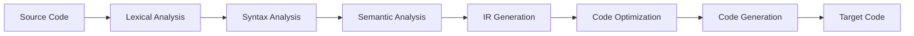
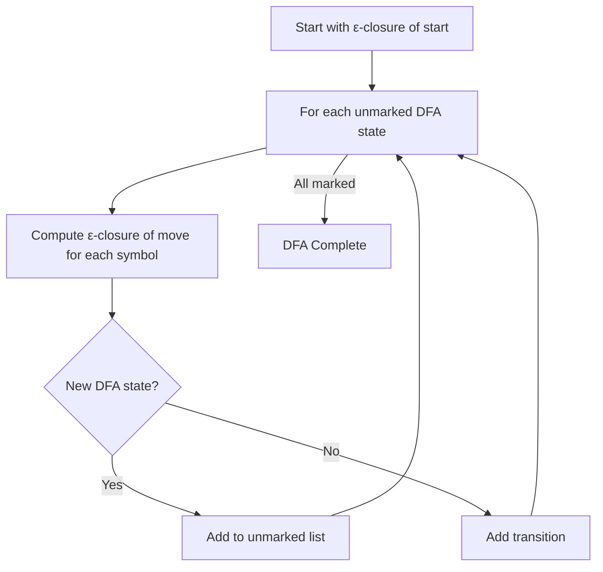
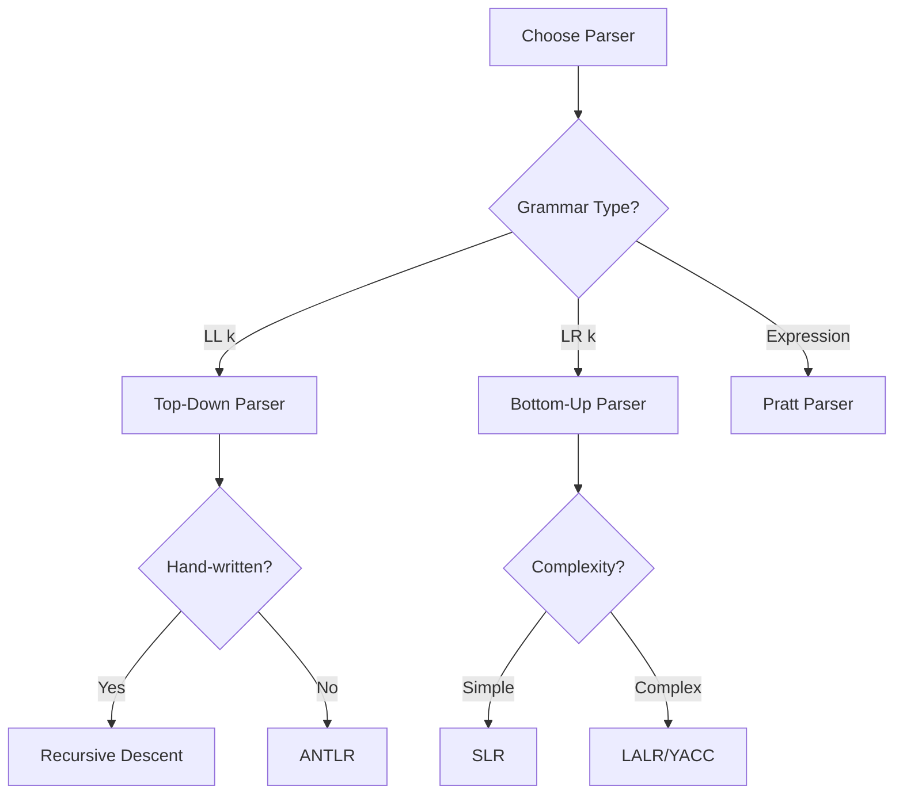
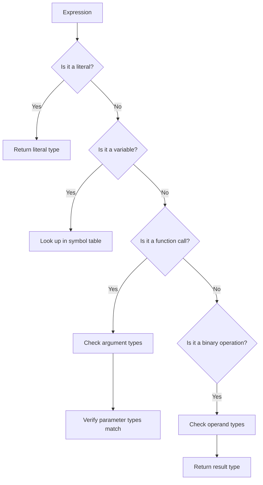
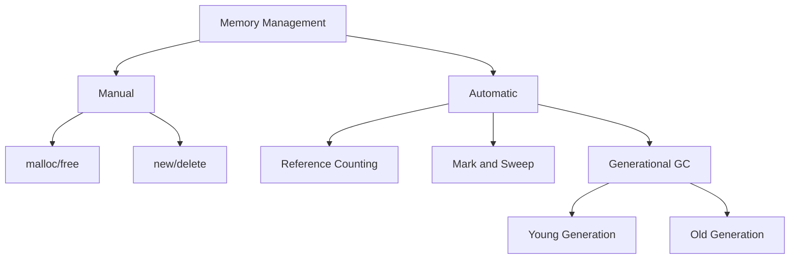

# Compiler Design

## 1. Introduction

Compiler Design is the study of how programming languages are translated from high-level source code into low-level machine code or intermediate representations. Understanding compilers gives you deep insight into programming language behavior, optimization techniques, and the foundation of every software system.

This guide covers the complete compiler pipeline: lexical analysis, parsing, semantic analysis, intermediate code generation, code optimization, and code generation. It also covers related topics like regular expressions, context-free grammars, and the differences between compilers and interpreters.

**Why It Matters for Interviews:**
- Demonstrates deep CS fundamentals
- Understanding parsers helps with language/tool design
- Optimization knowledge applies to performance engineering
- Shows ability to work with complex systems

---

## 2. Learning Roadmap

### Phase 1: Foundations (Weeks 1-2)
- [ ] Number systems and representations
- [ ] Regular expressions and finite automata
- [ ] Lexical analysis concepts
- [ ] Tokens, patterns, and lexemes

### Phase 2: Parsing (Weeks 3-4)
- [ ] Context-free grammars
- [ ] Top-down parsing (Recursive Descent, LL)
- [ ] Bottom-up parsing (SLR, LR, LALR)
- [ ] Parser generators (YACC, ANTLR)

### Phase 3: Semantic Analysis (Weeks 5-6)
- [ ] Symbol tables
- [ ] Type checking
- [ ] Scope resolution
- [ ] Syntax-directed translation

### Phase 4: Code Generation (Weeks 7-8)
- [ ] Intermediate representations (Three-Address Code, SSA)
- [ ] Code optimization techniques
- [ ] Target code generation
- [ ] Register allocation

### Phase 5: Advanced Topics (Weeks 9-10)
- [ ] Garbage collection
- [ ] JIT compilation
- [ ] Compiler vs interpreter comparison
- [ ] Modern compiler architecture (LLVM)

---

## 3. Theory Notes

### The Compilation Pipeline

```
Source Code → Lexical Analysis → Syntax Analysis → Semantic Analysis
    → Intermediate Code Generation → Code Optimization → Target Code
```

### Phase 1: Lexical Analysis (Scanner)

**Purpose:** Convert character stream into token stream

**Components:**
- **Pattern**: Rule describing token format (e.g., `[a-zA-Z][a-zA-Z0-9]*` for identifiers)
- **Lexeme**: Actual character sequence matching a pattern
- **Token**: Category of the lexeme (e.g., IDENTIFIER, NUMBER, KEYWORD)

**Regular Expressions to Finite Automata:**
```
Regex: a(b|c)*d
→ NFA → DFA (subset construction) → Minimized DFA
```

**Example Token Definitions:**
```
NUMBER    → [0-9]+(\.[0-9]+)?
IDENT     → [a-zA-Z_][a-zA-Z0-9_]*
OPERATOR  → \+|-|\*|/|=
KEYWORD   → if|else|while|return|int|float
SEPARATOR → [(),;{}]
```

### Phase 2: Syntax Analysis (Parser)

**Context-Free Grammars (CFG):**
```
E → E + T | T
T → T * F | F
F → ( E ) | id
```

**Top-Down Parsing (LL):**
- Starts from start symbol, tries to derive input
- Recursive descent: each non-terminal becomes a function
- Requires LL(k) grammar (look-ahead of k tokens)

**Predictive Parsing Table:**
```
         |  id    |  +    |  *    |  (    |  )
---------|--------|-------|-------|-------|------
E        | E→T    |       |       | E→T   |
E'       |        | E'→+T |       |       | E'→ε
T        | T→F    |       |       | T→F   |
T'       |        | T'→ε  | T'→*F |       | T'→ε
F        | F→id   |       |       | F→(E) |
```

**Bottom-Up Parsing (LR):**
- Shift-Reduce parsing
- Builds parse tree from leaves to root
- LR(0), SLR(1), LR(1), LALR(1) variants
- More powerful than LL parsers

**LR Parsing Table Construction:**
```
Items: [A → α·β, a]
- Shift: Move dot past terminal
- Reduce: Apply production when dot at end
- Conflict: Shift/Reduce or Reduce/Reduce
```

### Phase 3: Semantic Analysis

**Symbol Table Structure:**
```
┌─────────────┬────────┬────────┬─────────┐
│ Name        │ Type   │ Scope  │ Offset  │
├─────────────┼────────┼────────┼─────────┤
│ x           │ int    │ global │ 0       │
│ y           │ float  │ func1  │ 4       │
│ compute()   │ func   │ global │ -       │
└─────────────┴────────┴────────┴─────────┘
```

**Type Checking Rules:**
- Arithmetic: both operands must be numeric
- Assignment: LHS type must match RHS (or be coercible)
- Comparison: both operands must be comparable
- Function call: arguments must match parameter types

### Phase 4: Intermediate Code Generation

**Three-Address Code (TAC):**
```
// Source: x = a + b * c
t1 = b * c
t2 = a + t1
x = t2
```

**Static Single Assignment (SSA):**
```
// Each variable assigned exactly once
x1 = a
y1 = b * c
x2 = x1 + y1
// φ (phi) functions for control flow merges
```

### Phase 5: Code Optimization

**Local Optimizations:**
- Constant folding: `3 * 4` → `12`
- Constant propagation: `x = 5; y = x + 1` → `y = 6`
- Dead code elimination: remove unreachable code
- Common subexpression elimination: `a*b + a*b` → `t = a*b; t + t`

**Loop Optimizations:**
- Loop-invariant code motion
- Loop unrolling
- Loop fusion/fission
- Strength reduction: `x * 2` → `x << 1`

**Data Flow Optimizations:**
- Copy propagation
- Constant folding across basic blocks
- Partial redundancy elimination

---

## 4. Key Concepts

### Compiler vs Interpreter

| Aspect | Compiler | Interpreter |
|--------|----------|-------------|
| Translation | Entire program at once | Line by line |
| Output | Machine code/bytecode | Direct execution |
| Speed | Faster execution | Slower execution |
| Development | Edit → Compile → Run | Edit → Run |
| Error Reporting | After compilation | At error line |
| Examples | GCC, Clang, Go | Python, Ruby, JavaScript |

### Regular Expressions

**Operators (Precedence High to Low):**
1. `()` Grouping
2. `*` Kleene star (zero or more)
3. `.` Concatenation
4. `|` Union/Alternation

**Examples:**
```
a|b          → a or b
ab           → a followed by b
a*           → zero or more a's
(a|b)*       → any string of a's and b's
a*b*         → any a's followed by any b's
(a|b)*abb    → ends with abb
```

**Conversion to NFA:**
- Thompson's construction algorithm
- Each regex operator has a corresponding NFA fragment

### Finite Automata

**DFA vs NFA:**
| Aspect | DFA | NFA |
|--------|-----|-----|
| Transitions | Deterministic | Non-deterministic |
| ε-moves | No | Yes |
| States per input | Exactly one | Zero or more |
| Construction | From NFA | From regex |
| Time Complexity | O(n) | O(n) |
| Space | Can be exponential | Polynomial |

### Parsing Techniques

**LL vs LR:**
| Aspect | LL (Top-Down) | LR (Bottom-Up) |
|--------|---------------|----------------|
| Direction | Left-to-right, leftmost derivation | Left-to-right, rightmost derivation |
| Power | Less powerful | More powerful |
| Grammar | LL(k) | LR(k), LALR(k) |
| Conflicts | First/First, First/Follow | Shift/Reduce, Reduce/Reduce |
| Tools | ANTLR, hand-written | YACC, Bison |

### Context-Free Grammars

**Chomsky Hierarchy:**
```
Type 0: Recursively Enumerable  → Turing Machine
Type 1: Context-Sensitive       → Linear Bounded Automaton
Type 2: Context-Free            → Pushdown Automaton
Type 3: Regular                 → Finite Automaton
```

---

## 5. FAQ (20+ Q&A)

### Q1: What is the difference between a compiler and an interpreter?
**A:** A compiler translates the entire source code to machine code before execution (GCC, Go). An interpreter translates and executes line by line (Python, Ruby). Some languages use both: Java compiles to bytecode, which the JVM interprets (or JIT compiles).

### Q2: What is a lexical analyzer?
**A:** The first phase of a compiler that reads source code characters and groups them into meaningful units called tokens (keywords, identifiers, operators, literals). It uses regular expressions and finite automata.

### Q3: What is the difference between NFA and DFA?
**A:** An NFA can have multiple transitions for the same symbol and ε-moves. A DFA has exactly one transition per symbol. Every NFA can be converted to an equivalent DFA using subset construction, though the DFA may have exponentially more states.

### Q4: What is a context-free grammar?
**A:** A formal grammar where the left side of every production is a single non-terminal. It can describe nested structures like balanced parentheses and programming language syntax. Recognized by pushdown automata.

### Q5: What is left recursion and why is it a problem?
**A:** A grammar rule like `A → Aα` is left-recursive. It causes infinite loops in top-down parsers because the parser keeps expanding A without consuming any input. Eliminate by rewriting: `A → αA'` and `A' → αA' | ε`.

### Q6: What is a symbol table?
**A:** A data structure used by compilers to store information about identifiers (variables, functions, classes). It tracks name, type, scope, memory location, and other attributes. Implemented as hash tables, trees, or lists.

### Q7: What is type checking?
**A:** The process of verifying that operations in source code are type-consistent. Static type checking happens at compile time; dynamic type checking happens at runtime. Type errors include mismatched operands and incorrect function arguments.

### Q8: What is three-address code?
**A:** An intermediate representation where each instruction has at most three operands: two sources and one destination. Example: `x = y + z`. It's easier to optimize and translate to target code.

### Q9: What is SSA form?
**A:** Static Single Assignment form requires each variable to be assigned exactly once. When a variable would be reassigned, a new version is created. Phi (φ) functions merge different versions at control flow joins. SSA simplifies many optimizations.

### Q10: What is constant folding?
**A:** A compile-time optimization that evaluates constant expressions at compile time. For example, `x = 3 * 4 + 2` becomes `x = 14`. This eliminates runtime computation.

### Q11: What is common subexpression elimination?
**A:** An optimization that detects duplicate computations and reuses the result. If `a = b + c` and later `d = b + c`, the second computation can be replaced with `d = a`.

### Q12: What is loop-invariant code motion?
**A:** Moving computations that produce the same result regardless of loop iteration outside the loop. For example, if `x` doesn't change inside the loop, `y = x * 2` can be moved before the loop.

### Q13: What is register allocation?
**A:** The process of assigning variables to CPU registers during code generation. Graph coloring is a common approach: variables that are live at the same time get different colors (registers). Spill to memory when registers are insufficient.

### Q14: What is garbage collection?
**A:** Automatic memory management that reclaims memory occupied by objects no longer referenced by the program. Common algorithms include reference counting, mark-and-sweep, and generational collection.

### Q15: What is JIT compilation?
**A:** Just-In-Time compilation compiles code at runtime rather than ahead of time. The JVM and V8 engine use JIT: first interpret, then identify hot paths, then compile those to native code. Combines portability of interpretation with performance of compilation.

### Q16: What is the difference between syntax and semantic errors?
**A:** Syntax errors violate the grammar rules (missing semicolon, unmatched parentheses). Semantic errors are grammatically correct but meaningless (type mismatch, undefined variable). Compilers catch syntax errors in parsing and semantic errors in semantic analysis.

### Q17: What is YACC/Bison?
**A:** Yet Another Compiler Compiler / GNU Bison are parser generators that take grammar specifications and generate bottom-up (LALR) parsers. You provide grammar rules and associated actions; the tool generates the parsing table and automaton.

### Q18: What is the AST?
**A:** Abstract Syntax Tree is a tree representation of the syntactic structure of source code. It removes unnecessary punctuation (semicolons, parentheses) and captures the essential structure. Used for semantic analysis and optimization.

### Q19: What is peephole optimization?
**A:** A local optimization technique that examines a small window of generated instructions and replaces inefficient patterns with better ones. Examples: strength reduction, redundant load elimination, jump threading.

### Q20: What is a compiler pass?
**A:** A complete traversal of the program's intermediate representation. Multi-pass compilers perform multiple passes: early passes for analysis, later passes for optimization and code generation. Single-pass compilers do everything in one traversal.

### Q21: What is the difference between cross-compilation and native compilation?
**A:** Native compilation generates code for the same platform the compiler runs on. Cross-compilation generates code for a different platform (e.g., compiling on x86 for ARM). Essential for embedded systems development.

### Q22: What is a linker?
**A:** A tool that combines multiple object files and libraries into a single executable. It resolves external references (function calls across files), assigns final memory addresses, and produces the final binary format (ELF, PE, Mach-O).

---

## 6. Hands-on Practice

### Exercise 1: Write a Lexical Analyzer
Implement a simple lexer for arithmetic expressions:

```python
import re

class Token:
    def __init__(self, type, value):
        self.type = type
        self.value = value

TOKEN_SPEC = [
    ('NUMBER',   r'\d+(\.\d*)?'),
    ('PLUS',     r'\+'),
    ('MINUS',    r'-'),
    ('MULTIPLY', r'\*'),
    ('DIVIDE',   r'/'),
    ('LPAREN',   r'\('),
    ('RPAREN',   r'\)'),
    ('ASSIGN',   r'='),
    ('IDENT',    r'[a-zA-Z_][a-zA-Z0-9_]*'),
    ('SKIP',     r'[ \t]+'),
    ('NEWLINE',  r'\n'),
]

def tokenize(code):
    tokens = []
    master_pattern = '|'.join(f'(?P<{name}>{pattern})' 
                              for name, pattern in TOKEN_SPEC)
    for match in re.finditer(master_pattern, code):
        kind = match.lastgroup
        value = match.group()
        if kind == 'SKIP' or kind == 'NEWLINE':
            continue
        tokens.append(Token(kind, value))
    return tokens

# Test
tokens = tokenize("x = 3 + 4 * (y - 2)")
for t in tokens:
    print(f"{t.type}: {t.value}")
```

### Exercise 2: Recursive Descent Parser
Build a parser for the grammar: `E → E + T | T`, `T → T * F | F`, `F → (E) | id`

```python
class Parser:
    def __init__(self, tokens):
        self.tokens = tokens
        self.pos = 0

    def eat(self, token_type):
        if self.tokens[self.pos].type == token_type:
            self.pos += 1
        else:
            raise SyntaxError(f"Expected {token_type}")

    def parse_E(self):
        result = self.parse_T()
        while self.pos < len(self.tokens) and self.tokens[self.pos].type == 'PLUS':
            self.eat('PLUS')
            result += self.parse_T()
        return result

    def parse_T(self):
        result = self.parse_F()
        while self.pos < len(self.tokens) and self.tokens[self.pos].type == 'MULTIPLY':
            self.eat('MULTIPLY')
            result *= self.parse_F()
        return result

    def parse_F(self):
        if self.tokens[self.pos].type == 'LPAREN':
            self.eat('LPAREN')
            result = self.parse_E()
            self.eat('RPAREN')
            return result
        elif self.tokens[self.pos].type == 'NUMBER':
            value = float(self.tokens[self.pos].value)
            self.eat('NUMBER')
            return value
        else:
            raise SyntaxError("Unexpected token")
```

### Exercise 3: NFA to DFA Conversion
Implement subset construction to convert an NFA to a DFA:

```python
def nfa_to_dfa(nfa, start_state, accept_states):
    dfa_states = {}
    unmarked = [frozenset([start_state])]
    dfa_states[frozenset([start_state])] = {}
    
    while unmarked:
        T = unmarked.pop()
        for symbol in get_alphabet(nfa):
            U = epsilon_closure(move(nfa, T, symbol))
            if U and U not in dfa_states:
                dfa_states[U] = {}
                unmarked.append(U)
            if U:
                dfa_states[T][symbol] = U
    
    return dfa_states
```

### Exercise 4: Three-Address Code Generation
Convert this code to three-address code:
```
a = b + c * d - e / f
```

**Output:**
```
t1 = c * d
t2 = b + t1
t3 = e / f
t4 = t2 - t3
a = t4
```

---

## 7. FAANG Questions

### Google
1. Design a regular expression engine from scratch.
2. How would you implement a parser for a JSON subset?
3. Explain how V8's JIT compiler optimizes JavaScript.
4. Design a type inference algorithm for a simple language.

### Amazon
5. What are the trade-offs between LL and LR parsers?
6. How would you handle error recovery in a compiler?
7. Design a symbol table data structure for nested scopes.
8. Explain register allocation using graph coloring.

### Meta
9. How would you build a syntax highlighter for a new programming language?
10. Design a parser that can handle left-recursive grammars.
11. Explain how garbage collection interacts with compilation.
12. How would you optimize a loop-heavy program?

### Apple
13. How does LLVM's intermediate representation enable optimizations?
14. Design a memory-safe language's type system.
15. Explain how Swift's compiler achieves high performance.
16. How would you implement pattern matching compilation?

### Netflix
17. How would you build a domain-specific language for configuration?
18. Design a compiler for a template engine.
19. How do you handle cross-compilation for embedded systems?
20. Explain how WebAssembly compilation works.

### Microsoft
21. How would you implement async/await at the compiler level?
22. Design a compiler pass that eliminates null pointer exceptions.
23. How does C#'s Roslyn compiler support IDE features?
24. Explain the compilation model for .NET's intermediate language.

---

## 8. Common Mistakes

### Lexical Analysis
1. **Not handling whitespace** → Parser receives garbage tokens
2. **Greedy vs lazy matching** → Incorrect token boundaries
3. **Not handling comments** → Comments become syntax errors
4. **Ambiguous token patterns** → Same input matches multiple patterns

### Parsing
5. **Left recursion in LL parsers** → Infinite loop
6. **Not handling operator precedence** → Wrong parse tree
7. **Ignoring associativity** → Incorrect evaluation order
8. **First/Follow set errors** → Incorrect predictive parsing table

### Semantic Analysis
9. **Not handling scope properly** → Variable shadowing bugs
10. **Incomplete type checking** → Runtime type errors
11. **Forgetting forward declarations** → Undeclared identifier errors

### Code Generation
12. **Poor register allocation** → Excessive memory spills
13. **Not optimizing common patterns** → Slow generated code
14. **Incorrect calling conventions** → Crashes and bugs

### General
15. **Not testing incrementally** → Hard to debug
16. **Ignoring error messages** → Poor developer experience
17. **Over-complicating the design** → Unmaintainable compiler

---

## 9. Best Practices

### Lexer Design
- Use regular expressions for pattern definitions
- Handle comments and whitespace explicitly
- Support meaningful error messages with line/column info
- Use longest match rule for ambiguous patterns
- Consider Unicode support for modern languages

### Parser Design
- Prefer LL(1) for hand-written parsers (simpler, faster)
- Use LR/LALR for complex grammars (more powerful)
- Implement error recovery (panic mode, phrase level)
- Generate AST, not just validate syntax
- Keep grammar modular and well-documented

### Semantic Analysis
- Build symbol tables incrementally during parsing
- Use separate passes for declaration and usage checking
- Support nested scopes with lookup chains
- Provide clear, actionable error messages
- Consider using LLVM's type system as reference

### Code Optimization
- Profile before optimizing (don't guess)
- Use well-tested optimization passes
- Ensure optimizations preserve semantics
- Consider compile-time vs runtime trade-offs
- Document which optimizations are implemented

### Testing
- Test each compiler phase independently
- Use known-good grammars as test cases
- Test error handling paths thoroughly
- Compare output against reference compilers
- Use fuzzing for robustness testing

### Error Handling
- Report multiple errors when possible
- Include source location in all messages
- Suggest fixes for common errors
- Don't crash on unexpected input
- Provide severity levels (warning, error, fatal)

---

## 10. Cheat Sheet

### Regular Expression Quick Reference
```
.        → Any character
*        → Zero or more
+        → One or more
?        → Zero or one
^        → Start of string
$        → End of string
[abc]    → Character class
[^abc]   → Negated class
(a|b)    → Alternation
\d       → Digit [0-9]
\w       → Word character [a-zA-Z0-9_]
\s       → Whitespace
```

### Grammar Types
```
Regular    → FA          → No memory
Context-Free → PDA      → Stack memory
Context-Sensitive → LBA → Linear bounded
Recursively Enumerable → TM → Unlimited
```

### Parsing Algorithm Selection
```
Hand-written → LL(1) or Recursive Descent
Complex grammar → LR/LALR (YACC/Bison)
Expression parsing → Pratt Parser or Operator Precedence
Ambiguous grammar → GLR or Packrat
```

### Common Optimizations
```
Constant Folding    → Compile-time evaluation
Constant Propagation → Replace with known values
Dead Code Elimination → Remove unreachable code
CSE                 → Cache repeated calculations
Loop Invariant Motion → Move out of loops
Strength Reduction   → Replace with cheaper operation
```

### Three-Address Code Forms
```
Assignment: x = y op z
Index:      x = a[i]
Address:    x = &y
Pointer:    x = *y
Copy:       x = y
Jump:       goto L
Conditional: if x relop y goto L
Call:       call p, n
Return:     return x
```

---

## 11. Flash Cards (20)

1. **Q: What is the first phase of compilation?**
   A: Lexical analysis (scanning) — converts character stream to token stream.

2. **Q: What regular expression describes identifiers starting with a letter?**
   A: `[a-zA-Z][a-zA-Z0-9]*`

3. **Q: What is an NFA?**
   A: Nondeterministic Finite Automaton — allows multiple transitions per symbol and ε-moves.

4. **Q: What is left recursion?**
   A: A grammar rule where the non-terminal appears as the leftmost symbol: `A → Aα`.

5. **Q: What data structure does a parser use for bottom-up parsing?**
   A: A stack (for shift-reduce parsing).

6. **Q: What is an AST?**
   A: Abstract Syntax Tree — a tree representation of source code's syntactic structure.

7. **Q: What is type checking?**
   A: Verifying that operations are performed on compatible types.

8. **Q: What is three-address code?**
   A: An intermediate representation with at most three operands per instruction.

9. **Q: What is SSA form?**
   A: Static Single Assignment — each variable is assigned exactly once.

10. **Q: What is constant folding?**
    A: Evaluating constant expressions at compile time (`3*4` → `12`).

11. **Q: What is the Chomsky hierarchy?**
    A: A containment hierarchy of formal grammars: Regular ⊂ Context-Free ⊂ Context-Sensitive ⊂ Recursively Enumerable.

12. **Q: What is the difference between LL and LR parsing?**
    A: LL is top-down (leftmost derivation), LR is bottom-up (rightmost derivation). LR is more powerful.

13. **Q: What is a symbol table?**
    A: A data structure storing information about identifiers (name, type, scope, location).

14. **Q: What is garbage collection?**
    A: Automatic memory management that reclaims unreferenced objects.

15. **Q: What is JIT compilation?**
    A: Just-In-Time compilation — compiling code at runtime for better performance.

16. **Q: What tool generates LALR parsers from grammar specifications?**
    A: YACC (Yet Another Compiler Compiler) or GNU Bison.

17. **Q: What is peephole optimization?**
    A: Local optimization examining a small window of instructions for improvements.

18. **Q: What is register allocation?**
    A: Assigning variables to CPU registers to minimize memory access.

19. **Q: What is common subexpression elimination?**
    A: Caching the result of a computation to avoid redundant calculations.

20. **Q: What is the role of a linker?**
    A: Combines object files and libraries into a single executable, resolving references.

---

## 12. Mind Map

```
                        Compiler Design
                             |
    ┌──────────┬─────────────┼─────────────┬──────────┐
    |          |             |             |          |
  Frontend   Analysis    IR Generation  Backend   Runtime
    |          |             |             |          |
  ┌──┼──┐   ┌─┼─┐         ┌─┼─┐       ┌──┼──┐   ┌──┼──┐
  |  |  |   | | |         | | |       |  |  |   |  |  |
Lexer Parser Type  TAC  SSA Opt  Reg  GC  JIT
  |    |   Check      Alloc  Alloc
FA   CFG             Peephole
DFA  AST             Loop Opt
```

---

## 13. Mermaid Diagrams

### Compilation Pipeline


### NFA to DFA Conversion


### Parsing Decision Tree


### Type Checking Flow


### Memory Management


---

## 14. Code Examples

### Example 1: Complete Lexer in Python
```python
import re
from enum import Enum, auto

class TokenType(Enum):
    NUMBER = auto()
    IDENT = auto()
    PLUS = auto()
    MINUS = auto()
    MULTIPLY = auto()
    DIVIDE = auto()
    ASSIGN = auto()
    LPAREN = auto()
    RPAREN = auto()
    SEMICOLON = auto()
    IF = auto()
    ELSE = auto()
    WHILE = auto()
    RETURN = auto()
    EOF = auto()

class Token:
    def __init__(self, type, value, line, col):
        self.type = type
        self.value = value
        self.line = line
        self.col = col

class Lexer:
    TOKEN_PATTERNS = [
        (TokenType.IF, r'\bif\b'),
        (TokenType.ELSE, r'\belse\b'),
        (TokenType.WHILE, r'\bwhile\b'),
        (TokenType.RETURN, r'\breturn\b'),
        (TokenType.NUMBER, r'\d+(\.\d*)?'),
        (TokenType.IDENT, r'[a-zA-Z_][a-zA-Z0-9_]*'),
        (TokenType.PLUS, r'\+'),
        (TokenType.MINUS, r'-'),
        (TokenType.MULTIPLY, r'\*'),
        (TokenType.DIVIDE, r'/'),
        (TokenType.ASSIGN, r'='),
        (TokenType.LPAREN, r'\('),
        (TokenType.RPAREN, r'\)'),
        (TokenType.SEMICOLON, r';'),
    ]

    def __init__(self, source):
        self.source = source
        self.pos = 0
        self.line = 1
        self.col = 1

    def tokenize(self):
        tokens = []
        while self.pos < len(self.source):
            matched = False
            for token_type, pattern in self.TOKEN_PATTERNS:
                regex = re.compile(pattern)
                match = regex.match(self.source, self.pos)
                if match:
                    value = match.group()
                    if token_type in (TokenType.IF, TokenType.ELSE, 
                                       TokenType.WHILE, TokenType.RETURN):
                        # Keyword check already handled by pattern
                        pass
                    tokens.append(Token(token_type, value, self.line, self.col))
                    self.pos = match.end()
                    self.col += len(value)
                    matched = True
                    break
            if not matched:
                if self.source[self.pos] in ' \t':
                    self.col += 1
                    self.pos += 1
                elif self.source[self.pos] == '\n':
                    self.line += 1
                    self.col = 1
                    self.pos += 1
                else:
                    raise SyntaxError(
                        f"Unexpected character '{self.source[self.pos]}' "
                        f"at line {self.line}, col {self.col}"
                    )
        tokens.append(Token(TokenType.EOF, '', self.line, self.col))
        return tokens

# Usage
lexer = Lexer("if (x + 3) { return x; }")
for token in lexer.tokenize():
    print(f"{token.type.name}: '{token.value}'")
```

### Example 2: Recursive Descent Parser for Expressions
```python
class ExprParser:
    def __init__(self, tokens):
        self.tokens = [t for t in tokens if t.type != 'SKIP']
        self.pos = 0

    def current(self):
        return self.tokens[self.pos] if self.pos < len(self.tokens) else None

    def eat(self, expected_type):
        token = self.current()
        if token and token.type == expected_type:
            self.pos += 1
            return token
        raise SyntaxError(
            f"Expected {expected_type}, got {token.type if token else 'EOF'}"
        )

    def parse(self):
        result = self.parse_expression()
        if self.current() and self.current().type != 'EOF':
            raise SyntaxError(f"Unexpected token: {self.current().value}")
        return result

    def parse_expression(self):
        left = self.parse_term()
        while self.current() and self.current().type in ('PLUS', 'MINUS'):
            op = self.current().type
            self.pos += 1
            right = self.parse_term()
            left = ('binop', op, left, right)
        return left

    def parse_term(self):
        left = self.parse_factor()
        while self.current() and self.current().type in ('MULTIPLY', 'DIVIDE'):
            op = self.current().type
            self.pos += 1
            right = self.parse_factor()
            left = ('binop', op, left, right)
        return left

    def parse_factor(self):
        token = self.current()
        if token.type == 'NUMBER':
            self.pos += 1
            return ('number', float(token.value))
        elif token.type == 'IDENT':
            self.pos += 1
            return ('identifier', token.value)
        elif token.type == 'LPAREN':
            self.eat('LPAREN')
            expr = self.parse_expression()
            self.eat('RPAREN')
            return expr
        elif token.type == 'MINUS':
            self.pos += 1
            return ('unary', 'MINUS', self.parse_factor())
        raise SyntaxError(f"Unexpected token: {token.value}")
```

### Example 3: Symbol Table Implementation
```python
class SymbolTable:
    def __init__(self):
        self.scopes = [{}]  # Global scope

    def push_scope(self):
        self.scopes.append({})

    def pop_scope(self):
        if len(self.scopes) > 1:
            self.scopes.pop()

    def define(self, name, symbol_type, attributes=None):
        self.scopes[-1][name] = {
            'type': symbol_type,
            'attributes': attributes or {}
        }

    def lookup(self, name):
        for scope in reversed(self.scopes):
            if name in scope:
                return scope[name]
        return None

# Usage
st = SymbolTable()
st.define('x', 'int', {'value': 42})
st.push_scope()
st.define('y', 'float', {'value': 3.14})
print(st.lookup('x'))   # Found in global scope
print(st.lookup('y'))   # Found in inner scope
st.pop_scope()
print(st.lookup('y'))   # Not found
```

### Example 4: Three-Address Code Generator
```python
class TACGenerator:
    def __init__(self):
        self.temp_count = 0
        self.code = []

    def new_temp(self):
        self.temp_count += 1
        return f"t{self.temp_count}"

    def generate(self, ast):
        if ast[0] == 'number':
            return str(ast[1])
        elif ast[0] == 'identifier':
            return ast[1]
        elif ast[0] == 'binop':
            left = self.generate(ast[2])
            right = self.generate(ast[3])
            temp = self.new_temp()
            self.code.append(f"{temp} = {left} {ast[1]} {right}")
            return temp
        elif ast[0] == 'unary':
            operand = self.generate(ast[2])
            temp = self.new_temp()
            self.code.append(f"{temp} = {ast[1]} {operand}")
            return temp

    def get_code(self):
        return '\n'.join(self.code)

# Usage
gen = TACGenerator()
ast = ('binop', '+', ('number', 3), ('binop', '*', ('number', 4), ('number', 5)))
gen.generate(ast)
print(gen.get_code())
# Output:
# t1 = 4 * 5
# t2 = 3 + t1
```

### Example 5: Simple Optimizer
```python
class SimpleOptimizer:
    def optimize(self, code):
        optimized = []
        constants = {}

        for line in code:
            # Constant folding
            if self.is_constant_expr(line):
                result = self.evaluate(line)
                constants[line.split('=')[0].strip()] = result
                optimized.append(f"{line.split('=')[0].strip()} = {result}")
            # Constant propagation
            elif self.can_propagate(line, constants):
                new_line = self.propagate(line, constants)
                optimized.append(new_line)
            else:
                optimized.append(line)

        return optimized

    def is_constant_expr(self, line):
        parts = line.split('=')
        if len(parts) == 2:
            rhs = parts[1].strip()
            return all(c.isdigit() or c in '+-*/ ' for c in rhs)
        return False
```

---

## 15. Projects

### Project 1: Build a Calculator Language
**Objective:** Create a complete compiler for a simple calculator language.
**Features:**
- Variable assignment: `x = 10`
- Arithmetic: `+`, `-`, `*`, `/`, `%`
- Parentheses for grouping
- Function definitions and calls
- If/else statements
- While loops
**Deliverables:** Lexer, parser, AST, interpreter, optional code generation

### Project 2: JSON Parser
**Objective:** Build a parser that validates and parses JSON.
**Features:**
- Objects, arrays, strings, numbers, booleans, null
- Proper nesting and comma handling
- Unicode escape sequences
- Error reporting with line/column
- AST generation

### Project 3: Markdown to HTML Compiler
**Objective:** Compile Markdown syntax to HTML.
**Features:**
- Headings, paragraphs, emphasis
- Links and images
- Code blocks and inline code
- Lists (ordered and unordered)
- Tables
- Blockquotes

### Project 4: Simple Programming Language
**Objective:** Build a language with variables, functions, and control flow.
**Features:**
- Type system (int, float, string, bool)
- Function definitions with return types
- If/else and while/for loops
- Arrays and basic data structures
- Error handling with meaningful messages

---

## 16. Resources

### Books
- "Compilers: Principles, Techniques, and Tools" (Dragon Book) by Aho, Lam, Sethi, Ullman
- "Engineering a Compiler" by Cooper & Torczon
- "Modern Compiler Implementation in Java/C/ML" by Andrew Appel
- "Crafting Interpreters" by Robert Nystrom (free online)

### Online Courses
- [Stanford CS143: Compilers](https://web.stanford.edu/class/cs143/)
- [Coursera: Compilers by Stanford](https://www.coursera.org/learn/compilers)
- [MIT 6.035: Computer Language Engineering](https://mit.edu/6.035/)

### Tools
- **Parser Generators**: YACC, Bison, ANTLR, Lemon
- **Lexer Generators**: Lex, Flex
- **Compiler Infrastructure**: LLVM, GCC
- **Parsing Libraries**: Parsimonious (Python), Chevrotain (JS)

### Reference Implementations
- Lua (simple, well-documented compiler)
- Chip-8 (minimal virtual machine)
- Brainfuck (trivial language, complete compiler)

---

## 17. Checklist

### Lexical Analysis
- [ ] Token types defined
- [ ] Regular expressions for each token
- [ ] Whitespace and comment handling
- [ ] Error reporting (line, column)
- [ ] Unicode support considered

### Parsing
- [ ] Grammar defined (CFG)
- [ ] Ambiguity resolved
- [ ] Parser type chosen (LL/LR)
- [ ] AST construction implemented
- [ ] Error recovery implemented

### Semantic Analysis
- [ ] Symbol table implemented
- [ ] Scope resolution working
- [ ] Type checking implemented
- [ ] Forward declarations handled
- [ ] Meaningful error messages

### Code Generation
- [ ] IR defined (TAC/SSA)
- [ ] Basic optimizations implemented
- [ ] Register allocation working
- [ ] Target code generated
- [ ] Runtime support (GC, calling convention)

### Testing
- [ ] Lexer unit tests
- [ ] Parser unit tests
- [ ] Semantic analysis tests
- [ ] Code generation tests
- [ ] End-to-end tests with sample programs

---

## 18. Revision Plans

### Week 1: Foundations
- Day 1-2: Regular expressions and finite automata
- Day 3-4: Lexical analysis implementation
- Day 5-7: Practice with tokenizers

### Week 2: Parsing
- Day 1-2: Context-free grammars, LL parsing
- Day 3-4: LR/LALR parsing
- Day 5-7: Build a recursive descent parser

### Week 3: Semantic Analysis
- Day 1-2: Symbol tables and scope resolution
- Day 3-4: Type checking
- Day 5-7: Syntax-directed translation

### Week 4: Code Generation & Optimization
- Day 1-2: Intermediate representations
- Day 3-4: Optimization techniques
- Day 5-7: Code generation and complete project

---

## 19. Mock Interviews

### Round 1: Fundamentals (30 min)
1. Explain the phases of compilation.
2. What's the difference between an NFA and DFA?
3. Convert this regex to an NFA: `a(b|c)*d`
4. What is left recursion and how do you eliminate it?

### Round 2: Parsing (45 min)
1. Write a grammar for balanced parentheses.
2. Implement a recursive descent parser for simple expressions.
3. What's the difference between LL and LR parsing?
4. Handle operator precedence in your parser.

### Round 3: Code Generation (30 min)
1. Convert this code to three-address code: `a = b + c * d`
2. Explain SSA form with an example.
3. What optimizations would you apply to this loop?
4. How does register allocation work?

### Round 4: Advanced Topics (30 min)
1. How does JIT compilation work?
2. Explain garbage collection algorithms.
3. How would you design a type inference system?
4. Compare compiler and interpreter trade-offs.

---

## 20. Difficulty Rating

| Topic | Difficulty | Interview Frequency |
|-------|-----------|-------------------|
| Regular Expressions | ⭐⭐ (Easy) | High |
| Lexical Analysis | ⭐⭐⭐ (Medium) | Medium |
| LL Parsing | ⭐⭐⭐ (Medium) | High |
| LR/LALR Parsing | ⭐⭐⭐⭐ (Hard) | Medium |
| AST Construction | ⭐⭐⭐ (Medium) | High |
| Symbol Tables | ⭐⭐ (Easy) | Medium |
| Type Checking | ⭐⭐⭐⭐ (Hard) | Medium |
| Three-Address Code | ⭐⭐⭐ (Medium) | Medium |
| SSA Form | ⭐⭐⭐⭐ (Hard) | Low |
| Optimization | ⭐⭐⭐⭐ (Hard) | Medium |
| Register Allocation | ⭐⭐⭐⭐⭐ (Expert) | Low |
| JIT Compilation | ⭐⭐⭐⭐ (Hard) | Low |
| Garbage Collection | ⭐⭐⭐ (Medium) | Medium |

---

## 21. Summary

Compiler Design teaches how programming languages are translated and optimized. Key takeaways:

1. **Pipeline**: Lexing → Parsing → Semantic Analysis → IR → Optimization → Code Gen
2. **Lexing**: Regular expressions and finite automata convert characters to tokens
3. **Parsing**: Context-free grammars and pushdown automata build syntax trees
4. **Semantic Analysis**: Symbol tables and type checking ensure correctness
5. **Optimization**: Constant folding, dead code elimination, loop optimizations
6. **Code Generation**: Register allocation and target code emission
7. **Modern Compilers**: Use SSA form, multiple optimization passes, JIT compilation

**Interview Tip:** Be able to trace through a small example from source code to generated code. Understanding the pipeline end-to-end demonstrates deep CS knowledge.
