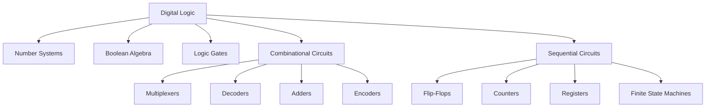
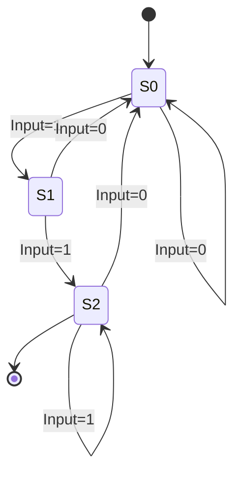
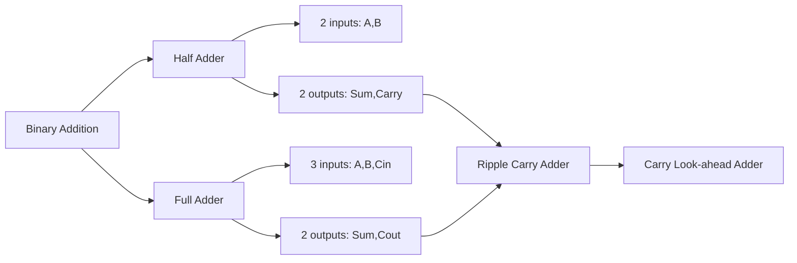
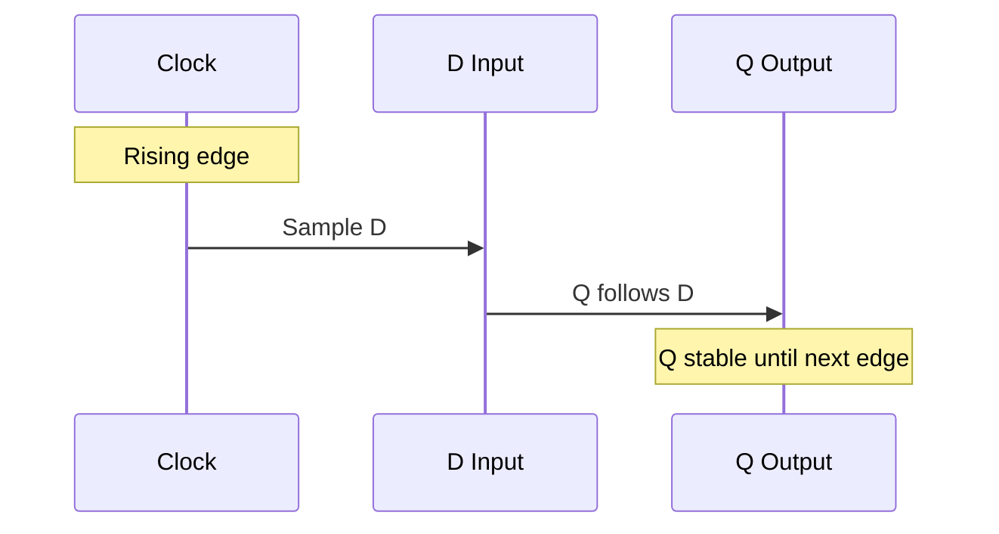
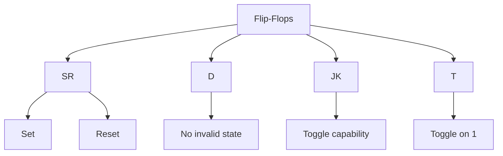

# Digital Logic & Design

## 1. Introduction

Digital Logic is the foundation of computer engineering and digital systems design. It deals with Boolean algebra, logic gates, and the design of digital circuits that perform arithmetic and logical operations. Understanding digital logic is essential for computer architecture, embedded systems, FPGA design, and hardware engineering.

This guide covers number systems, Boolean algebra, logic gates, combinational and sequential circuits, flip-flops, counters, registers, multiplexers, decoders, adders, FSM design, and Karnaugh maps.

**Why It Matters for Interviews:**
- Foundation of computer architecture
- Understanding of how processors work
- Essential for embedded systems roles
- Demonstrates hardware-software interface knowledge
- Common in chip design interviews (Intel, AMD, Qualcomm)

---

## 2. Learning Roadmap

### Phase 1: Foundations (Weeks 1-2)
- [ ] Number systems (Binary, Octal, Decimal, Hexadecimal)
- [ ] Number conversions and arithmetic
- [ ] Boolean algebra fundamentals
- [ ] Logic gates (AND, OR, NOT, NAND, NOR, XOR, XNOR)

### Phase 2: Combinational Logic (Weeks 3-4)
- [ ] Truth tables
- [ ] Boolean expressions (SOP, POS)
- [ ] Karnaugh maps
- [ ] Multiplexers, demultiplexers
- [ ] Encoders, decoders
- [ ] Adders (half, full, ripple carry, carry look-ahead)

### Phase 3: Sequential Logic (Weeks 5-6)
- [ ] Latches (SR, D, JK)
- [ ] Flip-flops (edge-triggered)
- [ ] Registers (shift registers, parallel registers)
- [ ] Counters (synchronous, asynchronous)

### Phase 4: Advanced Topics (Weeks 7-8)
- [ ] Finite State Machines (Mealy, Moore)
- [ ] State minimization
- [ ] State assignment
- [ ] Datapath and control unit design

### Phase 5: Practical Design (Weeks 9-10)
- [ ] HDL basics (Verilog/VHDL)
- [ ] FPGA basics
- [ ] Timing analysis
- [ ] Digital system design projects

---

## 3. Theory Notes

### Number Systems

| Base | Name | Digits | Example |
|------|------|--------|---------|
| 2 | Binary | 0,1 | 1010₂ |
| 8 | Octal | 0-7 | 12₈ |
| 10 | Decimal | 0-9 | 10₁₀ |
| 16 | Hexadecimal | 0-9,A-F | A₁₆ |

**Conversion Methods:**
```
Decimal → Binary:   Divide by 2, collect remainders
Binary → Decimal:   Sum of (bit × 2^position)
Binary → Octal:     Group bits in 3s from right
Binary → Hex:       Group bits in 4s from right
```

**Weighted Positional Notation:**
```
1011₂ = 1×2³ + 0×2² + 1×2¹ + 1×2⁰ = 8+0+2+1 = 11₁₀
```

### Boolean Algebra

**Basic Laws:**
```
Commutative:  A + B = B + A     A · B = B · A
Associative:  (A+B)+C = A+(B+C)  (A·B)·C = A·(B·C)
Distributive: A·(B+C) = A·B+A·C  A+(B·C) = (A+B)·(A+C)
Identity:     A + 0 = A          A · 1 = A
Complement:   A + A' = 1         A · A' = 0
Idempotent:   A + A = A          A · A = A
De Morgan's:  (A+B)' = A'·B'    (A·B)' = A'+B'
Absorption:   A + A·B = A        A·(A+B) = A
Involution:   (A')' = A
```

**De Morgan's Theorems (Critical):**
```
NAND: (A·B)' = A' + B'
NOR:  (A+B)' = A' · B'
```

### Logic Gates

| Gate | Symbol | Truth Table | Expression |
|------|--------|-------------|------------|
| AND | & | 0,0→0; 0,1→0; 1,0→0; 1,1→1 | A·B |
| OR | ≥1 | 0,0→0; 0,1→1; 1,0→1; 1,1→1 | A+B |
| NOT | 1 | 0→1; 1→0 | A' |
| NAND | &̄ | 0,0→1; 0,1→1; 1,0→1; 1,1→0 | (A·B)' |
| NOR | ≥1̄ | 0,0→1; 0,1→0; 1,0→0; 1,1→0 | (A+B)' |
| XOR | =1 | 0,0→0; 0,1→1; 1,0→1; 1,1→0 | A⊕B |
| XNOR | =1̄ | 0,0→1; 0,1→0; 1,0→0; 1,1→1 | (A⊕B)' |

**Universal Gates:** NAND and NOR are functionally complete — any Boolean function can be implemented using only NAND or only NOR gates.

### Karnaugh Maps (K-Maps)

**2-Variable K-Map:**
```
     B=0  B=1
A=0 |  0  |  1  |
A=1 |  1  |  1  |
```

**3-Variable K-Map:**
```
       BC=00 BC=01 BC=11 BC=10
A=0  |  0  |  1  |  1  |  0  |
A=1  |  1  |  1  |  0  |  1  |
```

**4-Variable K-Map:**
```
        CD=00 CD=01 CD=11 CD=10
AB=00 |  0  |  0  |  1  |  0  |
AB=01 |  1  |  1  |  0  |  1  |
AB=11 |  1  |  0  |  0  |  1  |
AB=10 |  0  |  1  |  1  |  0  |
```

**K-Map Grouping Rules:**
1. Group must contain 2^n cells (1, 2, 4, 8, ...)
2. Groups must be rectangular
3. Groups should be as large as possible
4. Groups can wrap around edges
5. Every 1 must be in at least one group
6. Use minimum number of groups

### Combinational Circuits

**Half Adder:**
```
Inputs: A, B
Outputs: Sum = A⊕B, Carry = A·B
```

**Full Adder:**
```
Inputs: A, B, Cin
Outputs: Sum = A⊕B⊕Cin, Cout = (A·B) + (Cin·(A⊕B))
```

**4-bit Ripple Carry Adder:**
```
Cin→[FA1]→C1→[FA2]→C2→[FA3]→C3→[FA4]→Cout
     A1,B1     A2,B2     A3,B3     A4,B4
     S1        S2        S3        S4
```

**Multiplexer (MUX):**
```
2:1 MUX:  Y = S'·D0 + S·D1
4:1 MUX:  Y = S1'·S0'·D0 + S1'·S0·D1 + S1·S0'·D2 + S1·S0·D3
```

**Decoder:**
```
2-to-4 Decoder:
A1 A0 | D3 D2 D1 D0
 0  0 |  0  0  0  1
 0  1 |  0  0  1  0
 1  0 |  0  1  0  0
 1  1 |  1  0  0  0
```

### Sequential Circuits

**SR Latch (NOR):**
```
S=0,R=0: Hold state (no change)
S=1,R=0: Set (Q=1)
S=0,R=1: Reset (Q=0)
S=1,R=1: Invalid (forbidden)
```

**D Flip-Flop:**
```
Q(next) = D (at clock edge)
No invalid states
Most commonly used flip-flop
```

**JK Flip-Flop:**
```
J=0,K=0: Hold
J=0,K=1: Reset
J=1,K=0: Set
J=1,K=1: Toggle
```

**Counters:**
```
Synchronous: All flip-flops clocked simultaneously
Asynchronous: Output of one flip-flop clocks the next

Up Counter:   000 → 001 → 010 → 011 → 100 → ...
Down Counter: 111 → 110 → 101 → 100 → 011 → ...
```

**Registers:**
```
Parallel Load: Load all bits simultaneously
Shift Right:   Q3→Q2→Q1→Q0 (serial input to Q3)
Shift Left:    Q0→Q1→Q2→Q3 (serial input to Q0)
Bidirectional: Can shift both directions
```

---

## 4. Key Concepts

### Number Representation

**Unsigned Binary:** 0 to 2^n - 1
**Signed Magnitude:** MSB is sign, rest is magnitude
**One's Complement:** Invert all bits for negative
**Two's Complement:** Invert bits + 1 for negative (standard)

**Two's Complement Examples (4-bit):**
```
+7:  0111
+6:  0110
+1:  0001
+0:  0000
-1:  1111
-2:  1110
-7:  1001
-8:  1000 (minimum)
```

**Overflow Detection:**
```
Adding two positives gives negative → overflow
Adding two negatives gives positive → overflow
Adding positive and negative → never overflows
```

### FSM Design

**Moore Machine:**
```
Output depends only on current state
Output = f(State)
```

**Mealy Machine:**
```
Output depends on current state AND input
Output = f(State, Input)
```

**FSM Design Steps:**
1. Define states from problem description
2. Draw state diagram
3. Determine state encoding
4. Derive next-state and output equations
5. Implement with flip-flops and logic gates

### State Minimization

**Implication Table Method:**
1. Create table with all state pairs
2. Mark pairs with different outputs as distinguishable
3. Iterate: mark pairs if their next-state pairs are distinguishable
4. Merge equivalent states

---

## 5. FAQ (20+ Q&A)

### Q1: What is the difference between combinational and sequential circuits?
**A:** Combinational circuits' outputs depend only on current inputs (no memory). Sequential circuits' outputs depend on current inputs AND previous state (have memory). Examples: Adder (combinational), Counter (sequential).

### Q2: Why is two's complement preferred for signed numbers?
**A:** Two's complement simplifies arithmetic — addition and subtraction use the same hardware. There's only one representation for zero, and overflow detection is straightforward.

### Q3: What is a universal gate?
**A:** NAND and NOR are universal gates because any Boolean function can be implemented using only NAND or only NOR gates. This is important for manufacturing — you can build any circuit from a single gate type.

### Q4: What is the difference between a latch and a flip-flop?
**A:** A latch is level-sensitive (transparent when enabled). A flip-flop is edge-triggered (samples input only at clock edge). Flip-flops are preferred in synchronous designs for predictable timing.

### Q5: What is clock skew?
**A:** Clock skew is the difference in arrival time of the clock signal at different flip-flops. It can cause setup/hold time violations and metastability. Minimized through careful clock tree design.

### Q6: What is metastability?
**A:** When a flip-flop's input violates setup or hold time, the output can enter an unstable state between 0 and 1 for an unpredictable duration. Resolved by using synchronizer flip-flops (two-stage).

### Q7: What is the purpose of Karnaugh maps?
**A:** K-Maps provide a visual method for simplifying Boolean expressions. They identify prime implicants and essential prime implicants to produce minimal sum-of-products forms.

### Q8: What is the difference between SOP and POS?
**A:** Sum-of-Products (SOP) is AND terms OR'd together (e.g., AB + A'C). Product-of-Sums (POS) is OR terms AND'd together (e.g., (A+B)(A'+C)). Both are canonical forms.

### Q9: How does a multiplexer work?
**A:** A multiplexer selects one of several input signals based on select lines. A 2^n:1 MUX has n select lines and 2^n data inputs. It's a universal logic element — any Boolean function can be implemented with a MUX.

### Q10: What is a ripple carry adder?
**A:** A ripple carry adder chains full adders, where the carry output of one stage feeds the carry input of the next. The carry must "ripple" through all stages, creating propagation delay. CLA adders reduce this delay.

### Q11: What is carry look-ahead addition?
**A:** CLA pre-computes carry signals using generate (G=A·B) and propagate (P=A+B) signals. All carries are computed in parallel, reducing delay from O(n) to O(log n) at the cost of more gates.

### Q12: What is the difference between a Moore and Mealy machine?
**A:** In Moore machines, output depends only on current state. In Mealy machines, output depends on current state AND inputs. Mealy machines can have fewer states but may produce glitches.

### Q13: What is state encoding?
**A:** Assigning binary codes to FSM states. Methods include binary (minimal flip-flops), one-hot (one flip-flop per state, faster), and gray code (minimal bit transitions for power savings).

### Q14: What is a shift register?
**A:** A register that can shift its contents left or right. Used for serial-to-parallel conversion, parallel-to-serial conversion, and arithmetic operations (shift = multiply/divide by 2).

### Q15: What is an asynchronous counter?
**A:** A counter where flip-flops are not clocked simultaneously. The output of one flip-flop drives the clock of the next. Simpler but slower due to propagation delay accumulation.

### Q16: What is synchronous design?
**A:** All flip-flops are triggered by the same clock signal. Provides deterministic timing, eliminates race conditions, and is the standard for modern digital design.

### Q17: What is a priority encoder?
**A:** An encoder where multiple inputs can be active simultaneously, but only the highest-priority active input is encoded. Used in interrupt controllers and arbiters.

### Q18: What is the difference between positive and negative logic?
**A:** Positive logic: high voltage = 1, low voltage = 0. Negative logic: high voltage = 0, low voltage = 1. Same circuit can implement different functions depending on logic convention.

### Q19: What is hazard logic?
**A:** Hazards are unwanted glitches in combinational circuits caused by different propagation delays. Static hazards produce a momentary wrong value. Dynamic hazards produce multiple transitions. Can be eliminated by adding redundant terms.

### Q20: What is a PLA vs PAL vs ROM?
**A:** PLA (Programmable AND and OR planes), PAL (Fixed OR, programmable AND), ROM (Fixed AND [decoder], programmable OR). ROM is a lookup table, PLA/PAL are more flexible programmable logic.

---

## 6. Hands-on Practice

### Exercise 1: Number System Conversion
Convert `156₁₀` to binary, octal, and hexadecimal.

**Binary (Division by 2):**
```
156 / 2 = 78 R 0
78 / 2 = 39 R 0
39 / 2 = 19 R 1
19 / 2 = 9 R 1
9 / 2 = 4 R 1
4 / 2 = 2 R 0
2 / 2 = 1 R 0
1 / 2 = 0 R 1
→ 10011100₂
```

**Octal:** Group in 3s → `234₈`
**Hex:** Group in 4s → `9C₁₆`

### Exercise 2: K-Map Simplification
Simplify: F(A,B,C,D) = Σm(0,1,2,5,6,7,8,9,10,14)

**K-Map:**
```
        CD=00 CD=01 CD=11 CD=10
AB=00 |  1  |  1  |  0  |  1  |
AB=01 |  0  |  1  |  1  |  1  |
AB=11 |  0  |  0  |  0  |  1  |
AB=10 |  1  |  1  |  0  |  1  |
```

**Groups:**
- Group 1 (8 cells): AB=00 row + AB=10 row → B'D'
- Group 2 (4 cells): Corners → B'D' (overlap)
- Group 3 (4 cells): CD=01 column → B'C'D
- Group 4 (2 cells): AB=01, CD=10,11 → A'BC

**Simplified:** F = B'D' + B'C'D + A'BC

### Exercise 3: Design a 4-bit Ripple Carry Adder
```verilog
module full_adder(input a, b, cin, output sum, cout);
    assign sum = a ^ b ^ cin;
    assign cout = (a & b) | (cin & (a ^ b));
endmodule

module ripple_carry_adder(
    input [3:0] a, b,
    input cin,
    output [3:0] sum,
    output cout
);
    wire c1, c2, c3;
    full_adder fa0(a[0], b[0], cin, sum[0], c1);
    full_adder fa1(a[1], b[1], c1, sum[1], c2);
    full_adder fa2(a[2], b[2], c2, sum[2], c3);
    full_adder fa3(a[3], b[3], c3, sum[3], cout);
endmodule
```

### Exercise 4: Design a Mod-6 Counter
Design a synchronous counter that counts 0→1→2→3→4→5→0→...

**State Table:**
```
Present | Next
Q2 Q1 Q0 | Q2 Q1 Q0
 0  0  0 |  0  0  1
 0  0  1 |  0  1  0
 0  1  0 |  0  1  1
 0  1  1 |  1  0  0
 1  0  0 |  1  0  1
 1  0  1 |  0  0  0
```

---

## 7. FAANG Questions

### Intel/AMD/Qualcomm (Hardware-focused)
1. Design a 16-bit carry look-ahead adder.
2. How would you minimize power in a sequential circuit?
3. Design a booth multiplier for signed numbers.
4. What is the critical path in a pipelined processor?

### Google (Systems)
5. How does a CPU execute instructions at the gate level?
6. Design a circuit to detect if two 8-bit numbers are equal.
7. How does cache memory work at the hardware level?
8. Explain the difference between synchronous and asynchronous SRAM.

### Amazon (Embedded)
9. Design a traffic light controller FSM.
10. How would you interface a 7-segment display?
11. Design a serial-to-parallel converter.
12. What are the timing constraints for a flip-flop?

### Meta/Apple (Design)
13. How would you design a digital clock using flip-flops?
14. Design a 4-to-1 MUX using only NAND gates.
15. What is the difference between FPGA and ASIC?
16. How would you test a sequential circuit?

### NVIDIA (GPU/Parallel)
17. Design an ALU that supports add, subtract, AND, OR, XOR.
18. How does a barrel shifter work?
19. Design a priority encoder for 8 inputs.
20. What is the difference between a systolic array and a SIMD unit?

---

## 8. Common Mistakes

### Number Systems
1. **Forgetting two's complement for negative** → Wrong results
2. **Incorrect bit grouping for hex/octal** → Conversion errors
3. **Not handling overflow** → Silent data corruption
4. **Confusing signed and unsigned** → Unexpected comparisons

### Boolean Algebra
5. **Not applying De Morgan's correctly** → Wrong simplifications
6. **Forgetting distribution** → Incomplete factorization
7. **Incorrect K-map grouping** → Non-minimal expressions
8. **Not considering don't cares** → Oversimplified or over-complex circuits

### Combinational Circuits
9. **Ignoring propagation delay** → Timing violations
10. **Not handling hazards** → Glitches in output
11. **Incorrect MUX select logic** → Wrong input selected
12. **Missing encoder priority** → Undefined behavior

### Sequential Circuits
13. **Ignoring setup/hold time** → Metastability
14. **Not synchronizing asynchronous inputs** → Race conditions
15. **Incorrect clock edge triggering** → Wrong state transitions
16. **Forgetting reset initialization** → Undefined starting state

### FSM Design
17. **Not defining all states** → Stuck in undefined state
18. **Wrong state encoding** → Timing or power issues
19. **Missing state minimization** → Wasted resources
20. **Incomplete output coverage** → Undefined outputs

---

## 9. Best Practices

### Design Process
1. Start with a clear problem specification
2. Draw truth tables before implementing
3. Simplify Boolean expressions using K-maps
4. Choose appropriate circuit type (combinational vs sequential)
5. Verify with simulation before implementation

### K-Map Best Practices
1. List all minterms and don't cares
2. Group largest possible power-of-2 groups
3. Prioritize groups covering most 1s
4. Check for multiple minimal solutions
5. Verify simplification by expanding

### Sequential Design
1. Always include asynchronous reset
2. Synchronize all asynchronous inputs
3. Use synchronous design methodology
4. Minimize clock skew
5. Test at worst-case timing conditions

### Verification
1. Test all input combinations for small circuits
2. Verify edge cases (all 0s, all 1s, max/min values)
3. Check for timing violations
4. Simulate before synthesis
5. Use formal verification when possible

### Documentation
1. Draw clear block diagrams
2. Document all assumptions
3. Include timing diagrams
4. Record state diagrams for FSMs
5. Note any design trade-offs

---

## 10. Cheat Sheet

### Boolean Algebra Laws
```
Commutative:  A+B=B+A    A·B=B·A
Associative:  (A+B)+C=A+(B+C)
Distributive: A·(B+C)=A·B+A·C
Identity:     A+0=A      A·1=A
Complement:   A+A'=1     A·A'=0
De Morgan's:  (A+B)'=A'·B'   (A·B)'=A'+B'
Absorption:   A+A·B=A
```

### Two's Complement (4-bit)
```
 0: 0000    -1: 1111
 1: 0001    -2: 1110
 2: 0010    -3: 1101
 3: 0011    -4: 1100
 4: 0100    -5: 1011
 5: 0101    -6: 1010
 6: 0110    -7: 1001
 7: 0111    -8: 1000
```

### Gate Equivalences
```
NAND: A NAND B = (A·B)' = NOT(A AND B)
NOR:  A NOR B = (A+B)' = NOT(A OR B)
XOR:  A XOR B = A·B' + A'·B
XNOR: A XNOR B = A·B + A'·B'
NOT:  A = (A NAND A) = (A NOR A)
AND:  A·B = (A NAND B) NAND (A NAND B)
OR:   A+B = (A NAND A) NAND (B NAND B)
```

### Flip-Flop Excitation Tables
```
SR FF:
Q→Qnext | S R
0→0     | 0 X
0→1     | 1 0
1→0     | 0 1
1→1     | X 0

D FF:
Q→Qnext | D
0→0     | 0
0→1     | 1
1→0     | 0
1→1     | 1

JK FF:
Q→Qnext | J K
0→0     | 0 X
0→1     | 1 X
1→0     | X 1
1→1     | X 0
```

### Adder Truth Table
```
Half Adder:  A B | Sum Carry
            0 0 |  0    0
            0 1 |  1    0
            1 0 |  1    0
            1 1 |  0    1
```

---

## 11. Flash Cards (20)

1. **Q: What is two's complement?**
   A: A method of representing signed numbers where negative numbers are formed by inverting all bits and adding 1.

2. **Q: What is a universal gate?**
   A: A gate from which any Boolean function can be implemented. NAND and NOR are universal.

3. **Q: What is the difference between a latch and a flip-flop?**
   A: Latch is level-sensitive; flip-flop is edge-triggered.

4. **Q: What is De Morgan's theorem?**
   A: (A+B)' = A'·B' and (A·B)' = A'+B'. Converts between AND/OR through complementation.

5. **Q: What is a Karnaugh map?**
   A: A graphical tool for simplifying Boolean expressions by grouping adjacent 1s in a grid.

6. **Q: What is SOP form?**
   A: Sum-of-Products: AND terms OR'd together, e.g., AB + A'C.

7. **Q: What is a multiplexer?**
   A: A circuit that selects one of several inputs based on select lines.

8. **Q: What is a half adder?**
   A: Adds two binary digits, producing Sum (A⊕B) and Carry (A·B).

9. **Q: What is a full adder?**
   A: Adds three binary digits (A, B, Cin), producing Sum and Cout.

10. **Q: What is a ripple carry adder?**
    A: A chain of full adders where carry propagates from LSB to MSB.

11. **Q: What is a shift register?**
    A: A register that shifts its contents left or right on each clock pulse.

12. **Q: What is a counter?**
    A: A sequential circuit that cycles through a predetermined sequence of states.

13. **Q: What is a Moore machine?**
    A: An FSM where output depends only on the current state.

14. **Q: What is a Mealy machine?**
    A: An FSM where output depends on current state AND inputs.

15. **Q: What is metastability?**
    A: An unstable state when setup/hold time is violated, causing unpredictable output.

16. **Q: What is clock skew?**
    A: The difference in clock arrival time at different flip-flops.

17. **Q: What is a decoder?**
    A: A circuit that converts n input lines to 2^n output lines (one-hot).

18. **Q: What is an encoder?**
    A: A circuit that converts 2^n input lines to n output lines (binary).

19. **Q: What is a JK flip-flop?**
    A: A flip-flop with J (set) and K (reset) inputs; toggles when J=K=1.

20. **Q: What is asynchronous reset?**
    A: A reset that immediately forces the flip-flop to a known state regardless of clock.

---

## 12. Mind Map

```
                      Digital Logic
                          |
     ┌──────────┬─────────┼─────────┬──────────┐
     |          |         |         |          |
  Number     Boolean    Logic     Circuits   FSM
  Systems    Algebra   Gates      |          |
     |          |         |    ┌───┼───┐   ┌──┼──┐
  Binary    Laws      NAND  Combin. Seq. Moore Mealy
  Hex       DeMorgan  NOR   |    |    |
  2's Comp  K-Map     XOR   MUX  FF   Counter
  Overflow  Simplify  XNOR  Decoder Reg  Register
```

---

## 13. Mermaid Diagrams

### Digital Logic Hierarchy


### FSM State Diagram


### Adder Comparison


### Sequential Circuit Timing


### Flip-Flop Types


---

## 14. Code Examples

### Example 1: Binary to Decimal Converter (Python)
```python
def binary_to_decimal(binary_str):
    decimal = 0
    for i, bit in enumerate(reversed(binary_str)):
        decimal += int(bit) * (2 ** i)
    return decimal

def decimal_to_binary(decimal):
    if decimal == 0:
        return "0"
    binary = ""
    while decimal > 0:
        binary = str(decimal % 2) + binary
        decimal //= 2
    return binary

def twos_complement(bits, number):
    if number >= 0:
        return format(number, f'0{bits}b')
    else:
        positive = format(-number, f'0{bits}b')
        inverted = ''.join('1' if b == '0' else '0' for b in positive)
        return decimal_to_binary(binary_to_decimal(inverted) + 1)

# Examples
print(binary_to_decimal("1010"))   # 10
print(decimal_to_binary(156))      # 10011100
print(twos_complement(8, -5))      # 11111011
```

### Example 2: Boolean Expression Simplifier
```python
def evaluate_expression(expr, variables):
    """Evaluate a boolean expression with given variable values."""
    for var, val in variables.items():
        expr = expr.replace(var, str(val))
    expr = expr.replace('&', ' and ').replace('|', ' or ')
    expr = expr.replace("'", ' not ')
    return eval(expr)

def generate_truth_table(variables, expression):
    """Generate truth table for a boolean expression."""
    n = len(variables)
    var_names = list(variables.keys())
    table = []
    
    for i in range(2**n):
        values = [(i >> (n-1-j)) & 1 for j in range(n)]
        variables = dict(zip(var_names, values))
        result = evaluate_expression(expression, variables)
        table.append((values, result))
    
    return table

# Example: F = A AND (B OR C)
vars = ['A', 'B', 'C']
table = generate_truth_table(vars, "A & (B | C')")
for row in table:
    print(f"{row[0]} -> {row[1]}")
```

### Example 3: K-Map Solver
```python
def solve_kmap_3var(minterms, don't_cares=None):
    """Solve a 3-variable K-Map."""
    if don't_cares is None:
        don't_cares = set()
    
    # K-Map layout: A on rows, BC on columns
    kmap = [[0]*4 for _ in range(2)]
    
    # Gray code ordering for columns: 00, 01, 11, 10
    col_order = [0, 1, 3, 2]
    position_map = {}
    
    for i in range(2):
        for j in range(4):
            bc_val = col_order[j]
            position_map[(i, bc_val)] = (i, j)
            if i * 4 + bc_val in minterms or i * 4 + bc_val in don't_cares:
                kmap[i][j] = 1
    
    print("K-Map:")
    print("    BC=00 BC=01 BC=11 BC=10")
    for i in range(2):
        print(f"A={i} |", end="")
        for j in range(4):
            print(f"  {kmap[i][j]}  |", end="")
        print()
    
    return kmap

# Example
print("F(A,B,C) = Σm(1,2,3,5,6)")
kmap = solve_kmap_3var([1, 2, 3, 5, 6])
```

### Example 4: FSM Implementation
```python
from enum import Enum

class State(Enum):
    S0 = 0
    S1 = 1
    S2 = 2

class MealyFSM:
    def __init__(self):
        self.state = State.S0
        self.transition_table = {
            State.S0: {0: (State.S0, 0), 1: (State.S1, 0)},
            State.S1: {0: (State.S0, 0), 1: (State.S2, 0)},
            State.S2: {0: (State.S0, 0), 1: (State.S2, 1)},
        }
    
    def reset(self):
        self.state = State.S0
    
    def transition(self, input_bit):
        next_state, output = self.transition_table[self.state][input_bit]
        self.state = next_state
        return output

# Test: Detect sequence "111"
fsm = MealyFSM()
test_input = [1, 0, 1, 1, 1, 1, 0, 1, 1, 1]
outputs = []
for bit in test_input:
    out = fsm.transition(bit)
    outputs.append(out)
    print(f"Input: {bit}, State: {fsm.state.name}, Output: {out}")
```

### Example 5: Carry Look-Ahead Adder (Verilog)
```verilog
module cla_adder(
    input [3:0] a, b,
    input cin,
    output [3:0] sum,
    output cout
);
    wire [3:0] g, p;  // Generate and Propagate
    wire [4:0] c;     // Carry chain
    
    // Generate and Propagate
    assign g = a & b;          // Generate: both bits are 1
    assign p = a ^ b;          // Propagate: exactly one bit is 1
    
    // Carry chain
    assign c[0] = cin;
    assign c[1] = g[0] | (p[0] & c[0]);
    assign c[2] = g[1] | (p[1] & g[0]) | (p[1] & p[0] & c[0]);
    assign c[3] = g[2] | (p[2] & g[1]) | (p[2] & p[1] & g[0]) | 
                  (p[2] & p[1] & p[0] & c[0]);
    assign c[4] = g[3] | (p[3] & g[2]) | (p[3] & p[2] & g[1]) | 
                  (p[3] & p[2] & p[1] & g[0]) | 
                  (p[3] & p[2] & p[1] & p[0] & c[0]);
    
    // Sum
    assign sum = p ^ c[3:0];
    assign cout = c[4];
endmodule
```

---

## 15. Projects

### Project 1: 4-bit ALU Design
**Objective:** Design an ALU supporting multiple operations.
**Operations:** ADD, SUB, AND, OR, XOR, NOT, SLT (set less than)
**Components:** Full adders, MUX, comparators
**Deliverables:** Block diagram, Verilog code, testbench

### Project 2: Digital Clock
**Objective:** Build a digital clock with hours, minutes, seconds.
**Components:** Counters (mod-60, mod-24), BCD decoder, 7-segment display driver
**Features:** Alarm setting, AM/PM indicator

### Project 3: Traffic Light Controller
**Objective:** FSM-based traffic light controller for an intersection.
**States:** NS Green, NS Yellow, EW Green, EW Yellow
**Inputs:** Car sensors, emergency vehicle detection
**Outputs:** Light signals, pedestrian signals

### Project 4: Simple Calculator
**Objective:** 4-function calculator (add, subtract, multiply, divide).
**Components:** ALU, registers, control unit, display driver
**Interface:** Keypad input, 7-segment output

---

## 16. Resources

### Books
- "Digital Design" by Morris Mano
- "Digital Design and Computer Architecture" by Harris & Harris
- "Fundamentals of Logic Design" by Roth
- "CMOS VLSI Design" by Weste & Harris

### Online Courses
- [Nand2Tetris](https://www.nand2tetris.org/) (Build computer from gates)
- [MIT 6.004: Computation Structures](https://computationstructures.org/)
- [Coursera: Digital Systems](https://www.coursera.org/learn/digital-systems)

### Tools
- **Simulation**: Logisim, Digital (GitHub), Vivado
- **HDL**: Verilog, VHDL, SystemVerilog
- **FPGA**: Xilinx Vivado, Intel Quartus
- **Visualization**: K-Map tools, truth table generators

### Practice Platforms
- HDLBits (online Verilog exercises)
- NPTEL Digital Logic courses
- FPGA4Fun (projects and tutorials)

---

## 17. Checklist

### Number Systems
- [ ] Binary/Decimal/Hex conversions
- [ ] Two's complement representation
- [ ] Overflow detection
- [ ] Arithmetic operations (add, subtract, multiply)

### Boolean Algebra
- [ ] All laws memorized (commutative, associative, etc.)
- [ ] De Morgan's theorems applied correctly
- [ ] K-Map simplification (2, 3, 4 variables)
- [ ] SOP and POS forms

### Combinational Circuits
- [ ] Half and full adder design
- [ ] Multiplexer implementation
- [ ] Decoder/encoder design
- [ ] Priority encoder
- [ ] Hazard analysis and elimination

### Sequential Circuits
- [ ] SR, D, JK flip-flop operation
- [ ] Setup and hold time analysis
- [ ] Counter design (up, down, mod-n)
- [ ] Register design (parallel, shift)

### FSM Design
- [ ] State diagram creation
- [ ] State table derivation
- [ ] State minimization
- [ ] State encoding (binary, one-hot)
- [ ] Verilog/VHDL implementation

---

## 18. Revision Plans

### Week 1: Foundations
- Day 1-2: Number systems and conversions
- Day 3-4: Boolean algebra laws
- Day 5-7: K-Map practice problems

### Week 2: Combinational Circuits
- Day 1-2: Truth tables and Boolean expressions
- Day 3-4: MUX, decoders, encoders
- Day 5-7: Adders (half, full, CLA)

### Week 3: Sequential Circuits
- Day 1-2: Latches and flip-flops
- Day 3-4: Counters (synchronous, asynchronous)
- Day 5-7: Registers and shift registers

### Week 4: Advanced
- Day 1-2: FSM design (Moore, Mealy)
- Day 3-4: State minimization and encoding
- Day 5-7: Practice projects and problems

---

## 19. Mock Interviews

### Round 1: Fundamentals (30 min)
1. Convert 156₁₀ to binary, octal, and hex.
2. What is the two's complement of 5 in 8 bits?
3. Simplify using K-maps: F(A,B,C) = Σm(0,1,2,5,6,7).
4. Draw the truth table for a full adder.

### Round 2: Circuit Design (45 min)
1. Design a 4-to-1 MUX using only NAND gates.
2. Design a 3-bit synchronous up/down counter.
3. What is the difference between a latch and flip-flop?
4. Draw the timing diagram for a D flip-flop.

### Round 3: FSM Design (30 min)
1. Design a traffic light controller FSM.
2. Minimize the number of states in this FSM.
3. What's the difference between Moore and Mealy?
4. Implement your FSM in Verilog.

### Round 4: Advanced (30 min)
1. How does a carry look-ahead adder work?
2. Design a serial adder.
3. What is metastability and how do you prevent it?
4. Compare synchronous and asynchronous counters.

---

## 20. Difficulty Rating

| Topic | Difficulty | Interview Frequency |
|-------|-----------|-------------------|
| Number Systems | ⭐ (Very Easy) | High |
| Boolean Algebra | ⭐⭐ (Easy) | High |
| K-Maps | ⭐⭐⭐ (Medium) | High |
| Logic Gates | ⭐ (Very Easy) | High |
| Multiplexers | ⭐⭐ (Easy) | Medium |
| Decoders/Encoders | ⭐⭐ (Easy) | Medium |
| Half/Full Adders | ⭐⭐ (Easy) | High |
| Flip-Flops | ⭐⭐⭐ (Medium) | High |
| Counters | ⭐⭐⭐ (Medium) | Medium |
| Registers | ⭐⭐ (Easy) | Medium |
| FSM Design | ⭐⭐⭐⭐ (Hard) | High |
| State Minimization | ⭐⭐⭐⭐ (Hard) | Medium |
| CLA Adder | ⭐⭐⭐⭐ (Hard) | Low |
| Two's Complement | ⭐⭐ (Easy) | Very High |

---

## 21. Summary

Digital Logic is the foundation of all digital systems. Key takeaways:

1. **Number Systems**: Master conversions between binary, decimal, hex, and two's complement
2. **Boolean Algebra**: Laws and De Morgan's theorems are essential for simplification
3. **K-Maps**: Visual method for minimizing Boolean expressions
4. **Combinational Circuits**: MUX, decoders, adders — building blocks of digital systems
5. **Sequential Circuits**: Flip-flops, counters, registers — add memory to circuits
6. **FSMs**: Model sequential behavior with states, transitions, and outputs
7. **Timing**: Setup/hold time, clock skew, metastability are critical concerns

**Interview Tip:** Practice drawing truth tables and state diagrams quickly. Being able to design a simple FSM on a whiteboard demonstrates strong fundamentals.
