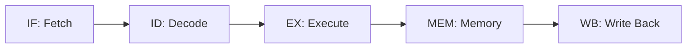
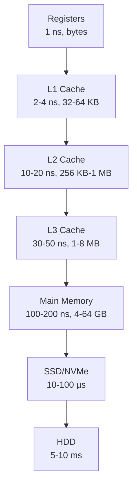
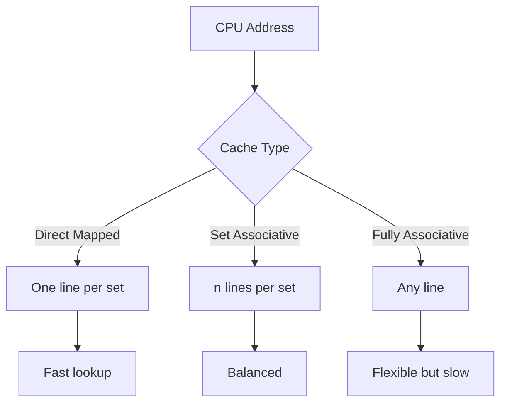
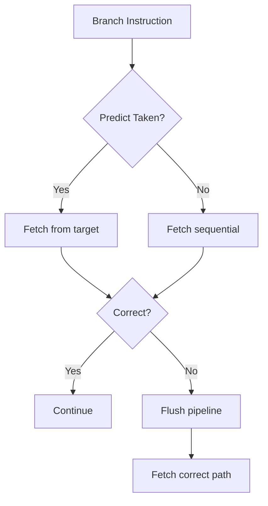
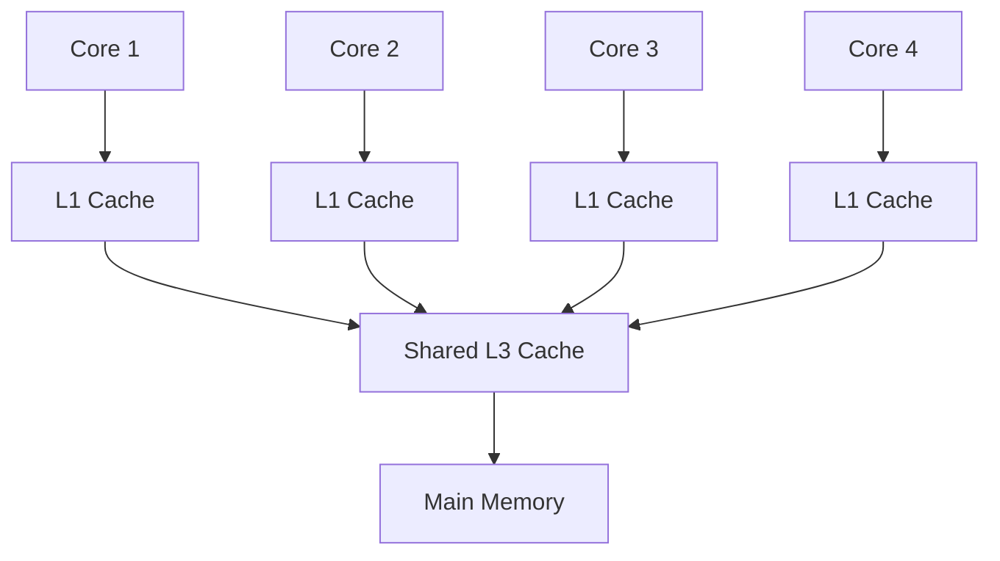

# Computer Architecture & Organization

## 1. Introduction

Computer Architecture defines how hardware components are organized and interconnected to execute instructions. It encompasses CPU design, instruction set architectures, memory hierarchy, pipelining, and I/O systems. Understanding architecture is crucial for performance optimization, systems programming, and hardware-software co-design.

This guide covers CPU design, ISAs (RISC vs CISC), pipelining, cache memory, virtual memory, I/O systems, bus architecture, multi-core processors, memory hierarchy, and branch prediction.

**Why It Matters for Interviews:**
- Essential for systems programming roles
- Understanding performance bottlenecks
- Foundation for operating systems knowledge
- Critical for embedded and hardware interviews
- Common in FAANG systems interviews

---

## 2. Learning Roadmap

### Phase 1: Foundations (Weeks 1-2)
- [ ] Number representation and arithmetic
- [ ] CPU components and organization
- [ ] Instruction set architecture (ISA)
- [ ] RISC vs CISC philosophy

### Phase 2: Pipelining (Weeks 3-4)
- [ ] 5-stage pipeline
- [ ] Pipeline hazards (data, control, structural)
- [ ] Forwarding and bypassing
- [ ] Branch prediction techniques

### Phase 3: Memory Hierarchy (Weeks 5-6)
- [ ] Cache organization (direct, associative, set-associative)
- [ ] Cache policies (write-back, write-through)
- [ ] Cache performance and miss types (3 C's)
- [ ] Virtual memory and TLB

### Phase 4: Advanced Topics (Weeks 7-8)
- [ ] Multi-core processors
- [ ] Memory consistency models
- [ ] I/O systems and interrupts
- [ ] Bus architecture

### Phase 5: Performance (Weeks 9-10)
- [ ] Performance metrics and benchmarks
- [ ] Amdahl's Law
- [ ] Power consumption
- [ ] Modern architectures (GPU, TPU)

---

## 3. Theory Notes

### CPU Components

```
┌─────────────────────────────────────────────┐
│                   CPU                        │
│  ┌──────────┐  ┌──────────┐  ┌──────────┐  │
│  │ Control  │  │ Datapath │  │ Registers│  │
│  │  Unit    │  │ (ALU)    │  │          │  │
│  └──────────┘  └──────────┘  └──────────┘  │
│  ┌──────────┐  ┌──────────┐  ┌──────────┐  │
│  │ Instruction│ │ Program  │  │ Cache    │  │
│  │ Decoder   │  │ Counter  │  │ (L1/L2)  │  │
│  └──────────┘  └──────────┘  └──────────┘  │
└─────────────────────────────────────────────┘
```

**Key Components:**
- **ALU**: Arithmetic Logic Unit — performs arithmetic and logical operations
- **Control Unit**: Directs data flow and operation sequencing
- **Registers**: Fast on-chip storage (general purpose + special purpose)
- **PC**: Program Counter — holds address of next instruction
- **IR**: Instruction Register — holds current instruction
- **MAR/MDR**: Memory Address/Data Registers for memory access

### Instruction Set Architecture (ISA)

**RISC (Reduced Instruction Set Computer):**
```
- Fixed-length instructions (32 bits typical)
- Load/Store architecture (only load/store access memory)
- Large register file (32+ registers)
- Simple addressing modes
- Hardwired control unit
- Examples: ARM, MIPS, RISC-V, SPARC
```

**CISC (Complex Instruction Set Computer):**
```
- Variable-length instructions (1-15 bytes)
- Memory-to-memory operations
- Smaller register file
- Many addressing modes
- Microprogrammed control unit
- Examples: x86, x86-64, VAX
```

**Comparison Table:**
| Aspect | RISC | CISC |
|--------|------|------|
| Instruction Length | Fixed | Variable |
| Instruction Count | High | Low |
| Cycles per Instruction | Low (1-2) | High (1-15) |
| Code Size | Larger | Smaller |
| Power Consumption | Lower | Higher |
| Compiler Complexity | Simpler | More Complex |
| Hardware Complexity | Simpler | More Complex |

### Pipelining

**Classic 5-Stage Pipeline:**
```
Stage 1: IF   (Instruction Fetch)
Stage 2: ID   (Instruction Decode / Register Read)
Stage 3: EX   (Execute / ALU Operation)
Stage 4: MEM  (Memory Access)
Stage 5: WB   (Write Back)
```

**Pipeline Diagram (without hazards):**
```
Clock:     1    2    3    4    5    6    7    8
Instr 1:  IF   ID   EX   MEM  WB
Instr 2:       IF   ID   EX   MEM  WB
Instr 3:            IF   ID   EX   MEM  WB
Instr 4:                 IF   ID   EX   MEM  WB
```

**Pipeline Hazards:**

1. **Data Hazard**: Instruction depends on result of previous instruction
```
ADD R1, R2, R3   ; R1 = R2 + R3
SUB R4, R1, R5   ; Uses R1 before it's written back
```

2. **Control Hazard**: Branch instruction affects next instruction fetch
```
BEQ R1, R2, LABEL  ; Branch decision affects IF stage
ADD ...            ; Speculative fetch may be wrong
```

3. **Structural Hazard**: Hardware resource conflict
```
IF needs instruction memory
MEM needs data memory
→ Both cannot access memory simultaneously
```

**Solutions:**
- Data hazards: Forwarding/bypassing, pipeline stalls (bubbles)
- Control hazards: Branch prediction, delayed branch, branch target buffer
- Structural hazards: Separate instruction/data memories (Harvard architecture)

### Branch Prediction

**Static Prediction:**
- Always predict taken / not taken
- Predict backward taken, forward not taken

**Dynamic Prediction:**
- 1-bit predictor: Flip on misprediction
- 2-bit saturating counter: Requires two mispredictions to change
- Branch History Table (BHT): Record recent outcomes
- Tournament predictor: Combines multiple predictors

### Cache Memory

**Cache Organization:**

```
Address = [ Tag | Index | Offset ]
```

**Direct-Mapped Cache:**
```
Each memory block maps to exactly one cache line
Cache line = (Block address) mod (Number of cache lines)
Fast lookup but high conflict misses
```

**Fully Associative Cache:**
```
Any memory block can go in any cache line
Need to search all lines on lookup
No conflict misses but expensive hardware
```

**Set-Associative Cache (n-way):**
```
Cache divided into sets, each set has n lines
Block maps to set: (Block address) mod (Number of sets)
Within set, fully associative
Compromise between direct-mapped and fully associative
```

**Cache Policies:**

| Policy | Description | Pros | Cons |
|--------|-------------|------|------|
| Write-Through | Write to cache and memory simultaneously | Simple, consistent | Slow writes |
| Write-Back | Write only to cache, write to memory when evicted | Fast writes | Complex, inconsistent |
| Write-Allocate | On miss, load block into cache | Better locality | Extra memory access |
| No-Write-Allocate | On miss, write directly to memory | Simpler | Less locality |

**The 3 C's of Cache Misses:**
1. **Compulsory (Cold)**: First access to a block — unavoidable
2. **Capacity**: Cache too small for working set — increase cache size
3. **Conflict**: Multiple blocks map to same cache line — increase associativity

### Virtual Memory

```
Virtual Address = [ Virtual Page Number | Page Offset ]
Physical Address = [ Physical Frame Number | Page Offset ]
```

**Page Table:**
```
VPN → PFN mapping
Valid bit: Is page in memory?
Dirty bit: Has page been modified?
Reference bit: Has page been accessed?
Protection bits: Read/Write/Execute
```

**TLB (Translation Lookaside Buffer):**
- Cache for page table entries
- Reduces average memory access time
- TLB hit: Fast translation
- TLB miss: Page table lookup required

**Page Replacement Policies:**
- LRU (Least Recently Used): Best approximation of optimal
- FIFO: Simple but suffers from Belady's anomaly
- Clock (Second Chance): Approximation of LRU
- Optimal: Replace page not used for longest time (theoretical)

### Memory Hierarchy

```
Register File (1 ns, bytes)
    ↓
L1 Cache (2-4 ns, 32-64 KB)
    ↓
L2 Cache (10-20 ns, 256 KB-1 MB)
    ↓
L3 Cache (30-50 ns, 1-8 MB)
    ↓
Main Memory (100-200 ns, 4-64 GB)
    ↓
SSD/NVMe (10-100 μs, 256 GB-4 TB)
    ↓
HDD (5-10 ms, 1-20 TB)
```

**Principle of Locality:**
- **Temporal**: Recently accessed data likely to be accessed again
- **Spatial**: Data near recently accessed data likely to be accessed

### Multi-Core Processors

**Symmetric Multiprocessing (SMP):**
- All cores share same memory
- Cores are identical
- Simple programming model

**Cache Coherence Protocols:**
- **MESI**: Modified, Exclusive, Shared, Invalid
- **MOESI**: Adds Owned state
- **MESIF**: Adds Forward state (Intel)

**False Sharing:**
- Different threads modify variables on same cache line
- Causes unnecessary cache invalidation
- Solution: Padding to align to cache line boundaries

---

## 4. Key Concepts

### Performance Metrics

**CPU Time = Instruction Count × CPI × Clock Cycle Time**

- **Instruction Count**: Total instructions executed
- **CPI**: Cycles Per Instruction
- **Clock Cycle Time**: 1 / Clock Frequency

**Speedup = Execution Time_old / Execution Time_new**

### Amdahl's Law

```
Speedup = 1 / ((1 - f) + f/s)

f = fraction of program that can be parallelized
s = speedup of parallelized portion
```

**Example:**
If 80% of a program can be parallelized with infinite processors:
```
Speedup = 1 / (1 - 0.8) = 5x
```
Even with infinite parallelism, only 5x speedup!

### I/O Systems

**I/O Methods:**
1. **Programmed I/O**: CPU polls device status (busy waiting)
2. **Interrupt-Driven I/O**: Device signals CPU when ready
3. **DMA (Direct Memory Access)**: Device transfers data directly to/from memory

**Interrupt Processing:**
```
Device raises interrupt → CPU saves state → Interrupt handler runs
→ Service device → Restore state → Resume execution
```

### Bus Architecture

**System Bus:**
```
┌──────┐     ┌──────┐     ┌──────┐
│ CPU  │─────│ Bus  │─────│Memory│
└──────┘     │Bridge│     └──────┘
             └──┬───┘
                │
         ┌──────┴──────┐
         │   I/O Bus   │
         └──┬───┬───┬──┘
            │   │   │
         ┌──┴┐┌─┴─┐┌┴──┐
         │USB││PCIe││SATA│
         └───┘└───┘└───┘
```

**Bus Types:**
- **Data Bus**: Carries data (width determines throughput)
- **Address Bus**: Carries memory addresses (width determines addressable space)
- **Control Bus**: Carries control signals (read, write, interrupt)

---

## 5. FAQ (20+ Q&A)

### Q1: What is the difference between RISC and CISC?
**A:** RISC uses simple, fixed-length instructions with a load/store architecture, requiring more instructions but fewer cycles each. CISC uses complex, variable-length instructions that can operate directly on memory, requiring fewer instructions but more cycles each.

### Q2: What is a pipeline hazard?
**A:** A condition that prevents the next instruction from executing in its designated clock cycle. Three types: data (instruction dependency), control (branch decision), and structural (resource conflict).

### Q3: How does forwarding/bypassing solve data hazards?
**A:** Forwarding routes the result of an ALU operation directly to the input of the next instruction's ALU stage, bypassing the write-back stage. This eliminates most data hazards without stalls.

### Q4: What are the 3 C's of cache misses?
**A:** Compulsory (first access to a block), Capacity (cache too small), and Conflict (multiple blocks map to same cache line). Each type has different mitigation strategies.

### Q5: What is virtual memory?
**A:** A technique that gives each process its own address space, mapped to physical memory through page tables. It enables memory protection, overcommitment, and efficient memory sharing.

### Q6: What is a TLB?
**A:** Translation Lookaside Buffer — a cache for page table entries. It speeds up virtual-to-physical address translation. TLB hits take 1 cycle; TLB misses require page table walks.

### Q7: What is Amdahl's Law?
**A:** Speedup = 1 / ((1-f) + f/s), where f is the parallelizable fraction and s is the speedup of that fraction. It shows diminishing returns from parallelization.

### Q8: What is cache coherence?
**A:** Ensuring that all processors see a consistent view of memory. When one processor modifies a cached value, other processors' caches must be updated or invalidated.

### Q9: What is the difference between multithreading and multiprocessing?
**A:** Multiprocessing uses multiple physical CPUs/cores. Multithreading uses multiple threads within a single core (e.g., Intel's Hyper-Threading). Multithreading shares core resources; multiprocessing doesn't.

### Q10: What is branch prediction?
**A:** A technique where the CPU speculatively executes instructions based on predicted branch outcomes. Modern predictors achieve >95% accuracy using history-based algorithms.

### Q11: What is a cache line?
**A:** The smallest unit of data transfer between cache and memory, typically 64 bytes. When any byte is accessed, the entire cache line is loaded.

### Q12: What is write-back vs write-through?
**A:** Write-back modifies only cache, writing to memory only on eviction. Write-through writes to both cache and memory simultaneously. Write-back is faster; write-through is simpler and more consistent.

### Q13: What is set-associativity?
**A:** A cache organization where each memory block can map to a specific set of cache lines. A 4-way set-associative cache has 4 lines per set, combining direct-mapped efficiency with associative flexibility.

### Q14: What is DMA?
**A:** Direct Memory Access allows I/O devices to transfer data directly to/from memory without CPU involvement. The CPU is freed to do other work during the transfer.

### Q15: What is the difference between threads and processes?
**A:** Processes have separate address spaces and resources. Threads share the same address space and resources within a process. Context switching between threads is faster than between processes.

### Q16: What is a memory fence/barrier?
**A:** An instruction that enforces ordering constraints on memory operations. It ensures all loads/stores before the fence complete before any after the fence begin. Essential for multi-threaded programming.

### Q17: What is false sharing?
**A:** When multiple threads modify different variables that happen to reside on the same cache line, causing unnecessary cache invalidation. Solved by padding data to cache line boundaries.

### Q18: What is speculative execution?
**A:** Executing instructions before knowing if they're needed (e.g., before branch resolution). Improves performance but introduces security concerns (Spectre/Meltdown).

### Q19: What is the memory wall?
**A:** The growing gap between processor speed and memory speed. CPUs get faster faster than memory, making memory access a dominant bottleneck.

### Q20: What is an out-of-order processor?
**A:** A CPU that can execute instructions in a different order than program order to exploit parallelism, while maintaining the illusion of in-order execution through renaming and reorder buffers.

---

## 6. Hands-on Practice

### Exercise 1: Pipeline Timing Diagram
Draw the pipeline diagram for these instructions without and with forwarding:
```
ADD R1, R2, R3
SUB R4, R1, R5
AND R6, R1, R7
OR  R8, R4, R6
```

**Without forwarding (stalls needed):**
```
Clock:     1    2    3    4    5    6    7    8    9
ADD:       IF   ID   EX   MEM  WB
SUB:            IF   ID   *    EX   MEM  WB
AND:                 IF   *    *    ID   EX   MEM  WB
OR:                              IF   *    *    ID   EX   MEM  WB
```

**With forwarding:**
```
Clock:     1    2    3    4    5    6    7
ADD:       IF   ID   EX   MEM  WB
SUB:            IF   ID   EX   MEM  WB
AND:                 IF   ID   EX   MEM  WB
OR:                      IF   ID   EX   MEM  WB
```

### Exercise 2: Cache Analysis
Given a direct-mapped cache with 8 lines and 16-byte blocks, trace these accesses:
```
Access 0x0000 → Map to line 0
Access 0x0010 → Map to line 1
Access 0x0020 → Map to line 2
Access 0x0000 → Hit (line 0)
Access 0x0030 → Map to line 3
Access 0x0040 → Map to line 4
Access 0x0050 → Map to line 5
Access 0x0060 → Map to line 6
Access 0x0070 → Map to line 7
Access 0x0080 → Map to line 0 → Conflict miss (evicts 0x0000)
```

### Exercise 3: Cache Performance Calculation
```
Cache size: 64 KB
Block size: 64 bytes
Associativity: 4-way
Access time: 2 ns
Memory access time: 100 ns
Hit rate: 95%

Average memory access time = Hit time + Miss rate × Miss penalty
= 2 + 0.05 × 100
= 2 + 5 = 7 ns
```

### Exercise 4: Virtual Memory Walkthrough
Given:
- Page size: 4 KB (12-bit offset)
- 32-bit virtual address
- 24-bit physical address

```
Virtual Address:  0x00002A3F
Page offset:      0xA3F (12 bits)
Virtual page:     0x00002 (20 bits)

Page table[0x00002] → Frame 0x1B5

Physical Address: 0x1B5A3F
```

---

## 7. FAANG Questions

### Google
1. Explain how a modern CPU's pipeline works.
2. How does cache associativity affect performance?
3. What is the memory consistency model?
4. Design a branch predictor for a specific workload.

### Amazon
5. How would you optimize a memory-bound application?
6. Explain virtual memory and page replacement algorithms.
7. What is the impact of false sharing on multi-threaded performance?
8. How does DMA improve I/O performance?

### Meta
9. Design a cache coherence protocol for a multi-core system.
10. How would you implement a lock-free data structure?
11. Explain the trade-offs between different cache replacement policies.
12. What is the impact of Spectre/Meltdown on CPU design?

### Apple
13. How does Apple's M-series chip achieve high performance?
14. Explain the difference between big.LITTLE and traditional architectures.
15. How would you design a processor for AI workloads?
16. What is the role of the Neural Engine?

### NVIDIA
17. How does GPU architecture differ from CPU?
18. Explain warp scheduling and thread divergence.
19. How does shared memory work in GPU programming?
20. What is the difference between SIMT and SIMD?

### Microsoft
21. How does Windows manage virtual memory?
22. Explain the difference between user mode and kernel mode.
23. How would you design a hypervisor?
24. What is the impact of cloud computing on CPU architecture?

---

## 8. Common Mistakes

### Pipelining
1. **Ignoring data dependencies** → Incorrect results
2. **Over-predicting branches** → Wasted cycles
3. **Not considering structural hazards** → Pipeline stalls
4. **Forgetting load-use hazard** → Extra stall cycle

### Cache
5. **Assuming cache is transparent** → Performance bugs
6. **Ignoring cache line size** → False sharing
7. **Not considering spatial locality** → Cache thrashing
8. **Wrong replacement policy choice** → High miss rate

### Memory
9. **Ignoring memory alignment** → Performance penalty
10. **Not considering memory bandwidth** → Bottleneck
11. **Overlooking NUMA effects** → Unexpected latency
12. **Confusing virtual and physical addresses** → Bugs

### Multi-Core
13. **Ignoring cache coherence** → Data races
14. **Not considering lock granularity** → Contention
15. **Over-synchronizing** → Reduced parallelism
16. **Ignoring Amdahl's Law** → Unrealistic expectations

### General
17. **Not profiling before optimizing** → Wasted effort
18. **Ignoring power consumption** → Thermal issues
19. **Assuming faster clock = faster system** → IPC matters more
20. **Not considering I/O bottlenecks** → System stalls

---

## 9. Best Practices

### Performance Optimization
1. Profile before optimizing — measure, don't guess
2. Focus on the bottleneck (Amdahl's Law)
3. Optimize for cache locality (spatial and temporal)
4. Minimize branch mispredictions
5. Use appropriate data structures for access patterns

### Cache Optimization
1. Structure data for spatial locality (arrays over linked lists)
2. Use cache-friendly algorithms (block matrix multiplication)
3. Avoid false sharing (pad shared data)
4. Minimize working set size
5. Use prefetching for predictable access patterns

### Multi-Threaded Programming
1. Minimize shared state
2. Use appropriate lock granularity
3. Consider lock-free data structures
4. Be aware of memory ordering guarantees
5. Use thread-local storage when possible

### Memory Management
1. Allocate frequently used objects on stack when possible
2. Pool small objects to reduce allocation overhead
3. Align data to cache line boundaries
4. Consider memory-mapped files for large datasets
5. Monitor memory usage and fragmentation

### Code Optimization
1. Write branchless code when possible
2. Use SIMD instructions for data parallelism
3. Avoid unnecessary memory copies
4. Consider instruction-level parallelism
5. Use compiler optimization flags

---

## 10. Cheat Sheet

### Performance Formula
```
CPU Time = Instructions × CPI × Clock Cycle
        = Instructions × CPI / Clock Rate

Speedup = Execution Time_old / Execution Time_new
Amdahl's Law: Speedup = 1 / ((1-f) + f/s)
```

### Cache Calculations
```
Block Offset = log2(Block Size) bits
Index = log2(Number of Sets) bits
Tag = Address - Index - Offset

AMAT = Hit Time + Miss Rate × Miss Penalty
```

### Memory Hierarchy Speeds
```
Register:     0.3-1 ns
L1 Cache:     1-4 ns
L2 Cache:     3-10 ns
L3 Cache:     10-30 ns
Main Memory:  50-100 ns
SSD:          10-100 μs
HDD:          5-10 ms
```

### Pipeline Hazards Summary
```
Data Hazard:    → Forwarding, stalling
Control Hazard: → Branch prediction, delayed branch
Structural:     → Duplicate resources, scheduling
```

### Cache Miss Types
```
Compulsory: First access → Can't avoid
Capacity:   Cache too small → Increase cache
Conflict:   Same set mapping → Increase associativity
```

### Virtual Memory
```
Virtual Address → [VPN | Offset]
VPN → Page Table → [PFN | Valid | Dirty | Protection]
Physical Address → [PFN | Offset]
```

---

## 11. Flash Cards (20)

1. **Q: What are the 5 pipeline stages?**
   A: IF (Instruction Fetch), ID (Instruction Decode), EX (Execute), MEM (Memory Access), WB (Write Back).

2. **Q: What is a data hazard?**
   A: When an instruction depends on the result of a previous instruction that hasn't completed yet.

3. **Q: How does forwarding solve data hazards?**
   A: Routes ALU results directly to the next instruction's input, bypassing the write-back stage.

4. **Q: What is a cache line?**
   A: The smallest unit of data transfer between cache and memory, typically 64 bytes.

5. **Q: What are the 3 C's of cache misses?**
   A: Compulsory, Capacity, and Conflict misses.

6. **Q: What is virtual memory?**
   A: A technique mapping virtual addresses to physical addresses via page tables.

7. **Q: What is a TLB?**
   A: Translation Lookaside Buffer — a cache for page table entries.

8. **Q: What is Amdahl's Law?**
   A: Speedup = 1/((1-f) + f/s), showing diminishing returns from parallelization.

9. **Q: What is the difference between RISC and CISC?**
   A: RISC: simple, fixed-length instructions; CISC: complex, variable-length instructions.

10. **Q: What is branch prediction?**
    A: Speculatively executing instructions based on predicted branch outcomes.

11. **Q: What is cache coherence?**
    A: Ensuring all processors see a consistent view of shared memory.

12. **Q: What is write-back caching?**
    A: Writing only to cache, writing to memory only when the cache line is evicted.

13. **Q: What is DMA?**
    A: Direct Memory Access — device transfers data directly to/from memory without CPU.

14. **Q: What is a memory fence?**
    A: An instruction enforcing ordering constraints on memory operations.

15. **Q: What is false sharing?**
    A: Multiple threads modifying different variables on the same cache line.

16. **Q: What is speculative execution?**
    A: Executing instructions before knowing if they're needed (e.g., before branch resolution).

17. **Q: What is the memory wall?**
    A: The growing gap between processor and memory speeds.

18. **Q: What is set-associativity?**
    A: A cache organization where each block maps to a specific set of lines.

19. **Q: What is an out-of-order processor?**
    A: A CPU that executes instructions in a different order than program order for performance.

20. **Q: What is Hyper-Threading?**
    A: Intel's SMT technology allowing a single physical core to execute two threads simultaneously.

---

## 12. Mind Map

```
                      Computer Architecture
                              |
     ┌──────────┬────────────┼────────────┬──────────┐
     |          |            |            |          |
   CPU       Memory       Pipeline     I/O       Multi-Core
     |          |            |            |          |
  ┌──┼──┐   ┌──┼──┐     ┌──┼──┐     ┌──┼──┐   ┌──┼──┐
  |  |  |   |  |  |     |  |  |     |  |  |   |  |  |
ALU CU Reg Cache TLB   Hazards Branch DMA Bus SMP Cache
     |        |        |  |    |         |  |  Coherence
   ISA     Virtual   Data Ctrl  Predict  Interrupts MESI
   RISC    Memory    |        |                     |
   CISC    Page      Forward  BHT               False
           Table     Stalling 2-bit              Sharing
```

---

## 13. Mermaid Diagrams

### 5-Stage Pipeline


### Memory Hierarchy


### Cache Organization


### Branch Prediction


### Multi-Core Architecture


---

## 14. Code Examples

### Example 1: Cache Simulation (Python)
```python
class DirectMappedCache:
    def __init__(self, num_lines, block_size):
        self.num_lines = num_lines
        self.block_size = block_size
        self.cache = [None] * num_lines
        self.hits = 0
        self.misses = 0

    def access(self, address):
        block_address = address // self.block_size
        line_index = block_address % self.num_lines
        
        if self.cache[line_index] == block_address:
            self.hits += 1
            return "HIT"
        else:
            self.misses += 1
            self.cache[line_index] = block_address
            return "MISS"

    def hit_rate(self):
        total = self.hits + self.misses
        return self.hits / total if total > 0 else 0

# Test
cache = DirectMappedCache(num_lines=8, block_size=16)
accesses = [0, 16, 32, 48, 0, 64, 80, 16, 32, 128]
for addr in accesses:
    result = cache.access(addr)
    print(f"Access 0x{addr:04X}: {result}")

print(f"Hit rate: {cache.hit_rate():.2%}")
```

### Example 2: Set-Associative Cache
```python
class SetAssociativeCache:
    def __init__(self, num_sets, ways, block_size):
        self.num_sets = num_sets
        self.ways = ways
        self.block_size = block_size
        self.cache = [[None] * ways for _ in range(num_sets)]
        self.lru = [[0] * ways for _ in range(num_sets)]
        self.time = 0
        self.hits = 0
        self.misses = 0

    def access(self, address):
        block_address = address // self.block_size
        set_index = block_address % self.num_sets
        
        # Check for hit
        for way in range(self.ways):
            if self.cache[set_index][way] == block_address:
                self.hits += 1
                self.lru[set_index][way] = self.time
                self.time += 1
                return "HIT"
        
        # Miss - find LRU way
        self.misses += 1
        lru_way = min(range(self.ways), 
                      key=lambda w: self.lru[set_index][w])
        self.cache[set_index][lru_way] = block_address
        self.lru[set_index][lru_way] = self.time
        self.time += 1
        return "MISS"
```

### Example 3: TLB Simulation
```python
class TLB:
    def __init__(self, size):
        self.size = size
        self.entries = {}
        self.access_order = []

    def translate(self, vpn):
        if vpn in self.entries:
            self.access_order.remove(vpn)
            self.access_order.append(vpn)
            return self.entries[vpn], "TLB HIT"
        else:
            # Simulate page table walk
            pfN = vpn * 3 + 7  # Arbitrary mapping
            if len(self.entries) >= self.size:
                # Evict LRU
                evict = self.access_order.pop(0)
                del self.entries[evict]
            self.entries[vpn] = pfN
            self.access_order.append(vpn)
            return pfN, "TLB MISS"

# Test
tlb = TLB(size=4)
vpns = [0, 1, 2, 3, 0, 4, 1]
for vpn in vpns:
    pfN, status = tlb.translate(vpn)
    print(f"VPN {vpn} → PFN {pfN}: {status}")
```

### Example 4: Pipeline Hazard Detector
```python
class PipelineHazardDetector:
    def __init__(self):
        self.register_status = {}  # register -> cycle when ready

    def check_data_hazard(self, src_regs, current_cycle):
        stalls = 0
        for reg in src_regs:
            if reg in self.register_status:
                ready_cycle = self.register_status[reg]
                stall_cycles = ready_cycle - current_cycle
                if stall_cycles > 0:
                    stalls = max(stalls, stall_cycles)
        return stalls

    def update_register(self, reg, ready_cycle):
        self.register_status[reg] = ready_cycle

# Example
pipeline = PipelineHazardDetector()

# Instruction 1: ADD R1, R2, R3 (writes R1 at cycle 3)
pipeline.update_register('R1', 3)

# Instruction 2: SUB R4, R1, R5 (reads R1 at cycle 2)
stalls = pipeline.check_data_hazard(['R1'], 2)
print(f"Stalls needed: {stalls}")  # Output: 1 (with forwarding)
```

### Example 5: Amdahl's Law Calculator
```python
def amdahls_law(parallel_fraction, num_processors):
    """
    Calculate speedup using Amdahl's Law.
    """
    speedup = 1 / ((1 - parallel_fraction) + parallel_fraction / num_processors)
    return speedup

# Examples
print("Amdahl's Law Examples:")
print(f"50% parallelizable, 2 cores: {amdahls_law(0.5, 2):.2f}x")
print(f"50% parallelizable, 4 cores: {amdahls_law(0.5, 4):.2f}x")
print(f"50% parallelizable, ∞ cores: {amdahls_law(0.5, float('inf')):.2f}x")
print(f"90% parallelizable, ∞ cores: {amdahls_law(0.9, float('inf')):.2f}x")
print(f"99% parallelizable, ∞ cores: {amdahls_law(0.99, float('inf')):.2f}x")
```

---

## 15. Projects

### Project 1: Cache Simulator
**Objective:** Build a configurable cache simulator.
**Features:**
- Support direct-mapped, set-associative, fully associative
- Configurable cache size, block size, associativity
- LRU, FIFO, Random replacement policies
- Write-back and write-through policies
- Statistics: hit rate, miss rate, AMAT
- Trace file parsing

### Project 2: Pipeline Simulator
**Objective:** Simulate a 5-stage pipeline with hazards.
**Features:**
- Instruction fetch, decode, execute, memory, write-back
- Data hazard detection and forwarding
- Branch prediction (1-bit, 2-bit)
- Pipeline visualization
- Performance statistics

### Project 3: Virtual Memory Simulator
**Objective:** Simulate virtual memory management.
**Features:**
- Page table management
- TLB simulation
- Page replacement algorithms (LRU, FIFO, Clock)
- Page fault handling
- Memory access trace analysis

### Project 4: Multi-Core Simulator
**Objective:** Simulate a multi-core processor.
**Features:**
- Multiple cores with private L1 caches
- Shared L2/L3 cache
- Cache coherence protocol (MESI)
- False sharing detection
- Parallel program simulation

---

## 16. Resources

### Books
- "Computer Organization and Design" by Patterson & Hennessy
- "Computer Architecture: A Quantitative Approach" by Hennessy & Patterson
- "Structured Computer Organization" by Tanenbaum
- "Inside the Machine" by Jon Stokes

### Online Courses
- [MIT 6.004: Computation Structures](https://computationstructures.org/)
- [Coursera: Computer Architecture (Princeton)](https://www.coursera.org/learn/computer-architecture)
- [Nand2Tetris](https://www.nand2tetris.org/)

### Tools
- **Simulators**: MARS (MIPS), Ripes (RISC-V), gem5
- **Visualization**: CPU visualization tools, pipeline diagrams
- **Benchmarks**: SPEC CPU, Geekbench, Cinebench

### Research Papers
- "The Case for the Single-Chip Multiprocessor" (1996)
- "Hyper-Threading Technology Architecture and Microarchitecture" (2002)
- "The Memory Wall and the CMOS End-Point" (2005)

---

## 17. Checklist

### CPU Fundamentals
- [ ] CPU components (ALU, Control Unit, Registers)
- [ ] Instruction cycle (Fetch-Decode-Execute)
- [ ] RISC vs CISC comparison
- [ ] Register file organization

### Pipelining
- [ ] 5-stage pipeline understood
- [ ] Data hazards and solutions
- [ ] Control hazards and solutions
- [ ] Structural hazards and solutions
- [ ] Forwarding/bypassing mechanism

### Cache Memory
- [ ] Direct-mapped cache
- [ ] Set-associative cache
- [ ] Fully associative cache
- [ ] Cache replacement policies
- [ ] Write policies (write-back, write-through)
- [ ] 3 C's of cache misses

### Virtual Memory
- [ ] Virtual to physical address translation
- [ ] Page table structure
- [ ] TLB operation
- [ ] Page replacement algorithms
- [ ] Page fault handling

### Multi-Core
- [ ] Cache coherence protocols (MESI)
- [ ] False sharing
- [ ] Memory consistency models
- [ ] Synchronization primitives

---

## 18. Revision Plans

### Week 1: CPU Basics
- Day 1-2: CPU components and instruction cycle
- Day 3-4: RISC vs CISC comparison
- Day 5-7: Practice with assembly language

### Week 2: Pipelining
- Day 1-2: 5-stage pipeline
- Day 3-4: Hazards and solutions
- Day 5-7: Pipeline simulation exercises

### Week 3: Cache Memory
- Day 1-2: Cache organizations
- Day 3-4: Replacement and write policies
- Day 5-7: Cache performance calculations

### Week 4: Advanced Topics
- Day 1-2: Virtual memory
- Day 3-4: Multi-core and cache coherence
- Day 5-7: Performance analysis and Amdahl's Law

---

## 19. Mock Interviews

### Round 1: Fundamentals (30 min)
1. Explain the instruction cycle.
2. What is the difference between RISC and CISC?
3. Draw the 5-stage pipeline.
4. What are the advantages of pipelining?

### Round 2: Cache (45 min)
1. Explain direct-mapped vs set-associative cache.
2. Calculate AMAT for given parameters.
3. What are the 3 C's of cache misses?
4. How does write-back caching work?

### Round 3: Virtual Memory (30 min)
1. Explain virtual to physical address translation.
2. What is a TLB and why is it needed?
3. Compare LRU and FIFO page replacement.
4. What causes a page fault?

### Round 4: Advanced (30 min)
1. How does cache coherence work?
2. Explain Amdahl's Law with an example.
3. What is branch prediction?
4. How would you optimize a memory-bound application?

---

## 20. Difficulty Rating

| Topic | Difficulty | Interview Frequency |
|-------|-----------|-------------------|
| CPU Components | ⭐⭐ (Easy) | High |
| RISC vs CISC | ⭐⭐ (Easy) | High |
| Pipelining | ⭐⭐⭐ (Medium) | Very High |
| Pipeline Hazards | ⭐⭐⭐⭐ (Hard) | High |
| Cache Organization | ⭐⭐⭐ (Medium) | Very High |
| Cache Performance | ⭐⭐⭐ (Medium) | High |
| Virtual Memory | ⭐⭐⭐ (Medium) | High |
| TLB | ⭐⭐⭐ (Medium) | Medium |
| Branch Prediction | ⭐⭐⭐⭐ (Hard) | Medium |
| Cache Coherence | ⭐⭐⭐⭐ (Hard) | Medium |
| Multi-Core | ⭐⭐⭐⭐ (Hard) | Medium |
| Amdahl's Law | ⭐⭐⭐ (Medium) | High |
| DMA | ⭐⭐ (Easy) | Medium |
| Memory Consistency | ⭐⭐⭐⭐⭐ (Expert) | Low |

---

## 21. Summary

Computer Architecture is about how hardware executes software efficiently. Key takeaways:

1. **Pipeline**: Overlaps instruction execution for throughput, but hazards reduce efficiency
2. **Cache**: Exploits locality to bridge the memory wall; understanding the 3 C's is critical
3. **Virtual Memory**: Provides abstraction, protection, and efficient memory use via page tables
4. **Multi-Core**: Parallelism is the path forward, but coherence and contention are challenges
5. **Performance**: CPI × Instructions × Clock Cycle — optimize the bottleneck
6. **RISC vs CISC**: Modern designs blur the lines; RISC dominates mobile, CISC dominates desktop
7. **Branch Prediction**: Critical for keeping the pipeline fed; modern predictors are remarkably accurate

**Interview Tip:** Be able to draw pipeline diagrams and calculate cache performance. These are the most common architecture interview questions.
