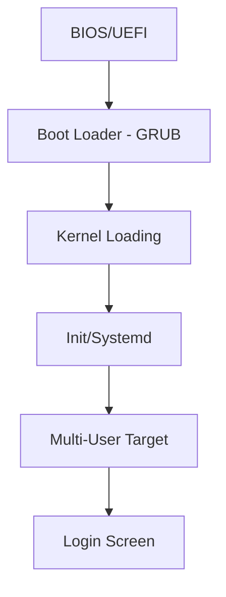
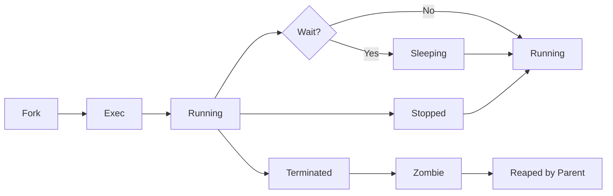
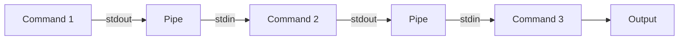
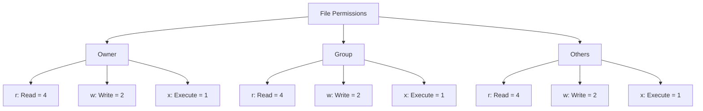
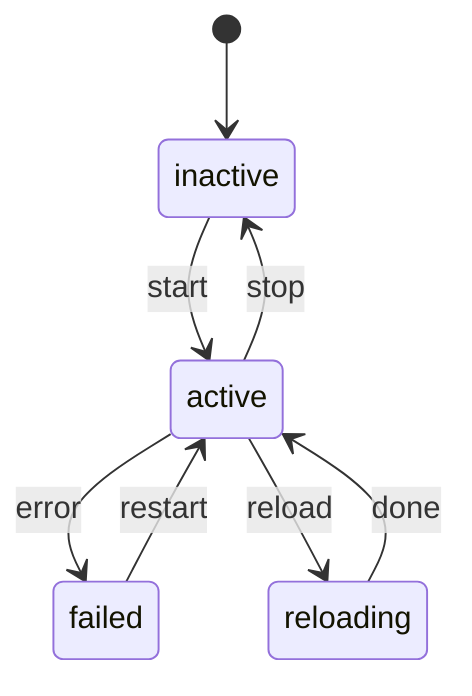

# Linux Administration & Commands

## 1. Introduction

Linux is the dominant operating system for servers, cloud infrastructure, embedded systems, and supercomputers. Proficiency in Linux commands, shell scripting, and system administration is essential for software engineers, DevOps professionals, and system administrators.

This guide covers file system navigation, process management, permissions, shell scripting, networking, package management, system monitoring, user management, cron jobs, systemd, and common interview commands.

**Why It Matters for Interviews:**
- Nearly all server infrastructure runs Linux
- Essential for DevOps, SRE, and backend roles
- Shell scripting automates repetitive tasks
- Understanding Linux internals improves debugging
- Common in technical interviews (command line proficiency)

---

## 2. Learning Roadmap

### Phase 1: Fundamentals (Weeks 1-2)
- [ ] File system hierarchy and navigation
- [ ] File operations (create, copy, move, delete)
- [ ] Text processing (cat, grep, sed, awk)
- [ ] File permissions and ownership

### Phase 2: Process Management (Weeks 3-4)
- [ ] Running and managing processes
- [ ] Signals and process control
- [ ] Background and foreground jobs
- [ ] System monitoring (top, htop, vmstat)

### Phase 3: Shell Scripting (Weeks 5-6)
- [ ] Variables, conditionals, loops
- [ ] Functions and argument handling
- [ ] Pipes and redirection
- [ ] Regular expressions in shell

### Phase 4: System Administration (Weeks 7-8)
- [ ] User and group management
- [ ] Package management (apt, yum, pacman)
- [ ] Systemd and service management
- [ ] Cron jobs and scheduling

### Phase 5: Networking & Security (Weeks 9-10)
- [ ] Network configuration and commands
- [ ] SSH and remote access
- [ ] Firewall management (iptables, ufw)
- [ ] Log analysis and troubleshooting

---

## 3. Theory Notes

### Linux File System Hierarchy

```
/              → Root directory
├── bin/       → Essential user binaries
├── sbin/      → System binaries
├── etc/       → Configuration files
├── home/      → User home directories
├── root/      → Root user's home
├── var/       → Variable data (logs, caches)
├── tmp/       → Temporary files
├── usr/       → User programs and data
├── lib/       → Shared libraries
├── opt/       → Optional software
├── proc/      → Process information (virtual)
├── dev/       → Device files
├── mnt/       → Mount points
├── media/     → Removable media
└── sys/       → System information (virtual)
```

### File Permissions

**Permission Types:**
```
r (read)    = 4
w (write)   = 2
x (execute) = 1
```

**Permission Groups:**
```
Owner  → First set (rwx)
Group  → Second set (rwx)
Others → Third set (rwx)
```

**Example:** `rwxr-xr--` = 754
```
Owner:  rwx = 4+2+1 = 7
Group:  r-x = 4+0+1 = 5
Others: r-- = 4+0+0 = 4
```

**Special Permissions:**
```
SUID (4000): Run as file owner (e.g., /usr/bin/passwd)
SGID (2000): Run as file group
Sticky (1000): Only owner can delete (e.g., /tmp)
```

### Process States

```
R → Running / Ready
S → Sleeping (interruptible)
D → Disk sleep (uninterruptible)
T → Stopped
Z → Zombie (terminated but not waited on)
X → Dead
```

### Shell Scripting Fundamentals

**Variables:**
```bash
NAME="Linux"
echo "Hello, $NAME"
echo "Hello, ${NAME}world"
```

**Conditionals:**
```bash
if [ "$1" -gt 10 ]; then
    echo "Greater than 10"
elif [ "$1" -eq 10 ]; then
    echo "Equal to 10"
else
    echo "Less than 10"
fi
```

**Loops:**
```bash
# For loop
for i in {1..10}; do
    echo "Number: $i"
done

# While loop
while [ $count -lt 5 ]; do
    echo "Count: $count"
    ((count++))
done
```

**Functions:**
```bash
greet() {
    local name=$1
    echo "Hello, $name!"
}
greet "World"
```

### Systemd

**Service File Example:**
```ini
[Unit]
Description=My Application
After=network.target

[Service]
Type=simple
User=appuser
ExecStart=/usr/bin/myapp
Restart=always

[Install]
WantedBy=multi-user.target
```

**Common Commands:**
```bash
systemctl start myapp
systemctl stop myapp
systemctl restart myapp
systemctl status myapp
systemctl enable myapp
systemctl disable myapp
journalctl -u myapp -f
```

---

## 4. Key Concepts

### Essential Commands Quick Reference

| Category | Commands |
|----------|----------|
| Navigation | cd, pwd, ls, find, locate |
| Files | cp, mv, rm, mkdir, touch, ln |
| Text | cat, less, head, tail, grep, sed, awk |
| Permissions | chmod, chown, chgrp, umask |
| Process | ps, top, kill, nice, bg, fg, jobs |
| Disk | df, du, mount, fdisk, lsblk |
| Network | ifconfig, ip, ping, netstat, ss, curl |
| System | uname, hostname, uptime, free, vmstat |
| Users | useradd, usermod, userdel, passwd, sudo |

### Text Processing Pipeline

```bash
# Find errors in log file
cat /var/log/syslog | grep "error" | awk '{print $1, $2, $5}' | sort | uniq -c | sort -rn

# Count lines in all Python files
find . -name "*.py" | xargs wc -l

# Replace text in all files
grep -rl "old_text" . | xargs sed -i 's/old_text/new_text/g'
```

### Process Management

**Process Signals:**
```
SIGHUP  (1):  Hangup → Reload configuration
SIGINT  (2):  Interrupt → Ctrl+C
SIGQUIT (3):  Quit → Core dump
SIGKILL (9):  Kill → Force terminate (can't catch)
SIGTERM (15): Terminate → Graceful shutdown
SIGSTOP (19): Stop → Pause (can't catch)
SIGCONT (18): Continue → Resume
```

**Process Priorities:**
```
nice value: -20 (highest) to 19 (lowest)
Default: 0
renice: Change priority of running process
```

### Networking Basics

**Common Ports:**
```
22: SSH
80: HTTP
443: HTTPS
3306: MySQL
5432: PostgreSQL
6379: Redis
8080: HTTP Alt
```

**IP Addressing:**
```
IPv4: 192.168.1.100 (32-bit, dotted decimal)
IPv6: 2001:0db8:85a3:0000:0000:8a2e:0370:7334
Subnet: 192.168.1.0/24 (255.255.255.0)
```

---

## 5. FAQ (20+ Q&A)

### Q1: What is the difference between `kill` and `kill -9`?
**A:** `kill` sends SIGTERM (15), allowing the process to clean up and exit gracefully. `kill -9` sends SIGKILL (9), forcing immediate termination without cleanup. Use SIGTERM first; SIGKILL only as a last resort.

### Q2: What does `chmod 755` mean?
**A:** Owner gets rwx (7), group gets r-x (5), others get r-x (5). The file is executable by everyone, but only the owner can modify it.

### Q3: What is the difference between `>` and `>>`?
**A:** `>` overwrites the file with new output. `>>` appends to the end of the file. Be careful with `>` as it destroys existing content.

### Q4: What is a zombie process?
**A:** A process that has finished execution but still has an entry in the process table. This happens when the parent process hasn't called `wait()` to collect its exit status. Use `kill` on the parent process.

### Q5: What is the difference between `su` and `sudo`?
**A:** `su` switches to another user (requires that user's password). `sudo` executes a command as root (requires your own password). `sudo` is preferred for logging and security.

### Q6: What is a pipe (`|`)?
**A:** Pipes connect the stdout of one command to the stdin of another. `command1 | command2` feeds output of command1 as input to command2. Enables building complex operations from simple commands.

### Q7: How do you find a file by name?
**A:** `find /path -name "filename"` searches recursively. `locate filename` uses a pre-built database (faster but may be outdated; update with `updatedb`).

### Q8: What is the difference between `>` and `|`?
**A:** `>` redirects output to a file. `|` pipes output to another command's input. Example: `echo "hello" > file.txt` writes to file; `echo "hello" | wc -c` counts characters.

### Q9: What does `chmod +x` do?
**A:** Adds execute permission to a file for all users (owner, group, others). Commonly used after creating shell scripts to make them runnable.

### Q10: What is a soft link vs hard link?
**A:** Hard link points directly to inode (same file data). Soft (symbolic) link points to path name. Hard links can't cross filesystems; soft links can. Hard links survive file deletion of original; soft links become dangling.

### Q11: How do you check disk usage?
**A:** `df -h` shows filesystem space usage. `du -sh *` shows directory sizes. `du -h --max-depth=1` shows top-level directory sizes.

### Q12: What is the difference between `ps` and `top`?
**A:** `ps` provides a snapshot of current processes. `top` provides real-time monitoring with updates. `htop` is an improved interactive version of `top`.

### Q13: What does `grep -r` do?
**A:** Recursively searches for a pattern in all files under the specified directory. Essential for searching through codebases.

### Q14: How do you run a command in the background?
**A:** Append `&` to the command: `command &`. Use `jobs` to list background jobs. Use `fg %job_number` to bring to foreground. Use `bg %job_number` to resume in background.

### Q15: What is `cron`?
**A:** A time-based job scheduler in Unix-like systems. Edit crontab with `crontab -e`. Format: `minute hour day month weekday command`. Example: `0 2 * * * /scripts/backup.sh` runs daily at 2 AM.

### Q16: What is the difference between `apt` and `apt-get`?
**A:** `apt` is a newer, more user-friendly command that combines `apt-get` and `apt-cache` functionality. `apt-get` is more scriptable. Both install packages: `apt install package` or `apt-get install package`.

### Q17: How do you check listening ports?
**A:** `ss -tlnp` or `netstat -tlnp` shows TCP listening ports. `lsof -i :PORT` shows what process is using a specific port.

### Q18: What is systemd?
**A:** A system and service manager for Linux. It manages services, mount points, devices, and timers. Replaced SysVinit in most modern distributions. Control with `systemctl`.

### Q19: What does `umask` do?
**A:** Sets default file creation permissions. `umask 022` means files created with 755 (777-022) and directories with 755. The umask subtracts from the maximum permissions.

### Q20: What is the difference between `wget` and `curl`?
**A:** Both download files. `wget` is simpler, better for recursive downloads. `curl` is more versatile, supports more protocols (HTTP, FTP, SMTP), and is better for API testing.

### Q21: How do you search for text in files?
**A:** `grep "pattern" file` searches for pattern. `grep -i` is case-insensitive. `grep -r` is recursive. `grep -n` shows line numbers. `grep -v` inverts match.

### Q22: What is `/proc`?
**A:** A virtual filesystem providing process and kernel information. `/proc/cpuinfo` shows CPU info, `/proc/meminfo` shows memory info, `/proc/PID/` shows process info.

---

## 6. Hands-on Practice

### Exercise 1: File System Navigation
```bash
# Find all files larger than 100MB modified in last 7 days
find / -size +100M -mtime -7 -type f 2>/dev/null

# Count files by extension
find . -type f | sed 's/.*\.//' | sort | uniq -c | sort -rn

# Find duplicate files by content
find . -type f -exec md5sum {} \; | sort | uniq -w 32 -d
```

### Exercise 2: Log Analysis
```bash
# Count HTTP status codes in access log
awk '{print $9}' access.log | sort | uniq -c | sort -rn

# Find top 10 IP addresses by request count
awk '{print $1}' access.log | sort | uniq -c | sort -rn | head -10

# Find requests slower than 5 seconds
awk '$NF > 5.0' access.log

# Count requests per hour
awk '{print $4}' access.log | cut -d: -f2 | sort | uniq -c
```

### Exercise 3: System Monitoring Script
```bash
#!/bin/bash
# system_monitor.sh

echo "=== System Information ==="
echo "Hostname: $(hostname)"
echo "Uptime: $(uptime -p)"
echo "Kernel: $(uname -r)"

echo -e "\n=== CPU Usage ==="
top -bn1 | grep "Cpu(s)" | awk '{print $2}% used'

echo -e "\n=== Memory Usage ==="
free -h | awk 'NR==2{printf "Used: %s/%s (%.2f%%)\n", $3, $2, $3/$2*100}'

echo -e "\n=== Disk Usage ==="
df -h / | awk 'NR==2{printf "Used: %s/%s (%s)\n", $3, $2, $5}'

echo -e "\n=== Top 5 Processes by CPU ==="
ps aux --sort=-%cpu | head -6

echo -e "\n=== Top 5 Processes by Memory ==="
ps aux --sort=-%mem | head -6
```

### Exercise 4: File Permission Audit
```bash
#!/bin/bash
# Find files with world-writable permissions
echo "World-writable files:"
find / -type f -perm -o+w 2>/dev/null | head -20

# Find SUID files
echo -e "\nSUID files:"
find / -type f -perm -4000 2>/dev/null

# Find files with no owner
echo -e "\nFiles with no owner:"
find / -nouser -o -nogroup 2>/dev/null | head -20
```

---

## 7. FAANG Questions

### Google
1. How would you debug a server that's running slowly?
2. Write a script to find and kill processes using too much memory.
3. How do you monitor network traffic on a Linux server?
4. Explain the Linux boot process.

### Amazon
5. How do you set up a cron job for database backups?
6. Write a script to monitor disk space and send alerts.
7. How would you troubleshoot a service that won't start?
8. Explain the difference between hard and soft limits.

### Meta
9. How do you analyze a core dump?
10. Write a script to parse and analyze server logs.
11. How do you optimize a Linux server for high throughput?
12. Explain cgroups and namespaces.

### Apple
13. How do you manage macOS from the command line?
14. Write a launchd equivalent of a cron job.
15. How do you troubleshoot DNS issues on macOS?
16. Explain the differences between macOS and Linux commands.

### Netflix
17. How do you handle log rotation for high-traffic servers?
18. Write a script to deploy and rollback applications.
19. How do you monitor container health in production?
20. Explain iptables and netfilter.

### Microsoft
21. How do you run Linux commands on WSL?
22. Compare PowerShell and Bash scripting.
23. How do you manage Linux servers from Windows?
24. Explain systemd vs init.d.

---

## 8. Common Mistakes

### File Operations
1. **Using `rm -rf /`** → Deletes entire filesystem (catastrophic)
2. **Not quoting variables** → Word splitting breaks scripts
3. **Using `cp` without `-a`** → Loses permissions and timestamps
4. **Not checking return codes** → Silent failures

### Process Management
5. **Using `kill -9` immediately** → Doesn't allow graceful shutdown
6. **Not using `nohup`** → Processes die when terminal closes
7. **Ignoring zombie processes** → Wastes process table entries
8. **Running as root unnecessarily** → Security risk

### Shell Scripting
9. **Not using `set -e`** → Script continues after errors
10. **Not quoting `$()`** → Command output gets word-split
11. **Using `[ ]` vs `[[ ]]`** → `[[ ]]` is safer and more powerful
12. **Not using `local` in functions** → Variable scope issues

### Networking
13. **Not checking firewall rules** → Connection failures
14. **Using `telnet` on production** → Security risk
15. **Not using SSH keys** → Password-based auth is less secure
16. **Ignoring DNS resolution** → Network debugging goes wrong

### System Administration
17. **Not monitoring disk space** → Server runs out of space
18. **Not rotating logs** → Disk fills up with logs
19. **Running services as root** → Security vulnerability
20. **Not backing up configurations** → Lost on reinstall

---

## 9. Best Practices

### Command Line
1. Use `Ctrl+R` for reverse history search
2. Use `!!` to repeat last command
3. Use `!$` for last argument of previous command
4. Use `alias` for frequently used commands
5. Use tab completion aggressively

### Shell Scripting
1. Start with `#!/bin/bash` and `set -euo pipefail`
2. Quote all variables: `"$variable"`
3. Use `[[ ]]` instead of `[ ]` for conditionals
4. Use functions for reusable code
5. Add error handling and logging
6. Comment non-obvious logic

### System Administration
1. Use `sudo` instead of logging in as root
2. Keep system updated: `apt update && apt upgrade`
3. Monitor logs regularly
4. Use `fail2ban` for brute-force protection
5. Set up unattended-upgrades for security patches

### Security
1. Use SSH key authentication
2. Disable root SSH login
3. Use firewall rules (ufw/iptables)
4. Regular security audits
5. Principle of least privilege

### Performance
1. Use `time` to measure command execution
2. Use `nice`/`renice` for priority control
3. Use `ionice` for I/O priority
4. Monitor with `vmstat`, `iostat`, `sar`
5. Use `ulimit` to control resource usage

---

## 10. Cheat Sheet

### File Operations
```bash
cp -a source dest     # Archive copy (preserves permissions)
mv -i source dest     # Interactive move (ask before overwrite)
rm -i file            # Interactive remove
mkdir -p path/to/dir  # Create directory hierarchy
touch file            # Create empty file or update timestamp
ln -s target link     # Create symbolic link
find / -name "*.log"  # Find files by name
locate filename       # Find using pre-built database
```

### Text Processing
```bash
grep -rn "pattern" .  # Recursive search with line numbers
grep -i "pattern"     # Case-insensitive search
grep -v "pattern"     # Invert match
sed 's/old/new/g'     # Replace text
sed -n '10,20p'       # Print lines 10-20
awk '{print $1}'      # Print first field
awk -F: '{print $1}'  # Use : as field separator
sort | uniq -c        # Count unique lines
wc -l file            # Count lines
cut -d: -f1           # Extract first field (delimiter :)
```

### Process Management
```bash
ps aux               # All processes (BSD format)
ps -ef               # All processes (System V format)
top -bn1             # One-shot top output
htop                 # Interactive process viewer
kill PID             # Send SIGTERM
kill -9 PID          # Send SIGKILL
killall process_name # Kill all instances
nice -n 10 command   # Run with low priority
renice -n -5 -p PID  # Change priority
nohup command &      # Run immune to hangups
disown %1            # Remove job from shell
```

### Disk and Memory
```bash
df -h                # Disk usage (human-readable)
du -sh *             # Directory sizes
du -h --max-depth=1  # Top-level directory sizes
free -h              # Memory usage
vmstat 1             # System stats every second
iostat               # I/O statistics
lsblk                # List block devices
mount /dev/sdb1 /mnt # Mount filesystem
umount /mnt          # Unmount filesystem
```

### Networking
```bash
ip addr              # Show IP addresses
ip route             # Show routing table
ping -c 4 host       # Ping with count
curl -I url          # HTTP headers only
curl -X POST url -d  # POST request
wget url             # Download file
ss -tlnp             # TCP listening ports
ss -ulnp             # UDP listening ports
dig domain           # DNS lookup
nslookup domain      # DNS lookup
traceroute host      # Trace route
ssh user@host        # SSH connection
scp file user@host:  # Secure copy
```

### System Information
```bash
uname -a             # All system info
hostname             # Show hostname
uptime               # System uptime
whoami               # Current user
id                   # User and group IDs
cat /etc/os-release  # OS version
lscpu                # CPU information
lsmem                # Memory information
lsusb                # USB devices
lspci                # PCI devices
```

### User Management
```bash
useradd -m username  # Create user with home dir
usermod -aG sudo user # Add user to sudo group
userdel -r username  # Delete user and home dir
passwd username      # Change password
groups username      # Show user groups
who                  # Who is logged in
w                    # Who is logged in and doing what
last                 # Login history
su - username        # Switch user
sudo command         # Run as root
```

---

## 11. Flash Cards (20)

1. **Q: What does `chmod 755` mean?**
   A: Owner: rwx (7), Group: r-x (5), Others: r-x (5).

2. **Q: What is the difference between `>` and `>>`?**
   A: `>` overwrites, `>>` appends.

3. **Q: What does `grep -r` do?**
   A: Recursively searches for a pattern in all files under a directory.

4. **Q: What is a pipe `|`?**
   A: Connects stdout of one command to stdin of another.

5. **Q: What does `ps aux` show?**
   A: All running processes with detailed information.

6. **Q: What is the difference between `kill` and `kill -9`?**
   A: `kill` sends SIGTERM (graceful), `kill -9` sends SIGKILL (forced).

7. **Q: What does `df -h` show?**
   A: Disk filesystem usage in human-readable format.

8. **Q: What is a zombie process?**
   A: A terminated process whose parent hasn't collected its exit status.

9. **Q: What does `chmod +x` do?**
   A: Adds execute permission to a file.

10. **Q: What is `cron`?**
    A: A time-based job scheduler for running commands at specified intervals.

11. **Q: What does `find / -name "*.log"` do?**
    A: Finds all .log files starting from root directory.

12. **Q: What is the difference between `su` and `sudo`?**
    A: `su` switches user (needs their password), `sudo` runs as root (needs your password).

13. **Q: What does `tail -f logfile` do?**
    A: Continuously displays new lines appended to the file.

14. **Q: What is a soft link vs hard link?**
    A: Soft link points to path name, hard link points directly to inode.

15. **Q: What does `set -e` do in a shell script?**
    A: Exits the script immediately if any command fails.

16. **Q: What is `systemctl`?**
    A: Command to manage systemd services (start, stop, enable, etc.).

17. **Q: What does `ss -tlnp` show?**
    A: TCP listening ports with process information.

18. **Q: What is the difference between `wget` and `curl`?**
    A: `wget` is simpler for downloads, `curl` supports more protocols and is better for APIs.

19. **Q: What does `du -sh *` show?**
    A: Sizes of files and directories in current directory.

20. **Q: What is `/proc`?**
    A: A virtual filesystem providing process and kernel information.

---

## 12. Mind Map

```
                        Linux Administration
                              |
     ┌──────────┬────────────┼────────────┬──────────┐
     |          |            |            |          |
  File       Process      Shell       System    Network
  System     Management   Scripting   Admin      Admin
     |          |            |            |          |
  ┌──┼──┐   ┌──┼──┐     ┌──┼──┐     ┌──┼──┐   ┌──┼──┐
  |  |  |   |  |  |     |  |  |     |  |  |   |  |  |
ls cp grep ps kill top  vars loops cron user ssh  curl
chmod rm sed  bg fg nice cond func systemd apt  netstat
find mv awk  signal jobs     pipe      ufw   ip   ping
```

---

## 13. Mermaid Diagrams

### Linux Boot Process


### Process Lifecycle


### Shell Pipeline


### File Permission Model


### Systemd Service States


---

## 14. Code Examples

### Example 1: Comprehensive Log Analyzer
```bash
#!/bin/bash
# log_analyzer.sh - Analyze Apache/Nginx access logs

LOG_FILE="${1:-/var/log/apache2/access.log}"

if [ ! -f "$LOG_FILE" ]; then
    echo "Error: Log file not found: $LOG_FILE"
    exit 1
fi

echo "=== Log Analysis: $LOG_FILE ==="
echo "Generated: $(date)"
echo ""

# Total requests
total=$(wc -l < "$LOG_FILE")
echo "Total Requests: $total"

# Requests by status code
echo -e "\n=== Status Code Distribution ==="
awk '{print $9}' "$LOG_FILE" | sort | uniq -c | sort -rn | head -10

# Top IP addresses
echo -e "\n=== Top 10 IP Addresses ==="
awk '{print $1}' "$LOG_FILE" | sort | uniq -c | sort -rn | head -10

# Top requested URLs
echo -e "\n=== Top 10 URLs ==="
awk '{print $7}' "$LOG_FILE" | sort | uniq -c | sort -rn | head -10

# Requests per hour
echo -e "\n=== Requests Per Hour ==="
awk '{print $4}' "$LOG_FILE" | cut -d: -f2 | sort | uniq -c | sort -k2n

# 404 errors
echo -e "\n=== 404 Errors ==="
awk '$9 == 404 {print $7}' "$LOG_FILE" | sort | uniq -c | sort -rn | head -10

# Average response time (if available)
if awk '{print $NF}' "$LOG_FILE" | grep -q '^[0-9]'; then
    echo -e "\n=== Response Time Statistics ==="
    awk '{print $NF}' "$LOG_FILE" | sort -n | awk '
        BEGIN {count=0; sum=0}
        {
            count++
            sum+=$1
            a[NR]=$1
        }
        END {
            printf "Count: %d\n", count
            printf "Average: %.3f\n", sum/count
            printf "Median: %.3f\n", a[int(NR/2)]
            printf "Min: %.3f\n", a[1]
            printf "Max: %.3f\n", a[NR]
        }'
fi
```

### Example 2: System Health Check Script
```bash
#!/bin/bash
# health_check.sh - Comprehensive system health check

RED='\033[0;31m'
GREEN='\033[0;32m'
YELLOW='\033[1;33m'
NC='\033[0m'

check_result() {
    if [ $1 -eq 0 ]; then
        echo -e "${GREEN}[OK]${NC} $2"
    elif [ $1 -eq 1 ]; then
        echo -e "${YELLOW}[WARN]${NC} $2"
    else
        echo -e "${RED}[CRITICAL]${NC} $2"
    fi
}

echo "=== System Health Check ==="
echo "Host: $(hostname)"
echo "Time: $(date)"
echo ""

# CPU Check
cpu_usage=$(top -bn1 | grep "Cpu(s)" | awk '{print $2}' | cut -d. -f1)
if [ "$cpu_usage" -lt 70 ]; then
    check_result 0 "CPU Usage: ${cpu_usage}%"
elif [ "$cpu_usage" -lt 90 ]; then
    check_result 1 "CPU Usage: ${cpu_usage}%"
else
    check_result 2 "CPU Usage: ${cpu_usage}%"
fi

# Memory Check
mem_total=$(free -m | awk '/Mem:/ {print $2}')
mem_used=$(free -m | awk '/Mem:/ {print $3}')
mem_percent=$((mem_used * 100 / mem_total))
if [ "$mem_percent" -lt 70 ]; then
    check_result 0 "Memory Usage: ${mem_percent}% (${mem_used}MB/${mem_total}MB)"
elif [ "$mem_percent" -lt 90 ]; then
    check_result 1 "Memory Usage: ${mem_percent}%"
else
    check_result 2 "Memory Usage: ${mem_percent}%"
fi

# Disk Check
disk_usage=$(df -h / | awk 'NR==2 {print $5}' | tr -d '%')
if [ "$disk_usage" -lt 70 ]; then
    check_result 0 "Disk Usage: ${disk_usage}%"
elif [ "$disk_usage" -lt 90 ]; then
    check_result 1 "Disk Usage: ${disk_usage}%"
else
    check_result 2 "Disk Usage: ${disk_usage}%"
fi

# Load Average
load=$(uptime | awk -F'load average:' '{print $2}' | cut -d, -f1 | tr -d ' ')
cpus=$(nproc)
load_int=$(echo "$load" | cut -d. -f1)
if [ "$load_int" -lt "$cpus" ]; then
    check_result 0 "Load Average: $load (${cpus} CPUs)"
elif [ "$load_int" -lt $((cpus * 2)) ]; then
    check_result 1 "Load Average: $load"
else
    check_result 2 "Load Average: $load"
fi

# Zombie Processes
zombies=$(ps aux | awk '$8 ~ /Z/ {count++} END {print count+0}')
if [ "$zombies" -eq 0 ]; then
    check_result 0 "Zombie Processes: 0"
elif [ "$zombies" -lt 5 ]; then
    check_result 1 "Zombie Processes: $zombies"
else
    check_result 2 "Zombie Processes: $zombies"
fi
```

### Example 3: Automated Backup Script
```bash
#!/bin/bash
# backup.sh - Automated backup with rotation

BACKUP_DIR="/backup"
SOURCE_DIR="/var/www"
DATE=$(date +%Y%m%d_%H%M%S)
BACKUP_FILE="${BACKUP_DIR}/backup_${DATE}.tar.gz"
RETENTION_DAYS=7

# Create backup directory
mkdir -p "$BACKUP_DIR"

# Create backup
echo "Creating backup..."
tar -czf "$BACKUP_FILE" "$SOURCE_DIR" 2>/dev/null

if [ $? -eq 0 ]; then
    echo "Backup created: $BACKUP_FILE"
    echo "Size: $(du -h "$BACKUP_FILE" | cut -f1)"
else
    echo "Error: Backup failed!"
    exit 1
fi

# Rotate old backups
echo "Removing backups older than ${RETENTION_DAYS} days..."
find "$BACKUP_DIR" -name "backup_*.tar.gz" -mtime +$RETENTION_DAYS -delete

# Verify backup
echo "Verifying backup integrity..."
tar -tzf "$BACKUP_FILE" > /dev/null 2>&1
if [ $? -eq 0 ]; then
    echo "Backup verified successfully"
else
    echo "Error: Backup verification failed!"
    exit 1
fi

echo "Backup complete!"
```

### Example 4: Network Diagnostics Script
```bash
#!/bin/bash
# network_diag.sh - Network diagnostics

echo "=== Network Diagnostics ==="
echo "Host: $(hostname)"
echo "Time: $(date)"
echo ""

# IP Addresses
echo "=== IP Addresses ==="
ip -4 addr show | grep inet | awk '{print $NF, $2}'

# Default Gateway
echo -e "\n=== Default Gateway ==="
ip route | grep default

# DNS Servers
echo -e "\n=== DNS Servers ==="
cat /etc/resolv.conf | grep nameserver

# DNS Resolution Test
echo -e "\n=== DNS Resolution Test ==="
for domain in google.com github.com cloudflare.com; do
    result=$(dig +short "$domain" | head -1)
    if [ -n "$result" ]; then
        echo "[OK] $domain → $result"
    else
        echo "[FAIL] $domain → No resolution"
    fi
done

# Connectivity Test
echo -e "\n=== Connectivity Test ==="
for host in 8.8.8.8 1.1.1.1; do
    ping -c 3 -W 2 "$host" > /dev/null 2>&1
    if [ $? -eq 0 ]; then
        echo "[OK] $host reachable"
    else
        echo "[FAIL] $host unreachable"
    fi
done

# Listening Ports
echo -e "\n=== Listening Ports ==="
ss -tlnp | awk 'NR>1 {print $4, $6}' | sort

# Open Connections
echo -e "\n=== Open Connections ==="
ss -tnp | awk 'NR>1 {print $4, $5, $6}' | sort | uniq -c | sort -rn | head -10
```

### Example 5: User Management Script
```bash
#!/bin/bash
# user_manager.sh - Bulk user management

usage() {
    echo "Usage: $0 {create|delete|list|lock|unlock} [options]"
    echo "  create <file>  - Create users from file (username:password)"
    echo "  delete <file>  - Delete users from file"
    echo "  list           - List all users"
    echo "  lock <user>    - Lock user account"
    echo "  unlock <user>  - Unlock user account"
    exit 1
}

create_users() {
    local file=$1
    while IFS=: read -r username password; do
        if id "$username" &>/dev/null; then
            echo "User $username already exists, skipping..."
        else
            useradd -m -p "$(openssl passwd -6 "$password")" "$username"
            echo "Created user: $username"
        fi
    done < "$file"
}

delete_users() {
    local file=$1
    while IFS=: read -r username _; do
        if id "$username" &>/dev/null; then
            userdel -r "$username"
            echo "Deleted user: $username"
        else
            echo "User $username not found, skipping..."
        fi
    done < "$file"
}

list_users() {
    echo "=== System Users ==="
    awk -F: '$3 >= 1000 {print $1, $3, $6, $7}' /etc/passwd
}

lock_user() {
    usermod -L "$1" && echo "Locked user: $1"
}

unlock_user() {
    usermod -U "$1" && echo "Unlocked user: $1"
}

case "$1" in
    create) [ -f "$2" ] && create_users "$2" || echo "File not found: $2" ;;
    delete) [ -f "$2" ] && delete_users "$2" || echo "File not found: $2" ;;
    list)   list_users ;;
    lock)   [ -n "$2" ] && lock_user "$2" || echo "Specify username" ;;
    unlock) [ -n "$2" ] && unlock_user "$2" || echo "Specify username" ;;
    *)      usage ;;
esac
```

---

## 15. Projects

### Project 1: Log Analysis Dashboard
**Objective:** Build a web-based log analysis tool.
**Features:**
- Parse Apache/Nginx access logs
- Display top IPs, URLs, status codes
- Time-based request graphs
- Error rate tracking
- Alert system for anomalies

### Project 2: System Monitoring Agent
**Objective:** Create a monitoring agent that reports system metrics.
**Features:**
- CPU, memory, disk, network monitoring
- Process monitoring
- Alert thresholds (email, Slack)
- Historical data storage
- REST API for metrics

### Project 3: Automated Deployment Script
**Objective:** Build a deployment automation tool.
**Features:**
- Git pull and build
- Service restart with health check
- Rollback capability
- Multi-server deployment
- Deployment notifications

### Project 4: Security Audit Tool
**Objective:** Create a Linux security audit script.
**Features:**
- Check file permissions
- Find SUID/SGID files
- Audit user accounts
- Check for open ports
- Generate security report

---

## 16. Resources

### Books
- "The Linux Command Line" by William Shotts
- "Linux Administration: A Beginner's Guide" by Wirsing
- "UNIX and Linux System Administration Handbook" by Nemeth
- "Bash Cookbook" by Albing & Vossen

### Online Courses
- [Linux Upskill Challenge](https://linuxupskillchallenge.org/)
- [Linux Foundation Training](https://training.linuxfoundation.org/)
- [OverTheWire: Bandit](https://overthewire.org/wargames/bandit/)

### Practice Platforms
- **Linux Survival**: Interactive Linux terminal
- **OverTheWire**: Wargames for Linux practice
- **HackTheBox**: CTF-style challenges
- **VulnHub**: Vulnerable VMs for practice

### Reference
- **Linux Man Pages**: `man command`
- **Explainshell**: Visual command explanation
- **tldr pages**: Simplified man pages

---

## 17. Checklist

### File System
- [ ] Navigate directories (cd, pwd)
- [ ] List files with options (ls -la)
- [ ] Create/remove directories (mkdir, rmdir)
- [ ] Copy/move/remove files (cp, mv, rm)
- [ ] Find files (find, locate)
- [ ] Understand permissions (chmod, chown)

### Text Processing
- [ ] View files (cat, less, head, tail)
- [ ] Search text (grep, ripgrep)
- [ ] Edit text streams (sed, awk)
- [ ] Sort and count (sort, uniq, wc)
- [ ] Cut and paste columns (cut, paste)

### Process Management
- [ ] List processes (ps, top)
- [ ] Kill processes (kill, killall)
- [ ] Background/foreground jobs (bg, fg, jobs)
- [ ] Process priorities (nice, renice)

### Shell Scripting
- [ ] Variables and conditionals
- [ ] Loops (for, while)
- [ ] Functions
- [ ] Input/output redirection
- [ ] Pipes and command substitution

### System Administration
- [ ] User management (useradd, usermod)
- [ ] Package management (apt/yum)
- [ ] Service management (systemctl)
- [ ] Cron jobs (crontab)
- [ ] Log viewing (journalctl, syslog)

---

## 18. Revision Plans

### Week 1: Fundamentals
- Day 1-2: File system navigation and operations
- Day 3-4: Text processing commands
- Day 5-7: Practice exercises and quizzes

### Week 2: Process & Permissions
- Day 1-2: Process management
- Day 3-4: File permissions and ownership
- Day 5-7: Shell scripting basics

### Week 3: Shell Scripting
- Day 1-2: Variables, conditionals, loops
- Day 3-4: Functions, pipes, redirection
- Day 5-7: Write practical scripts

### Week 4: System Admin & Networking
- Day 1-2: User management, packages
- Day 3-4: Systemd, cron jobs
- Day 5-7: Networking commands and troubleshooting

---

## 19. Mock Interviews

### Round 1: Commands (30 min)
1. How do you find all files modified in the last 24 hours?
2. Write a command to count occurrences of a word in a file.
3. How do you check if a service is running?
4. Explain the difference between soft and hard links.

### Round 2: Scripting (45 min)
1. Write a script to monitor disk space and alert.
2. How would you parse a CSV file with bash?
3. Write a function to validate email addresses.
4. How do you handle errors in shell scripts?

### Round 3: Troubleshooting (30 min)
1. A server is running slowly, how do you diagnose?
2. A service won't start after a config change, what do you check?
3. How do you find what's consuming all disk space?
4. A user can't SSH in, how do you debug?

### Round 4: System Admin (30 min)
1. How do you set up automatic security updates?
2. Explain the Linux boot process.
3. How do you resize a logical volume?
4. How do you set up log rotation?

---

## 20. Difficulty Rating

| Topic | Difficulty | Interview Frequency |
|-------|-----------|-------------------|
| File Navigation | ⭐ (Very Easy) | High |
| File Operations | ⭐ (Very Easy) | High |
| Text Processing | ⭐⭐ (Easy) | Very High |
| Permissions | ⭐⭐ (Easy) | High |
| Process Management | ⭐⭐⭐ (Medium) | High |
| Shell Scripting | ⭐⭐⭐ (Medium) | Very High |
| Package Management | ⭐⭐ (Easy) | Medium |
| Systemd | ⭐⭐⭐ (Medium) | High |
| Cron Jobs | ⭐⭐ (Easy) | High |
| Networking Commands | ⭐⭐⭐ (Medium) | High |
| User Management | ⭐⭐ (Easy) | Medium |
| Log Analysis | ⭐⭐⭐ (Medium) | High |
| Security Hardening | ⭐⭐⭐⭐ (Hard) | Medium |
| Performance Tuning | ⭐⭐⭐⭐ (Hard) | Medium |

---

## 21. Summary

Linux proficiency is essential for modern software engineering. Key takeaways:

1. **File System**: Master navigation, permissions, and text processing
2. **Processes**: Understand lifecycle, signals, and management
3. **Shell Scripting**: Automate tasks with variables, loops, and functions
4. **System Admin**: Manage users, packages, services, and scheduling
5. **Networking**: Use commands for configuration, debugging, and monitoring
6. **Security**: Follow least privilege, use SSH keys, enable firewalls
7. **Monitoring**: Always measure before optimizing

**Interview Tip:** Practice typing commands without looking at the keyboard. Speed and accuracy in the terminal demonstrate real Linux experience.
