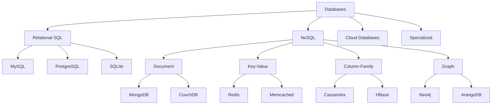
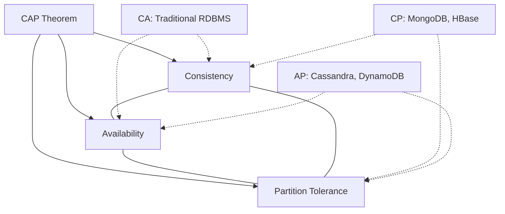
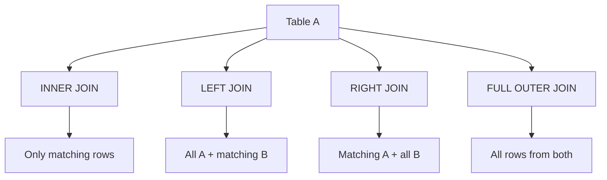
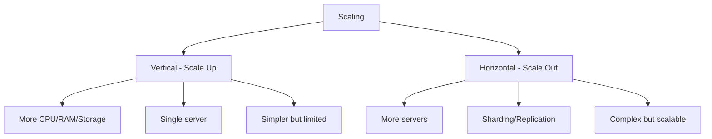
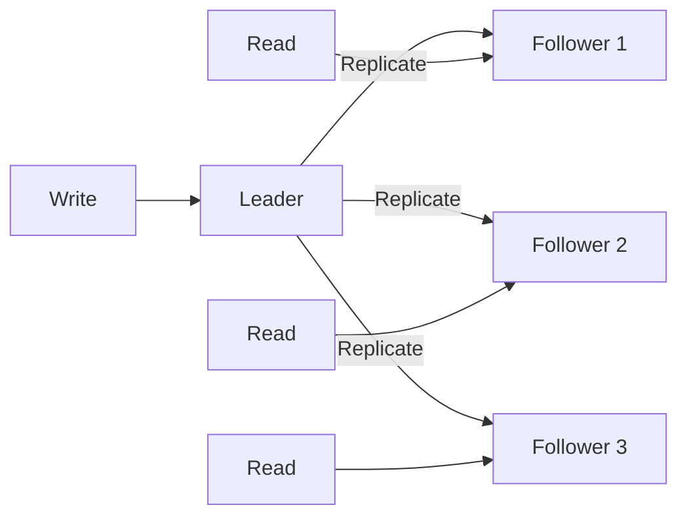

# Database Technologies

## 1. Introduction

Databases are the backbone of modern applications, storing and retrieving data efficiently. Understanding different database technologies — from traditional relational databases to modern NoSQL solutions — is essential for designing scalable, performant systems.

This guide covers relational databases (MySQL, PostgreSQL), NoSQL databases (MongoDB, Redis, Cassandra, Neo4j), database selection criteria, cloud databases, in-memory databases, time-series databases, graph databases, and NewSQL alternatives.

**Why It Matters for Interviews:**
- Every application needs data storage
- Database design affects performance and scalability
- Choosing the right database is a common interview topic
- Understanding trade-offs shows engineering maturity
- Critical for system design interviews

---

## 2. Learning Roadmap

### Phase 1: Relational Databases (Weeks 1-2)
- [ ] SQL fundamentals (SELECT, JOIN, GROUP BY)
- [ ] Database design and normalization
- [ ] Indexing and query optimization
- [ ] Transactions and ACID properties
- [ ] MySQL vs PostgreSQL comparison

### Phase 2: NoSQL Fundamentals (Weeks 3-4)
- [ ] Document databases (MongoDB)
- [ ] Key-value stores (Redis)
- [ ] Column-family stores (Cassandra)
- [ ] Graph databases (Neo4j)

### Phase 3: Advanced Topics (Weeks 5-6)
- [ ] CAP theorem and consistency models
- [ ] Replication and sharding
- [ ] Query optimization and indexing
- [ ] Database migration strategies

### Phase 4: Cloud & Specialized (Weeks 7-8)
- [ ] Cloud databases (RDS, DynamoDB, CosmosDB)
- [ ] In-memory databases
- [ ] Time-series databases
- [ ] NewSQL databases

### Phase 5: Design & Practice (Weeks 9-10)
- [ ] Schema design for applications
- [ ] Performance tuning
- [ ] Backup and recovery
- [ ] Database selection criteria

---

## 3. Theory Notes

### Relational Database Concepts

**ACID Properties:**
```
Atomicity    → All or nothing (transaction completes fully or not at all)
Consistency  → Data remains valid after transaction
Isolation    → Concurrent transactions don't interfere
Durability   → Committed data survives system failure
```

**Normalization Forms:**
```
1NF: Each cell contains atomic values; no repeating groups
2NF: 1NF + no partial dependencies (all non-key attributes depend on full primary key)
3NF: 2NF + no transitive dependencies (non-key attributes don't depend on other non-key attributes)
BCNF: 3NF + every determinant is a candidate key
```

**Example - Normalization:**
```
Unnormalized: Orders table with multiple items per row
1NF: Separate rows for each item
2NF: Items table references OrderID (no partial dependency)
3NF: Customer details in separate Customer table (no transitive dependency)
```

**Indexing:**
```
B-Tree Index: Default, good for range queries and equality
Hash Index: Good for equality, not range queries
GIN Index: Generalized Inverted Index, good for arrays/full-text
GiST Index: Generalized Search Tree, good for geometric data
```

### NoSQL Database Types

**Document Store (MongoDB):**
```
{
  "_id": "123",
  "name": "John",
  "email": "john@example.com",
  "orders": [
    {"item": "laptop", "price": 999},
    {"item": "mouse", "price": 25}
  ]
}
```
- Flexible schema
- Good for nested data
- Horizontal scaling via sharding

**Key-Value Store (Redis):**
```
SET user:123:name "John"
GET user:123:name
HSET user:123 email "john@example.com"
HGET user:123 email
```
- Simple data model
- Extremely fast (in-memory)
- Good for caching and sessions

**Column-Family Store (Cassandra):**
```
CREATE TABLE users (
    user_id UUID PRIMARY KEY,
    name TEXT,
    email TEXT,
    created_at TIMESTAMP
);

INSERT INTO users (user_id, name, email)
VALUES (uuid(), 'John', 'john@example.com');
```
- Denormalized design
- Write-optimized
- Linear horizontal scaling

**Graph Database (Neo4j):**
```
CREATE (john:Person {name: 'John'})
CREATE (jane:Person {name: 'Jane'})
CREATE (john)-[:KNOWS]->(jane)
MATCH (p:Person)-[:KNOWS]->(friend) RETURN p, friend
```
- Relationship-first design
- Excellent for connected data
- Traversal queries are fast

### Database Comparison

| Feature | MySQL | PostgreSQL | MongoDB | Redis | Cassandra |
|---------|-------|------------|---------|-------|-----------|
| Type | Relational | Relational | Document | Key-Value | Column-Family |
| ACID | Yes | Yes | Limited | Single-key | Tunable |
| Schema | Fixed | Fixed | Flexible | None | Flexible |
| Scaling | Vertical | Vertical | Horizontal | Horizontal | Horizontal |
| Query Language | SQL | SQL | MQL | Commands | CQL |
| Best For | Web apps | Complex queries | Content mgmt | Caching | Time-series |
| Consistency | Strong | Strong | Tunable | Strong | Tunable |

### CAP Theorem

```
In a distributed system, you can only guarantee 2 of 3:
- Consistency: Every read receives the most recent write
- Availability: Every request receives a response
- Partition Tolerance: System continues despite network partitions

Since network partitions are inevitable, you choose between:
- CP: Consistent but may reject requests during partition
- AP: Available but may return stale data during partition
```

---

## 4. Key Concepts

### Indexing Strategies

**B-Tree Index Structure:**
```
           [50]
          /    \
      [20]      [70]
     /   \      /   \
   [10] [30]  [60] [80]
   / \   / \   / \   / \
  ...  ... ... ... ... ...
```

**When to Create Indexes:**
- Columns used in WHERE clauses
- Columns used in JOIN conditions
- Columns used in ORDER BY
- Columns with high cardinality (many unique values)

**When NOT to Index:**
- Small tables
- Columns with low cardinality (few unique values)
- Tables with frequent writes (index overhead)
- Columns rarely used in queries

### Query Optimization

**EXPLAIN Plan:**
```sql
EXPLAIN ANALYZE
SELECT u.name, COUNT(o.id)
FROM users u
JOIN orders o ON u.id = o.user_id
WHERE u.created_at > '2024-01-01'
GROUP BY u.name
ORDER BY COUNT(o.id) DESC
LIMIT 10;
```

**Common Optimization Techniques:**
1. Use appropriate indexes
2. Avoid SELECT * (fetch only needed columns)
3. Use JOIN instead of subqueries when possible
4. Limit result sets with LIMIT/TOP
5. Use covering indexes
6. Avoid functions on indexed columns in WHERE

### Sharding Strategies

**Hash-Based Sharding:**
```
shard = hash(key) % num_shards
Good for: Even distribution, equality queries
Bad for: Range queries
```

**Range-Based Sharding:**
```
Shard 1: user_id 1-1000
Shard 2: user_id 1001-2000
Good for: Range queries
Bad for: Hotspots (new users all go to last shard)
```

**Directory-Based Sharding:**
```
Lookup table maps keys to shards
Good for: Flexible rebalancing
Bad for: Single point of failure, latency
```

### Replication

**Leader-Follower Replication:**
```
Leader (Write) → Follower 1 (Read)
              → Follower 2 (Read)
              → Follower 3 (Read)
```
- All writes go to leader
- Reads can be distributed
- Followers may lag behind

**Multi-Leader Replication:**
```
Leader 1 ↔ Leader 2 ↔ Leader 3
```
- Multiple nodes can accept writes
- Conflict resolution required
- Better availability

**Peer-to-Peer Replication:**
```
Node 1 ↔ Node 2 ↔ Node 3
All nodes accept reads and writes
```
- No single point of failure
- Complex conflict resolution
- Example: Cassandra

---

## 5. FAQ (20+ Q&A)

### Q1: What is the difference between SQL and NoSQL?
**A:** SQL databases use structured schemas with tables and relationships, supporting complex queries and ACID transactions. NoSQL databases use flexible schemas (documents, key-value, graphs) and are designed for horizontal scaling and specific use cases.

### Q2: When should I use MongoDB vs PostgreSQL?
**A:** Use MongoDB for flexible schemas, rapid prototyping, and document-oriented data. Use PostgreSQL for complex queries, transactions, data integrity, and when relationships between data are important.

### Q3: What is database normalization?
**A:** The process of organizing data to reduce redundancy and improve integrity. Normal forms (1NF, 2NF, 3NF, BCNF) progressively eliminate anomalies. Some denormalization is acceptable for performance.

### Q4: What is an index and when should I use one?
**A:** An index is a data structure that speeds up data retrieval at the cost of additional storage and write overhead. Create indexes on columns frequently used in WHERE, JOIN, and ORDER BY clauses.

### Q5: What is the CAP theorem?
**A:** A distributed system can guarantee only two of three properties: Consistency, Availability, and Partition Tolerance. Since partitions are unavoidable, you choose between CP (consistent) and AP (available) systems.

### Q6: What is sharding?
**A:** Horizontal partitioning of data across multiple database instances. Each shard holds a subset of the data, enabling horizontal scaling. Common strategies: hash-based, range-based, directory-based.

### Q7: What is the difference between vertical and horizontal scaling?
**A:** Vertical scaling (scale up) adds more resources to a single server. Horizontal scaling (scale out) adds more servers. NoSQL databases are designed for horizontal scaling; SQL databases traditionally favor vertical scaling.

### Q8: What is a transaction?
**A:** A sequence of operations treated as a single unit with ACID properties. Either all operations succeed (commit) or none do (rollback). Essential for data consistency.

### Q9: What is Redis used for?
**A:** Redis is an in-memory data store used for caching, session management, real-time analytics, message queues, and leaderboards. It supports data structures like strings, hashes, lists, sets, and sorted sets.

### Q10: What is the difference between SQL JOIN types?
**A:** INNER JOIN returns matching rows from both tables. LEFT JOIN returns all rows from left table and matching from right. RIGHT JOIN is the reverse. FULL OUTER JOIN returns all rows from both tables.

### Q11: What is a composite index?
**A:** An index on multiple columns. The order of columns matters — the index can be used for queries filtering by the leading columns. Example: INDEX(a, b) works for WHERE a=1 and WHERE a=1 AND b=2, but not for WHERE b=2.

### Q12: What is database denormalization?
**A:** Intentionally adding redundant data to improve read performance. Trade-off: faster reads but slower writes and potential inconsistency. Common in data warehousing and read-heavy applications.

### Q13: What is a materialized view?
**A:** A pre-computed query result stored as a table. Updated periodically or on demand. Useful for expensive aggregations. Different from a regular view which is computed on each access.

### Q14: What is the difference between MySQL and PostgreSQL?
**A:** PostgreSQL offers more features (JSONB, full-text search, extensions), stricter standards compliance, and better concurrency. MySQL is simpler, faster for simple queries, and has wider hosting support.

### Q15: What is eventual consistency?
**A:** A consistency model where all replicas converge to the same value eventually, but reads may return stale data temporarily. Used in AP systems for higher availability.

### Q16: What is a connection pool?
**A:** A cache of database connections maintained for reuse. Opening/closing connections is expensive. Connection pools maintain a set of open connections that applications can borrow and return.

### Q17: What is a deadlock?
**A:** A situation where two or more transactions wait indefinitely for each other to release locks. Databases detect deadlocks and roll back one transaction to break the cycle.

### Q18: What is WAL (Write-Ahead Logging)?
**A:** A technique where changes are written to a log before being applied to the database. Ensures durability and enables recovery after crashes. Used by PostgreSQL and many other databases.

### Q19: What is the N+1 query problem?
**A:** A performance issue where an ORM executes one query for the main entity and N additional queries for related entities. Solve using JOINs, eager loading, or batch fetching.

### Q20: What is database indexing selectivity?
**A:** The ratio of distinct values to total rows. High selectivity (many unique values) means the index is effective. Low selectivity (few unique values) means the index may not help.

---

## 6. Hands-on Practice

### Exercise 1: SQL Query Writing
Given tables: users(id, name, email), orders(id, user_id, total, created_at), products(id, name, price)

```sql
-- Find top 5 customers by total spending
SELECT u.name, SUM(o.total) as total_spent
FROM users u
JOIN orders o ON u.id = o.user_id
GROUP BY u.id, u.name
ORDER BY total_spent DESC
LIMIT 5;

-- Find products never ordered
SELECT p.name
FROM products p
LEFT JOIN orders o ON p.id = o.product_id
WHERE o.id IS NULL;

-- Monthly revenue for 2024
SELECT DATE_TRUNC('month', created_at) as month,
       SUM(total) as revenue
FROM orders
WHERE created_at >= '2024-01-01'
  AND created_at < '2025-01-01'
GROUP BY DATE_TRUNC('month', created_at)
ORDER BY month;
```

### Exercise 2: Schema Design
Design a schema for an e-commerce platform:

```sql
CREATE TABLE users (
    id SERIAL PRIMARY KEY,
    name VARCHAR(100) NOT NULL,
    email VARCHAR(255) UNIQUE NOT NULL,
    created_at TIMESTAMP DEFAULT CURRENT_TIMESTAMP
);

CREATE TABLE products (
    id SERIAL PRIMARY KEY,
    name VARCHAR(200) NOT NULL,
    description TEXT,
    price DECIMAL(10,2) NOT NULL,
    stock INTEGER DEFAULT 0,
    created_at TIMESTAMP DEFAULT CURRENT_TIMESTAMP
);

CREATE TABLE orders (
    id SERIAL PRIMARY KEY,
    user_id INTEGER REFERENCES users(id),
    status VARCHAR(20) DEFAULT 'pending',
    total DECIMAL(10,2),
    created_at TIMESTAMP DEFAULT CURRENT_TIMESTAMP
);

CREATE TABLE order_items (
    id SERIAL PRIMARY KEY,
    order_id INTEGER REFERENCES orders(id),
    product_id INTEGER REFERENCES products(id),
    quantity INTEGER NOT NULL,
    price DECIMAL(10,2) NOT NULL
);

CREATE INDEX idx_orders_user ON orders(user_id);
CREATE INDEX idx_order_items_order ON order_items(order_id);
CREATE INDEX idx_products_name ON products(name);
```

### Exercise 3: MongoDB Operations
```javascript
// Insert document
db.users.insertOne({
  name: "John Doe",
  email: "john@example.com",
  address: {
    street: "123 Main St",
    city: "Springfield",
    state: "IL"
  },
  orders: [
    { item: "laptop", price: 999, date: new Date("2024-01-15") },
    { item: "mouse", price: 25, date: new Date("2024-01-20") }
  ]
});

// Query with projection
db.users.find(
  { "address.city": "Springfield" },
  { name: 1, email: 1, _id: 0 }
);

// Aggregate pipeline
db.orders.aggregate([
  { $unwind: "$items" },
  { $group: {
    _id: "$user_id",
    totalSpent: { $sum: "$items.price" },
    orderCount: { $sum: 1 }
  }},
  { $sort: { totalSpent: -1 } },
  { $limit: 10 }
]);
```

### Exercise 4: Redis Operations
```bash
# String operations
SET user:123:name "John"
GET user:123:name

# Hash operations
HSET user:123 email "john@example.com" age 30
HGETALL user:123

# List operations
LPUSH notifications:user123 "New order received"
LRANGE notifications:user123 0 -1

# Sorted set (leaderboard)
ZADD leaderboard 1500 "player1"
ZADD leaderboard 2200 "player2"
ZREVRANGE leaderboard 0 9 WITHSCORES

# Cache with expiration
SET session:abc123 "user_data" EX 3600

# Pub/Sub
PUBLISH channel1 "Hello subscribers"
SUBSCRIBE channel1
```

---

## 7. FAANG Questions

### Google
1. Design a database for Google Search autocomplete.
2. How would you shard a user database with 1 billion users?
3. Explain the trade-offs between consistency and availability.
4. Design a schema for Google Calendar events.

### Amazon
5. Design a product catalog database for Amazon.
6. How would you handle flash sales without overloading the database?
7. Design a review system with ratings.
8. Explain DynamoDB's partition key design.

### Meta
9. Design a social graph database for friend connections.
10. How would you store and query News Feed efficiently?
11. Design a messaging system database.
12. How would you handle real-time notifications?

### Apple
13. Design a health data database for Apple Health.
14. How would you sync data across multiple devices?
15. Design an App Store review system.
16. How would you handle offline data storage?

### Netflix
17. Design a database for viewing history and recommendations.
18. How would you handle subtitle translations across languages?
19. Design a content metadata database.
20. How would you scale a user preference database?

### Microsoft
21. Design a database for Azure Active Directory.
22. How would you handle multi-tenant database isolation?
23. Design a version control system database.
24. How would you implement database encryption at rest?

---

## 8. Common Mistakes

### Schema Design
1. **Over-normalizing** → Too many JOINs, slow queries
2. **Under-normalizing** → Data redundancy, update anomalies
3. **Wrong data types** → Storage waste or truncation
4. **Missing primary keys** → No way to uniquely identify rows

### Query Performance
5. **Missing indexes** → Full table scans on large tables
6. **SELECT \*** → Fetching unnecessary data
7. **N+1 queries** → Excessive database round trips
8. **Not using EXPLAIN** → Blind optimization

### Data Integrity
9. **No foreign keys** → Orphaned records
10. **No constraints** → Invalid data in database
11. **No transactions** → Partial updates
12. **No backups** → Data loss risk

### Scalability
13. **Single point of failure** → No redundancy
14. **No connection pooling** → Connection exhaustion
15. **Wrong sharding key** → Hotspots and uneven distribution
16. **Ignoring read replicas** → Write bottleneck

### NoSQL Mistakes
17. **Using NoSQL for everything** → When SQL is better
18. **Applying SQL patterns to NoSQL** → Wrong data model
19. **Ignoring eventual consistency** → Data correctness issues
20. **Not designing for queries** → NoSQL requires query-first design

---

## 9. Best Practices

### Schema Design
1. Design schema based on query patterns
2. Use appropriate data types (don't use VARCHAR for dates)
3. Add constraints (NOT NULL, UNIQUE, CHECK)
4. Use foreign keys for referential integrity
5. Document schema decisions

### Indexing
1. Create indexes for frequently queried columns
2. Use composite indexes for multi-column queries
3. Monitor index usage and remove unused indexes
4. Consider index size and maintenance overhead
5. Use covering indexes for read-heavy queries

### Query Optimization
1. Always use EXPLAIN to understand query plans
2. Avoid SELECT * in production code
3. Use JOINs instead of subqueries when possible
4. Batch inserts and updates
5. Use connection pooling

### Data Management
1. Implement regular backups
2. Test backup restoration
3. Use transactions for multi-step operations
4. Implement data archival for old records
5. Monitor database metrics (connections, queries, locks)

### Security
1. Encrypt data at rest and in transit
2. Use parameterized queries (prevent SQL injection)
3. Implement proper access control
4. Audit database access
5. Rotate credentials regularly

---

## 10. Cheat Sheet

### SQL Quick Reference
```sql
-- JOIN Types
SELECT * FROM a INNER JOIN b ON a.id = b.a_id;
SELECT * FROM a LEFT JOIN b ON a.id = b.a_id;
SELECT * FROM a RIGHT JOIN b ON a.id = b.a_id;
SELECT * FROM a FULL OUTER JOIN b ON a.id = b.a_id;

-- Aggregation
SELECT col, COUNT(*), SUM(col), AVG(col), MAX(col), MIN(col)
FROM table GROUP BY col HAVING COUNT(*) > 1;

-- Window Functions
SELECT name, salary,
       RANK() OVER (ORDER BY salary DESC) as rank,
       AVG(salary) OVER (PARTITION BY dept) as dept_avg
FROM employees;

-- Subqueries
SELECT * FROM users WHERE id IN (SELECT user_id FROM orders);
SELECT * FROM users WHERE EXISTS (SELECT 1 FROM orders WHERE user_id = users.id);
```

### Database Selection Guide
```
Need transactions?     → PostgreSQL, MySQL
Need flexible schema?  → MongoDB
Need caching/sessions? → Redis
Need time-series?      → InfluxDB, TimescaleDB
Need graph queries?    → Neo4j, ArangoDB
Need wide-column?      → Cassandra, HBase
Need search?           → Elasticsearch
Need NewSQL?           → CockroachDB, TiDB
```

### Redis Data Structures
```
String:  SET/GET (simple key-value)
Hash:    HSET/HGET (field-value pairs)
List:    LPUSH/RPUSH/LRANGE (ordered collection)
Set:     SADD/SMEMBERS (unique collection)
Sorted:  ZADD/ZRANGE (ordered by score)
Stream:  XADD/XREAD (append-only log)
```

### Common Index Types
```
B-Tree:     Default, range queries, equality
Hash:       Equality only, very fast
GIN:        Arrays, full-text search, JSONB
GiST:       Geometric, range types
BRIN:       Large tables with natural ordering
Partial:    Index with WHERE condition
Covering:   INCLUDE columns for index-only scans
```

### MongoDB Aggregation Pipeline
```
$match    → Filter documents
$group    → Group by field
$sort     → Sort results
$project  → Select/include fields
$limit    → Limit results
$unwind   → Flatten arrays
$lookup   → Join with other collection
$facet    → Multiple aggregations in parallel
```

---

## 11. Flash Cards (20)

1. **Q: What does ACID stand for?**
   A: Atomicity, Consistency, Isolation, Durability — properties guaranteeing reliable transactions.

2. **Q: What is a primary key?**
   A: A unique identifier for each row in a table. Cannot be NULL.

3. **Q: What is the difference between WHERE and HAVING?**
   A: WHERE filters rows before grouping; HAVING filters groups after aggregation.

4. **Q: What is a foreign key?**
   A: A column referencing the primary key of another table, enforcing referential integrity.

5. **Q: What is database normalization?**
   A: Organizing data to reduce redundancy and improve integrity through normal forms.

6. **Q: What is an index?**
   A: A data structure that speeds up data retrieval at the cost of write overhead.

7. **Q: What is the CAP theorem?**
   A: Distributed systems can guarantee only 2 of 3: Consistency, Availability, Partition Tolerance.

8. **Q: What is sharding?**
   A: Horizontal partitioning of data across multiple database instances for scaling.

9. **Q: What is the N+1 query problem?**
   A: An ORM issue executing 1 query for the main entity and N queries for related entities.

10. **Q: What is eventual consistency?**
    A: All replicas converge to the same value eventually, but reads may return stale data.

11. **Q: What is Redis?**
    A: An in-memory data store used for caching, sessions, and real-time applications.

12. **Q: What is MongoDB?**
    A: A document database storing data in flexible, JSON-like BSON documents.

13. **Q: What is a JOIN?**
    A: Combining rows from two or more tables based on a related column.

14. **Q: What is a transaction?**
    A: A sequence of operations treated as a single unit with ACID properties.

15. **Q: What is a connection pool?**
    A: A cache of reusable database connections to avoid overhead of creating new connections.

16. **Q: What is EXPLAIN in SQL?**
    A: A command showing the query execution plan, helping optimize slow queries.

17. **Q: What is a composite index?**
    A: An index on multiple columns, useful for multi-column queries.

18. **Q: What is WAL?**
    A: Write-Ahead Logging — changes logged before being applied, ensuring durability.

19. **Q: What is a materialized view?**
    A: A pre-computed query result stored as a table, updated periodically.

20. **Q: What is the difference between MySQL and PostgreSQL?**
    A: PostgreSQL is more feature-rich and standards-compliant; MySQL is simpler and faster for basic operations.

---

## 12. Mind Map

```
                        Database Technologies
                              |
     ┌──────────┬────────────┼────────────┬──────────┐
     |          |            |            |          |
  Relational  NoSQL       Cloud      Specialized   Design
     |          |            |            |          |
  ┌──┼──┐   ┌──┼──┐     ┌──┼──┐     ┌──┼──┐   ┌──┼──┐
  |  |  |   |  |  |     |  |  |     |  |  |   |  |  |
SQL Index  Doc KV  Graph RDS  Dynamo  Redis TS  Schema Normal
MySQL     Mongo   Neo4j  Aurora Cosmos Influx  Timescale  Index  Sharding
Postgres  Cassandra     Spanner       Prometheus  Replication
```

---

## 13. Mermaid Diagrams

### Database Types


### CAP Theorem


### SQL JOIN Types


### Database Scaling


### Replication Pattern


---

## 14. Code Examples

### Example 1: Advanced SQL Queries
```sql
-- Window functions for running total
SELECT 
    order_date,
    amount,
    SUM(amount) OVER (ORDER BY order_date) as running_total
FROM orders;

-- Find duplicate emails
SELECT email, COUNT(*) as cnt
FROM users
GROUP BY email
HAVING COUNT(*) > 1;

-- CTE for complex queries
WITH monthly_revenue AS (
    SELECT 
        DATE_TRUNC('month', created_at) as month,
        SUM(total) as revenue
    FROM orders
    GROUP BY 1
)
SELECT 
    month,
    revenue,
    LAG(revenue) OVER (ORDER BY month) as prev_month,
    revenue - LAG(revenue) OVER (ORDER BY month) as growth
FROM monthly_revenue;

-- Pivot using CASE
SELECT 
    user_id,
    SUM(CASE WHEN status = 'completed' THEN total ELSE 0 END) as completed_total,
    SUM(CASE WHEN status = 'pending' THEN total ELSE 0 END) as pending_total
FROM orders
GROUP BY user_id;
```

### Example 2: MongoDB Aggregation
```javascript
// Complex aggregation pipeline
db.orders.aggregate([
    // Filter orders from last 30 days
    { $match: {
        created_at: { $gte: new Date(Date.now() - 30*24*60*60*1000) }
    }},
    // Unwind items array
    { $unwind: "$items" },
    // Lookup product details
    { $lookup: {
        from: "products",
        localField: "items.product_id",
        foreignField: "_id",
        as: "product"
    }},
    { $unwind: "$product" },
    // Calculate revenue per product
    { $addFields: {
        "items.revenue": { $multiply: ["$items.quantity", "$product.price"] }
    }},
    // Group by category
    { $group: {
        _id: "$product.category",
        totalRevenue: { $sum: "$items.revenue" },
        totalOrders: { $sum: 1 },
        avgOrderValue: { $avg: "$total" }
    }},
    // Sort by revenue
    { $sort: { totalRevenue: -1 } },
    // Limit to top 10
    { $limit: 10 }
]);
```

### Example 3: Redis Caching Pattern
```python
import redis
import json
import time

class CacheManager:
    def __init__(self):
        self.redis = redis.Redis(host='localhost', port=6379, db=0)
    
    def get_user(self, user_id):
        cache_key = f"user:{user_id}"
        
        # Try cache first
        cached = self.redis.get(cache_key)
        if cached:
            return json.loads(cached)
        
        # Cache miss - fetch from database
        user = self.fetch_from_db(user_id)
        
        # Store in cache with TTL
        self.redis.setex(
            cache_key,
            3600,  # 1 hour TTL
            json.dumps(user)
        )
        
        return user
    
    def invalidate_user(self, user_id):
        self.redis.delete(f"user:{user_id}")
    
    def get_leaderboard(self, top_n=10):
        return self.redis.zrevrange("leaderboard", 0, top_n-1, withscores=True)
    
    def increment_score(self, player_id, score):
        self.redis.zincrby("leaderboard", score, player_id)
```

### Example 4: Database Migration Script
```python
import psycopg2

def migrate():
    conn = psycopg2.connect("dbname=myapp user=postgres")
    cur = conn.cursor()
    
    # Create new table
    cur.execute("""
        CREATE TABLE IF NOT EXISTS orders_v2 (
            id SERIAL PRIMARY KEY,
            user_id INTEGER REFERENCES users(id),
            status VARCHAR(20) DEFAULT 'pending',
            total DECIMAL(10,2),
            metadata JSONB,
            created_at TIMESTAMP DEFAULT CURRENT_TIMESTAMP,
            updated_at TIMESTAMP DEFAULT CURRENT_TIMESTAMP
        )
    """)
    
    # Migrate data
    cur.execute("""
        INSERT INTO orders_v2 (user_id, status, total, created_at)
        SELECT user_id, status, total, created_at FROM orders
    """)
    
    # Add indexes
    cur.execute("CREATE INDEX idx_orders_v2_user ON orders_v2(user_id)")
    cur.execute("CREATE INDEX idx_orders_v2_status ON orders_v2(status)")
    
    conn.commit()
    cur.close()
    conn.close()

if __name__ == "__main__":
    migrate()
```

### Example 5: Connection Pool Manager
```python
import psycopg2
from psycopg2 import pool
from contextlib import contextmanager

class DatabasePool:
    def __init__(self, minconn, maxconn, **kwargs):
        self.pool = pool.ThreadedConnectionPool(
            minconn, maxconn, **kwargs
        )
    
    @contextmanager
    def connection(self):
        conn = self.pool.getconn()
        try:
            yield conn
            conn.commit()
        except Exception:
            conn.rollback()
            raise
        finally:
            self.pool.putconn(conn)
    
    @contextmanager
    def cursor(self):
        with self.connection() as conn:
            cur = conn.cursor()
            try:
                yield cur
            finally:
                cur.close()

# Usage
db = DatabasePool(5, 20, dbname="myapp")

with db.cursor() as cur:
    cur.execute("SELECT * FROM users WHERE id = %s", (1,))
    user = cur.fetchone()
```

---

## 15. Projects

### Project 1: E-Commerce Database
**Objective:** Design and implement a complete e-commerce database.
**Features:**
- User management with profiles
- Product catalog with categories
- Shopping cart and wishlist
- Order processing with payments
- Review and rating system
- Inventory management

### Project 2: Social Media Database
**Objective:** Design a database for a social media platform.
**Features:**
- User profiles and connections
- Posts with comments and likes
- News feed generation
- Message system
- Notification system
- Activity logging

### Project 3: Analytics Dashboard
**Objective:** Build a database for real-time analytics.
**Features:**
- Event tracking
- Aggregation pipelines
- Time-series data
- Dashboard metrics
- Alert system
- Data export

### Project 4: Multi-Tenant SaaS Database
**Objective:** Design a multi-tenant database architecture.
**Features:**
- Tenant isolation
- Shared schema with tenant ID
- Per-tenant sharding option
- Billing and usage tracking
- Data migration between tenants

---

## 16. Resources

### Books
- "Database Design and Implementation" by Edward Sciore
- "SQL Performance Explained" by Markus Winand
- "Designing Data-Intensive Applications" by Martin Kleppmann
- "The Art of SQL" by Stéphane Faroult

### Online Courses
- [Stanford Databases Course (Coursera)](https://www.coursera.org/learn/databases)
- [CMU Database Group](https://15445.courses.cs.cmu.edu/)
- [PostgreSQL Tutorial](https://www.postgresqltutorial.com/)

### Tools
- **SQL Clients**: DBeaver, pgAdmin, MySQL Workbench
- **NoSQL**: MongoDB Compass, Redis Desktop Manager
- **Monitoring**: pg_stat_statements, MongoDB Profiler
- **Migration**: Flyway, Liquibase, Alembic

### Practice Platforms
- **LeetCode Database**: SQL practice problems
- **HackerRank SQL**: Interactive SQL challenges
- **SQLZoo**: Interactive SQL tutorials
- **DB-Fiddle**: Online SQL playground

---

## 17. Checklist

### SQL Fundamentals
- [ ] SELECT, INSERT, UPDATE, DELETE
- [ ] JOIN types (INNER, LEFT, RIGHT, FULL)
- [ ] GROUP BY and HAVING
- [ ] Subqueries and CTEs
- [ ] Window functions

### Database Design
- [ ] Normalization (1NF, 2NF, 3NF)
- [ ] Entity-Relationship diagrams
- [ ] Primary and foreign keys
- [ ] Index creation and usage
- [ ] Schema design patterns

### Performance
- [ ] EXPLAIN plan analysis
- [ ] Query optimization
- [ ] Index tuning
- [ ] Connection pooling
- [ ] Caching strategies

### NoSQL
- [ ] Document database operations
- [ ] Key-value store patterns
- [ ] Graph database queries
- [ ] When to use each type
- [ ] CAP theorem application

### Operations
- [ ] Backup and recovery
- [ ] Replication setup
- [ ] Sharding implementation
- [ ] Monitoring and alerting
- [ ] Security best practices

---

## 18. Revision Plans

### Week 1: SQL & Relational
- Day 1-2: SQL fundamentals
- Day 3-4: Schema design and normalization
- Day 5-7: Indexing and query optimization

### Week 2: NoSQL Databases
- Day 1-2: MongoDB document model
- Day 3-4: Redis key-value patterns
- Day 5-7: Cassandra and Neo4j

### Week 3: Advanced Topics
- Day 1-2: CAP theorem and consistency
- Day 3-4: Sharding and replication
- Day 5-7: Performance tuning

### Week 4: Cloud & Practice
- Day 1-2: Cloud database services
- Day 3-4: Database selection criteria
- Day 5-7: Complete projects and review

---

## 19. Mock Interviews

### Round 1: SQL (30 min)
1. Write a query to find the second highest salary.
2. Explain the difference between WHERE and HAVING.
3. Write a query using window functions.
4. How would you optimize a slow query?

### Round 2: Schema Design (45 min)
1. Design a database for an e-commerce platform.
2. How would you handle soft deletes?
3. Design a schema for a multi-tenant application.
4. How would you version your database schema?

### Round 3: NoSQL (30 min)
1. When would you choose MongoDB over PostgreSQL?
2. Design a caching strategy using Redis.
3. How would you model a social graph?
4. Explain Cassandra's data model.

### Round 4: Performance (30 min)
1. How do you identify and fix slow queries?
2. Explain database indexing strategies.
3. How would you handle a database with 1TB of data?
4. Design a database backup strategy.

---

## 20. Difficulty Rating

| Topic | Difficulty | Interview Frequency |
|-------|-----------|-------------------|
| SQL Basics | ⭐⭐ (Easy) | Very High |
| JOINs | ⭐⭐ (Easy) | Very High |
| Normalization | ⭐⭐⭐ (Medium) | High |
| Indexing | ⭐⭐⭐ (Medium) | Very High |
| Query Optimization | ⭐⭐⭐⭐ (Hard) | High |
| CAP Theorem | ⭐⭐⭐ (Medium) | Very High |
| MongoDB | ⭐⭐⭐ (Medium) | High |
| Redis | ⭐⭐⭐ (Medium) | High |
| Sharding | ⭐⭐⭐⭐ (Hard) | High |
| Replication | ⭐⭐⭐⭐ (Hard) | Medium |
| Schema Design | ⭐⭐⭐⭐ (Hard) | Very High |
| Cassandra | ⭐⭐⭐⭐ (Hard) | Medium |
| Neo4j | ⭐⭐⭐ (Medium) | Low |
| Cloud Databases | ⭐⭐⭐ (Medium) | High |

---

## 21. Summary

Understanding databases is essential for building scalable applications. Key takeaways:

1. **SQL Databases**: Best for complex queries, transactions, and data integrity
2. **NoSQL Databases**: Best for flexibility, horizontal scaling, and specific use cases
3. **Indexing**: Critical for query performance but adds write overhead
4. **CAP Theorem**: Forces trade-offs between consistency and availability
5. **Sharding**: Enables horizontal scaling but adds complexity
6. **Schema Design**: Should be driven by query patterns, not just data structure
7. **Caching**: Redis/Memcached reduce database load for read-heavy workloads

**Interview Tip:** Always discuss trade-offs when recommending a database. There's no one-size-fits-all solution — the right choice depends on the specific requirements.
