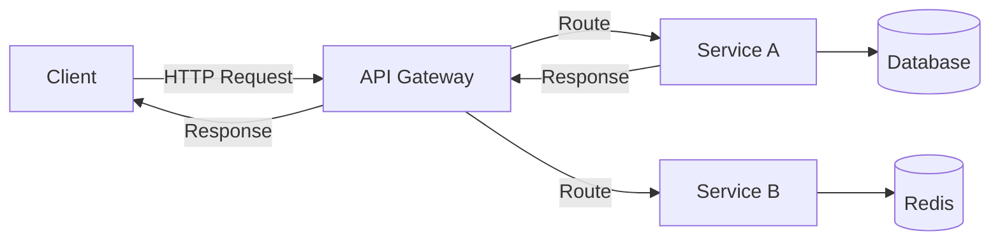
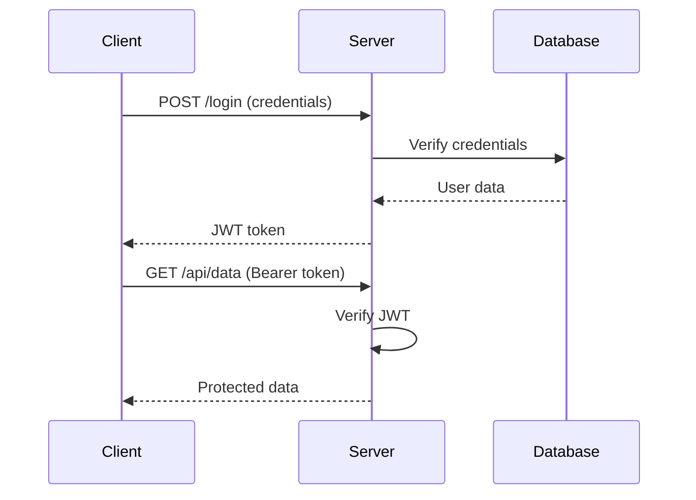
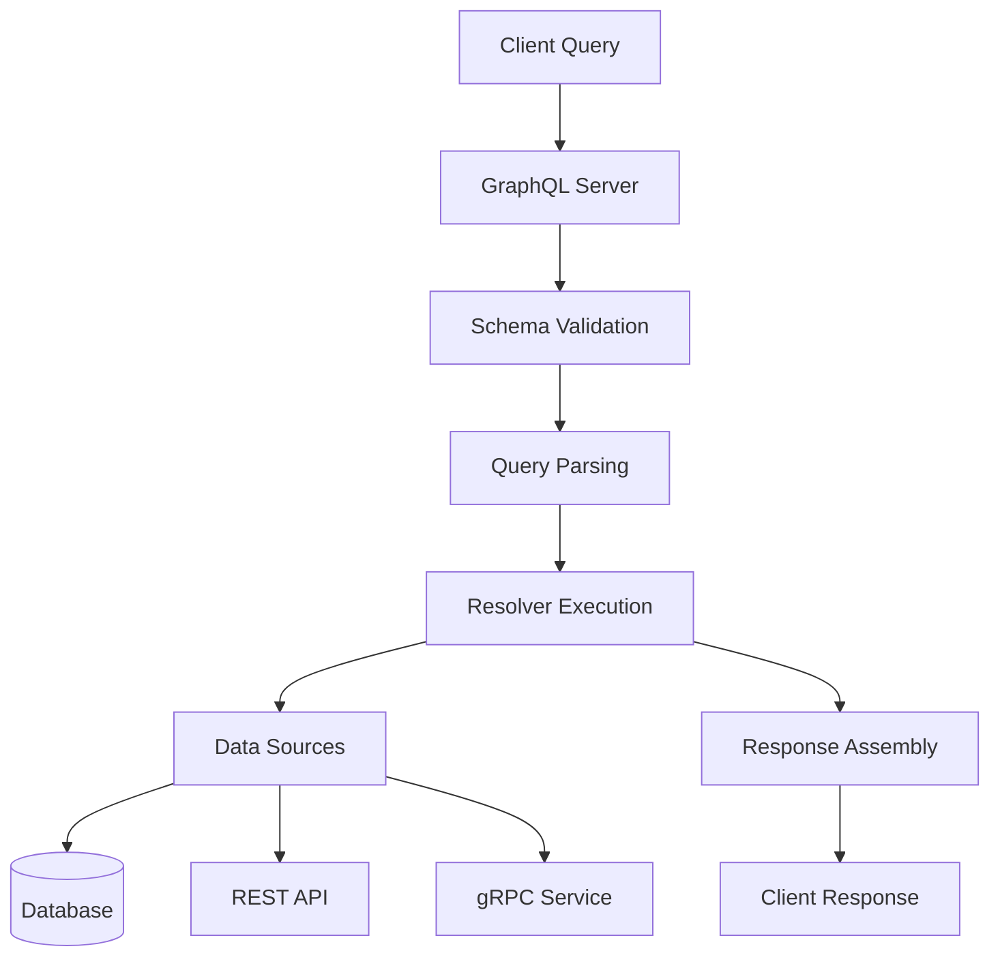
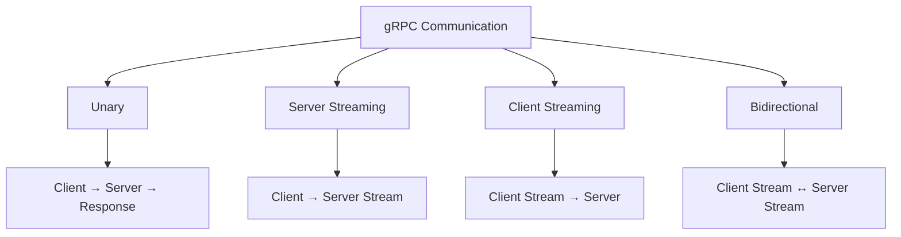
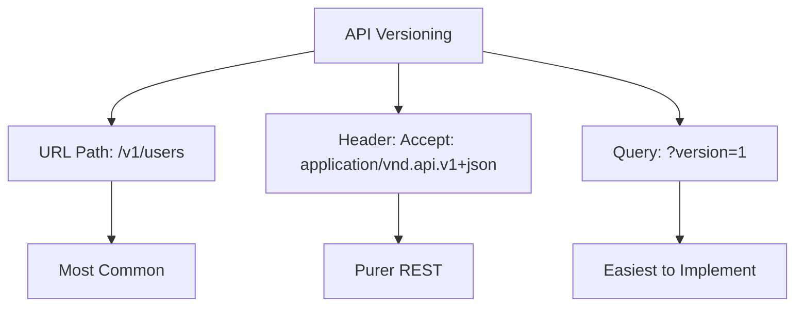

# API Design: REST, GraphQL, gRPC

## 1. Introduction

APIs (Application Programming Interfaces) are the contracts between software systems, enabling communication between different services, applications, and platforms. Modern API design encompasses REST, GraphQL, and gRPC — each with distinct strengths and use cases.

This guide covers REST API design principles, HTTP methods and status codes, GraphQL schemas and resolvers, gRPC protocol buffers, API versioning, authentication (OAuth, JWT), rate limiting, API documentation, testing, and webhooks.

**Why It Matters for Interviews:**
- Every modern application uses APIs
- API design directly affects developer experience
- Understanding trade-offs shows engineering maturity
- Critical for system design and backend interviews
- Common topic at all FAANG companies

---

## 2. Learning Roadmap

### Phase 1: REST Fundamentals (Weeks 1-2)
- [ ] HTTP methods and status codes
- [ ] RESTful resource naming
- [ ] Request/response formatting
- [ ] Error handling patterns
- [ ] HATEOAS

### Phase 2: Advanced REST (Weeks 3-4)
- [ ] Authentication and authorization
- [ ] Rate limiting and throttling
- [ ] Pagination and filtering
- [ ] API versioning strategies
- [ ] Documentation (OpenAPI/Swagger)

### Phase 3: GraphQL (Weeks 5-6)
- [ ] Schema definition language
- [ ] Queries, mutations, subscriptions
- [ ] Resolvers and data sources
- [ ] N+1 problem and DataLoader
- [ ] Schema stitching and federation

### Phase 4: gRPC (Weeks 7-8)
- [ ] Protocol Buffers
- [ ] Service definitions
- [ ] Streaming (unary, server, client, bidirectional)
- [ ] Interceptors and middleware
- [ ] gRPC vs REST comparison

### Phase 5: API Management (Weeks 9-10)
- [ ] API gateway patterns
- [ ] Webhooks and event-driven APIs
- [ ] API testing strategies
- [ ] Performance optimization
- [ ] Security best practices

---

## 3. Theory Notes

### REST (Representational State Transfer)

**Core Principles:**
1. **Client-Server**: Separation of concerns
2. **Stateless**: Each request contains all information needed
3. **Cacheable**: Responses must define cacheability
4. **Uniform Interface**: Consistent resource identification
5. **Layered System**: Client doesn't know about intermediate layers

**HTTP Methods:**
```
GET     → Retrieve resource (read-only, safe, idempotent)
POST    → Create new resource (not idempotent)
PUT     → Replace entire resource (idempotent)
PATCH   → Partial update (not idempotent)
DELETE  → Remove resource (idempotent)
HEAD    → Same as GET but without body
OPTIONS → Describe communication options
```

**Status Codes:**
```
2xx Success:
  200 OK → Request succeeded
  201 Created → Resource created
  202 Accepted → Request accepted for processing
  204 No Content → Success with no body

3xx Redirection:
  301 Moved Permanently → Resource moved
  304 Not Modified → Cached version is valid

4xx Client Error:
  400 Bad Request → Invalid request syntax
  401 Unauthorized → Authentication required
  403 Forbidden → Not authorized
  404 Not Found → Resource doesn't exist
  405 Method Not Allowed → HTTP method not supported
  409 Conflict → Conflict with current state
  422 Unprocessable Entity → Validation error
  429 Too Many Requests → Rate limit exceeded

5xx Server Error:
  500 Internal Server Error → Server error
  502 Bad Gateway → Invalid upstream response
  503 Service Unavailable → Server overloaded
  504 Gateway Timeout → Upstream timeout
```

**Resource Naming:**
```
Good:
GET    /api/v1/users          → List users
GET    /api/v1/users/123      → Get user 123
POST   /api/v1/users          → Create user
PUT    /api/v1/users/123      → Update user 123
DELETE /api/v1/users/123      → Delete user 123
GET    /api/v1/users/123/orders → Get orders for user 123

Bad:
GET /api/v1/getUsers
POST /api/v1/createUser
GET /api/v1/user/123/delete
```

**Richardson Maturity Model:**
```
Level 0: Single URI, single HTTP method (tunneling)
Level 1: Multiple URIs, single HTTP method (resources)
Level 2: Multiple URIs, multiple HTTP methods (verbs)
Level 3: HATEOAS (hypermedia controls)
```

### GraphQL

**Schema Definition:**
```graphql
type User {
  id: ID!
  name: String!
  email: String!
  posts: [Post!]!
  createdAt: DateTime!
}

type Post {
  id: ID!
  title: String!
  content: String!
  author: User!
  comments: [Comment!]!
}

type Query {
  user(id: ID!): User
  users(limit: Int, offset: Int): [User!]!
  post(id: ID!): Post
}

type Mutation {
  createUser(input: CreateUserInput!): User!
  updateUser(id: ID!, input: UpdateUserInput!): User!
  deleteUser(id: ID!): Boolean!
}

input CreateUserInput {
  name: String!
  email: String!
}

input UpdateUserInput {
  name: String
  email: String
}
```

**Queries:**
```graphql
# Fetch user with specific fields
query {
  user(id: "123") {
    name
    email
    posts {
      title
      comments {
        content
        author {
          name
        }
      }
    }
  }
}

# Variables
query GetUser($id: ID!) {
  user(id: $id) {
    name
    email
  }
}
```

**Resolvers:**
```javascript
const resolvers = {
  Query: {
    user: (_, { id }) => db.users.findById(id),
    users: (_, { limit, offset }) => db.users.find({ limit, offset }),
  },
  User: {
    posts: (user) => db.posts.findByUserId(user.id),
  },
  Post: {
    author: (post) => db.users.findById(post.authorId),
    comments: (post) => db.comments.findByPostId(post.id),
  },
};
```

### gRPC

**Protocol Buffer Definition:**
```protobuf
syntax = "proto3";

service UserService {
  rpc GetUser (GetUserRequest) returns (User);
  rpc ListUsers (ListUsersRequest) returns (stream User);
  rpc CreateUser (CreateUserRequest) returns (User);
  rpc UpdateUser (UpdateUserRequest) returns (User);
  rpc DeleteUser (DeleteUserRequest) returns (Empty);
}

message User {
  string id = 1;
  string name = 2;
  string email = 3;
  google.protobuf.Timestamp created_at = 4;
}

message GetUserRequest {
  string id = 1;
}

message ListUsersRequest {
  int32 limit = 1;
  int32 offset = 2;
}

message Empty {}
```

**gRPC Communication Types:**
```
Unary:          Client sends one message, server responds
Server Stream:  Client sends one, server responds with stream
Client Stream:  Client streams, server responds once
Bidirectional:  Both stream simultaneously
```

**gRPC vs REST:**
| Aspect | REST | gRPC |
|--------|------|------|
| Protocol | HTTP/1.1 | HTTP/2 |
| Format | JSON | Protocol Buffers |
| Schema | OpenAPI | .proto files |
| Streaming | Limited | Full support |
| Browser | Native | Requires gRPC-Web |
| Performance | Slower | Faster (binary) |
| Learning | Easier | Steeper |
| Use Case | Public APIs | Internal services |

### Authentication Methods

**JWT (JSON Web Token):**
```
Header.Payload.Signature

Header: {"alg": "RS256", "typ": "JWT"}
Payload: {"sub": "123", "name": "John", "exp": 1700000000}
Signature: RSA-SHA256(base64(header) + "." + base64(payload), private_key)
```

**OAuth 2.0 Flows:**
```
Authorization Code: Web apps (most secure)
Client Credentials: Server-to-server
Implicit: Legacy SPA (deprecated)
PKCE: SPA/mobile apps (recommended)
```

**API Keys vs JWT vs OAuth:**
| Method | Best For | Security |
|--------|----------|----------|
| API Key | Simple identification | Low (can be stolen) |
| JWT | Stateless authentication | Medium (signed, expiry) |
| OAuth 2.0 | Third-party access | High (delegated auth) |

---

## 4. Key Concepts

### API Design Principles

1. **Consistency**: Uniform naming, response formats, error handling
2. **Discoverability**: APIs should be self-documenting
3. **Evolvability**: Design for change without breaking clients
4. **Simplicity**: Don't expose internal implementation details
5. **Security**: Authenticate, authorize, validate everything

### Pagination Patterns

**Offset-Based:**
```
GET /api/users?offset=20&limit=10
Response: { data: [...], total: 100, offset: 20, limit: 10 }
```

**Cursor-Based:**
```
GET /api/users?cursor=abc123&limit=10
Response: { data: [...], next_cursor: "xyz789", has_more: true }
```

**Comparison:**
| Aspect | Offset | Cursor |
|--------|--------|--------|
| Simplicity | Simple | More complex |
| Performance | Degrades with offset | Consistent |
| Consistent | May miss items | Consistent |
| Random Access | Yes | No |

### Rate Limiting

**Algorithms:**
1. **Token Bucket**: Tokens added at fixed rate, consumed per request
2. **Sliding Window**: Count requests in rolling time window
3. **Fixed Window**: Count requests in fixed time periods
4. **Leaky Bucket**: Process requests at fixed rate

**Headers:**
```
X-RateLimit-Limit: 100
X-RateLimit-Remaining: 95
X-RateLimit-Reset: 1640000000
Retry-After: 30
```

### Error Response Format

```json
{
  "error": {
    "code": "VALIDATION_ERROR",
    "message": "Invalid input data",
    "details": [
      {
        "field": "email",
        "message": "Must be a valid email address"
      },
      {
        "field": "age",
        "message": "Must be at least 18"
      }
    ],
    "request_id": "req_abc123"
  }
}
```

---

## 5. FAQ (20+ Q&A)

### Q1: What makes an API RESTful?
**A:** REST APIs must follow: client-server architecture, statelessness, cacheability, uniform interface, and layered system. They use HTTP methods correctly, return appropriate status codes, and use resource-based URLs.

### Q2: When should I use GraphQL vs REST?
**A:** Use GraphQL when clients need flexible queries, have diverse data requirements, or want to avoid over-fetching. Use REST for simple CRUD APIs, public APIs, or when caching via HTTP is important.

### Q3: What is HATEOAS?
**A:** Hypermedia As The Engine Of Application State — the highest REST maturity level where responses include links to related resources, allowing clients to navigate the API dynamically.

### Q4: How do you version a REST API?
**A:** Common strategies: URL versioning (/v1/users), header versioning (Accept: application/vnd.api.v1+json), query parameter versioning (?version=1). URL versioning is most common and simplest.

### Q5: What is the N+1 problem in GraphQL?
**A:** When resolving a list of items, each item triggers a separate database query for its related data. Solve with DataLoader for batching and caching.

### Q6: How does JWT authentication work?
**A:** Server creates a signed token containing user claims. Client sends token with each request. Server verifies signature without database lookup. Token has expiration for security.

### Q7: What is rate limiting and why is it needed?
**A:** Controlling the number of API requests a client can make in a time period. Prevents abuse, ensures fair usage, and protects backend services from overload.

### Q8: What is the difference between authentication and authorization?
**A:** Authentication verifies identity (who are you?). Authorization determines access (what can you do?). JWT handles authentication; OAuth scopes handle authorization.

### Q9: How do you handle API errors?
**A:** Use consistent error format with error codes, messages, and details. Return appropriate HTTP status codes. Include request IDs for debugging. Log errors for monitoring.

### Q10: What is API pagination?
**A:** Returning large result sets in chunks. Offset-based is simpler but less performant at scale. Cursor-based provides consistent pagination and better performance.

### Q11: What are webhooks?
**A:** HTTP callbacks sent to your URL when events occur in another system. Instead of polling, you receive notifications. Used for real-time integrations (payment notifications, GitHub events).

### Q12: What is an API gateway?
**A:** A server that acts as a single entry point for all API calls. Handles routing, authentication, rate limiting, request transformation, and response caching.

### Q13: What is gRPC?
**A:** A high-performance RPC framework using Protocol Buffers and HTTP/2. Supports streaming, is faster than REST/JSON, and is commonly used for internal microservice communication.

### Q14: What is OpenAPI/Swagger?
**A:** A specification for describing REST APIs. Provides a schema definition, documentation, and tooling for code generation, testing, and validation.

### Q15: How do you secure an API?
**A:** Use HTTPS, authenticate with JWT/OAuth, validate all inputs, implement rate limiting, use CORS properly, sanitize outputs, and follow OWASP guidelines.

### Q16: What is idempotency?
**A:** An operation is idempotent if making multiple identical requests has the same effect as making it once. GET, PUT, DELETE are idempotent; POST is not.

### Q17: What is content negotiation?
**A:** The process where client and server agree on response format using Accept and Content-Type headers. Client specifies preferred formats; server responds with one.

### Q18: What is CORS?
**A:** Cross-Origin Resource Sharing — a mechanism allowing requests from different origins. Configured via Access-Control-Allow-Origin headers. Required for browser-based API calls.

### Q19: What is API composition?
**A:** Combining multiple API calls into a single response. Can be done client-side (multiple calls) or server-side (API gateway aggregation).

### Q20: What is the difference between REST and RPC?
**A:** REST is resource-oriented (nouns, HTTP methods). RPC is action-oriented (verbs, function calls). gRPC is a modern RPC framework; REST is an architectural style.

---

## 6. Hands-on Practice

### Exercise 1: Design a REST API for a Blog
```yaml
# OpenAPI Specification (simplified)
paths:
  /posts:
    get:
      summary: List posts
      parameters:
        - name: limit
          in: query
          schema: { type: integer, default: 10 }
        - name: offset
          in: query
          schema: { type: integer, default: 0 }
      responses:
        '200':
          description: List of posts
    post:
      summary: Create a post
      requestBody:
        content:
          application/json:
            schema:
              type: object
              required: [title, content]
              properties:
                title: { type: string }
                content: { type: string }
                tags: { type: array, items: { type: string } }
      responses:
        '201':
          description: Post created

  /posts/{id}:
    get:
      summary: Get a post
      parameters:
        - name: id
          in: path
          required: true
          schema: { type: string }
      responses:
        '200':
          description: Post details
        '404':
          description: Post not found
```

### Exercise 2: GraphQL Schema Design
```graphql
type Query {
  # Post queries
  post(id: ID!): Post
  posts(
    first: Int
    after: String
    filter: PostFilter
  ): PostConnection!

  # User queries
  me: User
  user(id: ID!): User
}

type Mutation {
  # Post mutations
  createPost(input: CreatePostInput!): Post!
  updatePost(id: ID!, input: UpdatePostInput!): Post!
  deletePost(id: ID!): Boolean!

  # Comment mutations
  addComment(postId: ID!, content: String!): Comment!
}

type Subscription {
  postCreated: Post!
  commentAdded(postId: ID!): Comment!
}

input PostFilter {
  authorId: ID
  tags: [String!]
  createdAfter: DateTime
}

type PostConnection {
  edges: [PostEdge!]!
  pageInfo: PageInfo!
  totalCount: Int!
}

type PostEdge {
  node: Post!
  cursor: String!
}

type PageInfo {
  hasNextPage: Boolean!
  endCursor: String
}
```

### Exercise 3: JWT Authentication Flow
```python
import jwt
import datetime
from functools import wraps

SECRET_KEY = "your-secret-key"

def generate_token(user_id, expires_in=3600):
    payload = {
        "user_id": user_id,
        "exp": datetime.datetime.utcnow() + datetime.timedelta(seconds=expires_in),
        "iat": datetime.datetime.utcnow()
    }
    return jwt.encode(payload, SECRET_KEY, algorithm="HS256")

def verify_token(token):
    try:
        payload = jwt.decode(token, SECRET_KEY, algorithms=["HS256"])
        return payload["user_id"]
    except jwt.ExpiredSignatureError:
        return None
    except jwt.InvalidTokenError:
        return None

def require_auth(f):
    @wraps(f)
    def decorated(*args, **kwargs):
        token = request.headers.get("Authorization", "").replace("Bearer ", "")
        user_id = verify_token(token)
        if not user_id:
            return {"error": "Unauthorized"}, 401
        return f(*args, user_id=user_id, **kwargs)
    return decorated

@app.route("/api/profile")
@require_auth
def get_profile(user_id):
    user = db.users.find_by_id(user_id)
    return user.to_dict()
```

### Exercise 4: Rate Limiter Implementation
```python
import time
from collections import defaultdict

class TokenBucketRateLimiter:
    def __init__(self, capacity, refill_rate):
        self.capacity = capacity
        self.refill_rate = refill_rate  # tokens per second
        self.buckets = defaultdict(lambda: {"tokens": capacity, "last_refill": time.time()})
    
    def allow_request(self, key):
        bucket = self.buckets[key]
        now = time.time()
        
        # Refill tokens
        elapsed = now - bucket["last_refill"]
        bucket["tokens"] = min(
            self.capacity,
            bucket["tokens"] + elapsed * self.refill_rate
        )
        bucket["last_refill"] = now
        
        # Check if request can be served
        if bucket["tokens"] >= 1:
            bucket["tokens"] -= 1
            return True
        return False

# Usage
limiter = TokenBucketRateLimiter(capacity=100, refill_rate=10)

@app.before_request
def check_rate_limit():
    client_ip = request.remote_addr
    if not limiter.allow_request(client_ip):
        return {"error": "Rate limit exceeded"}, 429
```

---

## 7. FAANG Questions

### Google
1. Design a URL shortener API (like bit.ly).
2. How would you design a real-time API for Google Maps?
3. Explain the trade-offs between REST and gRPC.
4. Design a rate limiting system for Google APIs.

### Amazon
5. Design an API for an e-commerce product catalog.
6. How would you handle API versioning at scale?
7. Design a webhook system for order notifications.
8. Explain AWS API Gateway design patterns.

### Meta
9. Design the Facebook Graph API.
10. How would you implement real-time updates via GraphQL subscriptions?
11. Design a rate limiting system for the News Feed API.
12. How would you handle API evolution without breaking clients?

### Apple
13. Design the Apple Push Notification API.
14. How would you implement end-to-end encryption in an API?
15. Design a privacy-preserving API for health data.
16. How would you handle API authentication across multiple Apple devices?

### Netflix
17. Design the Netflix API gateway.
18. How would you implement API composition for content recommendations?
19. Design a gRPC service for video streaming metadata.
20. How would you handle API failures gracefully?

### Microsoft
21. Design the Azure Active Directory API.
22. How would you implement multi-tenant API isolation?
23. Design a file upload API for OneDrive.
24. How would you handle API deprecation?

---

## 8. Common Mistakes

### REST API Design
1. **Using verbs in URLs** → `/getUser` instead of `/users/{id}`
2. **Inconsistent naming** → Mix of camelCase and snake_case
3. **Wrong HTTP methods** → Using POST for reads
4. **Missing status codes** → Always returning 200
5. **No error handling** → Unstructured error responses

### GraphQL Mistakes
6. **No query complexity limits** → Expensive queries
7. **N+1 queries** → Missing DataLoader
8. **Exposing internal schema** → Leaking implementation
9. **No pagination** → Fetching all records
10. **Missing validation** → Invalid input data

### Authentication
11. **Storing JWT in localStorage** → XSS vulnerability
12. **No token expiration** → Stolen tokens forever
13. **Weak secret keys** → JWT forgery
14. **Overly permissive CORS** → Security holes
15. **API keys in client code** → Exposed secrets

### Performance
16. **No caching headers** → Unnecessary server load
17. **No compression** → Slow transfers
18. **No connection keep-alive** → Connection overhead
19. **Synchronous operations** → Blocking responses
20. **No pagination** → Large response payloads

---

## 9. Best Practices

### REST API Design
1. Use nouns, not verbs, in URLs
2. Use plural nouns for collections
3. Return appropriate HTTP status codes
4. Support pagination for list endpoints
5. Use consistent response formats
6. Version your API from the start
7. Document everything with OpenAPI

### GraphQL Best Practices
1. Design schema around business operations
2. Use DataLoader for N+1 prevention
3. Implement query complexity limits
4. Use cursor-based pagination
5. Cache queries with persisted queries
6. Monitor query performance

### gRPC Best Practices
1. Use Protocol Buffers for efficient serialization
2. Implement proper error handling with status codes
3. Use streaming for real-time data
4. Implement health checks
5. Use interceptors for cross-cutting concerns

### Security
1. Use HTTPS everywhere
2. Authenticate all requests
3. Validate all inputs
4. Implement rate limiting
5. Use CORS properly
6. Never expose internal errors
7. Rotate API keys and secrets

### Documentation
1. Provide interactive API explorer
2. Include code examples in multiple languages
3. Document error responses
4. Provide SDKs when possible
5. Keep documentation in sync with code

---

## 10. Cheat Sheet

### HTTP Methods
```
GET     → Read (safe, idempotent)
POST    → Create (not idempotent)
PUT     → Replace (idempotent)
PATCH   → Update (not idempotent)
DELETE  → Remove (idempotent)
HEAD    → Headers only
OPTIONS → Allowed methods
```

### Status Codes
```
200 OK               201 Created           204 No Content
301 Moved            304 Not Modified      
400 Bad Request      401 Unauthorized      403 Forbidden
404 Not Found        409 Conflict          422 Validation Error
429 Rate Limited     500 Server Error      503 Unavailable
```

### REST URL Patterns
```
GET    /users           → List users
GET    /users/123       → Get user
POST   /users           → Create user
PUT    /users/123       → Replace user
PATCH  /users/123       → Update user
DELETE /users/123       → Delete user
GET    /users/123/orders → User's orders
```

### GraphQL Operations
```graphql
query { field }           → Read
mutation { field }        → Write
subscription { field }    → Real-time
```

### gRPC Status Codes
```
OK                 → Success
CANCELLED          → Client cancelled
INVALID_ARGUMENT   → Bad request
NOT_FOUND          → Resource not found
ALREADY_EXISTS     → Duplicate
UNAUTHENTICATED    → Auth required
PERMISSION_DENIED  → Not authorized
RESOURCE_EXHAUSTED → Rate limited
INTERNAL           → Server error
```

### JWT Structure
```
Header.Payload.Signature
Base64(Header).Base64(Payload).HMAC-SHA256(Base64(Header)+"."+Base64(Payload), secret)
```

---

## 11. Flash Cards (20)

1. **Q: What does REST stand for?**
   A: Representational State Transfer — an architectural style for web APIs.

2. **Q: What HTTP method is idempotent?**
   A: GET, PUT, DELETE — multiple identical requests have the same effect.

3. **Q: What is a 401 vs 403 status code?**
   A: 401 = Unauthorized (not authenticated), 403 = Forbidden (not authorized).

4. **Q: What is JWT?**
   A: JSON Web Token — a compact, URL-safe token format for transmitting claims.

5. **Q: What is the N+1 problem in GraphQL?**
   A: Resolving a list triggers separate queries for each item's related data.

6. **Q: What is an API gateway?**
   A: A single entry point handling routing, auth, rate limiting, and more.

7. **Q: What is rate limiting?**
   A: Controlling the number of requests a client can make in a time period.

8. **Q: What is HATEOAS?**
   A: Hypermedia controls in REST responses, enabling API discoverability.

9. **Q: What is the difference between REST and gRPC?**
   A: REST uses JSON/HTTP; gRPC uses Protocol Buffers/HTTP/2 with streaming.

10. **Q: What is OAuth 2.0?**
    A: An authorization framework for delegated access to protected resources.

11. **Q: What is CORS?**
    A: Cross-Origin Resource Sharing — allows browsers to make cross-origin API requests.

12. **Q: What is API versioning?**
    A: Managing multiple API versions to evolve without breaking existing clients.

13. **Q: What is cursor-based pagination?**
    A: Using a cursor marker to fetch the next page, more stable than offset pagination.

14. **Q: What is a webhook?**
    A: An HTTP callback triggered by events in another system.

15. **Q: What is Protocol Buffers?**
    A: Google's language-neutral, binary serialization format for gRPC.

16. **Q: What is the Richardson Maturity Model?**
    A: Levels (0-3) measuring REST API maturity, from tunneling to HATEOAS.

17. **Q: What is idempotency?**
    A: The property where multiple identical requests produce the same result.

18. **Q: What is content negotiation?**
    A: Client and server agreeing on response format via headers.

19. **Q: What is OpenAPI/Swagger?**
    A: A specification for describing REST APIs with machine-readable documentation.

20. **Q: What is API composition?**
    A: Combining multiple API calls into a single aggregated response.

---

## 12. Mind Map

```
                          API Design
                              |
     ┌──────────┬────────────┼────────────┬──────────┐
     |          |            |            |          |
   REST       GraphQL      gRPC       Security   Management
     |          |            |            |          |
  ┌──┼──┐   ┌──┼──┐     ┌──┼──┐     ┌──┼──┐   ┌──┼──┐
  |  |  |   |  |  |     |  |  |     |  |  |   |  |  |
HTTP URL  Schema Query Proto Stream JWT OAuth Rate Docs
Status    Resolver Subscription Buffers    CORS Limit Version
HATEOAS   DataLoader Federation         API Key Gateway
```

---

## 13. Mermaid Diagrams

### REST API Architecture


### JWT Authentication Flow


### GraphQL Request Flow


### gRPC Communication Types


### API Versioning Strategy


---

## 14. Code Examples

### Example 1: Complete REST API (Flask)
```python
from flask import Flask, request, jsonify
from functools import wraps
import jwt

app = Flask(__name__)

# Authentication decorator
def require_auth(f):
    @wraps(f)
    def decorated(*args, **kwargs):
        token = request.headers.get('Authorization', '').replace('Bearer ', '')
        if not token:
            return jsonify({"error": "Token required"}), 401
        try:
            payload = jwt.decode(token, SECRET_KEY, algorithms=["HS256"])
            request.user_id = payload['user_id']
        except jwt.ExpiredSignatureError:
            return jsonify({"error": "Token expired"}), 401
        except jwt.InvalidTokenError:
            return jsonify({"error": "Invalid token"}), 401
        return f(*args, **kwargs)
    return decorated

# Error handler
@app.errorhandler(404)
def not_found(error):
    return jsonify({
        "error": {
            "code": "NOT_FOUND",
            "message": "Resource not found"
        }
    }), 404

@app.errorhandler(422)
def validation_error(error):
    return jsonify({
        "error": {
            "code": "VALIDATION_ERROR",
            "message": "Invalid input",
            "details": error.description
        }
    }), 422

# API endpoints
@app.route('/api/v1/users', methods=['GET'])
@require_auth
def list_users():
    page = request.args.get('page', 1, type=int)
    per_page = request.args.get('per_page', 10, type=int)
    
    users = User.query.paginate(page=page, per_page=per_page)
    
    return jsonify({
        "data": [u.to_dict() for u in users.items],
        "pagination": {
            "page": users.page,
            "per_page": users.per_page,
            "total": users.total,
            "pages": users.pages
        }
    })

@app.route('/api/v1/users', methods=['POST'])
@require_auth
def create_user():
    data = request.get_json()
    
    # Validation
    errors = []
    if not data.get('name'):
        errors.append({"field": "name", "message": "Required"})
    if not data.get('email'):
        errors.append({"field": "email", "message": "Required"})
    
    if errors:
        return jsonify({"error": {"code": "VALIDATION_ERROR", "details": errors}}), 422
    
    user = User(name=data['name'], email=data['email'])
    db.session.add(user)
    db.session.commit()
    
    return jsonify({"data": user.to_dict()}), 201
```

### Example 2: GraphQL Server (Python + Strawberry)
```python
import strawberry
from typing import List, Optional
from datetime import datetime

@strawberry.type
class User:
    id: strawberry.ID
    name: str
    email: str
    created_at: datetime
    
    @strawberry.field
    def posts(self) -> List["Post"]:
        return db.posts.findBy_user_id(self.id)

@strawberry.type
class Post:
    id: strawberry.ID
    title: str
    content: str
    author: User
    
    @strawberry.field
    def comments(self) -> List["Comment"]:
        return db.comments.findBy_post_id(self.id)

@strawberry.type
class Query:
    @strawberry.field
    def user(self, id: strawberry.ID) -> Optional[User]:
        return db.users.find_by_id(id)
    
    @strawberry.field
    def users(self, limit: int = 10, offset: int = 0) -> List[User]:
        return db.users.find_all(limit=limit, offset=offset)

@strawberry.type
class Mutation:
    @strawberry.mutation
    def create_user(self, name: str, email: str) -> User:
        user = User(id=str(uuid4()), name=name, email=email, created_at=datetime.now())
        db.users.insert(user)
        return user

schema = strawberry.Schema(query=Query, mutation=Mutation)
```

### Example 3: gRPC Service (Python)
```python
# greeter.proto
"""
service Greeter {
  rpc SayHello (HelloRequest) returns (HelloReply);
  rpc SayHelloStream (HelloRequest) returns (stream HelloReply);
}

message HelloRequest {
  string name = 1;
}

message HelloReply {
  string message = 1;
}
"""

import grpc
from concurrent import futures
import greeter_pb2
import greeter_pb2_grpc

class GreeterServicer(greeter_pb2_grpc.GreeterServicer):
    def SayHello(self, request, context):
        return greeter_pb2.HelloReply(
            message=f"Hello, {request.name}!"
        )
    
    def SayHelloStream(self, request, context):
        for i in range(10):
            yield greeter_pb2.HelloReply(
                message=f"Hello, {request.name}! ({i+1}/10)"
            )

def serve():
    server = grpc.server(futures.ThreadPoolExecutor(max_workers=10))
    greeter_pb2_grpc.add_GreeterServicer_to_server(GreeterServicer(), server)
    server.add_insecure_port('[::]:50051')
    server.start()
    server.wait_for_termination()
```

### Example 4: Webhook Handler
```python
import hmac
import hashlib

@app.route('/webhooks/payments', methods=['POST'])
def handle_payment_webhook():
    # Verify webhook signature
    signature = request.headers.get('X-Webhook-Signature')
    payload = request.get_data()
    
    expected = hmac.new(
        WEBHOOK_SECRET.encode(),
        payload,
        hashlib.sha256
    ).hexdigest()
    
    if not hmac.compare_digest(signature, expected):
        return {"error": "Invalid signature"}, 401
    
    event = request.get_json()
    
    # Process based on event type
    if event['type'] == 'payment.completed':
        process_payment(event['data'])
    elif event['type'] == 'payment.failed':
        handle_payment_failure(event['data'])
    
    return {"received": True}, 200
```

---

## 15. Projects

### Project 1: REST API for Task Management
**Objective:** Build a complete task management API.
**Features:**
- User authentication (JWT)
- CRUD operations for tasks
- Task assignment and status
- Comments and attachments
- Search and filtering
- Rate limiting
- API documentation (OpenAPI)

### Project 2: GraphQL Social Media API
**Objective:** Build a GraphQL API for a social platform.
**Features:**
- User profiles and connections
- Posts with comments and likes
- Real-time subscriptions
- Friend recommendations
- News feed generation
- N+1 problem prevention (DataLoader)

### Project 3: gRPC Microservices
**Objective:** Build a microservices architecture with gRPC.
**Features:**
- User service
- Order service
- Payment service
- Service discovery
- Interceptors for auth and logging
- Bidirectional streaming

### Project 4: API Gateway
**Objective:** Build an API gateway with common features.
**Features:**
- Request routing
- Authentication/authorization
- Rate limiting
- Request/response transformation
- Caching
- Circuit breaker
- Logging and monitoring

---

## 16. Resources

### Books
- "Designing Web APIs" by Brenda Jin et al.
- "REST API Design Rulebook" by Mark Massé
- "Building APIs with Node.js" by Caio Ribeiro
- "gRPC: Up and Running" by Kasun Indrasiri

### Online Courses
- [Postman: API Fundamentals](https://learning.postman.com/)
- [GraphQL Official Tutorials](https://graphql.org/learn/)
- [gRPC Official Documentation](https://grpc.io/docs/)

### Tools
- **API Design**: Postman, Insomnia, Swagger Editor
- **Documentation**: OpenAPI Generator, Redocly
- **Testing**: Newman, GraphQL Playground, BloomRPC
- **Mocking**: Mockoon, Prism, WireMock

### Specifications
- [OpenAPI 3.0](https://swagger.io/specification/)
- [GraphQL Specification](https://spec.graphql.org/)
- [gRPC Protocol](https://grpc.io/docs/what-is-grpc/)

---

## 17. Checklist

### REST API
- [ ] Consistent URL naming conventions
- [ ] Proper HTTP methods used
- [ ] Appropriate status codes returned
- [ ] Pagination implemented
- [ ] Error handling with consistent format
- [ ] Authentication/authorization
- [ ] Rate limiting
- [ ] CORS configured
- [ ] API versioning
- [ ] Documentation (OpenAPI)

### GraphQL
- [ ] Schema designed around business operations
- [ ] Query complexity limits
- [ ] N+1 problem addressed (DataLoader)
- [ ] Pagination implemented (cursor-based)
- [ ] Authentication/authorization
- [ ] Subscriptions for real-time
- [ ] Error handling
- [ ] Query validation

### gRPC
- [ ] Protocol Buffers defined
- [ ] Service methods implemented
- [ ] Error handling with status codes
- [ ] Streaming implemented where needed
- [ ] Interceptors for cross-cutting concerns
- [ ] Health checks
- [ ] Load balancing configured
- [ ] Documentation

### Security
- [ ] HTTPS enforced
- [ ] Input validation
- [ ] SQL injection prevention
- [ ] XSS prevention
- [ ] CSRF protection
- [ ] Rate limiting
- [ ] API key rotation

---

## 18. Revision Plans

### Week 1: REST Fundamentals
- Day 1-2: HTTP methods, status codes
- Day 3-4: Resource naming, URL design
- Day 5-7: Error handling, pagination

### Week 2: Advanced REST
- Day 1-2: Authentication (JWT, OAuth)
- Day 3-4: Rate limiting, CORS
- Day 5-7: OpenAPI documentation

### Week 3: GraphQL
- Day 1-2: Schema design
- Day 3-4: Queries, mutations, subscriptions
- Day 5-7: DataLoader, performance

### Week 4: gRPC & Management
- Day 1-2: Protocol Buffers, service definitions
- Day 3-4: Streaming, interceptors
- Day 5-7: API gateway, webhooks, practice

---

## 19. Mock Interviews

### Round 1: REST (30 min)
1. Design a REST API for a URL shortener.
2. What status codes would you use for different scenarios?
3. How would you implement pagination?
4. How do you handle API versioning?

### Round 2: GraphQL (45 min)
1. Design a GraphQL schema for an e-commerce platform.
2. How do you solve the N+1 problem?
3. When would you use GraphQL over REST?
4. How do you implement real-time updates?

### Round 3: gRPC (30 min)
1. When would you choose gRPC over REST?
2. Design a gRPC service for a chat application.
3. How does gRPC streaming work?
4. How do you handle errors in gRPC?

### Round 4: Security & Architecture (30 min)
1. How would you secure a public API?
2. Design an API gateway for microservices.
3. How would you implement rate limiting at scale?
4. How do you handle API deprecation?

---

## 20. Difficulty Rating

| Topic | Difficulty | Interview Frequency |
|-------|-----------|-------------------|
| HTTP Methods & Status | ⭐⭐ (Easy) | Very High |
| REST URL Design | ⭐⭐ (Easy) | Very High |
| Error Handling | ⭐⭐⭐ (Medium) | High |
| Pagination | ⭐⭐⭐ (Medium) | High |
| JWT Authentication | ⭐⭐⭐ (Medium) | Very High |
| OAuth 2.0 | ⭐⭐⭐⭐ (Hard) | High |
| GraphQL Schema Design | ⭐⭐⭐ (Medium) | High |
| GraphQL N+1 Problem | ⭐⭐⭐⭐ (Hard) | Medium |
| gRPC | ⭐⭐⭐⭐ (Hard) | Medium |
| Rate Limiting | ⭐⭐⭐ (Medium) | High |
| API Versioning | ⭐⭐⭐ (Medium) | Medium |
| OpenAPI Documentation | ⭐⭐ (Easy) | Medium |
| Webhooks | ⭐⭐⭐ (Medium) | Medium |
| API Gateway | ⭐⭐⭐⭐ (Hard) | Medium |

---

## 21. Summary

API design is a critical skill for modern software engineering. Key takeaways:

1. **REST**: Resource-oriented, HTTP-native, great for public APIs
2. **GraphQL**: Flexible queries, schema-first, great for diverse clients
3. **gRPC**: High-performance, streaming, great for internal services
4. **Authentication**: JWT for stateless auth, OAuth for delegated access
5. **Error Handling**: Consistent format with appropriate status codes
6. **Versioning**: Plan for evolution from the start
7. **Documentation**: OpenAPI/Swagger for REST, schema for GraphQL

**Interview Tip:** Always discuss trade-offs when recommending an API style. REST is simple but may over/under-fetch; GraphQL is flexible but complex; gRPC is fast but browser-limited. The right choice depends on the use case.
