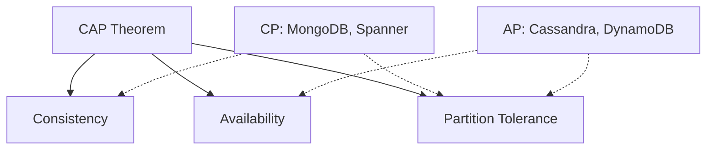
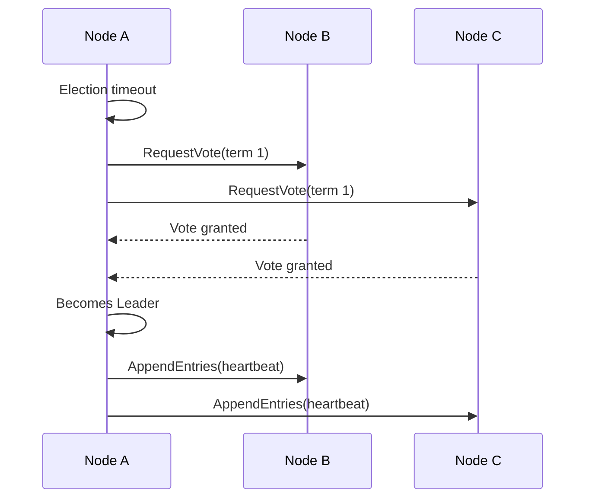
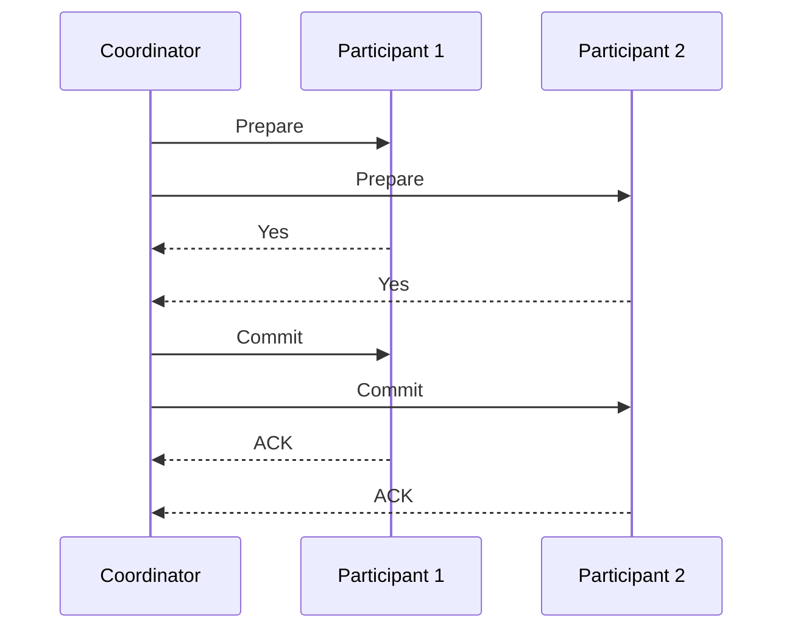
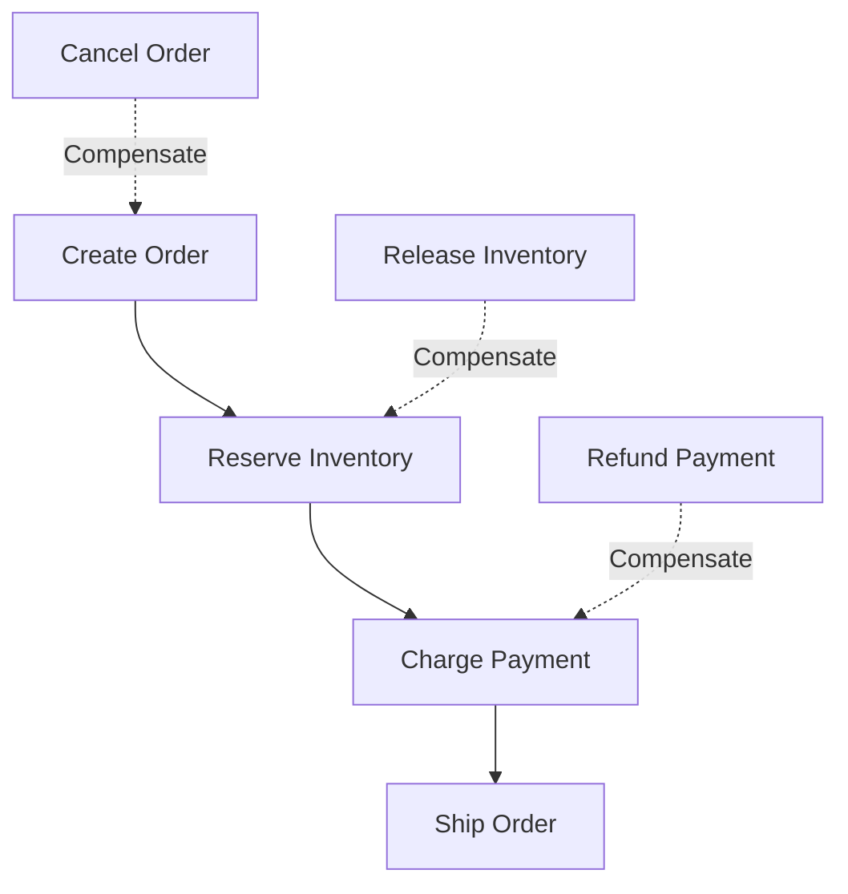

# Distributed Systems

## 1. Introduction

Distributed Systems are networks of independent computers that appear as a single coherent system to users. Understanding distributed systems is crucial for building scalable, fault-tolerant applications that serve millions of users.

This guide covers the CAP theorem, PACELC, consensus protocols (Paxos, Raft), distributed transactions (2PC, Saga), consistency models, fault tolerance, leader election, distributed storage, clock synchronization, vector clocks, and gossip protocol.

**Why It Matters for Interviews:**
- Every large-scale system is distributed
- Understanding trade-offs is essential for system design
- Consensus and consistency are common interview topics
- Critical for backend, infrastructure, and SRE roles

---

## 2. Learning Roadmap

### Phase 1: Foundations (Weeks 1-2)
- [ ] Distributed system characteristics
- [ ] CAP theorem and PACELC
- [ ] Consistency models (strong, eventual, causal)
- [ ] Network partitions and failure modes

### Phase 2: Consensus (Weeks 3-4)
- [ ] Byzantine fault tolerance
- [ ] Paxos protocol
- [ ] Raft protocol
- [ ] Leader election

### Phase 3: Transactions (Weeks 5-6)
- [ ] Two-Phase Commit (2PC)
- [ ] Saga pattern
- [ ] TCC (Try-Confirm-Cancel)

### Phase 4: Distributed Data (Weeks 7-8)
- [ ] Clock synchronization (NTP, TrueTime)
- [ ] Vector clocks
- [ ] Gossip protocol
- [ ] Consistent hashing

### Phase 5: Advanced Topics (Weeks 9-10)
- [ ] Distributed storage systems
- [ ] Replication strategies
- [ ] Partitioning and sharding
- [ ] Failure detection

---

## 3. Theory Notes

### CAP Theorem

In a distributed system, you can guarantee at most 2 of 3:
- **Consistency (C):** Every read receives the most recent write
- **Availability (A):** Every request receives a response
- **Partition Tolerance (P):** System continues despite network failures

Since network partitions are inevitable, the choice is:
- **CP:** Consistent but may reject requests during partition
- **AP:** Available but may return stale data during partition

**Examples:**
- CP Systems: MongoDB, HBase, Google Spanner
- AP Systems: Cassandra, DynamoDB, CouchDB
- CA Systems: Traditional RDBMS (single node only!)

### PACELC Theorem

Extension of CAP:
- If Partition (P): Choose between Availability (A) and Consistency (C)
- Else (E): Choose between Latency (L) and Consistency (C)

### Consistency Models

**Strong Consistency:** After a write completes, all subsequent reads see that write. Linearizability: operations appear instantaneous.

**Eventual Consistency:** If no new updates, all replicas eventually converge. Reads may return stale data. High availability, low latency.

**Causal Consistency:** Operations that are causally related are seen in order. Concurrent operations may be seen in different order.

### Paxos Protocol

Two phases: Prepare and Accept.

**Phase 1 (Prepare):**
1. Proposer sends Prepare(n) to acceptors
2. Acceptors respond with Promise(n, last_accepted_value)
3. Proposer picks value from highest-numbered response

**Phase 2 (Accept):**
1. Proposer sends Accept(n, value) to acceptors
2. Acceptors accept if they haven't promised higher
3. If majority accept, value is chosen

### Raft Protocol

Roles: Leader, Follower, Candidate

**Leader Election:**
1. Follower timeout becomes Candidate
2. Candidate requests votes
3. Majority votes becomes Leader
4. Leader sends heartbeats

**Log Replication:**
1. Client sends command to Leader
2. Leader appends to log
3. Leader sends AppendEntries to Followers
4. Majority acknowledge committed
5. Leader applies to state machine

### Two-Phase Commit (2PC)

**Phase 1 (Prepare):** Coordinator asks participants "Can you commit?"
**Phase 2 (Commit/Abort):** If all say yes, commit; otherwise abort.

**Problems:** Blocking during coordinator failure, single point of failure, multiple round trips.

### Saga Pattern

Long-lived transaction decomposed into steps, each with a compensating action.

**Order Saga:**
1. Create Order -> Compensate: Cancel Order
2. Reserve Inventory -> Compensate: Release Inventory
3. Charge Payment -> Compensate: Refund Payment

### Gossip Protocol

Epidemic-style communication. Each node periodically selects a random peer, exchanges state information, and updates local state. O(log n) rounds for full propagation.

### Consistent Hashing

Hash ring with virtual nodes. Keys and servers hashed to ring position. Key assigned to next server clockwise. Adding/removing server only affects nearby keys.

---

## 4. Key Concepts

### Failure Modes

| Failure | Description | Handling |
|---------|-------------|----------|
| Crash | Node stops responding | Redundancy, heartbeats |
| Omission | Message lost | Retransmission, ACKs |
| Timing | Response too slow | Timeouts, failure detection |
| Byzantine | Node behaves incorrectly | BFT protocols |
| Network Partition | Nodes cannot communicate | CAP trade-offs |

### Replication Strategies

- **Synchronous:** Strong consistency, high latency
- **Asynchronous:** Low latency, eventual consistency
- **Semi-Synchronous:** At least one sync replica

### Partitioning Strategies

- **Range:** Good for range queries, hotspots risk
- **Hash:** Even distribution, poor range queries
- **Directory-Based:** Flexible but adds latency

---

## 5. FAQ (20+ Q&A)

### Q1: What is the CAP theorem?
In a distributed system, you can guarantee at most 2 of 3 properties: Consistency, Availability, and Partition Tolerance. Since partitions are unavoidable, you choose between CP and AP.

### Q2: What is eventual consistency?
All replicas converge to the same value eventually, but reads may return stale data temporarily.

### Q3: Explain Raft consensus.
Raft elects a leader via majority vote. The leader receives requests, replicates to followers, and commits when majority acknowledges. If the leader fails, a new election occurs.

### Q4: What is the Two-Phase Commit problem?
2PC requires all participants to agree before committing. Problems: blocking during coordinator failure, single point of failure, and performance overhead.

### Q5: What is the Saga pattern?
A Saga decomposes a long transaction into steps with compensating actions. If a step fails, compensating actions undo previous steps.

### Q6: What are vector clocks?
Per-node timestamp vectors used to track causal ordering and detect concurrent events.

### Q7: What is the gossip protocol?
An epidemic-style protocol where nodes periodically exchange state with random peers. Information spreads until all nodes converge.

### Q8: What is consistent hashing?
A technique mapping keys and servers to a hash ring. Adding/removing a server only affects nearby keys.

### Q9: What is leader election?
The process of selecting one node as coordinator using majority voting or other algorithms.

### Q10: What is the difference between synchronous and asynchronous replication?
Synchronous waits for all replicas to acknowledge (strong consistency, higher latency). Asynchronous responds immediately and replicates later (lower latency, eventual consistency).

### Q11: What is Byzantine fault tolerance?
The ability to function correctly even when some nodes fail arbitrarily. Requires 3f+1 nodes to tolerate f Byzantine faults.

### Q12: What is linearizability?
The strongest consistency guarantee where operations appear to execute atomically and instantaneously.

### Q13: What is the difference between Paxos and Raft?
Raft has a strong leader model and is more understandable. Paxos is more symmetric. Both achieve consensus.

### Q14: What is a quorum?
The minimum number of nodes that must agree. Typically floor(N/2) + 1.

### Q15: What is split-brain?
A failure where network partitions cause two groups to each believe they are the leader.

### Q16: What is the FLP impossibility?
No deterministic consensus protocol can guarantee termination in an asynchronous system if even one process can crash.

### Q17: What is anti-entropy?
A mechanism for repairing inconsistencies between replicas by comparing and reconciling their states.

### Q18: What is a distributed lock?
A lock that can be acquired by only one process across multiple machines. Implementations include Redlock (Redis), ZooKeeper, and etcd.

### Q19: What is idempotency in distributed systems?
An operation that produces the same result regardless of how many times it is executed. Critical for safe retries.

### Q20: What is PACELC?
Extension of CAP: during partition choose A or C; else choose L (latency) or C (consistency).

### Q21: What is TrueTime?
Google's time API using atomic clocks and GPS for accurate timestamps across data centers.

### Q22: What is read-your-writes consistency?
A consistency model where a process always reads its own writes. Other processes may see stale data.

---

## 6. Hands-on Practice

### Exercise 1: Raft Leader Election Simulation
```
Initial: Node A (Follower), Node B (Follower), Node C (Follower)
Step 1: Node A times out -> Candidate (term 1)
Step 2: Node A requests votes from B and C
Step 3: Both vote for A -> A becomes Leader
Step 4: A sends heartbeats, resetting election timeouts
```

### Exercise 2: Consistent Hashing
```python
import hashlib
from bisect import bisect_right

class ConsistentHash:
    def __init__(self, nodes, virtual_nodes=150):
        self.ring = {}
        self.sorted_keys = []
        for node in nodes:
            self.add_node(node)

    def _hash(self, key):
        return int(hashlib.md5(key.encode()).hexdigest(), 16)

    def add_node(self, node):
        for i in range(150):
            key = self._hash(f"{node}:{i}")
            self.ring[key] = node
            self.sorted_keys.append(key)
        self.sorted_keys.sort()

    def get_node(self, key):
        if not self.ring:
            return None
        hash_val = self._hash(key)
        idx = bisect_right(self.sorted_keys, hash_val) % len(self.sorted_keys)
        return self.ring[self.sorted_keys[idx]]

ch = ConsistentHash(["server1", "server2", "server3"])
for i in range(10):
    print(f"key{i} -> {ch.get_node(f'key{i}')}")
```

### Exercise 3: Vector Clock Implementation
```python
class VectorClock:
    def __init__(self, node_id, num_nodes):
        self.node_id = node_id
        self.clock = [0] * num_nodes

    def increment(self):
        self.clock[self.node_id] += 1

    def merge(self, other_clock):
        self.clock = [max(a, b) for a, b in zip(self.clock, other_clock)]

    def happens_before(self, other):
        return all(a <= b for a, b in zip(self.clock, other.clock))

    def concurrent(self, other):
        return not self.happens_before(other) and not other.happens_before(self)
```

---

## 7. FAANG Questions

### Google
1. Explain the CAP theorem with real-world examples.
2. How does Google Spanner achieve external consistency?
3. Design a distributed lock service.
4. How would you handle clock skew in a distributed system?

### Amazon
5. Design a distributed key-value store.
6. Explain DynamoDB's consistency model.
7. How would you implement a distributed cache?
8. Design a distributed task scheduler.

### Meta
9. How does Facebook handle consistency across data centers?
10. Design a distributed notification system.
11. Explain the use of Paxos in Facebook's infrastructure.
12. How would you implement distributed rate limiting?

### Apple
13. How does iCloud sync data across devices?
14. Design a conflict-free replicated data type (CRDT).
15. How would you implement distributed authentication?
16. Explain Apple's approach to end-to-end encryption.

### Netflix
17. How does Netflix handle regional outages?
18. Design a distributed recommendation engine.
19. Explain Netflix's approach to chaos engineering.
20. How would you implement distributed tracing?

---

## 8. Common Mistakes

1. Assuming CA is possible in distributed systems (only single-node)
2. Ignoring network partitions (assuming perfect network)
3. Using 2PC everywhere (performance and availability issues)
4. Assuming synchronized clocks (timestamp ordering bugs)
5. Not testing failure scenarios
6. Single point of failure in design
7. Not implementing idempotency for retries
8. Ignoring split-brain scenarios
9. Over-optimizing for normal case
10. Not monitoring distributed state

---

## 9. Best Practices

1. Design for failure (assume everything can fail)
2. Use idempotent operations for retries
3. Implement circuit breakers
4. Choose the right consistency model for the use case
5. Use majority quorums for writes
6. Implement leader election with fencing
7. Use heartbeats and failure detection
8. Implement distributed tracing (Jaeger, Zipkin)
9. Monitor replication lag
10. Document failure modes and recovery

---

## 10. Cheat Sheet

```
CAP: Choose 2 of Consistency, Availability, Partition Tolerance
Paxos/Raft: 2f+1 nodes tolerate f failures
Byzantine: 3f+1 nodes tolerate f failures
Quorum: floor(N/2) + 1

Synchronous Replication: Strong consistency, high latency
Asynchronous: Low latency, eventual consistency

Consistent Hashing: Hash ring, virtual nodes, minimal reshuffling
Gossip: Epidemic dissemination, O(log n) convergence
Vector Clocks: Causal ordering, concurrent detection
```

---

## 11. Flash Cards (20)

1. **Q: What is the CAP theorem?** A: Distributed systems can guarantee only 2 of 3: Consistency, Availability, Partition Tolerance.

2. **Q: What is eventual consistency?** A: All replicas converge eventually, but reads may return stale data.

3. **Q: What is Paxos?** A: A consensus protocol for achieving agreement among distributed nodes.

4. **Q: What is Raft?** A: A consensus protocol with strong leader model and log replication.

5. **Q: What is 2PC?** A: A distributed transaction protocol where coordinator asks participants to prepare then commit or abort.

6. **Q: What is the Saga pattern?** A: Decomposing a long transaction into steps with compensating actions.

7. **Q: What are vector clocks?** A: Per-node timestamp vectors for causal ordering and concurrent event detection.

8. **Q: What is consistent hashing?** A: Mapping keys and servers to a hash ring for even distribution.

9. **Q: What is the gossip protocol?** A: An epidemic protocol where nodes exchange state with random peers.

10. **Q: What is a quorum?** A: Minimum nodes that must agree (typically floor(N/2)+1).

11. **Q: What is linearizability?** A: Operations appear atomic and instantaneous.

12. **Q: What is split-brain?** A: Network partition causes two groups to each believe they are the leader.

13. **Q: What is Byzantine fault tolerance?** A: System functions correctly despite nodes failing arbitrarily. Requires 3f+1 nodes.

14. **Q: What is leader election?** A: Selecting one node as coordinator using majority voting.

15. **Q: What is FLP impossibility?** A: No deterministic consensus can guarantee termination in async systems if one process can crash.

16. **Q: What is anti-entropy?** A: Repairing replica inconsistencies by comparing and reconciling states.

17. **Q: What is a distributed lock?** A: A lock acquired by only one process across multiple machines.

18. **Q: What is idempotency?** A: An operation producing the same result regardless of execution count.

19. **Q: What is PACELC?** A: During partition choose A or C; else choose L or C.

20. **Q: What is TrueTime?** A: Google's time API using atomic clocks and GPS for accurate timestamps.

---

## 12. Mind Map

```
                    Distributed Systems
                          |
   +----------+-----------+-----------+----------+
   |          |           |           |          |
Theory    Consensus   Transactions   Data    Operations
   |          |           |           |          |
 CAP      Paxos/Raft    2PC/Saga   Clocks    Monitor
 PACELC   Leader       TCC        Vector    Trace
 Models   Election               Gossip     Detect
```

---

## 13. Mermaid Diagrams

### CAP Theorem


### Raft Leader Election


### 2PC Protocol


### Saga Pattern


---

## 14. Code Examples

### Example 1: Simple Raft Implementation
```python
import random
import time
from enum import Enum

class State(Enum):
    FOLLOWER = 1
    CANDIDATE = 2
    LEADER = 3

class RaftNode:
    def __init__(self, node_id, peers):
        self.node_id = node_id
        self.peers = peers
        self.state = State.FOLLOWER
        self.current_term = 0
        self.voted_for = None
        self.log = []
        self.commit_index = 0

    def election_timeout(self):
        return random.uniform(0.15, 0.3)

    def start_election(self):
        self.current_term += 1
        self.state = State.CANDIDATE
        self.voted_for = self.node_id
        votes = 1

        for peer in self.peers:
            if self.request_vote(peer):
                votes += 1

        if votes > (len(self.peers) + 1) // 2:
            self.state = State.LEADER
            self.send_heartbeats()

    def request_vote(self, peer):
        return True

    def send_heartbeats(self):
        for peer in self.peers:
            self.append_entries(peer)

    def append_entries(self, peer):
        pass
```

### Example 2: Consistent Hash Ring
```python
import hashlib
from bisect import bisect_right

class ConsistentHashRing:
    def __init__(self, nodes=None, vnodes=150):
        self.ring = {}
        self.sorted_keys = []
        self.vnodes = vnodes
        if nodes:
            for node in nodes:
                self.add_node(node)

    def _hash(self, key):
        return int(hashlib.sha256(key.encode()).hexdigest(), 16)

    def add_node(self, node):
        for i in range(self.vnodes):
            key = self._hash(f"{node}#{i}")
            self.ring[key] = node
            self.sorted_keys.append(key)
        self.sorted_keys.sort()

    def remove_node(self, node):
        for i in range(self.vnodes):
            key = self._hash(f"{node}#{i}")
            if key in self.ring:
                del self.ring[key]
                self.sorted_keys.remove(key)

    def get_node(self, data_key):
        if not self.ring:
            return None
        h = self._hash(data_key)
        idx = bisect_right(self.sorted_keys, h) % len(self.sorted_keys)
        return self.ring[self.sorted_keys[idx]]
```

---

## 15. Projects

### Project 1: Distributed Key-Value Store
Build a simplified Dynamo-style key-value store with consistent hashing, vector clocks, and quorum reads/writes.

### Project 2: Raft Consensus Module
Implement the Raft consensus protocol with leader election, log replication, and safety guarantees.

### Project 3: Distributed Task Queue
Build a task queue with at-least-once delivery, idempotent workers, and failure handling using the Saga pattern.

### Project 4: Gossip-Based Membership
Implement a gossip protocol for cluster membership and failure detection.

---

## 16. Resources

### Books
- "Designing Data-Intensive Applications" by Martin Kleppmann
- "Distributed Systems" by Maarten van Steen & Andrew Tanenbaum
- "Distributed Algorithms" by Nancy Lynch

### Papers
- "In Search of an Understandable Consensus Algorithm" (Raft)
- "Time, Clocks, and the Ordering of Events in a Distributed System" (Lamport)
- "Weighted Voting for Replicated Data" (Gifford)

### Online Courses
- MIT 6.824: Distributed Systems
- Distributed Systems in Practice (YouTube)

---

## 17. Checklist

- [ ] CAP theorem understood with examples
- [ ] PACELC theorem understood
- [ ] Raft/Paxos consensus protocols
- [ ] 2PC and Saga transaction patterns
- [ ] Vector clocks implementation
- [ ] Consistent hashing implementation
- [ ] Gossip protocol understanding
- [ ] Failure detection mechanisms
- [ ] Replication strategies
- [ ] Partitioning strategies

---

## 18. Revision Plans

### Week 1-2: Foundations
- CAP theorem, PACELC, consistency models, failure modes

### Week 3-4: Consensus
- Paxos, Raft, leader election, quorum

### Week 5-6: Transactions
- 2PC, Saga, TCC, idempotency

### Week 7-8: Distributed Data
- Vector clocks, gossip, consistent hashing, NTP

### Week 9-10: Advanced
- Storage systems, replication, partitioning, failure detection

---

## 19. Mock Interviews

### Round 1: Theory (30 min)
1. Explain CAP theorem with examples
2. What is the difference between strong and eventual consistency?
3. How does Raft handle leader failure?

### Round 2: Design (45 min)
1. Design a distributed key-value store
2. How would you implement distributed locking?
3. Design a globally distributed database

### Round 3: Patterns (30 min)
1. When would you use Saga vs 2PC?
2. How would you handle network partitions?
3. Design a failure detection system

---

## 20. Difficulty Rating

| Topic | Difficulty | Interview Frequency |
|-------|-----------|-------------------|
| CAP Theorem | star-star (Easy) | Very High |
| Consistency Models | star-star-star (Medium) | High |
| Raft/Paxos | star-star-star-star (Hard) | High |
| 2PC | star-star-star (Medium) | High |
| Saga Pattern | star-star-star (Medium) | High |
| Vector Clocks | star-star-star (Medium) | Medium |
| Consistent Hashing | star-star-star (Medium) | High |
| Gossip Protocol | star-star-star (Medium) | Medium |
| Leader Election | star-star-star (Medium) | High |
| Byzantine Fault Tolerance | star-star-star-star-star (Expert) | Low |

---

## 21. Summary

Distributed systems require understanding trade-offs between consistency, availability, and performance. Key takeaways:

1. **CAP Theorem**: You can only guarantee 2 of 3 during partitions
2. **Consensus**: Raft/Paxos enable agreement despite failures
3. **Transactions**: 2PC for strong consistency, Saga for scalability
4. **Consistency Models**: Choose based on application needs
5. **Fault Tolerance**: Design for failure, use quorums and replication
6. **Clocks**: Physical clocks have skew; use logical clocks for ordering
7. **Patterns**: Gossip, consistent hashing, and leader election are foundational

**Interview Tip:** Always discuss trade-offs. There is no perfect solution in distributed systems - only appropriate choices for specific requirements.
