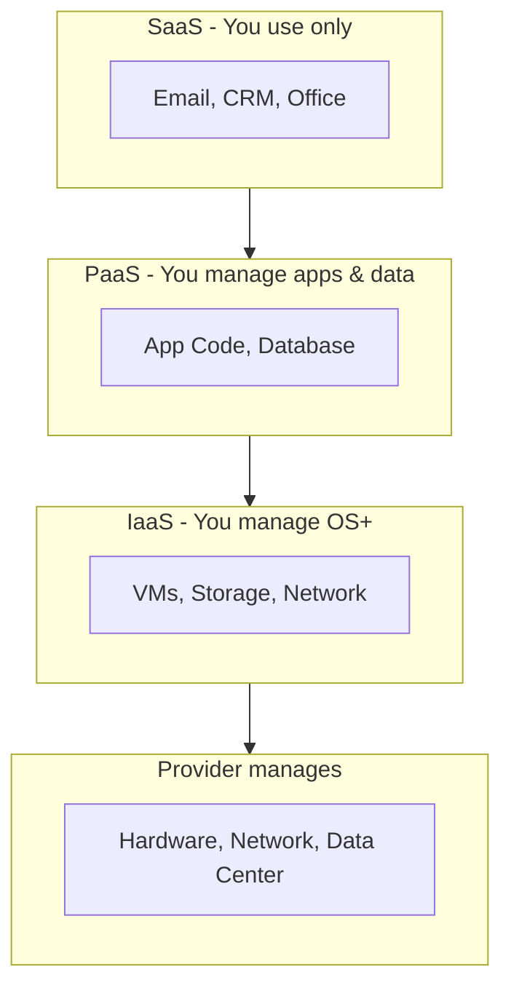
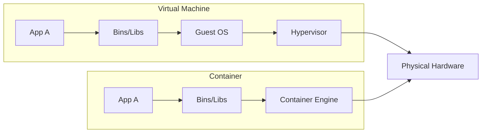
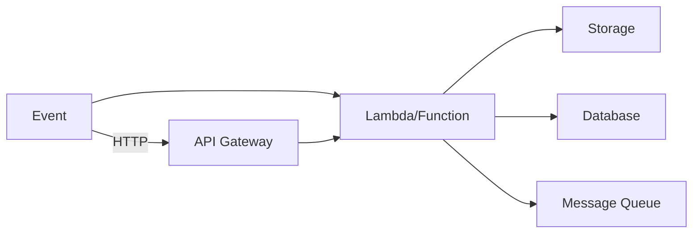
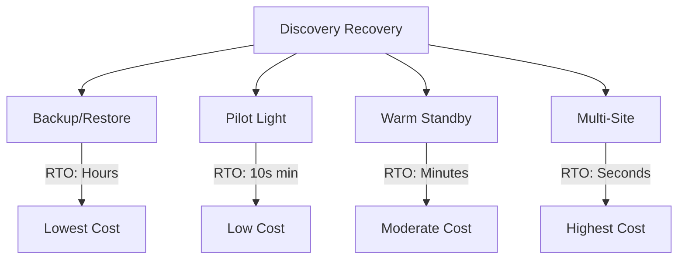

# Cloud Computing

## 1. Introduction

Cloud Computing is the delivery of computing services (servers, storage, databases, networking, software) over the internet on a pay-as-you-go basis. It has transformed how organizations build, deploy, and scale applications.

This guide covers IaaS/PaaS/SaaS models, cloud deployment models, virtualization, containers, serverless, cloud storage options, networking in cloud, cost optimization, multi-cloud strategies, cloud security basics, and major cloud provider comparison.

**Why It Matters for Interviews:**
- Most companies run on cloud infrastructure
- Understanding cloud services is essential for modern engineering
- Cost optimization is a key business concern
- Cloud-native architecture is the industry standard
- Critical for DevOps, SRE, and backend roles

---

## 2. Learning Roadmap

### Phase 1: Fundamentals (Weeks 1-2)
- [ ] Cloud service models (IaaS, PaaS, SaaS)
- [ ] Cloud deployment models (Public, Private, Hybrid)
- [ ] Virtualization concepts
- [ ] Major cloud providers overview

### Phase 2: Core Services (Weeks 3-4)
- [ ] Compute (VMs, containers, serverless)
- [ ] Storage (object, block, file)
- [ ] Databases (relational, NoSQL, managed)
- [ ] Networking (VPC, load balancers, DNS)

### Phase 3: Cloud-Native (Weeks 5-6)
- [ ] Containers (Docker, Kubernetes)
- [ ] Serverless architecture
- [ ] Microservices on cloud
- [ ] CI/CD in cloud

### Phase 4: Advanced Topics (Weeks 7-8)
- [ ] Cost optimization strategies
- [ ] Multi-cloud and hybrid cloud
- [ ] Cloud security best practices
- [ ] Disaster recovery and backup

### Phase 5: Provider Deep Dive (Weeks 9-10)
- [ ] AWS core services
- [ ] Azure core services
- [ ] GCP core services
- [ ] Provider comparison and selection

---

## 3. Theory Notes

### Cloud Service Models

**Infrastructure as a Service (IaaS):**
```
You manage: OS, middleware, runtime, applications
Provider manages: Hardware, networking, storage, virtualization
Examples: EC2, Azure VMs, GCP Compute Engine
Use case: Full control over infrastructure needed
```

**Platform as a Service (PaaS):**
```
You manage: Applications and data
Provider manages: Runtime, middleware, OS, hardware
Examples: Heroku, Azure App Service, Google App Engine
Use case: Focus on code, not infrastructure
```

**Software as a Service (SaaS):**
```
You manage: Nothing (just use the software)
Provider manages: Everything
Examples: Gmail, Salesforce, Slack, Dropbox
Use case: Ready-made software solutions
```

**Other Models:**
```
FaaS (Function as a Service): Serverless functions
CaaS (Container as a Service): Managed container platforms
DBaaS (Database as a Service): Managed databases
```

### Cloud Deployment Models

**Public Cloud:**
```
Resources shared across organizations
Managed by third-party provider
Examples: AWS, Azure, GCP
Benefits: Cost-effective, scalable, no maintenance
Drawbacks: Less control, compliance concerns
```

**Private Cloud:**
```
Resources dedicated to single organization
Can be on-premises or hosted
Examples: OpenStack, VMware
Benefits: Full control, compliance, customization
Drawbacks: Higher cost, maintenance burden
```

**Hybrid Cloud:**
```
Combination of public and private
Data and applications can move between
Examples: Azure Arc, AWS Outposts
Benefits: Flexibility, optimized costs, compliance
Drawbacks: Complexity, integration challenges
```

**Multi-Cloud:**
```
Using multiple cloud providers
Avoids vendor lock-in
Examples: AWS + Azure + GCP
Benefits: Best-of-breed, redundancy, negotiation power
Drawbacks: Complexity, skills fragmentation
```

### Virtualization

**Hypervisor Types:**
```
Type 1 (Bare Metal): Runs directly on hardware
  Examples: VMware ESXi, Xen, KVM
  Performance: Better (no host OS overhead)
  
Type 2 (Hosted): Runs on host operating system
  Examples: VirtualBox, VMware Workstation
  Performance: Worse (extra layer)
```

**Virtual Machines vs Containers:**
| Aspect | VMs | Containers |
|--------|-----|------------|
| Isolation | Strong (hardware level) | Process-level |
| Size | GBs | MBs |
| Boot time | Minutes | Seconds |
| OS | Full OS per VM | Shared host OS |
| Performance | Near-native | Near-native |
| Density | Low (few per host) | High (many per host) |

### Containers

**Docker:**
```
Lightweight, portable application packaging
Layers: Dockerfile -> Image -> Container
Benefits: Consistent environments, fast deployment
```

**Kubernetes (K8s):**
```
Container orchestration platform
Features: Auto-scaling, self-healing, rolling updates
Components: Pods, Services, Deployments, Ingress
```

### Serverless

```
No server management required
Event-driven execution
Pay per invocation/execution time
Examples: AWS Lambda, Azure Functions, Google Cloud Functions

Benefits:
- No infrastructure management
- Automatic scaling
- Pay only for usage
- Reduced operational overhead

Drawbacks:
- Cold start latency
- Execution time limits
- Vendor lock-in
- Debugging difficulty
```

### Cloud Storage Types

**Object Storage:**
```
Stores data as objects (blobs)
Accessible via HTTP/REST API
Scalable to petabytes
Examples: S3, Azure Blob, Google Cloud Storage
Use case: Media files, backups, static content
```

**Block Storage:**
```
Stores data in fixed-size blocks
Attached to VMs like hard drives
Low latency, high performance
Examples: EBS, Azure Disk, Persistent Disk
Use case: Database storage, boot volumes
```

**File Storage:**
```
Stores data in hierarchical file system
Accessible via NFS/SMB protocols
Shared across multiple instances
Examples: EFS, Azure Files, Filestore
Use case: Shared application data, content management
```

### Cloud Networking

**Virtual Private Cloud (VPC):**
```
Isolated network in cloud
Custom IP address range
Subnets, route tables, internet gateways
Security groups and network ACLs
```

**Load Balancers:**
```
Application Load Balancer (ALB): HTTP/HTTPS
Network Load Balancer (NLB): TCP/UDP, high performance
Gateway Load Balancer: Third-party virtual appliances
```

**Content Delivery Network (CDN):**
```
Distributes content globally
Caches static content at edge locations
Reduces latency and load on origin
Examples: CloudFront, Azure CDN, Cloud CDN
```

---

## 4. Key Concepts

### Cost Optimization

**Strategies:**
1. Right-sizing instances
2. Reserved instances / savings plans
3. Spot instances for fault-tolerant workloads
4. Auto-scaling to match demand
5. Storage tiering (hot, warm, cold, archive)
6. Monitoring and tagging

**Pricing Models:**
```
On-Demand: Pay per hour/second, no commitment
Reserved: Commit for 1-3 years, 30-70% discount
Spot: Unused capacity, up to 90% discount
Dedicated: Single-tenant hardware
```

### Cloud Security

**Shared Responsibility Model:**
```
Provider: Physical security, network infrastructure, hypervisor
Customer: Data, OS patching, firewall config, IAM
```

**Key Security Services:**
- IAM (Identity and Access Management)
- KMS (Key Management Service)
- WAF (Web Application Firewall)
- Shield (DDoS Protection)
- GuardDuty (Threat Detection)

### Disaster Recovery

**Strategies:**
```
Backup and Restore: Lowest cost, longest RTO
Pilot Light: Minimal resources running, moderate RTO
Warm Standby: Scaled-down replica, fast RTO
Multi-Site Active-Active: Full deployment, fastest RTO
```

**RPO/RTO:**
```
RPO (Recovery Point Objective): Max acceptable data loss (time)
RTO (Recovery Time Objective): Max acceptable downtime (time)
```

---

## 5. FAQ (20+ Q&A)

### Q1: What is the difference between IaaS, PaaS, and SaaS?
**A:** IaaS provides raw infrastructure (VMs, storage) you manage. PaaS provides a platform for deploying apps without managing infrastructure. SaaS provides ready-to-use software over the internet.

### Q2: What is serverless computing?
**A:** A cloud model where the provider manages infrastructure. You deploy functions that execute in response to events. Pay only for execution time. Examples: Lambda, Azure Functions.

### Q3: What is the difference between VMs and containers?
**A:** VMs include a full OS and run on hypervisors with strong isolation. Containers share the host OS kernel with process-level isolation. Containers are lighter, faster to start, and more portable.

### Q4: What is a VPC?
**A:** Virtual Private Cloud - an isolated network in the cloud with custom IP ranges, subnets, and security controls. It provides network isolation and security for cloud resources.

### Q5: What is auto-scaling?
**A:** Automatically adjusting the number of compute resources based on demand. Scale out (add instances) during high traffic, scale in (remove instances) during low traffic.

### Q6: What is the shared responsibility model?
**A:** Cloud security is shared: provider handles physical infrastructure and hypervisor; customer handles data, OS, applications, and access controls.

### Q7: What is a load balancer?
**A:** A service distributing incoming traffic across multiple servers. Ensures high availability and reliability. Types include Application (HTTP), Network (TCP/UDP), and Gateway.

### Q8: What is object storage?
**A:** Storage that manages data as objects (not files or blocks). Accessible via REST API. Highly scalable. Examples: S3, Azure Blob, GCS. Used for media, backups, static content.

### Q9: What is a CDN?
**A:** Content Delivery Network - a distributed network of servers caching content at edge locations close to users. Reduces latency and origin server load.

### Q10: What is cloud-native?
**A:** An approach to building and running applications using cloud-optimized techniques: containers, microservices, declarative APIs, and cloud services.

### Q11: What is Infrastructure as Code (IaC)?
**A:** Managing infrastructure through machine-readable configuration files rather than manual processes. Tools: Terraform, CloudFormation, ARM templates.

### Q12: What is a cold start in serverless?
**A:** The delay when a serverless function is invoked for the first time or after inactivity. The provider must initialize the execution environment, causing latency.

### Q13: What is spot pricing?
**A:** Discounted pricing for unused cloud capacity (up to 90% off). Instances can be reclaimed with short notice. Good for fault-tolerant, flexible workloads.

### Q14: What is multi-cloud?
**A:** Using services from multiple cloud providers. Benefits: avoid vendor lock-in, best-of-breed services, redundancy. Drawbacks: complexity, skills fragmentation.

### Q15: What is RPO and RTO?
**A:** Recovery Point Objective is max acceptable data loss. Recovery Time Objective is max acceptable downtime. Both define disaster recovery requirements.

### Q16: What is a cloud region?
**A:** A geographic area with multiple isolated data centers (availability zones). Choose regions based on latency, compliance, and service availability.

### Q17: What is an availability zone?
**A:** An isolated data center within a region. Multiple AZs provide redundancy. Connected by low-latency networking.

### Q18: What is a managed service?
**A:** A cloud service where the provider handles operations (patching, backups, scaling). Examples: RDS, ElastiCache, managed Kubernetes.

### Q19: What is egress pricing?
**A:** Charges for data leaving the cloud provider. Inbound data is typically free. Egress fees vary by destination and amount.

### Q20: What is cloud cost optimization?
**A:** Strategies to reduce cloud spending: right-sizing, reserved capacity, spot instances, auto-scaling, storage tiering, and monitoring.

### Q21: What is a service mesh?
**A:** An infrastructure layer managing service-to-service communication. Provides observability, traffic management, and security. Examples: Istio, Linkerd.

### Q22: What is edge computing?
**A:** Processing data closer to where it is generated (at the network edge) rather than in centralized cloud. Reduces latency and bandwidth usage.

---

## 6. Hands-on Practice

### Exercise 1: IaaS vs PaaS Decision
```
Scenario: Deploy a Node.js web application

IaaS Approach (EC2):
1. Provision VM
2. Install Node.js runtime
3. Configure web server (nginx)
4. Deploy application code
5. Manage SSL certificates
6. Handle scaling manually or with ASG

PaaS Approach (Elastic Beanstalk):
1. Upload application code
2. Platform handles everything else
3. Auto-scaling included
4. SSL managed automatically

Decision: PaaS for faster deployment, IaaS for more control
```

### Exercise 2: Cost Optimization Analysis
```
Current Setup:
- 10x m5.xlarge (4 vCPU, 16 GB) running 24/7
- On-demand: $0.192/hour each
- Monthly cost: 10 * 0.192 * 730 = $1,401.60

Optimization Options:
1. Reserved (1-year): 40% discount = $840.96/month
2. Spot (80% discount): $280.32/month (if fault-tolerant)
3. Right-size to m5.large: 50% reduction = $700.80/month
4. Auto-scale 5-10 instances: Average 7 = $981.12/month

Best approach: Combine right-sizing + reserved instances
```

### Exercise 3: VPC Design
```
VPC: 10.0.0.0/16

Public Subnets:
- 10.0.1.0/24 (AZ-1) - Load Balancer
- 10.0.2.0/24 (AZ-2) - Load Balancer

Private Subnets:
- 10.0.10.0/24 (AZ-1) - Application Servers
- 10.0.11.0/24 (AZ-2) - Application Servers
- 10.0.20.0/24 (AZ-1) - Databases
- 10.0.21.0/24 (AZ-2) - Databases

Security Groups:
- ALB SG: Inbound 80/443 from 0.0.0.0/0
- App SG: Inbound 3000 from ALB SG
- DB SG: Inbound 5432 from App SG
```

---

## 7. FAANG Questions

### Google
1. How would you design a multi-region application?
2. Compare GCP's networking with AWS VPC.
3. How do you optimize costs for a GCP deployment?
4. Design a serverless data pipeline on GCP.

### Amazon
5. When would you use Lambda vs EC2?
6. Design a highly available architecture on AWS.
7. How would you migrate an on-premises application to AWS?
8. Explain AWS's shared responsibility model.

### Meta
9. How does Facebook handle global infrastructure?
10. Design a CDN architecture for a social platform.
11. How would you handle data residency requirements?
12. Compare container orchestration approaches.

### Apple
13. How does iCloud use cloud services?
14. Design a privacy-compliant cloud architecture.
15. How would you handle Apple's global user base?
16. Compare edge computing vs centralized cloud.

### Netflix
17. How does Netflix use AWS?
18. Design a video streaming infrastructure.
19. How would you handle regional content delivery?
20. Explain Netflix's Chaos Engineering approach.

---

## 8. Common Mistakes

1. Over-provisioning resources (paying for unused capacity)
2. Not using auto-scaling (wasted money during low traffic)
3. Ignoring data transfer costs (egress fees add up)
4. Not using reserved instances for predictable workloads
5. Single-region deployment (no disaster recovery)
6. Not implementing proper IAM policies (security risk)
7. Storing everything in expensive storage tiers
8. Ignoring cloud cost monitoring
9. Vendor lock-in without a migration strategy
10. Not testing disaster recovery procedures

---

## 9. Best Practices

### Cost
1. Monitor spending with budget alerts
2. Use reserved instances for steady-state workloads
3. Right-size instances based on utilization
4. Implement auto-scaling
5. Use spot instances for fault-tolerant workloads
6. Archive old data to cheaper storage tiers

### Security
1. Follow principle of least privilege
2. Enable MFA for all accounts
3. Encrypt data at rest and in transit
4. Use security groups and network ACLs
5. Regularly audit IAM policies
6. Enable cloud security services (GuardDuty, etc.)

### Architecture
1. Design for failure (use multiple AZs)
2. Use managed services when possible
3. Implement Infrastructure as Code
4. Use CDNs for static content
5. Implement proper monitoring and logging
6. Plan for disaster recovery

### Operations
1. Automate deployments (CI/CD)
2. Use configuration management
3. Implement centralized logging
4. Monitor performance metrics
5. Regular backup testing
6. Document runbooks

---

## 10. Cheat Sheet

### Service Models
```
IaaS: You manage apps, data, runtime, middleware, OS
PaaS: You manage apps and data only
SaaS: You manage nothing, just use the software
```

### Storage Types
```
Object: S3, Blob - HTTP access, petabyte scale
Block: EBS, Disk - attached to VMs, low latency
File: EFS, NFS - shared file system
```

### Compute Options
```
VMs: Full control, minutes to start
Containers: Lightweight, seconds to start
Serverless: No management, millisecond billing
```

### Pricing Models
```
On-Demand: Pay as you go
Reserved: Commit for 1-3 years, save 30-70%
Spot: Unused capacity, save up to 90%
```

### Networking
```
VPC: Isolated cloud network
Subnet: IP range within VPC
Security Group: Virtual firewall (stateful)
Network ACL: Subnet-level firewall (stateless)
Load Balancer: Distribute traffic across targets
CDN: Cache content at edge locations
```

### DR Strategies
```
Backup/Restore: Lowest cost, highest RTO
Pilot Light: Minimal running, moderate RTO
Warm Standby: Scaled-down, fast RTO
Multi-Site: Full deployment, fastest RTO
```

---

## 11. Flash Cards (20)

1. **Q: What is IaaS?** A: Infrastructure as a Service - provides virtualized computing resources over the internet.

2. **Q: What is PaaS?** A: Platform as a Service - provides a platform for developing and deploying applications without managing infrastructure.

3. **Q: What is SaaS?** A: Software as a Service - provides ready-to-use software over the internet.

4. **Q: What is serverless?** A: A cloud model where the provider manages infrastructure; you deploy functions that execute on events.

5. **Q: What is a VPC?** A: Virtual Private Cloud - an isolated network in the cloud with custom IP ranges and security controls.

6. **Q: What is auto-scaling?** A: Automatically adjusting compute resources based on demand.

7. **Q: What is a load balancer?** A: A service distributing traffic across multiple servers for high availability.

8. **Q: What is object storage?** A: Storage managing data as objects, accessible via REST API. Examples: S3, Azure Blob.

9. **Q: What is a CDN?** A: Content Delivery Network - caches content at edge locations close to users.

10. **Q: What is cold start?** A: The delay when a serverless function is invoked after inactivity.

11. **Q: What is IaC?** A: Infrastructure as Code - managing infrastructure through configuration files.

12. **Q: What is the shared responsibility model?** A: Cloud security is shared between provider (infrastructure) and customer (data/apps).

13. **Q: What is RPO?** A: Recovery Point Objective - maximum acceptable data loss time.

14. **Q: What is RTO?** A: Recovery Time Objective - maximum acceptable downtime.

15. **Q: What is an availability zone?** A: An isolated data center within a cloud region.

16. **Q: What is multi-cloud?** A: Using services from multiple cloud providers.

17. **Q: What is hybrid cloud?** A: Combining public and private cloud environments.

18. **Q: What is spot pricing?** A: Discounted pricing for unused cloud capacity (up to 90% off).

19. **Q: What is a managed service?** A: A cloud service where the provider handles operations like patching and backups.

20. **Q: What is edge computing?** A: Processing data closer to where it is generated rather than in centralized cloud.

---

## 12. Mind Map

```
                      Cloud Computing
                          |
   +----------+-----------+-----------+----------+
   |          |           |           |          |
Models     Services    Architecture  Cost    Security
   |          |           |           |          |
IaaS/PaaS  Compute    Serverless   Reserved   IAM
SaaS      Storage     Containers   Spot       Encryption
Deploy    Database    Microservices Auto-scale WAF
Public    Network     CI/CD        Monitoring GuardDuty
Private   CDN         Multi-AZ     Tiers      MFA
Hybrid                 IaC                     Compliance
```

---

## 13. Mermaid Diagrams

### Cloud Service Models


### VM vs Container


### Serverless Flow


### Disaster Recovery


---

## 14. Code Examples

### Example 1: Terraform VPC
```hcl
resource "aws_vpc" "main" {
  cidr_block = "10.0.0.0/16"
  
  enable_dns_hostnames = true
  enable_dns_support   = true
  
  tags = {
    Name = "main-vpc"
  }
}

resource "aws_subnet" "public" {
  count             = 2
  vpc_id            = aws_vpc.main.id
  cidr_block        = "10.0.${count.index}.0/24"
  availability_zone = data.aws_availability_zones.available.names[count.index]
  
  map_public_ip_on_launch = true
  
  tags = {
    Name = "public-subnet-${count.index}"
  }
}

resource "aws_security_group" "web" {
  name        = "web-sg"
  vpc_id      = aws_vpc.main.id
  
  ingress {
    from_port   = 80
    to_port     = 80
    protocol    = "tcp"
    cidr_blocks = ["0.0.0.0/0"]
  }
  
  egress {
    from_port   = 0
    to_port     = 0
    protocol    = "-1"
    cidr_blocks = ["0.0.0.0/0"]
  }
}
```

### Example 2: AWS Lambda Function
```python
import json
import boto3

s3 = boto3.client('s3')

def lambda_handler(event, context):
    bucket = event['Records'][0]['s3']['bucket']['name']
    key = event['Records'][0]['s3']['object']['key']
    
    response = s3.get_object(Bucket=bucket, Key=key)
    content = response['Body'].read().decode('utf-8')
    
    # Process the file
    result = process_file(content)
    
    # Store result
    s3.put_object(
        Bucket=bucket,
        Key=f"processed/{key}",
        Body=json.dumps(result)
    )
    
    return {
        'statusCode': 200,
        'body': json.dumps({'processed': key})
    }

def process_file(content):
    # Your processing logic here
    return {'lines': len(content.split('\n'))}
```

### Example 3: Kubernetes Deployment
```yaml
apiVersion: apps/v1
kind: Deployment
metadata:
  name: web-app
spec:
  replicas: 3
  selector:
    matchLabels:
      app: web-app
  template:
    metadata:
      labels:
        app: web-app
    spec:
      containers:
      - name: web
        image: nginx:latest
        ports:
        - containerPort: 80
        resources:
          requests:
            memory: "64Mi"
            cpu: "250m"
          limits:
            memory: "128Mi"
            cpu: "500m"
---
apiVersion: v1
kind: Service
metadata:
  name: web-service
spec:
  type: LoadBalancer
  ports:
  - port: 80
  selector:
    app: web-app
```

---

## 15. Projects

### Project 1: Multi-Tier Web Application
Deploy a three-tier application (web, app, database) on AWS/Azure/GCP with proper networking, security, and auto-scaling.

### Project 2: Serverless Data Pipeline
Build an event-driven data pipeline using serverless functions, object storage, and managed databases.

### Project 3: Multi-Region Deployment
Deploy an application across multiple regions with global load balancing and disaster recovery.

### Project 4: Cost Optimization Dashboard
Build a tool that monitors cloud resources and recommends cost optimizations.

---

## 16. Resources

### Books
- "Cloud Computing: Concepts, Technology and Architecture" by Thomas Erl
- "Architecting the Cloud" by Michael Kavis
- "The Art of Cloud Architecture" by Yosaif Cohain

### Online Courses
- [AWS Cloud Practitioner](https://aws.amazon.com/certification/)
- [Azure Fundamentals](https://learn.microsoft.com/azure/)
- [Google Cloud Fundamentals](https://cloud.google.com/training)

### Documentation
- [AWS Documentation](https://docs.aws.amazon.com/)
- [Azure Documentation](https://learn.microsoft.com/azure/)
- [GCP Documentation](https://cloud.google.com/docs)

---

## 17. Checklist

### Service Models
- [ ] Understand IaaS, PaaS, SaaS differences
- [ ] Know when to use each model
- [ ] Understand FaaS, CaaS, DBaaS

### Core Services
- [ ] Compute options (VMs, containers, serverless)
- [ ] Storage types (object, block, file)
- [ ] Database services (relational, NoSQL)
- [ ] Networking (VPC, load balancers, CDN)

### Architecture
- [ ] Design for failure (multi-AZ)
- [ ] Implement auto-scaling
- [ ] Use Infrastructure as Code
- [ ] Plan disaster recovery

### Cost
- [ ] Monitor cloud spending
- [ ] Use reserved instances
- [ ] Implement auto-scaling
- [ ] Right-size resources

### Security
- [ ] Follow least privilege
- [ ] Enable encryption
- [ ] Use security groups
- [ ] Implement MFA

---

## 18. Revision Plans

### Week 1-2: Fundamentals
- Service models, deployment models, virtualization

### Week 3-4: Core Services
- Compute, storage, database, networking

### Week 5-6: Cloud-Native
- Containers, Kubernetes, serverless, CI/CD

### Week 7-8: Advanced
- Cost optimization, multi-cloud, security

### Week 9-10: Provider Deep Dive
- AWS, Azure, GCP comparison and practice

---

## 19. Mock Interviews

### Round 1: Fundamentals (30 min)
1. Explain IaaS vs PaaS vs SaaS
2. When would you use serverless vs containers?
3. What is a VPC and why do you need one?

### Round 2: Architecture (45 min)
1. Design a highly available web application
2. How would you handle disaster recovery?
3. Design a multi-region deployment

### Round 3: Cost & Operations (30 min)
1. How would you optimize cloud costs?
2. Explain auto-scaling strategies
3. How do you monitor a cloud deployment?

---

## 20. Difficulty Rating

| Topic | Difficulty | Interview Frequency |
|-------|-----------|-------------------|
| IaaS/PaaS/SaaS | star-star (Easy) | Very High |
| Virtualization | star-star (Easy) | High |
| Containers | star-star-star (Medium) | Very High |
| Kubernetes | star-star-star-star (Hard) | High |
| Serverless | star-star-star (Medium) | High |
| VPC/Networking | star-star-star (Medium) | High |
| Cost Optimization | star-star-star (Medium) | High |
| Multi-Cloud | star-star-star-star (Hard) | Medium |
| Disaster Recovery | star-star-star (Medium) | Medium |
| Cloud Security | star-star-star (Medium) | High |

---

## 21. Summary

Cloud computing is the foundation of modern infrastructure. Key takeaways:

1. **Service Models**: IaaS gives control, PaaS gives speed, SaaS gives convenience
2. **Compute**: VMs for control, containers for portability, serverless for simplicity
3. **Storage**: Object for unstructured, block for databases, file for shared access
4. **Networking**: VPC isolates, load balancers distribute, CDNs accelerate
5. **Cost**: Right-size, reserve, use spot instances, monitor spending
6. **Security**: Shared responsibility, least privilege, encryption everywhere
7. **Architecture**: Design for failure, use multiple AZs, automate everything

**Interview Tip:** Cloud questions often focus on trade-offs. Know when to use which service and why. Be ready to discuss cost, performance, and operational complexity trade-offs.
