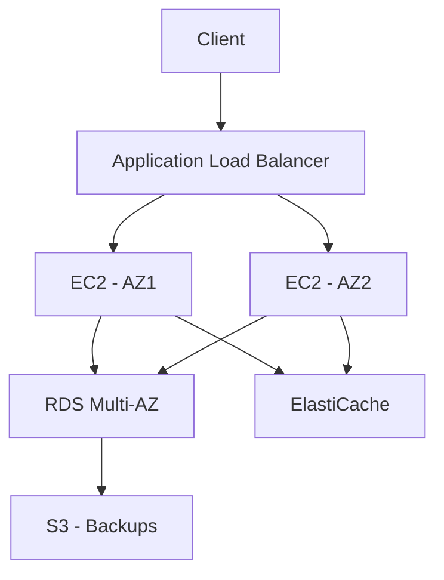
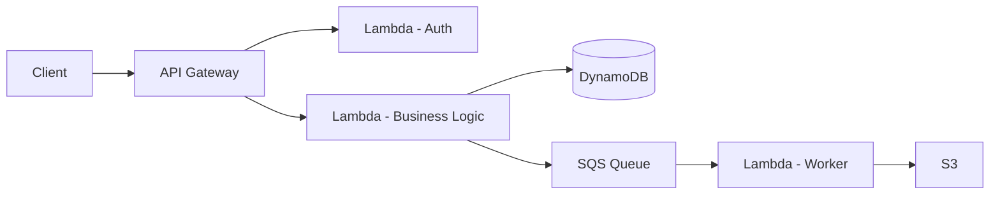
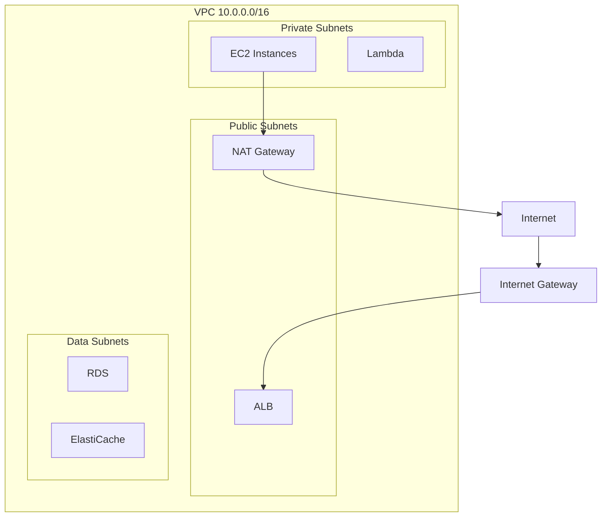
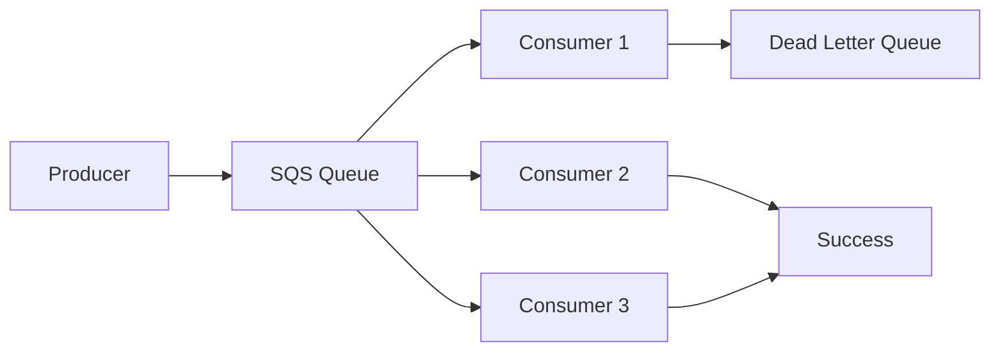
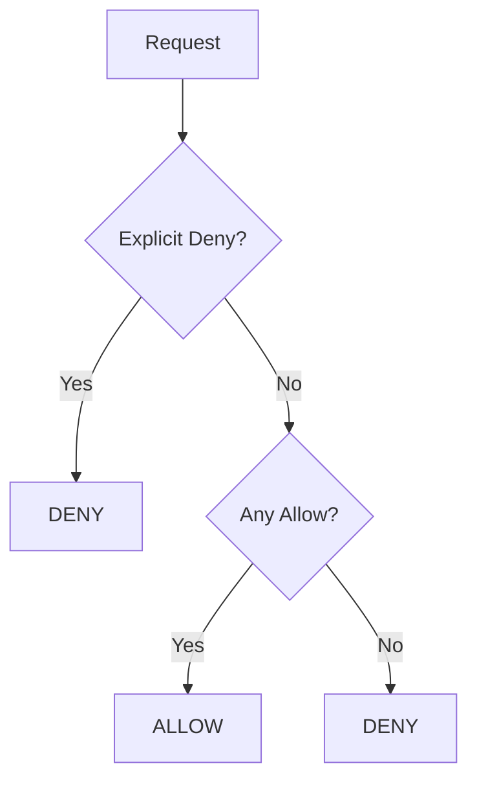

# Amazon Web Services (AWS)

## 1. Introduction

Amazon Web Services (AWS) is the world's most comprehensive cloud platform, offering over 200 services from data centers globally. AWS dominates the cloud market with the broadest range of services and the largest community of customers and partners.

This guide covers EC2, S3, RDS, DynamoDB, Lambda, VPC, IAM, CloudFront, SQS, SNS, ECS/EKS, CloudWatch, Elastic Load Balancing, Route 53, common AWS interview questions, and certification paths.

**Why It Matters for Interviews:**
- AWS is the most popular cloud platform
- Most companies use AWS for their infrastructure
- AWS certification validates cloud expertise
- System design interviews often involve AWS services
- Critical for DevOps, SRE, and cloud engineering roles

---

## 2. Learning Roadmap

### Phase 1: Foundations (Weeks 1-2)
- [ ] AWS Global Infrastructure (Regions, AZs, Edge Locations)
- [ ] IAM (Users, Groups, Roles, Policies)
- [ ] EC2 (Instance types, pricing, security groups)
- [ ] S3 (Storage classes, lifecycle, versioning)

### Phase 2: Core Services (Weeks 3-4)
- [ ] VPC (Subnets, route tables, gateways)
- [ ] RDS (Multi-AZ, Read Replicas, backups)
- [ ] DynamoDB (Primary keys, GSI, LSI, DAX)
- [ ] ELB (ALB, NLB, GLB)

### Phase 3: Serverless & Containers (Weeks 5-6)
- [ ] Lambda (triggers, limits, layers)
- [ ] API Gateway (REST, HTTP, WebSocket)
- [ ] ECS (Fargate, EC2 launch type)
- [ ] EKS (Kubernetes on AWS)

### Phase 4: Integration & Messaging (Weeks 7-8)
- [ ] SQS (Standard, FIFO, dead letter queues)
- [ ] SNS (Topics, subscriptions, fanout)
- [ ] EventBridge (Event bus, rules, targets)
- [ ] Step Functions (Workflows, state machines)

### Phase 5: Operations & Security (Weeks 9-10)
- [ ] CloudWatch (Metrics, Alarms, Logs, Dashboards)
- [ ] CloudFormation (Templates, stacks, drift detection)
- [ ] Route 53 (DNS, routing policies, health checks)
- [ ] Security best practices

---

## 3. Theory Notes

### AWS Global Infrastructure

```
Regions: Geographic areas (us-east-1, eu-west-1)
  - Choose based on: latency, compliance, services, cost

Availability Zones (AZs): Isolated data centers within a region
  - Typically 3+ per region
  - Connected by low-latency networking
  - Independent power, networking, cooling

Edge Locations: CDN endpoints for CloudFront
  - 400+ locations worldwide
  - Cache static content close to users
```

### IAM (Identity and Access Management)

**Components:**
```
Users: Individual identities with credentials
Groups: Collections of users with shared permissions
Roles: Temporary credentials for AWS services
Policies: JSON documents defining permissions
```

**Policy Evaluation:**
```
Default: Deny all
1. Evaluate all applicable policies
2. If any explicit deny -> Deny
3. If at least one allow -> Allow
4. Otherwise -> Deny
```

**Best Practices:**
- Use roles instead of access keys for EC2
- Apply least privilege principle
- Enable MFA for all users
- Use IAM Access Analyzer
- Rotate credentials regularly

### EC2 (Elastic Compute Cloud)

**Instance Families:**
```
General Purpose (T, M): Balanced compute, memory, networking
Compute Optimized (C): CPU-intensive tasks
Memory Optimized (R, X): In-memory databases, caching
Storage Optimized (I, D): High sequential read/write
Accelerated (P, G, Inf): GPU/ML workloads
```

**Pricing Models:**
```
On-Demand: Pay per second, no commitment
Reserved (1yr/3yr): Up to 75% discount
Spot: Up to 90% discount, can be reclaimed
Dedicated: Single-tenant hardware
```

**Security Groups:**
- Stateful firewall for instances
- Allow rules only (no deny rules)
- Reference other security groups
- Evaluate rules in order

### S3 (Simple Storage Service)

**Storage Classes:**
```
S3 Standard: Frequently accessed data
S3 Intelligent-Tiering: Automatic tiering
S3 Standard-IA: Infrequent access
S3 One Zone-IA: Single AZ, infrequent
S3 Glacier Instant Retrieval: Archive, ms retrieval
S3 Glacier Flexible Retrieval: Archive, minutes-hours
S3 Glacier Deep Archive: Long-term archive, 12+ hours
```

**S3 Features:**
```
Versioning: Keep multiple versions of objects
Lifecycle Rules: Auto-transition between classes
Encryption: SSE-S3, SSE-KMS, SSE-C, Client-side
Replication: Cross-Region (CRR), Same-Region (SRR)
Access Points: Simplified access management
```

### RDS (Relational Database Service)

**Engines:** MySQL, PostgreSQL, MariaDB, Oracle, SQL Server, Aurora

**Features:**
```
Multi-AZ: Automatic failover to standby
Read Replicas: Scale reads, cross-region replication
Automated Backups: Point-in-time recovery
Encryption: At rest and in transit
IAM Database Authentication
```

**Aurora:**
- 5x throughput of MySQL, 3x of PostgreSQL
- 6-way replication across 3 AZs
- Up to 15 read replicas
- Serverless option

### DynamoDB

**Key Concepts:**
```
Primary Key: Partition key (simple) or Partition + Sort key (composite)
GSI: Global Secondary Index (different partition key)
LSI: Local Secondary Index (same partition key, different sort key)
DAX: DynamoDB Accelerator (in-memory cache)
Streams: Change data capture
Global Tables: Multi-region, multi-active replication
```

**Capacity Modes:**
```
On-Demand: Pay per request
Provisioned: Reserved capacity with auto-scaling
```

### Lambda

```
Event-driven serverless compute
Max execution time: 15 minutes
Memory: 128 MB to 10 GB
Supports: Node.js, Python, Java, Go, .NET, Ruby

Triggers: API Gateway, S3, DynamoDB Streams, SQS, SNS, CloudWatch Events
Limits: Concurrent executions, storage, package size
```

### VPC (Virtual Private Cloud)

```
CIDR Block: IP address range (e.g., 10.0.0.0/16)
Subnets: Public (internet-facing) or Private (internal)
Route Tables: Define traffic routing
Internet Gateway: Connects VPC to internet
NAT Gateway: Allows private instances to access internet
VPC Peering: Connect two VPCs
VPN: Encrypted connection to on-premises
Direct Connect: Dedicated network connection
```

### SQS (Simple Queue Service)

```
Standard Queue: Best-effort ordering, at-least-once delivery
FIFO Queue: Strict ordering, exactly-once processing

Features:
- Message retention: 1-14 days
- Visibility timeout: Hide message while processing
- Dead letter queue: Capture failed messages
- Long polling: Reduce empty responses
```

### ELB (Elastic Load Balancing)

```
Application Load Balancer (ALB): HTTP/HTTPS, path-based routing
Network Load Balancer (NLB): TCP/UDP, ultra-low latency
Gateway Load Balancer (GWLB): Third-party virtual appliances

Features:
- Health checks
- SSL termination
- Cross-zone load balancing
- Sticky sessions
```

### CloudWatch

```
Metrics: Time series data (CPU, memory, custom)
Alarms: Trigger actions based on thresholds
Logs: Collect and analyze log files
Events/EventBridge: React to state changes
Dashboards: Visualize metrics
X-Ray: Distributed tracing
```

---

## 4. Key Concepts

### Well-Architected Framework

**Six Pillars:**
1. **Operational Excellence:** Automation, monitoring, runbooks
2. **Security:** Defense in depth, least privilege, encryption
3. **Reliability:** Fault tolerance, auto-scaling, disaster recovery
4. **Performance Efficiency:** Right resources, caching, optimization
5. **Cost Optimization:** Right-sizing, reserved, spot, monitoring
6. **Sustainability:** Efficient resource usage, carbon footprint

### Common Architectural Patterns

**Three-Tier Architecture:**
```
Web Tier: ALB + EC2/ECS (public subnet)
App Tier: EC2/ECS/Lambda (private subnet)
Data Tier: RDS/DynamoDB (private subnet)
```

**Serverless Architecture:**
```
Client -> API Gateway -> Lambda -> DynamoDB
                    -> S3 (static assets)
                    -> SQS (async processing)
```

**Event-Driven Architecture:**
```
Event Source -> EventBridge -> Lambda/Step Functions -> Services
              -> SNS -> SQS -> Consumers
```

---

## 5. FAQ (20+ Q&A)

### Q1: What is the difference between EC2 and Lambda?
**A:** EC2 provides virtual servers you manage (OS, patches, scaling). Lambda is serverless - you deploy functions and AWS manages infrastructure. EC2 is better for long-running workloads; Lambda for event-driven, short tasks.

### Q2: What is the difference between S3 Standard and S3 Glacier?
**A:** S3 Standard is for frequently accessed data with instant access. Glacier is for archive data with retrieval times from minutes to hours, at much lower storage cost.

### Q3: What is Multi-AZ in RDS?
**A:** Automatic failover to a standby instance in a different Availability Zone. Provides high availability and automatic failover for the primary database.

### Q4: What is the difference between SQS Standard and FIFO?
**A:** Standard queue offers best-effort ordering and at-least-once delivery. FIFO queue provides strict ordering and exactly-once processing but with lower throughput.

### Q5: What is DynamoDB DAX?
**A:** DynamoDB Accelerator - an in-memory caching layer for DynamoDB. Provides microsecond read latency for frequently accessed data.

### Q6: What is the difference between ALB and NLB?
**A:** ALB operates at Layer 7 (HTTP/HTTPS) with path-based routing. NLB operates at Layer 4 (TCP/UDP) with ultra-low latency and static IP addresses.

### Q7: What are IAM Roles used for?
**A:** IAM Roles provide temporary credentials for AWS services and applications. Use them instead of access keys for EC2 instances, Lambda functions, and cross-account access.

### Q8: What is S3 Cross-Region Replication?
**A:** Automatic, asynchronous copying of objects between S3 buckets in different regions. Used for disaster recovery, compliance, and reducing latency.

### Q9: What is AWS Lambda's cold start?
**A:** The initialization delay when a Lambda function is invoked for the first time or after inactivity. Mitigated by provisioned concurrency, smaller deployment packages, and keeping functions warm.

### Q10: What is CloudFormation?
**A:** Infrastructure as Code service for provisioning AWS resources using JSON/YAML templates. Enables repeatable, version-controlled infrastructure deployments.

### Q11: What is the difference between Security Groups and NACLs?
**A:** Security Groups are stateful (return traffic automatically allowed) and operate at instance level. NACLs are stateless (must allow both inbound and outbound) and operate at subnet level.

### Q12: What is DynamoDB Streams?
**A:** A time-ordered log of item-level modifications in a DynamoDB table. Used for triggers, cross-region replication, and real-time analytics.

### Q13: What is Route 53?
**A:** AWS DNS web service. Features include domain registration, DNS routing (simple, weighted, latency, failover, geolocation), and health checks.

### Q14: What is CloudFront?
**A:** AWS Content Delivery Network. Caches content at edge locations worldwide. Supports dynamic and static content, Lambda@Edge, and custom SSL certificates.

### Q15: What is ECS vs EKS?
**A:** ECS is AWS's proprietary container orchestrator (simpler, AWS-native). EKS is managed Kubernetes (portable, industry standard). Both support Fargate for serverless containers.

### Q16: What is SNS?
**A:** Simple Notification Service - pub/sub messaging. Publish messages to topics, subscribers receive via HTTP, email, SQS, Lambda, or push notifications.

### Q17: What is API Gateway?
**A:** Managed service for creating, publishing, and managing APIs. Supports REST, HTTP, and WebSocket APIs. Integrates with Lambda, EC2, and other AWS services.

### Q18: What is Step Functions?
**A:** Serverless workflow service for orchestrating AWS services. Supports sequential, parallel, and conditional execution. Visual workflow management.

### Q19: What is AWS X-Ray?
**A:** Distributed tracing service for debugging and analyzing distributed applications. Provides service maps, latency analysis, and error tracking.

### Q20: What is a Dead Letter Queue?
**A:** A queue that receives messages that could not be processed successfully. Used for debugging, reprocessing, and monitoring failed messages.

### Q21: What is AWS Global Accelerator?
**A:** A service that improves application availability and performance using the AWS global network. Routes traffic through optimal AWS edge locations.

### Q22: What is S3 Transfer Acceleration?
**A:** Enables fast, easy, and secure transfers of files over long distances between clients and S3 buckets. Uses CloudFront edge locations.

---

## 6. Hands-on Practice

### Exercise 1: Design a Three-Tier Architecture
```
VPC: 10.0.0.0/16

Public Subnets (Web Tier):
- 10.0.1.0/24 (AZ-1): ALB
- 10.0.2.0/24 (AZ-2): ALB

Private Subnets (App Tier):
- 10.0.10.0/24 (AZ-1): ECS Fargate
- 10.0.11.0/24 (AZ-2): ECS Fargate

Private Subnets (Data Tier):
- 10.0.20.0/24 (AZ-1): RDS Primary
- 10.0.21.0/24 (AZ-2): RDS Standby

Security Groups:
- ALB-SG: Inbound 443 from 0.0.0.0/0
- ECS-SG: Inbound 8080 from ALB-SG
- RDS-SG: Inbound 5432 from ECS-SG
```

### Exercise 2: Serverless API
```yaml
# SAM Template
AWSTemplateFormatVersion: '2010-09-09'
Transform: AWS::Serverless-2016-10-31

Resources:
  ApiFunction:
    Type: AWS::Serverless::Function
    Properties:
      Runtime: python3.9
      Handler: app.handler
      Events:
        GetItem:
          Type: Api
          Properties:
            Path: /items/{id}
            Method: get
        CreateItem:
          Type: Api
          Properties:
            Path: /items
            Method: post
      Policies:
        - DynamoDBCrudPolicy:
            TableName: !Ref ItemsTable

  ItemsTable:
    Type: AWS::DynamoDB::Table
    Properties:
      TableName: items
      BillingMode: PAY_PER_REQUEST
      AttributeDefinitions:
        - AttributeName: id
          AttributeType: S
      KeySchema:
        - AttributeName: id
          KeyType: HASH
```

### Exercise 3: SQS Processing Pipeline
```python
import boto3
import json

sqs = boto3.client('sqs')
dynamodb = boto3.resource('dynamodb')
table = dynamodb.Table('Orders')

def process_message(message):
    body = json.loads(message['Body'])
    table.put_item(Item=body)
    return True

def lambda_handler(event, context):
    for record in event['Records']:
        message = {
            'Body': record['body'],
            'MessageId': record['messageId']
        }
        
        try:
            process_message(message)
            sqs.delete_message(
                QueueUrl=event['QueueUrl'],
                ReceiptHandle=record['receiptHandle']
            )
        except Exception as e:
            print(f"Error processing {message['MessageId']}: {e}")
```

---

## 7. FAANG Questions

### Google
1. Compare AWS and GCP for a machine learning workload.
2. How would you design a data lake on AWS?
3. Explain AWS Lambda limits and workarounds.
4. Design a multi-region active-active architecture on AWS.

### Amazon
5. Design a URL shortener using AWS services.
6. How would you handle 1 million requests per second on AWS?
7. Design a real-time analytics pipeline on AWS.
8. Explain DynamoDB partition key design for your use case.

### Meta
9. How would you migrate a large application to AWS?
10. Design a notification system using SNS and SQS.
11. How would you implement distributed tracing on AWS?
12. Design a CI/CD pipeline using AWS CodePipeline.

### Apple
13. How would you handle Apple's security requirements on AWS?
14. Design a content delivery system using CloudFront.
15. How would you implement encryption at rest and in transit?
16. Design a multi-tenant SaaS architecture on AWS.

### Netflix
17. How does Netflix use AWS services?
18. Design a video encoding pipeline on AWS.
19. How would you implement chaos engineering on AWS?
20. Design a microservices architecture using ECS/EKS.

### Microsoft
21. Compare AWS and Azure for enterprise workloads.
22. How would you implement hybrid cloud with AWS Outposts?
23. Design a disaster recovery solution on AWS.
24. How would you optimize AWS costs at scale?

---

## 8. Common Mistakes

### Security
1. Using root account for daily tasks
2. Not enabling MFA
3. Overly permissive IAM policies
4. Hardcoding credentials in code
5. Not encrypting sensitive data

### Architecture
6. Single-AZ deployments (no redundancy)
7. Not using Auto Scaling Groups
8. Choosing wrong instance types
9. Ignoring VPC design
10. Not implementing monitoring

### Cost
11. Not using Reserved Instances
12. Ignoring data transfer costs
13. Over-provisioning resources
14. Not cleaning up unused resources
15. Using default CloudWatch settings

### Operations
16. Not testing backups
17. Ignoring CloudWatch alarms
18. No disaster recovery plan
19. Manual deployments (no IaC)
20. Not using tags for cost allocation

---

## 9. Best Practices

### Security
1. Use IAM roles instead of access keys
2. Apply least privilege principle
3. Enable MFA for all users
4. Encrypt data at rest and in transit
5. Use VPC endpoints for private connectivity
6. Enable CloudTrail for auditing
7. Use AWS Config for compliance

### Architecture
1. Design for failure (multi-AZ)
2. Use Auto Scaling for elasticity
3. Implement proper VPC design
4. Use managed services when possible
5. Implement Infrastructure as Code
6. Use CloudFront for performance
7. Plan disaster recovery

### Cost
1. Use Reserved Instances for steady-state
2. Use Spot Instances for fault-tolerant workloads
3. Right-size instances based on metrics
4. Implement auto-scaling
5. Use S3 lifecycle policies
6. Monitor with Cost Explorer
7. Set billing alerts

### Operations
1. Use CloudFormation for IaC
2. Implement CI/CD pipelines
3. Use CloudWatch for monitoring
4. Enable X-Ray for tracing
5. Use Systems Manager for operations
6. Document runbooks
7. Test disaster recovery regularly

---

## 10. Cheat Sheet

### Compute
```
EC2: Virtual servers (IaaS)
Lambda: Serverless functions (FaaS)
ECS/EKS: Container orchestration
Elastic Beanstalk: PaaS
Lightsail: Simple VPS
```

### Storage
```
S3: Object storage (unlimited)
EBS: Block storage (attached to EC2)
EFS: File storage (shared)
Glacier: Archive storage
Storage Gateway: Hybrid storage
```

### Database
```
RDS: Managed relational DB
Aurora: High-performance relational
DynamoDB: NoSQL key-value
ElastiCache: In-memory caching (Redis/Memcached)
Neptune: Graph database
Redshift: Data warehouse
```

### Networking
```
VPC: Isolated cloud network
ALB: Application load balancer
NLB: Network load balancer
CloudFront: CDN
Route 53: DNS
Direct Connect: Dedicated connection
```

### Integration
```
SQS: Message queue
SNS: Pub/sub notifications
EventBridge: Event bus
Step Functions: Workflow orchestration
API Gateway: API management
```

### Security
```
IAM: Identity and access
KMS: Key management
WAF: Web application firewall
Shield: DDoS protection
GuardDuty: Threat detection
```

### Monitoring
```
CloudWatch: Metrics, logs, alarms
X-Ray: Distributed tracing
CloudTrail: API auditing
Config: Resource compliance
```

---

## 11. Flash Cards (20)

1. **Q: What is EC2?** A: Elastic Compute Cloud - virtual servers in the cloud.

2. **Q: What is S3?** A: Simple Storage Service - object storage with 99.999999999% durability.

3. **Q: What is Lambda?** A: Serverless compute service that runs code in response to events.

4. **Q: What is VPC?** A: Virtual Private Cloud - isolated network in AWS.

5. **Q: What is IAM?** A: Identity and Access Management - controls who can access what.

6. **Q: What is the difference between Security Groups and NACLs?** A: Security Groups are stateful at instance level; NACLs are stateless at subnet level.

7. **Q: What is DynamoDB?** A: A managed NoSQL database with single-digit millisecond latency.

8. **Q: What is RDS Multi-AZ?** A: Automatic failover to standby replica in different AZ.

9. **Q: What is SQS?** A: Simple Queue Service - managed message queuing service.

10. **Q: What is the difference between SQS Standard and FIFO?** A: Standard is best-effort ordering; FIFO is strict ordering with exactly-once processing.

11. **Q: What is CloudFront?** A: AWS CDN for caching content at edge locations worldwide.

12. **Q: What is Route 53?** A: AWS DNS web service for domain registration and routing.

13. **Q: What is API Gateway?** A: Managed service for creating and managing APIs.

14. **Q: What is ECS?** A: Elastic Container Service - container orchestration on AWS.

15. **Q: What is EKS?** A: Elastic Kubernetes Service - managed Kubernetes on AWS.

16. **Q: What is CloudFormation?** A: Infrastructure as Code service for AWS resource provisioning.

17. **Q: What is CloudWatch?** A: Monitoring and observability service for AWS resources.

18. **Q: What is a Load Balancer?** A: Distributes incoming traffic across multiple targets.

19. **Q: What is SNS?** A: Simple Notification Service - pub/sub messaging.

20. **Q: What is Step Functions?** A: Serverless workflow orchestration service.

---

## 12. Mind Map

```
                          AWS
                          |
   +----------+-----------+-----------+----------+
   |          |           |           |          |
Compute    Storage     Database   Network    Integration
   |          |           |           |          |
EC2        S3          RDS        VPC        SQS
Lambda     EBS         DynamoDB   ALB/NLB    SNS
ECS/EKS    EFS         Aurora     CloudFront EventBridge
Beanstalk  Glacier     ElastiCache Route 53   Step Functions
                     Redshift   Direct Connect API Gateway

   +----------+-----------+-----------+----------+
   |          |           |           |          |
Security   Monitoring   DevOps     AI/ML    Analytics
   |          |           |           |          |
IAM        CloudWatch   CodePipeline SageMaker  Redshift
KMS        X-Ray        CodeBuild   Comprehend Athena
WAF        CloudTrail   CodeDeploy  Rekognition Kinesis
Shield     Config       CloudFormation Lex       EMR
GuardDuty  EventBridge  Systems Manager Polly    Glue
```

---

## 13. Mermaid Diagrams

### AWS Three-Tier Architecture


### Serverless Architecture


### VPC Architecture


### SQS Processing Flow


### IAM Policy Evaluation


---

## 14. Code Examples

### Example 1: EC2 with Auto Scaling (CloudFormation)
```yaml
AWSTemplateFormatVersion: '2010-09-09'
Resources:
  WebServerGroup:
    Type: AWS::AutoScaling::AutoScalingGroup
    Properties:
      VPCZoneIdentifier:
        - !Ref PrivateSubnet1
        - !Ref PrivateSubnet2
      LaunchConfigurationName: !Ref LaunchConfig
      MinSize: '2'
      MaxSize: '10'
      DesiredCapacity: '2'
      TargetGroupARNs:
        - !Ref TargetGroup

  LaunchConfig:
    Type: AWS::AutoScaling::LaunchConfiguration
    Properties:
      ImageId: ami-0c55b159cbfafe1f0
      InstanceType: t3.micro
      SecurityGroups:
        - !Ref InstanceSecurityGroup
      UserData:
        Fn::Base64: !Sub |
          #!/bin/bash
          yum update -y
          yum install -y httpd
          systemctl start httpd
```

### Example 2: Lambda with DynamoDB
```python
import boto3
import json
from decimal import Decimal

dynamodb = boto3.resource('dynamodb')
table = dynamodb.Table('Products')

class DecimalEncoder(json.JSONEncoder):
    def default(self, o):
        if isinstance(o, Decimal):
            return float(o)
        return super().default(o)

def lambda_handler(event, context):
    http_method = event['httpMethod']
    path = event['path']
    
    if http_method == 'GET' and 'id' in path:
        product_id = path.split('/')[-1]
        response = table.get_item(Key={'id': product_id})
        item = response.get('Item')
        if item:
            return {
                'statusCode': 200,
                'body': json.dumps(item, cls=DecimalEncoder)
            }
        return {'statusCode': 404, 'body': 'Not found'}
    
    elif http_method == 'POST':
        body = json.loads(event['body'])
        table.put_item(Item=body)
        return {'statusCode': 201, 'body': 'Created'}
    
    return {'statusCode': 400, 'body': 'Bad request'}
```

### Example 3: SQS Worker
```python
import boto3
import json

sqs = boto3.client('sqs')
queue_url = 'https://sqs.us-east-1.amazonaws.com/123456789/my-queue'

def process_job(job):
    print(f"Processing job: {job['id']}")
    # Your processing logic here
    return {'status': 'completed', 'job_id': job['id']}

def lambda_handler(event, context):
    for record in event['Records']:
        body = json.loads(record['body'])
        
        try:
            result = process_job(body)
            print(f"Job completed: {result}")
        except Exception as e:
            print(f"Error processing job: {e}")
            raise
```

### Example 4: S3 Event Processing
```python
import boto3
import urllib.parse

s3 = boto3.client('s3')

def lambda_handler(event, context):
    for record in event['Records']:
        bucket = record['s3']['bucket']['name']
        key = urllib.parse.unquote_plus(record['s3']['object']['key'])
        
        response = s3.get_object(Bucket=bucket, Key=key)
        content = response['Body'].read()
        
        # Process the file
        process_file(content, key)
        
        print(f"Processed: {bucket}/{key}")

def process_file(content, key):
    # Your processing logic
    pass
```

---

## 15. Projects

### Project 1: Serverless REST API
Build a complete REST API using API Gateway, Lambda, and DynamoDB with authentication via Cognito.

### Project 2: Real-Time Data Pipeline
Build a real-time analytics pipeline using Kinesis, Lambda, and Redshift.

### Project 3: Microservices on ECS
Deploy a microservices application on ECS Fargate with service discovery and load balancing.

### Project 4: Multi-Region Disaster Recovery
Implement a multi-region application with automated failover and data replication.

---

## 16. Resources

### Certification Paths
```
Foundational: Cloud Practitioner (CLF-C02)
Associate: Solutions Architect (SAA-C03)
            Developer (DVA-C02)
            SysOps Administrator (SOA-C02)
Professional: Solutions Architect Professional (SAP-C02)
             DevOps Engineer Professional (DOP-C02)
Specialty:   Advanced Networking (ANS-C01)
             Security (SCS-C01)
             Machine Learning (MLS-C01)
```

### Online Resources
- [AWS Documentation](https://docs.aws.amazon.com/)
- [AWS Well-Architected Labs](https://wellarchitectedlabs.com/)
- [AWS Free Tier](https://aws.amazon.com/free/)
- [A Cloud Guru](https://acloudguru.com/)
- [AWS re:Invent](https://reinvent.awsevents.com/)

### Practice
- [AWS Skill Builder](https://skillbuilder.aws/)
- [AWS Hands-On Tutorials](https://aws.amazon.com/getting-started/hands-on/)
- [AWS Architecture Center](https://aws.amazon.com/architecture/)

---

## 17. Checklist

### IAM
- [ ] Create IAM users with least privilege
- [ ] Enable MFA
- [ ] Use IAM roles for EC2/Lambda
- [ ] Set up IAM Access Analyzer

### Compute
- [ ] Launch EC2 instances
- [ ] Configure Security Groups
- [ ] Set up Auto Scaling Groups
- [ ] Create Lambda functions

### Storage
- [ ] Create S3 buckets with versioning
- [ ] Configure lifecycle policies
- [ ] Set up S3 replication
- [ ] Use S3 encryption

### Database
- [ ] Launch RDS with Multi-AZ
- [ ] Create DynamoDB tables
- [ ] Set up ElastiCache
- [ ] Configure automated backups

### Networking
- [ ] Design VPC with public/private subnets
- [ ] Configure route tables
- [ ] Set up NAT Gateway
- [ ] Create VPC peering connections

---

## 18. Revision Plans

### Week 1-2: Foundations
- IAM, EC2, S3 fundamentals

### Week 3-4: Core Services
- VPC, RDS, DynamoDB, ELB

### Week 5-6: Serverless
- Lambda, API Gateway, SQS, SNS

### Week 7-8: Containers & DevOps
- ECS/EKS, CloudFormation, CodePipeline

### Week 9-10: Advanced
- CloudWatch, Route 53, security, cost optimization

---

## 19. Mock Interviews

### Round 1: Core Services (30 min)
1. Explain the difference between S3 Standard and Glacier.
2. When would you use DynamoDB vs RDS?
3. How does Lambda work and what are its limits?
4. Design a VPC for a three-tier application.

### Round 2: Architecture (45 min)
1. Design a URL shortener on AWS.
2. How would you handle 10x traffic spike?
3. Design a serverless data pipeline.
4. How would you implement disaster recovery?

### Round 3: Operations (30 min)
1. How would you monitor a production application?
2. Explain IAM best practices.
3. How would you optimize AWS costs?
4. Design a CI/CD pipeline on AWS.

---

## 20. Difficulty Rating

| Topic | Difficulty | Interview Frequency |
|-------|-----------|-------------------|
| IAM | star-star (Easy) | Very High |
| EC2 | star-star (Easy) | Very High |
| S3 | star-star (Easy) | Very High |
| VPC | star-star-star (Medium) | Very High |
| RDS | star-star-star (Medium) | High |
| DynamoDB | star-star-star (Medium) | High |
| Lambda | star-star-star (Medium) | Very High |
| API Gateway | star-star-star (Medium) | High |
| SQS/SNS | star-star-star (Medium) | High |
| ECS/EKS | star-star-star-star (Hard) | High |
| CloudFront | star-star (Easy) | Medium |
| Route 53 | star-star (Easy) | Medium |
| CloudFormation | star-star-star (Medium) | Medium |
| Cost Optimization | star-star-star (Medium) | High |

---

## 21. Summary

AWS provides a comprehensive cloud platform for building modern applications. Key takeaways:

1. **Compute**: EC2 for control, Lambda for serverless, ECS/EKS for containers
2. **Storage**: S3 for objects, EBS for blocks, EFS for files, Glacier for archives
3. **Database**: RDS for relational, DynamoDB for NoSQL, ElastiCache for caching
4. **Networking**: VPC for isolation, ALB/NLB for load balancing, CloudFront for CDN
5. **Integration**: SQS for queues, SNS for pub/sub, EventBridge for events
6. **Security**: IAM for access, KMS for encryption, WAF for web protection
7. **Operations**: CloudWatch for monitoring, CloudFormation for IaC

**Interview Tip:** AWS interviews focus on service selection and architecture trade-offs. Know which service to use for each scenario and why. Practice designing architectures using multiple AWS services together.
