# Interview Preparation Repository

> A comprehensive, production-ready guide to cracking technical interviews at FAANG, top startups, MNCs, and government organizations — from your first application to your joining offer letter.

<div align="center">
  <a href="https://shubhu-io.github.io/interview-preparation-guide/">
    
  </a>
  <a href="https://github.com/shubhu-io/interview-preparation-guide/wiki">
    
  </a>
  <a href="https://github.com/shubhu-io/interview-preparation-guide">
    
  </a>
</div>

---

## Table of Contents

1. [The Complete Journey: Apply → Offer Letter](#1-the-complete-journey-apply--offer-letter)
2. [How to Get Interview Calls](#2-how-to-get-interview-calls)
3. [Types of Interviews](#3-types-of-interviews)
4. [How to Clear Every Round](#4-how-to-clear-every-round)
5. [Job Portals](#5-job-portals)
6. [Recruitment Agencies](#6-recruitment-agencies)
7. [Company Career Pages](#7-company-career-pages)
8. [Specialized Domains](#8-specialized-domains)
9. [Folder-by-Folder Study Guide](#9-folder-by-folder-study-guide)
10. [Preparation Timeline](#10-preparation-timeline)
11. [Difficulty Levels](#11-difficulty-levels)
12. [Quick Links](#12-quick-links)
13. [Contributing](#13-contributing)
14. [License](#14-license)

---

## 1. The Complete Journey: Apply → Offer Letter

This is the end-to-end roadmap. Every step links to a dedicated folder or doc page in this repository.

```mermaid
flowchart LR
    A[Resume + LinkedIn + Portfolio] --> B[Apply / Get Referral]
    B --> C[ATS Screening]
    C --> D[HR Phone Screen]
    D --> E[Online Assessment]
    E --> F[Technical Rounds]
    F --> G[Domain / System Design Rounds]
    G --> H[Managerial Round]
    H --> I[HR / Culture Fit Round]
    I --> J[Offer Discussion]
    J --> K[Salary Negotiation]
    K --> L[Offer Letter]
    L --> M[Background Check]
    M --> N[Joining Preparation]
```



### Stage-by-Stage Breakdown

| # | Stage | What Happens | Timeframe | Key Folder |
|---|-------|--------------|-----------|------------|
| 1 | **Self-Preparation** | Resume, LinkedIn, portfolio, cover letter ready | Before applying | [01](01-Resume-ATS/), [04](04-Portfolio/), [05](05-LinkedIn/), [06](06-Cover-Letter/) |
| 2 | **Company Research** | Shortlist companies, understand roles & domains | 1-2 weeks | [02](02-Company-Research/) |
| 3 | **Application** | Direct apply, referral, agency, career fair | Ongoing | [Job Portals](#5-job-portals), [Recruitment Agencies](#6-recruitment-agencies) |
| 4 | **Resume Screening** | ATS + recruiter review | 1-3 weeks | [03](03-Resume-Screening/) |
| 5 | **HR Phone Screen** | Intro, communication, salary range, logistics | 15-30 min | [85](85-HR-Interview/) |
| 6 | **Online Assessment** | Aptitude + coding + domain MCQs | 1-4 hours | [07](07-Online-Assessment/), [08](08-Aptitude/) |
| 7 | **Technical Interviews** | DSA, language, domain depth, problem solving | 1-3 rounds | [17](17-Coding-Rounds/) → [44](44-Distributed-Systems/) |
| 8 | **System Design / Domain Rounds** | Architecture + specialization | 1-2 rounds | [42](42-System-Design/), [Specialized Domains](#8-specialized-domains) |
| 9 | **Managerial Round** | Leadership, team fit, strategic thinking | 1 round | [93](93-Managerial-Round/), [94](94-Hiring-Manager-Round/) |
| 10 | **HR / Culture Fit** | Behavioral, STAR stories, compensation expectations | 1 round | [86](86-Behavioral-Interview/), [101](101-Culture-Fit/) |
| 11 | **Offer + Negotiation** | Compare offers, negotiate total compensation | 1-2 weeks | [103](103-Salary-Negotiation/), [104](104-Offer-Discussion/) |
| 12 | **Background Check** | Education, employment, criminal verification | 2-4 weeks | [104](104-Offer-Discussion/) |
| 13 | **Joining** | Documents, onboarding, first-day prep | Week of joining | [105](105-Joining-Preparation/) |

### Documents You Need at Every Stage

- **Application**: ATS-optimized resume (`FirstName_LastName_Resume.docx`), tailored cover letter, LinkedIn URL, portfolio/GitHub link.
- **Phone Screen**: Updated resume, salary expectations (research [Levels.fyi](https://levels.fyi) / [Glassdoor](https://glassdoor.com)), notice period details.
- **Offer**: Original marksheets, degree certificate, ID proof, address proof, previous payslips, offer letters, relieving letters, PAN (India), bank details.
- **Joining**: Signed offer letter, joining form, photo ID, background-verification consent.

---

## 2. How to Get Interview Calls

Your resume passing ATS is only the first hurdle. Here are the channels that actually generate interview calls, ranked by ROI.

### 2.1 Referrals (Highest ROI)
Referrals convert at **10-20x higher rates** than cold applications because a hiring manager vouches for you.

- Ask current employees on LinkedIn (search `"Company" site:linkedin.com/in`).
- Use the [Blind](https://teamblind.com), WhatsApp, and Discord communities of your domain.
- Referral platforms: **ReferHub**, **TripHunter** (India), **TopReferral**, LinkedIn referrals.
- Always personalize: "Hi, I've applied to the X role at [Company]. Would you be comfortable referring me? Here is my resume and a 2-line summary."

### 2.2 Direct Application
- Always apply on the **company career page** first — it lands in their primary ATS.
- Then apply on job portals for the same role to increase visibility.
- Apply **within 48 hours** of posting (early applicants get priority review).
- Tailor your resume keywords to each job description ([01-Resume-ATS](01-Resume-ATS/)).

### 2.3 Recruiters & Staffing Agencies
- Engineering/semiconductor staffing agencies (see [Recruitment Agencies](#6-recruitment-agencies)).
- Connect with recruiters on LinkedIn — many post roles daily. Message politely with your resume and target role.
- Be careful: never pay a fee, never share OTPs, never sign exclusivity without reading it.

### 2.4 Networking
- LinkedIn: post weekly about your projects/domain; comment on industry posts.
- Attend meetups, conferences, and webinars (IEEE, embedded communities, AI/ML summits).
- Build a portfolio that recruiters can find ([04-Portfolio](04-Portfolio/), [108-Projects](108-Projects/)).

### 2.5 Campus / Career Fairs
- Keep university placement cell profiles updated; register for job fairs on **Unstop**, **HackerEarth**, **Dare2Compete**.
- Many VLSI/electronics companies hire through campus drives and off-campus "walk-in" drives.

### 2.6 Hackathons & Competitions
- Winning domain hackathons (IoT, drone, AI/DS, embedded) gets you directly on recruiter shortlists.
- Platforms: Devpost, HackerEarth, Unstop, GitHub Campus Experts, IEEE contests.

### 2.7 Cold Outreach (Email + LinkedIn DM)
- Find hiring managers / engineering leads on LinkedIn.
- Send a short, specific message: who you are, 1 key achievement, why this company, resume link. 3-4 sentences max.
- Follow up once after 5-7 days. Never spam.

### 2.8 Job-Application Tracking
Keep a spreadsheet:

| Company | Role | Portal | Date Applied | Referral? | Status | Contact |
|---------|------|--------|--------------|-----------|--------|---------|
| Qualcomm | RTL Design Engineer | Careers | 2026-01-05 | Yes | OA scheduled | Priya (recruiter) |

---

## 3. Types of Interviews

| Type | Purpose | Format | Example |
|------|---------|--------|---------|
| **Phone / Video Screen** | Verify basics, salary, availability | 15-30 min with recruiter | HR screen |
| **Online Assessment (OA)** | Aptitude + coding + domain MCQs | Timed, proctored platform | HackerRank, Mettl, Codility |
| **Technical Interview** | Depth in your domain | 1-2 rounds, whiteboard/IDE | RTL coding, DSA, DBMS |
| **Live Coding** | Code under observation, explain thinking | Shared editor | HackerRank live, CodePair |
| **Machine Coding** | Build a working feature/app | 1.5-3 hours | Design a parking lot |
| **Take-Home Assignment** | Asynchronous full problem | 1-7 days | Data analysis project |
| **System Design (HLD)** | Architect scalable systems | 45-60 min | Design WhatsApp |
| **Low-Level Design (LLD)** | OOP + class design | 45-60 min | Design an elevator system |
| **Whiteboard / Puzzle** | Problem-solving process | 30-45 min | Google-style puzzles |
| **Domain / Specialization** | Depth in VLSI, IoT, AI, etc. | 45-60 min | STA questions for VLSI |
| **Panel Interview** | Multiple interviewers, consensus | 60-90 min | Amazon loop |
| **Bar Raiser** | Hiring-bar protection | 45-60 min | Amazon culture loop |
| **Managerial / HM** | Team fit, mentorship, strategy | 45-60 min | Leadership questions |
| **Behavioral / HR** | STAR stories, culture fit, compensation | 30-45 min | "Tell me about a conflict" |
| **Case Interview** | Business/strategy problem | 30-45 min | Consulting style |
| **Group Discussion** | Team dynamics & articulation | 20-40 min | Campus recruitments |

For full round-by-round docs see [Interview Rounds](docs/11-interview-rounds/) and the numbered folders 85-102.

---

## 4. How to Clear Every Round

A practical cheat-sheet for each round: what they test, how to prepare, and common mistakes.

### Round 1 — Online Assessment
| Aspect | Detail |
|--------|--------|
| Tests | Quantitative aptitude, logical reasoning, verbal, coding, domain MCQs |
| Platforms | Mettl, HackerRank, Codility, HackerEarth, AMCAT, CoCubes |
| Prepare | [08-Aptitude](08-Aptitude/), [09-Quantitative-Aptitude](09-Quantitative-Aptitude/), [10-Logical-Reasoning](10-Logical-Reasoning/), [11-Verbal-Ability](11-Verbal-Ability/), [17-Coding-Rounds](17-Coding-Rounds/) |
| Mistakes | Guessing without negative-mark math, ignoring time per question, weak typing speed for coding |

### Round 2 — Coding / DSA Interview
| Aspect | Detail |
|--------|--------|
| Tests | Problem-solving, complexity analysis, clean code |
| Prepare | [25-DSA](25-DSA/) (arrays, strings, hash maps, trees, graphs, DP), [24-Competitive-Programming](24-Competitive-Programming/) |
| Framework | Clarify → Brute force → Optimize → Code → Test with edge cases |
| Mistakes | Jumping to code, not speaking your logic, ignoring edge cases, not analyzing time/space |

### Round 3 — Domain / Specialization Round (VLSI, Embedded, AI, etc.)
| Aspect | Detail |
|--------|--------|
| Tests | Deep technical fundamentals of your specialization |
| Prepare | See [Specialized Domains](#8-specialized-domains) for per-domain question banks |
| Mistakes | Shallow answers, not knowing your own projects line-by-line, forgetting fundamentals under pressure |

### Round 4 — System Design
| Aspect | Detail |
|--------|--------|
| Tests | Requirements, scaling, databases, caching, trade-offs |
| Prepare | [42-System-Design](42-System-Design/), [43-API-Design](43-API-Design/), [44-Distributed-Systems](44-Distributed-Systems/) |
| Framework | Requirements → Estimation → API/Data model → High-level design → Deep dive → Trade-offs |
| Mistakes | Skipping requirements, over-engineering, no numbers, no trade-off discussion |

### Round 5 — Managerial / Hiring Manager
| Aspect | Detail |
|--------|--------|
| Tests | Leadership, conflict, ownership, strategic thinking |
| Prepare | [93](93-Managerial-Round/), [94](94-Hiring-Manager-Round/), [95](95-Engineering-Manager-Round/), [88-Leadership](88-Leadership/) |
| Mistakes | Blaming others, generic answers, not asking about team challenges |

### Round 6 — Behavioral / HR
| Aspect | Detail |
|--------|--------|
| Tests | Culture fit, self-awareness, communication, compensation fit |
| Prepare | [86-Behavioral-Interview](86-Behavioral-Interview/), [87-STAR-Method](87-STAR-Method/), [85-HR-Interview](85-HR-Interview/) |
| Mistakes | Vague answers, badmouthing past employers, no questions to ask, inflexible on salary |

### Round 7 — Offer, Negotiation & Joining
| Aspect | Detail |
|--------|--------|
| Negotiate | [103-Salary-Negotiation](103-Salary-Negotiation/) — base + bonus + equity + benefits |
| Compare | [104-Offer-Discussion](104-Offer-Discussion/) — compare total packages across offers |
| Join | [105-Joining-Preparation](105-Joining-Preparation/) — documents, onboarding, first-day plan |

---

## 5. Job Portals

### 5.1 Global / General Tech
| Portal | Link | Best For |
|--------|------|----------|
| LinkedIn Jobs | https://www.linkedin.com/jobs | Everything; networking + applications |
| Indeed | https://in.indeed.com | Volume of postings |
| Glassdoor | https://www.glassdoor.com | Jobs + salary + reviews |
| Wellfound (AngelList) | https://wellfound.com | Startups |
| Otta | https://otta.com | Curated tech roles |
| Built In | https://builtin.com | Tech hubs (US) |
| Dice | https://www.dice.com | US tech contractors |
| Remote OK | https://remoteok.com | Remote roles |
| We Work Remotely | https://weworkremotely.com | Remote roles |
| Levels.fyi Jobs | https://www.levels.fyi | Comp data + jobs |
| Monster / Foundit | https://www.foundit.in | General (India) |

### 5.2 India-Focused
| Portal | Link | Best For |
|--------|------|----------|
| Naukri | https://www.naukri.com | Largest Indian job board |
| Instahyre | https://www.instahyre.com | Curated tech, high quality |
| Cutshort | https://cutshort.io | Tech/startup roles |
| Internshala | https://internshala.com | Internships + freshers |
| Hirect | https://hirect.com | Direct chat with employers |
| Unstop | https://unstop.com | Campus placements, contests |
| HackerEarth Jobs | https://www.hackerearth.com/recruit | Tech + campus |
| Apna | https://apna.co | Freshers, entry-level |
| TimesJobs | https://www.timesjobs.com | General India |
| Shine | https://www.shine.com | General India |
| iimjobs | https://iimjobs.com | Senior/managerial India |
| AngelList India / Wellfound | https://wellfound.com | Indian startups |
| JobRaft | https://www.jobraft.com | Freshers |
| PrepInsta Prime Jobs | https://prepinsta.com | Freshers + placement updates |
| Amcat / CoCubes / Aspiring Minds | job portals | Campus/off-campus drives |

### 5.3 Niche / Domain-Specific
| Portal | Link | Domain |
|--------|------|--------|
| eLite Career / VLSI job boards | search "VLSI jobs India" | VLSI, semiconductor |
| ElectronicsWeekly Jobs | https://jobs.electronicsweekly.com | Electronics/embedded (UK/EU) |
| EFY / Electronics For You jobs | https://www.electronicsforu.com | Electronics/embedded (India) |
| Semiconductorjobs.com | https://semiconductorjobs.com | Semiconductors (global) |
| UAS / drone job boards | DGCA + industry sites | Drone/UAS |
| Kaggle Jobs | https://www.kaggle.com/competitions / jobs | Data Science/AI |
| AI Jobs | https://aijobs.com | AI/ML |
| Devpost | https://devpost.com | Hackathons (gateway to jobs) |
| RemoteML | https://remoteml.com | Remote ML |
| OWASP / security boards | niche | Cybersecurity |

### 5.4 Smart Portal Tactics
- Set **email/SMS alerts** for every portal with your target keywords (e.g., "RTL Design Engineer", "Embedded Firmware", "AI Engineer").
- Keep your profile **100% complete** — incomplete profiles rank lower in recruiter searches.
- Refresh your profile (Naukri "profile update" banner, LinkedIn "Open to work") every few days — recruiters prioritize recently active candidates.
- Upload a clean, ATS-friendly resume on every portal.

---

## 6. Recruitment Agencies

> **⚠️ Safety first:** A genuine agency NEVER asks candidates to pay a registration fee, buy training to "guarantee" a job, or share OTPs/bank passwords. Verify the agency on LinkedIn, its website, and the [MSPE (Manpower Services Enterprises)] / [ESC (Employers' Confederation)] memberships before sharing documents.

### 6.1 Global / Multinational Agencies
| Agency | Link | Focus |
|--------|------|-------|
| Robert Half | https://www.roberthalf.com | IT, finance, admin |
| Randstad | https://www.randstad.com | IT, engineering, industrial |
| Hays | https://www.hays.com | IT, engineering, life sciences |
| ManpowerGroup / Experis | https://www.manpowergroup.com | IT, engineering, tech |
| Adecco | https://www.adecco.com | Global staffing |
| Kelly Services | https://www.kellyservices.com | IT, engineering |
| Michael Page | https://www.michaelpage.com | Professional & senior |
| TEKsystems | https://www.teksystems.com | IT staffing (US/global) |
| Allegis Group | https://www.allegisgroup.com | IT staffing (US) |
| Cielo | https://www.cielotalent.com | RPO (recruitment process outsourcing) |

### 6.2 Engineering / Hardware / VLSI-Focused
| Agency | Link | Focus |
|--------|------|-------|
| Actalent | https://www.actalentservices.com | Engineering, sciences, semiconductors |
| Aerotek | https://www.aerotek.com | Engineering, manufacturing |
| IC Resources | https://www.ic-resources.com | VLSI, analog, semiconductor (UK/EU/Asia) |
| Silicom Recruitment | https://www.silicom-recruitment.com | Semiconductor, electronics |
| CHI Recruiting | https://www.chirecruiting.com | Embedded systems, hardware |
| Butler Technical Group | https://www.butler.com | Engineering staffing |
| L&T Engineering Staffing (L&T Technology Services) | https://www.ltts.com | Engineering services India |

### 6.3 India-Focused (IT & Engineering)
| Agency | Link | Focus |
|--------|------|-------|
| Quess Corp | https://www.quesscorp.com | IT, BFSI, engineering staffing |
| TeamLease | https://www.teamlease.com | IT, industrial staffing |
| NSH Global | https://www.nshglobal.com | IT staffing India |
| VBeyond Corp | https://www.vbeyond.com | IT + niche (US placements from India) |
| Infopro Group | https://www.infoprogroup.com | IT staffing |
| Resource Solutions | https://www.resourcesolutions.com | RPO |
| ECS People / ECL Global | https://www.ecl-global.com | IT & engineering |
| Invenio / Transearch | executive search | Senior/leadership India |
| Michael Page India | https://www.michaelpage.co.in | Senior India roles |

### 6.4 How to Work With Agencies Effectively
1. Register with **2-3 genuine agencies** max to avoid resume spam across the market.
2. Clearly state your: current CTC, expected CTC, notice period, locations, domains (e.g., VLSI/Embedded/AI).
3. Ask the agency which companies they've placed candidates in recently.
4. Agencies often get roles **before** they're posted publicly — use them for early access.
5. Never sign an "exclusivity" clause with an agency for your whole job search.

---

## 7. Company Career Pages

Apply **directly on the official career page** for the best conversion rate. Bookmark these.

### 7.1 Global Tech (FAANG & Top Product Companies)
| Company | Career Page |
|---------|-------------|
| Google | https://careers.google.com |
| Meta | https://www.metacareers.com |
| Amazon | https://www.amazon.jobs |
| Microsoft | https://careers.microsoft.com |
| Apple | https://www.apple.com/careers/us |
| Netflix | https://jobs.netflix.com |
| Nvidia | https://www.nvidia.com/en-us/about-nvidia/careers |
| Intel | https://www.intel.com/content/www/us/en/jobs/careers.html |
| AMD | https://careers.amd.com |
| Qualcomm | https://www.qualcomm.com/company/careers |
| Broadcom | https://jobs.broadcom.com |
| Texas Instruments | https://careers.ti.com |
| Micron | https://www.micron.com/careers |
| Samsung | https://www.samsung.com/global/careers |
| TSMC | https://www.tsmc.com/english/careers |
| Synopsys | https://www.synopsys.com/careers.html |
| Cadence | https://www.cadence.com/en_US/home/careers.html |
| Arm | https://www.arm.com/company/careers |
| Analog Devices | https://www.analog.com/en/about-adi/careers.html |
| Infineon | https://www.infineon.com/cms/en/careers |
| NXP | https://www.nxp.com/company/about-nxp/careers |
| STMicroelectronics | https://www.st.com/content/st_com/en/about/st_company/careers.html |
| MediaTek | https://careers.mediatek.com |
| Broadcom India | via https://jobs.broadcom.com |
| Cisco | https://jobs.cisco.com |
| IBM | https://www.ibm.com/employment |
| Oracle | https://careers.oracle.com |
| Salesforce | https://www.salesforce.com/company/careers |
| Uber | https://www.uber.com/careers |
| Airbnb | https://careers.airbnb.com |
| LinkedIn | https://careers.linkedin.com |
| Stripe | https://stripe.com/jobs |
| Snowflake | https://careers.snowflake.com |
| Databricks | https://www.databricks.com/company/careers |
| Tesla | https://www.tesla.com/careers |
| Bosch | https://www.bosch-career.com |
| Siemens | https://www.siemens.com/global/en/company/jobs.html |
| Honeywell | https://careers.honeywell.com |
| Texas Instruments India | https://careers.ti.com |

### 7.2 Indian IT Services & Engineering
| Company | Career Page |
|---------|-------------|
| TCS | https://www.tcs.com/careers |
| Infosys | https://www.infosys.com/careers |
| Wipro | https://careers.wipro.com |
| HCLTech | https://www.hcltech.com/careers |
| Tech Mahindra | https://www.techmahindra.com/careers |
| Cognizant | https://careers.cognizant.com |
| Accenture | https://www.accenture.com/in-en/careers |
| Capgemini | https://www.capgemini.com/in-en/careers |
| LTIMindtree | https://www.ltimindtree.com/careers |
| Mphasis | https://www.mphasis.com/careers |
| Persistent Systems | https://www.persistent.com/careers |
| Cyient | https://www.cyient.com/careers |
| L&T Technology Services | https://www.ltts.com/careers |
| Tata Elxsi | https://www.tataelxsi.com/careers |
| KPIT | https://www.kpit.com/careers |
| C-DAC | https://www.cdac.in |
| HCLTech Engineering R&D | via HCL careers |

### 7.3 Indian Semiconductor / Hardware / R&D (VLSI, Embedded, IoT)
| Company | Career Page |
|---------|-------------|
| Intel India | https://www.intel.com/content/www/us/en/jobs/careers.html |
| Qualcomm India | https://www.qualcomm.com/company/careers |
| AMD India | https://careers.amd.com |
| Texas Instruments India | https://careers.ti.com |
| Analog Devices India | https://www.analog.com/en/about-adi/careers.html |
| Micron India | https://www.micron.com/careers |
| Samsung R&D Institute India (SRI-B) | https://research.samsung.com |
| MediaTek India | https://careers.mediatek.com |
| Infineon India | https://www.infineon.com/cms/en/careers |
| STMicro India | https://www.st.com/content/st_com/en/about/st_company/careers.html |
| NXP India | https://www.nxp.com/company/about-nxp/careers |
| Broadcom India | https://jobs.broadcom.com |
| Synopsys India | https://www.synopsys.com/careers.html |
| Cadence India | https://www.cadence.com/en_US/home/careers.html |
| Arm India | https://www.arm.com/company/careers |
| InCore Semiconductors | https://incoresemi.com |
| MosChip | https://www.moschip.com/careers |
| eInfochips (Arrow) | https://www.einfochips.com/careers |
| CoreEL Technologies | https://www.coreel.com |
| VVDN Technologies | https://www.vvdntech.com/careers |
| Centum Electronics | https://www.centumelectronics.com |
| Sankalp Semiconductor | https://www.sankalpsemi.com |
| Tessolve | https://www.tessolve.com/careers |
| Vervesemi | https://www.vervesemi.com |
| BlueSemi | https://bluesemi.com |
| Cientra | https://www.cientra.com |
| ChipRight | semiconductor services India |

### 7.4 Drone / UAS Companies
| Company | Career Page |
|---------|-------------|
| DJI | https://www.dji.com/global/careers |
| Skydio | https://www.skydio.com/careers |
| Zipline | https://flyzipline.com/careers |
| AeroVironment | https://www.avinc.com/careers |
| General Atomics (ASI) | https://www.ga.com/careers |
| ideaForge | https://www.ideaforge.co.in/careers |
| Garuda Aerospace | https://garudaaerospace.com |
| DroneAcharya | https://www.droneacharya.com |
| Aero360 / DHFL-drone startups | industry listings |
| Tata Advanced Systems (UAV) | https://www.tataadvancedsystems.com |
| DRDO (via UPSC/SSC + DRDO recruitment) | https://www.drdo.gov.in |
| HAL (UAV division) | https://www.hal-india.co.in |

### 7.5 Government / Public Sector (India — VLSI, Electronics, AI)
| Organization | Career Page |
|--------------|-------------|
| ISRO | https://www.isro.gov.in (ISRO Centralised Recruitment Board) |
| DRDO | https://www.drdo.gov.in (via UPSC, SSC, and DRDO RAC notifications) |
| BEL | https://www.bel-india.in (via BEL recruitment portal) |
| HAL | https://www.hal-india.co.in |
| BARC | https://www.barc.gov.in (via HBNI/DAE exams) |
| NIELIT | https://www.nielit.gov.in |
| C-DAC | https://www.cdac.in |
| BSNL/MTNL (IT) | PSU recruitment boards |
| ECIL | https://www.ecil.co.in |
| NPCIL / other PSUs | PSU recruitment via GATE score |

### 7.6 AI & Data Science Companies
All of 7.1 plus:
| Company | Career Page |
|---------|-------------|
| OpenAI | https://openai.com/careers |
| Anthropic | https://www.anthropic.com/careers |
| DeepMind | https://deepmind.google/about/careers |
| Hugging Face | https://apply.workable.com/huggingface |
| Cohere | https://cohere.com/careers |
| Scale AI | https://scale.com/careers |
| Databricks | https://www.databricks.com/company/careers |
| Fractal | https://fractal.ai/careers |
| Mu Sigma | https://www.mu-sigma.com/careers |
| Tiger Analytics | https://www.tigeranalytics.com/careers |
| Quantiphi | https://www.quantiphi.com/careers |
| Celebal Technologies | https://celebaltech.com/careers |
| Crayon Data | https://www.crayondata.com |

---

## 8. Specialized Domains

> Dedicated deep-dive docs for each specialization are in [docs/13-specialized-domains](docs/13-specialized-domains/) and indexed on the [GitHub Pages site](https://shubhu-io.github.io/interview-preparation-guide/13-specialized-domains/).

### 8.1 VLSI Design
- **What**: RTL design (Verilog/SystemVerilog), synthesis, STA, verification (UVM), DFT, physical design, analog/mixed-signal.
- **Companies**: Intel, Qualcomm, AMD, Nvidia, TI, Synopsys, Cadence, Arm, Micron, MediaTek, Broadcom, STMicro, Infineon, NXP, InCore, MosChip, eInfochips.
- **Prep Topics**: Digital logic ([38](38-Digital-Logic/)), CMOS, timing analysis, CDC, power, verification methodology, Perl/Python scripting.
- **Sample Q**: *"Explain setup and hold time. How do you fix a setup violation?"*
- **Folder**: [38-Digital-Logic](38-Digital-Logic/), [39-Computer-Architecture](39-Computer-Architecture/)

### 8.2 Electronic Product Design
- **What**: Schematic capture, PCB layout (Altium/KiCad), component selection, power design, EMI/EMC, thermal, DFM, prototyping.
- **Companies**: TI, Bosch, Siemens, Honeywell, Tata Elxsi, VVDN, Centum, Cyient, L&T TS, engineering consultancies.
- **Prep Topics**: Analog electronics, power electronics, PCB signal integrity, test & measurement, standards (IEC/UL).
- **Sample Q**: *"How do you choose decoupling capacitors for an MCU?"*

### 8.3 System-on-Chip (SoC) Design
- **What**: SoC architecture, bus fabrics (AXI/AHB/NoC), IP integration, memory hierarchy, power domains, verification, performance modeling.
- **Companies**: Qualcomm, Apple, AMD, Intel, Nvidia, Samsung, MediaTek, Broadcom, Synopsys, Arm, Intel.
- **Prep Topics**: Computer architecture, interconnect protocols, clocking/reset, low-power design, boot flow.
- **Sample Q**: *"How does a cache-coherent interconnect work? What is cache coherency?"*

### 8.4 Social & Mobile Analytics
- **What**: App analytics (Google Analytics, Firebase, Mixpanel, CleverTap, Amplitude), attribution, SQL, cohort & funnel analysis, dashboards.
- **Companies**: Meta, TikTok, Google, Snap, ShareChat, Glance, InMobi, Hotstar/Disney+ Hotstar, social startups.
- **Prep Topics**: SQL ([26](26-SQL/)), statistics ([74](74-Statistics/)), data analytics ([70](70-Data-Analytics/)), tools (GA4, Looker), experimentation.
- **Sample Q**: *"Write a SQL query for day-over-day retention."*

### 8.5 Embedded Systems & IoT
- **What**: Embedded C/C++, microcontrollers (ARM Cortex-M, ESP32, STM32), RTOS (FreeRTOS), protocols (SPI/I2C/UART/CAN), BLE/WiFi, firmware, safety (MISRA).
- **Companies**: TI, NXP, STMicro, Infineon, Bosch, Siemens, Honeywell, eInfochips, L&T TS, Tata Elxsi, VVDN, KPIT, automotive Tier-1s.
- **Prep Topics**: C/C++ ([27](27-Python/), [30-CPP](30-CPP/)), microcontrollers, RTOS scheduling, memory-mapped I/O, interrupts, communication protocols.
- **Sample Q**: *"What is the difference between a task and an ISR in FreeRTOS?"*

### 8.6 Drone / UAS Technology
- **What**: Flight controllers (PX4, ArduPilot), IMU/GPS sensor fusion, telemetry, control systems (PID), payload integration, safety & DGCA compliance, autonomous flight.
- **Companies**: DJI, Skydio, Zipline, ideaForge, Garuda Aerospace, AeroVironment, HAL, DRDO, Tata Advanced Systems.
- **Prep Topics**: Control theory, embedded systems, sensor fusion, RF/telemetry, DGCA regulations, power & propulsion.
- **Sample Q**: *"How does a PID controller stabilize a quadcopter's attitude?"*

### 8.7 AI & Data Science
- **What**: ML/DL, statistics, Python, SQL, MLOps, GenAI/LLMs, RAG, NLP, computer vision, ML engineering.
- **Companies**: Google, Meta, Amazon, Microsoft, OpenAI, Anthropic, Databricks, Fractal, Tiger Analytics, Quantiphi.
- **Prep Topics**: [59-AI](59-AI/), [60-Machine-Learning](60-Machine-Learning/), [61-Deep-Learning](61-Deep-Learning/), [64-Generative-AI](64-Generative-AI/), [65-LLM](65-LLM/), [66-RAG](66-RAG/), [69-MLOps](69-MLOps/), [27-Python](27-Python/).
- **Sample Q**: *"Explain bias-variance trade-off. How would you handle class imbalance?"*

---

## 9. Folder-by-Folder Study Guide

| # | Folder | Description |
|---|--------|-------------|
| 01 | [Resume & ATS](01-Resume-ATS/) | Resume building, ATS optimization, formatting |
| 02 | [Company Research](02-Company-Research/) | Researching target companies |
| 03 | [Resume Screening](03-Resume-Screening/) | Understanding resume screening process |
| 04 | [Portfolio](04-Portfolio/) | Building a strong portfolio |
| 05 | [LinkedIn](05-LinkedIn/) | LinkedIn profile optimization |
| 06 | [Cover Letter](06-Cover-Letter/) | Writing effective cover letters |
| 07 | [Online Assessment](07-Online-Assessment/) | OA preparation strategies |
| 08 | [Aptitude](08-Aptitude/) | General aptitude preparation |
| 09 | [Quantitative Aptitude](09-Quantitative-Aptitude/) | Math and quantitative problems |
| 10 | [Logical Reasoning](10-Logical-Reasoning/) | Logical reasoning patterns |
| 11 | [Verbal Ability](11-Verbal-Ability/) | Verbal ability and comprehension |
| 12 | [English Grammar](12-English-Grammar/) | Grammar fundamentals |
| 13 | [Reading Comprehension](13-Reading-Comprehension/) | RC passages and strategies |
| 14 | [Data Interpretation](14-Data-Interpretation/) | Charts, graphs, and data analysis |
| 15 | [Puzzle Solving](15-Puzzle-Solving/) | Brain teasers and logic puzzles |
| 16 | [Psychometric Test](16-Psychometric-Test/) | Personality and aptitude tests |
| 17 | [Coding Rounds](17-Coding-Rounds/) | Coding interview preparation |
| 18 | [Live Coding](18-Live-Coding/) | Real-time coding sessions |
| 19 | [Pair Programming](19-Pair-Programming/) | Collaborative coding |
| 20 | [Machine Coding](20-Machine-Coding/) | Object-oriented design coding |
| 21 | [Whiteboard Coding](21-Whiteboard-Coding/) | Whiteboard interview techniques |
| 22 | [Debugging](22-Debugging/) | Bug identification and fixing |
| 23 | [Code Review](23-Code-Review/) | Code review skills |
| 24 | [Competitive Programming](24-Competitive-Programming/) | CP strategies and patterns |
| 25 | [DSA](25-DSA/) | Data Structures & Algorithms |
| 26 | [SQL](26-SQL/) | SQL queries and optimization |
| 27 | [Python](27-Python/) | Python programming |
| 28 | [Java](28-Java/) | Java programming |
| 29 | [JavaScript](29-JavaScript/) | JavaScript programming |
| 30 | [C++](30-CPP/) | C++ programming |
| 31 | [Core CS](31-CS/) | Core computer science fundamentals |
| 32 | [Operating System](32-Operating-System/) | OS concepts and questions |
| 33 | [DBMS](33-DBMS/) | Database management systems |
| 34 | [Computer Networks](34-Computer-Networks/) | Networking fundamentals |
| 35 | [OOP](35-OOP/) | Object-Oriented Programming |
| 36 | [Software Engineering](36-Software-Engineering/) | SE principles and practices |
| 37 | [Compiler Design](37-Compiler-Design/) | Compiler concepts |
| 38 | [Digital Logic](38-Digital-Logic/) | Digital logic and design |
| 39 | [Computer Architecture](39-Computer-Architecture/) | Architecture and organization |
| 40 | [Linux](40-Linux/) | Linux administration and commands |
| 41 | [Databases](41-Databases/) | Database technologies |
| 42 | [System Design](42-System-Design/) | HLD and LLD |
| 43 | [API Design](43-API-Design/) | REST, GraphQL, gRPC |
| 44 | [Distributed Systems](44-Distributed-Systems/) | Distributed architecture |
| 45 | [Cloud Computing](45-Cloud-Computing/) | Cloud fundamentals |
| 46 | [AWS](46-AWS/) | Amazon Web Services |
| 47 | [Azure](47-Azure/) | Microsoft Azure |
| 48 | [Google Cloud](48-Google-Cloud/) | Google Cloud Platform |
| 49 | [DevOps](49-DevOps/) | DevOps practices and tools |
| 50 | [Docker](50-Docker/) | Container technology |
| 51 | [Kubernetes](51-Kubernetes/) | Container orchestration |
| 52 | [Terraform](52-Terraform/) | Infrastructure as Code |
| 53 | [Jenkins](53-Jenkins/) | CI/CD with Jenkins |
| 54 | [Git](54-Git/) | Version control |
| 55 | [GitHub](55-GitHub/) | GitHub collaboration |
| 56 | [CI/CD](56-CICD/) | Continuous Integration/Delivery |
| 57 | [Monitoring](57-Monitoring/) | Observability and monitoring |
| 58 | [Security](58-Security/) | Application security |
| 59 | [AI](59-AI/) | Artificial Intelligence |
| 60 | [Machine Learning](60-Machine-Learning/) | ML algorithms and practice |
| 61 | [Deep Learning](61-Deep-Learning/) | Neural networks |
| 62 | [NLP](62-NLP/) | Natural Language Processing |
| 63 | [Computer Vision](63-Computer-Vision/) | CV fundamentals |
| 64 | [Generative AI](64-Generative-AI/) | GenAI concepts |
| 65 | [LLM](65-LLM/) | Large Language Models |
| 66 | [RAG](66-RAG/) | Retrieval Augmented Generation |
| 67 | [Prompt Engineering](67-Prompt-Engineering/) | Prompt design |
| 68 | [AI Agents](68-AI-Agents/) | Autonomous AI agents |
| 69 | [MLOps](69-MLOps/) | ML operations |
| 70 | [Data Analytics](70-Data-Analytics/) | Data analysis |
| 71 | [Excel](71-Excel/) | Advanced Excel |
| 72 | [Power BI](72-Power-BI/) | Business intelligence |
| 73 | [Tableau](73-Tableau/) | Data visualization |
| 74 | [Statistics](74-Statistics/) | Statistical concepts |
| 75 | [Cybersecurity](75-Cybersecurity/) | Security fundamentals |
| 76 | [Networking](76-Networking/) | Network administration |
| 77 | [SRE](77-SRE/) | Site Reliability Engineering |
| 78 | [QA Automation](78-QA-Automation/) | Test automation |
| 79 | [Testing](79-Testing/) | Software testing |
| 80 | [Mobile Development](80-Mobile-Development/) | iOS, Android, Flutter |
| 81 | [Web Development](81-Web-Development/) | Web technologies |
| 82 | [Backend](82-Backend/) | Backend development |
| 83 | [Frontend](83-Frontend/) | Frontend development |
| 84 | [Full Stack](84-Full-Stack/) | Full stack development |
| 85 | [HR Interview](85-HR-Interview/) | HR round preparation |
| 86 | [Behavioral Interview](86-Behavioral-Interview/) | Behavioral questions |
| 87 | [STAR Method](87-STAR-Method/) | STAR technique |
| 88 | [Leadership](88-Leadership/) | Leadership principles |
| 89 | [Communication](89-Communication/) | Communication skills |
| 90 | [Group Discussion](90-Group-Discussion/) | GD preparation |
| 91 | [Presentation](91-Presentation/) | Presentation skills |
| 92 | [Client Round](92-Client-Round/) | Client-facing interviews |
| 93 | [Managerial Round](93-Managerial-Round/) | Manager interview prep |
| 94 | [Hiring Manager Round](94-Hiring-Manager-Round/) | HM interview prep |
| 95 | [Engineering Manager Round](95-Engineering-Manager-Round/) | EM interview prep |
| 96 | [Director Round](96-Director-Round/) | Director-level prep |
| 97 | [VP Round](97-VP-Round/) | VP-level prep |
| 98 | [CTO Round](98-CTO-Round/) | CTO-level prep |
| 99 | [CEO Round](99-CEO-Round/) | CEO-level prep |
| 100 | [Bar Raiser Round](100-Bar-Raiser-Round/) | Amazon bar raiser |
| 101 | [Culture Fit](101-Culture-Fit/) | Culture alignment |
| 102 | [Team Fit](102-Team-Fit/) | Team compatibility |
| 103 | [Salary Negotiation](103-Salary-Negotiation/) | Compensation negotiation |
| 104 | [Offer Discussion](104-Offer-Discussion/) | Evaluating offers |
| 105 | [Joining Preparation](105-Joining-Preparation/) | Pre-joining checklist |
| 106 | [Mock Interviews](106-Mock-Interviews/) | Practice interviews |
| 107 | [Interview Experiences](107-Interview-Experiences/) | Real interview stories |
| 108 | [Projects](108-Projects/) | Portfolio projects |
| 109 | [Certifications](109-Certifications/) | Valuable certifications |
| 110 | [Notes](110-Notes/) | Personal notes |
| 111 | [Cheat Sheets](111-Cheat-Sheets/) | Quick reference guides |
| 112 | [Flash Cards](112-Flash-Cards/) | Quick review cards |
| 113 | [Daily Revision](113-Daily-Revision/) | Daily study plan |
| 114 | [Weekly Revision](114-Weekly-Revision/) | Weekly study plan |
| 115 | [Monthly Revision](115-Monthly-Revision/) | Monthly study plan |
| 116 | [Final Revision](116-Final-Revision/) | Last-minute revision |
| 117 | [Previous Year Questions](117-Previous-Year-Questions/) | PYQ collection |
| 118 | [Company-wise Preparation](118-Company-wise-Preparation/) | Company-specific prep |
| 119 | [Practice Websites](119-Practice-Websites/) | Online platforms |
| 120 | [Resources](120-Resources/) | Learning resources |

---

## 10. Preparation Timeline

### General Software/IT Track
```
Week 1-2:   Resume, LinkedIn, Portfolio, Company Research, job-search setup
Week 3-4:   DSA Basics, OS, DBMS, CN fundamentals
Week 5-6:   System Design, SQL, OOP concepts
Week 7-8:   Language-specific preparation (Python/Java/JS)
Week 9-10:  Cloud, DevOps, AI/ML (role-specific)
Week 11-12: Mock interviews, behavioral prep, salary negotiation
```

### VLSI / Embedded / Hardware Track
```
Week 1-2:   Resume, LinkedIn, Portfolio, Company Research
Week 3-4:   Digital Logic, Verilog/SystemVerilog basics, C/C++ for embedded
Week 5-6:   CMOS, STA, synthesis, verification (UVM), protocols
Week 7-8:   Domain project practice (FPGA board / PCB / RTOS demo)
Week 9-10:  Interview questions banks per domain, mock domain rounds
Week 11-12: Behavioral, salary negotiation, offer evaluation
```

### AI / Data Science Track
```
Week 1-2:   Resume, LinkedIn, portfolio (ML projects), Kaggle
Week 3-4:   Python, SQL, statistics, probability refresher
Week 5-6:   ML algorithms + ML system design
Week 7-8:   Deep learning, NLP/CV (role-specific), GenAI/LLM/RAG
Week 9-10:  MLOps, case studies, take-home assignment practice
Week 11-12: Mock interviews, behavioral prep, salary negotiation
```

---

## 11. Difficulty Levels

| Level | Description | Target |
|-------|-------------|--------|
| Beginner | Fresh graduates, 0-2 years | TCS, Infosys, Wipro, Cognizant |
| Intermediate | 2-5 years experience | Mid-tier companies, startups |
| Advanced | 5-10 years experience | FAANG, top startups |
| Expert | 10+ years, leadership | Staff+ roles, CTO, VP |

---

## 12. Quick Links

- [GitHub Pages](https://shubhu-io.github.io/interview-preparation-guide/) - Browse the full guide as a website
- [GitHub Wiki](https://github.com/shubhu-io/interview-preparation-guide/wiki) - Topic-by-topic wiki documentation
- [Cheat Sheets](111-Cheat-Sheets/) - Quick revision for last-minute prep
- [Flash Cards](112-Flash-Cards/) - Rapid recall practice
- [Mock Interviews](106-Mock-Interviews/) - Practice with realistic questions
- [Company-wise](118-Company-wise-Preparation/) - Target specific companies
- [Projects](108-Projects/) - Build your portfolio
- [Specialized Domains](docs/13-specialized-domains/) - VLSI, SoC, Embedded/IoT, Drone, AI/DS and more

---

## 13. Contributing

This repository is designed to be a living document. Feel free to:
- Add new questions and answers
- Share interview experiences
- Improve explanations
- Add code examples in additional languages
- Add domain-specific content (VLSI, embedded, AI/DS, etc.)

---

## 14. License

This repository is open for educational use. Share freely and contribute back.
