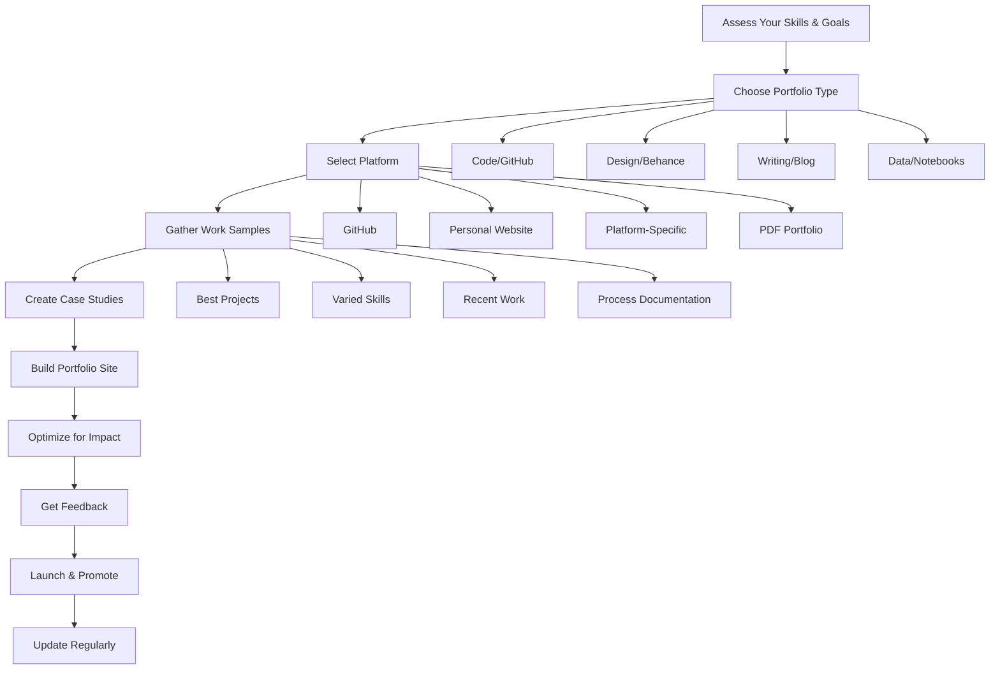
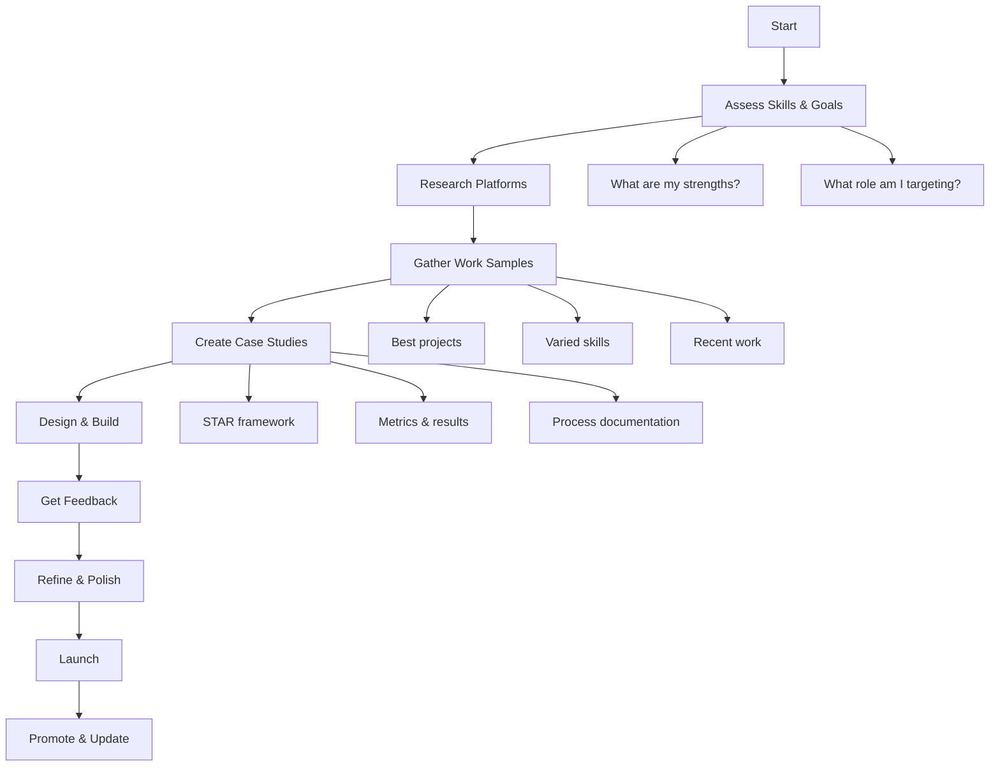
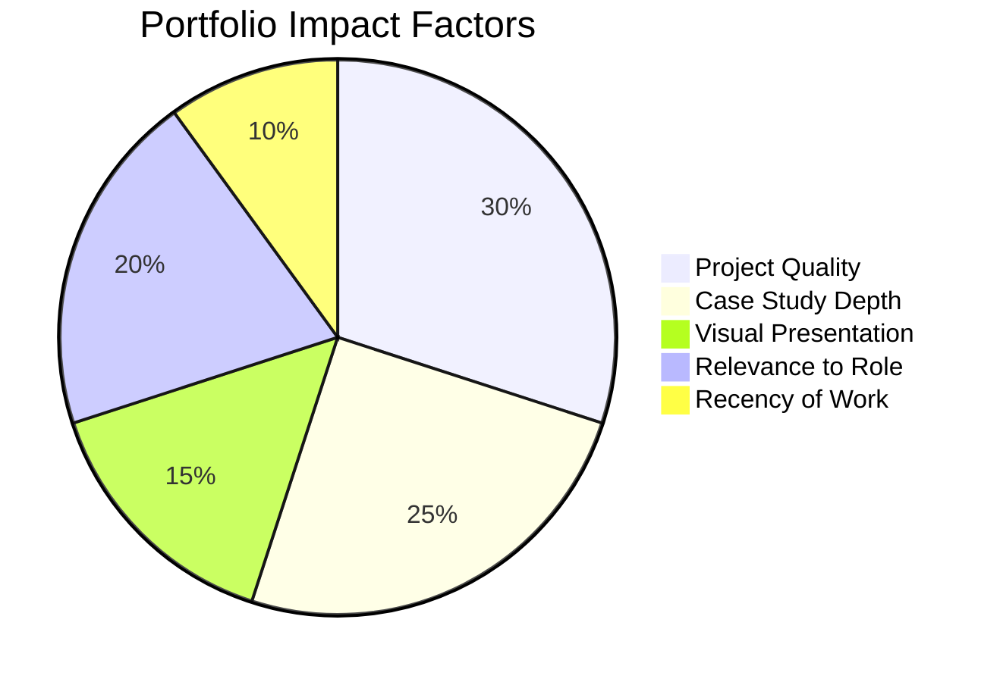
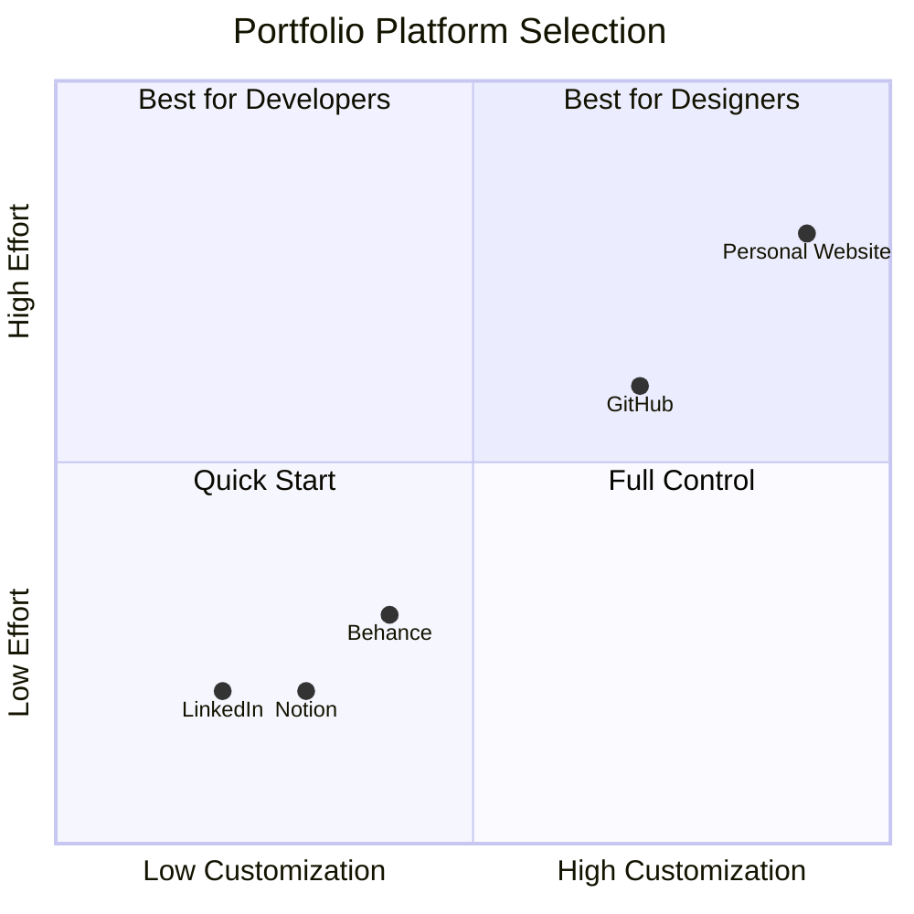
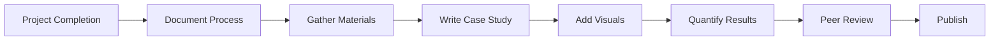

---
layout: post
title: Portfolio & Project Showcase
categories: Getting Started
tags: [Portfolio, Interview Preparation]
date: 2024-01-04
toc: true
---

## Introduction

**What is a Portfolio?**
A portfolio is a curated collection of your best work that demonstrates your skills, experience, and capabilities to potential employers or clients. Unlike a resume that claims abilities, a portfolio provides concrete evidence of your competence through projects, case studies, writing samples, design work, code repositories, and other demonstrable outputs.

**Why Does it Matter for Interviews?**
Portfolios matter because they:
- Provide tangible proof of skills listed on your resume
- Demonstrate problem-solving approach and thought process
- Show quality standards and attention to detail
- Differentiate you from candidates with similar backgrounds
- Allow interviewers to ask specific, meaningful questions
- Serve as conversation starters during interviews
- Build credibility and trust with potential employers

**Portfolios Across Roles:**
- **Developers**: GitHub repos, open source contributions, personal projects
- **Designers**: Visual designs, UX case studies, prototypes
- **Writers**: Published articles, content samples, documentation
- **Data Scientists**: Analysis notebooks, models, dashboards
- **Product Managers**: Product specs, roadmap examples, case studies
- **Marketers**: Campaign results, content strategies, analytics

---

## Learning Roadmap

### Mermaid Diagram



### Portfolio Development Timeline

| Phase | Duration | Activities | Deliverables |
|-------|----------|------------|--------------|
| Planning | 1-2 weeks | Assess skills, research platforms, gather examples | Strategy document |
| Content Creation | 2-4 weeks | Create/refine projects, write case studies | Project files, documentation |
| Build | 2-3 weeks | Set up platform, design layout, implement | Live portfolio site |
| Review | 1 week | Peer feedback, testing, refinement | Revised portfolio |
| Launch | 1 week | Final testing, promotion, SEO | Public portfolio |
| Maintenance | Ongoing | Regular updates, new projects, feedback | Updated portfolio |

---

## Theory Notes

### Portfolio Types by Role

**Software Developer Portfolio:**
- GitHub profile with pinned repositories
- Personal website with project showcases
- Open source contributions
- Technical blog posts
- Live demo applications
- Code samples with documentation
- Contribution graphs and activity history

**Designer Portfolio:**
- Visual design samples (UI, branding, illustrations)
- UX case studies showing process
- Interactive prototypes (Figma, InVision)
- Before/after redesigns
- Design system components
- User research findings
- Responsive design examples

**Data Scientist Portfolio:**
- Jupyter notebooks with analyses
- Kaggle competition results
- Published research or articles
- Interactive dashboards
- Model demonstrations
- Data visualization examples
- End-to-end project documentation

**Writer/Content Portfolio:**
- Published articles and blog posts
- Content strategy examples
- SEO case studies
- Social media campaigns
- Technical documentation
- Editing samples
- Content performance metrics

**Product Manager Portfolio:**
- Product requirements documents
- Roadmap examples
- A/B test designs and results
- User research synthesis
- Feature prioritization frameworks
- Cross-functional project examples
- Metrics and KPI dashboards

### Platform Selection Guide

**GitHub (Developers):**
- Pros: Industry standard, integrates with code, shows activity
- Cons: Limited customization, requires code
- Best for: All developer roles, open source contributions

**Personal Website (All Roles):**
- Pros: Full control, customizable, demonstrates web skills
- Cons: Requires maintenance, hosting costs
- Best for: Designers, developers, senior professionals

**Behance/Dribbble (Designers):**
- Pros: Built-in community, visual focus, easy to use
- Cons: Limited to design, platform-dependent
- Best for: UI/UX designers, graphic designers

**Notion/Google Sites (Quick Setup):**
- Pros: Easy to set up, free, flexible
- Cons: Limited customization, less professional
- Best for: Quick portfolio, non-technical roles

**Medium/Substack (Writers):**
- Pros: Built-in audience, easy publishing, SEO
- Cons: Platform-dependent, limited design
- Best for: Writers, content marketers, thought leaders

### Case Study Structure

**STAR Framework for Case Studies:**
1. **Situation**: Context and background of the project
2. **Task**: Your specific role and responsibilities
3. **Action**: Steps you took to address the challenge
4. **Result**: Measurable outcomes and learnings

**Essential Case Study Elements:**
- Project overview (1-2 paragraphs)
- Your role and contribution
- Problem/challenge statement
- Process and methodology
- Tools and technologies used
- Visual examples (screenshots, demos)
- Results and metrics
- Lessons learned
- Future improvements

### Portfolio Best Practices

**Content Quality:**
- Show, don't just tell
- Include process, not just final products
- Quantify results where possible
- Demonstrate problem-solving approach
- Show variety in skills and industries

**Visual Design:**
- Clean, professional layout
- Consistent branding
- Easy navigation
- Mobile-responsive
- Fast loading times

**User Experience:**
- Clear call-to-action
- Easy contact information
- Logical content organization
- Minimal clicks to key content
- Accessible design

---

## Key Concepts

| Concept | Definition | Portfolio Impact |
|---------|------------|------------------|
| Case Study | Detailed project analysis showing process and results | Demonstrates thinking approach and methodology |
| Live Demo | Working prototype or application | Provides tangible proof of skills |
| Process Documentation | Step-by-step creation narrative | Shows problem-solving methodology |
| Quantified Results | Measurable outcomes from projects | Proves impact and effectiveness |
| Visual Presentation | Professional design and layout | Creates positive first impression |
| Technical Depth | Detailed implementation explanations | Validates technical competence |
| Variety | Range of skills and project types | Shows versatility and adaptability |
| Recency | Recent work and updates | Demonstrates current skills |
| Relevance | Alignment with target role | Shows fit for specific positions |
| Accessibility | Easy to find and navigate | Ensures reviewers can engage |

---

## Frequently Asked Interview Questions

### Beginner Level

1. **Q: Do I need a portfolio if I have a strong resume?**
   A: Yes, absolutely. Resumes make claims; portfolios provide evidence. In competitive fields, a portfolio differentiates you from candidates with similar backgrounds. It gives interviewers specific topics to discuss and proves you can deliver on your stated skills.

2. **Q: What projects should I include in my portfolio?**
   A: Include 3-6 of your best projects that demonstrate: (1) skills relevant to your target role, (2) variety in problem types, (3) measurable results or impact, (4) clean code/design/writing quality, and (5) your ability to complete projects from start to finish.

3. **Q: How often should I update my portfolio?**
   A: Update your portfolio every 3-6 months with new projects, or immediately when you complete impressive work. Remove outdated or weaker pieces as you add stronger ones. Always ensure your portfolio reflects your current skill level.

4. **Q: Should I include personal projects or only work projects?**
   A: Include both. Personal projects show initiative, passion, and skills you're developing. Work projects demonstrate professional application. If you can't share work projects due to NDAs, recreate similar problems or explain the context without confidential details.

5. **Q: What if I don't have many projects to show?**
   A: Create projects! Build solutions to problems you face, contribute to open source, recreate existing products as learning exercises, or take on freelance/volunteer work. Quality matters more than quantity - 3 excellent projects beat 10 mediocre ones.

### Intermediate Level

6. **Q: How detailed should case studies be?**
   A: Case studies should be comprehensive but scannable. Include: project context (2-3 paragraphs), your specific contributions, challenges faced, your process/approach, tools used, results with metrics, and key learnings. Aim for 500-1000 words with visual examples.

7. **Q: Should I show failed projects or only successes?**
   A: Include selective failures that demonstrate learning and growth. Frame them as "what I learned" rather than pure failures. Interviewers value self-awareness and growth mindset. However, don't showcase work you're not proud of - curate thoughtfully.

8. **Q: How do I handle confidential work projects?**
   A: You can discuss the problem type, your role, and your approach without revealing proprietary details. Focus on the methodology, technologies used, and general outcomes. Create a sanitized version or build a similar non-confidential project to demonstrate the skills.

9. **Q: What's the ideal portfolio structure?**
   A: A strong portfolio typically includes: (1) Clear homepage with value proposition, (2) Project showcase with 3-6 detailed case studies, (3) About page with background and skills, (4) Contact information, (5) Optional: blog or additional resources. Keep navigation simple and intuitive.

10. **Q: Should my portfolio match my resume?**
    A: Yes, they should be consistent and complementary. Your portfolio provides evidence for resume claims. Reference specific portfolio projects in your resume, and ensure timelines, roles, and descriptions align. The portfolio goes deeper while the resume provides overview.

### Advanced Level

11. **Q: How do I make my portfolio stand out in competitive fields?**
    A: Differentiation strategies include: unique presentation format, exceptional case study depth, live interactive demos, measurable business impact, industry-specific content, regular content updates, and strong personal branding. Also consider video introductions or interactive elements.

12. **Q: Should I include a blog or writing in my portfolio?**
    A: Absolutely. Writing demonstrates communication skills, thought leadership, and deep understanding of topics. Technical blogs, case study write-ups, or industry analysis show you can articulate complex ideas - a valuable skill in any role.

13. **Q: How do I balance quality and quantity?**
    A: Quality always wins. It's better to have 3-4 exceptional projects with detailed case studies than 10 projects with minimal documentation. As you add stronger work, remove weaker pieces. Your portfolio should represent your best current abilities.

14. **Q: What metrics should I include in case studies?**
    A: Include any quantifiable results: performance improvements (%), user growth (#), revenue impact ($), time saved (hours), efficiency gains (%), error reduction (%), or scale metrics (users, requests, data volume). If exact numbers are confidential, use ranges or percentages.

15. **Q: How do I get feedback on my portfolio?**
    A: Seek feedback from: (1) peers in your field, (2) mentors or senior professionals, (3) hiring managers if possible, (4) online communities (Reddit, Twitter, Discord), (5) portfolio review services. Ask specific questions about clarity, impact, and areas for improvement.

### FAANG Level

16. **Q: How do FAANG companies evaluate portfolios?**
    A: FAANG companies look for: technical depth and breadth, problem-solving approach, code quality (for developers), design thinking (for designers), impact measurement, and alignment with company values. They often discuss portfolio projects in detail during interviews.

17. **Q: What role does portfolio play in FAANG hiring?**
    A: Portfolios supplement but don't replace technical interviews. They can help get interviews (especially for non-traditional candidates), provide discussion points, and demonstrate passion. However, technical skills are still validated through coding challenges and system design interviews.

18. **Q: Should I build projects specific to FAANG companies?**
    A: Building projects that solve problems similar to those at target companies can demonstrate relevant thinking. However, don't copy their products - instead, show you understand the domain and can solve similar types of problems. Generic strong projects are also valuable.

19. **Q: How important is portfolio presentation vs. content quality?**
    A: Both matter, but content quality is more important. A beautifully designed portfolio with mediocre projects loses to a simple portfolio with exceptional work. That said, professional presentation shows attention to detail and design sense, which are valuable in any role.

20. **Q: Can a strong portfolio compensate for lack of experience?**
    A: Yes, particularly for career changers or recent graduates. A strong portfolio demonstrates skills directly, which can outweigh limited professional experience. It shows initiative, passion, and capability - qualities that matter more than years of experience for many roles.

21. **Q: How do I portfolio for roles that don't traditionally have portfolios?**
    A: Get creative: PMs can showcase product specs and roadmaps, marketers can show campaign analyses, salespeople can share customer success stories, and managers can present team achievements. Focus on demonstrating skills through whatever artifacts your role produces.

---

## Hands-on Practice

### Exercise 1: Portfolio Audit
Review your current portfolio (or create one) and evaluate:
- Does it showcase 3-6 best projects?
- Are case studies detailed and compelling?
- Is the design professional and easy to navigate?
- Does it clearly communicate your value proposition?
- Is contact information easy to find?

### Exercise 2: Case Study Creation
Take one project and create a detailed case study:
1. Write project overview (context, goals, your role)
2. Document the problem/challenge
3. Describe your process and methodology
4. List tools and technologies used
5. Add visual examples (screenshots, diagrams)
6. Quantify results with metrics
7. Reflect on lessons learned

### Exercise 3: Portfolio Differentiation
Research 5 competitors in your field and identify:
- What makes their portfolios strong?
- What's missing that you could include?
- How can you differentiate your presentation?
- What unique angle can you bring?

### Exercise 4: Project Documentation
Take an existing project and create comprehensive documentation:
- README with clear setup instructions
- Architecture diagram or design decisions
- Challenges faced and solutions implemented
- Future improvements and roadmap
- Screenshots or demo GIFs

### Exercise 5: Portfolio Platform Comparison
Create the same portfolio content on 3 different platforms:
1. GitHub profile README
2. Personal website (even simple HTML)
3. LinkedIn featured section
Compare ease of creation, presentation quality, and discoverability.

### Exercise 6: Peer Review Session
Exchange portfolios with peers and provide structured feedback:
- First impression (within 30 seconds)
- Clarity of value proposition
- Strength of case studies
- Visual design quality
- Areas for improvement

### Exercise 7: Mobile Optimization Test
View your portfolio on multiple devices and evaluate:
- Loading speed on mobile
- Readability of text
- Navigation ease
- Image/display quality
- Overall user experience

### Exercise 8: Quantification Challenge
Take 3 projects and add measurable results:
- Performance metrics (speed, efficiency)
- User metrics (adoption, satisfaction)
- Business metrics (revenue, cost savings)
- Scale metrics (users, data volume)

### Exercise 9: Content Refresh
Update your portfolio with:
- 1 new project from last 3 months
- Updated skills section
- Refreshed bio/about section
- New recommendations or endorsements
- Recent blog posts or articles

### Exercise 10: SEO and Discoverability
Optimize your portfolio for search:
- Add relevant keywords to titles and descriptions
- Create descriptive alt text for images
- Ensure proper heading hierarchy
- Add meta descriptions
- Submit to relevant directories

---

## Real FAANG Interview Questions

| Company | Question | Difficulty |
|---------|----------|------------|
| Google | Walk me through a project from your portfolio that you're most proud of. | Beginner |
| Amazon | How did you measure success for the project in your portfolio? | Intermediate |
| Facebook | Tell me about a time you had to make trade-offs in a portfolio project. | Intermediate |
| Apple | How does your portfolio demonstrate design thinking? | Intermediate |
| Netflix | What would you change about the project in your portfolio if you did it today? | Advanced |
| Microsoft | How do you decide what to include in your portfolio? | Beginner |
| Google | Explain the technical decisions behind your most complex portfolio project. | Advanced |
| Amazon | How does your portfolio reflect Amazon's leadership principles? | Advanced |
| Facebook | What metrics did you track for your portfolio projects? | Intermediate |
| Apple | How do you ensure your portfolio stays current? | Beginner |
| Netflix | Tell me about a failed project and what you learned. | Intermediate |
| Microsoft | How would your portfolio help you succeed in this role? | Intermediate |
| Google | What's the most challenging technical problem you solved in your portfolio? | Advanced |
| Amazon | How does your portfolio demonstrate customer obsession? | Advanced |
| Facebook | Walk me through your design process for a portfolio project. | Intermediate |
| Apple | What makes your portfolio different from others? | Beginner |
| Netflix | How do you handle project scope creep (based on portfolio examples)? | Advanced |
| Microsoft | What project in your portfolio best demonstrates teamwork? | Beginner |
| Google, Amazon | How would you improve this portfolio project? (interviewer picks one) | Advanced |
| Facebook, Apple | What would you build next for your portfolio? | Intermediate |

---

## Common Mistakes

| Mistake | Why It's Bad | How to Fix |
|---------|--------------|------------|
| Including too many weak projects | Dilutes impact of strong work | Curate ruthlessly, show only best 3-6 |
| No case studies or documentation | Shows results but not process | Add detailed case studies for each project |
| Outdated content | Shows stagnant skills | Update quarterly with recent work |
| Poor visual presentation | Creates negative first impression | Invest in clean, professional design |
| Missing contact information | Reviewers can't reach you | Add clear contact section |
| No mobile responsiveness | Alienates mobile users | Test and optimize for all devices |
| Generic, non-specific content | Doesn't differentiate you | Be specific about your contributions |
| No quantified results | Claims lack credibility | Add metrics to demonstrate impact |
| Difficult navigation | Reviewers give up | Simplify structure and menu |
| No personal branding | Blends in with others | Develop consistent personal brand |
| Ignoring loading speed | Frustrates reviewers | Optimize images and code |
| No call-to-action | Misses opportunities | Add clear next steps for reviewers |

---

## Best Practices

1. **Quality Over Quantity**: Showcase 3-6 exceptional projects, not 20 mediocre ones
2. **Show Process, Not Just Results**: Document your thinking and methodology
3. **Quantify Everything**: Add metrics to demonstrate measurable impact
4. **Keep It Current**: Update every 3-6 months with recent work
5. **Make It Accessible**: Ensure easy navigation and mobile responsiveness
6. **Tell a Story**: Each project should have a clear narrative arc
7. **Include Diverse Projects**: Show range of skills and problem types
8. **Add Personal Touch**: Let your personality and passion show
9. **Get Feedback**: Have peers and mentors review before launching
10. **Link Everything**: Connect portfolio to GitHub, LinkedIn, and other profiles
11. **Optimize for SEO**: Help recruiters find you through search
12. **Include Contact Info**: Make it easy for reviewers to reach you
13. **Test Performance**: Ensure fast loading and smooth interactions
14. **Document Challenges**: Show problem-solving, not just success
15. **Maintain Consistency**: Keep branding, formatting, and tone uniform

---

## Cheat Sheet

```
╔══════════════════════════════════════════════════════════════╗
║                  PORTFOLIO CHEAT SHEET                      ║
╠══════════════════════════════════════════════════════════════╣
║                                                              ║
║  ESSENTIAL ELEMENTS:                                         ║
║  ✓ 3-6 best projects with case studies                       ║
║  ✓ Clear value proposition                                   ║
║  ✓ Professional visual design                                ║
║  ✓ Easy navigation                                           ║
║  ✓ Contact information                                       ║
║  ✓ Mobile responsive                                         ║
║  ✓ Fast loading                                              ║
║                                                              ║
║  CASE STUDY STRUCTURE:                                       ║
║  1. Project Overview (context, goals)                        ║
║  2. Your Role (specific contributions)                       ║
║  3. Problem/Challenge (what you solved)                      ║
║  4. Process (your methodology)                               ║
║  5. Tools/Technologies (what you used)                       ║
║  6. Visual Examples (screenshots, demos)                     ║
║  7. Results (metrics and outcomes)                           ║
║  8. Learnings (key takeaways)                                ║
║                                                              ║
║  PLATFORMS BY ROLE:                                          ║
║  • Developer: GitHub + Personal Website                      ║
║  • Designer: Behance/Dribbble + Personal Website             ║
║  • Writer: Medium/Substack + Personal Website                ║
║  • Data Scientist: GitHub + Kaggle + Personal Website        ║
║  • PM: Notion/Google Sites + Case Studies                    ║
║                                                              ║
║  UPDATE SCHEDULE:                                            ║
║  • Add new projects: As completed                            ║
║  • Full refresh: Every 3-6 months                            ║
║  • Skills section: When new skills acquired                  ║
║  • Bio/About: When goals change                              ║
║                                                              ║
║  COMMON MISTAKES:                                            ║
║  ✗ Too many weak projects                                    ║
║  ✗ No case studies or documentation                          ║
║  ✗ Outdated content                                          ║
║  ✗ Poor visual presentation                                  ║
║  ✗ Missing contact information                               ║
║                                                              ║
╚══════════════════════════════════════════════════════════════╝
```

---

## Flash Cards

| # | Question | Answer |
|---|----------|--------|
| 1 | What is a portfolio? | A curated collection demonstrating skills through work samples |
| 2 | How many projects should a portfolio include? | 3-6 of your best, most relevant projects |
| 3 | What is a case study? | Detailed analysis of a project showing process and results |
| 4 | What is the STAR framework? | Situation, Task, Action, Result - used for case studies |
| 5 | Should portfolios show failures? | Selective failures that demonstrate learning, framed as growth |
| 6 | How often update portfolio? | Every 3-6 months or after completing impressive work |
| 7 | What makes portfolio stand out? | Unique presentation, detailed process, measurable results |
| 8 | GitHub for developers? | Yes - industry standard, shows code, activity, contributions |
| 9 | Personal website benefits? | Full control, customizable, demonstrates web skills |
| 10 | Portfolio vs resume? | Portfolio provides evidence; resume makes claims |
| 11 | Include personal projects? | Yes - shows initiative, passion, skill development |
| 12 | Case study length? | 500-1000 words with visual examples |
| 13 | Mobile optimization important? | Yes - many reviewers view on mobile devices |
| 14 | Include confidential work? | Discuss approach without proprietary details |
| 15 | Portfolio for non-technical roles? | Yes - showcase results, strategies, case studies |
| 16 | Visual design importance? | Professional design creates positive first impression |
| 17 | Quantify results? | Always - metrics prove impact and effectiveness |
| 18 | Get feedback on portfolio? | Yes - peers, mentors, communities, review services |
| 19 | SEO for portfolio? | Yes - helps recruiters find you through search |
| 20 | Portfolio role in FAANG hiring? | Supplements interviews, provides discussion points |

---

## Mind Map

```
Portfolio
├── Content
│   ├── Projects
│   │   ├── Case Studies
│   │   ├── Live Demos
│   │   └── Documentation
│   ├── Skills
│   │   ├── Technical Skills
│   │   ├── Soft Skills
│   │   └── Tools/Technologies
│   └── About
│       ├── Bio/Background
│       ├── Goals
│       └── Contact Info
├── Platforms
│   ├── GitHub (Developers)
│   ├── Personal Website (All)
│   ├── Behance/Dribbble (Designers)
│   ├── Medium/Substack (Writers)
│   └── LinkedIn (Professional)
├── Presentation
│   ├── Visual Design
│   │   ├── Layout
│   │   ├── Branding
│   │   └── Typography
│   ├── User Experience
│   │   ├── Navigation
│   │   ├── Mobile
│   │   └── Speed
│   └── Content Quality
│       ├── Clarity
│       ├── Depth
│       └── Metrics
├── Process
│   ├── Planning
│   ├── Creation
│   ├── Review
│   ├── Launch
│   └── Maintenance
└── Impact
    ├── Interview Preparation
    ├── Professional Credibility
    ├── Skill Demonstration
    └── Career Advancement
```

---

## Mermaid Diagrams

### Portfolio Development Process



### Portfolio Impact on Hiring



### Platform Comparison



### Case Study Workflow



---

## Code Examples

### HTML/CSS: Portfolio Template

```html
<!DOCTYPE html>
<html lang="en">
<head>
    <meta charset="UTF-8">
    <meta name="viewport" content="width=device-width, initial-scale=1.0">
    <title>Portfolio - Your Name</title>
    <style>
        * {
            margin: 0;
            padding: 0;
            box-sizing: border-box;
        }
        
        body {
            font-family: 'Segoe UI', Tahoma, Geneva, Verdana, sans-serif;
            line-height: 1.6;
            color: #333;
        }
        
        .container {
            max-width: 1200px;
            margin: 0 auto;
            padding: 0 20px;
        }
        
        /* Header */
        header {
            background: linear-gradient(135deg, #667eea 0%, #764ba2 100%);
            color: white;
            padding: 100px 0;
            text-align: center;
        }
        
        header h1 {
            font-size: 2.5rem;
            margin-bottom: 10px;
        }
        
        header p {
            font-size: 1.2rem;
            opacity: 0.9;
        }
        
        /* Navigation */
        nav {
            background: #333;
            padding: 15px 0;
            position: sticky;
            top: 0;
            z-index: 100;
        }
        
        nav ul {
            list-style: none;
            display: flex;
            justify-content: center;
            gap: 30px;
        }
        
        nav a {
            color: white;
            text-decoration: none;
            font-weight: 500;
            transition: color 0.3s;
        }
        
        nav a:hover {
            color: #667eea;
        }
        
        /* Projects Section */
        .projects {
            padding: 80px 0;
            background: #f9f9f9;
        }
        
        .section-title {
            text-align: center;
            font-size: 2rem;
            margin-bottom: 50px;
        }
        
        .project-grid {
            display: grid;
            grid-template-columns: repeat(auto-fit, minmax(350px, 1fr));
            gap: 30px;
        }
        
        .project-card {
            background: white;
            border-radius: 10px;
            overflow: hidden;
            box-shadow: 0 5px 15px rgba(0,0,0,0.1);
            transition: transform 0.3s;
        }
        
        .project-card:hover {
            transform: translateY(-5px);
        }
        
        .project-image {
            height: 200px;
            background: #ddd;
            display: flex;
            align-items: center;
            justify-content: center;
            font-size: 3rem;
            color: #667eea;
        }
        
        .project-content {
            padding: 25px;
        }
        
        .project-title {
            font-size: 1.4rem;
            margin-bottom: 10px;
        }
        
        .project-description {
            color: #666;
            margin-bottom: 15px;
        }
        
        .project-tech {
            display: flex;
            gap: 10px;
            flex-wrap: wrap;
        }
        
        .tech-tag {
            background: #667eea;
            color: white;
            padding: 5px 10px;
            border-radius: 15px;
            font-size: 0.8rem;
        }
        
        .project-link {
            display: inline-block;
            margin-top: 15px;
            color: #667eea;
            text-decoration: none;
            font-weight: 500;
        }
        
        /* About Section */
        .about {
            padding: 80px 0;
        }
        
        .about-content {
            display: grid;
            grid-template-columns: 1fr 1fr;
            gap: 50px;
            align-items: center;
        }
        
        .about-text p {
            margin-bottom: 20px;
        }
        
        .skills-list {
            display: grid;
            grid-template-columns: repeat(2, 1fr);
            gap: 10px;
        }
        
        .skill-item {
            background: #f0f0f0;
            padding: 10px 15px;
            border-radius: 5px;
        }
        
        /* Contact Section */
        .contact {
            padding: 80px 0;
            background: #333;
            color: white;
            text-align: center;
        }
        
        .contact-links {
            display: flex;
            justify-content: center;
            gap: 30px;
            margin-top: 30px;
        }
        
        .contact-links a {
            color: white;
            text-decoration: none;
            padding: 10px 20px;
            border: 2px solid white;
            border-radius: 5px;
            transition: all 0.3s;
        }
        
        .contact-links a:hover {
            background: white;
            color: #333;
        }
        
        /* Responsive */
        @media (max-width: 768px) {
            .about-content {
                grid-template-columns: 1fr;
            }
            
            .project-grid {
                grid-template-columns: 1fr;
            }
            
            nav ul {
                flex-direction: column;
                align-items: center;
                gap: 15px;
            }
        }
    </style>
</head>
<body>
    <header>
        <div class="container">
            <h1>Your Name</h1>
            <p>Software Developer | Building amazing things</p>
        </div>
    </header>
    
    <nav>
        <ul>
            <li><a href="#projects">Projects</a></li>
            <li><a href="#about">About</a></li>
            <li><a href="#skills">Skills</a></li>
            <li><a href="#contact">Contact</a></li>
        </ul>
    </nav>
    
    <section id="projects" class="projects">
        <div class="container">
            <h2 class="section-title">Featured Projects</h2>
            <div class="project-grid">
                <div class="project-card">
                    <div class="project-image">🚀</div>
                    <div class="project-content">
                        <h3 class="project-title">Project One</h3>
                        <p class="project-description">
                            A brief description of what this project does and why it matters.
                        </p>
                        <div class="project-tech">
                            <span class="tech-tag">React</span>
                            <span class="tech-tag">Node.js</span>
                            <span class="tech-tag">MongoDB</span>
                        </div>
                        <a href="#" class="project-link">View Project →</a>
                    </div>
                </div>
                
                <div class="project-card">
                    <div class="project-image">💡</div>
                    <div class="project-content">
                        <h3 class="project-title">Project Two</h3>
                        <p class="project-description">
                            A brief description of what this project does and why it matters.
                        </p>
                        <div class="project-tech">
                            <span class="tech-tag">Python</span>
                            <span class="tech-tag">TensorFlow</span>
                            <span class="tech-tag">Flask</span>
                        </div>
                        <a href="#" class="project-link">View Project →</a>
                    </div>
                </div>
                
                <div class="project-card">
                    <div class="project-image">🎨</div>
                    <div class="project-content">
                        <h3 class="project-title">Project Three</h3>
                        <p class="project-description">
                            A brief description of what this project does and why it matters.
                        </p>
                        <div class="project-tech">
                            <span class="tech-tag">Vue.js</span>
                            <span class="tech-tag">Firebase</span>
                            <span class="tech-tag">Tailwind</span>
                        </div>
                        <a href="#" class="project-link">View Project →</a>
                    </div>
                </div>
            </div>
        </div>
    </section>
    
    <section id="about" class="about">
        <div class="container">
            <div class="about-content">
                <div class="about-text">
                    <h2>About Me</h2>
                    <p>
                        I'm a passionate software developer with experience building
                        web applications and solving complex problems. I love learning
                        new technologies and sharing knowledge with the community.
                    </p>
                    <p>
                        When I'm not coding, you can find me contributing to open source,
                        writing technical blog posts, or exploring new hiking trails.
                    </p>
                </div>
                <div class="skills">
                    <h3>Skills</h3>
                    <div class="skills-list">
                        <div class="skill-item">JavaScript</div>
                        <div class="skill-item">Python</div>
                        <div class="skill-item">React</div>
                        <div class="skill-item">Node.js</div>
                        <div class="skill-item">SQL</div>
                        <div class="skill-item">AWS</div>
                        <div class="skill-item">Git</div>
                        <div class="skill-item">Docker</div>
                    </div>
                </div>
            </div>
        </div>
    </section>
    
    <section id="contact" class="contact">
        <div class="container">
            <h2>Get In Touch</h2>
            <p>I'm always open to new opportunities and interesting projects.</p>
            <div class="contact-links">
                <a href="mailto:your@email.com">Email</a>
                <a href="https://linkedin.com/in/yourprofile">LinkedIn</a>
                <a href="https://github.com/yourusername">GitHub</a>
            </div>
        </div>
    </section>
</body>
</html>
```

### JavaScript: Portfolio Analytics Tracker

```javascript
class PortfolioAnalytics {
    constructor() {
        this.visits = [];
        this.projectViews = {};
        this.interactions = [];
    }

    trackVisit(referrer = 'direct') {
        const visit = {
            timestamp: new Date().toISOString(),
            referrer,
            userAgent: navigator.userAgent,
            viewport: `${window.innerWidth}x${window.innerHeight}`,
            location: this.getLocation()
        };
        
        this.visits.push(visit);
        this.saveToStorage();
        
        return visit;
    }

    trackProjectView(projectId, projectName) {
        if (!this.projectViews[projectId]) {
            this.projectViews[projectId] = {
                name: projectName,
                views: 0,
                lastViewed: null
            };
        }
        
        this.projectViews[projectId].views++;
        this.projectViews[projectId].lastViewed = new Date().toISOString();
        
        this.trackInteraction('project_view', { projectId, projectName });
        this.saveToStorage();
    }

    trackInteraction(type, data) {
        this.interactions.push({
            type,
            data,
            timestamp: new Date().toISOString()
        });
        
        this.saveToStorage();
    }

    getLocation() {
        // Simple location detection (could use IP geolocation API)
        return {
            width: window.innerWidth,
            height: window.innerHeight,
            language: navigator.language
        };
    }

    getAnalytics() {
        return {
            totalVisits: this.visits.length,
            uniqueVisitors: this.getUniqueVisitors(),
            topProjects: this.getTopProjects(),
            recentActivity: this.interactions.slice(-10),
            visitTrend: this.getVisitTrend()
        };
    }

    getUniqueVisitors() {
        const uniqueAgents = new Set(this.visits.map(v => v.userAgent));
        return uniqueAgents.size;
    }

    getTopProjects() {
        return Object.entries(this.projectViews)
            .sort(([,a], [,b]) => b.views - a.views)
            .slice(0, 5)
            .map(([id, data]) => ({
                id,
                name: data.name,
                views: data.views
            }));
    }

    getVisitTrend() {
        const last7Days = [];
        const today = new Date();
        
        for (let i = 6; i >= 0; i--) {
            const date = new Date(today);
            date.setDate(date.getDate() - i);
            const dateStr = date.toISOString().split('T')[0];
            
            const visitsOnDay = this.visits.filter(v => 
                v.timestamp.startsWith(dateStr)
            ).length;
            
            last7Days.push({
                date: dateStr,
                visits: visitsOnDay
            });
        }
        
        return last7Days;
    }

    generateReport() {
        const analytics = this.getAnalytics();
        
        return `
═══════════════════════════════════════════════════════════════
                    PORTFOLIO ANALYTICS REPORT
═══════════════════════════════════════════════════════════════

SUMMARY
───────────────────────────────────────────────────────────────
Total Visits: ${analytics.totalVisits}
Unique Visitors: ${analytics.uniqueVisitors}

TOP PROJECTS
───────────────────────────────────────────────────────────────
${analytics.topProjects.map((p, i) => 
    `${i + 1}. ${p.name}: ${p.views} views`
).join('\n') || 'No project views yet'}

RECENT ACTIVITY
───────────────────────────────────────────────────────────────
${analytics.recentActivity.map(a => 
    `[${a.timestamp.split('T')[1].split('.')[0]}] ${a.type}`
).join('\n') || 'No recent activity'}

VISIT TREND (Last 7 Days)
───────────────────────────────────────────────────────────────
${analytics.visitTrend.map(d => 
    `${d.date}: ${'█'.repeat(d.visits)} ${d.visits}`
).join('\n')}
`;
    }

    saveToStorage() {
        localStorage.setItem('portfolioAnalytics', JSON.stringify({
            visits: this.visits,
            projectViews: this.projectViews,
            interactions: this.interactions
        }));
    }

    loadFromStorage() {
        const saved = localStorage.getItem('portfolioAnalytics');
        if (saved) {
            const data = JSON.parse(saved);
            this.visits = data.visits || [];
            this.projectViews = data.projectViews || {};
            this.interactions = data.interactions || [];
        }
    }
}

// Usage example
const analytics = new PortfolioAnalytics();
analytics.loadFromStorage();

// Track a visit
analytics.trackVisit('linkedin.com');

// Track project views
analytics.trackProjectView('project-1', 'E-commerce Platform');

// Get analytics report
console.log(analytics.generateReport());
```

### Python: Portfolio Content Manager

```python
import json
import os
from datetime import datetime
from typing import List, Dict, Optional
from dataclasses import dataclass, field, asdict
from pathlib import Path

@dataclass
class Project:
    id: str
    title: str
    description: str
    long_description: str
    technologies: List[str]
    role: str
    duration: str
    challenges: List[str]
    solutions: List[str]
    results: List[str]
    metrics: Dict[str, str]
    images: List[str] = field(default_factory=list)
    links: Dict[str, str] = field(default_factory=dict)
    featured: bool = False
    created_at: str = field(default_factory=lambda: datetime.now().isoformat())

@dataclass
class PortfolioConfig:
    owner_name: str
    title: str
    tagline: str
    bio: str
    skills: List[str]
    contact_email: str
    social_links: Dict[str, str] = field(default_factory=dict)
    theme: str = "professional"

class PortfolioManager:
    def __init__(self, data_dir: str = "portfolio_data"):
        self.data_dir = Path(data_dir)
        self.data_dir.mkdir(exist_ok=True)
        
        self.config_file = self.data_dir / "config.json"
        self.projects_file = self.data_dir / "projects.json"
        
        self.config = self._load_config()
        self.projects = self._load_projects()
    
    def _load_config(self) -> PortfolioConfig:
        if self.config_file.exists():
            with open(self.config_file, 'r') as f:
                data = json.load(f)
                return PortfolioConfig(**data)
        return PortfolioConfig(
            owner_name="Your Name",
            title="Portfolio",
            tagline="Building amazing things",
            bio="",
            skills=[],
            contact_email=""
        )
    
    def _load_projects(self) -> List[Project]:
        if self.projects_file.exists():
            with open(self.projects_file, 'r') as f:
                data = json.load(f)
                return [Project(**p) for p in data]
        return []
    
    def save(self):
        with open(self.config_file, 'w') as f:
            json.dump(asdict(self.config), f, indent=2)
        
        with open(self.projects_file, 'w') as f:
            json.dump([asdict(p) for p in self.projects], f, indent=2)
    
    def add_project(self, project: Project):
        self.projects.append(project)
        self.save()
    
    def update_project(self, project_id: str, updates: Dict):
        for project in self.projects:
            if project.id == project_id:
                for key, value in updates.items():
                    if hasattr(project, key):
                        setattr(project, key, value)
                break
        self.save()
    
    def remove_project(self, project_id: str):
        self.projects = [p for p in self.projects if p.id != project_id]
        self.save()
    
    def get_featured_projects(self) -> List[Project]:
        return [p for p in self.projects if p.featured]
    
    def get_projects_by_tech(self, technology: str) -> List[Project]:
        return [p for p in self.projects 
                if technology.lower() in [t.lower() for t in p.technologies]]
    
    def generate_case_study(self, project_id: str) -> str:
        project = next((p for p in self.projects if p.id == project_id), None)
        if not project:
            return "Project not found"
        
        case_study = f"""
═══════════════════════════════════════════════════════════════
                    CASE STUDY: {project.title}
═══════════════════════════════════════════════════════════════

OVERVIEW
───────────────────────────────────────────────────────────────
{project.description}

MY ROLE
───────────────────────────────────────────────────────────────
{project.role}
Duration: {project.duration}

TECHNOLOGIES USED
───────────────────────────────────────────────────────────────
{', '.join(project.technologies)}

THE CHALLENGE
───────────────────────────────────────────────────────────────"""
        
        for challenge in project.challenges:
            case_study += f"\n• {challenge}"
        
        case_study += """

MY APPROACH
───────────────────────────────────────────────────────────────"""
        
        for solution in project.solutions:
            case_study += f"\n• {solution}"
        
        case_study += """

RESULTS & IMPACT
───────────────────────────────────────────────────────────────"""
        
        for result in project.results:
            case_study += f"\n• {result}"
        
        if project.metrics:
            case_study += "\n\nKEY METRICS"
            case_study += "\n" + "─" * 63
            for metric, value in project.metrics.items():
                case_study += f"\n{metric}: {value}"
        
        case_study += """

WHAT I LEARNED
───────────────────────────────────────────────────────────────
This project taught me the importance of [key learning].
I would approach [aspect] differently next time by [improvement].
"""
        
        return case_study
    
    def generate_portfolio_html(self) -> str:
        projects_html = ""
        for project in self.projects:
            tech_tags = ''.join([
                f'<span class="tech-tag">{tech}</span>' 
                for tech in project.technologies
            ])
            
            projects_html += f"""
        <div class="project-card">
            <div class="project-content">
                <h3 class="project-title">{project.title}</h3>
                <p class="project-description">{project.description}</p>
                <div class="project-tech">{tech_tags}</div>
                <a href="#{project.id}" class="project-link">View Details →</a>
            </div>
        </div>"""
        
        return f"""<!DOCTYPE html>
<html lang="en">
<head>
    <meta charset="UTF-8">
    <meta name="viewport" content="width=device-width, initial-scale=1.0">
    <title>{self.config.title}</title>
    <style>
        /* CSS styles would go here */
        body {{ font-family: sans-serif; }}
        .project-card {{ border: 1px solid #ddd; padding: 20px; margin: 10px; }}
        .tech-tag {{ background: #667eea; color: white; padding: 5px 10px; border-radius: 15px; }}
    </style>
</head>
<body>
    <header>
        <h1>{self.config.owner_name}</h1>
        <p>{self.config.tagline}</p>
    </header>
    
    <section id="projects">
        <h2>Projects</h2>
        <div class="project-grid">
            {projects_html}
        </div>
    </section>
    
    <section id="about">
        <h2>About Me</h2>
        <p>{self.config.bio}</p>
        <div class="skills">
            {''.join([f'<span class="skill">{s}</span>' for s in self.config.skills])}
        </div>
    </section>
</body>
</html>"""
    
    def export_markdown(self) -> str:
        md = f"# {self.config.owner_name}\n\n"
        md += f"*{self.config.tagline}*\n\n"
        md += f"{self.config.bio}\n\n"
        
        md += "## Skills\n\n"
        md += ", ".join(self.config.skills) + "\n\n"
        
        md += "## Projects\n\n"
        for project in self.projects:
            md += f"### {project.title}\n\n"
            md += f"{project.description}\n\n"
            md += f"**Technologies:** {', '.join(project.technologies)}\n"
            md += f"**Role:** {project.role}\n"
            md += f"**Duration:** {project.duration}\n\n"
            
            if project.results:
                md += "**Results:**\n"
                for result in project.results:
                    md += f"- {result}\n"
                md += "\n"
        
        return md


# Example usage
if __name__ == "__main__":
    manager = PortfolioManager()
    
    # Update config
    manager.config = PortfolioConfig(
        owner_name="Jane Developer",
        title="Jane's Portfolio",
        tagline="Full Stack Developer | Building the Future",
        bio="Passionate developer with 5+ years of experience in web development.",
        skills=["JavaScript", "Python", "React", "Node.js", "AWS"],
        contact_email="jane@example.com",
        social_links={
            "github": "https://github.com/janedev",
            "linkedin": "https://linkedin.com/in/janedev"
        }
    )
    
    # Add a project
    project = Project(
        id="ecommerce-1",
        title="E-commerce Platform",
        description="A full-featured e-commerce platform with payment processing.",
        long_description="Built a complete e-commerce solution...",
        technologies=["React", "Node.js", "MongoDB", "Stripe"],
        role="Lead Developer",
        duration="3 months",
        challenges=[
            "Handling concurrent users during flash sales",
            "Implementing secure payment processing",
            "Optimizing for mobile performance"
        ],
        solutions=[
            "Implemented Redis caching for product listings",
            "Integrated Stripe with proper webhook handling",
            "Used lazy loading and code splitting"
        ],
        results=[
            "Processed $100K in first month",
            "99.9% uptime during peak traffic",
            "4.8/5 customer satisfaction rating"
        ],
        metrics={
            "Users": "10,000+",
            "Revenue": "$100K first month",
            "Performance": "2s load time"
        }
    )
    
    manager.add_project(project)
    manager.save()
    
    # Generate case study
    print(manager.generate_case_study("ecommerce-1"))
    
    # Export as markdown
    with open("portfolio.md", "w") as f:
        f.write(manager.export_markdown())
```

---

## Mini Project: Personal Portfolio Website

Build a complete personal portfolio website:

**Features:**
- Responsive design for all devices
- Project showcase with case studies
- About section with skills and experience
- Contact form
- Blog section (optional)
- SEO optimization
- Analytics integration

**Tech Stack Options:**
- HTML/CSS/JavaScript (static)
- React + Vite (modern, fast)
- Next.js (SSR, great for SEO)
- Hugo/Jekyll (static site generators)

---

## Intermediate Project: Portfolio CMS

Build a content management system for your portfolio:

**Features:**
- Dashboard for managing projects
- Rich text editor for case studies
- Image upload and optimization
- Project categorization and filtering
- Analytics dashboard
- Export to multiple formats (HTML, PDF, Markdown)

**Tech Stack:**
- React/Vue frontend
- Node.js/Python backend
- SQLite/PostgreSQL database
- Image processing library
- Markdown/HTML editor

---

## Advanced Project: AI Portfolio Assistant

Build an AI-powered tool that helps create and optimize portfolios:

**Features:**
- AI-generated case study drafts
- Automatic quantification suggestions
- SEO optimization recommendations
- Peer comparison analysis
- Portfolio scoring system
- Interview preparation generator

**Tech Stack:**
- Python (FastAPI)
- OpenAI API integration
- React frontend
- MongoDB for data
- Natural Language Processing
- Machine Learning for scoring

---

## Project Ideas Table

| # | Project | Difficulty | Skills Practiced | Time Estimate |
|---|---------|------------|------------------|---------------|
| 1 | Static Portfolio Website | Beginner | HTML, CSS, basic JS | 8-12 hours |
| 2 | GitHub Profile README | Beginner | Markdown, HTML/CSS | 3-4 hours |
| 3 | Portfolio with Blog | Intermediate | React, Markdown, routing | 1-2 weeks |
| 4 | Case Study Generator | Intermediate | Templating, PDF generation | 1 week |
| 5 | Portfolio Analytics Dashboard | Intermediate | React, charts, data viz | 1-2 weeks |
| 6 | Multi-Theme Portfolio | Advanced | CSS variables, JS themes | 1-2 weeks |
| 7 | Portfolio CMS | Advanced | Full-stack development | 3-4 weeks |
| 8 | Portfolio Review Platform | Advanced | User auth, reviews, ratings | 3-4 weeks |
| 9 | AI Portfolio Optimizer | Expert | NLP, ML, full-stack | 4-6 weeks |
| 10 | Collaborative Portfolio Tool | Expert | Real-time collab, full-stack | 6-8 weeks |

---

## Resources

### Practice Websites

| Website | Purpose | URL |
|---------|---------|-----|
| GitHub | Code portfolio and contributions | github.com |
| Behance | Design portfolio | behance.net |
| Dribbble | Design showcase | dribbble.com |
| Medium | Writing portfolio | medium.com |
| Kaggle | Data science portfolio | kaggle.com |
| CodePen | Frontend code showcase | codepen.io |
| Dev.to | Developer blog and portfolio | dev.to |
| Hashnode | Developer blogging platform | hashnode.dev |

### Portfolio Templates & Themes

| Platform | Type | Cost |
|----------|------|------|
| HTML5 UP | Website templates | Free |
| ThemeForest | Premium themes | $20-50 |
| GitHub Pages | Free hosting | Free |
| Netlify | Hosting + CI/CD | Free tier |
| Vercel | Next.js hosting | Free tier |

### Books

| Book | Author | Focus |
|------|--------|-------|
| "Show Your Work!" | Austin Kleon | Building in public |
| "Steal Like an Artist" | Austin Kleon | Creative process |
| "The Design of Everyday Things" | Don Norman | Design principles |
| "Don't Make Me Think" | Steve Krug | UX principles |

### Tools & Software

| Tool | Purpose |
|------|---------|
| Figma | Design mockups |
| Canva | Graphics and visuals |
| Loom | Video introductions |
| Notion | Case study documentation |
| Grammarly | Writing proofreading |

### Online Courses

| Course | Platform | Focus |
|--------|----------|-------|
| Portfolio Website | freeCodeCamp | Web development |
| UI/UX Design | Coursera | Design principles |
| GitHub Pages | GitHub Learning | Static site hosting |
| Personal Branding | LinkedIn Learning | Professional presence |

### YouTube Channels

| Channel | Content |
|---------|---------|
| Traversy Media | Web development tutorials |
| Kevin Powell | CSS and design |
| Fireship | Quick tech tutorials |
| Web Dev Simplified | Frontend development |

---

## Checklist

### Content
- [ ] 3-6 best projects included
- [ ] Each project has detailed case study
- [ ] Clear value proposition on homepage
- [ ] Professional bio/about section
- [ ] Skills and technologies listed
- [ ] Contact information included
- [ ] Social links to GitHub, LinkedIn

### Design & UX
- [ ] Clean, professional design
- [ ] Consistent branding (colors, fonts)
- [ ] Easy navigation
- [ ] Mobile responsive
- [ ] Fast loading times
- [ ] Accessible design (alt text, contrast)

### Technical
- [ ] No broken links
- [ ] Proper HTML structure
- [ ] Optimized images
- [ ] SEO meta tags
- [ ] Analytics tracking (optional)
- [ ] Contact form working (if applicable)

### Content Quality
- [ ] Quantified results in case studies
- [ ] Process documented, not just results
- [ ] Clear technical explanations
- [ ] Error-free writing
- [ ] Consistent formatting
- [ ] Appropriate level of detail

### Promotion
- [ ] LinkedIn profile links to portfolio
- [ ] GitHub profile links to portfolio
- [ ] Resume includes portfolio link
- [ ] Share on relevant communities
- [ ] Ask for feedback from peers

---

## Revision Notes

### Portfolio Must-Haves
1. 3-6 exceptional projects with case studies
2. Clear value proposition
3. Professional visual design
4. Easy navigation
5. Mobile responsive
6. Contact information
7. Quantified results
8. Process documentation

### Case Study Formula
1. **Situation**: Context and background
2. **Task**: Your role and responsibilities
3. **Action**: What you did (methodology)
4. **Result**: Measurable outcomes

### Platform Selection Guide
- **Developers**: GitHub + Personal Website
- **Designers**: Behance/Dribbble + Personal Website
- **Writers**: Medium/Substack + Personal Website
- **Data Scientists**: GitHub + Kaggle

### One-Day Portfolio Audit
- Morning: Review content quality and case studies
- Afternoon: Check design, UX, and mobile responsiveness
- Evening: Update contact info and links

### One-Week Portfolio Improvement
- Days 1-2: Content audit and improvement
- Days 3-4: Design and UX updates
- Days 5-6: Case study creation/expansion
- Day 7: Testing, feedback, and launch

---

## Mock Interview Questions

### Portfolio-Specific Questions

1. "Walk me through one of your portfolio projects in detail."

2. "What was the most challenging aspect of this project?"

3. "How did you measure success for this project?"

4. "What would you do differently if you did this project again?"

5. "Tell me about a time you had to make trade-offs in this project."

6. "How did you collaborate with others on this project?"

7. "What technical decisions did you make and why?"

8. "How did you handle scope creep or changing requirements?"

9. "What did you learn from this project?"

10. "How does this project relate to the role you're applying for?"

### Behavioral Questions Based on Portfolio

11. "Describe a project where you had to learn something new quickly."

12. "Tell me about a time you failed on a project. How did you recover?"

13. "How do you prioritize when working on multiple projects?"

14. "Describe your process for starting a new project from scratch."

15. "How do you handle feedback on your work?"

---

## Difficulty Rating

| Task | Time Required | Difficulty | Impact |
|------|---------------|------------|--------|
| Create GitHub profile README | 2-3 hours | Easy | Medium |
| Build simple portfolio website | 8-12 hours | Medium | High |
| Write 3 detailed case studies | 6-8 hours | Medium | Very High |
| Add quantified results | 2-3 hours | Easy | High |
| Mobile optimization | 3-4 hours | Medium | High |
| SEO optimization | 2-3 hours | Easy | Medium |
| Create portfolio CMS | 20-30 hours | Hard | High |
| Build full portfolio from scratch | 40-60 hours | Very Hard | Very High |

---

## Summary

A strong portfolio is one of the most powerful tools in your job search arsenal. It provides concrete evidence of your skills, demonstrates your problem-solving approach, and differentiates you from other candidates.

**Key Principles:**
1. **Quality Over Quantity**: Show your best work, not all your work
2. **Show Process**: Document your thinking, not just final results
3. **Quantify Impact**: Add metrics to demonstrate measurable success
4. **Keep Current**: Update regularly with recent projects
5. **Make Accessible**: Ensure easy navigation and mobile responsiveness

**Remember**: Your portfolio is a living document that should evolve with your career. Invest time in creating compelling case studies, and always be ready to discuss your projects in detail during interviews. A well-crafted portfolio not only helps you get interviews but also provides the foundation for meaningful technical discussions that showcase your expertise.

