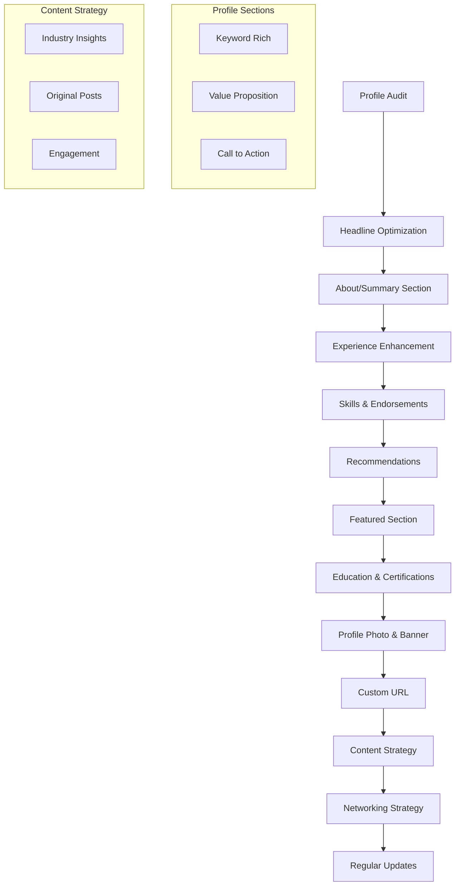
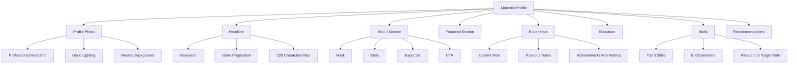
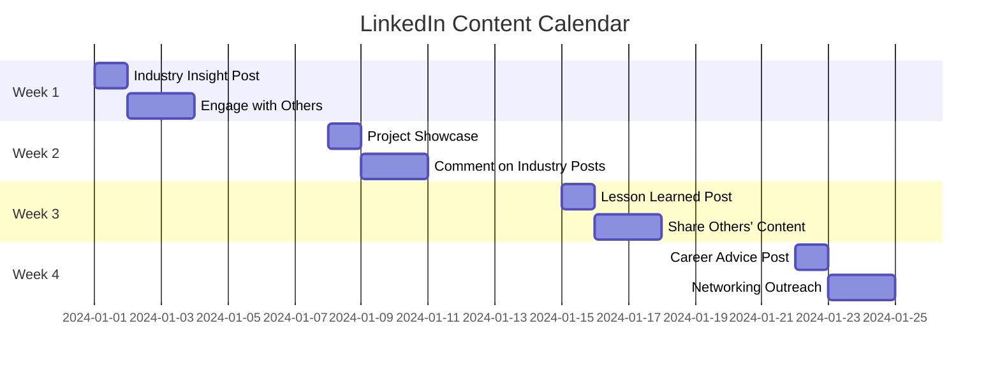
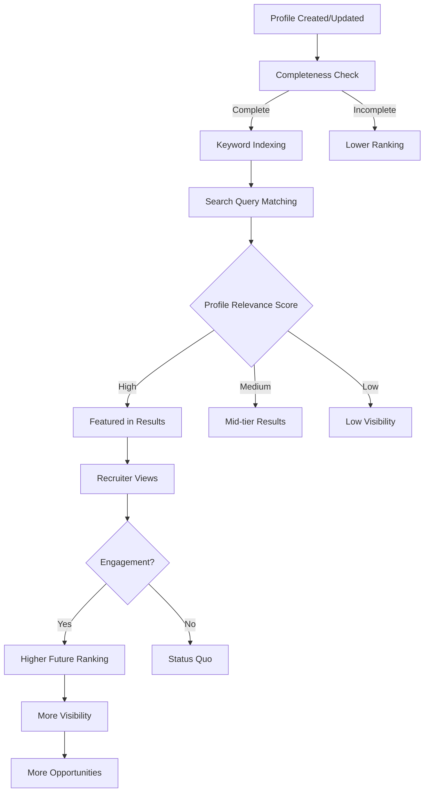
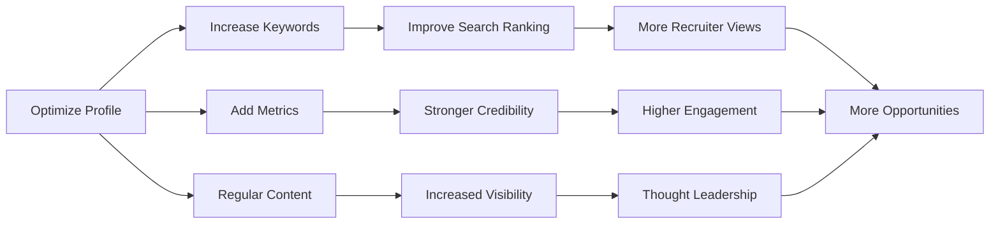

---
layout: post
title: LinkedIn Profile Optimization
categories: Getting Started
tags: [LinkedIn, Interview Preparation]
date: 2024-01-05
toc: true
---

## Introduction

**What is LinkedIn Profile Optimization?**
LinkedIn profile optimization is the strategic process of crafting and refining your LinkedIn presence to maximize visibility, credibility, and engagement from recruiters, hiring managers, and professional connections. It involves optimizing every section of your profile to align with your career goals and attract the right opportunities.

**Why Does it Matter for Interviews?**
LinkedIn optimization matters because:
- 87% of recruiters use LinkedIn to find candidates
- Recruiters spend 6 seconds scanning LinkedIn profiles (similar to resumes)
- An optimized profile appears higher in recruiter searches
- It provides social proof through endorsements and recommendations
- It serves as a living, updatable resume
- It enables networking and relationship building
- It demonstrates digital presence and personal branding

**The LinkedIn Ecosystem:**
LinkedIn is not just a job board - it's a professional network where relationships, content, and visibility compound over time. Optimization isn't a one-time task but an ongoing strategy.

---

## Learning Roadmap

### Mermaid Diagram



### Optimization Timeline

| Phase | Duration | Activities | Expected Outcome |
|-------|----------|------------|------------------|
| Audit | 1-2 days | Review current profile, identify gaps | Baseline assessment |
| Foundation | 1 week | Optimize core sections (headline, about, experience) | Improved search ranking |
| Social Proof | 1-2 weeks | Gather endorsements and recommendations | Increased credibility |
| Content | Ongoing | Regular posting and engagement | Enhanced visibility |
| Networking | Ongoing | Strategic connections and interactions | Expanded reach |
| Maintenance | Monthly | Updates, fresh content, analytics review | Sustained growth |

---

## Theory Notes

### LinkedIn Algorithm Understanding

**How LinkedIn Ranks Profiles:**
1. **Profile Completeness**: Complete profiles rank higher
2. **Keyword Relevance**: Matching search terms in your profile
3. **Engagement**: Activity on the platform (posts, comments, shares)
4. **Connection Quality**: Connections with industry professionals
5. **Recency**: Recently updated profiles get visibility boosts
6. **Content Quality**: Original content performs better than shares

**Search Ranking Factors:**
- Headline keywords (highest weight)
- About section keywords
- Experience section keywords
- Skills endorsements
- Recommendations
- Profile photo quality
- Connection relevance

### Headline Writing Frameworks

**The Formula Approach:**
[Current Role] | [Key Skills] | [Value Proposition] | [Industry Keywords]

**Examples:**
- "Senior Software Engineer | Python, AWS, Microservices | Building Scalable Systems"
- "Product Manager | User Research, Agile, Data-Driven | Fintech & Payments"
- "UX Designer | User Research, Figma, Design Systems | Human-Centered Design"

**The Value Proposition Approach:**
[What you do] + [Who you help] + [Outcome/Result]

**Examples:**
- "Helping startups build MVPs that secure Series A funding"
- "Transforming complex data into actionable business insights"
- "Designing user experiences that increase conversion by 40%"

### About Section Structure

**The Narrative Arc:**
1. **Hook**: Opening statement that captures attention
2. **Story**: Your professional journey and motivations
3. **Expertise**: Key skills and accomplishments
4. **Value**: What you bring to potential employers
5. **Call to Action**: How to connect with you

**Template:**
```
[Opening hook - who you are and what drives you]

[Professional story - your journey and key experiences]

[Core expertise - what you're known for, with quantified achievements]

[Current focus - what you're working on or looking for]

[Call to action - how to reach you and what you're open to]
```

### Experience Section Optimization

**The XYZ Formula for Bullet Points:**
Accomplished [X] as measured by [Y] by doing [Z]

**Strong Bullet Point Structure:**
- Action verb + What you did + Measurable result + Impact/business context

**Weak vs. Strong Examples:**
- Weak: "Responsible for managing social media accounts"
- Strong: "Grew social media following by 150% in 6 months, generating 50K+ monthly impressions"

### Skills & Endorsements Strategy

**Top 3 Skills (Most Important):**
- These appear prominently on your profile
- Choose skills most relevant to your target role
- Get endorsements from colleagues who've seen you use these skills

**Skills Selection Strategy:**
1. Research job descriptions for target roles
2. Identify most frequently mentioned skills
3. Prioritize skills with highest demand
4. Include both technical and soft skills
5. Update skills based on industry trends

### Recommendations Best Practices

**Getting Quality Recommendations:**
- Ask specific people who can speak to specific skills
- Provide context about what you'd like them to highlight
- Offer to write recommendations in return
- Diverse recommenders (managers, peers, clients)

**Writing Recommendations for Others:**
- Be specific about their contributions
- Include measurable results
- Highlight unique qualities
- Use professional, genuine tone

---

## Key Concepts

| Concept | Definition | LinkedIn Impact |
|---------|------------|-----------------|
| Keywords | Terms recruiters search for | Determines search visibility |
| Headline | 220-character profile title | First impression, highest SEO weight |
| About Section | Professional summary | Tells your story and value proposition |
| Experience | Work history with descriptions | Demonstrates skills and achievements |
| Endorsements | Peer validation of skills | Increases credibility |
| Recommendations | Written testimonials | Social proof of abilities |
| Featured Section | Highlighted work samples | Showcases best work prominently |
| Custom URL | Personalized profile link | Professional appearance |
| Content Strategy | Regular posting and engagement | Builds visibility and authority |
| Networking | Strategic connection building | Expands reach and opportunities |

---

## Frequently Asked Interview Questions

### Beginner Level

1. **Q: Why should I optimize my LinkedIn profile?**
   A: LinkedIn optimization increases your visibility to recruiters, demonstrates professionalism, and provides a platform to showcase your work. 87% of recruiters use LinkedIn to find candidates, so an optimized profile directly impacts your job search success.

2. **Q: What's the most important section to optimize first?**
   A: Your headline is the most critical section. It appears in search results, messages, and comments. Use relevant keywords and clearly communicate your value proposition. Recruiters often decide to click on your profile based solely on your headline.

3. **Q: How often should I update my LinkedIn profile?**
   A: Update your profile whenever you have new achievements, skills, or experiences. At minimum, review and refresh every 3-6 months. Regular updates signal to the algorithm that your profile is active and current.

4. **Q: Should I use a professional photo or can I use a casual one?**
   A: Use a professional headshot. Profiles with photos receive 21x more views and 36x more messages. The photo should be well-lit, have a neutral background, and show you looking approachable and professional.

5. **Q: How important are LinkedIn recommendations?**
   A: Very important. Recommendations provide social proof of your abilities from people who've worked with you. They add credibility and help recruiters understand how you work with others. Aim for 3-5 quality recommendations.

### Intermediate Level

6. **Q: How do I write an effective LinkedIn headline?**
   A: Include relevant keywords recruiters search for, clearly state your value proposition, and differentiate yourself. Use the format: [Role] | [Key Skills] | [Value Proposition]. Keep it under 220 characters and avoid generic phrases.

7. **Q: What should I include in my About section?**
   A: Start with a compelling hook, tell your professional story, highlight key achievements with metrics, explain what you're looking for, and include a call to action. Use first person, be authentic, and optimize for both readability and keywords.

8. **Q: How do I get more LinkedIn endorsements?**
   A: First, endorse others generously - they'll often reciprocate. Ask specific colleagues to endorse specific skills. Make it easy by suggesting which skills to endorse. Ensure your skills list matches what recruiters in your field search for.

9. **Q: Should I post content on LinkedIn?**
   A: Yes, regular posting significantly increases visibility. Share industry insights, original thoughts, project updates, and lessons learned. Consistent posting (2-3 times per week) builds your professional brand and keeps you top of mind.

10. **Q: How do I handle the "Open to Work" feature?**
    A: Use it strategically. "Open to Work" visible only to recruiters (recommended) keeps your search private. Public "Open to Work" can signal urgency. Consider your situation - if currently employed, keep it private.

### Advanced Level

11. **Q: How does LinkedIn's algorithm work?**
    A: LinkedIn prioritizes content based on: relationship strength (connections), engagement probability (likes, comments, shares), content quality (original vs. reshares), and timeliness. Profiles with regular activity, complete information, and quality connections rank higher in searches.

12. **Q: How do I optimize for recruiter searches?**
    A: Research what keywords recruiters in your field use. Include these in your headline, about, experience, and skills sections. Use industry-specific terminology. Keep your profile "Open to Work" status visible to recruiters. Engage with relevant content.

13. **Q: What's the best networking strategy on LinkedIn?**
    A: Focus on quality over quantity. Connect with people you've actually worked with or met. Personalize connection requests. Engage meaningfully with others' content before asking for favors. Build relationships before you need them.

14. **Q: How do I use LinkedIn for company research before interviews?**
    A: Research the company page, employee profiles, recent posts, and culture. Look up your interviewers. Understand their current focus and challenges. This helps you tailor your application and ask informed questions.

15. **Q: How do I measure LinkedIn profile success?**
    A: Track: profile views (weekly), search appearances, post impressions, connection requests received, recruiter messages, and engagement on your content. LinkedIn provides analytics for most of these metrics.

### FAANG Level

16. **Q: How do FAANG recruiters use LinkedIn differently?**
    A: FAANG recruiters often use LinkedIn for passive candidate sourcing, looking beyond job applicants. They search for specific skills, company backgrounds, and project experience. They value demonstrated impact, technical depth, and cultural alignment.

17. **Q: What makes a LinkedIn profile stand out to FAANG recruiters?**
    A: Specific project details with metrics, contributions to well-known projects, technical blog posts or open source work, recommendations from respected professionals, and alignment with company values. Generic profiles get lost.

18. **Q: How should I tailor my LinkedIn for FAANG applications?**
    A: Highlight impact at scale, demonstrate technical depth, show collaborative work, include metrics that matter to tech companies (users, performance, scale), and align your summary with company mission/values.

19. **Q: How important is LinkedIn activity for FAANG hiring?**
    A: While not required, active LinkedIn presence demonstrates passion for technology and industry engagement. Technical blog posts, open source contributions, and thoughtful industry commentary can differentiate you from other qualified candidates.

20. **Q: Can LinkedIn help with internal transfers at FAANG?**
    A: Absolutely. LinkedIn helps you: research internal roles, connect with employees in target teams, understand team culture, find referral opportunities, and demonstrate your growth within the company through profile updates.

---

## Hands-on Practice

### Exercise 1: Profile Audit
Review your current LinkedIn profile and score each section:
- Headline: Does it include keywords and value proposition?
- About: Is it compelling and optimized?
- Experience: Are achievements quantified?
- Skills: Do they match target role requirements?
- Photo: Is it professional and current?
- URL: Is it customized?

### Exercise 2: Keyword Research
Analyze 5 job descriptions for your target role:
1. Extract frequently mentioned skills and keywords
2. List these keywords by frequency
3. Ensure each appears in your profile
4. Prioritize the top 10 keywords for optimization

### Exercise 3: Headline A/B Testing
Create 3 different headline variations:
1. Role-focused: "Software Engineer | Python, AWS"
2. Value-focused: "Building scalable systems that handle 1M+ users"
3. Results-focused: "Engineer who reduced costs by 30% through optimization"
Test which generates more profile views over 2 weeks.

### Exercise 4: About Section Rewrite
Rewrite your About section using the narrative arc:
1. Hook (1-2 sentences)
2. Story (2-3 sentences)
3. Expertise (2-3 bullet points)
4. Value proposition (1-2 sentences)
5. Call to action (1 sentence)

### Exercise 5: Experience Quantification
Take 5 bullet points from your experience section and add metrics:
- "Managed team" → "Led team of 8 engineers, delivering 3 major releases on time"
- "Improved performance" → "Optimized API response time from 500ms to 100ms, reducing user churn by 15%"
- "Increased sales" → "Drove $500K in new revenue through strategic partnerships"

### Exercise 6: Recommendation Request Campaign
Identify 5 people who could write quality recommendations:
1. Former managers
2. Cross-functional collaborators
3. Clients or customers
4. Peers who've seen your work
Send personalized requests highlighting specific achievements.

### Exercise 7: Content Strategy Plan
Create a 4-week content calendar:
- Week 1: Industry insight post
- Week 2: Project showcase or case study
- Week 3: Lesson learned or career advice
- Week 4: Engage with others' content (comment, share)

### Exercise 8: Profile Analytics Review
Check your LinkedIn analytics and note:
- Profile views this month vs. last month
- Search appearances and top keywords
- Post impressions and engagement
- Connection growth rate
Set goals for improvement in each area.

### Exercise 9: Featured Section Optimization
Add 3-5 items to your Featured section:
1. Best project or case study
2. Published article or blog post
3. Presentation or slide deck
4. Media mention or award
5. Portfolio or website link

### Exercise 10: Networking Outreach
Identify 10 professionals in your target companies:
1. Review their profiles for commonalities
2. Send personalized connection requests
3. Engage with their content before connecting
4. Follow up with meaningful interaction

---

## Real FAANG Interview Questions

| Company | Question | Difficulty |
|---------|----------|------------|
| Google | How would you improve LinkedIn's recommendation algorithm? | Advanced |
| Amazon | What metrics would you track for LinkedIn profile effectiveness? | Intermediate |
| Facebook | How does LinkedIn's content algorithm work? | Advanced |
| Apple | What makes a LinkedIn profile stand out in creative industries? | Intermediate |
| Netflix | How would you design LinkedIn's "Open to Work" feature? | Advanced |
| Microsoft | What's the ideal LinkedIn headline structure? | Beginner |
| Google | How would you combat fake profiles on LinkedIn? | Advanced |
| Amazon | How do LinkedIn endorsements impact hiring decisions? | Intermediate |
| Facebook | What features would you add to LinkedIn for job seekers? | Advanced |
| Apple | How does LinkedIn Premium impact the job search? | Beginner |
| Netflix | How would you improve LinkedIn's messaging system? | Advanced |
| Microsoft | What role does LinkedIn play in enterprise sales? | Intermediate |
| Google | How does LinkedIn balance user privacy with recruiter access? | Advanced |
| Amazon | How would you measure LinkedIn's impact on hiring outcomes? | Intermediate |
| Facebook, Apple | What's the future of professional networking? | Advanced |
| All FAANG | How would you redesign LinkedIn's search functionality? | Advanced |
| Google | How does LinkedIn's algorithm handle career changers? | Intermediate |
| Amazon | What would you change about LinkedIn's job matching? | Intermediate |
| Microsoft | How does LinkedIn Learning impact professional development? | Beginner |
| Netflix | How would you build professional communities on LinkedIn? | Advanced |

---

## Common Mistakes

| Mistake | Why It's Bad | How to Fix |
|---------|--------------|------------|
| Generic headline | Gets lost in searches | Include specific keywords and value proposition |
| No profile photo | 21x fewer views | Add professional headshot |
| Incomplete profile | Lower search ranking | Complete all sections thoroughly |
| Keyword stuffing | Looks spammy, reduces readability | Use keywords naturally throughout |
| No recommendations | Lacks social proof | Request recommendations from colleagues |
| Passive activity | Low visibility | Regular posting and engagement |
| Outdated information | Appears inactive | Update every 3-6 months |
| No custom URL | Unprofessional appearance | Customize your LinkedIn URL |
| Ignoring analytics | Missed optimization opportunities | Review metrics monthly |
| Connection spam | Dilutes network quality | Connect intentionally with relevant people |
| No Featured section | Missed showcase opportunity | Highlight best work samples |
| Generic connection requests | Low acceptance rate | Personalize every request |

---

## Best Practices

1. **Optimize Your Headline**: Include keywords and value proposition in 220 characters
2. **Write a Compelling About**: Tell your story with authenticity and metrics
3. **Use a Professional Photo**: Headshot with good lighting and neutral background
4. **Quantify Experience**: Add metrics to every achievement
5. **Get Recommendations**: Aim for 3-5 quality recommendations
6. **Endorse Strategically**: Endorse others to encourage reciprocity
7. **Customize Your URL**: Create a clean, professional profile link
8. **Post Regularly**: Share insights 2-3 times per week
9. **Engage Authentically**: Comment meaningfully on others' content
10. **Research Keywords**: Use terms recruiters actually search for
11. **Feature Your Best Work**: Showcase top projects in Featured section
12. **Keep It Updated**: Refresh profile with new achievements
13. **Network Intentionally**: Connect with relevant industry professionals
14. **Use All Sections**: Complete education, certifications, volunteer experience
15. **Monitor Analytics**: Track profile views and search appearances

---

## Cheat Sheet

```
╔══════════════════════════════════════════════════════════════╗
║                LINKEDIN OPTIMIZATION CHEAT SHEET             ║
╠══════════════════════════════════════════════════════════════╣
║                                                              ║
║  HEADLINE FORMULA (220 chars):                               ║
║  [Role] | [Key Skills] | [Value Proposition]                 ║
║  Example: Senior PM | User Research, Analytics | Building    ║
║  Products Users Love                                         ║
║                                                              ║
║  ABOUT SECTION STRUCTURE:                                    ║
║  1. Hook: Who you are + what drives you                      ║
║  2. Story: Professional journey                              ║
║  3. Expertise: Key skills + quantified achievements          ║
║  4. Focus: Current goals/interests                           ║
║  5. CTA: How to connect                                      ║
║                                                              ║
║  EXPERIENCE BULLET FORMULA:                                  ║
║  [Action Verb] + [What You Did] + [Measurable Result]        ║
║  Example: Led migration to cloud, reducing costs by 30%      ║
║                                                              ║
║  PHOTO CHECKLIST:                                            ║
║  ✓ Professional headshot                                     ║
║  ✓ Good lighting, neutral background                         ║
║  ✓ Approachable expression                                   ║
║  ✓ Current appearance                                        ║
║  ✓ High resolution (400x400 px minimum)                      ║
║                                                              ║
║  CONTENT STRATEGY:                                           ║
║  • Post 2-3 times per week                                   ║
║  • Share industry insights                                   ║
║  • Showcase projects/case studies                            ║
║  • Engage with others' content                               ║
║  • Be authentic and consistent                               ║
║                                                              ║
║  KEY METRICS TO TRACK:                                       ║
║  • Profile views (weekly)                                    ║
║  • Search appearances                                        ║
║  • Post impressions                                          ║
║  • Connection requests received                              ║
║  • Recruiter messages                                        ║
║                                                              ║
╚══════════════════════════════════════════════════════════════╝
```

---

## Flash Cards

| # | Question | Answer |
|---|----------|--------|
| 1 | What is LinkedIn profile optimization? | Strategic crafting of profile to maximize visibility and credibility |
| 2 | Why is headline important? | Highest SEO weight, first impression, appears in searches |
| 3 | How long should headline be? | Under 220 characters |
| 4 | What's the XYZ formula? | Accomplished X as measured by Y by doing Z |
| 5 | How many recommendations ideal? | 3-5 quality recommendations |
| 6 | What's the Open to Work feature? | Signals job search status to recruiters |
| 7 | How often post on LinkedIn? | 2-3 times per week for visibility |
| 8 | What photo should you use? | Professional headshot with neutral background |
| 9 | How do you get endorsements? | Endorse others, ask specific colleagues |
| 10 | What is Featured section? | Highlighted work samples at top of profile |
| 11 | Should you customize LinkedIn URL? | Yes - creates professional appearance |
| 12 | What keywords to use? | Terms recruiters in your field search for |
| 13 | How measure profile success? | Profile views, search appearances, engagement |
| 14 | What content performs best? | Original insights, project showcases, lessons learned |
| 15 | How often update profile? | Every 3-6 months or after achievements |
| 16 | Should you use first person in About? | Yes - more authentic and engaging |
| 17 | What's LinkedIn algorithm prioritize? | Completeness, keywords, engagement, recency |
| 18 | How important is networking? | Critical - relationships compound over time |
| 19 | What's LinkedIn Premium benefit? | InMail, profile insights, learning courses |
| 20 | How optimize for recruiter searches? | Use relevant keywords throughout profile |

---

## Mind Map

```
LinkedIn Optimization
├── Profile Sections
│   ├── Headline
│   │   ├── Keywords
│   │   ├── Value Proposition
│   │   └── Call to Action
│   ├── About/Summary
│   │   ├── Hook
│   │   ├── Story
│   │   ├── Expertise
│   │   └── CTA
│   ├── Experience
│   │   ├── Achievements
│   │   ├── Metrics
│   │   └── Skills
│   ├── Skills & Endorsements
│   │   ├── Top 3 Skills
│   │   ├── Endorsement Strategy
│   │   └── Skill Updates
│   ├── Recommendations
│   │   ├── Request Strategy
│   │   ├── Quality over Quantity
│   │   └── Diverse Sources
│   └── Featured Section
│       ├── Best Work
│       ├── Case Studies
│       └── Media
├── Content Strategy
│   ├── Regular Posting
│   ├── Industry Insights
│   ├── Project Showcases
│   └── Engagement
├── Networking
│   ├── Strategic Connections
│   ├── Relationship Building
│   └── Community Engagement
├── Analytics
│   ├── Profile Views
│   ├── Search Appearances
│   ├── Post Performance
│   └── Connection Growth
└── Optimization
    ├── Keyword Research
    ├── A/B Testing
    ├── Regular Updates
    └── Algorithm Understanding
```

---

## Mermaid Diagrams

### LinkedIn Profile Structure



### Content Strategy Calendar



### LinkedIn Algorithm Flow



### Optimization Impact Flow



---

## Code Examples

### Python: LinkedIn Profile Analyzer

```python
import re
from typing import List, Dict, Tuple
from dataclasses import dataclass, field

@dataclass
class LinkedInProfile:
    headline: str
    about: str
    experience: List[Dict]
    skills: List[str]
    recommendations: int
    connections: int
    profile_photo: bool = True
    custom_url: bool = False
    featured_items: int = 0
    education: List[Dict] = field(default_factory=list)

class LinkedInOptimizer:
    def __init__(self):
        self.score_breakdown = {}
        self.suggestions = []
    
    def analyze_profile(self, profile: LinkedInProfile) -> Tuple[float, List[str]]:
        scores = {}
        
        # Headline optimization (20% weight)
        headline_score = self._analyze_headline(profile.headline)
        scores['headline'] = headline_score
        
        # About section (20% weight)
        about_score = self._analyze_about(profile.about)
        scores['about'] = about_score
        
        # Experience section (25% weight)
        experience_score = self._analyze_experience(profile.experience)
        scores['experience'] = experience_score
        
        # Skills and endorsements (15% weight)
        skills_score = self._analyze_skills(profile.skills)
        scores['skills'] = skills_score
        
        # Social proof (10% weight)
        social_score = self._analyze_social_proof(profile)
        scores['social_proof'] = social_score
        
        # Profile completeness (10% weight)
        completeness_score = self._analyze_completeness(profile)
        scores['completeness'] = completeness_score
        
        # Calculate total score
        total_score = (
            headline_score * 0.20 +
            about_score * 0.20 +
            experience_score * 0.25 +
            skills_score * 0.15 +
            social_score * 0.10 +
            completeness_score * 0.10
        )
        
        self.score_breakdown = scores
        self._generate_suggestions(profile, scores)
        
        return total_score, self.suggestions
    
    def _analyze_headline(self, headline: str) -> float:
        score = 0
        max_score = 100
        
        # Check length (optimal: 150-200 characters)
        length = len(headline)
        if 150 <= length <= 200:
            score += 25
        elif 100 <= length <= 150:
            score += 15
        elif length > 200:
            score += 10
        else:
            score += 5
        
        # Check for keywords (pipe separators often indicate structured headline)
        if '|' in headline:
            score += 25
        
        # Check for action words
        action_words = ['building', 'leading', 'driving', 'creating', 'developing']
        if any(word in headline.lower() for word in action_words):
            score += 25
        
        # Check for metrics or numbers
        if re.search(r'\d+', headline):
            score += 25
        
        return min(score, max_score)
    
    def _analyze_about(self, about: str) -> float:
        score = 0
        max_score = 100
        
        # Check length (optimal: 1500-2000 characters)
        length = len(about)
        if 1500 <= length <= 2000:
            score += 30
        elif 1000 <= length <= 1500:
            score += 20
        elif length > 2000:
            score += 15
        else:
            score += 5
        
        # Check for first person (more engaging)
        first_person_words = ['I', 'me', 'my', "I've", "I'm"]
        if any(word in about.split() for word in first_person_words):
            score += 20
        
        # Check for metrics
        if re.search(r'\d+[%$KkMm]', about):
            score += 25
        
        # Check for line breaks (readability)
        if '\n' in about:
            score += 15
        
        # Check for call to action
        cta_words = ['contact', 'reach out', 'connect', 'email', 'message']
        if any(word in about.lower() for word in cta_words):
            score += 10
        
        return min(score, max_score)
    
    def _analyze_experience(self, experience: List[Dict]) -> float:
        if not experience:
            return 0
        
        score = 0
        max_score = 100
        
        # Check number of roles (3-5 is ideal)
        num_roles = len(experience)
        if 3 <= num_roles <= 5:
            score += 25
        elif num_roles > 5:
            score += 20
        else:
            score += 10
        
        # Check for quantified achievements
        quantified_count = 0
        for role in experience:
            description = role.get('description', '')
            if re.search(r'\d+[%$KkMm]', description):
                quantified_count += 1
        
        if num_roles > 0:
            quantified_ratio = quantified_count / num_roles
            score += int(quantified_ratio * 40)
        
        # Check for action verbs
        action_verbs = ['led', 'managed', 'developed', 'implemented', 'improved', 'increased']
        verb_count = sum(1 for role in experience 
                        if any(verb in role.get('description', '').lower() for verb in action_verbs))
        
        if num_roles > 0:
            verb_ratio = verb_count / num_roles
            score += int(verb_ratio * 35)
        
        return min(score, max_score)
    
    def _analyze_skills(self, skills: List[str]) -> float:
        score = 0
        max_score = 100
        
        # Check number of skills (optimal: 10-20)
        num_skills = len(skills)
        if 10 <= num_skills <= 20:
            score += 50
        elif 5 <= num_skills <= 10:
            score += 30
        elif num_skills > 20:
            score += 20
        else:
            score += 10
        
        # Check for keyword relevance (simplified)
        # In real implementation, would compare against job descriptions
        if num_skills > 0:
            score += 50  # Base score for having skills
        
        return min(score, max_score)
    
    def _analyze_social_proof(self, profile: LinkedInProfile) -> float:
        score = 0
        max_score = 100
        
        # Recommendations (up to 40 points)
        recs = profile.recommendations
        if recs >= 5:
            score += 40
        elif recs >= 3:
            score += 30
        elif recs >= 1:
            score += 20
        
        # Connections (up to 30 points)
        connections = profile.connections
        if connections >= 500:
            score += 30
        elif connections >= 200:
            score += 20
        elif connections >= 100:
            score += 10
        
        # Featured items (up to 30 points)
        featured = profile.featured_items
        if featured >= 3:
            score += 30
        elif featured >= 1:
            score += 15
        
        return min(score, max_score)
    
    def _analyze_completeness(self, profile: LinkedInProfile) -> float:
        score = 0
        max_score = 100
        
        sections = [
            ('headline', bool(profile.headline)),
            ('about', bool(profile.about)),
            ('experience', len(profile.experience) > 0),
            ('skills', len(profile.skills) > 0),
            ('education', len(profile.education) > 0),
            ('profile_photo', profile.profile_photo),
            ('custom_url', profile.custom_url)
        ]
        
        completed = sum(1 for _, exists in sections if exists)
        score = int((completed / len(sections)) * max_score)
        
        return score
    
    def _generate_suggestions(self, profile: LinkedInProfile, scores: Dict):
        self.suggestions = []
        
        if scores['headline'] < 70:
            self.suggestions.append("Optimize headline with keywords and value proposition")
        
        if scores['about'] < 70:
            self.suggestions.append("Improve About section with metrics and call to action")
        
        if scores['experience'] < 70:
            self.suggestions.append("Quantify achievements in experience section")
        
        if scores['skills'] < 70:
            self.suggestions.append("Add more relevant skills (aim for 10-20)")
        
        if scores['social_proof'] < 70:
            self.suggestions.append("Request recommendations from colleagues")
        
        if not profile.custom_url:
            self.suggestions.append("Customize your LinkedIn URL")
        
        if profile.featured_items < 3:
            self.suggestions.append("Add work samples to Featured section")
    
    def generate_report(self, score: float, suggestions: List[str]) -> str:
        report = f"""
═══════════════════════════════════════════════════════════════
                 LINKEDIN PROFILE ANALYSIS
═══════════════════════════════════════════════════════════════

OVERALL SCORE: {score:.1f}/100
{'█' * int(score/5)}{'░' * (20 - int(score/5))} {score:.1f}%

SECTION SCORES:
───────────────────────────────────────────────────────────────"""
        
        for section, score_val in self.score_breakdown.items():
            bar = '█' * int(score_val / 5) + '░' * (20 - int(score_val / 5))
            report += f"\n{section.replace('_', ' ').title():20} {bar} {score_val:.1f}/100"
        
        report += "\n\nRECOMMENDATIONS:"
        report += "\n" + "─" * 63
        
        for i, suggestion in enumerate(suggestions, 1):
            report += f"\n{i}. {suggestion}"
        
        report += "\n\n" + "=" * 63
        return report


# Example usage
if __name__ == "__main__":
    # Create sample profile
    profile = LinkedInProfile(
        headline="Senior Software Engineer | Python, AWS, Microservices | Building Scalable Systems",
        about="""
I'm a passionate software engineer with 7+ years of experience building scalable systems that serve millions of users.

Throughout my career, I've led teams in developing cloud-native applications, implementing microservices architectures, and optimizing system performance. At TechCorp, I led a team of 8 engineers to rebuild our core platform, reducing latency by 60% and handling 10x more traffic.

My technical expertise includes Python, AWS, Docker, Kubernetes, and distributed systems. I'm particularly interested in system design, performance optimization, and developer tooling.

Currently, I'm focused on building next-generation cloud infrastructure at ScaleUp Inc. I'm always open to connecting with fellow engineers and discussing technical challenges.

Let's connect! You can reach me at engineer@example.com
        """,
        experience=[
            {
                "title": "Senior Software Engineer",
                "company": "ScaleUp Inc",
                "description": "Leading development of cloud infrastructure. Reduced deployment time by 75% through CI/CD improvements. Managed team of 5 engineers."
            },
            {
                "title": "Software Engineer",
                "company": "TechCorp",
                "description": "Led platform rebuild reducing latency by 60%. Implemented microservices architecture serving 1M+ users daily."
            },
            {
                "title": "Junior Developer",
                "company": "StartupXYZ",
                "description": "Developed core features for MVP. Collaborated with cross-functional team of 10."
            }
        ],
        skills=["Python", "AWS", "Docker", "Kubernetes", "Microservices", "CI/CD", "Git", "SQL", "REST APIs", "System Design"],
        recommendations=4,
        connections=850,
        profile_photo=True,
        custom_url=True,
        featured_items=3,
        education=[{"degree": "BS Computer Science", "school": "State University"}]
    )
    
    # Analyze profile
    optimizer = LinkedInOptimizer()
    score, suggestions = optimizer.analyze_profile(profile)
    
    # Generate report
    print(optimizer.generate_report(score, suggestions))
```

### JavaScript: LinkedIn Content Calendar

```javascript
class LinkedInContentCalendar {
    constructor() {
        this.posts = [];
        this.topics = [];
        this.analytics = {
            postFrequency: {},
            engagementByType: {},
            topPerformingContent: []
        };
    }

    addPost(post) {
        this.posts.push({
            ...post,
            id: this.generateId(),
            createdAt: new Date().toISOString(),
            status: 'draft'
        });
        this.saveToStorage();
    }

    generateId() {
        return Math.random().toString(36).substr(2, 9);
    }

    createContentCalendar(weeks = 4) {
        const calendar = [];
        const startDate = new Date();
        
        for (let week = 0; week < weeks; week++) {
            const weekStart = new Date(startDate);
            weekStart.setDate(weekStart.getDate() + (week * 7));
            
            const weekPlan = {
                week: week + 1,
                startDate: weekStart.toISOString().split('T')[0],
                posts: this.planWeekPosts(weekStart)
            };
            
            calendar.push(weekPlan);
        }
        
        return calendar;
    }

    planWeekPosts(weekStart) {
        const postTypes = [
            { day: 1, type: 'industry-insight', topic: 'Trending Industry Topic' },
            { day: 3, type: 'project-showcase', topic: 'Recent Project or Case Study' },
            { day: 5, type: 'lesson-learned', topic: 'Career Advice or Insight' }
        ];
        
        return postTypes.map(post => {
            const postDate = new Date(weekStart);
            postDate.setDate(postDate.getDate() + post.day - 1);
            
            return {
                ...post,
                date: postDate.toISOString().split('T')[0],
                content: this.generatePostTemplate(post.type),
                status: 'scheduled'
            };
        });
    }

    generatePostTemplate(type) {
        const templates = {
            'industry-insight': {
                hook: "Interesting trend in [industry]...",
                body: "Here's what I've noticed: [insight]\n\nWhy this matters: [explanation]\n\nWhat do you think?",
                hashtags: ['#industry', '#trends', '#professional']
            },
            'project-showcase': {
                hook: "Just shipped [project]! Here's what we learned:",
                body: "The challenge: [problem]\nOur approach: [solution]\nResults: [metrics]\n\nKey takeaway: [lesson]",
                hashtags: ['#project', '#development', '#teamwork']
            },
            'lesson-learned': {
                hook: "One thing I wish I knew earlier in my career:",
                body: "[lesson]\n\nHere's why: [explanation]\n\nHow this helped: [example]\n\nWhat's your experience?",
                hashtags: ['#career', '#growth', '#lessons']
            }
        };
        
        return templates[type] || templates['industry-insight'];
    }

    trackEngagement(postId, engagement) {
        const post = this.posts.find(p => p.id === postId);
        if (post) {
            post.engagement = {
                likes: engagement.likes || 0,
                comments: engagement.comments || 0,
                shares: engagement.shares || 0,
                impressions: engagement.impressions || 0
            };
            this.saveToStorage();
        }
    }

    getAnalytics() {
        const totalPosts = this.posts.length;
        const totalEngagement = this.posts.reduce((sum, post) => {
            const eng = post.engagement || {};
            return sum + (eng.likes || 0) + (eng.comments || 0) + (eng.shares || 0);
        }, 0);
        
        const avgEngagement = totalPosts > 0 ? totalEngagement / totalPosts : 0;
        
        const topPosts = [...this.posts]
            .sort((a, b) => {
                const engA = (a.engagement?.likes || 0) + (a.engagement?.comments || 0);
                const engB = (b.engagement?.likes || 0) + (b.engagement?.comments || 0);
                return engB - engA;
            })
            .slice(0, 5);
        
        return {
            totalPosts,
            totalEngagement,
            avgEngagement: avgEngagement.toFixed(1),
            topPosts,
            postFrequency: this.calculatePostFrequency()
        };
    }

    calculatePostFrequency() {
        const frequency = {};
        this.posts.forEach(post => {
            const date = post.createdAt.split('T')[0];
            frequency[date] = (frequency[date] || 0) + 1;
        });
        return frequency;
    }

    generateReport() {
        const analytics = this.getAnalytics();
        
        return `
═══════════════════════════════════════════════════════════════
              LINKEDIN CONTENT CALENDAR REPORT
═══════════════════════════════════════════════════════════════

CONTENT SUMMARY
───────────────────────────────────────────────────────────────
Total Posts: ${analytics.totalPosts}
Total Engagement: ${analytics.totalEngagement}
Average Engagement per Post: ${analytics.avgEngagement}

TOP PERFORMING POSTS
───────────────────────────────────────────────────────────────
${analytics.topPosts.map((post, i) => 
    `${i + 1}. [${post.createdAt.split('T')[0]}] ${post.type || 'Unknown'}
   Likes: ${post.engagement?.likes || 0} | Comments: ${post.engagement?.comments || 0}`
).join('\n\n') || 'No posts yet'}

POSTING FREQUENCY
───────────────────────────────────────────────────────────────
${Object.entries(analytics.postFrequency).map(([date, count]) => 
    `${date}: ${count} post(s)`
).join('\n') || 'No posting history'}

RECOMMENDATIONS
───────────────────────────────────────────────────────────────
${analytics.totalPosts < 8 ? '• Increase posting frequency to 2-3 times per week' : '• Maintain current posting frequency'}
${analytics.avgEngagement < 10 ? '• Focus on more engaging content types' : '• Continue with current content strategy'}
`;
    }

    saveToStorage() {
        localStorage.setItem('linkedinCalendar', JSON.stringify({
            posts: this.posts,
            topics: this.topics
        }));
    }

    loadFromStorage() {
        const saved = localStorage.getItem('linkedinCalendar');
        if (saved) {
            const data = JSON.parse(saved);
            this.posts = data.posts || [];
            this.topics = data.topics || [];
        }
    }
}

// Usage example
const calendar = new LinkedInContentCalendar();
calendar.loadFromStorage();

// Add sample posts
calendar.addPost({
    type: 'industry-insight',
    content: {
        hook: "AI is transforming software development...",
        body: "Here's what I've noticed: AI tools are becoming essential for productivity.\n\nWhy this matters: Developers who embrace AI are 40% more productive.\n\nWhat do you think?",
        hashtags: ['#AI', '#softwaredevelopment', '#productivity']
    },
    engagement: { likes: 45, comments: 12, shares: 8, impressions: 1200 }
});

// Generate content calendar
const calendarPlan = calendar.createContentCalendar(4);
console.log(calendarPlan);

// Get analytics report
console.log(calendar.generateReport());
```

### Python: LinkedIn Keyword Analyzer

```python
import re
from collections import Counter
from typing import List, Dict, Tuple
from dataclasses import dataclass

@dataclass
class KeywordAnalysis:
    keyword: str
    frequency: int
    importance: float
    placement: List[str]

class LinkedInKeywordAnalyzer:
    def __init__(self):
        self.stop_words = {
            'the', 'a', 'an', 'and', 'or', 'but', 'in', 'on', 'at', 'to',
            'for', 'of', 'with', 'by', 'from', 'as', 'is', 'was', 'are',
            'were', 'been', 'be', 'have', 'has', 'had', 'do', 'does', 'did',
            'will', 'would', 'could', 'should', 'may', 'might', 'shall', 'can'
        }
    
    def extract_keywords(self, text: str) -> List[str]:
        # Remove special characters and convert to lowercase
        cleaned = re.sub(r'[^\w\s]', ' ', text.lower())
        
        # Split into words
        words = cleaned.split()
        
        # Remove stop words and short words
        keywords = [word for word in words 
                   if word not in self.stop_words and len(word) > 2]
        
        return keywords
    
    def analyze_job_description(self, jd_text: str) -> List[KeywordAnalysis]:
        keywords = self.extract_keywords(jd_text)
        keyword_counts = Counter(keywords)
        
        # Calculate importance based on frequency and position
        analyses = []
        for keyword, count in keyword_counts.most_common(50):
            # Find positions in text
            positions = [m.start() for m in re.finditer(keyword, jd_text.lower())]
            
            # Calculate importance (earlier position = higher importance)
            if positions:
                avg_position = sum(positions) / len(positions)
                text_length = len(jd_text)
                importance = 1 - (avg_position / text_length)
            else:
                importance = 0.5
            
            analyses.append(KeywordAnalysis(
                keyword=keyword,
                frequency=count,
                importance=importance,
                placement=self._categorize_placement(jd_text, keyword)
            ))
        
        return sorted(analyses, key=lambda x: (x.importance * x.frequency), reverse=True)
    
    def _categorize_placement(self, text: str, keyword: str) -> List[str]:
        placements = []
        text_lower = text.lower()
        keyword_lower = keyword.lower()
        
        # Check different sections
        sections = {
            'title': r'title[:\s]*(.*?)(?:\n|$)',
            'requirements': r'requirements?[:\s]*(.*?)(?:\n\n|$)',
            'skills': r'skills?[:\s]*(.*?)(?:\n\n|$)',
            'description': r'description[:\s]*(.*?)(?:\n\n|$)'
        }
        
        for section_name, pattern in sections.items():
            match = re.search(pattern, text, re.IGNORECASE | re.DOTALL)
            if match and keyword_lower in match.group(1).lower():
                placements.append(section_name)
        
        if not placements:
            placements.append('general')
        
        return placements
    
    def analyze_profile(self, profile_text: str, job_keywords: List[KeywordAnalysis]) -> Dict:
        profile_keywords = self.extract_keywords(profile_text)
        profile_set = set(profile_keywords)
        
        matched = []
        missing = []
        
        for jk in job_keywords:
            if jk.keyword in profile_set:
                matched.append(jk)
            else:
                missing.append(jk)
        
        match_rate = len(matched) / len(job_keywords) if job_keywords else 0
        
        return {
            'match_rate': match_rate * 100,
            'matched_keywords': matched,
            'missing_keywords': missing,
            'total_job_keywords': len(job_keywords),
            'total_profile_keywords': len(profile_set)
        }
    
    def generate_optimization_report(self, profile_text: str, jd_text: str) -> str:
        # Analyze job description
        job_keywords = self.analyze_job_description(jd_text)
        
        # Analyze profile against job keywords
        analysis = self.analyze_profile(profile_text, job_keywords)
        
        report = f"""
═══════════════════════════════════════════════════════════════
              LINKEDIN KEYWORD OPTIMIZATION REPORT
═══════════════════════════════════════════════════════════════

MATCH RATE: {analysis['match_rate']:.1f}%
{'█' * int(analysis['match_rate'] / 5)}{'░' * (20 - int(analysis['match_rate'] / 5))} {analysis['match_rate']:.1f}%

KEYWORD ANALYSIS
───────────────────────────────────────────────────────────────
Job Description Keywords: {analysis['total_job_keywords']}
Profile Keywords Found: {analysis['total_profile_keywords']}
Keywords Matched: {len(analysis['matched_keywords'])}
Keywords Missing: {len(analysis['missing_keywords'])}

TOP MATCHED KEYWORDS
───────────────────────────────────────────────────────────────"""
        
        for kw in analysis['matched_keywords'][:10]:
            report += f"\n✓ {kw.keyword} (frequency: {kw.frequency}, importance: {kw.importance:.2f})"
        
        report += "\n\nMISSING KEYWORDS (Add to Your Profile)"
        report += "\n" + "─" * 63
        
        for kw in analysis['missing_keywords'][:15]:
            placements = ', '.join(kw.placement)
            report += f"\n✗ {kw.keyword} (frequency: {kw.frequency}, found in: {placements})"
        
        report += "\n\nRECOMMENDATIONS"
        report += "\n" + "─" * 63
        
        if analysis['match_rate'] < 50:
            report += "\n• Add missing keywords naturally to your profile"
            report += "\n• Focus on headline and About section"
            report += "\n• Include keywords in experience descriptions"
        elif analysis['match_rate'] < 75:
            report += "\n• Good progress! Add remaining keywords"
            report += "\n• Ensure keywords appear in key sections"
            report += "\n• Consider adding skills section keywords"
        else:
            report += "\n• Excellent keyword coverage!"
            report += "\n• Focus on engagement and content strategy"
            report += "\n• Consider advanced optimization techniques"
        
        return report


# Example usage
if __name__ == "__main__":
    analyzer = LinkedInKeywordAnalyzer()
    
    job_description = """
    Senior Software Engineer
    
    Requirements:
    - 5+ years of experience in software development
    - Strong proficiency in Python, Java, or Go
    - Experience with AWS, Docker, Kubernetes
    - Microservices architecture experience
    - CI/CD pipeline design and implementation
    - Strong communication and teamwork skills
    - Experience with agile methodologies
    
    Nice to have:
    - Machine learning experience
    - Open source contributions
    - Technical leadership experience
    """
    
    profile_text = """
    Senior Software Engineer with 7 years of experience.
    
    Expertise in Python, AWS, and cloud architecture.
    Built scalable microservices serving millions of users.
    Implemented CI/CD pipelines and automated testing.
    Led team of 5 engineers in agile environment.
    
    Skills: Python, AWS, Docker, Kubernetes, SQL, Git
    """
    
    report = analyzer.generate_optimization_report(profile_text, job_description)
    print(report)
```

---

## Mini Project: LinkedIn Profile Optimizer

Build a tool that analyzes and optimizes LinkedIn profiles:

**Features:**
- Profile text analysis
- Keyword matching against job descriptions
- Headline optimization suggestions
- About section scoring
- Experience bullet point improvement
- Skills gap analysis

**Tech Stack:**
- Python (FastAPI backend)
- NLP for text analysis
- React frontend
- Database for storing analyses

---

## Intermediate Project: LinkedIn Content Scheduler

Build a tool to plan and schedule LinkedIn content:

**Features:**
- Content calendar view
- Post templates by type
- Engagement tracking
- Analytics dashboard
- Optimal posting time suggestions
- Hashtag recommendations

**Tech Stack:**
- React + TypeScript frontend
- Node.js backend
- MongoDB for data storage
- Chart.js for analytics visualization
- LinkedIn API integration

---

## Advanced Project: LinkedIn Networking CRM

Build a CRM for managing LinkedIn connections and relationships:

**Features:**
- Connection tracking
- Interaction logging
- Follow-up reminders
- Relationship scoring
- Outreach templates
- Pipeline visualization

**Tech Stack:**
- React frontend
- Python/Node.js backend
- PostgreSQL database
- Email/calendar integration
- Analytics dashboard

---

## Project Ideas Table

| # | Project | Difficulty | Skills Practiced | Time Estimate |
|---|---------|------------|------------------|---------------|
| 1 | Profile Keyword Analyzer | Beginner | Python, regex, NLP basics | 4-6 hours |
| 2 | Headline Generator | Beginner | Templates, string manipulation | 3-4 hours |
| 3 | Content Calendar App | Intermediate | React, state management | 1-2 weeks |
| 4 | Profile Score Calculator | Intermediate | Algorithms, data analysis | 1 week |
| 5 | Engagement Analytics Dashboard | Intermediate | React, charts, data viz | 1-2 weeks |
| 6 | Connection CRM | Advanced | Full-stack, database design | 3-4 weeks |
| 7 | Content Recommendation Engine | Advanced | ML, NLP, algorithms | 3-4 weeks |
| 8 | LinkedIn Automation Tool | Advanced | API integration, scheduling | 4-6 weeks |
| 9 | Profile A/B Testing Platform | Expert | Analytics, experimentation | 4-6 weeks |
| 10 | AI LinkedIn Coach | Expert | NLP, ML, full-stack | 6-8 weeks |

---

## Resources

### Practice Websites

| Website | Purpose | URL |
|---------|---------|-----|
| LinkedIn | Professional networking | linkedin.com |
| Shield | LinkedIn analytics | shieldapp.ai |
| Taplio | LinkedIn content tools | taplio.com |
| AuthoredUp | LinkedIn content creation | authoredup.com |
| LinkedIn Help | Official documentation | linkedin.com/help |

### Books

| Book | Author | Focus |
|------|--------|-------|
| "LinkedIn Profile Optimization for Dummies | Harrison Morgan | Complete LinkedIn guide |
| "The LinkedIn Bible" | Donna Serda | Advanced LinkedIn strategies |
| "Inbound Recruiting" | Various | Modern recruiting techniques |
| "Social Selling" | Tim Hughes | LinkedIn for sales/recruiting |

### Tools & Software

| Tool | Purpose |
|------|---------|
| LinkedIn Campaign Manager | Advertising and promotion |
| LinkedIn Learning | Skill development |
| Shield Analytics | Profile analytics |
| Taplio | Content creation |
| Canva | Visual content creation |

### Online Courses

| Course | Platform | Focus |
|--------|----------|-------|
| LinkedIn Profile Optimization | LinkedIn Learning | Complete optimization |
| Social Media Marketing | Coursera | LinkedIn strategy |
| Personal Branding | LinkedIn Learning | Professional presence |
| Content Creation | Udemy | LinkedIn content |

### YouTube Channels

| Channel | Content |
|---------|---------|
| Justin Welsh | LinkedIn content strategy |
| Vivek Bindra | Professional networking |
| Jeff Su | LinkedIn optimization |
| Linda Raynier | Career strategy |

---

## Checklist

### Profile Basics
- [ ] Professional headshot (high quality, good lighting)
- [ ] Custom LinkedIn URL
- [ ] Complete headline (220 characters, keywords, value prop)
- [ ] Comprehensive About section (1500+ characters)
- [ ] Current position with detailed description
- [ ] Education and certifications

### Content Optimization
- [ ] Keywords throughout profile
- [ ] Quantified achievements in experience
- [ ] Skills section complete (10-20 skills)
- [ ] Featured section with best work
- [ ] Volunteer experience (if applicable)
- [ ] Publications or presentations

### Social Proof
- [ ] 3+ recommendations received
- [ ] Key skills endorsed
- [ ] Active endorsements given
- [ ] Professional connections (100+)
- [ ] Industry group memberships

### Content Strategy
- [ ] Regular posting schedule (2-3x/week)
- [ ] Mix of content types
- [ ] Engagement with others' content
- [ ] Thought leadership posts
- [ ] Project showcases

### Analytics & Maintenance
- [ ] Profile views tracked
- [ ] Search appearances monitored
- [ ] Post engagement analyzed
- [ ] Profile updated quarterly
- [ ] New achievements added promptly

---

## Revision Notes

### LinkedIn Optimization Priority
1. **Headline** (highest impact) - Keywords + value proposition
2. **About Section** - Story + expertise + CTA
3. **Experience** - Quantified achievements
4. **Photo** - Professional headshot
5. **Skills** - Relevant to target role
6. **Recommendations** - Social proof
7. **Featured** - Best work samples
8. **Content** - Regular posting

### Headline Formula
**[Role] | [Key Skills] | [Value Proposition]**
Example: Senior PM | User Research, Analytics | Building Products Users Love

### About Section Structure
1. Hook (who you are + what drives you)
2. Story (professional journey)
3. Expertise (key skills + achievements)
4. Focus (current goals)
5. CTA (how to connect)

### Content Strategy
- **Frequency**: 2-3 posts per week
- **Mix**: 40% insights, 30% projects, 30% engagement
- **Best times**: Tuesday-Thursday, 8-10 AM or 12-2 PM
- **Engagement**: Comment on 5-10 posts before posting

### One-Day Optimization
- Morning: Optimize headline and About section (2 hours)
- Afternoon: Update experience with metrics (2 hours)
- Evening: Add skills, request recommendations (1 hour)

### One-Week Optimization
- Days 1-2: Complete profile audit and keyword research
- Days 3-4: Optimize core sections (headline, about, experience)
- Days 5-6: Add skills, featured section, request recommendations
- Day 7: Content strategy planning and first post

---

## Mock Interview Questions

### LinkedIn Strategy Questions

1. "How do you use LinkedIn in your job search?"

2. "Walk me through how you optimized your LinkedIn profile."

3. "What content do you typically post on LinkedIn?"

4. "How do you network effectively on LinkedIn?"

5. "What metrics do you track for your LinkedIn presence?"

### Behavioral Questions About LinkedIn Use

6. "Tell me about a time LinkedIn helped you professionally."

7. "How do you balance personal branding with authenticity?"

8. "Describe your approach to building professional relationships online."

9. "How do you handle negative feedback or criticism on LinkedIn?"

10. "What's the most valuable connection you've made through LinkedIn?"

### Technical Questions About LinkedIn

11. "How does LinkedIn's algorithm work?"

12. "What would you change about LinkedIn's features?"

13. "How would you improve LinkedIn's job matching?"

14. "What data does LinkedIn collect and how is it used?"

15. "How would you design a better recommendation system?"

---

## Difficulty Rating

| Task | Time Required | Difficulty | Impact |
|------|---------------|------------|--------|
| Optimize headline | 30 min | Easy | Very High |
| Rewrite About section | 1-2 hours | Medium | High |
| Add metrics to experience | 2-3 hours | Medium | Very High |
| Customize LinkedIn URL | 5 min | Easy | Medium |
| Request recommendations | 1 hour | Easy | High |
| Create content calendar | 2-3 hours | Medium | High |
| Build profile analyzer | 8-12 hours | Hard | Medium |
| Full profile optimization | 6-8 hours | Medium | Very High |

---

## Summary

LinkedIn profile optimization is essential for modern job searching and career development. With 87% of recruiters using LinkedIn to find candidates, a well-optimized profile directly impacts your career opportunities.

**Key Optimization Areas:**
1. **Headline**: Keywords + value proposition in 220 characters
2. **About Section**: Compelling narrative with metrics and CTA
3. **Experience**: Quantified achievements using XYZ formula
4. **Skills**: Relevant to target role, regularly endorsed
5. **Social Proof**: Recommendations and endorsements
6. **Content**: Regular posting and engagement

**Remember**: LinkedIn optimization is not a one-time task but an ongoing strategy. Regular updates, consistent content, and genuine engagement compound over time to build your professional brand and attract opportunities.

**Key Takeaway**: Your LinkedIn profile is your professional digital presence. Invest time in optimizing it, and it will work for you 24/7, attracting recruiters, connections, and opportunities even when you're not actively job searching.

