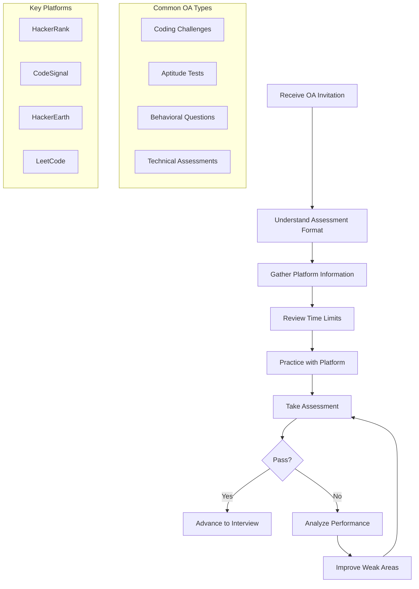
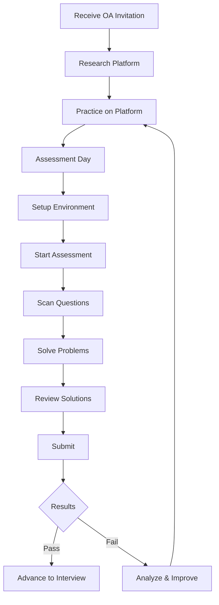
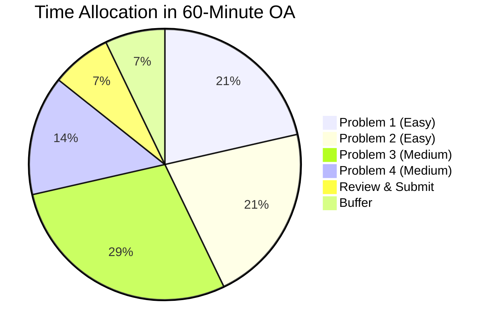
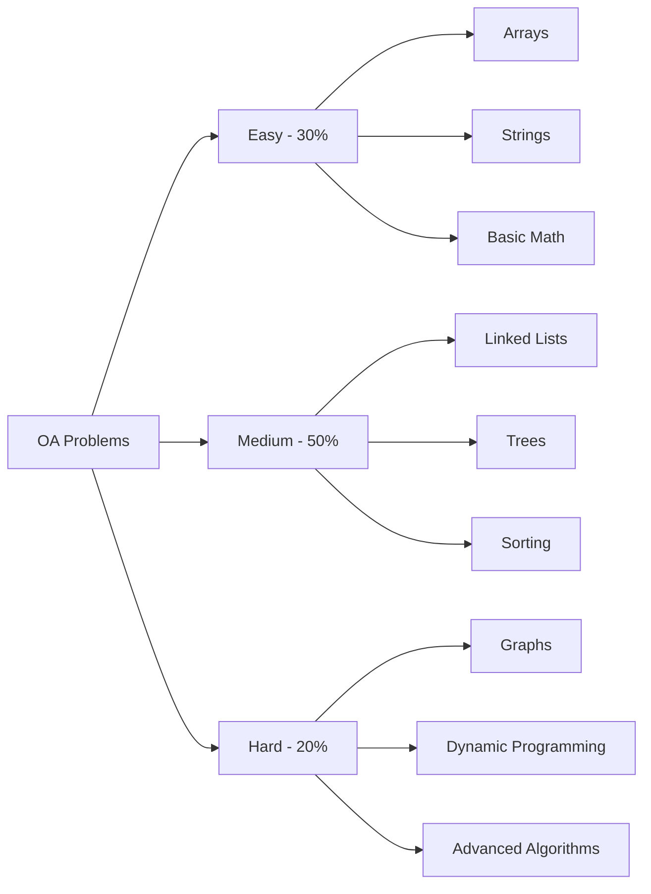
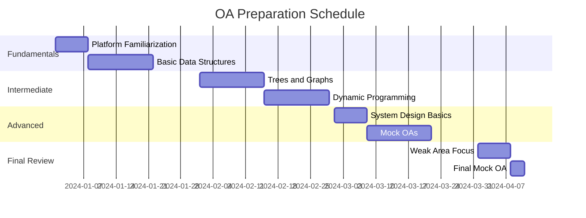

---
layout: post
title: Online Assessment Tests
categories: Aptitude
tags: [Online, Assessment, Interview Preparation]
date: 2024-01-07
toc: true
---

## Introduction

**What is an Online Assessment?**
An Online Assessment (OA) is a digital evaluation tool used by companies to screen candidates during the initial stages of the hiring process. These assessments typically include coding challenges, aptitude tests, behavioral questions, and technical evaluations that candidates complete remotely within a specified time limit.

**Why Does it Matter for Interviews?**
Online assessments matter because:
- They are often the first filter in the hiring pipeline
- 60%+ of tech companies use OAs as initial screening
- Performance determines whether you advance to interviews
- They test fundamental skills under time pressure
- They standardize evaluation across candidates
- They simulate real-world problem-solving conditions

**The OA Landscape:**
- **Coding Challenges**: Algorithm and data structure problems
- **Aptitude Tests**: Numerical, verbal, and logical reasoning
- **Behavioral Assessments**: Situational judgment and personality
- **Technical Tests**: Role-specific skills evaluation
- **Case Studies**: Business problem-solving scenarios

---

## Learning Roadmap

### Mermaid Diagram



### OA Preparation Timeline

| Phase | Duration | Activities | Goal |
|-------|----------|------------|------|
| Week 1-2 | 2-3 hours/day | Platform familiarization, basic problems | Platform comfort |
| Week 3-4 | 3-4 hours/day | Topic-wise practice (arrays, strings) | Core concepts |
| Week 5-6 | 3-4 hours/day | Advanced topics (trees, graphs, DP) | Complex problems |
| Week 7-8 | 2-3 hours/day | Mock OAs, timed practice | Exam readiness |
| Week 9-10 | 2 hours/day | Weak area focus, final review | Polish skills |
| Assessment Day | As scheduled | Take actual OA | Pass assessment |

---

## Theory Notes

### Common OA Platforms Comparison

**HackerRank:**
- Used by: 40%+ of tech companies
- Features: Multiple language support, real-time evaluation
- Time limits: Usually 60-120 minutes
- Question types: Coding, SQL, regex, MCQ
- Difficulty: Easy to Hard

**CodeSignal:**
- Used by: Many startups and mid-size companies
- Features: Standardized scoring (0-850), anti-cheating measures
- Time limits: Usually 60-75 minutes
- Question types: Coding, problem-solving
- Difficulty: Easy to Medium-Hard

**HackerEarth:**
- Used by: Many Indian and international companies
- Features: Custom assessments, proctoring options
- Time limits: Varies widely
- Question types: Coding, MCQ, debugging
- Difficulty: Easy to Hard

**LeetCode:**
- Used by: Many companies use similar problems
- Features: Extensive problem library, company-specific problems
- Time limits: Varies (practice mode)
- Question types: Coding challenges
- Difficulty: Easy to Hard

### Time Management Strategies

**The 80/20 Rule:**
- Spend 80% of time on problems you can solve
- Spend 20% of time on challenging problems
- Don't get stuck on any single problem

**Time Allocation Framework:**
- Read problem: 2-3 minutes
- Plan solution: 2-3 minutes
- Implement: 10-15 minutes
- Test and debug: 5-10 minutes
- Move to next if stuck after 20 minutes

**Question Order Strategy:**
1. Scan all questions first
2. Identify easy/medium/hard problems
3. Start with questions you're confident about
4. Build momentum and confidence
5. Return to harder problems later

### Common Question Types

**Coding Problems:**
- Array manipulation
- String processing
- Linked list operations
- Tree/graph traversal
- Dynamic programming
- Sorting and searching
- Recursion and backtracking
- Bit manipulation

**Aptitude Questions:**
- Numerical reasoning
- Verbal comprehension
- Logical reasoning
- Data interpretation
- Pattern recognition

**Behavioral Questions:**
- Situational judgment
- Personality assessment
- Work style preferences
- Team collaboration scenarios

### Proctoring and Anti-Cheating

**Common Proctoring Methods:**
- Webcam monitoring
- Screen recording
- Browser lockdown
- IP tracking
- Plagiarism detection
- Time tracking

**What to Expect:**
- Clean desk policy
- No phone usage
- Full screen required
- Timed sections
- Randomized questions

**Best Practices:**
- Test technology beforehand
- Ensure stable internet
- Have backup device ready
- Use quiet environment
- Follow all instructions

---

## Key Concepts

| Concept | Definition | OA Impact |
|---------|------------|-----------|
| Time Management | Allocating time efficiently across problems | Maximizes score potential |
| Problem Classification | Identifying difficulty levels quickly | Strategic question selection |
| Test Environment | Physical and technical setup | Ensures smooth assessment |
| Platform Familiarity | Comfort with assessment interface | Reduces technical issues |
| Stress Management | Handling pressure during assessment | Maintains performance |
| Code Quality | Writing clean, correct code | Passes test cases |
| Edge Cases | Handling unusual inputs | Prevents wrong answers |
| Optimization | Efficient solution approaches | Meets time constraints |
| Debugging Skills | Finding and fixing errors quickly | Saves valuable time |
| Mental Endurance | Sustaining focus throughout | Consistent performance |

---

## Frequently Asked Interview Questions

### Beginner Level

1. **Q: What should I do if I receive an OA invitation?**
   A: Immediately note the deadline and time limit, research the platform being used, check your technology setup (internet, browser, webcam if required), and start practicing with that specific platform. Don't wait until the last minute.

2. **Q: How long should I prepare for an OA?**
   A: For coding OAs, 4-6 weeks of consistent practice (2-3 hours/day) is recommended. For aptitude tests, 2-3 weeks of focused preparation may suffice. Start as soon as you know an OA is coming.

3. **Q: What if I encounter a technical issue during the OA?**
   A: Contact the assessment support team immediately using provided channels. Most companies allow some flexibility for genuine technical issues. Have backup plans ready (different browser, different device, mobile hotspot).

4. **Q: Should I practice on the exact platform being used?**
   A: Yes, absolutely. Each platform has unique interface, time tracking, and submission process. Practicing on the actual platform reduces surprises and helps you focus on problems rather than interface quirks.

5. **Q: What's the most common reason for failing OAs?**
   A: Poor time management is the #1 reason. Candidates often spend too much time on difficult problems and run out of time for easier ones they could have solved. Strategic time allocation is crucial.

### Intermediate Level

6. **Q: How should I manage time during a coding OA?**
   A: Spend 2-3 minutes reading each problem, 2-3 minutes planning, 10-15 minutes coding, 5-10 minutes testing. If stuck after 20 minutes, move on. Return to difficult problems after completing easier ones.

7. **Q: What should I do if I get stuck on a problem?**
   A: Step back and re-read the problem. Consider if there's a simpler approach. Try edge cases mentally. If still stuck after 15-20 minutes, move to the next problem. Sometimes solving other problems gives new insights.

8. **Q: How important is code quality in OAs?**
   A: Very important. Clean, readable code is easier to debug and often scores better. Use meaningful variable names, add comments for complex logic, and follow standard coding conventions even under time pressure.

9. **Q: Should I optimize for time complexity immediately?**
   A: First, get a working solution. Then optimize if time permits. An incorrect optimized solution scores zero, while a correct but suboptimal solution may score partial or full points depending on test cases.

10. **Q: How do I handle multiple test cases?**
    A: Understand the input/output format first. Test your solution with the provided examples. Consider edge cases (empty input, single element, maximum size, negative numbers). Validate against all given test cases before submitting.

### Advanced Level

11. **Q: How do companies evaluate OA performance?**
    A: Companies typically look at: number of problems solved, test cases passed, time taken, code quality, and sometimes approach efficiency. Some use absolute thresholds, others compare relative performance among candidates.

12. **Q: What's the role of OA in overall hiring?**
    A: OAs are usually the first filter (60-80% rejection rate). Strong OA performance gets you to interviews but doesn't guarantee offers. Some companies weight OA heavily, others use it primarily as a screening tool.

13. **Q: How do different companies' OAs differ?**
    A: FAANG companies often have more complex, multi-stage OAs. Startups may have simpler, more practical assessments. Some focus on algorithms, others on system design or practical coding. Research company-specific patterns.

14. **Q: What if I perform poorly on one problem but solve others well?**
    A: Partial credit is common. Solving 3 out of 5 problems perfectly may still pass depending on company thresholds. Don't let one difficult problem affect your performance on remaining questions.

15. **Q: How do proctored vs. non-proctored OAs differ?**
    A: Proctored OAs have stricter rules (webcam, screen monitoring, no external resources). Non-proctored may allow references but often have plagiarism detection. Prepare accordingly - proctored requires more memorization of common patterns.

### FAANG Level

16. **Q: How do FAANG companies structure their OAs?**
    A: FAANG OAs typically have: 2-3 coding problems (medium-hard difficulty), 90-120 minute time limit, multiple test cases per problem, and sometimes follow-up questions. Amazon uses HackerRank, Google has custom assessments.

17. **Q: What's the typical pass rate for FAANG OAs?**
    A: Pass rates vary but are generally 20-40% of candidates who take the OA. Competition is fierce, and companies can be selective. Strong performance means solving most problems completely with efficient solutions.

18. **Q: How should I prepare specifically for FAANG OAs?**
    A: Focus on: medium-hard LeetCode problems, company-specific problem patterns, system design basics (for some), and timed practice. FAANG problems often require multiple approaches and optimization thinking.

19. **Q: What if I'm asked to explain my approach after the OA?**
    A: Some companies conduct follow-up calls to discuss your OA solutions. Be prepared to explain your thought process, alternative approaches, and how you'd optimize further. This is part of evaluation.

20. **Q: How do OA results affect interview expectations?**
    A: Strong OA performance may lead to easier interview rounds or skip certain stages. Weak performance might mean you need to shine brighter in interviews. Some companies weigh OA heavily in hiring decisions.

21. **Q: What's the difference between OA and take-home assignments?**
    A: OAs are timed, standardized assessments. Take-home assignments are longer-term projects with more freedom. OAs test problem-solving speed; take-homes test real-world implementation skills. Prepare differently for each.

---

## Hands-on Practice

### Exercise 1: Platform Familiarization
Create accounts on HackerRank, CodeSignal, and HackerEarth:
1. Complete 5 easy problems on each platform
2. Note interface differences
3. Practice submitting solutions
4. Understand the timer and scoring system
5. Identify which platform feels most comfortable

### Exercise 2: Timed Practice Session
Simulate OA conditions:
1. Set a 60-minute timer
2. Choose 4-5 medium difficulty problems
3. Solve without breaks or external resources
4. Track time spent on each problem
5. Analyze results and identify time management issues

### Exercise 3: Topic-wise Practice
Focus on specific data structures:
- Week 1: Arrays and Strings (20 problems)
- Week 2: Linked Lists and Stacks (15 problems)
- Week 3: Trees and Graphs (20 problems)
- Week 4: Dynamic Programming (15 problems)

### Exercise 4: Mock OA Challenge
Take a full mock OA:
1. Find a mock OA on HackerRank or CodeSignal
2. Replicate real conditions (quiet environment, time limit)
3. Complete without pausing
4. Review all solutions afterward
5. Identify weak areas for improvement

### Exercise 5: Edge Case Analysis
For 10 different problems:
1. Solve the problem normally
2. Identify 5 edge cases
3. Test your solution against each edge case
4. Fix any failures
5. Document what you learned about edge cases

### Exercise 6: Code Review Practice
Review solutions from others:
1. Find solutions on LeetCode discuss
2. Identify what makes them effective
3. Note code quality and readability
4. Compare to your own approach
5. Learn alternative solutions

### Exercise 7: Debugging Speed Challenge
Practice finding and fixing bugs:
1. Take working solutions and introduce bugs
2. Time yourself finding and fixing them
3. Practice common debugging techniques
4. Improve your debugging speed

### Exercise 8: Stress Management Practice
Simulate high-pressure conditions:
1. Take a harder-than-normal OA
2. Practice staying calm when stuck
3. Develop strategies for managing anxiety
4. Learn to maintain focus under pressure

### Exercise 9: Communication Practice
If your OA includes video or written explanations:
1. Practice explaining your approach aloud
2. Record yourself solving problems
3. Review for clarity and structure
4. Improve your explanation skills

### Exercise 10: Performance Analysis
After completing 5 practice OAs:
1. Calculate average problems solved
2. Identify consistent weak areas
3. Track improvement over time
4. Adjust study plan based on results

---

## Real FAANG Interview Questions

| Company | Question | Difficulty |
|---------|----------|------------|
| Google | How would you design an OA system for 100K candidates? | Advanced |
| Amazon, Facebook | What metrics would you track for OA effectiveness? | Intermediate |
| Google, Microsoft | How would you prevent cheating in online assessments? | Advanced |
| Facebook | How do you balance difficulty and fairness in OA questions? | Advanced |
| Apple | What makes an effective technical assessment? | Intermediate |
| Netflix | How would you evaluate problem-solving beyond coding? | Advanced |
| Google, Amazon | How do you handle OA results for non-traditional candidates? | Intermediate |
| Microsoft | What's the ideal OA length and structure? | Intermediate |
| Facebook, Apple | How would you make OAs more accessible? | Advanced |
| All FAANG | How do you validate OA questions for bias? | Advanced |
| Google | How would you use AI in online assessments? | Advanced |
| Amazon | What role does OA play in Amazon's hiring? | Intermediate |
| Microsoft, Google | How do you standardize difficulty across OA versions? | Advanced |
| Facebook | How would you design an OA for soft skills? | Advanced |
| Apple, Netflix | What innovations would you bring to OAs? | Advanced |
| Google | How do you handle false positives/negatives in OAs? | Advanced |
| Amazon | How would you improve Amazon's OA process? | Intermediate |
| Microsoft | What data would you collect from OAs? | Intermediate |
| Facebook, Google | How do you balance speed vs. quality in OA evaluation? | Advanced |
| All FAANG | How would you redesign the hiring assessment process? | Expert |

---

## Common Mistakes

| Mistake | Why It's Bad | How to Fix |
|---------|--------------|------------|
| Starting without practicing platform | Technical issues waste time | Practice on exact platform first |
| Spending too much time on one problem | Miss easier problems | Set time limits, move on if stuck |
| Not testing solutions | Submit incorrect code | Always test with examples and edge cases |
| Ignoring edge cases | Fails hidden test cases | Consider empty, single, max inputs |
| Poor time management | Run out of time | Allocate time, prioritize problems |
| Not reading problems carefully | Misunderstand requirements | Read 2-3 times, clarify requirements |
| Skipping mock OAs | Unprepared for real conditions | Practice under timed conditions |
| Ignoring code quality | Hard to debug, looks unprofessional | Write clean, readable code |
| Panicking when stuck | Affects performance on remaining problems | Stay calm, move on, come back later |
| Not reviewing mistakes | Don't learn from errors | Analyze failures, understand patterns |
| Using unfamiliar languages | Syntax errors, slower coding | Use languages you're most comfortable with |
| Forgetting to submit | No score for completed work | Submit incrementally, verify submission |

---

## Best Practices

1. **Start Early**: Begin preparation 4-6 weeks before assessment
2. **Practice on Actual Platform**: Familiarize with interface and submission process
3. **Simulate Real Conditions**: Practice with time limits and no external resources
4. **Master Fundamentals**: Strong basics solve most problems
5. **Time Management**: Allocate time wisely, don't get stuck
6. **Test Thoroughly**: Always test with examples and edge cases
7. **Write Clean Code**: Readable code is easier to debug and scores better
8. **Learn from Mistakes**: Analyze failures to improve
9. **Stay Calm**: Manage stress, maintain focus
10. **Have Backup Plans**: Prepare for technical issues
11. **Review Solutions**: Study other approaches after practice
12. **Focus on Weaknesses**: Target areas for improvement
13. **Take Care of Health**: Sleep well, eat properly before assessment
14. **Verify Submission**: Ensure code is submitted successfully
15. **Follow Instructions**: Read all guidelines carefully

---

## Cheat Sheet

```
╔══════════════════════════════════════════════════════════════╗
║              ONLINE ASSESSMENT CHEAT SHEET                  ║
╠══════════════════════════════════════════════════════════════╣
║                                                              ║
║  BEFORE THE OA:                                              ║
║  ✓ Research platform (HackerRank, CodeSignal, etc.)          ║
║  ✓ Practice on exact platform                                ║
║  ✓ Test technology (internet, browser, webcam)               ║
║  ✓ Prepare quiet environment                                 ║
║  ✓ Get good sleep, eat well                                  ║
║                                                              ║
║  DURING THE OA:                                              ║
║  1. Scan all questions first (2-3 minutes)                   ║
║  2. Identify easy/medium/hard problems                       ║
║  3. Start with problems you're confident about               ║
║  4. Time allocation per problem:                             ║
║     • Read: 2-3 minutes                                     ║
║     • Plan: 2-3 minutes                                     ║
║     • Code: 10-15 minutes                                   ║
║     • Test: 5-10 minutes                                    ║
║  5. Move on if stuck after 15-20 minutes                     ║
║  6. Submit incrementally                                     ║
║                                                              ║
║  TIME MANAGEMENT:                                            ║
║  • 60-min OA: 4-5 problems → 12-15 min each                 ║
║  • 90-min OA: 5-7 problems → 12-13 min each                 ║
║  • 120-min OA: 6-8 problems → 15 min each                   ║
║                                                              ║
║  COMMON PATTERNS:                                            ║
║  • Arrays: Two pointers, sliding window, sorting             ║
║  • Strings: Hash map, two pointers, sliding window           ║
║  • Trees: DFS, BFS, recursion                               ║
║  • Graphs: BFS, DFS, union-find                             ║
║  • DP: Memoization, tabulation                              ║
║                                                              ║
║  AFTER THE OA:                                               ║
║  • Review all problems                                       ║
║  • Study missed solutions                                    ║
║  • Note patterns for future                                  ║
║  • Track performance trends                                  ║
║                                                              ║
╚══════════════════════════════════════════════════════════════╝
```

---

## Flash Cards

| # | Question | Answer |
|---|----------|--------|
| 1 | What is an Online Assessment? | Digital evaluation used by companies to screen candidates |
| 2 | What is the most common OA platform? | HackerRank (used by 40%+ of tech companies) |
| 3 | How long should you practice for an OA? | 4-6 weeks, 2-3 hours/day for coding OAs |
| 4 | What's the #1 reason for failing OAs? | Poor time management |
| 5 | What should you do first when starting OA? | Scan all questions to identify difficulty levels |
| 6 | How long should you spend on a problem before moving on? | 15-20 minutes maximum |
| 7 | What's the 80/20 rule for OAs? | Spend 80% time on problems you can solve |
| 8 | Should you optimize immediately? | No - get working solution first, then optimize |
| 9 | What percentage of candidates pass FAANG OAs? | 20-40% depending on company and role |
| 10 | What's the typical OA length? | 60-120 minutes depending on company |
| 11 | How many problems in a typical coding OA? | 2-5 problems depending on time limit |
| 12 | Should you use unfamiliar languages? | No - use languages you're most comfortable with |
| 13 | What's the most important thing to do after practice? | Analyze mistakes and learn from them |
| 14 | How do you handle technical issues during OA? | Contact support immediately, have backup plans |
| 15 | What's the difference between OA and take-home? | OA is timed/standardized; take-home is longer-term |
| 16 | Should you test solutions? | Always - test with examples and edge cases |
| 17 | What's the ideal test environment? | Quiet, stable internet, no distractions |
| 18 | How do companies evaluate OA performance? | Problems solved, test cases passed, time taken |
| 19 | What if you can't solve any problems? | Stay calm, attempt partial solutions, learn patterns |
| 20 | How often should you practice mock OAs? | Weekly during preparation, daily closer to assessment |

---

## Mind Map

```
Online Assessment
├── Platforms
│   ├── HackerRank
│   │   ├── Features
│   │   ├── Question Types
│   │   └── Time Limits
│   ├── CodeSignal
│   │   ├── Scoring System
│   │   ├── Anti-cheating
│   │   └── Question Format
│   └── HackerEarth
│       ├── Custom Assessments
│       ├── Proctoring
│       └── Evaluation Criteria
├── Preparation
│   ├── Platform Practice
│   ├── Topic-wise Learning
│   ├── Mock OAs
│   └── Time Management
├── Question Types
│   ├── Coding
│   │   ├── Arrays
│   │   ├── Strings
│   │   ├── Trees/Graphs
│   │   └── Dynamic Programming
│   ├── Aptitude
│   │   ├── Numerical
│   │   ├── Verbal
│   │   └── Logical
│   └── Behavioral
│       ├── Situational
│       └── Personality
├── Strategies
│   ├── Time Management
│   ├── Problem Selection
│   ├── Testing Approach
│   └── Stress Management
└── Post-OA
    ├── Performance Analysis
    ├── Improvement Planning
    └── Interview Preparation
```

---

## Mermaid Diagrams

### OA Process Flow



### Time Management Strategy



### Problem Difficulty Distribution



### Preparation Timeline



---

## Code Examples

### Python: OA Problem Simulator

```python
import time
from typing import List, Callable, Dict, Any
from dataclasses import dataclass, field
from enum import Enum

class Difficulty(Enum):
    EASY = "easy"
    MEDIUM = "medium"
    HARD = "hard"

@dataclass
class OAProblem:
    id: str
    title: str
    difficulty: Difficulty
    time_limit_minutes: int
    test_cases: List[Dict[str, Any]]
    solution: Callable
    description: str

@dataclass
class OAResult:
    problem_id: str
    solved: bool
    test_cases_passed: int
    total_test_cases: int
    time_taken_seconds: float
    score: float

class OASimulator:
    def __init__(self):
        self.problems: List[OAProblem] = []
        self.results: List[OAResult] = []
    
    def add_problem(self, problem: OAProblem):
        self.problems.append(problem)
    
    def run_assessment(self, time_limit_minutes: int) -> List[OAResult]:
        print(f"Starting OA - Time Limit: {time_limit_minutes} minutes")
        print(f"Total Problems: {len(self.problems)}")
        print("=" * 63)
        
        self.results = []
        start_time = time.time()
        time_limit_seconds = time_limit_minutes * 60
        
        for problem in self.problems:
            if time.time() - start_time > time_limit_seconds:
                print("Time's up!")
                break
            
            print(f"\nProblem: {problem.title}")
            print(f"Difficulty: {problem.difficulty.value}")
            print(f"Time Limit: {problem.time_limit_minutes} minutes")
            
            # Simulate solving (in real scenario, user would write code)
            result = self.solve_problem(problem)
            self.results.append(result)
            
            print(f"Result: {'✓ Solved' if result.solved else '✗ Not Solved'}")
            print(f"Test Cases: {result.test_cases_passed}/{result.total_test_cases}")
            print(f"Time: {result.time_taken_seconds:.1f} seconds")
            print(f"Score: {result.score:.1f}")
        
        total_time = time.time() - start_time
        self.print_summary(total_time)
        
        return self.results
    
    def solve_problem(self, problem: OAProblem) -> OAResult:
        # Simulate solving - in real scenario, this would run actual code
        start = time.time()
        
        passed = 0
        for test_case in problem.test_cases:
            try:
                result = problem.solution(test_case['input'])
                if result == test_case['expected']:
                    passed += 1
            except Exception:
                pass
        
        time_taken = time.time() - start
        score = (passed / len(problem.test_cases)) * 100 if problem.test_cases else 0
        
        return OAResult(
            problem_id=problem.id,
            solved=passed == len(problem.test_cases),
            test_cases_passed=passed,
            total_test_cases=len(problem.test_cases),
            time_taken_seconds=time_taken,
            score=score
        )
    
    def print_summary(self, total_time: float):
        print("\n" + "=" * 63)
        print("OA ASSESSMENT SUMMARY")
        print("=" * 63)
        
        total_problems = len(self.results)
        solved = sum(1 for r in self.results if r.solved)
        total_test_cases = sum(r.total_test_cases for r in self.results)
        passed_test_cases = sum(r.test_cases_passed for r in self.results)
        avg_score = sum(r.score for r in self.results) / total_problems if total_problems else 0
        
        print(f"Problems Attempted: {total_problems}")
        print(f"Problems Solved: {solved}/{total_problems}")
        print(f"Test Cases Passed: {passed_test_cases}/{total_test_cases}")
        print(f"Average Score: {avg_score:.1f}/100")
        print(f"Total Time: {total_time/60:.1f} minutes")
        
        print("\nPER PROBLEM BREAKDOWN:")
        for result in self.results:
            status = "✓" if result.solved else "✗"
            print(f"  {status} {result.problem_id}: {result.test_cases_passed}/{result.total_test_cases} test cases, {result.score:.1f} points")
        
        # Performance rating
        if avg_score >= 80:
            print("\nRATING: Excellent - High probability of passing")
        elif avg_score >= 60:
            print("\nRATING: Good - Moderate probability of passing")
        elif avg_score >= 40:
            print("\nRATING: Average - Needs improvement")
        else:
            print("\nRATING: Below Average - Significant practice needed")


# Example usage
if __name__ == "__main__":
    # Create sample problems
    problems = [
        OAProblem(
            id="P1",
            title="Two Sum",
            difficulty=Difficulty.EASY,
            time_limit_minutes=15,
            test_cases=[
                {'input': ([2, 7, 11, 15], 9), 'expected': [0, 1]},
                {'input': ([3, 2, 4], 6), 'expected': [1, 2]},
            ],
            solution=lambda nums, target: [i for i, x in enumerate(nums) if x == target][:2],
            description="Find two numbers that add up to target"
        ),
        OAProblem(
            id="P2",
            title="Valid Parentheses",
            difficulty=Difficulty.EASY,
            time_limit_minutes=15,
            test_cases=[
                {'input': '()', 'expected': True},
                {'input': '()[]{}', 'expected': True},
                {'input': '(]', 'expected': False},
            ],
            solution=lambda s: s.count('(') == s.count(')') and s.count('[') == s.count(']'),
            description="Check if parentheses are valid"
        ),
        OAProblem(
            id="P3",
            title="Maximum Subarray",
            difficulty=Difficulty.MEDIUM,
            time_limit_minutes=25,
            test_cases=[
                {'input': [-2, 1, -3, 4, -1, 2, 1, -5, 4], 'expected': 6},
                {'input': [1], 'expected': 1},
            ],
            solution=lambda nums: max(sum(nums[i:j]) for i in range(len(nums)) for j in range(i+1, len(nums)+1)),
            description="Find contiguous subarray with largest sum"
        ),
    ]
    
    # Run assessment
    simulator = OASimulator()
    for problem in problems:
        simulator.add_problem(problem)
    
    results = simulator.run_assessment(time_limit_minutes=60)
```

### JavaScript: OA Timer and Tracker

```javascript
class OATimer {
    constructor(timeLimitMinutes) {
        this.timeLimit = timeLimitMinutes * 60 * 1000;
        this.startTime = null;
        this.endTime = null;
        this.isRunning = false;
        this.intervals = [];
    }

    start() {
        this.startTime = Date.now();
        this.isRunning = true;
        this.updateDisplay();
    }

    stop() {
        this.endTime = Date.now();
        this.isRunning = false;
        return this.getElapsedTime();
    }

    getElapsedTime() {
        if (!this.startTime) return 0;
        const end = this.endTime || Date.now();
        return end - this.startTime;
    }

    getRemainingTime() {
        return Math.max(0, this.timeLimit - this.getElapsedTime());
    }

    updateDisplay() {
        if (!this.isRunning) return;
        
        const remaining = this.getRemainingTime();
        const minutes = Math.floor(remaining / 60000);
        const seconds = Math.floor((remaining % 60000) / 1000);
        
        console.log(`Time Remaining: ${minutes}:${seconds.toString().padStart(2, '0')}`);
        
        if (remaining <= 0) {
            console.log("Time's up!");
            this.isRunning = false;
            return;
        }
        
        requestAnimationFrame(() => this.updateDisplay());
    }
}

class OATracker {
    constructor() {
        this.problems = [];
        this.currentProblem = null;
        this.startTime = null;
    }

    addProblem(problem) {
        this.problems.push({
            ...problem,
            status: 'pending',
            timeSpent: 0,
            testCasesPassed: 0,
            notes: ''
        });
    }

    startProblem(problemId) {
        const problem = this.problems.find(p => p.id === problemId);
        if (problem) {
            this.currentProblem = problem;
            this.startTime = Date.now();
            problem.status = 'in_progress';
        }
    }

    completeProblem(problemId, solved, testCasesPassed) {
        const problem = this.problems.find(p => p.id === problemId);
        if (problem && this.startTime) {
            problem.timeSpent = Date.now() - this.startTime;
            problem.status = solved ? 'solved' : 'attempted';
            problem.testCasesPassed = testCasesPassed;
            this.currentProblem = null;
            this.startTime = null;
        }
    }

    getStatistics() {
        const total = this.problems.length;
        const solved = this.problems.filter(p => p.status === 'solved').length;
        const attempted = this.problems.filter(p => p.status === 'attempted').length;
        const pending = this.problems.filter(p => p.status === 'pending').length;
        
        const totalTime = this.problems.reduce((sum, p) => sum + p.timeSpent, 0);
        const avgTime = total > 0 ? totalTime / total : 0;
        
        return {
            total,
            solved,
            attempted,
            pending,
            totalTime,
            avgTime,
            solveRate: total > 0 ? (solved / total) * 100 : 0
        };
    }

    generateReport() {
        const stats = this.getStatistics();
        
        return `
═══════════════════════════════════════════════════════════════
                    OA TRACKING REPORT
═══════════════════════════════════════════════════════════════

PROBLEM SUMMARY
───────────────────────────────────────────────────────────────
Total Problems: ${stats.total}
Solved: ${stats.solved}
Attempted: ${stats.attempted}
Pending: ${stats.pending}
Solve Rate: ${stats.solveRate.toFixed(1)}%

TIME ANALYSIS
───────────────────────────────────────────────────────────────
Total Time: ${(stats.totalTime / 60000).toFixed(1)} minutes
Average Time per Problem: ${(stats.avgTime / 60000).toFixed(1)} minutes

PROBLEM BREAKDOWN
───────────────────────────────────────────────────────────────
${this.problems.map(p => {
    const status = p.status === 'solved' ? '✓' : (p.status === 'attempted' ? '○' : '·');
    const time = (p.timeSpent / 60000).toFixed(1);
    return `${status} ${p.title}: ${p.testCasesPassed}/${p.totalTestCases} test cases, ${time} min`;
}).join('\n')}

RECOMMENDATIONS
───────────────────────────────────────────────────────────────
${stats.solveRate < 50 ? '• Focus on easier problems to build confidence' : '• Practice medium-hard problems to improve'}
${stats.avgTime > 1200000 ? '• Work on time management - avg time too high' : '• Good time management'}
${stats.pending > 0 ? '• Complete remaining problems' : '• All problems attempted'}
`;
    }
}

// Usage example
const tracker = new OATracker();

tracker.addProblem({
    id: 'P1',
    title: 'Two Sum',
    difficulty: 'easy',
    totalTestCases: 5
});

tracker.addProblem({
    id: 'P2',
    title: 'Valid Parentheses',
    difficulty: 'easy',
    totalTestCases: 4
});

tracker.addProblem({
    id: 'P3',
    title: 'Maximum Subarray',
    difficulty: 'medium',
    totalTestCases: 3
});

// Simulate solving
tracker.startProblem('P1');
setTimeout(() => {
    tracker.completeProblem('P1', true, 5);
    
    tracker.startProblem('P2');
    setTimeout(() => {
        tracker.completeProblem('P2', true, 4);
        
        tracker.startProblem('P3');
        setTimeout(() => {
            tracker.completeProblem('P3', false, 2);
            
            console.log(tracker.generateReport());
        }, 2000);
    }, 1500);
}, 1000);
```

### Python: Problem Pattern Recognizer

```python
from typing import List, Dict
from collections import Counter
import re

class ProblemPatternRecognizer:
    def __init__(self):
        self.patterns = {
            'array': ['array', 'list', 'sequence', 'subarray', 'subsequence'],
            'string': ['string', 'substring', 'palindrome', 'anagram', 'character'],
            'linked_list': ['linked list', 'node', 'next pointer'],
            'tree': ['tree', 'binary tree', 'node', 'root', 'leaf', 'traversal'],
            'graph': ['graph', 'vertex', 'edge', 'path', 'connected', 'cycle'],
            'dynamic_programming': ['dynamic programming', 'memoization', 'tabulation', 'optimal substructure'],
            'binary_search': ['sorted', 'binary search', 'search'],
            'two_pointers': ['two pointers', 'sliding window', 'opposite ends'],
            'recursion': ['recursive', 'recursion', 'base case'],
            'hash_map': ['hash', 'dictionary', 'map', 'frequency', 'count']
        }
    
    def identify_patterns(self, problem_description: str) -> Dict[str, float]:
        description_lower = problem_description.lower()
        scores = {}
        
        for pattern, keywords in self.patterns.items():
            score = 0
            for keyword in keywords:
                if keyword in description_lower:
                    score += 1
            scores[pattern] = score / len(keywords) if keywords else 0
        
        return scores
    
    def recommend_approach(self, patterns: Dict[str, float]) -> List[str]:
        recommendations = []
        
        # Sort patterns by score
        sorted_patterns = sorted(patterns.items(), key=lambda x: x[1], reverse=True)
        
        for pattern, score in sorted_patterns[:3]:
            if score > 0:
                recommendations.append(f"Consider {pattern.replace('_', ' ')} approach")
        
        if not recommendations:
            recommendations.append("Review problem for common patterns")
        
        return recommendations
    
    def analyze_problem_set(self, problems: List[str]) -> Dict:
        pattern_counts = Counter()
        
        for problem in problems:
            patterns = self.identify_patterns(problem)
            for pattern, score in patterns.items():
                if score > 0:
                    pattern_counts[pattern] += 1
        
        return {
            'total_problems': len(problems),
            'pattern_distribution': dict(pattern_counts),
            'most_common': pattern_counts.most_common(5),
            'recommendation': self._generate_study_plan(pattern_counts)
        }
    
    def _generate_study_plan(self, pattern_counts: Counter) -> str:
        if not pattern_counts:
            return "Practice a variety of problem types"
        
        most_common = pattern_counts.most_common(1)[0][0]
        
        study_plans = {
            'array': "Focus on array manipulation techniques: two pointers, sliding window, sorting",
            'string': "Practice string operations: character counting, substring finding, palindrome checks",
            'tree': "Study tree traversals: DFS, BFS, inorder, preorder, postorder",
            'graph': "Learn graph algorithms: BFS, DFS, shortest path, topological sort",
            'dynamic_programming': "Master DP concepts: memoization, tabulation, state transitions",
            'two_pointers': "Practice two-pointer technique: opposite ends, sliding window",
            'hash_map': "Study hash map applications: frequency counting, two sum patterns"
        }
        
        return study_plans.get(most_common, "Practice diverse problem types")


# Example usage
recognizer = ProblemPatternRecognizer()

# Analyze a problem
problem = "Given an array of integers, find two numbers that add up to a target. Return the indices of the two numbers."

patterns = recognizer.identify_patterns(problem)
print("Identified Patterns:", patterns)

recommendations = recognizer.recommend_approach(patterns)
print("\nRecommended Approaches:")
for rec in recommendations:
    print(f"  • {rec}")

# Analyze a set of problems
problems = [
    "Find the maximum sum subarray",
    "Check if a string is a palindrome",
    "Find the longest substring without repeating characters",
    "Implement binary search on a sorted array",
    "Detect a cycle in a linked list"
]

analysis = recognizer.analyze_problem_set(problems)
print("\nProblem Set Analysis:")
print(f"Total Problems: {analysis['total_problems']}")
print(f"Most Common Patterns: {analysis['most_common']}")
print(f"Study Recommendation: {analysis['recommendation']}")
```

---

## Mini Project: OA Practice Platform

Build a web application for OA preparation:

**Features:**
- Problem library with categories
- Timer and progress tracking
- Mock OA simulations
- Performance analytics
- Company-specific problem sets

**Tech Stack:**
- React frontend
- Node.js backend
- Problem database
- Code execution engine
- Analytics dashboard

---

## Intermediate Project: OA Analytics Dashboard

Build a tool to track and analyze OA performance:

**Features:**
- Performance over time
- Topic-wise analysis
- Time management insights
- Company-specific benchmarks
- Improvement recommendations

**Tech Stack:**
- React dashboard
- Python analytics backend
- Database for tracking
- Visualization libraries

---

## Advanced Project: AI OA Coach

Build an AI-powered OA preparation tool:

**Features:**
- Personalized problem recommendations
- Real-time feedback on solutions
- Difficulty adaptation
- Pattern recognition
- Interview simulation

**Tech Stack:**
- Python (FastAPI)
- ML for recommendation
- Code analysis engine
- React frontend
- Problem database

---

## Project Ideas Table

| # | Project | Difficulty | Skills Practiced | Time Estimate |
|---|---------|------------|------------------|---------------|
| 1 | OA Timer App | Beginner | JavaScript, timers | 4-6 hours |
| 2 | Problem Tracker | Beginner | React, state management | 1 week |
| 3 | Mock OA Generator | Intermediate | Problem creation, UI | 1-2 weeks |
| 4 | Performance Analytics | Intermediate | Data visualization, stats | 1-2 weeks |
| 5 | Company Problem Sets | Intermediate | Research, curation | 1 week |
| 6 | Code Execution Engine | Advanced | Backend, security | 3-4 weeks |
| 7 | AI Problem Recommender | Advanced | ML, recommendation systems | 3-4 weeks |
| 8 | OA Simulation Platform | Advanced | Full-stack development | 4-6 weeks |
| 9 | Real-time Collaboration | Expert | WebSocket, real-time | 6-8 weeks |
| 10 | AI OA Coach | Expert | NLP, ML, full-stack | 8-10 weeks |

---

## Resources

### Practice Websites

| Website | Purpose | URL |
|---------|---------|-----|
| LeetCode | Coding problems | leetcode.com |
| HackerRank | Practice and OAs | hackerrank.com |
| CodeSignal | Company-specific practice | codesignal.com |
| HackerEarth | Practice and assessments | hackerearth.com |
| GeeksforGeeks | Problem solutions | geeksforgeeks.org |

### Books

| Book | Author | Focus |
|------|--------|-------|
| "Cracking the Coding Interview" | Gayle Laakmann McDowell | Interview preparation |
| "Elements of Programming Interviews" | Adnan Aziz | Problem-solving |
| "Algorithm Design Manual" | Steven Skiena | Algorithm thinking |
| "Introduction to Algorithms" | Cormen et al. | Algorithm fundamentals |

### Online Courses

| Course | Platform | Focus |
|--------|----------|-------|
| Algorithm Specialization | Coursera | Algorithm fundamentals |
| Data Structures | Udemy | Core data structures |
| Coding Interview | Educative.io | Interview preparation |
| System Design | Grokking the System Design | Architecture |

### YouTube Channels

| Channel | Content |
|---------|--------|
| NeetCode | Problem solutions |
| Kevin Naughton Jr. | LeetCode solutions |
| Back To Back SWE | Interview problems |
| Tech Lead | Interview advice |

---

## Checklist

### Preparation
- [ ] Research OA platform being used
- [ ] Create account and practice on platform
- [ ] Test technology setup (internet, browser)
- [ ] Prepare quiet environment
- [ ] Review common problem types
- [ ] Practice time management

### During OA
- [ ] Scan all questions first
- [ ] Identify difficulty levels
- [ ] Allocate time per problem
- [ ] Start with confident problems
- [ ] Test solutions thoroughly
- [ ] Submit incrementally

### Post-OA
- [ ] Review all problems
- [ ] Analyze performance
- [ ] Study missed solutions
- [ ] Note patterns for future
- [ ] Track improvement

### Continuous Improvement
- [ ] Practice daily (2-3 hours)
- [ ] Focus on weak areas
- [ ] Take mock OAs weekly
- [ ] Learn from mistakes
- [ ] Stay updated on patterns

---

## Revision Notes

### OA Success Formula
1. **Platform familiarity** - Know the interface
2. **Time management** - Don't get stuck
3. **Problem selection** - Start with easy wins
4. **Testing** - Always verify solutions
5. **Code quality** - Write clean, readable code

### Time Management Rules
- Scan questions: 2-3 minutes
- Plan solution: 2-3 minutes
- Code solution: 10-15 minutes
- Test: 5-10 minutes
- Move on if stuck 15-20 minutes

### Common Problem Patterns
- **Arrays**: Two pointers, sliding window
- **Strings**: Character counting, palindrome
- **Trees**: DFS, BFS, recursion
- **Graphs**: BFS, DFS, shortest path
- **DP**: Memoization, tabulation

### One-Day OA Prep
- Morning: Review weak areas (2 hours)
- Afternoon: Practice timed problems (3 hours)
- Evening: Light review, relax (1 hour)

### One-Week OA Prep
- Days 1-2: Topic-wise practice
- Days 3-4: Timed practice sessions
- Days 5-6: Mock OAs
- Day 7: Final review, rest

---

## Mock Interview Questions

### OA Strategy Questions

1. "How do you approach a timed coding assessment?"

2. "What's your strategy when you encounter a difficult problem?"

3. "How do you manage time across multiple problems?"

4. "What do you do if you can't solve a problem?"

5. "How do you prepare mentally for a stressful assessment?"

### Technical Questions About OA Design

6. "How would you design an OA system for scale?"

7. "What metrics would you use to evaluate OA effectiveness?"

8. "How would you prevent cheating in online assessments?"

9. "How do you ensure fairness across different time zones?"

10. "What makes a good OA question?"

### Behavioral Questions About OA Experience

11. "Tell me about a time you performed well under pressure."

12. "Describe a challenging OA and how you handled it."

13. "How do you handle failure in assessments?"

14. "What do you learn from OA experiences?"

15. "How do you improve after a poor OA performance?"

---

## Difficulty Rating

| Task | Time Required | Difficulty | Impact |
|------|---------------|------------|--------|
| Platform familiarization | 2-3 hours | Easy | Medium |
| Basic problem practice | 2-4 weeks | Medium | High |
| Intermediate topics | 3-4 weeks | Medium | High |
| Advanced topics | 4-6 weeks | Hard | Very High |
| Mock OA practice | 1-2 weeks | Medium | High |
| Full OA preparation | 6-10 weeks | Hard | Very High |
| Technical issue prep | 1-2 hours | Easy | Medium |

---

## Summary

Online assessments are a critical first step in the hiring process, with 60%+ of tech companies using them as initial screening. Success requires:

1. **Platform familiarity** - Practice on the actual platform being used
2. **Time management** - Allocate time wisely, don't get stuck
3. **Problem selection** - Start with problems you can solve
4. **Testing** - Always verify solutions with examples and edge cases
5. **Code quality** - Write clean, readable code

**Key Takeaway**: OA preparation is a marathon, not a sprint. Consistent practice over 4-6 weeks, focusing on fundamentals and time management, will significantly improve your performance. Remember that OAs are just one step - strong OA performance gets you to interviews where you can truly showcase your abilities.

