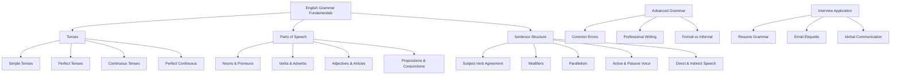
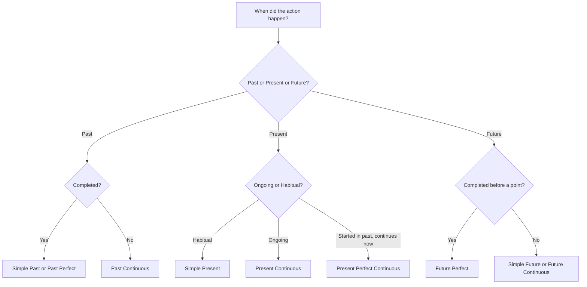
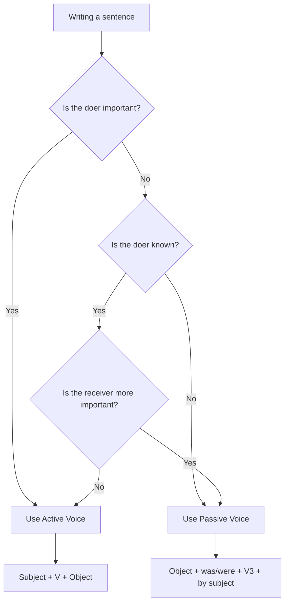
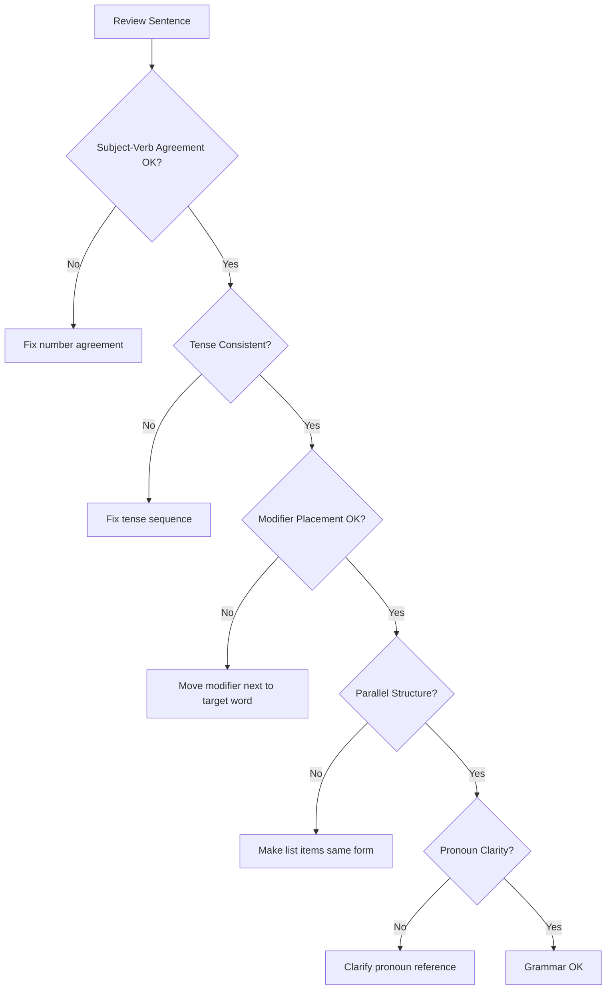

---
layout: post
title: English Grammar for Interviews
categories: Aptitude
tags: [English, Grammar, Interview Preparation]
date: 2024-01-12
toc: true
---

---

## 1. Introduction

### What is English Grammar?
English grammar is the system of rules governing the structure of the English language, including how words are formed, combined, and used in sentences. In the context of job interviews, strong grammar skills demonstrate attention to detail, clear communication, and professional competence.

### Why It Matters for Interviews
Every interview—whether HR, technical, client-facing, or managerial—requires effective communication. Poor grammar can undermine your technical expertise, reduce your credibility, and cost you job offers. Interviewers frequently assess grammar during:

- Written tests and online assessments
- Email and report writing tasks
- Verbal communication during behavioral rounds
- Group discussions and presentations
- Resume and cover letter evaluation

### How It Matters for Your Career
Professionals with strong grammar skills are perceived as more competent, reliable, and detail-oriented. In roles involving client communication, documentation, or leadership, grammar proficiency is often a decisive factor in hiring decisions.

---

## 2. Learning Roadmap



### Timeline
| Phase | Duration | Focus |
|-------|----------|-------|
| Week 1 | Days 1-3 | Parts of speech, sentence basics |
| Week 1 | Days 4-7 | Tenses (all forms) |
| Week 2 | Days 8-10 | Subject-verb agreement, articles |
| Week 2 | Days 11-14 | Prepositions, pronouns, modifiers |
| Week 3 | Days 15-17 | Parallelism, active/passive voice |
| Week 3 | Days 18-21 | Direct/indirect speech, common errors |
| Week 4 | Days 22-28 | Professional writing, mock tests |

---

## 3. Theory Notes

### 3.1 Parts of Speech

**Nouns** — Names of people, places, things, or ideas.
- Common nouns: dog, city, company
- Proper nouns: John, London, Google
- Abstract nouns: freedom, knowledge, success
- Collective nouns: team, committee, audience

**Pronouns** — Replace nouns.
- Personal: I, you, he, she, it, we, they
- Possessive: mine, yours, his, hers, its, ours, theirs
- Reflexive: myself, yourself, himself, herself
- Relative: who, whom, whose, which, that
- Demonstrative: this, that, these, those

**Verbs** — Express actions or states.
- Action verbs: run, write, analyze
- Linking verbs: is, am, are, was, were, seem, become
- Helping verbs: have, has, had, do, does, did, will, shall, can, could

**Adjectives** — Modify nouns.
- Descriptive: tall, intelligent, efficient
- Quantitative: many, few, several
- Demonstrative: this, that, these, those

**Adverbs** — Modify verbs, adjectives, or other adverbs.
- Manner: quickly, carefully, efficiently
- Frequency: always, often, rarely
- Degree: very, extremely, somewhat

**Prepositions** — Show relationships between words.
- Time: at, on, in, during, before, after
- Place: in, on, at, between, among, above, below
- Direction: to, from, into, toward, through

**Conjunctions** — Connect words or clauses.
- Coordinating: and, but, or, nor, for, so, yet
- Subordinating: because, although, while, if, when, unless

**Interjections** — Express emotion. Rarely used in formal writing.

### 3.2 Tenses

#### Simple Tenses
| Tense | Structure | Example |
|-------|-----------|---------|
| Simple Present | S + V1(s/es) | She writes reports daily. |
| Simple Past | S + V2 | He completed the project. |
| Simple Future | S + will + V1 | They will launch the product. |

#### Continuous Tenses
| Tense | Structure | Example |
|-------|-----------|---------|
| Present Continuous | S + is/am/are + V-ing | I am preparing for the interview. |
| Past Continuous | S + was/were + V-ing | They were discussing the budget. |
| Future Continuous | S + will be + V-ing | We will be attending the meeting. |

#### Perfect Tenses
| Tense | Structure | Example |
|-------|-----------|---------|
| Present Perfect | S + has/have + V3 | She has submitted the report. |
| Past Perfect | S + had + V3 | He had finished before the deadline. |
| Future Perfect | S + will have + V3 | They will have completed it by Monday. |

#### Perfect Continuous Tenses
| Tense | Structure | Example |
|-------|-----------|---------|
| Present Perfect Continuous | S + has/have been + V-ing | I have been working here for 3 years. |
| Past Perfect Continuous | S + had been + V-ing | She had been waiting for an hour. |
| Future Perfect Continuous | S + will have been + V-ing | He will have been studying for 5 hours. |

### 3.3 Subject-Verb Agreement

The subject and verb must agree in number (singular or plural).

**Rules:**
1. A singular subject takes a singular verb: "The manager *reviews* the code."
2. A plural subject takes a plural verb: "The managers *review* the code."
3. Compound subjects joined by "and" take a plural verb: "Tom and Jerry *are* friends."
4. Subjects joined by "or/nor" agree with the nearer subject: "Neither the manager nor the employees *were* present."
5. Collective nouns take singular verbs when acting as a unit: "The team *is* performing well."
6. Indefinite pronouns (each, every, anyone, nobody) take singular verbs: "Everyone *has* a opinion."

### 3.4 Articles

**Definite Article (the):** Used when referring to specific nouns.
- "The CEO approved the proposal."

**Indefinite Articles (a/an):** Used with non-specific, singular, countable nouns.
- "a" before consonant sounds: "a project," "a university" (yu-sound)
- "an" before vowel sounds: "an email," "an hour" (silent h)

**Zero Article:** No article used.
- Proper nouns: "Google is a tech giant."
- Uncountable nouns (general): "Information is valuable."
- Plural nouns (general): "Developers write code."

### 3.5 Prepositions

**Common Preposition Errors in Professional Contexts:**

| Incorrect | Correct | Context |
|-----------|---------|---------|
| Different *from* (sometimes 'than') | Different *from* | "This approach is different *from* the previous one." |
| Discuss *about* | Discuss (no preposition) | "Let's discuss *the project*." |
| Comprise *of* | Comprise (no preposition) or Consist *of* | "The team *comprises* 5 members." |
| Apply *to* | Apply *to* (correct) | "This rule applies *to* all employees." |
| Capable *to* | Capable *of* | "She is capable *of* handling the project." |
| Responsible *to* | Responsible *for* | "He is responsible *for* the budget." |

### 3.6 Pronouns

**Common Errors:**
1. **Pronoun-antecedent agreement:** "Each developer should update *their* profile." (Singular "each" with plural "their" — widely accepted now but traditionally incorrect. Formal writing: "Each developer should update *his or her* profile.")
2. **Ambiguous reference:** "When the manager met the client, *he* was nervous." (Who was nervous?)
3. **Who vs. Whom:** "Who" = subject; "Whom" = object. "The candidate *who* was selected" vs. "The candidate *whom* we hired."
4. **Its vs. It's:** "Its" = possessive; "It's" = it is.

### 3.7 Modifiers

A modifier is a word, phrase, or clause that describes another word.

**Misplaced Modifier:** The modifier is placed next to the wrong word.
- Incorrect: "She almost drove her kids to school every day." (Implies she almost drove but didn't.)
- Correct: "She drove her kids to school almost every day."

**Dangling Modifier:** The modifier doesn't clearly refer to any word in the sentence.
- Incorrect: "Having finished the report, the printer was turned off."
- Correct: "Having finished the report, she turned off the printer."

**Squinting Modifier:** The modifier is placed between two things it could modify.
- Incorrect: "Students who study frequently get good grades."
- Correct: "Students who frequently study get good grades."

### 3.8 Parallelism

Items in a series must be in the same grammatical form.

- Incorrect: "The role requires coding, testing, and to deploy applications."
- Correct: "The role requires coding, testing, and deploying applications."

- Incorrect: "She is smart, hardworking, and has creativity."
- Correct: "She is smart, hardworking, and creative."

**With Correlative Conjunctions (both...and, either...or, not only...but also):**
- Incorrect: "Not only did she finish the project, but she also *was* getting praise."
- Correct: "Not only did she finish the project, but she also *received* praise."

### 3.9 Active and Passive Voice

**Active Voice:** The subject performs the action.
- "The developer *wrote* the code."

**Passive Voice:** The subject receives the action.
- "The code *was written* by the developer."

**When to Use Passive Voice:**
- When the performer is unknown or unimportant: "The server was hacked."
- When you want to emphasize the action: "The product was launched globally."
- In formal/scientific writing: "The experiment was conducted in controlled conditions."

**Converting Active to Passive:**
- Active: "The manager approved the leave."
- Passive: "The leave was approved by the manager."
- Structure: Object + was/were + V3 + (by + Subject)

### 3.10 Direct and Indirect Speech

**Direct Speech:** Exact words of the speaker in quotation marks.
- He said, "I am working on the project."

**Indirect Speech:** Reported version without quotation marks, with tense and pronoun changes.

| Direct | Indirect |
|--------|----------|
| He said, "I am working." | He said that he was working. |
| She said, "I will submit it." | She said that she would submit it. |
| They said, "We have finished." | They said that they had finished. |
| He said, "I can help." | He said that he could help. |
| She said, "Do you need help?" | She asked if I needed help. |
| He said, "Please wait." | He requested to wait. |

**Tense Changes:**
| Direct Speech Tense | Indirect Speech Tense |
|---------------------|----------------------|
| Simple Present | Simple Past |
| Present Continuous | Past Continuous |
| Present Perfect | Past Perfect |
| Simple Past | Past Perfect |
| Will | Would |
| Can | Could |
| May | Might |

---

## 4. Key Concepts

| Concept | Rule | Example (Correct) | Common Error |
|---------|------|-------------------|--------------|
| Subject-Verb Agreement | Subject and verb must match in number | "The team *is* ready" | "The team *are* ready" |
| Articles | Use *the* for specific, *a/an* for general | "I applied for *the* position" | "I applied for *a* position" (when specific) |
| Tense Consistency | Maintain same tense within a paragraph | "She *wrote* and *submitted*" | "She *writes* and *submitted*" |
| Pronoun Agreement | Pronoun must agree with antecedent | "Each student has *his/her* own" | "Each student has *their* own" (formal) |
| Modifier Placement | Place modifier next to the word it modifies | "She only *eats* vegetables" | "She eats *only* vegetables" |
| Parallelism | Keep list items in same form | "running, swimming, cycling" | "running, swimming, to cycle" |
| Active Voice | Prefer active for clarity | "I *wrote* the report" | "The report *was written* by me" |
| Prepositions | Learn fixed preposition pairs | "Interested *in*" | "Interested *at*" |
| Who vs. Whom | Who=subject, Whom=object | "The person *who* called" | "The person *whom* called" |
| Its vs. It's | Its=possessive, It's=it is | "The company lost *its* CEO" | "The company lost *it's* CEO" |

---

## 5. Frequently Asked Interview Questions

### Beginner Level

1. **Q: What is the difference between "affect" and "effect"?**
   A: "Affect" is usually a verb meaning to influence ("The policy *affected* sales"). "Effect" is usually a noun meaning a result ("The *effect* was significant"). Exception: "effect" as a verb means to bring about ("to *effect* change").

2. **Q: When do we use "who" vs. "whom"?**
   A: "Who" is used as a subject (he/she), "whom" as an object (him/her). Test: Replace with he/she → use "who"; replace with him/her → use "whom." Example: "Who designed this?" (he designed) vs. "Whom did we hire?" (we hired him).

3. **Q: What is the difference between "its" and "it's"?**
   A: "Its" is possessive ("The team lost its captain"). "It's" is a contraction of "it is" or "it has" ("It's raining" = "It is raining").

4. **Q: Explain active voice with an example.**
   A: In active voice, the subject performs the action. Example: "The developer *fixed* the bug." In passive: "The bug *was fixed* by the developer."

5. **Q: What is a subject-verb agreement error?**
   A: When the subject and verb don't match in number. "The group of developers *are* working" is incorrect; "The group of developers *is* working" is correct (the subject is "group," which is singular).

6. **Q: When should I use "me" vs. "I"?**
   A: "I" is subjective (subject of sentence): "*I* submitted the report." "Me" is objective (object): "She called *me*." Quick test: remove the other person — "Me and John went" → "Me went" (wrong) → "John and I went" (correct).

7. **Q: What is a dangling modifier?**
   A: A modifier that doesn't clearly connect to any word in the sentence. "After reviewing the resume, the candidate was selected" — it implies the resume reviewed the candidate. Correct: "After reviewing the resume, *the hiring manager* selected the candidate."

8. **Q: What are collective nouns?**
   A: Words that refer to a group but are treated as singular: team, committee, company, staff. "The team *is* meeting today" (singular verb).

### Intermediate Level

9. **Q: What is the difference between "lie" and "lay"?**
   A: "Lie" means to recline (no object): "She *lies* on the sofa." "Lay" means to put something down (needs object): "She *lays* the book on the table." Past tense: "lay" (lie) vs. "laid" (lay). This is one of the most commonly confused pairs.

10. **Q: Explain the difference between "who" and "that" for referring to people.**
    A: "Who" is preferred for people: "The candidate *who* applied." "That" is used for things: "The project *that* was completed." In restrictive clauses, both are sometimes used for people in informal writing, but "who" is more professional.

11. **Q: What is parallel structure and why does it matter?**
    A: Parallel structure means using the same grammatical form for items in a list or comparison. "The job requires leadership, communication, and *problem-solving*" (all nouns). Not: "leadership, communication, and *to solve problems*" (mixed forms). It improves readability and professionalism.

12. **Q: When do we use the semicolon?**
    A: Semicolons connect two independent clauses that are closely related. "The project was delayed; the team worked overtime to compensate." They can also separate items in a complex list: "The office is in New York, NY; London, UK; and Tokyo, Japan."

13. **Q: What is the difference between "which" and "that"?**
    A: "That" introduces restrictive (essential) clauses: "The laptop *that* I bought is fast." "Which" introduces non-restrictive (non-essential) clauses with commas: "My laptop, *which* I bought last week, is fast."

14. **Q: Explain the correct use of "fewer" vs. "less".**
    A: "Fewer" for countable nouns: "We have *fewer* bugs." "Less" for uncountable nouns: "We have *less* time." Error: "Less people" should be "Fewer people."

15. **Q: What is the Oxford comma and when should you use it?**
    A: The Oxford comma is the comma before "and" in a list of three or more items. "We hired designers, developers, and testers." Using it prevents ambiguity: "I love my parents, Batman and Wonder Woman" (without comma — implies parents are Batman and Wonder Woman).

16. **Q: How do you fix a run-on sentence?**
    A: A run-on sentence combines two independent clauses without proper punctuation. Fix with: a period ("It was late. We left."), a semicolon ("It was late; we left."), or a comma + conjunction ("It was late, so we left.").

### Advanced Level

17. **Q: What is the subjunctive mood and when is it used?**
    A: The subjunctive expresses hypothetical or wished-for situations. "If I *were* the manager, I would change the policy." (Not "was"). Also: "The client insisted that he *be* present" (not "is"). It's used after verbs like suggest, demand, insist, recommend.

18. **Q: Explain the difference between restrictive and non-restrictive clauses.**
    A: Restrictive clauses (no commas, use "that") are essential to meaning: "The report *that was submitted yesterday* is accurate." Non-restrictive clauses (commas, use "which") add extra info: "The report, *which was submitted yesterday*, is accurate." Removing a non-restrictive clause doesn't change the core meaning.

19. **Q: What are the common errors in professional emails?**
    A: (1) Using "your" instead of "you're"; (2) Starting sentences with "However" followed by a comma inappropriately; (3) Misusing "literally"; (4) Using passive voice excessively; (5) Incorrect preposition usage ("discuss about"); (6) Inconsistent tense within paragraphs; (7) Comma splices; (8) Using "irregardless" (non-standard).

20. **Q: What is the difference between "ensure," "insure," and "assure"?**
    A: "Ensure" = make certain: "Please *ensure* all tests pass." "Insure" = provide insurance: "The company *insured* the equipment." "Assure" = tell someone confidently: "I *assure* you the deadline will be met."

### FAANG Level

21. **Q: How would you explain complex technical concepts to non-technical stakeholders while maintaining grammatical precision?**
    A: Use simple sentence structures, avoid jargon, use analogies, and maintain parallel structure in lists. Instead of "The microservices architecture, which was implemented utilizing containerization technologies orchestrated by Kubernetes, facilitates horizontal scalability," say "We built the system using small, independent services. Each service runs in its own container. This lets us add more capacity easily when traffic increases." Keep sentences under 20 words for clarity.

22. **Q: A code review comment says your documentation has grammar issues. How do you handle this while maintaining velocity?**
    A: Treat documentation grammar as seriously as code quality. Use tools like Grammarly or Vale in CI pipelines. Establish team style guides with grammar standards. Create documentation templates that enforce correct grammar patterns. Grammar errors in documentation reduce trust and clarity — they are bugs in communication.

23. **Q: You notice a senior engineer consistently makes grammar errors in design documents. How do you address this diplomatically?**
    A: Frame it as a team quality improvement: "I've been using a grammar checker to improve my own docs — it catches a lot. Want me to set it up for the team?" Offer to pair on improving a template. Never point it out in group settings. Focus on impact: "Clear docs reduce onboarding time and miscommunication."

24. **Q: How does grammar quality impact API documentation and developer experience?**
    A: Poor grammar in API docs leads to integration errors, increased support tickets, and poor developer experience. Unclear instructions cause developers to misinterpret endpoints, parameters, and response formats. Companies like Stripe and Twilio invest heavily in documentation quality because it directly impacts adoption rates and customer satisfaction.

25. **Q: How do you maintain grammar consistency across a large distributed team's technical writing?**
    A: Implement automated linting (Vale, markdownlint), create a team style guide based on established standards (Google Developer Documentation Style Guide), use templates for common document types, establish peer review processes for documentation, conduct periodic grammar workshops, and use consistent terminology glossaries.

---

## 6. Hands-on Practice

### Exercise 1: Tense Identification and Correction
Identify the tense errors and correct them:
1. "Yesterday, I go to the office and meet my manager."
2. "She is working here since 2019."
3. "By the time we arrived, the meeting already started."
4. "If I was you, I would accept the offer."
5. "The project will has been completed by next week."

**Answers:**
1. "Yesterday, I *went* to the office and *met* my manager." (Simple Past)
2. "She *has been working* here since 2019." (Present Perfect Continuous)
3. "By the time we arrived, the meeting *had* already *started*." (Past Perfect)
4. "If I *were* you, I would accept the offer." (Subjunctive)
5. "The project *will have been* completed by next week." (Future Perfect Passive)

### Exercise 2: Subject-Verb Agreement
Fix the subject-verb agreement errors:
1. "The list of items are on the table."
2. "Neither the manager nor the team members was available."
3. "Each of the candidates have submitted their resume."
4. "The news are shocking."
5. "Mathematics are my favorite subject."

**Answers:**
1. "The list of items *is* on the table." ("list" is the subject)
2. "Neither the manager nor the team members *were* available." (nearer subject is plural)
3. "Each of the candidates *has* submitted *his or her* resume." ("Each" is singular)
4. "The news *is* shocking." ("news" is uncountable/singular)
5. "Mathematics *is* my favorite subject." (singular subject)

### Exercise 3: Active-Passive Conversion
Convert between active and passive voice:
1. "The team completed the sprint on time." → Passive
2. "The bug was fixed by the intern." → Active
3. "The company will launch the product next quarter." → Passive
4. "The data was analyzed by the data science team." → Active
5. "Someone stole the laptop from the office." → Passive

**Answers:**
1. "The sprint *was completed* by the team on time."
2. "The intern *fixed* the bug."
3. "The product *will be launched* by the company next quarter."
4. "The data science team *analyzed* the data."
5. "The laptop *was stolen* from the office." (or "The laptop was stolen from the office by someone.")

### Exercise 4: Parallel Structure Correction
Rewrite with correct parallel structure:
1. "The job requires problem-solving skills, teamwork, and to communicate well."
2. "She enjoys reading, to write, and painting."
3. "The manager is known for his leadership, being organized, and attention to detail."
4. "We need to hire someone who is experienced, creative, and has reliability."
5. "The course covers Python basics, advanced algorithms, and how to deploy."

**Answers:**
1. "The job requires problem-solving skills, teamwork, and *good communication*."
2. "She enjoys reading, writing, and painting."
3. "The manager is known for his leadership, organization, and attention to detail."
4. "We need to hire someone who is experienced, creative, and *reliable*."
5. "The course covers Python basics, advanced algorithms, and deployment techniques."

### Exercise 5: Professional Email Grammar
Identify and fix all grammar errors in this email:

> Dear Mr. Smith,
>
> I am writing to express my interesting in the Software Engineer position at Google. I beleive that my experience in developing scalable systems would be a valuable asset to your team.
>
> In my current role, I have been responsible for managing a team of 5 engineers, whom I have mentored to become senior developers. I also have experiance with cloud technologies and has published several papers.
>
> I would appriciate the opportunity to discuss how my skills and experiance could contribute to Google's mission. Please let me know when you are avaliable for a conversation.
>
> Your sincerely,
> Jane Doe

**Corrected Version:**
> Dear Mr. Smith,
>
> I am writing to express my *interest* in the Software Engineer position at Google. I *believe* that my experience in developing scalable systems would be a valuable asset to your team.
>
> In my current role, I have been responsible for managing a team of 5 engineers, *who* I have mentored to become senior developers. I also have *experience* with cloud technologies and *have* published several papers.
>
> I would *appreciate* the opportunity to discuss how my skills and *experience* could contribute to Google's mission. Please let me know when you are *available* for a conversation.
>
> *Yours* sincerely,
> Jane Doe

### Exercise 6: Preposition Errors
Correct the preposition errors:
1. "She is very good *in* mathematics."
2. "We need to comply *to* the regulations."
3. "He is interested *for* learning new technologies."
4. "The report is based *in* extensive research."
5. "I am looking forward *to hear* from you."

**Answers:**
1. "She is very good *at* mathematics."
2. "We need to comply *with* the regulations."
3. "He is interested *in* learning new technologies."
4. "The report is based *on* extensive research."
5. "I am looking forward *to hearing* from you." ("to" here is a preposition, not part of an infinitive)

### Exercise 7: Article Usage
Insert the correct article (a, an, the, or Ø/no article):
1. "She is ___ honest person."
2. "___ Amazon is ___ largest online retailer."
3. "He wants to become ___ engineer."
4. "___ information is ___ key to good decisions."
5. "I have ___ MBA from ___ Harvard University."

**Answers:**
1. "*an* honest" (silent h, vowel sound)
2. "*Ø* Amazon is *the* largest" (proper noun, then superlative)
3. "*an* engineer" (vowel sound)
4. "*Ø* Information is *Ø* key" (uncountable, general)
5. "*an* MBA from *Ø* Harvard University" (M starts with em-sound; proper noun)

### Exercise 8: Sentence Correction
Correct the grammatical errors:
1. "Him and me went to the conference."
2. "The data shows that the sales have went up."
3. "She can sings very well."
4. "Me and my team worked on this project."
5. "There is many reasons to celebrate."

**Answers:**
1. "*He* and *I* went to the conference."
2. "The data *show* that the sales have *gone* up." (data is plural in formal English)
3. "She can *sing* very well." (modal + base form)
4. "*My team and I* worked on this project." (put yourself last)
5. "There *are* many reasons to celebrate."

---

## 7. Real FAANG Interview Questions

| Company | Question | Difficulty | Type |
|---------|----------|------------|------|
| Google | Explain the difference between "which" and "that" with examples from technical documentation. | Intermediate | Written |
| Google | Edit this paragraph for grammar errors: [complex technical paragraph] | Advanced | Editing |
| Meta | Write a 200-word product description with perfect grammar. | Beginner | Written |
| Meta | Identify errors in this design document excerpt. | Advanced | Review |
| Amazon | Write a customer-facing email explaining a service outage. | Intermediate | Written |
| Amazon | Correct the grammar in this PRD (Product Requirements Document). | Advanced | Editing |
| Apple | Proofread this press release for grammatical accuracy. | Intermediate | Proofreading |
| Apple | Rewrite this technical specification for clarity and grammar. | Advanced | Rewriting |
| Microsoft | Review this API documentation for grammar and clarity. | Advanced | Review |
| Netflix | Write a blog post introduction with perfect grammar. | Beginner | Written |

---

## 8. Common Mistakes

| Mistake | Incorrect | Correct | Category |
|---------|-----------|---------|----------|
| Its vs. It's | "The company lost it's CEO" | "The company lost its CEO" | Apostrophe |
| Subject-Verb Agreement | "The team are ready" | "The team is ready" | Agreement |
| Run-on Sentence | "It was late we left" | "It was late; we left." | Punctuation |
| Dangling Modifier | "Having finished, the report was sent" | "Having finished, she sent the report" | Modifier |
| Who vs. Whom | "The person whom called" | "The person who called" | Pronoun |
| Less vs. Fewer | "Less people attended" | "Fewer people attended" | Usage |
| Comma Splice | "I worked, I coded, I tested" | "I worked, coded, and tested." | Punctuation |
| Incorrect Tense | "She has went to the meeting" | "She has gone to the meeting" | Tense |
| Misplaced Modifier | "She almost wrote 100 lines" | "She wrote almost 100 lines" | Modifier |
| Double Negative | "I don't have no time" | "I don't have any time" | Logic |
| Wrong Preposition | "Discuss about the project" | "Discuss the project" | Preposition |
| Apostrophe Plural | "The CEO's are meeting" | "The CEOs are meeting" | Apostrophe |

---

## 9. Best Practices

1. **Read your writing aloud** — This helps you catch awkward phrasing and missing words that your eyes skip over.
2. **Use active voice as the default** — Reserve passive voice for when the actor is unknown or unimportant.
3. **Keep sentences short** — Aim for 15-20 words per sentence in professional writing. Break complex ideas into multiple sentences.
4. **Maintain tense consistency** — Don't switch tenses within a paragraph unless there's a clear time shift.
5. **Use parallel structure** — When listing items, keep all items in the same grammatical form.
6. **Proofread emails before sending** — Even a single grammar error can undermine your professional credibility.
7. **Know your weak spots** — Track which errors you make most frequently and focus on those.
8. **Use grammar tools as assistants, not replacements** — Grammarly and similar tools help but don't catch everything.
9. **Learn the rules, then know when to break them** — Style sometimes requires intentional rule-breaking for clarity or emphasis.
10. **Read professional writing daily** — Quality journalism and technical writing teach good grammar by osmosis.
11. **Practice with real-world writing** — Write mock emails, documentation, and reports as interview prep.
12. **Build a personal error log** — Note mistakes you've made and review them regularly.

---

## 10. Cheat Sheet

```
+---------------------------------------------------------------+
|                  ENGLISH GRAMMAR CHEAT SHEET                  |
+---------------------------------------------------------------+
|                                                               |
|  SUBJECT-VERB AGREEMENT                                       |
|  - Singular subject → singular verb                           |
|  - "Each/Everyone/Neither" → singular verb                   |
|  - "Neither...nor" → verb agrees with nearer subject         |
|                                                               |
|  TENSE FORMULAS                                               |
|  Simple Present:    S + V1(s/es)                              |
|  Simple Past:       S + V2                                    |
|  Simple Future:     S + will + V1                             |
|  Present Perfect:   S + has/have + V3                         |
|  Past Perfect:      S + had + V3                              |
|  Future Perfect:    S + will have + V3                        |
|  Present Cont:      S + is/am/are + V-ing                     |
|  Past Cont:         S + was/were + V-ing                      |
|                                                               |
|  ARTICLES                                                    |
|  "the"  → specific nouns, superlatives, unique things         |
|  "a"    → singular, consonant sound                           |
|  "an"   → singular, vowel sound                               |
|  Ø      → proper nouns, uncountable (general), plural (gen)   |
|                                                               |
|  COMMON CONFUSIONS                                            |
|  its = possessive    |  it's = it is                          |
|  who = subject       |  whom = object                         |
|  less = uncountable  |  fewer = countable                     |
|  affect = verb       |  effect = noun                         |
|  then = time         |  than = comparison                     |
|  their = possessive  |  there = location, they're = they are  |
|                                                               |
|  PREPOSITIONS TO REMEMBER                                     |
|  interested IN, good AT, responsible FOR, comply WITH         |
|  different FROM, apply TO, capable OF, discuss (no prep)      |
|                                                               |
|  PASSIVE VOICE                                                |
|  Object + was/were + V3 + (by subject)                       |
|  Use when: performer unknown, emphasis on action, formal      |
|                                                               |
+---------------------------------------------------------------+
```

---

## 11. Flash Cards

| # | Question | Answer |
|---|----------|--------|
| 1 | What is the past participle of "write"? | Written |
| 2 | "Each of the students ___ (has/have) a laptop." | has (singular) |
| 3 | When do you use "whom"? | As an object: "The person whom we hired" |
| 4 | What is a comma splice? | Joining two independent clauses with only a comma |
| 5 | "Less" or "fewer" errors? | "Fewer" (countable noun) |
| 6 | Active voice: "The team built the app." What's the passive? | "The app was built by the team." |
| 7 | "a university" or "an university"? | "a university" (u sounds like "yu") |
| 8 | What is parallel structure? | Using the same grammatical form for list items |
| 9 | "She suggested that he ___ (is/be) on time." | be (subjunctive mood) |
| 10 | "its" or "it's" in "___ raining"? | it's (it is) |
| 11 | What is a dangling modifier? | A modifier that doesn't connect to any word in the sentence |
| 12 | "Neither the cat nor the dogs ___ (was/were) fed." | were (nearer subject is plural) |
| 13 | When to use semicolons? | Between closely related independent clauses |
| 14 | "Who" or "whom" in "___ did you call?" | whom (object of "call") |
| 15 | "She laid/lay on the bed." | lay (past tense of lie = recline) |
| 16 | What is the subjunctive mood? | Expresses hypothetical/wished situations: "If I were..." |
| 17 | Correct: "The news are/is shocking." | is (uncountable noun) |
| 18 | "Ensure" vs "insure" vs "assure"? | ensure=make certain, insure=insurance, assure=promise |
| 19 | What makes a run-on sentence? | Two independent clauses without proper punctuation |
| 20 | Oxford comma example? | "I like cats, dogs, and birds." (comma before "and") |

---

## 12. Mind Map

```
English Grammar for Interviews
│
├── Parts of Speech
│   ├── Nouns (common, proper, abstract, collective)
│   ├── Pronouns (personal, possessive, relative, reflexive)
│   ├── Verbs (action, linking, helping)
│   ├── Adjectives (descriptive, quantitative)
│   ├── Adverbs (manner, frequency, degree)
│   ├── Prepositions (time, place, direction)
│   ├── Conjunctions (coordinating, subordinating)
│   └── Interjections
│
├── Tenses
│   ├── Simple (present, past, future)
│   ├── Continuous (present, past, future)
│   ├── Perfect (present, past, future)
│   └── Perfect Continuous (present, past, future)
│
├── Sentence Structure
│   ├── Subject-Verb Agreement
│   ├── Articles (a, an, the, zero)
│   ├── Modifiers (misplaced, dangling, squinting)
│   ├── Parallelism
│   └── Conjunctions & Connectives
│
├── Voice & Speech
│   ├── Active Voice
│   ├── Passive Voice
│   ├── Direct Speech
│   └── Indirect (Reported) Speech
│
├── Professional Writing
│   ├── Email Grammar
│   ├── Document Grammar
│   ├── Resume Grammar
│   └── API Documentation
│
└── Common Errors
    ├── Its/It's
    ├── Who/Whom
    ├── Less/Fewer
    ├── Affect/Effect
    ├── Run-on Sentences
    └── Dangling Modifiers
```

---

## 13. Mermaid Diagrams

### Diagram 1: Grammar Decision Tree for Articles
```mermaid
flowchart TD
    A[Need to Use Article?] --> B{Is the noun specific?}
    B -->|Yes| C[Use "the"]
    B -->|No| D{Is it singular countable?}
    D -->|Yes| E{Does it start with a vowel sound?}
    E -->|Yes| F[Use "an"]
    E -->|No| G[Use "a"]
    D -->|No| H{Is it uncountable or plural general?}
    H -->|Yes| I[No article - Ø]
    H -->|No| J{Is it a proper noun?}
    J -->|Yes| K[No article - Ø]
    J -->|No| C
```

### Diagram 2: Tense Selection Flowchart


### Diagram 3: Active vs Passive Voice Decision


### Diagram 4: Common Error Detection Process


---

## 14. Code Examples

### Example 1: Grammar-Checking Python Script
```python
import re

class GrammarChecker:
    COMMON_CONFUSIONS = {
        "its": {"correct": "its (possessive)", "wrong_form": "it's (only if = it is)"},
        "their": {"correct": "their (possessive)", "wrong_form": "there (location) / they're (they are)"},
        "your": {"correct": "your (possessive)", "wrong_form": "you're (you are)"},
        "affect": {"correct": "affect (verb)", "wrong_form": "effect (usually noun)"},
        "then": {"correct": "then (time/sequence)", "wrong_form": "than (comparison)"},
    }

    PASSIVE_PATTERN = r'\b(is|are|was|were|been|being)\s+(\w+ed|(\w+en))\b'

    def check_passive_voice(self, sentence):
        matches = re.findall(self.PASSIVE_PATTERN, sentence)
        return len(matches) > 0

    def count_readability(self, text):
        sentences = text.split('.')
        words = text.split()
        avg_words = len(words) / max(len(sentences), 1)
        return {
            "total_words": len(words),
            "total_sentences": len(sentences),
            "avg_words_per_sentence": round(avg_words, 1),
            "readability": "Good" if avg_words < 20 else "Consider shorter sentences"
        }

    def check_tense_consistency(self, sentences):
        import re
        past_pattern = r'\b(were|was|had|did|went|came|wrote|said|gave|took)\b'
        present_pattern = r'\b(are|is|have|has|do|does|go|come|write|say|give|take)\b'

        tenses = []
        for s in sentences:
            if re.search(past_pattern, s.lower()):
                tenses.append("past")
            elif re.search(present_pattern, s.lower()):
                tenses.append("present")
            else:
                tenses.append("neutral")

        unique_tenses = set(t for t in tenses if t != "neutral")
        return {
            "consistent": len(unique_tenses) <= 1,
            "tenses_found": list(unique_tenses)
        }

checker = GrammarChecker()

sample = "The team has completed the project. They were working on it for months. The client is happy with the results."
print("Passive voice detected:", checker.check_passive_voice(sample))
print("Readability:", checker.count_readability(sample))
print("Tense consistency:", checker.check_tense_consistency(sample.split('.')))
```

### Example 2: Subject-Verb Agreement Validator
```python
class SubjectVerbAgreement:
    SINGULAR_PRONOUNS = ["he", "she", "it", "this", "that", "everyone", "each", "every", "nobody", "someone", "anyone"]
    PLURAL_PRONOUNS = ["they", "we", "these", "those", "both", "few", "many", "several"]

    COLLECTIVE_NOUNS_SINGULAR = ["team", "group", "company", "committee", "staff", "organization", "department"]

    def check_agreement(self, subject, verb):
        is_singular = self._is_singular_subject(subject)
        is_singular_verb = self._is_singular_verb(verb)

        if is_singular == is_singular_verb:
            return {"correct": True, "message": "Subject-verb agreement is correct."}
        else:
            expected_verb = "singular" if is_singular else "plural"
            return {
                "correct": False,
                "message": f"Expected {expected_verb} verb. Subject '{subject}' is {'singular' if is_singular else 'plural'}."
            }

    def _is_singular_subject(self, subject):
        subject = subject.lower().strip()
        if subject in self.SINGULAR_PRONOUNS:
            return True
        if subject in self.PLURAL_PRONOUNS:
            return False
        if subject in self.COLLECTIVE_NOUNS_SINGULAR:
            return True
        words = subject.split()
        if words[0].lower() in ["the", "a", "an"]:
            return True
        return subject.endswith("s") and not subject.endswith("ss")

    def _is_singular_verb(self, verb):
        verb = verb.lower().strip()
        if verb.endswith("s") and not verb.endswith("ss"):
            return True
        if verb in ["is", "was", "has", "does"]:
            return True
        if verb in ["are", "were", "have", "do"]:
            return False
        return False

agreement_checker = SubjectVerbAgreement()

tests = [
    ("The team", "is"),
    ("The team", "are"),
    ("Each student", "has"),
    ("The developers", "write"),
    ("Everyone", "knows"),
]

for subject, verb in tests:
    result = agreement_checker.check_agreement(subject, verb)
    status = "✓" if result["correct"] else "✗"
    print(f"{status} '{subject} {verb}': {result['message']}")
```

### Example 3: Professional Email Template Generator
```python
class EmailTemplateGenerator:
    TEMPLATES = {
        "follow_up": {
            "subject": "Follow-up: {topic}",
            "body": """Dear {recipient},

I hope this email finds you well. I am writing to follow up on {topic}.

{body_content}

I would appreciate it if you could {call_to_action}. Please let me know if you need any additional information.

Thank you for your time and consideration.

Best regards,
{sender}"""
        },
        "introduction": {
            "subject": "Introduction - {sender} | {context}",
            "body": """Dear {recipient},

I am {sender}, {role} at {company}. I am reaching out regarding {topic}.

{body_content}

I would welcome the opportunity to discuss this further. Please let me know a convenient time to connect.

Kind regards,
{sender}
{role}, {company}"""
        },
        "status_update": {
            "subject": "Project Update: {project_name}",
            "body": """Hi {recipient},

Here is the status update for {project_name}:

{body_content}

Next Steps:
{next_steps}

Please let me know if you have any questions or concerns.

Regards,
{sender}"""
        }
    }

    def generate(self, template_type, **kwargs):
        if template_type not in self.TEMPLATES:
            return f"Template '{template_type}' not found. Available: {list(self.TEMPLATES.keys())}"

        template = self.TEMPLATES[template_type]
        subject = template["subject"].format(**kwargs)
        body = template["body"].format(**kwargs)

        return {"subject": subject, "body": body}

generator = EmailTemplateGenerator()

email = generator.generate(
    "follow_up",
    recipient="Mr. Smith",
    topic="the Software Engineer position",
    body_content="Following our conversation last week, I wanted to reiterate my strong interest in joining the team.",
    call_to_action="share any updates regarding the hiring timeline",
    sender="Jane Doe"
)

print("Subject:", email["subject"])
print("\nBody:\n", email["body"])
```

### Example 4: Parallel Structure Validator
```python
import re

class ParallelStructureChecker:
    INFINITIVE_PATTERN = r'\bto\s+\w+\b'
    GERUND_PATTERN = r'\b\w+ing\b'
    PAST_PARTICIPLE_PATTERN = r'\b\w+ed\b'

    def check_list_parallelism(self, sentence):
        list_match = re.search(r'(?:require|include|involves?|like|such as)\s+(.+)', sentence.lower())
        if not list_match:
            return {"check_needed": False}

        items_text = list_match.group(1)
        items = [item.strip().strip('and').strip('or').strip(',').strip() for item in re.split(r',\s*|\s+and\s+|\s+or\s+', items_text)]
        items = [item for item in items if item]

        forms = []
        for item in items:
            if re.match(self.INFINITIVE_PATTERN, item):
                forms.append("infinitive")
            elif re.search(self.GERUND_PATTERN, item):
                forms.append("gerund")
            elif re.search(self.PAST_PARTICIPLE_PATTERN, item):
                forms.append("past_participle")
            else:
                forms.append("noun/adjective")

        unique_forms = set(forms)
        return {
            "items": items,
            "forms": forms,
            "parallel": len(unique_forms) <= 1,
            "suggestion": "All items should use the same grammatical form." if len(unique_forms) > 1 else "Good parallel structure."
        }

checker = ParallelStructureChecker()

examples = [
    "The job requires coding, testing, and deploying applications.",
    "The job requires coding, testing, and to deploy applications.",
    "She enjoys reading, writing, and painting.",
    "She enjoys reading, to write, and painting.",
]

for ex in examples:
    result = checker.check_list_parallelism(ex)
    if result.get("check_needed") is not False:
        status = "✓" if result["parallel"] else "✗"
        print(f"{status} '{ex}'")
        print(f"  Forms: {result['forms']}")
        print(f"  {result['suggestion']}\n")
```

---

## 15. Projects

### Mini Project 1: Grammar Quiz Application
Build a CLI quiz app that tests grammar concepts (tenses, subject-verb agreement, articles). Include score tracking, explanations for wrong answers, and difficulty levels.

### Mini Project 2: Email Grammar Corrector
Create a Python tool that scans emails for common grammar mistakes (its/it's, who/whom, subject-verb agreement) and suggests corrections.

### Mini Project 3: Resume Grammar Auditor
Build a tool that takes a resume as input and checks for grammar issues specific to resume writing (consistent tense, parallel bullet points, action verbs).

### Intermediate Project 1: Document Grammar Analyzer
Create a web app that analyzes long documents for grammar patterns: tense consistency, passive voice percentage, readability score, and common error frequency.

### Intermediate Project 2: Interview Email Composer
Build an application that generates professional emails (follow-up, thank-you, negotiation) with built-in grammar checking and tone analysis.

### Advanced Project 1: AI Grammar Tutor
Develop an adaptive learning system that identifies user's grammar weaknesses, provides targeted exercises, tracks progress, and adjusts difficulty.

### Advanced Project 2: Technical Documentation Linter
Build a comprehensive linter for technical documentation that checks grammar, style consistency, terminology usage, and readability metrics. Integrate with CI/CD pipelines.

### Project Ideas (10 total)
1. Grammar correction Chrome extension
2. Parallel structure detector for code comments
3. Passive voice percentage calculator for technical writing
4. Article usage corrector for non-native speakers
5. Tense consistency checker for long documents
6. Professional email template library with grammar validation
7. Resume bullet point grammar auditor
8. API documentation grammar checker
9. Interview response speech-to-text grammar analyzer
10. Multi-language grammar comparison tool

---

## 16. Resources

### Practice Websites
| Website | URL | Focus |
|---------|-----|-------|
| Grammarly Blog | grammarly.com/blog | Grammar rules and tips |
| Purdue OWL | owl.purdue.edu | Comprehensive grammar guide |
| Khan Academy | khanacademy.org | Grammar courses |
| Grammar Monster | grammar-monster.com | Grammar tests and exercises |
| QuillBot | quillbot.com | Grammar checking and paraphrasing |

### Books
| Book | Author | Level |
|------|--------|-------|
| *The Elements of Style* | Strunk & White | All levels |
| *Grammar Girl's Quick and Dirty Tips* | Mignon Fogarty | Beginner |
| *Eats, Shoots & Leaves* | Lynne Truss | Intermediate |
| *The Blue Book of Grammar* | Jane Straus | All levels |
| *Woe Is I* | Patricia O'Conner | Intermediate |
| *Sin and Syntax* | Constance Hale | Advanced |
| *Techniques of Clear Writing* | Robert Gunning | Professional |

### Documentation
- Google Developer Documentation Style Guide
- Microsoft Writing Style Guide
- Apple Style Guide
- APA Style Guide
- Chicago Manual of Style

### YouTube Channels
| Channel | Focus |
|---------|-------|
| English with Lucy | British English grammar |
| EngVid | English grammar lessons |
| Grammar Girl | Quick grammar tips |
| Learn English Lab | Grammar for non-native speakers |
| English Addict with Mr. Duncan | Conversational English |

### Blogs
- Grammarly Blog
- Oxford Words Blog
- Merriam-Webster Word of the Day
- The Purdue OWL Blog
- Grammar Girl Podcast/Blog

### Certifications
- Cambridge English: Proficiency (CPE)
- TOEFL (Test of English as a Foreign Language)
- IELTS (International English Language Testing System)
- Business Writing Certificate (various providers)

---

## 17. Checklist

- [ ] I can correctly use all 12 tenses
- [ ] I understand subject-verb agreement rules
- [ ] I can use articles (a, an, the) correctly
- [ ] I know when to use "who" vs. "whom"
- [ ] I can distinguish "its" from "it's"
- [ ] I understand "less" vs. "fewer"
- [ ] I can identify and fix misplaced modifiers
- [ ] I can create parallel structures in lists
- [ ] I can convert between active and passive voice
- [ ] I understand direct vs. indirect speech
- [ ] I can use prepositions correctly in professional contexts
- [ ] I can write grammatically correct professional emails
- [ ] I can identify run-on sentences and comma splices
- [ ] I understand the subjunctive mood
- [ ] I know the difference between restrictive and non-restrictive clauses
- [ ] I can proofread my own writing effectively
- [ ] I have practiced with real interview grammar tests
- [ ] I maintain a personal error log
- [ ] I can explain grammar rules to others
- [ ] I am confident in grammar-related interview questions

---

## 18. Revision Notes

### Key Formulas & Rules
- **Subject-Verb:** Subject determines verb number
- **Tense Sequence:** Past → Past Perfect, Present → Present Perfect
- **Passive:** Object + was/were + V3 + by subject
- **Articles:** the (specific), a/an (general singular), Ø (general uncountable/plural, proper nouns)
- **Prepositions:** Learn fixed pairs (interested IN, good AT, responsible FOR)
- **Parallelism:** Same grammatical form for all list items
- **Who = subject, Whom = object**
- **Its = possessive, It's = it is**
- **Fewer = countable, Less = uncountable**

### One-Day Revision Plan
| Time | Activity |
|------|----------|
| Morning (2 hrs) | Review tenses — all 12 forms with examples |
| Mid-morning (1 hr) | Subject-verb agreement — tricky cases |
| Afternoon (2 hrs) | Prepositions, articles, pronouns |
| Late afternoon (1 hr) | Parallelism, modifiers, active/passive |
| Evening (2 hrs) | Practice exercises and mock tests |
| Night (1 hr) | Review error log, flash cards |

### One-Week Revision Plan
| Day | Focus |
|-----|-------|
| Monday | Tenses — all forms with timeline diagrams |
| Tuesday | Subject-verb agreement + articles |
| Wednesday | Pronouns (who/whom, its/it's, their/there/they're) |
| Thursday | Prepositions + parallel structure |
| Friday | Modifiers (misplaced, dangling) + active/passive voice |
| Saturday | Professional writing — emails, documents |
| Sunday | Full practice test + error review |

---

## 19. Mock Interview Questions

### Round 1: Quick Fire (5 minutes)
1. "The data shows/show that..." — which is correct?
2. Fix: "Him and me went to the conference."
3. "Neither the manager nor the employees was/were available."
4. Is this correct: "She has went to the meeting"?
5. "The team are/is working on the project."

### Round 2: Written Assessment (15 minutes)
1. Write a professional follow-up email after an interview (150 words).
2. Edit this paragraph for 8+ grammar errors: [provided paragraph]
3. Convert these sentences from active to passive voice (5 sentences).
4. Rewrite these sentences with correct parallel structure (5 sentences).

### Round 3: Verbal Explanation (10 minutes)
1. Explain the difference between "which" and "that" with examples.
2. When would you use passive voice in technical documentation?
3. Give an example of a dangling modifier and explain why it's wrong.
4. Explain the subjunctive mood and when it's used.

### Round 4: Scenario-Based (15 minutes)
1. You're reviewing a colleague's design document and find 10 grammar errors. What do you do?
2. A non-native English speaker asks you to explain when to use articles. How do you explain?
3. Write a client-facing email explaining a project delay, maintaining perfect grammar.
4. How would you set up a grammar checking process for your team's documentation?

---

## 20. Difficulty Rating

| Topic | Difficulty (1-5) | Interview Frequency | Priority |
|-------|-------------------|--------------------|----|
| Subject-Verb Agreement | 2 | Very High | Must Know |
| Tenses (Basic) | 2 | Very High | Must Know |
| Tenses (Advanced) | 4 | Medium | Should Know |
| Articles | 2 | High | Must Know |
| Pronouns (Its/It's, Who/Whom) | 2 | Very High | Must Know |
| Prepositions | 3 | High | Should Know |
| Active/Passive Voice | 3 | High | Should Know |
| Parallel Structure | 3 | Medium | Should Know |
| Modifiers | 4 | Medium | Nice to Know |
| Direct/Indirect Speech | 4 | Low | Nice to Know |
| Subjunctive Mood | 5 | Low | Nice to Know |
| Restrictive/Non-restrictive Clauses | 4 | Medium | Should Know |
| Comma Usage | 3 | High | Should Know |
| Semicolon Usage | 4 | Medium | Nice to Know |
| Professional Email Grammar | 2 | Very High | Must Know |
| Resume Grammar | 2 | Very High | Must Know |

---

## 21. Summary

English grammar is a foundational skill that directly impacts your interview performance and professional credibility. While it may seem elementary, even small grammar errors can significantly undermine how you are perceived by interviewers and colleagues.

**Key Takeaways:**
- Master the 12 tenses and their usage contexts
- Internalize subject-verb agreement rules, especially for tricky subjects
- Know the common confusions (its/it's, who/whom, less/fewer, affect/effect)
- Use parallel structure in all lists and comparisons
- Prefer active voice unless passive is specifically needed
- Place modifiers next to the words they modify
- Proofread all professional communications before sending
- Practice with real interview scenarios (emails, documents, verbal explanations)

**Interview Success Formula:**
Grammar proficiency = Knowledge of rules + Consistent practice + Self-awareness of weaknesses + Real-world application

**Next Steps:**
1. Take a grammar assessment test to identify your weaknesses
2. Focus study on your weakest areas using the resources above
3. Write one professional email daily, proofreading carefully
4. Review the flash cards and cheat sheet weekly
5. Practice with the mock interview questions
6. Track your grammar errors in a personal log
7. Read quality writing daily to internalize correct patterns

---

*Last Updated: July 2026*
*Total Sections: 21*
*Estimated Study Time: 4 weeks (1-2 hours daily)*

