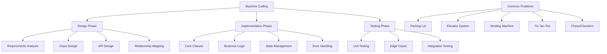
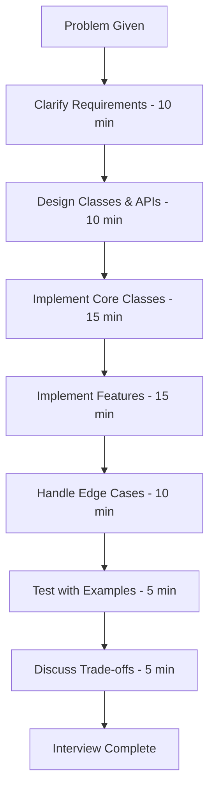
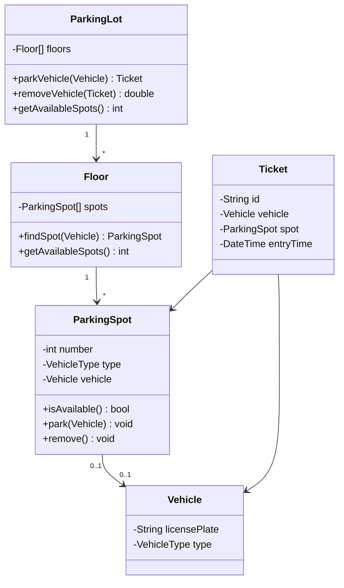
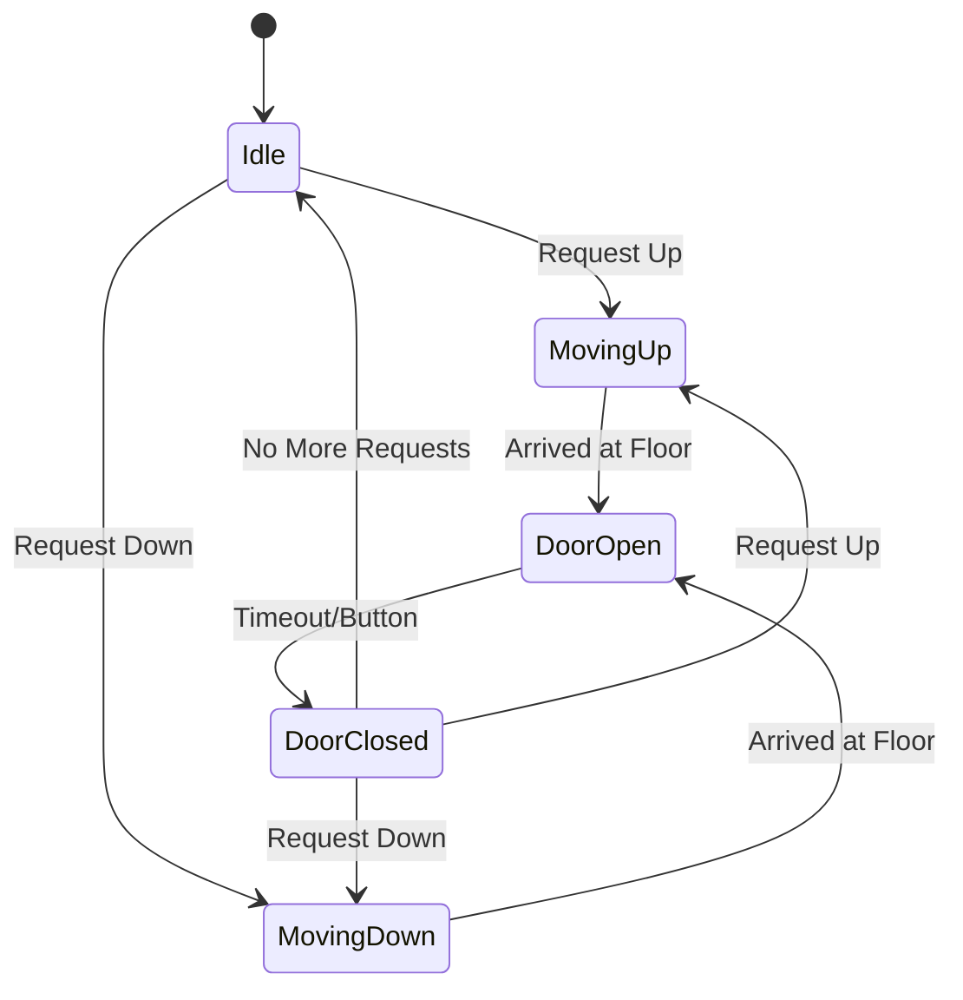
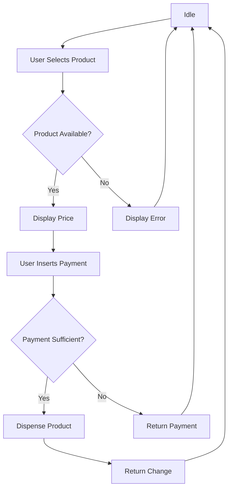

---
layout: post
title: Machine Coding Rounds
categories: Coding
tags: [Machine, Coding, Interview Preparation]
date: 2024-01-20
toc: true
---

---

## 1. Introduction

### What is Machine Coding?
Machine coding (also called "low-level design" or "LLD") is an interview format where candidates design and implement a complete, working system or component within a limited time (typically 45-90 minutes). Unlike algorithm problems that focus on isolated functions, machine coding tests your ability to design classes, define APIs, handle state, and write production-quality code for complex systems.

### Why It Matters for Interviews
Machine coding is used extensively by:
- **FAANG companies** (Amazon LLD round, Google L3+ design rounds)
- **Product companies** (Flipkart, Uber, Netflix)
- **Startups** (testing end-to-end implementation ability)
- **Mid-to-senior level roles** (demonstrating design + implementation)

It bridges the gap between system design (architecture) and coding (implementation), testing both simultaneously.

### How It Impacts Your Career
- Demonstrates object-oriented design proficiency
- Shows ability to translate requirements into working code
- Proves you can handle complexity and make design decisions
- Validates practical coding skills beyond algorithms
- Differentiates senior engineers from juniors

---

## 2. Learning Roadmap



### Timeline
| Phase | Duration | Focus |
|-------|----------|-------|
| Week 1 | Days 1-3 | OOP principles review |
| Week 1 | Days 4-7 | Design patterns (Strategy, Observer, Factory) |
| Week 2 | Days 8-10 | Class diagram design |
| Week 2 | Days 11-14 | API design and state management |
| Week 3 | Days 15-17 | Practice: Parking Lot |
| Week 3 | Days 18-21 | Practice: Elevator System |
| Week 4 | Days 22-28 | Practice: Vending Machine + full mock |

---

## 3. Theory Notes

### 3.1 Machine Coding Format

**Typical Structure (60-90 minutes):**
| Phase | Time | Activity |
|-------|------|----------|
| Requirements | 5-10 min | Clarify requirements, list features |
| Design | 10-15 min | Class diagrams, API design |
| Implementation | 30-40 min | Write working code |
| Testing | 5-10 min | Test with examples |
| Discussion | 5-10 min | Trade-offs, improvements |

### 3.2 Design Thinking Process

**Step 1: Requirements Gathering**
- What features are required?
- What are the constraints?
- What edge cases should be handled?
- What is the expected scale?

**Step 2: Core Design**
- Identify main entities (classes)
- Define relationships (inheritance, composition, aggregation)
- Design interfaces and abstract classes
- Plan state management

**Step 3: API Design**
- Define public methods for each class
- Determine parameters and return types
- Consider error handling
- Keep APIs simple and intuitive

**Step 4: Implementation**
- Start with core classes
- Implement business logic
- Handle edge cases
- Add error handling

**Step 5: Testing**
- Test normal scenarios
- Test edge cases
- Verify all features work
- Check for bugs

### 3.3 Class Design Principles

**SOLID Principles:**
| Principle | Description | Example |
|-----------|------------|---------|
| **S**ingle Responsibility | Each class has one job | ParkingLot manages spots, Ticket manages payment |
| **O**pen/Closed | Open for extension, closed for modification | Use interfaces for different payment methods |
| **L**iskov Substitution | Subtypes must be substitutable | Any Vehicle can be parked in any Spot |
| **I**nterface Segregation | Many specific interfaces over general ones | IParkable, IPayable separately |
| **D**ependency Inversion | Depend on abstractions, not concretions | ParkingLot depends on ISpot interface |

**Design Patterns Commonly Used:**
| Pattern | Use Case | Example |
|---------|---------|---------|
| **Singleton** | Single instance | ParkingLot (one instance) |
| **Strategy** | Swappable algorithms | Different payment strategies |
| **Observer** | Event notification | Notify display on spot change |
| **Factory** | Object creation | Create different vehicle types |
| **State** | State-dependent behavior | Elevator states (moving, stopped) |
| **Command** | Encapsulate actions | Parking commands |

### 3.4 Common Machine Coding Problems

#### Parking Lot System
**Classes:** ParkingLot, ParkingSpot, Vehicle, Ticket, PaymentStrategy, Display
**Features:** Park vehicle, remove vehicle, find spot, payment processing, display status

#### Elevator System
**Classes:** Elevator, ElevatorController, Request, Direction, Floor, Display
**Features:** Call elevator, move between floors, handle multiple requests, display status

#### Vending Machine
**Classes:** VendingMachine, Product, Inventory, PaymentStrategy, State
**Features:** Select product, process payment, dispense product, manage inventory

#### Tic-Tac-Toe
**Classes:** Board, Player, Game, Move, Symbol
**Features:** Make moves, check winner, handle turns, display board

#### Chess/Checkers
**Classes:** Board, Piece, Player, Game, Move, Rules
**Features:** Move validation, capture rules, check/checkmate, game state

### 3.5 State Management

**Example: Elevator States**
```
Idle → Moving Up → Door Open → Idle
Idle → Moving Down → Door Open → Idle
Door Open → Closing → Moving → Opening → Door Open
```

**Example: Vending Machine States**
```
Idle → Product Selected → Payment Processing → Dispensing → Idle
Idle → Product Selected → Payment Failed → Idle
```

### 3.6 Time Allocation

| Problem Difficulty | Total Time | Design | Code | Test |
|-------------------|------------|--------|------|------|
| Easy (Tic-Tac-Toe) | 45 min | 10 min | 25 min | 10 min |
| Medium (Parking Lot) | 60 min | 15 min | 35 min | 10 min |
| Hard (Elevator) | 90 min | 20 min | 55 min | 15 min |

---

## 4. Key Concepts

| Concept | Description | Application |
|---------|------------|-------------|
| Class Design | Defining entities and their responsibilities | All problems |
| API Design | Defining public methods and interfaces | All problems |
| State Management | Handling object states and transitions | Elevator, Vending Machine |
| Design Patterns | Reusable solutions to common problems | Strategy, Observer, Factory |
| SOLID Principles | Object-oriented design guidelines | All problems |
| Composition over Inheritance | Prefer composing objects over inheriting | All problems |
| Error Handling | Gracefully handling invalid operations | All problems |
| Time Management | Allocating time across phases | All problems |

---

## 5. Frequently Asked Interview Questions

### Beginner Level

1. **Q: What is machine coding?**
   A: An interview format where you design and implement a complete system or component within a time limit. Unlike algorithm problems, machine coding tests your ability to design classes, define APIs, manage state, and write production-quality code.

2. **Q: How is machine coding different from system design?**
   A: System design focuses on high-level architecture (databases, APIs, scalability). Machine coding focuses on implementing specific components with actual code. System design is more abstract; machine coding is more concrete.

3. **Q: What programming language should I use?**
   A: Use the language you're most comfortable with. OOP languages (Java, Python, C#, C++) are preferred because machine coding requires class design. Python is great for speed; Java/C# for structure.

4. **Q: Do I need to write perfect code?**
   A: No, but it should be working, readable, and demonstrate good design. Interviewers value design decisions and problem-solving over syntax perfection. Clean, well-structured code is more important than optimal performance.

5. **Q: How do I start a machine coding problem?**
   A: (1) Clarify requirements — ask what features are needed. (2) Identify core classes and their responsibilities. (3) Design the relationships. (4) Define APIs. (5) Implement. (6) Test.

6. **Q: What if I can't finish the entire implementation?**
   A: Prioritize core features. Implement the most important ones fully. State what you'd add with more time. A clean, working core is better than a buggy, incomplete implementation.

7. **Q: How important is error handling?**
   A: Very. Handle invalid operations gracefully (e.g., parking a car in a full lot, selecting an out-of-stock product). Use exceptions or return error codes. This shows production-quality thinking.

8. **Q: Should I use design patterns?**
   A: Yes, when appropriate. Common patterns: Strategy (payment methods), Singleton (single instance), Observer (notifications), Factory (object creation). Don't over-engineer — use patterns that solve real problems.

### Intermediate Level

9. **Q: How do I design a Parking Lot system?**
   A: Start with core entities: ParkingLot, ParkingSpot, Vehicle, Ticket. Design APIs: park(vehicle), remove(vehicle), findSpot(). Handle: different vehicle sizes, spot allocation strategy, payment processing, display.

10. **Q: What's the difference between composition and inheritance?**
    A: Composition: "has-a" relationship (Car has an Engine). Inheritance: "is-a" relationship (ElectricCar is a Car). Prefer composition because it's more flexible and follows SOLID principles.

11. **Q: How do I handle state in an Elevator system?**
    A: Use the State pattern. Define states: Idle, MovingUp, MovingDown, DoorOpen, DoorClosed. Each state handles requests differently. Transitions between states based on events.

12. **Q: What if the interviewer asks for a feature I didn't plan for?**
    A: Acknowledge the requirement, discuss how it fits into the design, and implement it. Flexibility is valued. "That's a good feature. I'll add a new class/method to handle it."

13. **Q: How do I handle multiple payment methods in a Vending Machine?**
    A: Use the Strategy pattern. Define a PaymentStrategy interface with methods like `pay(amount)`. Implement concrete strategies: CashPayment, CardPayment, UpiPayment. The VendingMachine uses the current strategy.

14. **Q: Should I use interfaces or abstract classes?**
    A: Use interfaces when you need to define a contract that multiple unrelated classes implement. Use abstract classes when you need shared code among related classes. In interviews, interfaces are often cleaner.

15. **Q: How do I handle concurrency in machine coding?**
    A: For basic machine coding, concurrency is usually not required. If asked, discuss thread safety: use locks, synchronized blocks, or immutable objects. Mention that production systems would need proper synchronization.

16. **Q: What about scalability in machine coding?**
    A: Machine coding focuses on design and implementation, not scalability. However, mention scalability considerations: "In production, I'd use a database instead of in-memory storage" or "This design supports adding new features easily."

### Advanced Level

17. **Q: How do I design a Chess game?**
    A: Entities: Board, Piece (with subclasses for each type), Player, Game, Move. Rules engine validates moves. Game manages state. Each Piece has move validation logic. Handle: check, checkmate, castling, en passant.

18. **Q: How do I handle complex business rules?**
    A: Separate business logic from data structures. Use strategy pattern for different rule sets. Keep rules in dedicated classes. This makes rules testable and modifiable independently.

19. **Q: What about persistence?**
    A: In interviews, in-memory storage is usually sufficient. If asked about persistence, mention: "I'd use a database with appropriate schema. For now, I'm using in-memory data structures." Discuss trade-offs.

20. **Q: How do I handle invalid states?**
    A: Prevent invalid states through design. Use the State pattern to restrict transitions. Validate inputs before operations. Throw descriptive exceptions for invalid operations. "This prevents the system from ever being in an invalid state."

### FAANG Level

21. **Q: How do Amazon machine coding interviews differ?**
    A: Amazon emphasizes practical, production-quality code. They look for: proper error handling, edge case management, clean API design, and adherence to their leadership principles (e.g., "Customer Obsession" reflected in user-friendly design).

22. **Q: What design decisions do interviewers evaluate?**
    A: (1) Class responsibilities (Single Responsibility). (2) Relationship choices (composition vs inheritance). (3) API simplicity. (4) Error handling. (5) State management. (6) Pattern usage. (7) Code readability. (8) Testability.

23. **Q: How do you balance completeness with code quality?**
    A: Prioritize core features with clean code over all features with messy code. Implement the happy path fully, then add error handling and edge cases. A complete, clean core is better than an incomplete, buggy system.

24. **Q: What if you realize your design is wrong mid-implementation?**
    A: Acknowledge it, explain why it's wrong, and refactor. "I realize this approach won't scale for [reason]. Let me refactor to use [better approach]." Interviewers value self-correction.

25. **Q: How do you prepare for machine coding interviews?**
    A: (1) Practice 5-10 common problems. (2) Learn SOLID principles deeply. (3) Master 3-4 design patterns. (4) Practice under timed conditions. (5) Review and refactor your solutions. (6) Get feedback from peers.

---

## 6. Hands-on Practice

### Exercise 1: Design a Parking Lot
Design a parking lot with:
- Multiple floor levels
- Different vehicle sizes (S, M, L, XL)
- Spot allocation strategy
- Payment processing
- Display showing available spots

**Start by listing classes:**
```
ParkingLot, Floor, ParkingSpot, Vehicle, Ticket, PaymentStrategy, Display
```

### Exercise 2: Design a Vending Machine
Design a vending machine with:
- Multiple product types
- Inventory management
- Payment processing (cash, card, UPI)
- Product dispensing
- State management

**States:** Idle, ProductSelected, PaymentProcessing, Dispensing, Dispensed

### Exercise 3: Design an Elevator System
Design a multi-elevator system with:
- Multiple elevators
- Multiple floors
- Request handling (up/down buttons)
- Optimal elevator selection
- Door operations

### Exercise 4: Design a Tic-Tac-Toe Game
Design a tic-tac-toe game with:
- 2-player mode
- Board management
- Move validation
- Winner detection
- Draw detection

### Exercise 5: Design a Library Management System
Design a library system with:
- Book catalog
- Member management
- Book borrowing and returning
- Fine calculation
- Search functionality

### Exercise 6: Design an ATM System
Design an ATM with:
- Card insertion and PIN validation
- Account management
- Cash withdrawal
- Balance inquiry
- Receipt generation

### Exercise 7: Design a Movie Ticket Booking System
Design a booking system with:
- Movie listings
- Show timing
- Seat selection
- Booking and cancellation
- Payment processing

### Exercise 8: Design a Chat Application
Design a chat system with:
- User management
- 1-on-1 messaging
- Group messaging
- Message history
- Online/offline status

### Exercise 9: Design a URL Shortener
Design a URL shortener with:
- URL shortening
- URL redirection
- Analytics (click count)
- Custom aliases
- Expiration

### Exercise 10: Design a Rate Limiter
Design a rate limiter with:
- Multiple algorithms (token bucket, sliding window)
- Per-user limits
- Per-endpoint limits
- Configurable rules
- Thread safety

---

## 7. Real FAANG Interview Questions

| Company | Problem | Difficulty | Time |
|---------|---------|------------|------|
| Amazon | Design a Parking Lot | Medium | 60 min |
| Amazon | Design a Library Management System | Medium | 60 min |
| Google | Design an Elevator System | Hard | 90 min |
| Meta | Design a Chat Application | Medium | 60 min |
| Apple | Design a Vending Machine | Medium | 60 min |
| Microsoft | Design a Chess Game | Hard | 90 min |
| Uber | Design a Ride Booking System | Medium | 60 min |
| Netflix | Design a Movie Ticket Booking | Medium | 60 min |
| Stripe | Design a Payment System | Hard | 90 min |
| Airbnb | Design a Hotel Booking System | Medium | 60 min |

---

## 8. Common Mistakes

| Mistake | Description | How to Avoid |
|---------|------------|--------------|
| Jumping into code | Starting to code before designing | Spend 10-15 min on design first |
| Ignoring requirements | Not clarifying what's needed | Ask questions before starting |
| Over-engineering | Adding unnecessary complexity | Start simple, add features incrementally |
| Under-engineering | Missing key classes and features | Plan comprehensively before coding |
| Poor API design | Confusing, inconsistent method names | Use clear, descriptive method names |
| No error handling | Code crashes on invalid input | Handle edge cases and invalid operations |
| No state management | Losing track of object states | Use State pattern for stateful objects |
| Ignoring SOLID | Monolithic classes, tight coupling | Follow SOLID principles |
| Not testing | Writing code without verifying | Test with examples after implementing |
| Poor time management | Running out of time | Allocate time for each phase |

---

## 9. Best Practices

1. **Clarify requirements first** — Ask what features are needed before designing.
2. **Design before coding** — Spend 10-15 minutes on class diagrams and API design.
3. **Start simple** — Implement core features first, then add complexity.
4. **Follow SOLID principles** — Single responsibility, open/closed, etc.
5. **Use composition over inheritance** — More flexible and maintainable.
6. **Handle errors gracefully** — Invalid operations should give clear feedback.
7. **Use meaningful names** — Classes, methods, and variables should be self-documenting.
8. **Manage state properly** — Use the State pattern for complex state transitions.
9. **Test as you go** — Verify each feature works before moving to the next.
10. **Discuss trade-offs** — Explain why you chose one approach over another.
11. **Keep APIs simple** — Methods should do one thing well.
12. **Practice under time pressure** — Simulate real interview conditions.

---

## 10. Cheat Sheet

```
+---------------------------------------------------------------+
|              MACHINE CODING CHEAT SHEET                        |
+---------------------------------------------------------------+
|                                                               |
|  INTERVIEW TIMELINE (60 min)                                  |
|  0-10 min:  Requirements clarification                        |
|  10-20 min: Design (classes, APIs, relationships)             |
|  20-50 min: Implementation (core → features → edge cases)     |
|  50-55 min: Testing and debugging                             |
|  55-60 min: Discussion (trade-offs, improvements)             |
|                                                               |
|  SOLID PRINCIPLES                                             |
|  S - Single Responsibility (one class = one job)              |
|  O - Open/Closed (extend, don't modify)                      |
|  L - Liskov Substitution (subtypes are substitutable)         |
|  I - Interface Segregation (many small interfaces)            |
|  D - Dependency Inversion (depend on abstractions)            |
|                                                               |
|  COMMON DESIGN PATTERNS                                       |
|  Singleton   - Single instance (ParkingLot)                  |
|  Strategy    - Swappable algorithms (Payment)                |
|  Observer    - Event notifications (Display updates)          |
|  Factory     - Object creation (Vehicle types)                |
|  State       - State-dependent behavior (Elevator)            |
|  Command     - Encapsulate actions (Parking commands)         |
|                                                               |
|  CLASS DESIGN CHECKLIST                                       |
|  [ ] Identify core entities                                   |
|  [ ] Define responsibilities                                  |
|  [ ] Map relationships (has-a, is-a)                         |
|  [ ] Design public APIs                                       |
|  [ ] Handle edge cases                                        |
|  [ ] Apply SOLID principles                                   |
|  [ ] Use appropriate design patterns                          |
|                                                               |
|  COMMON PROBLEMS                                              |
|  Parking Lot, Elevator System, Vending Machine,              |
|  Tic-Tac-Toe, Chess, Library, ATM, Chat App,                |
|  URL Shortener, Rate Limiter                                  |
|                                                               |
+---------------------------------------------------------------+
```

---

## 11. Flash Cards

| # | Question | Answer |
|---|----------|--------|
| 1 | What is machine coding? | Design + implement a complete system in limited time |
| 2 | How is it different from system design? | Machine coding = actual code; system design = architecture |
| 3 | What does SOLID stand for? | Single Responsibility, Open/Closed, Liskov, Interface Segregation, Dependency Inversion |
| 4 | When to use Singleton pattern? | When only one instance should exist (e.g., ParkingLot) |
| 5 | When to use Strategy pattern? | When you need swappable algorithms (e.g., Payment) |
| 6 | Composition vs. Inheritance? | Prefer composition (has-a) over inheritance (is-a) |
| 7 | How do you handle state transitions? | Use the State pattern |
| 8 | What's the #1 mistake in machine coding? | Jumping into code before designing |
| 9 | How long should design take? | 10-15 minutes of a 60-minute session |
| 10 | What if you can't finish? | Prioritize core features, state what you'd add later |
| 11 | How do you handle errors? | Validate inputs, throw descriptive exceptions |
| 12 | What language is best for machine coding? | OOP language you're comfortable with (Java, Python, C#) |
| 13 | What's a common machine coding problem? | Parking Lot, Elevator System, Vending Machine |
| 14 | How do you test your implementation? | Walk through examples, test edge cases |
| 15 | Should you discuss trade-offs? | Yes — explain why you chose one approach |
| 16 | What is API design? | Defining public methods, parameters, and return types |
| 17 | How do you manage complexity? | Break into classes, each with single responsibility |
| 18 | What's the Observer pattern for? | Event notifications (e.g., display updates) |
| 19 | What's the Factory pattern for? | Object creation based on type |
| 20 | How do you handle time pressure? | Prioritize core features, skip non-essentials |

---

## 12. Mind Map

```
Machine Coding
│
├── Design Phase
│   ├── Requirements Analysis
│   ├── Class Design (entities, responsibilities)
│   ├── API Design (methods, parameters)
│   ├── Relationship Mapping (composition, inheritance)
│   └── State Management
│
├── Implementation Phase
│   ├── Core Classes
│   ├── Business Logic
│   ├── Error Handling
│   ├── Edge Cases
│   └── State Transitions
│
├── Design Patterns
│   ├── Singleton (single instance)
│   ├── Strategy (swappable algorithms)
│   ├── Observer (event notifications)
│   ├── Factory (object creation)
│   ├── State (state-dependent behavior)
│   └── Command (encapsulate actions)
│
├── SOLID Principles
│   ├── Single Responsibility
│   ├── Open/Closed
│   ├── Liskov Substitution
│   ├── Interface Segregation
│   └── Dependency Inversion
│
└── Common Problems
    ├── Parking Lot
    ├── Elevator System
    ├── Vending Machine
    ├── Tic-Tac-Toe
    ├── Chess
    ├── Library System
    └── ATM
```

---

## 13. Mermaid Diagrams

### Diagram 1: Machine Coding Process


### Diagram 2: Parking Lot Design


### Diagram 3: Elevator State Machine


### Diagram 4: Vending Machine Flow


---

## 14. Code Examples

### Example 1: Parking Lot System
```python
from enum import Enum
from datetime import datetime
import uuid

class VehicleType(Enum):
    SMALL = "small"
    MEDIUM = "medium"
    LARGE = "large"
    XLARGE = "xlarge"

class Vehicle:
    def __init__(self, license_plate, vehicle_type):
        self.license_plate = license_plate
        self.vehicle_type = vehicle_type

class ParkingSpot:
    def __init__(self, number, vehicle_type):
        self.number = number
        self.vehicle_type = vehicle_type
        self.vehicle = None

    def is_available(self):
        return self.vehicle is None

    def park(self, vehicle):
        if not self.is_available():
            raise Exception(f"Spot {self.number} is already occupied")
        self.vehicle = vehicle

    def remove(self):
        vehicle = self.vehicle
        self.vehicle = None
        return vehicle

class Floor:
    def __init__(self, floor_number, small_spots, medium_spots, large_spots):
        self.floor_number = floor_number
        self.spots = []
        spot_num = 1
        for _ in range(small_spots):
            self.spots.append(ParkingSpot(spot_num, VehicleType.SMALL))
            spot_num += 1
        for _ in range(medium_spots):
            self.spots.append(ParkingSpot(spot_num, VehicleType.MEDIUM))
            spot_num += 1
        for _ in range(large_spots):
            self.spots.append(ParkingSpot(spot_num, VehicleType.LARGE))
            spot_num += 1

    def find_spot(self, vehicle):
        for spot in self.spots:
            if spot.is_available() and self._can_fit(vehicle, spot):
                return spot
        return None

    def _can_fit(self, vehicle, spot):
        size_order = {VehicleType.SMALL: 1, VehicleType.MEDIUM: 2,
                      VehicleType.LARGE: 3, VehicleType.XLARGE: 4}
        return size_order[vehicle.vehicle_type] <= size_order[spot.vehicle_type]

    def get_available_count(self):
        return sum(1 for spot in self.spots if spot.is_available())

class Ticket:
    def __init__(self, vehicle, spot):
        self.id = str(uuid.uuid4())[:8]
        self.vehicle = vehicle
        self.spot = spot
        self.entry_time = datetime.now()

    def calculate_fee(self, hourly_rate=10):
        duration = (datetime.now() - self.entry_time).total_seconds() / 3600
        return round(duration * hourly_rate, 2)

class ParkingLot:
    _instance = None

    def __new__(cls, *args, **kwargs):
        if cls._instance is None:
            cls._instance = super().__new__(cls)
        return cls._instance

    def __init__(self, num_floors=3):
        if hasattr(self, 'initialized'):
            return
        self.floors = []
        for i in range(num_floors):
            self.floors.append(Floor(i + 1, small_spots=10, medium_spots=8, large_spots=5))
        self.tickets = {}
        self.initialized = True

    def park_vehicle(self, vehicle):
        for floor in self.floors:
            spot = floor.find_spot(vehicle)
            if spot:
                spot.park(vehicle)
                ticket = Ticket(vehicle, spot)
                self.tickets[ticket.id] = ticket
                print(f"Vehicle parked: Floor {floor.floor_number}, Spot {spot.number}")
                return ticket
        raise Exception("No parking spot available")

    def remove_vehicle(self, ticket_id):
        if ticket_id not in self.tickets:
            raise Exception("Invalid ticket")
        ticket = self.tickets.pop(ticket_id)
        ticket.spot.remove()
        fee = ticket.calculate_fee()
        print(f"Vehicle removed. Fee: ${fee}")
        return fee

    def get_available_spots(self):
        total = sum(floor.get_available_count() for floor in self.floors)
        return total

# Usage
lot = ParkingLot(num_floors=2)
car = Vehicle("ABC-1234", VehicleType.MEDIUM)
ticket = lot.park_vehicle(car)
print(f"Available spots: {lot.get_available_spots()}")
lot.remove_vehicle(ticket.id)
```

### Example 2: Vending Machine
```python
from enum import Enum

class State(Enum):
    IDLE = "idle"
    PRODUCT_SELECTED = "product_selected"
    PAYMENT_PROCESSING = "payment_processing"
    DISPENSING = "dispensing"

class Product:
    def __init__(self, name, price, code):
        self.name = name
        self.price = price
        self.code = code

class Inventory:
    def __init__(self):
        self.products = {}

    def add_product(self, product, quantity):
        self.products[product.code] = {"product": product, "quantity": quantity}

    def get_product(self, code):
        if code in self.products and self.products[code]["quantity"] > 0:
            return self.products[code]["product"]
        return None

    def reduce_quantity(self, code):
        if code in self.products:
            self.products[code]["quantity"] -= 1

class VendingMachine:
    def __init__(self):
        self.state = State.IDLE
        self.inventory = Inventory()
        self.selected_product = None
        self.inserted_amount = 0.0

    def add_product(self, product, quantity):
        self.inventory.add_product(product, quantity)

    def select_product(self, code):
        if self.state != State.IDLE:
            raise Exception(f"Cannot select product in state {self.state}")

        product = self.inventory.get_product(code)
        if not product:
            raise Exception(f"Product {code} not available")

        self.selected_product = product
        self.state = State.PRODUCT_SELECTED
        print(f"Selected: {product.name} - ${product.price}")

    def insert_coin(self, amount):
        if self.state != State.PRODUCT_SELECTED:
            raise Exception("Select a product first")

        self.inserted_amount += amount
        print(f"Inserted: ${amount}. Total: ${self.inserted_amount}")

        if self.inserted_amount >= self.selected_product.price:
            self.state = State.PAYMENT_PROCESSING
            self._process_payment()

    def _process_payment(self):
        if self.inserted_amount >= self.selected_product.price:
            change = self.inserted_amount - self.selected_product.price
            self.inserted_amount = 0
            self.state = State.DISPENSING
            self._dispense_product()
            if change > 0:
                print(f"Change returned: ${change}")
        else:
            self.state = State.PRODUCT_SELECTED
            print("Insufficient payment. Insert more coins.")

    def _dispense_product(self):
        self.inventory.reduce_quantity(self.selected_product.code)
        print(f"Dispensed: {self.selected_product.name}")
        self.selected_product = None
        self.state = State.IDLE

    def display_products(self):
        print("\n--- Available Products ---")
        for code, data in self.inventory.products.items():
            if data["quantity"] > 0:
                print(f"{code}: {data['product'].name} - ${data['product'].price} ({data['quantity']} left)")

# Usage
vm = VendingMachine()
vm.add_product(Product("Cola", 1.50, "A1"), 10)
vm.add_product(Product("Chips", 1.00, "B1"), 5)
vm.add_product(Product("Candy", 0.75, "C1"), 8)

vm.display_products()
vm.select_product("A1")
vm.insert_coin(1.00)
vm.insert_coin(1.00)
```

---

## 15. Projects

### Mini Project 1: Parking Lot System
Implement a complete parking lot with multiple floors, vehicle types, and payment processing.

### Mini Project 2: Vending Machine
Build a vending machine with state management, inventory, and multiple payment methods.

### Mini Project 3: Tic-Tac-Toe
Implement a complete tic-tac-toe game with 2-player mode and win detection.

### Intermediate Project 1: Elevator System
Design and implement a multi-elevator system with optimal scheduling.

### Intermediate Project 2: Library Management System
Build a library system with book management, borrowing, and fine calculation.

### Advanced Project 1: Chess Game
Implement a complete chess game with piece movement validation and check/checkmate detection.

### Advanced Project 2: Chat Application
Design a real-time chat system with user management, messaging, and group support.

### Project Ideas (10 total)
1. ATM system with PIN validation
2. Movie ticket booking system
3. Hotel booking system
4. URL shortener
5. Rate limiter
6. Traffic light controller
7. Bookshelf organizer
8. Snake and Ladders game
9. Sudoku solver with UI
10. File system simulator

---

## 16. Resources

### Practice Websites
| Website | URL | Focus |
|---------|-----|-------|
| LeetCode | leetcode.com | Design problems |
| LLD Problems | github.com/SilenceLove/LLD | LLD practice |
| DesignGurus | designgurus.io | Machine coding |
| Educative | educative.io | LLD courses |

### Books
| Book | Author | Level |
|------|--------|-------|
| *Head First Design Patterns* | Freeman & Robson | Beginner |
| *Design Patterns (GoF)* | Gamma et al. | Reference |
| *Clean Code* | Robert Martin | Professional |
| *Effective Java* | Joshua Bloch | Intermediate |

### Documentation
- SOLID Principles (Wikipedia)
- Gang of Four Design Patterns
- Python Design Patterns
- Java Design Patterns
- LLD Interview Guide (GitHub)

### YouTube Channels
| Channel | Focus |
|---------|-------|
| take U forward | LLD concepts |
| NeetCode | Design problems |
| ByteByteGo | System + LLD |
| Tech Dummies | Machine coding |

### Blogs
- Medium (LLD tagged posts)
- Dev.to (Machine coding)
- GeeksforGeeks (Design patterns)
- Baeldung (Java design patterns)

### Certifications
- Oracle Certified Professional (Java)
- Microsoft Certified: Azure Developer
- AWS Solutions Architect
- Google Cloud Professional Developer

---

## 17. Checklist

- [ ] I understand the machine coding format and timeline
- [ ] I can clarify requirements before designing
- [ ] I can design classes with single responsibilities
- [ ] I can define clear APIs for each class
- [ ] I understand SOLID principles and can apply them
- [ ] I can use common design patterns (Strategy, Singleton, Observer, Factory, State)
- [ ] I can manage state transitions properly
- [ ] I can handle errors gracefully
- [ ] I can implement core features within time limits
- [ ] I can test my implementation with examples
- [ ] I can discuss trade-offs and improvements
- [ ] I have practiced at least 5 common problems
- [ ] I can code under time pressure
- [ ] I write clean, readable code
- [ ] I handle edge cases
- [ ] I am familiar with OOP language features
- [ ] I can refactor code when I find issues
- [ ] I can explain design decisions clearly
- [ ] I feel confident about machine coding interviews

---

## 18. Revision Notes

### Key Frameworks
- **SOLID:** Single Responsibility, Open/Closed, Liskov, Interface Segregation, Dependency Inversion
- **Design Patterns:** Singleton, Strategy, Observer, Factory, State, Command
- **Composition over Inheritance:** Prefer has-a over is-a

### One-Day Revision Plan
| Time | Activity |
|------|----------|
| Morning (1.5 hrs) | Review SOLID principles and design patterns |
| Mid-morning (1 hr) | Design a Parking Lot (paper + code) |
| Afternoon (2 hrs) | Implement core classes of Parking Lot |
| Late afternoon (1 hr) | Add features and test |
| Evening (1 hr) | Review design decisions and trade-offs |

### One-Week Revision Plan
| Day | Focus |
|-----|-------|
| Monday | SOLID principles + design patterns review |
| Tuesday | Parking Lot (design + implement) |
| Wednesday | Vending Machine (design + implement) |
| Thursday | Elevator System (design + implement) |
| Friday | Tic-Tac-Toe (design + implement) |
| Saturday | Library System or ATM (design + implement) |
| Sunday | Full mock machine coding session |

---

## 19. Mock Interview Questions

### Round 1: Easy (45 minutes)
Design a Tic-Tac-Toe game for 2 players.

### Round 2: Medium (60 minutes)
Design a Parking Lot with multiple floors, vehicle sizes, and payment processing.

### Round 3: Medium (60 minutes)
Design a Vending Machine with product selection, payment processing, and inventory management.

### Round 4: Hard (90 minutes)
Design an Elevator System for a multi-story building with optimal scheduling.

---

## 20. Difficulty Rating

| Skill | Difficulty (1-5) | Interview Frequency | Priority |
|-------|-------------------|--------------------|----|
| Class Design | 3 | Very High | Must Know |
| API Design | 3 | Very High | Must Know |
| SOLID Principles | 3 | High | Must Know |
| Design Patterns | 3 | High | Should Know |
| State Management | 4 | Medium | Should Know |
| Error Handling | 3 | Very High | Must Know |
| Time Management | 3 | Very High | Must Know |
| Composition vs Inheritance | 3 | High | Should Know |
| Testing | 3 | High | Should Know |
| Trade-off Discussion | 3 | Medium | Should Know |

---

## 21. Summary

Machine coding tests your ability to design and implement complete systems, bridging the gap between theoretical knowledge and practical coding skills.

**Key Takeaways:**
- Always design before coding (10-15 minutes minimum)
- Follow SOLID principles and use appropriate design patterns
- Start with core features, then add complexity
- Handle errors and edge cases gracefully
- Manage state properly using the State pattern
- Test your implementation before declaring done
- Discuss trade-offs and improvements with the interviewer
- Practice common problems (Parking Lot, Vending Machine, Elevator)

**Interview Success Formula:**
Machine Coding Success = Design Thinking + Clean Code + SOLID Principles + Error Handling

**Next Steps:**
1. Review SOLID principles and design patterns
2. Practice 5+ common machine coding problems
3. Time yourself to build speed
4. Get feedback on your code quality
5. Practice explaining design decisions

---

*Last Updated: July 2026*
*Total Sections: 21*
*Estimated Study Time: 4 weeks (1-2 hours daily)*

