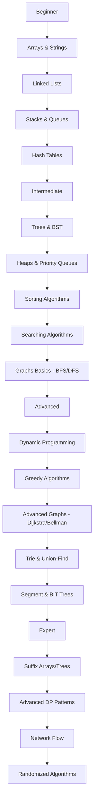
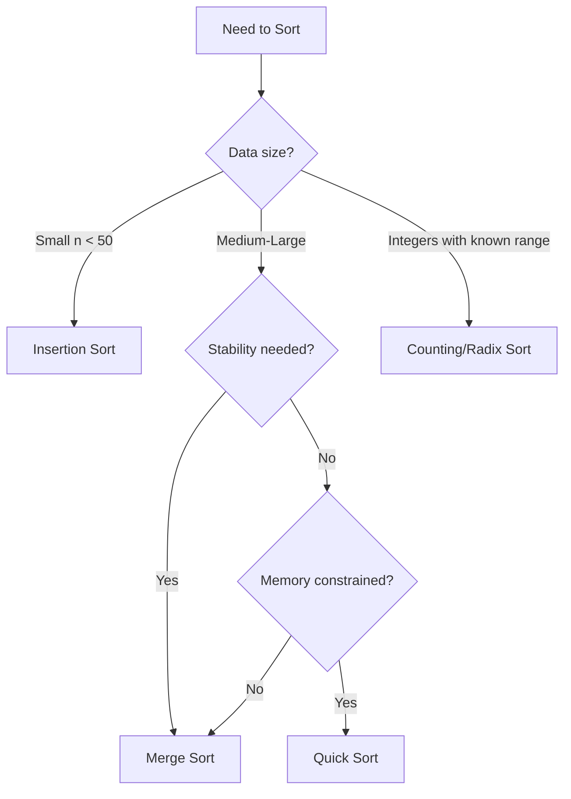
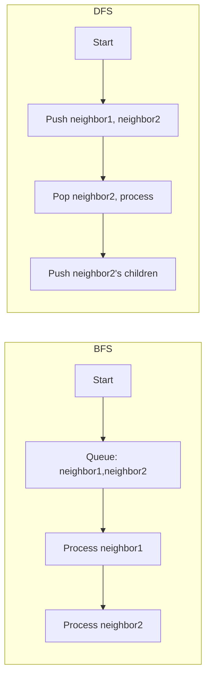
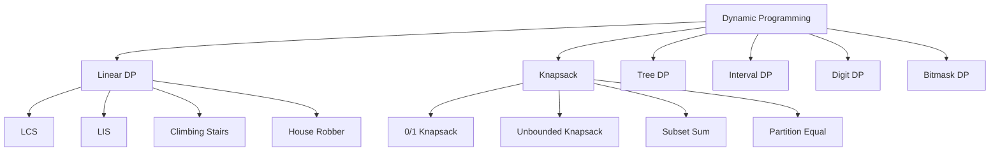

---
layout: post
title: Data Structures & Algorithms
categories: Programming
tags: [DSA, Interview Preparation]
date: 2024-01-25
toc: true
---

> **Master DSA concepts, patterns, and problems to ace technical interviews at top companies.**

---

## Table of Contents

1. [Introduction](#introduction)
2. [Learning Roadmap](#learning-roadmap)
3. [Theory Notes](#theory-notes)
4. [Key Concepts](#key-concepts)
5. [Frequently Asked Interview Questions](#frequently-asked-interview-questions)
6. [Hands-on Practice](#hands-on-practice)
7. [Coding Problems](#coding-problems)
8. [Real FAANG Interview Questions](#real-faang-interview-questions)
9. [Common Mistakes](#common-mistakes)
10. [Best Practices](#best-practices)
11. [Cheat Sheet](#cheat-sheet)
12. [Flash Cards](#flash-cards)
13. [Mind Map](#mind-map)
14. [Mermaid Diagrams](#mermaid-diagrams)
15. [Code Examples](#code-examples)
16. [Project Ideas](#project-ideas)
17. [Resources](#resources)
18. [Checklist](#checklist)
19. [Revision Notes](#revision-notes)
20. [Mock Interview](#mock-interview)
21. [Difficulty Rating](#difficulty-rating)
22. [Summary](#summary)

---

## Introduction

### What is DSA?

**Data Structures** are specialized formats for organizing, processing, retrieving, and storing data efficiently. **Algorithms** are step-by-step procedures or formulas for solving problems.

### Why DSA Matters for Interviews

| Reason | Detail |
|--------|--------|
| **Problem Solving** | Demonstrates logical thinking and analytical ability |
| **Optimization** | Shows you can write efficient, scalable code |
| **Foundation** | Underpins all software engineering work |
| **Filtering** | Top companies use DSA to filter candidates |
| **Transferable** | Skills apply across languages and domains |

### Where DSA is Used

- **Operating Systems** — Process scheduling, memory management
- **Databases** — Indexing (B-Trees), query optimization
- **Networking** — Routing algorithms, packet scheduling
- **Compiler Design** — Parsing, symbol tables
- **AI/ML** — Graph neural networks, search trees, priority queues
- **Game Development** — Spatial partitioning, pathfinding (A*)
- **Web Development** — Caching (LRU), auto-complete (Trie)

---

## Learning Roadmap



### Beginner (Weeks 1–4)
- [ ] Arrays, Strings, Two Pointers
- [ ] Linked Lists (Singly, Doubly)
- [ ] Stacks, Queues
- [ ] Hash Maps, Hash Sets
- [ ] Basic Sorting & Searching

### Intermediate (Weeks 5–10)
- [ ] Trees, Binary Search Trees
- [ ] Heaps / Priority Queues
- [ ] Recursion & Backtracking
- [ ] Graphs — BFS, DFS
- [ ] Basic Dynamic Programming
- [ ] Sorting — Merge, Quick, Heap

### Advanced (Weeks 11–20)
- [ ] Dynamic Programming — all patterns
- [ ] Greedy Algorithms
- [ ] Graphs — Dijkstra, Bellman-Ford, Floyd-Warshall, Topological Sort
- [ ] Trie, Union-Find
- [ ] Segment Tree, Binary Indexed Tree
- [ ] Advanced Tree Structures (AVL, Red-Black)

### Expert (Weeks 20+)
- [ ] Suffix Arrays & Suffix Trees
- [ ] Network Flow (Ford-Fulkerson)
- [ ] Computational Geometry
- [ ] Advanced DP (Bitmask, Digit DP, Interval DP)
- [ ] Randomized & Approximation Algorithms

---

## Theory Notes

### Arrays

An array stores elements in contiguous memory. Supports O(1) random access.

| Operation | Average | Worst |
|-----------|---------|-------|
| Access | O(1) | O(1) |
| Search | O(n) | O(n) |
| Insert (end) | O(1) | O(n) |
| Insert (index) | O(n) | O(n) |
| Delete | O(n) | O(n) |

**Key Patterns:**
- **Two Pointers** — Opposite ends or same direction for sliding window
- **Sliding Window** — Subarray/substring problems
- **Prefix Sum** — Range sum queries
- **Kadane's Algorithm** — Maximum subarray sum

---

### Linked Lists

Nodes with data and pointer(s) to the next node.

```
[Data|Next] → [Data|Next] → [Data|Next] → NULL
```

| Operation | Singly | Doubly |
|-----------|--------|--------|
| Insert at head | O(1) | O(1) |
| Insert at tail | O(n) / O(1)* | O(1) |
| Delete by value | O(n) | O(n) |
| Search | O(n) | O(n) |

*\*with tail pointer*

**Types:** Singly, Doubly, Circular

**Key Techniques:** Fast/slow pointers (cycle detection), reverse in-place, merge two sorted lists.

---

### Stacks

LIFO (Last In, First Out). Think: undo, call stack, balanced parentheses.

| Operation | Complexity |
|-----------|------------|
| Push | O(1) |
| Pop | O(1) |
| Peek/Top | O(1) |
| Search | O(n) |

**Applications:** Expression evaluation, DFS, backtracking, monotonic stack.

---

### Queues

FIFO (First In, First Out). Think: BFS, task scheduling, buffers.

| Operation | Array | Linked List |
|-----------|-------|-------------|
| Enqueue | O(1)* | O(1) |
| Dequeue | O(n)* | O(1) |
| Peek | O(1) | O(1) |

*\*amortized with circular buffer*

**Variants:** Priority Queue (heap), Deque (double-ended).

---

### Trees

A hierarchical structure with a root node and children.

#### Binary Search Tree (BST)

- Left child < Parent < Right child
- Search, Insert, Delete: O(log n) average, O(n) worst

```python
class TreeNode:
    def __init__(self, val=0, left=None, right=None):
        self.val = val
        self.left = left
        self.right = right
```

#### AVL Tree

Self-balancing BST where the height difference of left and right subtrees is at most 1. All operations guaranteed O(log n).

#### Red-Black Tree

Self-balancing BST using color properties. Guarantees O(log n) for insert, delete, search. Used in Java TreeMap, C++ std::map.

---

### Heaps

Complete binary tree satisfying the heap property.

- **Min-Heap:** Parent ≤ Children
- **Max-Heap:** Parent ≥ Children

| Operation | Complexity |
|-----------|------------|
| Insert | O(log n) |
| Extract Min/Max | O(log n) |
| Peek | O(1) |
| Build Heap | O(n) |

**Applications:** Priority queues, heap sort, top-K problems, median maintenance.

---

### Hash Tables

Key-value mapping with O(1) average-case operations via hash function.

| Operation | Average | Worst |
|-----------|---------|-------|
| Insert | O(1) | O(n) |
| Lookup | O(1) | O(n) |
| Delete | O(1) | O(n) |

**Collision Resolution:** Chaining (linked lists), Open Addressing (linear/quadratic probing).

**Applications:** Frequency counting, two-sum, anagrams, caching.

---

### Graphs

Collections of vertices (nodes) and edges (connections).

**Representations:**
- **Adjacency Matrix** — O(1) edge lookup, O(V²) space
- **Adjacency List** — O(degree) edge lookup, O(V+E) space

#### BFS (Breadth-First Search)
Explores level by level. Uses a queue. Finds shortest path in unweighted graphs.

#### DFS (Depth-First Search)
Explores as deep as possible before backtracking. Uses a stack (or recursion).

#### Dijkstra's Algorithm
Single-source shortest path for non-negative weights. Uses a min-heap/priority queue. Time: O((V+E) log V).

#### Bellman-Ford Algorithm
Single-source shortest path, handles negative weights. Time: O(V × E). Detects negative cycles.

#### Topological Sort
Linear ordering of vertices in a DAG such that for every directed edge (u, v), u comes before v.

---

### Sorting Algorithms

| Algorithm | Best | Average | Worst | Space | Stable |
|-----------|------|---------|-------|-------|--------|
| Bubble Sort | O(n) | O(n²) | O(n²) | O(1) | Yes |
| Selection Sort | O(n²) | O(n²) | O(n²) | O(1) | No |
| Insertion Sort | O(n) | O(n²) | O(n²) | O(1) | Yes |
| Merge Sort | O(n log n) | O(n log n) | O(n log n) | O(n) | Yes |
| Quick Sort | O(n log n) | O(n log n) | O(n²) | O(log n) | No |
| Heap Sort | O(n log n) | O(n log n) | O(n log n) | O(1) | No |
| Counting Sort | O(n+k) | O(n+k) | O(n+k) | O(k) | Yes |
| Radix Sort | O(d·n) | O(d·n) | O(d·n) | O(n+k) | Yes |

---

### Searching Algorithms

**Linear Search:** O(n) — scan every element. Works on unsorted data.

**Binary Search:** O(log n) — works on sorted arrays. Repeatedly divide search interval in half.

**Binary Search Variants:**
- Find first/last occurrence
- Search in rotated sorted array
- Find peak element
- Find minimum in rotated array

---

### Dynamic Programming (DP)

Solving problems by breaking them into overlapping subproblems and storing results.

**Four Steps:**
1. Define the state (what does dp[i] represent?)
2. Find the recurrence relation
3. Set base cases
4. Determine traversal order

#### Classic Problems

| Problem | State | Recurrence |
|---------|-------|------------|
| 0/1 Knapsack | dp[i][w] | max(dp[i-1][w], dp[i-1][w-wt[i]] + val[i]) |
| LCS | dp[i][j] | dp[i-1][j-1]+1 if match, else max(dp[i-1][j], dp[i][j-1]) |
| LIS | dp[i] | 1 + max(dp[j]) for all j < i where a[j] < a[i] |
| Matrix Chain | dp[i][j] | min over k of dp[i][k] + dp[k+1][j] + dims[i]*dims[k]*dims[j] |
| Subset Sum | dp[i][s] | dp[i-1][s] or dp[i-1][s-arr[i]] |

---

### Greedy Algorithms

Make locally optimal choices at each step for a globally optimal solution. Works when the problem has:
- **Greedy choice property** — local optimum leads to global optimum
- **Optimal substructure** — optimal solution contains optimal sub-solutions

**Classic Problems:** Activity Selection, Huffman Coding, Kruskal's/Prim's MST, Coin Change (specific denominations).

---

### Backtracking

Systematically explore all candidates and abandon a path as soon as it's determined to be invalid.

**Template:**
```
def backtrack(path, candidates):
    if condition_met:
        result.append(path[:])
        return
    for choice in candidates:
        if is_valid(choice):
            path.append(choice)
            backtrack(path, remaining)
            path.pop()  # undo choice
```

**Classic Problems:** N-Queens, Sudoku Solver, Permutations, Combinations, Word Search.

---

### Trie (Prefix Tree)

Tree for storing strings character-by-character. Enables prefix-based operations.

| Operation | Complexity |
|-----------|------------|
| Insert | O(m) |
| Search | O(m) |
| Prefix Search | O(m) |

*m = length of word*

**Applications:** Autocomplete, spell checker, word games, IP routing.

---

### Union-Find (Disjoint Set Union)

Data structure for tracking disjoint sets with near-constant-time operations.

| Operation | Amortized Complexity |
|-----------|---------------------|
| Find | O(α(n)) ≈ O(1) |
| Union | O(α(n)) ≈ O(1) |

**Optimizations:** Path compression, union by rank/size.

**Applications:** Connected components, Kruskal's MST, cycle detection.

---

### Segment Tree

Binary tree for range queries and point updates. O(log n) per operation.

| Operation | Complexity |
|-----------|------------|
| Build | O(n) |
| Query (range) | O(log n) |
| Update (point) | O(log n) |

**Applications:** Range sum/min/max, range updates, coordinate compression.

---

### Binary Indexed Tree (Fenwick Tree)

Array-based structure for prefix sum queries and point updates.

| Operation | Complexity |
|-----------|------------|
| Update | O(log n) |
| Query | O(log n) |

Simpler to implement than Segment Tree for prefix-based queries.

---

## Key Concepts

### Big-O Notation Summary

| Notation | Name | Example |
|----------|------|---------|
| O(1) | Constant | Hash lookup |
| O(log n) | Logarithmic | Binary search |
| O(n) | Linear | Linear search |
| O(n log n) | Linearithmic | Merge sort |
| O(n²) | Quadratic | Bubble sort |
| O(2ⁿ) | Exponential | Brute-force subsets |
| O(n!) | Factorial | Permutations |

### Space-Time Tradeoff

Use more memory to speed up computation (hash tables, DP memoization) or use less memory at the cost of time (streaming algorithms).

### Recursion vs Iteration

| Aspect | Recursion | Iteration |
|--------|-----------|-----------|
| Code clarity | Often simpler | Sometimes complex |
| Memory | Call stack overhead | Constant |
| Stack overflow risk | Yes | No |
| Optimization | Memoization | Loop optimization |

### Amortized Analysis

Analyzing the average cost per operation over a sequence. Example: Dynamic array push is O(1) amortized even though occasional resizing is O(n).

---

## Frequently Asked Interview Questions

### Beginner

1. **What is the difference between an array and a linked list?**
   Arrays offer O(1) access by index but O(n) insertion/deletion. Linked lists offer O(1) insertion/deletion at known positions but O(n) access.

2. **Explain the difference between a stack and a queue.**
   Stack is LIFO (last in, first out); queue is FIFO (first in, first out).

3. **What is a hash table? What happens on collision?**
   Maps keys to values via a hash function. Collisions handled by chaining (linked list at each bucket) or open addressing (probing for next slot).

4. **How do you reverse a linked list?**
   Iterate with three pointers (prev, curr, next), reversing each link. O(n) time, O(1) space.

5. **What is the time complexity of binary search?**
   O(log n) because the search space is halved each step.

### Intermediate

6. **When would you use a BST over a hash table?**
   When you need ordered traversal, range queries, or find predecessor/successor efficiently.

7. **Explain BFS vs DFS. When to use each?**
   BFS uses a queue and explores level by level — shortest path in unweighted graphs. DFS uses a stack/recursion and explores deeply — cycle detection, topological sort, path existence.

8. **What is memoization vs tabulation?**
   Memoization: top-down, recursive, cache results as needed. Tabulation: bottom-up, iterative, fills table in order.

9. **How does a heap differ from a BST?**
   Heap guarantees parent-child ordering (min or max), not full ordering. BST maintains full sorted order. Heaps are better for priority access; BSTs for range queries.

10. **Explain the two-pointer technique.**
    Use two pointers moving toward each other or in the same direction to solve problems on sorted arrays or sliding windows in O(n) time.

### Advanced

11. **When does Dijkstra's algorithm fail?**
    With negative edge weights. Use Bellman-Ford instead.

12. **Explain the difference between LCS and LIS.**
    LCS finds longest common subsequence between two strings (2D DP). LIS finds longest increasing subsequence in one array (1D DP or patience sorting).

13. **What is path compression in Union-Find?**
    During find, make each node point directly to the root, flattening the tree structure for near-constant amortized time.

14. **How does a Segment Tree handle range updates?**
    Use lazy propagation — defer updates to children until they are accessed, maintaining O(log n) per operation.

15. **Explain the Master Theorem for recursion analysis.**
    For T(n) = aT(n/b) + O(n^d): if log_b(a) < d → O(n^d), if log_b(a) = d → O(n^d log n), if log_b(a) > d → O(n^{log_b(a)}).

### FAANG-Level

16. **Design a LRU Cache.** Use a hash map + doubly linked list for O(1) get/put.
17. **Serialize and Deserialize a Binary Tree.** Use preorder traversal with sentinel values for null nodes.
18. **Find median in a data stream.** Use two heaps (max-heap for lower half, min-heap for upper half).
19. **Word Ladder.** BFS on a graph where nodes are words and edges connect words differing by one letter.
20. **Alien Dictionary.** Build graph from character ordering, then topological sort.

---

## Hands-on Practice

### Exercise 1: Array Manipulation
Given an array, move all zeros to the end while maintaining relative order.

### Exercise 2: Linked List Cycle
Detect if a linked list has a cycle using Floyd's algorithm.

### Exercise 3: Valid Parentheses
Check if a string of `(){}[]` is valid using a stack.

### Exercise 4: Binary Search Template
Implement binary search that works for first occurrence, last occurrence, and insertion point.

### Exercise 5: BFS on Grid
Given a 2D grid, find the shortest path from top-left to bottom-right (cells as 0/1).

### Exercise 6: Implement a Trie
Build a Trie with insert, search, startsWith, and delete operations.

### Exercise 7: Top K Frequent Elements
Use a min-heap of size k to find the k most frequent elements.

### Exercise 8: Coin Change
Given coin denominations, find the minimum number of coins to make a target amount (DP).

### Exercise 9: Number of Islands
Use DFS/BFS on a 2D grid to count connected components.

### Exercise 10: Merge Intervals
Merge all overlapping intervals and return non-overlapping intervals.

---

## Coding Problems

### Easy

#### Two Sum
```python
def two_sum(nums, target):
    seen = {}
    for i, num in enumerate(nums):
        complement = target - num
        if complement in seen:
            return [seen[complement], i]
        seen[num] = i
    return []
```

#### Valid Palindrome
```python
def is_palindrome(s):
    filtered = ''.join(c.lower() for c in s if c.isalnum())
    return filtered == filtered[::-1]
```

#### Maximum Subarray (Kadane's)
```python
def max_subarray(nums):
    current = best = nums[0]
    for num in nums[1:]:
        current = max(num, current + num)
        best = max(best, current)
    return best
```

### Medium

#### LRU Cache
```python
from collections import OrderedDict

class LRUCache:
    def __init__(self, capacity):
        self.cache = OrderedDict()
        self.capacity = capacity

    def get(self, key):
        if key not in self.cache:
            return -1
        self.cache.move_to_end(key)
        return self.cache[key]

    def put(self, key, value):
        if key in self.cache:
            self.cache.move_to_end(key)
        self.cache[key] = value
        if len(self.cache) > self.capacity:
            self.cache.popitem(last=False)
```

#### Number of Islands
```python
def num_islands(grid):
    if not grid:
        return 0
    count = 0
    for i in range(len(grid)):
        for j in range(len(grid[0])):
            if grid[i][j] == '1':
                dfs(grid, i, j)
                count += 1
    return count

def dfs(grid, i, j):
    if i < 0 or j < 0 or i >= len(grid) or j >= len(grid[0]) or grid[i][j] != '1':
        return
    grid[i][j] = '0'
    for di, dj in [(0,1),(0,-1),(1,0),(-1,0)]:
        dfs(grid, i+di, j+dj)
```

### Hard

#### Merge K Sorted Lists
```python
import heapq

def merge_k_lists(lists):
    heap = []
    for i, l in enumerate(lists):
        if l:
            heapq.heappush(heap, (l.val, i, l))
    dummy = curr = ListNode(0)
    while heap:
        val, i, node = heapq.heappop(heap)
        curr.next = ListNode(val)
        curr = curr.next
        if node.next:
            heapq.heappush(heap, (node.next.val, i, node.next))
    return dummy.next
```

#### Word Break II
```python
def word_break(s, word_dict):
    word_set = set(word_dict)
    memo = {}

    def backtrack(start):
        if start == len(s):
            return [""]
        if start in memo:
            return memo[start]
        result = []
        for end in range(start + 1, len(s) + 1):
            word = s[start:end]
            if word in word_set:
                for rest in backtrack(end):
                    if rest:
                        result.append(word + " " + rest)
                    else:
                        result.append(word)
        memo[start] = result
        return result

    return backtrack(0)
```

---

## Real FAANG Interview Questions

### Google
- **Design Google Maps** — Graph representation, shortest path algorithms
- **Suggest Products** — Trie with DFS, sorting by relevance

### Amazon
- **LRU Cache** — OrderedDict or HashMap + Doubly Linked List
- **Min Stack** — Auxiliary stack or math trick (val - min)

### Meta
- **Clone Graph** — BFS/DFS with hashmap for visited nodes
- **Binary Tree Right Side View** — BFS level order, take last node per level

### Apple
- **Search in Rotated Sorted Array** — Modified binary search
- **Valid Parenthesis String** — Greedy with min/max balance tracking

### Microsoft
- **Serialize/Deserialize Binary Tree** — Preorder DFS with null markers
- **Meeting Rooms II** — Min-heap / sweep line algorithm

---

## Common Mistakes

| Mistake | How to Avoid |
|---------|-------------|
| Not handling edge cases | Always check: null, empty, single element, duplicates |
| Off-by-one errors | Draw examples, use inclusive/exclusive bounds carefully |
| Forgetting to reset visited | Track visited nodes to avoid infinite loops in graphs |
| Using wrong data structure | Map problem requirements to the right structure |
| Not analyzing complexity | Always state time and space complexity |
| Greedy when DP needed | Verify greedy choice property before using greedy |
| Recursion without base case | Always define clear base cases first |
| Mutating input unexpectedly | Use copies when needed |
| Ignoring integer overflow | Use long/big integers for intermediate calculations |
| Not using helper functions | Break complex problems into smaller functions |

---

## Best Practices

1. **Understand before coding** — Spend 2–3 minutes analyzing the problem
2. **Clarify assumptions** — Ask about input size, constraints, edge cases
3. **Think out loud** — Explain your approach before writing code
4. **Start with brute force** — Then optimize
5. **Test mentally** — Walk through with an example
6. **Name variables clearly** — Readable code is debuggable code
7. **Know your complexities** — Memorize common algorithm complexities
8. **Practice under pressure** — Solve problems with a timer
9. **Review solutions** — Study optimal approaches after solving
10. **Pattern recognition** — Group problems by technique (sliding window, two pointers, DP, etc.)

---

## Cheat Sheet

```
╔══════════════════════════════════════════════════════════════╗
║                    DSA CHEAT SHEET                          ║
╠══════════════════════════════════════════════════════════════╣
║ DATA STRUCTURES         │ OPERATIONS        │ COMPLEXITY    ║
║─────────────────────────┼───────────────────┼───────────────║
║ Array (unsorted)        │ access by index   │ O(1)          ║
║                         │ search            │ O(n)          ║
║                         │ insert (end)      │ O(1)*         ║
║─────────────────────────┼───────────────────┼───────────────║
║ Array (sorted)          │ search            │ O(log n)      ║
║                         │ insert            │ O(n)          ║
║─────────────────────────┼───────────────────┼───────────────║
║ Linked List             │ insert/delete     │ O(1)†         ║
║                         │ search            │ O(n)          ║
║─────────────────────────┼───────────────────┼───────────────║
║ Stack / Queue           │ push/pop/enqueue  │ O(1)          ║
║─────────────────────────┼───────────────────┼───────────────║
║ Hash Table              │ insert/lookup/del │ O(1) avg      ║
║─────────────────────────┼───────────────────┼───────────────║
║ BST                     │ insert/search/del │ O(log n) avg  ║
║─────────────────────────┼───────────────────┼───────────────║
║ Heap                    │ insert/extract    │ O(log n)      ║
║                         │ peek              │ O(1)          ║
║─────────────────────────┼───────────────────┼───────────────║
║ Trie                    │ insert/search     │ O(m)          ║
║─────────────────────────┼───────────────────┼───────────────║
║ Union-Find              │ find/union        │ O(α(n)) ≈ O(1)║
║─────────────────────────┼───────────────────┼───────────────║
║ Segment Tree            │ query/update      │ O(log n)      ║
╠══════════════════════════════════════════════════════════════╣
║ SORTING: Merge O(n log n) | Quick O(n log n) avg            ║
║         Heap O(n log n)   | Counting O(n+k)                 ║
║ SEARCHING: Binary O(log n) | Linear O(n)                    ║
║ GRAPH: BFS/DFS O(V+E) | Dijkstra O((V+E) log V)           ║
║ DP: Identify state → recurrence → base case → order         ║
╚══════════════════════════════════════════════════════════════╝
```

---

## Flash Cards

| # | Question | Answer |
|---|----------|--------|
| 1 | What is the time complexity of binary search? | O(log n) |
| 2 | Which data structure is used in BFS? | Queue |
| 3 | Which data structure is used in DFS? | Stack (or recursion) |
| 4 | What is the worst case for Quick Sort? | O(n²) — when pivot is always min/max |
| 5 | What is a min-heap? | Complete binary tree where parent ≤ children |
| 6 | What is hash collision? | Two keys mapping to the same index |
| 7 | How to detect a cycle in a linked list? | Floyd's tortoise and hare (fast/slow pointers) |
| 8 | What is topological sort? | Linear ordering of DAG vertices respecting edge direction |
| 9 | When to use Dijkstra vs Bellman-Ford? | Dijkstra for non-negative weights; Bellman-Ford handles negatives |
| 10 | What is memoization? | Top-down DP: caching recursive results |
| 11 | What is the space complexity of merge sort? | O(n) due to auxiliary array |
| 12 | What is a Trie used for? | Prefix-based string operations, autocomplete |
| 13 | How does Union-Find achieve near O(1)? | Path compression + union by rank |
| 14 | What is lazy propagation? | Deferred updates in segment trees for range updates |
| 15 | What is Kadane's algorithm? | Maximum subarray sum in O(n) using running maximum |
| 16 | What is the Master Theorem? | Formula for analyzing divide-and-conquer recurrence T(n) = aT(n/b) + O(n^d) |
| 17 | What is a monotonic stack? | Stack maintaining sorted order; used for next greater element |
| 18 | What is the Dutch National Flag problem? | Three-way partitioning (0s, 1s, 2s) in one pass |
| 19 | What is Morris Traversal? | Inorder traversal of BST using O(1) space by threading |
| 20 | What is an articulation point? | A vertex whose removal increases connected components |

---

## Mind Map

```
DSA
├── Arrays
│   ├── Two Pointers
│   ├── Sliding Window
│   ├── Prefix Sum
│   └── Kadane's Algorithm
├── Linked Lists
│   ├── Singly / Doubly / Circular
│   ├── Fast & Slow Pointers
│   ├── Reversal
│   └── Merge Sorted Lists
├── Stacks & Queues
│   ├── Monotonic Stack
│   ├── Min Stack
│   ├── Circular Queue
│   └── Deque
├── Hashing
│   ├── Hash Map
│   ├── Hash Set
│   ├── Two Sum Pattern
│   └── Frequency Counting
├── Trees
│   ├── Binary Tree
│   ├── BST
│   ├── AVL Tree
│   ├── Red-Black Tree
│   └── Traversals (In/Pre/Post/Level)
├── Heaps
│   ├── Min Heap / Max Heap
│   ├── Priority Queue
│   └── Top-K Problems
├── Graphs
│   ├── Representations (Adj List/Matrix)
│   ├── BFS / DFS
│   ├── Dijkstra / Bellman-Ford
│   ├── Floyd-Warshall
│   ├── Prim's / Kruskal's MST
│   ├── Topological Sort
│   └── Union-Find
├── Sorting
│   ├── Comparison: Bubble, Selection, Insertion
│   ├── Divide & Conquer: Merge, Quick
│   ├── Heap Sort
│   └── Non-Comparison: Counting, Radix, Bucket
├── Searching
│   ├── Linear Search
│   ├── Binary Search (variations)
│   └── Ternary Search
├── Dynamic Programming
│   ├── Memoization (Top-Down)
│   ├── Tabulation (Bottom-Up)
│   ├── Knapsack variants
│   ├── LCS / LIS
│   ├── Matrix Chain Multiplication
│   └── Digit DP / Bitmask DP
├── Greedy Algorithms
│   ├── Activity Selection
│   ├── Huffman Coding
│   └── Fractional Knapsack
├── Backtracking
│   ├── Permutations & Combinations
│   ├── N-Queens
│   └── Sudoku Solver
├── Strings
│   ├── KMP Algorithm
│   ├── Rabin-Karp
│   ├── Z-Algorithm
│   └── Manacher's Algorithm
└── Advanced
    ├── Trie
    ├── Segment Tree
    ├── Binary Indexed Tree
    ├── Suffix Array
    └── Network Flow
```

---

## Mermaid Diagrams

### Sorting Algorithm Decision Tree



### Graph Traversal



### DP Problem Classification



### Binary Search Template Flow

```mermaid
flowchart TD
    A[Initialize: low=0, high=n-1] --> B{low <= high?}
    B -->|No| C[Return -1 or not found]
    B -->|Yes| D[mid = low + (high-low)/2]
    D --> E{arr[mid] == target?}
    E -->|Yes| F[Return mid]
    E -->|No, arr[mid] < target| G[low = mid + 1]
    E -->|No, arr[mid] > target| H[high = mid - 1]
    G --> B
    H --> B
```

---

## Code Examples

### Python — Merge Sort

```python
def merge_sort(arr):
    if len(arr) <= 1:
        return arr
    mid = len(arr) // 2
    left = merge_sort(arr[:mid])
    right = merge_sort(arr[mid:])
    return merge(left, right)

def merge(left, right):
    result = []
    i = j = 0
    while i < len(left) and j < len(right):
        if left[i] <= right[j]:
            result.append(left[i])
            i += 1
        else:
            result.append(right[j])
            j += 1
    result.extend(left[i:])
    result.extend(right[j:])
    return result
```

### Java — Binary Search Tree

```java
class TreeNode {
    int val;
    TreeNode left, right;
    TreeNode(int val) { this.val = val; }
}

class BST {
    TreeNode root;

    void insert(int val) { root = insert(root, val); }

    TreeNode insert(TreeNode node, int val) {
        if (node == null) return new TreeNode(val);
        if (val < node.val) node.left = insert(node.left, val);
        else if (val > node.val) node.right = insert(node.right, val);
        return node;
    }

    boolean search(int val) { return search(root, val); }

    boolean search(TreeNode node, int val) {
        if (node == null) return false;
        if (val == node.val) return true;
        if (val < node.val) return search(node.left, val);
        return search(node.right, val);
    }
}
```

### JavaScript — Quick Sort

```javascript
function quickSort(arr) {
    if (arr.length <= 1) return arr;
    const pivot = arr[arr.length - 1];
    const left = [];
    const right = [];
    for (let i = 0; i < arr.length - 1; i++) {
        if (arr[i] < pivot) left.push(arr[i]);
        else right.push(arr[i]);
    }
    return [...quickSort(left), pivot, ...quickSort(right)];
}
```

### C++ — Dijkstra's Algorithm

```cpp
#include <bits/stdc++.h>
using namespace std;

vector<int> dijkstra(int V, vector<vector<pair<int,int>>>& adj, int src) {
    vector<int> dist(V, INT_MAX);
    priority_queue<pair<int,int>, vector<pair<int,int>>, greater<>> pq;
    dist[src] = 0;
    pq.push({0, src});
    while (!pq.empty()) {
        auto [d, u] = pq.top(); pq.pop();
        if (d > dist[u]) continue;
        for (auto [v, w] : adj[u]) {
            if (dist[u] + w < dist[v]) {
                dist[v] = dist[u] + w;
                pq.push({dist[v], v});
            }
        }
    }
    return dist;
}
```

---

## Project Ideas

### Mini Project — Hash-Based Word Counter
Build a command-line tool that reads a text file and outputs the frequency of each word using a hash map. Add features: top-K words, stopword filtering, case-insensitive mode.

### Intermediate Project — Pathfinding Visualizer
Create a web-based pathfinding visualizer using HTML/CSS/JS. Implement BFS, DFS, Dijkstra, and A* on a grid. Animate the search process. Allow users to place walls, start, and end points.

### Advanced Project — In-Memory Database Engine
Build a simplified in-memory database supporting:
- B-Tree indexed columns
- Range queries
- JOIN operations
- Transaction support with undo log

### 10 Project Ideas

| # | Project | Concepts Used |
|---|---------|---------------|
| 1 | URL Shortener Service | Hashing, Base62 encoding |
| 2 | Spell Checker | Trie, Levenshtein distance |
| 3 | Task Scheduler | Priority Queue, Greedy |
| 4 | File System Simulator | Tree, DFS, Path resolution |
| 5 | Social Network Graph | Graph BFS (degrees of separation), Union-Find |
| 6 | Sudoku Solver | Backtracking |
| 7 | Compression Tool (Huffman) | Heap, Greedy, Tree |
| 8 | Text Search Engine | Trie, Inverted Index |
| 9 | Cache Eviction Simulator | LRU/LFU with HashMap + Linked List |
| 10 | Route Planner (Maps) | Dijkstra, A*, Graph |

---

## Resources

### Practice Websites

| Website | URL | Focus |
|---------|-----|-------|
| LeetCode | leetcode.com | Interview problems by difficulty |
| HackerRank | hackerrank.com | Skill-based tracks |
| CodeForces | codeforces.com | Competitive programming |
| GeeksforGeeks | geeksforgeeks.org | Theory + practice |
| AtCoder | atcoder.jp | Competitive programming |
| CodeSignal | codesignal.com | Company-specific challenges |
| InterviewBit | interviewbit.com | Interview-focused tracks |
| NeetCode | neetcode.io | Curated problem sets by pattern |

### Books

| Book | Author | Best For |
|------|--------|----------|
| Introduction to Algorithms (CLRS) | Cormen et al. | Comprehensive theory |
| Algorithm Design Manual | Steven Skiena | Practical problem-solving |
| Cracking the Coding Interview | Gayle McDowell | Interview preparation |
| Algorithms | Robert Sedgewick | Visual explanations |
| Grokking Algorithms | Aditya Bhargava | Beginners, visual learners |
| Programming Interviews Exposed | John Mongan | Interview strategies |
| Elements of Programming Interviews | Adnan Aziz | Advanced problems |

### Documentation Links

- [CLRS Algorithm Reference](https://mitpress.mit.edu/9780262046305/introduction-to-algorithms/)
- [Visualgo — Algorithm Visualization](https://visualgo.net)
- [Big-O Cheat Sheet](https://www.bigocheatsheet.com)
- [CP-Algorithms](https://cp-algorithms.com)
- [Algorithm Archive](https://www.algorithm-archive.org)
- [USACO Guide](https://usaco.guide)

### YouTube Channels

| Channel | Best For |
|---------|----------|
| NeetCode | Problem walkthroughs, patterns |
| Abdul Bari | Algorithm explanations |
| mycodeschool | Data structures fundamentals |
| CS Dojo | Interview strategies |
| Back To Back SWE | Whiteboard coding |
| William Fiset | Graph algorithms |
| Take U Forward | Striver's A2Z DSA sheet |
| Neso Academy | CS theory |

### Blogs

- [Medium — Level Up Coding](https://medium.com/level-up-coding)
- [dev.to — DSA articles](https://dev.to/t/datastructures)
- [The Odin Project Blog](https://www.theodinproject.com/blog)
- [GeeksforGeeks Articles](https://www.geeksforgeeks.org)

### Certifications

| Certification | Provider | Level |
|---------------|----------|-------|
| Data Structures & Algorithms Specialization | Coursera (UCSD) | Intermediate |
| Algorithms Specialization | Coursera (Stanford) | Intermediate |
| DSA with Python | HackerRank | Beginner |
| Meta Front-End Developer (includes DSA) | Coursera | Intermediate |
| AWS Certified Developer | AWS | — (complementary) |

---

## Checklist

- [ ] Understand Big-O notation and can analyze any algorithm
- [ ] Master arrays: two pointers, sliding window, prefix sum
- [ ] Master linked lists: reversal, cycle detection, merge
- [ ] Master stacks: balanced parentheses, monotonic stack, next greater element
- [ ] Master queues: BFS, circular queue, priority queue
- [ ] Master hash tables: two sum, anagram grouping, frequency counting
- [ ] Master sorting: implement merge sort, quick sort, heap sort from scratch
- [ ] Master searching: binary search and all its variations
- [ ] Master BSTs: insert, delete, validate, LCA, traversal
- [ ] Master trees: level order, diameter, path sum, serialize/deserialize
- [ ] Master heaps: top-K, median of stream, task scheduler
- [ ] Master graphs: BFS, DFS, connected components, cycle detection
- [ ] Master shortest paths: Dijkstra, Bellman-Ford, Floyd-Warshall
- [ ] Master MST: Prim's and Kruskal's algorithms
- [ ] Master topological sort and its applications
- [ ] Master DP: 0/1 knapsack, unbounded knapsack, subset sum, partition
- [ ] Master DP: LCS, LIS, edit distance, matrix chain
- [ ] Master greedy: activity selection, job scheduling, Huffman coding
- [ ] Master backtracking: permutations, combinations, N-Queens, Sudoku
- [ ] Master Trie: insert, search, autocomplete, word search II
- [ ] Master Union-Find: connected components, redundant connection
- [ ] Master Segment Tree: range query, point update, lazy propagation
- [ ] Master Binary Indexed Tree: prefix sums, range updates
- [ ] Solved 100+ Easy problems on LeetCode
- [ ] Solved 100+ Medium problems on LeetCode
- [ ] Solved 30+ Hard problems on LeetCode
- [ ] Practiced at least 5 mock interviews
- [ ] Can explain any solution in under 5 minutes
- [ ] Can write code without IDE auto-complete
- [ ] Reviewed all common FAANG questions

---

## Revision Notes

### One-Day Revision Plan

| Time | Topic | Duration |
|------|-------|----------|
| 9:00 AM | Arrays & Strings patterns | 1 hour |
| 10:00 AM | Linked Lists & Stacks | 1 hour |
| 11:00 AM | Hash Tables & Queues | 1 hour |
| 12:00 PM | Break | 30 min |
| 12:30 PM | Trees & BST | 1.5 hours |
| 2:00 PM | Heaps & Graphs (BFS/DFS) | 1.5 hours |
| 3:30 PM | Shortest Paths & MST | 1 hour |
| 4:30 PM | DP patterns (knapsack, LCS, LIS) | 1.5 hours |
| 6:00 PM | Greedy & Backtracking | 1 hour |
| 7:00 PM | Trie, Union-Find, Segment Tree | 1 hour |
| 8:00 PM | Flash cards & common mistakes review | 30 min |

### One-Week Revision Plan

| Day | Topics | Focus |
|-----|--------|-------|
| Mon | Arrays, Strings, Two Pointers, Sliding Window | Solve 10 easy/medium problems |
| Tue | Linked Lists, Stacks, Queues, Hash Tables | Solve 10 easy/medium problems |
| Wed | Trees, BST, Heaps | Solve 10 medium problems |
| Thu | Graphs — BFS, DFS, Topological Sort, Union-Find | Solve 8 medium problems |
| Fri | Shortest Paths, MST, Advanced Graphs | Solve 6 medium/hard problems |
| Sat | Dynamic Programming (all patterns) | Solve 10 medium/hard problems |
| Sun | Greedy, Backtracking, Trie, Segment Tree + Mock interview | Solve 8 problems + full mock |

---

## Mock Interview

### Sample Questions (45-min sessions)

**Session 1:**
1. Given a sorted array, find two numbers that add up to a target. (Two Pointers)
2. Implement a function to flatten a nested linked list. (Linked List)
3. Design a min-stack that supports push, pop, top, and getMin in O(1). (Stack)

**Session 2:**
1. Find the longest substring without repeating characters. (Sliding Window)
2. Serialize and deserialize a binary tree. (Tree)
3. Given a matrix of 0s and 1s, find the largest rectangle of 1s. (Stack/DP)

**Session 3:**
1. Find the median of two sorted arrays. (Binary Search)
2. Implement Alien Dictionary — given sorted words, determine character order. (Topological Sort)
3. Word Break — determine if a string can be segmented into dictionary words. (DP)

**Session 4:**
1. Merge K sorted lists. (Heap)
2. Find all anagrams of pattern in text. (Sliding Window + Hash)
3. Design an autocomplete system. (Trie)

**Session 5:**
1. Trapping rain water. (Two Pointers / Stack)
2. Number of provinces (connected components). (Union-Ford / DFS)
3. Coin change — minimum coins to make amount. (DP)

---

## Difficulty Rating

| Category | Difficulty | Score |
|----------|------------|-------|
| Arrays & Strings | Beginner | ⭐⭐ |
| Linked Lists | Beginner | ⭐⭐ |
| Stacks & Queues | Beginner | ⭐⭐ |
| Hash Tables | Beginner | ⭐⭐⭐ |
| Sorting Algorithms | Intermediate | ⭐⭐⭐ |
| Binary Search | Intermediate | ⭐⭐⭐ |
| Trees & BST | Intermediate | ⭐⭐⭐ |
| Heaps / Priority Queues | Intermediate | ⭐⭐⭐ |
| Graph BFS/DFS | Intermediate | ⭐⭐⭐ |
| Shortest Path Algorithms | Advanced | ⭐⭐⭐⭐ |
| MST (Prim/Kruskal) | Advanced | ⭐⭐⭐⭐ |
| Dynamic Programming | Advanced | ⭐⭐⭐⭐⭐ |
| Greedy Algorithms | Advanced | ⭐⭐⭐⭐ |
| Backtracking | Advanced | ⭐⭐⭐⭐ |
| Trie | Advanced | ⭐⭐⭐⭐ |
| Union-Find | Advanced | ⭐⭐⭐⭐ |
| Segment Tree | Expert | ⭐⭐⭐⭐⭐ |
| Binary Indexed Tree | Expert | ⭐⭐⭐⭐⭐ |
| Suffix Array/Tree | Expert | ⭐⭐⭐⭐⭐ |
| Network Flow | Expert | ⭐⭐⭐⭐⭐ |

---

## Summary

This guide covers the essential data structures, algorithms, and problem-solving techniques needed for technical interviews. Focus on:

1. **Build strong foundations** — Arrays, Linked Lists, Hash Tables, Trees, Graphs
2. **Master patterns** — Two Pointers, Sliding Window, BFS/DFS, DP, Backtracking
3. **Practice consistently** — 2-3 problems daily, timed sessions
4. **Analyze complexity** — Always state and optimize time/space
5. **Mock interview regularly** — Simulate real conditions

> **Key Insight:** Interviews test problem-solving ability, not memorization. Understand the pattern, then apply it to new problems.

---

## Revision Checklist

- [ ] Can explain every data structure and its use cases
- [ ] Can implement all sorting algorithms from scratch
- [ ] Can solve two-sum style problems in under 5 minutes
- [ ] Can implement BFS and DFS without looking at notes
- [ ] Can solve medium DP problems (knapsack, LCS, LIS)
- [ ] Can explain Dijkstra's and Bellman-Ford with tradeoffs
- [ ] Can implement a Trie from scratch
- [ ] Can solve 3-4 problems per hour under interview conditions
- [ ] Can explain time and space complexity for any solution
- [ ] Have practiced at least 3 full mock interviews

---

## Practice Tasks

1. Solve [LeetCode Top 150 Interview Questions](https://leetcode.com/studyplan/top-interview-150/)
2. Complete [NeetCode 150](https://neetcode.io/roadmap)
3. Implement all sorting algorithms and benchmark them
4. Build a LRU Cache from scratch
5. Solve all problems in [Blind 75](https://www.teamblind.com/post/New-Year-Gift---Curated-List-of-Top-75-LeetCode-Questions-to-Save-You-Onoiu8)
6. Practice explaining your approach aloud for 10 problems
7. Complete a timed mock interview (45 min, 3 problems)

---

## Next Topic

→ [**System Design Interview Preparation**](../26-System-Design/README.md)

---

## References

- Cormen, T. H. et al. *Introduction to Algorithms* (4th Edition). MIT Press, 2022.
- Skiena, S. *The Algorithm Design Manual*. Springer, 2020.
- McDowell, G. *Cracking the Coding Interview* (6th Edition). CareerCup, 2019.
- Sedgewick, R. & Wayne, K. *Algorithms* (4th Edition). Addison-Wesley, 2011.
- Aziz, A. et al. *Elements of Programming Interviews*. EPI, 2022.
- [LeetCode](https://leetcode.com) — Problem practice
- [Visualgo](https://visualgo.net) — Algorithm visualization
- [Big-O Cheat Sheet](https://www.bigocheatsheet.com) — Complexity reference
- [CP-Algorithms](https://cp-algorithms.com) — Competitive programming algorithms
- [NeetCode](https://neetcode.io) — Curated problem roadmaps

---

*Last updated: July 2026*

