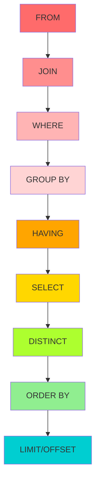
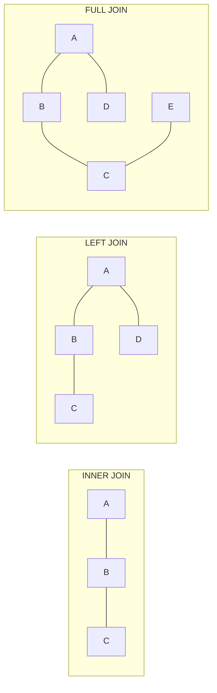
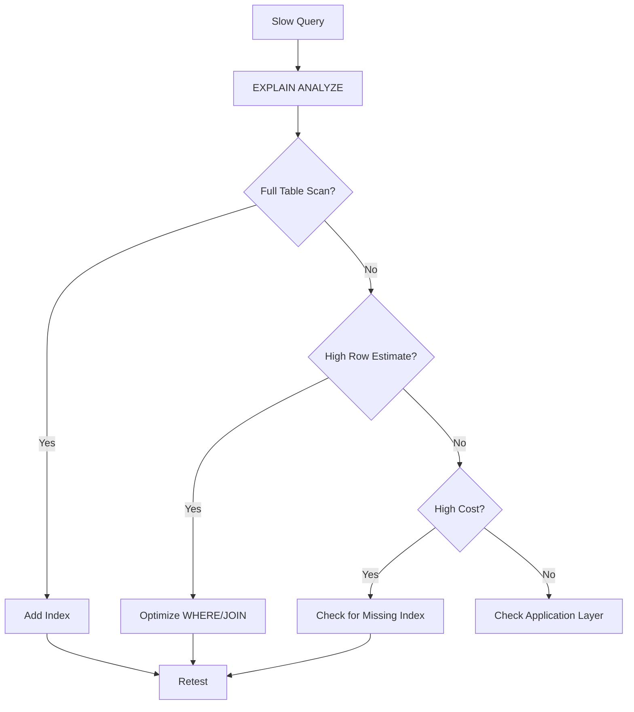

---
layout: post
title: SQL Interview Preparation
categories: Programming
tags: [SQL, Interview Preparation]
date: 2024-01-26
toc: true
---

## 1. Introduction

SQL (Structured Query Language) is the standard language for managing and querying relational databases. SQL proficiency is tested in virtually every technical interview at FAANG companies, regardless of the role. Backend engineers, data engineers, data analysts, and even frontend engineers are expected to know SQL well.

SQL interviews go beyond simple SELECT statements. Companies test your ability to write complex JOINs, use window functions, optimize queries, understand execution plans, and think about database design. The difference between a junior and senior engineer often comes down to their SQL depth.

This module covers SQL fundamentals through advanced topics, query optimization, indexing strategies, and real interview problems with solutions. Master these concepts to ace SQL interview rounds at any company.

---

## 2. Learning Roadmap

### Phase 1: Fundamentals (Week 1-2)
- [ ] Master SELECT, WHERE, ORDER BY, GROUP BY, HAVING
- [ ] Learn all JOIN types (INNER, LEFT, RIGHT, FULL, CROSS, SELF)
- [ ] Understand aggregate functions (COUNT, SUM, AVG, MIN, MAX)
- [ ] Practice subqueries (scalar, correlated, in FROM clause)
- [ ] Learn INSERT, UPDATE, DELETE, UPSERT

### Phase 2: Intermediate (Week 3-4)
- [ ] Master window functions (ROW_NUMBER, RANK, DENSE_RANK, LEAD, LAG)
- [ ] Learn CTEs (Common Table Expressions) and recursive CTEs
- [ ] Understand set operations (UNION, INTERSECT, EXCEPT)
- [ ] Practice CASE expressions and conditional aggregation
- [ ] Learn string, date, and numeric functions

### Phase 3: Advanced (Week 5-6)
- [ ] Study query execution plans and EXPLAIN ANALYZE
- [ ] Learn indexing strategies (B-tree, hash, composite, covering)
- [ ] Understand normalization and denormalization
- [ ] Master query optimization techniques
- [ ] Study database-specific features (MySQL, PostgreSQL, SQL Server)

### Phase 4: Interview Mastery (Week 7-8)
- [ ] Solve 50+ SQL interview problems on LeetCode
- [ ] Practice writing queries on a whiteboard
- [ ] Learn to explain query optimization decisions
- [ ] Study real-world schema design patterns
- [ ] Mock SQL interview sessions

---

## 3. Theory Notes

### 3.1 SQL Execution Order

Understanding SQL logical order is critical for writing correct queries:

```
1. FROM       — Identify tables
2. JOIN       — Combine tables
3. WHERE      — Filter rows (before grouping)
4. GROUP BY   — Group rows
5. HAVING     — Filter groups (after grouping)
6. SELECT     — Choose columns
7. DISTINCT   — Remove duplicates
8. ORDER BY   — Sort results
9. LIMIT/OFFSET — Restrict result set
```

### 3.2 JOIN Types

| JOIN Type | Description | Result |
|-----------|-------------|--------|
| INNER | Matching rows in both tables | Intersection |
| LEFT | All rows in left + matching in right | Left + matches |
| RIGHT | All rows in right + matching in left | Right + matches |
| FULL | All rows in both tables | Union |
| CROSS | Cartesian product of both tables | All combinations |
| SELF | Table joined with itself | Self-referencing |

### 3.3 Window Functions

Window functions perform calculations across a set of rows related to the current row, without collapsing them (unlike GROUP BY).

```sql
function_name OVER (
    [PARTITION BY column]
    [ORDER BY column]
    [ROWS/RANGE frame_clause]
)
```

| Function | Description | Example |
|----------|-------------|---------|
| ROW_NUMBER | Sequential number | 1, 2, 3, 4, 5 |
| RANK | Rank with gaps | 1, 2, 2, 4, 5 |
| DENSE_RANK | Rank without gaps | 1, 2, 2, 3, 4 |
| LAG | Previous row value | value from row-1 |
| LEAD | Next row value | value from row+1 |
| SUM/AVG/COUNT | Running aggregates | Cumulative sum |
| FIRST_VALUE | First in window | First row's value |
| NTILE | Divide into buckets | 1 to n buckets |

### 3.4 Normal Forms

| Normal Form | Rule | Purpose |
|-------------|------|---------|
| 1NF | Atomic values, no repeating groups | Eliminate repeating data |
| 2NF | 1NF + no partial dependencies | Eliminate partial dependencies |
| 3NF | 2NF + no transitive dependencies | Eliminate transitive dependencies |
| BCNF | 3NF + every determinant is candidate key | Stricter 3NF |

---

## 4. Key Concepts

### 4.1 Subqueries vs JOINs vs CTEs

```sql
-- SUBQUERY: Find employees who earn more than average
SELECT * FROM employees
WHERE salary > (SELECT AVG(salary) FROM employees);

-- JOIN: Find employees and their department names
SELECT e.name, d.department_name
FROM employees e
JOIN departments d ON e.dept_id = d.id;

-- CTE: Find departments with above-average salary
WITH dept_avg AS (
    SELECT dept_id, AVG(salary) AS avg_salary
    FROM employees
    GROUP BY dept_id
)
SELECT d.department_name, da.avg_salary
FROM dept_avg da
JOIN departments d ON da.dept_id = d.id
WHERE da.avg_salary > (SELECT AVG(salary) FROM employees);
```

### 4.2 Window Functions Deep Dive

```sql
-- Rank employees by salary within each department
SELECT 
    name,
    department,
    salary,
    ROW_NUMBER() OVER (PARTITION BY department ORDER BY salary DESC) AS row_num,
    RANK() OVER (PARTITION BY department ORDER BY salary DESC) AS rank_num,
    DENSE_RANK() OVER (PARTITION BY department ORDER BY salary DESC) AS dense_rank_num
FROM employees;

-- Running total
SELECT 
    order_date,
    amount,
    SUM(amount) OVER (ORDER BY order_date) AS running_total
FROM orders;

-- Percentage of total
SELECT 
    name,
    salary,
    ROUND(salary * 100.0 / SUM(salary) OVER(), 2) AS pct_of_total
FROM employees;

-- Lag/Lead for comparisons
SELECT 
    month,
    revenue,
    LAG(revenue, 1) OVER (ORDER BY month) AS prev_month,
    revenue - LAG(revenue, 1) OVER (ORDER BY month) AS growth
FROM monthly_revenue;
```

### 4.3 Indexing Strategies

```sql
-- B-tree index (default, good for equality and range)
CREATE INDEX idx_emp_name ON employees(name);

-- Composite index (order matters!)
CREATE INDEX idx_emp_dept_salary ON employees(department_id, salary);

-- Covering index (includes all columns needed by query)
CREATE INDEX idx_emp_covering ON employees(department_id, salary, name);

-- Partial index (PostgreSQL)
CREATE INDEX idx_active_users ON users(email) WHERE active = true;

-- Unique index
CREATE UNIQUE INDEX idx_user_email ON users(email);
```

**Index Selection Rules:**
- Put the most selective column first in composite indexes
- Match index order to WHERE clause column order
- Include SELECT columns for covering indexes
- Don't over-index — each index slows down writes

### 4.4 Query Optimization

```sql
-- BAD: Using function on indexed column (prevents index use)
SELECT * FROM orders WHERE YEAR(order_date) = 2024;

-- GOOD: Use range condition instead
SELECT * FROM orders 
WHERE order_date >= '2024-01-01' AND order_date < '2025-01-01';

-- BAD: Using SELECT *
SELECT * FROM employees WHERE department_id = 5;

-- GOOD: Select only needed columns
SELECT id, name, salary FROM employees WHERE department_id = 5;

-- BAD: NOT IN with subquery (often slow, NULL issues)
SELECT * FROM employees WHERE dept_id NOT IN (SELECT id FROM inactive_depts);

-- GOOD: Use NOT EXISTS or LEFT JOIN
SELECT e.* FROM employees e
LEFT JOIN inactive_depts d ON e.dept_id = d.id
WHERE d.id IS NULL;

-- BAD: Correlated subquery
SELECT * FROM employees e
WHERE salary > (SELECT AVG(salary) FROM employees WHERE dept_id = e.dept_id);

-- GOOD: Window function
WITH dept_avg AS (
    SELECT id, AVG(salary) OVER (PARTITION BY dept_id) AS avg_salary
    FROM employees
)
SELECT e.* FROM employees e
JOIN dept_avg da ON e.id = da.id
WHERE e.salary > da.avg_salary;
```

---

## 5. FAQ (20+ Q&A)

**Q1: What is the difference between WHERE and HAVING?**
WHERE filters rows before grouping (before GROUP BY). HAVING filters groups after aggregation (after GROUP BY). You can't use aggregate functions in WHERE but you can in HAVING.

**Q2: What is the difference between DELETE, TRUNCATE, and DROP?**
DELETE removes rows with a WHERE clause (logged, can rollback). TRUNCATE removes all rows (minimal logging, faster, resets identity). DROP removes the entire table structure and data.

**Q3: What is the N+1 query problem?**
When code fetches N records and then makes N individual queries (one per record) instead of using JOINs or batch loading. Solution: use JOINs, subqueries, or ORMs with eager loading.

**Q4: What is the difference between UNION and UNION ALL?**
UNION removes duplicates (slower). UNION ALL keeps all rows including duplicates (faster). Use UNION ALL unless you specifically need deduplication.

**Q5: What is a covering index?**
An index that contains all the columns needed by a query, so the database can answer the query using only the index without accessing the table data (index-only scan).

**Q6: What is query execution plan?**
A step-by-step description of how the database engine will execute a query. Use EXPLAIN (PostgreSQL) or EXPLAIN ANALYZE to view it. It shows table scan methods, join types, and estimated costs.

**Q7: What is a correlated subquery?**
A subquery that references columns from the outer query and is executed once for each row of the outer query. Usually slower than JOINs. Can often be rewritten with window functions or CTEs.

**Q8: What is the difference between INNER JOIN and LEFT JOIN?**
INNER JOIN returns only rows with matches in both tables. LEFT JOIN returns all rows from the left table and matching rows from the right table (NULLs for non-matches).

**Q9: When should I use a CTE vs a subquery?**
Use CTEs for readability, reusability within the same query, and recursive queries. Subqueries are fine for simple one-time references. CTEs don't necessarily perform better (many databases optimize them similarly).

**Q10: What is database normalization?**
The process of organizing tables to reduce data redundancy and improve data integrity. Normal forms (1NF, 2NF, 3NF, BCNF) define progressively stricter rules.

**Q11: When should I denormalize?**
When read performance is critical and the cost of JOINs is too high. Common in data warehouses, analytics systems, and high-read workloads. Accept some redundancy for performance.

**Q12: What is a window function vs aggregate function?**
Aggregate functions (GROUP BY) collapse rows into summary rows. Window functions calculate across a set of rows while preserving individual rows. Window functions don't reduce the result set.

**Q13: What is the difference between RANK and DENSE_RANK?**
RANK assigns the same rank to ties but skips subsequent ranks (1, 2, 2, 4). DENSE_RANK assigns the same rank to ties without skipping (1, 2, 2, 3).

**Q14: What are common SQL anti-patterns?**
SELECT *, missing WHERE clause on UPDATE/DELETE, using DISTINCT to fix duplicate results (fix the query instead), not using indexes, using OR instead of IN, and functions on indexed columns.

**Q15: What is a deadlock in databases?**
Two or more transactions waiting for each other to release locks, creating a circular dependency. Databases detect deadlocks and roll back one transaction. Prevent by locking resources in consistent order.

**Q16: What is the difference between MyISAM and InnoDB (MySQL)?**
InnoDB supports transactions, row-level locking, foreign keys, and crash recovery. MyISAM is faster for read-heavy workloads but doesn't support transactions or row-level locks. Use InnoDB (default since MySQL 5.5).

**Q17: What is a materialized view?**
A view that stores the result of a query physically on disk. Unlike regular views, it doesn't re-execute the query each time. Must be refreshed when underlying data changes. Great for expensive aggregations.

**Q18: What is the difference between OLTP and OLAP?**
OLTP (Online Transaction Processing) handles day-to-day transactions (many small, fast operations). OLAP (Online Analytical Processing) handles complex analytical queries (fewer, larger operations on historical data).

**Q19: What is a self-join?**
A table joined with itself. Useful for hierarchical data, comparing rows within the same table, or finding related records. Use table aliases to distinguish between instances.

**Q20: What is the difference between WHERE and ON in JOINs?**
ON specifies the join condition (how tables relate). WHERE filters rows after the join. In LEFT JOINs, putting conditions in WHERE vs ON changes the result (conditions in ON don't eliminate left table rows).

**Q21: What is a temporary table?**
A table that exists only for the duration of a session or transaction. Useful for breaking complex queries into steps, storing intermediate results, and reducing repeated computation.

**Q22: What is the purpose of COALESCE?**
Returns the first non-NULL value from a list of arguments. Useful for providing default values: `COALESCE(nickname, username, 'Anonymous')`.

---

## 6. Hands-on Practice

### Exercise 1: Second Highest Salary
```sql
-- LeetCode #176
SELECT DISTINCT salary AS SecondHighestSalary
FROM employees
ORDER BY salary DESC
LIMIT 1 OFFSET 1;

-- Alternative with subquery
SELECT MAX(salary) AS SecondHighestSalary
FROM employees
WHERE salary < (SELECT MAX(salary) FROM employees);
```

### Exercise 2: Department Top Three Salaries
```sql
-- LeetCode #185
WITH ranked AS (
    SELECT 
        d.name AS Department,
        e.name AS Employee,
        e.salary AS Salary,
        DENSE_RANK() OVER (PARTITION BY e.departmentId ORDER BY e.salary DESC) AS rnk
    FROM employees e
    JOIN departments d ON e.departmentId = d.id
)
SELECT Department, Employee, Salary
FROM ranked
WHERE rnk <= 3;
```

### Exercise 3: Consecutive Numbers
```sql
-- LeetCode #180
SELECT DISTINCT l1.num AS ConsecutiveNums
FROM logs l1
JOIN logs l2 ON l1.id = l2.id - 1
JOIN logs l3 ON l1.id = l3.id - 2
WHERE l1.num = l2.num AND l2.num = l3.num;
```

### Exercise 4: Median Salary
```sql
-- Find median salary per department
WITH ranked AS (
    SELECT 
        department_id,
        salary,
        ROW_NUMBER() OVER (PARTITION BY department_id ORDER BY salary) AS rn,
        COUNT(*) OVER (PARTITION BY department_id) AS cnt
    FROM employees
)
SELECT department_id, AVG(salary) AS median_salary
FROM ranked
WHERE rn IN (FLOOR((cnt + 1) / 2), CEIL((cnt + 1) / 2))
GROUP BY department_id;
```

### Exercise 5: User Activity Analysis
```sql
-- Find users who were active on consecutive days
WITH user_days AS (
    SELECT DISTINCT user_id, DATE(activity_time) AS activity_date
    FROM user_activity
),
consecutive AS (
    SELECT 
        user_id,
        activity_date,
        activity_date - INTERVAL ROW_NUMBER() OVER (
            PARTITION BY user_id ORDER BY activity_date
        ) DAY AS grp
    FROM user_days
)
SELECT user_id, MIN(activity_date) AS start_date, MAX(activity_date) AS end_date,
       COUNT(*) AS consecutive_days
FROM consecutive
GROUP BY user_id, grp
HAVING COUNT(*) >= 3;
```

---

## 7. FAANG Questions

### Google
1. **"Find the median salary for each department."**
   - Use window functions with ROW_NUMBER and COUNT to find median positions.

2. **"Write a query to find users who purchased on consecutive days."**
   - Use window functions with DATE and ROW_NUMBER to identify consecutive sequences.

### Amazon
3. **"Find the top 3 products by revenue in each category."**
   - DENSE_RANK with PARTITION BY category.

4. **"Calculate running total of orders by date."**
   - SUM() OVER (ORDER BY order_date).

### Meta
5. **"Find the percentage of total revenue per product."**
   - revenue * 100.0 / SUM(revenue) OVER ()

6. **"Find duplicate records and keep only the earliest."**
   - ROW_NUMBER with PARTITION BY duplicate columns ORDER BY created_at.

### Apple
7. **"Design a schema for a music streaming service."**
   - Consider: users, artists, albums, songs, playlists, plays/listens, subscriptions.

### Netflix
8. **"Find users who watch content from at least 5 different genres."**
   - GROUP BY user_id HAVING COUNT(DISTINCT genre) >= 5.

---

## 8. Common Mistakes

### Mistake 1: Using SELECT * in Production
**Problem:** Wastes bandwidth, breaks when schema changes, prevents index-only scans.
**Fix:** Always select specific columns. Use an ORM or generate models from schema.

### Mistake 2: Missing WHERE on UPDATE/DELETE
**Problem:** `UPDATE users SET status = 'inactive'` without WHERE affects ALL rows.
**Fix:** Always include WHERE clause. Test with SELECT first.

### Mistake 3: Not Using Indexes
**Problem:** Full table scans on millions of rows.
**Fix:** Add indexes on columns used in WHERE, JOIN, and ORDER BY. Use EXPLAIN to verify.

### Mistake 4: Using Functions on Indexed Columns
**Problem:** `WHERE YEAR(date) = 2024` prevents index usage.
**Fix:** Rewrite as `WHERE date >= '2024-01-01' AND date < '2025-01-01'`.

### Mistake 5: Cartesian Product (Missing JOIN Condition)
**Problem:** Missing WHERE/ON clause creates N×M rows.
**Fix:** Always specify join conditions. Check result row count matches expectations.

### Mistake 6: NULL Comparison Errors
**Problem:** `WHERE column = NULL` never returns true.
**Fix:** Use `WHERE column IS NULL` or `WHERE column IS NOT NULL`.

### Mistake 7: Not Handling NULLs in Aggregations
**Problem:** COUNT(column) ignores NULLs, COUNT(*) counts them.
**Fix:** Be explicit about NULL handling. Use COALESCE when needed.

### Mistake 8: N+1 Query Pattern
**Problem:** Making N separate queries instead of one JOIN.
**Fix:** Use JOINs, IN clauses with subqueries, or batch loading.

### Mistake 9: Implicit Type Conversion
**Problem:** Comparing VARCHAR column with INTEGER prevents index use.
**Fix:** Ensure types match in comparisons. Use proper casting.

### Mistake 10: Not Using EXPLAIN
**Problem:** Writing queries without verifying the execution plan.
**Fix:** Always EXPLAIN complex queries to check for full scans and missing indexes.

---

## 9. Best Practices

### Query Writing
1. Use meaningful aliases (e.g., `employees e` not `employees t1`)
2. Format SQL consistently (uppercase keywords, lowercase identifiers)
3. Use CTEs for complex queries (improves readability)
4. Avoid SELECT * in production
5. Use JOINs instead of subqueries when possible
6. Filter early in WHERE clauses to reduce data processed

### Performance
1. Index columns used in WHERE, JOIN, and ORDER BY
2. Use covering indexes for frequent queries
3. Avoid functions on indexed columns
4. Use LIMIT for testing queries on large tables
5. Batch inserts/updates instead of one at a time
6. Monitor slow query logs regularly

### Schema Design
1. Normalize to at least 3NF by default
2. Denormalize strategically for read performance
3. Use appropriate data types (don't use VARCHAR for everything)
4. Add foreign key constraints
5. Use consistent naming conventions
6. Document your schema

### Security
1. Always use parameterized queries (prevent SQL injection)
2. Grant minimal necessary permissions
3. Never expose database credentials in code
4. Use views to restrict sensitive data access
5. Audit database access regularly

---

## 10. Cheat Sheet

```
SQL QUICK REFERENCE
====================

JOIN TYPES:
  INNER JOIN  — Only matching rows from both tables
  LEFT JOIN   — All from left + matching from right
  RIGHT JOIN  — All from right + matching from left
  FULL JOIN   — All from both tables
  CROSS JOIN  — Cartesian product
  SELF JOIN   — Table joined with itself

AGGREGATE FUNCTIONS:
  COUNT(col)  — Count non-NULL values
  COUNT(*)    — Count all rows
  SUM(col)    — Sum of values
  AVG(col)    — Average (ignores NULLs)
  MIN/MAX     — Min/Max value

WINDOW FUNCTIONS:
  ROW_NUMBER() — Unique sequential number
  RANK()       — Rank with gaps for ties
  DENSE_RANK() — Rank without gaps
  LAG(col, n)  — Value n rows before
  LEAD(col, n) — Value n rows after
  SUM() OVER (ORDER BY ...) — Running total
  NTILE(n)     — Divide into n buckets

DATE FUNCTIONS (PostgreSQL):
  NOW()              — Current timestamp
  DATE_TRUNC('month', col) — Start of month
  AGE(date1, date2)  — Interval between dates
  EXTRACT(YEAR FROM col) — Extract part of date
  INTERVAL '1 day'   — Add/subtract interval

STRING FUNCTIONS:
  CONCAT(a, b)       — Concatenate strings
  LENGTH(col)        — String length
  UPPER/LOWER(col)   — Case conversion
  TRIM(col)          — Remove whitespace
  SUBSTRING(col, start, len) — Extract substring
  REPLACE(col, old, new)    — Replace substring

COMMON PATTERNS:
  Running total:    SUM(col) OVER (ORDER BY date)
  Moving average:   AVG(col) OVER (ORDER BY date ROWS 6 PRECEDING)
  Rank:             DENSE_RANK() OVER (PARTITION BY grp ORDER BY val DESC)
  Previous value:   LAG(col) OVER (ORDER BY date)
  Percent of total: col * 100.0 / SUM(col) OVER ()
  Deduplicate:      ROW_NUMBER() OVER (PARTITION BY cols ORDER BY id) = 1
```

---

## 11. Flash Cards

**Card 1:** What is the difference between WHERE and HAVING?
**Answer:** WHERE filters rows before grouping; HAVING filters groups after GROUP BY aggregation.

**Card 2:** What is a window function?
**Answer:** A function that performs calculations across a set of rows related to the current row without collapsing them, using OVER clause.

**Card 3:** What is the difference between RANK and DENSE_RANK?
**Answer:** RANK skips ranks after ties (1,2,2,4); DENSE_RANK doesn't skip (1,2,2,3).

**Card 4:** What is a correlated subquery?
**Answer:** A subquery that references columns from the outer query and executes once per outer row.

**Card 5:** What is a covering index?
**Answer:** An index containing all columns needed by a query, enabling index-only scans.

**Card 6:** What is the N+1 query problem?
**Answer:** Fetching N records then making N individual queries instead of one JOIN or batch query.

**Card 7:** What is the difference between UNION and UNION ALL?
**Answer:** UNION removes duplicates; UNION ALL keeps all rows (faster).

**Card 8:** What is a CTE?
**Answer:** Common Table Expression — a named temporary result set defined with WITH clause, improving readability.

**Card 9:** How do you prevent SQL injection?
**Answer:** Use parameterized queries/prepared statements. Never concatenate user input into SQL strings.

**Card 10:** What is normalization?
**Answer:** Organizing tables to reduce redundancy (1NF → 2NF → 3NF → BCNF).

**Card 11:** What is denormalization?
**Answer:** Intentionally adding redundancy to improve read performance, common in analytics systems.

**Card 12:** What does EXPLAIN do?
**Answer:** Shows the query execution plan — how the database will execute the query (scan types, join order, costs).

**Card 13:** What is a materialized view?
**Answer:** A view that stores query results physically on disk, must be refreshed when data changes.

**Card 14:** What is the difference between DELETE and TRUNCATE?
**Answer:** DELETE removes rows (logged, can rollback, WHERE clause). TRUNCATE removes all rows (minimal logging, faster, resets identity).

**Card 15:** What is a self-join?
**Answer:** A table joined with itself using aliases, useful for hierarchical data or row comparisons.

**Card 16:** What is the SQL execution order?
**Answer:** FROM → JOIN → WHERE → GROUP BY → HAVING → SELECT → DISTINCT → ORDER BY → LIMIT.

**Card 17:** What is a deadlock?
**Answer:** Two transactions waiting for each other's locks. Databases detect and roll back one transaction.

**Card 18:** What is OLTP vs OLAP?
**Answer:** OLTP handles many small transactions (operational). OLAP handles complex analytical queries on historical data.

**Card 19:** What is the purpose of COALESCE?
**Answer:** Returns the first non-NULL value from a list of arguments.

**Card 20:** What is a partial index?
**Answer:** An index on a subset of rows defined by a WHERE condition (PostgreSQL feature).

---

## 12. Mind Map

```
                           SQL
                            |
        ┌───────────────────┼───────────────────┐
        |                   |                   |
    QUERIES            OPTIMIZATION          DESIGN
        |                   |                   |
  ┌─────┼─────┐     ┌──────┼──────┐     ┌──────┼──────┐
  |     |     |     |      |      |     |      |      |
 Basic Window  Sub-  Index  Query  Exec  Norm- Schema Index
 SELECT  Func  query Struc- Rewrit Plans alize Design Struc-
  |     |      |    ture   |      |      |      |    ture
 JOIN  ROW_    CTE   Cover- Anti-  EXPLAIN 3NF   Keys  B-tree
 GROUP_NUM     |     ing   patterns|    BCNF      Hash
 HAVINGRANK  Recursive                  |
       LAG   Set Ops                   Denorm-
       LEAD                            alize
```

---

## 13. Mermaid Diagrams

### SQL Execution Order



### JOIN Visualization



### Query Optimization Decision



---

## 14. Code Examples

### Example 1: Complex Window Function Query

```sql
-- Find each employee's salary rank within department,
-- their salary compared to department average,
-- and their salary compared to previous employee

SELECT 
    e.name,
    d.department_name,
    e.salary,
    -- Rank within department
    RANK() OVER (
        PARTITION BY e.department_id 
        ORDER BY e.salary DESC
    ) AS dept_rank,
    -- Department average
    AVG(e.salary) OVER (
        PARTITION BY e.department_id
    ) AS dept_avg_salary,
    -- Difference from department average
    e.salary - AVG(e.salary) OVER (
        PARTITION BY e.department_id
    ) AS diff_from_avg,
    -- Previous employee's salary (same department, by hire date)
    LAG(e.salary) OVER (
        PARTITION BY e.department_id 
        ORDER BY e.hire_date
    ) AS prev_emp_salary,
    -- Percentile within department
    PERCENT_RANK() OVER (
        PARTITION BY e.department_id 
        ORDER BY e.salary
    ) AS percentile
FROM employees e
JOIN departments d ON e.department_id = d.id
ORDER BY d.department_name, e.salary DESC;
```

### Example 2: Monthly Revenue Analysis

```sql
WITH monthly AS (
    SELECT 
        DATE_TRUNC('month', order_date) AS month,
        SUM(amount) AS revenue,
        COUNT(*) AS order_count,
        COUNT(DISTINCT customer_id) AS unique_customers
    FROM orders
    WHERE order_date >= '2024-01-01'
    GROUP BY DATE_TRUNC('month', order_date)
),
monthly_with_growth AS (
    SELECT 
        month,
        revenue,
        order_count,
        unique_customers,
        LAG(revenue) OVER (ORDER BY month) AS prev_revenue,
        ROUND(
            (revenue - LAG(revenue) OVER (ORDER BY month)) * 100.0 / 
            NULLIF(LAG(revenue) OVER (ORDER BY month), 0), 
            2
        ) AS growth_pct,
        SUM(revenue) OVER (ORDER BY month) AS cumulative_revenue
    FROM monthly
)
SELECT 
    TO_CHAR(month, 'YYYY-MM') AS month,
    revenue,
    order_count,
    unique_customers,
    prev_revenue,
    growth_pct || '%' AS growth,
    cumulative_revenue
FROM monthly_with_growth
ORDER BY month;
```

### Example 3: Gap and Islands Problem

```sql
-- Find consecutive date ranges for user logins
WITH user_dates AS (
    SELECT DISTINCT user_id, login_date
    FROM user_logins
),
grouped AS (
    SELECT 
        user_id,
        login_date,
        login_date - INTERVAL ROW_NUMBER() OVER (
            PARTITION BY user_id ORDER BY login_date
        ) DAY AS grp
    FROM user_dates
)
SELECT 
    user_id,
    MIN(login_date) AS start_date,
    MAX(login_date) AS end_date,
    COUNT(*) AS consecutive_days
FROM grouped
GROUP BY user_id, grp
HAVING COUNT(*) >= 7
ORDER BY user_id, start_date;
```

### Example 4: Recursive CTE for Hierarchical Data

```sql
-- Find all subordinates of a manager (org chart)
WITH RECURSIVE subordinates AS (
    -- Base case: direct reports
    SELECT id, name, manager_id, 1 AS level
    FROM employees
    WHERE manager_id = 100  -- CEO's ID
    
    UNION ALL
    
    -- Recursive case: reports of reports
    SELECT e.id, e.name, e.manager_id, s.level + 1
    FROM employees e
    JOIN subordinates s ON e.manager_id = s.id
)
SELECT 
    REPEAT('  ', level - 1) || name AS org_chart,
    level
FROM subordinates
ORDER BY level, name;
```

---

## 15. Projects

### Project 1: SQL Interview Practice Database
Create a MySQL/PostgreSQL database with:
- 20+ tables with realistic data (employees, orders, products, etc.)
- 50 practice problems organized by difficulty
- Automated test validation
- Solution explanations

### Project 2: Query Performance Analyzer
Build a tool that:
- Takes SQL queries as input
- Runs EXPLAIN ANALYZE
- Suggests indexes and optimizations
- Compares before/after performance
- Generates optimization reports

### Project 3: Database Schema Designer
Create a web app that:
- Accepts entity-relationship descriptions
- Generates normalized SQL schemas
- Creates sample data
- Validates relationships and constraints
- Exports to multiple database formats

---

## 16. Resources

### Books
- "SQL Performance Explained" by Markus Winand
- "SQL Antipatterns" by Bill Karwin
- "Learning SQL" by Alan Beaulieu
- "High Performance MySQL" by Baron Schwartz

### Online Resources
- [LeetCode SQL Problems](https://leetcode.com/problemset/database/)
- [SQL Zoo](https://sqlzoo.net/)
- [W3Schools SQL Tutorial](https://www.w3schools.com/sql/)
- [PostgreSQL Documentation](https://www.postgresql.org/docs/)
- [Use The Index, Luke](https://use-the-index-luke.com/)

### Practice Platforms
- [HackerRank SQL](https://www.hackerrank.com/domains/sql)
- [LeetCode Database Problems](https://leetcode.com/problemset/database/)
- [SQLBolt](https://sqlbolt.com/)

---

## 17. Checklist

### SQL Fundamentals
- [ ] SELECT with WHERE, ORDER BY, LIMIT
- [ ] All JOIN types
- [ ] GROUP BY with HAVING
- [ ] Aggregate functions
- [ ] Subqueries (scalar, correlated, FROM)
- [ ] Set operations (UNION, INTERSECT, EXCEPT)

### Intermediate
- [ ] Window functions (ROW_NUMBER, RANK, LAG, LEAD)
- [ ] CTEs (WITH clause)
- [ ] Recursive CTEs
- [ ] CASE expressions
- [ ] String/date functions
- [ ] UPSERT (INSERT ON CONFLICT)

### Advanced
- [ ] EXPLAIN and query plans
- [ ] Indexing strategies
- [ ] Query optimization
- [ ] Normalization (1NF through BCNF)
- [ ] Database-specific features

### Interview Ready
- [ ] Can solve LeetCode medium SQL in < 15 minutes
- [ ] Can explain query optimization decisions
- [ ] Can design a schema for a new system
- [ ] Can write parameterized queries (security)
- [ ] Can handle NULLs correctly

---

## 18. Revision Plans

### Week 1: Fundamentals
- Master SELECT, JOIN, GROUP BY
- Solve 10 LeetCode easy SQL problems
- Practice writing queries without looking at syntax

### Week 2: Window Functions
- Learn all window functions
- Solve 10 LeetCode medium SQL problems
- Practice combining multiple window functions

### Week 3: Optimization
- Study EXPLAIN output
- Learn indexing strategies
- Optimize 5 slow queries

### Week 4: Interview Practice
- Solve 20 LeetCode medium-hard SQL problems
- Practice explaining query optimization
- Do mock SQL interviews

---

## 19. Mock Interviews

### Mock Interview 1: Employee Analysis
**Interviewer:** Find the employee(s) with the highest salary in each department.

```sql
SELECT department_name, employee_name, salary
FROM (
    SELECT 
        d.name AS department_name,
        e.name AS employee_name,
        e.salary,
        RANK() OVER (PARTITION BY e.dept_id ORDER BY e.salary DESC) AS rnk
    FROM employees e
    JOIN departments d ON e.dept_id = d.id
) ranked
WHERE rnk = 1;
```

### Mock Interview 2: Revenue Growth
**Interviewer:** Find months where revenue decreased compared to the previous month.

```sql
WITH monthly AS (
    SELECT 
        DATE_TRUNC('month', order_date) AS month,
        SUM(amount) AS revenue
    FROM orders
    GROUP BY DATE_TRUNC('month', order_date)
)
SELECT 
    TO_CHAR(month, 'YYYY-MM') AS month,
    revenue,
    prev_revenue,
    ROUND((revenue - prev_revenue) * 100.0 / prev_revenue, 2) AS decline_pct
FROM (
    SELECT 
        month,
        revenue,
        LAG(revenue) OVER (ORDER BY month) AS prev_revenue
    FROM monthly
) t
WHERE revenue < prev_revenue
ORDER BY month;
```

### Mock Interview 3: Schema Design
**Interviewer:** Design a schema for an e-commerce platform.

---

## 20. Difficulty Rating

| Topic | Difficulty | Time to Master |
|-------|-----------|---------------|
| Basic SELECT | ⭐ (1/5) | 2 days |
| JOINs | ⭐⭐ (2/5) | 1 week |
| GROUP BY / HAVING | ⭐⭐ (2/5) | 1 week |
| Subqueries | ⭐⭐⭐ (3/5) | 2 weeks |
| Window Functions | ⭐⭐⭐ (3/5) | 2 weeks |
| CTEs | ⭐⭐ (2/5) | 1 week |
| Query Optimization | ⭐⭐⭐⭐ (4/5) | 3-4 weeks |
| Indexing Strategies | ⭐⭐⭐⭐ (4/5) | 3-4 weeks |
| Execution Plans | ⭐⭐⭐⭐ (4/5) | 4 weeks |
| Schema Design | ⭐⭐⭐ (3/5) | 2-3 weeks |
| Recursive CTEs | ⭐⭐⭐ (3/5) | 1-2 weeks |

---

## 21. Summary

SQL is a fundamental skill tested in every technical interview. Key principles:

1. **Master the execution order** — Understanding FROM → JOIN → WHERE → GROUP BY → HAVING → SELECT → ORDER BY is critical for writing correct queries.
2. **Window functions are essential** — They solve problems that were previously difficult or impossible with plain SQL.
3. **Optimization matters** — Know EXPLAIN, understand indexing, and avoid common anti-patterns.
4. **Practice under pressure** — Solve problems timed, without looking up syntax.
5. **Think about schema design** — Understand normalization and when to denormalize.

For interviews, focus on window functions, complex JOINs, and the ability to explain your approach clearly. Practice on LeetCode and HackerRank to build speed and accuracy.

