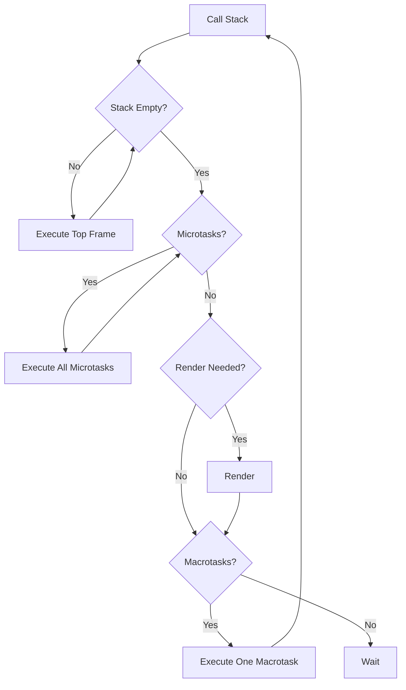
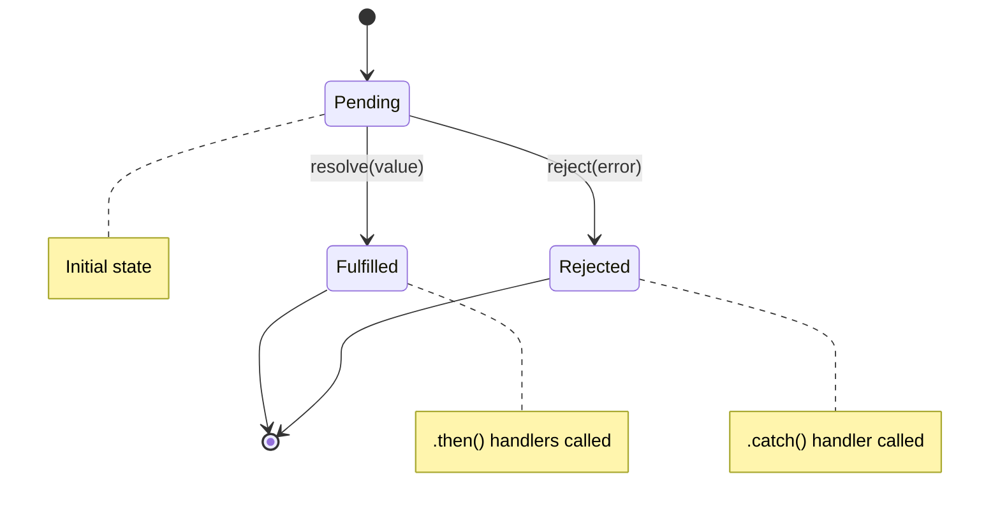
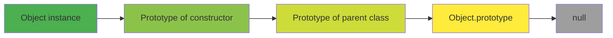
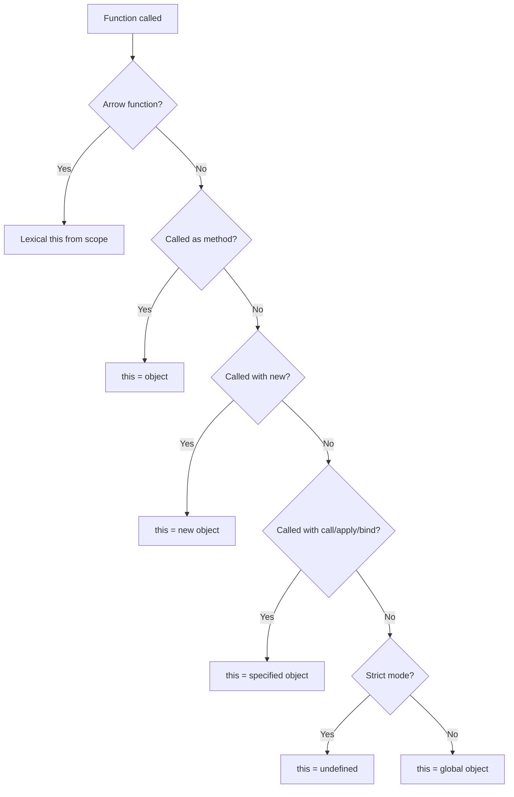

---
layout: post
title: JavaScript Interview Preparation
categories: Programming
tags: [JavaScript, Interview Preparation]
date: 2024-01-29
toc: true
---

## 1. Introduction

JavaScript is the language of the web and increasingly important in technical interviews. With the rise of full-stack development, Node.js, and modern frameworks, JavaScript proficiency is highly valued at FAANG companies and startups alike.

JavaScript has unique characteristics that interviewers love to test: its event loop, prototypal inheritance, closures, hoisting, the `this` keyword, and asynchronous programming model. These concepts are frequently asked in interviews, and understanding them deeply separates strong candidates from average ones.

This module covers JavaScript fundamentals through advanced topics including closures, prototypes, the event loop, promises/async-await, ES6+ features, DOM manipulation, and functional programming. Master these concepts to write clean, efficient JavaScript in interviews.

---

## 2. Learning Roadmap

### Phase 1: Fundamentals (Week 1-2)
- [ ] Master JavaScript data types and operators
- [ ] Understand scope, hoisting, and closures
- [ ] Learn functions (declarations, expressions, arrow functions)
- [ ] Practice array methods (map, filter, reduce, forEach)
- [ ] Solve 20 basic JavaScript interview questions

### Phase 2: Objects and Prototypes (Week 3-4)
- [ ] Master object creation patterns
- [ ] Understand prototypal inheritance and the prototype chain
- [ ] Learn `this` keyword in different contexts
- [ ] Practice ES6+ classes
- [ ] Solve 20 intermediate JavaScript interview questions

### Phase 3: Asynchronous JavaScript (Week 5-6)
- [ ] Master the event loop and task queues
- [ ] Learn callbacks, promises, and async/await
- [ ] Understand error handling in async code
- [ ] Practice with fetch API and async patterns
- [ ] Study module systems (CommonJS, ES Modules)

### Phase 4: Interview Mastery (Week 7-8)
- [ ] Solve 30+ JavaScript-specific interview questions
- [ ] Practice coding on a whiteboard/interview platform
- [ ] Study JavaScript engine internals (V8, SpiderMonkey)
- [ ] Learn functional programming patterns in JS
- [ ] Mock interviews with JavaScript-focused questions

---

## 3. Theory Notes

### 3.1 JavaScript Data Types

**Primitive types (immutable, compared by value):**
- `string`, `number`, `boolean`, `null`, `undefined`, `symbol`, `bigint`

**Reference types (mutable, compared by reference):**
- `object`, `array`, `function`, `Date`, `RegExp`, `Map`, `Set`

### 3.2 Hoisting

Variables and function declarations are moved to the top of their scope during compilation:
- `var` declarations are hoisted and initialized to `undefined`
- `let`/`const` declarations are hoisted but NOT initialized (Temporal Dead Zone)
- Function declarations are fully hoisted (name + body)
- Function expressions are NOT fully hoisted

### 3.3 The Event Loop

```
Call Stack → Microtask Queue → Macrotask Queue → Render
     ↓              ↓                  ↓
  Synchronous    Promise.then      setTimeout
  code           async/await       setInterval
                 queueMicrotask    I/O callbacks
```

Microtasks (Promises) have higher priority than macrotasks (setTimeout).

### 3.4 Closures

A closure is a function that retains access to its lexical scope even when executed outside that scope.

```javascript
function outer() {
    let count = 0;
    return function inner() {
        count++;
        return count;
    };
}
const counter = outer();
counter(); // 1
counter(); // 2
```

---

## 4. Key Concepts

### 4.1 The `this` Keyword

| Context | `this` Value |
|---------|-------------|
| Global scope | `window` (browser) / `global` (Node) |
| Object method | The object |
| Regular function | `window`/`global` (or `undefined` in strict mode) |
| Arrow function | Lexical `this` (surrounding scope) |
| Event handler | Element that triggered the event |
| Constructor | New object being created |
| `call`/`apply`/`bind` | Explicitly specified object |

### 4.2 Prototypal Inheritance

```javascript
// Every object has a hidden [[Prototype]] link
const animal = {
    eat() { console.log("eating"); },
    sleep() { console.log("sleeping"); }
};

const dog = Object.create(animal);
dog.bark = function() { console.log("woof"); };

dog.bark(); // "woof"
dog.eat();  // "eating" (inherited from animal)

// ES6 Classes (syntactic sugar over prototypes)
class Animal {
    constructor(name) {
        this.name = name;
    }
    eat() { console.log(`${this.name} is eating`); }
}

class Dog extends Animal {
    bark() { console.log(`${this.name} says woof`); }
}
```

### 4.3 Array Methods

```javascript
const numbers = [1, 2, 3, 4, 5];

// map - transform each element
const doubled = numbers.map(n => n * 2); // [2, 4, 6, 8, 10]

// filter - select elements
const evens = numbers.filter(n => n % 2 === 0); // [2, 4]

// reduce - accumulate to single value
const sum = numbers.reduce((acc, n) => acc + n, 0); // 15

// find - first matching element
const found = numbers.find(n => n > 3); // 4

// some/every - boolean checks
numbers.some(n => n > 3);  // true
numbers.every(n => n > 0); // true

// flat - flatten nested arrays
[[1, 2], [3, 4]].flat(); // [1, 2, 3, 4]

// flatMap - map + flatten
["hello world", "hi"].flatMap(s => s.split(" "));
// ["hello", "world", "hi"]
```

### 4.4 Promises and Async/Await

```javascript
// Promise
function fetchData() {
    return new Promise((resolve, reject) => {
        setTimeout(() => {
            resolve({ data: "result" });
        }, 1000);
    });
}

// Using Promise
fetchData()
    .then(result => console.log(result))
    .catch(error => console.error(error));

// Async/Await
async function getData() {
    try {
        const result = await fetchData();
        console.log(result);
    } catch (error) {
        console.error(error);
    }
}

// Parallel execution
const [users, posts] = await Promise.all([
    fetchUsers(),
    fetchPosts()
]);
```

### 4.5 ES6+ Features

```javascript
// Destructuring
const { name, age, ...rest } = user;
const [first, second, ...others] = array;

// Spread/Rest
const newArray = [...oldArray, newItem];
const merged = { ...obj1, ...obj2 };

// Template literals
const greeting = `Hello, ${name}!`;

// Optional chaining
const city = user?.address?.city;

// Nullish coalescing
const value = data ?? "default";

// Shorthand properties
const name = "Alice";
const user = { name }; // { name: "Alice" }

// Default parameters
function greet(name = "World") { return `Hello, ${name}`; }

// for...of (iterables)
for (const item of array) { /* ... */ }

// Object.fromEntries / Object.entries
const obj = Object.fromEntries([["a", 1], ["b", 2]]);
const entries = Object.entries(obj); // [["a", 1], ["b", 2]]

// structuredClone (deep copy)
const deepCopy = structuredClone(original);
```

### 4.6 Functional Programming in JS

```javascript
// Currying
const add = a => b => a + b;
add(2)(3); // 5

// Composition
const compose = (f, g) => x => f(g(x));
const add1 = x => x + 1;
const double = x => x * 2;
const add1ThenDouble = compose(double, add1);
add1ThenDouble(3); // 8

// Partial application
function multiply(a, b) { return a * b; }
const double = multiply.bind(null, 2);

// Immutable patterns
const addItem = (list, item) => [...list, item];
const updateItem = (list, index, value) =>
    list.map((item, i) => i === index ? value : item);
```

---

## 5. FAQ (20+ Q&A)

**Q1: What is the difference between `var`, `let`, and `const`?**
`var` is function-scoped and hoisted. `let` is block-scoped, hoisted but in the Temporal Dead Zone. `const` is block-scoped, cannot be reassigned (but objects can be mutated). Use `const` by default, `let` when reassignment is needed.

**Q2: What is the difference between `==` and `===`?**
`==` performs type coercion before comparison ("loose equality"). `===` compares value and type without coercion ("strict equality"). Always use `===` to avoid unexpected behavior.

**Q3: What is a closure?**
A function that retains access to variables from its enclosing lexical scope, even when the function is executed outside that scope. Closures are used for data privacy, function factories, and callback patterns.

**Q4: What is the event loop?**
JavaScript's concurrency model. The call stack executes synchronous code. Async operations are handled by the browser/Node runtime. When async operations complete, their callbacks are placed in the microtask (Promises) or macrotask (setTimeout) queue and executed when the call stack is empty.

**Q5: What is hoisting?**
The JavaScript engine's behavior of moving variable and function declarations to the top of their scope during compilation. `var` declarations are initialized to `undefined`. `let`/`const` are in the Temporal Dead Zone. Function declarations are fully hoisted.

**Q6: What is the difference between null and undefined?**
`undefined` means a variable has been declared but not assigned. `null` is an intentional assignment of "no value". `typeof undefined` is "undefined"; `typeof null` is "object" (a historical bug).

**Q7: What is prototypal inheritance?**
Objects can inherit properties and methods from other objects via the prototype chain. Every object has a hidden `[[Prototype]]` link. When a property isn't found on an object, JavaScript looks up the prototype chain.

**Q8: What is the difference between function declaration and expression?**
Declarations are hoisted (can be used before definition). Expressions are not hoisted. Arrow functions are expressions.

**Q9: What is the `this` keyword?**
A reference to the execution context. In regular functions, it depends on how the function is called. In arrow functions, it's lexically bound (inherited from surrounding scope).

**Q10: What is a Promise?**
An object representing the eventual completion or failure of an asynchronous operation. It has three states: pending, fulfilled, rejected. Chains of `.then()` handlers process results.

**Q11: What is async/await?**
Syntactic sugar over Promises. `async` makes a function return a Promise. `await` pauses execution until a Promise resolves. Makes async code look synchronous.

**Q12: What is the difference between map, filter, and reduce?**
`map` transforms each element and returns a new array. `filter` selects elements matching a condition. `reduce` accumulates elements into a single value.

**Q13: What is the difference between deep and shallow copy?**
Shallow copy copies the object but references the same inner objects. Deep copy recursively copies everything. Use `structuredClone()` or `JSON.parse(JSON.stringify())` for deep copies.

**Q14: What is the module pattern?**
A design pattern using closures to create private state. IIFE (Immediately Invoked Function Expression) creates a private scope:

```javascript
const module = (function() {
    let private = 0;
    return {
        increment() { private++; },
        getCount() { return private; }
    };
})();
```

**Q15: What is the difference between `call`, `apply`, and `bind`?**
`call` invokes a function with a specified `this` and individual arguments. `apply` is the same but takes an array of arguments. `bind` returns a new function with `this` permanently bound.

**Q16: What is the Temporal Dead Zone (TDZ)?**
The period between a `let`/`const` declaration and its initialization where the variable cannot be accessed. Accessing it throws a ReferenceError.

**Q17: What is the difference between `forEach` and `map`?**
`forEach` executes a function for each element, returns `undefined`. `map` creates a new array with the results. Use `map` when you need a new array, `forEach` for side effects.

**Q18: What is event delegation?**
Attaching a single event listener to a parent element instead of individual child elements. Events bubble up from children to parents. Useful for dynamic content and performance.

**Q19: What is the difference between `setTimeout` and `setImmediate` (Node.js)?**
`setTimeout(fn, 0)` queues a macrotask. `setImmediate` queues an I/O callback that runs after current poll phase. Order depends on context, but `setImmediate` is generally faster for I/O-heavy code.

**Q20: What is memoization?**
Caching function results based on inputs. Avoids repeated computation for the same arguments:

```javascript
function memoize(fn) {
    const cache = {};
    return function(...args) {
        const key = JSON.stringify(args);
        if (!(key in cache)) cache[key] = fn(...args);
        return cache[key];
    };
}
```

**Q21: What is the difference between `for...in` and `for...of`?**
`for...in` iterates over object keys (including inherited enumerable properties). `for...of` iterates over iterable values (arrays, strings, maps, sets). Use `for...of` for arrays, `for...in` for object properties.

**Q22: What is a generator function?**
A function that can pause and resume execution using `yield`. Returns an iterator with `next()` method. Used for lazy evaluation, iteration, and async patterns:

```javascript
function* range(start, end) {
    for (let i = start; i <= end; i++) yield i;
}
```

---

## 6. Hands-on Practice

### Exercise 1: Debounce Function
```javascript
function debounce(fn, delay) {
    let timer;
    return function(...args) {
        clearTimeout(timer);
        timer = setTimeout(() => fn.apply(this, args), delay);
    };
}

const handleSearch = debounce((query) => {
    fetch(`/search?q=${query}`);
}, 300);
```

### Exercise 2: Deep Clone
```javascript
function deepClone(obj) {
    if (obj === null || typeof obj !== "object") return obj;
    if (Array.isArray(obj)) return obj.map(item => deepClone(item));
    
    const clone = {};
    for (const key in obj) {
        if (obj.hasOwnProperty(key)) {
            clone[key] = deepClone(obj[key]);
        }
    }
    return clone;
}
```

### Exercise 3: Promise All Implementation
```javascript
function promiseAll(promises) {
    return new Promise((resolve, reject) => {
        const results = [];
        let completed = 0;
        
        if (promises.length === 0) {
            resolve(results);
            return;
        }
        
        promises.forEach((promise, index) => {
            Promise.resolve(promise)
                .then(result => {
                    results[index] = result;
                    completed++;
                    if (completed === promises.length) {
                        resolve(results);
                    }
                })
                .catch(reject);
        });
    });
}
```

### Exercise 4: Event Emitter
```javascript
class EventEmitter {
    constructor() {
        this.events = {};
    }
    
    on(event, callback) {
        if (!this.events[event]) this.events[event] = [];
        this.events[event].push(callback);
        return this;
    }
    
    off(event, callback) {
        this.events[event] = this.events[event]?.filter(cb => cb !== callback);
        return this;
    }
    
    emit(event, ...args) {
        this.events[event]?.forEach(cb => cb(...args));
        return this;
    }
}
```

### Exercise 5: Flatten Object
```javascript
function flattenObject(obj, prefix = "") {
    const result = {};
    
    for (const key in obj) {
        const newKey = prefix ? `${prefix}.${key}` : key;
        
        if (typeof obj[key] === "object" && obj[key] !== null && !Array.isArray(obj[key])) {
            Object.assign(result, flattenObject(obj[key], newKey));
        } else {
            result[newKey] = obj[key];
        }
    }
    
    return result;
}
```

---

## 7. FAANG Questions

### Google
1. **"Implement a debounce function in JavaScript."**
   - Clear and reset timer on each call. Return a wrapped function.

2. **"Explain the event loop and how Promises interact with it."**
   - Microtask queue (Promises) has priority over macrotask queue (setTimeout).

### Amazon
3. **"What is the difference between `==` and `===`? Give examples of type coercion."**
   - `"1" == 1` is true. `"1" === 1` is false. Explain all coercion rules.

4. **"Implement `Array.prototype.reduce` from scratch."**
   - Handle initial value, iterate over array, accumulate result.

### Meta
5. **"Explain closures with a real-world example."**
   - Module pattern, data privacy, callback factories.

6. **"What is the difference between `call`, `apply`, and `bind`?"**
   - `call`/`apply` invoke immediately. `bind` returns a new function.

### Apple
7. **"How does prototypal inheritance work in JavaScript?"**
   - Prototype chain, `__proto__`, `Object.create`, ES6 classes.

### Netflix
8. **"Implement a simple promise from scratch."**
   - State machine (pending/fulfilled/rejected), handler queue, resolution.

---

## 8. Common Mistakes

### Mistake 1: Using `var` Instead of `let`/`const`
```javascript
// WRONG
for (var i = 0; i < 5; i++) {
    setTimeout(() => console.log(i), 100); // Prints 5 five times
}

// RIGHT
for (let i = 0; i < 5; i++) {
    setTimeout(() => console.log(i), 100); // Prints 0, 1, 2, 3, 4
}
```

### Mistake 2: Forgetting `this` in Event Handlers
```javascript
// WRONG
class Button {
    constructor() {
        this.count = 0;
        document.addEventListener('click', this.handleClick);
    }
    handleClick() {
        this.count++; // this is the element, not the class
    }
}

// RIGHT - Use arrow function
class Button {
    constructor() {
        this.count = 0;
        document.addEventListener('click', () => this.handleClick());
    }
    handleClick() {
        this.count++;
    }
}
```

### Mistake 3: Not Handling Promise Rejections
```javascript
// WRONG
fetch('/api').then(handleResponse); // Unhandled rejection crashes app

// RIGHT
fetch('/api')
    .then(handleResponse)
    .catch(handleError);

// Or with async/await
try {
    const response = await fetch('/api');
} catch (error) {
    handleError(error);
}
```

### Mistake 4: Mutating Array References
```javascript
// WRONG - Mutates original
const arr = [1, 2, 3];
arr.push(4); // Original changed

// RIGHT - Create new array
const arr = [1, 2, 3];
const newArr = [...arr, 4]; // Original preserved
```

### Mistake 5: Async/Await Without Try/Catch
```javascript
// WRONG
async function getData() {
    const data = await fetch('/api'); // Can throw!
}

// RIGHT
async function getData() {
    try {
        const data = await fetch('/api');
    } catch (error) {
        console.error(error);
    }
}
```

### Mistake 6: Incorrect `this` with Arrow Functions
```javascript
// WRONG - Arrow function doesn't have its own `this`
const obj = {
    name: "Alice",
    greet: () => {
        console.log(this.name); // undefined (window.name)
    }
};

// RIGHT - Use regular function or shorthand method
const obj = {
    name: "Alice",
    greet() {
        console.log(this.name); // "Alice"
    }
};
```

### Mistake 7: Synchronous Code Blocking Event Loop
```javascript
// WRONG - Blocks the event loop
function heavyComputation() {
    for (let i = 0; i < 1e9; i++) { /* CPU-intensive */ }
}

// RIGHT - Use Web Workers or chunk the work
async function heavyComputation() {
    for (let i = 0; i < 1e9; i++) {
        if (i % 1e6 === 0) {
            await new Promise(resolve => setTimeout(resolve, 0));
        }
    }
}
```

---

## 9. Best Practices

### Code Quality
1. Use `const` by default, `let` when needed, never `var`
2. Use `===` instead of `==`
3. Use arrow functions for callbacks (preserve `this`)
4. Use destructuring to extract values cleanly
5. Use optional chaining (`?.`) to avoid null errors
6. Use template literals instead of string concatenation

### Performance
1. Avoid synchronous operations in hot paths
2. Use `requestAnimationFrame` for visual updates
3. Debounce/throttle event handlers
4. Use `Map`/`Set` for frequent lookups (O(1) vs O(n) for arrays)
5. Minimize DOM manipulations (batch updates)
6. Use `documentFragment` for multiple DOM insertions

### Interview Style
1. Explain your approach before coding
2. Handle edge cases (null, empty arrays, single elements)
3. State time/space complexity
4. Use meaningful variable names
5. Write modular, testable code

---

## 10. Cheat Sheet

```
JAVASCRIPT INTERVIEW QUICK REFERENCE
======================================

DATA TYPES:
  Primitives: string, number, boolean, null, undefined, symbol, bigint
  Reference: object, array, function, Date, RegExp, Map, Set

HOISTING:
  var → hoisted, initialized to undefined
  let/const → hoisted, TDZ (Temporal Dead Zone)
  function declaration → fully hoisted
  function expression → NOT hoisted

THIS KEYWORD:
  Global scope → window
  Object method → the object
  Regular function → window (or undefined in strict mode)
  Arrow function → lexical this (surrounding scope)
  Constructor → new object

ARRAY METHODS:
  map     → Transform each element
  filter  → Select matching elements
  reduce  → Accumulate to single value
  find    → First matching element
  some    → Any match?
  every   → All match?
  flat    → Flatten nested arrays
  flatMap  → Map + flatten

PROMISE METHODS:
  Promise.all      → Wait for all
  Promise.allSettled → Wait for all (settled)
  Promise.race     → First to settle
  Promise.any      → First to fulfill

ES6+ FEATURES:
  Destructuring:  const { a, b } = obj
  Spread:         [...arr]
  Optional chain: obj?.prop?.nested
  Nullish coalescing: val ?? default
  Template literal: `Hello ${name}`
  Arrow:          (a, b) => a + b
  for...of:       for (const item of arr)
```

---

## 11. Flash Cards

**Card 1:** What is the difference between `var`, `let`, and `const`?
**Answer:** `var` is function-scoped, hoisted. `let`/`const` are block-scoped, in TDZ until declaration. `const` cannot be reassigned.

**Card 2:** What is a closure?
**Answer:** A function that retains access to its lexical scope variables even when executed outside that scope.

**Card 3:** What is the event loop?
**Answer:** JavaScript's concurrency model where the call stack executes sync code, and async callbacks are processed from microtask/macrotask queues when the stack is empty.

**Card 4:** What is the difference between `==` and `===`?
**Answer:** `==` does type coercion (loose equality). `===` checks type and value without coercion (strict equality).

**Card 5:** What is the `this` keyword in an arrow function?
**Answer:** Lexically bound — inherited from the surrounding scope, not determined by how the function is called.

**Card 6:** What is prototypal inheritance?
**Answer:** Objects inherit from other objects via the prototype chain. Property lookup traverses up the chain until found or null.

**Card 7:** What is the difference between `call`, `apply`, and `bind`?
**Answer:** `call`/`apply` invoke immediately with explicit `this`. `bind` returns a new function with permanently bound `this`.

**Card 8:** What is the Temporal Dead Zone?
**Answer:** The period between `let`/`const` declaration and initialization where the variable cannot be accessed.

**Card 9:** What is `event delegation`?
**Answer:** Attaching a single event listener to a parent to handle events from all children via event bubbling.

**Card 10:** What is the difference between `map` and `forEach`?
**Answer:** `map` returns a new array. `forEach` returns `undefined` (used for side effects).

**Card 11:** What is a Promise?
**Answer:** An object representing eventual completion/failure of an async operation with pending/fulfilled/rejected states.

**Card 12:** What is `async/await`?
**Answer:** Syntactic sugar over Promises. `async` makes a function return a Promise. `await` pauses until a Promise resolves.

**Card 13:** What is memoization?
**Answer:** Caching function results based on inputs to avoid repeated computation.

**Card 14:** What is the difference between deep and shallow copy?
**Answer:** Shallow copies the object but references same inner objects. Deep recursively copies everything.

**Card 15:** What is the module pattern?
**Answer:** Using IIFEs or closures to create private state and public API.

**Card 16:** What is `for...in` vs `for...of`?
**Answer:** `for...in` iterates object keys. `for...of` iterates iterable values (arrays, strings, maps, sets).

**Card 17:** What is a generator function?
**Answer:** A function using `yield` that can pause/resume execution, returning an iterator.

**Card 18:** What is event bubbling?
**Answer:** Events propagate from the target element up through parent elements in the DOM.

**Card 19:** What is `structuredClone`?
**Answer:** A built-in method for deep cloning objects, supporting circular references and most built-in types.

**Card 20:** What is the difference between `undefined` and `null`?
**Answer:** `undefined` means declared but not assigned. `null` is an intentional "no value" assignment.

---

## 12. Mind Map

```
                      JAVASCRIPT
                          |
      ┌───────────────────┼───────────────────┐
      |                   |                   |
  CORE CONCEPTS      ASYNC MODEL          FEATURES
      |                   |                   |
┌─────┼─────┐     ┌──────┼──────┐     ┌──────┼──────┐
|     |     |     |      |      |     |      |      |
Scope Closure This Event  Prom-  Async ES6+  Proto- DOM
  |     |    |   Loop    ises  Await  |    type   |
var   Lexi- Arrow Timer Callback Fetch Destr- Chain Manip
let   cal   Func|       |      |     uctur  |   |
const Scope    |  Micro- Chaining     |  Spread  Event
         |     |  task               |  Opt.    Deleg-
      Hoisting    Queue              |  Chain   ation
```

---

## 13. Mermaid Diagrams

### Event Loop Flow



### Promise State Machine



### Prototype Chain



### `this` Binding Decision



---

## 14. Code Examples

### Example 1: Implement Array.prototype.reduce

```javascript
function reduce(array, callback, initialValue) {
    if (array.length === 0 && initialValue === undefined) {
        throw new TypeError("Reduce of empty array with no initial value");
    }
    
    let accumulator = initialValue !== undefined ? initialValue : array[0];
    const startIndex = initialValue !== undefined ? 0 : 1;
    
    for (let i = startIndex; i < array.length; i++) {
        accumulator = callback(accumulator, array[i], i, array);
    }
    
    return accumulator;
}

// Usage
const numbers = [1, 2, 3, 4, 5];
const sum = reduce(numbers, (acc, num) => acc + num, 0);
console.log(sum); // 15
```

### Example 2: Implement Promise.all

```javascript
function promiseAll(promises) {
    return new Promise((resolve, reject) => {
        if (promises.length === 0) {
            resolve([]);
            return;
        }
        
        const results = new Array(promises.length);
        let completed = 0;
        
        promises.forEach((promise, index) => {
            Promise.resolve(promise)
                .then(value => {
                    results[index] = value;
                    completed++;
                    if (completed === promises.length) {
                        resolve(results);
                    }
                })
                .catch(reject);
        });
    });
}
```

### Example 3: Currying Function

```javascript
function curry(fn) {
    return function curried(...args) {
        if (args.length >= fn.length) {
            return fn.apply(this, args);
        }
        return function(...args2) {
            return curried.apply(this, args.concat(args2));
        };
    };
}

// Usage
const add = curry((a, b, c) => a + b + c);
add(1)(2)(3);     // 6
add(1, 2)(3);     // 6
add(1)(2, 3);     // 6
```

### Example 4: Deep Equal Comparison

```javascript
function deepEqual(a, b) {
    if (a === b) return true;
    if (a === null || b === null) return false;
    if (typeof a !== typeof b) return false;
    
    if (typeof a !== "object") return a === b;
    
    const keysA = Object.keys(a);
    const keysB = Object.keys(b);
    
    if (keysA.length !== keysB.length) return false;
    
    return keysA.every(key => 
        keysB.includes(key) && deepEqual(a[key], b[key])
    );
}
```

### Example 5: Throttle Function

```javascript
function throttle(fn, limit) {
    let inThrottle = false;
    let lastArgs = null;
    
    return function(...args) {
        if (!inThrottle) {
            fn.apply(this, args);
            inThrottle = true;
            setTimeout(() => {
                inThrottle = false;
                if (lastArgs) {
                    fn.apply(this, lastArgs);
                    lastArgs = null;
                }
            }, limit);
        } else {
            lastArgs = args;
        }
    };
}
```

---

## 15. Projects

### Project 1: State Management Library
Build a Redux-like state management system:
- Store with getState, dispatch, subscribe
- Reducers for state updates
- Middleware support
- Time-travel debugging

### Project 2: Virtual DOM Implementation
Create a simple virtual DOM:
-.createElement function
- Diff algorithm
- Patch function for updates
- Event handling

### Project 3: JavaScript Testing Framework
Build a simple test runner:
- describe/it/expect syntax
- Assertion library
- Async test support
- Test reporting

---

## 16. Resources

### Books
- "Eloquent JavaScript" by Marijn Haverbeke
- "You Don't Know JS" series by Kyle Simpson
- "JavaScript: The Good Parts" by Douglas Crockford
- "JavaScript Patterns" by Stoyan Stefanov

### Online Resources
- [MDN Web Docs](https://developer.mozilla.org/en-US/docs/Web/JavaScript)
- [JavaScript.info](https://javascript.info/)
- [LeetCode JavaScript Solutions](https://leetcode.com/)
- [33 JavaScript Concepts](https://github.com/leonardomso/33-js-concepts)

### Practice
- [Exercism JavaScript Track](https://exercism.org/tracks/javascript)
- [Codewars](https://www.codewars.com/)
- [HackerRank JavaScript](https://www.hackerrank.com/domains/javascript)

---

## 17. Checklist

### Fundamentals
- [ ] Data types and type coercion
- [ ] Scope and hoisting
- [ ] Closures
- [ ] Functions (declarations, expressions, arrow)
- [ ] Array methods (map, filter, reduce)

### Objects & Prototypes
- [ ] Object creation patterns
- [ ] Prototypal inheritance
- [ ] `this` keyword in all contexts
- [ ] ES6 classes

### Async
- [ ] Event loop understanding
- [ ] Callbacks and callback hell
- [ ] Promises and chaining
- [ ] async/await
- [ ] Error handling in async code

### ES6+
- [ ] Destructuring
- [ ] Spread/rest operators
- [ ] Optional chaining
- [ ] Template literals
- [ ] Modules (import/export)

---

## 18. Revision Plans

### Week 1: Core Concepts
- Master scope, closures, and `this`
- Solve 10 closure-related interview questions
- Practice event loop problems

### Week 2: Arrays and Objects
- Master all array methods
- Practice destructuring and spread
- Solve 10 array manipulation problems

### Week 3: Async Programming
- Master Promises and async/await
- Implement Promise.all from scratch
- Solve 10 async interview questions

### Week 4: Interview Practice
- Solve 20 JavaScript interview questions
- Practice coding on a whiteboard
- Mock interviews

---

## 19. Mock Interviews

### Mock Interview 1: Implement debounce
**Interviewer:** Write a debounce function that delays invoking a function until after a wait period.

### Mock Interview 2: Event Loop Prediction
**Interviewer:** What is the output of this code?

```javascript
console.log('1');
setTimeout(() => console.log('2'), 0);
Promise.resolve().then(() => console.log('3'));
console.log('4');
// Output: 1, 4, 3, 2
```

### Mock Interview 3: this Keyword
**Interviewer:** What is the output of each console.log?

```javascript
const obj = {
    name: 'Alice',
    greet() { console.log(this.name); },
    greetArrow: () => console.log(this.name),
    delayed() {
        setTimeout(function() { console.log(this.name); }, 100);
        setTimeout(() => console.log(this.name), 100);
    }
};
```

---

## 20. Difficulty Rating

| Topic | Difficulty | Time to Master |
|-------|-----------|---------------|
| Basic Syntax | ⭐ (1/5) | 2 days |
| Array Methods | ⭐ (1/5) | 2 days |
| Scope & Hoisting | ⭐⭐ (2/5) | 1 week |
| Closures | ⭐⭐⭐ (3/5) | 1-2 weeks |
| `this` Keyword | ⭐⭐⭐ (3/5) | 1-2 weeks |
| Prototypes | ⭐⭐⭐ (3/5) | 2 weeks |
| Event Loop | ⭐⭐⭐⭐ (4/5) | 2-3 weeks |
| Promises/Async | ⭐⭐⭐ (3/5) | 2 weeks |
| ES6+ Features | ⭐⭐ (2/5) | 1 week |
| Functional Programming | ⭐⭐⭐ (3/5) | 2-3 weeks |
| DOM Manipulation | ⭐⭐ (2/5) | 1 week |

---

## 21. Summary

JavaScript is a versatile language with unique characteristics that are frequently tested in interviews. Key principles:

1. **Understand the event loop** — This is the most commonly asked JavaScript concept. Know microtasks vs macrotasks.
2. **Master closures** — They're used everywhere: callbacks, data privacy, module patterns.
3. **Know `this` deeply** — It changes behavior based on context. Arrow functions have lexical `this`.
4. **Embrace ES6+** — Destructuring, spread, optional chaining, and async/await are essential.
5. **Practice async patterns** — Promises, async/await, and error handling are critical.

For interviews, focus on understanding the "why" behind JavaScript's behavior, not just the "how." Explain your reasoning, handle edge cases, and write clean, modern JavaScript.

