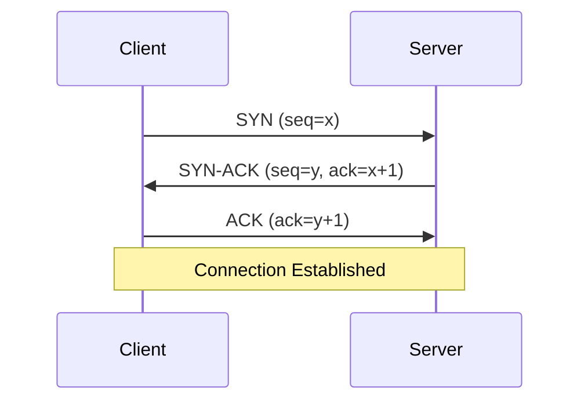
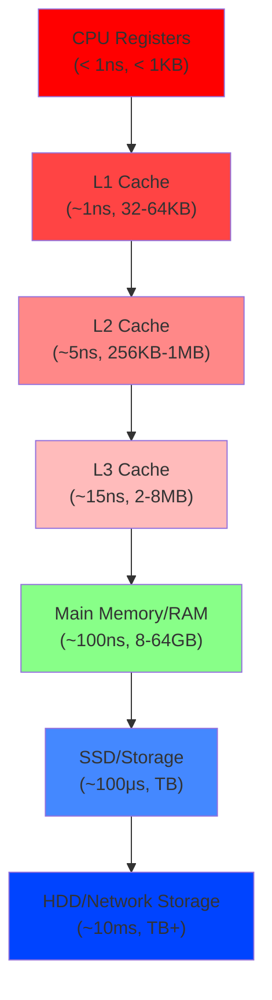
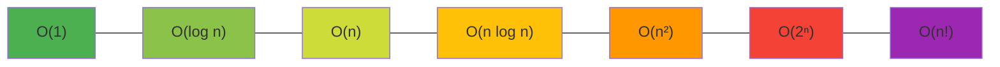
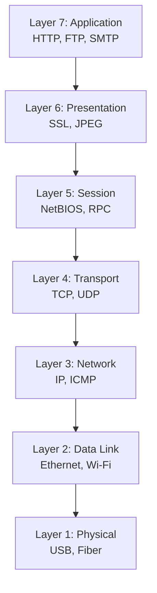
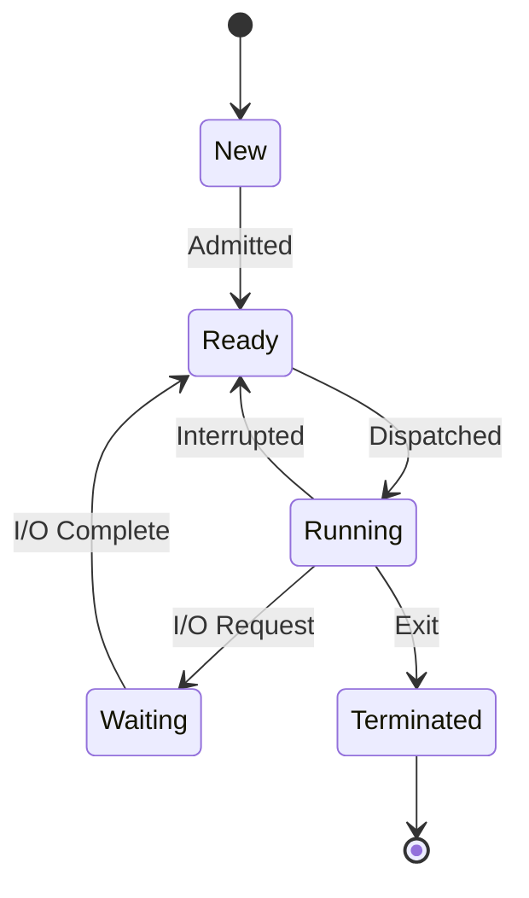

## 1. Introduction

Computer Science fundamentals form the bedrock of every technical interview. Regardless of your role — backend engineer, frontend developer, data scientist, or DevOps engineer — interviewers expect you to understand how computers work at a fundamental level.

FAANG companies specifically test CS fundamentals because they underpin everything: data representation affects how you store data, networking knowledge affects system design, OS concepts affect concurrency, and computational complexity determines whether your solution is viable.

This module covers data representation, Boolean logic, computational complexity, networking basics, database basics, OS basics, compiler basics, digital logic, and computer architecture. These are the topics that appear repeatedly in interviews and form the foundation for all other technical knowledge.

---

## 2. Learning Roadmap

### Phase 1: Data & Logic (Week 1-2)
- [ ] Understand binary, hexadecimal, and number systems
- [ ] Learn Boolean logic and gates
- [ ] Master two's complement and overflow
- [ ] Study bitwise operations and their applications
- [ ] Understand floating-point representation (IEEE 754)

### Phase 2: Algorithms & Complexity (Week 3-4)
- [ ] Master Big-O, Big-Theta, Big-Omega notation
- [ ] Analyze time and space complexity of common algorithms
- [ ] Understand P vs NP and complexity classes
- [ ] Practice complexity analysis on interview problems
- [ ] Study common algorithm paradigms (divide and conquer, dynamic programming, greedy)

### Phase 3: Systems Fundamentals (Week 5-6)
- [ ] Learn networking basics (OSI model, TCP/IP, DNS, HTTP)
- [ ] Study database fundamentals (ACID, normalization, indexing)
- [ ] Understand OS basics (processes, threads, virtual memory, scheduling)
- [ ] Learn compiler basics (lexical analysis, parsing, code generation)
- [ ] Study computer architecture (CPU, cache, memory hierarchy)

### Phase 4: Interview Mastery (Week 7-8)
- [ ] Solve CS fundamentals interview questions
- [ ] Practice explaining concepts clearly
- [ ] Study system design interview topics
- [ ] Mock interviews covering CS fundamentals
- [ ] Review and consolidate all topics

---

## 3. Theory Notes

### 3.1 Number Systems

| System | Base | Digits | Example |
|--------|------|--------|---------|
| Binary | 2 | 0, 1 | 1010₂ = 10₁₀ |
| Octal | 8 | 0-7 | 12₈ = 10₁₀ |
| Decimal | 10 | 0-9 | 10₁₀ |
| Hexadecimal | 16 | 0-9, A-F | A₁₆ = 10₁₀ |

**Conversions:**
- Binary → Decimal: Sum of (bit × 2^position)
- Decimal → Binary: Repeated division by 2
- Binary → Hex: Group bits in 4s

### 3.2 Boolean Logic

**Basic Gates:**
| Gate | Symbol | Truth Table |
|------|--------|-------------|
| AND | A · B | 1 only when both inputs are 1 |
| OR | A + B | 1 when either input is 1 |
| NOT | A' | Inverts the input |
| XOR | A ⊕ B | 1 when inputs differ |
| NAND | (A · B)' | NOT of AND |
| NOR | (A + B)' | NOT of OR |

**De Morgan's Laws:**
- (A · B)' = A' + B'
- (A + B)' = A' · B'

### 3.3 Computational Complexity

**Common Complexities (sorted by growth):**
| Complexity | Name | Example |
|-----------|------|---------|
| O(1) | Constant | Array access, hash lookup |
| O(log n) | Logarithmic | Binary search |
| O(n) | Linear | Linear scan |
| O(n log n) | Linearithmic | Merge sort |
| O(n²) | Quadratic | Nested loops |
| O(n³) | Cubic | Matrix multiplication |
| O(2ⁿ) | Exponential | Subset enumeration |
| O(n!) | Factorial | Permutation generation |

**Complexity Classes:**
- **P**: Problems solvable in polynomial time
- **NP**: Problems verifiable in polynomial time
- **NP-Complete**: Hardest problems in NP (SAT, 3-SAT, TSP)
- **NP-Hard**: At least as hard as NP-Complete (may not be in NP)

### 3.4 OSI Model Layers

| Layer | Name | Protocols | Function |
|-------|------|-----------|----------|
| 7 | Application | HTTP, FTP, SMTP | User interface |
| 6 | Presentation | SSL/TLS, JPEG | Data formatting |
| 5 | Session | NetBIOS, RPC | Connection management |
| 4 | Transport | TCP, UDP | End-to-end delivery |
| 3 | Network | IP, ICMP, ARP | Routing |
| 2 | Data Link | Ethernet, Wi-Fi | Frame transmission |
| 1 | Physical | USB, Bluetooth | Bit transmission |

---

## 4. Key Concepts

### 4.1 Bitwise Operations

```c
// Common bitwise tricks
x & (x - 1)     // Clear lowest set bit
x & (-x)         // Isolate lowest set bit
x | (x - 1)      // Set all bits below lowest unset bit
(x ^ (x >> 1))   // XOR for parity

// Check if power of 2
bool isPowerOf2(int x) { return x > 0 && (x & (x - 1)) == 0; }

// Swap without temp
a ^= b; b ^= a; a ^= b;

// Count set bits (Brian Kernighan)
int count = 0;
while (x) { x &= (x - 1); count++; }

// Get/set/clear ith bit
int getBit(int x, int i) { return (x >> i) & 1; }
int setBit(int x, int i) { return x | (1 << i); }
int clearBit(int x, int i) { return x & ~(1 << i); }
```

### 4.2 TCP vs UDP

| Feature | TCP | UDP |
|---------|-----|-----|
| Connection | Connection-oriented | Connectionless |
| Reliability | Guaranteed delivery | Best-effort |
| Ordering | Maintains order | No ordering |
| Speed | Slower (overhead) | Faster |
| Use Cases | Web, email, file transfer | Streaming, gaming, DNS |

### 4.3 Database ACID Properties

| Property | Description |
|----------|-------------|
| Atomicity | All or nothing — transactions are indivisible |
| Consistency | Data remains valid after transactions |
| Isolation | Concurrent transactions don't interfere |
| Durability | Committed data survives crashes |

### 4.4 OS Process vs Thread

| Feature | Process | Thread |
|---------|---------|--------|
| Memory | Separate address space | Shared address space |
| Creation | Heavyweight | Lightweight |
| Communication | IPC (pipes, shared memory) | Direct (shared memory) |
| Failure | One process crash doesn't affect others | Thread crash can kill process |
| Context Switch | Expensive | Cheaper |

---

## 5. FAQ (20+ Q&A)

**Q1: What is Big-O notation and why does it matter?**
Big-O describes the upper bound of an algorithm's growth rate as input size increases. It matters because it tells you how an algorithm scales — O(n) algorithms handle large datasets much better than O(n²) algorithms. Interviewers use it to evaluate your solution's efficiency.

**Q2: What is the difference between a process and a thread?**
A process has its own memory space and resources. A thread shares the process's memory but has its own stack and registers. Processes are heavier to create and switch between. Threads are lighter but share memory (potential for race conditions).

**Q3: What is the OSI model?**
A conceptual framework that standardizes network communication into 7 layers. Each layer has specific responsibilities and communicates with adjacent layers. The TCP/IP model simplifies this to 4 layers.

**Q4: What is TCP's three-way handshake?**
1. Client sends SYN (synchronize)
2. Server responds with SYN-ACK (synchronize-acknowledge)
3. Client sends ACK (acknowledge)
Connection established. This ensures both sides are ready to communicate.

**Q5: What is virtual memory?**
A memory management technique that gives processes the illusion of having a large contiguous address space, even if physical RAM is smaller. Uses paging to swap data between RAM and disk.

**Q6: What is a deadlock?**
A situation where two or more processes are blocked forever, each waiting for a resource held by another. Four conditions: mutual exclusion, hold and wait, no preemption, circular wait. Prevention involves breaking one of these conditions.

**Q7: What is the difference between HTTP and HTTPS?**
HTTPS is HTTP with TLS encryption. It provides confidentiality (data can't be read), integrity (data can't be modified), and authentication (server identity verified). Uses port 443 vs HTTP's port 80.

**Q8: What is DNS and how does it work?**
Domain Name System translates domain names to IP addresses. Process: browser cache → OS cache → ISP cache → recursive resolver → root server → TLD server → authoritative server. Results are cached at each level.

**Q9: What is the difference between stack and heap memory?**
Stack: fast, automatic allocation, limited size, stores local variables. Heap: slower, manual allocation, large size, stores dynamically allocated data. Stack follows LIFO; heap is free-form.

**Q10: What is a compiler vs interpreter?**
Compiler translates entire source code to machine code before execution (C, C++, Rust). Interpreter translates and executes line by line (Python, JavaScript). JIT compilers (Java, C#) combine both approaches.

**Q11: What is the CAP theorem?**
In a distributed system, you can only guarantee two of three: Consistency (all nodes see same data), Availability (every request gets a response), Partition tolerance (system works despite network failures). In practice, partition tolerance is required, so you choose between CP and AP systems.

**Q12: What is two's complement?**
A method of representing negative integers in binary. To negate: invert all bits and add 1. Range for n bits: -2^(n-1) to 2^(n-1)-1. Advantage: addition and subtraction work the same for signed and unsigned numbers.

**Q13: What is the difference between TCP and UDP?**
TCP is connection-oriented, reliable, ordered. UDP is connectionless, best-effort, unordered. Use TCP for web, email, file transfer. Use UDP for streaming, gaming, DNS queries.

**Q14: What is a cache and why is it important?**
A small, fast memory that stores copies of frequently accessed data. Reduces average memory access time. CPU cache (L1, L2, L3) is critical for performance. Cache misses can cause 100x+ slowdowns.

**Q15: What is the difference between mutex and semaphore?**
Mutex is a locking mechanism (one thread at a time). Semaphore is a signaling mechanism (count-based, multiple threads). Mutex has ownership; semaphore doesn't. Binary semaphore ≈ mutex.

**Q16: What is normalization in databases?**
Organizing tables to reduce redundancy and improve integrity. 1NF: atomic values. 2NF: no partial dependencies. 3NF: no transitive dependencies. BCNF: stricter 3NF. Trade-off: normalization reduces redundancy but may require more JOINs.

**Q17: What is an index in a database?**
A data structure (usually B-tree) that speeds up data retrieval. Like a book index — instead of scanning every page, you look up the page number. Trade-off: indexes speed up reads but slow down writes.

**Q18: What is a bitmap/indexed color?**
A method of representing images where each pixel is an index into a color palette. Used in GIF images and early game graphics. Reduces memory usage compared to storing full RGB values.

**Q19: What is the difference between big-endian and little-endian?**
Big-endian stores the most significant byte first (network byte order). Little-endian stores the least significant byte first (most x86 processors). Can cause issues in network programming and cross-platform data exchange.

**Q20: What is a race condition?**
A bug that occurs when the behavior depends on the timing or ordering of uncontrollable events, typically when multiple threads access shared resources. Prevention: locks, atomic operations, message passing.

**Q21: What is virtual memory paging?**
Dividing virtual and physical memory into fixed-size blocks (pages). The MMU (Memory Management Unit) maps virtual pages to physical frames using page tables. Page faults occur when a page isn't in RAM.

**Q22: What is context switching?**
The process of storing the state of a process/thread and restoring another's state, allowing the CPU to share among multiple tasks. Involves saving registers, updating memory maps, and loading new state. Overhead is typically 1-1000 microseconds.

---

## 6. Hands-on Practice

### Exercise 1: Bitwise Operations
```c
// Count number of 1 bits in an integer
int countBits(int n) {
    int count = 0;
    while (n) {
        n &= (n - 1);  // Clear lowest set bit
        count++;
    }
    return count;
}

// Find the single number (all others appear twice)
int singleNumber(int* nums, int numsSize) {
    int result = 0;
    for (int i = 0; i < numsSize; i++) {
        result ^= nums[i];  // XOR cancels pairs
    }
    return result;
}
```

### Exercise 2: Big-O Analysis
```python
# Analyze the time complexity of each function

# O(n) — single loop
def find_max(arr):
    maximum = arr[0]
    for num in arr:
        if num > maximum:
            maximum = num
    return maximum

# O(n²) — nested loops
def has_duplicate(arr):
    for i in range(len(arr)):
        for j in range(i + 1, len(arr)):
            if arr[i] == arr[j]:
                return True
    return False

# O(n log n) — sorting
def count_sort(arr):
    return sorted(arr)  # Timsort: O(n log n)

# O(log n) — binary search
def binary_search(arr, target):
    lo, hi = 0, len(arr) - 1
    while lo <= hi:
        mid = (lo + hi) // 2
        if arr[mid] == target:
            return mid
        elif arr[mid] < target:
            lo = mid + 1
        else:
            hi = mid - 1
    return -1
```

### Exercise 3: Network Protocols
```
# DNS Resolution Steps
1. Browser checks its DNS cache
2. OS checks its DNS cache
3. Router checks its DNS cache
4. ISP's recursive resolver is queried
5. Resolver queries root nameserver
6. Root server directs to TLD server (.com, .org)
7. TLD server directs to authoritative nameserver
8. Authoritative server returns IP address
9. IP address is cached at each level
```

### Exercise 4: Process Scheduling
```
# Round Robin Scheduling Example
Processes: P1(10ms), P2(4ms), P3(6ms)
Time Quantum: 3ms

Timeline:
  0-3:   P1 (7ms remaining)
  3-6:   P2 (1ms remaining)
  6-9:   P3 (3ms remaining)
  9-12:  P1 (4ms remaining)
  12-13: P2 (done)
  13-16: P3 (done)
  16-19: P1 (1ms remaining)
  19-20: P1 (done)
```

### Exercise 5: SQL Concepts
```sql
-- ACID Example: Bank Transfer
BEGIN TRANSACTION;

-- Debit sender
UPDATE accounts SET balance = balance - 100 WHERE id = 1;
-- Credit receiver
UPDATE accounts SET balance = balance + 100 WHERE id = 2;

COMMIT;
-- If any step fails, entire transaction is rolled back
```

---

## 7. FAANG Questions

### Google
1. **"Explain the CAP theorem with real-world examples."**
   - CP: MongoDB with majority write concern (consistent but may reject writes)
   - AP: Cassandra (available but eventual consistency)
   - CA: Traditional RDBMS (but doesn't handle partitions)

2. **"What happens when you type a URL in the browser?"**
   - DNS lookup → TCP handshake → TLS negotiation → HTTP request → Server processing → HTTP response → Rendering → JavaScript execution

### Amazon
3. **"Explain deadlock with a real-world analogy."**
   - Two people in a narrow hallway, each blocking the other. Prevention: always acquire locks in the same order.

4. **"What is the difference between process and thread?"**
   - Process: isolated memory, heavyweight. Thread: shared memory, lightweight. Thread communication is faster but requires synchronization.

### Meta
5. **"What is the difference between TCP and UDP? When would you use each?"**
   - TCP for reliability (web, email). UDP for speed (streaming, gaming).

6. **"Explain virtual memory and paging."**
   - Maps virtual addresses to physical. Uses page tables. Page faults trigger disk I/O.

### Apple
7. **"What is the difference between a compiler and interpreter?"**
   - Compiler: entire code → machine code. Interpreter: line by line. JIT combines both.

### Netflix
8. **"How does DNS work?"**
   - Hierarchical distributed database. Recursive resolution from cache → root → TLD → authoritative.

---

## 8. Common Mistakes

### Mistake 1: Confusing Big-O with Big-Theta
**Problem:** Using Big-O (upper bound) when you mean Big-Theta (tight bound).
**Fix:** Big-O is "at most as fast as." Big-Theta is "exactly as fast as." Use Big-O for worst case, Big-Theta for average case when exact.

### Mistake 2: Not Considering Cache Effects
**Problem:** Assuming all memory accesses are equal.
**Fix:** Cache misses can be 100x slower. Prefer sequential access patterns (arrays) over random access (linked lists) for large datasets.

### Mistake 3: Confusing TCP and UDP
**Problem:** Not understanding when to use each protocol.
**Fix:** TCP = reliable, ordered, connection-oriented. UDP = fast, connectionless, best-effort. Match protocol to requirements.

### Mistake 4: Ignoring Constant Factors
**Problem:** Choosing O(n log n) over O(n) because "log n is small."
**Fix:** For small n, constants matter. O(n) with large constants may be slower than O(n²) for small inputs. Consider practical input sizes.

### Mistake 5: Not Understanding Two's Complement
**Problem:** Integer overflow bugs and signed/unsigned confusion.
**Fix:** -1 in two's complement is all 1s. Range: -2^(n-1) to 2^(n-1)-1. Be careful with unsigned arithmetic.

### Mistake 6: Forgetting Big-Endian vs Little-Endian
**Problem:** Network data byte order issues.
**Fix:** Network byte order is big-endian. Use `htons`, `htonl`, `ntohs`, `ntohl` for conversions.

### Mistake 7: Not Understanding ACID
**Problem:** Assuming databases handle everything automatically.
**Fix:** ACID properties require explicit transaction management. Not all databases guarantee full ACID (BASE model for distributed systems).

### Mistake 8: Confusing Mutex and Semaphore
**Problem:** Using the wrong synchronization primitive.
**Fix:** Mutex = exclusive lock (one owner). Semaphore = counting signal (multiple permits). Binary semaphore ≈ mutex but without ownership.

---

## 9. Best Practices

### For Algorithm Analysis
1. Always state your assumptions (best, average, worst case)
2. Consider both time AND space complexity
3. Account for input size — what works for n=100 may not for n=10⁶
4. Know common complexity classes and their real-world analogs

### For Networking
1. Understand the full HTTP request/response lifecycle
2. Know the difference between connection-oriented and connectionless
3. Understand DNS resolution at multiple levels
4. Be able to explain TLS/SSL handshake

### For Databases
1. Always use parameterized queries (prevent SQL injection)
2. Understand indexing and when it helps vs hurts
3. Know ACID properties and when they matter
4. Be able to design normalized schemas

### For Operating Systems
1. Understand process vs thread trade-offs
2. Know how virtual memory works (paging, page faults)
3. Understand deadlock conditions and prevention
4. Know scheduling algorithms (FCFS, SJF, Round Robin)

---

## 10. Cheat Sheet

```
CS FUNDAMENTALS QUICK REFERENCE
==================================

COMPLEXITY CLASSES:
  O(1)     — Constant: hash lookup
  O(log n) — Logarithmic: binary search
  O(n)     — Linear: array scan
  O(n log n) — Linearithmic: merge sort
  O(n²)    — Quadratic: nested loops
  O(2ⁿ)    — Exponential: subsets
  O(n!)    — Factorial: permutations

BITWISE TRICKS:
  x & (x-1)     — Clear lowest set bit
  x & (-x)      — Isolate lowest set bit
  x ^ (x >> 1)  — Parity check
  x & 0x...     — Mask bits
  x | (1 << n)  — Set nth bit
  x & ~(1 << n) — Clear nth bit
  (x >> n) & 1  — Get nth bit

TCP vs UDP:
  TCP: Reliable, ordered, connection-oriented
  UDP: Fast, connectionless, best-effort

DNS RESOLUTION:
  Browser cache → OS cache → Router → ISP → Root → TLD → Authoritative

DATABASE ACID:
  Atomicity:   All or nothing
  Consistency: Valid state
  Isolation:   No interference
  Durability:  Survives crashes

OS SCHEDULING:
  FCFS: First Come First Served
  SJF: Shortest Job First
  RR: Round Robin (time quantum)
  Priority: Highest priority first

TWO'S COMPLEMENT (8-bit):
  Range: -128 to 127
  -1 = 11111111
  -128 = 10000000
  Negate: invert bits + 1

IEEE 754 FLOAT:
  Sign | Exponent (8) | Mantissa (23)
  ±0: exponent=0, mantissa=0
  NaN: exponent=255, mantissa≠0
  Inf: exponent=255, mantissa=0
```

---

## 11. Flash Cards

**Card 1:** What is Big-O notation?
**Answer:** Describes the upper bound of an algorithm's growth rate as input size increases, ignoring constants and lower-order terms.

**Card 2:** What is the time complexity of binary search?
**Answer:** O(log n) — halves the search space with each comparison.

**Card 3:** What is the OSI model?
**Answer:** A 7-layer framework for network communication: Physical, Data Link, Network, Transport, Session, Presentation, Application.

**Card 4:** What is the difference between TCP and UDP?
**Answer:** TCP is reliable, ordered, connection-oriented. UDP is fast, connectionless, best-effort.

**Card 5:** What are the four conditions for deadlock?
**Answer:** Mutual exclusion, hold and wait, no preemption, circular wait.

**Card 6:** What is virtual memory?
**Answer:** A technique giving processes the illusion of large contiguous address space using paging to swap between RAM and disk.

**Card 7:** What is ACID in databases?
**Answer:** Atomicity, Consistency, Isolation, Durability — properties ensuring reliable transactions.

**Card 8:** What is two's complement?
**Answer:** A method of representing negative integers: invert all bits and add 1. -1 is all 1s in binary.

**Card 9:** What is the difference between a compiler and interpreter?
**Answer:** Compiler translates entire code before execution. Interpreter translates and executes line by line.

**Card 10:** What is a race condition?
**Answer:** A bug where behavior depends on timing of uncontrollable events, typically with shared mutable state.

**Card 11:** What is DNS?
**Answer:** Domain Name System — translates domain names to IP addresses through hierarchical resolution.

**Card 12:** What is a mutex?
**Answer:** A mutual exclusion lock that allows only one thread to access a shared resource at a time.

**Card 13:** What is the CAP theorem?
**Answer:** In distributed systems, you can guarantee only two of three: Consistency, Availability, Partition tolerance.

**Card 14:** What is cache?
**Answer:** A small, fast memory storing copies of frequently accessed data to reduce average access time.

**Card 15:** What is context switching?
**Answer:** The process of storing one process/thread's state and restoring another's, allowing CPU time-sharing.

**Card 16:** What is the difference between stack and heap?
**Answer:** Stack: fast, automatic, limited, LIFO. Heap: slower, manual, large, free-form.

**Card 17:** What is normalization?
**Answer:** Organizing database tables to reduce redundancy and improve integrity (1NF → 2NF → 3NF → BCNF).

**Card 18:** What is a page fault?
**Answer:** When a process accesses a page not currently in physical RAM, triggering a swap from disk.

**Card 19:** What is the difference between big-endian and little-endian?
**Answer:** Big-endian stores MSB first (network order). Little-endian stores LSB first (most x86).

**Card 20:** What is the HTTP three-way handshake?
**Answer:** SYN → SYN-ACK → ACK — establishes a TCP connection before HTTP communication.

---

## 12. Mind Map

```
                 COMPUTER SCIENCE FUNDAMENTALS
                          |
      ┌───────────────────┼───────────────────┐
      |                   |                   |
  DATA/LOGIC          SYSTEMS              THEORY
      |                   |                   |
┌─────┼─────┐     ┌──────┼──────┐     ┌──────┼──────┐
|     |     |     |      |      |     |      |      |
Num- Bool- Bit-  Net-   OS    Data-  Algo- Complex-
ber   ean   wise works        bases rithms ity
Sys-  Logic |     |      |      |      |      |
tems  |    Two's OSI  Process ACID Big-O  P vs
      |   Comple- Model vs     Norm- |    NP
   IEEE ment     TCP/ Thread  aliz- Sorting
   754  |        UDP   |      ation |   Graph
   Float  De's                |     Search
   Rep    Laws              Index-
```

---

## 13. Mermaid Diagrams

### TCP Three-Way Handshake



### Memory Hierarchy



### Big-O Complexity Comparison



### OSI Model Layers



### Process State Diagram



---

## 14. Code Examples

### Example 1: Bit Manipulation for Subset Generation
```python
def subsets(nums):
    n = len(nums)
    result = []
    for mask in range(1 << n):  # 2^n subsets
        subset = []
        for i in range(n):
            if mask & (1 << i):
                subset.append(nums[i])
        result.append(subset)
    return result

# subsets([1,2,3]) → [[], [1], [2], [1,2], [3], [1,3], [2,3], [1,2,3]]
```

### Example 2: Network Byte Order Conversion
```c
#include <arpa/inet.h>

uint32_t host_to_network(uint32_t host) {
    return htonl(host);  // Host to network long
}

uint16_t network_to_host(uint16_t net) {
    return ntohs(net);  // Network to host short
}
```

### Example 3: Simple Thread Synchronization
```c
#include <pthread.h>

int shared_counter = 0;
pthread_mutex_t lock = PTHREAD_MUTEX_INITIALIZER;

void* increment(void* arg) {
    for (int i = 0; i < 1000000; i++) {
        pthread_mutex_lock(&lock);
        shared_counter++;
        pthread_mutex_unlock(&lock);
    }
    return NULL;
}
```

### Example 4: LRU Cache Using OrderedDict
```python
from collections import OrderedDict

class LRUCache:
    def __init__(self, capacity):
        self.cache = OrderedDict()
        self.capacity = capacity
    
    def get(self, key):
        if key not in self.cache:
            return -1
        self.cache.move_to_end(key)
        return self.cache[key]
    
    def put(self, key, value):
        if key in self.cache:
            self.cache.move_to_end(key)
        self.cache[key] = value
        if len(self.cache) > self.capacity:
            self.cache.popitem(last=False)
```

### Example 5: DNS Lookup Simulation
```python
import socket

def dns_lookup(domain):
    try:
        ip = socket.gethostbyname(domain)
        print(f"{domain} → {ip}")
        return ip
    except socket.gaierror as e:
        print(f"DNS lookup failed: {e}")
        return None

dns_lookup("www.google.com")
```

---

## 15. Projects

### Project 1: HTTP Client Implementation
Build a simple HTTP/1.1 client that:
- Performs DNS lookup
- Establishes TCP connection
- Sends HTTP requests
- Parses responses
- Handles redirects

### Project 2: Memory Allocator
Implement a simple memory allocator that:
- Uses sbrk/mmap for memory
- Manages free lists
- Supports malloc/free/realloc
- Handles alignment requirements

### Project 3: Process Scheduler Simulator
Create a scheduler simulator that:
- Implements FCFS, SJF, Round Robin, Priority algorithms
- Calculates turnaround time, waiting time, response time
- Visualizes scheduling Gantt charts
- Compares algorithm performance

---

## 16. Resources

### Books
- "Computer Systems: A Programmer's Perspective" by Bryant and O'Hallaron
- "Introduction to the Theory of Computation" by Michael Sipser
- "Operating System Concepts" by Silberschatz
- "Computer Networking: A Top-Down Approach" by Kurose and Ross

### Online Resources
- [CS Fundamentals on GeeksforGeeks](https://www.geeksforgeeks.org/)
- [MIT OpenCourseWare](https://ocw.mit.edu/) — Free CS courses
- [Nand2Tetris](https://www.nand2tetris.org/) — Build a computer from scratch
- [Visualgo](https://visualgo.net/) — Algorithm visualization

---

## 17. Checklist

### Data Representation
- [ ] Binary, decimal, hexadecimal conversion
- [ ] Two's complement
- [ ] IEEE 754 floating point
- [ ] Bitwise operations

### Algorithms & Complexity
- [ ] Big-O analysis
- [ ] Common algorithm complexities
- [ ] Sorting algorithms and their complexities
- [ ] Graph algorithms (BFS, DFS, shortest path)

### Networking
- [ ] OSI model layers
- [ ] TCP/IP protocol suite
- [ ] DNS resolution
- [ ] HTTP/HTTPS

### Operating Systems
- [ ] Process vs thread
- [ ] Virtual memory and paging
- [ ] Deadlock conditions and prevention
- [ ] Scheduling algorithms

### Databases
- [ ] ACID properties
- [ ] Normalization (1NF-BCNF)
- [ ] Indexing (B-tree, hash)
- [ ] SQL fundamentals

### Computer Architecture
- [ ] CPU components (ALU, control unit, registers)
- [ ] Cache hierarchy (L1, L2, L3)
- [ ] Memory hierarchy
- [ ] Pipelining basics

---

## 18. Revision Plans

### Week 1: Data & Logic
- Master number systems and bitwise operations
- Study Boolean logic and gates
- Solve 10 bitwise manipulation problems

### Week 2: Complexity
- Master Big-O analysis
- Practice analyzing algorithms
- Solve 10 complexity analysis problems

### Week 3: Systems
- Study networking (OSI, TCP/IP, DNS)
- Learn OS basics (processes, threads, virtual memory)
- Study database fundamentals (ACID, normalization)

### Week 4: Integration
- Solve CS fundamentals interview questions
- Practice explaining concepts clearly
- Mock interviews covering all topics

---

## 19. Mock Interviews

### Mock Interview 1: Complexity Analysis
**Interviewer:** Analyze the time and space complexity of this code:

```python
def mystery(n):
    result = 0
    i = 1
    while i < n:
        j = 0
        while j < n:
            result += 1
            j += 2
        i *= 2
    return result

# Answer: O(n log n) time, O(1) space
```

### Mock Interview 2: Networking
**Interviewer:** Walk me through what happens when you type "www.google.com" into a browser.

### Mock Interview 3: OS Concepts
**Interviewer:** Explain the difference between a mutex and a semaphore. When would you use each?

---

## 20. Difficulty Rating

| Topic | Difficulty | Time to Master |
|-------|-----------|---------------|
| Number Systems | ⭐ (1/5) | 2 days |
| Bitwise Operations | ⭐⭐ (2/5) | 1 week |
| Boolean Logic | ⭐ (1/5) | 2 days |
| Big-O Analysis | ⭐⭐⭐ (3/5) | 2 weeks |
| Networking Basics | ⭐⭐ (2/5) | 1-2 weeks |
| OS Basics | ⭐⭐⭐ (3/5) | 2 weeks |
| Database Basics | ⭐⭐ (2/5) | 1-2 weeks |
| Compiler Basics | ⭐⭐⭐ (3/5) | 2-3 weeks |
| Computer Architecture | ⭐⭐⭐⭐ (4/5) | 3-4 weeks |
| P vs NP | ⭐⭐⭐⭐⭐ (5/5) | Ongoing |

---

## 21. Summary

Computer Science fundamentals are the foundation of every technical interview and career in software engineering. Key principles:

1. **Know your basics cold** — Binary, Big-O, TCP/IP, ACID, process vs thread — these come up everywhere.
2. **Understand the "why"** — Don't just memorize facts. Understand why two's complement works, why TCP needs a handshake, why virtual memory uses paging.
3. **Connect concepts** — Networking knowledge helps in system design. OS knowledge helps in concurrency. Complexity knowledge helps in algorithm selection.
4. **Practice explaining** — The best way to prove understanding is to explain concepts clearly and concisely.
5. **Stay curious** — CS fundamentals are vast. Keep learning about computer architecture, distributed systems, and emerging technologies.

These fundamentals distinguish strong engineers who understand how things work from those who only know how to use them. Master them, and you'll have a solid foundation for any technical interview.

