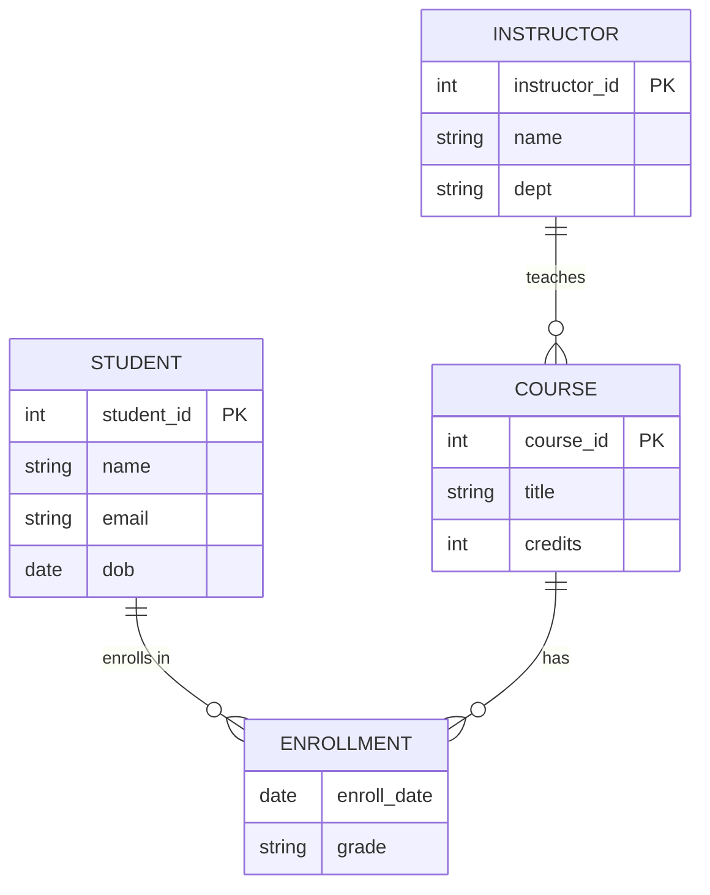
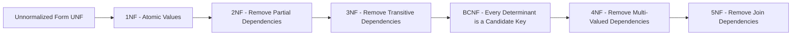
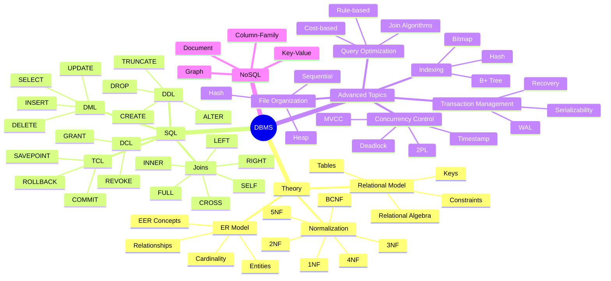
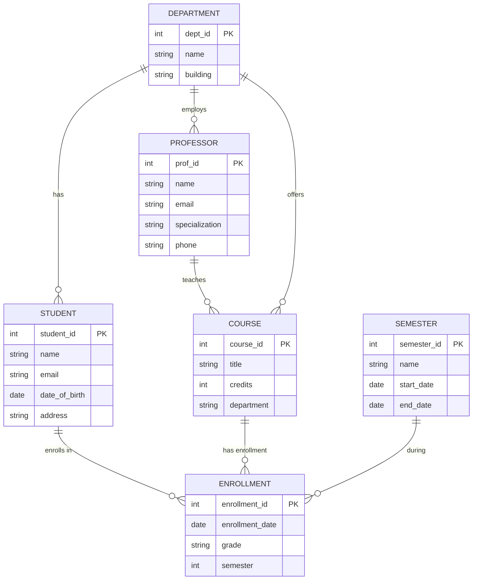
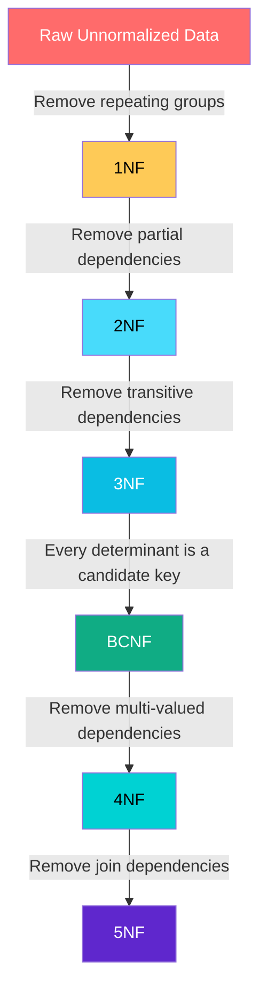
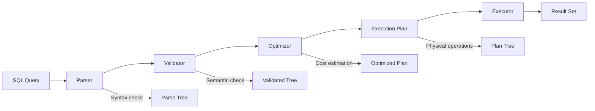
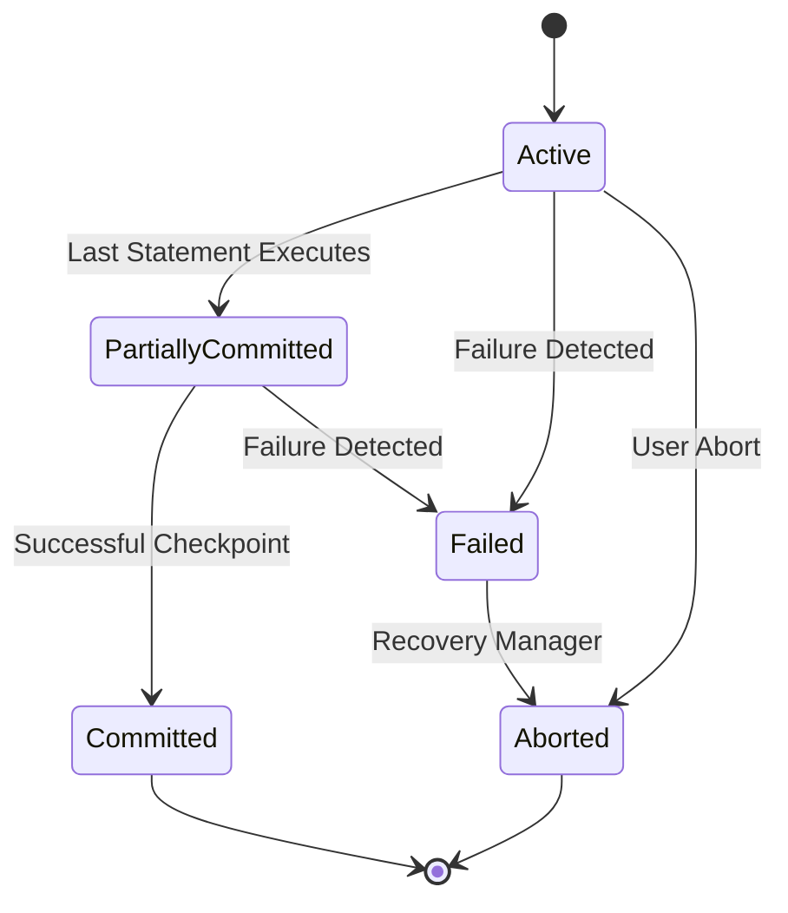
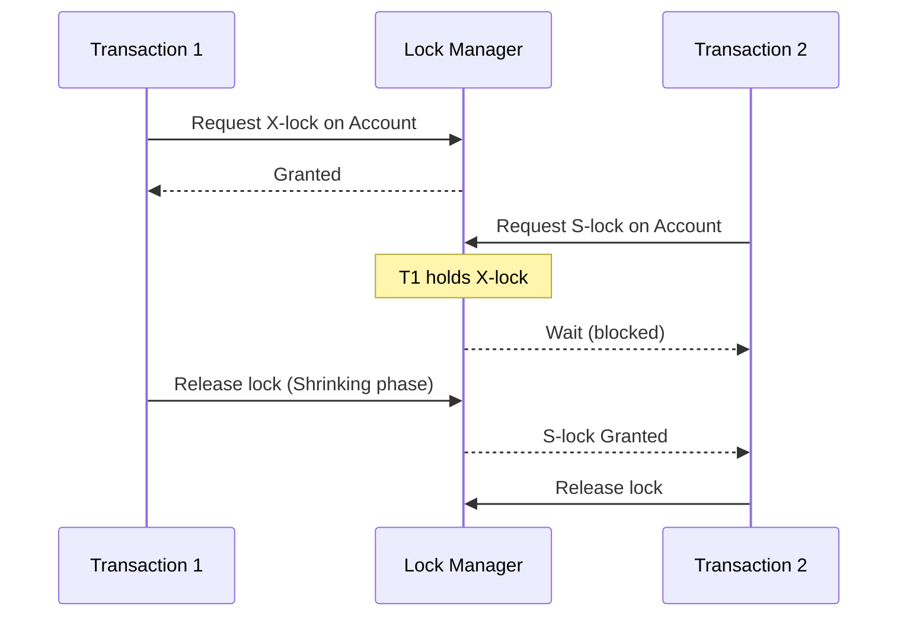

> A comprehensive guide to Database Management Systems for technical interviews — from fundamentals to advanced concepts.

---

## 📑 Table of Contents

| # | Section | Link |
|---|---------|------|
| 1 | [Introduction](#1-introduction) | [Go](#1-introduction) |
| 2 | [Learning Roadmap](#2-learning-roadmap) | [Go](#2-learning-roadmap) |
| 3 | [Theory Notes](#3-theory-notes) | [Go](#3-theory-notes) |
| 4 | [Key Concepts](#4-key-concepts) | [Go](#4-key-concepts) |
| 5 | [Frequently Asked Interview Questions](#5-frequently-asked-interview-questions) | [Go](#5-frequently-asked-interview-questions) |
| 6 | [Hands-on Practice](#6-hands-on-practice) | [Go](#6-hands-on-practice) |
| 7 | [Real FAANG Interview Questions](#7-real-faang-interview-questions) | [Go](#7-real-faang-interview-questions) |
| 8 | [Common Mistakes](#8-common-mistakes) | [Go](#8-common-mistakes) |
| 9 | [Best Practices](#9-best-practices) | [Go](#9-best-practices) |
| 10 | [Cheat Sheet](#10-cheat-sheet) | [Go](#10-cheat-sheet) |
| 11 | [Flash Cards](#11-flash-cards) | [Go](#11-flash-cards) |
| 12 | [Mind Map](#12-mind-map) | [Go](#12-mind-map) |
| 13 | [Mermaid Diagrams](#13-mermaid-diagrams) | [Go](#13-mermaid-diagrams) |
| 14 | [SQL Code Examples](#14-sql-code-examples) | [Go](#14-sql-code-examples) |
| 15 | [Projects](#15-projects) | [Go](#15-projects) |
| 16 | [Resources](#16-resources) | [Go](#16-resources) |
| 17 | [Checklist & Revision Plans](#17-checklist--revision-plans) | [Go](#17-checklist--revision-plans) |
| 18 | [Mock Interviews](#18-mock-interviews) | [Go](#18-mock-interviews) |
| 19 | [Difficulty Rating](#19-difficulty-rating) | [Go](#19-difficulty-rating) |

---

## 1. Introduction

### What is a Database?

A **database** is an organized collection of structured data stored electronically. It acts as an electronic filing system where data is stored, retrieved, and managed efficiently.

### What is a DBMS?

A **Database Management System (DBMS)** is software that interacts with users, applications, and the database itself to capture and analyze data. It provides an interface for performing CRUD operations (Create, Read, Update, Delete) on the database.

**Examples:** MySQL, PostgreSQL, Oracle, SQL Server, MongoDB, Redis, Cassandra.

### What is RDBMS?

A **Relational Database Management System (RDBMS)** stores data in structured tables (relations) with rows (tuples) and columns (attributes). Data is organized using keys and relationships.

**Examples:** MySQL, PostgreSQL, Oracle, SQL Server, MariaDB.

### Why is DBMS Important?

- **Data Redundancy Control:** Minimizes duplicate data across the system.
- **Data Consistency:** Ensures data remains accurate and consistent across all views.
- **Data Integrity:** Enforces constraints to maintain valid data.
- **Data Security:** Controls who can access and modify data.
- **Efficient Data Access:** Optimized query processing and indexing.
- **Concurrent Access:** Multiple users can access data simultaneously.
- **Backup & Recovery:** Automated mechanisms to recover from failures.
- **Data Independence:** Applications are insulated from how data is stored.

### DBMS vs RDBMS

| Feature | DBMS | RDBMS |
|---------|------|-------|
| Data Storage | Files, XML, Hierarchical | Tables with rows and columns |
| Data Relationships | Limited or none | Foreign key relationships |
| Normalization | Not required | Required up to 3NF/BCNF |
| ACID Compliance | Not always | Always |
| Normal Forms | Not applied | 1NF through 5NF |
| Data Integrity | Application-level | Database-level constraints |
| Examples | File systems, MongoDB | MySQL, PostgreSQL, Oracle |

---

## 2. Learning Roadmap

```mermaid
graph TD
    A[🎯 DBMS Learning Roadmap] --> B[🟢 Beginner]
    A --> C[🟡 Intermediate]
    A --> D[🔴 Advanced]
    A --> E[⚫ Expert]

    B --> B1[What is DBMS/RDBMS]
    B --> B2[ER Model & Diagrams]
    B --> B3[Relational Model & Keys]
    B --> B4[Basic SQL - DDL, DML]
    B --> B5[Joins & Subqueries]

    C --> C1[Normalization 1NF-BCNF]
    C --> C2[Complex Queries & Indexes]
    C --> C3[Views, Stored Procedures]
    C --> C4[Transactions & ACID]
    C --> C5[File Organization]

    D --> D1[Concurrency Control]
    D --> D2[Recovery & Logging]
    D --> D3[Query Optimization]
    D --> D4[B+ Trees & Hashing]
    D --> D5[Distributed Databases]

    E --> E1[NoSQL Systems]
    E --> E2[CAP Theorem]
    E --> E3[Database Internals]
    E --> E4[Build a Mini DBMS]
    E --> E5[Performance Tuning]
```



### Timeline

| Level | Duration | Focus Areas |
|-------|----------|-------------|
| Beginner | 2-3 weeks | SQL basics, ER model, relational model, keys |
| Intermediate | 3-4 weeks | Normalization, indexes, transactions, joins |
| Advanced | 4-6 weeks | Concurrency, query optimization, B+ trees |
| Expert | 6+ weeks | Distributed systems, NoSQL, internals |

---

## 3. Theory Notes

### 3.1 ER Model

#### Entities

An **entity** is a real-world object or concept that can be distinctly identified.

- **Strong Entity:** Has its own primary key (e.g., `Student`, `Course`)
- **Weak Entity:** Depends on a strong entity for identification; has a partial key (e.g., `Dependent` of an `Employee`)
- **Entity Set:** Collection of similar entities (e.g., all students)
- **Entity Type:** Defines the schema/structure of an entity

#### Attributes

| Type | Description | Example |
|------|-------------|---------|
| Simple | Cannot be divided further | `Age`, `Name` |
| Composite | Can be divided into sub-parts | `Address → Street, City, State` |
| Derived | Calculated from other attributes | `Age` derived from `DOB` |
| Multivalued | Can have multiple values | `Phone Numbers` |
| Key Attribute | Uniquely identifies an entity | `Student_ID` |

#### Relationships

A **relationship** is an association between two or more entities.

- **Degree:** Number of entity types participating (Binary = 2, Ternary = 3)
- **Relationship Set:** Set of relationships of the same type
- **Participation:** Total (every entity must participate) or Partial (some entities may not)
- **Recursive Relationship:** Entity related to itself (e.g., Employee manages Employee)

#### Cardinality

| Type | Description | Example |
|------|-------------|---------|
| 1:1 | One-to-One | Person ↔ Passport |
| 1:N | One-to-Many | Department → Employees |
| M:N | Many-to-Many | Students ↔ Courses |

#### ER Diagram Notation

| Symbol | Meaning |
|--------|---------|
| Rectangle | Entity |
| Ellipse | Attribute |
| Diamond | Relationship |
| Double Rectangle | Weak Entity |
| Double Ellipse | Multivalued Attribute |
| Dashed Ellipse | Derived Attribute |
| Line connecting ellipse to rectangle | Key Attribute |

#### Extended ER (EER) Concepts

- **Generalization:** Bottom-up approach — combining lower-level entities into higher-level (e.g., `Car` and `Truck` → `Vehicle`)
- **Specialization:** Top-down approach — dividing an entity into sub-entities (e.g., `Employee` → `Manager`, `Engineer`)
- **Inheritance:** Sub-entities inherit attributes from parent entities
- **Category/Union Type:** Subclass that is a subset of the union of multiple superclasses
- **Agstraction:** Treating a relationship as a higher-level entity



---

### 3.2 Relational Model

#### Tables (Relations)

- A **relation** is a two-dimensional table with rows (tuples) and columns (attributes).
- Each table represents an entity set or relationship set.
- **Schema:** `R(A1, A2, ..., An)` where R is the relation name and A1...An are attributes.

#### Keys

| Key Type | Description | Example |
|----------|-------------|---------|
| **Primary Key (PK)** | Uniquely identifies each tuple. Cannot be NULL. | `Student_ID` |
| **Foreign Key (FK)** | References the primary key of another table. Establishes relationships. | `Department_ID` in Employee table |
| **Candidate Key** | Minimal set of attributes that can uniquely identify a tuple. A table can have multiple candidate keys. | `(Student_ID)`, `(Email)` |
| **Super Key** | Any set of attributes that uniquely identifies a tuple. Superset of candidate keys. | `(Student_ID)`, `(Student_ID, Name)` |
| **Composite Key** | Primary key made up of two or more attributes. | `(Student_ID, Course_ID)` in Enrollments |
| **Alternate Key** | Candidate keys that are not chosen as the primary key. | `Email` if `Student_ID` is PK |
| **Unique Key** | Like primary key but allows one NULL value. | `Passport_Number` |
| **Surrogate Key** | System-generated artificial key with no business meaning. | Auto-increment `ID` |

#### Constraints

1. **Domain Constraint:** Values must be of the correct data type (e.g., Age must be an integer > 0)
2. **Key Constraint:** Every relation must have a primary key; no two tuples can have the same PK value.
3. **Entity Integrity:** Primary key cannot be NULL.
4. **Referential Integrity:** Foreign key values must either match a primary key value in the referenced table or be NULL.
5. **NOT NULL Constraint:** Column cannot contain NULL values.
6. **CHECK Constraint:** Values must satisfy a condition (e.g., `Age > 0`).
7. **UNIQUE Constraint:** All values in a column must be distinct.
8. **DEFAULT Constraint:** Provides a default value if none is specified.

#### Relational Algebra

| Operation | Symbol | Description |
|-----------|--------|-------------|
| Selection | σ (sigma) | Selects rows satisfying a condition. `σ_{age>20}(Student)` |
| Projection | π (pi) | Selects specific columns. `π_{name,age}(Student)` |
| Union | ∪ | Combines tuples from two relations (must be union-compatible). |
| Set Difference | − | Returns tuples in one relation but not the other. |
| Cartesian Product | × | Combines every tuple of one relation with every tuple of another. |
| Rename | ρ (rho) | Renames a relation or attributes. `ρ_S(Student)` |
| Natural Join | ⋈ | Joins on common attributes, eliminating duplicates. |
| Theta Join | ⋈_θ | Join with a condition. |
| Division | ÷ | Returns tuples from one relation that match all tuples in another. |

#### Tuple and Domain Relational Calculus

- **Tuple Relational Calculus (TRC):** Uses tuple variables to specify which tuples are selected. `{t | Student(t) ∧ t.age > 20}`
- **Domain Relational Calculus (DRC):** Uses domain variables (attribute values). `{<name, age> | Student(<ID, name, age>) ∧ age > 20}`

---

### 3.3 Normalization

Normalization is the process of organizing data to minimize redundancy and improve data integrity.



#### First Normal Form (1NF)

**Rule:** Each column must contain atomic (indivisible) values. No repeating groups.

**Violation:**
| StudentID | Name | Courses |
|-----------|------|---------|
| 1 | Alice | Math, Physics |
| 2 | Bob | Chemistry |

**1NF Applied:**
| StudentID | Name | Course |
|-----------|------|--------|
| 1 | Alice | Math |
| 1 | Alice | Physics |
| 2 | Bob | Chemistry |

#### Second Normal Form (2NF)

**Rule:** Must be in 1NF + no partial dependency (every non-key attribute must depend on the entire primary key, not just part of it).

**Violation (Composite PK: StudentID, CourseID):**
| StudentID | CourseID | StudentName | CourseName | Grade |
|-----------|----------|-------------|------------|-------|
| 1 | 101 | Alice | Math | A |

`StudentName` depends only on `StudentID` (partial dependency).

**2NF Applied:**
| StudentID | StudentName |
|-----------|-------------|
| 1 | Alice |

| CourseID | CourseName |
|----------|------------|

| StudentID | CourseID | Grade |
|-----------|----------|-------|
| 1 | 101 | A |

#### Third Normal Form (3NF)

**Rule:** Must be in 2NF + no transitive dependency (non-key attributes must not depend on other non-key attributes).

**Violation:**
| EmpID | Name | DeptID | DeptName |
|-------|------|--------|----------|
| 1 | Alice | D1 | Engineering |

`DeptName` depends on `DeptID`, which depends on `EmpID`. (Transitive: EmpID → DeptID → DeptName)

**3NF Applied:**
| EmpID | Name | DeptID |
|-------|------|--------|

| DeptID | DeptName |
|--------|----------|

#### Boyce-Codd Normal Form (BCNF)

**Rule:** For every functional dependency X → Y, X must be a superkey.

BCNF is stricter than 3NF. A relation is in BCNF if and only if every determinant is a candidate key.

**Example of violation:**
- Table: `Teaching(Student, Course, Professor)`
- FDs: `Student, Course → Professor` and `Professor → Course`
- `Professor` determines `Course`, but `Professor` is not a superkey.

#### Fourth Normal Form (4NF)

**Rule:** Must be in BCNF + no non-trivial multi-valued dependencies.

**Violation:**
| EmpID | Skill | Language |
|-------|-------|----------|
| 1 | Java | English |
| 1 | Java | French |
| 1 | Python | English |
| 1 | Python | French |

Skills and Languages are independent multi-valued facts. Split into separate tables.

#### Fifth Normal Form (5NF) — Project-Join Normal Form

**Rule:** Must be in 4NF + no join dependencies. A table is in 5NF if every join dependency is implied by candidate keys. This is rarely violated in practice.

#### Denormalization

Intentionally introducing redundancy to improve read performance at the cost of write performance. Common in:
- Data warehousing
- OLAP systems
- Read-heavy applications
- Caching frequently accessed data

---

### 3.4 SQL (Structured Query Language)

#### SQL Sub-languages

| Category | Full Name | Commands | Purpose |
|----------|-----------|----------|---------|
| DDL | Data Definition Language | `CREATE`, `ALTER`, `DROP`, `TRUNCATE`, `RENAME` | Define/modify schema |
| DML | Data Manipulation Language | `SELECT`, `INSERT`, `UPDATE`, `DELETE` | Manipulate data |
| DCL | Data Control Language | `GRANT`, `REVOKE` | Control access permissions |
| TCL | Transaction Control Language | `COMMIT`, `ROLLBACK`, `SAVEPOINT` | Manage transactions |

#### Joins

```sql
-- INNER JOIN: Returns matching rows from both tables
SELECT e.name, d.dept_name
FROM Employee e
INNER JOIN Department d ON e.dept_id = d.dept_id;

-- LEFT JOIN: All rows from left + matching from right
SELECT e.name, d.dept_name
FROM Employee e
LEFT JOIN Department d ON e.dept_id = d.dept_id;

-- RIGHT JOIN: All rows from right + matching from left
SELECT e.name, d.dept_name
FROM Employee e
RIGHT JOIN Department d ON e.dept_id = d.dept_id;

-- FULL OUTER JOIN: All rows from both tables
SELECT e.name, d.dept_name
FROM Employee e
FULL OUTER JOIN Department d ON e.dept_id = d.dept_id;

-- CROSS JOIN: Cartesian product of both tables
SELECT e.name, d.dept_name
FROM Employee e
CROSS JOIN Department d;

-- SELF JOIN: Table joined with itself
SELECT e.name AS employee, m.name AS manager
FROM Employee e
LEFT JOIN Employee m ON e.manager_id = m.emp_id;
```

#### Subqueries

```sql
-- Scalar subquery
SELECT name, salary,
       (SELECT AVG(salary) FROM Employee) AS avg_salary
FROM Employee;

-- IN subquery
SELECT name FROM Employee
WHERE dept_id IN (SELECT dept_id FROM Department WHERE location = 'NYC');

-- EXISTS subquery
SELECT name FROM Employee e
WHERE EXISTS (
    SELECT 1 FROM Project p WHERE p.emp_id = e.emp_id
);

-- Correlated subquery
SELECT name, salary FROM Employee e1
WHERE salary > (
    SELECT AVG(salary) FROM Employee e2 WHERE e2.dept_id = e1.dept_id
);
```

#### Views

```sql
-- Create a view
CREATE VIEW employee_summary AS
SELECT e.name, e.salary, d.dept_name
FROM Employee e
JOIN Department d ON e.dept_id = d.dept_id;

-- Query the view
SELECT * FROM employee_summary WHERE salary > 50000;

-- Drop a view
DROP VIEW employee_summary;
```

#### Indexes

| Index Type | Description | Use Case |
|------------|-------------|----------|
| **B-Tree** | Balanced tree structure. Default in most RDBMS. Range queries. | `CREATE INDEX idx_name ON Employee(name);` |
| **Hash Index** | Hash table. Equality comparisons only. | `CREATE INDEX idx_id ON Employee(emp_id) USING HASH;` |
| **Clustered Index** | Determines physical order of data. One per table. | `CREATE CLUSTERED INDEX idx_id ON Employee(emp_id);` |
| **Non-Clustered Index** | Separate structure with pointers to data. Multiple per table. | `CREATE NONCLUSTERED INDEX idx_name ON Employee(name);` |
| **Composite Index** | Index on multiple columns. | `CREATE INDEX idx_composite ON Employee(dept_id, salary);` |
| **Unique Index** | Ensures all values in indexed column are unique. | `CREATE UNIQUE INDEX idx_email ON Employee(email);` |
| **Covering Index** | Contains all columns needed by a query (avoids table lookup). | Include extra columns in the index. |

#### Stored Procedures

```sql
CREATE PROCEDURE GetEmployeesByDept(IN dept_name VARCHAR(50))
BEGIN
    SELECT e.name, e.salary
    FROM Employee e
    JOIN Department d ON e.dept_id = d.dept_id
    WHERE d.dept_name = dept_name
    ORDER BY e.salary DESC;
END;

-- Call
CALL GetEmployeesByDept('Engineering');
```

#### Triggers

```sql
CREATE TRIGGER audit_salary_change
AFTER UPDATE ON Employee
FOR EACH ROW
BEGIN
    IF OLD.salary <> NEW.salary THEN
        INSERT INTO SalaryAudit(emp_id, old_salary, new_salary, change_date)
        VALUES (NEW.emp_id, OLD.salary, NEW.salary, NOW());
    END IF;
END;
```

#### Cursors

```sql
DECLARE cur CURSOR FOR SELECT name, salary FROM Employee;
DECLARE continue handler for not found set done = true;

open cur;
read_loop: LOOP
    FETCH cur INTO emp_name, emp_salary;
    IF done THEN LEAVE read_loop; END IF;
    -- Process each row
END LOOP;
CLOSE cur;
```

#### Transactions & ACID

| Property | Description |
|----------|-------------|
| **Atomicity** | All operations in a transaction complete or none do. |
| **Consistency** | Database moves from one valid state to another. |
| **Isolation** | Concurrent transactions do not interfere with each other. |
| **Durability** | Once committed, data persists even after system failure. |

```sql
BEGIN TRANSACTION;
    UPDATE Account SET balance = balance - 1000 WHERE account_id = 1;
    UPDATE Account SET balance = balance + 1000 WHERE account_id = 2;
COMMIT;
-- or ROLLBACK; on failure
```

#### Concurrency Control

| Technique | Description |
|-----------|-------------|
| **Locking (2PL)** | Two-Phase Locking ensures serializability. Phase 1: Growing (acquire locks). Phase 2: Shrinking (release locks). |
| **Timestamp Ordering** | Each transaction gets a timestamp. Operations are ordered by timestamp. |
| **MVCC** | Multi-Version Concurrency Control. Readers don't block writers; writers don't block readers. Used by PostgreSQL, MySQL InnoDB. |
| **Deadlock Detection** | System detects circular wait and aborts one transaction. |
| **Deadlock Prevention** | Wait-Die or Wound-Wait schemes based on timestamps. |

---

### 3.5 Transaction Management

#### Serializability

A schedule is serializable if its outcome is equivalent to some serial execution of the same transactions.

#### Conflict Serializability

Two operations conflict if they:
1. Belong to different transactions
2. Access the same data item
3. At least one is a write

A schedule is conflict-serializable if its precedence graph is acyclic.

#### View Serializability

A schedule is view-serializable if it is view-equivalent to some serial schedule. View equivalence requires:
1. Same initial read for each transaction
2. Same updated values
3. Same final read

#### Recovery

- **Log-Based Recovery:** Write-Ahead Logging (WAL) — log changes before applying.
- **Checkpointing:** Periodic saves of database state to speed up recovery.
- **Shadow Paging:** Maintain old and new pages; switch on commit.
- **ARIES Protocol:** Analysis → Redo → Undo recovery algorithm.

---

### 3.6 Indexing and Hashing

#### B+ Tree

- A self-balancing tree where all data is in leaf nodes.
- Leaf nodes are linked for efficient range queries.
- Every path from root to leaf has the same length.
- Branching factor typically 100-500 (very shallow tree).

**Properties:**
- Height: O(log n) for n records
- Search: O(log n)
- Insert/Delete: O(log n)
- Range query: O(log n + k) where k = number of results

#### Hash Indexing

- Uses a hash function to map keys to bucket locations.
- Great for equality searches: O(1) average case.
- Poor for range queries.
- **Static Hashing:** Fixed number of buckets. Overflow chaining handles collisions.
- **Dynamic Hashing (Extendible/Linear):** Buckets split/merge as data grows.

#### Bitmap Indexing

- Uses bitmaps (binary vectors) for each distinct value in a column.
- Very efficient for low-cardinality columns (few distinct values).
- Excellent for AND/OR operations across multiple columns.
- Common in data warehousing / OLAP.

---

### 3.7 File Organization

| Method | Description | Pros | Cons |
|--------|-------------|------|------|
| **Heap** | Records stored in insertion order | Fast inserts | Slow searches, no ordering |
| **Sequential** | Records stored in sorted order | Fast range queries | Expensive inserts (shifting) |
| **Hash** | Records stored by hash of key | O(1) equality search | Poor range queries |
| **B-Tree** | Balanced tree file organization | Good for search + range | Overhead of tree maintenance |
| **Clustered** | Related records stored together | Fast related queries | Complex maintenance |

---

### 3.8 NoSQL Databases

| Type | Description | Examples | Use Case |
|------|-------------|----------|----------|
| **Key-Value** | Simple key-value pairs | Redis, DynamoDB, Memcached | Caching, session management |
| **Document** | JSON/BSON documents | MongoDB, CouchDB | Content management, catalogs |
| **Column-Family** | Wide columns, column families | Cassandra, HBase | Time-series, analytics |
| **Graph** | Nodes and edges | Neo4j, Amazon Neptune | Social networks, recommendations |

**CAP Theorem:** A distributed system can guarantee at most 2 of 3:
- **Consistency:** All nodes see the same data
- **Availability:** Every request gets a response
- **Partition Tolerance:** System works despite network failures

---

### 3.9 Query Optimization

#### Cost-Based Optimization

The optimizer estimates cost using statistics (table size, index info, data distribution) and picks the cheapest plan.

#### Rule-Based Optimization

Uses predefined rules/transformation rules to rewrite queries (e.g., push selection down, use index).

#### Join Algorithms

| Algorithm | Description | Best When |
|-----------|-------------|-----------|
| **Nested Loop** | For each row in outer table, scan inner table | Small tables, no index on join column |
| **Sort-Merge** | Sort both tables, then merge | Large tables, already sorted data |
| **Hash Join** | Build hash table on smaller table, probe with larger | Equi-joins, no useful index |

---

## 4. Key Concepts

| Concept | Description |
|---------|-------------|
| **Data Independence** | Logical (change schema without changing apps) and Physical (change storage without changing schema) |
| **Schema** | Blueprint/structure of the database (tables, constraints, relationships) |
| **Instance** | Snapshot of the database at a particular moment in time |
| **Data Dictionary** | Metadata repository — stores schema information |
| **Query Processing Pipeline** | Parsing → Validation → Optimization → Execution |
| **Buffer Management** | Managing memory pages to minimize disk I/O |
| **Deadlock** | Circular waiting condition where two or more transactions wait for each other |
| **Phantom Read** | New rows appearing between reads of a query |
| **Dirty Read** | Reading uncommitted data from another transaction |
| **Non-Repeatable Read** | Same query returns different results within same transaction |

---

## 5. Frequently Asked Interview Questions

### 🟢 Beginner Level

**Q1: What is the difference between DELETE, TRUNCATE, and DROP?**

| Feature | DELETE | TRUNCATE | DROP |
|---------|--------|----------|------|
| Type | DML | DDL | DDL |
| WHERE clause | Yes | No | N/A |
| Rollback | Yes | No (in most RDBMS) | No |
| Triggers | Fires | Does not fire | Does not fire |
| Speed | Slower (logs each row) | Faster (deallocates pages) | Fastest (removes object) |

**Q2: What is a Primary Key?**

A primary key is a column (or set of columns) that uniquely identifies each row in a table. It cannot be NULL and must be unique.

**Q3: What is the difference between WHERE and HAVING?**

- `WHERE` filters rows before grouping/aggregation.
- `HAVING` filters groups after aggregation.

```sql
SELECT dept_id, AVG(salary)
FROM Employee
WHERE age > 25          -- filters before grouping
GROUP BY dept_id
HAVING AVG(salary) > 50000;  -- filters after grouping
```

**Q4: What are Aggregate Functions?**

`COUNT()`, `SUM()`, `AVG()`, `MIN()`, `MAX()` — operate on a set of values to return a single value.

**Q5: What is a Foreign Key?**

A foreign key in one table references the primary key of another table, establishing a link between them and enforcing referential integrity.

---

### 🟡 Intermediate Level

**Q6: Explain the difference between INNER JOIN and OUTER JOIN.**

- `INNER JOIN` returns only rows with matching values in both tables.
- `LEFT JOIN` returns all rows from the left table and matched rows from the right.
- `RIGHT JOIN` returns all rows from the right table and matched rows from the left.
- `FULL OUTER JOIN` returns all rows from both tables.

**Q7: What is Normalization? Explain 1NF, 2NF, 3NF.**

Normalization organizes data to reduce redundancy. 1NF requires atomic values. 2NF removes partial dependencies. 3NF removes transitive dependencies.

**Q8: What is a View?**

A view is a virtual table defined by a SQL query. It doesn't store data itself but retrieves data from underlying tables when queried.

**Q9: What is the difference between Clustered and Non-Clustered Index?**

- **Clustered Index:** Determines physical storage order. Only one per table. Faster for range queries.
- **Non-Clustered Index:** Separate structure with pointers. Multiple allowed. Slower than clustered but still fast.

**Q10: Explain ACID properties.**

Atomicity (all or nothing), Consistency (valid state transitions), Isolation (concurrent transactions independent), Durability (committed data survives failures).

---

### 🔴 Advanced Level

**Q11: What is Two-Phase Locking (2PL)?**

2PL ensures conflict-serializable schedules. **Growing phase:** transaction acquires locks but doesn't release. **Shraking phase:** transaction releases locks but doesn't acquire new ones.

**Q12: What is Deadlock? How is it handled?**

Deadlock occurs when two transactions wait for each other's locks. Handled by: timeout, deadlock detection (wait-for graph), prevention (Wait-Die/Wound-Wait).

**Q13: Explain B+ Tree indexing.**

A B+ Tree is a balanced tree where all data lives in leaf nodes linked together. Internal nodes hold routing keys. Height is O(log n). Efficient for range and equality queries.

**Q14: What is MVCC?**

Multi-Version Concurrency Control creates multiple versions of data items. Readers see a consistent snapshot; writers create new versions. No read-write blocking.

**Q15: What is the difference between Conflict Serializability and View Serializability?**

Conflict serializability requires that conflicting operations produce the same order as some serial schedule (checked via precedence graph). View serializability requires view equivalence — same initial reads, updated values, and final reads.

---

### 🏢 FAANG Level

**Q16: Design a database for a social media platform.**

Key entities: Users, Posts, Comments, Likes, Follows, Messages. Consider: many-to-many relationships (Follows), timeline queries (requires efficient indexing), denormalization for read performance, sharding strategies for scale.

**Q17: How would you optimize a slow SQL query?**

1. Analyze the execution plan (`EXPLAIN`)
2. Add appropriate indexes
3. Avoid SELECT * — select only needed columns
4. Use query rewriting (subqueries → JOINs)
5. Optimize joins (use hash join for large datasets)
6. Check for table scans and add covering indexes
7. Consider partitioning for large tables

**Q18: Explain CAP theorem with real-world examples.**

- CP systems: MongoDB (default config), HBase — consistency over availability
- AP systems: Cassandra, DynamoDB (default) — availability over consistency
- CA systems: Traditional RDBMS (single node) — consistency + availability (no partition tolerance)

**Q19: How does a database handle transactions at scale?**

Distributed transactions use 2PC (Two-Phase Commit), Saga pattern, or eventual consistency. Sharding distributes data. Replication provides redundancy. Consensus protocols (Paxos, Raft) ensure agreement.

**Q20: What is the Write-Ahead Logging (WAL) protocol?**

Changes are written to a persistent log before being applied to the database. This ensures durability — on crash, the log can be replayed to recover uncommitted or partially committed changes.

---

## 6. Hands-on Practice

### SQL Exercises

```sql
-- Exercise 1: Create tables with proper constraints
CREATE TABLE Department (
    dept_id INT PRIMARY KEY AUTO_INCREMENT,
    dept_name VARCHAR(100) NOT NULL UNIQUE,
    location VARCHAR(100)
);

CREATE TABLE Employee (
    emp_id INT PRIMARY KEY AUTO_INCREMENT,
    name VARCHAR(100) NOT NULL,
    email VARCHAR(150) UNIQUE,
    salary DECIMAL(10, 2) CHECK (salary > 0),
    hire_date DATE NOT NULL,
    dept_id INT,
    manager_id INT,
    FOREIGN KEY (dept_id) REFERENCES Department(dept_id),
    FOREIGN KEY (manager_id) REFERENCES Employee(emp_id)
);

-- Exercise 2: Find employees earning above department average
SELECT e.name, e.salary, e.dept_id
FROM Employee e
WHERE e.salary > (
    SELECT AVG(salary) FROM Employee WHERE dept_id = e.dept_id
);

-- Exercise 3: Find departments with no employees
SELECT d.dept_name
FROM Department d
WHERE NOT EXISTS (
    SELECT 1 FROM Employee e WHERE e.dept_id = d.dept_id
);

-- Exercise 4: Rank employees by salary within each department
SELECT name, salary, dept_id,
       RANK() OVER (PARTITION BY dept_id ORDER BY salary DESC) AS salary_rank
FROM Employee;

-- Exercise 5: Find the second highest salary
SELECT DISTINCT salary
FROM Employee
ORDER BY salary DESC
LIMIT 1 OFFSET 1;

-- Exercise 6: Running total of salaries by department
SELECT name, salary, dept_id,
       SUM(salary) OVER (PARTITION BY dept_id ORDER BY hire_date) AS running_total
FROM Employee;

-- Exercise 7: Find duplicate emails
SELECT email, COUNT(*) AS cnt
FROM Employee
GROUP BY email
HAVING COUNT(*) > 1;

-- Exercise 8: Self-join to find employees and their managers
SELECT e.name AS employee, m.name AS manager
FROM Employee e
LEFT JOIN Employee m ON e.manager_id = m.emp_id;

-- Exercise 9: Delete duplicate rows, keeping the one with lowest ID
DELETE e1 FROM Employee e1
INNER JOIN Employee e2
WHERE e1.email = e2.email AND e1.emp_id > e2.emp_id;

-- Exercise 10: Pivot rows to columns
SELECT name,
       MAX(CASE WHEN course = 'Math' THEN grade END) AS Math,
       MAX(CASE WHEN course = 'Science' THEN grade END) AS Science
FROM StudentCourses
GROUP BY name;
```

---

## 7. Real FAANG Interview Questions

| Company | Question | Difficulty |
|---------|----------|------------|
| Google | Design a distributed database for Google Search indexing | Expert |
| Amazon | Design a database schema for an e-commerce platform with 100M products | Advanced |
| Meta | How does News Feed ranking query work with billions of posts? | Advanced |
| Apple | Design a database for iCloud — file storage, sharing, versioning | Expert |
| Netflix | Design a database for user viewing history and recommendations | Advanced |
| Microsoft | Optimize a SQL query that runs on a 1B row table | Advanced |
| Google | Explain how Spanner achieves external consistency globally | Expert |
| Amazon | Design a booking system (hotels) with concurrent reservations | Advanced |
| Meta | How to implement Facebook's "People You May Know"? | Advanced |
| Uber | Design a real-time ride matching database | Expert |

---

## 8. Common Mistakes

1. **Not using indexes properly** — creating too many or too few indexes
2. **Using SELECT * in production** — always select specific columns
3. **Ignoring N+1 query problems** — use JOINs instead of looping queries
4. **Not normalizing enough** — leading to data anomalies
5. **Over-normalizing** — too many joins hurting performance
6. **Ignoring NULL behavior** — `NULL = NULL` is NULL, not TRUE
7. **Forgetting about transaction isolation** — leading to dirty reads
8. **Not using parameterized queries** — SQL injection risk
9. **Ignoring execution plans** — not using EXPLAIN before optimization
10. **Using OR instead of IN** — IN is often optimized better
11. **Not considering data types** — using VARCHAR for dates or numbers
12. **Missing foreign key constraints** — data integrity issues

---

## 9. Best Practices

1. **Always define primary keys** on every table
2. **Use appropriate data types** — don't use VARCHAR(255) for everything
3. **Create indexes on frequently queried columns** — especially in WHERE, JOIN, ORDER BY
4. **Use prepared statements** to prevent SQL injection
5. **Normalize to at least 3NF** unless performance requires denormalization
6. **Use transactions** for multi-step operations
7. **Back up regularly** and test your recovery process
8. **Monitor slow queries** using query logs and profiling
9. **Use connection pooling** in application code
10. **Document your schema** with clear naming conventions
11. **Use cascading actions** wisely — prefer RESTRICT over CASCADE
12. **Partition large tables** for better performance

---

## 10. Cheat Sheet

### SQL Quick Reference

| Operation | SQL |
|-----------|-----|
| Create table | `CREATE TABLE t (id INT PRIMARY KEY, name VARCHAR(50));` |
| Insert data | `INSERT INTO t (id, name) VALUES (1, 'Alice');` |
| Select data | `SELECT * FROM t WHERE name = 'Alice';` |
| Update data | `UPDATE t SET name = 'Bob' WHERE id = 1;` |
| Delete data | `DELETE FROM t WHERE id = 1;` |
| Join | `SELECT * FROM a JOIN b ON a.id = b.a_id;` |
| Group by | `SELECT dept, COUNT(*) FROM emp GROUP BY dept;` |
| Having | `HAVING COUNT(*) > 5` |
| Order by | `ORDER BY name ASC` |
| Limit | `LIMIT 10 OFFSET 20` |
| Subquery | `WHERE id IN (SELECT id FROM t2)` |
| Create index | `CREATE INDEX idx ON t(col);` |
| Create view | `CREATE VIEW v AS SELECT ...;` |
| Transaction | `BEGIN; ... COMMIT; / ROLLBACK;` |

### Normalization Quick Reference

| Normal Form | Rule | Fix |
|-------------|------|-----|
| 1NF | Atomic values, no repeating groups | Flatten into rows |
| 2NF | 1NF + no partial dependencies | Split composite key tables |
| 3NF | 2NF + no transitive dependencies | Extract dependent tables |
| BCNF | Every determinant is a candidate key | Decompose further |
| 4NF | No multi-valued dependencies | Split independent multi-valued facts |

---

## 11. Flash Cards

| # | Question | Answer |
|---|----------|--------|
| 1 | What is a primary key? | A unique, non-null identifier for each row in a table. |
| 2 | What is normalization? | Process of organizing data to reduce redundancy and improve integrity. |
| 3 | What does ACID stand for? | Atomicity, Consistency, Isolation, Durability. |
| 4 | What is a foreign key? | A column referencing the primary key of another table. |
| 5 | Difference between DELETE and TRUNCATE? | DELETE is DML (with WHERE), TRUNCATE is DDL (removes all rows, faster). |
| 6 | What is a B+ Tree? | A balanced tree with all data in linked leaf nodes. O(log n) operations. |
| 7 | What is MVCC? | Multi-Version Concurrency Control — readers don't block writers. |
| 8 | What is 2PL? | Two-Phase Locking — growing (acquire) and shrinking (release) phases. |
| 9 | What is deadlock? | Circular wait where two+ transactions wait for each other's locks. |
| 10 | What is a view? | A virtual table defined by a stored query. |
| 11 | What is an index? | A data structure that speeds up data retrieval (e.g., B+ tree). |
| 12 | What is the difference between INNER and OUTER JOIN? | INNER returns matching rows; OUTER includes non-matching from one/both tables. |
| 13 | What is 1NF? | Each column contains atomic (indivisible) values; no repeating groups. |
| 14 | What is a candidate key? | A minimal set of attributes that uniquely identifies a tuple. |
| 15 | What is the CAP theorem? | Distributed systems can guarantee at most 2 of: Consistency, Availability, Partition tolerance. |
| 16 | What is a trigger? | A stored procedure that automatically executes on INSERT/UPDATE/DELETE events. |
| 17 | What is the difference between WHERE and HAVING? | WHERE filters rows before grouping; HAVING filters groups after aggregation. |
| 18 | What is a composite key? | A primary key consisting of two or more columns. |
| 19 | What is write-ahead logging? | Changes are logged before being applied to the database for crash recovery. |
| 20 | What is the difference between clustered and non-clustered index? | Clustered determines physical order (1 per table); non-clustered is a separate structure (multiple allowed). |

---

## 12. Mind Map



---

## 13. Mermaid Diagrams

### ER Diagram — University Database



### Normalization Flow



### Query Processing Pipeline



### Transaction State Machine



### Locking Protocol Visualization



---

## 14. SQL Code Examples

### Complete Schema Example

```sql
-- Create database
CREATE DATABASE university;
USE university;

-- Departments
CREATE TABLE departments (
    dept_id INT PRIMARY KEY AUTO_INCREMENT,
    dept_name VARCHAR(100) NOT NULL UNIQUE,
    building VARCHAR(50),
    budget DECIMAL(12, 2)
);

-- Professors
CREATE TABLE professors (
    prof_id INT PRIMARY KEY AUTO_INCREMENT,
    first_name VARCHAR(50) NOT NULL,
    last_name VARCHAR(50) NOT NULL,
    email VARCHAR(150) UNIQUE NOT NULL,
    hire_date DATE NOT NULL,
    dept_id INT,
    FOREIGN KEY (dept_id) REFERENCES departments(dept_id)
);

-- Courses
CREATE TABLE courses (
    course_id INT PRIMARY KEY AUTO_INCREMENT,
    course_code VARCHAR(10) NOT NULL UNIQUE,
    title VARCHAR(200) NOT NULL,
    credits INT CHECK (credits > 0),
    dept_id INT,
    prof_id INT,
    FOREIGN KEY (dept_id) REFERENCES departments(dept_id),
    FOREIGN KEY (prof_id) REFERENCES professors(prof_id)
);

-- Students
CREATE TABLE students (
    student_id INT PRIMARY KEY AUTO_INCREMENT,
    first_name VARCHAR(50) NOT NULL,
    last_name VARCHAR(50) NOT NULL,
    email VARCHAR(150) UNIQUE NOT NULL,
    enrollment_date DATE NOT NULL,
    gpa DECIMAL(3, 2) CHECK (gpa >= 0 AND gpa <= 4.00)
);

-- Enrollments
CREATE TABLE enrollments (
    enrollment_id INT PRIMARY KEY AUTO_INCREMENT,
    student_id INT NOT NULL,
    course_id INT NOT NULL,
    semester VARCHAR(20) NOT NULL,
    grade CHAR(2),
    UNIQUE (student_id, course_id, semester),
    FOREIGN KEY (student_id) REFERENCES students(student_id),
    FOREIGN KEY (course_id) REFERENCES courses(course_id)
);

-- Create indexes
CREATE INDEX idx_student_name ON students(last_name, first_name);
CREATE INDEX idx_course_code ON courses(course_code);
CREATE INDEX idx_enrollment_semester ON enrollments(semester);

-- Insert sample data
INSERT INTO departments (dept_name, building, budget)
VALUES ('Computer Science', 'Turing Hall', 500000.00),
       ('Mathematics', 'Euler Hall', 350000.00),
       ('Physics', 'Feynman Lab', 400000.00);

INSERT INTO professors (first_name, last_name, email, hire_date, dept_id)
VALUES ('Alan', 'Turing', 'turing@university.edu', '1936-01-01', 1),
       ('Marie', 'Curie', 'curie@university.edu', '1903-01-01', 3);

INSERT INTO courses (course_code, title, credits, dept_id, prof_id)
VALUES ('CS101', 'Intro to Programming', 3, 1, 1),
       ('CS201', 'Data Structures', 4, 1, 1),
       ('PH101', 'Physics I', 4, 3, 2);

-- Complex Queries

-- Find top 3 students by GPA
SELECT first_name, last_name, gpa
FROM students
ORDER BY gpa DESC
LIMIT 3;

-- Count students per department
SELECT d.dept_name, COUNT(DISTINCT e.student_id) AS student_count
FROM departments d
LEFT JOIN courses c ON d.dept_id = c.dept_id
LEFT JOIN enrollments e ON c.course_id = e.course_id
GROUP BY d.dept_name
ORDER BY student_count DESC;

-- Find courses with no enrollments
SELECT c.course_code, c.title
FROM courses c
LEFT JOIN enrollments e ON c.course_id = e.course_id
WHERE e.enrollment_id IS NULL;

-- Window function: Rank students per course
SELECT s.first_name, s.last_name, c.course_code, e.grade,
       ROW_NUMBER() OVER (PARTITION BY c.course_id ORDER BY e.grade) AS rank
FROM students s
JOIN enrollments e ON s.student_id = e.student_id
JOIN courses c ON e.course_id = c.course_id;
```

### Stored Procedure Example

```sql
DELIMITER //
CREATE PROCEDURE EnrollStudent(
    IN p_student_id INT,
    IN p_course_id INT,
    IN p_semester VARCHAR(20)
)
BEGIN
    DECLARE student_exists INT DEFAULT 0;
    DECLARE course_exists INT DEFAULT 0;
    DECLARE already_enrolled INT DEFAULT 0;

    SELECT COUNT(*) INTO student_exists FROM students WHERE student_id = p_student_id;
    SELECT COUNT(*) INTO course_exists FROM courses WHERE course_id = p_course_id;
    SELECT COUNT(*) INTO already_enrolled
    FROM enrollments
    WHERE student_id = p_student_id AND course_id = p_course_id AND semester = p_semester;

    IF student_exists = 0 THEN
        SIGNAL SQLSTATE '45000' SET MESSAGE_TEXT = 'Student not found';
    ELSEIF course_exists = 0 THEN
        SIGNAL SQLSTATE '45000' SET MESSAGE_TEXT = 'Course not found';
    ELSEIF already_enrolled > 0 THEN
        SIGNAL SQLSTATE '45000' SET MESSAGE_TEXT = 'Already enrolled in this course';
    ELSE
        INSERT INTO enrollments (student_id, course_id, semester)
        VALUES (p_student_id, p_course_id, p_semester);
    END IF;
END //
DELIMITER ;
```

### Trigger Example

```sql
DELIMITER //
CREATE TRIGGER before_enrollment_insert
BEFORE INSERT ON enrollments
FOR EACH ROW
BEGIN
    IF NEW.grade NOT IN ('A', 'B', 'C', 'D', 'F', NULL) THEN
        SIGNAL SQLSTATE '45000' SET MESSAGE_TEXT = 'Invalid grade';
    END IF;
END //
DELIMITER ;
```

### Transaction Example

```sql
START TRANSACTION;

-- Transfer $500 from account 1 to account 2
UPDATE accounts SET balance = balance - 500 WHERE account_id = 1;
UPDATE accounts SET balance = balance + 500 WHERE account_id = 2;

-- Verify no negative balances
IF (SELECT balance FROM accounts WHERE account_id = 1) < 0 THEN
    ROLLBACK;
ELSE
    COMMIT;
END IF;
```

---

## 15. Projects

### 🟢 Mini Project: Design a Database Schema

**Task:** Design a complete database schema for an **Online Library Management System**.

**Requirements:**
- Track books, authors, publishers, genres
- Member registration and membership types
- Book borrowing and returning
- Fines for late returns
- Search functionality (by title, author, genre)

**Deliverables:**
1. ER diagram
2. Normalized schema (3NF minimum)
3. SQL DDL scripts
4. Sample data (at least 50 records per table)
5. 10 queries demonstrating different SQL features

### 🟡 Intermediate Project: Build a Query Optimizer

**Task:** Build a simple query optimizer that takes a SQL-like query and produces an optimized execution plan.

**Features:**
1. Parse simple SELECT queries
2. Generate multiple execution plans
3. Estimate cost based on table statistics
4. Choose the cheapest plan
5. Visualize the execution plan

**Tech Stack:** Python/Java + SQLite for testing

### 🔴 Advanced Project: Build a Mini DBMS

**Task:** Build a simplified DBMS from scratch.

**Features:**
1. SQL parser (support basic SELECT, INSERT, UPDATE, DELETE)
2. Table storage engine (heap file organization)
3. B+ Tree indexing
4. Simple query executor
5. Transaction support with WAL
6. Basic concurrency control

**Tech Stack:** C++/Rust/Go

### 💡 10 Project Ideas

| # | Project | Difficulty | Skills |
|---|---------|------------|--------|
| 1 | Library Management System | Beginner | Schema design, basic SQL |
| 2 | E-commerce Database | Intermediate | Complex relationships, normalization |
| 3 | Hospital Management System | Intermediate | Multi-entity, views, stored procedures |
| 4 | Social Media Database | Advanced | Sharding, indexing, denormalization |
| 5 | Banking System | Advanced | Transactions, ACID, concurrency |
| 6 | Flight Booking System | Advanced | Real-time, scheduling, optimization |
| 7 | Query Log Analyzer | Intermediate | Parsing, aggregation, reporting |
| 8 | Database Migration Tool | Advanced | Schema diff, versioning, rollback |
| 9 | Simple SQL Engine | Expert | Parser, optimizer, executor |
| 10 | Distributed Key-Value Store | Expert | CAP, replication, partitioning |

---

## 16. Resources

### 📚 Books

| Book | Author | Level |
|------|--------|-------|
| Database System Concepts | Silberschatz, Korth, Sudarshan | Beginner-Advanced |
| Database Management Systems (Ragu) | Ramakrishnan & Gehrke | Intermediate |
| Database Internals | Alex Petrov | Advanced |
| Designing Data-Intensive Applications | Martin Kleppmann | Advanced |
| SQL Performance Explained | Markus Winand | Intermediate |
| Fundamentals of Database Systems | Elmasri & Navathe | Beginner-Intermediate |
| Database Design and Implementation | Edward Sciore | Intermediate |

### 📖 Documentation

- [MySQL Official Documentation](https://dev.mysql.com/doc/)
- [PostgreSQL Documentation](https://www.postgresql.org/docs/)
- [SQL Server Documentation](https://docs.microsoft.com/en-us/sql/)
- [Oracle Database Docs](https://docs.oracle.com/en/database/)
- [SQLite Documentation](https://www.sqlite.org/docs.html)
- [MongoDB Documentation](https://www.mongodb.com/docs/)

### 🎥 YouTube Channels

| Channel | Focus |
|---------|-------|
| Gate Smashers | DBMS theory, normalization, ER model |
| Jenny's Lectures | SQL, DBMS concepts |
| Neso Academy | Database systems course |
| Abdul Bari | SQL and algorithms |
| Tech With Tim | SQL for beginners |
| fireship | Quick database overviews |
| Theprimeagen | Database internals |
| CMU Database Group | Advanced database research |

### 📝 Blogs

- [Use The Index, Luke](https://use-the-index-luke.com/) — SQL indexing and tuning
- [Planet PostgreSQL](https://planet.postgresql.org/) — PostgreSQL community
- [Percona Database Performance Blog](https://www.percona.com/blog/)
- [Brent Ozar SQL Server](https://www.brentozar.com/archive/)
- [SQLShack](https://www.sqlshack.com/) — SQL Server articles
- [Vertabelo Blog](https://www.vertabelo.com/blog/) — Data modeling

### 🏆 Certifications

| Certification | Provider | Level |
|---------------|----------|-------|
| Oracle Database SQL Certified Associate | Oracle | Beginner |
| MySQL Database Administration | Oracle | Intermediate |
| Microsoft Certified: Azure Database | Microsoft | Intermediate |
| PostgreSQL Professional Certification | EDB | Intermediate |
| MongoDB Certified Developer | MongoDB | Intermediate |
| AWS Certified Database Specialty | Amazon | Advanced |
| Google Cloud Professional Data Engineer | Google | Advanced |

---

## 17. Checklist & Revision Plans

### ✅ Checklist

- [ ] Understand DBMS vs RDBMS
- [ ] Master ER Model and EER concepts
- [ ] Know all types of keys (Primary, Foreign, Candidate, Super, Composite, Alternate)
- [ ] Understand relational algebra operations
- [ ] Master all normal forms (1NF through BCNF) with examples
- [ ] Write complex SQL queries (JOINs, subqueries, window functions)
- [ ] Understand and apply indexing (B+ Tree, Hash, Bitmap)
- [ ] Explain ACID properties with examples
- [ ] Understand concurrency control (2PL, MVCC, Timestamps)
- [ ] Know deadlock detection and prevention
- [ ] Understand query optimization strategies
- [ ] Practice normalization problems
- [ ] Design database schemas from requirements
- [ ] Understand file organization methods
- [ ] Know the CAP theorem
- [ ] Be familiar with NoSQL databases
- [ ] Practice at least 30 SQL interview questions
- [ ] Build at least one database project
- [ ] Understand transaction management (serializability, recovery)
- [ ] Know the difference between clustered and non-clustered indexes

### 📅 One-Day Revision Plan

| Time | Topic | Activity |
|------|-------|----------|
| 9:00 - 9:30 | ER Model & Relational Model | Review entities, keys, constraints |
| 9:30 - 10:00 | Normalization | Walk through 1NF-3NF with examples |
| 10:00 - 10:30 | SQL Basics | Review DDL, DML, JOINs |
| 10:30 - 11:00 | Advanced SQL | Subqueries, window functions, indexes |
| 11:00 - 11:30 | Transactions & ACID | Review isolation levels, 2PL |
| 11:30 - 12:00 | Interview Questions | Practice 15 questions |
| 12:00 - 12:30 | Cheat Sheet Review | Quick review of key formulas/concepts |
| 12:30 - 13:00 | Mock Questions | Self-test on weak areas |

### 📅 One-Week Revision Plan

| Day | Focus | Activities |
|-----|-------|------------|
| Day 1 | Fundamentals | ER Model, Relational Model, Keys, Constraints |
| Day 2 | Normalization | 1NF through BCNF, denormalization |
| Day 3 | SQL | DDL, DML, JOINs, subqueries, window functions |
| Day 4 | Indexing & Files | B+ Tree, Hash Index, File Organization |
| Day 5 | Transactions | ACID, Concurrency Control, Deadlocks |
| Day 6 | Query Optimization | Cost-based, rule-based, join algorithms |
| Day 7 | Full Review | Cheat sheet, mock interview, practice questions |

---

## 18. Mock Interviews

### Mock Interview 1 — Beginner

1. What is the difference between DBMS and RDBMS?
2. Explain the types of keys with examples.
3. What is normalization? Explain 1NF and 2NF.
4. Write a SQL query to find the second highest salary.
5. What is the difference between WHERE and HAVING?

### Mock Interview 2 — Intermediate

1. Write a query to find duplicate records in a table.
2. Explain different types of JOINs with examples.
3. What is a B+ Tree? Why is it preferred over B-Tree for databases?
4. Explain ACID properties with real-world examples.
5. What is the difference between DELETE and TRUNCATE?

### Mock Interview 3 — Advanced

1. Design a schema for a hospital management system.
2. Explain 2PL and how it ensures serializability.
3. What is MVCC? How does PostgreSQL implement it?
4. How would you optimize a query that joins 3 tables with 100M rows each?
5. Explain the CAP theorem with real-world system examples.

### Mock Interview 4 — FAANG

1. Design the database for Instagram's like system.
2. How would you handle 1 million concurrent users writing to the same table?
3. Explain how distributed databases achieve consistency.
4. Write a SQL query to find the median salary.
5. How would you shard a database for a social media platform?

---

## 19. Difficulty Rating

| Topic | Difficulty | Priority | Notes |
|-------|------------|----------|-------|
| DBMS Basics | ⭐ | High | Foundation — must know |
| ER Model | ⭐⭐ | High | Frequently asked |
| Relational Model | ⭐⭐ | High | Keys and constraints |
| Normalization | ⭐⭐⭐ | High | 1NF-BCNF with examples |
| SQL Basics (DDL/DML) | ⭐⭐ | High | Must be fluent |
| Joins | ⭐⭐ | High | Practice extensively |
| Subqueries | ⭐⭐⭐ | Medium | Correlated vs non-correlated |
| Window Functions | ⭐⭐⭐ | Medium | Increasingly asked |
| Indexing | ⭐⭐⭐ | High | B+ Tree understanding critical |
| Transactions & ACID | ⭐⭐⭐ | High | Core concept |
| Concurrency Control | ⭐⭐⭐⭐ | High | 2PL, MVCC |
| Deadlock | ⭐⭐⭐ | Medium | Detection and prevention |
| Query Optimization | ⭐⭐⭐⭐ | Medium | Cost-based optimization |
| File Organization | ⭐⭐ | Low | Know the basics |
| NoSQL | ⭐⭐⭐ | Medium | CAP theorem |
| Distributed DB | ⭐⭐⭐⭐⭐ | Medium | FAANG level |
| SQL Performance Tuning | ⭐⭐⭐⭐ | High | Real-world critical |

---

## Summary

DBMS is a foundational topic for any software engineering interview. Key areas to master:

1. **ER Model** — entities, relationships, cardinality, EER
2. **Relational Model** — keys, constraints, relational algebra
3. **Normalization** — 1NF through BCNF with practical examples
4. **SQL** — DDL, DML, joins, subqueries, window functions, indexes
5. **Transactions** — ACID, isolation levels, concurrency control
6. **Advanced** — query optimization, B+ trees, distributed databases
7. **Practice** — design schemas, write queries, solve interview problems

The best way to learn DBMS is by building projects and practicing SQL daily.

---

## Revision Checklist

- [ ] Can explain DBMS vs RDBMS clearly
- [ ] Can draw an ER diagram for any given scenario
- [ ] Can identify and explain all key types
- [ ] Can normalize a table from UNF to 3NF/BCNF
- [ ] Can write JOINs, subqueries, and window functions
- [ ] Can explain ACID properties with examples
- [ ] Can describe B+ Tree structure and operations
- [ ] Can explain deadlock detection and prevention
- [ ] Can design a database schema from requirements
- [ ] Can optimize a slow query using EXPLAIN and indexing
- [ ] Can explain CAP theorem and its implications
- [ ] Can discuss when to use SQL vs NoSQL
- [ ] Can explain 2PL and MVCC
- [ ] Can write stored procedures and triggers

---

## Practice Tasks

1. **ER Diagram Exercise:** Draw an ER diagram for a university enrollment system with students, professors, courses, and departments.
2. **Normalization Exercise:** Take a denormalized table and normalize it to 3NF.
3. **SQL Challenge:** Write 20 different queries on a sample database (LeetCode SQL problems).
4. **Index Design:** Given a set of queries, design appropriate indexes.
5. **Schema Design:** Design a complete schema for an e-commerce platform.
6. **Query Optimization:** Take 5 slow queries and optimize them.
7. **Concurrency Exercise:** Trace through a schedule to check for conflict serializability.
8. **Project:** Build one of the 10 project ideas listed above.

---

## Next Topic

**[34. Computer Networks →](../34-Computer-Networks/README.md)**

---

## References

1. Silberschatz, A., Korth, H. F., & Sudarshan, S. — *Database System Concepts*
2. Ramakrishnan, R. & Gehrke, J. — *Database Management Systems*
3. Kleppmann, M. — *Designing Data-Intensive Applications*
4. Petrov, A. — *Database Internals*
5. [Use The Index, Luke](https://use-the-index-luke.com/)
6. [MySQL Documentation](https://dev.mysql.com/doc/)
7. [PostgreSQL Documentation](https://www.postgresql.org/docs/)
8. [Gate Smashers — DBMS Playlist](https://www.youtube.com/playlist?list=PLdo5W4Nhv3FbKSRtSfCZzE95E1z46t9zZ)
9. [Jenny's Lectures — DBMS](https://www.youtube.com/playlist?list=PLdo5W4Nhv3RazlxoEYmOrD5tCwL7TzR4o)
10. [Neso Academy — Database Systems](https://www.youtube.com/playlist?list=PLBlnK6fEyqRi_CVXRU9K16m5eU7fHmP2Y)

---

> **Last Updated:** July 2026 | **Maintained for:** Interview Preparation

