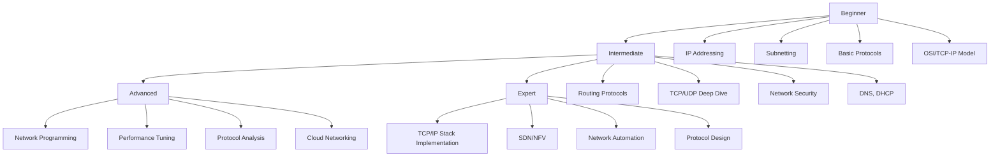
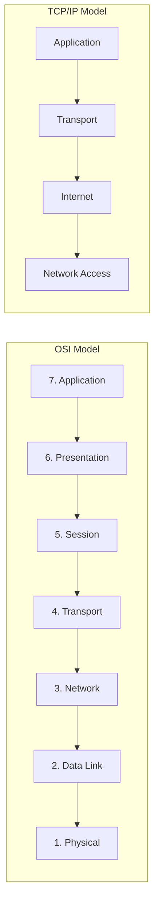
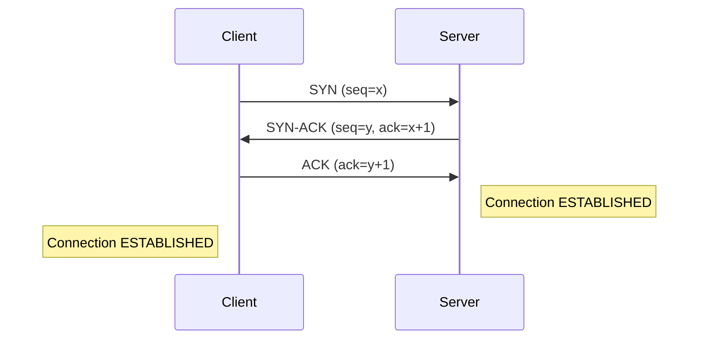
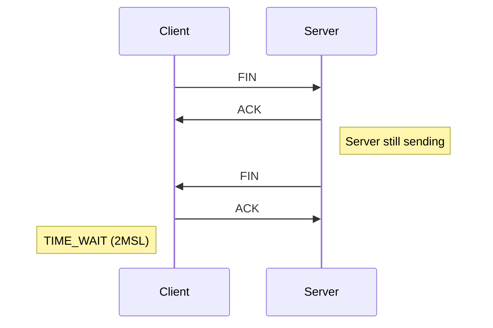
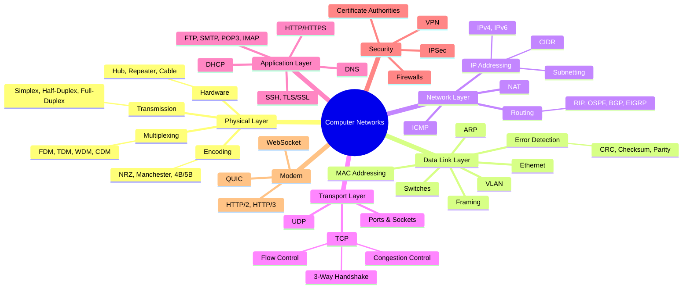
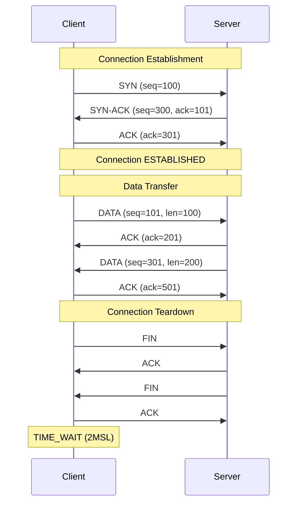
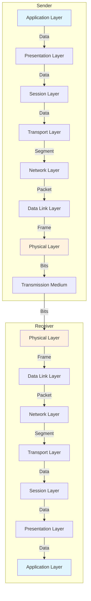
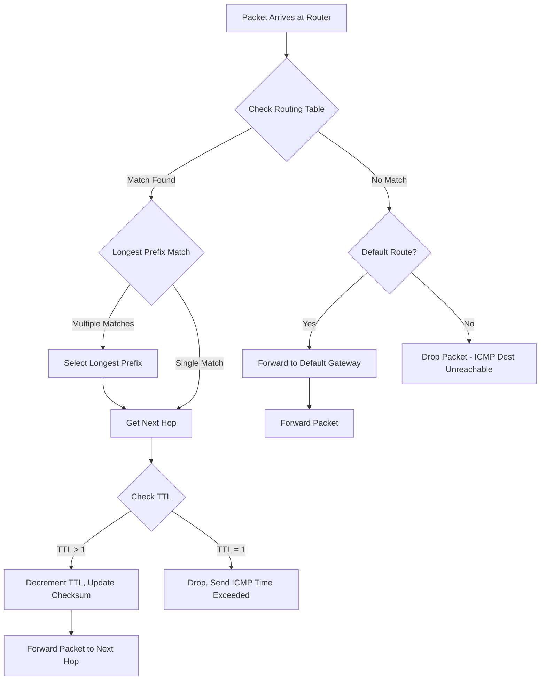
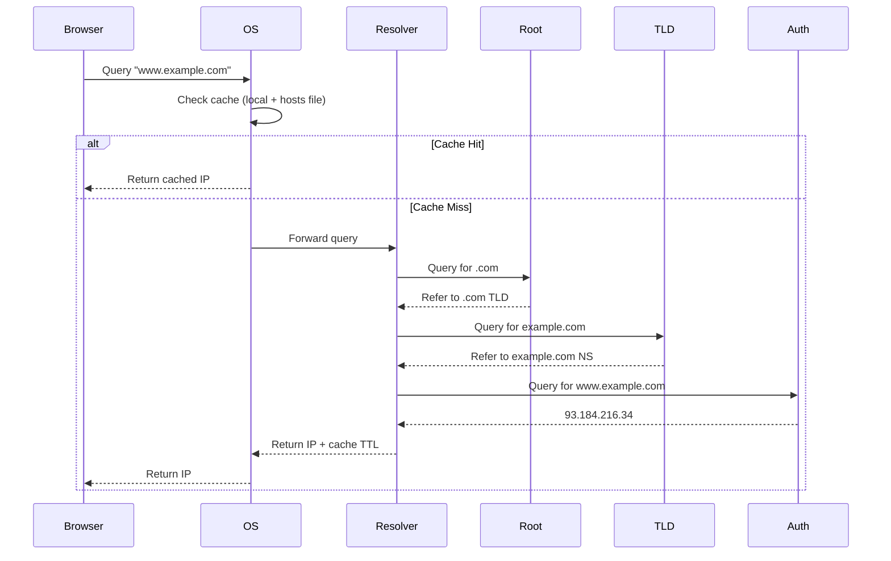
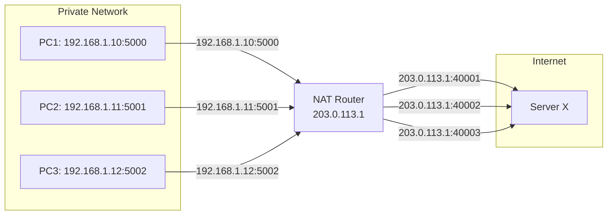

> **Difficulty Level:** Beginner → Advanced | **Last Updated:** July 2026 | **Estimated Study Time:** 2-3 Weeks

---

## Table of Contents

- [1. Introduction](#1-introduction)
- [2. Learning Roadmap](#2-learning-roadmap)
- [3. Theory Notes](#3-theory-notes)
  - [3.1 OSI Model](#31-osi-model)
  - [3.2 TCP/IP Model](#32-tcpip-model)
  - [3.3 Physical Layer](#33-physical-layer)
  - [3.4 Data Link Layer](#34-data-link-layer)
  - [3.5 Network Layer](#35-network-layer)
  - [3.6 Transport Layer](#36-transport-layer)
  - [3.7 Application Layer](#37-application-layer)
  - [3.8 Network Security](#38-network-security)
  - [3.9 Modern Networking](#39-modern-networking)
- [4. Key Concepts](#4-key-concepts)
- [5. Frequently Asked Interview Questions](#5-frequently-asked-interview-questions)
- [6. Hands-on Practice](#6-hands-on-practice)
- [7. Real FAANG Interview Questions](#7-real-faang-interview-questions)
- [8. Common Mistakes](#8-common-mistakes)
- [9. Best Practices](#9-best-practices)
- [10. Cheat Sheet](#10-cheat-sheet)
- [11. Flash Cards](#11-flash-cards)
- [12. Mind Map](#12-mind-map)
- [13. Mermaid Diagrams](#13-mermaid-diagrams)
- [14. Commands Reference](#14-commands-reference)
- [15. Code Examples](#15-code-examples)
- [16. Mini Project - Simple HTTP Server](#16-mini-project---simple-http-server)
- [17. Intermediate Project - Network Packet Sniffer](#17-intermediate-project---network-packet-sniffer)
- [18. Advanced Project - Build a TCP/IP Stack](#18-advanced-project---build-a-tcpip-stack)
- [19. 10 Project Ideas](#19-10-project-ideas)
- [20. Practice Websites](#20-practice-websites)
- [21. Books](#21-books)
- [22. Documentation](#22-documentation)
- [23. YouTube Channels](#23-youtube-channels)
- [24. Blogs](#24-blogs)
- [25. Certifications](#25-certifications)
- [26. Checklist](#26-checklist)
- [27. Revision Notes](#27-revision-notes)
- [28. One-Day Revision Plan](#28-one-day-revision-plan)
- [29. One-Week Revision Plan](#29-one-week-revision-plan)
- [30. Mock Interview Questions](#30-mock-interview-questions)
- [31. Difficulty Rating](#31-difficulty-rating)
- [32. Summary](#32-summary)
- [33. References](#33-references)

---

## 1. Introduction

### What are Computer Networks?

A **computer network** is a collection of interconnected computing devices that can exchange data and share resources. Networks range from a few devices in a room to billions of devices connected globally via the Internet.

### Types of Networks

| Type | Full Name | Range | Speed | Example |
|------|-----------|-------|-------|---------|
| **PAN** | Personal Area Network | ~10 meters | Low | Bluetooth headphones |
| **LAN** | Local Area Network | Building/Campus | High (1-10 Gbps) | Office network |
| **MAN** | Metropolitan Area Network | City | Medium | City-wide cable TV |
| **WAN** | Wide Area Network | Country/Global | Varies | The Internet |
| **SAN** | Storage Area Network | Data Center | Very High | Enterprise storage |

### Why Computer Networks Matter

1. **Resource Sharing** - Printers, files, internet connections
2. **Communication** - Email, instant messaging, video calls
3. **Scalability** - Systems can grow incrementally
4. **Cost Efficiency** - Shared infrastructure reduces costs
5. **Reliability** - Redundancy and failover capabilities
6. **Global Access** - Information available anywhere, anytime

---

## 2. Learning Roadmap



| Level | Topics | Duration |
|-------|--------|----------|
| **Beginner** | OSI Model, IP addressing, subnetting, basic protocols | Week 1 |
| **Intermediate** | Routing, TCP/UDP internals, security, DNS | Week 2 |
| **Advanced** | Network programming, packet analysis, performance | Week 3 |
| **Expert** | Protocol design, SDN, distributed systems networking | Week 4+ |

---

## 3. Theory Notes

### 3.1 OSI Model

The **Open Systems Interconnection (OSI) model** is a conceptual framework that standardizes network communication into seven abstraction layers.

| Layer | Name | PDU | Protocols | Devices | Functions |
|-------|------|-----|-----------|---------|-----------|
| 7 | **Application** | Data | HTTP, FTP, SMTP, DNS, SSH, SNMP | Gateway, WAF | User interface, network services |
| 6 | **Presentation** | Data | SSL/TLS, JPEG, ASCII, MPEG | - | Encryption, compression, translation |
| 5 | **Session** | Data | NetBIOS, RPC, PPTP | - | Session management, synchronization |
| 4 | **Transport** | Segment/Datagram | TCP, UDP, SCTP | Firewall (stateful) | End-to-end delivery, flow control |
| 3 | **Network** | Packet | IP, ICMP, ARP, OSPF, BGP | Router, L3 Switch | Routing, logical addressing |
| 2 | **Data Link** | Frame | Ethernet, PPP, Wi-Fi (802.11) | Switch, Bridge, NIC | MAC addressing, error detection |
| 1 | **Physical** | Bit | USB, Bluetooth, DSL, Fiber | Hub, Repeater, Cable | Raw bit transmission |

#### Layer 7 - Application Layer
- Provides network services directly to end-user applications
- Enables software to send and receive data
- **Key protocols:** HTTP/HTTPS (web), SMTP/POP3/IMAP (email), DNS (name resolution), FTP (file transfer), SSH (secure shell), SNMP (network management)
- **Key concept:** Application-layer protocols define the format and semantics of messages exchanged between applications

#### Layer 6 - Presentation Layer
- Translates data between the application and network format
- Handles encryption/decryption (SSL/TLS operates here conceptually)
- Data compression and decompression
- Character encoding (ASCII, UTF-8, EBCDIC)
- Data serialization (JSON, XML, ASN.1)

#### Layer 5 - Session Layer
- Establishes, manages, and terminates connections (sessions)
- Synchronization with checkpoints for recovery
- Session restoration after interruption
- Authentication and authorization at session level

#### Layer 4 - Transport Layer
- Provides **end-to-end** communication between processes
- **Segmentation and reassembly** of data
- **Flow control** (preventing overwhelming the receiver)
- **Error control** (retransmission of lost segments)
- **Connection management** (TCP) vs **connectionless** (UDP)
- Uses **port numbers** to multiplex/demultiplex connections

#### Layer 3 - Network Layer
- **Logical addressing** (IP addresses)
- **Routing** - determining the best path for data
- **Packet forwarding** from source to destination
- Handles fragmentation and reassembly
- **Key protocols:** IPv4, IPv6, ICMP, OSPF, BGP, RIP

#### Layer 2 - Data Link Layer
- **Physical addressing** (MAC addresses)
- **Framing** - encapsulating packets into frames
- **Error detection** (CRC, checksums)
- **Media access control** (CSMA/CD, CSMA/CA)
- **Switching** at the MAC address level
- **Sub-layers:** LLC (Logical Link Control) and MAC (Media Access Control)

#### Layer 1 - Physical Layer
- Transmission and reception of raw bit streams
- **Electrical specifications** (voltages, timing)
- **Mechanical** (connector types, pinouts)
- **Functional** (pin assignments)
- **Procedural** (sequence of events for bit transmission)
- **Encoding:** NRZ, Manchester, 4B/5B
- **Topologies:** Bus, star, ring, mesh

### 3.2 TCP/IP Model

The **TCP/IP model** is the practical networking model used on the Internet. It has 4 layers.

| TCP/IP Layer | OSI Equivalent | Key Protocols |
|-------------|----------------|---------------|
| **Application** | Application + Presentation + Session | HTTP, DNS, SMTP, FTP, SSH |
| **Transport** | Transport | TCP, UDP |
| **Internet** | Network | IP, ICMP, ARP, OSPF, BGP |
| **Network Access** | Data Link + Physical | Ethernet, Wi-Fi, PPP |

#### TCP/IP vs OSI Comparison

| Aspect | OSI Model | TCP/IP Model |
|--------|-----------|--------------|
| Layers | 7 | 4 |
| Approach | Theoretical/reference | Practical/implementation |
| Developed by | ISO | DARPA/DoD |
| Usage | Teaching, reference | Internet, real-world |
| Session/Presentation | Separate layers | Merged into Application |
| Protocols | Protocol-independent | Protocol-dependent |



### 3.3 Physical Layer

#### Encoding Schemes

| Encoding | Description | Use Case |
|----------|-------------|----------|
| **NRZ** | Non-Return-to-Zero - signal doesn't return to zero | Simple serial |
| **NRZI** | NRZ Inverted - transition on 1, no transition on 0 | USB, FDDI |
| **Manchester** | Transition at mid-bit; 0 = high-to-low, 1 = low-to-high | 10BASE-T Ethernet |
| **4B/5B** | 4 data bits encoded as 5 bits | 100BASE-TX |
| **8B/10B** | 8 data bits encoded as 10 bits | Gigabit Ethernet |
| **MLT-3** | Multi-Level Transmit - cycles through +1, 0, -1, 0 | 100BASE-TX |

#### Transmission Modes

| Mode | Description | Example |
|------|-------------|---------|
| **Simplex** | One-way only | TV broadcast, keyboard |
| **Half-Duplex** | Both ways, one at a time | Walkie-talkie |
| **Full-Duplex** | Both ways simultaneously | Telephone, modern Ethernet |

#### Multiplexing Techniques

| Technique | Method | Use Case |
|-----------|--------|----------|
| **FDM** | Frequency Division - different frequencies | Radio, cable TV |
| **TDM** | Time Division - different time slots | T1/E1 lines |
| **WDM** | Wavelength Division - different light wavelengths | Fiber optics |
| **CDM** | Code Division - different codes | CDMA cellular |
| **OFDM** | Orthogonal FDM - overlapping subcarriers | Wi-Fi, 4G/5G |

### 3.4 Data Link Layer

#### Framing

A **frame** is the data link layer PDU (Protocol Data Unit). Structure:

```
| Preamble | Dest MAC | Src MAC | Type/Len | Payload | FCS |
| 7 bytes  | 6 bytes  | 6 bytes | 2 bytes  | 46-1500 | 4 bytes |
```

#### MAC Addresses

- **48-bit** (6 bytes) hardware address
- Format: `XX:XX:XX:XX:XX:XX` (hexadecimal)
- First 3 bytes = **OUI** (Organizationally Unique Identifier)
- Last 3 bytes = **NIC-specific**
- **Unicast** (individual), **Broadcast** (FF:FF:FF:FF:FF:FF), **Multicast** (first byte LSB = 1)

#### Ethernet Standards

| Standard | Speed | Cable | Max Length |
|----------|-------|-------|------------|
| 10BASE-T | 10 Mbps | Cat3 UTP | 100m |
| 100BASE-TX | 100 Mbps | Cat5 UTP | 100m |
| 1000BASE-T | 1 Gbps | Cat5e/Cat6 | 100m |
| 10GBASE-T | 10 Gbps | Cat6a/Cat7 | 100m |
| 40GBASE-T | 40 Gbps | Cat8 | 30m |

#### ARP (Address Resolution Protocol)

- Maps **IP addresses** to **MAC addresses**
- Process:
  1. Host broadcasts ARP request ("Who has IP x.x.x.x?")
  2. Target responds with ARP reply (its MAC address)
  3. Sender caches the mapping in ARP table
- **ARP Table:** `arp -a` (Windows/Linux)
- **Proxy ARP:** Router responds on behalf of another host
- **Gratuitous ARP:** Host announces its own IP-MAC mapping

#### VLAN (Virtual LAN)

- Logically segments a physical network
- Operates at Layer 2 (Data Link)
- **Tagged frames:** IEEE 802.1Q inserts 4-byte tag
- **Benefits:** Security, reduced broadcast domain, flexibility
- **Trunk ports:** Carry traffic for multiple VLANs
- **Access ports:** Belong to a single VLAN

#### Error Detection & Correction

| Method | Type | Overhead | Capability |
|--------|------|----------|------------|
| **Parity** | Detection | 1 bit | Detects odd number of errors |
| **Checksum** | Detection | Variable | Detects errors, used in IP/TCP |
| **CRC** | Detection | 32 bits (CRC-32) | Detects burst errors |
| **Hamming Code** | Correction | Variable | Can correct single-bit errors |
| **FEC** | Correction | Variable | Forward Error Correction |

**CRC (Cyclic Redundancy Check):**
- Polynomial division of data by generator polynomial
- Remainder appended as FCS (Frame Check Sequence)
- Receiver performs same division; remainder 0 = no errors

### 3.5 Network Layer

#### IPv4 Addressing

- **32-bit** addresses, written as four octets: `192.168.1.1`
- **4.3 billion** unique addresses (~2^32)
- **Dotted decimal notation**

**Address Classes:**

| Class | First Octet | Range | Default Mask | Networks | Hosts/Network |
|-------|-------------|-------|-------------|----------|---------------|
| A | 0xxxxxxx | 1.0.0.0 - 126.255.255.255 | 255.0.0.0 (/8) | 126 | 16,777,214 |
| B | 10xxxxxx | 128.0.0.0 - 191.255.255.255 | 255.255.0.0 (/16) | 16,384 | 65,534 |
| C | 110xxxxx | 192.0.0.0 - 223.255.255.255 | 255.255.255.0 (/24) | 2,097,152 | 254 |
| D | 1110xxxx | 224.0.0.0 - 239.255.255.255 | N/A (Multicast) | - | - |
| E | 1111xxxx | 240.0.0.0 - 255.255.255.255 | N/A (Reserved) | - | - |

**Special Addresses:**

| Address | Purpose |
|---------|---------|
| 127.0.0.0/8 | Loopback (localhost) |
| 10.0.0.0/8 | Private (Class A) |
| 172.16.0.0/12 | Private (Class B) |
| 192.168.0.0/16 | Private (Class C) |
| 0.0.0.0/8 | Current network |
| 255.255.255.255 | Limited broadcast |
| 169.254.0.0/16 | Link-local (APIPA) |

#### Subnetting

Subnetting divides a network into smaller sub-networks.

**Subnet Mask:** Determines network vs. host portion
- `/24` = 255.255.255.0 (256 addresses, 254 usable hosts)
- `/25` = 255.255.255.128 (128 addresses, 126 usable hosts)
- `/26` = 255.255.255.192 (64 addresses, 62 usable hosts)

**Subnetting Formula:**
- Number of subnets = 2^n (n = borrowed bits)
- Number of hosts = 2^h - 2 (h = host bits)

**Example:**
```
Network: 192.168.1.0/24
Subnet to /26:
  Subnet 1: 192.168.1.0 - 192.168.1.63 (hosts: 1-62)
  Subnet 2: 192.168.1.64 - 192.168.1.127 (hosts: 65-126)
  Subnet 3: 192.168.1.128 - 192.168.1.191 (hosts: 129-190)
  Subnet 4: 192.168.1.192 - 192.168.1.255 (hosts: 193-254)
```

#### CIDR (Classless Inter-Domain Routing)

- Replaces classful addressing
- Uses variable-length subnet masks (VLSM)
- Notation: `192.168.1.0/24` where `/24` is the prefix length
- Enables efficient address allocation (no wasted addresses)
- Route aggregation/supernetting: summarize multiple routes into one

#### IPv6

- **128-bit** addresses (~3.4 x 10^38 addresses)
- Format: `2001:0db8:85a3:0000:0000:8a2e:0370:7334`
- **Zero compression:** `2001:db8:85a3::8a2e:370:7334`
- **No broadcast** - uses multicast and anycast
- **Built-in IPsec** support
- **Simplified header** (fixed 40 bytes)
- **No NAT needed** (sufficient address space)
- **Auto-configuration** (SLAAC - Stateless Address Autoconfiguration)

#### Routing Protocols

| Protocol | Type | Algorithm | Metric | Use Case |
|----------|------|-----------|--------|----------|
| **RIP** | Distance Vector | Bellman-Ford | Hop count (max 15) | Small networks |
| **OSPF** | Link State | Dijkstra's SPF | Cost (bandwidth) | Enterprise/ISP |
| **BGP** | Path Vector | Best path selection | Policy-based | Internet backbone |
| **EIGRP** | Hybrid (Advanced DV) | DUAL | Composite (BW, delay) | Cisco networks |
| **IS-IS** | Link State | Dijkstra's SPF | Cost | ISP backbone |

**Distance Vector vs. Link State:**

| Feature | Distance Vector | Link State |
|---------|----------------|------------|
| Algorithm | Bellman-Ford | Dijkstra's SPF |
| Information shared | Entire routing table | Only link states |
| Convergence speed | Slow (count-to-infinity) | Fast |
| Scalability | Poor | Good |
| Example | RIP, IGRP | OSPF, IS-IS |
| Issues | Routing loops, count-to-infinity | Complex, resource-intensive |

**RIP (Routing Information Protocol):**
- Maximum 15 hops (16 = unreachable)
- Updates every 30 seconds
- Uses UDP port 520
- Simple but limited

**OSPF (Open Shortest Path First):**
- Uses Dijkstra's algorithm
- Sends hello packets every 10 seconds
- Supports VLSM and CIDR
- Area-based hierarchy for scalability
- Type of Service (ToS) routing
- Authentication support

**BGP (Border Gateway Protocol):**
- The routing protocol of the Internet
- Connects Autonomous Systems (AS)
- Uses TCP port 179
- Policy-based routing decisions
- Path attributes for route selection
- iBGP (within AS) vs eBGP (between AS)

#### NAT (Network Address Translation)

- Maps private IPs to public IPs
- Types:

| Type | Description | Mapping |
|------|-------------|---------|
| **Static NAT** | 1:1 mapping | Fixed translation |
| **Dynamic NAT** | Pool of public IPs | Dynamic assignment |
| **PAT (NAPT)** | Many:1 mapping | Port-based translation |

**How PAT works:**
```
Internal: 192.168.1.100:4500 → 203.0.113.1:45000
Internal: 192.168.1.101:4500 → 203.0.113.1:45001
```

#### ICMP (Internet Control Message Protocol)

- Used for diagnostic and error reporting
- **Tools using ICMP:** `ping`, `traceroute`
- **Types:**
  - Echo Request/Reply (Type 8/0) - used by `ping`
  - Destination Unreachable (Type 3)
  - Time Exceeded (Type 11) - used by `traceroute`
  - Redirect (Type 5)
- **ICMPv6** replaces ICMP for IPv6 with additional functionality (NDP)

### 3.6 Transport Layer

#### TCP (Transmission Control Protocol)

**Characteristics:**
- **Connection-oriented** (3-way handshake)
- **Reliable** delivery (ACKs, retransmissions)
- **Ordered** delivery (sequence numbers)
- **Flow control** (sliding window)
- **Congestion control** (slow start, congestion avoidance)
- **Full-duplex** communication
- **Byte-stream** oriented (no message boundaries)

**TCP Header (20-60 bytes):**

```
| Source Port (16) | Destination Port (16) |
| Sequence Number (32) |
| Acknowledgment Number (32) |
| HLen | Reserved | Flags | Window Size (16) |
| Checksum (16) | Urgent Pointer (16) |
| Options (variable) |
```

**TCP Flags:**
| Flag | Purpose |
|------|---------|
| SYN | Synchronize sequence numbers (connection start) |
| ACK | Acknowledge receipt of data |
| FIN | Finish (graceful connection close) |
| RST | Reset connection (abort) |
| PSH | Push data to application immediately |
| URG | Urgent data |

#### TCP 3-Way Handshake



**Connection Termination (4-Way):**


#### TCP Flow Control

- **Sliding Window Protocol**
- Receiver advertises **window size** (receive buffer space)
- Sender won't send more than receiver can handle
- **Zero window** = sender stops (sends probes periodically)
- **Window scaling** (RFC 7323) for high-bandwidth connections

#### TCP Congestion Control

| Algorithm | Description |
|-----------|-------------|
| **Slow Start** | Exponential growth of cwnd until threshold |
| **Congestion Avoidance** | Linear growth after threshold |
| **Fast Retransmit** | Retransmit after 3 duplicate ACKs (no timeout) |
| **Fast Recovery** | Don't reset cwnd to 1 after fast retransmit |
| **TCP Tahoe** | Reset cwnd = 1 on loss (no fast recovery) |
| **TCP Reno** | Uses fast recovery |
| **TCP CUBIC** | Default in Linux; uses cubic function for cwnd |
| **TCP BBR** | Google's bandwidth-based congestion control |

**Key Variables:**
- **cwnd** (Congestion Window): Sender's estimate of network capacity
- **ssthresh** (Slow Start Threshold): Transition point from slow start to avoidance
- **RTO** (Retransmission Timeout): Time before retransmitting

#### UDP (User Datagram Protocol)

- **Connectionless** - no handshake
- **Unreliable** - no ACKs, no retransmission
- **Unordered** - no sequencing
- **Low overhead** - 8-byte header
- **Fast** - minimal processing
- **Use cases:** DNS, DHCP, VoIP, gaming, video streaming

**UDP Header (8 bytes):**
```
| Source Port (16) | Destination Port (16) |
| Length (16) | Checksum (16) |
```

#### TCP vs UDP Comparison

| Feature | TCP | UDP |
|---------|-----|-----|
| Connection | Connection-oriented | Connectionless |
| Reliability | Reliable (ACKs) | Unreliable |
| Ordering | Ordered | Unordered |
| Speed | Slower | Faster |
| Header Size | 20-60 bytes | 8 bytes |
| Flow Control | Yes | No |
| Congestion Control | Yes | No |
| Use Cases | Web, email, file transfer | DNS, streaming, gaming |

#### Ports and Sockets

**Port Ranges:**
| Range | Type | Usage |
|-------|------|-------|
| 0-1023 | Well-Known | HTTP(80), HTTPS(443), SSH(22), DNS(53), SMTP(25) |
| 1024-49151 | Registered | MySQL(3306), PostgreSQL(5432), Redis(6379) |
| 49152-65535 | Ephemeral/Dynamic | Temporary client ports |

**Socket = IP Address + Port Number**
- Identifies a specific process on a specific host
- Socket pair: (Source IP:Port, Destination IP:Port)
- Example: `192.168.1.10:54321` to `93.184.216.34:443`

### 3.7 Application Layer

#### HTTP/HTTPS

**HTTP (HyperText Transfer Protocol):**
- Client-server, request-response protocol
- Stateless (cookies/sessions maintain state)
- Uses TCP (port 80)

**HTTP Methods:**

| Method | Purpose | Idempotent | Safe |
|--------|---------|------------|------|
| GET | Retrieve resource | Yes | Yes |
| POST | Create resource | No | No |
| PUT | Replace resource | Yes | No |
| PATCH | Partial update | No | No |
| DELETE | Remove resource | Yes | No |
| HEAD | Headers only | Yes | Yes |
| OPTIONS | Allowed methods | Yes | Yes |

**HTTP Status Codes:**
| Code | Category | Examples |
|------|----------|---------|
| 1xx | Informational | 100 Continue, 101 Switching Protocols |
| 2xx | Success | 200 OK, 201 Created, 204 No Content |
| 3xx | Redirection | 301 Moved Permanently, 304 Not Modified |
| 4xx | Client Error | 400 Bad Request, 401 Unauthorized, 404 Not Found |
| 5xx | Server Error | 500 Internal Error, 502 Bad Gateway, 503 Unavailable |

**HTTPS:**
- HTTP over TLS/SSL
- Uses port 443
- Provides encryption, authentication, integrity
- Certificate-based security (Certificate Authority)

#### DNS (Domain Name System)

- Hierarchical, distributed database
- Translates domain names to IP addresses
- Uses UDP port 53 (TCP for zone transfers)

**DNS Record Types:**

| Record | Purpose | Example |
|--------|---------|---------|
| A | Maps domain to IPv4 | `example.com → 93.184.216.34` |
| AAAA | Maps domain to IPv6 | `example.com → 2606:2800:220:1::248` |
| CNAME | Canonical name (alias) | `www.example.com → example.com` |
| MX | Mail exchange | `example.com → mail.example.com` |
| NS | Name server | `example.com → ns1.example.com` |
| TXT | Text information | SPF, DKIM records |
| SOA | Start of Authority | Zone metadata |
| PTR | Reverse DNS lookup | IP → domain name |

**DNS Resolution Process:**
1. Browser cache → OS cache → hosts file
2. Recursive resolver (ISP DNS)
3. Root nameserver → TLD nameserver → Authoritative nameserver
4. Result cached at each level

#### DHCP (Dynamic Host Configuration Protocol)

- Automatically assigns IP addresses to devices
- Uses UDP (ports 67 server, 68 client)
- **DORA Process:**
  1. **D**iscover - Client broadcasts
  2. **O**ffer - Server responds with IP offer
  3. **R**equest - Client requests offered IP
  4. **A**cknowledge - Server confirms

#### Other Application Layer Protocols

| Protocol | Port | Purpose |
|----------|------|---------|
| FTP | 20/21 | File transfer (control/data) |
| SSH | 22 | Secure shell |
| Telnet | 23 | Remote terminal (unencrypted) |
| SMTP | 25 | Sending email |
| DNS | 53 | Domain name resolution |
| HTTP | 80 | Web browsing |
| POP3 | 110 | Receiving email (download) |
| IMAP | 143 | Receiving email (sync) |
| HTTPS | 443 | Secure web browsing |

### 3.8 Network Security

#### Firewalls

| Type | Description | Layer |
|------|-------------|-------|
| **Packet Filtering** | Checks headers (IP, port) | Layer 3-4 |
| **Stateful** | Tracks connection states | Layer 3-4 |
| **Application/Proxy** | Inspects application data | Layer 7 |
| **NGFW** | Next-Generation - deep packet inspection | Multi-layer |
| **WAF** | Web Application Firewall | Layer 7 (HTTP) |

#### VPN (Virtual Private Network)

| Type | Protocol | Use Case |
|------|----------|----------|
| **Remote Access** | OpenVPN, WireGuard, IPSec | Individual users |
| **Site-to-Site** | IPSec, GRE | Connecting offices |
| **SSL VPN** | TLS-based | Browser-based access |

#### IPSec

- Provides security at the IP layer
- **Modes:**
  - **Transport mode:** Encrypts payload only
  - **Tunnel mode:** Encrypts entire packet
- **Protocols:**
  - **AH (Authentication Header):** Integrity + authentication
  - **ESP (Encapsulating Security Payload):** Confidentiality + integrity + authentication
- **IKE (Internet Key Exchange):** Establishes security associations

#### TLS/SSL

**TLS Handshake (simplified):**
1. Client Hello (supported cipher suites)
2. Server Hello (chosen cipher suite + certificate)
3. Client verifies certificate with CA
4. Key exchange (pre-master secret encrypted with server's public key)
5. Both derive session keys
6. Finished messages (encrypted)

**Certificate Authorities (CA):**
- Trusted third parties that issue digital certificates
- Chain of trust: Root CA → Intermediate CA → End-entity certificate
- **Certificate contents:** Subject, issuer, validity period, public key, signature
- **OCSP/CRL:** Revocation checking

### 3.9 Modern Networking

#### WebSocket
- Full-duplex, bidirectional communication over single TCP connection
- Persistent connection (no repeated HTTP requests)
- Uses `ws://` or `wss://` (secure)
- Low latency for real-time applications
- Use cases: Chat apps, live feeds, gaming, collaborative editing

#### HTTP/2
- **Multiplexing:** Multiple requests over single connection
- **Header compression:** HPACK algorithm
- **Server push:** Server can push resources proactively
- **Binary protocol** (not text-based like HTTP/1.1)
- **Stream prioritization**

#### HTTP/3 (QUIC-based)
- Built on **QUIC** (Quick UDP Internet Connections)
- Uses **UDP** instead of TCP
- **0-RTT** connection establishment
- Built-in TLS 1.3
- **No head-of-line blocking** (multiplexing without TCP retransmission delays)
- **Connection migration** (survives IP address changes)

#### QUIC
- Developed by Google, standardized as HTTP/3
- Combines transport and security in one protocol
- Faster connection setup
- Better performance on unreliable networks

---

## 4. Key Concepts

| Concept | Description | Importance |
|---------|-------------|------------|
| **Encapsulation** | Data wrapped with headers at each layer | Fundamental to layered networking |
| **Decapsulation** | Headers stripped as data moves up layers | Reverse of encapsulation |
| **Handshake** | Negotiation process to establish connection | TCP, TLS, ARP |
| **Latency** | Time for data to travel from source to destination | Performance metric |
| **Bandwidth** | Maximum data transfer rate | Performance metric |
| **Throughput** | Actual data transfer rate achieved | Performance metric |
| **Jitter** | Variation in packet arrival time | Real-time app impact |
| **MTU** | Maximum Transmission Unit (typically 1500 bytes) | Packet size limits |
| **Fragmentation** | Breaking packets to fit MTU | IPv4 only (IPv6 requires PMTUD) |
| **QoS** | Quality of Service - traffic prioritization | Real-time applications |
| **Load Balancing** | Distributing traffic across servers | Scalability, redundancy |
| **Anycast** | Routing to nearest of multiple servers | CDN, DNS root servers |
| **Multicast** | One-to-many delivery | Efficient group communication |
| **Broadcast** | One-to-all delivery | ARP, DHCP discovery |
| **NAT Traversal** | Techniques to work through NAT | P2P applications |

---

## 5. Frequently Asked Interview Questions

### Beginner Level

**Q1: What is the difference between TCP and UDP?**
> TCP is connection-oriented, reliable, ordered, and provides flow/congestion control. UDP is connectionless, unreliable, unordered, but faster with lower overhead. TCP is used for web browsing, email, file transfer. UDP is used for DNS, streaming, gaming, VoIP.

**Q2: What is an IP address?**
> An IP address is a unique numerical identifier assigned to each device on a network. IPv4 uses 32 bits (e.g., 192.168.1.1), IPv6 uses 128 bits. It enables routing of packets between networks.

**Q3: What is DNS?**
> DNS (Domain Name System) translates human-readable domain names (like google.com) into IP addresses. It works hierarchically: root servers → TLD servers → authoritative servers. It uses UDP port 53 for queries.

**Q4: What is a MAC address vs IP address?**
> MAC address is a 48-bit hardware address burned into the NIC (Layer 2). IP address is a 32/128-bit logical address assigned by software (Layer 3). MAC handles local delivery; IP handles end-to-end routing.

**Q5: What is the OSI model?**
> The OSI model has 7 layers: Physical, Data Link, Network, Transport, Session, Presentation, Application. Each layer provides specific functions and communicates with adjacent layers. It's a reference model for understanding network protocols.

**Q6: What is a subnet mask?**
> A subnet mask defines which portion of an IP address is the network and which is the host. E.g., 255.255.255.0 (/24) means first 24 bits are network, last 8 are host. Used for subnetting and routing decisions.

**Q7: What is ARP?**
> ARP (Address Resolution Protocol) maps IP addresses to MAC addresses on a local network. A host broadcasts an ARP request asking "who has this IP?" and the target responds with its MAC. Results are cached in the ARP table.

**Q8: What is the difference between a hub, switch, and router?**
> **Hub:** Operates at Layer 1; broadcasts to all ports. **Switch:** Layer 2; forwards frames based on MAC addresses. **Router:** Layer 3; forwards packets based on IP addresses, connects different networks.

**Q9: What is NAT?**
> NAT (Network Address Translation) translates private IP addresses to public IP addresses. It allows multiple devices on a private network to share a single public IP. PAT (Port Address Translation) maps multiple private IPs to one public IP using port numbers.

**Q10: What is a port number?**
> A port number is a 16-bit identifier (0-65535) used with an IP address to identify a specific process. Well-known ports (0-1023) are for standard services (HTTP=80, SSH=22). Ephemeral ports (49152-65535) are for temporary connections.

### Intermediate Level

**Q11: Explain the TCP 3-way handshake.**
> 1. Client sends SYN with initial sequence number. 2. Server responds with SYN-ACK (its own SYN + ACK of client's SYN). 3. Client sends ACK. Both sides now have agreed sequence numbers and the connection is established.

**Q12: What is TCP congestion control?**
> TCP prevents network congestion through: Slow Start (exponential cwnd growth), Congestion Avoidance (linear growth), Fast Retransmit (retransmit after 3 duplicate ACKs), Fast Recovery (avoid resetting cwnd). Algorithms include Tahoe, Reno, CUBIC, and BBR.

**Q13: What is the difference between HTTP and HTTPS?**
> HTTPS is HTTP encrypted with TLS/SSL. It provides confidentiality (encryption), authentication (certificates), and integrity (MAC). HTTP uses port 80, HTTPS uses port 443. HTTPS is essential for secure communications.

**Q14: What is a routing protocol? How do RIP and OSPF differ?**
> Routing protocols determine how routers share information to build routing tables. RIP is distance-vector (max 15 hops, slow convergence). OSPF is link-state (uses Dijkstra's algorithm, faster convergence, scalable). OSPF is preferred for larger networks.

**Q15: What is a VLAN?**
> A VLAN (Virtual LAN) logically segments a physical network at Layer 2. Devices on different VLANs cannot communicate without a router. Benefits: reduced broadcast domains, improved security, flexible network design. Uses 802.1Q tagging.

**Q16: What is the purpose of ICMP?**
> ICMP provides diagnostic and error reporting for IP. Used by `ping` (echo request/reply) and `traceroute` (time exceeded). Types include Destination Unreachable, Redirect, and Router Advertisement. Not used for data transfer.

**Q17: What is the sliding window protocol?**
> A flow control mechanism where the sender maintains a window of unacknowledged packets. The window size equals the receiver's buffer capacity. The sender can transmit multiple packets without waiting for individual ACKs. Increases throughput vs. stop-and-wait.

**Q18: What is a three-way handshake vs four-way handshake?**
> Three-way handshake establishes TCP connection (SYN, SYN-ACK, ACK). Four-way handshake terminates it (FIN, ACK, FIN, ACK) because each side closes independently. The server may still have data to send after receiving FIN from client.

**Q19: What is the difference between IPv4 and IPv6?**
> IPv4: 32-bit, ~4.3B addresses, uses NAT, header with options. IPv6: 128-bit, 3.4x10^38 addresses, no NAT needed, fixed 40-byte header, built-in IPsec, auto-configuration, no broadcast (uses multicast/anycast).

**Q20: What is a CDN?**
> A Content Delivery Network caches content at edge servers distributed globally. Reduces latency by serving users from nearby locations. Benefits: faster load times, reduced bandwidth, DDoS protection. Examples: Cloudflare, AWS CloudFront, Akamai.

### Advanced Level

**Q21: What is TCP Fast Open (TFO)?**
> TFO reduces connection setup time by allowing data to be sent during the handshake. Uses a TFO cookie: after initial connection, client stores cookie. On subsequent connections, client sends data with SYN + cookie, eliminating one RTT.

**Q22: Explain BGP and how Internet routing works.**
> BGP (Border Gateway Protocol) routes between Autonomous Systems (AS). It's path-vector based, uses TCP port 179. Route selection considers: local preference, AS path length, origin type, MED. BGP is the glue of the Internet but vulnerable to hijacking.

**Q23: What is QUIC and why is it used?**
> QUIC (Quick UDP Internet Connections) is a transport protocol built on UDP. Features: 0-RTT connection setup, built-in TLS 1.3, multiplexing without head-of-line blocking, connection migration. Used by HTTP/3. Developed by Google, now IETF standard.

**Q24: How does DNSSEC work?**
> DNSSEC adds cryptographic signatures to DNS records. Each zone has a key pair; public key is signed by parent zone. Resolver verifies chain of trust from root. Prevents DNS spoofing/cache poisoning by ensuring record authenticity and integrity.

**Q25: What is a SYN flood attack and how to prevent it?**
> SYN flood is a DDoS attack where attacker sends many SYN packets with spoofed IPs. Server wastes resources sending SYN-ACKs and maintaining half-open connections. **Prevention:** SYN cookies (don't store state until handshake completes), rate limiting, firewalls, increased backlog queue.

**Q26: What is the difference between process communication and network communication?**
> Process communication (IPC) happens within a machine (pipes, shared memory, message queues). Network communication happens between machines using protocols (TCP/IP). Socket programming bridges both - local sockets (Unix domain) vs network sockets (TCP/UDP).

**Q27: How does connection pooling work in HTTP?**
> Connection pooling reuses existing TCP connections instead of creating new ones for each request. Benefits: eliminates TCP handshake overhead, reduces latency. HTTP/1.1 supports persistent connections. HTTP/2 multiplexes multiple requests on a single connection.

**Q28: What is a man-in-the-middle attack?**
> An attacker intercepts communication between two parties, potentially modifying data. In TLS, prevented by certificate verification. In ARP-based MITM, attacker sends fake ARP replies. Prevention: certificate pinning, VPN, end-to-end encryption, ARP inspection.

**Q29: What is the difference between symmetric and asymmetric encryption in networking?**
> **Symmetric:** Same key for encrypt/decrypt (AES). Fast but requires secure key exchange. **Asymmetric:** Public/private key pair (RSA, ECC). Slower but enables key exchange without shared secret. TLS uses both: asymmetric for key exchange, symmetric for data transfer.

**Q30: What is network congestion and how does it differ from buffer bloat?**
> **Congestion:** Too much traffic for network capacity, causing packet loss and delay. Managed by TCP congestion control. **Buffer bloat:** Excessively large buffers in network devices cause high latency under load. Packets queue instead of being dropped, delaying all traffic. Solution: AQM (Active Queue Management) like CoDel.

### FAANG Level

**Q31: Design a URL shortener like bit.ly. What network considerations are involved?**
> Key: DNS for domain resolution, HTTP redirects (301/302), load balancers (L4/L7), caching (Redis/Memcached), database for URL mapping. Network: CDN for static content, connection pooling, TCP keep-alive, HTTP/2 multiplexing, rate limiting to prevent abuse.

**Q32: How would you design a real-time chat system at scale?**
> WebSocket for persistent connections, message queues (Kafka) for message distribution, presence service (Redis Pub/Sub), message delivery guarantees (ACK + retry), offline message storage, encryption (TLS + E2E), connection management (heartbeat, reconnection).

**Q33: Explain how a CDN works from a networking perspective.**
> Anycast routing directs users to nearest edge server. Edge servers cache static content. Cache miss triggers request to origin server (pull CDN) or origin pushes content (push CDN). TLS termination at edge, DNS resolution with TTL, geographic load balancing, DDoS mitigation.

**Q34: How does Google's BBR congestion control differ from CUBIC?**
> **CUBIC:** Loss-based - assumes packet loss = congestion. Sets cwnd using cubic function. Works well for lossy wireless networks but can cause bufferbloat. **BBR:** Bandwidth-based - measures bottleneck bandwidth and RTT. Doesn't rely on packet loss. Better for high-BDP networks, reduces bufferbloat, more consistent throughput.

**Q35: What are the networking implications of microservices architecture?**
> Service discovery (DNS, Consul, etcd), API gateways, load balancing, circuit breaking (Hystrix), retries with exponential backoff, timeout management, distributed tracing (Jaeger), service mesh (Istio), mTLS between services, observability (metrics, logs, traces).

---

## 6. Hands-on Practice

### Exercise 1: Wireshark Analysis

```bash
# Install Wireshark, then capture traffic while:
# 1. Opening a website (observe TCP handshake, DNS, HTTP)
# 2. Pinging a server (observe ICMP)
# 3. Connecting via SSH (observe TCP, TLS handshake)

# Filter examples:
# tcp.port == 80          - HTTP traffic
# dns                     - DNS queries
# tcp.flags.syn == 1      - SYN packets
# http                    - HTTP protocol
# tls                     - TLS traffic
# icmp                    - ICMP packets
```

### Exercise 2: Network Diagnostics

```bash
# Basic connectivity tests
ping google.com
traceroute google.com
nslookup google.com
dig google.com

# Port scanning
nmap -sT localhost
nmap -sS localhost

# Network interface info
ip addr show          # Linux
ipconfig /all         # Windows
ifconfig -a           # macOS/Linux
```

### Exercise 3: Build a Simple Chat Application

```python
# See Code Examples section for full implementation
# Practice: Build a TCP chat server with:
# - Multiple client connections (threading)
# - Message broadcasting
# - Client disconnect handling
# - Command support (/quit, /users, /msg)
```

### Exercise 4: Subnetting Practice

```
Practice Problems:
1. How many subnets and hosts per subnet with /26?
2. Subnet 192.168.10.0/24 into 4 subnets
3. What's the broadcast address for 172.16.5.128/25?
4. Calculate the number of usable IPs in 10.0.0.0/22
5. Find the subnet mask for 500 hosts
```

---

## 7. Real FAANG Interview Questions

| Company | Question | Focus Area |
|---------|----------|------------|
| **Google** | Design a scalable DNS system | DNS, Caching, Distributed Systems |
| **Meta** | How does Facebook handle real-time notifications at scale? | WebSocket, Pub/Sub, Load Balancing |
| **Amazon** | Design a URL shortener with custom analytics | HTTP, Databases, Caching, CDN |
| **Apple** | How does AirDrop work at the protocol level? | mDNS, Wi-Fi Direct, encryption |
| **Microsoft** | Explain how RDP handles remote desktop connections | TCP/UDP, compression, encryption |
| **Netflix** | How does Netflix stream video efficiently? | CDN, HTTP, Adaptive Bitrate, UDP |
| **Uber** | How does Uber's real-time location tracking work? | WebSocket, GPS, TCP vs UDP |
| **Stripe** | How do you secure payment processing over networks? | TLS, PCI DSS, tokenization |
| **Cloudflare** | How does a CDN prevent DDoS attacks? | Anycast, rate limiting, WAF |
| **LinkedIn** | How does the news feed push notifications work? | Long polling, WebSocket, caching |

---

## 8. Common Mistakes

1. **Confusing TCP and UDP use cases** - TCP for reliable data, UDP for real-time
2. **Forgetting the TCP 3-way handshake order** - SYN → SYN-ACK → ACK
3. **Mixing up MAC and IP addresses** - MAC is hardware (Layer 2), IP is logical (Layer 3)
4. **Ignoring port numbers** - Every connection needs both IP + port
5. **Confusing DNS record types** - A (IPv4) vs AAAA (IPv6) vs CNAME (alias)
6. **Forgetting ARP works only locally** - ARP doesn't cross routers
7. **Mixing up symmetric vs asymmetric encryption** - Symmetric = same key, asymmetric = key pair
8. **Confusing NAT and PAT** - NAT maps IPs, PAT maps IP:port combinations
9. **Forgetting that DNS uses UDP** (except zone transfers)
10. **Not understanding subnetting calculations** - Practice CIDR notation regularly
11. **Confusing encryption layers** - TLS is at presentation/application, IPSec at network
12. **Assuming HTTP is stateful** - HTTP is stateless; cookies/sessions add state

---

## 9. Best Practices

1. **Always understand the "why"** - Don't just memorize protocols; understand the problem they solve
2. **Practice subnetting daily** - Quick mental math is essential for interviews
3. **Use Wireshark** - See real packets to solidify theoretical knowledge
4. **Build real projects** - Socket programming, chat apps, HTTP servers
5. **Read RFCs** - Understand protocols from their source (RFC 793 for TCP, RFC 791 for IP)
6. **Know the numbers** - TCP header size (20-60 bytes), UDP header (8 bytes), MTU (1500), port ranges
7. **Draw diagrams** - Visualize the OSI model, TCP handshake, routing paths
8. **Practice explaining concepts** - Interview success = clear communication
9. **Study failure modes** - SYN floods, routing loops, split-brain scenarios
10. **Stay current** - HTTP/3, QUIC, WireGuard, modern congestion control

---

## 10. Cheat Sheet

### Port Numbers

| Port | Protocol | Service |
|------|----------|---------|
| 20/21 | TCP | FTP (data/control) |
| 22 | TCP | SSH |
| 23 | TCP | Telnet |
| 25 | TCP | SMTP |
| 53 | TCP/UDP | DNS |
| 67/68 | UDP | DHCP (server/client) |
| 80 | TCP | HTTP |
| 110 | TCP | POP3 |
| 143 | TCP | IMAP |
| 443 | TCP | HTTPS |
| 3306 | TCP | MySQL |
| 3389 | TCP/UDP | RDP |
| 5432 | TCP | PostgreSQL |
| 6379 | TCP | Redis |

### Protocol Quick Reference

| Protocol | Layer | Purpose | Port |
|----------|-------|---------|------|
| TCP | Transport | Reliable delivery | - |
| UDP | Transport | Fast delivery | - |
| IP | Network | Addressing/routing | - |
| ICMP | Network | Diagnostics | - |
| ARP | Data Link | IP → MAC | - |
| HTTP | Application | Web | 80/443 |
| DNS | Application | Name resolution | 53 |
| DHCP | Application | IP configuration | 67/68 |
| SSH | Application | Secure remote | 22 |
| FTP | Application | File transfer | 20/21 |

### Subnetting Quick Reference

```
/8   = 255.0.0.0      = 16,777,214 hosts
/16  = 255.255.0.0    = 65,534 hosts
/24  = 255.255.255.0  = 254 hosts
/25  = 255.255.255.128 = 126 hosts
/26  = 255.255.255.192 = 62 hosts
/27  = 255.255.255.224 = 30 hosts
/28  = 255.255.255.240 = 14 hosts
/29  = 255.255.255.248 = 6 hosts
/30  = 255.255.255.252 = 2 hosts (point-to-point)
```

### TCP Flags

```
SYN → ACK → FIN → RST → PSH → URG
 │      │      │      │      │      │
 │      │      │      │      │      └─ Urgent data
 │      │      │      │      └─ Push to app immediately
 │      │      │      └─ Abort connection
 │      │      └─ Graceful close
 │      └─ Acknowledge data
 └─ Synchronize (start connection)
```

---

## 11. Flash Cards

| # | Question | Answer |
|---|----------|--------|
| 1 | What does TCP stand for? | Transmission Control Protocol |
| 2 | How many layers in the OSI model? | 7 layers |
| 3 | What port does HTTP use? | Port 80 |
| 4 | What is the maximum hop count in RIP? | 15 (16 = unreachable) |
| 5 | What protocol resolves IP to MAC? | ARP (Address Resolution Protocol) |
| 6 | What is a TCP segment? | TCP Protocol Data Unit (PDU) |
| 7 | How does a TCP connection end? | 4-way handshake (FIN, ACK, FIN, ACK) |
| 8 | What layer does a switch operate at? | Layer 2 (Data Link) |
| 9 | What is the purpose of NAT? | Translate private IPs to public IPs |
| 10 | What port does DNS primarily use? | UDP port 53 |
| 11 | What algorithm does OSPF use? | Dijkstra's Shortest Path First |
| 12 | What is the IPv4 header size? | 20-60 bytes |
| 13 | What is the UDP header size? | 8 bytes |
| 14 | What does CIDR stand for? | Classless Inter-Domain Routing |
| 15 | What is a SYN flood attack? | DDoS attack exploiting TCP handshake |
| 16 | What does HTTPS use for encryption? | TLS/SSL |
| 17 | What is the maximum MTU for Ethernet? | 1500 bytes |
| 18 | What protocol does DHCP use? | UDP (ports 67/68) |
| 19 | What is the TCP congestion window? | cwnd - sender's estimate of network capacity |
| 20 | What does HTTP/3 use instead of TCP? | QUIC (built on UDP) |

---

## 12. Mind Map



---

## 13. Mermaid Diagrams

### TCP 3-Way Handshake & Teardown



### OSI Model Data Flow



### Routing Decision Process



### DNS Resolution Flow



### Network Address Translation (NAT/PAT)



---

## 14. Commands Reference

### Diagnostic Commands

| Command | Platform | Purpose | Example |
|---------|----------|---------|---------|
| `ping` | All | Test connectivity | `ping google.com` |
| `traceroute` / `tracert` | Linux/Windows | Trace packet path | `traceroute google.com` |
| `nslookup` | All | DNS lookup | `nslookup google.com` |
| `dig` | Linux/macOS | Detailed DNS query | `dig google.com ANY` |
| `host` | Linux/macOS | Simple DNS lookup | `host google.com` |

### Network Configuration

| Command | Platform | Purpose |
|---------|----------|---------|
| `ip addr show` | Linux | Show IP addresses |
| `ip route show` | Linux | Show routing table |
| `ip link show` | Linux | Show network interfaces |
| `ip neigh show` | Linux | Show ARP/neighbor table |
| `ifconfig` | macOS/Linux | Show network interfaces |
| `ipconfig /all` | Windows | Show network configuration |
| `route print` | Windows | Show routing table |
| `arp -a` | All | Show ARP table |

### Monitoring & Analysis

| Command | Platform | Purpose |
|---------|----------|---------|
| `netstat -tuln` | Linux | Show listening ports |
| `ss -tuln` | Linux | Show listening ports (modern) |
| `nmap -sT localhost` | All | Port scan |
| `tcpdump -i eth0` | Linux | Capture packets |
| `wireshark` | All | GUI packet analysis |
| `iftop` | Linux | Bandwidth monitoring |
| `nethogs` | Linux | Per-process bandwidth |
| `ss -s` | Linux | Socket statistics summary |

### Firewall (iptables/nftables)

```bash
# List rules
iptables -L -n -v

# Allow incoming SSH
iptables -A INPUT -p tcp --dport 22 -j ACCEPT

# Block specific IP
iptables -A INPUT -s 10.0.0.5 -j DROP

# Allow established connections
iptables -A INPUT -m state --state ESTABLISHED,RELATED -j ACCEPT

# Drop all other incoming
iptables -A INPUT -j DROP

# NAT (masquerade)
iptables -t nat -A POSTROUTING -o eth0 -j MASQUERADE
```

### Useful Network Utilities

```bash
# Test port connectivity
telnet host port
nc -zv host port          # netcat
curl -v http://host:port  # HTTP check

# Bandwidth test
iperf3 -s                 # server
iperf3 -c server_ip       # client

# Download with specific headers
curl -H "Host: example.com" http://93.184.216.34/

# DNS over HTTPS
curl "https://dns.google/resolve?name=example.com&type=A"
```

---

## 15. Code Examples

### Python Socket Programming - TCP Server

```python
import socket
import threading

class TCPServer:
    def __init__(self, host='0.0.0.0', port=8080):
        self.host = host
        self.port = port
        self.server_socket = socket.socket(socket.AF_INET, socket.SOCK_STREAM)
        self.server_socket.setsockopt(socket.SOL_SOCKET, socket.SO_REUSEADDR, 1)
        self.clients = {}
    
    def start(self):
        self.server_socket.bind((self.host, self.port))
        self.server_socket.listen(5)
        print(f"Server listening on {self.host}:{self.port}")
        
        while True:
            client_socket, address = self.server_socket.accept()
            print(f"New connection from {address}")
            thread = threading.Thread(target=self.handle_client, args=(client_socket, address))
            thread.daemon = True
            thread.start()
    
    def handle_client(self, client_socket, address):
        self.clients[address] = client_socket
        try:
            while True:
                data = client_socket.recv(4096)
                if not data:
                    break
                message = data.decode('utf-8').strip()
                print(f"[{address}] {message}")
                self.broadcast(f"[{address}] {message}", exclude=address)
        except ConnectionResetError:
            pass
        finally:
            del self.clients[address]
            client_socket.close()
            print(f"Connection closed: {address}")
    
    def broadcast(self, message, exclude=None):
        for addr, sock in self.clients.items():
            if addr != exclude:
                try:
                    sock.send(message.encode('utf-8'))
                except:
                    pass

if __name__ == "__main__":
    server = TCPServer(port=8080)
    server.start()
```

### Python Socket Programming - TCP Client

```python
import socket
import threading
import sys

class TCPClient:
    def __init__(self, host='127.0.0.1', port=8080):
        self.host = host
        self.port = port
        self.socket = socket.socket(socket.AF_INET, socket.SOCK_STREAM)
        self.running = False
    
    def connect(self):
        self.socket.connect((self.host, self.port))
        self.running = True
        print(f"Connected to {self.host}:{self.port}")
        
        receive_thread = threading.Thread(target=self.receive)
        receive_thread.daemon = True
        receive_thread.start()
        
        self.send_loop()
    
    def receive(self):
        while self.running:
            try:
                data = self.socket.recv(4096)
                if not data:
                    print("Disconnected from server")
                    self.running = False
                    break
                print(f"\r{data.decode('utf-8')}\n> ", end='', flush=True)
            except:
                self.running = False
                break
    
    def send_loop(self):
        while self.running:
            try:
                message = input("> ")
                if message.lower() == '/quit':
                    break
                if message:
                    self.socket.send(message.encode('utf-8'))
            except (EOFError, KeyboardInterrupt):
                break
        self.socket.close()
        print("Disconnected")

if __name__ == "__main__":
    client = TCPClient('127.0.0.1', 8080)
    client.connect()
```

### Python UDP Socket

```python
import socket

# UDP Server
def udp_server(host='0.0.0.0', port=9090):
    sock = socket.socket(socket.AF_INET, socket.SOCK_DGRAM)
    sock.bind((host, port))
    print(f"UDP Server listening on {host}:{port}")
    
    while True:
        data, addr = sock.recvfrom(4096)
        print(f"Received from {addr}: {data.decode('utf-8')}")
        response = f"Echo: {data.decode('utf-8')}"
        sock.sendto(response.encode('utf-8'), addr)

# UDP Client
def udp_client(server_host='127.0.0.1', port=9090):
    sock = socket.socket(socket.AF_INET, socket.SOCK_DGRAM)
    
    message = "Hello, UDP Server!"
    sock.sendto(message.encode('utf-8'), (server_host, port))
    
    data, addr = sock.recvfrom(4096)
    print(f"Server response: {data.decode('utf-8')}")
    sock.close()

if __name__ == "__main__":
    import sys
    if len(sys.argv) > 1 and sys.argv[1] == 'server':
        udp_server()
    else:
        udp_client()
```

### Java Socket Programming

```java
import java.io.*;
import java.net.*;

// TCP Server
public class TCPServer {
    public static void main(String[] args) throws IOException {
        ServerSocket serverSocket = new ServerSocket(8080);
        System.out.println("Server listening on port 8080");
        
        while (true) {
            Socket clientSocket = serverSocket.accept();
            System.out.println("New client: " + clientSocket.getInetAddress());
            
            new Thread(() -> handleClient(clientSocket)).start();
        }
    }
    
    private static void handleClient(Socket socket) {
        try (
            BufferedReader in = new BufferedReader(
                new InputStreamReader(socket.getInputStream()));
            PrintWriter out = new PrintWriter(socket.getOutputStream(), true)
        ) {
            String line;
            while ((line = in.readLine()) != null) {
                System.out.println("Received: " + line);
                out.println("Echo: " + line);
            }
        } catch (IOException e) {
            e.printStackTrace();
        } finally {
            try { socket.close(); } catch (IOException e) {}
        }
    }
}
```

### C Socket Programming (TCP)

```c
#include <stdio.h>
#include <stdlib.h>
#include <string.h>
#include <unistd.h>
#include <arpa/inet.h>

#define PORT 8080
#define BUFFER_SIZE 1024

void tcp_server() {
    int server_fd, client_fd;
    struct sockaddr_in address;
    int addrlen = sizeof(address);
    char buffer[BUFFER_SIZE] = {0};
    
    server_fd = socket(AF_INET, SOCK_STREAM, 0);
    
    address.sin_family = AF_INET;
    address.sin_addr.s_addr = INADDR_ANY;
    address.sin_port = htons(PORT);
    
    bind(server_fd, (struct sockaddr *)&address, sizeof(address));
    listen(server_fd, 5);
    
    printf("Server listening on port %d\n", PORT);
    
    client_fd = accept(server_fd, (struct sockaddr *)&address, (socklen_t*)&addrlen);
    printf("Client connected\n");
    
    while (1) {
        int valread = read(client_fd, buffer, BUFFER_SIZE);
        if (valread <= 0) break;
        
        printf("Received: %s\n", buffer);
        send(client_fd, buffer, strlen(buffer), 0);
        memset(buffer, 0, BUFFER_SIZE);
    }
    
    close(client_fd);
    close(server_fd);
}

int main() {
    tcp_server();
    return 0;
}
```

---

## 16. Mini Project - Simple HTTP Server

### Python HTTP Server from Scratch

```python
import socket
import threading
import os
from datetime import datetime

class SimpleHTTPServer:
    def __init__(self, host='127.0.0.1', port=8000):
        self.host = host
        self.port = port
        self.server_socket = socket.socket(socket.AF_INET, socket.SOCK_STREAM)
        self.server_socket.setsockopt(socket.SOL_SOCKET, socket.SO_REUSEADDR, 1)
    
    def start(self):
        self.server_socket.bind((self.host, self.port))
        self.server_socket.listen(10)
        print(f"HTTP Server running on http://{self.host}:{self.port}")
        
        while True:
            client_socket, addr = self.server_socket.accept()
            thread = threading.Thread(target=self.handle_request, args=(client_socket,))
            thread.daemon = True
            thread.start()
    
    def handle_request(self, client_socket):
        try:
            request = client_socket.recv(4096).decode('utf-8')
            if not request:
                client_socket.close()
                return
            
            lines = request.split('\r\n')
            request_line = lines[0]
            method, path, version = request_line.split(' ')
            
            print(f"[{datetime.now()}] {method} {path}")
            
            response = self.build_response(method, path)
            client_socket.send(response.encode('utf-8'))
        except Exception as e:
            print(f"Error: {e}")
            response = self.error_response(500, "Internal Server Error")
            client_socket.send(response.encode('utf-8'))
        finally:
            client_socket.close()
    
    def build_response(self, method, path):
        if path == '/' or path == '/index.html':
            body = """
            <!DOCTYPE html>
            <html>
            <head><title>Simple HTTP Server</title></head>
            <body>
                <h1>Welcome to Simple HTTP Server!</h1>
                <p>This server was built from scratch in Python.</p>
                <ul>
                    <li><a href="/time">Current Time</a></li>
                    <li><a href="/headers">Request Headers</a></li>
                    <li><a href="/health">Health Check</a></li>
                </ul>
            </body>
            </html>
            """
            return self.format_response(200, "OK", body)
        
        elif path == '/time':
            body = f"<h1>Server Time</h1><p>{datetime.now().isoformat()}</p>"
            return self.format_response(200, "OK", body)
        
        elif path == '/health':
            return self.format_response(200, "OK", '{"status": "healthy"}')
        
        elif path == '/headers':
            body = "<h1>Common Headers</h1><p>Content-Type: text/html</p>"
            return self.format_response(200, "OK", body)
        
        else:
            body = f"<h1>404 Not Found</h1><p>Path '{path}' not found.</p>"
            return self.format_response(404, "Not Found", body)
    
    def format_response(self, status_code, status_text, body):
        headers = (
            f"HTTP/1.1 {status_code} {status_text}\r\n"
            "Content-Type: text/html; charset=utf-8\r\n"
            f"Content-Length: {len(body.encode('utf-8'))}\r\n"
            f"Date: {datetime.utcnow().strftime('%a, %d %b %Y %H:%M:%S GMT')}\r\n"
            "Server: SimpleHTTPServer/1.0\r\n"
            "Connection: close\r\n"
            "\r\n"
        )
        return headers + body
    
    def error_response(self, code, text):
        body = f"<h1>{code} {text}</h1>"
        return self.format_response(code, text, body)

if __name__ == "__main__":
    server = SimpleHTTPServer('127.0.0.1', 8000)
    server.start()
```

### Project Features
- Handle GET requests
- Route mapping (/, /time, /health, /headers)
- Proper HTTP response formatting
- Thread-based concurrent connections
- Request logging
- Error handling (404, 500)

---

## 17. Intermediate Project - Network Packet Sniffer

```python
import socket
import struct
import textwrap

class PacketSniffer:
    def __init__(self, interface=None):
        # Create raw socket
        if socket.gethostname() == 'Windows':
            self.sock = socket.socket(socket.AF_INET, socket.SOCK_RAW, socket.IPPROTO_IP)
        else:
            self.sock = socket.socket(socket.AF_PACKET, socket.SOCK_RAW, socket.ntohs(3))
    
    def start(self, count=0):
        """Start capturing packets. count=0 means capture indefinitely."""
        packet_count = 0
        print("Starting packet capture... (Ctrl+C to stop)\n")
        
        try:
            while True:
                raw_data, addr = self.sock.recvfrom(65535)
                packet_count += 1
                self.process_packet(raw_data, packet_count)
                
                if count > 0 and packet_count >= count:
                    break
        except KeyboardInterrupt:
            print(f"\nCapture stopped. Total packets: {packet_count}")
    
    def process_packet(self, data, num):
        eth_len = 14
        eth_header = data[:eth_len]
        eth = self.parse_ethernet(eth_header)
        
        print(f"{'='*60}")
        print(f"Packet #{num}")
        print(f"{'='*60}")
        print(f"Ethernet Frame:")
        print(f"  Dest MAC: {eth['dest']}")
        print(f"  Src MAC:  {eth['src']}")
        print(f"  Protocol: {eth['protocol']}")
        
        if eth['protocol'] == 8:  # IPv4
            ip_header = data[eth_len:eth_len + 20]
            ip = self.parse_ipv4(ip_header)
            print(f"\nIPv4 Packet:")
            print(f"  Version:  {ip['version']}")
            print(f"  Src IP:   {ip['src']}")
            print(f"  Dest IP:  {ip['dest']}")
            print(f"  Protocol: {ip['protocol']}")
            print(f"  TTL:      {ip['ttl']}")
            
            if ip['protocol'] == 6:  # TCP
                tcp_header = data[eth_len + ip['ihl']*4:eth_len + ip['ihl']*4 + 20]
                tcp = self.parse_tcp(tcp_header)
                print(f"\n  TCP Segment:")
                print(f"    Src Port: {tcp['src_port']}")
                print(f"    Dst Port: {tcp['dst_port']}")
                print(f"    Seq:      {tcp['seq']}")
                print(f"    Ack:      {tcp['ack']}")
                print(f"    Flags:    {tcp['flags']}")
            
            elif ip['protocol'] == 17:  # UDP
                udp_header = data[eth_len + ip['ihl']*4:eth_len + ip['ihl']*4 + 8]
                udp = self.parse_udp(udp_header)
                print(f"\n  UDP Datagram:")
                print(f"    Src Port: {udp['src_port']}")
                print(f"    Dst Port: {udp['dst_port']}")
                print(f"    Length:   {udp['length']}")
            
            elif ip['protocol'] == 1:  # ICMP
                icmp_header = data[eth_len + ip['ihl']*4:eth_len + ip['ihl']*4 + 8]
                icmp = self.parse_icmp(icmp_header)
                print(f"\n  ICMP Packet:")
                print(f"    Type: {icmp['type']}")
                print(f"    Code: {icmp['code']}")
        
        print()
    
    def parse_ethernet(self, data):
        dest = ':'.join(f'{b:02x}' for b in data[0:6])
        src = ':'.join(f'{b:02x}' for b in data[6:12])
        proto = struct.unpack('!H', data[12:14])[0]
        return {'dest': dest, 'src': src, 'protocol': proto}
    
    def parse_ipv4(self, data):
        version_ihl = data[0]
        ihl = (version_ihl & 15) * 4
        ttl = data[8]
        protocol = data[9]
        src = '.'.join(str(b) for b in data[12:16])
        dest = '.'.join(str(b) for b in data[16:20])
        return {
            'version': version_ihl >> 4,
            'ihl': ihl // 4,
            'ttl': ttl,
            'protocol': protocol,
            'src': src,
            'dest': dest
        }
    
    def parse_tcp(self, data):
        src_port = struct.unpack('!H', data[0:2])[0]
        dst_port = struct.unpack('!H', data[2:4])[0]
        seq = struct.unpack('!I', data[4:8])[0]
        ack = struct.unpack('!I', data[8:12])[0]
        flags = data[13]
        flag_str = ''
        if flags & 0x02: flag_str += 'SYN '
        if flags & 0x10: flag_str += 'ACK '
        if flags & 0x01: flag_str += 'FIN '
        if flags & 0x04: flag_str += 'RST '
        if flags & 0x08: flag_str += 'PSH '
        if flags & 0x20: flag_str += 'URG '
        return {
            'src_port': src_port,
            'dst_port': dst_port,
            'seq': seq,
            'ack': ack,
            'flags': flag_str.strip()
        }
    
    def parse_udp(self, data):
        src_port = struct.unpack('!H', data[0:2])[0]
        dst_port = struct.unpack('!H', data[2:4])[0]
        length = struct.unpack('!H', data[4:6])[0]
        return {'src_port': src_port, 'dst_port': dst_port, 'length': length}
    
    def parse_icmp(self, data):
        icmp_type = data[0]
        code = data[1]
        return {'type': icmp_type, 'code': code}

if __name__ == "__main__":
    sniffer = PacketSniffer()
    sniffer.start(count=50)  # Capture 50 packets
```

---

## 18. Advanced Project - Build a TCP/IP Stack

### Overview

Building a minimal TCP/IP stack teaches you networking from the ground up.

### Project Structure

```
tcp_ip_stack/
├── main.py
├── physical/
│   ├── __init__.py
│   └── tap_interface.py       # Linux TAP device
├── link/
│   ├── __init__.py
│   ├── ethernet.py            # Ethernet framing
│   └── arp.py                 # ARP protocol
├── network/
│   ├── __init__.py
│   ├── ipv4.py                # IPv4 header processing
│   ├── icmp.py                # ICMP (ping support)
│   └── routing.py             # Routing table
├── transport/
│   ├── __init__.py
│   ├── tcp.py                 # TCP state machine
│   └── udp.py                 # UDP processing
└── utils/
    ├── __init__.py
    └── checksum.py            # Checksum calculations
```

### Key Components

```python
# utils/checksum.py
def internet_checksum(data):
    """Calculate IPv4/TCP/UDP checksum."""
    if len(data) % 2:
        data += b'\x00'
    
    s = 0
    for i in range(0, len(data), 2):
        w = (data[i] << 8) + data[i + 1]
        s += w
    
    while s >> 16:
        s = (s & 0xFFFF) + (s >> 16)
    
    return ~s & 0xFFFF

# network/ipv4.py
import struct

class IPv4Packet:
    def __init__(self, src_ip, dst_ip, payload, protocol=6):
        self.version = 4
        self.ihl = 5
        self.ttl = 64
        self.protocol = protocol
        self.src_ip = src_ip
        self.dst_ip = dst_ip
        self.payload = payload
    
    def serialize(self):
        header = struct.pack('!BBHHHBBH4s4s',
            (self.version << 4) | self.ihl,
            0,  # DSCP/ECN
            20 + len(self.payload),  # Total length
            0,  # Identification
            0,  # Flags + Fragment offset
            self.ttl,
            self.protocol,
            0,  # Checksum (calculated later)
            self.src_ip,
            self.dst_ip
        )
        # Calculate checksum
        cs = internet_checksum(header)
        header = header[:10] + struct.pack('!H', cs) + header[12:]
        return header + self.payload
    
    @classmethod
    def deserialize(cls, data):
        # Parse header fields
        # Create packet object from raw bytes
        pass
```

### Development Steps

1. **Phase 1 - Link Layer:** TAP interface, Ethernet framing, ARP
2. **Phase 2 - Network Layer:** IPv4 parsing, ICMP (ping response), routing
3. **Phase 3 - Transport Layer:** UDP, TCP state machine (LISTEN, SYN_SENT, ESTABLISHED, etc.)
4. **Phase 4 - Integration:** TCP handshake, data transfer, connection teardown
5. **Phase 5 - Applications:** Simple HTTP server on your stack

---

## 19. 10 Project Ideas

| # | Project | Difficulty | Skills |
|---|---------|------------|--------|
| 1 | **Simple HTTP Server** | Beginner | Socket programming, HTTP |
| 2 | **Chat Application** | Beginner | TCP sockets, threading |
| 3 | **Port Scanner** | Beginner | TCP connect, networking basics |
| 4 | **DNS Lookup Tool** | Intermediate | DNS protocol, UDP sockets |
| 5 | **Network Packet Sniffer** | Intermediate | Raw sockets, protocol parsing |
| 6 | **Load Balancer** | Intermediate | TCP proxy, round-robin |
| 7 | **Simple TCP/IP Stack** | Advanced | All layers, protocol implementation |
| 8 | **VPN Tunnel** | Advanced | TUN/TAP, encryption, tunneling |
| 9 | **Network File Transfer** | Advanced | File I/O, sockets, protocols |
| 10 | **Distributed Key-Value Store** | Expert | Consensus, replication, networking |

---

## 20. Practice Websites

| Website | Focus | URL |
|---------|-------|-----|
| **Cisco Packet Tracer** | Network simulation | `netacad.com` |
| **GNS3** | Network emulation | `gns3.com` |
| **Wireshark** | Packet analysis | `wireshark.org` |
| **HackTheBox** | Network security | `hackthebox.com` |
| **TryHackMe** | Cybersecurity rooms | `tryhackme.com` |
| **LeetCode** | Network programming problems | `leetcode.com` |
| **HackerRank** | Networking challenges | `hackerrank.com` |
| **Subnetting Practice** | Subnet calculations | `subnettingpractice.com` |
| **IP Subnet Calculator** | Subnet math | `ipaddressguide.com` |
| **Cybrary** | Network courses | `cybrary.it` |

---

## 21. Books

| Book | Author | Level | Focus |
|------|--------|-------|-------|
| **Computer Networking: A Top-Down Approach** | Kurose & Ross | Beginner-Intermediate | Comprehensive networking |
| **TCP/IP Illustrated, Vol. 1** | W. Richard Stevens | Intermediate-Advanced | TCP/IP deep dive |
| **Computer Networks** | Andrew Tanenbaum | Beginner-Advanced | Theory and practice |
| **Computer Networks** | Peterson & Davie | Intermediate | Modern approach |
| **TCP/IP Protocol Suite** | Behrouz Forouzan | Beginner-Intermediate | Protocol reference |
| **UNIX Network Programming** | W. Richard Stevens | Advanced | Socket programming |
| **High Performance Browser Networking** | Ilya Grigorik | Intermediate-Advanced | Web networking |
| **The TCP/IP Guide** | Charles Kozierok | Reference | Exhaustive reference |
| **Network Warrior** | Gary Donahue | Practical | Real-world networking |

---

## 22. Documentation

| Resource | Description |
|----------|-------------|
| [RFC 791 - IPv4](https://datatracker.ietf.org/doc/html/rfc791) | Internet Protocol specification |
| [RFC 793 - TCP](https://datatracker.ietf.org/doc/html/rfc793) | Transmission Control Protocol |
| [RFC 768 - UDP](https://datatracker.ietf.org/doc/html/rfc768) | User Datagram Protocol |
| [RFC 1035 - DNS](https://datatracker.ietf.org/doc/html/rfc1035) | Domain Name System |
| [RFC 2131 - DHCP](https://datatracker.ietf.org/doc/html/rfc2131) | Dynamic Host Configuration |
| [RFC 8200 - IPv6](https://datatracker.ietf.org/doc/html/rfc8200) | Internet Protocol version 6 |
| [RFC 9000 - QUIC](https://datatracker.ietf.org/doc/html/rfc9000) | QUIC Transport Protocol |
| [MDN Web Docs - HTTP](https://developer.mozilla.org/en-US/docs/Web/HTTP) | HTTP reference |

---

## 23. YouTube Channels

| Channel | Focus | Best For |
|---------|-------|----------|
| **Computerphile** | Networking concepts explained visually | Theory |
| **NetworkChuck** | Practical networking tutorials | Hands-on |
| **Practical Networking** | In-depth protocol explanations | Intermediate |
| **Jeremy's IT Lab** | CCNA-aligned content | Certification |
| **David Bombal** | Enterprise networking | Advanced |
| **Hussein Nasser** | Backend networking deep dives | Advanced |
| **Learner's IT** | Indian networking courses | Beginner |
| **Keith Barker (CBT Nuggets)** | Professional networking | Certification |

---

## 24. Blogs

| Blog | Author/Org | Focus |
|------|-----------|-------|
| **The TCP/IP Guide Blog** | Kozierok | Protocol deep dives |
| **High Scalability** | Various | System design & networking |
| **Cloudflare Blog** | Cloudflare | DNS, CDNs, security |
| **Netflix Tech Blog** | Netflix | Streaming networking |
| **Engineering at Meta** | Meta | Large-scale networking |
| **Google Cloud Blog** | Google | QUIC, BBR, networking |
| **APNIC Blog** | APNIC | Internet measurements |
| **Packet Pushers** | Various | Enterprise networking |

---

## 25. Certifications

| Certification | Provider | Level | Prerequisites |
|---------------|----------|-------|---------------|
| **CompTIA Network+** | CompTIA | Entry | None |
| **CCNA** | Cisco | Entry-Intermediate | None |
| **CCNP Enterprise** | Cisco | Advanced | CCNA |
| **CCIE** | Cisco | Expert | CCNP |
| **JNCIA-Junos** | Juniper | Entry | None |
| **AWS Advanced Networking** | AWS | Intermediate | AWS experience |
| **PCNSE** | Palo Alto | Intermediate | Networking basics |

### Recommended Path
```
CompTIA Network+ → CCNA → CCNP → AWS Advanced Networking
      OR
CCNA → CCNP → CCIE
```

---

## 26. Checklist

### Beginner
- [ ] Understand OSI and TCP/IP models
- [ ] Know IP addressing and subnetting
- [ ] Understand TCP vs UDP
- [ ] Know common port numbers (top 20)
- [ ] Understand DNS resolution process
- [ ] Know how DHCP works (DORA process)
- [ ] Understand ARP protocol
- [ ] Can explain NAT/PAT
- [ ] Know basic network commands (ping, traceroute, nslookup)

### Intermediate
- [ ] Can perform subnetting calculations quickly
- [ ] Understand TCP 3-way handshake in detail
- [ ] Know TCP flow control and congestion control
- [ ] Understand routing protocols (RIP, OSPF, BGP)
- [ ] Know HTTP methods and status codes
- [ ] Understand TLS/SSL handshake
- [ ] Can analyze packets with Wireshark
- [ ] Know network security basics (firewalls, VPN)
- [ ] Understand VLANs and switching

### Advanced
- [ ] Can implement socket programming
- [ ] Understand BGP and Internet routing
- [ ] Know HTTP/2 and HTTP/3 (QUIC)
- [ ] Can design network architectures
- [ ] Understand distributed systems networking
- [ ] Know network performance tuning
- [ ] Can troubleshoot complex network issues
- [ ] Understand network automation (Ansible, Netmiko)
- [ ] Can build a simple protocol implementation

---

## 27. Revision Notes

### The "Must-Know" List

1. **OSI 7 Layers** - Mnemonic: "All People Seem To Need Data Processing"
2. **TCP 3-Way Handshake** - SYN, SYN-ACK, ACK
3. **Subnetting** - Practice /24, /25, /26, /27, /28, /30
4. **Top 15 Port Numbers** - HTTP(80), HTTPS(443), SSH(22), DNS(53), etc.
5. **TCP vs UDP** - Reliable vs Fast, Connection-oriented vs Connectionless
6. **ARP** - IP → MAC resolution, Layer 2
7. **DNS** - Domain → IP resolution, UDP port 53
8. **NAT/PAT** - Private → Public IP translation
9. **DHCP** - DORA process
10. **HTTP Methods** - GET, POST, PUT, DELETE, PATCH
11. **IPv4 vs IPv6** - 32-bit vs 128-bit
12. **OSPF** - Dijkstra's algorithm, link-state
13. **BGP** - Internet routing between AS
14. **TLS Handshake** - Certificate verification + key exchange
15. **Socket** = IP + Port

---

## 28. One-Day Revision Plan

| Time | Topic | Activity |
|------|-------|----------|
| 9:00 - 9:30 | OSI Model | Review all 7 layers, protocols, devices |
| 9:30 - 10:00 | TCP/IP Model | Compare with OSI, understand differences |
| 10:00 - 10:30 | IP Addressing | Review IPv4 classes, special addresses |
| 10:30 - 11:00 | Subnetting | Practice 10 subnetting problems |
| 11:00 - 11:30 | TCP Deep Dive | 3-way handshake, flow/congestion control |
| 11:30 - 12:00 | UDP | Compare with TCP, use cases |
| 12:00 - 12:30 | Break | - |
| 12:30 - 13:00 | DNS & DHCP | Resolution process, DORA |
| 13:00 - 13:30 | HTTP/HTTPS | Methods, status codes, TLS |
| 13:30 - 14:00 | Security | Firewalls, VPN, IPSec basics |
| 14:00 - 14:30 | Commands | Practice ping, traceroute, netstat |
| 14:30 - 15:00 | Mock Questions | Answer 15 interview questions |

---

## 29. One-Week Revision Plan

| Day | Topics | Focus |
|-----|--------|-------|
| **Day 1** | OSI Model, TCP/IP Model, Encapsulation | Foundation |
| **Day 2** | Physical & Data Link Layer, Ethernet, ARP | Hardware & Framing |
| **Day 3** | Network Layer, IP, Subnetting, CIDR | Addressing |
| **Day 4** | Routing Protocols (RIP, OSPF, BGP) | Path Selection |
| **Day 5** | Transport Layer (TCP & UDP) | Reliability |
| **Day 6** | Application Layer (HTTP, DNS, DHCP) | Protocols |
| **Day 7** | Security, Modern Protocols, Mock Interviews | Integration |

### Daily Routine
- **Morning:** Review theory (30 min)
- **Afternoon:** Hands-on practice (1 hour)
- **Evening:** Mock questions (30 min)
- **Night:** Flash cards (15 min)

---

## 30. Mock Interview Questions

### Round 1 - Warm Up (5 min)
1. Explain the OSI model in your own words
2. What's the difference between TCP and UDP?
3. What port does HTTPS use?

### Round 2 - Technical (15 min)
4. Walk me through what happens when you type a URL in a browser
5. Explain subnetting - subnet 192.168.1.0/24 into 4 subnets
6. How does TCP ensure reliable delivery?
7. What is the purpose of ARP?
8. Explain the DNS resolution process

### Round 3 - Deep Dive (15 min)
9. How does TCP congestion control work?
10. Compare OSPF and BGP
11. What are the security implications of NAT?
12. How would you troubleshoot a slow network connection?
13. Explain the TLS handshake

### Round 4 - System Design (15 min)
14. Design a CDN for a video streaming service
15. How would you secure a microservices architecture at the network level?
16. Design a chat application that handles millions of concurrent users

---

## 31. Difficulty Rating

| Topic | Difficulty | Frequency in Interviews |
|-------|------------|------------------------|
| OSI Model | ⭐ (1/5) | Very High |
| TCP/UDP Differences | ⭐ (1/5) | Very High |
| IP Addressing | ⭐⭐ (2/5) | High |
| Subnetting | ⭐⭐ (2/5) | High |
| TCP Handshake | ⭐⭐ (2/5) | Very High |
| DNS Resolution | ⭐⭐ (2/5) | High |
| HTTP Protocol | ⭐⭐ (2/5) | Very High |
| ARP Protocol | ⭐⭐⭐ (3/5) | Medium |
| Routing Protocols | ⭐⭐⭐ (3/5) | Medium |
| TCP Congestion Control | ⭐⭐⭐⭐ (4/5) | High |
| NAT/PAT | ⭐⭐⭐ (3/5) | Medium |
| TLS/SSL | ⭐⭐⭐ (3/5) | High |
| VLANs | ⭐⭐⭐ (3/5) | Medium |
| BGP | ⭐⭐⭐⭐ (4/5) | Medium |
| Network Security | ⭐⭐⭐ (3/5) | High |
| QUIC/HTTP3 | ⭐⭐⭐⭐ (4/5) | Growing |
| System Design | ⭐⭐⭐⭐⭐ (5/5) | Very High (FAANG) |

---

## 32. Summary

Computer Networks is a **foundational topic** for any software engineering interview. Key areas to master:

- **Layered Models:** OSI (7 layers) and TCP/IP (4 layers)
- **Addressing:** IP, MAC, ports, and subnetting
- **Protocols:** TCP, UDP, HTTP, DNS, DHCP, ARP, ICMP
- **Routing:** RIP, OSPF, BGP, and routing decisions
- **Security:** TLS/SSL, firewalls, VPNs, encryption
- **Modern:** WebSocket, HTTP/2, HTTP/3, QUIC
- **Practical:** Socket programming, packet analysis, network debugging

The key to success is **understanding concepts, not just memorizing them**. Practice subnetting, build real projects, and be able to explain the "why" behind every protocol.

---

## 33. Revision Checklist

- [ ] Can explain all 7 OSI layers with examples
- [ ] Can subnet quickly in my head (at least /24 to /30)
- [ ] Can explain TCP 3-way handshake without notes
- [ ] Know top 20 port numbers by heart
- [ ] Can describe DNS resolution process end-to-end
- [ ] Understand TCP flow control and congestion control
- [ ] Can explain TLS handshake at a high level
- [ ] Know the difference between OSPF, RIP, and BGP
- [ ] Can write basic socket programs in at least one language
- [ ] Have used Wireshark to capture and analyze packets
- [ ] Can explain how NAT/PAT works
- [ ] Understand IPv4 vs IPv6 differences
- [ ] Can handle system design questions involving networking
- [ ] Have practiced at least 30 interview questions
- [ ] Can explain modern protocols (HTTP/2, HTTP/3, QUIC)

---

## 34. Practice Tasks

1. **Subnetting Sprint:** Solve 20 subnet problems in 15 minutes
2. **Port Number Quiz:** Name the port for 20 common protocols
3. **Wireshark Lab:** Capture and identify a TCP handshake, DNS query, and HTTP request
4. **Socket Project:** Build a multi-client chat server in Python
5. **HTTP Server:** Build a simple HTTP server from scratch
6. **Protocol Diagram:** Draw the OSI model and map your daily internet usage to each layer
7. **Interview Practice:** Explain "what happens when you type google.com" in under 5 minutes
8. **Command Challenge:** Use netstat, ss, and tcpdump to troubleshoot a connection issue
9. **Flashcard Review:** Complete all 20 flash cards from memory
10. **Mock Interview:** Complete a 45-minute mock interview with a peer

---

## 35. Next Topic

**→ [Object-Oriented Programming (OOP)](../35-OOP/README.md)**

Key concepts to review before moving on:
- Encapsulation, Abstraction, Inheritance, Polymorphism
- Classes and Objects
- Design Patterns

---

## 36. References

1. Kurose, J. F., & Ross, K. W. *Computer Networking: A Top-Down Approach* (8th Edition)
2. Stevens, W. R. *TCP/IP Illustrated, Volume 1: The Protocols*
3. Tanenbaum, A. S., & Wetherall, D. J. *Computer Networks* (5th Edition)
4. RFC 793 - Transmission Control Protocol
5. RFC 791 - Internet Protocol
6. RFC 1035 - Domain Names - Implementation and Specification
7. RFC 2131 - Dynamic Host Configuration Protocol
8. RFC 9000 - QUIC: A UDP-Based Multiplexed and Secure Transport
9. MDN Web Docs - HTTP Reference (developer.mozilla.org)
10. Cisco Networking Academy - Introduction to Networks

---

> **Last Updated:** July 2026 | **Author:** Interview Prep Repository
> 
> *Star this repository if you found it helpful! Contributions welcome.*

