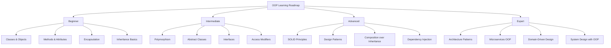
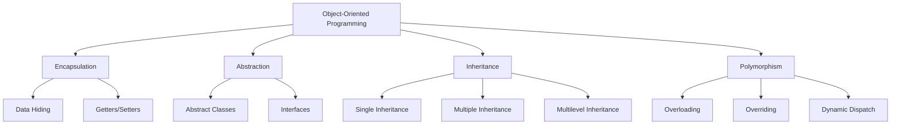
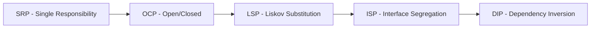
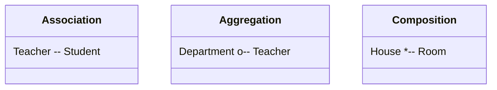
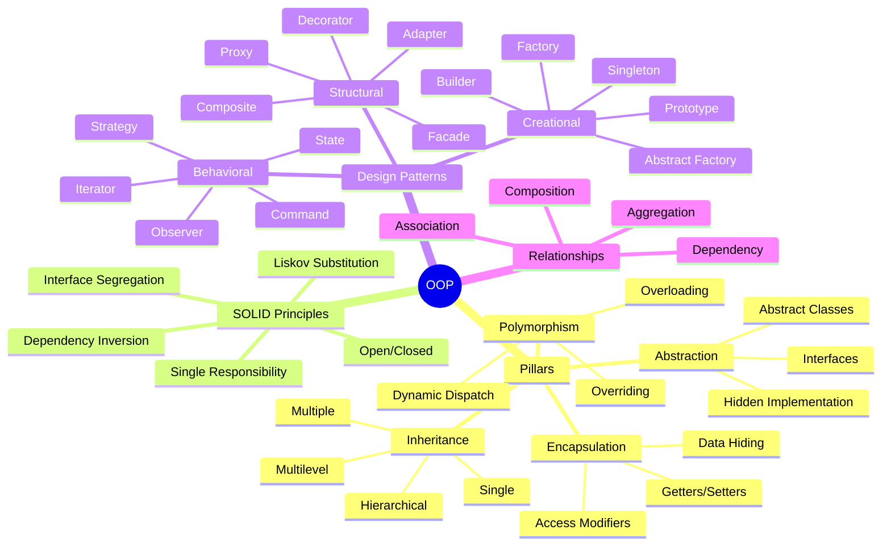
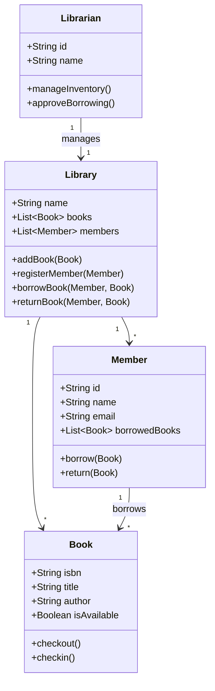
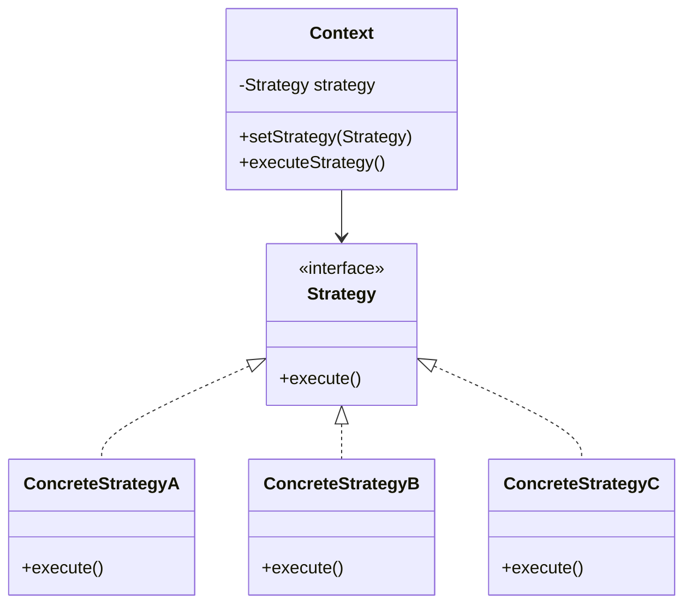
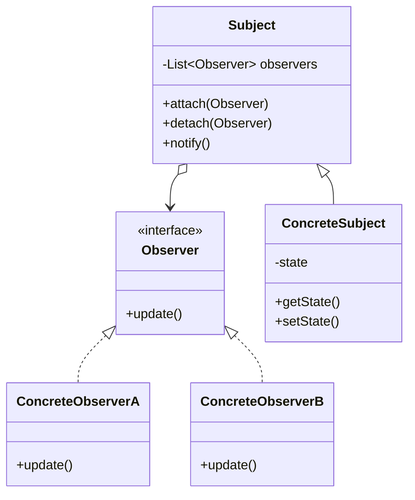
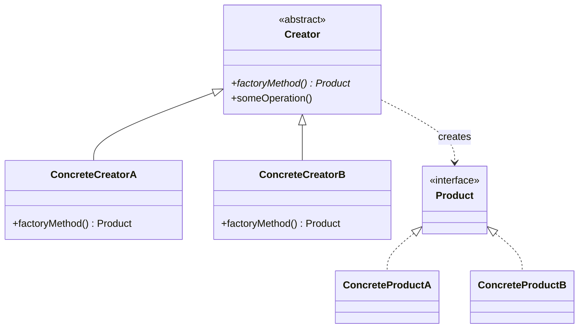

> "Object-oriented programming is an exceptionally bad idea which could only have originated in California." — Edsger Dijkstra

---

## Table of Contents

1. [Introduction](#1-introduction)
2. [Learning Roadmap](#2-learning-roadmap)
3. [Theory Notes](#3-theory-notes)
   - [Four Pillars of OOP](#four-pillars-of-oop)
   - [SOLID Principles](#solid-principles)
   - [Design Patterns](#design-patterns)
   - [Composition vs Inheritance](#composition-vs-inheritance)
   - [Association, Aggregation, Composition](#association-aggregation-composition)
   - [Interfaces vs Abstract Classes](#interfaces-vs-abstract-classes)
   - [Access Modifiers](#access-modifiers)
   - [Constructors and Destructors](#constructors-and-destructors)
   - [Copy Constructor, Shallow vs Deep Copy](#copy-constructor-shallow-vs-deep-copy)
   - [Method Overloading vs Overriding](#method-overloading-vs-overriding)
   - [Covariance and Contravariance](#covariance-and-contravariance)
   - [Liskov Substitution Principle](#liskov-substitution-principle)
   - [Dependency Injection](#dependency-injection)
   - [Inversion of Control](#inversion-of-control)
4. [Key Concepts](#4-key-concepts)
5. [Frequently Asked Interview Questions](#5-frequently-asked-interview-questions)
6. [Hands-on Practice Exercises](#6-hands-on-practice-exercises)
7. [Real FAANG Interview Questions](#7-real-faang-interview-questions)
8. [Common Mistakes](#8-common-mistakes)
9. [Best Practices](#9-best-practices)
10. [Cheat Sheet](#10-cheat-sheet)
11. [Flash Cards](#11-flash-cards)
12. [Mind Map](#12-mind-map)
13. [Mermaid Diagrams](#13-mermaid-diagrams)
14. [Code Examples](#14-code-examples)
15. [Mini Project: Library Management System](#15-mini-project-library-management-system)
16. [Intermediate Project: Payment System](#16-intermediate-project-payment-system)
17. [Advanced Project: Game Engine Architecture](#17-advanced-project-game-engine-architecture)
18. [10 Project Ideas](#18-10-project-ideas)
19. [Practice Websites](#19-practice-websites)
20. [Books](#20-books)
21. [Documentation](#21-documentation)
22. [YouTube Channels](#22-youtube-channels)
23. [Blogs](#23-blogs)
24. [Certifications](#24-certifications)
25. [Checklist](#25-checklist)
26. [Revision Notes](#26-revision-notes)
27. [One-Day Revision Plan](#27-one-day-revision-plan)
28. [One-Week Revision Plan](#28-one-week-revision-plan)
29. [Mock Interview Questions](#29-mock-interview-questions)
30. [Difficulty Rating](#30-difficulty-rating)
31. [Summary](#31-summary)
32. [Revision Checklist](#32-revision-checklist)
33. [Practice Tasks](#33-practice-tasks)
34. [Next Topic](#34-next-topic)
35. [References](#35-references)

---

## 1. Introduction

### What is OOP?

Object-Oriented Programming (OOP) is a programming paradigm based on the concept of **objects**, which contain **data** (attributes/properties) and **code** (methods/functions). OOP organizes software design around objects rather than functions and logic.

### Why is OOP Important?

- **Modularity**: Code is organized into self-contained objects
- **Reusability**: Classes and inheritance promote code reuse
- **Maintainability**: Changes in one part don't affect others
- **Scalability**: Easier to extend and scale large applications
- **Real-world modeling**: Maps naturally to real-world entities
- **Data Security**: Encapsulation protects internal state

### History of OOP

| Year | Milestone |
|------|-----------|
| 1967 | Simula — first OOP language (Ole-Johan Dahl, Kristen Nygaard) |
| 1972 | Smalltalk — first pure OOP language (Alan Kay) |
| 1979 | C++ — OOP extension of C (Bjarne Stroustrup) |
| 1995 | Java — "Write Once, Run Anywhere" (James Gosling) |
| 1995 | JavaScript — prototype-based OOP (Brendan Eich) |
| 2000 | C# — Microsoft's OOP language (Anders Hejlsberg) |
| 2003 | Scala — JVM OOP + Functional (Martin Odersky) |
| 2014 | Swift — Apple's OOP language (Chris Lattner) |

### OOP vs Procedural Programming

| Feature | OOP | Procedural |
|---------|-----|------------|
| Structure | Objects + Classes | Functions/Procedures |
| Data Access | Encapsulated in objects | Global/Local variables |
| Code Reuse | Inheritance, Composition | Copy-paste, function calls |
| Security | Data hiding (encapsulation) | Limited |
| Scalability | High | Low |
| Maintenance | Easier | Harder |

---

## 2. Learning Roadmap



### Beginner (0-3 months)
- Understand classes and objects
- Learn method creation and calling
- Practice encapsulation
- Basic inheritance

### Intermediate (3-6 months)
- Polymorphism (overloading, overriding)
- Abstract classes and interfaces
- Static members
- Exception handling with OOP

### Advanced (6-12 months)
- SOLID principles
- Design patterns (Gang of Four)
- Composition vs inheritance trade-offs
- Dependency injection

### Expert (12+ months)
- Architecture patterns (MVC, MVVM, MVP)
- Domain-driven design
- Microservices with OOP principles
- Performance optimization

---

## 3. Theory Notes

### Four Pillars of OOP



#### 1. Encapsulation

Encapsulation is the bundling of data and methods that operate on that data within a single unit (class), restricting direct access to some components.

**Key Benefits:**
- Data protection from unauthorized access
- Flexibility to change internal implementation
- Reduced coupling between components

**Python Example:**
```python
class BankAccount:
    def __init__(self, owner, balance=0):
        self.__owner = owner       # private
        self.__balance = balance   # private

    def deposit(self, amount):
        if amount > 0:
            self.__balance += amount
            return True
        return False

    def withdraw(self, amount):
        if 0 < amount <= self.__balance:
            self.__balance -= amount
            return True
        return False

    @property
    def balance(self):
        return self.__balance

    def get_owner(self):
        return self.__owner

# Usage
account = BankAccount("Alice", 1000)
account.deposit(500)
print(account.balance)  # 1500
# account.__balance  # AttributeError - can't access directly
```

**Java Example:**
```java
public class BankAccount {
    private String owner;
    private double balance;

    public BankAccount(String owner, double initialBalance) {
        this.owner = owner;
        this.balance = initialBalance;
    }

    public boolean deposit(double amount) {
        if (amount > 0) {
            balance += amount;
            return true;
        }
        return false;
    }

    public boolean withdraw(double amount) {
        if (amount > 0 && amount <= balance) {
            balance -= amount;
            return true;
        }
        return false;
    }

    public double getBalance() { return balance; }
    public String getOwner() { return owner; }
}
```

#### 2. Abstraction

Abstraction hides complex implementation details and shows only the necessary features of an object.

**Python Example:**
```python
from abc import ABC, abstractmethod

class Shape(ABC):
    @abstractmethod
    def area(self):
        pass

    @abstractmethod
    def perimeter(self):
        pass

class Circle(Shape):
    def __init__(self, radius):
        self.radius = radius

    def area(self):
        return 3.14159 * self.radius ** 2

    def perimeter(self):
        return 2 * 3.14159 * self.radius

class Rectangle(Shape):
    def __init__(self, width, height):
        self.width = width
        self.height = height

    def area(self):
        return self.width * self.height

    def perimeter(self):
        return 2 * (self.width + self.height)

# Usage
shapes = [Circle(5), Rectangle(4, 6)]
for shape in shapes:
    print(f"Area: {shape.area()}, Perimeter: {shape.perimeter()}")
```

**JavaScript Example:**
```javascript
class Shape {
    constructor() {
        if (new.target === Shape) {
            throw new Error("Cannot instantiate abstract class");
        }
    }

    area() {
        throw new Error("Method 'area()' must be implemented");
    }

    perimeter() {
        throw new Error("Method 'perimeter()' must be implemented");
    }
}

class Circle extends Shape {
    constructor(radius) {
        super();
        this.radius = radius;
    }

    area() {
        return Math.PI * this.radius ** 2;
    }

    perimeter() {
        return 2 * Math.PI * this.radius;
    }
}
```

#### 3. Inheritance

Inheritance allows a class to acquire properties and methods of another class, promoting code reuse.

**Types of Inheritance:**
- Single: A → B
- Multiple: A, B → C (supported in Python, not Java)
- Multilevel: A → B → C
- Hierarchical: A → B, A → C

**Python Example:**
```python
class Animal:
    def __init__(self, name, species):
        self.name = name
        self.species = species

    def speak(self):
        return f"{self.name} makes a sound"

class Dog(Animal):
    def __init__(self, name, breed):
        super().__init__(name, "Dog")
        self.breed = breed

    def speak(self):
        return f"{self.name} barks"

class GuideDog(Dog):
    def __init__(self, name, breed, owner):
        super().__init__(name, breed)
        self.owner = owner
        self.is_trained = True

    def guide(self):
        return f"{self.name} is guiding {self.owner}"

# Usage
dog = Dog("Rex", "German Shepherd")
print(dog.speak())  # Rex barks
print(dog.species)  # Dog

guide = GuideDog("Buddy", "Labrador", "John")
print(guide.guide())  # Buddy is guiding John
```

#### 4. Polymorphism

Polymorphism allows objects of different classes to be treated as objects of a common superclass, with each class providing its own implementation.

**Python Example:**
```python
class PaymentProcessor:
    def process_payment(self, amount):
        raise NotImplementedError

class CreditCardPayment(PaymentProcessor):
    def process_payment(self, amount):
        print(f"Processing credit card payment: ${amount}")
        return True

class PayPalPayment(PaymentProcessor):
    def process_payment(self, amount):
        print(f"Processing PayPal payment: ${amount}")
        return True

class CryptoPayment(PaymentProcessor):
    def process_payment(self, amount):
        print(f"Processing crypto payment: ${amount}")
        return True

# Polymorphism in action
def checkout(processor: PaymentProcessor, amount: float):
    processor.process_payment(amount)

payments = [CreditCardPayment(), PayPalPayment(), CryptoPayment()]
for payment in payments:
    checkout(payment, 99.99)
```

---

### SOLID Principles



#### S — Single Responsibility Principle (SRP)

A class should have only one reason to change.

```python
# BAD: Multiple responsibilities
class Employee:
    def calculate_salary(self):
        pass
    def save_to_database(self):
        pass
    def generate_report(self):
        pass

# GOOD: Single responsibility
class Employee:
    def __init__(self, name, salary):
        self.name = name
        self.salary = salary

class EmployeeRepository:
    def save(self, employee):
        pass

class PayrollCalculator:
    def calculate(self, employee):
        pass

class ReportGenerator:
    def generate(self, employee):
        pass
```

#### O — Open/Closed Principle (OCP)

Classes should be open for extension but closed for modification.

```python
# BAD: Must modify class for new discount types
class Discount:
    def get_discount(self, customer_type):
        if customer_type == "regular":
            return 0.1
        elif customer_type == "premium":
            return 0.2

# GOOD: Open for extension
class DiscountStrategy:
    def get_discount(self):
        raise NotImplementedError

class RegularDiscount(DiscountStrategy):
    def get_discount(self):
        return 0.1

class PremiumDiscount(DiscountStrategy):
    def get_discount(self):
        return 0.2

class VIPDiscount(DiscountStrategy):
    def get_discount(self):
        return 0.3

class PriceCalculator:
    def calculate_price(self, price, strategy: DiscountStrategy):
        return price * (1 - strategy.get_discount())
```

#### L — Liskov Substitution Principle (LSP)

Subtypes must be substitutable for their base types without altering correctness.

```python
# BAD: Violates LSP
class Rectangle:
    def __init__(self, width, height):
        self.width = width
        self.height = height

    def set_width(self, width):
        self.width = width

    def set_height(self, height):
        self.height = height

    def area(self):
        return self.width * self.height

class Square(Rectangle):
    def set_width(self, width):
        self.width = width
        self.height = width  # Surprising behavior!

# GOOD: Respects LSP
class Shape:
    def area(self):
        raise NotImplementedError

class Rectangle(Shape):
    def __init__(self, width, height):
        self.width = width
        self.height = height

    def area(self):
        return self.width * self.height

class Square(Shape):
    def __init__(self, side):
        self.side = side

    def area(self):
        return self.side ** 2
```

#### I — Interface Segregation Principle (ISP)

Clients shouldn't be forced to depend on interfaces they don't use.

```python
# BAD: Fat interface
class Worker:
    def work(self):
        pass
    def eat(self):
        pass
    def sleep(self):
        pass

# GOOD: Segregated interfaces
class Workable:
    def work(self):
        pass

class Eatable:
    def eat(self):
        pass

class Sleepable:
    def sleep(self):
        pass

class Robot(Workable):
    def work(self):
        print("Robot working")

class Human(Workable, Eatable, Sleepable):
    def work(self):
        print("Human working")
    def eat(self):
        print("Human eating")
    def sleep(self):
        print("Human sleeping")
```

#### D — Dependency Inversion Principle (DIP)

High-level modules should not depend on low-level modules. Both should depend on abstractions.

```python
# BAD: High-level depends on low-level
class MySQLDatabase:
    def save(self, data):
        print(f"Saving {data} to MySQL")

class UserService:
    def __init__(self):
        self.db = MySQLDatabase()  # Tightly coupled

# GOOD: Depends on abstraction
class Database(ABC):
    @abstractmethod
    def save(self, data):
        pass

class MySQLDatabase(Database):
    def save(self, data):
        print(f"Saving {data} to MySQL")

class PostgreSQLDatabase(Database):
    def save(self, data):
        print(f"Saving {data} to PostgreSQL")

class UserService:
    def __init__(self, database: Database):
        self.db = database  # Loose coupling

# Usage
service = UserService(PostgreSQLDatabase())
service.save(user_data)
```

---

### Design Patterns

#### Creational Patterns

##### 1. Singleton Pattern
Ensures a class has only one instance and provides a global point of access.

```python
class Singleton:
    _instance = None

    def __new__(cls):
        if cls._instance is None:
            cls._instance = super().__new__(cls)
            cls._instance._initialized = False
        return cls._instance

    def __init__(self):
        if not self._initialized:
            self.data = {}
            self._initialized = True

# Usage
s1 = Singleton()
s2 = Singleton()
print(s1 is s2)  # True
```

##### 2. Factory Pattern
Creates objects without specifying the exact class to instantiate.

```python
from abc import ABC, abstractmethod

class Animal(ABC):
    @abstractmethod
    def speak(self):
        pass

class Dog(Animal):
    def speak(self):
        return "Woof!"

class Cat(Animal):
    def speak(self):
        return "Meow!"

class AnimalFactory:
    @staticmethod
    def create_animal(animal_type: str) -> Animal:
        animals = {
            "dog": Dog,
            "cat": Cat,
        }
        return animals[animal_type.lower()]()

# Usage
factory = AnimalFactory()
dog = factory.create_animal("dog")
print(dog.speak())  # Woof!
```

##### 3. Abstract Factory Pattern
Creates families of related objects without specifying concrete classes.

```python
from abc import ABC, abstractmethod

class Button(ABC):
    @abstractmethod
    def render(self):
        pass

class TextBox(ABC):
    @abstractmethod
    def render(self):
        pass

class WindowsButton(Button):
    def render(self):
        return "Windows Button"

class WindowsTextBox(TextBox):
    def render(self):
        return "Windows TextBox"

class MacButton(Button):
    def render(self):
        return "Mac Button"

class MacTextBox(TextBox):
    def render(self):
        return "Mac TextBox"

class UIFactory(ABC):
    @abstractmethod
    def create_button(self) -> Button:
        pass
    @abstractmethod
    def create_textbox(self) -> TextBox:
        pass

class WindowsFactory(UIFactory):
    def create_button(self):
        return WindowsButton()
    def create_textbox(self):
        return WindowsTextBox()

class MacFactory(UIFactory):
    def create_button(self):
        return MacButton()
    def create_textbox(self):
        return MacTextBox()

# Usage
def create_ui(factory: UIFactory):
    button = factory.create_button()
    textbox = factory.create_textbox()
    print(button.render())
    print(textbox.render())

create_ui(WindowsFactory())
create_ui(MacFactory())
```

##### 4. Builder Pattern
Separates construction of complex objects from representation.

```python
class House:
    def __init__(self):
        self.foundation = None
        self.walls = None
        self.roof = None
        self.doors = None
        self.windows = None

    def __str__(self):
        return (f"House: {self.foundation} foundation, "
                f"{self.walls} walls, {self.roof} roof, "
                f"{self.doors} doors, {self.windows} windows")

class HouseBuilder:
    def __init__(self):
        self.house = House()

    def set_foundation(self, foundation):
        self.house.foundation = foundation
        return self

    def set_walls(self, walls):
        self.house.walls = walls
        return self

    def set_roof(self, roof):
        self.house.roof = roof
        return self

    def set_doors(self, doors):
        self.house.doors = doors
        return self

    def set_windows(self, windows):
        self.house.windows = windows
        return self

    def build(self):
        return self.house

class Director:
    def __init__(self, builder: HouseBuilder):
        self.builder = builder

    def build_basic_house(self):
        return (self.builder
                .set_foundation("Concrete")
                .set_walls("Brick")
                .set_roof("Tile")
                .set_doors("Wood")
                .set_windows("Glass")
                .build())

# Usage
builder = HouseBuilder()
director = Director(builder)
house = director.build_basic_house()
print(house)
```

#### Structural Patterns

##### 5. Adapter Pattern
Allows incompatible interfaces to work together.

```python
class EuropeanSocket:
    def plug_in_type_e(self, voltage):
        return f"Supplying {voltage}V via Type-E"

class AmericanSocket:
    def plug_in_type_a(self, voltage):
        return f"Supplying {voltage}V via Type-A"

class EuropeanAdapter:
    def __init__(self, european_socket: EuropeanSocket):
        self.socket = european_socket

    def plug_in_type_a(self, voltage):
        return self.socket.plug_in_type_e(voltage)

# Usage
eu_socket = EuropeanSocket()
adapter = EuropeanAdapter(eu_socket)
print(adapter.plug_in_type_a(220))  # Supplying 220V via Type-E
```

##### 6. Decorator Pattern
Adds new functionality to objects dynamically without altering their structure.

```python
class Coffee:
    def cost(self):
        return 5.0

    def description(self):
        return "Simple coffee"

class MilkDecorator:
    def __init__(self, coffee: Coffee):
        self._coffee = coffee

    def cost(self):
        return self._coffee.cost() + 1.5

    def description(self):
        return f"{self._coffee.description()}, milk"

class SugarDecorator:
    def __init__(self, coffee):
        self._coffee = coffee

    def cost(self):
        return self._coffee.cost() + 0.5

    def description(self):
        return f"{self._coffee.description()}, sugar"

# Usage
coffee = Coffee()
coffee_with_milk = MilkDecorator(coffee)
coffee_with_milk_sugar = SugarDecorator(coffee_with_milk)
print(coffee_with_milk_sugar.description())
print(f"${coffee_with_milk_sugar.cost()}")
```

##### 7. Proxy Pattern
Provides a placeholder for another object to control access to it.

```python
class Image:
    def display(self):
        pass

class RealImage(Image):
    def __init__(self, filename):
        self.filename = filename
        self._load_from_disk()

    def _load_from_disk(self):
        print(f"Loading {self.filename} from disk...")

    def display(self):
        print(f"Displaying {self.filename}")

class ProxyImage(Image):
    def __init__(self, filename):
        self.filename = filename
        self._real_image = None

    def display(self):
        if self._real_image is None:
            self._real_image = RealImage(self.filename)
        self._real_image.display()

# Usage
image = ProxyImage("photo.jpg")
# Loading happens only when display is called
image.display()  # Loads and displays
image.display()  # Only displays (already loaded)
```

##### 8. Facade Pattern
Provides a simplified interface to a complex subsystem.

```python
class CPU:
    def freeze(self):
        print("Freezing CPU")
    def jump(self, address):
        print(f"Jumping to {address}")
    def execute(self):
        print("Executing instructions")

class Memory:
    def load(self, address, data):
        print(f"Loading data to {address}")

class HardDrive:
    def read(self, sector, size):
        print(f"Reading {size} bytes from sector {sector}")
        return "boot_data"

class ComputerFacade:
    def __init__(self):
        self.cpu = CPU()
        self.memory = Memory()
        self.hard_drive = HardDrive()

    def start(self):
        self.cpu.freeze()
        boot_data = self.hard_drive.read(0, 1024)
        self.memory.load(0, boot_data)
        self.cpu.jump(0)
        self.cpu.execute()
        print("Computer started!")

# Usage
computer = ComputerFacade()
computer.start()
```

#### Behavioral Patterns

##### 9. Observer Pattern
Defines a one-to-many dependency so that when one object changes state, all dependents are notified.

```python
class Observer:
    def update(self, event, data):
        pass

class EventEmitter:
    def __init__(self):
        self._observers = {}

    def on(self, event, observer):
        if event not in self._observers:
            self._observers[event] = []
        self._observers[event].append(observer)

    def off(self, event, observer):
        if event in self._observers:
            self._observers[event].remove(observer)

    def emit(self, event, data=None):
        for observer in self._observers.get(event, []):
            observer.update(event, data)

class EmailNotification(Observer):
    def update(self, event, data):
        print(f"Email: {event} occurred with data: {data}")

class SMSNotification(Observer):
    def update(self, event, data):
        print(f"SMS: {event} occurred with data: {data}")

# Usage
emitter = EventEmitter()
emitter.on("order_placed", EmailNotification())
emitter.on("order_placed", SMSNotification())
emitter.emit("order_placed", {"order_id": 123, "amount": 99.99})
```

##### 10. Strategy Pattern
Defines a family of algorithms and makes them interchangeable.

```python
from abc import ABC, abstractmethod

class SortStrategy(ABC):
    @abstractmethod
    def sort(self, data):
        pass

class BubbleSort(SortStrategy):
    def sort(self, data):
        print("Sorting using Bubble Sort")
        return sorted(data)

class QuickSort(SortStrategy):
    def sort(self, data):
        print("Sorting using Quick Sort")
        return sorted(data)

class MergeSort(SortStrategy):
    def sort(self, data):
        print("Sorting using Merge Sort")
        return sorted(data)

class Sorter:
    def __init__(self, strategy: SortStrategy):
        self._strategy = strategy

    def set_strategy(self, strategy: SortStrategy):
        self._strategy = strategy

    def sort(self, data):
        return self._strategy.sort(data)

# Usage
sorter = Sorter(BubbleSort())
print(sorter.sort([5, 3, 8, 1]))

sorter.set_strategy(QuickSort())
print(sorter.sort([5, 3, 8, 1]))
```

##### 11. Command Pattern
Encapsulates requests as objects, allowing parameterization and queuing.

```python
from abc import ABC, abstractmethod

class Command(ABC):
    @abstractmethod
    def execute(self):
        pass

    @abstractmethod
    def undo(self):
        pass

class Light:
    def __init__(self, location):
        self.location = location
        self.is_on = False

    def toggle(self):
        self.is_on = not self.is_on
        state = "ON" if self.is_on else "OFF"
        print(f"{self.location} light is {state}")

class LightOnCommand(Command):
    def __init__(self, light: Light):
        self.light = light

    def execute(self):
        if not self.light.is_on:
            self.light.toggle()

    def undo(self):
        if self.light.is_on:
            self.light.toggle()

class RemoteControl:
    def __init__(self):
        self._commands = {}

    def set_command(self, slot, command: Command):
        self._commands[slot] = command

    def press_button(self, slot):
        if slot in self._commands:
            self._commands[slot].execute()

    def press_undo(self, slot):
        if slot in self._commands:
            self._commands[slot].undo()

# Usage
living_room_light = Light("Living Room")
remote = RemoteControl()
remote.set_command(0, LightOnCommand(living_room_light))
remote.press_button(0)  # Living Room light is ON
remote.press_undo(0)    # Living Room light is OFF
```

##### 12. Iterator Pattern
Provides a way to access elements of a collection sequentially without exposing underlying representation.

```python
class Iterator:
    def __init__(self, collection):
        self._collection = collection
        self._index = 0

    def __iter__(self):
        return self

    def __next__(self):
        if self._index < len(self._collection):
            item = self._collection[self._index]
            self._index += 1
            return item
        raise StopIteration

class BookCollection:
    def __init__(self):
        self._books = []

    def add_book(self, book):
        self._books.append(book)

    def __iter__(self):
        return Iterator(self._books)

# Usage
collection = BookCollection()
collection.add_book("Design Patterns")
collection.add_book("Clean Code")
collection.add_book("Refactoring")

for book in collection:
    print(book)
```

##### 13. Template Method Pattern
Defines the skeleton of an algorithm in a base class, letting subclasses override specific steps.

```python
from abc import ABC, abstractmethod

class DataMiner(ABC):
    def mine(self, path):
        self.open_file(path)
        data = self.extract_data()
        self.parse_data(data)
        self.analyze_data(data)
        self.report()
        self.close_file()

    @abstractmethod
    def open_file(self, path):
        pass

    @abstractmethod
    def extract_data(self):
        pass

    @abstractmethod
    def parse_data(self, data):
        pass

    def analyze_data(self, data):
        print("Analyzing data...")

    def report(self):
        print("Generating report...")

    @abstractmethod
    def close_file(self):
        pass

class CSVDataMiner(DataMiner):
    def open_file(self, path):
        print(f"Opening CSV file: {path}")

    def extract_data(self):
        print("Extracting CSV data...")
        return ["csv_data"]

    def parse_data(self, data):
        print("Parsing CSV data...")

    def close_file(self):
        print("Closing CSV file")

# Usage
miner = CSVDataMiner()
miner.mine("data.csv")
```

##### 14. State Pattern
Allows an object to alter its behavior when its internal state changes.

```python
from abc import ABC, abstractmethod

class State(ABC):
    @abstractmethod
    def handle(self, context):
        pass

class OrderState(ABC):
    pass

class PendingState(OrderState):
    def handle(self, order):
        print("Processing order...")
        order.set_state(ProcessingState())

class ProcessingState(OrderState):
    def handle(self, order):
        print("Shipping order...")
        order.set_state(ShippedState())

class ShippedState(OrderState):
    def handle(self, order):
        print("Delivering order...")
        order.set_state(DeliveredState())

class DeliveredState(OrderState):
    def handle(self, order):
        print("Order delivered!")

class Order:
    def __init__(self):
        self._state = PendingState()

    def set_state(self, state):
        self._state = state

    def next_step(self):
        self._state.handle(self)

# Usage
order = Order()
order.next_step()  # Processing order...
order.next_step()  # Shipping order...
order.next_step()  # Delivering order...
order.next_step()  # Order delivered!
```

##### 15. Mediator Pattern
Defines an object that encapsulates how a set of objects interact.

```python
class ChatRoom:
    def __init__(self):
        self._users = {}

    def register(self, user):
        self._users[user.name] = user

    def send(self, message, sender, receiver=None):
        if receiver:
            receiver.receive(message, sender.name)
        else:
            for user in self._users.values():
                if user != sender:
                    user.receive(message, sender.name)

class User:
    def __init__(self, name, chat_room: ChatRoom):
        self.name = name
        self._chat_room = chat_room
        self._chat_room.register(self)

    def send(self, message, receiver=None):
        self._chat_room.send(message, self, receiver)

    def receive(self, message, sender_name):
        print(f"{self.name} received from {sender_name}: {message}")

# Usage
room = ChatRoom()
alice = User("Alice", room)
bob = User("Bob", room)
charlie = User("Charlie", room)

alice.send("Hello everyone!")  # Broadcast
bob.send("Hi Alice!", alice)   # Direct message
```

##### 16. Memento Pattern
Provides the ability to restore an object to its previous state.

```python
class Memento:
    def __init__(self, state):
        self._state = state

    def get_state(self):
        return self._state

class Editor:
    def __init__(self):
        self._content = ""

    def type(self, words):
        self._content += words

    def get_content(self):
        return self._content

    def save(self):
        return Memento(self._content)

    def restore(self, memento: Memento):
        self._content = memento.get_state()

class History:
    def __init__(self):
        self._mementos = []

    def push(self, memento: Memento):
        self._mementos.append(memento)

    def pop(self):
        return self._mementos.pop()

# Usage
editor = Editor()
history = History()

editor.type("Hello ")
history.push(editor.save())

editor.type("World ")
history.push(editor.save())

editor.type("!")
print(editor.get_content())  # Hello World !

editor.restore(history.pop())
print(editor.get_content())  # Hello World

editor.restore(history.pop())
print(editor.get_content())  # Hello
```

---

### Composition vs Inheritance

| Aspect | Composition | Inheritance |
|--------|-------------|-------------|
| Relationship | "has-a" | "is-a" |
| Coupling | Loose | Tight |
| Flexibility | High (runtime) | Low (compile-time) |
| Testability | Easier | Harder |
| Code Reuse | Via delegation | Via extending |

```python
# Inheritance approach
class Engine:
    def start(self):
        print("Engine started")

class Car(Engine):  # "is-a" relationship
    pass

# Composition approach
class Car:
    def __init__(self, engine: Engine):
        self.engine = engine  # "has-a" relationship

    def start(self):
        self.engine.start()
```

---

### Association, Aggregation, Composition

| Relationship | Description | Lifecycle |
|-------------|-------------|-----------|
| Association | General relationship between classes | Independent |
| Aggregation | "Part-of" relationship, weak ownership | Independent |
| Composition | "Part-of" relationship, strong ownership | Dependent |



---

### Interfaces vs Abstract Classes

| Feature | Interface | Abstract Class |
|---------|-----------|----------------|
| Multiple Inheritance | Yes | No (mostly) |
| Constructor | No | Yes |
| State (fields) | No (only constants) | Yes |
| Default Methods | Language dependent | Yes |
| Access Modifiers | Public only (Java) | Any |
| Instantiation | No | No |

---

### Access Modifiers

| Modifier | Class | Package | Subclass | World |
|----------|-------|---------|----------|-------|
| public | ✓ | ✓ | ✓ | ✓ |
| protected | ✓ | ✓ | ✓ | ✗ |
| default (package-private) | ✓ | ✓ | ✗ | ✗ |
| private | ✓ | ✗ | ✗ | ✗ |

---

### Constructors and Destructors

**Python:**
```python
class Resource:
    def __init__(self, name):
        self.name = name
        print(f"Resource {name} created")

    def __del__(self):
        print(f"Resource {self.name} destroyed")

    def __repr__(self):
        return f"Resource({self.name})"
```

**Java:**
```java
public class Resource {
    private String name;

    public Resource(String name) {
        this.name = name;
        System.out.println("Resource " + name + " created");
    }

    @Override
    protected void finalize() throws Throwable {
        System.out.println("Resource " + name + " destroyed");
        super.finalize();
    }
}
```

---

### Copy Constructor, Shallow vs Deep Copy

```python
import copy

class Person:
    def __init__(self, name, addresses):
        self.name = name
        self.addresses = addresses

    def __repr__(self):
        return f"Person({self.name}, {self.addresses})"

# Shallow Copy
person1 = Person("Alice", ["123 Main St", "456 Oak Ave"])
person2 = copy.copy(person1)

# Deep Copy
person3 = copy.deepcopy(person1)

# Modify original
person1.addresses.append("789 Pine Rd")

print(person1)  # Alice, ['123 Main St', '456 Oak Ave', '789 Pine Rd']
print(person2)  # Alice, ['123 Main St', '456 Oak Ave', '789 Pine Rd'] (shared!)
print(person3)  # Alice, ['123 Main St', '456 Oak Ave'] (independent!)
```

---

### Method Overloading vs Overriding

| Feature | Overloading | Overriding |
|---------|-------------|------------|
| Definition | Multiple methods, same name, different params | Subclass redefines parent method |
| Inheritance | Not required | Required |
| Parameters | Must differ | Must match |
| Return Type | Can differ | Must be same/supertype |
| Binding | Compile-time (static) | Runtime (dynamic) |

---

### Covariance and Contravariance

```python
# Covariance: Subtype can be used where supertype is expected
class Animal: pass
class Dog(Animal): pass

def process Animals(animals: list[Animal]) -> Animal:
    return animals[0]

dogs: list[Dog] = [Dog()]
result: Dog = process Animals(dogs)  # Covariant return

# Contravariance: Supertype can be used where subtype is expected
from typing import Callable

def feed(animal: Animal):
    print(f"Feeding {animal}")

def use_feeder(feeder: Callable[[Dog], None]):
    feeder(Dog())

use_feeder(feed)  # Contravariant parameter
```

---

### Dependency Injection

```python
# Constructor Injection
class Service:
    def __init__(self, repository: Repository):
        self.repository = repository

# Setter Injection
class Service:
    def set_repository(self, repository: Repository):
        self.repository = repository

# Interface Injection
class Injectable:
    def inject(self, dependency):
        pass
```

---

### Inversion of Control (IoC)

IoC means the control of object creation and lifecycle is transferred from the application to a framework or container.

**Types:**
1. **Dependency Injection** (most common)
2. **Service Locator**
3. **Event-driven**
4. **Template Method**
5. **Strategy Pattern**

---

## 4. Key Concepts

| Concept | Description |
|---------|-------------|
| Class | Blueprint for creating objects |
| Object | Instance of a class |
| Method | Function defined inside a class |
| Attribute | Variable defined inside a class |
| Constructor | Special method called when object is created |
| Destructor | Method called when object is destroyed |
| Inheritance | Mechanism for class hierarchy |
| Polymorphism | One interface, many implementations |
| Encapsulation | Bundling data with methods |
| Abstraction | Hiding implementation details |
| Interface | Contract defining methods |
| Abstract Class | Class with abstract methods |
| Static Member | Belongs to class, not instance |
| Final Member | Cannot be changed after initialization |
| Composition | Objects containing other objects |
| Aggregation | Weak "has-a" relationship |
| Coupling | Degree of dependency between classes |
| Cohesion | Degree of relatedness within a class |
| SOLID | Five OOP design principles |
| Design Pattern | Reusable solution to common problems |

---

## 5. Frequently Asked Interview Questions

### Beginner Questions

**Q1: What is the difference between a class and an object?**

A class is a blueprint or template that defines the properties and behaviors of objects. An object is a specific instance of a class with actual values. Think of a class as a cookie cutter and an object as the cookie.

**Q2: What is encapsulation?**

Encapsulation is the bundling of data and methods that operate on that data within a single unit (class), restricting direct access to some components. It protects data from unauthorized access through access modifiers.

**Q3: What are the four pillars of OOP?**

1. **Encapsulation** — bundling data and methods, hiding internals
2. **Abstraction** — showing only necessary features
3. **Inheritance** — creating new classes from existing ones
4. **Polymorphism** — one interface, multiple implementations

**Q4: What is inheritance?**

Inheritance is a mechanism where a new class (child/subclass) acquires properties and methods from an existing class (parent/superclass). It promotes code reuse and establishes an "is-a" relationship.

**Q5: What is the difference between a constructor and a method?**

A constructor is a special method called automatically when an object is created, used for initialization. A method is a function defined in a class that performs operations on object data. Constructors have no return type.

### Intermediate Questions

**Q6: What is polymorphism and its types?**

Polymorphism allows objects of different types to be treated as the same type. Types include:
- **Compile-time (static)**: Method overloading
- **Run-time (dynamic)**: Method overriding, dynamic dispatch

**Q7: What is the difference between abstract class and interface?**

Abstract classes can have constructors, state (fields), and both abstract and concrete methods. Interfaces (traditionally) only have method signatures. A class can implement multiple interfaces but extend only one abstract class.

**Q8: What are access modifiers?**

Access modifiers control visibility of class members:
- **public**: Accessible everywhere
- **protected**: Accessible within class, subclasses, and same package
- **default**: Accessible within same package only
- **private**: Accessible only within the class

**Q9: What is method overriding?**

Method overriding occurs when a subclass provides a specific implementation of a method that is already defined in its parent class. The method signature must match, and it enables runtime polymorphism.

**Q10: What is the difference between overloading and overriding?**

Overloading: Multiple methods with same name but different parameters in the same class. Overriding: Subclass redefines a parent class method with same signature. Overloading is compile-time; overriding is runtime.

### Advanced Questions

**Q11: Explain the SOLID principles.**

- **S**ingle Responsibility: One class, one job
- **O**pen/Closed: Open for extension, closed for modification
- **L**iskov Substitution: Subtypes must be substitutable
- **I**nterface Segregation: Many specific interfaces over one general
- **D**ependency Inversion: Depend on abstractions, not concretions

**Q12: What is the Strategy pattern?**

Strategy defines a family of algorithms and makes them interchangeable. It encapsulates each algorithm in a separate class, allowing the algorithm to vary independently from clients that use it.

**Q13: What is Composition over Inheritance?**

Composition is preferred because it provides:
- Loose coupling
- Runtime flexibility
- Better testability
- Avoids fragile base class problem
- Follows "has-a" over "is-a" relationship

**Q14: What is the Factory pattern?**

Factory pattern provides an interface for creating objects without specifying their exact class. It encapsulates object creation logic, making code more flexible and easier to maintain.

**Q15: What is Dependency Injection?**

DI is a technique where an object receives its dependencies from external sources rather than creating them itself. It promotes loose coupling and makes testing easier.

### FAANG-Level Questions

**Q16: Design a Parking Lot system using OOP.**

```python
from enum import Enum
from datetime import datetime

class VehicleType(Enum):
    CAR = "car"
    TRUCK = "truck"
    MOTORCYCLE = "motorcycle"

class Vehicle:
    def __init__(self, license_plate, vehicle_type):
        self.license_plate = license_plate
        self.vehicle_type = vehicle_type

class ParkingSpot:
    def __init__(self, spot_number, vehicle_type):
        self.spot_number = spot_number
        self.vehicle_type = vehicle_type
        self.vehicle = None

    def park(self, vehicle):
        if self.vehicle is None and self._isCompatible(vehicle):
            self.vehicle = vehicle
            return True
        return False

    def remove_vehicle(self):
        self.vehicle = None

    def _isCompatible(self, vehicle):
        return vehicle.vehicle_type == self.vehicle_type

class ParkingLot:
    def __init__(self):
        self.spots = {}
        self.tickets = {}

    def add_spot(self, spot: ParkingSpot):
        self.spots[spot.spot_number] = spot

    def park_vehicle(self, vehicle):
        for spot in self.spots.values():
            if spot.park(vehicle):
                ticket_id = len(self.tickets) + 1
                self.tickets[ticket_id] = {
                    'vehicle': vehicle,
                    'spot': spot,
                    'entry_time': datetime.now()
                }
                return ticket_id
        return None

    def unpark_vehicle(self, ticket_id):
        if ticket_id in self.tickets:
            ticket = self.tickets[ticket_id]
            ticket['spot'].remove_vehicle()
            del self.tickets[ticket_id]
            return True
        return False
```

**Q17: Explain Liskov Substitution Principle with a real example.**

LSP states that objects of a superclass should be replaceable with objects of its subclasses without affecting correctness. Example: If `Square` extends `Rectangle`, calling `setWidth` and `setHeight` should work the same way. The violation occurs when setting width on a Square also changes height, breaking the expected behavior.

**Q18: Design an elevator system using OOP.**

Key classes: `Elevator`, `ElevatorController`, `Floor`, `Request`, `Scheduler`. The system uses State pattern for elevator states (Idle, Moving, DoorOpen), Observer pattern for floor notifications, and Strategy pattern for scheduling algorithms.

**Q19: What is the difference between Association, Aggregation, and Composition?**

- **Association**: General relationship (teacher-teaches-student)
- **Aggregation**: Weak "has-a" with independent lifecycle (department-has-teachers)
- **Composition**: Strong "has-a" with dependent lifecycle (house-has-rooms)

**Q20: Explain the Observer pattern with a real-world example.**

The Observer pattern defines a subscription mechanism that lets multiple objects listen for and react to events. Example: A news agency (Subject) notifies all subscribed newspapers (Observers) when news is published. Each newspaper receives the same update independently.

**Q21: What is the difference between Factory and Abstract Factory patterns?**

Factory creates a single product type. Abstract Factory creates families of related products. For example, a GUI Factory creates buttons, while a WindowsFactory (Abstract Factory) creates WindowsButton AND WindowsTextBox together.

**Q22: How would you implement a deep copy in Python?**

Using `copy.deepcopy()` which recursively copies all nested objects. For custom implementation, recursively copy all attributes, creating new instances of mutable objects.

**Q23: What is the Decorator pattern and when would you use it?**

Decorator adds responsibilities to objects dynamically. Use when you need to add functionality without modifying the original class, or when extension by subclassing is impractical. Example: Adding logging, caching, or encryption to existing functionality.

**Q24: Explain the SOLID principles with a code example.**

```python
# Violating SRP
class Employee:
    def calculate_pay(self): pass
    def save(self): pass
    def generate_report(self): pass

# Following SRP
class PayCalculator:
    def calculate(self, employee): pass

class EmployeeRepository:
    def save(self, employee): pass

class ReportGenerator:
    def generate(self, employee): pass
```

**Q25: What is the difference between Coupling and Cohesion?**

**Coupling** is the degree of dependency between classes (low coupling is good). **Cohesion** is how related the responsibilities within a single class are (high cohesion is good). Goal: High cohesion, low coupling.

**Q26: How do you handle multiple inheritance in Python?**

Python uses MRO (Method Resolution Order) via C3 linearization. Use `super()` to call parent methods. Diamond problem is resolved by following MRO order.

**Q27: What is a metaclass in Python?**

A metaclass is the "class of a class." While a class defines how instances behave, a metaclass defines how classes behave. `type` is the default metaclass. You can create custom metaclasses by inheriting from `type`.

---

## 6. Hands-on Practice Exercises

### Exercise 1: Build a Library System
Create a library management system with classes for `Book`, `Member`, `Librarian`, and `Library`.

### Exercise 2: Design Pattern Implementation
Implement all 16 GoF design patterns in your preferred language.

### Exercise 3: SOLID Code Review
Take existing code and refactor it to follow all SOLID principles.

### Exercise 4: Animal Kingdom
Model an animal kingdom using inheritance, polymorphism, and encapsulation.

### Exercise 5: Banking System
Design a banking system with different account types, transaction processing, and reporting.

### Exercise 6: Shape Calculator
Create a shape calculator using polymorphism that calculates area, perimeter, and volume.

### Exercise 7: Employee Management
Build an employee management system with different roles, permissions, and salary calculations.

### Exercise 8: Shopping Cart
Implement a shopping cart with different product types, discounts (Strategy pattern), and notifications (Observer pattern).

---

## 7. Real FAANG Interview Questions

### Google
1. Design a Google Maps system using OOP
2. Implement a URL shortener with proper class design
3. Design a caching system (LRU Cache)

### Amazon
1. Design an e-commerce platform (Product, Cart, Order, Payment)
2. Implement an inventory management system
3. Design a recommendation engine

### Meta (Facebook)
1. Design a social media feed system
2. Implement a chat application class hierarchy
3. Design a news feed ranking system

### Apple
1. Design a music streaming service
2. Implement a file system using OOP
3. Design a notification system

### Microsoft
1. Design a document editor (similar to Word)
2. Implement a task scheduling system
3. Design a multiplayer game lobby

### Netflix
1. Design a video streaming service
2. Implement a content recommendation system
3. Design a video encoding pipeline

---

## 8. Common Mistakes

| Mistake | Solution |
|---------|----------|
| Tight coupling between classes | Use dependency injection and interfaces |
| God classes (too many responsibilities) | Apply Single Responsibility Principle |
| Overusing inheritance | Prefer composition over inheritance |
| Ignoring access modifiers | Always use appropriate encapsulation |
| Creating circular dependencies | Use dependency inversion |
| Not using interfaces | Program to interfaces, not implementations |
| Deep inheritance hierarchies | Keep hierarchies shallow (max 2-3 levels) |
| Ignoring SOLID principles | Study and apply SOLID consistently |
| Premature optimization | Focus on clean design first |
| Not writing testable code | Design for testability from the start |

---

## 9. Best Practices

1. **Program to an interface, not an implementation**
2. **Favor composition over inheritance**
3. **Encapsulate what varies**
4. **Single Responsibility Principle** — one class, one job
5. **Open/Closed Principle** — extend, don't modify
6. **Use dependency injection** for loose coupling
7. **Keep classes small and focused**
8. **Name classes and methods clearly**
9. **Use appropriate access modifiers**
10. **Write testable code**
11. **Follow DRY (Don't Repeat Yourself)**
12. **Follow KISS (Keep It Simple, Stupid)**
13. **Apply YAGNI (You Aren't Gonna Need It)**
14. **Use factory methods instead of constructors** when creation is complex
15. **Document your design decisions**

---

## 10. Cheat Sheet

```
┌─────────────────────────────────────────────────────────────────┐
│                    OOP CHEAT SHEET                              │
├─────────────────────────────────────────────────────────────────┤
│                                                                 │
│  FOUR PILLARS:                                                  │
│  ├── Encapsulation: Data hiding + bundling                     │
│  ├── Abstraction: Hide complexity, show essentials              │
│  ├── Inheritance: IS-A relationship, code reuse                 │
│  └── Polymorphism: One interface, many implementations          │
│                                                                 │
│  SOLID:                                                         │
│  ├── S: Single Responsibility                                  │
│  ├── O: Open/Closed                                            │
│  ├── L: Liskov Substitution                                    │
│  ├── I: Interface Segregation                                  │
│  └── D: Dependency Inversion                                   │
│                                                                 │
│  DESIGN PATTERNS:                                               │
│  ├── Creational: Singleton, Factory, Abstract Factory, Builder  │
│  ├── Structural: Adapter, Decorator, Proxy, Facade              │
│  └── Behavioral: Observer, Strategy, Command, State, Iterator   │
│                                                                 │
│  ACCESS MODIFIERS:                                              │
│  ├── public: Everywhere                                        │
│  ├── protected: Class + Subclasses + Package                   │
│  ├── default: Package only                                     │
│  └── private: Class only                                       │
│                                                                 │
│  RELATIONSHIPS:                                                 │
│  ├── Association: General relationship                         │
│  ├── Aggregation: Weak HAS-A                                   │
│  └── Composition: Strong HAS-A                                 │
│                                                                 │
└─────────────────────────────────────────────────────────────────┘
```

---

## 11. Flash Cards

| # | Question | Answer |
|---|----------|--------|
| 1 | What is OOP? | Programming paradigm based on objects containing data and methods |
| 2 | What is a class? | A blueprint/template for creating objects |
| 3 | What is an object? | An instance of a class |
| 4 | What is encapsulation? | Bundling data and methods, restricting direct access |
| 5 | What is inheritance? | Creating new classes from existing ones (IS-A relationship) |
| 6 | What is polymorphism? | One interface, multiple implementations |
| 7 | What is abstraction? | Hiding implementation details, showing only features |
| 8 | What is the difference between class and object? | Class is blueprint, object is instance |
| 9 | What is method overloading? | Multiple methods, same name, different parameters |
| 10 | What is method overriding? | Subclass redefines parent's method |
| 11 | What is SOLID? | Five OOP design principles |
| 12 | What is SRP? | Single Responsibility Principle |
| 13 | What is OCP? | Open/Closed Principle |
| 14 | What is LSP? | Liskov Substitution Principle |
| 15 | What is ISP? | Interface Segregation Principle |
| 16 | What is DIP? | Dependency Inversion Principle |
| 17 | What is the Singleton pattern? | Ensures only one instance exists |
| 18 | What is the Factory pattern? | Creates objects without specifying exact class |
| 19 | What is the Observer pattern? | One-to-many dependency for notifications |
| 20 | What is composition? | Objects containing other objects (HAS-A, strong) |

---

## 12. Mind Map



---

## 13. Mermaid Diagrams

### Class Diagram — Library System



### Design Patterns — Strategy Pattern



### Observer Pattern Diagram



### Factory Pattern Diagram



---

## 14. Code Examples

### Python — Complete OOP Example

```python
from abc import ABC, abstractmethod
from datetime import datetime
import uuid

class Entity(ABC):
    def __init__(self):
        self.id = str(uuid.uuid4())
        self.created_at = datetime.now()

    @abstractmethod
    def to_dict(self):
        pass

class User(Entity):
    def __init__(self, name, email):
        super().__init__()
        self.name = name
        self.email = email
        self._orders = []

    def place_order(self, order):
        self._orders.append(order)
        return order

    def get_orders(self):
        return self._orders.copy()

    def to_dict(self):
        return {
            'id': self.id,
            'name': self.name,
            'email': self.email,
            'order_count': len(self._orders)
        }

    def __repr__(self):
        return f"User(name='{self.name}', email='{self.email}')"

class Product(Entity):
    def __init__(self, name, price, stock=0):
        super().__init__()
        self.name = name
        self._price = price
        self._stock = stock

    @property
    def price(self):
        return self._price

    @price.setter
    def price(self, value):
        if value < 0:
            raise ValueError("Price cannot be negative")
        self._price = value

    def is_in_stock(self):
        return self._stock > 0

    def reduce_stock(self, quantity):
        if quantity > self._stock:
            raise ValueError("Insufficient stock")
        self._stock -= quantity

    def to_dict(self):
        return {
            'id': self.id,
            'name': self.name,
            'price': self._price,
            'stock': self._stock
        }

class OrderItem:
    def __init__(self, product: Product, quantity: int):
        self.product = product
        self.quantity = quantity

    @property
    def subtotal(self):
        return self.product.price * self.quantity

class OrderStatus:
    PENDING = "pending"
    CONFIRMED = "confirmed"
    SHIPPED = "shipped"
    DELIVERED = "delivered"
    CANCELLED = "cancelled"

class Order(Entity):
    def __init__(self, user: User):
        super().__init__()
        self.user = user
        self._items = []
        self._status = OrderStatus.PENDING
        self._created_at = datetime.now()

    def add_item(self, product: Product, quantity: int):
        if not product.is_in_stock():
            raise ValueError(f"{product.name} is out of stock")
        item = OrderItem(product, quantity)
        self._items.append(item)
        product.reduce_stock(quantity)
        return self

    @property
    def total(self):
        return sum(item.subtotal for item in self._items)

    @property
    def status(self):
        return self._status

    def update_status(self, new_status):
        valid_transitions = {
            OrderStatus.PENDING: [OrderStatus.CONFIRMED, OrderStatus.CANCELLED],
            OrderStatus.CONFIRMED: [OrderStatus.SHIPPED, OrderStatus.CANCELLED],
            OrderStatus.SHIPPED: [OrderStatus.DELIVERED],
            OrderStatus.DELIVERED: [],
            OrderStatus.CANCELLED: []
        }
        if new_status in valid_transitions.get(self._status, []):
            self._status = new_status
        else:
            raise ValueError(f"Invalid status transition: {self._status} -> {new_status}")

    def to_dict(self):
        return {
            'id': self.id,
            'user': self.user.name,
            'items': len(self._items),
            'total': self.total,
            'status': self._status
        }

# Usage
user = User("Alice", "alice@example.com")
laptop = Product("Laptop", 999.99, 10)
mouse = Product("Mouse", 29.99, 50)

order = Order(user)
order.add_item(laptop, 1).add_item(mouse, 2)

print(order.total)  # 1059.97
order.update_status(OrderStatus.CONFIRMED)
print(order.status)  # confirmed
```

### Java — OOP Example

```java
import java.util.ArrayList;
import java.util.List;

abstract class Shape {
    protected String color;

    public Shape(String color) {
        this.color = color;
    }

    public abstract double area();
    public abstract double perimeter();

    @Override
    public String toString() {
        return String.format("%s shape with area %.2f", color, area());
    }
}

class Circle extends Shape {
    private double radius;

    public Circle(String color, double radius) {
        super(color);
        this.radius = radius;
    }

    @Override
    public double area() {
        return Math.PI * radius * radius;
    }

    @Override
    public double perimeter() {
        return 2 * Math.PI * radius;
    }
}

class Rectangle extends Shape {
    private double width, height;

    public Rectangle(String color, double width, double height) {
        super(color);
        this.width = width;
        this.height = height;
    }

    @Override
    public double area() {
        return width * height;
    }

    @Override
    public double perimeter() {
        return 2 * (width + height);
    }
}

interface Drawable {
    void draw();
}

interface Resizable {
    void resize(double factor);
}

class Canvas implements Drawable, Resizable {
    private List<Shape> shapes = new ArrayList<>();

    public void addShape(Shape shape) {
        shapes.add(shape);
    }

    @Override
    public void draw() {
        shapes.forEach(System.out::println);
    }

    @Override
    public void resize(double factor) {
        System.out.println("Resizing canvas by factor: " + factor);
    }
}
```

### JavaScript — OOP Example

```javascript
class EventEmitter {
    constructor() {
        this.events = {};
    }

    on(event, callback) {
        if (!this.events[event]) {
            this.events[event] = [];
        }
        this.events[event].push(callback);
        return () => this.off(event, callback);
    }

    off(event, callback) {
        if (this.events[event]) {
            this.events[event] = this.events[event].filter(cb => cb !== callback);
        }
    }

    emit(event, ...args) {
        if (this.events[event]) {
            this.events[event].forEach(callback => callback(...args));
        }
    }
}

class Database extends EventEmitter {
    constructor(name) {
        super();
        this.name = name;
        this.data = new Map();
    }

    insert(key, value) {
        this.data.set(key, value);
        this.emit('insert', { key, value });
    }

    delete(key) {
        const value = this.data.get(key);
        this.data.delete(key);
        this.emit('delete', { key, value });
    }

    find(key) {
        return this.data.get(key);
    }
}

// Usage
const db = new Database('users');
db.on('insert', (data) => console.log('Inserted:', data));
db.on('delete', (data) => console.log('Deleted:', data));

db.insert('user1', { name: 'Alice' });  // Inserted: { key: 'user1', value: { name: 'Alice' } }
db.delete('user1');                      // Deleted: { key: 'user1', value: { name: 'Alice' } }
```

### C++ — OOP Example

```cpp
#include <iostream>
#include <string>
#include <vector>
#include <memory>

class Animal {
protected:
    std::string name;
    int age;

public:
    Animal(std::string name, int age) : name(name), age(age) {}
    virtual ~Animal() = default;

    virtual void speak() const = 0;
    virtual std::string getType() const = 0;

    std::string getName() const { return name; }
    int getAge() const { return age; }

    friend std::ostream& operator<<(std::ostream& os, const Animal& animal) {
        os << animal.getType() << ": " << animal.name << " (age " << animal.age << ")";
        return os;
    }
};

class Dog : public Animal {
private:
    std::string breed;

public:
    Dog(std::string name, int age, std::string breed)
        : Animal(name, age), breed(breed) {}

    void speak() const override {
        std::cout << name << " says: Woof!" << std::endl;
    }

    std::string getType() const override { return "Dog"; }
    std::string getBreed() const { return breed; }
};

class Cat : public Animal {
private:
    bool isIndoor;

public:
    Cat(std::string name, int age, bool isIndoor)
        : Animal(name, age), isIndoor(isIndoor) {}

    void speak() const override {
        std::cout << name << " says: Meow!" << std::endl;
    }

    std::string getType() const override { return "Cat"; }
};

class Shelter {
private:
    std::vector<std::unique_ptr<Animal>> animals;

public:
    void addAnimal(std::unique_ptr<Animal> animal) {
        animals.push_back(std::move(animal));
    }

    void listAnimals() const {
        for (const auto& animal : animals) {
            std::cout << *animal << std::endl;
        }
    }

    void makeAllSpeak() const {
        for (const auto& animal : animals) {
            animal->speak();
        }
    }
};

int main() {
    Shelter shelter;
    shelter.addAnimal(std::make_unique<Dog>("Rex", 5, "German Shepherd"));
    shelter.addAnimal(std::make_unique<Cat>("Whiskers", 3, true));
    shelter.listAnimals();
    shelter.makeAllSpeak();
    return 0;
}
```

---

## 15. Mini Project: Library Management System

### Project Structure
```
library_system/
├── models/
│   ├── __init__.py
│   ├── book.py
│   ├── member.py
│   ├── librarian.py
│   └── loan.py
├── services/
│   ├── __init__.py
│   ├── library_service.py
│   ├── notification_service.py
│   └── report_service.py
├── patterns/
│   ├── __init__.py
│   ├── observer.py
│   ├── strategy.py
│   └── factory.py
├── tests/
│   ├── __init__.py
│   ├── test_book.py
│   ├── test_member.py
│   └── test_library.py
├── main.py
└── requirements.txt
```

### Key Classes

```python
# book.py
class Book:
    def __init__(self, isbn, title, author, genre):
        self.isbn = isbn
        self.title = title
        self.author = author
        self.genre = genre
        self._is_available = True

    @property
    def is_available(self):
        return self._is_available

    def checkout(self):
        if not self._is_available:
            raise ValueError("Book is not available")
        self._is_available = False

    def return_book(self):
        self._is_available = True

# member.py
class Member:
    MAX_LOANS = 5

    def __init__(self, member_id, name, email):
        self.member_id = member_id
        self.name = name
        self.email = email
        self._loans = []

    def can_borrow(self):
        return len(self._loans) < self.MAX_LOANS

    def add_loan(self, loan):
        self._loans.append(loan)

    def remove_loan(self, loan):
        self._loans.remove(loan)

# library_service.py
class LibraryService:
    def __init__(self, book_repo, member_repo, loan_repo, notification_service):
        self.book_repo = book_repo
        self.member_repo = member_repo
        self.loan_repo = loan_repo
        self.notification = notification_service

    def borrow_book(self, member_id, isbn):
        member = self.member_repo.get(member_id)
        book = self.book_repo.get(isbn)

        if not member.can_borrow():
            raise ValueError("Member has reached maximum loans")
        if not book.is_available:
            raise ValueError("Book is not available")

        loan = Loan.create(member, book)
        book.checkout()
        member.add_loan(loan)
        self.loan_repo.save(loan)
        self.notification.notify_borrow(member, book)
        return loan

    def return_book(self, member_id, isbn):
        member = self.member_repo.get(member_id)
        book = self.book_repo.get(isbn)
        loan = self.loan_repo.find_active(member_id, isbn)

        book.return_book()
        member.remove_loan(loan)
        loan.complete()
        self.loan_repo.save(loan)
        self.notification.notify_return(member, book)
```

---

## 16. Intermediate Project: Payment System with Design Patterns

### Project Structure
```
payment_system/
├── patterns/
│   ├── __init__.py
│   ├── strategy.py        # Payment strategies
│   ├── observer.py        # Event notifications
│   ├── factory.py         # Payment method factory
│   ├── decorator.py       # Fee calculation decorators
│   └── state.py           # Transaction states
├── models/
│   ├── __init__.py
│   ├── payment.py
│   ├── transaction.py
│   ├── wallet.py
│   └── invoice.py
├── services/
│   ├── __init__.py
│   ├── payment_service.py
│   ├── fraud_detection.py
│   ├── notification_service.py
│   └── reporting_service.py
├── tests/
│   ├── test_payment.py
│   ├── test_patterns.py
│   └── test_integration.py
├── main.py
└── requirements.txt
```

### Key Implementation

```python
# strategy.py — Payment Strategy
from abc import ABC, abstractmethod

class PaymentStrategy(ABC):
    @abstractmethod
    def pay(self, amount):
        pass

    @abstractmethod
    def refund(self, amount):
        pass

class CreditCardPayment(PaymentStrategy):
    def __init__(self, card_number, expiry, cvv):
        self.card_number = card_number
        self.expiry = expiry
        self.cvv = cvv

    def pay(self, amount):
        print(f"Charging ${amount} to card ending in {self.card_number[-4:]}")
        return True

    def refund(self, amount):
        print(f"Refunding ${amount} to card ending in {self.card_number[-4:]}")
        return True

class PayPalPayment(PaymentStrategy):
    def __init__(self, email):
        self.email = email

    def pay(self, amount):
        print(f"Charging ${amount} to PayPal: {self.email}")
        return True

    def refund(self, amount):
        print(f"Refunding ${amount} to PayPal: {self.email}")
        return True

# observer.py — Payment Events
class PaymentEvent:
    def __init__(self, event_type, data):
        self.event_type = event_type
        self.data = data

class PaymentObserver:
    def update(self, event: PaymentEvent):
        pass

class FraudDetectionObserver(PaymentObserver):
    def update(self, event: PaymentEvent):
        if event.event_type == "payment_started":
            print(f"Checking for fraud: {event.data}")

class NotificationObserver(PaymentObserver):
    def update(self, event: PaymentEvent):
        if event.event_type == "payment_completed":
            print(f"Sending confirmation to {event.data['email']}")

class LoggingObserver(PaymentObserver):
    def update(self, event: PaymentEvent):
        print(f"[LOG] {event.event_type}: {event.data}")

# state.py — Transaction State
from abc import ABC, abstractmethod

class TransactionState(ABC):
    @abstractmethod
    def process(self, transaction):
        pass

    @abstractmethod
    def complete(self, transaction):
        pass

    @abstractmethod
    def fail(self, transaction):
        pass

class PendingState(TransactionState):
    def process(self, transaction):
        print("Processing transaction...")
        transaction.set_state(ProcessingState())

    def complete(self, transaction):
        raise ValueError("Cannot complete from pending state")

    def fail(self, transaction):
        transaction.set_state(FailedState())

class ProcessingState(TransactionState):
    def process(self, transaction):
        raise ValueError("Already processing")

    def complete(self, transaction):
        print("Transaction completed!")
        transaction.set_state(CompletedState())

    def fail(self, transaction):
        transaction.set_state(FailedState())

class CompletedState(TransactionState):
    def process(self, transaction):
        raise ValueError("Transaction already completed")

    def complete(self, transaction):
        raise ValueError("Transaction already completed")

    def fail(self, transaction):
        raise ValueError("Cannot fail completed transaction")

class FailedState(TransactionState):
    def process(self, transaction):
        transaction.set_state(PendingState())
        transaction.process()

    def complete(self, transaction):
        raise ValueError("Cannot complete failed transaction")

    def fail(self, transaction):
        raise ValueError("Transaction already failed")

class Transaction:
    def __init__(self, amount, payment_method):
        self.amount = amount
        self.payment_method = payment_method
        self._state = PendingState()
        self.observers = []

    def set_state(self, state):
        self._state = state

    def attach(self, observer):
        self.observers.append(observer)

    def notify(self, event_type, data=None):
        event = PaymentEvent(event_type, data or {})
        for observer in self.observers:
            observer.update(event)

    def process(self):
        self.notify("payment_started", {"amount": self.amount})
        self._state.process(self)

    def complete(self):
        self._state.complete(self)
        self.notify("payment_completed", {"amount": self.amount})

    def fail(self):
        self._state.fail(self)
        self.notify("payment_failed", {"amount": self.amount})
```

---

## 17. Advanced Project: Game Engine Architecture

### Project Structure
```
game_engine/
├── core/
│   ├── __init__.py
│   ├── engine.py          # Main game loop
│   ├── entity.py          # Base entity class
│   ├── component.py       # ECS components
│   ├── system.py          # ECS systems
│   └── world.py           # Entity Component System
├── graphics/
│   ├── __init__.py
│   ├── renderer.py
│   ├── sprite.py
│   ├── animation.py
│   └── camera.py
├── physics/
│   ├── __init__.py
│   ├── collider.py
│   ├── rigid_body.py
│   └── physics_world.py
├── input/
│   ├── __init__.py
│   ├── input_manager.py
│   └── input_action.py
├── audio/
│   ├── __init__.py
│   ├── audio_manager.py
│   └── sound.py
├── patterns/
│   ├── __init__.py
│   ├── observer.py        # Event system
│   ├── command.py         # Input commands
│   ├── state.py           # Game states
│   ├── strategy.py        # AI behaviors
│   └── factory.py         # Entity factories
├── games/
│   ├── __init__.py
│   ├── platformer/
│   │   ├── player.py
│   │   ├── enemy.py
│   │   └── level.py
│   └── rpg/
│       ├── character.py
│       ├── inventory.py
│       └── quest.py
├── main.py
└── requirements.txt
```

### Key Architecture

```python
# engine.py — Main Game Engine
class GameEngine:
    def __init__(self, width=800, height=600):
        self.width = width
        self.height = height
        self.running = False
        self.world = World()
        self.renderer = Renderer(width, height)
        self.input_manager = InputManager()
        self.audio_manager = AudioManager()
        self.clock = Clock()
        self.state_manager = StateManager()

    def initialize(self):
        self.renderer.initialize()
        self.audio_manager.initialize()
        self.state_manager.push(PlayingState(self))

    def run(self):
        self.running = True
        while self.running:
            delta_time = self.clock.tick(60) / 1000.0
            self.handle_events()
            self.update(delta_time)
            self.render()

    def handle_events(self):
        events = self.input_manager.get_events()
        self.state_manager.handle_events(events)

    def update(self, delta_time):
        self.state_manager.update(delta_time)
        self.world.update(delta_time)

    def render(self):
        self.renderer.clear()
        self.state_manager.render(self.renderer)
        self.renderer.present()

    def shutdown(self):
        self.running = False
        self.audio_manager.shutdown()
        self.renderer.shutdown()

# world.py — Entity Component System
class World:
    def __init__(self):
        self.entities = {}
        self.systems = []
        self.next_entity_id = 0

    def create_entity(self):
        entity_id = self.next_entity_id
        self.next_entity_id += 1
        self.entities[entity_id] = {}
        return entity_id

    def add_component(self, entity_id, component_type, component):
        if entity_id not in self.entities:
            raise ValueError("Entity does not exist")
        self.entities[entity_id][component_type] = component

    def get_component(self, entity_id, component_type):
        return self.entities.get(entity_id, {}).get(component_type)

    def add_system(self, system):
        self.systems.append(system)

    def update(self, delta_time):
        for system in self.systems:
            system.update(self, delta_time)

    def destroy_entity(self, entity_id):
        del self.entities[entity_id]

# component.py — ECS Components
class TransformComponent:
    def __init__(self, x=0, y=0, rotation=0, scale=1):
        self.x = x
        self.y = y
        self.rotation = rotation
        self.scale = scale

class SpriteComponent:
    def __init__(self, sprite):
        self.sprite = sprite
        self.visible = True
        self.layer = 0

class PhysicsComponent:
    def __init__(self, velocity_x=0, velocity_y=0, mass=1):
        self.velocity_x = velocity_x
        self.velocity_y = velocity_y
        self.mass = mass
        self.is_static = False

class ColliderComponent:
    def __init__(self, width, height, is_trigger=False):
        self.width = width
        self.height = height
        self.is_trigger = is_trigger
        self.colliding_with = set()

class HealthComponent:
    def __init__(self, max_health=100):
        self.max_health = max_health
        self.current_health = max_health
        self.is_alive = True

    def take_damage(self, amount):
        self.current_health -= amount
        if self.current_health <= 0:
            self.current_health = 0
            self.is_alive = False

class InputComponent:
    def __init__(self):
        self.move_speed = 200
        self.actions = {}

# system.py — ECS Systems
class MovementSystem:
    def update(self, world, delta_time):
        for entity_id, components in world.entities.items():
            transform = components.get(TransformComponent)
            physics = components.get(PhysicsComponent)
            input_comp = components.get(InputComponent)

            if transform and physics and input_comp:
                if 'left' in input_comp.actions:
                    transform.x -= input_comp.move_speed * delta_time
                if 'right' in input_comp.actions:
                    transform.x += input_comp.move_speed * delta_time
                if 'up' in input_comp.actions:
                    transform.y -= input_comp.move_speed * delta_time
                if 'down' in input_comp.actions:
                    transform.y += input_comp.move_speed * delta_time

                # Apply physics
                transform.x += physics.velocity_x * delta_time
                transform.y += physics.velocity_y * delta_time

class CollisionSystem:
    def update(self, world, delta_time):
        entities_with_collider = [
            (eid, comps) for eid, comps in world.entities.items()
            if ColliderComponent in comps and TransformComponent in comps
        ]

        for i, (eid1, comps1) in enumerate(entities_with_collider):
            for eid2, comps2 in entities_with_collider[i+1:]:
                if self.check_collision(comps1, comps2):
                    comps1[ColliderComponent].colliding_with.add(eid2)
                    comps2[ColliderComponent].colliding_with.add(eid1)

    def check_collision(self, comps1, comps2):
        t1, c1 = comps1[TransformComponent], comps1[ColliderComponent]
        t2, c2 = comps2[TransformComponent], comps2[ColliderComponent]
        return (t1.x < t2.x + c2.width and
                t1.x + c1.width > t2.x and
                t1.y < t2.y + c2.height and
                t1.y + c1.height > t2.y)

class RenderSystem:
    def update(self, world, delta_time, renderer):
        renderable = [
            (eid, comps) for eid, comps in world.entities.items()
            if SpriteComponent in comps and TransformComponent in comps
        ]
        renderable.sort(key=lambda x: x[1][SpriteComponent].layer)

        for entity_id, components in renderable:
            transform = components[TransformComponent]
            sprite = components[SpriteComponent]
            if sprite.visible:
                renderer.draw_sprite(sprite.sprite, transform.x, transform.y)
```

---

## 18. 10 Project Ideas

| # | Project | Difficulty | Patterns Used |
|---|---------|------------|---------------|
| 1 | **Library Management System** | Beginner | Factory, Observer |
| 2 | **Student Management System** | Beginner | Encapsulation, Inheritance |
| 3 | **Shopping Cart System** | Intermediate | Strategy, Observer, Decorator |
| 4 | **Banking System** | Intermediate | State, Factory, Singleton |
| 5 | **Chat Application** | Intermediate | Observer, Mediator, Factory |
| 6 | **Parking Lot System** | Intermediate | Strategy, Factory, State |
| 7 | **Game Engine** | Advanced | ECS, Command, Observer |
| 8 | **E-commerce Platform** | Advanced | All GoF patterns |
| 9 | **Social Media Backend** | Advanced | Observer, Strategy, Factory |
| 10 | **Compiler/Language Parser** | Expert | Visitor, Builder, Composite |

---

## 19. Practice Websites

| Website | URL | Focus |
|---------|-----|-------|
| LeetCode | leetcode.com | OOP design problems |
| HackerRank | hackerrank.com | OOP challenges |
| CodeSignal | codesignal.com | OOP exercises |
| Exercism | exercism.org | OOP tracks in multiple languages |
| Codewars | codewars.com | OOP katas |
| GeeksforGeeks | geeksforgeeks.org | OOP concepts and problems |
| InterviewBit | interviewbit.com | OOP interview questions |

---

## 20. Books

| Book | Author | Level | Focus |
|------|--------|-------|-------|
| Design Patterns (GoF) | Gamma, Helm, Johnson, Vlissides | Advanced | 23 classic patterns |
| Clean Code | Robert C. Martin | Intermediate | Code quality |
| Head First OOP Analysis & Design | Freeman, Robson | Beginner | OOP concepts |
| Effective Java | Joshua Bloch | Advanced | Java OOP best practices |
| Head First Design Patterns | Freeman, Robson | Intermediate | Patterns with visuals |
| The Pragmatic Programmer | Hunt, Thomas | Intermediate | Software development |
| Refactoring | Martin Fowler | Advanced | Code improvement |
| Domain-Driven Design | Eric Evans | Expert | Architecture patterns |
| Patterns of Enterprise Application Architecture | Martin Fowler | Advanced | Enterprise patterns |
| AntiPatterns | William J. Brown | Intermediate | What NOT to do |

---

## 21. Documentation

| Resource | URL |
|----------|-----|
| Python OOP Documentation | docs.python.org/3/tutorial/classes.html |
| Java OOP Documentation | docs.oracle.com/javase/tutorial/java/concepts/ |
| JavaScript Classes | developer.mozilla.org/en-US/docs/Web/JavaScript/Reference/Classes |
| C++ Classes | docs.microsoft.com/en-us/cpp/cpp/classes-cpp |
| Gang of Four Design Patterns | designpatterns.gof |

---

## 22. YouTube Channels

| Channel | Focus |
|---------|-------|
| Traversy Media | Web dev OOP |
| The Net Ninja | JavaScript OOP |
| Programming with Mosh | Python OOP |
| freeCodeCamp | Comprehensive OOP tutorials |
| CS Dojo | OOP concepts and interview prep |
| CodeBullet | OOP projects |
| Fireship | Quick OOP pattern explanations |
| Academind | Full stack OOP |
| Derek Banas | OOP in multiple languages |

---

## 23. Blogs

| Blog | Focus |
|------|-------|
| Medium (OOP tags) | Various OOP articles |
| Refactoring Guru | Design patterns with examples |
| dev.to | Community OOP discussions |
| Baeldung | Java OOP tutorials |
| Real Python | Python OOP best practices |
| JavaScript.info | JS OOP deep dives |
| GeeksforGeeks | OOP interview preparation |
| Toward Data Science | OOP in ML/AI context |

---

## 24. Certifications

| Certification | Provider | Level |
|--------------|----------|-------|
| Oracle Certified Professional: Java SE | Oracle | Advanced |
| Microsoft Certified: Azure Developer | Microsoft | Intermediate |
| Python Institute PCEP/PCAP | Python Institute | Beginner-Intermediate |
| AWS Certified Developer | Amazon | Intermediate |
| Google Cloud Professional | Google | Advanced |

---

## 25. Checklist

- [ ] Understand all four pillars of OOP
- [ ] Master encapsulation and access modifiers
- [ ] Implement inheritance hierarchies
- [ ] Apply polymorphism (overloading and overriding)
- [ ] Use abstract classes and interfaces
- [ ] Follow SOLID principles
- [ ] Implement common design patterns
- [ ] Understand composition vs inheritance trade-offs
- [ ] Apply dependency injection
- [ ] Design class hierarchies for real problems
- [ ] Complete at least 3 OOP projects
- [ ] Solve 20+ OOP interview questions
- [ ] Read at least one design patterns book
- [ ] Understand and apply Liskov Substitution Principle
- [ ] Implement Observer, Strategy, and Factory patterns

---

## 26. Revision Notes

### Quick Reference

**Encapsulation**: Private data + public methods
**Abstraction**: Abstract classes/interfaces
**Inheritance**: IS-A relationship
**Polymorphism**: One interface, multiple implementations

**SOLID**:
- S: One class = one job
- O: Extend, don't modify
- L: Subtypes = supertypes
- I: Many small interfaces
- D: Depend on abstractions

**Key Patterns**:
- Singleton: One instance
- Factory: Create objects
- Observer: One-to-many notifications
- Strategy: Swap algorithms
- Decorator: Add behavior dynamically

---

## 27. One-Day Revision Plan

| Time | Topic |
|------|-------|
| 9:00 - 10:00 | Four Pillars Review |
| 10:00 - 11:00 | SOLID Principles |
| 11:00 - 12:00 | Design Patterns (5 patterns) |
| 12:00 - 13:00 | Lunch |
| 13:00 - 14:00 | Design Patterns (5 more) |
| 14:00 - 15:00 | Code Examples Review |
| 15:00 - 16:00 | Practice Problems |
| 16:00 - 17:00 | Flash Cards Review |
| 17:00 - 18:00 | Mock Interview |

---

## 28. One-Week Revision Plan

| Day | Topic |
|-----|-------|
| Day 1 | Four Pillars + Encapsulation deep dive |
| Day 2 | Inheritance + Polymorphism + Interfaces |
| Day 3 | SOLID Principles with examples |
| Day 4 | Creational Patterns (Singleton, Factory, Builder) |
| Day 5 | Structural + Behavioral Patterns |
| Day 6 | Projects + Code Review |
| Day 7 | Mock Interviews + Flash Cards |

---

## 29. Mock Interview Questions

1. Design a URL shortener using OOP principles
2. Implement a rate limiter using design patterns
3. Design a parking lot system
4. Create a vending machine using OOP
5. Design a chess game with proper class hierarchy
6. Implement a job scheduler
7. Design a social media feed
8. Create a payment processing system
9. Design a file system
10. Implement a chat application

---

## 30. Difficulty Rating

| Topic | Difficulty | Time to Master |
|-------|------------|----------------|
| Classes & Objects | ⭐ | 1 week |
| Encapsulation | ⭐ | 1 week |
| Inheritance | ⭐⭐ | 2 weeks |
| Polymorphism | ⭐⭐⭐ | 2-3 weeks |
| Abstract Classes & Interfaces | ⭐⭐⭐ | 2 weeks |
| SOLID Principles | ⭐⭐⭐⭐ | 3-4 weeks |
| Design Patterns | ⭐⭐⭐⭐⭐ | 4-6 weeks |
| System Design with OOP | ⭐⭐⭐⭐⭐ | 6-8 weeks |

---

## 31. Summary

Object-Oriented Programming is a fundamental paradigm for building maintainable, scalable, and reusable software. Master the four pillars, follow SOLID principles, and learn design patterns to write clean, professional code. Practice implementing patterns in real projects and be ready to explain your design decisions in interviews.

**Key Takeaways:**
1. OOP = Objects + Classes + four pillars
2. SOLID principles guide clean design
3. Design patterns are reusable solutions
4. Composition > Inheritance (usually)
5. Practice with real projects
6. Be ready to whiteboard class diagrams

---

## 32. Revision Checklist

- [ ] Can explain all four OOP pillars with examples
- [ ] Can apply SOLID principles to real code
- [ ] Can implement 10+ design patterns
- [ ] Can design class hierarchies for complex systems
- [ ] Can explain when to use composition vs inheritance
- [ ] Can solve OOP design problems on whiteboard
- [ ] Can justify design decisions in mock interviews
- [ ] Have completed at least 3 OOP projects

---

## 33. Practice Tasks

1. Implement a simple banking system using OOP
2. Create a library management system with design patterns
3. Design and implement a chat application
4. Build a shopping cart with strategy pattern for discounts
5. Implement a state machine for a game character
6. Create a notification system using observer pattern
7. Design a file system with composite pattern
8. Implement a cache with LRU eviction policy
9. Build a command-line todo app with undo functionality
10. Design a social media feed system

---

## 34. Next Topic

**[Software Engineering](../36-SoftwareEngineering/README.md)** — Learn about software development lifecycle, methodologies (Agile, Scrum, Waterfall), version control, CI/CD, and more.

---

## 35. References

1. Gamma, E., Helm, R., Johnson, R., & Vlissides, J. (1994). *Design Patterns: Elements of Reusable Object-Oriented Software*
2. Martin, R. C. (2008). *Clean Code: A Handbook of Agile Software Craftsmanship*
3. Freeman, E., & Robson, E. (2004). *Head First Design Patterns*
4. Bloch, J. (2018). *Effective Java* (3rd Edition)
5. Fowler, M. (2018). *Refactoring: Improving the Design of Existing Code* (2nd Edition)
6. Evans, E. (2003). *Domain-Driven Design: Tackling Complexity in the Heart of Software*
7. [Refactoring.Guru - Design Patterns](https://refactoring.guru/design-patterns)
8. [SOLID Principles Explained](https://www.digitalocean.com/community/conceptual-articles/s-o-l-i-d-the-first-five-principles-of-object-oriented-design)
9. [Python OOP Documentation](https://docs.python.org/3/tutorial/classes.html)
10. [Java OOP Tutorial](https://docs.oracle.com/javase/tutorial/java/concepts/)

---

> **Created for interview preparation. Good luck with your OOP interviews! 🎯**


