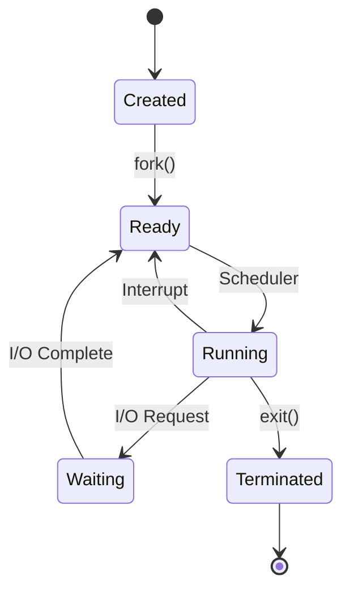
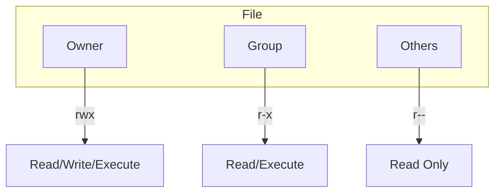

---

## Table of Contents

1. [Introduction](#1-introduction)
2. [Learning Roadmap](#2-learning-roadmap)
3. [Theory Notes](#3-theory-notes)
4. [Key Concepts](#4-key-concepts)
5. [Interview Questions & Answers](#5-interview-questions--answers)
6. [Hands-on Practice](#6-hands-on-practice)
7. [FAANG Interview Questions](#7-faang-interview-questions)
8. [Common Mistakes to Avoid](#8-common-mistakes-to-avoid)
9. [Best Practices](#9-best-practices)
10. [Cheat Sheet](#10-cheat-sheet)
11. [Flash Cards](#11-flash-cards)
12. [Mind Map](#12-mind-map)
13. [Mermaid Diagrams](#13-mermaid-diagrams)
14. [Code Examples](#14-code-examples)
15. [Projects & Ideas](#15-projects--ideas)
16. [Resources](#16-resources)
17. [Interview Preparation Checklist](#17-interview-preparation-checklist)
18. [Revision Notes](#18-revision-notes)
19. [Mock Interview Questions](#19-mock-interview-questions)
20. [Difficulty Rating](#20-difficulty-rating)
21. [Summary](#21-summary)

---

## 1. Introduction

Linux is an open-source Unix-like operating system kernel first released by Linus Torvalds in 1991. It forms the foundation of most server infrastructure, cloud platforms, embedded systems, and supercomputers. Linux knowledge is essential for system administration, DevOps, cloud computing, and software engineering roles.

### Why Linux Matters

- **Server infrastructure** — Powers 90%+ of web servers and cloud
- **Development environment** — Primary platform for software development
- **DevOps/Cloud** — Docker, Kubernetes, and CI/CD run on Linux
- **Security** — Understanding permissions, processes, and system hardening
- **Interview relevance** — Expected knowledge for backend/infrastructure roles

### Core Topics

| Area | Focus | Interview Weight |
|------|-------|-----------------|
| File System | Directory structure, permissions, operations | Critical |
| Process Management | ps, top, kill, signals, scheduling | High |
| Shell Scripting | Bash, automation, pipes, redirects | High |
| Networking | netstat, curl, iptables, DNS | High |
| System Monitoring | top, htop, vmstat, iostat, sar | Medium |
| Package Management | apt, yum, pacman | Medium |
| Security | Users, groups, chmod, SELinux | High |

---

## 2. Learning Roadmap

### Phase 1: Basics (Week 1)
- Navigate filesystem (cd, ls, pwd)
- Manipulate files and directories (cp, mv, rm, mkdir)
- View file contents (cat, less, head, tail)
- Understand file permissions (chmod, chown)

### Phase 2: Text Processing (Week 2)
- Master grep, sed, awk
- Learn regular expressions
- Practice pipe usage (|)
- Understand redirects (>, >>, <, 2>)

### Phase 3: Process Management (Week 3)
- Monitor processes (ps, top, htop)
- Manage processes (kill, nohup, bg, fg)
- Understand signals (SIGTERM, SIGKILL, SIGHUP)
- Study process states and scheduling

### Phase 4: System Administration (Week 4)
- Manage users and groups
- Configure networking (ip, ss, iptables)
- Set up cron jobs and scheduling
- Monitor system resources

### Phase 5: Advanced (Weeks 5-6)
- Learn shell scripting (Bash)
- Understand systemd and services
- Study disk management (fdisk, mount, LVM)
- Practice security hardening

---

## 3. Theory Notes

### 3.1 File System Hierarchy

```
/           Root directory
├── bin     Essential user binaries
├── sbin    System binaries
├── etc     Configuration files
├── home    User home directories
├── root    Root user home
├── var     Variable data (logs, caches)
├── tmp     Temporary files
├── usr     User programs and data
├── lib     Shared libraries
├── opt     Optional software
├── dev     Device files
├── proc    Process information (virtual)
├── sys     System information (virtual)
├── mnt     Mount points
└── boot    Boot loader files
```

### 3.2 File Permissions

**Permission Types:**
- **r (4)** — Read
- **w (2)** — Write
- **x (1)** — Execute

**Permission Classes:**
- **User (u)** — Owner of the file
- **Group (g)** — Users in the file's group
- **Others (o)** — Everyone else

**Special Permissions:**
- **SUID (4)** — Execute as file owner (e.g., passwd)
- **SGID (2)** — Execute as file group / Inherit group for new files
- **Sticky Bit (1)** — Only owner can delete (e.g., /tmp)

**chmod Examples:**
```bash
chmod 755 file    # rwxr-xr-x
chmod 644 file    # rw-r--r--
chmod u+x file    # Add execute for owner
chmod -R 700 dir  # Recursive, owner only
```

### 3.3 Process States

```
R — Running/Ready
S — Sleeping (interruptible)
D — Disk sleep (uninterruptible)
Z — Zombie (terminated but not reaped)
T — Stopped
t — Tracing stop
X — Dead
```

**Process Lifecycle:**
fork() → exec() → wait() → exit()

### 3.4 Signals

| Signal | Number | Default Action | Description |
|--------|--------|----------------|-------------|
| SIGHUP | 1 | Terminate | Hangup |
| SIGINT | 2 | Terminate | Interrupt (Ctrl+C) |
| SIGQUIT | 3 | Core dump | Quit |
| SIGKILL | 9 | Terminate | Force kill (cannot catch) |
| SIGTERM | 15 | Terminate | Graceful termination |
| SIGSTOP | 19 | Stop | Stop process (cannot catch) |
| SIGCONT | 18 | Continue | Continue stopped process |
| SIGUSR1 | 10 | Terminate | User-defined 1 |
| SIGUSR2 | 12 | Terminate | User-defined 2 |

### 3.5 Networking Concepts

**Common Ports:**
| Port | Service |
|------|---------|
| 22 | SSH |
| 25 | SMTP |
| 53 | DNS |
| 80 | HTTP |
| 443 | HTTPS |
| 3306 | MySQL |
| 5432 | PostgreSQL |
| 6379 | Redis |
| 8080 | HTTP Alt |

**Network Commands:**
- `ip addr` — Show network interfaces
- `ip route` — Show routing table
- `ss -tlnp` — Show listening TCP ports
- `netstat -tuln` — Show listening ports
- `curl` — HTTP client
- `wget` — Download files
- `dig` — DNS lookup
- `traceroute` — Trace network path
- `iptables` — Firewall rules

### 3.6 Text Processing Tools

**grep — Global Regular Expression Print:**
```bash
grep -r "pattern" /path      # Recursive search
grep -i "pattern" file        # Case insensitive
grep -n "pattern" file        # Show line numbers
grep -v "pattern" file        # Invert match
grep -E "regex" file          # Extended regex
```

**sed — Stream Editor:**
```bash
sed 's/old/new/g' file        # Replace all occurrences
sed -i 's/old/new/g' file    # In-place edit
sed -n '10,20p' file         # Print lines 10-20
sed '/pattern/d' file         # Delete matching lines
```

**awk — Pattern Scanning:**
```bash
awk '{print $1, $3}' file     # Print columns 1 and 3
awk -F: '{print $1}' /etc/passwd  # Set field separator
awk '/pattern/ {print}' file  # Print matching lines
awk '{sum+=$1} END {print sum}' file  # Sum column
```

---

## 4. Key Concepts

### 4.1 Shell Scripting Fundamentals

**Variables:**
```bash
NAME="John"
echo "Hello $NAME"
echo "${NAME}_backup"
export VAR="value"  # Make available to child processes
```

**Conditionals:**
```bash
if [ "$var" = "value" ]; then
    echo "match"
elif [ "$var" != "value" ]; then
    echo "no match"
else
    echo "other"
fi

# Numeric comparison
if [ $a -eq $b ]; then  # equal
if [ $a -gt $b ]; then  # greater than
if [ $a -lt $b ]; then  # less than
```

**Loops:**
```bash
for i in 1 2 3 4 5; do
    echo "Number: $i"
done

for file in *.txt; do
    echo "Processing $file"
done

while [ $count -lt 10 ]; do
    echo $count
    ((count++))
done

until [ $count -ge 10 ]; do
    echo $count
    ((count++))
done
```

**Functions:**
```bash
function greet() {
    local name=$1
    echo "Hello, $name"
    return 0
}

greet "World"
```

### 4.2 Process Management

**Process Monitoring:**
```bash
ps aux                    # All processes (BSD format)
ps -ef                    # All processes (System V format)
ps aux | grep nginx       # Find specific process
top                       # Real-time process monitor
htop                      # Interactive process monitor
pgrep nginx               # Find process ID by name
pidof nginx               # Get PID of running process
```

**Process Control:**
```bash
kill PID                  # Send SIGTERM
kill -9 PID               # Send SIGKILL (force)
kill -HUP PID             # Send SIGHUP (reload)
nohup command &           # Run in background, immune to hangup
bg                        # Resume stopped job in background
fg                        # Bring background job to foreground
jobs                      # List background jobs
```

### 4.3 Disk Management

```bash
df -h                     # Disk usage by filesystem
du -sh /path              # Directory size
du -h --max-depth=1 /     # Top-level directory sizes
lsblk                     # List block devices
mount /dev/sdb1 /mnt      # Mount filesystem
umount /mnt               # Unmount filesystem
fdisk -l                  # List partitions
```

### 4.4 System Monitoring

```bash
free -h                   # Memory usage
vmstat 1                  # Virtual memory stats (1s interval)
iostat -x 1               # I/O statistics
sar -u 1                  # CPU utilization
uptime                    # System uptime and load
w                         # Who is logged in and what they're doing
last                      # Login history
dmesg                     # Kernel messages
journalctl -f             # Follow systemd journal
```

---

## 5. Interview Questions & Answers

### File System & Permissions

**Q1: What is the difference between hard link and soft link?**
**A:** Hard link — Points to the same inode as the original file. Multiple directory entries share the same data. Cannot cross filesystems. Original file can be deleted; link still works. Created with `ln file link`. Soft link (symbolic) — Points to the path of the original file. Has its own inode. Can cross filesystems. If original is deleted, link breaks (dangling). Created with `ln -s file link`.

**Q2: Explain file permission 755 vs. 644.**
**A:** 755: Owner has read(4)+write(2)+execute(1)=7; Group has read(4)+execute(1)=5; Others have read(4)+execute(1)=5. Used for executables and directories. 644: Owner has read(4)+write(2)=6; Group has read(4)=4; Others have read(4)=4. Used for regular files (no execute needed). 644 is more secure for data files since only owner can modify.

**Q3: What is the sticky bit and when is it used?**
**A:** Sticky bit (permission 1) on a directory means only the file owner, directory owner, or root can delete files within it. Commonly used on /tmp so users can create files but can't delete others' files. Set with `chmod +t directory` or `chmod 1777 directory`. Without sticky bit, any user with write permission to a directory can delete any file in it.

**Q4: What happens when you delete a file that's still open by a process?**
**A:** The file's directory entry is removed immediately, but the file's data blocks are not freed until the last process closes the file descriptor. The file becomes invisible (can't be listed or accessed by new opens) but still consumes disk space. This is why disk usage may not decrease after deleting large log files that processes still have open. Solution: truncate the file (`> file`) or restart the process.

### Process Management

**Q5: What is the difference between SIGTERM and SIGKILL?**
**A:** SIGTERM (15) — Requests graceful termination. Process can catch the signal, clean up resources (close files, save state), and exit cleanly. Default action is termination. SIGKILL (9) — Forces immediate termination. Cannot be caught, blocked, or ignored. Process is killed immediately without cleanup. Use as last resort when process is unresponsive. After SIGKILL, the process becomes a zombie until its parent calls wait().

**Q6: What is a zombie process and how do you handle it?**
**A:** A zombie process is one that has finished execution but still has an entry in the process table. This happens when a child process exits but the parent hasn't called wait() to read its exit status. Zombies consume no resources (CPU, memory) but occupy a PID. Solutions: (1) Send SIGCHLD to parent, (2) Fix parent code to call wait(), (3) Use init as parent (orphaned zombies are reaped by init), (4) Kill the parent process.

**Q7: What is the difference between & and nohup?**
**A:** `command &` — Runs command in background. Stops when terminal closes (receives SIGHUP). `nohup command &` — Runs command immune to SIGHUP. Continues running after terminal closes. Output goes to nohup.out by default. `disown` — Remove a running job from shell's job table, making it immune to SIGHUP. Combined: `nohup command > output.log 2>&1 & disown`.

**Q8: How do you find which process is using a specific port?**
**A:** Multiple methods: (1) `lsof -i :PORT` — Lists process using the port, (2) `ss -tlnp | grep :PORT` — Shows listening TCP sockets, (3) `netstat -tlnp | grep :PORT` — Similar to ss, (4) `fuser PORT/tcp` — Finds process ID using the port, (5) `pgrep -a process_name` then `lsof -p PID`. Example: `lsof -i :80` shows all processes using port 80.

### Shell Scripting

**Q9: What is the difference between $@ and $*?**
**A:** Both expand to all positional parameters. The key difference is in quoting: `$*` — Treats all parameters as a single string (when quoted: `"$*"` = "$1 $2 $3"). `$@` — Preserves individual parameter separation (when quoted: `"$@"` = "$1" "$2" "$3"). Always use `"$@"` in scripts to handle parameters with spaces correctly. Example: `script.sh "hello world" foo` — `"$*"` treats "hello world foo" as one argument; `"$@"` correctly separates "hello world" and "foo".

**Q10: How do you handle errors in shell scripts?**
**A:** Several approaches: (1) `set -e` — Exit immediately on any command failure, (2) `set -u` — Treat unset variables as errors, (3) `set -o pipefail` — Return exit status of last failed command in pipeline, (4) Check `$?` after each command: `command || { echo "Failed"; exit 1; }`, (5) Use trap for cleanup: `trap 'rm -f /tmp/lockfile' EXIT`, (6) Validate inputs at script start, (7) Use functions with return codes. A robust script begins with: `#!/bin/bash\nset -euo pipefail`.

### System Administration

**Q11: How do you check disk space and identify large files?**
**A:** (1) `df -h` — Check filesystem-level usage, (2) `du -sh /*` — Find which top-level directories are large, (3) `du -h --max-depth=1 /path` — Drill down into large directories, (4) `find / -type f -size +100M` — Find files over 100MB, (5) `ncdu /path` — Interactive disk usage analyzer, (6) `ls -lhS /path` — Sort files by size, (7) `journalctl --disk-usage` — Check systemd journal size, (8) Check for deleted-but-open files: `lsof +L1`.

**Q12: What is the difference between init and systemd?**
**A:** init (SysVinit) — Traditional init system. Uses runlevels (0-6). Scripts in /etc/init.d/. Sequential startup. Each service gets its own shell script. systemd — Modern replacement. Uses targets instead of runlevels. Parallel startup. Dependency-based activation. Unit files in /etc/systemd/. Provides socket activation, D-Bus activation, mount point management. Most modern Linux distributions use systemd (Ubuntu 16.04+, CentOS 7+, Debian 8+).

**Q13: How do you set up a cron job?**
**A:** Edit crontab with `crontab -e`. Format: `minute hour day month weekday command`. Examples: `0 2 * * * /path/script.sh` — Run daily at 2 AM. `*/5 * * * * /path/check.sh` — Run every 5 minutes. `0 9 * * 1-5 /path/workday.sh` — Run weekdays at 9 AM. `0 0 1 * * /path/monthly.sh` — Run first day of month at midnight. View with `crontab -l`. Cron environment variables may differ from shell; use full paths.

---

## 6. Hands-on Practice

### Practice 1: Find and Process Large Files

```bash
# Find files larger than 100MB modified in last 7 days
find /var/log -type f -size +100M -mtime -7 -exec ls -lh {} \;

# Find and delete log files older than 30 days
find /var/log -name "*.log" -type f -mtime +30 -delete

# Find files owned by specific user
find /home -type f -user username -exec ls -la {} \;

# Find and count files by extension
find /path -type f -name "*.log" | wc -l

# Find duplicate files by size and MD5
find . -type f -exec md5sum {} \; | sort | uniq -D -w32
```

### Practice 2: Process and Analyze Log Files

```bash
# Count HTTP status codes from access log
awk '{print $9}' access.log | sort | uniq -c | sort -rn

# Find top 10 most frequent IP addresses
awk '{print $1}' access.log | sort | uniq -c | sort -rn | head -10

# Find all 500 errors with timestamps
awk '$9 >= 500' access.log | awk '{print $4, $9, $7}' | head -20

# Calculate average response time
awk '{sum+=$NF; count++} END {print "Avg:", sum/count "ms"}' access.log

# Extract failed login attempts
grep "Failed password" /var/log/auth.log | awk '{print $11}' | sort | uniq -c | sort -rn
```

### Practice 3: System Monitoring Script

```bash
#!/bin/bash
set -euo pipefail

echo "=== System Status Report ==="
echo "Timestamp: $(date)"
echo ""

echo "--- Uptime ---"
uptime
echo ""

echo "--- Memory Usage ---"
free -h
echo ""

echo "--- Top 10 CPU Processes ---"
ps aux --sort=-%cpu | head -11
echo ""

echo "--- Top 10 Memory Processes ---"
ps aux --sort=-%mem | head -11
echo ""

echo "--- Disk Usage ---"
df -h | grep -vE '^Filesystem|tmpfs|cdrom'
echo ""

echo "--- Network Connections ---"
ss -tuln | head -20
echo ""

echo "--- Recent Failed Logins ---"
lastb 2>/dev/null | head -10 || echo "No failed logins or insufficient permissions"
```

### Practice 4: Automated Backup Script

```bash
#!/bin/bash
set -euo pipefail

# Configuration
BACKUP_DIR="/backup"
SOURCE_DIR="/var/www"
DATE=$(date +%Y%m%d_%H%M%S)
BACKUP_FILE="${BACKUP_DIR}/backup_${DATE}.tar.gz"
RETENTION_DAYS=30
LOG_FILE="/var/log/backup.log"

log() {
    echo "[$(date '+%Y-%m-%d %H:%M:%S')] $1" | tee -a "$LOG_FILE"
}

# Create backup directory if it doesn't exist
mkdir -p "$BACKUP_DIR"

# Create backup
log "Starting backup of $SOURCE_DIR"
tar -czf "$BACKUP_FILE" "$SOURCE_DIR" 2>>"$LOG_FILE"

if [ $? -eq 0 ]; then
    log "Backup successful: $BACKUP_FILE"
    log "Size: $(du -h "$BACKUP_FILE" | cut -f1)"
else
    log "ERROR: Backup failed!"
    exit 1
fi

# Clean old backups
log "Cleaning backups older than $RETENTION_DAYS days"
find "$BACKUP_DIR" -name "backup_*.tar.gz" -type f -mtime +$RETENTION_DAYS -delete
log "Cleanup complete"

# Verify backup
log "Verifying backup integrity"
tar -tzf "$BACKUP_FILE" > /dev/null 2>&1
if [ $? -eq 0 ]; then
    log "Backup verification successful"
else
    log "ERROR: Backup verification failed!"
    exit 1
fi
```

---

## 7. FAANG Interview Questions

### Google

**Q: How would you troubleshoot a production server that's experiencing high load?**
**A:** Systematic approach: (1) **Identify** — `uptime` shows load average; `top`/`htop` shows which processes consume CPU, (2) **CPU analysis** — `mpstat -P ALL 1` shows per-CPU usage; `pidstat 1` shows per-process CPU; high user = application issue; high iowait = disk bottleneck, (3) **Memory** — `free -h` shows available memory; if low, check for memory leaks with `ps aux --sort=-%mem`, (4) **Disk I/O** — `iostat -x 1` shows disk utilization; high %util = disk bottleneck, (5) **Network** — `ss -s` shows connection counts; `iftop` shows traffic, (6) **Processes** — `ps auxf` shows process tree; look for zombie or runaway processes, (7) **Logs** — `journalctl -f` or `/var/log/syslog` for recent errors, (8) **Fix** — Kill runaway processes, restart failed services, or scale resources.

### Amazon

**Q: Design a log rotation strategy for a high-traffic web server.**
**A:** (1) **Logrotate** — Use `/etc/logrotate.d/` configuration for automated rotation, (2) **Rotation rules** — Daily rotation, compress after rotation, keep 30 days, (3) **Size-based** — Also rotate when log exceeds 100MB, (4) **Post-rotation** — Send SIGHUP to web server to reopen log files, (5) **Compression** — Use gzip for old logs, (6) **Remote storage** — Ship logs to S3/CloudWatch for long-term retention, (7) **Monitoring** — Alert if log partition exceeds 80% usage, (8) **Cleanup** — Delete logs older than 90 days from local, keep in S3 indefinitely.

### Meta

**Q: How do you optimize a shell script that processes millions of lines?**
**A:** (1) **Replace cat+grep with grep** — `grep pattern file` instead of `cat file | grep pattern`, (2) **Use awk instead of sed+cut** — Single awk pass instead of multiple tools, (3) **Avoid subshells** — Use built-in string operations, (4) **Use parallel processing** — GNU parallel or xargs -P for multi-core, (5) **Stream processing** — Process line by line without loading entire file, (6) **Optimize regex** — Use simple patterns, avoid catastrophic backtracking, (7) **Pre-filter** — Reduce input size before processing, (8) **Use compiled tools** — For very large files, use C/Go instead of bash.

---

## 8. Common Mistakes to Avoid

| Mistake | Problem | Solution |
|---------|---------|----------|
| Using `rm -rf /` | Destroys entire filesystem | Always double-check paths; use `--preserve-root` |
| Not quoting variables | Word splitting on spaces | Always use `"$variable"` |
| Ignoring `set -e` | Errors silently ignored | Start scripts with `set -euo pipefail` |
| Using `ls` in scripts | Fragile, parsing issues | Use `find` or glob patterns |
| Not checking exit codes | Silent failures | Always check `$?` or use `set -e` |
| Running as root unnecessarily | Security risk | Use sudo for specific commands only |

---

## 9. Best Practices

1. **Use full paths in scripts** — `/usr/bin/grep` not `grep`
2. **Quote all variables** — `"$var"` prevents word splitting
3. **Use `set -euo pipefail`** — Catch errors early
4. **Log everything** — Use tee or redirect to log files
5. **Use functions** — Avoid code duplication in scripts
6. **Validate inputs** — Check arguments before using them
7. **Use meaningful variable names** — `LOG_FILE` not `l`
8. **Test scripts with `set -n`** — Syntax check without executing

---

## 10. Cheat Sheet

```
LINUX CHEAT SHEET
═════════════════

FILE OPERATIONS
───────────────
cp src dst          # Copy
mv src dst          # Move/rename
rm -rf dir          # Remove directory
mkdir -p a/b/c      # Create nested dirs
ln -s target link   # Symbolic link

FILE PERMISSIONS
────────────────
chmod 755 file      # rwxr-xr-x
chmod 644 file      # rw-r--r--
chmod +x file       # Add execute
chown user:group f  # Change ownership

TEXT PROCESSING
───────────────
grep -r "pat" dir   # Recursive search
sed 's/a/b/g' f     # Replace all
awk '{print $1}' f  # Print column 1
cut -d: -f1 /etc/passwd

PROCESS MANAGEMENT
──────────────────
ps aux              # List all processes
top                 # Interactive monitor
kill -9 PID         # Force kill
kill -15 PID        # Graceful kill
nohup cmd &         # Run in background
fg/bg/jobs          # Job control

NETWORKING
──────────
ip addr             # Show interfaces
ss -tlnp            # Listening ports
curl -I url         # HTTP headers
dig domain          # DNS lookup
iptables -L         # List firewall rules

DISK & MEMORY
─────────────
df -h               # Disk usage
du -sh dir          # Directory size
free -h             # Memory usage
lsblk               # Block devices

MONITORING
──────────
vmstat 1            # Virtual memory
iostat -x 1         # I/O stats
sar -u 1            # CPU stats
dmesg               # Kernel messages
journalctl -f       # System log

USEFUL ONE-LINERS
─────────────────
# Find files larger than 100MB
find / -type f -size +100M

# Kill process on port
kill $(lsof -t -i:8080)

# Count files
find . -type f | wc -l

# Disk usage by directory
du -h --max-depth=1 /

# Watch command output
watch -n 1 'command'
```

---

## 11. Flash Cards

**Card 1:** What is the difference between hard and soft links?
→ Hard link shares inode; soft link points to path. Hard can't cross filesystems; soft can.

**Card 2:** What does `chmod 755` mean?
→ Owner: read+write+execute; Group: read+execute; Others: read+execute.

**Card 3:** What is a zombie process?
→ A terminated process whose parent hasn't called wait() to read its exit status.

**Card 4:** What does `set -euo pipefail` do in bash?
→ -e: exit on error; -u: error on unset vars; -o pipefail: fail on any command in pipeline.

**Card 5:** What is the sticky bit?
→ Permission bit on directories that prevents users from deleting files they don't own.

**Card 6:** What is SIGKILL vs SIGTERM?
→ SIGTERM (15) requests graceful shutdown; SIGKILL (9) forces immediate termination.

**Card 7:** How do you find which process uses a port?
→ `lsof -i :PORT` or `ss -tlnp | grep :PORT`

**Card 8:** What does `nohup` do?
→ Makes a command immune to SIGHUP, allowing it to continue after terminal closes.

**Card 9:** What is /proc?
→ A virtual filesystem containing process and system information.

**Card 10:** What is the difference between `>` and `>>`?
→ `>` overwrites the file; `>>` appends to the file.

---

## 12. Mind Map

```
Linux
│
├─── File System
│    ├─── Hierarchy (FHS)
│    ├─── Permissions (rwx, chmod)
│    ├─── Links (hard, soft)
│    ├─── File Types (-, d, l, c, b, s, p)
│    └─── Disk Management
│
├─── Process Management
│    ├─── Process States
│    ├─── Signals
│    ├─── Priority (nice, renice)
│    ├─── Daemons
│    └─── Job Control
│
├─── Shell Scripting
│    ├─── Variables
│    ├─── Conditionals
│    ├─── Loops
│    ├─── Functions
│    ├─── Input/Output
│    └─── Error Handling
│
├─── Text Processing
│    ├─── grep
│    ├─── sed
│    ├─── awk
│    ├─── cut, sort, uniq
│    └─── Regular Expressions
│
├─── Networking
│    ├─── Commands (ip, ss, curl)
│    ├─── Firewall (iptables, ufw)
│    ├─── DNS
│    └─── SSH
│
├─── System Administration
│    ├─── Users & Groups
│    ├─── Services (systemd)
│    ├─── Scheduling (cron)
│    ├─── Package Management
│    └─── Logging
│
└─── Security
     ├─── Permissions
     ├─── SELinux/AppArmor
     ├─── SSH Keys
     ├─── Firewall
     └─── Auditing
```

---

## 13. Mermaid Diagrams

### Linux Boot Process


### Process State Diagram



### File Permission Model



---

## 14. Code Examples

See Hands-on Practice section for implementations of:
1. System monitoring script
2. Automated backup script
3. Log analysis commands
4. File processing pipeline

---

## 15. Projects & Ideas

| # | Project | Description | Difficulty | Tools |
|---|---------|-------------|------------|-------|
| 1 | System Monitor | Real-time system dashboard | ⭐⭐⭐ | Bash, Python, HTML |
| 2 | Log Analyzer | Parse and visualize web server logs | ⭐⭐⭐ | Bash, awk, Python |
| 3 | Backup System | Automated backup with rotation | ⭐⭐⭐ | Bash, cron |
| 4 | Server Provisioning | Automated server setup scripts | ⭐⭐⭐⭐ | Bash, Ansible |
| 5 | Firewall Manager | Wrapper around iptables/nftables | ⭐⭐⭐ | Bash, Python |
| 6 | Process Watchdog | Monitor and restart failed services | ⭐⭐⭐ | Bash, systemd |
| 7 | Disk Cleanup | Automated disk space management | ⭐⭐ | Bash |
| 8 | Network Scanner | Discover devices on network | ⭐⭐⭐ | Bash, nmap |

---

## 16. Resources

### Books
- **"The Linux Command Line"** by William Shotts
- **"Linux Bible"** by Christopher Negus
- **"UNIX and Linux System Administration Handbook"** by Evi Nemeth
- **"Bash Cookbook"** by Carl Albing

### Online Courses
- **Linux Foundation:** Introduction to Linux (edX)
- **Udemy:** Linux Mastery
- **Coursera:** Linux System Programming

### Practice
- **OverTheWire: Bandit** — Learn Linux commands through challenges
- **LinuxJourney.com** — Free Linux tutorials
- **Explainshell.com** — Paste commands to get explanations

---

## 17. Interview Preparation Checklist

### Fundamentals
- [ ] Navigate filesystem confidently
- [ ] Understand file permissions and chmod
- [ ] Know difference between hard and soft links
- [ ] Manage files and directories efficiently

### Text Processing
- [ ] Master grep, sed, awk
- [ ] Write regular expressions
- [ ] Use pipes and redirects
- [ ] Process log files

### Process Management
- [ ] Monitor and control processes
- [ ] Understand signals (SIGTERM, SIGKILL)
- [ ] Use job control (bg, fg, nohup)
- [ ] Handle zombie processes

### System Administration
- [ ] Manage users and groups
- [ ] Set up cron jobs
- [ ] Monitor system resources
- [ ] Manage disk space

### Scripting
- [ ] Write bash scripts with error handling
- [ ] Use variables, conditionals, loops
- [ ] Parse command-line arguments
- [ ] Automate common tasks

---

## 18. Revision Notes

### Key Commands Quick Reference

**Files:** ls, cp, mv, rm, mkdir, ln, chmod, chown
**Text:** cat, less, head, tail, grep, sed, awk, cut, sort, uniq, wc
**Process:** ps, top, htop, kill, nohup, bg, fg, jobs, pgrep
**Disk:** df, du, mount, fdisk, lsblk
**Network:** ip, ss, curl, dig, ping, traceroute
**System:** uptime, free, vmstat, iostat, dmesg

### Bash Script Template

```bash
#!/bin/bash
set -euo pipefail

# Configuration
LOG_FILE="/var/log/script.log"

log() {
    echo "[$(date '+%Y-%m-%d %H:%M:%S')] $1" | tee -a "$LOG_FILE"
}

main() {
    log "Starting script"
    # Your code here
    log "Script complete"
}

main "$@"
```

---

## 19. Mock Interview Questions

**Q1:** How would you find which process is consuming the most CPU?

**Q2:** Explain the difference between `kill`, `kill -9`, and `killall`.

**Q3:** How do you set up a script to run every 5 minutes?

**Q4:** What's the difference between `>` and `>>` and when would you use each?

**Q5:** How do you search for a string in all files recursively?

**Q6:** Explain what happens when you type `ls -la` in the terminal.

**Q7:** How would you monitor a log file in real-time?

**Q8:** What is the purpose of `/etc/fstab`?

---

## 20. Difficulty Rating

| Topic | Difficulty | Time to Master | Priority |
|-------|-----------|----------------|----------|
| File Operations | ⭐ | 1-2 days | Critical |
| Permissions | ⭐⭐ | 3-5 days | Critical |
| Text Processing | ⭐⭐⭐ | 1-2 weeks | High |
| Process Management | ⭐⭐⭐ | 1 week | High |
| Shell Scripting | ⭐⭐⭐ | 2 weeks | High |
| Networking | ⭐⭐⭐⭐ | 2-3 weeks | High |
| System Administration | ⭐⭐⭐⭐ | 3-4 weeks | Medium |
| Security | ⭐⭐⭐⭐ | 2-3 weeks | Medium |

**Overall Interview Difficulty:** ⭐⭐⭐ (Moderate)

---

## 21. Summary

Linux is an essential skill for software engineers and system administrators. Key areas include file system navigation and permissions, text processing with grep/sed/awk, process management, shell scripting, and networking. Mastering these skills enables efficient system administration, debugging, and automation.

### Key Takeaways

1. **File permissions are critical** — Understand rwx, chmod, and special bits
2. **Text processing is powerful** — grep, sed, awk can handle most tasks
3. **Process management matters** — Know signals, states, and monitoring
4. **Shell scripting automates** — Write robust scripts with error handling
5. **Networking fundamentals** — Understand ports, protocols, and troubleshooting
6. **Monitor regularly** — Use top, vmstat, iostat to stay proactive
7. **Security is paramount** — Least privilege, proper permissions, audit logs
8. **Practice daily** — The command line improves with consistent use

### Next Steps

- Practice file operations and permissions daily
- Process a real log file with grep/sed/awk
- Write a backup automation script
- Set up a monitoring dashboard for a server

---

> **Pro Tip:** Linux interviews focus on practical skills. Be ready to demonstrate command-line fluency, explain your troubleshooting process, and write scripts that solve real problems. Practice on a real Linux system or VM.
