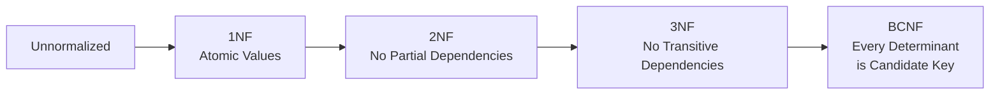
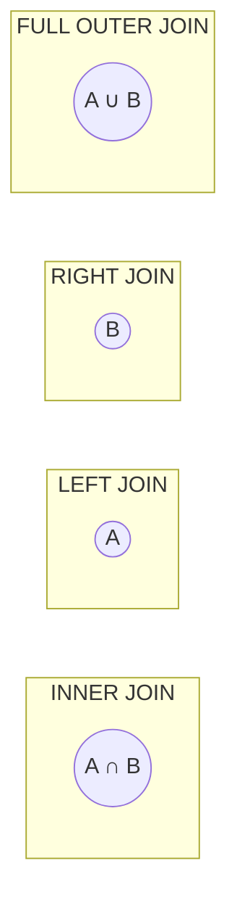
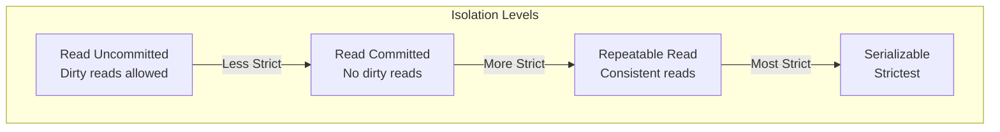

---

## Table of Contents

1. [Introduction](#1-introduction)
2. [Learning Roadmap](#2-learning-roadmap)
3. [Theory Notes](#3-theory-notes)
4. [Key Concepts](#4-key-concepts)
5. [Interview Questions & Answers](#5-interview-questions--answers)
6. [Hands-on Practice](#6-hands-on-practice)
7. [FAANG Interview Questions](#7-faang-interview-questions)
8. [Common Mistakes to Avoid](#8-common-mistakes-to-avoid)
9. [Best Practices](#9-best-practices)
10. [Cheat Sheet](#10-cheat-sheet)
11. [Flash Cards](#11-flash-cards)
12. [Mind Map](#12-mind-map)
13. [Mermaid Diagrams](#13-mermaid-diagrams)
14. [Code Examples](#14-code-examples)
15. [Projects & Ideas](#15-projects--ideas)
16. [Resources](#16-resources)
17. [Interview Preparation Checklist](#17-interview-preparation-checklist)
18. [Revision Notes](#18-revision-notes)
19. [Mock Interview Questions](#19-mock-interview-questions)
20. [Difficulty Rating](#20-difficulty-rating)
21. [Summary](#21-summary)

---

## 1. Introduction

Databases are organized collections of structured data stored electronically. They provide efficient storage, retrieval, and manipulation of data through query languages like SQL. Understanding databases is critical for backend development, data engineering, and system design interviews.

### Why Databases Matter

- **Data persistence** — Store application data reliably
- **Query efficiency** — Retrieve specific data quickly
- **Data integrity** — Ensure consistency and correctness
- **Scalability** — Handle growing data volumes
- **Interview relevance** — Essential for all backend roles

### Database Types

| Type | Description | Examples |
|------|-------------|----------|
| Relational (SQL) | Structured tables with relationships | PostgreSQL, MySQL, Oracle |
| Document | JSON/BSON documents | MongoDB, CouchDB |
| Key-Value | Simple key-value pairs | Redis, DynamoDB |
| Column-Family | Wide-column storage | Cassandra, HBase |
| Graph | Nodes and edges | Neo4j, ArangoDB |
| Time-Series | Time-stamped data | InfluxDB, TimescaleDB |

---

## 2. Learning Roadmap

### Phase 1: SQL Fundamentals (Weeks 1-2)
- Master SELECT, INSERT, UPDATE, DELETE
- Learn JOINs (INNER, LEFT, RIGHT, FULL)
- Understand GROUP BY, HAVING, aggregate functions
- Practice subqueries and CTEs

### Phase 2: Database Design (Weeks 3-4)
- Learn normalization (1NF, 2NF, 3NF, BCNF)
- Understand entity-relationship modeling
- Practice schema design for real applications
- Study indexing strategies

### Phase 3: Advanced SQL (Weeks 5-6)
- Window functions (ROW_NUMBER, RANK, LAG, LEAD)
- Complex subqueries and CTEs
- Query optimization and EXPLAIN
- Transactions and ACID properties

### Phase 4: Database Internals (Weeks 7-8)
- Storage engines (B-Tree, LSM-Tree)
- Transaction isolation levels
- Concurrency control (locking, MVCC)
- Replication and sharding

---

## 3. Theory Notes

### 3.1 SQL Fundamentals

**Basic Query Structure:**
```sql
SELECT columns
FROM table
WHERE conditions
GROUP BY columns
HAVING conditions
ORDER BY columns
LIMIT count;
```

**JOIN Types:**
| JOIN | Description |
|------|-------------|
| INNER | Rows with matches in both tables |
| LEFT | All rows from left, matching from right |
| RIGHT | All rows from right, matching from left |
| FULL | All rows from both tables |
| CROSS | Cartesian product of both tables |
| SELF | Table joined with itself |

**Aggregate Functions:**
- COUNT(), SUM(), AVG(), MIN(), MAX()
- Used with GROUP BY for aggregation

### 3.2 Normalization

**First Normal Form (1NF):**
- Each column contains atomic values
- Each row is unique (has a primary key)
- No repeating groups

**Second Normal Form (2NF):**
- In 1NF
- No partial dependencies (all non-key attributes depend on entire primary key)

**Third Normal Form (3NF):**
- In 2NF
- No transitive dependencies (non-key attributes don't depend on other non-key attributes)

**BCNF (Boyce-Codd Normal Form):**
- In 3NF
- Every determinant is a candidate key

### 3.3 Indexing

**Index Types:**
- **B-Tree** — Default; balanced tree; good for range queries
- **Hash** — Hash table; exact match only; O(1) lookup
- **GIN** — Generalized Inverted Index; full-text search
- **GiST** — Generalized Search Tree; spatial data
- **Composite** — Multiple columns in one index
- **Covering** — Index includes all columns needed (no table lookup)

**Index Rules:**
- Create indexes on frequently queried columns
- Index columns used in WHERE, JOIN, ORDER BY
- Avoid over-indexing (slows writes)
- Consider cardinality (high uniqueness = better index)

### 3.4 ACID Properties

| Property | Description |
|----------|-------------|
| **Atomicity** | Transactions are all-or-nothing |
| **Consistency** | Transactions bring database from one valid state to another |
| **Isolation** | Concurrent transactions don't interfere |
| **Durability** | Committed transactions persist even after crashes |

### 3.5 Transaction Isolation Levels

| Level | Dirty Read | Non-Repeatable Read | Phantom Read |
|-------|------------|---------------------|--------------|
| Read Uncommitted | Yes | Yes | Yes |
| Read Committed | No | Yes | Yes |
| Repeatable Read | No | No | Yes |
| Serializable | No | No | No |

**Phenomena:**
- **Dirty Read** — Reading uncommitted data from another transaction
- **Non-Repeatable Read** — Same query returns different results within transaction
- **Phantom Read** — New rows appear between two reads of same query

### 3.6 Replication and Sharding

**Replication:**
- **Single Primary** — One write node, multiple read replicas
- **Multi-Primary** — Multiple write nodes (complex conflict resolution)
- **Synchronous** — Write confirmed after replica confirms (strong consistency)
- **Asynchronous** — Write confirmed immediately (eventual consistency)

**Sharding:**
- **Horizontal** — Split rows across databases by key
- **Vertical** — Split columns across databases
- **Hash-based** — Shard by hash of key
- **Range-based** — Shard by value ranges
- **Directory-based** — Lookup service maps keys to shards

---

## 4. Key Concepts

### 4.1 Query Optimization

**EXPLAIN/EXPLAIN ANALYZE:**
Shows the query execution plan — which indexes are used, join order, estimated rows.

**Optimization Techniques:**
1. **Use indexes** — Avoid full table scans
2. **Select specific columns** — Don't use SELECT *
3. **Filter early** — Push WHERE conditions down
4. **Avoid subqueries** — Use JOINs or CTEs when possible
5. **Limit results** — Use LIMIT for large result sets
6. **Batch operations** — Use bulk INSERT/UPDATE
7. **Analyze statistics** — Keep table statistics updated

### 4.2 Denormalization

**When to Denormalize:**
- Read-heavy workloads where JOINs are expensive
- Reporting/analytics queries
- Caching frequently accessed data

**Trade-offs:**
- Faster reads, slower writes
- Data duplication (consistency risk)
- More storage space
- Complex update logic

### 4.3 Connection Pooling

**Purpose:** Reuse database connections instead of creating new ones for each request.

**Benefits:**
- Reduced connection overhead
- Bounded resource usage
- Improved performance under load

**Popular Tools:** PgBouncer (PostgreSQL), HikariCP (Java), SQLAlchemy (Python)

### 4.4 CAP Theorem

In a distributed system, you can only guarantee two of three:
- **Consistency** — Every read receives the most recent write
- **Availability** — Every request receives a response
- **Partition Tolerance** — System continues despite network partitions

In practice, partition tolerance is required, so you choose between CP (consistent) and AP (available).

---

## 5. Interview Questions & Answers

### SQL Basics

**Q1: What is the difference between WHERE and HAVING?**
**A:** WHERE filters rows before GROUP BY aggregation. HAVING filters groups after aggregation. WHERE cannot use aggregate functions; HAVING can. Example: `SELECT department, AVG(salary) FROM employees WHERE age > 25 GROUP BY department HAVING AVG(salary) > 50000`. The WHERE filters individual employees before grouping; HAVING filters the grouped results.

**Q2: Explain different types of JOINs with examples.**
**A:**
- **INNER JOIN** — Returns only matching rows: `SELECT * FROM A INNER JOIN B ON A.id = B.a_id`
- **LEFT JOIN** — All rows from A, matching from B (NULL if no match): `SELECT * FROM A LEFT JOIN B ON A.id = B.a_id`
- **RIGHT JOIN** — All rows from B, matching from A
- **FULL OUTER JOIN** — All rows from both tables (NULL where no match)
- **CROSS JOIN** — Cartesian product: every row from A paired with every row from B
- **SELF JOIN** — Table joined with itself: `SELECT e.name, m.name FROM employees e JOIN employees m ON e.manager_id = m.id`

**Q3: What is a subquery and when would you use one?**
**A:** A subquery is a query nested inside another query. Types: (1) **Scalar** — Returns single value: `SELECT * FROM employees WHERE salary > (SELECT AVG(salary) FROM employees)`, (2) **Row** — Returns single row: `WHERE (col1, col2) = (SELECT col1, col2 FROM ...)`, (3) **Table** — Returns a table: `FROM (SELECT ...) AS subquery`, (4) **Correlated** — References outer query. Use when: JOINs are complex, need aggregate comparison, or for existence checks (EXISTS/NOT EXISTS).

**Q4: What is a CTE and how does it differ from a subquery?**
**A:** CTE (Common Table Expression) uses WITH clause: `WITH cte AS (SELECT ...) SELECT * FROM cte`. Differences from subqueries: (1) CTEs can be referenced multiple times in the same query, (2) CTEs improve readability for complex queries, (3) CTEs can be recursive (for hierarchical data), (4) Some databases optimize CTEs differently than subqueries. CTEs are generally preferred for readability and reusability.

### Database Design

**Q5: Explain normalization with an example.**
**A:** Consider an order system:
- **Unnormalized:** Orders table with customer info duplicated for each order
- **1NF:** Remove repeating groups; each cell has one value
- **2NF:** Separate customers table; Orders only stores customer_id (removes partial dependency)
- **3NF:** Remove transitive dependencies; if city determines state, move state to a separate cities table

Result: customers, orders, order_items, products tables with clean relationships.

**Q6: When would you denormalize a database?**
**A:** Denormalize when: (1) Read performance is critical and JOINs are expensive, (2) Reporting queries need pre-aggregated data, (3) Caching layer isn't sufficient, (4) Data warehouse/analytics requirements. Trade-offs: data duplication, slower writes, consistency complexity. Common patterns: materialized views, summary tables, cached query results. Always denormalize based on actual performance measurements, not assumptions.

**Q7: What is the N+1 query problem and how do you solve it?**
**A:** N+1 problem: Loading a list of N items, then making 1 additional query per item to load related data. Example: `SELECT * FROM posts` (1 query) then `SELECT * FROM comments WHERE post_id = ?` for each post (N queries). Solutions: (1) **JOIN** — Load everything in one query, (2) **IN clause** — `WHERE post_id IN (1,2,3,...)`, (3) **Eager loading** — ORM-specific preloading (Django select_related, SQLAlchemy joinedload), (4) **Batch loading** — Group related IDs and load in batches.

**Q8: Explain the difference between clustered and non-clustered index.**
**A:** **Clustered index** — Determines physical order of data in table. Only one per table. Usually the primary key. Fast for range queries. **Non-clustered index** — Separate structure with pointers to data rows. Multiple per table. Slower for range queries but faster for specific lookups. Analogy: clustered index is like a phone book (sorted by name); non-clustered is like an index at the back of a book (page references).

### Performance

**Q9: How do you optimize a slow SQL query?**
**A:** Systematic approach: (1) **Run EXPLAIN** — Check execution plan for full scans, wrong joins, (2) **Add indexes** — On columns in WHERE, JOIN, ORDER BY, (3) **Select specific columns** — Don't SELECT *, (4) **Reduce data** — Filter earlier, use LIMIT, (5) **Avoid functions on indexed columns** — `WHERE YEAR(date) = 2024` can't use index; rewrite as `WHERE date >= '2024-01-01' AND date < '2025-01-01'`, (6) **Use CTEs** — Break complex queries into readable parts, (7) **Check statistics** — Update table statistics, (8) **Consider denormalization** — For read-heavy patterns.

**Q10: What is a covering index?**
**A:** A covering index includes all columns needed for a query, so the database can answer the query entirely from the index without accessing the table data. Example: Query `SELECT name, email FROM users WHERE age > 25` can be covered by an index on `(age, name, email)`. Benefits: eliminates table lookup (key-only scan), reduces I/O, improves performance dramatically. Use EXPLAIN to see "Using index" for covering index scans.

---

## 6. Hands-on Practice

### Practice 1: Complex SQL Queries

```sql
-- Find employees who earn more than their department's average
SELECT e.name, e.salary, d.department_name
FROM employees e
JOIN departments d ON e.department_id = d.id
WHERE e.salary > (
    SELECT AVG(salary)
    FROM employees
    WHERE department_id = e.department_id
);

-- Using CTE for the same query
WITH dept_averages AS (
    SELECT department_id, AVG(salary) AS avg_salary
    FROM employees
    GROUP BY department_id
)
SELECT e.name, e.salary, da.avg_salary
FROM employees e
JOIN dept_averages da ON e.department_id = da.department_id
WHERE e.salary > da.avg_salary;

-- Find the second highest salary
SELECT MAX(salary) AS second_highest
FROM employees
WHERE salary < (SELECT MAX(salary) FROM employees);

-- Window function: Rank employees by salary within department
SELECT
    name,
    department_id,
    salary,
    RANK() OVER (PARTITION BY department_id ORDER BY salary DESC) AS dept_rank,
    DENSE_RANK() OVER (ORDER BY salary DESC) AS overall_rank
FROM employees;

-- Find departments with more than 5 employees earning above 50000
SELECT d.department_name, COUNT(*) AS high_earners
FROM employees e
JOIN departments d ON e.department_id = d.id
WHERE e.salary > 50000
GROUP BY d.department_name
HAVING COUNT(*) > 5;

-- Calculate running total of sales
SELECT
    date,
    amount,
    SUM(amount) OVER (ORDER BY date ROWS UNBOUNDED PRECEDING) AS running_total
FROM sales;
```

### Practice 2: Schema Design Exercise

**Design a database for an e-commerce platform:**

```sql
-- Users table
CREATE TABLE users (
    id SERIAL PRIMARY KEY,
    email VARCHAR(255) UNIQUE NOT NULL,
    name VARCHAR(100) NOT NULL,
    password_hash VARCHAR(255) NOT NULL,
    created_at TIMESTAMP DEFAULT CURRENT_TIMESTAMP,
    updated_at TIMESTAMP DEFAULT CURRENT_TIMESTAMP
);

-- Products table
CREATE TABLE products (
    id SERIAL PRIMARY KEY,
    name VARCHAR(255) NOT NULL,
    description TEXT,
    price DECIMAL(10,2) NOT NULL,
    stock_quantity INTEGER DEFAULT 0,
    category_id INTEGER REFERENCES categories(id),
    created_at TIMESTAMP DEFAULT CURRENT_TIMESTAMP
);

-- Orders table
CREATE TABLE orders (
    id SERIAL PRIMARY KEY,
    user_id INTEGER REFERENCES users(id),
    status VARCHAR(50) DEFAULT 'pending',
    total_amount DECIMAL(10,2),
    shipping_address TEXT,
    created_at TIMESTAMP DEFAULT CURRENT_TIMESTAMP
);

-- Order items table
CREATE TABLE order_items (
    id SERIAL PRIMARY KEY,
    order_id INTEGER REFERENCES orders(id),
    product_id INTEGER REFERENCES products(id),
    quantity INTEGER NOT NULL,
    unit_price DECIMAL(10,2) NOT NULL
);

-- Indexes for performance
CREATE INDEX idx_orders_user_id ON orders(user_id);
CREATE INDEX idx_orders_status ON orders(status);
CREATE INDEX idx_order_items_order_id ON order_items(order_id);
CREATE INDEX idx_products_category_id ON products(category_id);
CREATE INDEX idx_products_price ON products(price);
```

### Practice 3: Query Optimization

```sql
-- Slow query (no index, SELECT *)
EXPLAIN ANALYZE
SELECT *
FROM orders o
JOIN users u ON o.user_id = u.id
JOIN order_items oi ON o.id = oi.order_id
JOIN products p ON oi.product_id = p.id
WHERE o.status = 'completed'
AND o.created_at > '2024-01-01';

-- Optimized query
EXPLAIN ANALYZE
SELECT
    o.id AS order_id,
    u.name AS customer_name,
    p.name AS product_name,
    oi.quantity,
    oi.unit_price
FROM orders o
INNER JOIN users u ON o.user_id = u.id
INNER JOIN order_items oi ON o.id = oi.order_id
INNER JOIN products p ON oi.product_id = p.id
WHERE o.status = 'completed'
AND o.created_at >= '2024-01-01'
AND o.created_at < '2025-01-01'
ORDER BY o.created_at DESC
LIMIT 100;

-- Add supporting indexes
CREATE INDEX idx_orders_status_created ON orders(status, created_at);
CREATE INDEX idx_orders_user_id_status ON orders(user_id, status);
```

---

## 7. FAANG Interview Questions

### Google

**Q: Design a distributed database for a global application.**
**A:** (1) **Topology** — Multi-region deployment with primary in US-East, replicas in EU and APAC, (2) **Consistency** — Use synchronous replication within region (strong consistency), asynchronous across regions (eventual consistency), (3) **Partitioning** — Shard by user_id using consistent hashing; hot keys handled with virtual nodes, (4) **Conflict resolution** — Last-write-wins for non-critical data, CRDTs for counters, application-level resolution for conflicts, (5) **Read/write path** — Writes go to local region, async replicate; reads from nearest replica, (6) **Failover** — Automatic leader election using Raft consensus, (7) **Schema** — Flexible schema with versioning for evolving data.

### Amazon

**Q: How would you design a database for a shopping cart that handles millions of concurrent users?**
**A:** (1) **Storage** — DynamoDB for cart data (key-value, auto-scaling, low latency), (2) **Access pattern** — Cart keyed by user_id; items as a list/map within the document, (3) **Consistency** — Eventually consistent reads for performance; strong consistency for checkout, (4) **Caching** — Redis cache in front for hot carts; TTL-based expiration, (5) **Cart merging** — When user logs in, merge anonymous cart with user cart using conflict resolution, (6) **Scale** — DynamoDB auto-scales; use DAX for microsecond latency, (7) **Recovery** — Point-in-time recovery; versioning for cart history, (8) **Analytics** — Stream cart events to Kinesis for abandonment analysis.

### Meta

**Q: How do you handle database migrations in a zero-downtime deployment?**
**A:** (1) **Expand and contract** — First add new column/table (expand), migrate data, then remove old (contract), (2) **Backward compatible** — Ensure old code works with new schema, (3) **Feature flags** — Use flags to switch between old and new code paths, (4) **Online DDL** — Use tools like `pt-online-schema-change` or `gh-ost` for MySQL, (5) **Shadow writes** — Write to both old and new tables during transition, (6) **Rolling deployment** — Update instances one at a time; each handles both old and new formats, (7) **Data migration** — Background job to copy/transform data; verify consistency, (8) **Rollback plan** — Always have a rollback script ready.

---

## 8. Common Mistakes to Avoid

| Mistake | Problem | Solution |
|---------|---------|----------|
| SELECT * | Fetches unnecessary data | Select only needed columns |
| Missing indexes on JOIN columns | Full table scans | Index all foreign keys |
| N+1 queries | Excessive round trips | Use JOINs or eager loading |
| Not using EXPLAIN | Unknown query performance | Always analyze slow queries |
| Over-normalization | Too many JOINs | Denormalize for read-heavy patterns |
| No connection pooling | Connection exhaustion | Use connection pooler |

---

## 9. Best Practices

1. **Index strategically** — Not every column needs an index
2. **Use parameterized queries** — Prevent SQL injection
3. **Batch operations** — Bulk inserts/updates instead of row-by-row
4. **Monitor slow queries** — Enable slow query log
5. **Use transactions wisely** — Keep them short
6. **Backup regularly** — Test restores periodically
7. **Use connection pooling** — Reuse connections
8. **Document your schema** — Maintain data dictionary

---

## 10. Cheat Sheet

```
DATABASE CHEAT SHEET
════════════════════

SQL JOINS
────────
INNER JOIN: Only matching rows
LEFT JOIN: All from left, matching from right
RIGHT JOIN: All from right, matching from left
FULL OUTER JOIN: All from both tables
CROSS JOIN: Cartesian product

AGGREGATE FUNCTIONS
───────────────────
COUNT(*), SUM(col), AVG(col), MIN(col), MAX(col)
Used with GROUP BY

WINDOW FUNCTIONS
────────────────
ROW_NUMBER() — Unique sequential number
RANK() — Rank with gaps for ties
DENSE_RANK() — Rank without gaps
LAG(col, n) — Value from n rows before
LEAD(col, n) — Value from n rows after
SUM() OVER(ORDER BY ...) — Running total

NORMALIZATION
────────────
1NF: Atomic values, no repeating groups
2NF: No partial dependencies
3NF: No transitive dependencies

INDEX TYPES
───────────
B-Tree: Default, good for ranges
Hash: Exact match only
Composite: Multiple columns
Covering: Includes all query columns

ACID
────
Atomicity: All or nothing
Consistency: Valid state transitions
Isolation: Concurrent transactions independent
Durability: Committed data persists

ISOLATION LEVELS
────────────────
Read Uncommitted: Lowest (dirty reads)
Read Committed: No dirty reads
Repeatable Read: Consistent reads
Serializable: Highest (strictest)
```

---

## 11. Flash Cards

**Card 1:** What is the difference between WHERE and HAVING?
→ WHERE filters rows before grouping; HAVING filters groups after aggregation.

**Card 2:** What is a covering index?
→ An index that includes all columns needed for a query, avoiding table lookups.

**Card 3:** What is the N+1 query problem?
→ Loading N items then making 1 additional query per item for related data.

**Card 4:** What does ACID stand for?
→ Atomicity, Consistency, Isolation, Durability.

**Card 5:** What is a CTE?
→ Common Table Expression; a named temporary result set defined with WITH clause.

**Card 6:** What is the CAP theorem?
→ Distributed systems can only guarantee two of: Consistency, Availability, Partition tolerance.

**Card 7:** What is the difference between clustered and non-clustered index?
→ Clustered determines physical row order (one per table); non-clustered is separate structure (multiple allowed).

**Card 8:** What is a transaction isolation level?
→ Defines how/when changes from one transaction are visible to others.

**Card 9:** What is sharding?
→ Horizontal partitioning of data across multiple database servers.

**Card 10:** What is the difference between DELETE, TRUNCATE, and DROP?
→ DELETE removes rows (logged, can rollback); TRUNCATE removes all rows (faster, minimal logging); DROP removes entire table.

---

## 12. Mind Map

```
Databases
│
├─── SQL
│    ├─── DDL (CREATE, ALTER, DROP)
│    ├─── DML (SELECT, INSERT, UPDATE, DELETE)
│    ├─── JOINs
│    ├─── Subqueries
│    ├─── CTEs
│    └─── Window Functions
│
├─── Design
│    ├─── Normalization (1NF-BCNF)
│    ├─── ER Modeling
│    ├─── Schema Design
│    └─── Denormalization
│
├─── Performance
│    ├─── Indexing (B-Tree, Hash, Composite)
│    ├─── Query Optimization
│    ├─── EXPLAIN
│    └─── Connection Pooling
│
├─── Transactions
│    ├─── ACID Properties
│    ├─── Isolation Levels
│    ├─── Concurrency Control
│    └─── Locking
│
├─── Distributed
│    ├─── Replication
│    ├─── Sharding
│    ├─── CAP Theorem
│    └─── Consensus (Raft, Paxos)
│
└─── Types
     ├─── Relational (PostgreSQL, MySQL)
     ├─── Document (MongoDB)
     ├─── Key-Value (Redis)
     ├─── Column-Family (Cassandra)
     └─── Graph (Neo4j)
```

---

## 13. Mermaid Diagrams

### Database Normalization



### SQL JOIN Types



### Transaction Isolation



---

## 14. Code Examples

See Hands-on Practice section for SQL query examples and schema design.

---

## 15. Projects & Ideas

| # | Project | Description | Difficulty | Tools |
|---|---------|-------------|------------|-------|
| 1 | Blog Database | Design and implement blog schema | ⭐⭐ | PostgreSQL, MySQL |
| 2 | Query Optimizer | Analyze and optimize slow queries | ⭐⭐⭐ | EXPLAIN, pgBadger |
| 3 | Database Migrations | Build a migration tool | ⭐⭐⭐⭐ | Python, Alembic |
| 4 | Connection Pooler | Implement a simple connection pool | ⭐⭐⭐⭐ | Python, Go |
| 5 | Replication System | Build master-slave replication | ⭐⭐⭐⭐⭐ | PostgreSQL, Docker |
| 6 | Sharding Proxy | Implement a database sharding proxy | ⭐⭐⭐⭐⭐ | Go, PostgreSQL |
| 7 | Backup System | Automated database backups | ⭐⭐⭐ | pg_dump, cron |
| 8 | Monitoring Dashboard | Real-time database metrics | ⭐⭐⭐ | Grafana, Prometheus |

---

## 16. Resources

### Books
- **"Database System Concepts"** by Silberschatz
- **"High Performance MySQL"** by Schwartz
- **"Designing Data-Intensive Applications"** by Martin Kleppmann
- **"SQL Performance Explained"** by Markus Winand

### Online Courses
- **Coursera:** Databases — Stanford
- **edX:** Introduction to Databases — MIT
- **Khan Academy:** SQL basics

### Practice
- **SQLZoo** — Interactive SQL tutorials
- **LeetCode** — SQL practice problems
- **HackerRank** — SQL challenges
- **DB-Fiddle** — Online SQL playground

---

## 17. Interview Preparation Checklist

### SQL Proficiency
- [ ] Write complex JOINs
- [ ] Use aggregate functions with GROUP BY
- [ ] Write subqueries and CTEs
- [ ] Use window functions
- [ ] Optimize queries with EXPLAIN

### Database Design
- [ ] Normalize databases to 3NF
- [ ] Design ER diagrams
- [ ] Create proper indexes
- [ ] Understand denormalization trade-offs

### Performance
- [ ] Identify slow queries
- [ ] Add appropriate indexes
- [ ] Use connection pooling
- [ ] Monitor database metrics

### Advanced Topics
- [ ] Understand ACID and isolation levels
- [ ] Know replication strategies
- [ ] Understand sharding approaches
- [ ] Study distributed database concepts

---

## 18. Revision Notes

### Key SQL Patterns

**Find duplicates:**
```sql
SELECT col, COUNT(*)
FROM table
GROUP BY col
HAVING COUNT(*) > 1;
```

**Delete duplicates (keep one):**
```sql
DELETE FROM table
WHERE id NOT IN (
    SELECT MIN(id) FROM table GROUP BY col
);
```

**Running total:**
```sql
SELECT SUM(amount) OVER (ORDER BY date) AS running_total
FROM transactions;
```

**Gap and island:**
```sql
SELECT MIN(date), MAX(date)
FROM (
    SELECT date, date - ROW_NUMBER() OVER (ORDER BY date) AS grp
    FROM dates
) t
GROUP BY grp;
```

---

## 19. Mock Interview Questions

**Q1:** Design a database schema for a social media platform.

**Q2:** Write a query to find the top 3 customers by order value.

**Q3:** Explain the difference between INNER JOIN and LEFT JOIN with examples.

**Q4:** How would you optimize a query that takes 30 seconds to run?

**Q5:** What is the difference between a clustered and non-clustered index?

**Q6:** Design a database for a hotel booking system.

**Q7:** How do you handle database schema changes in production?

**Q8:** Explain ACID properties with real-world examples.

---

## 20. Difficulty Rating

| Topic | Difficulty | Time to Master | Priority |
|-------|-----------|----------------|----------|
| SQL Basics | ⭐ | 1 week | Critical |
| JOINs | ⭐⭐ | 1-2 weeks | Critical |
| Normalization | ⭐⭐⭐ | 2 weeks | High |
| Indexing | ⭐⭐⭐ | 2 weeks | High |
| Window Functions | ⭐⭐⭐⭐ | 2-3 weeks | High |
| Query Optimization | ⭐⭐⭐⭐ | 3-4 weeks | High |
| Transactions/ACID | ⭐⭐⭐ | 2 weeks | High |
| Distributed DB | ⭐⭐⭐⭐⭐ | 4+ weeks | Medium |

**Overall Interview Difficulty:** ⭐⭐⭐⭐ (Moderate-High)

---

## 21. Summary

Databases are fundamental to application development. Key concepts include SQL proficiency (JOINs, subqueries, window functions), database design (normalization, indexing), performance optimization (EXPLAIN, query tuning), and distributed database concepts (replication, sharding, CAP theorem). Mastering these areas enables building scalable, reliable data-driven applications.

### Key Takeaways

1. **SQL is essential** — Master JOINs, subqueries, and window functions
2. **Indexes dramatically improve performance** — But over-indexing hurts writes
3. **Normalization reduces redundancy** — But denormalization helps read performance
4. **ACID ensures reliability** — Understand transaction isolation levels
5. **EXPLAIN is your best friend** — Always analyze query execution plans
6. **N+1 is a common anti-pattern** — Use JOINs or eager loading
7. **Connection pooling is crucial** — Don't create connections per request
8. **Design for your access patterns** — Schema should match how data is queried

### Next Steps

- Practice writing complex SQL queries
- Design a database schema for a real application
- Use EXPLAIN to optimize a slow query
- Study distributed database concepts (CAP, replication)

---

> **Pro Tip:** Database interviews test both SQL proficiency and design thinking. Be able to write queries on a whiteboard, design schemas for complex requirements, and explain trade-offs between normalization and performance.
