---

## Table of Contents

1. [Introduction](#1-introduction)
2. [Learning Roadmap](#2-learning-roadmap)
3. [Theory Notes](#3-theory-notes)
4. [Key Concepts](#4-key-concepts)
5. [Frequently Asked Interview Questions](#5-frequently-asked-interview-questions)
6. [Hands-on Practice](#6-hands-on-practice)
7. [Real FAANG System Design Problems](#7-real-faang-system-design-problems)
8. [Common Mistakes](#8-common-mistakes)
9. [Best Practices](#9-best-practices)
10. [Cheat Sheet](#10-cheat-sheet)
11. [Flash Cards](#11-flash-cards)
12. [Mind Map](#12-mind-map)
13. [Mermaid Diagrams](#13-mermaid-diagrams)
14. [Code Examples](#14-code-examples)
15. [Mini Project - URL Shortener](#15-mini-project---url-shortener)
16. [Intermediate Project - Chat Application](#16-intermediate-project---chat-application)
17. [Advanced Project - Distributed File Storage](#17-advanced-project---distributed-file-storage)
18. [10 Project Ideas](#18-10-project-ideas)
19. [Practice Websites](#19-practice-websites)
20. [Books](#20-books)
21. [Documentation Links](#21-documentation-links)
22. [YouTube Channels](#22-youtube-channels)
23. [Blogs](#23-blogs)
24. [Certifications](#24-certifications)
25. [Checklist](#25-checklist)
26. [Revision Notes](#26-revision-notes)
27. [One-Day Revision Plan](#27-one-day-revision-plan)
28. [One-Week Revision Plan](#28-one-week-revision-plan)
29. [Mock Interview Sessions](#29-mock-interview-sessions)
30. [Difficulty Rating](#30-difficulty-rating)
31. [Summary](#31-summary)
32. [Revision Checklist](#32-revision-checklist)
33. [Practice Tasks](#33-practice-tasks)
34. [Next Topic](#34-next-topic)
35. [References](#35-references)

---

## 1. Introduction

### What is System Design?

System Design is the process of defining the architecture, components, modules, interfaces, and data flow of a system to satisfy specified requirements. It is a high-level planning phase that helps developers and architects understand the structure of the system before implementation begins.

### Why is System Design Important?

- **Scalability**: Ensures systems handle growing user bases and data volumes
- **Reliability**: Designs fault-tolerant systems with minimal downtime
- **Performance**: Optimizes response times and resource utilization
- **Cost Efficiency**: Balances infrastructure costs with performance needs
- **Maintainability**: Creates systems that are easy to modify and extend
- **Interview Success**: Critical skill for senior/staff engineer roles at top tech companies

### HLD vs LLD

| Aspect | HLD (High-Level Design) | LLD (Low-Level Design) |
|--------|------------------------|----------------------|
| **Scope** | System-wide architecture | Component/class level design |
| **Audience** | Architects, stakeholders | Developers, engineers |
| **Focus** | Components, interactions, data flow | Classes, methods, algorithms |
| **Abstraction** | High-level blocks and connections | Detailed implementation specifics |
| **Output** | Architecture diagrams, tech stack | Class diagrams, sequence diagrams |
| **Example** | How Instagram handles millions of users | How the photo upload service works internally |

---

## 2. Learning Roadmap

```mermaid
graph TD
    A[System Design Mastery] --> B[Foundation - Beginner]
    A --> C[Intermediate]
    A --> D[Advanced]
    A --> E[Expert]
    
    B --> B1[Networking Basics]
    B --> B2[OS Concepts]
    B --> B3[Database Fundamentals]
    B --> B4[Basic Architecture Patterns]
    
    C --> C1[Load Balancing]
    C --> C2[Caching Strategies]
    C --> C3[Database Sharding]
    C --> C4[Message Queues]
    C --> C5[REST API Design]
    
    D --> D1[CAP Theorem]
    D --> D2[Consistent Hashing]
    D --> D3[Microservices Patterns]
    D --> D4[Event-Driven Architecture]
    D --> D5[Design Patterns LLD]
    
    E --> E1[Distributed Consensus]
    E --> E2[CRDTs]
    E --> E3[Custom Protocols]
    E --> E4[System Architecture at Scale]
```

| Level | Topics | Time Frame | Practice |
|-------|--------|------------|----------|
| **Beginner** | Networking, OS, DB basics, HTTP/REST | 2-4 weeks | Build simple client-server apps |
| **Intermediate** | Load balancing, caching, sharding, queues | 4-8 weeks | Design Twitter, URL shortener |
| **Advanced** | CAP theorem, consistent hashing, microservices | 8-16 weeks | Design Uber, WhatsApp, Netflix |
| **Expert** | Distributed systems, custom protocols, consistency models | 16+ weeks | Design Google Search, DynamoDB |

---

## 3. Theory Notes

### 3.1 High-Level Design (HLD)

#### Load Balancing

Load balancing distributes incoming network traffic across multiple servers to ensure no single server bears too much demand.

| Algorithm | Description | Use Case |
|-----------|-------------|----------|
| **Round Robin** | Distributes requests sequentially | Equal capacity servers |
| **Weighted Round Robin** | Distributes based on server capacity | Mixed capacity servers |
| **Least Connections** | Routes to server with fewest connections | Variable request durations |
| **IP Hash** | Routes based on client IP | Session persistence needed |
| **Least Response Time** | Routes to fastest responding server | Performance-critical apps |

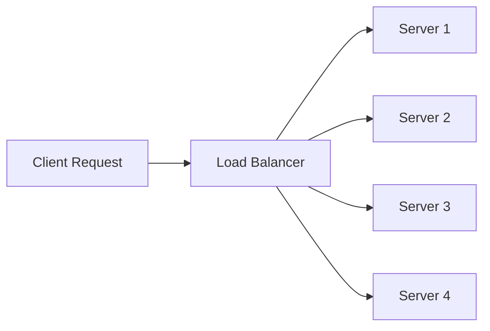

**Types**: L4 (Transport layer), L7 (Application layer), Hardware vs Software (HAProxy, Nginx, AWS ALB/NLB).

#### Caching

Caching stores frequently accessed data in fast storage layers to reduce database load and latency.

| Cache Type | Location | Use Case | Example |
|------------|----------|----------|---------|
| **Client-side** | Browser/App | Static assets, API responses | Service Worker, localStorage |
| **CDN** | Edge servers | Static content delivery | CloudFront, Cloudflare |
| **Application** | In-process memory | Frequently computed results | Guava Cache, LRU Cache |
| **Distributed** | External server | Shared across instances | Redis, Memcached |
| **Database** | DB layer | Query result caching | MySQL query cache |

**Cache Strategies**:
- **Write-through**: Write to cache and DB simultaneously
- **Write-behind**: Write to cache, asynchronously flush to DB
- **Cache-aside (Lazy loading)**: App checks cache first, loads from DB on miss
- **Read-through**: Cache loads data from DB on miss

**Eviction Policies**: LRU (Least Recently Used), LFU (Least Frequently Used), FIFO, TTL-based.

#### CDN (Content Delivery Network)

CDNs cache content at edge locations globally to reduce latency.

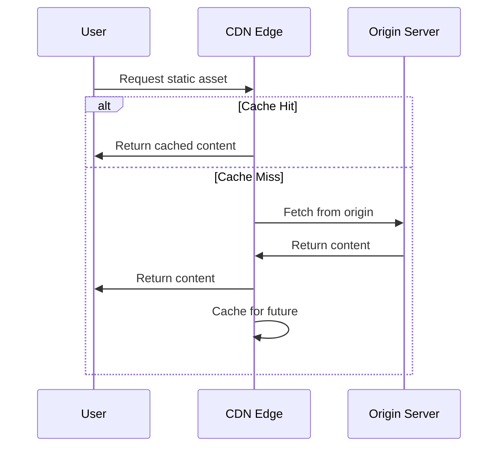

#### Database Sharding

Sharding splits a large database into smaller partitions (shards) distributed across multiple servers.

| Sharding Method | Description | Pros | Cons |
|----------------|-------------|------|------|
| **Range-based** | Shards by value ranges (e.g., A-M, N-Z) | Simple to implement | Hotspots, uneven distribution |
| **Hash-based** | Shards by hash of key | Even distribution | Hard to add new shards |
| **Directory-based** | Lookup table maps keys to shards | Flexible | Single point of failure |
| **Geo-based** | Shards by geographic region | Low latency per region | Uneven data distribution |

#### Replication

Replication copies data across multiple servers for redundancy and performance.

- **Master-Slave**: One master handles writes, slaves handle reads
- **Master-Master**: Multiple masters handle reads and writes (conflict resolution needed)
- **Synchronous**: Master waits for slave acknowledgment before confirming write
- **Asynchronous**: Master confirms write immediately, slaves replicate later

#### Message Queues

Message queues enable asynchronous communication between services.

| Queue | Type | Throughput | Use Case |
|-------|------|------------|----------|
| **Kafka** | Distributed streaming | Very high (millions/sec) | Event streaming, log aggregation |
| **RabbitMQ** | Traditional message broker | High | Task queues, RPC |
| **SQS** | Cloud managed | High | AWS microservices |
| **Redis Streams** | In-memory streaming | High | Real-time data processing |

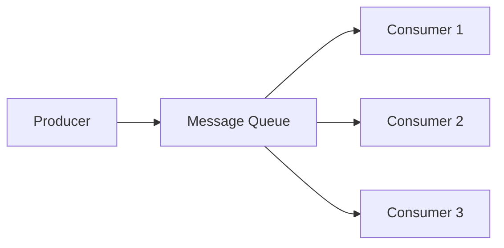

#### Microservices vs Monolith

| Aspect | Monolith | Microservices |
|--------|----------|---------------|
| **Deployment** | Single unit | Independent services |
| **Scaling** | Scale entire app | Scale individual services |
| **Technology** | Single tech stack | Polyglot |
| **Complexity** | Simple initially | Complex but manageable |
| **Fault Isolation** | Failure affects whole app | Failure isolated to service |
| **Team Structure** | Centralized teams | Small, autonomous teams |

#### CAP Theorem

A distributed system can guarantee at most two of three properties:

- **Consistency (C)**: Every read receives the most recent write
- **Availability (A)**: Every request receives a response
- **Partition Tolerance (P)**: System operates despite network partitions

Since network partitions are unavoidable, systems choose between CP (consistent but may be unavailable) or AP (available but may be inconsistent).

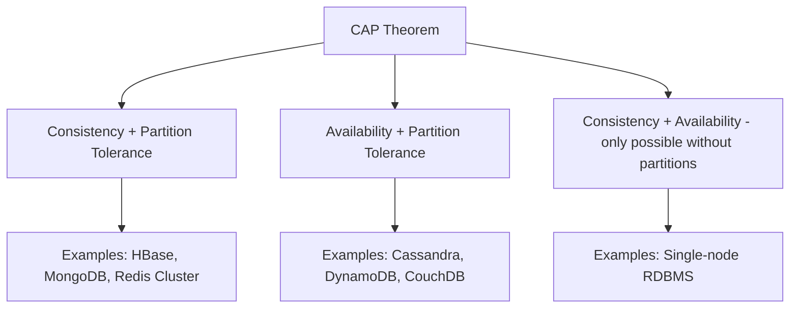

#### Consistent Hashing

Maps both servers and keys to a hash ring, minimizing redistribution when servers are added/removed.

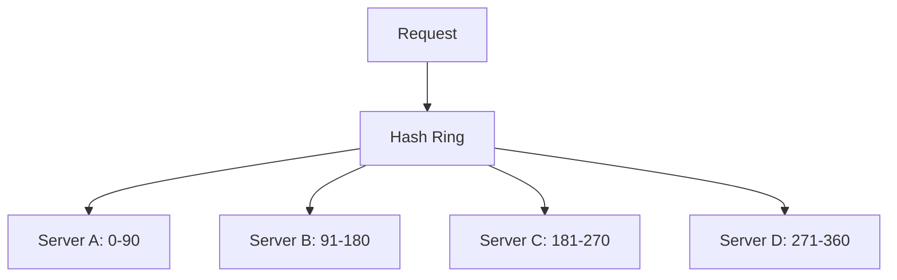

#### Rate Limiting

Controls the number of requests a client can make in a given time window.

| Algorithm | Description |
|-----------|-------------|
| **Token Bucket** | Tokens added at fixed rate, consumed per request |
| **Sliding Window** | Counts requests in rolling time window |
| **Fixed Window** | Counts requests in fixed time periods |
| **Leaky Bucket** | Requests queued, processed at fixed rate |

#### API Gateway

Single entry point for all client requests, handling routing, authentication, rate limiting, and protocol translation.

**Functions**: Request routing, authentication/authorization, rate limiting, load balancing, request/response transformation, logging, monitoring.

### 3.2 Low-Level Design (LLD)

#### Design Patterns

| Pattern | Category | Description |
|---------|----------|-------------|
| **Singleton** | Creational | Ensures only one instance exists |
| **Factory** | Creational | Creates objects without specifying exact class |
| **Abstract Factory** | Creational | Creates families of related objects |
| **Builder** | Creational | Constructs complex objects step by step |
| **Observer** | Behavioral | Defines subscription mechanism for events |
| **Strategy** | Behavioral | Defines family of algorithms, makes them interchangeable |
| **Adapter** | Structural | Converts interface of one class to another |
| **Decorator** | Structural | Adds responsibilities to objects dynamically |
| **Proxy** | Structural | Provides placeholder for another object |
| **Facade** | Structural | Simplifies complex subsystem interface |

#### SOLID Principles

| Principle | Description |
|-----------|-------------|
| **S** - Single Responsibility | Class has one reason to change |
| **O** - Open/Closed | Open for extension, closed for modification |
| **L** - Liskov Substitution | Subtypes must be substitutable for base types |
| **I** - Interface Segregation | No client should depend on methods it doesn't use |
| **D** - Dependency Inversion | Depend on abstractions, not concretions |

#### Class Diagrams & UML

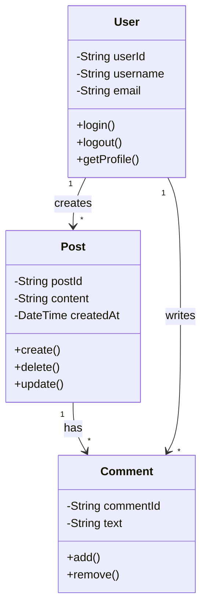

### 3.3 Common System Designs

#### URL Shortener
- **Core**: Generate short URL from long URL, redirect efficiently
- **Storage**: Key-value store mapping short code to long URL
- **Scale**: Billions of URLs, millions of redirects/day

#### Twitter Feed
- **Write-heavy**: Fan-out on write (push model) vs fan-out on read (pull model)
- **Timeline generation**: Merge sorted timelines from followed users
- **Trending**: Real-time aggregation with time decay

#### Instagram
- **Photo upload**: Multi-stage upload pipeline (chunked upload, processing)
- **Feed generation**: Ranked feed with ML, story feed with recency
- **CDN**: Critical for photo/video delivery

#### WhatsApp/Messaging
- **Message delivery**: WebSocket connections, message queues
- **End-to-end encryption**: Signal protocol
- **Presence**: Online/offline status, read receipts

#### Netflix
- **Streaming**: Adaptive bitrate streaming, CDN at scale
- **Recommendation**: ML pipeline with collaborative filtering
- **Content delivery**: Open Connect CDN appliance in ISPs

#### Uber
- **Matching**: Real-time matching of riders and drivers
- **Location tracking**: Geospatial indexing (geohash, quadtree)
- **ETA calculation**: Route optimization, traffic data

#### Amazon E-Commerce
- **Product catalog**: Search with inverted index
- **Cart/Checkout**: Session management, inventory reservation
- **Recommendation**: Collaborative filtering, item-based similarity

---

## 4. Key Concepts

| Concept | Description | When to Use |
|---------|-------------|-------------|
| **Horizontal Scaling** | Add more machines | When vertical limits reached |
| **Vertical Scaling** | Add more power to existing machine | Simple scaling, low complexity |
| **Database Indexing** | B-tree/hash indexes for fast queries | Slow query performance |
| **Connection Pooling** | Reuse DB connections | High concurrency apps |
| **Event Sourcing** | Store state changes as events | Audit trails, time travel |
| **CQRS** | Separate read/write models | Read-heavy systems |
| **Saga Pattern** | Distributed transaction management | Microservices transactions |
| **Circuit Breaker** | Stop calling failing services | Prevent cascade failures |
| **Service Mesh** | Infrastructure for service communication | Complex microservices |
| **Idempotency** | Same operation produces same result | Retry-safe operations |

---

## 5. Frequently Asked Interview Questions

### Beginner

**Q1: What is the difference between horizontal and vertical scaling?**
A: Vertical scaling adds resources (CPU, RAM) to a single server. Horizontal scaling adds more servers. Vertical is simpler but has hardware limits; horizontal is more complex but virtually unlimited.

**Q2: What is a load balancer and why is it needed?**
A: A load balancer distributes incoming traffic across multiple servers. It prevents server overload, improves availability, enables scaling, and provides failover.

**Q3: What is caching and what are common caching strategies?**
A: Caching stores frequently accessed data in faster storage. Common strategies: Write-through (write to cache+DB), Cache-aside (lazy load), Read-through (cache loads from DB), Write-behind (async DB write).

**Q4: What is the difference between SQL and NoSQL databases?**
A: SQL databases are relational with ACID properties and fixed schema. NoSQL databases are non-relational with flexible schemas, optimized for specific data models (document, key-value, graph, columnar).

**Q5: What is a CDN?**
A: Content Delivery Network caches static content at edge servers globally, reducing latency by serving content from the nearest location to users.

### Intermediate

**Q6: Explain the CAP theorem.**
A: A distributed system can provide at most two of three guarantees: Consistency (every read gets latest write), Availability (every request gets response), Partition Tolerance (works despite network failures). Since partitions happen, systems choose CP or AP.

**Q7: What is database sharding and what are its challenges?**
A: Sharding splits a database across multiple servers by key range, hash, or directory. Challenges include: cross-shard queries, hotspots, rebalancing when adding shards, maintaining referential integrity.

**Q8: Compare REST and GraphQL.**
A: REST uses multiple endpoints with fixed data structures. GraphQL uses a single endpoint with client-specified queries. REST is simpler; GraphQL reduces over/under-fetching. REST is cacheable by default; GraphQL needs custom caching.

**Q9: What is consistent hashing and why is it important?**
A: Consistent hashing maps servers and keys to a hash ring. When a server is added/removed, only neighboring keys need remapping. Important for distributed caches (Redis Cluster), load balancing, and partitioning.

**Q10: What are message queues and when should you use them?**
A: Message queues enable asynchronous communication between services. Use for: decoupling services, handling traffic spikes, reliable message delivery, background processing, event-driven architectures.

### Advanced

**Q11: Design a URL shortener.**
A: Use a base62 encoder with a unique ID generator (snowflake or DB auto-increment). Store in key-value store (Redis for hot URLs, DynamoDB for persistence). Use 301 redirects. Add custom aliases, analytics, expiration. Scale with consistent hashing.

**Q12: How would you design Twitter's news feed?**
A: Use hybrid fan-out: fan-out on write for <10K followers, fan-out on read for celebrity accounts. Store feed in Redis sorted sets. Use a merge service for real-time updates. Implement ranking with ML features (recency, engagement, similarity).

**Q13: Explain the saga pattern for distributed transactions.**
A: Saga is a sequence of local transactions where each publishes events triggering the next. If a step fails, compensating transactions undo previous steps. Two implementations: Choreography (event-driven) and Orchestration (central coordinator).

**Q14: How do you handle data consistency in microservices?**
A: Strategies include: Saga pattern for distributed transactions, Event sourcing for audit trails, CQRS for read/write separation, Outbox pattern for reliable event publishing, Two-phase commit for strong consistency (rarely used).

**Q15: Design a real-time notification system.**
A: Use WebSocket connections for real-time delivery. Implement notification service with priority queues (Redis queues or SQS). Support multiple channels (push, email, SMS, in-app). Use notification preferences per user. Handle delivery guarantees with outbox pattern.

### FAANG-Level

**Q16: Design Google Search.**
A: Components: Web Crawler (distributed, polite), Indexer (inverted index, MapReduce), Ranker (PageRank + ML features), Serving layer (index shards, cached results). Use TF-IDF for relevance. Handle billions of pages with MapReduce. Serve millions of queries/second with index replication.

**Q17: Design Uber's real-time location service.**
A: Drivers publish location every 3-5 seconds. Use geohash or quadtree for spatial indexing. Redis for current location storage. Match service queries nearby drivers using spatial queries. Use WebSocket for real-time updates to riders. ETA service uses routing algorithms (A*) with traffic data.

**Q18: Design Netflix's streaming infrastructure.**
A: Content ingestion pipeline: transcoding to multiple formats/resolutions (ABR). Open Connect CDN: appliances in ISPs for local caching. Player: adaptive bitrate selection based on bandwidth. Recommendation engine: collaborative filtering + content-based ML. Metadata service for content catalog.

**Q19: Design a distributed file storage system (like Dropbox).**
A: Client daemon watches filesystem changes. Chunk files into blocks, deduplicate with content hashing. Sync service coordinates uploads via message queue. Metadata service (Cassandra) stores file structure. Block storage (S3/custom) for actual data. Conflict resolution with version vectors.

**Q20: Design WhatsApp/Messenger's messaging system.**
A: WebSocket connections for each user. Message flow: sender → server → recipient (with delivery receipts). Use message queues (Kafka) for offline users. End-to-end encryption with Signal protocol. Media stored in object storage with CDN. Presence service tracks online status. Group messaging with fan-out.

---

## 6. Hands-on Practice

### Exercise 1: Design a Rate Limiter
Design a rate limiter supporting:
- Multiple algorithms (token bucket, sliding window)
- Per-user and per-endpoint limits
- Distributed rate limiting across servers
- HTTP 429 response with retry-after header

### Exercise 2: Design a Notification System
Design a system that supports:
- Multiple channels (push, email, SMS)
- User notification preferences
- Rate limiting per user
- Delivery tracking and retry logic

### Exercise 3: Design a Web Crawler
Design a crawler that:
- Discovers and downloads web pages at scale
- Respects robots.txt
- Handles duplicate URLs
- Stores and indexes content
- Politeness (rate limiting per domain)

### Exercise 4: Design a Search Autocomplete
Design autocomplete that:
- Provides suggestions as user types
- Ranks by popularity and relevance
- Updates suggestions in real-time
- Handles billions of queries

---

## 7. Real FAANG System Design Problems

### Problem 1: Design Instagram's Photo Sharing

**Requirements**: Upload photos, follow users, see feed, like/comment, stories

**Architecture**:
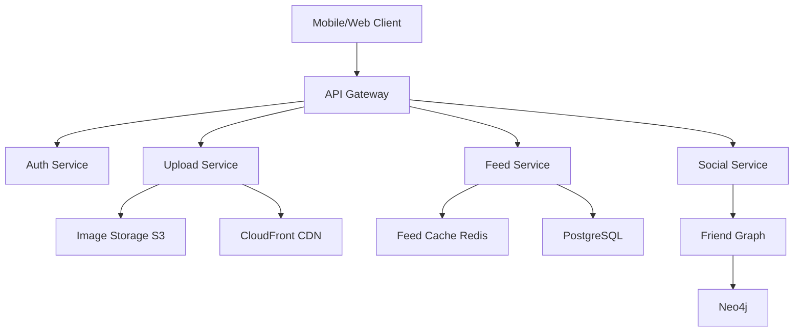

**Key decisions**: Fan-out on write for feed, CDN for photos, separate services for social graph and content.

### Problem 2: Design Uber's Ride Matching

**Requirements**: Request ride, match with driver, track location, payment

**Architecture**:
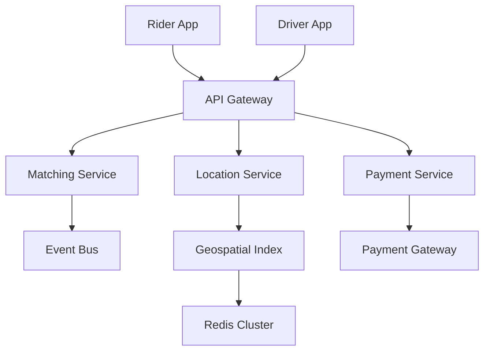

**Key decisions**: Geohash for spatial indexing, WebSocket for real-time location, event-driven matching.

### Problem 3: Design a Chat System (Slack-like)

**Requirements**: Channels, direct messages, file sharing, search, notifications

**Architecture**: WebSocket for real-time, message queues for offline delivery, Elasticsearch for search, S3 for file storage.

### Problem 4: Design YouTube

**Requirements**: Upload videos, stream content, recommendations, comments

**Architecture**: Multi-stage upload pipeline, transcoding service, CDN for streaming, ML pipeline for recommendations.

### Problem 5: Design a Distributed Cache

**Requirements**: High throughput, low latency, consistent hashing, replication

**Architecture**: Consistent hashing ring, replication factor 3, gossip protocol for membership, LRU eviction.

---

## 8. Common Mistakes

| # | Mistake | Why It's Bad | What to Do |
|---|---------|--------------|------------|
| 1 | Jumping into solution without clarifying requirements | May solve the wrong problem | Spend 5 min clarifying scope |
| 2 | Ignoring non-functional requirements | Missing scalability, reliability | Explicitly discuss SLAs |
| 3 | Over-engineering | Wastes time, adds complexity | Start simple, iterate |
| 4 | Not considering failure modes | System fails in production | Discuss fault tolerance |
| 5 | Choosing wrong database | Performance issues later | Match DB to access patterns |
| 6 | Ignoring data model | Schema design affects everything | Design data model first |
| 7 | No discussion of trade-offs | Shows shallow understanding | Always discuss pros/cons |
| 8 | Skipping capacity estimation | Can't justify architecture choices | Estimate QPS, storage, bandwidth |
| 9 | Forgetting about security | Vulnerabilities in production | Discuss auth, encryption, rate limiting |
| 10 | Not using diagrams | Hard to communicate design | Draw architecture diagrams |

---

## 9. Best Practices

1. **Start with requirements**: Functional + Non-functional (SLA, scale, latency)
2. **Estimate capacity**: QPS, storage, bandwidth numbers
3. **Design data model first**: Schema drives architecture decisions
4. **Start high-level**: Draw boxes and arrows before details
5. **Discuss trade-offs**: Every decision has pros and cons
6. **Address bottlenecks**: Identify and solve hotspots
7. **Consider evolution**: How will the system grow?
8. **Think about operations**: Monitoring, logging, alerting
9. **Security by design**: Auth, encryption, rate limiting from start
10. **Communicate clearly**: Explain reasoning, ask for feedback

---

## 10. Cheat Sheet

```
┌─────────────────────────────────────────────────────────────┐
│                    SYSTEM DESIGN CHEAT SHEET                │
├─────────────────────────────────────────────────────────────┤
│ CAP: Consistency, Availability, Partition Tolerance (pick 2)│
│ Scaling: Horizontal (more machines) vs Vertical (bigger)   │
│ Load Balancing: Round Robin, Least Connections, IP Hash     │
│ Caching: Write-through, Write-behind, Cache-aside           │
│ Sharding: Range, Hash, Directory-based                      │
│ Replication: Master-Slave, Master-Master, Sync/Async        │
│ Queue: Kafka (streaming), RabbitMQ (traditional)            │
│ DB: SQL (ACID), NoSQL (BASE, scale)                         │
│ Rate Limiting: Token Bucket, Sliding Window                 │
│ Patterns: Singleton, Factory, Observer, Strategy, Adapter   │
│ Principles: SOLID (SRP, OCP, LSP, ISP, DIP)               │
│ Protocols: HTTP, WebSocket, gRPC, MQTT                      │
│ Storage: S3, HDFS, Cassandra, DynamoDB, MongoDB             │
│ Cache: Redis (rich), Memcached (simple)                     │
│ Search: Elasticsearch, Solr                                 │
│ CDN: CloudFront, Cloudflare, Akamai                         │
│ Monitoring: Prometheus, Grafana, Jaeger, ELK                │
└─────────────────────────────────────────────────────────────┘
```

---

## 11. Flash Cards

### Q1: What is the CAP theorem?
**A**: Distributed systems can guarantee at most 2 of 3: Consistency, Availability, Partition Tolerance. Since partitions are inevitable, choose CP (consistent) or AP (available).

### Q2: What is consistent hashing?
**A**: Maps servers and keys to a hash ring. When a server is added/removed, only neighboring keys are redistributed, minimizing data movement.

### Q3: Difference between L4 and L7 load balancing?
**A**: L4 operates at transport layer (TCP/UDP) - faster but less intelligent. L7 operates at application layer (HTTP) - can route based on content, headers, URL.

### Q4: What is the saga pattern?
**A**: A sequence of local transactions where each publishes events triggering the next. Compensating transactions handle failures by undoing previous steps.

### Q5: What is CQRS?
**A**: Command Query Responsibility Segregation separates read and write models, allowing independent optimization and scaling of each.

### Q6: What is event sourcing?
**A**: Instead of storing current state, store all state-changing events. Current state is derived by replaying events. Provides full audit trail and time travel.

### Q7: What is the difference between Redis and Memcached?
**A**: Redis supports data structures (lists, sets, hashes), persistence, pub/sub, Lua scripting. Memcached is simpler, faster for pure key-value, multithreaded.

### Q8: What is a circuit breaker?
**A**: Monitors service calls and stops calling a failing service after threshold is exceeded, preventing cascade failures. Periodically tests if service has recovered.

### Q9: What is the outbox pattern?
**A**: Write events to an outbox table in the same transaction as business data, then publish asynchronously. Ensures reliable event publishing without dual writes.

### Q10: What is database connection pooling?
**A**: Maintains a pool of reusable database connections. Avoids overhead of creating new connections per request. Configured with min/max connections and timeout.

---

## 12. Mind Map

```
System Design
├── Fundamentals
│   ├── Networking (DNS, HTTP, TCP/IP)
│   ├── Operating Systems (Threads, Memory, I/O)
│   ├── Databases (SQL, NoSQL, Indexing)
│   └── Data Structures (Hash Maps, Trees, Queues)
├── High-Level Design
│   ├── Load Balancing
│   │   ├── Algorithms
│   │   ├── L4 vs L7
│   │   └── Health Checks
│   ├── Caching
│   │   ├── Strategies
│   │   ├── Eviction Policies
│   │   └── Tools (Redis, Memcached)
│   ├── Database
│   │   ├── Sharding
│   │   ├── Replication
│   │   ├── Partitioning
│   │   └── Indexing
│   ├── Message Queues
│   │   ├── Kafka
│   │   ├── RabbitMQ
│   │   └── SQS
│   ├── CDN
│   └── API Design
├── Low-Level Design
│   ├── Design Patterns
│   │   ├── Creational
│   │   ├── Structural
│   │   └── Behavioral
│   ├── SOLID Principles
│   ├── UML Diagrams
│   └── Class Design
├── Distributed Systems
│   ├── CAP Theorem
│   ├── Consistency Models
│   ├── Consensus (Paxos, Raft)
│   └── Fault Tolerance
├── Common Systems
│   ├── URL Shortener
│   ├── Chat System
│   ├── Social Media Feed
│   ├── E-commerce
│   ├── Search Engine
│   └── Video Streaming
└── Operational
    ├── Monitoring
    ├── Logging
    ├── Alerting
    └── Deployment
```

---

## 13. Mermaid Diagrams

### URL Shortener Architecture

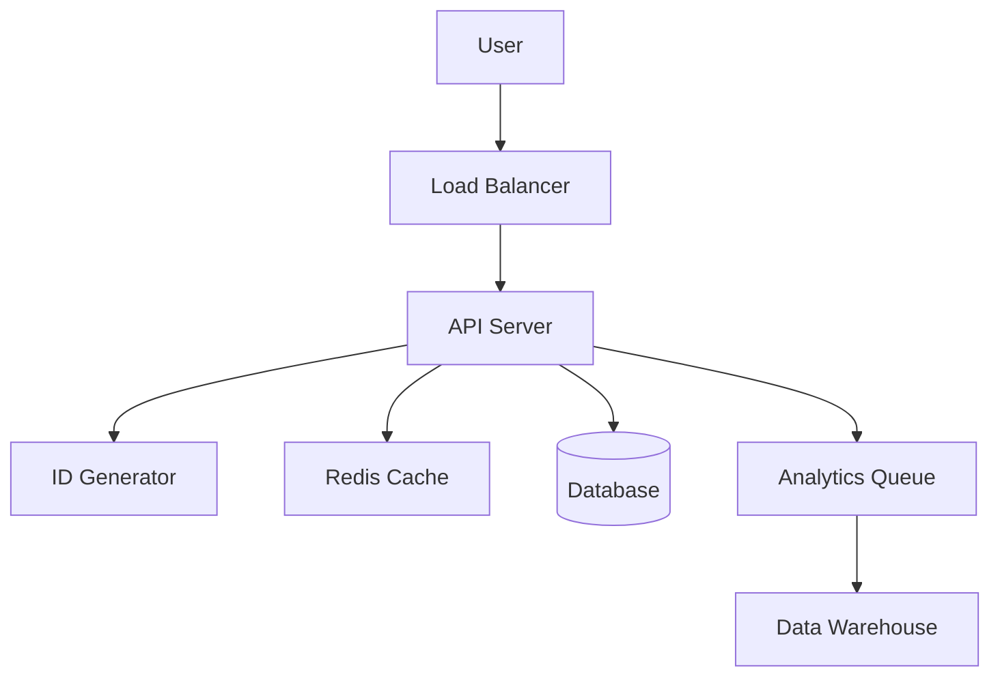

### Chat System Architecture

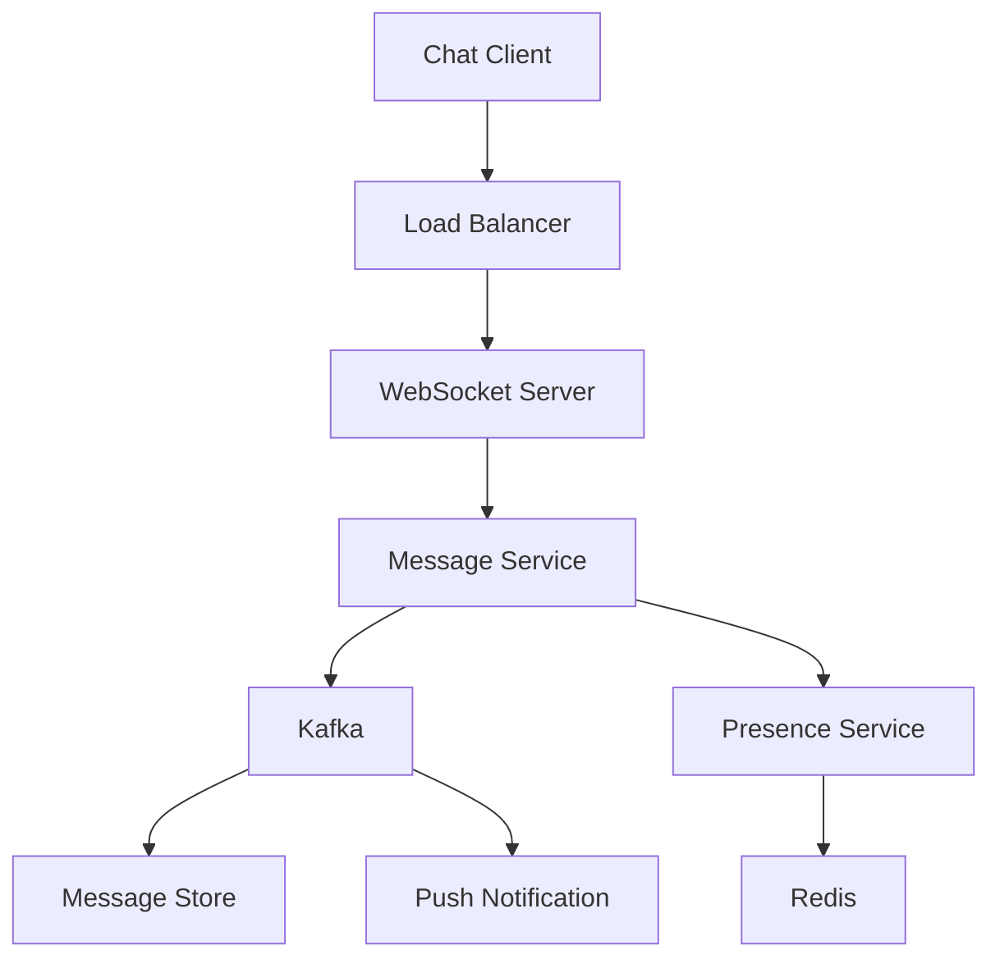

### Microservices Communication

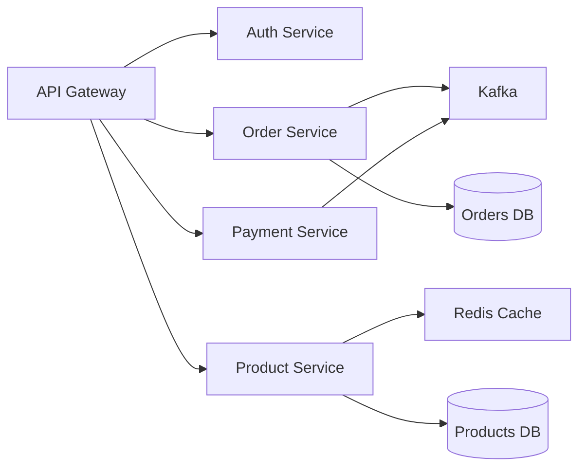

---

## 14. Code Examples

### Rate Limiter (Token Bucket)

```python
import time
import threading

class TokenBucket:
    def __init__(self, capacity, refill_rate):
        self.capacity = capacity
        self.tokens = capacity
        self.refill_rate = refill_rate
        self.last_refill = time.time()
        self.lock = threading.Lock()
    
    def consume(self):
        with self.lock:
            self._refill()
            if self.tokens > 0:
                self.tokens -= 1
                return True
            return False
    
    def _refill(self):
        now = time.time()
        elapsed = now - self.last_refill
        tokens_to_add = elapsed * self.refill_rate
        self.tokens = min(self.capacity, self.tokens + tokens_to_add)
        self.last_refill = now
```

### LRU Cache

```python
from collections import OrderedDict

class LRUCache:
    def __init__(self, capacity):
        self.capacity = capacity
        self.cache = OrderedDict()
    
    def get(self, key):
        if key not in self.cache:
            return -1
        self.cache.move_to_end(key)
        return self.cache[key]
    
    def put(self, key, value):
        if key in self.cache:
            self.cache.move_to_end(key)
        self.cache[key] = value
        if len(self.cache) > self.capacity:
            self.cache.popitem(last=False)
```

### Consistent Hashing

```python
import hashlib
import bisect

class ConsistentHash:
    def __init__(self, nodes, replicas=100):
        self.replicas = replicas
        self.ring = {}
        self.sorted_keys = []
        for node in nodes:
            self.add_node(node)
    
    def add_node(self, node):
        for i in range(self.replicas):
            key = self._hash(f"{node}:{i}")
            self.ring[key] = node
            bisect.insort(self.sorted_keys, key)
    
    def remove_node(self, node):
        for i in range(self.replicas):
            key = self._hash(f"{node}:{i}")
            del self.ring[key]
            self.sorted_keys.remove(key)
    
    def get_node(self, key):
        if not self.ring:
            return None
        h = self._hash(key)
        idx = bisect.bisect_right(self.sorted_keys, h) % len(self.sorted_keys)
        return self.ring[self.sorted_keys[idx]]
    
    def _hash(self, key):
        return int(hashlib.md5(key.encode()).hexdigest(), 16)
```

### Factory Pattern

```python
from abc import ABC, abstractmethod

class Notification(ABC):
    @abstractmethod
    def send(self, message: str):
        pass

class EmailNotification(Notification):
    def send(self, message: str):
        print(f"Sending email: {message}")

class SMSNotification(Notification):
    def send(self, message: str):
        print(f"Sending SMS: {message}")

class PushNotification(Notification):
    def send(self, message: str):
        print(f"Sending push: {message}")

class NotificationFactory:
    @staticmethod
    def create(notification_type: str) -> Notification:
        if notification_type == "email":
            return EmailNotification()
        elif notification_type == "sms":
            return SMSNotification()
        elif notification_type == "push":
            return PushNotification()
        raise ValueError(f"Unknown type: {notification_type}")
```

---

## 15. Mini Project - URL Shortener

### Requirements
- Shorten URLs to 7-character codes
- Redirect short URLs to original
- Custom aliases
- URL expiration
- Analytics (click count, location)

### Architecture

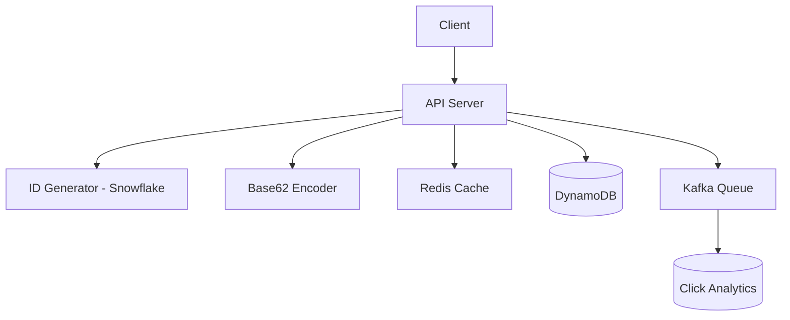

### Database Schema

```sql
CREATE TABLE urls (
    short_code VARCHAR(7) PRIMARY KEY,
    long_url TEXT NOT NULL,
    user_id UUID,
    created_at TIMESTAMP DEFAULT NOW(),
    expires_at TIMESTAMP,
    click_count BIGINT DEFAULT 0
);

CREATE INDEX idx_long_url ON urls(long_url);
CREATE INDEX idx_user ON urls(user_id);
```

### API Design

| Method | Endpoint | Description |
|--------|----------|-------------|
| POST | `/api/shorten` | Create short URL |
| GET | `/{shortCode}` | Redirect to long URL |
| GET | `/{shortCode}/stats` | Get analytics |
| DELETE | `/{shortCode}` | Delete short URL |

---

## 16. Intermediate Project - Chat Application

### Requirements
- 1:1 and group messaging
- Online/offline status
- Message delivery receipts
- File sharing
- Message history

### Architecture

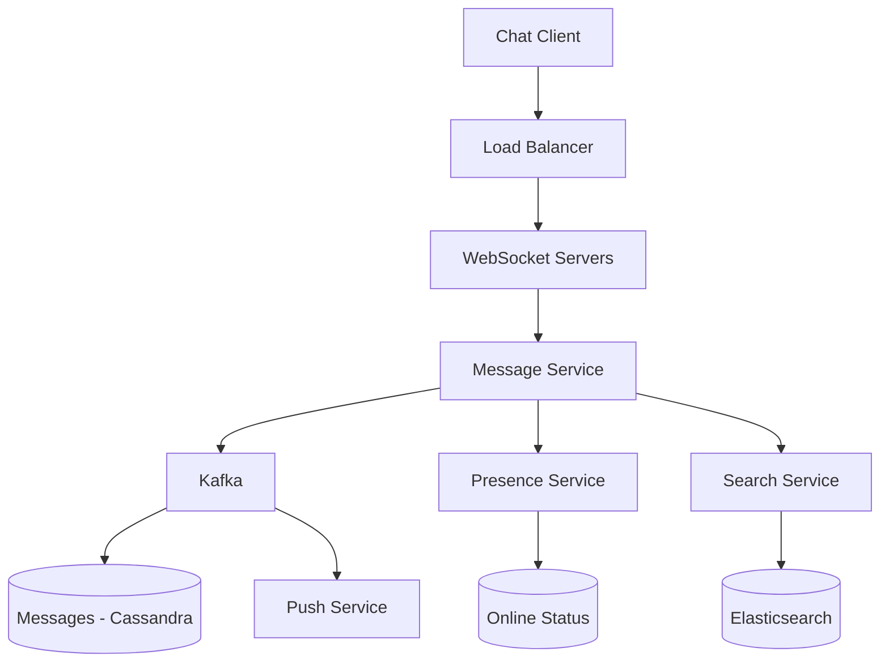

---

## 17. Advanced Project - Distributed File Storage

### Requirements
- Store files up to 1GB
- File sync across devices
- Version history
- Conflict resolution
- File sharing with permissions

### Architecture

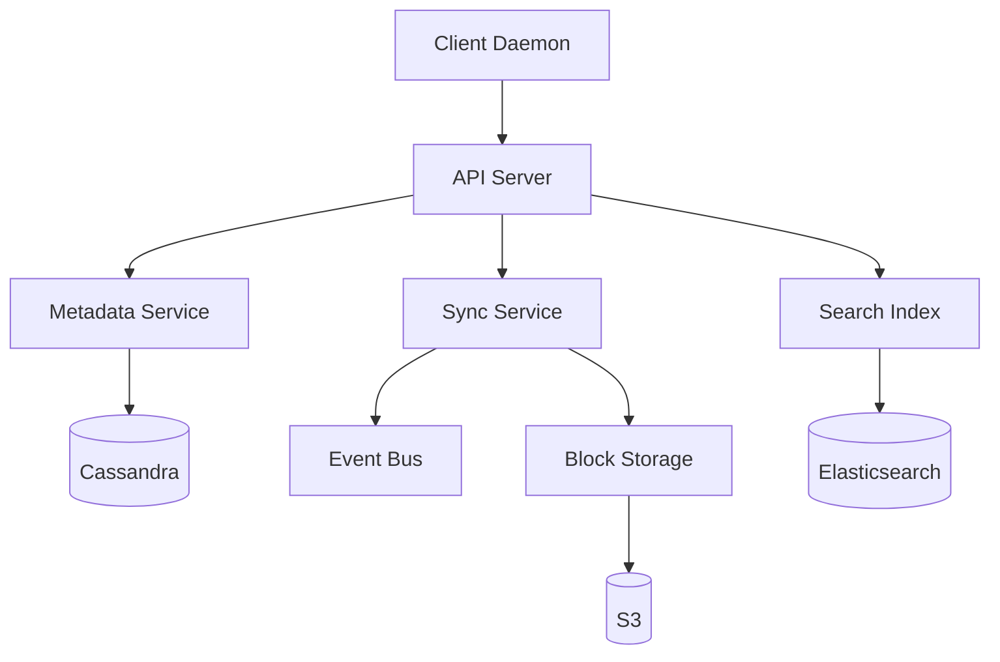

### Key Design Decisions
- Chunk files into 4MB blocks
- Content-addressable storage (SHA-256 hash)
- Merkle tree for efficient sync
- Vector clocks for conflict detection
- Erasure coding for durability

---

## 18. 10 Project Ideas

| # | Project | Complexity | Key Concepts |
|---|---------|------------|--------------|
| 1 | URL Shortener | Beginner | Hashing, key-value store, caching |
| 2 | Rate Limiter | Beginner | Token bucket, sliding window |
| 3 | Web Crawler | Intermediate | BFS, robots.txt, deduplication |
| 4 | Chat Application | Intermediate | WebSocket, message queues |
| 5 | News Feed System | Intermediate | Fan-out, ranking, caching |
| 6 | Search Autocomplete | Intermediate | Trie, ranking, real-time |
| 7 | Video Streaming | Advanced | CDN, transcoding, adaptive bitrate |
| 8 | Ride Sharing | Advanced | Geospatial, matching, real-time |
| 9 | Distributed Cache | Advanced | Consistent hashing, replication |
| 10 | Distributed File Storage | Expert | Chunking, sync, conflict resolution |

---

## 19. Practice Websites

| Website | Description |
|---------|-------------|
| [SystemDesign.io](https://systemdesign.io) | System design practice platform |
| [Educative - Grokking System Design](https://educative.io) | Structured course with exercises |
| [LeetCode System Design](https://leetcode.com) | System design interview prep |
| [Mock Interviews on Pramp](https://pramp.com) | Free peer mock interviews |
| [Excalidraw](https://excalidraw.com) | Drawing architecture diagrams |
| [db-fiddle.com](https://db-fiddle.com) | Database schema prototyping |
| [HiredInTech](https://www.hiredintech.com/system-design) | System design crash course |
| [ByteByteGo](https://bytebytego.com) | Visual system design explanations |
| [System Design Primer (GitHub)](https://github.com/donnemartin/system-design-primer) | Comprehensive study guide |
| [Grokking the System Design Interview](https://www.educative.io) | Popular interview prep course |

---

## 20. Books

| Book | Author | Level | Focus |
|------|--------|-------|-------|
| **Designing Data-Intensive Applications** | Martin Kleppmann | Advanced | Distributed systems, storage, stream processing |
| **System Design Interview (Vol 1 & 2)** | Alex Xu | Intermediate | FAANG interview patterns |
| **Understanding Distributed Systems** | Roberto Vitillo | Intermediate | Core distributed systems concepts |
| **System Design Interview: A Developer's Guide** | Sanjay Ghemawat | Advanced | Google-scale system design |
| **Building Microservices** | Sam Newman | Intermediate | Microservices architecture |
| **Microservices Patterns** | Chris Richardson | Advanced | Microservices design patterns |
| **Database Internals** | Alex Petrov | Advanced | Storage engines, distributed databases |
| **Distributed Systems** | Maarten van Steen | Advanced | Academic distributed systems |
| **The System Design Guide** | Dan Koe | Beginner | High-level system design concepts |
| **Architecture of Open Source Applications** | Various | Intermediate | Real-world system architectures |

---

## 21. Documentation Links

| Topic | URL |
|-------|-----|
| AWS Well-Architected Framework | https://aws.amazon.com/architecture/well-architected/ |
| Google Cloud Architecture Framework | https://cloud.google.com/architecture/framework |
| System Design Primer | https://github.com/donnemartin/system-design-primer |
| Martin Fowler's Blog | https://martinfowler.com |
| High Scalability Blog | http://highscalability.com |
| AWS Architecture Center | https://aws.amazon.com/architecture/ |
| Azure Architecture Center | https://learn.microsoft.com/en-us/azure/architecture/ |
| Kubernetes Documentation | https://kubernetes.io/docs/ |
| Redis Documentation | https://redis.io/documentation/ |
| Apache Kafka Documentation | https://kafka.apache.org/documentation/ |

---

## 22. YouTube Channels

| Channel | Focus |
|---------|-------|
| Gaurav Sen | System design concepts and interview prep |
| ByteByteGo (Alex Xu) | Visual explanations of system design |
| System Design Interview | Mock interviews and walkthroughs |
| Tech Dummies Narendra L | System design for interviews |
| Hussein Nasser | Networking and distributed systems |
| Fireship | Quick overviews of technologies |
| The Primeagen | Engineering culture and systems |
| Engineering at Meta | Real-world system design at scale |
| Netflix Tech Blog | Video streaming architecture |
| Uber Engineering Blog | Ride-sharing system design |

---

## 23. Blogs

| Blog | Focus |
|------|-------|
| High Scalability | Real-world system architecture case studies |
| Netflix Tech Blog | Streaming, ML, infrastructure |
| Uber Engineering Blog | Ride-sharing, mapping, payments |
| Airbnb Engineering Blog | Travel platform, ML, infrastructure |
| Meta Engineering | Social networking at scale |
| AWS Architecture Blog | Cloud architecture patterns |
| Google Cloud Blog | Distributed systems, ML infrastructure |
| Martin Fowler | Software architecture patterns |
| InfoQ | Enterprise architecture and design |
| DZone | Technology tutorials and guides |

---

## 24. Certifications

| Certification | Provider | Level |
|---------------|----------|-------|
| AWS Solutions Architect Associate | Amazon | Intermediate |
| AWS Solutions Architect Professional | Amazon | Advanced |
| Google Cloud Professional Architect | Google | Advanced |
| Azure Solutions Architect Expert | Microsoft | Advanced |
| Certified Kubernetes Administrator | CNCF | Intermediate |
| HashiCorp Terraform Associate | HashiCorp | Intermediate |
| Confluent Certified Developer for Apache Kafka | Confluent | Intermediate |
| MongoDB Certified Developer | MongoDB | Intermediate |
| Redis Certified Developer | Redis | Intermediate |

---

## 25. Checklist

- [ ] Understand basic networking (TCP/IP, HTTP, DNS)
- [ ] Learn OS fundamentals (threads, memory, I/O)
- [ ] Master database concepts (SQL, NoSQL, indexing)
- [ ] Study load balancing algorithms
- [ ] Understand caching strategies
- [ ] Learn database sharding techniques
- [ ] Study message queue patterns
- [ ] Understand CAP theorem
- [ ] Learn consistent hashing
- [ ] Study design patterns (Singleton, Factory, Observer, Strategy)
- [ ] Master SOLID principles
- [ ] Practice drawing architecture diagrams
- [ ] Complete 5 system design problems
- [ ] Complete 10 system design problems
- [ ] Practice mock interviews
- [ ] Study FAANG system design cases
- [ ] Build mini projects (URL shortener, chat app)
- [ ] Read "Designing Data-Intensive Applications"
- [ ] Read "System Design Interview" by Alex Xu
- [ ] Learn about microservices patterns
- [ ] Study event-driven architecture
- [ ] Understand rate limiting algorithms
- [ ] Learn about service mesh and API gateways
- [ ] Practice explaining designs clearly
- [ ] Review common interview mistakes

---

## 26. Revision Notes

### Key Formulas
- **Little's Law**: L = λW (concurrent users = arrival rate × avg response time)
- **Amdahl's Law**: Speedup = 1 / ((1-p) + p/s) where p = parallelizable fraction, s = speedup
- **Knee point**: When adding resources provides diminishing returns

### Quick Reference

| Problem | Solution |
|---------|----------|
| Read-heavy | Caching, CDN, read replicas |
| Write-heavy | Sharding, write-behind cache, event sourcing |
| High availability | Replication, failover, circuit breakers |
| Low latency | Caching, CDN, connection pooling |
| Data consistency | Sagas, event sourcing, CQRS |
| Real-time | WebSocket, SSE, message queues |
| Search | Elasticsearch, inverted index, Trie |

---

## 27. One-Day Revision Plan

| Time | Topic |
|------|-------|
| 9:00 - 9:30 | Quick review: CAP theorem, consistency models |
| 9:30 - 10:00 | Load balancing and caching strategies |
| 10:00 - 10:30 | Database sharding and replication |
| 10:30 - 11:00 | Message queues and event-driven architecture |
| 11:00 - 11:30 | Design patterns (Singleton, Factory, Observer, Strategy) |
| 11:30 - 12:00 | SOLID principles review |
| 1:00 - 2:00 | Practice: Design a URL shortener (20 min) + review (10 min) |
| 2:00 - 3:00 | Practice: Design a chat system (20 min) + review (10 min) |
| 3:00 - 4:00 | Practice: Design a news feed (20 min) + review (10 min) |
| 4:00 - 5:00 | Review common interview questions and mistakes |

---

## 28. One-Week Revision Plan

| Day | Morning (2h) | Afternoon (2h) | Evening (1h) |
|-----|-------------|----------------|--------------|
| **Mon** | CAP theorem, Consistency | Load Balancing, Caching | Flash cards review |
| **Tue** | Database Sharding, Replication | Message Queues, Kafka | Practice: URL shortener |
| **Wed** | Design Patterns | SOLID Principles | Practice: Chat app |
| **Thu** | Microservices patterns | Event-driven architecture | Practice: News feed |
| **Mon** | Consistent Hashing, Rate Limiting | API Gateway, Service Mesh | Practice: Uber design |
| **Fri** | FAANG case studies (3) | FAANG case studies (3) | Review mistakes |
| **Sat** | Mock interview 1 | Mock interview 2 | Review feedback |
| **Sun** | Full practice problem | Weak areas review | Final checklist |

---

## 29. Mock Interview Sessions

### Session 1: Design a URL Shortener (45 min)

**Interviewer**: Design a URL shortener like bit.ly. It should handle 100M URLs created per day and 1B redirects per day.

**Candidate Framework**:
1. **Requirements clarification** (5 min): Read-heavy (100:1 ratio), URL expiry needed, analytics optional
2. **Capacity estimation** (5 min): 100M/day write → ~1200 writes/sec, 1B/day read → ~12K reads/sec, Storage: 100M × 365 × 5 years × 500 bytes = ~91TB
3. **High-level design** (15 min): API → ID Generator → Encoder → Cache → DB
4. **Deep dive** (15 min): Base62 encoding, Snowflake ID, cache strategy, database choice
5. **Wrap up** (5 min): Discuss trade-offs, monitoring, scaling strategy

### Session 2: Design a Chat Application (45 min)

**Interviewer**: Design WhatsApp/Messenger supporting 500M daily active users.

**Candidate Framework**:
1. Requirements: 1:1 + group chat, presence, delivery receipts, media sharing
2. Capacity: ~50M concurrent connections, ~10B messages/day
3. Design: WebSocket connections, Message service, Kafka for async processing, Cassandra for storage
4. Deep dive: Connection management, message ordering, offline handling
5. Wrap up: End-to-end encryption, scaling strategy

### Session 3: Design a News Feed (45 min)

**Interviewer**: Design Twitter's news feed supporting 300M users.

**Candidate Framework**:
1. Requirements: Post tweets, follow users, see feed, trending topics
2. Design: Fan-out on write for normal users, fan-out on read for celebrities
3. Deep dive: Feed ranking, cache strategy, trending algorithm
4. Data model: Users, Tweets, Follow relationships, Feed cache

### Session 4: Design Uber (45 min)

**Interviewer**: Design Uber's ride-matching system.

**Candidate Framework**:
1. Requirements: Request ride, match drivers, track location, payment
2. Design: Geospatial indexing with geohash, WebSocket for location, matching service
3. Deep dive: Spatial queries, ETA calculation, surge pricing

### Session 5: Design a Distributed Cache (45 min)

**Interviewer**: Design Redis-like distributed cache from scratch.

**Candidate Framework**:
1. Requirements: High throughput, low latency, consistency options
2. Design: Consistent hashing ring, replication, gossip protocol
3. Deep dive: Eviction policies, failure detection, rebalancing

---

## 30. Difficulty Rating

| Topic | Difficulty | Importance |
|-------|------------|------------|
| Load Balancing | ⭐⭐ | 🔴 Critical |
| Caching | ⭐⭐ | 🔴 Critical |
| Database Sharding | ⭐⭐⭐ | 🔴 Critical |
| CAP Theorem | ⭐⭐⭐ | 🔴 Critical |
| Consistent Hashing | ⭐⭐⭐ | 🟡 High |
| Message Queues | ⭐⭐ | 🔴 Critical |
| Rate Limiting | ⭐⭐ | 🟡 High |
| Design Patterns | ⭐⭐⭐ | 🔴 Critical |
| SOLID Principles | ⭐⭐ | 🔴 Critical |
| Microservices | ⭐⭐⭐⭐ | 🟡 High |
| Event Sourcing | ⭐⭐⭐⭐ | 🟡 High |
| CQRS | ⭐⭐⭐⭐ | 🟡 High |
| Consensus (Paxos/Raft) | ⭐⭐⭐⭐⭐ | 🟢 Medium |
| CRDTs | ⭐⭐⭐⭐⭐ | 🟢 Medium |

---

## 31. Summary

System design interviews test your ability to architect scalable, reliable, and efficient systems. Key takeaways:

- **Start with requirements** - Never jump into solution without understanding the problem
- **Think systematically** - Capacity estimation → High-level design → Deep dive → Trade-offs
- **Communicate clearly** - Draw diagrams, explain reasoning, discuss alternatives
- **Know your building blocks** - Load balancing, caching, sharding, queues, and their trade-offs
- **Practice consistently** - Design real systems, do mock interviews, review case studies
- **Read widely** - DDIA, Alex Xu's books, tech blogs from FAANG companies

---

## 32. Revision Checklist

- [ ] Can explain CAP theorem with examples
- [ ] Can design a URL shortener from scratch
- [ ] Can compare SQL vs NoSQL and choose appropriately
- [ ] Can explain consistent hashing with diagram
- [ ] Can implement a rate limiter (token bucket)
- [ ] Can design a chat system with WebSocket
- [ ] Can explain event-driven architecture patterns
- [ ] Can apply SOLID principles in LLD
- [ ] Can use design patterns appropriately
- [ ] Can estimate capacity for a given system
- [ ] Can draw architecture diagrams clearly
- [ ] Can discuss trade-offs for every decision
- [ ] Can explain database sharding strategies
- [ ] Can design a notification system
- [ ] Can explain microservices vs monolith trade-offs
- [ ] Can handle real-time data with WebSocket/SSE
- [ ] Can design a caching strategy for a system
- [ ] Can explain message queue use cases (Kafka vs RabbitMQ)
- [ ] Can complete a system design problem in 45 minutes
- [ ] Can answer FAANG-level system design questions

---

## 33. Practice Tasks

1. **Daily**: Solve one system design problem (25 min design + 20 min review)
2. **Weekly**: Read one tech blog post from Netflix/Uber/Airbnb engineering
3. **Weekly**: Practice drawing architecture diagrams in Excalidraw
4. **Bi-weekly**: Do one mock interview with a friend or on Pramp
5. **Monthly**: Complete one mini-project (URL shortener, rate limiter, chat app)
6. **Monthly**: Review and update your system design notes
7. **Read**: Complete one chapter of DDIA or Alex Xu per week
8. **Write**: Document your design decisions for each practice problem

---

## 34. Next Topic

**[API Design](../43-API-Design/README.md)** - Learn RESTful API design, GraphQL, gRPC, and API versioning strategies.

---

## 35. References

1. Martin Kleppmann - *Designing Data-Intensive Applications*
2. Alex Xu - *System Design Interview* (Volumes 1 & 2)
3. Sam Newman - *Building Microservices*
4. Chris Richardson - *Microservices Patterns*
5. System Design Primer - https://github.com/donnemartin/system-design-primer
6. ByteByteGo Newsletter - https://bytebytego.com
7. High Scalability - http://highscalability.com
8. Martin Fowler - https://martinfowler.com
9. AWS Architecture Center - https://aws.amazon.com/architecture/
10. Google Cloud Architecture Framework - https://cloud.google.com/architecture/framework

---

> **Last Updated**: July 2026 | **Maintained by**: Interview Preparation Repository

