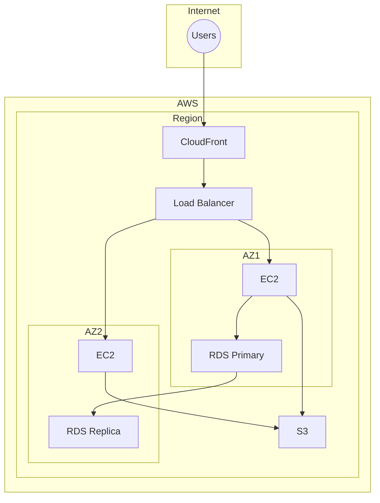
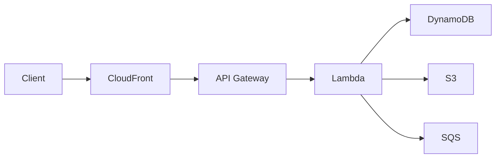

---

## Table of Contents

1. [Introduction](#1-introduction)
2. [Learning Roadmap](#2-learning-roadmap)
3. [Theory Notes](#3-theory-notes)
4. [Key Concepts](#4-key-concepts)
5. [Interview Questions & Answers](#5-interview-questions--answers)
6. [Hands-on Practice](#6-hands-on-practice)
7. [FAANG Interview Questions](#7-faang-interview-questions)
8. [Common Mistakes to Avoid](#8-common-mistakes-to-avoid)
9. [Best Practices](#9-best-practices)
10. [Cheat Sheet](#10-cheat-sheet)
11. [Flash Cards](#11-flash-cards)
12. [Mind Map](#12-mind-map)
13. [Mermaid Diagrams](#13-mermaid-diagrams)
14. [Code Examples](#14-code-examples)
15. [Projects & Ideas](#15-projects--ideas)
16. [Resources](#16-resources)
17. [Interview Preparation Checklist](#17-interview-preparation-checklist)
18. [Revision Notes](#18-revision-notes)
19. [Mock Interview Questions](#19-mock-interview-questions)
20. [Difficulty Rating](#20-difficulty-rating)
21. [Summary](#21-summary)

---

## 1. Introduction

Cloud Computing is the delivery of computing resources (servers, storage, databases, networking, software) over the internet on a pay-as-you-go basis. Major providers include AWS, Azure, and Google Cloud. Cloud knowledge is essential for modern software engineering, DevOps, and architecture roles.

### Why Cloud Computing Matters

- **Scalability** — Scale resources up/down on demand
- **Cost efficiency** — Pay only for what you use
- **Global reach** — Deploy anywhere in the world
- **Innovation** — Access to managed services (AI, ML, IoT)
- **Interview relevance** — Expected knowledge for most tech roles

### Cloud Service Models

| Model | Description | Examples |
|-------|-------------|----------|
| IaaS | Infrastructure as a Service | EC2, Azure VMs, GCE |
| PaaS | Platform as a Service | Heroku, App Engine, Elastic Beanstalk |
| SaaS | Software as a Service | Gmail, Salesforce, Slack |
| FaaS | Function as a Service (Serverless) | Lambda, Azure Functions, Cloud Functions |

---

## 2. Learning Roadmap

### Phase 1: Foundations (Weeks 1-2)
- Understand cloud service models (IaaS, PaaS, SaaS)
- Learn one cloud provider (AWS recommended)
- Master core services: compute, storage, networking
- Practice with free tier

### Phase 2: Core Services (Weeks 3-4)
- Compute: EC2, Lambda, ECS
- Storage: S3, EBS, EFS
- Database: RDS, DynamoDB, ElastiCache
- Networking: VPC, ELB, Route 53

### Phase 3: Architecture (Weeks 5-6)
- Design highly available architectures
- Understand auto-scaling strategies
- Learn about CDN (CloudFront)
- Study message queues (SQS, SNS)

### Phase 4: Advanced (Weeks 7-8)
- Serverless architecture (Lambda, API Gateway)
- Container orchestration (ECS, EKS)
- Security (IAM, security groups)
- Cost optimization strategies

---

## 3. Theory Notes

### 3.1 Cloud Deployment Models

| Model | Description |
|-------|-------------|
| Public | Resources shared across organizations (AWS, Azure) |
| Private | Dedicated to single organization |
| Hybrid | Mix of public and private |
| Multi-cloud | Using multiple cloud providers |

### 3.2 High Availability Concepts

**Availability Zones (AZ):** Isolated data centers within a region.
**Regions:** Geographic areas containing multiple AZs.
**Edge Locations:** Points of presence for CDN and DNS.

**Availability Targets:**
- 99.9% = 8.76 hours downtime/year
- 99.99% = 52.6 minutes downtime/year
- 99.999% = 5.26 minutes downtime/year

### 3.3 Core AWS Services

**Compute:**
| Service | Description | Use Case |
|---------|-------------|----------|
| EC2 | Virtual machines | General compute |
| Lambda | Serverless functions | Event-driven |
| ECS | Container orchestration | Docker workloads |
| EKS | Kubernetes on AWS | Complex orchestration |
| Fargate | Serverless containers | Container without management |

**Storage:**
| Service | Description | Use Case |
|---------|-------------|----------|
| S3 | Object storage | Files, backups, static assets |
| EBS | Block storage | EC2 volumes |
| EFS | File storage | Shared file system |
| Glacier | Archive storage | Long-term backup |

**Database:**
| Service | Description | Use Case |
|---------|-------------|----------|
| RDS | Managed relational DB | MySQL, PostgreSQL |
| DynamoDB | NoSQL key-value | High-performance |
| ElastiCache | In-memory cache | Session, caching |
| Redshift | Data warehouse | Analytics |

### 3.4 Networking

**VPC (Virtual Private Cloud):**
- Isolated network in the cloud
- Subnets (public/private)
- Route tables
- Internet gateway
- NAT gateway
- Security groups (stateful)
- Network ACLs (stateless)

### 3.5 Security

**IAM (Identity and Access Management):**
- Users, Groups, Roles, Policies
- Least privilege principle
- MFA enforcement
- Temporary credentials (STS)

### 3.6 Disaster Recovery Strategies

| Strategy | RPO | RTO | Cost | Complexity |
|----------|-----|-----|------|------------|
| **Backup & Restore** | Hours | Hours | Low | Low |
| **Pilot Light** | Minutes | Minutes | Medium | Medium |
| **Warm Standby** | Seconds | Minutes | Medium-High | Medium-High |
| **Multi-Site Active-Active** | Near zero | Near zero | High | High |

- **RPO (Recovery Point Objective):** Maximum acceptable data loss measured in time
- **RTO (Recovery Time Objective):** Maximum acceptable downtime

### 3.7 Cloud Networking Deep Dive

**VPC Subnet Design:**
- Public subnets: route to Internet Gateway, host ALBs, bastion hosts
- Private subnets: route to NAT Gateway, host application servers, databases
- Database subnets: no internet route, only accessible from app subnets

**NAT Gateway vs Internet Gateway:**
- Internet Gateway: enables public internet access for resources in public subnets
- NAT Gateway: enables outbound internet for private subnet resources without inbound

**VPC Peering vs Transit Gateway:**
- VPC Peering: direct connection between two VPCs, non-transitive
- Transit Gateway: hub connecting multiple VPCs, supports transitive routing

### 3.8 Well-Architected Framework

**Six Pillars:**
1. **Operational Excellence** — Automate, observe, iterate
2. **Security** — Defense in depth, traceability, automate security
3. **Reliability** — Recover from failures, meet demand, mitigate disruptions
4. **Performance Efficiency** — Use resources efficiently, maintain efficiency as demand changes
5. **Cost Optimization** — Avoid unnecessary costs, understand spending
6. **Sustainability** — Minimize environmental impact of running workloads

---

## 4. Key Concepts

### 4.1 Auto Scaling

**Components:**
- Launch template/configuration
- Auto Scaling group
- Scaling policies

**Policy Types:**
- **Target tracking** — Maintain metric at target value
- **Step scaling** — Scale based on CloudWatch alarms
- **Scheduled scaling** — Scale at specific times
- **Predictive scaling** — ML-based forecasting

### 4.2 Load Balancing

**Types:**
- **Application LB (ALB)** — HTTP/HTTPS, path-based routing
- **Network LB (NLB)** — TCP/UDP, ultra-low latency
- **Gateway LB (GWLB)** — Third-party virtual appliances

### 4.3 Serverless Architecture

**Benefits:**
- No server management
- Auto-scaling built-in
- Pay per invocation
- High availability

**Components:**
- Lambda (compute)
- API Gateway (HTTP)
- DynamoDB (database)
- S3 (storage)
- SQS/SNS (messaging)

### 4.4 Cost Optimization

**Strategies:**
- Right-sizing instances
- Reserved instances/Savings plans
- Spot instances for fault-tolerant workloads
- S3 storage classes
- Stop unused resources
- Use managed services

---

## 5. Interview Questions & Answers

**Q1: Design a highly available web application on AWS.**
**A:** (1) **Multi-AZ** — Deploy across 2+ AZs, (2) **ALB** — Distribute traffic across AZs, (3) **Auto Scaling** — EC2 in multiple AZs with auto scaling, (4) **RDS Multi-AZ** — Database failover, (5) **S3** — Static assets with CloudFront CDN, (6) **Route 53** — DNS with health checks, (7) **ElastiCache** — Session storage and caching, (8) **CloudWatch** — Monitoring and alarms, (9) **Security groups** — Network-level security, (10) **Backup** — Automated backups and snapshots.

**Q2: When would you use Lambda vs. EC2?**
**A:** Lambda: Event-driven, short-running (<15min), variable traffic, no server management needed, pay-per-use. EC2: Long-running processes, consistent traffic, need OS control, specialized hardware requirements, stateful applications. Lambda is better for APIs, data processing, scheduled tasks. EC2 is better for databases, legacy apps, high-performance computing.

**Q3: How do you secure an AWS environment?**
**A:** (1) **IAM** — Least privilege, MFA, role-based access, (2) **VPC** — Private subnets, security groups, NACLs, (3) **Encryption** — At rest (KMS), in transit (TLS), (4) **Logging** — CloudTrail for API audit, VPC Flow Logs, (5) **Monitoring** — GuardDuty for threat detection, CloudWatch alarms, (6) **Compliance** — AWS Config for rules, SSM for patching, (7) **Secrets** — Secrets Manager, not hardcoded credentials, (8) **Network** — WAF for web apps, Shield for DDoS, (9) **Data** — S3 bucket policies, RDS encryption, (10) **Access** — VPN/Direct Connect for private access.

**Q4: Explain the difference between horizontal and vertical scaling.**
**A:** Vertical scaling (scale up): Increase instance size (more CPU, RAM). Simple but limited by hardware maximum. No code changes needed. Horizontal scaling (scale out): Add more instances. Better fault tolerance (no single point of failure). Requires stateless design. Unlimited scaling potential. More complex (load balancing, data consistency). Use horizontal for production workloads; vertical for development/small workloads.

**Q5: What is eventual consistency and how does it apply to cloud services?**
**A:** Eventual consistency means all replicas will converge to the same value after some time. In cloud: S3 is strongly consistent (as of 2020). DynamoDB offers eventual or strong consistency per read. Route 53 is eventually consistent. ElastiCache is eventually consistent. Use eventual consistency when: high availability matters more than immediate consistency, data is cacheable, brief inconsistencies are acceptable. Use strong consistency when: financial data, inventory counts, real-time requirements.

---

## 6. Hands-on Practice

### Practice 1: AWS CLI Basics

```bash
# Configure AWS CLI
aws configure

# EC2 Operations
aws ec2 describe-instances
aws ec2 run-instances --image-id ami-xxx --instance-type t2.micro
aws ec2 stop-instances --instance-ids i-xxx
aws ec2 terminate-instances --instance-ids i-xxx

# S3 Operations
aws s3 ls
aws s3 mb s3://my-bucket
aws s3 cp file.txt s3://my-bucket/
aws s3 sync local-dir s3://my-bucket/

# RDS Operations
aws rds describe-db-instances
aws rds create-db-instance --db-instance-identifier mydb --db-instance-class db.t2.micro

# Lambda Operations
aws lambda list-functions
aws lambda invoke --function-name my-function output.json
```

### Practice 2: Simple Serverless Application

```yaml
# serverless.yml (Serverless Framework)
service: my-api

provider:
  name: aws
  runtime: python3.9
  region: us-east-1

functions:
  createNote:
    handler: handler.create
    events:
      - http:
          path: notes
          method: post
          cors: true

  getNote:
    handler: handler.get
    events:
      - http:
          path: notes/{id}
          method: get
          cors: true

  listNotes:
    handler: handler.list
    events:
      - http:
          path: notes
          method: get
          cors: true

resources:
  Resources:
    NotesTable:
      Type: AWS::DynamoDB::Table
      Properties:
        TableName: notes
        AttributeDefinitions:
          - AttributeName: id
            AttributeType: S
        KeySchema:
          - AttributeName: id
            KeyType: HASH
        BillingMode: PAY_PER_REQUEST
```

---

## 7. FAANG Interview Questions

### Google

**Q: Design a cost-effective architecture for a variable-traffic web application.**
**A:** (1) **Serverless-first** — Lambda + API Gateway for API layer (auto-scales, pay-per-use), (2) **S3 + CloudFront** — Static assets (very low cost), (3) **DynamoDB** — On-demand capacity (scales automatically), (4) **Reserved capacity** — For baseline that's always running, (5) **Spot instances** — For batch processing, (6) **Auto Scaling** — EC2 for consistent workloads with scheduled scaling, (7) **Monitor costs** — AWS Cost Explorer, budgets, and alerts, (8) **Right-size** — Regularly review instance sizes, (9) **Clean up** — Remove unused resources, (10) **Multi-AZ** — Only where high availability is required.

### Amazon

**Q: How would you migrate a monolithic application to microservices on AWS?**
**A:** (1) **Strangler Fig pattern** — Route traffic through API Gateway; gradually move functionality, (2) **Identify boundaries** — Domain-driven design to identify service boundaries, (3) **Containerize** — Dockerize each service, (4) **ECS/EKS** — Orchestrate containers, (5) **Database per service** — Each service owns its data, (6) **API Gateway** — Single entry point, (7) **Service mesh** — App Mesh for service-to-service communication, (8) **Event-driven** — SQS/SNS for async communication, (9) **CI/CD** — CodePipeline for each service, (10) **Monitor** — X-Ray for distributed tracing, CloudWatch for metrics.

---

## 8. Common Mistakes to Avoid

| Mistake | Problem | Solution |
|---------|---------|----------|
| Using single AZ | No failover | Deploy across multiple AZs |
| Hardcoding credentials | Security risk | Use IAM roles and Secrets Manager |
| Over-provisioning | Wasted cost | Right-size and use auto scaling |
| No monitoring | Can't detect issues | Set up CloudWatch alarms |
| Ignoring security | Vulnerabilities | Follow security best practices |
| Not testing failover | Assumed HA | Regularly test failure scenarios |

---

## 9. Best Practices

1. **Design for failure** — Assume things will break
2. **Use managed services** — Let AWS handle infrastructure
3. **Automate everything** — Infrastructure as Code (CloudFormation, Terraform)
4. **Monitor costs** — Set budgets and alerts
5. **Implement security** — Defense in depth
6. **Use CDNs** — Cache at edge locations
7. **Design stateless** — Enable horizontal scaling
8. **Test regularly** — Load testing, chaos engineering
9. **Use multiple AZs** — Never rely on a single data center
10. **Log everything** — Centralized logging for debugging and auditing

---

## 10. Cheat Sheet

```
CLOUD COMPUTING CHEAT SHEET
════════════════════════════

SERVICE MODELS
──────────────
IaaS: You manage OS, apps (EC2)
PaaS: You manage apps only (Heroku)
SaaS: Fully managed (Gmail)
FaaS: Serverless functions (Lambda)

AVAILABILITY TARGETS
────────────────────
99.9%  = 8.76 hrs/year downtime
99.99% = 52.6 min/year downtime

AWS CORE SERVICES
─────────────────
Compute: EC2, Lambda, ECS
Storage: S3, EBS, EFS
Database: RDS, DynamoDB, ElastiCache
Network: VPC, ALB, Route 53
Security: IAM, KMS, WAF

SCALING STRATEGIES
──────────────────
Vertical: Bigger instance
Horizontal: More instances
Auto Scaling: Automatic adjustment

COST OPTIMIZATION
─────────────────
Reserved: 1-year commit (30-40% savings)
Spot: Unused capacity (60-90% savings)
Right-size: Match instance to workload
```

---

## 11. Flash Cards

**Card 1:** What is the difference between IaaS, PaaS, and SaaS?
→ IaaS: manage OS+apps; PaaS: manage apps only; SaaS: fully managed.

**Card 2:** What is auto scaling?
→ Automatically adjusting compute capacity based on demand.

**Card 3:** What is the difference between horizontal and vertical scaling?
→ Horizontal: add more instances; Vertical: increase instance size.

**Card 4:** What is serverless computing?
→ Running code without managing servers; pay per execution.

**Card 5:** What is a VPC?
→ Virtual Private Cloud; isolated network in the cloud.

**Card 6:** What is the difference between ALB and NLB?
→ ALB: HTTP/HTTPS routing; NLB: TCP/UDP low-latency.

**Card 7:** What is S3?
→ Simple Storage Service; object storage for files and backups.

**Card 8:** What is DynamoDB?
→ Managed NoSQL database; key-value and document.

**Card 9:** What is CloudFront?
→ CDN; caches content at edge locations globally.

**Card 10:** What is IAM?
→ Identity and Access Management; controls who can access what.

---

## 12. Mind Map

```
Cloud Computing
│
├─── Compute
│    ├─── Virtual Machines (EC2)
│    ├─── Serverless (Lambda)
│    ├─── Containers (ECS, EKS)
│    └─── Auto Scaling
│
├─── Storage
│    ├─── Object (S3)
│    ├─── Block (EBS)
│    ├─── File (EFS)
│    └─── Archive (Glacier)
│
├─── Database
│    ├─── Relational (RDS)
│    ├─── NoSQL (DynamoDB)
│    ├─── Cache (ElastiCache)
│    └─── Data Warehouse (Redshift)
│
├─── Networking
│    ├─── VPC
│    ├─── Load Balancing
│    ├─── CDN (CloudFront)
│    └─── DNS (Route 53)
│
├─── Security
│    ├─── IAM
│    ├─── Encryption (KMS)
│    ├─── WAF
│    └─── Shield
│
└─── Architecture
     ├─── High Availability
     ├─── Disaster Recovery
     ├─── Cost Optimization
     └─── Well-Architected Framework
```

---

## 13. Mermaid Diagrams

### High Availability Architecture



### Serverless Architecture



---

## 14. Code Examples

### Practice 1: AWS CLI Basics

```bash
# Configure AWS CLI
aws configure

# EC2 Operations
aws ec2 describe-instances
aws ec2 run-instances --image-id ami-xxx --instance-type t2.micro
aws ec2 stop-instances --instance-ids i-xxx
aws ec2 terminate-instances --instance-ids i-xxx

# S3 Operations
aws s3 ls
aws s3 mb s3://my-bucket
aws s3 cp file.txt s3://my-bucket/
aws s3 sync local-dir s3://my-bucket/

# RDS Operations
aws rds describe-db-instances
aws rds create-db-instance --db-instance-identifier mydb --db-instance-class db.t2.micro

# Lambda Operations
aws lambda list-functions
aws lambda invoke --function-name my-function output.json
```

### Practice 2: Simple Serverless Application

```yaml
# serverless.yml (Serverless Framework)
service: my-api

provider:
  name: aws
  runtime: python3.9
  region: us-east-1

functions:
  createNote:
    handler: handler.create
    events:
      - http:
          path: notes
          method: post
          cors: true

  getNote:
    handler: handler.get
    events:
      - http:
          path: notes/{id}
          method: get
          cors: true

  listNotes:
    handler: handler.list
    events:
      - http:
          path: notes
          method: get
          cors: true

resources:
  Resources:
    NotesTable:
      Type: AWS::DynamoDB::Table
      Properties:
        TableName: notes
        AttributeDefinitions:
          - AttributeName: id
            AttributeType: S
        KeySchema:
          - AttributeName: id
            KeyType: HASH
        BillingMode: PAY_PER_REQUEST
```

### Practice 3: Terraform VPC Configuration

```hcl
# main.tf - VPC with public and private subnets
resource "aws_vpc" "main" {
  cidr_block           = "10.0.0.0/16"
  enable_dns_support   = true
  enable_dns_hostnames = true

  tags = {
    Name = "interview-vpc"
  }
}

resource "aws_subnet" "public" {
  count             = 2
  vpc_id            = aws_vpc.main.id
  cidr_block        = cidrsubnet(aws_vpc.main.cidr_block, 8, count.index)
  availability_zone = data.aws_availability_zones.available.names[count.index]

  map_public_ip_on_launch = true

  tags = {
    Name = "public-subnet-${count.index}"
  }
}

resource "aws_subnet" "private" {
  count             = 2
  vpc_id            = aws_vpc.main.id
  cidr_block        = cidrsubnet(aws_vpc.main.cidr_block, 8, count.index + 10)
  availability_zone = data.aws_availability_zones.available.names[count.index]

  tags = {
    Name = "private-subnet-${count.index}"
  }
}

resource "aws_internet_gateway" "main" {
  vpc_id = aws_vpc.main.id
}

resource "aws_nat_gateway" "main" {
  allocation_id = aws_eip.nat.id
  subnet_id     = aws_subnet.public[0].id
}

resource "aws_eip" "nat" {
  domain = "vpc"
}
```

---

## 15. Projects & Ideas

| # | Project | Description | Difficulty | Tools |
|---|---------|-------------|------------|-------|
| 1 | Static Website | Host on S3 + CloudFront | ⭐ | S3, CloudFront |
| 2 | REST API | Serverless API with Lambda | ⭐⭐ | Lambda, API Gateway, DynamoDB |
| 3 | Microservices | Containerized app on ECS | ⭐⭐⭐ | ECS, Docker, ALB |
| 4 | Data Pipeline | S3 → Lambda → Redshift | ⭐⭐⭐⭐ | S3, Lambda, Redshift |
| 5 | CI/CD Pipeline | Automated deployment | ⭐⭐⭐ | CodePipeline, CodeBuild |
| 6 | Multi-Region App | Global application | ⭐⭐⭐⭐⭐ | Route 53, CloudFront, multi-region |
| 7 | Cost Dashboard | Cloud cost monitoring | ⭐⭐⭐ | Cost Explorer, Lambda |
| 8 | Disaster Recovery | Backup and restore system | ⭐⭐⭐⭐ | S3, CloudFormation |

---

## 16. Resources

### Certification Paths
- **AWS Solutions Architect Associate**
- **AWS Developer Associate**
- **AWS SysOps Associate**

### Online Courses
- **AWS Training:** Free digital training
- **A Cloud Guru:** AWS certification prep
- **Stephane Maarek:** Udemy AWS courses

---

## 17. Interview Preparation Checklist

### Core Knowledge
- [ ] Understand IaaS, PaaS, SaaS, FaaS
- [ ] Know core AWS services
- [ ] Design for high availability
- [ ] Understand auto scaling

### Architecture
- [ ] Design multi-AZ architectures
- [ ] Implement serverless patterns
- [ ] Use managed databases appropriately
- [ ] Optimize for cost

### Security
- [ ] Implement IAM best practices
- [ ] Configure VPC and security groups
- [ ] Enable encryption
- [ ] Set up monitoring and logging

---

## 18. Revision Notes

### Key Concepts

**Availability:** Multi-AZ deployment, load balancing, auto scaling
**Scalability:** Horizontal scaling, serverless, managed services
**Security:** IAM, VPC, encryption, monitoring
**Cost:** Reserved, spot, right-sizing, managed services

---

## 19. Mock Interview Questions

**Q1:** Design a chat application that handles millions of concurrent users.

**Q2:** How would you reduce AWS costs by 50%?

**Q3:** Explain the difference between synchronous and asynchronous architectures.

**Q4:** Design a disaster recovery strategy for a critical application.

**Q5:** How do you handle data migration to the cloud?

**Q6:** What are the trade-offs between serverless and containers?

**Q7:** Design a real-time data processing pipeline.

**Q8:** How do you ensure compliance in a cloud environment?

---

## 20. Difficulty Rating

| Topic | Difficulty | Time to Master | Priority |
|-------|-----------|----------------|----------|
| Cloud Basics | ⭐ | 1 week | Critical |
| Compute Services | ⭐⭐ | 2 weeks | High |
| Storage | ⭐⭐ | 1-2 weeks | High |
| Networking | ⭐⭐⭐ | 2-3 weeks | High |
| Serverless | ⭐⭐⭐ | 2-3 weeks | High |
| Security | ⭐⭐⭐⭐ | 3 weeks | High |
| Architecture | ⭐⭐⭐⭐ | 3-4 weeks | High |
| Cost Optimization | ⭐⭐⭐ | 2 weeks | Medium |
| Containers (ECS/EKS) | ⭐⭐⭐⭐ | 3 weeks | Medium |
| CI/CD Pipelines | ⭐⭐⭐ | 2 weeks | Medium |
| Disaster Recovery | ⭐⭐⭐⭐ | 3 weeks | Medium |
| Well-Architected Framework | ⭐⭐⭐ | 2 weeks | High |

**Overall Interview Difficulty:** ⭐⭐⭐ (Moderate)

---

## 21. Summary

Cloud computing enables building scalable, resilient applications without managing physical infrastructure. Key concepts include compute (EC2, Lambda), storage (S3), databases (RDS, DynamoDB), networking (VPC), and security (IAM). Understanding cloud architecture patterns, cost optimization, and best practices is essential for modern software engineering.

### Key Takeaways

1. **Choose the right service model** — IaaS, PaaS, SaaS, or FaaS
2. **Design for failure** — Multi-AZ, auto scaling, load balancing
3. **Use managed services** — Let the cloud provider handle infrastructure
4. **Optimize costs** — Reserved instances, spot, right-sizing
5. **Security is shared responsibility** — Cloud provider + your configuration
6. **Serverless for event-driven** — Lambda for variable workloads
7. **Monitor everything** — CloudWatch, alarms, and dashboards
8. **Automate with IaC** — CloudFormation, Terraform

---

> **Pro Tip:** Cloud interviews focus on architecture decisions and trade-offs. Be able to design solutions that balance cost, performance, reliability, and security. Always consider the Well-Architected Framework pillars.
