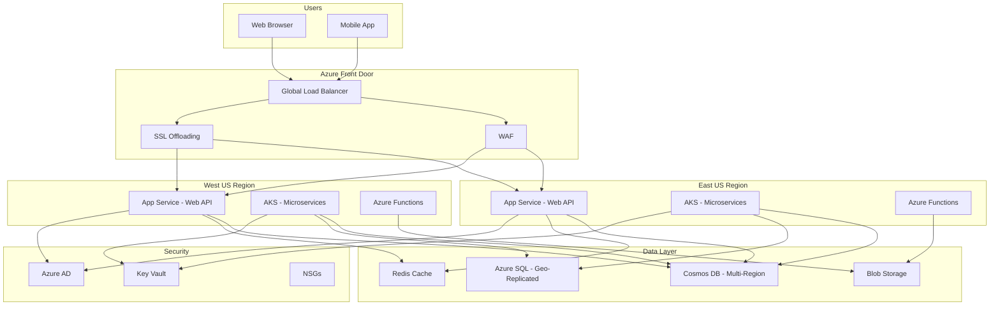
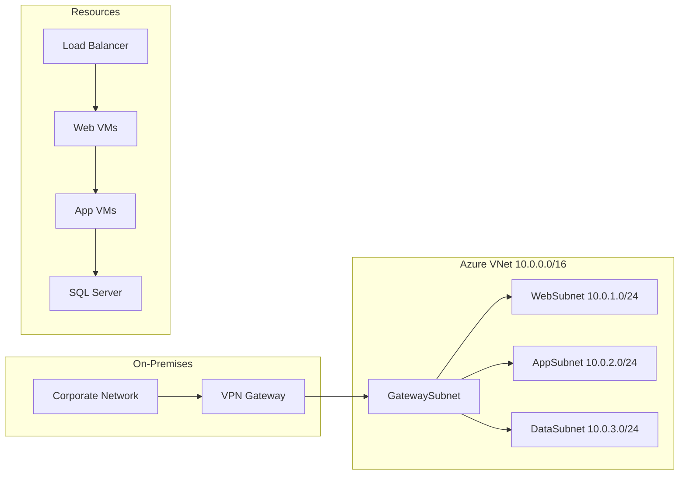

## Introduction

Microsoft Azure is a comprehensive cloud computing platform offering over 200 services including compute, storage, networking, databases, AI/ML, DevOps, and more. As the second-largest cloud provider globally, Azure is essential knowledge for cloud engineers, developers, and architects.

Azure provides hybrid cloud capabilities through Azure Arc, edge computing through Azure IoT Edge, and seamless integration with Microsoft 365 and Active Directory. Understanding Azure is critical for enterprise environments where Microsoft technologies dominate.

This guide covers Azure fundamentals through advanced concepts, preparing you for roles ranging from Azure Administrator to Solutions Architect.

---

## Learning Roadmap

### Week 1: Azure Fundamentals
- Azure accounts, subscriptions, and resource groups
- Azure portal, CLI, and PowerShell basics
- Azure regions, availability zones, and resource providers
- Azure Resource Manager (ARM) concepts

### Week 2: Compute Services
- Virtual Machines (VMs) and VM Scale Sets
- Azure App Service and Web Apps
- Azure Functions (serverless computing)
- Azure Container Instances and Container Apps
- Azure Kubernetes Service (AKS) basics

### Week 3: Storage and Databases
- Blob Storage, File Storage, Queue Storage, Table Storage
- Azure SQL Database and Managed Instances
- Cosmos DB (multi-model, globally distributed)
- Azure Database for MySQL, PostgreSQL, MariaDB
- Azure Cache for Redis

### Week 4: Networking and Security
- Virtual Networks (VNets), subnets, NSGs
- Load Balancer, Application Gateway, Front Door
- Azure DNS, Traffic Manager, CDN
- Azure Active Directory and identity management
- Key Vault and managed identities

### Week 5: DevOps and Monitoring
- Azure DevOps (Boards, Repos, Pipelines, Test Plans, Artifacts)
- Azure Monitor, Log Analytics, Application Insights
- Azure Policy, Blueprints, and Resource Locks
- Cost Management and Advisor

### Week 6: Advanced Topics and Certification Prep
- Azure Architecture Patterns
- Well-Architected Framework
- Hybrid and multi-cloud with Azure Arc
- Azure exam preparation (AZ-900, AZ-104, AZ-305)

---

## Theory Notes

### Azure Resource Manager (ARM)
ARM is the deployment and management service for Azure. It provides a management layer that enables you to create, update, and delete resources. Key concepts:

- **Resource Group**: Logical container for resources
- **Resource Provider**: Service that manages resources (Microsoft.Compute, Microsoft.Storage)
- **Resource**: Manageable item available through Azure (VM, database, etc.)
- **Template**: Declarative JSON file for deploying resources
- **Tag**: Name-value pairs for organizing resources

### Azure Compute Options
| Service | Use Case | Scaling | Management |
|---------|----------|---------|------------|
| VMs | Full OS control | Manual/VMSS | IaaS |
| App Service | Web apps, APIs | Auto-scale | PaaS |
| Functions | Event-driven code | Per-execution | Serverless |
| Container Instances | Simple containers | Manual | Serverless containers |
| AKS | Container orchestration | Cluster autoscaler | Managed Kubernetes |

### Storage Redundancy Options
- **LRS (Locally Redundant)**: 3 copies in one datacenter
- **ZRS (Zone-Redundant)**: 3 copies across availability zones
- **GRS (Geo-Redundant)**: LRS + async replication to paired region
- **GZRS**: ZRS + async replication to paired region
- **RA-GRS**: GRS + read access to secondary region

### Networking Fundamentals
- **VNet**: Isolated virtual network in Azure
- **Subnet**: Range of IP addresses within a VNet
- **NSG (Network Security Group)**: Filter traffic to/from resources
- **UDR (User Defined Route)**: Custom route table
- **VNet Peering**: Connect VNets globally

### Identity and Access
- **Azure AD**: Cloud-based identity and access management
- **RBAC**: Role-Based Access Control for resource authorization
- **Managed Identity**: System-assigned or user-assigned identity for Azure resources
- **Conditional Access**: Policy-based access controls
- **PIM (Privileged Identity Management)**: Just-in-time privileged access

---

## Key Concepts

### Azure Compute
1. **Virtual Machines**: IaaS offering with full Windows/Linux OS control
2. **VM Scale Sets (VMSS)**: Group of load-balanced VMs with autoscaling
3. **App Service**: Fully managed platform for web apps and APIs
4. **Azure Functions**: Serverless compute triggered by events
5. **Azure Batch**: Large-scale parallel and HPC compute jobs
6. **Azure Container Apps**: Run containers with serverless scaling

### Azure Storage
1. **Blob Storage**: Object storage for unstructured data (images, documents, backups)
2. **File Storage**: Managed file shares (SMB/NFS protocol)
3. **Queue Storage**: Message queue for async communication between components
4. **Table Storage**: NoSQL key-value store for semi-structured data
5. **Disk Storage**: Managed disks for VMs (OS and data disks)
6. **Data Lake Storage**: Hadoop-compatible storage for big data analytics

### Azure Databases
1. **Azure SQL Database**: Fully managed relational database (PaaS)
2. **Cosmos DB**: Globally distributed, multi-model NoSQL database
3. **Azure Database for MySQL/PostgreSQL**: Managed open-source databases
4. **Azure Cache for Redis**: In-memory cache for high-performance scenarios
5. **Azure SQL Managed Instance**: Near-complete SQL Server compatibility (PaaS)
6. **Azure Synapse Analytics**: Enterprise analytics service (data warehousing)

### Azure Networking
1. **Virtual Network (VNet)**: Isolated network environment in Azure
2. **Load Balancer**: Layer 4 (TCP/UDP) load balancing
3. **Application Gateway**: Layer 7 (HTTP/HTTPS) load balancing with WAF
4. **Azure Front Door**: Global load balancing with CDN capabilities
5. **Traffic Manager**: DNS-based global load balancing
6. **Azure CDN**: Content delivery network for low-latency access
7. **Azure DNS**: Hosting for DNS domains
8. **VPN Gateway**: Encrypted connection between Azure and on-premises
9. **ExpressRoute**: Private, dedicated connection to Azure

### Azure Security
1. **Azure AD**: Identity and access management
2. **Key Vault**: Secrets, keys, and certificates management
3. **Azure Security Center**: Unified security management (now Defender for Cloud)
4. **Azure Sentinel**: Cloud-native SIEM and SOAR
5. **DDoS Protection**: Network layer DDoS protection
6. **Azure Policy**: Organizational standards enforcement

---

## FAQ (20+ Q&A)

### Q1: What is the difference between Azure Resource Groups and Azure Subscriptions?
**A:** A subscription is a billing and management boundary. A resource group is a logical container within a subscription where resources are deployed and managed. A subscription can have multiple resource groups, but a resource group belongs to only one subscription.

### Q2: Explain the difference between Azure Load Balancer and Application Gateway.
**A:** Load Balancer operates at Layer 4 (TCP/UDP) and distributes traffic across healthy VMs. Application Gateway operates at Layer 7 (HTTP/HTTPS) and provides SSL termination, URL-based routing, cookie-based session affinity, and Web Application Firewall (WAF) capabilities.

### Q3: What are Azure Availability Zones?
**A:** Availability Zones are physically separate locations within an Azure region. Each zone has independent power, cooling, and networking. They protect applications from datacenter-level failures. Not all regions support availability zones.

### Q4: How does Azure Cosmos DB differ from Azure SQL Database?
**A:** Cosmos DB is a multi-model NoSQL database supporting documents, key-value, graph, and column-family data models. It offers turnkey global distribution, unlimited scale, and single-digit millisecond latency. Azure SQL Database is a relational database (PaaS) based on SQL Server with ACID transactions.

### Q5: What is Azure Active Directory B2C?
**A:** Azure AD B2C is a customer identity access management (CIAM) solution. It provides sign-up, sign-in, and profile management for consumer-facing applications. It supports social identity providers, custom policies, and branding.

### Q6: Explain Azure Managed Disks and their types.
**A:** Managed Disks simplify disk management for Azure VMs. Types include: Ultra Disks (high IOPS), Premium SSD (production workloads), Standard SSD (web servers, light workloads), and Standard HDD (backup, infrequent access). Sizes range from 4 GiB to 64 TiB.

### Q7: What is Azure Policy and how does it differ from RBAC?
**A:** Azure Policy evaluates resources against organizational standards and can prevent non-compliant resources from being created. RBAC controls who can perform actions on resources. Azure Policy ensures resources comply with standards; RBAC controls access permissions.

### Q8: How do you secure an Azure SQL Database?
**A:** Security measures include: Azure AD authentication, Transparent Data Encryption (TDE), Always Encrypted for sensitive data, Dynamic Data Masking, Azure Defender for SQL, Private Endpoints, and Azure Policy compliance checks.

### Q9: What is Azure Functions and what are its hosting plans?
**A:** Azure Functions is serverless compute for event-driven code. Hosting plans: Consumption (auto-scaling, pay-per-use, 5-minute timeout), Premium (pre-warmed instances, vNet support, unlimited duration), and Dedicated (App Service plan, predictable billing).

### Q10: Explain Azure Blob Storage access tiers.
**A:** Hot tier: Frequent access, highest storage cost, lowest access cost. Cool tier: Infrequent access (30+ days), lower storage cost, higher access cost. Archive tier: Rare access (180+ days), lowest storage cost, highest access cost (rehydration required).

### Q11: What is Azure Virtual Network Peering?
**A:** VNet Peering connects two VNets through the Azure backbone network. It enables resources in different VNets to communicate with low latency and high bandwidth. Global peering connects VNets across regions. Peered VNets have non-overlapping address spaces.

### Q12: How does Azure Front Door differ from Traffic Manager?
**A:** Azure Front Door provides global HTTP load balancing with SSL offloading, caching, WAF, and compression. Traffic Manager is DNS-based load balancing supporting HTTP, HTTPS, TCP endpoints. Front Door is better for web applications; Traffic Manager for non-HTTP protocols.

### Q13: What are Azure DevOps Services?
**A:** Azure DevOps provides developer services for CI/CD pipelines, Git repos, Agile planning (Boards), test management, and artifact management. It supports any language, platform, and cloud. Azure DevOps Server is the on-premises version.

### Q14: Explain Azure Monitor and its components.
**A:** Azure Monitor collects, analyzes, and acts on telemetry data. Components: Metrics (time-series data), Logs (Log Analytics workspace), Application Insights (application performance monitoring), and Alerts (automated notifications/actions).

### Q15: What is Azure Arc?
**A:** Azure Arc extends Azure management and services to any infrastructure, including on-premises, edge, and multi-cloud. It enables consistent management of Kubernetes clusters, SQL databases, and servers across environments using Azure tools.

### Q16: How do you implement cost optimization in Azure?
**A:** Strategies include: Right-sizing VMs, using Reserved Instances/Savings Plans, auto-shutdown dev environments, choosing appropriate storage tiers, deleting unused resources, using Azure Advisor recommendations, and implementing budgets/alerts.

### Q17: What is the difference between Azure AD and on-premises AD?
**A:** Azure AD is cloud-based, uses HTTP/HTTPS protocols (OAuth, SAML, OpenID Connect), and is designed for web-based authentication. On-premises AD uses Kerberos/LDAP and provides authentication for on-premises resources. Azure AD Connect synchronizes identities between them.

### Q18: Explain Azure Service Bus vs Storage Queues.
**A:** Service Bus is enterprise messaging with topics/subscriptions, sessions, dead-lettering, and duplicate detection. Storage Queues are simpler, cheaper, with first-in-first-out semantics. Service Bus is for complex messaging; Storage Queues for simple async communication.

### Q19: What are Azure RBAC built-in roles?
**A:** Common built-in roles: Owner (full access + role assignment), Contributor (full access except role assignment), Reader (view-only), User Access Administrator (manage user access), and service-specific roles like Virtual Machine Contributor.

### Q20: How do you configure high availability for Azure VMs?
**A:** High availability options: Deploy VMs across Availability Sets (same datacenter), Availability Zones (different datacenters in a region), use Azure Site Recovery for disaster recovery, and deploy Load Balancer for traffic distribution.

### Q21: What is Azure Kubernetes Service (AKS)?
**A:** AKS is a managed Kubernetes service that simplifies deploying, managing, and scaling containerized applications using Kubernetes. Azure manages the control plane (master nodes), while you manage worker nodes. It integrates with Azure AD, Azure Monitor, and Azure DevOps.

### Q22: Explain Azure CDN and its features.
**A:** Azure CDN caches content at edge locations worldwide. Features: Custom domain support, HTTPS, caching rules, compression, token-based authentication, geo-filtering, and real-time analytics. It supports providers: Azure CDN Standard/Microsoft, Akamai, and Verizon.

---

## Hands-on Practice

### Lab 1: Deploy a VM with Azure CLI
```bash
# Create a resource group
az group create --name myResourceGroup --location eastus

# Create a VM
az vm create \
  --resource-group myResourceGroup \
  --name myVM \
  --image Ubuntu2204 \
  --admin-username azureuser \
  --ssh-key-values ~/.ssh/id_rsa.pub \
  --size Standard_DS1_v2

# Get public IP
az vm show -d -g myResourceGroup -n myVM --query publicIps -o tsv
```

### Lab 2: Create a Storage Account and Blob
```bash
# Create storage account
az storage account create \
  --name mystorageaccount12345 \
  --resource-group myResourceGroup \
  --location eastus \
  --sku Standard_LRS \
  --kind StorageV2

# Get storage key
STORAGE_KEY=$(az storage account keys list \
  --account-name mystorageaccount12345 \
  --query '[0].value' -o tsv)

# Create a container
az storage container create \
  --name mycontainer \
  --account-name mystorageaccount12345 \
  --account-key $STORAGE_KEY

# Upload a blob
az storage blob upload \
  --account-name mystorageaccount12345 \
  --account-key $STORAGE_KEY \
  --container-name mycontainer \
  --name myfile.txt \
  --file ./myfile.txt
```

### Lab 3: Deploy Azure SQL Database
```bash
# Create SQL server
az sql server create \
  --name mysqlserver12345 \
  --resource-group myResourceGroup \
  --location eastus \
  --admin-user sqladmin \
  --admin-password P@ssw0rd1234!

# Create database
az sql db create \
  --server mysqlserver12345 \
  --name mySampleDatabase \
  --resource-group myResourceGroup \
  --service-tier Basic \
  --capacity 5
```

### Lab 4: Create a Virtual Network
```bash
# Create VNet
az network vnet create \
  --resource-group myResourceGroup \
  --name myVNet \
  --address-prefix 10.0.0.0/16 \
  --subnet-name mySubnet \
  --subnet-prefix 10.0.1.0/24

# Create NSG rule
az network nsg rule create \
  --resource-group myResourceGroup \
  --nsg-name myNSG \
  --name AllowHTTP \
  --priority 100 \
  --destination-port-ranges 80 \
  --access Allow \
  --protocol Tcp \
  --direction Inbound
```

### Lab 5: Deploy Azure Function
```bash
# Create Function App
az functionapp create \
  --resource-group myResourceGroup \
  --consumption-plan-location eastus \
  --runtime dotnet \
  --functions-version 4 \
  --name myFunctionApp12345 \
  --storage-account mystorageaccount12345
```

### Lab 6: AKS Cluster Deployment
```bash
# Create AKS cluster
az aks create \
  --resource-group myResourceGroup \
  --name myAKSCluster \
  --node-count 3 \
  --enable-addons monitoring \
  --generate-ssh-keys

# Get credentials
az aks get-credentials \
  --resource-group myResourceGroup \
  --name myAKSCluster

# Deploy application
kubectl apply -f deployment.yaml
kubectl get pods
kubectl get service
```

---

## FAANG Questions

### Amazon/Facebook Level
1. **Design a globally distributed, multi-region database with single-digit millisecond reads.**
   - Use Cosmos DB with multi-region writes, session consistency, and provisioned throughput
   - Consider conflict resolution: Last Writer Wins vs Custom Stored Procedures

2. **How would you migrate 50TB of on-premises data to Azure with minimal downtime?**
   - Use Azure Data Box for initial bulk transfer
   - Set up Azure Site Recovery for continuous replication
   - Cut over during maintenance window
   - Validate with checksums and data integrity tests

3. **Design a microservices architecture on AKS handling 100K requests/second.**
   - Use node pools with appropriate VM sizes
   - Implement horizontal pod autoscaler based on CPU/memory/custom metrics
   - Use Azure Front Door for global load balancing
   - Implement circuit breaker pattern with Polly

### Google/Microsoft Level
4. **Explain how you would implement zero-downtime deployment for Azure App Service.**
   - Use deployment slots for staging and production
   - Configure auto swap with warm-up
   - Implement health checks
   - Use Azure DevOps release gates

5. **Design a serverless architecture for processing 1 million events per minute.**
   - Azure Event Hubs for ingestion
   - Azure Functions with consumption plan and batch processing
   - Cosmos DB for storage with partitioned collections
   - Monitor with Application Insights

### Netflix/Apple Level
6. **How would you implement disaster recovery across Azure regions?**
   - Active-passive or active-active architecture
   - Azure Traffic Manager or Front Door for failover
   - Cosmos DB multi-region or Azure SQL geo-replication
   - Regular DR testing with Azure Site Recovery
   - RPO and RTO requirements drive architecture decisions

---

## Common Mistakes

1. **Not using managed identities** - Hard-coding credentials instead of using system-assigned or user-assigned managed identities for Azure resources.

2. **Ignoring resource tagging** - Not implementing a consistent tagging strategy for cost allocation and resource management.

3. **Over-provisioning VMs** - Choosing VM sizes based on peak load without implementing autoscaling or right-sizing.

4. **Single-region deployments** - Deploying all resources in one region without considering availability zones or geo-redundancy.

5. **Not using Azure Policy** - Allowing non-compliant resources without organizational policy enforcement.

6. **Public endpoints for databases** - Exposing SQL Database or Cosmos DB to public internet instead of using Private Endpoints.

7. **Ignoring cost management** - Not setting budgets, alerts, or reviewing Azure Advisor cost recommendations.

8. **Hard-coded connection strings** - Storing connection strings in application code instead of using Key Vault or App Configuration.

9. **Not implementing NSG rules** - Leaving default NSG rules without explicit deny-all-and-allow-specific patterns.

10. **Skipping monitoring setup** - Deploying resources without configuring Azure Monitor, alerts, or Application Insights.

---

## Best Practices

### Security
- Enable Azure Defender for all resource types
- Use Private Endpoints for PaaS services
- Implement just-in-time VM access
- Rotate secrets and certificates regularly
- Enable MFA for all administrative accounts

### Performance
- Use proximity placement groups for latency-sensitive workloads
- Implement caching with Azure Cache for Redis
- Choose appropriate VM series for workload type (compute-optimized, memory-optimized, etc.)
- Use Premium Storage for production workloads

### Cost Optimization
- Implement Azure Advisor recommendations
- Use Azure Reservations for predictable workloads
- Auto-shutdown development VMs
- Use Blob Storage lifecycle management
- Monitor costs with Azure Cost Management

### Reliability
- Deploy across availability zones
- Implement health probes for load balancing
- Use Azure Site Recovery for disaster recovery
- Regular backup and restore testing
- Implement circuit breaker pattern for external dependencies

---

## Cheat Sheet

### Azure CLI Quick Commands
```bash
# Login
az login

# List subscriptions
az account list -o table

# Set subscription
az account set --subscription "subscription-id"

# List all resources
az resource list -o table

# Get VM sizes
az vm list-sizes --location eastus -o table

# Start/Stop VM
az vm start -g myRG -n myVM
az vm stop -g myRG -n myVM

# Delete resource group
az group delete -n myRG --yes --no-wait
```

### ARM Template Structure
```json
{
  "$schema": "https://schema.management.azure.com/schemas/2019-04-01/deploymentTemplate.json#",
  "contentVersion": "1.0.0.0",
  "parameters": {},
  "variables": {},
  "resources": [],
  "outputs": {}
}
```

### Azure Networking IP Ranges
- VNet address space: 10.0.0.0/8, 172.16.0.0/12, 192.168.0.0/16
- Azure internal DNS: 168.63.129.16
- Default gateway: x.x.x.1 (first IP in subnet)

### Service Limits (Default)
- Subscriptions per tenant: Unlimited
- Resource groups per subscription: 980
- Virtual networks per subscription: 1,000
- VMs per subscription: 25,000
- Storage account per subscription: 250
- Cosmos DB containers per account: Unlimited

---

## Flash Cards (20)

**Card 1**: What is Azure Resource Manager?
ARM is the deployment and management service providing a consistent management layer for Azure resources.

**Card 2**: What is the difference between PaaS, IaaS, and SaaS in Azure?
IaaS: VMs (you manage OS). PaaS: App Service (you manage app code). SaaS: Microsoft 365 (you use the service).

**Card 3**: What is a Managed Identity?
A managed identity in Azure AD that Azure automatically manages for you, eliminating credentials in code.

**Card 4**: What are Azure Availability Zones?
Physically separate locations within an Azure region with independent power, cooling, and networking.

**Card 5**: What is Azure Blob Storage?
Object storage for unstructured data like documents, images, and backups. Supports hot, cool, and archive tiers.

**Card 6**: What is Azure Cosmos DB?
A globally distributed, multi-model NoSQL database with guaranteed low latency and high availability.

**Card 7**: What is Azure Load Balancer?
Layer 4 load balancer distributing TCP/UDP traffic across healthy VMs using hash-based algorithm.

**Card 8**: What is Azure Application Gateway?
Layer 7 load balancer with SSL offloading, URL routing, and Web Application Firewall (WAF).

**Card 9**: What is Azure Functions?
Serverless compute service that runs event-triggered code without managing infrastructure.

**Card 10**: What is Azure AD?
Cloud-based identity and access management service for managing user identities and access.

**Card 11**: What is Azure Key Vault?
Service for safeguarding cryptographic keys, secrets, and certificates used by applications.

**Card 12**: What is Azure Policy?
Service that evaluates Azure resources against organizational standards and can prevent non-compliance.

**Card 13**: What is Azure Monitor?
Comprehensive monitoring solution for collecting, analyzing, and acting on telemetry data.

**Card 14**: What is Azure DevOps?
Service for developer collaboration including Git repos, CI/CD pipelines, and project management.

**Card 15**: What is Azure Kubernetes Service?
Managed Kubernetes container orchestration service simplifying deployment and management of containerized apps.

**Card 16**: What is Azure Site Recovery?
Disaster recovery service that replicates VMs to a secondary region for business continuity.

**Card 17**: What is Azure ExpressRoute?
Private, dedicated connection between on-premises infrastructure and Azure datacenters.

**Card 18**: What is Azure CDN?
Content delivery network caching content at edge locations for low-latency access worldwide.

**Card 19**: What is Azure Front Door?
Global load balancing service with SSL offloading, caching, WAF, and path-based routing.

**Card 20**: What is Azure Arc?
Extends Azure management to any infrastructure including on-premises, edge, and multi-cloud.

---

## Mind Map

```
Azure Cloud Platform
├── Compute
│   ├── Virtual Machines (IaaS)
│   ├── App Service (PaaS)
│   ├── Azure Functions (Serverless)
│   ├── Container Instances
│   └── AKS (Kubernetes)
├── Storage
│   ├── Blob Storage (Object)
│   ├── File Storage (File share)
│   ├── Queue Storage (Messages)
│   ├── Table Storage (NoSQL)
│   └── Disk Storage (Managed disks)
├── Databases
│   ├── Azure SQL Database
│   ├── Cosmos DB (NoSQL)
│   ├── MySQL/PostgreSQL
│   └── Redis Cache
├── Networking
│   ├── Virtual Network (VNet)
│   ├── Load Balancer (L4)
│   ├── Application Gateway (L7)
│   ├── Front Door (Global)
│   ├── Traffic Manager (DNS)
│   └── CDN
├── Identity & Security
│   ├── Azure AD
│   ├── Key Vault
│   ├── RBAC
│   ├── Security Center
│   └── Sentinel
├── DevOps
│   ├── Azure DevOps
│   ├── Azure Pipelines
│   ├── ARM Templates
│   └── Bicep
└── Monitoring
    ├── Azure Monitor
    ├── Application Insights
    ├── Log Analytics
    └── Alerts
```

---

## Mermaid Diagrams

### Azure Architecture Overview


### Azure Networking Flow


### Azure DevOps Pipeline

```mermaid
graph LR
    A[Source Code] --> B[Build]
    B --> C[Unit Tests]
    C --> D[Security Scan]
    D --> E[Publish Artifacts]
    E --> F[Deploy to Dev]
    F --> G[Integration Tests]
    G --> H[Deploy to Staging]
    H --> I[Performance Tests]
    I --> J[Manual Approval]
    J --> K[Deploy to Production]
    K --> L[Smoke Tests]
```


---

## Code Examples

### ARM Template - Web App with SQL Database
```json
{
  "$schema": "https://schema.management.azure.com/schemas/2019-04-01/deploymentTemplate.json#",
  "contentVersion": "1.0.0.0",
  "parameters": {
    "webAppName": {
      "type": "string",
      "defaultValue": "[concat('webapp-', uniqueString(resourceGroup().id))]"
    },
    "sqlServerName": {
      "type": "string",
      "defaultValue": "[concat('sqlserver-', uniqueString(resourceGroup().id))]"
    },
    "sqlAdminLogin": {
      "type": "string"
    },
    "sqlAdminPassword": {
      "type": "securestring"
    },
    "location": {
      "type": "string",
      "defaultValue": "[resourceGroup().location]"
    }
  },
  "resources": [
    {
      "type": "Microsoft.Web/serverfarms",
      "apiVersion": "2021-02-01",
      "name": "[parameters('webAppName')]",
      "location": "[parameters('location')]",
      "sku": {
        "name": "B1",
        "tier": "Basic"
      }
    },
    {
      "type": "Microsoft.Web/sites",
      "apiVersion": "2021-02-01",
      "name": "[parameters('webAppName')]",
      "location": "[parameters('location')]",
      "dependsOn": [
        "[resourceId('Microsoft.Web/serverfarms', parameters('webAppName'))]"
      ],
      "properties": {
        "serverFarmId": "[resourceId('Microsoft.Web/serverfarms', parameters('webAppName'))]",
        "siteConfig": {
          "appSettings": [
            {
              "name": "SQL_CONNECTION_STRING",
              "value": "[concat('Server=tcp:', parameters('sqlServerName'), '.database.windows.net,1433;Initial Catalog=mydb;User ID=', parameters('sqlAdminLogin'), ';Password=', parameters('sqlAdminPassword'), ';Trusted_Connection=False;Encrypt=True;')]"
            }
          ]
        }
      }
    },
    {
      "type": "Microsoft.Sql/servers",
      "apiVersion": "2021-11-01",
      "name": "[parameters('sqlServerName')]",
      "location": "[parameters('location')]",
      "properties": {
        "administratorLogin": "[parameters('sqlAdminLogin')]",
        "administratorLoginPassword": "[parameters('sqlAdminPassword')]",
        "version": "12.0"
      }
    },
    {
      "type": "Microsoft.Sql/servers/databases",
      "apiVersion": "2021-11-01",
      "name": "[concat(parameters('sqlServerName'), '/mydb')]",
      "location": "[parameters('location')]",
      "dependsOn": [
        "[resourceId('Microsoft.Sql/servers', parameters('sqlServerName'))]"
      ],
      "sku": {
        "name": "Basic",
        "tier": "Basic"
      }
    }
  ],
  "outputs": {
    "webAppUrl": {
      "type": "string",
      "value": "[concat('https://', parameters('webAppName'), '.azurewebsites.net')]"
    }
  }
}
```

### Azure Function - HTTP Trigger (C#)
```csharp
using System.IO;
using System.Threading.Tasks;
using Microsoft.AspNetCore.Mvc;
using Microsoft.Azure.WebJobs;
using Microsoft.Azure.WebJobs.Extensions.Http;
using Microsoft.AspNetCore.Http;
using Microsoft.Extensions.Logging;
using Newtonsoft.Json;

namespace MyFunctionApp
{
    public static class HttpTriggerFunction
    {
        [FunctionName("HttpTrigger")]
        public static async Task<IActionResult> Run(
            [HttpTrigger(AuthorizationLevel.Function, "get", "post", Route = null)] HttpRequest req,
            ILogger log)
        {
            log.LogInformation("C# HTTP trigger function processed a request.");

            string name = req.Query["name"];

            string requestBody = await new StreamReader(req.Body).ReadToEndAsync();
            dynamic data = JsonConvert.DeserializeObject(requestBody);
            name = name ?? data?.name;

            string responseMessage = string.IsNullOrEmpty(name)
                ? "This HTTP triggered function executed successfully. Pass a name in the query string or in the request body for a personalized response."
                : $"Hello, {name}. This HTTP triggered function executed successfully.";

            return new OkObjectResult(responseMessage);
        }
    }
}
```

### Azure Bicep Template - VNet with Subnets
```bicep
@description('VNet address space')
param vnetAddressPrefix string = '10.0.0.0/16'

@description('Web subnet prefix')
param webSubnetPrefix string = '10.0.1.0/24'

@description('App subnet prefix')
param appSubnetPrefix string = '10.0.2.0/24'

@description('Data subnet prefix')
param dataSubnetPrefix string = '10.0.3.0/24'

resource vnet 'Microsoft.Network/virtualNetworks@2023-04-01' = {
  name: 'myVNet'
  location: resourceGroup().location
  properties: {
    addressSpace: {
      addressPrefixes: [vnetAddressPrefix]
    }
    subnets: [
      {
        name: 'WebSubnet'
        properties: {
          addressPrefix: webSubnetPrefix
          networkSecurityGroup: {
            id: nsg.id
          }
        }
      }
      {
        name: 'AppSubnet'
        properties: {
          addressPrefix: appSubnetPrefix
        }
      }
      {
        name: 'DataSubnet'
        properties: {
          addressPrefix: dataSubnetPrefix
          serviceEndpoints: [
            {
              service: 'Microsoft.Sql'
            }
          ]
        }
      }
    ]
  }
}

resource nsg 'Microsoft.Network/networkSecurityGroups@2023-04-01' = {
  name: 'webNsg'
  location: resourceGroup().location
  properties: {
    securityRules: [
      {
        name: 'AllowHTTP'
        properties: {
          priority: 100
          protocol: 'Tcp'
          access: 'Allow'
          direction: 'Inbound'
          sourceAddressPrefix: '*'
          sourcePortRange: '*'
          destinationAddressPrefix: '*'
          destinationPortRange: '80'
        }
      }
    ]
  }
}
```

### Python Script - Azure VM Management
```python
from azure.identity import DefaultAzureCredential
from azure.mgmt.compute import ComputeManagementClient
from azure.mgmt.resource import ResourceManagementClient

def list_vms(subscription_id):
    credential = DefaultAzureCredential()
    compute_client = ComputeManagementClient(credential, subscription_id)
    
    for vm in compute_client.virtual_machines.list_all():
        print(f"VM: {vm.name}, Location: {vm.location}")

def create_vm(subscription_id, resource_group, vm_name):
    credential = DefaultAzureCredential()
    compute_client = ComputeManagementClient(credential, subscription_id)
    
    poller = compute_client.virtual_machines.begin_create_or_update(
        resource_group,
        vm_name,
        {
            "location": "eastus",
            "hardware_profile": {"vm_size": "Standard_DS1_v2"},
            "storage_profile": {
                "image_reference": {
                    "publisher": "Canonical",
                    "offer": "UbuntuServer",
                    "sku": "20.04-LTS",
                    "version": "latest"
                }
            },
            "os_profile": {
                "computer_name": vm_name,
                "admin_username": "azureuser",
                "admin_password": "P@ssw0rd1234!"
            },
            "network_profile": {
                "network_interfaces": [{"id": "/subscriptions/.../networkInterfaces/myNic"}]
            }
        }
    )
    vm = poller.result()
    print(f"Created VM: {vm.name}")

if __name__ == "__main__":
    SUBSCRIPTION_ID = "your-subscription-id"
    list_vms(SUBSCRIPTION_ID)
```

---

## Projects

### Project 1: Three-Tier Web Application
Deploy a complete three-tier architecture:
- **Frontend**: Azure App Service with deployment slots
- **Backend**: Azure Functions or AKS with microservices
- **Database**: Azure SQL with Private Endpoint
- **Networking**: VNet with NSGs, Application Gateway with WAF
- **Security**: Azure AD, Key Vault, Managed Identities
- **Monitoring**: Application Insights, Azure Monitor

### Project 2: Serverless Data Pipeline
Build a serverless ETL pipeline:
- **Ingestion**: Event Hubs for real-time data streaming
- **Processing**: Azure Functions for data transformation
- **Storage**: Data Lake Storage for raw data, Cosmos DB for processed data
- **Analytics**: Azure Synapse for data warehousing
- **Visualization**: Power BI connected to Synapse

### Project 3: AKS Microservices Platform
Deploy microservices on AKS:
- **Application**: 3-4 microservices with different languages
- **Service Mesh**: Istio or Linkerd
- **API Gateway**: Azure API Management
- **CI/CD**: Azure DevOps Pipelines
- **Monitoring**: Prometheus + Grafana on AKS
- **Security**: Azure AD integration, network policies

---

## Resources

### Official Documentation
- [Azure Documentation](https://docs.microsoft.com/azure/)
- [Azure Architecture Center](https://docs.microsoft.com/azure/architecture/)
- [Azure Well-Architected Framework](https://docs.microsoft.com/azure/architecture/framework/)
- [Azure Cloud Adoption Framework](https://docs.microsoft.com/azure/cloud-adoption-framework/)

### Certification Paths
- **AZ-900**: Azure Fundamentals
- **AZ-104**: Azure Administrator
- **AZ-204**: Azure Developer Associate
- **AZ-305**: Azure Solutions Architect Expert
- **AZ-400**: DevOps Engineer Expert
- **AZ-500**: Azure Security Engineer

### Learning Platforms
- Microsoft Learn (free official training)
- Azure Sandbox (free hands-on environment)
- Azure Free Account ($200 credit for 30 days)
- Pluralsight Azure learning paths
- A Cloud Guru Azure courses

### Practice Exams
- Microsoft Official Practice Tests
- MeasureUp practice exams
- Whizlabs Azure practice tests

### Community
- Azure subreddit (r/Azure)
- Azure Tech Community
- Azure Friday (video series)
- Channel 9 Azure content

---

## Checklist

- [ ] Create Azure free account and explore portal
- [ ] Complete AZ-900 learning path
- [ ] Deploy and manage Virtual Machines
- [ ] Configure Virtual Networks with subnets and NSGs
- [ ] Create and manage Storage Accounts
- [ ] Deploy Azure SQL Database
- [ ] Implement Azure AD authentication
- [ ] Use Azure Key Vault for secrets
- [ ] Deploy App Service with deployment slots
- [ ] Create Azure Functions
- [ ] Implement Azure DevOps pipelines
- [ ] Deploy AKS cluster
- [ ] Configure Azure Monitor and alerts
- [ ] Implement Azure Policy
- [ ] Complete AZ-104 learning path
- [ ] Practice with Azure CLI and PowerShell
- [ ] Build a complete three-tier architecture
- [ ] Implement disaster recovery with Azure Site Recovery
- [ ] Configure cost management and budgets
- [ ] Complete AZ-305 learning path

---

## Revision Plans

### 1-Week Revision Plan
| Day | Topic | Activities |
|-----|-------|------------|
| 1 | Fundamentals | ARM, resource groups, portal navigation |
| 2 | Compute | VMs, App Service, Functions |
| 3 | Storage | Blob, File, Queue, Table |
| 4 | Databases | SQL Database, Cosmos DB |
| 5 | Networking | VNet, Load Balancer, App Gateway |
| 6 | Security | Azure AD, Key Vault, RBAC |
| 7 | Practice | Full architecture deployment, review |

### 2-Week Revision Plan
- Week 1: Theory and hands-on labs for each service
- Week 2: Practice exams, architecture design, mock interviews

### 1-Month Certification Prep
- Week 1-2: Complete learning path and hands-on labs
- Week 3: Practice exams and weak area focus
- Week 4: Final review, exam simulation, and certification exam

---

## Mock Interviews

### Scenario 1: Azure Solutions Architect
**Interviewer**: "Design a multi-region, highly available e-commerce platform on Azure."

**Key Points to Cover**:
- Azure Front Door for global load balancing
- AKS or App Service for compute
- Cosmos DB for product catalog (globally distributed)
- Azure SQL for orders (geo-replicated)
- Azure Cache for Redis for session management
- Azure CDN for static content
- Key Vault for secrets
- Application Insights for monitoring
- Azure DevOps for CI/CD

### Scenario 2: Azure Administrator
**Interviewer**: "A customer reports their Azure VM is running slowly. How do you troubleshoot?"

**Key Points to Cover**:
- Check VM metrics (CPU, memory, disk I/O, network)
- Review Boot Diagnostics
- Check NSG rules for throttling
- Review disk performance (IOPS, throughput)
- Check for extension issues
- Review Azure Advisor recommendations
- Check if VM needs resizing
- Review application-level logs

### Scenario 3: Azure Security Engineer
**Interviewer**: "How would you secure a multi-tenant SaaS application on Azure?"

**Key Points to Cover**:
- Azure AD B2C for customer identity
- Data isolation using separate resource groups or subscriptions
- Encryption at rest and in transit
- Key Vault for secrets management
- Azure Policy for compliance
- Network segmentation with VNets
- Azure Defender for threat protection
- Regular security assessments

---

## Difficulty Rating

| Topic | Difficulty | Time to Learn |
|-------|------------|---------------|
| Azure Fundamentals | ⭐ | 1-2 weeks |
| Virtual Machines | ⭐⭐ | 1-2 weeks |
| Virtual Networks | ⭐⭐⭐ | 2-3 weeks |
| Storage Services | ⭐⭐ | 1-2 weeks |
| Azure SQL Database | ⭐⭐⭐ | 2-3 weeks |
| Cosmos DB | ⭐⭐⭐⭐ | 3-4 weeks |
| Azure AD | ⭐⭐⭐ | 2-3 weeks |
| Azure Functions | ⭐⭐ | 1-2 weeks |
| AKS | ⭐⭐⭐⭐ | 3-4 weeks |
| ARM/Bicep Templates | ⭐⭐⭐ | 2-3 weeks |
| Azure DevOps | ⭐⭐⭐ | 2-3 weeks |
| Azure Security | ⭐⭐⭐⭐ | 3-4 weeks |
| Architecture Design | ⭐⭐⭐⭐⭐ | 4-6 weeks |

---

## Summary

Microsoft Azure is a comprehensive cloud platform with over 200 services. Key areas for interviews include:

1. **Compute**: Understanding when to use VMs vs App Service vs Functions vs Containers
2. **Storage**: Knowing storage redundancy options, access tiers, and when to use each service
3. **Databases**: Comparing Azure SQL vs Cosmos DB vs managed open-source databases
4. **Networking**: VNet design, load balancing options, and hybrid connectivity
5. **Security**: Azure AD, Key Vault, RBAC, and defense-in-depth strategies
6. **DevOps**: Azure DevOps, ARM/Bicep templates, and CI/CD pipelines
7. **Cost Optimization**: Right-sizing, reservations, and cost management practices
8. **Reliability**: High availability, disaster recovery, and the Well-Architected Framework

Understanding these concepts and their real-world applications will prepare you for Azure-focused roles from administrator to solutions architect.

