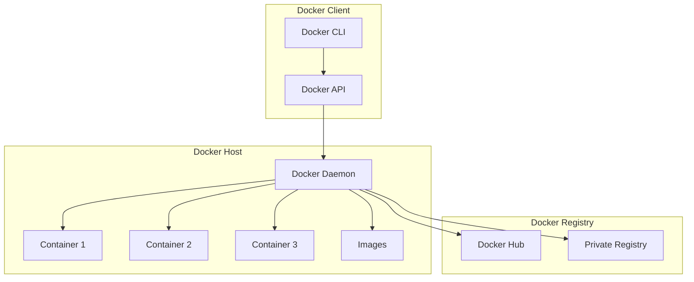
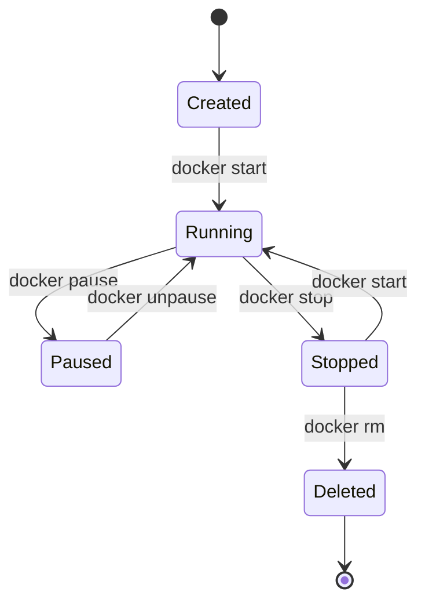
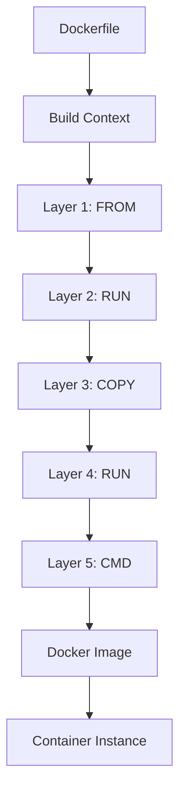
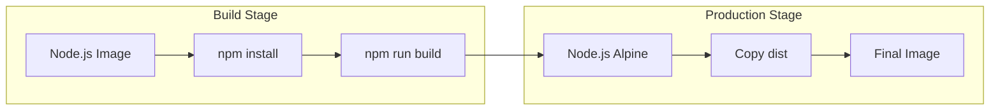

## Introduction

Docker is a platform for developing, shipping, and running applications in isolated environments called containers. Containers package an application with all its dependencies, libraries, and configuration files, ensuring consistent behavior across development, testing, and production environments.

Docker revolutionized software deployment by solving the "it works on my machine" problem. It provides lightweight, portable, and self-sufficient containers that run anywhere Docker is installed. Docker is fundamental to modern DevOps practices, microservices architectures, and cloud-native development.

Understanding Docker is essential for any software engineer, as it's the foundation for containerization technologies like Kubernetes and is used by organizations of all sizes.

---

## Learning Roadmap

### Week 1: Docker Fundamentals
- Containerization concepts vs virtualization
- Docker architecture (daemon, CLI, registry)
- Docker images and containers
- Basic Docker commands
- Dockerfile basics

### Week 2: Building Images
- Dockerfile instructions and best practices
- Multi-stage builds
- Image layering and caching
- .dockerignore files
- Base image selection

### Week 3: Networking and Storage
- Docker networking (bridge, host, overlay)
- Container-to-container communication
- Docker volumes and bind mounts
- Persistent data management
- Volume drivers

### Week 4: Docker Compose
- Multi-container applications
- docker-compose.yml syntax
- Service dependencies and health checks
- Environment variables and secrets
- Development vs production configurations

### Week 5: Production and Security
- Container security best practices
- Resource limits and constraints
- Container registries
- Docker in production
- Container monitoring and logging

### Week 6: Advanced Topics
- Docker Swarm basics
- Container orchestration concepts
- Docker and Kubernetes integration
- CI/CD with Docker
- Troubleshooting containers

---

## Theory Notes

### Containerization vs Virtualization
| Aspect | Containers | Virtual Machines |
|--------|------------|------------------|
| OS | Shared host kernel | Full guest OS |
| Size | Megabytes | Gigabytes |
| Startup | Seconds | Minutes |
| Isolation | Process-level | Hardware-level |
| Performance | Near-native | Overhead |
| Density | Hundreds per host | Tens per host |

### Docker Architecture
- **Docker Daemon (dockerd)**: Background service managing Docker objects
- **Docker CLI**: Command-line interface for interacting with daemon
- **Docker Registry**: Storage for Docker images (Docker Hub, private registries)
- **Docker Images**: Read-only templates for creating containers
- **Docker Containers**: Runnable instances of images

### Image Layering
Docker images consist of read-only layers. Each Dockerfile instruction creates a new layer:
```
Layer 1: Base image (e.g., ubuntu:22.04)
Layer 2: RUN apt-get update
Layer 3: COPY app code
Layer 4: RUN npm install
Layer 5: CMD ["node", "app.js"]
```
Layers are cached and shared between images, reducing storage and pull time.

### Docker Networking Modes
1. **Bridge**: Default network, containers communicate through virtual bridge
2. **Host**: Container uses host's network stack (no isolation)
3. **Overlay**: Multi-host networking for Docker Swarm
4. **Macvlan**: Assigns MAC address to container, appears as physical device
5. **None**: No networking

### Volume Types
1. **Named Volumes**: Managed by Docker, stored in Docker's storage directory
2. **Bind Mounts**: Map host directory to container directory
3. **tmpfs Mounts**: Stored in host memory only (not persisted)
4. **Volume Drivers**: Plugin-based storage solutions (NFS, cloud storage)

---

## Key Concepts

### Dockerfile Instructions
1. **FROM**: Base image for the build
2. **RUN**: Execute commands during build
3. **COPY**: Copy files from host to container
4. **ADD**: Copy files with URL and tar extraction support
5. **WORKDIR**: Set working directory
6. **ENV**: Set environment variables
7. **EXPOSE**: Document container's listening port
8. **CMD**: Default command when container starts
9. **ENTRYPOINT**: Configure container as executable
10. **ARG**: Build-time variables
11. **VOLUME**: Create mount point for external volumes
12. **USER**: Set user for subsequent instructions

### Docker Compose Services
- **services**: Define multiple containers as a single application
- **networks**: Create custom networks for service communication
- **volumes**: Define persistent storage
- **configs**: Manage configuration files
- **secrets**: Manage sensitive data

### Container Security
1. Use minimal base images (Alpine, distroless)
2. Don't run as root user
3. Scan images for vulnerabilities
4. Use multi-stage builds to reduce attack surface
5. Implement read-only file systems where possible
6. Use Docker secrets for sensitive data
7. Limit container resources (CPU, memory)

### Docker Best Practices
1. Use .dockerignore to exclude unnecessary files
2. Order Dockerfile instructions from least to most frequently changing
3. Combine RUN commands to reduce layers
4. Use specific image tags, not `latest`
5. Use multi-stage builds for smaller images
6. Run as non-root user
7. Use health checks for container monitoring

---

## FAQ (20+ Q&A)

### Q1: What is the difference between Docker and virtual machines?
**A:** Containers share the host OS kernel and are lightweight (MBs, seconds to start). VMs include a full guest OS, are heavier (GBs, minutes to start). Containers provide process-level isolation; VMs provide hardware-level isolation.

### Q2: What is a Docker image and how is it different from a container?
**A:** A Docker image is a read-only template with instructions for creating a container. A container is a runnable instance of an image with a writable layer. You can create multiple containers from one image.

### Q3: Explain Docker layer caching.
**A:** Docker caches each layer of an image. If a layer hasn't changed, Docker uses the cached version instead of rebuilding. Order Dockerfile instructions from least to most frequently changing to maximize cache hits.

### Q4: What is the difference between COPY and ADD?
**A:** COPY simply copies files from host to container. ADD can copy files, download URLs, and automatically extract tar files. Prefer COPY unless you need ADD's additional features, as COPY is more transparent.

### Q5: What is multi-stage build?
**A:** Multi-stage builds use multiple FROM statements to create smaller final images. Build stage includes all dependencies; final stage copies only necessary artifacts. Reduces image size significantly.

### Q6: What is Docker Compose and when to use it?
**A:** Docker Compose defines and runs multi-container applications using a YAML file. Use it for development, testing, and single-host deployments. For production with multiple hosts, use Docker Swarm or Kubernetes.

### Q7: What is the difference between CMD and ENTRYPOINT?
**A:** CMD provides default arguments that can be overridden. ENTRYPOINT configures the container as an executable. Use ENTRYPOINT for the main command and CMD for default arguments.

### Q8: What are Docker volumes and why use them?
**A:** Volumes store data outside containers, persisting data when containers stop. They're managed by Docker and can be shared between containers. Use volumes for databases, uploads, and any persistent data.

### Q9: What is a .dockerignore file?
**A:** Similar to .gitignore, it excludes files and directories from the Docker build context. Reduces build time and prevents unnecessary files from being included in the image.

### Q10: How do you reduce Docker image size?
**A:** Use multi-stage builds, choose minimal base images (Alpine), combine RUN commands, remove unnecessary files, use .dockerignore, and avoid installing unnecessary packages.

### Q11: What is Docker networking bridge mode?
**A:** Bridge is the default network driver. Containers on the same bridge network can communicate. Docker creates a virtual bridge on the host and connects containers to it.

### Q12: What is the difference between a bind mount and a named volume?
**A:** Bind mount maps a specific host path to container path. Named volume is managed by Docker and stored in Docker's storage area. Bind mounts depend on host directory structure; named volumes are more portable.

### Q13: How do you handle secrets in Docker?
**A:** Use Docker secrets (Swarm), environment variables (development only), or mount secrets as files. For production, use a secrets management solution like HashiCorp Vault or cloud provider secrets managers.

### Q14: What is container health checking?
**A:** Docker can monitor container health using HEALTHCHECK instruction in Dockerfile. Healthy containers continue running; unhealthy containers can be restarted or replaced by orchestrators.

### Q15: What is Docker Hub?
**A:** Docker Hub is Docker's official cloud registry for storing and sharing images. It provides public and private repositories, automated builds, and integration with Docker CLI.

### Q16: What is a Dockerfile EXPOSE instruction?
**A:** EXPOSE documents which ports the container listens on. It doesn't actually publish the port. Use -p flag with docker run to publish ports.

### Q17: What is container-to-container communication?
**A:** Containers on the same Docker network can communicate using container names as hostnames. Use Docker Compose for automatic service discovery.

### Q18: What is the difference between docker stop and docker kill?
**A:** docker stop sends SIGTERM, then SIGKILL after timeout (graceful shutdown). docker kill sends SIGKILL immediately (forceful termination). Use stop for graceful shutdown.

### Q19: What is Docker image tagging?
**A:** Tags identify different versions of an image. Format: repository:tag (e.g., myapp:1.0). Use semantic versioning and consider using git SHA for traceability.

### Q20: How do you debug a Docker container?
**A:** Use docker logs to view output, docker exec to shell into running container, docker inspect for details, and docker stats for resource usage. Check container exit codes for failure reasons.

### Q21: What is the difference between docker-compose up and docker-compose run?
**A:** docker-compose up starts all services defined in the compose file. docker-compose run starts a one-off command for a specific service. Use run for debugging or running tasks.

### Q22: What is a distroless image?
**A:** Distroless images contain only the application and runtime dependencies, without package managers, shell, or other OS utilities. They provide minimal attack surface for production containers.

---

## Hands-on Practice

### Lab 1: Basic Docker Commands
```bash
# Pull an image
docker pull nginx:latest

# Run a container
docker run -d --name my-nginx -p 8080:80 nginx

# List running containers
docker ps

# View logs
docker logs my-nginx

# Execute command in container
docker exec -it my-nginx bash

# Stop and remove container
docker stop my-nginx
docker rm my-nginx
```

### Lab 2: Build a Custom Image
```dockerfile
# Dockerfile
FROM node:18-alpine

WORKDIR /app

# Copy package files first (layer caching)
COPY package*.json ./

# Install dependencies
RUN npm ci --only=production

# Copy application code
COPY . .

# Create non-root user
RUN addgroup -S appgroup && adduser -S appuser -G appgroup

# Switch to non-root user
USER appuser

EXPOSE 3000

HEALTHCHECK --interval=30s --timeout=3s \
  CMD curl -f http://localhost:3000/health || exit 1

CMD ["node", "server.js"]
```

### Lab 3: Docker Compose Application
```yaml
# docker-compose.yml
version: '3.8'

services:
  web:
    build: .
    ports:
      - "3000:3000"
    environment:
      - NODE_ENV=development
      - DB_HOST=postgres
      - DB_PORT=5432
      - DB_NAME=myapp
    depends_on:
      postgres:
        condition: service_healthy
      redis:
        condition: service_started
    volumes:
      - .:/app
      - /app/node_modules
    networks:
      - app-network

  postgres:
    image: postgres:15-alpine
    environment:
      POSTGRES_DB: myapp
      POSTGRES_USER: postgres
      POSTGRES_PASSWORD: password
    volumes:
      - postgres_data:/var/lib/postgresql/data
    ports:
      - "5432:5432"
    healthcheck:
      test: ["CMD-SHELL", "pg_isready -U postgres"]
      interval: 10s
      timeout: 5s
      retries: 5
    networks:
      - app-network

  redis:
    image: redis:7-alpine
    ports:
      - "6379:6379"
    volumes:
      - redis_data:/data
    networks:
      - app-network

  nginx:
    image: nginx:alpine
    ports:
      - "80:80"
      - "443:443"
    volumes:
      - ./nginx.conf:/etc/nginx/nginx.conf:ro
      - ./certs:/etc/nginx/certs:ro
    depends_on:
      - web
    networks:
      - app-network

volumes:
  postgres_data:
  redis_data:

networks:
  app-network:
    driver: bridge
```

### Lab 4: Multi-Stage Build
```dockerfile
# Stage 1: Build
FROM node:18 AS builder

WORKDIR /app

COPY package*.json ./
RUN npm ci

COPY . .
RUN npm run build

# Stage 2: Production
FROM node:18-alpine AS production

WORKDIR /app

# Copy only necessary files from builder
COPY --from=builder /app/dist ./dist
COPY --from=builder /app/node_modules ./node_modules
COPY --from=builder /app/package.json ./

# Create non-root user
RUN addgroup -S appgroup && adduser -S appuser -G appgroup
USER appuser

EXPOSE 3000

CMD ["node", "dist/server.js"]
```

### Lab 5: Volume Management
```bash
# Create named volume
docker volume create my-data

# Run container with volume
docker run -d \
  --name my-db \
  -v my-data:/var/lib/postgresql/data \
  -e POSTGRES_PASSWORD=password \
  postgres:15

# Backup volume
docker run --rm \
  -v my-data:/data \
  -v $(pwd):/backup \
  alpine tar czf /backup/backup.tar.gz /data

# Restore volume
docker run --rm \
  -v my-data:/data \
  -v $(pwd):/backup \
  alpine tar xzf /backup/backup.tar.gz -C /

# List volumes
docker volume ls

# Inspect volume
docker volume inspect my-data
```

### Lab 6: Container Security Scanning
```bash
# Build image
docker build -t myapp:1.0 .

# Scan with Trivy
trivy image myapp:1.0

# Scan with Snyk
snyk container test myapp:1.0

# Check for vulnerabilities
docker scout cves myapp:1.0

# Run container with security options
docker run -d \
  --name secure-app \
  --read-only \
  --cap-drop ALL \
  --cap-add NET_BIND_SERVICE \
  --security-opt no-new-privileges \
  -p 8080:80 \
  myapp:1.0
```

---

## FAANG Questions

### Amazon/Facebook Level
1. **How would you optimize Docker image size for a Node.js application?**
   - Use multi-stage builds
   - Use alpine or distroless base images
   - Copy only production dependencies
   - Use .dockerignore
   - Combine RUN commands
   - Remove build dependencies

2. **Design a Docker networking strategy for microservices.**
   - Use custom bridge networks for service isolation
   - Implement service discovery with DNS
   - Use overlay networks for multi-host communication
   - Implement network policies for security
   - Consider service mesh for advanced networking

3. **How do you handle stateful applications in Docker?**
   - Use named volumes for persistent data
   - Implement backup strategies for volumes
   - Consider database containers carefully
   - Use volume drivers for network storage
   - Test failover and recovery scenarios

### Google/Microsoft Level
4. **Implement a zero-downtime deployment strategy with Docker Compose.**
   - Use rolling updates with health checks
   - Implement proper service dependencies
   - Use load balancer in front of services
   - Plan for database migrations
   - Implement rollback strategy

5. **How would you secure Docker containers in production?**
   - Scan images for vulnerabilities
   - Use minimal base images
   - Run as non-root user
   - Implement resource limits
   - Use read-only file systems
   - Rotate secrets regularly

### Netflix/Apple Level
6. **Design a container orchestration strategy migrating from Docker Compose to Kubernetes.**
   - Assess current architecture and dependencies
   - Create Helm charts for applications
   - Implement ConfigMaps and Secrets
   - Plan database migration strategy
   - Set up monitoring and logging
   - Gradual migration with traffic shifting

---

## Common Mistakes

1. **Using latest tag** - Not pinning image versions leads to unexpected changes and broken deployments.

2. **Running as root** - Containers running as root have elevated privileges and security risks.

3. **Not using .dockerignore** - Including unnecessary files increases build context and image size.

4. **Poor layer ordering** - Placing frequently changing instructions early breaks Docker layer caching.

5. **No health checks** - Containers without health checks can't be monitored for proper functioning.

6. **Ignoring security scanning** - Not scanning images for known vulnerabilities before deployment.

7. **Exposing unnecessary ports** - Documenting ports that aren't actually used.

8. **Using ADD instead of COPY** - ADD has extra features that can be unexpected; COPY is more explicit.

9. **Not cleaning up in RUN commands** - Leaving package manager caches increases image size.

10. **Storing state in containers** - Using containers as databases without proper volume management.

---

## Best Practices

### Dockerfile
- Use multi-stage builds
- Order instructions from least to most frequently changing
- Combine RUN commands
- Use specific image tags
- Run as non-root user
- Add HEALTHCHECK instructions
- Use .dockerignore

### Container Operations
- Use docker-compose for multi-container apps
- Implement proper logging (stdout/stderr)
- Set resource limits (CPU, memory)
- Use health checks
- Implement graceful shutdown handling

### Security
- Scan images regularly
- Use minimal base images
- Don't store secrets in images
- Use Docker secrets or external secret management
- Implement read-only file systems where possible
- Use capability dropping (cap-drop)

### Production
- Use container orchestration (Kubernetes, Docker Swarm)
- Implement monitoring and alerting
- Use centralized logging
- Plan backup and recovery strategies
- Document deployment procedures

---

## Cheat Sheet

### Docker CLI Commands
```bash
# Image Commands
docker build -t name:tag .        # Build image
docker images                     # List images
docker rmi image:tag              # Remove image
docker tag image newname:tag      # Tag image
docker push name:tag              # Push to registry
docker pull name:tag              # Pull from registry

# Container Commands
docker run -d --name NAME IMAGE   # Run detached
docker run -it IMAGE bash         # Interactive run
docker ps                         # List running containers
docker ps -a                      # List all containers
docker stop CONTAINER             # Stop container
docker start CONTAINER            # Start stopped container
docker rm CONTAINER               # Remove container
docker logs CONTAINER             # View logs
docker exec -it CONTAINER bash    # Shell into container
docker inspect CONTAINER          # Container details
docker stats                      # Resource usage

# Volume Commands
docker volume create NAME         # Create volume
docker volume ls                  # List volumes
docker volume rm NAME             # Remove volume

# Network Commands
docker network create NAME        # Create network
docker network ls                 # List networks
docker network inspect NAME       # Network details

# System Commands
docker system df                  # Disk usage
docker system prune -a            # Clean up everything
```

### Docker Compose Commands
```bash
docker-compose up -d              # Start services
docker-compose down               # Stop services
docker-compose ps                 # List services
docker-compose logs SERVICE       # View service logs
docker-compose exec SERVICE bash  # Shell into service
docker-compose build              # Build services
docker-compose pull               # Pull images
docker-compose restart SERVICE    # Restart service
```

### Common Docker Patterns
```bash
# Run with environment variables
docker run -e KEY=VALUE image

# Run with volume mount
docker run -v /host/path:/container/path image

# Run with port mapping
docker run -p 8080:80 image

# Run with resource limits
docker run --memory=512m --cpus=1.5 image

# Run with read-only file system
docker run --read-only image
```

---

## Flash Cards (20)

**Card 1**: What is Docker?
Platform for developing, shipping, and running applications in isolated containers.

**Card 2**: What is the difference between a container and a VM?
Container shares host kernel (lightweight); VM has full guest OS (heavyweight).

**Card 3**: What is a Docker image?
Read-only template containing instructions for creating a container.

**Card 4**: What is Docker layer caching?
Caching mechanism that reuses unchanged layers to speed up builds.

**Card 5**: What is a multi-stage build?
Using multiple FROM statements to create smaller final images.

**Card 6**: What is Docker Compose?
Tool for defining and running multi-container applications with YAML.

**Card 7**: What is the difference between COPY and ADD?
COPY is simple file copy; ADD supports URLs and tar extraction.

**Card 8**: What is CMD vs ENTRYPOINT?
CMD provides default arguments; ENTRYPOINT configures the container as executable.

**Card 9**: What is a Docker volume?
Persistent data storage managed by Docker, surviving container removal.

**Card 10**: What is a bind mount?
Mapping a host directory directly to a container directory.

**Card 11**: What is .dockerignore?
File excluding files from Docker build context, reducing build time.

**Card 12**: What is Docker networking bridge mode?
Default network driver connecting containers through a virtual bridge.

**Card 13**: What is a HEALTHCHECK?
Dockerfile instruction that monitors container health automatically.

**Card 14**: What is Docker Hub?
Docker's official cloud registry for storing and sharing images.

**Card 15**: What is a distroless image?
Minimal image containing only application and runtime, no OS utilities.

**Card 16**: What is docker exec?
Command to execute commands in a running container.

**Card 17**: What is the difference between docker stop and docker kill?
stop sends SIGTERM then SIGKILL; kill sends SIGKILL immediately.

**Card 18**: What is container isolation?
Process-level isolation where containers share the host kernel but are otherwise independent.

**Card 19**: What is Docker Scout?
Docker's vulnerability scanning and supply chain security tool.

**Card 20**: What is container orchestration?
Automated management of containerized applications across multiple hosts.

---

## Mind Map

```
Docker
├── Architecture
│   ├── Docker Daemon
│   ├── Docker CLI
│   ├── Docker Registry
│   └── Docker API
├── Images
│   ├── Dockerfile
│   ├── Base Images
│   ├── Layer Caching
│   ├── Multi-stage Builds
│   └── Image Scanning
├── Containers
│   ├── Lifecycle
│   ├── Networking
│   ├── Storage
│   ├── Resource Limits
│   └── Security
├── Networking
│   ├── Bridge
│   ├── Host
│   ├── Overlay
│   └── Macvlan
├── Storage
│   ├── Named Volumes
│   ├── Bind Mounts
│   ├── tmpfs
│   └── Volume Drivers
├── Docker Compose
│   ├── Services
│   ├── Networks
│   ├── Volumes
│   └── Environment
└── Security
    ├── Non-root User
    ├── Image Scanning
    ├── Read-only FS
    └── Secrets Management
```

---

## Mermaid Diagrams

### Docker Architecture


### Container Lifecycle


### Docker Build Process


### Multi-Stage Build


---

## Code Examples

### Complete Dockerfile for Node.js App
```dockerfile
# Build stage
FROM node:18-alpine AS builder

WORKDIR /app

# Install dependencies
COPY package*.json ./
RUN npm ci --only=production

# Copy source and build
COPY . .
RUN npm run build

# Production stage
FROM node:18-alpine AS production

# Install dumb-init for proper signal handling
RUN apk add --no-cache dumb-init

# Create non-root user
RUN addgroup -S appgroup && adduser -S appuser -G appgroup

WORKDIR /app

# Copy built application
COPY --from=builder --chown=appuser:appgroup /app/dist ./dist
COPY --from=builder --chown=appuser:appgroup /app/node_modules ./node_modules
COPY --from=builder --chown=appuser:appgroup /app/package.json ./

# Switch to non-root user
USER appuser

# Expose port
EXPOSE 3000

# Health check
HEALTHCHECK --interval=30s --timeout=3s --start-period=5s --retries=3 \
  CMD node -e "require('http').get('http://localhost:3000/health', (r) => {process.exit(r.statusCode === 200 ? 0 : 1)})"

# Use dumb-init as entrypoint
ENTRYPOINT ["dumb-init", "--"]

# Run application
CMD ["node", "dist/server.js"]
```

### Docker Compose for Full Stack Application
```yaml
version: '3.8'

services:
  frontend:
    build:
      context: ./frontend
      dockerfile: Dockerfile
    ports:
      - "3000:3000"
    environment:
      - REACT_APP_API_URL=http://api:5000
    networks:
      - frontend-network
    depends_on:
      api:
        condition: service_healthy

  api:
    build:
      context: ./api
      dockerfile: Dockerfile
    ports:
      - "5000:5000"
    environment:
      - DATABASE_URL=postgresql://postgres:password@db:5432/myapp
      - REDIS_URL=redis://redis:6379
      - JWT_SECRET=${JWT_SECRET}
    networks:
      - frontend-network
      - backend-network
    depends_on:
      db:
        condition: service_healthy
      redis:
        condition: service_started
    healthcheck:
      test: ["CMD", "curl", "-f", "http://localhost:5000/health"]
      interval: 30s
      timeout: 10s
      retries: 3
      start_period: 40s

  db:
    image: postgres:15-alpine
    volumes:
      - postgres_data:/var/lib/postgresql/data
      - ./init.sql:/docker-entrypoint-initdb.d/init.sql
    environment:
      POSTGRES_DB: myapp
      POSTGRES_USER: postgres
      POSTGRES_PASSWORD: ${DB_PASSWORD}
    networks:
      - backend-network
    healthcheck:
      test: ["CMD-SHELL", "pg_isready -U postgres"]
      interval: 10s
      timeout: 5s
      retries: 5

  redis:
    image: redis:7-alpine
    command: redis-server --appendonly yes
    volumes:
      - redis_data:/data
    networks:
      - backend-network

  nginx:
    image: nginx:alpine
    ports:
      - "80:80"
      - "443:443"
    volumes:
      - ./nginx/nginx.conf:/etc/nginx/nginx.conf:ro
      - ./nginx/certs:/etc/nginx/certs:ro
    networks:
      - frontend-network
    depends_on:
      - frontend
      - api

volumes:
  postgres_data:
  redis_data:

networks:
  frontend-network:
  backend-network:
```

### Shell Script for Container Management
```bash
#!/bin/bash

# Container management script

APP_NAME="my-app"
IMAGE_NAME="registry.example.com/${APP_NAME}"
VERSION=$(git describe --tags --abbrev=0)

# Build image
build() {
    echo "Building ${IMAGE_NAME}:${VERSION}..."
    docker build -t "${IMAGE_NAME}:${VERSION}" -t "${IMAGE_NAME}:latest" .
    echo "Build complete."
}

# Push image
push() {
    echo "Pushing ${IMAGE_NAME}:${VERSION}..."
    docker push "${IMAGE_NAME}:${VERSION}"
    docker push "${IMAGE_NAME}:latest"
    echo "Push complete."
}

# Deploy to environment
deploy() {
    local env=$1
    echo "Deploying to ${env}..."
    
    kubectl set image "deployment/${APP_NAME}" \
        "${APP_NAME}=${IMAGE_NAME}:${VERSION}" \
        --namespace="${env}"
    
    kubectl rollout status "deployment/${APP_NAME}" \
        --namespace="${env}" \
        --timeout=300s
    
    echo "Deployment to ${env} complete."
}

# Main
case "$1" in
    build)
        build
        ;;
    push)
        push
        ;;
    deploy)
        deploy "$2"
        ;;
    *)
        echo "Usage: $0 {build|push|deploy <environment>}"
        exit 1
        ;;
esac
```

---

## Projects

### Project 1: Development Environment
Create a complete development environment with Docker Compose:
- Application services (frontend, backend, API)
- Database services (PostgreSQL, Redis)
- Reverse proxy (Nginx/Traefik)
- Development tools (adminer, mailhog)
- Hot-reloading for development

### Project 2: Production-Ready Deployment
Deploy a production application with Docker:
- Multi-stage Dockerfile
- Health checks and monitoring
- Log aggregation
- Secret management
- Backup and recovery scripts

### Project 3: CI/CD Pipeline
Implement CI/CD with Docker:
- Automated image building
- Vulnerability scanning
- Image pushing to registry
- Automated deployment
- Rollback procedures

---

## Resources

### Official Documentation
- [Docker Documentation](https://docs.docker.com/)
- [Dockerfile Reference](https://docs.docker.com/engine/reference/builder/)
- [Docker Compose Reference](https://docs.docker.com/compose/compose-file/)
- [Docker Best Practices](https://docs.docker.com/develop/develop-images/dockerfile_best-practices/)

### Learning Platforms
- Docker Official Training (training.mirantis.com)
- Plurish Docker Learning Path
- Linux Academy Docker Course
- A Cloud Guru Docker Deep Dive

### Tools
- **Build**: Docker BuildKit, Buildx
- **Security**: Trivy, Snyk, Docker Scout
- **Monitoring**: cAdvisor, Prometheus, Grafana
- **Logging**: Fluentd, ELK Stack

### Community
- Docker Community Slack
- Docker subreddit (r/docker)
- Docker GitHub
- Docker Blog

---

## Checklist

- [ ] Understand Docker architecture (daemon, CLI, registry)
- [ ] Master basic Docker commands
- [ ] Write efficient Dockerfiles
- [ ] Implement multi-stage builds
- [ ] Configure Docker networking
- [ ] Use Docker volumes for persistence
- [ ] Create Docker Compose files
- [ ] Implement container health checks
- [ ] Scan images for vulnerabilities
- [ ] Run containers as non-root
- [ ] Set resource limits on containers
- [ ] Implement logging best practices
- [ ] Use .dockerignore files
- [ ] Understand container security
- [ ] Deploy containers to production
- [ ] Debug container issues

---

## Revision Plans

### 1-Week Revision Plan
| Day | Topic | Activities |
|-----|-------|------------|
| 1 | Fundamentals | Architecture, commands, images vs containers |
| 2 | Dockerfile | Instructions, best practices, multi-stage |
| 3 | Networking | Bridge, host, overlay, container communication |
| 4 | Storage | Volumes, bind mounts, data persistence |
| 5 | Compose | Multi-container apps, dependencies |
| 6 | Security | Non-root, scanning, resource limits |
| 7 | Practice | Build and deploy a complete application |

---

## Mock Interviews

### Scenario 1: Docker for Microservices
**Interviewer**: "How would you containerize a microservices application with 10 services?"

**Key Points to Cover**:
- Docker Compose for local development
- Individual Dockerfiles for each service
- Shared network for service communication
- Volume management for shared data
- Health checks for service dependencies
- Resource limits for each container
- Logging strategy

### Scenario 2: Production Docker
**Interviewer**: "What security measures would you implement for Docker containers in production?"

**Key Points to Cover**:
- Use minimal base images
- Run as non-root user
- Scan images for vulnerabilities
- Implement read-only file systems
- Drop unnecessary capabilities
- Use Docker secrets for sensitive data
- Regular image updates

### Scenario 3: Performance Optimization
**Interviewer**: "How would you optimize a Docker image that's 2GB in size?"

**Key Points to Cover**:
- Analyze image layers for large files
- Use multi-stage builds
- Switch to Alpine or distroless base
- Remove build dependencies in production stage
- Use .dockerignore
- Combine RUN commands
- Remove package manager caches

---

## Difficulty Rating

| Topic | Difficulty | Time to Learn |
|-------|------------|---------------|
| Docker Fundamentals | ⭐ | 1 week |
| Dockerfile | ⭐⭐ | 1-2 weeks |
| Docker Networking | ⭐⭐⭐ | 2-3 weeks |
| Docker Volumes | ⭐⭐ | 1-2 weeks |
| Docker Compose | ⭐⭐ | 1-2 weeks |
| Multi-stage Builds | ⭐⭐ | 1 week |
| Container Security | ⭐⭐⭐ | 2-3 weeks |
| Production Deployment | ⭐⭐⭐⭐ | 3-4 weeks |
| Container Orchestration | ⭐⭐⭐⭐ | 3-4 weeks |

---

## Summary

Docker is the foundation of modern containerization. Key areas for interviews include:

1. **Fundamentals**: Understanding images, containers, and the Docker architecture
2. **Dockerfile**: Writing efficient, secure Dockerfiles with best practices
3. **Networking**: Configuring container communication and network modes
4. **Storage**: Managing persistent data with volumes and bind mounts
5. **Compose**: Defining multi-container applications for development and production
6. **Security**: Implementing container security best practices
7. **Production**: Deploying containers reliably at scale
8. **Optimization**: Reducing image size and improving build performance

Mastering Docker prepares you for container orchestration with Kubernetes and modern cloud-native development.

