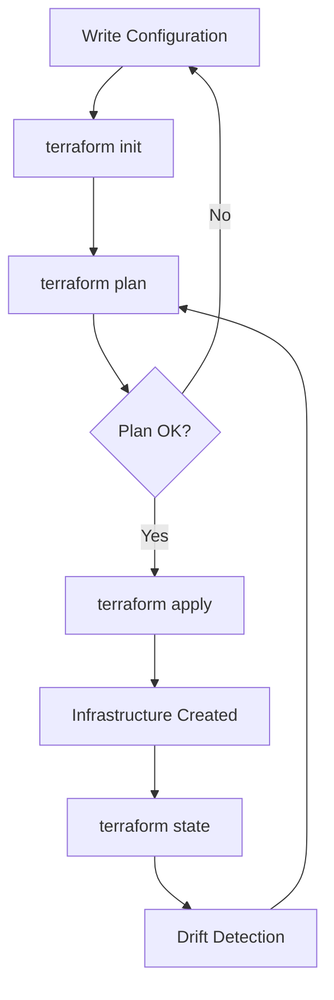
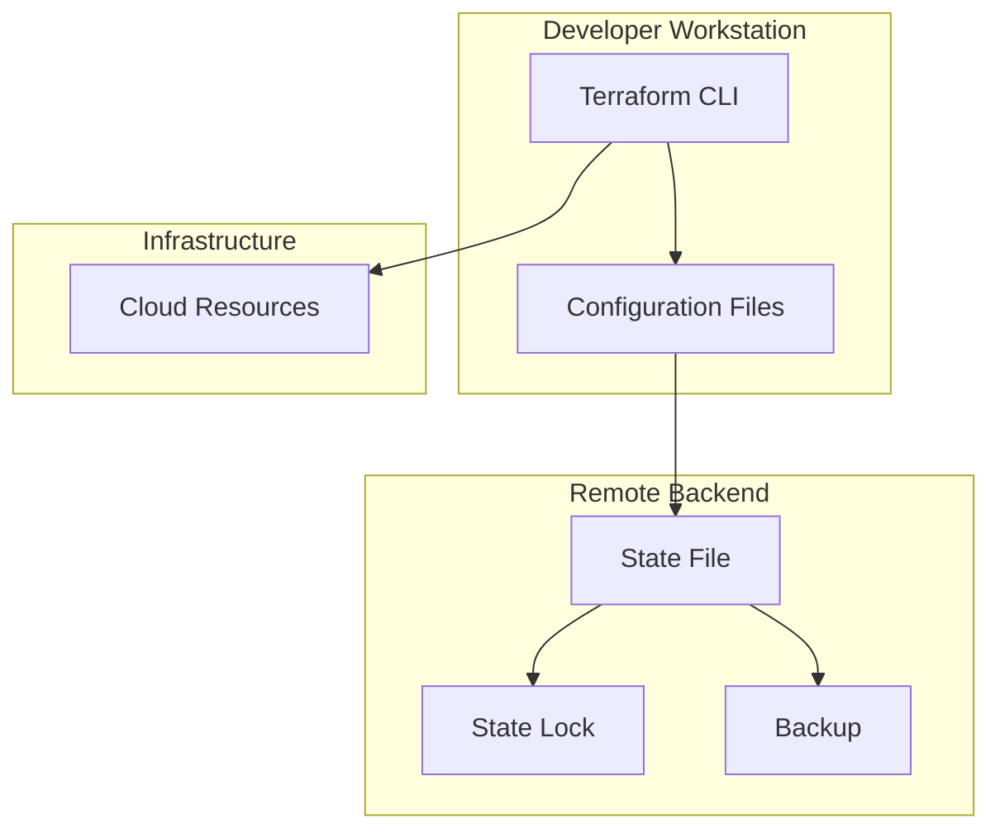
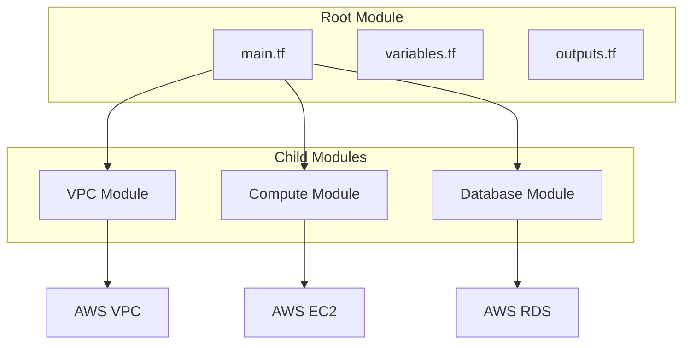

## Introduction

Terraform is an Infrastructure as Code (IaC) tool created by HashiCorp that allows you to define and provision infrastructure using declarative configuration files. It supports multiple cloud providers (AWS, Azure, GCP, etc.) and can manage a wide range of resources including compute, storage, networking, and more.

Terraform uses HashiCorp Configuration Language (HCL) to describe desired infrastructure state. It plans changes before applying them, tracks state for drift detection, and enables collaboration through remote state management. Terraform is essential for modern DevOps practices and cloud infrastructure management.

This guide covers Terraform fundamentals through advanced concepts, preparing you for IaC roles and HashiCorp certifications.

---

## Learning Roadmap

### Week 1: Terraform Fundamentals
- IaC concepts and benefits
- Terraform installation and configuration
- Providers and resources
- Variables and outputs
- terraform init, plan, apply, destroy

### Week 2: HCL Syntax and Expressions
- HCL syntax deep dive
- Variables and variable types
- Expressions and functions
- Data sources
- Conditional expressions and loops

### Week 3: State Management
- Terraform state purpose and structure
- Remote state backends
- State locking
- Import existing resources
- State manipulation commands

### Week 4: Modules and Code Organization
- Module creation and usage
- Module inputs and outputs
- Module versioning
- Code organization best practices
- Workspace management

### Week 5: Advanced Topics
- Terraform Cloud and Enterprise
- Drift detection and remediation
- Testing with Terratest
- Policy as Code with Sentinel
- Terraform 1.x features

### Week 6: Real-World Implementation
- Multi-environment deployments
- Multi-cloud strategies
- CI/CD integration
- Security best practices
- Migration from other IaC tools

---

## Theory Notes

### Terraform Workflow
1. **Write**: Define infrastructure in HCL configuration files
2. **Plan**: Preview changes before applying (terraform plan)
3. **Apply**: Create or modify infrastructure (terraform apply)
4. **Destroy**: Tear down infrastructure (terraform destroy)

### Terraform State
- **Purpose**: Maps real infrastructure to configuration
- **Structure**: JSON file tracking resource metadata and dependencies
- **Remote State**: Stored centrally for team collaboration
- **State Locking**: Prevents concurrent modifications

### Provider Architecture
- **Provider**: Plugin that manages resources for specific infrastructure
- **Resource**: Infrastructure component managed by Terraform
- **Data Source**: Query existing infrastructure
- **Output**: Values exported after apply

### HCL Syntax
```hcl
# Block structure
resource "aws_instance" "example" {
  ami           = "ami-0c55b159cbfafe1f0"
  instance_type = "t2.micro"
}

# Variables
variable "region" {
  type        = string
  default     = "us-east-1"
  description = "AWS region"
}

# Outputs
output "instance_id" {
  value = aws_instance.example.id
}
```

### Module System
- **Root Module**: Main configuration directory
- **Child Modules**: Reusable modules called from root
- **Module Registry**: Public/private module registry
- **Module Versioning**: Semantic versioning for modules

### Workspaces
- **Purpose**: Manage multiple environments with same configuration
- **Types**: Default, named, and remote workspaces
- **State**: Each workspace has separate state file
- **Use Case**: Dev/staging/prod environments

---

## Key Concepts

### Terraform Providers
1. **Official Providers**: AWS, Azure, GCP, Kubernetes, etc.
2. **Partner Providers**: Auth0, Cloudflare, Datadog, etc.
3. **Community Providers**: Third-party maintained providers
4. **Provider Configuration**: Version constraints, authentication

### Resource Management
1. **Resource Types**: aws_instance, azure_vm, google_compute_instance
2. **Resource Arguments**: Configuration for each resource type
3. **Resource Dependencies**: Implicit and explicit dependencies
4. **Resource Lifecycle**: create, update, destroy behaviors
5. **Resource Count**: Creating multiple instances

### State Management
1. **Local State**: Default, stored locally
2. **Remote State**: S3, Azure Blob, GCS, Terraform Cloud
3. **State Locking**: Prevents concurrent modifications
4. **State Backup**: Automatic backup before changes
5. **State Commands**: list, show, mv, rm, import

### Modules
1. **Module Sources**: Local paths, Terraform Registry, Git, S3
2. **Module Inputs**: Variables passed to modules
3. **Module Outputs**: Values returned from modules
4. **Module Versioning**: Pin module versions for stability
5. **Module Composition**: Nested module calls

### Testing
1. **terraform validate**: Syntax and configuration validation
2. **terraform plan**: Preview changes without applying
3. **Terratest**: Go-based testing framework
4. **terraform test**: Native testing (Terraform 1.6+)

---

## FAQ (20+ Q&A)

### Q1: What is the difference between Terraform and CloudFormation?
**A:** Terraform is multi-cloud, uses HCL, and has a state file. CloudFormation is AWS-only, uses JSON/YAML, and is managed by AWS. Terraform has larger community and more provider support.

### Q2: What is Terraform state and why is it important?
**A:** State is a JSON file mapping real infrastructure to configuration. It tracks metadata, dependencies, and enables drift detection. Without state, Terraform can't manage existing resources.

### Q3: What is the difference between terraform plan and terraform apply?
**A:** Plan previews changes without modifying infrastructure. Apply actually creates, modifies, or destroys resources. Always run plan before apply to review changes.

### Q4: What are Terraform modules?
**A:** Modules are reusable, encapsulated configurations. They promote code reuse, consistency, and maintainability. Modules can be shared via Terraform Registry or private registries.

### Q5: What is remote state and why use it?
**A:** Remote state stores state files centrally (S3, Azure Blob, Terraform Cloud). Benefits: team collaboration, state locking, backup, and access control.

### Q6: How does Terraform handle resource dependencies?
**A:** Terraform automatically determines dependencies based on resource references. Explicit dependencies can be defined with `depends_on` attribute. Understanding dependencies is crucial for correct apply order.

### Q7: What is the difference between count and for_each?
**A:** Count creates multiple resources based on a number. for_each creates resources based on a map or set. for_each is more flexible and maintains resource identity better.

### Q8: What is terraform import?
**A:** Import brings existing infrastructure into Terraform state. It doesn't generate configuration; you must write configuration matching the imported resource.

### Q9: What are provisioners in Terraform?
**A:** Provisioners execute commands on resources during creation or destruction. Use as last resort; prefer cloud-init or configuration management tools.

### Q10: What is the Terraform Registry?
**A:** Central repository for sharing Terraform modules and providers. Includes official, partner, and community contributions with versioning and documentation.

### Q11: What is drift detection?
**A:** Drift occurs when actual infrastructure diverges from Terraform configuration. `terraform plan` detects drift. Remediation: update configuration or import changes.

### Q12: What are output values in Terraform?
**A:** Outputs expose information about infrastructure. Used for display, passing values between modules, and as data sources in other configurations.

### Q13: What is the difference between variables and locals?
**A:** Variables are input parameters with optional defaults. Locals are computed values within a module. Variables are external; locals are internal.

### Q14: How do you manage secrets in Terraform?
**A:** Use environment variables, Terraform Cloud variables with sensitivity flag, or external secret management (Vault, AWS Secrets Manager). Never commit secrets to version control.

### Q15: What is workspaces in Terraform?
**A:** Workspaces allow managing multiple environments with same configuration. Each workspace has separate state. Useful for dev/staging/prod environments.

### Q16: What is terraform fmt and validate?
**A:** fmt formats configuration files to canonical style. validate checks syntax and internal consistency. Both should run in CI pipelines.

### Q17: How do you handle multiple cloud providers?
**A:** Configure multiple providers with aliases. Reference resources across providers. Use modules for provider-specific logic.

### Q18: What is the difference between terraform destroy and terraform state rm?
**A:** destroy removes all resources defined in configuration. state rm removes resource from state without destroying it (resource continues to exist).

### Q19: What are data sources in Terraform?
**A:** Data sources query existing infrastructure for use in configuration. They don't create resources; they read and filter existing resources.

### Q20: What is Sentinel in Terraform?
**A:** Sentinel is HashiCorp's policy as code framework. It enforces policies during terraform plan/apply (Enterprise/Cloud only). Use cases: cost controls, security, compliance.

### Q21: What is terraform Cloud?
**A:** SaaS platform for Terraform with remote state, collaboration, policy enforcement, and private module registry. Free tier available; paid for teams.

### Q22: How do you test Terraform configurations?
**A:** Use terraform validate/plan for basic testing. Terratest for integration testing. terraform test for native testing. Test in CI/CD pipeline before apply.

---

## Hands-on Practice

### Lab 1: Basic AWS Infrastructure
```hcl
# main.tf
terraform {
  required_providers {
    aws = {
      source  = "hashicorp/aws"
      version = "~> 5.0"
    }
  }
  
  backend "s3" {
    bucket         = "my-terraform-state"
    key            = "prod/terraform.tfstate"
    region         = "us-east-1"
    dynamodb_table = "terraform-locks"
    encrypt        = true
  }
}

provider "aws" {
  region = var.region
}

variable "region" {
  default = "us-east-1"
}

# VPC
resource "aws_vpc" "main" {
  cidr_block = "10.0.0.0/16"
  
  tags = {
    Name = "main-vpc"
  }
}

# Internet Gateway
resource "aws_internet_gateway" "main" {
  vpc_id = aws_vpc.main.id
}

# Subnet
resource "aws_subnet" "public" {
  vpc_id                  = aws_vpc.main.id
  cidr_block              = "10.0.1.0/24"
  map_public_ip_on_launch = true
  
  tags = {
    Name = "public-subnet"
  }
}

# Security Group
resource "aws_security_group" "web" {
  name        = "web-sg"
  description = "Security group for web servers"
  vpc_id      = aws_vpc.main.id
  
  ingress {
    from_port   = 80
    to_port     = 80
    protocol    = "tcp"
    cidr_blocks = ["0.0.0.0/0"]
  }
  
  egress {
    from_port   = 0
    to_port     = 0
    protocol    = "-1"
    cidr_blocks = ["0.0.0.0/0"]
  }
}

# EC2 Instance
resource "aws_instance" "web" {
  ami           = "ami-0c55b159cbfafe1f0"
  instance_type = "t2.micro"
  subnet_id     = aws_subnet.public.id
  
  vpc_security_group_ids = [aws_security_group.web.id]
  
  tags = {
    Name = "web-server"
  }
}

# Output
output "public_ip" {
  value = aws_instance.web.public_ip
}
```

### Lab 2: Module Creation
```hcl
# modules/vpc/main.tf
variable "vpc_cidr" {
  type = string
}

variable "environment" {
  type = string
}

resource "aws_vpc" "main" {
  cidr_block = var.vpc_cidr
  
  tags = {
    Name        = "${var.environment}-vpc"
    Environment = var.environment
  }
}

resource "aws_subnet" "public" {
  count             = 3
  vpc_id            = aws_vpc.main.id
  cidr_block        = cidrsubnet(var.vpc_cidr, 8, count.index)
  availability_zone = data.aws_availability_zones.available.names[count.index]
  
  map_public_ip_on_launch = true
  
  tags = {
    Name = "${var.environment}-public-${count.index + 1}"
  }
}

data "aws_availability_zones" "available" {
  state = "available"
}

output "vpc_id" {
  value = aws_vpc.main.id
}

output "subnet_ids" {
  value = aws_subnet.public[*].id
}

# Root module using the VPC module
module "vpc" {
  source = "./modules/vpc"
  
  vpc_cidr   = "10.0.0.0/16"
  environment = "production"
}
```

### Lab 3: Variables and Outputs
```hcl
# variables.tf
variable "environment" {
  description = "Environment name"
  type        = string
  
  validation {
    condition     = contains(["dev", "staging", "production"], var.environment)
    error_message = "Environment must be dev, staging, or production."
  }
}

variable "instance_type" {
  description = "EC2 instance type"
  type        = string
  default     = "t2.micro"
}

variable "instances" {
  description = "Map of instances to create"
  type = map(object({
    ami           = string
    instance_type = string
    tags          = map(string)
  }))
}

# locals.tf
locals {
  common_tags = {
    Environment = var.environment
    ManagedBy   = "Terraform"
    Project     = "my-project"
  }
  
  instance_count = length(var.instances)
}

# outputs.tf
output "instance_ids" {
  description = "Map of instance names to IDs"
  value = {
    for k, v in aws_instance.web : k => v.id
  }
}

output "public_ips" {
  description = "List of public IPs"
  value       = aws_instance.web[*].public_ip
}
```

### Lab 4: For Each and Count
```hcl
# Using count
resource "aws_instance" "web_count" {
  count = 3
  
  ami           = "ami-0c55b159cbfafe1f0"
  instance_type = "t2.micro"
  
  tags = {
    Name = "web-${count.index + 1}"
  }
}

# Using for_each with map
variable "instances" {
  default = {
    web1 = { ami = "ami-123", type = "t2.micro" }
    web2 = { ami = "ami-456", type = "t2.small" }
  }
}

resource "aws_instance" "web_each" {
  for_each = var.instances
  
  ami           = each.value.ami
  instance_type = each.value.type
  
  tags = {
    Name = each.key
  }
}

# Conditional creation
resource "aws_eip" "web" {
  count    = var.create_eip ? 1 : 0
  instance = aws_instance.web.id
}
```

---

## FAANG Questions

### Amazon/Facebook Level
1. **Design a Terraform module structure for a multi-environment deployment.**
   - Module hierarchy: root → environment → component modules
   - Separate state files per environment
   - Variable files per environment
   - CI/CD pipeline for promotion
   - Consider: State locking, access control

2. **How would you migrate existing infrastructure to Terraform?**
   - Use terraform import for existing resources
   - Write configuration matching existing resources
   - Verify with terraform plan (no changes expected)
   - Gradual migration, not big-bang
   - Consider: State management, dependencies

3. **Design a multi-account AWS strategy with Terraform.**
   - Use Terragrunt for multi-account management
   - Separate state per account
   - Shared modules across accounts
   - CI/CD for account provisioning
   - Consider: Security, cost allocation

### Google/Microsoft Level
4. **How would you handle Terraform state in a team environment?**
   - Use remote state (S3, Terraform Cloud)
   - Enable state locking
   - Implement RBAC for state access
   - Use workspaces or directory structure
   - Consider: Backup, disaster recovery

5. **Design a Terraform CI/CD pipeline.**
   - Plan on pull request
   - Apply on merge to main
   - Use Terraform Cloud for orchestration
   - Implement policy as code
   - Consider: Audit trail, rollback

### Netflix/Apple Level
6. **How would you implement blue-green deployments with Terraform?**
   - Use count or for_each for parallel environments
   - DNS switching between environments
   - Database migration strategy
   - Monitoring and health checks
   - Consider: Rollback, state management

---

## Common Mistakes

1. **Not using remote state** - Local state causes collaboration issues and data loss risk.

2. **Hard-coding secrets** - Storing sensitive data in configuration files or state.

3. **Not using modules** - Duplicating code instead of creating reusable modules.

4. **Ignoring state locking** - Concurrent modifications can corrupt state.

5. **Not validating plans** - Applying without reviewing terraform plan output.

6. **Using latest provider versions** - Not pinning versions can cause breaking changes.

7. **Creating overly complex configurations** - Over-engineering simple deployments.

8. **Not implementing drift detection** - Ignoring changes made outside Terraform.

9. **Poor resource naming** - Inconsistent naming makes management difficult.

10. **Not testing configurations** - Deploying without validation or testing.

---

## Best Practices

### Code Organization
- Use modules for reusable components
- Separate environments with workspaces or directories
- Keep configurations simple and readable
- Document with comments and README files

### State Management
- Use remote state with locking
- Enable state encryption
- Implement access controls
- Regular state backups

### Security
- Use variables for sensitive data
- Enable encryption at rest
- Implement least privilege IAM
- Scan for secrets in code

### Testing
- Run terraform validate and fmt
- Review terraform plan output
- Implement automated testing
- Test in non-production first

### CI/CD Integration
- Automate plan and apply
- Use approval gates for production
- Implement policy as code
- Maintain audit trail

---

## Cheat Sheet

### Terraform CLI Commands
```bash
# Initialize
terraform init                    # Initialize working directory
terraform init -upgrade          # Update providers/modules

# Planning
terraform plan                    # Preview changes
terraform plan -out=tfplan       # Save plan to file
terraform plan -target=resource  # Target specific resource

# Applying
terraform apply                   # Apply changes
terraform apply tfplan            # Apply saved plan
terraform apply -auto-approve    # Skip confirmation

# Destroying
terraform destroy                 # Destroy all resources
terraform destroy -target=resource # Destroy specific resource

# State
terraform state list              # List resources in state
terraform state show resource     # Show resource details
terraform state mv src dst       # Move resource in state
terraform state rm resource       # Remove from state
terraform state pull              # Pull remote state
terraform state push              # Push state file

# Import
terraform import resource id      # Import existing resource

# Formatting
terraform fmt                     # Format configuration
terraform fmt -check             # Check formatting
terraform validate                # Validate configuration
```

### Common HCL Patterns
```hcl
# Conditional
count = var.enabled ? 1 : 0

# For each
for_each = toset(["a", "b", "c"])

# Dynamic block
dynamic "ingress" {
  for_each = var.ports
  content {
    from_port = ingress.value
    to_port   = ingress.value
    protocol  = "tcp"
  }
}

# Splat expression
aws_instance.web[*].id

# Conditional expressions
environment = var.is_prod ? "production" : "development"

# File function
user_data = file("${path.module}/userdata.sh")

# Templatefile function
user_data = templatefile("${path.module}/userdata.sh", {
  server_name = var.name
})
```

### Remote State Configuration
```hcl
# AWS S3
terraform {
  backend "s3" {
    bucket         = "my-terraform-state"
    key            = "prod/terraform.tfstate"
    region         = "us-east-1"
    dynamodb_table = "terraform-locks"
    encrypt        = true
  }
}

# Azure Blob
terraform {
  backend "azurerm" {
    resource_group_name  = "my-rg"
    storage_account_name = "myterraformstate"
    container_name       = "tfstate"
    key                  = "prod.terraform.tfstate"
  }
}

# Google Cloud
terraform {
  backend "gcs" {
    bucket = "my-terraform-state"
    prefix = "prod"
  }
}
```

---

## Flash Cards (20)

**Card 1**: What is Terraform?
Infrastructure as Code tool for provisioning and managing cloud resources declaratively.

**Card 2**: What is HCL?
HashiCorp Configuration Language, Terraform's domain-specific language for configuration.

**Card 3**: What is terraform init?
Command that initializes working directory, downloads providers and modules.

**Card 4**: What is terraform plan?
Command that previews changes without modifying infrastructure.

**Card 5**: What is terraform state?
JSON file mapping configuration to real infrastructure resources.

**Card 6**: What is remote state?
Storing Terraform state centrally for team collaboration.

**Card 7**: What are Terraform modules?
Reusable, encapsulated configurations for infrastructure components.

**Card 8**: What is the Terraform Registry?
Central repository for sharing modules and providers.

**Card 9**: What are variables in Terraform?
Input parameters for customizing configuration behavior.

**Card 10**: What are outputs in Terraform?
Values exposed after apply for use in other configurations.

**Card 11**: What are data sources?
Query existing infrastructure for use in configuration.

**Card 12**: What is terraform import?
Command bringing existing infrastructure into Terraform state.

**Card 13**: What is drift detection?
Identifying when actual infrastructure diverges from configuration.

**Card 14**: What are workspaces?
Managing multiple environments with same configuration.

**Card 15**: What is terraform Cloud?
SaaS platform for collaborative Terraform with remote state.

**Card 16**: What is Sentinel?
Policy as code framework for Terraform (Enterprise/Cloud).

**Card 17**: What is count in Terraform?
Creating multiple resource instances based on a number.

**Card 18**: What is for_each in Terraform?
Creating resources from a map or set with better identity tracking.

**Card 19**: What are provisioners?
Executing commands on resources during creation/destruction (use sparingly).

**Card 20**: What is Terratest?
Go-based testing framework for Terraform configurations.

---

## Mind Map

```
Terraform
├── Core Concepts
│   ├── Providers
│   ├── Resources
│   ├── Data Sources
│   ├── Variables
│   └── Outputs
├── State Management
│   ├── Local State
│   ├── Remote State
│   ├── State Locking
│   └── State Commands
├── Modules
│   ├── Creating Modules
│   ├── Module Registry
│   ├── Versioning
│   └── Best Practices
├── HCL Syntax
│   ├── Expressions
│   ├── Functions
│   ├── Dynamic Blocks
│   └── Conditional Logic
├── Workspaces
│   ├── Default Workspace
│   ├── Named Workspaces
│   └── Environment Management
├── Testing
│   ├── Validate
│   ├── Plan
│   ├── Terratest
│   └── terraform test
└── Advanced
    ├── Terraform Cloud
    ├── Sentinel
    ├── Multi-Cloud
    └── Migration Strategies
```

---

## Mermaid Diagrams

### Terraform Workflow


### State Management Architecture


### Module Structure


---

## Code Examples

### Complete Multi-Environment Setup
```hcl
# environments/prod/main.tf
module "vpc" {
  source = "../../modules/vpc"
  
  vpc_cidr       = "10.0.0.0/16"
  environment    = "production"
  azs            = ["us-east-1a", "us-east-1b", "us-east-1c"]
  public_subnets = ["10.0.1.0/24", "10.0.2.0/24", "10.0.3.0/24"]
}

module "eks" {
  source = "../../modules/eks"
  
  cluster_name    = "prod-cluster"
  cluster_version = "1.27"
  vpc_id          = module.vpc.vpc_id
  subnet_ids      = module.vpc.public_subnet_ids
  
  node_groups = {
    general = {
      desired_size = 3
      min_size     = 2
      max_size     = 5
      instance_types = ["t3.large"]
    }
  }
}

module "rds" {
  source = "../../modules/rds"
  
  identifier     = "prod-db"
  engine         = "postgres"
  engine_version = "14"
  instance_class = "db.t3.large"
  
  allocated_storage     = 100
  max_allocated_storage = 500
  
  db_name  = "myapp"
  username = var.db_username
  password = var.db_password
  
  vpc_id     = module.vpc.vpc_id
  subnet_ids = module.vpc.private_subnet_ids
}
```

### CI/CD Pipeline
```yaml
# .github/workflows/terraform.yml
name: Terraform

on:
  push:
    branches: [main]
  pull_request:
    branches: [main]

jobs:
  terraform:
    runs-on: ubuntu-latest
    
    steps:
      - uses: actions/checkout@v3
      
      - name: Setup Terraform
        uses: hashicorp/setup-terraform@v2
        with:
          terraform_version: 1.5.0
      
      - name: Terraform Init
        run: terraform init
        working-directory: ./environments/prod
      
      - name: Terraform Format
        run: terraform fmt -check
        working-directory: ./environments/prod
      
      - name: Terraform Validate
        run: terraform validate
        working-directory: ./environments/prod
      
      - name: Terraform Plan
        run: terraform plan -out=tfplan
        working-directory: ./environments/prod
        if: github.event_name == 'pull_request'
      
      - name: Terraform Apply
        run: terraform apply -auto-approve tfplan
        working-directory: ./environments/prod
        if: github.ref == 'refs/heads/main' && github.event_name == 'push'
```

---

## Projects

### Project 1: AWS Infrastructure
Complete AWS setup with Terraform:
- VPC with public/private subnets
- EKS cluster for Kubernetes
- RDS for database
- S3 for storage
- CloudFront for CDN
- IAM roles and policies

### Project 2: Multi-Cloud Deployment
Deploy across AWS and Azure:
- Shared modules for similar resources
- Separate providers per cloud
- Unified state management
- Cross-cloud networking

### Project 3: Terraform Module Library
Create reusable modules:
- VPC module
- EKS module
- RDS module
- Monitoring module
- Documentation and examples

---

## Resources

### Official Documentation
- [Terraform Documentation](https://developer.hashicorp.com/terraform/docs)
- [Terraform Registry](https://registry.terraform.io/)
- [Terraform Cloud](https://www.terraform.io/cloud)
- [HashiCorp Learn](https://developer.hashicorp.com/terraform/tutorials)

### Certifications
- **HashiCorp Certified: Terraform Associate**
- Study guide and practice exams available

### Learning Platforms
- HashiCorp Learn (free official tutorials)
- Plurish Terraform Course
- A Cloud Guru Terraform Deep Dive

### Tools
- **Terragrunt**: Thin wrapper for DRY Terraform
- **TFLint**: Terraform linter
- **Checkov**: Infrastructure security scanner
- **Infracost**: Cost estimation for Terraform

---

## Checklist

- [ ] Install and configure Terraform
- [ ] Understand HCL syntax
- [ ] Create basic infrastructure with Terraform
- [ ] Use variables and outputs
- [ ] Implement remote state
- [ ] Create and use modules
- [ ] Understand state management
- [ ] Implement workspaces
- [ ] Test configurations
- [ ] Integrate with CI/CD
- [ ] Implement security best practices
- [ ] Migrate existing infrastructure
- [ ] Prepare for certification exam

---

## Mock Interviews

### Scenario 1: Terraform Engineer
**Interviewer**: "How would you organize Terraform code for a multi-environment deployment?"

**Key Points to Cover**:
- Directory structure: environments/{dev,staging,prod}
- Shared modules in separate directory
- Remote state per environment
- Variable files per environment
- CI/CD pipeline for promotion
- Consider: State locking, access control

### Scenario 2: Infrastructure Architect
**Interviewer**: "Design a Terraform strategy for a multi-account AWS organization."

**Key Points to Cover**:
- Terragrunt for multi-account management
- Separate state per account
- Shared modules across accounts
- Organization-level policies
- CI/CD for account provisioning
- Consider: Security, cost allocation

### Scenario 3: DevOps Engineer
**Interviewer**: "How would you handle Terraform state corruption?"

**Key Points to Cover**:
- Detect with terraform plan showing unexpected changes
- Use state backup to restore
- Manually fix state with state commands
- Implement prevention measures
- Consider: Recovery time, data loss

---

## Difficulty Rating

| Topic | Difficulty | Time to Learn |
|-------|------------|---------------|
| Terraform Basics | ⭐⭐ | 1-2 weeks |
| HCL Syntax | ⭐⭐ | 1-2 weeks |
| State Management | ⭐⭐⭐ | 2-3 weeks |
| Modules | ⭐⭐⭐ | 2-3 weeks |
| Workspaces | ⭐⭐ | 1 week |
| Testing | ⭐⭐⭐ | 2-3 weeks |
| Terraform Cloud | ⭐⭐⭐ | 2-3 weeks |
| Multi-Cloud | ⭐⭐⭐⭐ | 3-4 weeks |
| Migration | ⭐⭐⭐⭐ | 3-4 weeks |
| Advanced Patterns | ⭐⭐⭐⭐⭐ | 4-6 weeks |

---

## Summary

Terraform is the leading Infrastructure as Code tool. Key areas for interviews include:

1. **Fundamentals**: Understanding providers, resources, and HCL syntax
2. **State Management**: Remote state, locking, and drift detection
3. **Modules**: Creating reusable, maintainable infrastructure code
4. **Workspaces**: Managing multiple environments
5. **Testing**: Validation, planning, and automated testing
6. **CI/CD**: Pipeline integration and automation
7. **Security**: Secret management and best practices
8. **Multi-Cloud**: Strategies for multiple cloud providers

Mastering Terraform prepares you for infrastructure engineering and cloud architecture roles.

