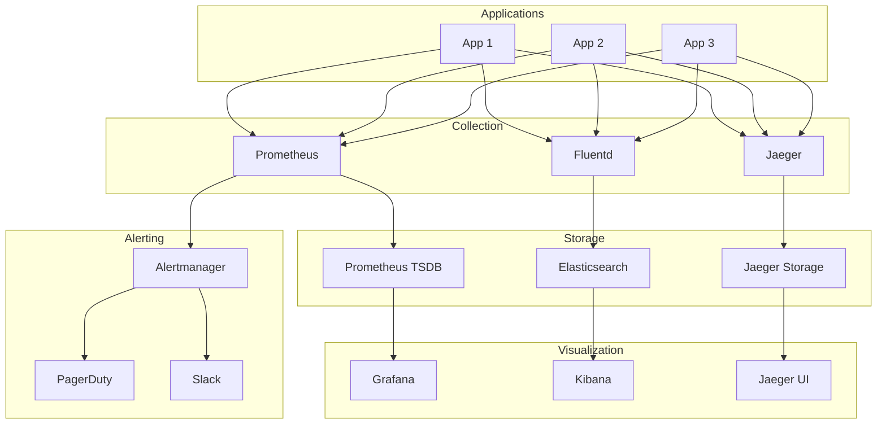
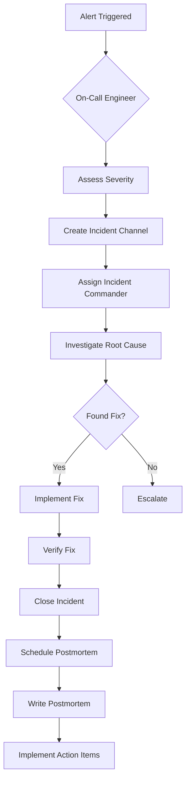
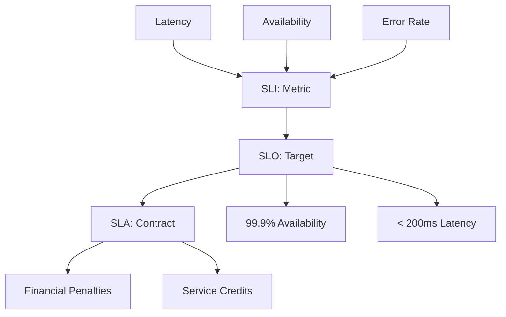

## Introduction

Monitoring and observability are essential practices for understanding system behavior, detecting issues, and ensuring reliability. Monitoring involves collecting and analyzing metrics, logs, and traces, while observability enables understanding system internal state from external outputs.

Modern distributed systems require comprehensive monitoring to maintain reliability, performance, and security. The three pillars of observability—metrics, logs, and traces—provide complete visibility into system behavior.

Understanding monitoring and observability is crucial for SREs, DevOps engineers, and developers building reliable systems.

---

## Learning Roadmap

### Week 1: Monitoring Fundamentals
- Monitoring vs observability
- Three pillars: metrics, logs, traces
- SLAs, SLOs, SLIs
- Alerting strategies
- Dashboard design

### Week 2: Metrics and Prometheus
- Time-series data concepts
- Prometheus architecture
- PromQL query language
- Alertmanager
- Grafana visualization

### Week 3: Logging
- Centralized logging concepts
- ELK Stack (Elasticsearch, Logstash, Kibana)
- Fluentd and Fluent Bit
- Structured logging
- Log aggregation strategies

### Week 4: Distributed Tracing
- Tracing concepts
- Jaeger and Zipkin
- OpenTelemetry
- Trace context propagation
- Performance analysis

### Week 5: Alerting and Incident Management
- Alert design and best practices
- On-call rotations
- Incident response
- Postmortems
- Runbooks

### Week 6: Advanced Topics
- APM tools (Datadog, New Relic, Dynatrace)
- Cost optimization
- Monitoring at scale
- Compliance and auditing
- Future trends

---

## Theory Notes

### Three Pillars of Observability
1. **Metrics**: Numerical measurements over time (CPU, memory, request count)
2. **Logs**: Discrete event records with timestamps and context
3. **Traces**: Request flow through distributed systems

### SLAs, SLOs, SLIs
- **SLI (Service Level Indicator)**: Metric measuring service performance (e.g., latency, availability)
- **SLO (Service Level Objective)**: Target value for SLI (e.g., 99.9% availability)
- **SLA (Service Level Agreement)**: Contract defining consequences of missing SLO

### Four Golden Signals (Google SRE)
1. **Latency**: Time to serve a request
2. **Traffic**: Demand placed on system
3. **Errors**: Rate of failed requests
4. **Saturation**: How full service is

### RED Method (Weaveworks)
- **Rate**: Requests per second
- **Errors**: Errors per second
- **Duration**: Distribution of request latencies

### USE Method (Brendan Gregg)
- **Utilization**: Percentage of resource used
- **Saturation**: Degree of queued work
- **Errors**: Error count

---

## Key Concepts

### Metrics
1. **Counter**: Monotonically increasing value (request count)
2. **Gauge**: Value that can increase or decrease (temperature)
3. **Histogram**: Distribution of values (request latency)
4. **Summary**: Similar to histogram, calculated quantiles

### Logging
1. **Structured Logging**: Log entries as key-value pairs (JSON)
2. **Log Levels**: DEBUG, INFO, WARN, ERROR, FATAL
3. **Log Aggregation**: Centralized collection from multiple sources
4. **Log Retention**: How long to keep logs

### Tracing
1. **Span**: Single unit of work in a trace
2. **Trace**: Complete journey of a request through system
3. **Context Propagation**: Passing trace context between services
4. **Sampling**: Reducing trace volume for performance

### Alerting
1. **Alert Rules**: Conditions that trigger notifications
2. **Alertmanager**: Handles alert routing and deduplication
3. **Escalation Policies**: Alert routing to appropriate responders
4. **Runbooks**: Step-by-step procedures for responding to alerts

### Dashboards
1. **Overview Dashboard**: High-level system health
2. **Service Dashboard**: Individual service metrics
3. **Infrastructure Dashboard**: Server and network metrics
4. **Business Dashboard**: Key business metrics

---

## FAQ (20+ Q&A)

### Q1: What is the difference between monitoring and observability?
**A:** Monitoring tells you what's broken; observability tells you why. Monitoring uses predefined metrics and alerts; observability enables ad-hoc exploration of system state.

### Q2: What are SLAs, SLOs, and SLIs?
**A:** SLI: Metric measuring performance. SLO: Target value for SLI. SLA: Contract with consequences for missing SLO. Example: 99.9% availability SLO with financial penalties.

### Q3: What is the difference between Prometheus and Grafana?
**A:** Prometheus collects and stores metrics. Grafana visualizes metrics with dashboards. Prometheus includes Alertmanager for alerting.

### Q4: What is structured logging?
**A:** Logging in a structured format (JSON) with consistent fields. Enables easier parsing, filtering, and analysis compared to unstructured text logs.

### Q5: What is distributed tracing?
**A:** Tracking requests as they flow through multiple services. Provides visibility into service dependencies and performance bottlenecks.

### Q6: What is the ELK Stack?
**A:** Elasticsearch (search/analytics), Logstash (log processing), Kibana (visualization). Popular centralized logging solution.

### Q7: What is OpenTelemetry?
**A:** Vendor-neutral standard for collecting telemetry data (metrics, logs, traces). Provides SDKs and collectors for instrumentation.

### Q8: What is alert fatigue?
**A:** Condition where too many alerts cause responders to ignore or delay responding. Caused by noisy, non-actionable alerts.

### Q9: What is a runbook?
**A:** Step-by-step procedures for responding to specific alerts. Helps responders handle incidents consistently and quickly.

### Q10: What is the difference between pull and push metrics?
**A:** Pull: Prometheus scrapes metrics from endpoints. Push: Applications push metrics to collector (Pushgateway, StatsD).

### Q11: What is PromQL?
**A:** Prometheus Query Language for querying and aggregating time-series data. Supports math, aggregation, and prediction functions.

### Q12: What is a service level indicator?
**A:** Metric measuring service performance from user perspective. Examples: availability, latency, error rate, throughput.

### Q13: What is error budget?
**A:** Acceptable level of unreliability based on SLO. If SLO is 99.9%, error budget is 0.1%. Teams can spend budget on faster releases.

### Q14: What is incident management?
**A:** Process for detecting, responding to, and resolving incidents. Includes escalation, communication, resolution, and postmortem.

### Q15: What is a postmortem?
**A:** Blameless analysis after an incident focusing on root cause and prevention strategies. Improves system reliability through learning.

### Q16: What is Prometheus remote storage?
**A:** Storing Prometheus metrics in external systems (Thanos, Cortex, Mimir) for long-term storage and high availability.

### Q17: What is log sampling?
**A:** Reducing log volume by recording only a subset of events. Helps manage costs while maintaining visibility.

### Q18: What is APM?
**A:** Application Performance Monitoring providing detailed insights into application performance, including code-level tracing.

### Q19: What is the difference between metrics and logs?
**A:** Metrics: Aggregated numerical data over time. Logs: Individual event records with context. Metrics for trends; logs for debugging.

### Q20: What is trace sampling?
**A:** Reducing trace volume by recording only a percentage of requests. Strategies: head-based, tail-based sampling.

### Q21: What is synthetic monitoring?
**A:** Simulating user requests to monitor availability and performance. Proactively detects issues before users are affected.

### Q22: What is real user monitoring (RUM)?
**A:** Capturing actual user interactions with applications. Provides real-world performance data from user perspective.

---

## Hands-on Practice

### Lab 1: Prometheus and Grafana Setup
```yaml
# docker-compose.yml
version: '3.8'

services:
  prometheus:
    image: prom/prometheus
    ports:
      - "9090:9090"
    volumes:
      - ./prometheus.yml:/etc/prometheus/prometheus.yml
      - prometheus_data:/prometheus
  
  grafana:
    image: grafana/grafana
    ports:
      - "3000:3000"
    volumes:
      - grafana_data:/var/lib/grafana
    environment:
      - GF_SECURITY_ADMIN_PASSWORD=admin
  
  alertmanager:
    image: prom/alertmanager
    ports:
      - "9093:9093"
    volumes:
      - ./alertmanager.yml:/etc/alertmanager/alertmanager.yml

volumes:
  prometheus_data:
  grafana_data:
```

### Lab 2: Prometheus Configuration
```yaml
# prometheus.yml
global:
  scrape_interval: 15s
  evaluation_interval: 15s

alerting:
  alertmanagers:
    - static_configs:
        - targets: ['alertmanager:9093']

rule_files:
  - 'alerts.yml'

scrape_configs:
  - job_name: 'prometheus'
    static_configs:
      - targets: ['localhost:9090']
  
  - job_name: 'node-exporter'
    static_configs:
      - targets: ['node-exporter:9100']
  
  - job_name: 'app'
    static_configs:
      - targets: ['app:8080']
    metrics_path: '/metrics'
```

### Lab 3: Alert Rules
```yaml
# alerts.yml
groups:
  - name: application
    rules:
      - alert: HighErrorRate
        expr: |
          sum(rate(http_requests_total{status=~"5.."}[5m])) by (service)
          /
          sum(rate(http_requests_total[5m])) by (service)
          > 0.05
        for: 5m
        labels:
          severity: critical
        annotations:
          summary: "High error rate for {{ $labels.service }}"
          description: "Error rate is {{ $value | humanizePercentage }}"
      
      - alert: HighLatency
        expr: |
          histogram_quantile(0.99, 
            sum(rate(http_request_duration_seconds_bucket[5m])) by (le, service)
          ) > 1
        for: 5m
        labels:
          severity: warning
        annotations:
          summary: "High latency for {{ $labels.service }}"
          description: "99th percentile latency is {{ $value }}s"
      
      - alert: ServiceDown
        expr: up == 0
        for: 1m
        labels:
          severity: critical
        annotations:
          summary: "Service {{ $labels.job }} is down"
```

### Lab 4: Node.js Application Metrics
```javascript
const promClient = require('prom-client');

// Create metrics
const httpRequestDuration = new promClient.Histogram({
  name: 'http_request_duration_seconds',
  help: 'Duration of HTTP requests in seconds',
  labelNames: ['method', 'route', 'status_code'],
  buckets: [0.1, 0.5, 1, 2, 5]
});

const httpRequestTotal = new promClient.Counter({
  name: 'http_requests_total',
  help: 'Total number of HTTP requests',
  labelNames: ['method', 'route', 'status_code']
});

// Middleware to collect metrics
const metricsMiddleware = (req, res, next) => {
  const end = httpRequestDuration.startTimer();
  
  res.on('finish', () => {
    end({ method: req.method, route: req.route?.path, status_code: res.statusCode });
    httpRequestTotal.inc({ method: req.method, route: req.route?.path, status_code: res.statusCode });
  });
  
  next();
};

// Expose metrics endpoint
app.get('/metrics', async (req, res) => {
  res.set('Content-Type', promClient.register.contentType);
  res.end(await promClient.register.metrics());
});
```

### Lab 5: ELK Stack Configuration
```yaml
# docker-compose.yml
version: '3.8'

services:
  elasticsearch:
    image: docker.elastic.co/elasticsearch/elasticsearch:8.10.0
    environment:
      - discovery.type=single-node
      - xpack.security.enabled=false
    ports:
      - "9200:9200"
    volumes:
      - es_data:/usr/share/elasticsearch/data
  
  logstash:
    image: docker.elastic.co/logstash/logstash:8.10.0
    volumes:
      - ./logstash.conf:/usr/share/logstash/pipeline/logstash.conf
    ports:
      - "5044:5044"
  
  kibana:
    image: docker.elastic.co/kibana/kibana:8.10.0
    ports:
      - "5601:5601"
    environment:
      - ELASTICSEARCH_HOSTS=http://elasticsearch:9200

volumes:
  es_data:
```

---

## FAANG Questions

### Amazon/Facebook Level
1. **Design a monitoring system for a microservices architecture.**
   - Metrics collection (Prometheus)
   - Centralized logging (ELK)
   - Distributed tracing (Jaeger)
   - Alerting strategy (Alertmanager)
   - Dashboards (Grafana)
   - Consider: Cost, scalability, retention

2. **How would you implement SLAs for a critical service?**
   - Define SLIs (availability, latency, error rate)
   - Set SLOs based on business requirements
   - Implement monitoring and alerting
   - Track error budgets
   - Regular SLO reviews

3. **Design an incident management process.**
   - Detection and alerting
   - Escalation procedures
   - Communication channels
   - Resolution and verification
   - Postmortem and prevention

### Google/Microsoft Level
4. **How would you optimize monitoring costs?**
   - Sampling strategies for traces and logs
   - Retention policies
   - Aggregation and rollups
   - Cost allocation by service
   - Tool consolidation

5. **Design a dashboard for a production service.**
   - Four golden signals
   - Service dependencies
   - Error analysis
   - Performance trends
   - Business metrics

### Netflix/Apple Level
6. **How would you implement observability for a serverless architecture?**
   - AWS CloudWatch / Azure Monitor / GCP Cloud Monitoring
   - Custom metrics and logs
   - Distributed tracing with X-Ray / OpenTelemetry
   - Cost monitoring
   - Cold start tracking

---

## Common Mistakes

1. **Too many alerts** - Creating noisy alerts that cause alert fatigue.

2. **Not having runbooks** - No documentation for responding to alerts.

3. **Ignoring log levels** - Not using appropriate log levels, making debugging difficult.

4. **No retention policies** - Keeping all data forever, increasing costs.

5. **Missing dashboards** - No visibility into system health and performance.

6. **Not monitoring dependencies** - External services not monitored.

7. **Alerting on symptoms, not causes** - Alerting on CPU instead of user-facing issues.

8. **No synthetic monitoring** - Not proactively testing user-facing services.

9. **Ignoring distributed tracing** - Not implementing tracing in microservices.

10. **No postmortem process** - Not learning from incidents.

---

## Best Practices

### Metrics
- Follow RED/USE methods
- Use meaningful labels
- Set appropriate retention
- Implement recording rules for expensive queries
- Use histograms for latency

### Logging
- Use structured logging (JSON)
- Include context (request ID, user ID)
- Set appropriate log levels
- Implement log aggregation
- Use correlation IDs

### Tracing
- Implement distributed tracing
- Use sampling strategies
- Propagate context across services
- Instrument critical paths
- Monitor trace completeness

### Alerting
- Alert on symptoms, not causes
- Make alerts actionable
- Include runbook links
- Implement escalation policies
- Regular alert review

### Dashboards
- Follow four golden signals
- Include service dependencies
- Show error rates and latency
- Add business metrics
- Keep dashboards simple

---

## Cheat Sheet

### Prometheus Queries
```promql
# Request rate
rate(http_requests_total[5m])

# Error rate
sum(rate(http_requests_total{status=~"5.."}[5m])) / sum(rate(http_requests_total[5m]))

# 99th percentile latency
histogram_quantile(0.99, sum(rate(http_request_duration_seconds_bucket[5m])) by (le))

# Top 5 services by error rate
topk(5, sum(rate(http_requests_total{status=~"5.."}[5m])) by (service))

# CPU usage per instance
100 - (avg by(instance) (irate(node_cpu_seconds_total{mode="idle"}[5m])) * 100)
```

### Log Analysis Commands
```bash
# Search logs
grep "ERROR" /var/log/app.log

# Count errors
grep -c "ERROR" /var/log/app.log

# Tail logs
tail -f /var/log/app.log

# Parse JSON logs
cat log.json | jq '.message'

# Filter by time
awk '/2024-01-01 10:00/,/2024-01-01 11:00/' app.log
```

### Grafana Dashboard Tips
```json
{
  "panels": [
    {
      "type": "graph",
      "title": "Request Rate",
      "targets": [
        {
          "expr": "rate(http_requests_total[5m])",
          "legendFormat": "{{service}}"
        }
      ]
    }
  ]
}
```

---

## Flash Cards (20)

**Card 1**: What is observability?
Understanding system internal state from external outputs (metrics, logs, traces).

**Card 2**: What is the difference between monitoring and observability?
Monitoring tells you what's broken; observability tells you why.

**Card 3**: What is an SLI?
Service Level Indicator - metric measuring service performance.

**Card 4**: What is an SLO?
Service Level Objective - target value for SLI.

**Card 5**: What is an SLA?
Service Level Agreement - contract defining consequences of missing SLO.

**Card 6**: What are the four golden signals?
Latency, Traffic, Errors, Saturation.

**Card 7**: What is Prometheus?
Open-source metrics collection and alerting toolkit.

**Card 8**: What is Grafana?
Open-source visualization and analytics platform.

**Card 9**: What is Alertmanager?
Prometheus component handling alert routing and deduplication.

**Card 10**: What is the ELK Stack?
Elasticsearch, Logstash, Kibana - centralized logging solution.

**Card 11**: What is OpenTelemetry?
Vendor-neutral standard for collecting telemetry data.

**Card 12**: What is distributed tracing?
Tracking requests as they flow through multiple services.

**Card 13**: What is a span?
Single unit of work in a distributed trace.

**Card 14**: What is structured logging?
Logging in structured format (JSON) with consistent fields.

**Card 15**: What is alert fatigue?
Condition where too many alerts cause responders to ignore alerts.

**Card 16**: What is a runbook?
Step-by-step procedures for responding to specific alerts.

**Card 17**: What is a postmortem?
Blameless analysis after an incident focusing on prevention.

**Card 18**: What is APM?
Application Performance Monitoring with code-level insights.

**Card 19**: What is error budget?
Acceptable level of unreliability based on SLO.

**Card 20**: What is synthetic monitoring?
Simulating user requests to monitor availability proactively.

---

## Mind Map

```
Monitoring & Observability
├── Metrics
│   ├── Prometheus
│   ├── Grafana
│   ├── Alertmanager
│   └── Time-series Databases
├── Logs
│   ├── ELK Stack
│   ├── Fluentd
│   ├── Log Levels
│   └── Structured Logging
├── Traces
│   ├── Jaeger
│   ├── Zipkin
│   ├── OpenTelemetry
│   └── Sampling
├── Alerting
│   ├── Alert Rules
│   ├── Escalation
│   ├── On-Call
│   └── Runbooks
├── Incident Management
│   ├── Detection
│   ├── Response
│   ├── Resolution
│   └── Postmortem
└── Dashboards
    ├── Overview
    ├── Service
    ├── Infrastructure
    └── Business
```

---

## Mermaid Diagrams

### Monitoring Architecture


### Incident Response Flow


### SLA/SLO/SLI Relationship


---

## Code Examples

### Prometheus Client - Node.js
```javascript
const express = require('express');
const promClient = require('prom-client');

const app = express();

// Create and register metrics
const httpRequestDuration = new promClient.Histogram({
  name: 'http_request_duration_seconds',
  help: 'Duration of HTTP requests in seconds',
  labelNames: ['method', 'route', 'status_code'],
  buckets: [0.1, 0.5, 1, 2, 5, 10]
});

const httpRequestTotal = new promClient.Counter({
  name: 'http_requests_total',
  help: 'Total number of HTTP requests',
  labelNames: ['method', 'route', 'status_code']
});

const activeConnections = new promClient.Gauge({
  name: 'active_connections',
  help: 'Number of active connections'
});

// Collect default metrics
promClient.collectDefaultMetrics();

// Middleware
app.use((req, res, next) => {
  const end = httpRequestDuration.startTimer();
  activeConnections.inc();
  
  res.on('finish', () => {
    end({ method: req.method, route: req.route?.path, status_code: res.statusCode });
    httpRequestTotal.inc({ method: req.method, route: req.route?.path, status_code: res.statusCode });
    activeConnections.dec();
  });
  
  next();
});

// Metrics endpoint
app.get('/metrics', async (req, res) => {
  res.set('Content-Type', promClient.register.contentType);
  res.end(await promClient.register.metrics());
});

app.listen(3000);
```

### ELK Stack - Logstash Configuration
```ruby
# logstash.conf
input {
  file {
    path => "/var/log/app/*.log"
    start_position => "beginning"
  }
  
  beats {
    port => 5044
  }
}

filter {
  grok {
    match => { "message" => "%{TIMESTAMP_ISO8601:timestamp} %{LOGLEVEL:level} %{GREEDYDATA:message}" }
  }
  
  date {
    match => [ "timestamp", "yyyy-MM-dd HH:mm:ss" ]
  }
  
  mutate {
    remove_field => [ "timestamp" ]
  }
  
  if [level] == "ERROR" {
    mutate {
      add_tag => [ "error" ]
    }
  }
}

output {
  elasticsearch {
    hosts => ["elasticsearch:9200"]
    index => "app-logs-%{+YYYY.MM.dd}"
  }
  
  stdout {
    codec => rubydebug
  }
}
```

---

## Projects

### Project 1: Complete Monitoring Stack
Deploy Prometheus, Grafana, and ELK:
- Prometheus for metrics
- Grafana for dashboards
- ELK for logs
- Jaeger for traces
- Alertmanager for alerts

### Project 2: Application Monitoring
Implement monitoring for a web application:
- Custom metrics collection
- Structured logging
- Distributed tracing
- Dashboards for all services
- Alerting rules

### Project 3: Incident Management System
Build incident management process:
- Alerting and escalation
- On-call rotation
- Incident tracking
- Postmortem templates
- Action item tracking

---

## Resources

### Official Documentation
- [Prometheus](https://prometheus.io/docs/)
- [Grafana](https://grafana.com/docs/)
- [Elasticsearch](https://www.elastic.co/guide/)
- [Jaeger](https://www.jaegertracing.io/docs/)
- [OpenTelemetry](https://opentelemetry.io/docs/)

### Books
- "Site Reliability Engineering" by Google
- "Observability Engineering" by Charity Majors
- "Monitoring Distributed Systems" by Google

### Tools
- **Metrics**: Prometheus, Grafana, Datadog, New Relic
- **Logs**: ELK Stack, Fluentd, Loki
- **Traces**: Jaeger, Zipkin, OpenTelemetry

---

## Checklist

- [ ] Understand three pillars of observability
- [ ] Set up Prometheus and Grafana
- [ ] Implement structured logging
- [ ] Configure ELK Stack
- [ ] Implement distributed tracing
- [ ] Design alert rules
- [ ] Create dashboards
- [ ] Establish incident management
- [ ] Write runbooks
- [ ] Conduct postmortems

---

## Mock Interviews

### Scenario 1: SRE
**Interviewer**: "Design a monitoring system for a microservices architecture."

**Key Points to Cover**:
- Metrics collection (Prometheus)
- Centralized logging (ELK)
- Distributed tracing (Jaeger)
- Alerting strategy
- Dashboard design
- Consider: Cost, scalability

### Scenario 2: DevOps Engineer
**Interviewer**: "How would you implement SLAs for a critical service?"

**Key Points to Cover**:
- Define SLIs
- Set SLOs
- Implement monitoring
- Track error budgets
- Regular reviews

### Scenario 3: Incident Commander
**Interviewer**: "Design an incident management process."

**Key Points to Cover**:
- Detection and alerting
- Escalation procedures
- Communication
- Resolution
- Postmortems

---

## Difficulty Rating

| Topic | Difficulty | Time to Learn |
|-------|------------|---------------|
| Monitoring Basics | ⭐ | 1 week |
| Prometheus | ⭐⭐⭐ | 2-3 weeks |
| Grafana | ⭐⭐ | 1-2 weeks |
| ELK Stack | ⭐⭐⭐ | 2-3 weeks |
| Distributed Tracing | ⭐⭐⭐ | 2-3 weeks |
| Alerting | ⭐⭐ | 1-2 weeks |
| Incident Management | ⭐⭐⭐ | 2-3 weeks |
| Observability | ⭐⭐⭐⭐ | 3-4 weeks |

---

## Summary

Monitoring and observability are essential for system reliability. Key areas for interviews include:

1. **Three Pillars**: Metrics, logs, and traces
2. **SLAs/SLOs/SLIs**: Defining and tracking reliability targets
3. **Prometheus/Grafana**: Metrics collection and visualization
4. **ELK Stack**: Centralized logging
5. **Distributed Tracing**: Request flow through services
6. **Alerting**: Designing actionable alerts
7. **Incident Management**: Response and postmortems
8. **Best Practices**: Four golden signals, RED/USE methods

Mastering monitoring prepares you for SRE and reliability engineering roles.

