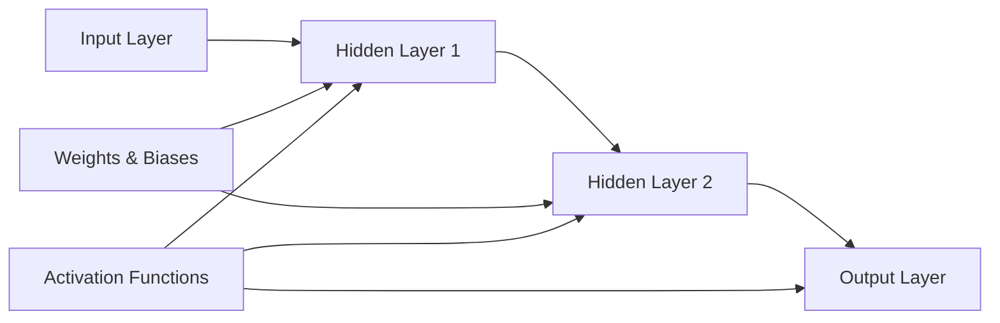
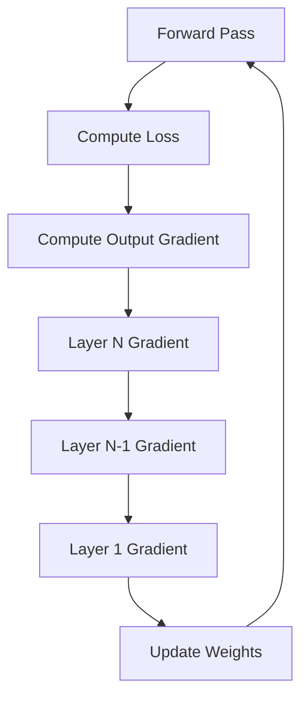
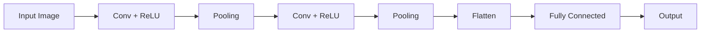
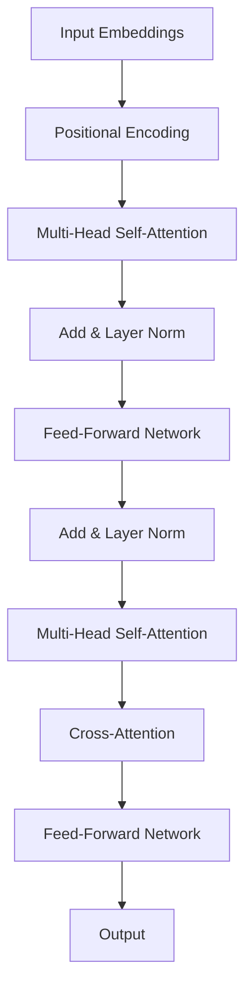
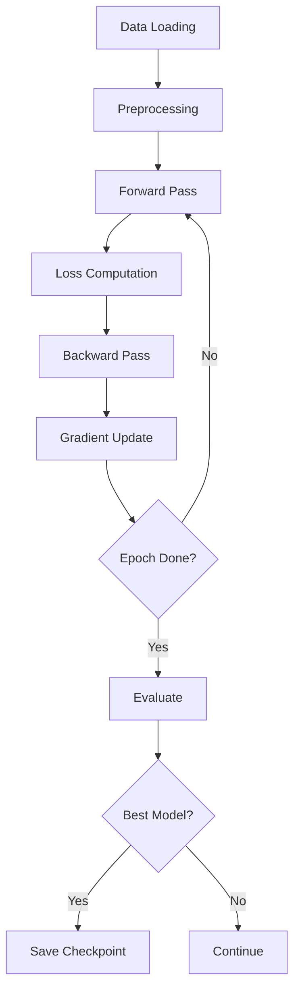

## Table of Contents
- [Introduction](#introduction)
- [Learning Roadmap](#learning-roadmap)
- [Theory Notes](#theory-notes)
- [Key Concepts](#key-concepts)
- [FAQ (20+ Q&A)](#faq-20-qa)
- [Hands-on Practice](#hands-on-practice)
- [FAANG Questions](#faang-questions)
- [Common Mistakes](#common-mistakes)
- [Best Practices](#best-practices)
- [Cheat Sheet](#cheat-sheet)
- [Flash Cards](#flash-cards-20)
- [Mind Map](#mind-map)
- [Mermaid Diagrams](#mermaid-diagrams)
- [Code Examples](#code-examples)
- [Projects](#projects)
- [Resources](#resources)
- [Checklist](#checklist)
- [Revision Plans](#revision-plans)
- [Mock Interviews](#mock-interviews)
- [Difficulty Rating](#difficulty-rating)
- [Summary](#summary)

---

## Introduction

Deep Learning is a subfield of machine learning based on artificial neural networks with multiple layers (hence "deep"). These networks learn hierarchical representations of data, automatically discovering intricate patterns and features at multiple levels of abstraction. Deep learning has revolutionized fields like computer vision, natural language processing, speech recognition, and game playing.

Unlike traditional machine learning where feature engineering is manual, deep learning models learn features directly from raw data. This has enabled breakthroughs in tasks that were previously considered extremely difficult, such as image classification (surpassing human-level performance), machine translation, and conversational AI.

Deep learning models are composed of:
- **Neurons/Nodes**: Basic computational units that apply a weighted sum and activation function
- **Layers**: Collections of neurons (input, hidden, output)
- **Weights and Biases**: Parameters learned during training
- **Activation Functions**: Non-linear functions that introduce non-linearity
- **Loss Functions**: Measures of prediction error
- **Optimizers**: Algorithms that update weights to minimize loss

The field has evolved rapidly from simple feedforward networks to sophisticated architectures like transformers, diffusion models, and large language models. Understanding the fundamentals of deep learning is essential for modern AI engineering roles.

---

## Learning Roadmap

### Phase 1: Neural Network Fundamentals (Week 1-2)
- Perceptron and multi-layer perceptron
- Activation functions (ReLU, Sigmoid, Tanh, Softmax)
- Forward and backward propagation
- Loss functions (MSE, Cross-Entropy)
- Gradient descent and variants (SGD, Momentum, Adam)
- Backpropagation algorithm

### Phase 2: CNNs for Computer Vision (Week 3-4)
- Convolution operation and filters
- Pooling layers (Max, Average)
- CNN architectures (LeNet, AlexNet, VGG, ResNet)
- Object detection basics (YOLO, Faster R-CNN)
- Image segmentation

### Phase 3: RNNs and Sequence Models (Week 5-6)
- Vanilla RNNs and the vanishing gradient problem
- LSTM (Long Short-Term Memory)
- GRU (Gated Recurrent Unit)
- Bidirectional RNNs
- Sequence-to-sequence models
- Attention mechanism basics

### Phase 4: Transformers and Modern Architectures (Week 7-8)
- Self-attention mechanism
- Multi-head attention
- Transformer architecture (encoder-decoder)
- BERT, GPT, T5
- Positional encoding
- Layer normalization

### Phase 5: Advanced Topics (Week 9-12)
- Autoencoders and VAEs
- GANs (Generative Adversarial Networks)
- Transfer learning and fine-tuning
- Dropout and batch normalization
- Regularization techniques
- Hyperparameter tuning for deep learning
- Distributed training

---

## Theory Notes

### The Perceptron
A perceptron is the simplest neural network unit. It computes a weighted sum of inputs, adds a bias, and applies an activation function:

**y = f(w1*x1 + w2*x2 + ... + wn*xn + b)**

The multi-layer perceptron (MLP) stacks multiple perceptrons in layers, creating a feedforward neural network. With sufficient hidden units and data, MLPs can approximate any continuous function (Universal Approximation Theorem).

### Activation Functions
Activation functions introduce non-linearity, allowing the network to learn complex patterns.

**Sigmoid**: sigma(z) = 1 / (1 + e^(-z))
- Output range: (0, 1)
- Problem: Vanishing gradients, not zero-centered

**Tanh**: tanh(z) = (e^z - e^(-z)) / (e^z + e^(-z))
- Output range: (-1, 1)
- Zero-centered but still has vanishing gradient problem

**ReLU**: f(z) = max(0, z)
- Most commonly used
- Computationally efficient
- Problem: Dying ReLU (neurons that always output 0)

**Leaky ReLU**: f(z) = max(alpha*z, z) where alpha is small (e.g., 0.01)
- Addresses dying ReLU problem

**ELU**: f(z) = z if z > 0, alpha*(e^z - 1) if z <= 0
- Smooth, helps with mean activations

**Softmax**: softmax(z_i) = e^(z_i) / sum(e^(z_j))
- Used in output layer for multi-class classification
- Converts logits to probabilities

### Backpropagation
Backpropagation computes gradients of the loss function with respect to each weight using the chain rule. It consists of:
1. **Forward pass**: Compute predictions and loss
2. **Backward pass**: Compute gradients layer by layer from output to input
3. **Weight update**: Adjust weights using gradients and optimizer

The key insight is that gradients at each layer can be computed efficiently from the gradients of the next layer (chain rule), avoiding redundant computation.

### Convolutional Neural Networks (CNNs)
CNNs are specialized for grid-like data (images). Key components:

**Convolutional Layer**: Applies filters (kernels) to input using convolution operation. Each filter detects specific features (edges, textures, patterns).

**Pooling Layer**: Reduces spatial dimensions. Max pooling takes the maximum value in each window. Average pooling takes the mean. Reduces computation and provides translation invariance.

**Feature Maps**: Output of convolutional layers. Early layers detect low-level features (edges), deeper layers detect high-level features (faces, objects).

### Recurrent Neural Networks (RNNs)
RNNs process sequential data by maintaining a hidden state that captures information from previous time steps.

**h_t = f(W_hh * h_(t-1) + W_xh * x_t + b)**

Problem: **Vanishing gradients** make it hard to learn long-range dependencies. LSTMs and GRUs address this with gating mechanisms.

### LSTM (Long Short-Term Memory)
LSTMs use three gates to control information flow:
- **Forget gate**: Decides what information to discard from cell state
- **Input gate**: Decides what new information to store in cell state
- **Output gate**: Decides what to output based on cell state

The cell state acts as a conveyor belt, allowing gradients to flow unchanged through many time steps.

### GRU (Gated Recurrent Unit)
GRUs simplify LSTMs with two gates:
- **Update gate**: Combines input and forget gates
- **Reset gate**: Controls how much past information to forget

GRUs are computationally more efficient than LSTMs with comparable performance.

### Transformer Architecture
The transformer uses self-attention instead of recurrence:

**Self-Attention**: For each position, computes attention weights with all other positions:
- Query (Q), Key (K), Value (V) matrices
- Attention(Q,K,V) = softmax(QK^T / sqrt(d_k)) * V

**Multi-Head Attention**: Runs multiple attention operations in parallel, allowing the model to attend to different representation subspaces.

**Position-wise Feed-Forward**: Two linear transformations with ReLU in between, applied to each position independently.

**Positional Encoding**: Injects position information since transformers have no inherent sequence order. Uses sine/cosine functions or learned embeddings.

---

## Key Concepts

### Gradient Descent Variants
| Variant | Batch Size | Speed | Stability |
|---------|-----------|-------|-----------|
| Batch GD | Entire dataset | Slow | Stable |
| Stochastic GD | 1 sample | Fast | Noisy |
| Mini-batch GD | Fixed subset | Balanced | Balanced |

### Optimizer Comparison
| Optimizer | Key Feature | Best For |
|-----------|------------|----------|
| SGD | Simple, slow convergence | When generalization matters |
| SGD+Momentum | Accelerates convergence | Most deep learning tasks |
| AdaGrad | Adaptive learning rates | Sparse data |
| RMSProp | Fixes AdaGrad's diminishing LR | RNNs |
| Adam | Momentum + RMSProp | Default choice |
| AdamW | Decoupled weight decay | Transformer training |

### Vanishing vs Exploding Gradients
- **Vanishing**: Gradients shrink through layers, early layers learn slowly. Solved by: ReLU, BatchNorm, Residual connections, LSTM
- **Exploding**: Gradients grow through layers, training unstable. Solved by: Gradient clipping, weight initialization

### Weight Initialization
- **Xavier/Glorot**: Scales weights by 1/sqrt(fan_in). Good for sigmoid/tanh.
- **He**: Scales weights by sqrt(2/fan_in). Good for ReLU.
- **LeCun**: Scales by 1/sqrt(fan_in). Good for SELU.

### Regularization in Deep Learning
- **Dropout**: Randomly zeros neurons during training (typically 0.2-0.5)
- **Batch Normalization**: Normalizes layer inputs, stabilizes training
- **L2 Regularization (Weight Decay)**: Adds penalty for large weights
- **Data Augmentation**: Artificially increases training data
- **Early Stopping**: Stops training when validation loss stops improving
- **Label Smoothing**: Softens one-hot targets

### Transfer Learning
Using a pre-trained model as a starting point for a new task:
1. **Feature extraction**: Freeze pre-trained layers, train new classifier
2. **Fine-tuning**: Unfreeze some/all layers and train with small learning rate
3. **Domain adaptation**: Adapt pre-trained model to new domain

---

## FAQ (20+ Q&A)

### Q1: What is the vanishing gradient problem?
**A:** During backpropagation, gradients shrink exponentially as they propagate through many layers. This makes early layers learn very slowly or not at all. Solutions include using ReLU activation, batch normalization, residual connections, and LSTM/GRU architectures for sequences.

### Q2: What is the difference between batch normalization and layer normalization?
**A:** Batch normalization normalizes across the batch dimension for each feature. Layer normalization normalizes across the feature dimension for each sample. BatchNorm depends on batch size and behaves differently in training vs inference. LayerNorm is independent of batch size and is preferred in transformers.

### Q3: Why is ReLU preferred over sigmoid?
**A:** ReLU doesn't saturate for positive values (no vanishing gradient), is computationally cheap, and produces sparse activations. Sigmoid saturates at both ends, causing vanishing gradients, and outputs are not zero-centered.

### Q4: What is dropout and why does it work?
**A:** Dropout randomly sets a fraction of neurons to zero during each training step. It works as an ensemble method (training many sub-networks), prevents co-adaptation of neurons, and acts as a regularizer. It's only used during training, not inference.

### Q5: What is the difference between CNN and RNN?
**A:** CNNs are designed for grid-like data (images) and use convolution operations to detect spatial patterns. RNNs are designed for sequential data (text, time series) and maintain hidden states to capture temporal dependencies.

### Q6: How does the attention mechanism work?
**A:** Attention computes a weighted sum of values, where weights are determined by the compatibility (dot product) between queries and keys. This allows the model to focus on relevant parts of the input. Self-attention computes attention within a single sequence.

### Q7: What are the advantages of transformers over RNNs?
**A:** Transformers process all positions in parallel (faster training), capture long-range dependencies directly through attention, and are more scalable. RNNs process sequentially and struggle with long sequences despite LSTM/GRU improvements.

### Q8: What is transfer learning?
**A:** Transfer learning reuses a pre-trained model (trained on a large dataset) as a starting point for a new task. It reduces training time, requires less data, and often achieves better performance than training from scratch, especially when the new dataset is small.

### Q9: What is the exploding gradient problem?
**A:** The opposite of vanishing gradients - gradients grow exponentially during backpropagation, causing unstable training and very large weight updates. Solved by gradient clipping (capping gradient magnitude), weight regularization, and proper initialization.

### Q10: What is batch normalization?
**A:** Batch normalization normalizes the inputs of each layer to have zero mean and unit variance within each mini-batch. Benefits: faster training, allows higher learning rates, acts as mild regularization, and reduces sensitivity to weight initialization.

### Q11: What is the difference between LSTMs and GRUs?
**A:** LSTMs have three gates (forget, input, output) and separate cell state and hidden state. GRUs have two gates (update, reset) and combine cell state and hidden state. GRUs are simpler, faster, and perform comparably to LSTMs on many tasks.

### Q12: What is residual learning (skip connections)?
**A:** Residual connections add the input of a layer directly to its output: y = F(x) + x. This allows gradients to flow directly through identity mappings, enabling training of very deep networks (100+ layers). Introduced in ResNet.

### Q13: What is the universal approximation theorem?
**A:** A feedforward neural network with a single hidden layer containing a finite number of neurons can approximate any continuous function on a compact subset of R^n, given appropriate weights and activation functions. In practice, deeper networks are more efficient.

### Q14: How do you choose the right architecture?
**A:** Consider: data type (CNN for images, RNN/Transformer for sequences, MLP for tabular), dataset size (smaller datasets favor simpler models or transfer learning), computational constraints, and task complexity. Start simple, increase complexity as needed.

### Q15: What is early stopping?
**A:** Monitoring validation loss during training and stopping when it starts increasing, even if training loss continues to decrease. This prevents overfitting and saves computation. Usually combined with saving the best model checkpoint.

### Q16: What is the softmax temperature?
**A:** Temperature (T) scales the logits before softmax: softmax(z_i/T). Lower T makes distribution more peaked (confident), higher T makes it more uniform (uncertain). T=1 is standard softmax. Used in knowledge distillation and controlled generation.

### Q17: What is a learning rate schedule?
**A:** A strategy for adjusting learning rate during training. Common schedules: step decay (reduce at fixed intervals), cosine annealing (smoothly decrease), warmup (start small, increase, then decrease), cyclical (oscillate between bounds). Critical for transformer training.

### Q18: What are skip connections used for?
**A:** Skip connections (residual connections) add input directly to output of a layer. They solve vanishing gradients in deep networks, enable training of 100+ layer networks, and allow learning identity functions easily. Found in ResNet, U-Net, and transformers.

### Q19: What is mixed precision training?
**A:** Using lower precision (FP16) for some computations while keeping master weights in FP32. Benefits: faster training (especially on GPUs with tensor cores), reduced memory usage, allows larger batch sizes. Requires loss scaling to prevent underflow.

### Q20: What is the difference between generative and discriminative models?
**A:** Discriminative models learn p(y|x) - the boundary between classes. Generative models learn p(x,y) or p(x) - the distribution of data. GANs, VAEs, and diffusion models are generative. CNNs, RNNs, and transformers used for classification are discriminative.

### Q21: What is knowledge distillation?
**A:** Training a smaller "student" model to mimic a larger "teacher" model's soft predictions (output probabilities with temperature scaling). The student learns from the teacher's "dark knowledge" - the relationships between classes - not just hard labels.

### Q22: What is the lottery ticket hypothesis?
**A:** Dense neural networks contain sparse subnetworks ("winning tickets") that, when trained in isolation from the same initialization, achieve comparable performance to the full network. This suggests that much of the network is redundant.

---

## Hands-on Practice

### Practice 1: Neural Network from Scratch
```python
import numpy as np

class NeuralNetwork:
    def __init__(self, layers):
        self.layers = layers
        self.weights = []
        self.biases = []
        for i in range(len(layers) - 1):
            w = np.random.randn(layers[i], layers[i+1]) * np.sqrt(2.0/layers[i])
            b = np.zeros((1, layers[i+1]))
            self.weights.append(w)
            self.biases.append(b)

    def relu(self, z):
        return np.maximum(0, z)

    def relu_derivative(self, z):
        return (z > 0).astype(float)

    def softmax(self, z):
        exp_z = np.exp(z - np.max(z, axis=1, keepdims=True))
        return exp_z / np.sum(exp_z, axis=1, keepdims=True)

    def forward(self, X):
        self.z_values = []
        self.a_values = [X]
        a = X
        for i in range(len(self.weights)):
            z = a @ self.weights[i] + self.biases[i]
            self.z_values.append(z)
            if i == len(self.weights) - 1:
                a = self.softmax(z)
            else:
                a = self.relu(z)
            self.a_values.append(a)
        return a

    def backward(self, X, y, learning_rate=0.01):
        m = X.shape[0]
        dz = self.a_values[-1] - y

        for i in range(len(self.weights) - 1, -1, -1):
            dw = (1/m) * self.a_values[i].T @ dz
            db = (1/m) * np.sum(dz, axis=0, keepdims=True)
            if i > 0:
                dz = (dz @ self.weights[i].T) * self.relu_derivative(
                    self.z_values[i-1]
                )
            self.weights[i] -= learning_rate * dw
            self.biases[i] -= learning_rate * db

    def train(self, X, y, epochs=100, learning_rate=0.01):
        for epoch in range(epochs):
            output = self.forward(X)
            self.backward(X, y, learning_rate)
            if epoch % 100 == 0:
                loss = -np.mean(y * np.log(output + 1e-8))
                print(f"Epoch {epoch}, Loss: {loss:.4f}")

nn = NeuralNetwork([784, 128, 64, 10])
```

### Practice 2: CNN with PyTorch
```python
import torch
import torch.nn as nn
import torch.optim as optim

class SimpleCNN(nn.Module):
    def __init__(self, num_classes=10):
        super().__init__()
        self.features = nn.Sequential(
            nn.Conv2d(1, 32, kernel_size=3, padding=1),
            nn.BatchNorm2d(32),
            nn.ReLU(),
            nn.MaxPool2d(2, 2),
            nn.Conv2d(32, 64, kernel_size=3, padding=1),
            nn.BatchNorm2d(64),
            nn.ReLU(),
            nn.MaxPool2d(2, 2),
            nn.Conv2d(64, 128, kernel_size=3, padding=1),
            nn.BatchNorm2d(128),
            nn.ReLU(),
            nn.AdaptiveAvgPool2d((1, 1))
        )
        self.classifier = nn.Sequential(
            nn.Linear(128, 64),
            nn.ReLU(),
            nn.Dropout(0.5),
            nn.Linear(64, num_classes)
        )

    def forward(self, x):
        x = self.features(x)
        x = x.view(x.size(0), -1)
        x = self.classifier(x)
        return x

model = SimpleCNN(num_classes=10)
criterion = nn.CrossEntropyLoss()
optimizer = optim.Adam(model.parameters(), lr=0.001)
```

### Practice 3: LSTM for Text Classification
```python
import torch
import torch.nn as nn

class LSTMClassifier(nn.Module):
    def __init__(self, vocab_size, embed_dim, hidden_dim,
                 num_classes, num_layers=2, dropout=0.3):
        super().__init__()
        self.embedding = nn.Embedding(vocab_size, embed_dim)
        self.lstm = nn.LSTM(
            embed_dim, hidden_dim, num_layers=num_layers,
            batch_first=True, dropout=dropout, bidirectional=True
        )
        self.attention = nn.Linear(hidden_dim * 2, 1)
        self.fc = nn.Sequential(
            nn.Linear(hidden_dim * 2, 64),
            nn.ReLU(),
            nn.Dropout(dropout),
            nn.Linear(64, num_classes)
        )

    def forward(self, x):
        embedded = self.embedding(x)
        lstm_out, _ = self.lstm(embedded)
        attn_weights = torch.softmax(
            self.attention(lstm_out).squeeze(-1), dim=1
        )
        context = torch.bmm(
            attn_weights.unsqueeze(1), lstm_out
        ).squeeze(1)
        return self.fc(context)
```

---

## FAANG Questions

### Google
1. Design a deep learning model for real-time object detection on mobile devices. How do you balance accuracy and latency?
2. Explain how you would train a language model with 100B parameters. What distributed training strategies would you use?
3. You have a CNN that performs well on ImageNet but poorly on medical images. How do you adapt it?

### Meta
4. Design a deep learning system for detecting harmful content across text, images, and video. How do you handle multi-modal inputs?
5. How would you build a real-time face recognition system that works across different lighting conditions?
6. Explain the transformer architecture. Why has it replaced RNNs for most NLP tasks?

### Amazon
7. Design a recommendation system using deep learning. How do you handle the cold-start problem?
8. You need to deploy a large language model with sub-100ms latency. What optimization techniques would you use?
9. How would you build a demand forecasting model using deep learning for retail?

### Apple
10. Design an on-device speech recognition system. How do you handle privacy constraints?
11. How would you build a face ID system that works with masks and different angles?
12. Design a deep learning model for real-time translation on a smartwatch.

### Netflix
13. Design a deep learning system for content recommendation. How do you handle diverse content types?
14. How would you build a model to automatically generate video thumbnails?
15. Design a system that detects account sharing using behavioral patterns.

---

## Common Mistakes

1. **Not normalizing input data** - Neural networks are sensitive to input scale
2. **Using wrong loss function** - Cross-entropy for classification, MSE for regression
3. **Too high learning rate** - Training diverges; too low takes forever
4. **Not using batch normalization** - Slower training, more sensitive to initialization
5. **Forgetting to switch between train/eval mode** - Dropout and BatchNorm behave differently
6. **Not using GPU when available** - Training time increases dramatically on CPU
7. **Overfitting on small datasets** - Not using regularization or transfer learning
8. **Ignoring class imbalance** - Model becomes biased toward majority class
9. **Not monitoring gradients** - Vanishing/exploding gradients go unnoticed
10. **Using too many parameters** - Wasteful computation, more prone to overfitting
11. **Not using learning rate scheduling** - Missing optimal convergence
12. **Training too long without early stopping** - Overfitting to training data

---

## Best Practices

1. **Start with a simple baseline** before trying complex architectures
2. **Use pre-trained models** whenever possible (transfer learning)
3. **Monitor both training and validation** metrics during training
4. **Use appropriate data augmentation** for your domain
5. **Apply gradient clipping** for RNNs and transformers
6. **Use mixed precision training** for faster GPU training
7. **Save model checkpoints** during training
8. **Use learning rate warmup** for transformers
9. **Test with a small batch first** to catch bugs early
10. **Log experiments** systematically (W&B, MLflow)
11. **Profile your model** for bottlenecks in production
12. **Consider model distillation** for deployment constraints

---

## Cheat Sheet

### Architecture Selection
| Data Type | Recommended Architecture |
|-----------|------------------------|
| Images | CNN (ResNet, EfficientNet) |
| Text/Sequences | Transformer (BERT, GPT) |
| Time Series | LSTM, Transformer, TCN |
| Tabular | MLP, TabNet, Gradient Boosting |
| Multi-modal | Transformer with modality encoders |
| Generation | VAE, GAN, Diffusion, Transformer |

### Hyperparameter Defaults
| Parameter | Typical Range |
|-----------|--------------|
| Learning Rate | 1e-4 to 1e-2 |
| Batch Size | 32, 64, 128, 256 |
| Dropout | 0.1 to 0.5 |
| Hidden Dim | 64, 128, 256, 512 |
| Weight Decay | 1e-5 to 1e-2 |
| Warmup Steps | 1000 to 10000 |

### Loss Functions
| Task | Loss Function |
|------|--------------|
| Binary Classification | BCELoss, BCEWithLogitsLoss |
| Multi-class | CrossEntropyLoss |
| Regression | MSELoss, L1Loss, HuberLoss |
| Similarity | TripletLoss, CosineEmbeddingLoss |
| Generation | Reconstruction + KL Divergence |
| GANs | Adversarial Loss |

### Activation Functions Quick Reference
| Function | Range | Use Case |
|----------|-------|----------|
| ReLU | [0, inf) | Hidden layers (default) |
| Sigmoid | (0, 1) | Binary output |
| Softmax | (0, 1), sums to 1 | Multi-class output |
| Tanh | (-1, 1) | Hidden layers (RNNs) |
| Leaky ReLU | (-inf, inf) | When dying ReLU is a concern |
| GELU | (-0.17, inf) | Transformer hidden layers |

---

## Flash Cards (20)

### Card 1
**Q:** What is backpropagation?
**A:** An algorithm that computes gradients of the loss with respect to each weight using the chain rule. It propagates error from output to input layer, enabling weight updates via gradient descent.

### Card 2
**Q:** What is the vanishing gradient problem?
**A:** Gradients shrink exponentially as they propagate backward through layers, making early layers learn very slowly. Solved by ReLU, BatchNorm, residual connections, and LSTMs.

### Card 3
**Q:** What does batch normalization do?
**A:** Normalizes layer inputs to zero mean and unit variance per mini-batch. Speeds up training, allows higher learning rates, provides mild regularization, and reduces sensitivity to initialization.

### Card 4
**Q:** What is dropout?
**A:** Randomly zeros a fraction of neurons during training. Acts as ensemble training of sub-networks, prevents co-adaptation, and serves as regularization. Not used during inference.

### Card 5
**Q:** What is a convolutional layer?
**A:** Applies learnable filters to input using convolution operation. Each filter detects specific features (edges, textures). Parameters are shared across spatial locations, reducing parameter count.

### Card 6
**Q:** What is self-attention?
**A:** A mechanism that computes attention weights between all positions in a sequence. Each position attends to every other position based on learned query-key compatibility, enabling direct long-range dependency capture.

### Card 7
**Q:** What is the difference between L1 and L2 regularization in neural networks?
**A:** L1 (Lasso) adds absolute weight values to loss, inducing sparsity. L2 (Ridge/weight decay) adds squared weight values, preventing large weights. L2 is more common in deep learning.

### Card 8
**Q:** What is Adam optimizer?
**A:** Adaptive learning rate optimizer combining momentum (first moment) and RMSProp (second moment). Computes adaptive learning rates per parameter. Default choice for most deep learning tasks.

### Card 9
**Q:** What is transfer learning?
**A:** Reusing a pre-trained model as a starting point for a new task. Reduces training time and data requirements. Two approaches: feature extraction (freeze layers) and fine-tuning (update layers).

### Card 10
**Q:** What is a residual connection?
**A:** Skip connection that adds input directly to output: y = F(x) + x. Enables gradient flow through identity mapping, allowing training of very deep networks (100+ layers). Key innovation in ResNet.

### Card 11
**Q:** What is an LSTM?
**A:** Long Short-Term Memory network with three gates (forget, input, output) and a cell state. Gates control information flow, and cell state enables learning long-range dependencies by preventing gradient vanishing.

### Card 12
**Q:** What is multi-head attention?
**A:** Running multiple attention operations in parallel with different learned projections. Each head attends to different representation subspace. Results are concatenated and linearly projected. Core of transformer architecture.

### Card 13
**Q:** What is positional encoding in transformers?
**A:** Injects sequence order information since transformers process all positions simultaneously. Typically uses sinusoidal functions or learned embeddings added to input embeddings.

### Card 14
**Q:** What is the softmax function?
**A:** Converts a vector of logits into a probability distribution. Each output is in (0,1) and all sum to 1. Formula: softmax(z_i) = exp(z_i) / sum(exp(z_j)). Used in multi-class classification output.

### Card 15
**Q:** What is learning rate warmup?
**A:** Starting with a small learning rate and gradually increasing it for the first few thousand steps before applying a decay schedule. Stabilizes training of large models, especially transformers.

### Card 16
**Q:** What is gradient clipping?
**A:** Capping the norm or value of gradients to prevent exploding gradients. Common in RNN training. clip_grad_norm_ caps the global norm; clip_grad_value_ caps individual gradient values.

### Card 17
**Q:** What is mixed precision training?
**A:** Using FP16 for forward/backward passes and FP32 for weight updates. Reduces memory usage and increases speed on modern GPUs with tensor cores. Requires loss scaling to prevent gradient underflow.

### Card 18
**Q:** What is a generative adversarial network (GAN)?
**A:** Two networks competing: a generator creates fake samples, a discriminator distinguishes real from fake. Training alternates until the generator produces realistic samples. Used for image generation, style transfer, etc.

### Card 19
**Q:** What is an autoencoder?
**A:** Neural network trained to reconstruct its input through a bottleneck. Encoder compresses input to latent representation; decoder reconstructs from it. Used for dimensionality reduction, denoising, and anomaly detection.

### Card 20
**Q:** What is early stopping?
**A:** Monitoring validation loss and stopping training when it stops improving or starts increasing. Prevents overfitting and saves computation. Usually combined with model checkpointing to save the best model.

---

## Mind Map

```
Deep Learning
├── Foundations
│   ├── Perceptron / MLP
│   ├── Activation Functions
│   ├── Loss Functions
│   ├── Backpropagation
│   └── Optimizers
├── CNNs
│   ├── Convolution Layers
│   ├── Pooling Layers
│   ├── Architectures
│   │   ├── LeNet, AlexNet, VGG
│   │   ├── ResNet, DenseNet
│   │   └── EfficientNet
│   └── Applications
│       ├── Image Classification
│       ├── Object Detection
│       └── Segmentation
├── RNNs
│   ├── Vanilla RNN
│   ├── LSTM
│   ├── GRU
│   ├── Bidirectional
│   └── Applications
│       ├── Language Modeling
│       ├── Machine Translation
│       └── Time Series
├── Transformers
│   ├── Self-Attention
│   ├── Multi-Head Attention
│   ├── Positional Encoding
│   ├── Encoder-Decoder
│   └── Models
│       ├── BERT (Encoder)
│       ├── GPT (Decoder)
│       └── T5 (Encoder-Decoder)
├── Generative Models
│   ├── Autoencoders
│   ├── VAEs
│   ├── GANs
│   ├── Diffusion Models
│   └── Flow Models
└── Techniques
    ├── Dropout
    ├── Batch Normalization
    ├── Transfer Learning
    ├── Data Augmentation
    ├── Mixed Precision
    └── Distributed Training
```

---

## Mermaid Diagrams

### Neural Network Architecture


### Backpropagation Flow


### CNN Architecture


### Transformer Architecture


### Training Pipeline


---

## Code Examples

### Complete Training Loop with PyTorch
```python
import torch
import torch.nn as nn
import torch.optim as optim
from torch.utils.data import DataLoader, TensorDataset
import numpy as np

device = torch.device('cuda' if torch.cuda.is_available() else 'cpu')

class Trainer:
    def __init__(self, model, lr=1e-3, weight_decay=1e-5):
        self.model = model.to(device)
        self.criterion = nn.CrossEntropyLoss()
        self.optimizer = optim.Adam(
            model.parameters(), lr=lr, weight_decay=weight_decay
        )
        self.scheduler = optim.lr_scheduler.CosineAnnealingLR(
            self.optimizer, T_max=50
        )
        self.best_val_acc = 0

    def train_epoch(self, dataloader):
        self.model.train()
        total_loss, correct, total = 0, 0, 0
        for X_batch, y_batch in dataloader:
            X_batch, y_batch = X_batch.to(device), y_batch.to(device)
            self.optimizer.zero_grad()
            output = self.model(X_batch)
            loss = self.criterion(output, y_batch)
            loss.backward()
            torch.nn.utils.clip_grad_norm_(self.model.parameters(), 1.0)
            self.optimizer.step()
            total_loss += loss.item()
            correct += (output.argmax(1) == y_batch).sum().item()
            total += y_batch.size(0)
        return total_loss/len(dataloader), correct/total

    @torch.no_grad()
    def evaluate(self, dataloader):
        self.model.eval()
        total_loss, correct, total = 0, 0, 0
        for X_batch, y_batch in dataloader:
            X_batch, y_batch = X_batch.to(device), y_batch.to(device)
            output = self.model(X_batch)
            loss = self.criterion(output, y_batch)
            total_loss += loss.item()
            correct += (output.argmax(1) == y_batch).sum().item()
            total += y_batch.size(0)
        return total_loss/len(dataloader), correct/total

    def fit(self, train_loader, val_loader, epochs=50):
        for epoch in range(epochs):
            train_loss, train_acc = self.train_epoch(train_loader)
            val_loss, val_acc = self.evaluate(val_loader)
            self.scheduler.step()
            if val_acc > self.best_val_acc:
                self.best_val_acc = val_acc
                torch.save(self.model.state_dict(), 'best_model.pt')
            if (epoch + 1) % 10 == 0:
                print(f"Epoch {epoch+1}: "
                      f"Train Loss={train_loss:.4f}, Acc={train_acc:.4f} | "
                      f"Val Loss={val_loss:.4f}, Acc={val_acc:.4f}")
```

### Vision Transformer (ViT) Simplified
```python
import torch
import torch.nn as nn

class PatchEmbedding(nn.Module):
    def __init__(self, img_size, patch_size, in_channels, embed_dim):
        super().__init__()
        self.patch_size = patch_size
        self.num_patches = (img_size // patch_size) ** 2
        self.proj = nn.Conv2d(
            in_channels, embed_dim,
            kernel_size=patch_size, stride=patch_size
        )

    def forward(self, x):
        return self.proj(x).flatten(2).transpose(1, 2)

class VisionTransformer(nn.Module):
    def __init__(self, img_size=224, patch_size=16, in_channels=3,
                 num_classes=1000, embed_dim=768, depth=12,
                 num_heads=12, mlp_ratio=4.0):
        super().__init__()
        self.patch_embed = PatchEmbedding(
            img_size, patch_size, in_channels, embed_dim
        )
        num_patches = self.patch_embed.num_patches
        self.cls_token = nn.Parameter(torch.randn(1, 1, embed_dim))
        self.pos_embed = nn.Parameter(
            torch.randn(1, num_patches + 1, embed_dim)
        )
        self.dropout = nn.Dropout(0.1)
        encoder_layer = nn.TransformerEncoderLayer(
            d_model=embed_dim, nhead=num_heads,
            dim_feedforward=int(embed_dim * mlp_ratio),
            batch_first=True
        )
        self.transformer = nn.TransformerEncoder(
            encoder_layer, num_layers=depth
        )
        self.head = nn.Linear(embed_dim, num_classes)

    def forward(self, x):
        B = x.shape[0]
        x = self.patch_embed(x)
        cls_tokens = self.cls_token.expand(B, -1, -1)
        x = torch.cat([cls_tokens, x], dim=1)
        x = self.dropout(x + self.pos_embed)
        x = self.transformer(x)
        return self.head(x[:, 0])
```

---

## Projects

### Project 1: Image Classification with CNN
Build a CNN from scratch, then apply transfer learning with ResNet-50 on CIFAR-10. Compare performance and training time.

### Project 2: Sentiment Analysis with LSTM
Build an LSTM model for sentiment analysis on movie reviews. Implement attention mechanism and compare with BERT fine-tuning.

### Project 3: Image Generation with GAN
Implement a DCGAN to generate faces on CelebA dataset. Visualize training progress and mode collapse.

### Project 4: Object Detection
Implement or fine-tune YOLOv5 for custom object detection. Deploy as a real-time inference API.

### Project 5: Text Generation with Transformer
Train a small GPT-style transformer on a text corpus. Implement sampling strategies (temperature, top-k, top-p).

---

## Resources

### Books
- **"Deep Learning"** by Ian Goodfellow, Yoshua Bengio, Aaron Courville
- **"Deep Learning with Python"** by Francois Chollet
- **"Neural Networks and Deep Learning"** by Michael Nielsen

### Online Courses
- Fast.ai Practical Deep Learning
- Deep Learning Specialization (Coursera - Andrew Ng)
- Stanford CS231n (Computer Vision)
- Stanford CS224n (NLP with Deep Learning)

### Frameworks
- PyTorch: https://pytorch.org
- TensorFlow/Keras: https://tensorflow.org
- JAX: https://jax.readthedocs.io

---

## Checklist

- [ ] Understand perceptron and MLP
- [ ] Know all major activation functions
- [ ] Can explain backpropagation step by step
- [ ] Understand CNN architecture and operations
- [ ] Know LSTM and GRU gate mechanisms
- [ ] Understand transformer and self-attention
- [ ] Can implement basic neural network from scratch
- [ ] Understand batch normalization and dropout
- [ ] Know weight initialization strategies
- [ ] Understand optimization algorithms (SGD, Adam)
- [ ] Can work with PyTorch or TensorFlow
- [ ] Understand transfer learning workflow
- [ ] Know GAN and VAE concepts
- [ ] Can debug training issues (loss not decreasing, etc.)
- [ ] Understand mixed precision training
- [ ] Know distributed training basics
- [ ] Can explain BERT and GPT architectures
- [ ] Understand regularization techniques
- [ ] Can profile and optimize model performance
- [ ] Can solve FAANG-level DL interview questions

---

## Revision Plans

### 2-Week Intensive
- Week 1: Foundations (backprop, CNNs, RNNs, optimization)
- Week 2: Transformers, GANs, practical implementation

### Daily (30 min)
- 10 min: Flash cards review
- 10 min: Code one concept
- 10 min: Read a paper section or tutorial

---

## Mock Interviews

### Round 1: Theory
1. Explain backpropagation step by step
2. What problem does batch normalization solve?
3. Why are transformers better than RNNs for NLP?
4. Compare L1 and L2 regularization

### Round 2: Design
1. Design an image classifier for 1000 classes with 100ms latency
2. How would you train a model on 1TB of text data?
3. Design a multi-modal model for image+text understanding

### Round 3: Debugging
1. Your model's training loss oscillates wildly. What do you check?
2. Validation accuracy plateaus at 50% for binary classification. Why?
3. GPU memory runs out during training. How do you fix it?

---

## Difficulty Rating

| Topic | Difficulty | Interview Frequency |
|-------|-----------|-------------------|
| Neural Network Basics | Easy | High |
| CNNs | Medium | High |
| RNNs/LSTMs | Medium | Medium |
| Transformers | Hard | Very High |
| Backpropagation | Medium | Very High |
| Batch Normalization | Medium | High |
| Transfer Learning | Medium | High |
| GANs | Hard | Medium |
| Optimizers | Medium | High |
| Regularization | Easy | High |

**Overall Difficulty: Medium to Hard**
**Preparation Time: 4-6 weeks**

---

## Summary

Deep Learning interviews test understanding of neural network fundamentals, modern architectures (especially transformers), and practical implementation skills. Master the core concepts (backpropagation, activation functions, optimization), understand key architectures (CNNs, RNNs, Transformers), and be able to implement and debug models. The transformer architecture has become dominant across modalities, making it essential knowledge. Practical experience with PyTorch or TensorFlow is expected.
