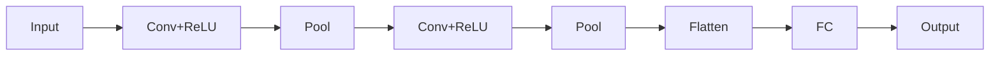
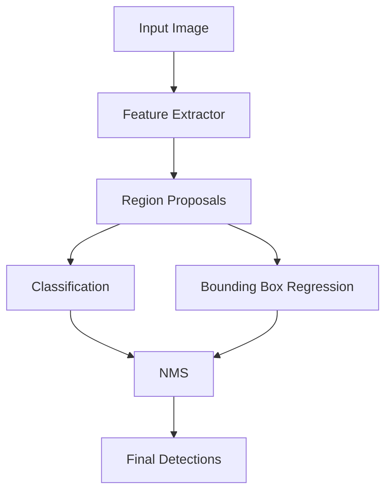
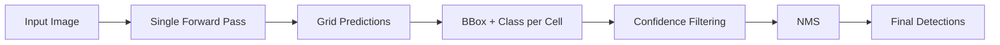

## Table of Contents
- [Introduction](#introduction)
- [Learning Roadmap](#learning-roadmap)
- [Theory Notes](#theory-notes)
- [Key Concepts](#key-concepts)
- [FAQ (30+ Q&A)](#faq-30-qa)
- [Hands-on Practice](#hands-on-practice)
- [FAANG Questions](#faang-questions)
- [Common Mistakes](#common-mistakes)
- [Best Practices](#best-practices)
- [Cheat Sheet](#cheat-sheet)
- [Flash Cards (30)](#flash-cards-30)
- [Mind Map](#mind-map)
- [Mermaid Diagrams](#mermaid-diagrams)
- [Code Examples](#code-examples)
- [Projects](#projects)
- [Resources](#resources)
- [Checklist](#checklist)
- [Revision Plans](#revision-plans)
- [Mock Interviews](#mock-interviews)
- [Difficulty Rating](#difficulty-rating)
- [Summary](#summary)

---

## Introduction

Computer Vision (CV) is a field of AI that enables computers to interpret and understand visual information from the world, including images and videos. It encompasses tasks like image classification, object detection, segmentation, and image generation. CV has achieved remarkable progress through deep learning, particularly convolutional neural networks (CNNs).

Modern CV applications include autonomous vehicles, medical imaging, facial recognition, augmented reality, surveillance, quality inspection, and robotics. Understanding CV fundamentals is essential for roles in AI, robotics, autonomous systems, and healthcare technology.

Key application areas include:
- **Image Classification**: Categorizing images into predefined classes
- **Object Detection**: Localizing and classifying objects with bounding boxes
- **Semantic Segmentation**: Classifying each pixel in an image
- **Instance Segmentation**: Separating individual object instances
- **Pose Estimation**: Detecting human body keypoints
- **Image Generation**: Creating realistic images from noise or text
- **Optical Flow**: Estimating motion between video frames

---

## Learning Roadmap

### Phase 1: Image Processing Basics (Week 1-2)
- Digital image representation (pixels, channels, color spaces)
- Image transformations (rotation, scaling, cropping)
- Filtering (blurring, sharpening, edge detection)
- Histograms and thresholding

### Phase 2: CNN Fundamentals (Week 3-4)
- Convolution operation and filters
- Pooling layers (max, average)
- Stride, padding, receptive field
- Feature maps and visualization

### Phase 3: CNN Architectures (Week 5-7)
- LeNet, AlexNet, VGG
- ResNet, DenseNet
- EfficientNet, MobileNet
- Object detection (YOLO, Faster R-CNN)
- Image segmentation (U-Net, Mask R-CNN)

### Phase 4: Advanced Topics (Week 8-10)
- Transfer learning for CV
- Data augmentation
- Vision Transformers (ViT)
- GANs for image generation
- Image super-resolution

### Phase 5: Applications (Week 11-12)
- Face recognition
- Pose estimation
- Video understanding
- 3D vision basics
- Edge deployment

---

## Theory Notes

### Digital Images
An image is a 2D grid of pixels. Grayscale images have one channel (0-255 intensity). Color images typically have 3 channels (RGB). Shape: (height, width, channels) for a single image, or (batch, height, width, channels) for batches.

### Convolution Operation
Convolution slides a filter (kernel) over the input, computing element-wise multiplications and summing. A 3x3 filter on a 28x28 image with stride 1 and no padding produces a 26x26 output. Parameters: kernel size, stride, padding. The filter learns to detect features like edges, textures, and patterns.

**Output size** = (Input size - Kernel size + 2 x Padding) / Stride + 1

### Pooling Layers
**Max pooling** takes the maximum value in each window, retaining the strongest feature response. **Average pooling** takes the mean, providing smoother downsampling. Pooling reduces spatial dimensions, decreases computation, and provides translation invariance.

### CNN Architectures Evolution

**LeNet-5 (1998)**: Pioneer architecture for digit recognition. 2 conv layers, 2 pooling layers, 3 fully connected layers.

**AlexNet (2012)**: Won ImageNet, popularized deep learning. 8 layers, ReLU activation, dropout, GPU training.

**VGG (2014)**: Showed depth matters. Used uniform 3x3 convolutions. VGG-16 (13 conv layers) and VGG-19 (16 conv layers).

**ResNet (2015)**: Introduced residual connections (skip connections). Enabled training of 50-152+ layer networks. Solved vanishing gradient problem in deep networks.

**EfficientNet (2019)**: Balanced scaling of depth, width, and resolution using compound scaling.

**YOLO (You Only Look Once)**: Real-time object detection. Single pass through the network predicts bounding boxes and classes simultaneously.

### Object Detection
Object detection combines classification (what) with localization (where). Key concepts: bounding boxes, IoU (Intersection over Union), Non-Maximum Suppression (NMS), anchor boxes.

**Two-stage detectors**: Faster R-CNN (region proposals + classification). More accurate but slower.
**Single-stage detectors**: YOLO, SSD. Faster but slightly less accurate.

### Image Segmentation
- **Semantic**: Classify each pixel (no instance distinction)
- **Instance**: Separate instances of the same class
- **Panoptic**: Combines semantic and instance segmentation

**U-Net**: Encoder-decoder with skip connections, excellent for medical image segmentation.

### Activation Functions in CV
- **ReLU**: f(x) = max(0, x). Most common, fast, avoids vanishing gradient.
- **Leaky ReLU**: Allows small negative values, prevents dead neurons.
- **GELU**: Gaussian Error Linear Unit, used in Vision Transformers.
- **Swish/SiLU**: Smooth approximation of ReLU, used in EfficientNet.

### Batch Normalization
Normalizes activations across the batch dimension. Speeds up training, allows higher learning rates, provides mild regularization. Applied before or after activation functions.

### Data Augmentation Techniques
- **Geometric**: Flip, rotate, scale, crop, affine transforms
- **Color**: Brightness, contrast, saturation, hue jittering
- **Cutout/Random Erasing**: Random rectangular regions masked out
- **Mixup**: Linearly interpolate between two images and labels
- **CutMix**: Cut a patch from one image and paste onto another

---

## Key Concepts

| Concept | Description |
|---------|-------------|
| Receptive Field | Region of input that affects a particular output neuron |
| Feature Map | Output of a convolutional layer detecting specific features |
| Stride | Step size for sliding the filter |
| Padding | Adding zeros around input border to control output size |
| IoU | Intersection over Union, measures bounding box overlap |
| NMS | Non-Maximum Suppression, removes duplicate detections |
| Anchor Boxes | Pre-defined bounding box shapes for object detection |
| Data Augmentation | Artificially increasing training data diversity |
| Transfer Learning | Using pre-trained models for new tasks |
| Feature Pyramid | Multi-scale feature representation |
| Depthwise Separable Conv | Efficient convolution splitting spatial and channel operations |
| Non-local Block | Captures long-range dependencies across spatial positions |

---

## FAQ (30+ Q&A)

### Q1: What is the difference between stride and padding?
**A:** Stride controls how many pixels the filter moves at each step. Larger stride = smaller output. Padding adds zeros around the input border. "Same" padding maintains spatial dimensions; "valid" uses no padding.

### Q2: Why are CNNs better than fully connected networks for images?
**A:** CNNs exploit spatial structure through parameter sharing (same filter across positions) and local connectivity. This dramatically reduces parameters and captures spatial hierarchies.

### Q3: What is the receptive field?
**A:** The region of the input image that influences a particular output feature. Deeper layers have larger receptive fields. Understanding receptive field helps design architectures for specific object sizes.

### Q4: Why use ReLU over sigmoid in CNNs?
**A:** ReLU doesn't saturate for positive values (no vanishing gradient), is computationally cheap, and produces sparse activations. Sigmoid saturates and has weaker gradients.

### Q5: What is transfer learning in CV?
**A:** Using a pre-trained model (e.g., on ImageNet) as a starting point. Replace the final layer and fine-tune on your dataset. Saves time, requires less data, often achieves better performance.

### Q6: What is data augmentation and why is it important?
**A:** Artificially creating training variations through flips, rotations, crops, color jittering, etc. Prevents overfitting, improves generalization, and effectively increases dataset size.

### Q7: What is the difference between ResNet and VGG?
**A:** VGG uses simple sequential architecture with 3x3 convolutions. ResNet adds skip connections enabling training of much deeper networks (152+ layers). Skip connections solve vanishing gradients.

### Q8: How does YOLO achieve real-time detection?
**A:** YOLO processes the entire image in one pass, dividing it into a grid and predicting bounding boxes and class probabilities simultaneously. Single-stage detection is faster than two-stage methods.

### Q9: What is Non-Maximum Suppression?
**A:** NMS removes overlapping detections. It sorts boxes by confidence, suppresses boxes with high IoU (>0.5) with the top-scoring box, keeping only the best detection per object.

### Q10: What is IoU (Intersection over Union)?
**A:** IoU = Area of Overlap / Area of Union between predicted and ground truth bounding boxes. Measures detection quality. IoU > 0.5 is typically considered a correct detection.

### Q11: What is the difference between semantic and instance segmentation?
**A:** Semantic segmentation classifies each pixel by class (all cars are same label). Instance segmentation separates individual object instances (each car gets a unique mask). Panoptic combines both.

### Q12: Why use batch normalization in CNNs?
**A:** Normalizes layer inputs, speeds up training, allows higher learning rates, provides mild regularization, and reduces sensitivity to initialization.

### Q13: What is feature visualization?
**A:** Techniques to understand what CNN layers learn by visualizing activated regions. Early layers detect edges/textures; deeper layers detect objects/parts. Helps debug and interpret models.

### Q14: How do you handle class imbalance in CV?
**A:** Data augmentation for minority classes, class weights in loss function, oversampling/undersampling, focal loss for hard examples, and transfer learning from balanced datasets.

### Q15: What is anchor box in object detection?
**A:** Pre-defined bounding boxes of different aspect ratios and scales. The model predicts offsets from these anchors rather than absolute coordinates, making training more stable.

### Q16: What is a feature pyramid network (FPN)?
**A:** Creates multi-scale feature maps by combining features from different backbone levels. Enables detection of objects at various sizes. Used in modern detectors like Mask R-CNN.

### Q17: What is the difference between AlexNet and VGG?
**A:** AlexNet uses varying filter sizes (11x11, 5x5, 3x3). VGG uses uniform 3x3 filters throughout, showing that depth with small filters is more effective than shallow networks with large filters.

### Q18: How do you deploy CV models on mobile devices?
**A:** Model compression (pruning, quantization, knowledge distillation), using efficient architectures (MobileNet, EfficientNet-Lite), ONNX/TensorRT conversion, and hardware-specific optimization.

### Q19: What is Vision Transformer (ViT)?
**A:** Applies transformer architecture to images by splitting images into patches, treating them as tokens. Achieves competitive performance with CNNs on large datasets. Shows attention can work for vision.

### Q20: What is the difference between detection and segmentation?
**A:** Detection outputs bounding boxes with class labels (rectangular regions). Segmentation outputs pixel-level masks (precise boundaries). Detection is simpler; segmentation provides more detailed localization.

### Q21: What is depthwise separable convolution?
**A:** Splits standard convolution into depthwise (per-channel spatial) and pointwise (1x1 channel mixing) operations. Dramatically reduces parameters and computation. Core of MobileNet architecture.

### Q22: What is focal loss?
**A:** Modified cross-entropy loss that down-weights easy examples and focuses on hard ones. Addresses class imbalance in object detection. Used in RetinaNet to bridge the gap between single-stage and two-stage detectors.

### Q23: What is mAP (mean Average Precision)?
**A:** Mean Average Precision computed across all classes. Precision-recall curve area averaged over classes. mAP@0.5 uses IoU threshold 0.5; mAP@0.5:0.95 averages over thresholds 0.5 to 0.95.

### Q24: What is test-time augmentation (TTA)?
**A:** Applying multiple augmentations to test images and averaging predictions. Improves accuracy at cost of inference time. Common: horizontal flip, multi-scale testing.

### Q25: What is knowledge distillation for CV?
**A:** Training a smaller "student" model to mimic a larger "teacher" model's soft predictions. Enables deploying efficient models while retaining teacher knowledge. Used in model compression.

### Q26: What is mixed precision training?
**A:** Using FP16 for forward/backward passes while keeping FP32 master weights. Speeds up training on GPUs with tensor cores while maintaining numerical stability. Requires loss scaling.

### Q27: What is the difference between CNN and ViT?
**A:** CNNs use local inductive biases (convolution, locality). ViTs use global self-attention, requiring more data but potentially capturing long-range dependencies better. CNNs are more data-efficient.

### Q28: What is Mask R-CNN?
**A:** Extends Faster R-CNN by adding a parallel branch predicting pixel-level masks for each detected region. Adds RoIAlign for precise mask alignment. Performs instance segmentation.

### Q29: What is Swin Transformer?
**A:** Hierarchical vision transformer with shifted windows for efficient computation. Computes attention within local windows, enabling linear complexity. Strong backbone for detection and segmentation.

### Q30: What is deformable convolution?
**A:** Convolution where sampling locations are learned offsets from regular grid positions. Better captures geometric transformations and object shapes. Improves detection of irregular objects.

---

## Hands-on Practice

### Image Classification with ResNet
```python
import torch
import torch.nn as nn
import torchvision.models as models

model = models.resnet50(pretrained=True)
model.fc = nn.Linear(model.fc.in_features, 10)
model = model.cuda()

criterion = nn.CrossEntropyLoss()
optimizer = torch.optim.Adam(model.fc.parameters(), lr=1e-4)
```

### YOLO-style Object Detection
```python
import torch
import torch.nn as nn

class YOLOBlock(nn.Module):
    def __init__(self, in_channels, out_channels):
        super().__init__()
        self.conv = nn.Sequential(
            nn.Conv2d(in_channels, out_channels, 3, padding=1),
            nn.BatchNorm2d(out_channels),
            nn.LeakyReLU(0.1),
            nn.Conv2d(out_channels, out_channels * 2, 3, padding=1),
            nn.BatchNorm2d(out_channels * 2),
            nn.LeakyReLU(0.1),
        )
        self.pool = nn.MaxPool2d(2, 2)

    def forward(self, x):
        x = self.conv(x)
        x = self.pool(x)
        return x
```

### U-Net for Segmentation
```python
import torch
import torch.nn as nn

class UNet(nn.Module):
    def __init__(self, in_channels=3, out_channels=1):
        super().__init__()
        self.enc1 = self._block(in_channels, 64)
        self.enc2 = self._block(64, 128)
        self.enc3 = self._block(128, 256)
        self.pool = nn.MaxPool2d(2)
        self.bottleneck = self._block(256, 512)
        self.up3 = nn.ConvTranspose2d(512, 256, 2, stride=2)
        self.dec3 = self._block(512, 256)
        self.up2 = nn.ConvTranspose2d(256, 128, 2, stride=2)
        self.dec2 = self._block(256, 128)
        self.up1 = nn.ConvTranspose2d(128, 64, 2, stride=2)
        self.dec1 = self._block(128, 64)
        self.final = nn.Conv2d(64, out_channels, 1)

    def _block(self, in_ch, out_ch):
        return nn.Sequential(
            nn.Conv2d(in_ch, out_ch, 3, padding=1),
            nn.BatchNorm2d(out_ch),
            nn.ReLU(inplace=True),
            nn.Conv2d(out_ch, out_ch, 3, padding=1),
            nn.BatchNorm2d(out_ch),
            nn.ReLU(inplace=True),
        )

    def forward(self, x):
        e1 = self.enc1(x)
        e2 = self.enc2(self.pool(e1))
        e3 = self.enc3(self.pool(e2))
        b = self.bottleneck(self.pool(e3))
        d3 = self.dec3(torch.cat([self.up3(b), e3], dim=1))
        d2 = self.dec2(torch.cat([self.up2(d3), e2], dim=1))
        d1 = self.dec1(torch.cat([self.up1(d2), e1], dim=1))
        return self.final(d1)
```

---

## FAANG Questions

1. **Google**: Design a real-time object detection system for autonomous driving. How do you handle different weather conditions?
2. **Meta**: Build a system that understands images and generates captions. Describe the architecture.
3. **Amazon**: Design a quality inspection system for manufacturing. How do you handle rare defects?
4. **Apple**: Build a face recognition system robust to masks, lighting, and angles.
5. **Netflix**: Design a system that automatically generates thumbnails for video content.
6. **Google**: How would you build a medical image analysis system for X-rays?
7. **Meta**: Design a content moderation system for images and videos at scale.
8. **Amazon**: Build a visual search system for finding similar products.
9. **Apple**: Design an AR system that understands and interacts with the real world.
10. **Netflix**: Build a scene classification system for video content understanding.
11. **Google**: Design a self-driving car vision pipeline processing multiple camera feeds.
12. **Meta**: Build a real-time pose estimation system for AR effects.

---

## Common Mistakes

1. Not normalizing images to match pre-trained model expectations
2. Ignoring data augmentation (leads to overfitting)
3. Using wrong input size for pre-trained models
4. Not freezing layers during initial fine-tuning
5. Ignoring class imbalance in detection/segmentation
6. Using accuracy for imbalanced detection tasks
7. Not using appropriate IoU thresholds for evaluation
8. Deploying models without optimization for inference speed
9. Not considering computational budget for real-time applications
10. Ignoring domain shift between training and deployment data

---

## Best Practices

1. Start with transfer learning (pre-trained ImageNet models)
2. Use appropriate data augmentation for your domain
3. Monitor both classification and localization metrics
4. Use learning rate scheduling for fine-tuning
5. Start with smaller models and scale up as needed
6. Validate on diverse test sets (different conditions)
7. Use mixed precision training for speed
8. Profile models for inference latency before deployment
9. Consider model size constraints for mobile/edge deployment
10. Always visualize model predictions for qualitative evaluation

---

## Cheat Sheet

| Task | Recommended Model | Key Metric |
|------|------------------|------------|
| Classification | ResNet, EfficientNet | Accuracy, F1 |
| Detection | YOLO, Faster R-CNN | mAP@0.5, mAP@0.5:0.95 |
| Segmentation | U-Net, Mask R-CNN | IoU, Dice Score |
| Face Recognition | ArcFace, CosFace | Verification accuracy |
| Pose Estimation | HRNet, MediaPipe | PCK, AP |
| Generation | GANs, Diffusion | FID, IS |
| Optical Flow | RAFT, PWC-Net | EPE, Fl-all |
| Depth Estimation | MiDaS, DPT | AbsRel, RMSE |

---

## Flash Cards (30)

**Card 1:** Q: What is a convolution? A: Sliding a filter over input computing element-wise multiplications and sums, detecting local features.

**Card 2:** Q: What is max pooling? A: Taking maximum value in each window, reducing spatial dimensions while retaining strongest features.

**Card 3:** Q: What is receptive field? A: Region of input affecting a particular output neuron; grows with network depth.

**Card 4:** Q: Why use 3x3 filters? A: Stacked 3x3 filters have same receptive field as larger filters but with fewer parameters and more non-linearity.

**Card 5:** Q: What is stride? A: Number of pixels the filter moves at each step; larger stride produces smaller output.

**Card 6:** Q: What is same vs valid padding? A: Same padding maintains spatial dimensions; valid padding uses no padding, reducing output size.

**Card 7:** Q: What is ResNet's key innovation? A: Residual/skip connections enabling training of very deep networks by allowing gradient flow through identity mappings.

**Card 8:** Q: What is YOLO? A: You Only Look Once, single-stage object detector processing image in one pass for real-time detection.

**Card 9:** Q: What is IoU? A: Intersection over Union, ratio of overlap to union of predicted and ground truth bounding boxes.

**Card 10:** Q: What is NMS? A: Non-Maximum Suppression, removes overlapping detections keeping only the best per object.

**Card 11:** Q: What is transfer learning in CV? A: Using pre-trained models (ImageNet) as starting points, fine-tuning final layers for new tasks.

**Card 12:** Q: What is data augmentation? A: Artificially increasing training data through flips, rotations, crops, color changes, etc.

**Card 13:** Q: What is mAP? A: Mean Average Precision, averaged precision across classes and IoU thresholds, standard detection metric.

**Card 14:** Q: What is FPN? A: Feature Pyramid Network, creates multi-scale features for detecting objects at different sizes.

**Card 15:** Q: What is U-Net? A: Encoder-decoder architecture with skip connections for semantic segmentation, especially medical imaging.

**Card 16:** Q: What is anchor box? A: Pre-defined bounding boxes of different sizes/aspect ratios used as reference for detection predictions.

**Card 17:** Q: What is EfficientNet? A: Architecture balancing depth, width, and resolution via compound scaling for optimal efficiency.

**Card 18:** Q: What is Vision Transformer? A: Transformer applied to images by treating image patches as tokens, achieving competitive CNN performance.

**Card 19:** Q: What is mobile deployment optimization? A: Model pruning, quantization, knowledge distillation, and efficient architectures like MobileNet.

**Card 20:** Q: What is instance vs semantic segmentation? A: Instance separates individual objects; semantic classifies all pixels by class without instance distinction.

**Card 21:** Q: What is depthwise separable convolution? A: Efficient convolution splitting spatial and channel operations, reducing parameters.

**Card 22:** Q: What is focal loss? A: Modified cross-entropy down-weighting easy examples, focusing on hard ones for imbalanced detection.

**Card 23:** Q: What is test-time augmentation? A: Applying multiple augmentations to test images and averaging predictions for better accuracy.

**Card 24:** Q: What is mixed precision training? A: Using FP16 for faster training with FP32 master weights for stability.

**Card 25:** Q: What is Mask R-CNN? A: Faster R-CNN extended with mask prediction branch for instance segmentation.

**Card 26:** Q: What is Swin Transformer? A: Hierarchical vision transformer with shifted windows for efficient global attention computation.

**Card 27:** Q: What is deformable convolution? A: Convolution with learned offset sampling locations for better geometric modeling.

**Card 28:** Q: What is knowledge distillation in CV? A: Training smaller student model to mimic larger teacher model's soft predictions.

**Card 29:** Q: What is panoptic segmentation? A: Combining semantic and instance segmentation to classify all pixels with instance distinction.

**Card 30:** Q: What is a backbone network? A: Feature extraction base (ResNet, EfficientNet) shared across detection/segmentation tasks.

---

## Mind Map

```
Computer Vision
├── Image Processing
│   ├── Filters
│   ├── Color Spaces
│   └── Transformations
├── CNNs
│   ├── Convolution
│   ├── Pooling
│   └── Architectures
│       ├── LeNet, AlexNet, VGG
│       ├── ResNet, DenseNet
│       └── EfficientNet, MobileNet
├── Detection
│   ├── YOLO (Single-stage)
│   ├── Faster R-CNN (Two-stage)
│   └── SSD, RetinaNet
├── Segmentation
│   ├── U-Net
│   ├── Mask R-CNN
│   └── DeepLab
├── Vision Transformers
│   ├── ViT
│   ├── DeiT
│   └── Swin Transformer
└── Applications
    ├── Face Recognition
    ├── Pose Estimation
    ├── Medical Imaging
    └── Autonomous Driving
```

---

## Mermaid Diagrams

### CNN Architecture


### Object Detection Pipeline


### YOLO Detection Process


---

## Code Examples

### Image Classification with PyTorch
```python
import torch
import torch.nn as nn
import torchvision.transforms as transforms
import torchvision.models as models

transform = transforms.Compose([
    transforms.Resize(256),
    transforms.CenterCrop(224),
    transforms.ToTensor(),
    transforms.Normalize([0.485, 0.456, 0.406],
                         [0.229, 0.224, 0.225])
])

model = models.resnet18(pretrained=True)
model.fc = nn.Linear(model.fc.in_features, num_classes)

criterion = nn.CrossEntropyLoss()
optimizer = torch.optim.SGD(model.parameters(), lr=0.001, momentum=0.9)

for epoch in range(num_epochs):
    model.train()
    for images, labels in train_loader:
        outputs = model(images)
        loss = criterion(outputs, labels)
        optimizer.zero_grad()
        loss.backward()
        optimizer.step()
```

### Data Augmentation
```python
from torchvision import transforms

train_transform = transforms.Compose([
    transforms.RandomHorizontalFlip(p=0.5),
    transforms.RandomRotation(15),
    transforms.RandomResizedCrop(224, scale=(0.8, 1.0)),
    transforms.ColorJitter(brightness=0.2, contrast=0.2),
    transforms.RandomGrayscale(p=0.1),
    transforms.ToTensor(),
    transforms.Normalize([0.485, 0.456, 0.406],
                         [0.229, 0.224, 0.225])
])
```

### IoU Calculation
```python
import torch

def compute_iou(box1, box2):
    x1 = torch.max(box1[0], box2[0])
    y1 = torch.max(box1[1], box2[1])
    x2 = torch.min(box1[2], box2[2])
    y2 = torch.min(box1[3], box2[3])
    intersection = torch.clamp(x2 - x1, min=0) * torch.clamp(y2 - y1, min=0)
    area1 = (box1[2] - box1[0]) * (box1[3] - box1[1])
    area2 = (box2[2] - box2[0]) * (box2[3] - box2[1])
    union = area1 + area2 - intersection
    return intersection / union
```

---

## Projects

1. **Image Classifier**: Build a classifier for custom dataset using transfer learning
2. **Object Detection**: Train YOLOv5 on custom dataset
3. **Medical Image Segmentation**: U-Net for tumor segmentation
4. **Face Detection**: Build and deploy face detection system
5. **Image Search**: Content-based image retrieval using embeddings
6. **Pose Estimation**: Build a human pose estimation system
7. **Style Transfer**: Implement neural style transfer

---

## Resources

- **Books**: "Computer Vision: Algorithms and Applications" (Szeliski)
- **Courses**: Stanford CS231n, MIT 6.S191
- **Frameworks**: PyTorch, OpenCV, Detectron2, MMDetection
- **Datasets**: ImageNet, COCO, Pascal VOC, LSUN
- **Papers**: ResNet, YOLO, U-Net, ViT, EfficientNet

---

## Checklist

- [ ] Image representation and preprocessing
- [ ] Convolution operation and parameters
- [ ] CNN architectures (LeNet through EfficientNet)
- [ ] Transfer learning workflow
- [ ] Object detection concepts (IoU, NMS, anchor boxes)
- [ ] YOLO and Faster R-CNN
- [ ] Image segmentation (semantic, instance, panoptic)
- [ ] Data augmentation techniques
- [ ] Model evaluation metrics
- [ ] Deployment optimization
- [ ] Vision Transformers basics
- [ ] Depthwise separable convolutions
- [ ] Mixed precision training

---

## Revision Plans

### 2-Week Plan
- Week 1: Image basics, CNNs, architectures
- Week 2: Detection, segmentation, advanced topics

### Daily (30 min)
- 10 min: Flash cards
- 10 min: Code practice
- 10 min: Read papers/tutorials

---

## Mock Interviews

1. Explain how convolution operations work in a CNN
2. How would you design a real-time object detection system?
3. What are the tradeoffs between YOLO and Faster R-CNN?
4. How do you handle small object detection?
5. Design a medical image segmentation pipeline
6. Explain how Vision Transformers work compared to CNNs
7. How would you optimize a CV model for mobile deployment?

---

## Difficulty Rating

| Topic | Difficulty | Frequency |
|-------|-----------|-----------|
| Image Basics | Easy | High |
| CNN Architectures | Medium | Very High |
| Object Detection | Hard | Very High |
| Segmentation | Hard | High |
| Transfer Learning | Medium | High |
| Data Augmentation | Easy | High |
| Vision Transformers | Hard | High |
| Model Optimization | Medium | Medium |

**Overall: Medium-Hard | Preparation: 6-8 weeks**

---

## Summary

Computer Vision interviews test understanding of CNN fundamentals, modern architectures, detection and segmentation, and practical deployment considerations. Master convolution operations, understand key architectures (ResNet, YOLO, U-Net), know transfer learning workflows, and be able to design CV systems for specific applications. Practical experience with PyTorch and common CV libraries is essential.

---

## Deep Dive: CNN Architecture Comparison

### Architecture Evolution
| Architecture | Year | Layers | Key Innovation | Top-1 Accuracy | Params |
|-------------|------|--------|----------------|----------------|--------|
| LeNet-5 | 1998 | 7 | Convolution for digits | ~99% (MNIST) | 60K |
| AlexNet | 2012 | 8 | ReLU, Dropout, GPU | 63.3% | 60M |
| VGG-16 | 2014 | 16 | Uniform 3x3 convs | 74.4% | 138M |
| GoogLeNet | 2014 | 22 | Inception modules | 74.8% | 6.8M |
| ResNet-50 | 2015 | 50 | Skip connections | 76.1% | 25.6M |
| DenseNet-121 | 2017 | 121 | Dense connections | 77.4% | 8M |
| EfficientNet-B0 | 2019 | - | Compound scaling | 77.1% | 5.3M |
| EfficientNet-B7 | 2019 | - | Compound scaling | 84.3% | 66M |
| ConvNeXt | 2022 | - | Modernized ConvNet | 87.8% | 198M |

### Detection Model Comparison
| Model | Type | Speed | mAP@0.5 | Best For |
|-------|------|-------|---------|----------|
| YOLOv5s | Single-stage | Fast | 56.8 | Real-time edge |
| YOLOv8x | Single-stage | Medium | 71.0 | Balanced |
| Faster R-CNN | Two-stage | Slow | 82.1 | High accuracy |
| DETR | Transformer | Medium | 83.3 | End-to-end |
| Mask R-CNN | Two-stage | Slow | 82.5 | Instance seg |

### Segmentation Model Comparison
| Model | Type | Best For | mIoU (ADE20K) |
|-------|------|----------|---------------|
| U-Net | Medical | Binary segmentation | N/A |
| DeepLabV3+ | Semantic | General semantic | 45.7 |
| Mask R-CNN | Instance | Object instances | N/A |
| Panoptic FPN | Panoptic | Combined | 40.6 |
| SegFormer | Transformer | Efficient semantic | 51.0 |

---

## Deep Dive: Object Detection Deep Dive

### Bounding Box Regression
Predicting (x, y, w, h) coordinates of bounding boxes. Common representations:
- **Corner format**: (x1, y1, x2, y2) - top-left and bottom-right corners
- **Center format**: (cx, cy, w, h) - center coordinates and dimensions
- **YOLO format**: (x, y, w, h) normalized to [0, 1]
- **Anchor offsets**: (tx, ty, tw, th) offsets from anchor boxes

Loss functions: Smooth L1 loss, IoU loss, GIoU loss, DIoU loss, CIoU loss.

### Anchor Box Design
K-means clustering on training data bounding boxes to determine anchor sizes and ratios. Different scales for different feature pyramid levels. YOLOv5 uses automatic anchor computation. Anchor-free approaches (FCOS, CenterNet) predict centers and sizes directly.

### Non-Maximum Suppression Algorithm
1. Sort all detections by confidence score (descending)
2. Select detection with highest confidence
3. Remove all remaining detections with IoU > threshold (0.5) with selected
4. Repeat steps 2-3 until no detections remain
5. NMS-free approaches use learned NMS or set prediction

### Feature Pyramid Networks (FPN)
Bottom-up pathway + top-down pathway + lateral connections. Enables detection at multiple scales. P2-P5 feature maps handle small to large objects. PANet adds extra bottom-up path. BiFPN (EfficientDet) uses weighted bi-directional feature fusion.

### Evaluation Metrics Deep Dive
- **AP@0.5**: Average Precision at IoU threshold 0.5
- **AP@0.5:0.95**: Average over IoU thresholds 0.5 to 0.95 in steps of 0.05 (COCO standard)
- **AP_small/AP_medium/AP_large**: AP for different object sizes
- **AR_max=1**: Average Recall with maximum 1 detection per GT
- **AR_max=10**: Average Recall with maximum 10 detections per GT

---

## Deep Dive: Data Augmentation Advanced

### Advanced Augmentation Techniques
| Technique | Description | When to Use |
|-----------|-------------|-------------|
| CutOut | Random rectangular regions masked | General classification |
| Mixup | Linear interpolation between two images | Regularization |
| CutMix | Cut patch from one image, paste on another | Classification + detection |
| Mosaic | Combine 4 images into one (YOLO) | Object detection |
| AutoAugment | Learned augmentation policies | Large datasets |
| RandAugment | Random augmentation with magnitude | General purpose |
| TrivialAugment | Per-image random augmentation | Simple and effective |

### Geometric Transformations
```python
from albumentations import (
    HorizontalFlip, VerticalFlip, Rotation,
    ShiftScaleRotate, ElasticTransform, GridDistortion
)

geo_transform = Compose([
    HorizontalFlip(p=0.5),
    VerticalFlip(p=0.1),
    Rotation(limit=30, p=0.5),
    ShiftScaleRotate(shift_limit=0.1, scale_limit=0.2, rotate_limit=15, p=0.5),
    ElasticTransform(alpha=120, sigma=120*0.05, alpha_affine=120*0.03, p=0.5),
])
```

### Color Augmentations
```python
from albumentations import (
    RandomBrightnessContrast, HueSaturationValue,
    RGBShift, ChannelShuffle, ToGray
)

color_transform = Compose([
    RandomBrightnessContrast(brightness_limit=0.2, contrast_limit=0.2, p=0.5),
    HueSaturationValue(hue_shift_limit=20, sat_shift_limit=30, val_shift_limit=20, p=0.5),
    RGBShift(r_shift_limit=20, g_shift_limit=20, b_shift_limit=20, p=0.5),
    ChannelShuffle(p=0.1),
    ToGray(p=0.1),
])
```

---

## Interview Quick Reference Card

### Top 10 CV Interview Questions
1. **Convolution operation**: Slides kernel computing weighted sums, detects local features
2. **Why 3x3 filters**: Same receptive field as larger with fewer params and more non-linearity
3. **ResNet skip connections**: Solve vanishing gradients, enable training very deep networks
4. **Transfer learning**: Use pre-trained backbone, fine-tune final layers on new data
5. **IoU calculation**: Area of overlap / Area of union between predicted and ground truth boxes
6. **NMS purpose**: Remove duplicate detections, keep highest confidence per object
7. **YOLO vs Faster R-CNN**: YOLO=faster single-stage, R-CNN=more accurate two-stage
8. **U-Net skip connections**: Concatenate encoder features with decoder for precise localization
9. **Data augmentation**: Prevents overfitting, increases effective dataset size
10. **Batch normalization**: Normalizes activations, speeds up training, mild regularization

### Model Selection Guide
| Use Case | Recommended | Why |
|----------|-------------|-----|
| Mobile deployment | MobileNetV3 | Efficient depthwise separable convs |
| High accuracy detection | DETR | End-to-end, no NMS needed |
| Medical segmentation | U-Net | Skip connections preserve spatial info |
| Real-time detection | YOLOv8 | Speed-accuracy balance |
| General classification | EfficientNet | Best accuracy per FLOP |
| Video understanding | VideoMAE | Temporal modeling via transformers |

### Key Formulas Reference
- **Conv output**: (H - K + 2P) / S + 1
- **Receptive field**: RF_l = RF_{l-1} + (K-1) * stride_product
- **IoU**: |A ∩ B| / |A ∪ B|
- **GIoU**: IoU - |C - A ∪ B| / |C| where C is smallest enclosing box
- **Dice Score**: 2|A ∩ B| / (|A| + |B|)
- **Parameters (Conv)**: K * K * C_in * C_out + C_out (bias)

---

## CV Architecture Deep Dive

### ResNet Architecture Variants
| Model | Layers | Parameters | FLOPs | Top-1 | Top-5 |
|-------|--------|-----------|-------|-------|-------|
| ResNet-18 | 18 | 11.7M | 1.8G | 69.8% | 89.1% |
| ResNet-34 | 34 | 21.8M | 3.7G | 73.3% | 91.4% |
| ResNet-50 | 50 | 25.6M | 4.1G | 76.1% | 92.9% |
| ResNet-101 | 101 | 44.5M | 7.9G | 77.4% | 93.5% |
| ResNet-152 | 152 | 60.2M | 11.6G | 78.3% | 94.1% |

### EfficientNet Scaling
| Model | Resolution | Width | Depth | Params | Top-1 |
|-------|-----------|-------|-------|--------|-------|
| B0 | 224 | 1.0 | 1.0 | 5.3M | 77.1% |
| B1 | 240 | 1.0 | 1.2 | 7.8M | 79.1% |
| B2 | 260 | 1.1 | 1.4 | 9.2M | 80.1% |
| B3 | 300 | 1.2 | 1.8 | 12M | 81.6% |
| B4 | 380 | 1.4 | 2.2 | 19M | 82.9% |
| B5 | 456 | 1.6 | 2.6 | 30M | 83.6% |
| B7 | 600 | 2.0 | 3.6 | 66M | 84.3% |

### Object Detection Loss Functions
| Loss | Components | When to Use |
|------|-----------|-------------|
| YOLO Loss | BCE + CIoU + classification | YOLO family |
| Focal Loss | Modified CE focusing on hard examples | Imbalanced detection |
| Smooth L1 | Bounding box regression | Faster R-CNN |
| GIoU Loss | IoU + penalty for non-overlapping | Anchor-free |
| CIoU Loss | IoU + distance + aspect ratio | Accurate localization |

### Segmentation Metrics Deep Dive
| Metric | Formula | Interpretation |
|--------|---------|---------------|
| IoU (mAP) | TP / (TP + FP + FN) | Intersection over union |
| Dice Score | 2TP / (2TP + FP + FN) | Harmonic mean of precision and recall |
| Pixel Accuracy | Correct / Total pixels | Overall correctness |
| Mean Accuracy | Avg per-class accuracy | Balanced across classes |
| Boundary F1 | F1 on boundary pixels | Edge quality |

### Image Processing Pipeline Reference
```python
import cv2
import numpy as np

# Read and preprocess
image = cv2.imread("image.jpg")
image = cv2.cvtColor(image, cv2.COLOR_BGR2RGB)
image = cv2.resize(image, (224, 224))

# Normalize (ImageNet stats)
mean = np.array([0.485, 0.456, 0.406])
std = np.array([0.229, 0.224, 0.225])
image = (image / 255.0 - mean) / std

# Convert to tensor
image = np.transpose(image, (2, 0, 1))  # HWC to CHW
```

### Common CV Interview Scenarios
| Scenario | Key Considerations | Recommended Model |
|----------|-------------------|-------------------|
| Mobile detection | Latency <30ms, small model | YOLOv8-nano |
| Medical imaging | High accuracy, explainability | U-Net + attention |
| Autonomous driving | Multi-camera, real-time | BEVFormer |
| Quality inspection | Few defects, imbalanced | Focal loss + augmentation |
| Face recognition | Accuracy, anti-spoofing | ArcFace + liveness |
| Satellite imagery | Large images, multi-scale | HRNet + FPN |
| Video understanding | Temporal modeling | VideoMAE, TimeSformer |
