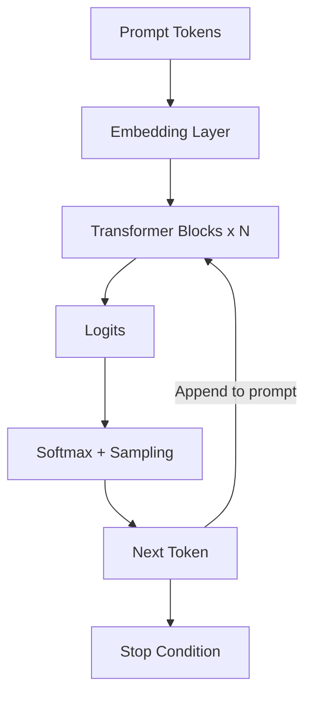
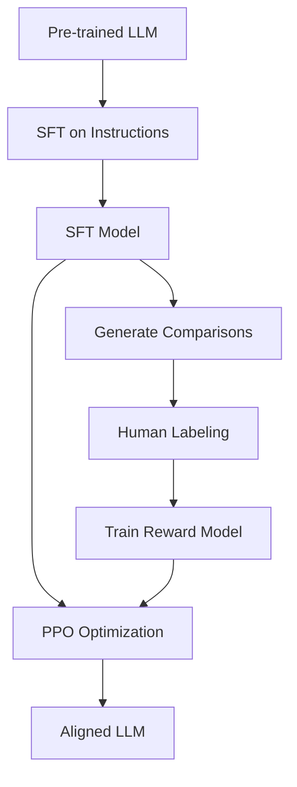
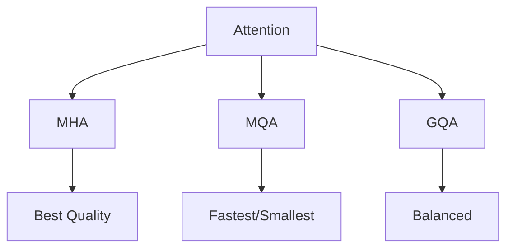

## Table of Contents
- [Introduction](#introduction)
- [Learning Roadmap](#learning-roadmap)
- [Theory Notes](#theory-notes)
- [Key Concepts](#key-concepts)
- [FAQ (30+ Q&A)](#faq-30-qa)
- [Hands-on Practice](#hands-on-practice)
- [FAANG Questions](#faang-questions)
- [Common Mistakes](#common-mistakes)
- [Best Practices](#best-practices)
- [Cheat Sheet](#cheat-sheet)
- [Flash Cards (30)](#flash-cards-30)
- [Mind Map](#mind-map)
- [Mermaid Diagrams](#mermaid-diagrams)
- [Code Examples](#code-examples)
- [Projects](#projects)
- [Resources](#resources)
- [Checklist](#checklist)
- [Revision Plans](#revision-plans)
- [Mock Interviews](#mock-interviews)
- [Difficulty Rating](#difficulty-rating)
- [Summary](#summary)

---

## Introduction

Large Language Models (LLMs) are neural networks with billions of parameters trained on massive text corpora. They demonstrate remarkable capabilities in language understanding, generation, reasoning, and in-context learning. LLMs represent the current frontier of AI, powering applications from chatbots to code generation, scientific research, and creative writing.

Key LLM families include GPT (OpenAI), LLaMA (Meta), PaLM (Google), Claude (Anthropic), and Mistral. Understanding LLM internals, training, fine-tuning, and deployment is essential for modern AI engineering roles.

Key capabilities include:
- **Text Generation**: Producing coherent, contextually appropriate text
- **Reasoning**: Solving logic, math, and coding problems
- **In-Context Learning**: Learning from examples in the prompt
- **Instruction Following**: Executing complex, multi-step instructions
- **Code Generation**: Writing and debugging code across languages
- **Summarization**: Condensing long documents accurately
- **Translation**: Translating between languages fluently

---

## Learning Roadmap

### Phase 1: Transformer Fundamentals (Week 1-2)
- Self-attention mechanism in depth
- Multi-head attention
- Positional encoding (sinusoidal, RoPE, ALiBi)
- Layer normalization (pre-norm vs post-norm)
- Feed-forward networks in transformers

### Phase 2: Pre-training and Scaling (Week 3-4)
- Language modeling objectives (CLM, MLM)
- Scaling laws (Chinchilla, Kaplan)
- Training infrastructure and distributed computing
- Tokenization (BPE, SentencePiece)
- Data curation and quality

### Phase 3: Fine-tuning (Week 5-7)
- Full fine-tuning vs parameter-efficient
- LoRA and QLoRA
- Instruction tuning
- RLHF (Reinforcement Learning from Human Feedback)
- DPO (Direct Preference Optimization)

### Phase 4: Inference Optimization (Week 8-9)
- KV cache
- Quantization (INT8, INT4, GPTQ, AWQ)
- Speculative decoding
- Continuous batching
- Model parallelism (tensor, pipeline)

### Phase 5: Applications and Safety (Week 10-12)
- Prompt engineering
- RAG (Retrieval Augmented Generation)
- Evaluation benchmarks
- Safety alignment
- Hallucination mitigation
- Responsible deployment

---

## Theory Notes

### Transformer Architecture for LLMs
LLMs typically use decoder-only transformers with causal (masked) self-attention. Each token can only attend to previous tokens. The architecture consists of: token embeddings + positional encoding, N transformer blocks (each with multi-head self-attention and feed-forward network), and a language model head projecting to vocabulary.

### Self-Attention in Depth
For each position, compute:
1. Query: Q = X * W_Q
2. Key: K = X * W_K
3. Value: V = X * W_V
4. Attention: softmax(QK^T / sqrt(d_k)) * V

Causal masking ensures token i only attends to tokens 1...i. This enables autoregressive generation.

### Scaling Laws
Performance follows power laws with model size, dataset size, and compute. The Chinchilla paper showed that for a given compute budget, there's an optimal balance between model size and data size. Most current LLMs are undertrained relative to Chinchilla optimal.

### LoRA (Low-Rank Adaptation)
Freezes pre-trained weights and injects trainable low-rank matrices: W' = W + BA where B is (d, r) and A is (r, d) with r << d. Only trains A and B, dramatically reducing trainable parameters. QLoRA further quantizes the base model to 4-bit.

### KV Cache
During autoregressive generation, previously computed key-value pairs are cached to avoid recomputation. This reduces generation from O(n^2) to O(n) per new token but requires significant memory. Key bottleneck for long-context generation.

### Quantization
Reducing model precision from FP32/FP16 to INT8/INT4. Methods:
- **GPTQ**: Post-training quantization using approximate second-order information
- **AWQ**: Activation-aware weight quantization
- **GGUF**: Format for CPU inference with mixed quantization

### RLHF Pipeline
1. Supervised fine-tuning on instruction-response pairs
2. Train reward model on human preference comparisons
3. Optimize policy using PPO to maximize reward while staying close to SFT model

### DPO (Direct Preference Optimization)
Simplifies RLHF by directly optimizing on preference data without training a separate reward model. Uses a closed-form solution relating the optimal policy to the reward function.

### Attention Optimizations
- **Multi-Query Attention (MQA)**: Shares key-value heads across attention heads. Reduces memory and speeds up inference.
- **Grouped-Query Attention (GQA)**: Compromise between MHA and MQA. Groups query heads sharing K/V heads.
- **FlashAttention**: IO-aware block-wise attention algorithm. Reduces memory from O(n^2) to O(n).
- **Sliding Window Attention**: Limits attention to local windows, reducing complexity.

### Positional Encoding Methods
- **Sinusoidal**: Fixed sinusoidal functions. Original transformer approach.
- **Learned**: Trainable position embeddings. Used in GPT-2, BERT.
- **RoPE**: Rotary Position Embedding. Encodes relative position via rotation. Used in LLaMA, PaLM.
- **ALiBi**: Attention with Linear Biases. Adds distance-based bias to attention scores.

---

## Key Concepts

| Concept | Description |
|---------|-------------|
| KV Cache | Stores previously computed keys/values to avoid recomputation |
| Context Window | Maximum number of tokens the model can process |
| Temperature | Controls randomness in sampling (0=deterministic, 2=very random) |
| Top-p | Nucleus sampling, limits to smallest token set exceeding probability p |
| Perplexity | How well model predicts text; lower is better |
| Emergent Abilities | Capabilities that appear suddenly at certain model scales |
| In-Context Learning | Learning from examples provided in the prompt |
| Instruction Tuning | Fine-tuning on instruction-response pairs |
| Hallucination | Model generating plausible but factually incorrect information |
| Grounding | Connecting model outputs to verifiable sources |
| MHA/MQA/GQA | Multi-head / Multi-query / Grouped-query attention variants |
| FlashAttention | IO-aware attention reducing memory from O(n^2) to O(n) |

---

## FAQ (30+ Q&A)

### Q1: What is the difference between BERT and GPT?
**A:** BERT is encoder-only, bidirectional, trained with masked language modeling. GPT is decoder-only, unidirectional (causal), trained with next-token prediction. BERT excels at understanding; GPT excels at generation.

### Q2: What is KV cache?
**A:** Stores previously computed key and value vectors during autoregressive generation. Without cache, each new token requires recomputing attention for all previous tokens. Cache reduces this to computing only the new token's attention. Major memory bottleneck for long contexts.

### Q3: What is LoRA?
**A:** Low-Rank Adaptation freezes pre-trained weights and adds trainable low-rank matrices. Only these small matrices are trained, reducing trainable parameters from billions to millions. QLoRA further quantizes the base model to 4-bit.

### Q4: What is RLHF?
**A:** Reinforcement Learning from Human Feedback. Three steps: SFT on instructions, train reward model on human preferences, optimize policy with PPO. Aligns model behavior with human preferences.

### Q5: What is the difference between beam search and sampling?
**A:** Beam search keeps top-k sequences at each step, selecting the highest probability output. It's deterministic but can produce generic text. Sampling (temperature, top-k, top-p) introduces randomness for more diverse outputs.

### Q6: What are scaling laws?
**A:** Performance follows power laws with model size, data, and compute. Chinchilla showed optimal compute allocation requires scaling data and model size proportionally. Most LLMs are over-parameterized relative to their training data.

### Q7: What is a context window?
**A:** Maximum number of tokens an LLM can process. GPT-4: 128K tokens. LLaMA: 8K-100K. Longer windows enable more context but increase attention computation quadratically (mitigated by FlashAttention, sparse attention).

### Q8: What is hallucination?
**A:** Model generating plausible but factually incorrect information. Caused by the model optimizing for fluency over accuracy. Mitigation: RAG, fact-checking, uncertainty quantification, and training with verified data.

### Q9: What is quantization?
**A:** Reducing model precision (FP32 to INT8/INT4) to decrease memory and increase speed. GPTQ and AWQ are popular methods. 4-bit quantization typically loses minimal quality while reducing memory 4x.

### Q10: What is speculative decoding?
**A:** Using a small "draft" model to generate candidate tokens quickly, then verifying with the large model in one pass. Achieves speedup because verification is parallel while generation is sequential.

### Q11: What is in-context learning?
**A:** LLMs learning from examples provided in the prompt without updating weights. Few-shot learning demonstrates this. Emerges at sufficient model scale. Mechanism still debated (implicit Bayesian inference, meta-learning).

### Q12: What is instruction tuning?
**A:** Fine-tuning LLMs on instruction-response pairs to follow instructions better. Models learn the format of instructions and generate appropriate responses. Foundation for chat and assistant models.

### Q13: What is DPO?
**A:** Direct Preference Optimization. Simplifies RLHF by directly optimizing on preference data without a separate reward model. Uses closed-form solution relating policy to reward. More stable and simpler than PPO-based RLHF.

### Q14: What is FlashAttention?
**A:** IO-aware exact attention algorithm that reduces memory from O(n^2) to O(n) by computing attention in blocks and avoiding materializing the full attention matrix. Enables much longer context windows.

### Q15: What are emergent abilities?
**A:** Capabilities that appear suddenly at certain model scales but aren't present in smaller models. Examples: chain-of-thought reasoning, few-shot learning, arithmetic. Controversial whether they truly emerge or gradually improve.

### Q16: What is the difference between pre-training and fine-tuning?
**A:** Pre-training learns general language representations from massive unlabeled data (next token prediction). Fine-tuning adapts the pre-trained model to specific tasks or behaviors using smaller labeled datasets.

### Q17: What is temperature in LLMs?
**A:** Scales logits before softmax sampling. Temperature=0: always picks most likely token (deterministic). Temperature=1: standard sampling. Temperature>1: more random. Lower temperature for factual tasks, higher for creative tasks.

### Q18: What is continuous batching?
**A:** Dynamically adding and removing requests from a batch during generation. Different sequences can have different lengths. Improves throughput by keeping GPU utilization high throughout generation.

### Q19: What is model parallelism?
**A:** Splitting a model across multiple GPUs. Tensor parallelism splits layers across GPUs. Pipeline parallelism splits layers into stages on different GPUs. Essential for models that don't fit in single GPU memory.

### Q20: What is the difference between chat models and base models?
**A:** Base models are pre-trained for next-token prediction. Chat models are further fine-tuned with instruction tuning and RLHF to follow instructions, maintain conversations, and refuse harmful requests. Chat models need specific prompting formats.

### Q21: What is grounding in LLMs?
**A:** Connecting model outputs to verifiable, external sources. RAG is a grounding technique. Reduces hallucination by anchoring responses to retrieved facts. Critical for applications requiring accuracy.

### Q22: What is chain-of-thought prompting?
**A:** Asking the model to show step-by-step reasoning before giving final answers. Significantly improves performance on math, logic, and complex reasoning tasks. Works better with larger models.

### Q23: What is multi-query attention (MQA)?
**A:** Attention variant where all query heads share a single key-value head. Reduces KV cache size and speeds up inference. Trades some quality for significant efficiency gains. Used in PaLM, Falcon.

### Q24: What is grouped-query attention (GQA)?
**A:** Compromise between MHA and MQA where query heads are grouped, each group sharing K/V heads. Better quality than MQA with less memory than MHA. Used in LLaMA-2 70B, Mistral.

### Q25: What is RoPE (Rotary Position Embedding)?
**A:** Applies rotation to query and key vectors based on position. Encodes relative positional information naturally. Better length generalization than absolute position embeddings. Used in LLaMA, PaLM, Mistral.

### Q26: What is ALiBi?
**A:** Attention with Linear Biases. Adds a linear bias proportional to distance between tokens to attention scores. Simple, efficient, and generalizes to longer sequences. Used in BLOOM, MPT.

### Q27: What is pre-norm vs post-norm?
**A:** Pre-norm applies layer normalization before attention/FFN (GPT-2+, LLaMA). Post-norm applies after (original transformer, BERT). Pre-norm is more stable for training large models.

### Q28: What is weight tying?
**A:** Sharing weights between the input embedding layer and the final language model head. Reduces parameters and often improves performance. Common in many LLM architectures.

### Q29: What is mixture of experts (MoE)?
**A:** Architecture where different expert sub-networks handle different inputs. A router selects which experts to activate per token. Enables scaling parameters without proportional compute scaling. Used in Mixtral, Switch Transformer.

### Q30: What is the difference between INT8 and INT4 quantization?
**A:** INT8 reduces precision to 8 bits (2x compression). INT4 reduces to 4 bits (4x compression). INT4 is more aggressive but enables running larger models on consumer hardware. GPTQ and AWQ support both.

---

## Hands-on Practice

### Loading and Using an LLM
```python
from transformers import AutoTokenizer, AutoModelForCausalLM

model_name = "meta-llama/Llama-2-7b-chat-hf"
tokenizer = AutoTokenizer.from_pretrained(model_name)
model = AutoModelForCausalLM.from_pretrained(
    model_name, torch_dtype=torch.float16, device_map="auto"
)

prompt = "[INST] What is the capital of France? [/INST]"
inputs = tokenizer(prompt, return_tensors="pt").to(model.device)
outputs = model.generate(**inputs, max_new_tokens=100, temperature=0.7)
print(tokenizer.decode(outputs[0], skip_special_tokens=True))
```

### LoRA Fine-tuning
```python
from peft import LoraConfig, get_peft_model, TaskType
from transformers import AutoModelForCausalLM

model = AutoModelForCausalLM.from_pretrained("meta-llama/Llama-2-7b-hf")

lora_config = LoraConfig(
    task_type=TaskType.CAUSAL_LM,
    r=8,
    lora_alpha=32,
    lora_dropout=0.1,
    target_modules=["q_proj", "v_proj", "k_proj", "o_proj"]
)

model = get_peft_model(model, lora_config)
model.print_trainable_parameters()
# trainable params: ~5M vs total: ~7B
```

### Quantization Setup
```python
from transformers import BitsAndBytesConfig

bnb_config = BitsAndBytesConfig(
    load_in_4bit=True,
    bnb_4bit_quant_type="nf4",
    bnb_4bit_compute_dtype=torch.float16,
    bnb_4bit_use_double_quant=True,
)

model = AutoModelForCausalLM.from_pretrained(
    "meta-llama/Llama-2-7b-hf",
    quantization_config=bnb_config,
    device_map="auto"
)
```

---

## FAANG Questions

1. **Google**: How would you design an LLM serving system handling 100K requests/day with sub-second latency?
2. **Meta**: You have a 70B parameter model that doesn't fit on one GPU. Design the serving architecture.
3. **Amazon**: How would you build a question-answering system using LLMs that is factually grounded?
4. **Apple**: Design an on-device LLM for real-time text suggestions with privacy constraints.
5. **OpenAI**: How would you evaluate an LLM's reasoning capabilities beyond benchmark scores?
6. **Google**: Design a system to detect and mitigate LLM hallucinations in production.
7. **Meta**: How would you fine-tune a 70B model on a single consumer GPU?
8. **Amazon**: Build a multi-tenant LLM serving system with different quality/cost requirements.
9. **Anthropic**: How would you implement constitutional AI for safety alignment?
10. **Google**: Design an LLM that can process and reason over 1M token contexts.
11. **Meta**: Design an LLM inference system that minimizes cost while maintaining latency SLAs.
12. **OpenAI**: How would you build an LLM evaluation framework for safety and helpfulness?

---

## Common Mistakes

1. Not using KV cache (recomputing attention for every token)
2. Ignoring quantization for deployment (wasting memory)
3. Using full fine-tuning when LoRA suffices
4. Not considering context window limitations in system design
5. Using temperature=0 for tasks requiring diversity
6. Ignoring safety guardrails in deployment
7. Not evaluating hallucination rates
8. Using beam search when sampling is more appropriate
9. Not optimizing batch processing for throughput
10. Ignoring cost implications of API-based LLM calls

---

## Best Practices

1. Use quantization for efficient inference
2. Implement KV cache for autoregressive generation
3. Use LoRA/QLoRA for efficient fine-tuning
4. Start with prompt engineering before fine-tuning
5. Evaluate with multiple benchmarks, not just one
6. Implement safety filters and content moderation
7. Monitor for hallucination in production
8. Use continuous batching for high throughput
9. Consider model distillation for cost reduction
10. Test with adversarial inputs for robustness

---

## Cheat Sheet

### Model Sizes and Requirements
| Model | Params | VRAM (FP16) | VRAM (INT4) |
|-------|--------|-------------|-------------|
| LLaMA-7B | 7B | 14GB | ~4GB |
| LLaMA-13B | 13B | 26GB | ~8GB |
| LLaMA-70B | 70B | 140GB | ~35GB |
| GPT-3 | 175B | 350GB | ~90GB |

### Sampling Strategies
| Strategy | Use Case |
|----------|----------|
| Greedy | Deterministic, factual tasks |
| Temperature | Creative generation |
| Top-k | Limit vocabulary |
| Top-p | Dynamic vocabulary |
| Beam search | Translation, summarization |

### Fine-tuning Methods
| Method | Params | VRAM | Quality |
|--------|--------|------|---------|
| Full FT | All | High | Best |
| LoRA | ~0.1% | Medium | Very Good |
| QLoRA | ~0.1% | Low | Good |
| Prompt Tuning | <0.01% | Minimal | Moderate |

### Attention Variants
| Variant | K/V Heads | Memory | Speed |
|---------|-----------|--------|-------|
| MHA | One per head | High | Baseline |
| MQA | Shared single | Low | Fast |
| GQA | Grouped | Medium | Medium |

---

## Flash Cards (30)

**Card 1:** Q: What is an LLM? A: A neural network with billions of parameters pre-trained on massive text for language understanding and generation.

**Card 2:** Q: What is causal attention? A: Each token only attends to previous tokens, enabling autoregressive generation.

**Card 3:** Q: What is KV cache? A: Stores computed keys/values to avoid recomputation during generation, reducing from O(n^2) to O(n).

**Card 4:** Q: What is LoRA? A: Low-Rank Adaptation adding small trainable matrices to frozen weights, reducing trainable parameters dramatically.

**Card 5:** Q: What is RLHF? A: Using human preferences to align LLMs via reward modeling and reinforcement learning.

**Card 6:** Q: What is temperature? A: Scales logits before sampling; 0=deterministic, higher=more random.

**Card 7:** Q: What is hallucination? A: Model generating plausible but factually incorrect information.

**Card 8:** Q: What is context window? A: Maximum tokens the model can process in a single forward pass.

**Card 9:** Q: What is quantization? A: Reducing model precision (FP16 to INT8/INT4) for lower memory and faster inference.

**Card 10:** Q: What is in-context learning? A: Learning from examples in the prompt without updating model weights.

**Card 11:** Q: What is instruction tuning? A: Fine-tuning on instruction-response pairs to improve instruction following.

**Card 12:** Q: What is DPO? A: Direct Preference Optimization, simplifying RLHF without separate reward model.

**Card 13:** Q: What is speculative decoding? A: Using small model to draft tokens, verifying with large model in parallel.

**Card 14:** Q: What is FlashAttention? A: IO-aware attention algorithm reducing memory from O(n^2) to O(n).

**Card 15:** Q: What is continuous batching? A: Dynamically managing request batches during generation for better throughput.

**Card 16:** Q: What is model parallelism? A: Splitting model across GPUs via tensor or pipeline parallelism.

**Card 17:** Q: What is chain-of-thought? A: Prompting model to show step-by-step reasoning before answers.

**Card 18:** Q: What is scaling law? A: Performance follows power laws with model size, data, and compute.

**Card 19:** Q: What is grounding? A: Connecting model outputs to verifiable external sources to reduce hallucination.

**Card 20:** Q: What is RAG? A: Retrieval Augmented Generation, retrieving relevant context to augment LLM responses.

**Card 21:** Q: What is RoPE? A: Rotary Position Embedding encoding relative position via rotation matrices.

**Card 22:** Q: What is GQA? A: Grouped-Query Attention, compromise between MHA and MQA for efficiency.

**Card 23:** Q: What is MoE? A: Mixture of Experts activating different sub-networks per token for efficient scaling.

**Card 24:** Q: What is weight tying? A: Sharing embedding weights with the language model output head.

**Card 25:** Q: What is pre-norm? A: Applying layer normalization before attention/FFN for stable large model training.

**Card 26:** Q: What is ALiBi? A: Attention with Linear Biases adding distance-based bias to attention scores.

**Card 27:** Q: What is GPTQ? A: Post-training quantization method using approximate second-order information.

**Card 28:** Q: What is AWQ? A: Activation-Aware Weight Quantization for efficient LLM compression.

**Card 29:** Q: What is GGUF? A: Quantized format for efficient CPU/mixed inference of LLMs.

**Card 30:** Q: What is constitutional AI? A: Training approach using AI feedback to align models with principles.

---

## Mind Map

```
LLMs
├── Architecture
│   ├── Transformer (Decoder-only)
│   ├── Self-Attention
│   └── Positional Encoding
├── Pre-training
│   ├── Language Modeling
│   ├── Scaling Laws
│   └── Data Curation
├── Fine-tuning
│   ├── Full Fine-tuning
│   ├── LoRA / QLoRA
│   ├── Instruction Tuning
│   └── RLHF / DPO
├── Inference
│   ├── KV Cache
│   ├── Quantization
│   ├── Speculative Decoding
│   └── Continuous Batching
├── Applications
│   ├── Prompt Engineering
│   ├── RAG
│   └── Agent Systems
└── Safety
    ├── Alignment
    ├── Hallucination
    └── Content Filtering
```

---

## Mermaid Diagrams

### LLM Generation Process


### RLHF Pipeline


### KV Cache Operation


### Attention Variants Comparison


---

## Code Examples

### Prompt Engineering Patterns
```python
# Zero-shot
prompt = "Classify this review as positive or negative: 'Great product!'"

# Few-shot
prompt = """Classify reviews:
Review: 'Amazing!' -> Positive
Review: 'Terrible!' -> Negative
Review: 'Great product!' -> ?"""

# Chain-of-thought
prompt = """Question: If a train travels 60 mph for 2.5 hours, how far does it go?
Let me think step by step:
1. Speed = 60 mph
2. Time = 2.5 hours
3. Distance = Speed x Time = 60 x 2.5 = 150 miles
Answer: 150 miles"""
```

### RAG Implementation
```python
from langchain.vectorstores import Chroma
from langchain.embeddings import OpenAIEmbeddings
from langchain.llms import OpenAI
from langchain.chains import RetrievalQA

vectorstore = Chroma.from_documents(documents, OpenAIEmbeddings())
retriever = vectorstore.as_retriever(search_kwargs={"k": 3})
qa_chain = RetrievalQA.from_chain_type(
    llm=OpenAI(),
    retriever=retriever,
    return_source_documents=True
)
result = qa_chain({"query": "What is machine learning?"})
```

---

## Projects

1. **Chat Application**: Build a chat interface with an open-source LLM
2. **RAG System**: Implement document Q&A using RAG with vector search
3. **Fine-tuned Model**: Fine-tune LLaMA on domain-specific data
4. **Code Assistant**: Build a code generation/completion system
5. **Evaluation Pipeline**: Create comprehensive LLM evaluation framework
6. **Model Serving**: Deploy quantized LLM with vLLM and continuous batching
7. **Multi-modal System**: Build a system that processes text and images together

---

## Resources

- **Papers**: "Attention Is All You Need", GPT-3, LLaMA, Chinchilla, LoRA, RLHF
- **Courses**: Stanford CS324 (LLMs), Hugging Face NLP Course
- **Libraries**: Hugging Face Transformers, vLLM, LangChain, LLaMA-Factory
- **Tools**: Ollama (local inference), OpenAI API, Anthropic API

---

## Checklist

- [ ] Transformer architecture deep dive
- [ ] Self-attention and causal masking
- [ ] KV cache and inference optimization
- [ ] LoRA and QLoRA for fine-tuning
- [ ] RLHF and DPO alignment
- [ ] Quantization methods
- [ ] Prompt engineering patterns
- [ ] RAG architecture
- [ ] Evaluation benchmarks
- [ ] Safety and alignment considerations
- [ ] Practical inference optimization
- [ ] Attention variants (MQA, GQA)
- [ ] Positional encoding methods (RoPE, ALiBi)
- [ ] Mixture of Experts architectures

---

## Revision Plans

### 2-Week Plan
- Week 1: Transformer deep dive, pre-training, fine-tuning
- Week 2: Inference optimization, applications, safety

### Daily (30 min)
- 10 min: Flash cards
- 10 min: Code practice
- 10 min: Read papers/tutorials

---

## Mock Interviews

1. Explain the transformer architecture and self-attention mechanism
2. How would you optimize LLM inference for production?
3. What are the tradeoffs between different fine-tuning methods?
4. Design an LLM serving system for a global application
5. How do you handle hallucination in LLM outputs?
6. Explain scaling laws and their practical implications
7. Compare RLHF and DPO for model alignment

---

## Difficulty Rating

| Topic | Difficulty | Frequency |
|-------|-----------|-----------|
| Transformer Architecture | Hard | Very High |
| Fine-tuning (LoRA) | Medium | Very High |
| Inference Optimization | Hard | High |
| Quantization | Medium | High |
| RLHF/DPO | Hard | High |
| Prompt Engineering | Easy-Medium | Very High |
| Evaluation | Medium | High |
| Safety/Alignment | Hard | High |

**Overall: Hard | Preparation: 8-10 weeks**

---

## Summary

LLM interviews require deep understanding of transformer architecture, training methodologies, fine-tuning techniques (LoRA, RLHF), inference optimization (KV cache, quantization), and practical applications (RAG, prompt engineering). The field evolves rapidly, so staying current with latest papers and techniques is essential. Balance theoretical knowledge with hands-on experience in deploying and fine-tuning models.

---

## Deep Dive: Model Comparison

### LLM Family Comparison
| Model | Params | Context | Architecture | Key Feature |
|-------|--------|---------|-------------|-------------|
| GPT-4 | ~1.8T (est.) | 128K | MoE (est.) | Strong reasoning |
| LLaMA-2 70B | 70B | 4K | Dense | Open-source |
| LLaMA-3 70B | 70B | 128K | Dense | Improved training |
| Mistral 7B | 7B | 32K | Dense + SWA | Efficient |
| Mixtral 8x7B | 47B | 32K | MoE | Speed-accuracy |
| Claude 3 Opus | ~2T (est.) | 200K | Dense | Long context |
| Gemini 1.5 Pro | ~500B+ | 1M | MoE | Ultra-long context |

### Inference Optimization Comparison
| Technique | Speedup | Memory Savings | Quality Impact |
|-----------|---------|---------------|----------------|
| KV Cache | 10-100x | -2x memory | None |
| INT8 Quantization | 1.5-2x | 50% | Minimal |
| INT4 Quantization | 2-4x | 75% | Small |
| Speculative Decoding | 2-3x | Same | None |
| Continuous Batching | 2-10x | Same | None |
| FlashAttention | 2-4x | 5-20x | None |
| Tensor Parallelism | Linear | N/A | None |

### Fine-tuning Method Comparison
| Method | Trainable Params | VRAM Required | Quality | Best For |
|--------|-----------------|---------------|---------|----------|
| Full Fine-tuning | 100% | Very High | Best | Large datasets |
| LoRA (r=16) | ~0.1% | Medium | Very Good | General fine-tuning |
| QLoRA (r=16) | ~0.1% | Low | Good | Consumer GPU |
| Prompt Tuning | <0.01% | Minimal | Moderate | Task routing |
| Adapter Layers | ~1-3% | Medium | Good | Multi-task |

### Attention Mechanism Deep Dive
Standard Multi-Head Attention:
```
Q = X @ W_Q  (batch, seq_len, d_model)
K = X @ W_K  (batch, seq_len, d_model)
V = X @ W_V  (batch, seq_len, d_model)
attn = softmax(Q @ K^T / sqrt(d_k)) @ V
```

Causal Masking: Upper triangular mask prevents attending to future tokens. Ensures autoregressive generation property.

Multi-Query Attention (MQA): All heads share single K and V projections. Reduces KV cache by factor of num_heads. Used in PaLM, Falcon.

Grouped-Query Attention (GQA): K and V shared across groups of query heads. Compromise between MHA and MQA. Used in LLaMA-2 70B, Mistral.

### Position Encoding Deep Dive
| Method | Type | Length Generalization | Used In |
|--------|------|---------------------|---------|
| Sinusoidal | Fixed | Moderate | Original Transformer |
| Learned | Trainable | Fixed to training length | GPT-2, BERT |
| RoPE | Relative | Good | LLaMA, PaLM, Mistral |
| ALiBi | Relative bias | Very Good | BLOOM, MPT |
| YaRN | Extended RoPE | Excellent | Extended context |

### Tokenizer Comparison
| Tokenizer | Vocab Size | Used By | Type |
|-----------|-----------|---------|------|
| BPE | 50K | GPT-2, GPT-3 | Byte-level BPE |
| SentencePiece | 32K-100K | LLaMA, T5 | Unigram/BPE |
| tiktoken | 100K | GPT-4 | Byte-level BPE |
| WordPiece | 30K | BERT | Likelihood-based |

---

## Deep Dive: Inference Optimization

### KV Cache Details
During autoregressive generation, each new token needs attention over all previous tokens.
- Without cache: O(n^2 * d) per token (recompute all K,V)
- With cache: O(n * d) per token (only compute new token's K,V)
- Memory: 2 * num_layers * num_heads * head_dim * seq_len * batch_size * dtype_size
- For LLaMA-70B at 4K context: ~5GB KV cache per request

### Quantization Deep Dive
| Method | Type | Bits | Speed | Quality | Notes |
|--------|------|------|-------|---------|-------|
| GPTQ | Post-training | 4/8 | Fast inference | Good | One-shot, calibration data |
| AWQ | Post-training | 4 | Fast inference | Very Good | Activation-aware |
| GGUF | Mixed | 2-8 | CPU optimized | Variable | llama.cpp format |
| BitsAndBytes | Dynamic | 4/8 | Training+Inf | Good | Easy integration |
| FP8 | Hardware | 8 | Very fast | Excellent | H100 support |

### Speculative Decoding
1. Small draft model generates K tokens quickly
2. Large target model verifies all K tokens in one forward pass
3. Accept matching tokens, reject and resample from first mismatch
4. Speedup: 2-3x with no quality loss
5. Draft model should be ~10-100x smaller than target

### FlashAttention Algorithm
Standard attention: O(N^2) memory for attention matrix.
FlashAttention: Tiling-based approach
1. Split Q, K, V into blocks that fit in SRAM
2. Compute attention for each block, accumulating results
3. Never materialize full N×N attention matrix
4. IO complexity: O(N^2 * d^2 / M) where M is SRAM size
5. Wall-clock speedup: 2-4x, memory reduction: 5-20x

---

## LLM Deployment Reference

### Inference Optimization Summary
| Technique | Speedup | Memory Savings | Quality Impact | Complexity |
|-----------|---------|---------------|----------------|------------|
| Quantization (INT8) | 1.5-2x | 50% | Minimal | Low |
| Quantization (INT4) | 2-3x | 75% | Small | Medium |
| KV Cache | 2-10x | -20% | None | Low |
| FlashAttention | 2-4x | 5-20x | None | Medium |
| Speculative Decoding | 2-3x | +10% | None | High |
| Continuous Batching | 2-5x | -10% | None | Medium |
| PagedAttention | 2-4x | -40% | None | Medium |
| Tensor Parallelism | Nx | - | None | High |
| Pipeline Parallelism | Nx | - | None | High |
| Model Parallelism | Nx | - | None | High |

### GPU Memory Requirements
| Model | FP32 | FP16 | INT8 | INT4 |
|-------|------|------|------|------|
| 7B | 28GB | 14GB | 7GB | 3.5GB |
| 13B | 52GB | 26GB | 13GB | 6.5GB |
| 30B | 120GB | 60GB | 30GB | 15GB |
| 65B | 260GB | 130GB | 65GB | 32.5GB |
| 175B | 700GB | 350GB | 175GB | 87.5GB |

### Fine-tuning Strategy Comparison
| Method | Trainable Params | Memory | Speed | Quality | When to Use |
|--------|-----------------|--------|-------|---------|-------------|
| Full FT | 100% | Very High | Slow | Best | Sufficient data + compute |
| LoRA | 0.1-1% | Low | Fast | Very Good | Most fine-tuning tasks |
| QLoRA | 0.1-1% | Very Low | Fast | Good | Limited GPU memory |
| Prefix Tuning | <0.1% | Low | Fast | Good | Text generation tasks |
| Adapter | 1-5% | Medium | Medium | Good | Multi-task learning |
| Prompt Tuning | <0.1% | Very Low | Very Fast | Moderate | Simple tasks |

### Common LLM Interview Scenarios
| Scenario | Approach | Key Considerations |
|----------|----------|-------------------|
| Deploy 70B model | INT4 quantization + tensor parallelism | 2x A100-80GB |
| Real-time chat | KV cache + continuous batching | <200ms latency |
| Long document | Sliding window + chunking | Memory management |
| Multi-turn conversation | Context window management | Summarization |
| Code generation | Specialized model + syntax validation | Execution sandbox |
| Cost optimization | Model routing + caching | Different models for different queries |
| Accuracy critical | Ensemble + verification | Multiple model agreement |

---

## LLM Production Checklist

### Model Selection Guide
| Use Case | Recommended Model | Size | Why |
|----------|------------------|------|-----|
| General chat | GPT-4o, Claude 3.5 | Large | Best quality |
| Code generation | CodeLlama, DeepSeek-Coder | 7-33B | Code-optimized |
| Summarization | Mistral, LLaMA 3 | 7-70B | Good quality/speed |
| Classification | DistilBERT, DeBERTa | Small | Fast inference |
| Math/Reasoning | GPT-4, Claude 3.5 | Large | Strong reasoning |
| Multilingual | GPT-4o, mT5 | Large | Language coverage |
| Edge deployment | Phi-3, Gemma | 2-9B | Small, efficient |
| Cost-sensitive | LLaMA 3 8B, Mistral 7B | Small | Open-source, cheap |

### LLM Safety Checklist
- [ ] Input validation and sanitization
- [ ] Prompt injection detection
- [ ] Output content filtering
- [ ] PII detection and masking
- [ ] Hallucination detection
- [ ] Jailbreak attempt detection
- [ ] Rate limiting per user
- [ ] Audit logging
- [ ] Human review for critical outputs
- [ ] Compliance with regulations

### LLM Cost Optimization
| Strategy | Savings | Complexity | When to Use |
|----------|---------|------------|-------------|
| Model routing | 50-80% | Medium | Mixed query complexity |
| Caching | 30-60% | Low | Repeated queries |
| Prompt optimization | 10-30% | Low | Long prompts |
| Batch processing | 20-40% | Low | Non-real-time |
| Quantization | 50-75% | Low | Deployment |
| Speculative decoding | 2-3x speed | High | Latency-sensitive |
| Continuous batching | 2-5x throughput | Medium | High volume |

### Common LLM Interview Scenarios
| Scenario | Approach | Key Considerations |
|----------|----------|-------------------|
| Build a chatbot | System prompt + conversation management | Persona, memory |
| Content generation | Few-shot + structured output | Quality control |
| Data extraction | JSON mode + schema validation | Accuracy |
| Code assistant | Code-specific model + sandbox | Security |
| Document Q&A | RAG pipeline + retrieval | Context quality |
| Translation | Language-specific prompts | Cultural nuance |
| Classification | Zero-shot or fine-tuned | Edge cases |

---

## Interview Quick Reference Card

### Top 10 LLM Interview Questions
1. **Self-attention**: softmax(QK^T/sqrt(d_k)) * V, allows each token to attend to all others
2. **KV cache**: Stores computed K,V to avoid recomputation, reduces O(n^2) to O(n)
3. **LoRA**: Adds low-rank matrices W' = W + BA, trains only A,B (~0.1% params)
4. **RLHF**: SFT → reward model training → PPO optimization for human alignment
5. **Quantization**: Reduce precision (FP16→INT4) for 4x memory savings with minimal quality loss
6. **Scaling laws**: Performance follows power laws with model size, data, and compute
7. **Speculative decoding**: Small model drafts, large model verifies for 2-3x speedup
8. **FlashAttention**: IO-aware tiling reducing attention memory from O(n^2) to O(n)
9. **Continuous batching**: Dynamic batch management for better GPU utilization
10. **RoPE**: Rotary position embedding encoding relative position via rotation matrices

### Model Serving Quick Reference
| Model Size | Min GPU (FP16) | Min GPU (INT4) | Recommended Setup |
|-----------|----------------|----------------|-------------------|
| 7B | 1x A100 40GB | 1x RTX 3090 | vLLM or TGI |
| 13B | 1x A100 80GB | 1x A10G 24GB | vLLM |
| 70B | 2x A100 80GB | 1x A100 80GB | vLLM + tensor parallel |
| 70B+ | 4x A100 80GB | 2x A100 80GB | vLLM + pipeline parallel |

### Key Formulas Reference
- **Attention**: softmax(QK^T / sqrt(d_k)) * V
- **RoPE**: R(d, theta) applies rotation based on position
- **LoRA output**: Wx + BAx where B is (d, r), A is (r, d)
- **PPO objective**: E[min(r_t * A_t, clip(r_t, 1-eps, 1+eps) * A_t)]
- **DPO loss**: -log(sigmoid(beta * (log(pi/pi_ref) - log(pi_w/pi_l))))
- **Perplexity**: exp(-1/N * sum(log(p(w_i|w_{<i}))))
