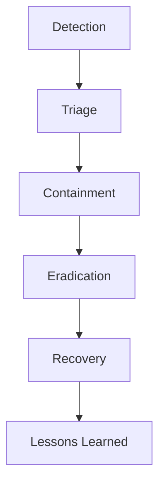
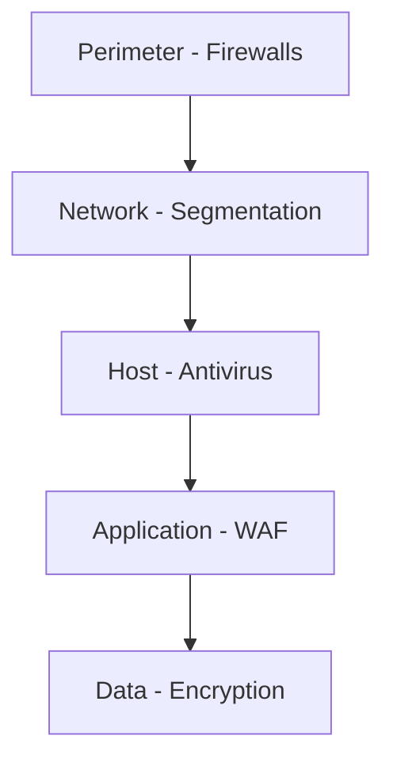

## Table of Contents
- [Introduction](#introduction)
- [Learning Roadmap](#learning-roadmap)
- [Theory Notes](#theory-notes)
- [Key Concepts](#key-concepts)
- [FAQ (35+ Q&A)](#faq-35-qa)
- [Hands-on Practice](#hands-on-practice)
- [FAANG Questions](#faang-questions)
- [Common Mistakes](#common-mistakes)
- [Best Practices](#best-practices)
- [Cheat Sheet](#cheat-sheet)
- [Flash Cards (30)](#flash-cards-30)
- [Mind Map](#mind-map)
- [Mermaid Diagrams](#mermaid-diagrams)
- [Code Examples](#code-examples)
- [Projects](#projects)
- [Resources](#resources)
- [Checklist](#checklist)
- [Revision Plans](#revision-plans)
- [Mock Interviews](#mock-interviews)
- [Difficulty Rating](#difficulty-rating)
- [Summary](#summary)

---

## Introduction

Cybersecurity is the practice of protecting systems, networks, and data from digital attacks. It encompasses technologies, processes, and practices designed to safeguard confidentiality, integrity, and availability of information. As cyber threats grow in sophistication, cybersecurity professionals are in high demand across all industries.

The field spans network security, application security, cloud security, incident response, compliance, and risk management. Understanding both offensive (penetration testing) and defensive (security operations) aspects is valuable.

Cybersecurity is a constantly evolving field where attackers and defenders are in an ongoing arms race. A strong foundation in security principles, combined with practical experience, is essential for protecting organizations from increasingly sophisticated threats.

---

## Learning Roadmap

### Phase 1: Foundations (Week 1-2)
- CIA Triad (Confidentiality, Integrity, Availability)
- Networking fundamentals (TCP/IP, ports, protocols)
- Operating system security basics
- Cryptography fundamentals

### Phase 2: Network Security (Week 3-4)
- Firewalls and IDS/IPS
- VPN and encryption
- Network monitoring
- Wireless security

### Phase 3: Application Security (Week 5-6)
- OWASP Top 10
- Secure coding practices
- Web application vulnerabilities
- Penetration testing basics

### Phase 4: Operations (Week 7-8)
- Incident response procedures
- Vulnerability management
- SIEM and log analysis
- Access control and identity management

### Phase 5: Advanced (Week 9-12)
- Cloud security
- Compliance frameworks (NIST, ISO 27001, SOC 2)
- Risk management
- Security architecture
- Threat modeling

---

## Theory Notes

### CIA Triad
- **Confidentiality**: Only authorized users access data (encryption, access control)
- **Integrity**: Data is accurate and unaltered (hashing, checksums, digital signatures)
- **Availability**: Systems and data are accessible when needed (redundancy, backups, DDoS protection)

### Common Attack Types
- **Phishing**: Deceptive emails/messages to steal credentials
- **Malware**: Viruses, ransomware, trojans, spyware
- **SQL Injection**: Injecting SQL code through input fields
- **XSS**: Cross-site scripting injecting malicious scripts
- **DDoS**: Distributed denial-of-service overwhelming systems
- **Man-in-the-Middle**: Intercepting communications between parties
- **Brute Force**: Trying all possible passwords
- **Social Engineering**: Manipulating people to reveal information

### Cryptography Basics
- **Symmetric**: Same key for encrypt/decrypt (AES, DES). Fast, key distribution challenge.
- **Asymmetric**: Public/private key pairs (RSA, ECC). Slower, solves key distribution.
- **Hashing**: One-way function producing fixed-size output (SHA-256, bcrypt). Used for passwords, integrity.
- **Digital Signatures**: Prove authenticity and integrity using asymmetric crypto.

### OWASP Top 10 (Web Application Security)
1. Broken Access Control
2. Cryptographic Failures
3. Injection
4. Insecure Design
5. Security Misconfiguration
6. Vulnerable Components
7. Authentication Failures
8. Software and Data Integrity Failures
9. Security Logging Failures
10. Server-Side Request Forgery (SSRF)

### Incident Response
1. **Preparation**: Plans, tools, training
2. **Detection and Analysis**: Identify and assess incidents
3. **Containment**: Limit damage (short-term and long-term)
4. **Eradication**: Remove threat
5. **Recovery**: Restore systems
6. **Lessons Learned**: Document and improve

### Vulnerability Management
1. Asset inventory
2. Vulnerability scanning
3. Risk assessment
4. Patch management
5. Verification
6. Continuous monitoring

### Access Control
- **Authentication**: Proving identity (passwords, MFA, biometrics)
- **Authorization**: Determining permissions (RBAC, ABAC)
- **Accounting**: Logging activities (audit trails)

### Security Frameworks
- **NIST CSF**: Identify, Protect, Detect, Respond, Recover
- **ISO 27001**: Information security management system
- **SOC 2**: Trust service criteria for service organizations
- **CIS Controls**: Prioritized security best practices

---

## Key Concepts

| Concept | Description |
|---------|-------------|
| CIA Triad | Confidentiality, Integrity, Availability |
| Defense in Depth | Multiple layers of security controls |
| Least Privilege | Minimum necessary access rights |
| Zero Trust | Never trust, always verify |
| Penetration Testing | Authorized simulated attacks |
| Vulnerability | Weakness that can be exploited |
| Threat | Potential cause of unwanted incident |
| Risk | Likelihood x Impact of threat exploiting vulnerability |
| Attack Surface | All points where unauthorized access can occur |
| Encryption | Converting data to unreadable form |
| Hashing | One-way function for integrity verification |
| Social Engineering | Manipulating humans to bypass security |

---

## FAQ (35+ Q&A)

### Q1: What is the CIA Triad?
**A:** Confidentiality (only authorized access), Integrity (data accuracy), Availability (systems accessible). The three fundamental principles of information security.

### Q2: What is the difference between symmetric and asymmetric encryption?
**A:** Symmetric uses one shared key (fast, key distribution problem). Asymmetric uses public/private key pairs (solves key distribution, slower). Often combined: asymmetric for key exchange, symmetric for data.

### Q3: What is a firewall?
**A:** Network security device monitoring incoming/outgoing traffic based on rules. Types: packet filtering, stateful inspection, proxy, next-gen (NGFW). First line of defense.

### Q4: What is SQL injection?
**A:** Injecting malicious SQL code through user input fields to manipulate databases. Can extract, modify, or delete data. Prevention: parameterized queries, input validation, ORM.

### Q5: What is multi-factor authentication (MFA)?
**A:** Requiring two or more verification factors: something you know (password), have (token), are (biometric). Significantly reduces unauthorized access risk.

### Q6: What is a zero-day vulnerability?
**A:** A security flaw unknown to the vendor with no patch available. Highly valuable to attackers. Defense: defense in depth, behavioral monitoring, network segmentation.

### Q7: What is the principle of least privilege?
**A:** Giving users only the minimum access needed for their job. Limits damage from compromised accounts and reduces attack surface. Regularly review and revoke unnecessary access.

### Q8: What is SIEM?
**A:** Security Information and Event Management. Centralized platform collecting and analyzing log data from across the organization. Detects threats, generates alerts, supports incident response.

### Q9: What is a DDoS attack?
**A:** Distributed Denial-of-Service overwhelms systems with traffic from multiple sources. Makes services unavailable. Mitigation: CDN, rate limiting, traffic filtering, DDoS protection services.

### Q10: What is phishing?
**A:** Deceptive communications tricking people into revealing credentials or installing malware. Types: email, spear, whaling, vishing, smishing. Defense: awareness training, email filtering, MFA.

### Q11: What is vulnerability scanning vs penetration testing?
**A:** Scanning: automated tools identifying known vulnerabilities. Penetration testing: manual simulation of attacks testing exploitation. Scanning is continuous; pentesting is periodic.

### Q12: What is the OWASP Top 10?
**A:** List of most critical web application security risks published by OWASP. Updated regularly. Covers injection, broken authentication, XSS, insecure deserialization, etc.

### Q13: What is network segmentation?
**A:** Dividing network into isolated segments. Limits lateral movement if breach occurs. Implemented via VLANs, firewalls, subnets. Critical for containing threats.

### Q14: What is incident response?
**A:** Organized approach to handling security breaches. Phases: preparation, detection, containment, eradication, recovery, lessons learned. Key is having plans before incidents occur.

### Q15: What is the difference between IDS and IPS?
**A:** IDS (Intrusion Detection System) monitors and alerts on suspicious activity. IPS (Intrusion Prevention System) detects AND blocks threats automatically. IPS is inline; IDS is passive.

### Q16: What is a VPN?
**A:** Virtual Private Network creates encrypted tunnel over public internet. Provides secure remote access. Types: site-to-site, remote access. Uses protocols like IPsec, WireGuard, OpenVPN.

### Q17: What is risk management in security?
**A:** Identifying, assessing, and mitigating security risks. Risk = Threat x Vulnerability x Impact. Process: identify assets, threats, vulnerabilities; assess likelihood and impact; implement controls.

### Q18: What is security awareness training?
**A:** Educating employees about security threats and safe practices. Covers phishing recognition, password hygiene, data handling, social engineering. Critical defense layer.

### Q19: What is a security audit?
**A:** Systematic evaluation of security controls and compliance. Checks policies, procedures, technical controls against standards. Internal or external. Identifies gaps and recommends improvements.

### Q20: What is encryption at rest vs in transit?
**A:** At rest: encrypted when stored (disk encryption, database encryption). In transit: encrypted during transmission (TLS, VPN). Both are essential for comprehensive protection.

### Q21: What is the difference between RBAC and ABAC?
**A:** RBAC (Role-Based Access Control) assigns permissions based on roles. ABAC (Attribute-Based) uses attributes of users, resources, and environment for fine-grained control. RBAC is simpler; ABAC is more flexible.

### Q22: What is a SIEM vs SOAR?
**A:** SIEM collects and analyzes security logs. SOAR (Security Orchestration, Automation, and Response) automates incident response workflows. SIEM detects; SOAR acts on detections.

### Q23: What is penetration testing methodology?
**A:** Structured approach: reconnaissance, scanning, exploitation, post-exploitation, reporting. Types: black-box (no knowledge), white-box (full knowledge), gray-box (partial knowledge).

### Q24: What is a security token?
**A:** Physical or digital device for authentication. Types: hardware tokens (YubiKey), software tokens (authenticator apps), JWT tokens for API auth. Provides strong second factor.

### Q25: What is the principle of defense in depth?
**A:** Multiple layers of security controls so if one fails, others protect. Layers: perimeter, network, host, application, data. No single point of failure.

### Q26: What is a vulnerability assessment?
**A:** Systematic process of identifying, quantifying, and prioritizing vulnerabilities. Uses automated scanners and manual analysis. Continuous process, not one-time event.

### Q27: What is social engineering?
**A:** Manipulating people into performing actions or revealing information. Techniques: phishing, pretexting, baiting, tailgating. Humans are often the weakest security link.

### Q28: What is the difference between a threat and a vulnerability?
**A:** A threat is a potential cause of harm. A vulnerability is a weakness that can be exploited. Risk = Threat x Vulnerability. A vulnerability without a threat is just a weakness.

### Q29: What is WAF?
**A:** Web Application Firewall. Filters and monitors HTTP traffic to web applications. Protects against OWASP Top 10: SQL injection, XSS, etc. Sits between internet and web server.

### Q30: What is endpoint security?
**A:** Protecting end-user devices (laptops, phones, tablets). Includes antivirus, EDR (Endpoint Detection and Response), device encryption, patch management. Critical for distributed workforces.

### Q31: What is a security posture?
**A:** Overall security status of an organization's systems, policies, and controls. Assessed through audits, vulnerability scans, and risk assessments. Improves over time with investments.

### Q32: What is the difference between TLS and SSL?
**A:** TLS (Transport Layer Security) is the successor to SSL (Secure Sockets Layer). Both provide encrypted communication. TLS is more secure. SSL is deprecated; always use TLS 1.2+.

### Q33: What is a certificate authority?
**A:** Trusted entity that issues digital certificates. Validates identity and binds it to a cryptographic key. Enables trust in TLS/SSL connections. Examples: DigiCert, Let's Encrypt.

### Q34: What is a DLP system?
**A:** Data Loss Prevention. Monitors and controls data transfers to prevent unauthorized sharing of sensitive information. Enforces policies on email, USB, cloud uploads, etc.

### Q35: What is zero trust architecture?
**A:** Security model assuming no implicit trust. Every access request is verified regardless of location. Micro-segmentation, continuous verification, least privilege. Replaces traditional perimeter security.

---

## FAANG Questions

1. **Google**: Design a security architecture for a cloud-native application. How do you implement zero trust?
2. **Amazon**: A data breach is suspected. Walk through your incident response process.
3. **Meta**: Design a system to detect and prevent credential stuffing attacks at scale.
4. **Apple**: How would you implement end-to-end encryption for a messaging app?
5. **Microsoft**: Design a vulnerability management program for 10,000+ servers.
6. **Google**: How would you secure a microservices architecture?
7. **Amazon**: Design a security monitoring system for AWS infrastructure.
8. **Meta**: Build a system to detect malicious content in user uploads.
9. **Apple**: How would you implement secure authentication for 1 billion users?
10. **Microsoft**: Design a compliance framework for handling GDPR data.

---

## Common Mistakes

1. Ignoring patch management
2. Not implementing MFA
3. Overly permissive access controls
4. Not logging and monitoring
5. Ignoring security training
6. Hardcoding secrets in code
7. Not encrypting sensitive data
8. Skipping regular backups
9. Not having incident response plans
10. Underestimating social engineering
11. Relying solely on perimeter security
12. Not testing security controls regularly
13. Ignoring supply chain risks
14. Storing secrets in version control
15. Not segmenting networks properly

---

## Best Practices

1. Implement defense in depth
2. Apply least privilege principle
3. Enable MFA everywhere
4. Keep systems patched and updated
5. Monitor and log all access
6. Encrypt data at rest and in transit
7. Regular security training
8. Test defenses regularly (pentesting)
9. Have incident response plan ready
10. Follow security frameworks (NIST, ISO)
11. Conduct regular risk assessments
12. Implement zero trust architecture
13. Use automated security tools
14. Segment networks properly
15. Maintain asset inventory

---

## Cheat Sheet

### Security Controls
| Type | Purpose | Examples |
|------|---------|---------|
| Preventive | Stop incidents | Firewalls, MFA, encryption |
| Detective | Identify incidents | IDS, SIEM, log monitoring |
| Corrective | Fix after incident | Patches, backups, incident response |
| Deterrent | Discourage attackers | Policies, warnings, monitoring |

### Common Ports
| Port | Service |
|------|---------|
| 22 | SSH |
| 23 | Telnet |
| 25 | SMTP |
| 53 | DNS |
| 80 | HTTP |
| 443 | HTTPS |
| 3306 | MySQL |
| 5432 | PostgreSQL |
| 3389 | RDP |
| 8080 | HTTP Alt |

### Encryption Algorithms
| Type | Algorithms | Use |
|------|-----------|-----|
| Symmetric | AES-256, ChaCha20 | Data encryption |
| Asymmetric | RSA, ECC, Ed25519 | Key exchange, signatures |
| Hash | SHA-256, SHA-3, bcrypt | Passwords, integrity |

---

## Flash Cards (30)

**Card 1:** Q: CIA Triad? A: Confidentiality, Integrity, Availability - core security principles.

**Card 2:** Q: Symmetric vs asymmetric? A: Symmetric = one key (fast); Asymmetric = key pairs (key distribution).

**Card 3:** Q: What is MFA? A: Multi-factor authentication requiring 2+ verification factors.

**Card 4:** Q: OWASP Top 10? A: Most critical web application security risks.

**Card 5:** Q: What is SQL injection? A: Injecting malicious SQL code through user input.

**Card 6:** Q: What is zero trust? A: Never trust, always verify security model.

**Card 7:** Q: IDS vs IPS? A: IDS detects and alerts; IPS detects and blocks automatically.

**Card 8:** Q: What is phishing? A: Deceptive communications tricking users into revealing information.

**Card 9:** Q: Least privilege? A: Giving minimum necessary access for job functions.

**Card 10:** Q: What is SIEM? A: Centralized log collection and analysis for threat detection.

**Card 11:** Q: DDoS attack? A: Overwhelming systems with distributed traffic to deny service.

**Card 12:** Q: What is encryption at rest? A: Encrypting data when stored on disk/database.

**Card 13:** Q: What is network segmentation? A: Dividing network into isolated segments to limit lateral movement.

**Card 14:** Q: Incident response phases? A: Preparation, Detection, Containment, Eradication, Recovery, Lessons.

**Card 15:** Q: What is a firewall? A: Device monitoring traffic based on security rules.

**Card 16:** Q: What is a zero-day? A: Unknown vulnerability with no patch available.

**Card 17:** Q: Vulnerability scan vs pentest? A: Scan = automated; Pentest = manual attack simulation.

**Card 18:** Q: What is NIST CSF? A: Identify, Protect, Detect, Respond, Recover framework.

**Card 19:** Q: What is hashing? A: One-way function producing fixed-size output for integrity.

**Card 20:** Q: Defense in depth? A: Multiple layered security controls throughout the system.

**Card 21:** Q: What is RBAC? A: Role-Based Access Control assigning permissions by roles.

**Card 22:** Q: What is a WAF? A: Web Application Firewall filtering HTTP traffic for web apps.

**Card 23:** Q: What is social engineering? A: Manipulating people to bypass security controls.

**Card 24:** Q: TLS vs SSL? A: TLS is the secure successor to deprecated SSL.

**Card 25:** Q: What is DLP? A: Data Loss Prevention monitoring and controlling data transfers.

**Card 26:** Q: What is EDR? A: Endpoint Detection and Response for device threat detection.

**Card 27:** Q: What is a certificate authority? A: Trusted entity issuing digital certificates for TLS.

**Card 28:** Q: What is SOAR? A: Security Orchestration, Automation, and Response for incident workflows.

**Card 29:** Q: What is risk assessment? A: Identifying and evaluating security risks to prioritize controls.

**Card 30:** Q: What is security posture? A: Overall security status of organization systems and controls.

---

## Mind Map

```
Cybersecurity
├── Foundations
│   ├── CIA Triad
│   ├── Risk Management
│   └── Security Frameworks
├── Network Security
│   ├── Firewalls
│   ├── IDS/IPS
│   └── VPN
├── Application Security
│   ├── OWASP Top 10
│   ├── Secure Coding
│   └── Pen Testing
├── Cryptography
│   ├── Symmetric
│   ├── Asymmetric
│   └── Hashing
├── Operations
│   ├── Incident Response
│   ├── SIEM
│   └── Vulnerability Mgmt
└── Compliance
    ├── GDPR
    ├── HIPAA
    └── SOC 2
```

---

## Mermaid Diagrams

### Incident Response Flow


### Defense in Depth Layers


---

## Code Examples

### Python Port Scanner
```python
import socket
from concurrent.futures import ThreadPoolExecutor

def scan_port(host, port):
    try:
        sock = socket.socket(socket.AF_INET, socket.SOCK_STREAM)
        sock.settimeout(1)
        result = sock.connect_ex((host, port))
        sock.close()
        return port if result == 0 else None
    except:
        return None

def port_scan(host, ports):
    with ThreadPoolExecutor(max_workers=100) as executor:
        results = executor.map(lambda p: scan_port(host, p), ports)
    return [r for r in results if r is not None]

open_ports = port_scan("target.com", range(1, 1025))
print(f"Open ports: {open_ports}")
```

### Password Hashing
```python
import hashlib
import bcrypt

# bcrypt (recommended for passwords)
password = "secure_password123"
hashed = bcrypt.hashpw(password.encode(), bcrypt.gensalt())
print(f"Hash: {hashed}")

# Verify
if bcrypt.checkpw(password.encode(), hashed):
    print("Password matches!")

# SHA-256 (for integrity, not passwords)
file_hash = hashlib.sha256(b"file contents").hexdigest()
print(f"SHA-256: {file_hash}")
```

---

## Projects

1. **Security Audit**: Conduct security assessment of a sample application
2. **Incident Response**: Create and test IR plan for common scenarios
3. **Vulnerability Lab**: Set up vulnerable VM (DVWA, Metasploitable) and practice exploitation
4. **SIEM Setup**: Configure log monitoring and alerting
5. **Network Security**: Design secure network architecture for a company
6. **Phishing Detection**: Build email classifier for phishing detection
7. **Password Cracker**: Understand password security by implementing hashcat rules
8. **Firewall Rules**: Design iptables/firewalld rules for a web server

---

## Resources

- **Certifications**: CompTIA Security+, CEH, OSCP, CISSP
- **Courses**: SANS, Cybrary, TryHackMe, HackTheBox
- **Books**: "The Web Application Hacker's Handbook", "Security Engineering"
- **Practice**: TryHackMe, HackTheBox, OverTheWire
- **YouTube**: NetworkChuck, John Hammond, The Cyber Mentor
- **Community**: Reddit r/netsec, r/cybersecurity, OWASP

---

## Checklist

- [ ] CIA Triad understanding
- [ ] Common attack types
- [ ] Cryptography basics
- [ ] OWASP Top 10
- [ ] Network security
- [ ] Incident response
- [ ] Vulnerability management
- [ ] Access control
- [ ] Security frameworks
- [ ] Compliance requirements
- [ ] Zero trust principles
- [ ] Social engineering awareness
- [ ] Encryption at rest and in transit
- [ ] Penetration testing basics
- [ ] Security monitoring and SIEM

---

## Revision Plans

### Week 1-2: Foundations
- CIA Triad, networking basics
- Cryptography fundamentals
- OS security basics

### Week 3-4: Network Security
- Firewalls, IDS/IPS
- VPN, wireless security
- Network monitoring

### Week 5-6: Application Security
- OWASP Top 10 deep dive
- Secure coding practices
- Penetration testing basics

### Week 7-8: Operations
- Incident response process
- SIEM and log analysis
- Vulnerability management

### Final Week: Integration
- Practice on labs
- Review frameworks
- Mock interviews

---

## Mock Interviews

### Round 1: Fundamentals
1. Explain the CIA Triad with real-world examples
2. What is the difference between IDS and IPS?
3. How does HTTPS protect data in transit?

### Round 2: Application Security
1. Walk through the OWASP Top 10
2. How would you prevent SQL injection?
3. Design authentication for a web application

### Round 3: Incident Response
1. A data breach is detected. Walk through your response
2. How would you design a vulnerability management program?
3. Design a zero trust architecture for a cloud-native app

---

## Difficulty Rating

| Topic | Difficulty | Frequency |
|-------|-----------|-----------|
| CIA Triad | Easy | Very High |
| Cryptography | Medium | High |
| OWASP Top 10 | Medium | Very High |
| Network Security | Medium | High |
| Incident Response | Medium | High |
| Penetration Testing | Hard | Medium |
| Cloud Security | Medium-High | Growing |
| Compliance | Medium | Medium |
| Risk Management | Medium | High |
| Security Architecture | Hard | Medium |

---

## Threat Modeling

### STRIDE Model
- **Spoofing**: Impersonating a user or system
- **Tampering**: Modifying data or code
- **Repudiation**: Denying actions without proof
- **Information Disclosure**: Exposing data to unauthorized parties
- **Denial of Service**: Making systems unavailable
- **Elevation of Privilege**: Gaining unauthorized access levels

### DREAD Model
- **Damage potential**: How severe is the impact?
- **Reproducibility**: How easy to reproduce the exploit?
- **Exploitability**: How easy to exploit?
- **Affected users**: How many impacted?
- **Discoverability**: How easy to find the vulnerability?

### Threat Modeling Process
1. Define scope and assets
2. Identify entry points and trust boundaries
3. Identify threats using STRIDE
4. Rate threats using DREAD or CVSS
5. Determine mitigations
6. Validate and iterate

---

## Security Architecture Patterns

### Zero Trust Architecture
- Verify explicitly: Always authenticate and authorize
- Use least privilege access: Limit user permissions
- Assume breach: Minimize blast radius with segmentation
- Micro-segmentation: Isolate resources into small zones
- Continuous monitoring: Verify throughout session

### Micro-Segmentation
- Divide network into isolated zones
- Each zone has its own security policies
- Lateral movement requires explicit authorization
- Implemented via SDN, firewalls, or cloud security groups

### Security Reference Architecture
- Perimeter layer: WAF, DDoS protection, CDN
- Network layer: Firewalls, IDS/IPS, segmentation
- Application layer: Secure coding, input validation, SAST/DAST
- Data layer: Encryption, DLP, access control
- Identity layer: IAM, MFA, SSO, federation
- Monitoring layer: SIEM, SOAR, log analysis

---

## Compliance Frameworks Deep Dive

### GDPR (General Data Protection Regulation)
- Applies to organizations handling EU citizen data
- Data subject rights: access, rectification, erasure, portability
- Data Protection Impact Assessments (DPIA) required
- 72-hour breach notification requirement
- Data Protection Officer (DPO) may be required
- Fines up to 4% of global annual revenue

### HIPAA (Health Insurance Portability and Accountability Act)
- Protects healthcare information (PHI)
- Physical, technical, and administrative safeguards required
- Business Associate Agreements (BAA) with vendors
- Minimum necessary standard for data access
- Annual risk assessments required

### PCI DSS (Payment Card Industry Data Security Standard)
- Protects cardholder data
- 12 requirements across 6 goals
- Network segmentation required
- Quarterly vulnerability scans by ASV
- Annual penetration testing

### SOC 2 (System and Organization Controls)
- Trust Service Criteria: Security, Availability, Processing Integrity, Confidentiality, Privacy
- Type I: Controls at a point in time
- Type II: Controls over a period of time
- Common for SaaS and cloud service providers

---

## Advanced Cryptography

### Digital Certificates
- X.509 standard for public key certificates
- Contains: subject, issuer, public key, validity period, signature
- Chain of trust: root CA -> intermediate CA -> end entity
- Certificate revocation: CRL (Certificate Revocation List) and OCSP (Online Certificate Status Protocol)

### Key Management
- Generate keys using cryptographically secure random number generators
- Store keys securely (HSMs, key vaults)
- Rotate keys regularly
- Separate key management from data storage
- Implement key escrow policies when required

### Cryptographic Attacks
- **Brute force**: Trying all possible keys
- **Rainbow tables**: Precomputed hash lookups
- **Side-channel attacks**: Timing, power analysis
- **Padding oracle attacks**: Exploiting encryption padding
- **Certificate pinning bypass**: Compromising trust chains

---

## Security Monitoring and Detection

### Log Analysis
- Centralize logs from all systems
- Correlate events across multiple sources
- Establish baselines for normal behavior
- Alert on anomalies and threshold breaches
- Retain logs per compliance requirements

### Threat Intelligence
- IOC (Indicators of Compromise): IP addresses, domains, file hashes
- TTPs (Tactics, Techniques, Procedures): Adversary behavior patterns
- MITRE ATT&CK Framework: Knowledge base of adversary tactics
- STIX/TAXII: Standards for threat intelligence sharing

### Detection Rules (SIEM)
- Rule-based detection: Known patterns
- Anomaly-based detection: Deviations from baseline
- Behavioral analysis: User and entity behavior analytics (UEBA)
- Machine learning: Pattern recognition in large datasets

---

## Code Examples

### Simple Encryption/Decryption (Python)
```python
from cryptography.fernet import Fernet

# Generate key
key = Fernet.generate_key()
cipher = Fernet(key)

# Encrypt
plaintext = b"Sensitive data"
encrypted = cipher.encrypt(plaintext)
print(f"Encrypted: {encrypted}")

# Decrypt
decrypted = cipher.decrypt(encrypted)
print(f"Decrypted: {decrypted.decode()}")
```

### Vulnerability Scanner (Python)
```python
import requests
from urllib.parse import urljoin

def check_headers(url):
    response = requests.get(url)
    headers = response.headers
    issues = []
    
    if 'X-Content-Type-Options' not in headers:
        issues.append("Missing X-Content-Type-Options header")
    if 'X-Frame-Options' not in headers:
        issues.append("Missing X-Frame-Options header")
    if 'Strict-Transport-Security' not in headers:
        issues.append("Missing HSTS header")
    if headers.get('Server'):
        issues.append(f"Server header exposed: {headers['Server']}")
    
    return issues

def check_sql_injection(url):
    payloads = ["'", "1 OR 1=1", "'; DROP TABLE users;--"]
    for payload in payloads:
        try:
            response = requests.get(f"{url}?id={payload}")
            if "error" in response.text.lower() or "sql" in response.text.lower():
                return True, payload
        except:
            pass
    return False, None

url = "https://example.com"
print("Header issues:", check_headers(url))
vulnerable, payload = check_sql_injection(url)
if vulnerable:
    print(f"SQL Injection possible with: {payload}")
```

### Network Traffic Analyzer (Python)
```python
import scapy.all as scapy
from collections import Counter

def analyze_traffic(interface, count=100):
    packets = scapy.sniff(iface=interface, count=count)
    
    protocols = Counter()
    src_ips = Counter()
    dst_ips = Counter()
    
    for pkt in packets:
        if pkt.haslayer(scapy.IP):
            src_ips[pkt[scapy.IP].src] += 1
            dst_ips[pkt[scapy.IP].dst] += 1
        if pkt.haslayer(scapy.TCP):
            protocols["TCP"] += 1
        elif pkt.haslayer(scapy.UDP):
            protocols["UDP"] += 1
    
    print("Protocols:", dict(protocols))
    print("Top Source IPs:", src_ips.most_common(5))
    print("Top Dest IPs:", dst_ips.most_common(5))

analyze_traffic("eth0")
```

---

## Hands-on Practice

### Lab 1: Network Scanning
1. Install Nmap on your system
2. Scan your local network: `nmap -sV 192.168.1.0/24`
3. Identify open ports and services
4. Document findings and assess risks

### Lab 2: Web Application Testing
1. Set up DVWA (Damn Vulnerable Web Application)
2. Practice SQL injection attacks
3. Practice XSS attacks
4. Test authentication bypass
5. Document all vulnerabilities found

### Lab 3: SIEM Setup
1. Install ELK Stack (Elasticsearch, Logstash, Kibana)
2. Configure log collection from multiple sources
3. Create detection rules for common attacks
4. Build dashboards for security monitoring
5. Practice incident investigation

### Lab 4: Password Cracking
1. Create password hashes using different algorithms
2. Use John the Ripper or Hashcat to crack them
3. Test password strength policies
4. Document time-to-crack for different password complexities

### Lab 5: Incident Response Simulation
1. Set up a simulated environment
2. Inject indicators of compromise
3. Detect and analyze the incident
4. Contain, eradicate, and recover
5. Write an incident report

---

## Resources

- **Certifications**: CompTIA Security+, CEH, OSCP, CISSP, CISM
- **Courses**: SANS, Cybrary, TryHackMe, HackTheBox, PentesterLab
- **Books**: "The Web Application Hacker's Handbook", "Security Engineering", "Hacking: The Art of Exploitation", "Metasploit: The Penetration Tester's Guide"
- **Practice**: TryHackMe, HackTheBox, OverTheWire, PicoCTF, VulnHub
- **YouTube**: NetworkChuck, John Hammond, The Cyber Mentor, LiveOverflow, IppSec
- **Community**: Reddit r/netsec, r/cybersecurity, OWASP, InfoSec Community
- **Tools**: Wireshark, Nmap, Burp Suite, Metasploit, John the Ripper, Hashcat
- **Frameworks**: MITRE ATT&CK, NIST CSF, OWASP ASVS
- **News**: Krebs on Security, The Hacker News, Dark Reading, SecurityWeek
