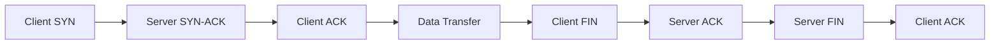
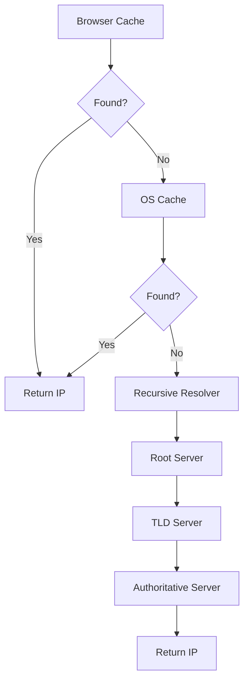

## Table of Contents
- [Introduction](#introduction)
- [Learning Roadmap](#learning-roadmap)
- [Theory Notes](#theory-notes)
- [Key Concepts](#key-concepts)
- [FAQ (35+ Q&A)](#faq-35-qa)
- [Hands-on Practice](#hands-on-practice)
- [FAANG Questions](#faang-questions)
- [Common Mistakes](#common-mistakes)
- [Best Practices](#best-practices)
- [Cheat Sheet](#cheat-sheet)
- [Flash Cards (30)](#flash-cards-30)
- [Mind Map](#mind-map)
- [Mermaid Diagrams](#mermaid-diagrams)
- [Code Examples](#code-examples)
- [Projects](#projects)
- [Resources](#resources)
- [Checklist](#checklist)
- [Revision Plans](#revision-plans)
- [Mock Interviews](#mock-interviews)
- [Difficulty Rating](#difficulty-rating)
- [Summary](#summary)

---

## Introduction

Networking is the foundation of modern IT infrastructure, enabling communication between devices, systems, and services across the globe. Understanding networking is essential for system administrators, cloud engineers, DevOps, and cybersecurity professionals.

Networking covers the OSI model, TCP/IP protocols, routing, switching, DNS, DHCP, and security concepts. Strong networking knowledge enables effective troubleshooting, secure infrastructure design, and reliable system deployment.

Every application, service, and cloud deployment relies on networking fundamentals. From understanding how packets flow across the internet to designing secure, scalable network architectures, networking knowledge is indispensable for technical professionals.

---

## Learning Roadmap

### Phase 1: Fundamentals (Week 1-2)
- OSI model and TCP/IP stack
- IP addressing and subnetting
- Ethernet and switching basics
- Network topologies

### Phase 2: Core Protocols (Week 3-4)
- TCP vs UDP
- DNS
- DHCP
- HTTP/HTTPS
- ARP, ICMP

### Phase 3: Routing and Switching (Week 5-6)
- Routing protocols (OSPF, BGP, RIP)
- VLANs and trunking
- NAT and PAT
- ACLs

### Phase 4: Security (Week 7-8)
- Firewalls
- VPN (IPsec, SSL)
- Network monitoring
- Wireless security

### Phase 5: Advanced (Week 9-12)
- SDN and network virtualization
- Load balancing
- Troubleshooting methodology
- Cloud networking
- Performance optimization

---

## Theory Notes

### OSI Model (7 Layers)
7. **Application**: HTTP, DNS, SMTP, FTP
6. **Presentation**: SSL/TLS, encryption, compression
5. **Session**: Session management, NetBIOS
4. **Transport**: TCP, UDP - port numbers
3. **Network**: IP, ICMP, routing
2. **Data Link**: Ethernet, MAC addresses, switches
1. **Physical**: Cables, hubs, signals

### TCP/IP Model (4 Layers)
4. **Application**: HTTP, DNS, SMTP
3. **Transport**: TCP, UDP
2. **Internet**: IP, ICMP, ARP
1. **Network Access**: Ethernet, Wi-Fi

### TCP vs UDP
**TCP**: Connection-oriented, reliable, ordered delivery, flow control, congestion control. Use for: HTTP, FTP, email, SSH.

**UDP**: Connectionless, unreliable, faster, no overhead. Use for: DNS, streaming, gaming, VoIP.

### TCP Three-Way Handshake
1. **SYN**: Client sends synchronize request
2. **SYN-ACK**: Server acknowledges and synchronizes
3. **ACK**: Client acknowledges connection established

### TCP Four-Way Termination
1. **FIN**: Initiator sends finish
2. **ACK**: Receiver acknowledges
3. **FIN**: Receiver sends finish
4. **ACK**: Initiator acknowledges, connection closed

### IP Addressing
- **IPv4**: 32-bit (4 octets, e.g., 192.168.1.1)
- **IPv6**: 128-bit (longer addresses for more devices)
- **Subnet mask**: Determines network vs host portion
- **CIDR notation**: /24 = 255.255.255.0

### Subnetting
Dividing networks into smaller segments:
- /24 = 254 hosts (255.255.255.0)
- /25 = 126 hosts
- /26 = 62 hosts
- /27 = 30 hosts
- /28 = 14 hosts
- /30 = 2 hosts (point-to-point links)

### DNS (Domain Name System)
Translates domain names to IP addresses:
1. Browser checks local cache
2. OS checks hosts file and cache
3. Query sent to recursive resolver
4. Resolver queries root, TLD, authoritative servers
5. IP address returned and cached

### Routing Protocols
- **RIP**: Distance vector, max 15 hops
- **OSPF**: Link-state, fast convergence, used in enterprises
- **BGP**: Path vector, internet backbone routing
- **EIGRP**: Cisco proprietary, hybrid

### NAT (Network Address Translation)
Maps private IP addresses to public:
- **Static NAT**: One-to-one mapping
- **Dynamic NAT**: Pool of public IPs
- **PAT (Port Address Translation)**: Multiple private to one public using ports

### Firewalls
- **Packet filtering**: Based on headers (IP, port)
- **Stateful inspection**: Tracks connection state
- **Application layer**: Deep packet inspection
- **Next-gen (NGFW)**: IPS, application awareness, threat intelligence

### TCP Congestion Control
Algorithms managing network congestion:
- **Slow Start**: Exponential window growth
- **Congestion Avoidance**: Linear growth after threshold
- **Fast Retransmit**: Retransmit after 3 duplicate ACKs
- **Fast Recovery**: Avoid slow start after fast retransmit

---

## Key Concepts

| Concept | Description |
|---------|-------------|
| OSI Model | 7-layer networking reference model |
| TCP | Connection-oriented, reliable transport |
| UDP | Connectionless, fast transport |
| DNS | Domain name to IP address translation |
| DHCP | Dynamic IP address assignment |
| NAT | Private to public IP translation |
| VLAN | Virtual LAN for network segmentation |
| Subnetting | Dividing networks into smaller segments |
| BGP | Internet backbone routing protocol |
| Load Balancing | Distributing traffic across servers |
| ARP | Maps IP addresses to MAC addresses |
| ICMP | Diagnostics and error reporting |
| TLS/SSL | Encrypted communication protocols |
| SDN | Software-Defined Networking |

---

## FAQ (35+ Q&A)

### Q1: What is the difference between TCP and UDP?
**A:** TCP is connection-oriented with reliable, ordered delivery. UDP is connectionless, faster, without guarantees. Use TCP for HTTP, email; UDP for DNS, streaming, gaming.

### Q2: What happens when you type a URL in a browser?
**A:** DNS resolution, TCP handshake, TLS handshake (HTTPS), HTTP request/response, browser renders page. Involves DNS, TCP, TLS, HTTP protocols across multiple layers.

### Q3: What is subnetting?
**A:** Dividing a network into smaller sub-networks. Uses subnet mask to separate network and host portions of IP addresses. Improves security, performance, and organization.

### Q4: What is DNS and how does it work?
**A:** Translates domain names to IP addresses. Recursive process: local cache, recursive resolver, root servers, TLD servers, authoritative servers. Results are cached at each level.

### Q5: What is the OSI model?
**A:** 7-layer reference model: Physical, Data Link, Network, Transport, Session, Presentation, Application. Each layer has specific functions and communicates with adjacent layers.

### Q6: What is DHCP?
**A:** Dynamic Host Configuration Protocol automatically assigns IP addresses and network configuration to devices. Process: Discover, Offer, Request, Acknowledge (DORA).

### Q7: What is NAT?
**A:** Network Address Translation maps private IP addresses to public. Conserves IPv4 addresses and adds security. PAT (Port Address Translation) maps multiple private IPs to one public IP using ports.

### Q8: What is the difference between a hub, switch, and router?
**A:** Hub: broadcasts to all ports (Layer 1). Switch: forwards to specific MAC address (Layer 2). Router: forwards between networks using IP addresses (Layer 3).

### Q9: What is a VLAN?
**A:** Virtual LAN segments a physical network into logical broadcast domains. Improves security, reduces broadcast traffic, and enables flexible network design without physical rewiring.

### Q10: What is a load balancer?
**A:** Distributes incoming traffic across multiple servers. Improves availability, scalability, and reliability. Algorithms: round-robin, least connections, IP hash. Can be hardware or software.

### Q11: What is the difference between static and dynamic routing?
**A:** Static: manually configured routes. Simple, predictable, does not adapt. Dynamic: routes learned via protocols (OSPF, BGP). Adapts to changes, scales better, more complex.

### Q12: What is ARP?
**A:** Address Resolution Protocol maps IP addresses to MAC addresses. When a device needs to communicate, it broadcasts ARP request, and the device with matching IP responds with its MAC.

### Q13: What is a firewall?
**A:** Network security device monitoring traffic based on rules. Can filter by IP, port, protocol, application. Types: packet filtering, stateful, application-layer, next-gen.

### Q14: What is SSL/TLS?
**A:** Protocols for encrypted communication. TLS (successor to SSL) provides encryption, authentication, and integrity. Uses certificate-based authentication and symmetric encryption for data.

### Q15: What is BGP?
**A:** Border Gateway Protocol routes traffic between autonomous systems on the internet. Path-vector protocol making routing decisions based on policies. The routing protocol of the internet.

### Q16: What is ICMP?
**A:** Internet Control Message Protocol used for diagnostics and error reporting. Tools: ping (connectivity), traceroute (path). Not used for data transfer.

### Q17: What is the difference between unicast, broadcast, and multicast?
**A:** Unicast: one-to-one. Broadcast: one-to-all in subnet. Multicast: one-to-many (interested receivers). Anycast: one-to-nearest.

### Q18: What is port scanning?
**A:** Technique to discover open ports on a target. Tools: Nmap. Identifies running services and potential vulnerabilities. Authorized scanning is part of security auditing.

### Q19: What is a VPN?
**A:** Virtual Private Network creates encrypted tunnel over public network. Provides secure remote access and privacy. Types: site-to-site, remote access. Protocols: IPsec, WireGuard, OpenVPN.

### Q20: What is the difference between HTTP and HTTPS?
**A:** HTTP is unencrypted. HTTPS adds TLS encryption. HTTPS provides confidentiality, integrity, and authentication. Uses port 443 vs port 80. Required for secure web communication.

### Q21: What is the difference between IPv4 and IPv6?
**A:** IPv4: 32-bit addresses (4.3 billion). IPv6: 128-bit addresses (virtually unlimited). IPv6 has simpler headers, built-in security (IPsec), no NAT needed.

### Q22: What is a MAC address?
**A:** Media Access Control address. Unique 48-bit identifier burned into network interface hardware. Used at Layer 2 for local network communication. Format: AA:BB:CC:DD:EE:FF.

### Q23: What is the difference between a broadcast domain and collision domain?
**A:** Broadcast domain: all devices receiving broadcast traffic. Collision domain: devices where collisions can occur. Switches break collision domains; routers break broadcast domains.

### Q24: What is STP?
**A:** Spanning Tree Protocol prevents Layer 2 loops in networks with redundant links. Elects root bridge and blocks redundant paths. Converges when topology changes.

### Q25: What is a proxy server?
**A:** Intermediary between clients and internet. Can cache content, filter traffic, anonymize requests, and log activity. Types: forward proxy, reverse proxy.

### Q26: What is the difference between a reverse proxy and forward proxy?
**A:** Forward proxy: clients use to reach internet (anonymity, filtering). Reverse proxy: servers use to handle client requests (load balancing, SSL termination, caching).

### Q27: What is QoS?
**A:** Quality of Service. Mechanisms prioritizing certain network traffic. Ensures critical applications (VoIP, video) get adequate bandwidth. Methods: traffic shaping, prioritization, policing.

### Q28: What is MTU?
**A:** Maximum Transmission Unit. Largest packet size that can be transmitted. Ethernet default: 1500 bytes. Jumbo frames: 9000 bytes. Fragmentation occurs when packets exceed MTU.

### Q29: What is a DNS record type?
**A:** A: maps domain to IPv4. AAAA: maps to IPv6. CNAME: alias to another domain. MX: mail server. NS: name server. TXT: text records. SOA: zone authority.

### Q30: What is an autonomous system?
**A:** Collection of networks under single administrative control on the internet. Has unique ASN (Autonomous System Number). Uses BGP to exchange routing with other ASes.

### Q31: What is packet sniffing?
**A:** Capturing and analyzing network traffic. Tools: Wireshark, tcpdump. Used for troubleshooting and security analysis. Must be done carefully due to privacy concerns.

### Q32: What is the difference between latency, bandwidth, and throughput?
**A:** Latency: time for data to travel (delay). Bandwidth: maximum data capacity. Throughput: actual data transferred per second. Throughput is limited by latency, bandwidth, and congestion.

### Q33: What is a CDN?
**A:** Content Delivery Network. Distributed servers caching content close to users. Reduces latency, improves performance, handles DDoS. Examples: Cloudflare, Akamai, AWS CloudFront.

### Q34: What is SDN?
**A:** Software-Defined Networking. Separates control plane from data plane. Centralized controller manages network programmatically. Enables automation, flexibility, and dynamic configuration.

### Q35: What is network redundancy?
**A:** Duplicating network components for fault tolerance. Multiple links, devices, paths. Ensures connectivity even if components fail. HSRP, VRRP for gateway redundancy.

---

## FAANG Questions

1. **Google**: Design a global network architecture supporting 1 billion users. How do you handle routing and DNS?
2. **Amazon**: How would you design a highly available load balancing system?
3. **Cloudflare**: Explain how DDoS mitigation works at network level.
4. **Meta**: Design a network architecture for a data center with 100K servers.
5. **Google**: How would you troubleshoot a latency issue affecting 10% of users?
6. **Amazon**: Design a hybrid cloud networking architecture connecting on-premises to AWS.
7. **Microsoft**: How would you implement zero trust networking for enterprise?
8. **Google**: Design DNS infrastructure handling millions of queries per second.
9. **Cloudflare**: How does CDN caching improve performance and reduce costs?
10. **Meta**: Design a network monitoring system for detecting anomalies in real-time.

---

## Common Mistakes

1. Not understanding subnetting
2. Confusing TCP and UDP use cases
3. Ignoring DNS as a critical component
4. Not implementing proper network segmentation
5. Skipping basic troubleshooting steps
6. Not monitoring network performance
7. Ignoring security in network design
8. Not planning for redundancy
9. Confusing Layer 2 and Layer 3 concepts
10. Not documenting network architecture
11. Ignoring IPv6 readiness
12. Not implementing proper DNS failover
13. Overlooking MTU issues in VPN tunnels
14. Not monitoring bandwidth utilization
15. Ignoring wireless network security

---

## Best Practices

1. Document network architecture thoroughly
2. Implement defense in depth
3. Use network segmentation for security
4. Monitor network performance continuously
5. Plan for redundancy and failover
6. Regular security audits and penetration testing
7. Implement proper logging and alerting
8. Use configuration management for network devices
9. Keep firmware and software updated
10. Follow industry standards and best practices
11. Implement proper DNS architecture
12. Use monitoring tools (SNMP, NetFlow)
13. Plan capacity for growth
14. Test failover procedures regularly
15. Implement network access control

---

## Cheat Sheet

### Common Ports
| Port | Protocol | Service |
|------|----------|---------|
| 20/21 | TCP | FTP |
| 22 | TCP | SSH |
| 23 | TCP | Telnet |
| 25 | TCP | SMTP |
| 53 | TCP/UDP | DNS |
| 67/68 | UDP | DHCP |
| 80 | TCP | HTTP |
| 110 | TCP | POP3 |
| 143 | TCP | IMAP |
| 443 | TCP | HTTPS |
| 993/995 | TCP | IMAPS/POP3S |
| 3389 | TCP | RDP |

### Subnet Quick Reference
| CIDR | Mask | Hosts |
|------|------|-------|
| /24 | 255.255.255.0 | 254 |
| /25 | 255.255.255.128 | 126 |
| /26 | 255.255.255.192 | 62 |
| /27 | 255.255.255.224 | 30 |
| /28 | 255.255.255.240 | 14 |
| /30 | 255.255.255.252 | 2 |

### OSI Layer Reference
| Layer | Name | Protocols | Devices |
|-------|------|-----------|---------|
| 7 | Application | HTTP, DNS, SMTP | - |
| 6 | Presentation | SSL/TLS | - |
| 5 | Session | NetBIOS | - |
| 4 | Transport | TCP, UDP | - |
| 3 | Network | IP, ICMP | Router |
| 2 | Data Link | Ethernet | Switch |
| 1 | Physical | - | Hub, Cable |

---

## Flash Cards (30)

**Card 1:** Q: TCP vs UDP? A: TCP = reliable, connection-oriented; UDP = fast, connectionless.

**Card 2:** Q: OSI model layers? A: Physical, Data Link, Network, Transport, Session, Presentation, Application.

**Card 3:** Q: What is DNS? A: Translates domain names to IP addresses.

**Card 4:** Q: Three-way handshake? A: SYN, SYN-ACK, ACK - TCP connection establishment.

**Card 5:** Q: What is subnetting? A: Dividing networks into smaller segments using subnet masks.

**Card 6:** Q: What is NAT? A: Translates private IP addresses to public for internet access.

**Card 7:** Q: DHCP process? A: Discover, Offer, Request, Acknowledge (DORA).

**Card 8:** Q: Hub vs switch vs router? A: Hub=L1 broadcast, Switch=L2 MAC, Router=L3 IP.

**Card 9:** Q: What is a VLAN? A: Virtual LAN segmenting broadcast domains logically.

**Card 10:** Q: What is ARP? A: Maps IP addresses to MAC addresses.

**Card 11:** Q: What is a load balancer? A: Distributes traffic across multiple servers.

**Card 12:** Q: OSPF vs BGP? A: OSPF=enterprise interior routing; BGP=internet backbone routing.

**Card 13:** Q: What is ICMP? A: Protocol for diagnostics (ping, traceroute).

**Card 14:** Q: HTTP vs HTTPS? A: HTTPS adds TLS encryption to HTTP.

**Card 15:** Q: What is a firewall? A: Device filtering traffic based on security rules.

**Card 16:** Q: What is VPN? A: Encrypted tunnel over public network for secure access.

**Card 17:** Q: Unicast vs broadcast vs multicast? A: One-to-one, one-to-all, one-to-many.

**Card 18:** Q: What is port scanning? A: Discovering open ports on target systems.

**Card 19:** Q: What is SSL/TLS? A: Protocols for encrypted, authenticated communication.

**Card 20:** Q: What is SDN? A: Software-Defined Networking centralizing network control.

**Card 21:** Q: IPv4 vs IPv6? A: IPv4 = 32-bit; IPv6 = 128-bit addresses.

**Card 22:** Q: What is a MAC address? A: Unique 48-bit hardware identifier for Layer 2.

**Card 23:** Q: What is STP? A: Spanning Tree Protocol preventing Layer 2 loops.

**Card 24:** Q: What is a proxy? A: Intermediary between clients and internet.

**Card 25:** Q: Reverse vs forward proxy? A: Forward = client-side; Reverse = server-side.

**Card 26:** Q: What is QoS? A: Quality of Service prioritizing critical network traffic.

**Card 27:** Q: What is MTU? A: Maximum Transmission Unit - largest packet size.

**Card 28:** Q: What is a CDN? A: Content Delivery Network caching content near users.

**Card 29:** Q: DNS record types? A: A, AAAA, CNAME, MX, NS, TXT, SOA.

**Card 30:** Q: Latency vs bandwidth vs throughput? A: Delay, capacity, actual transfer rate.

---

## Mind Map

```
Networking
├── Models
│   ├── OSI (7 layers)
│   └── TCP/IP (4 layers)
├── Protocols
│   ├── TCP / UDP
│   ├── IP (v4/v6)
│   ├── DNS / DHCP
│   ├── HTTP / HTTPS
│   └── ARP / ICMP
├── Infrastructure
│   ├── Routers
│   ├── Switches
│   ├── Firewalls
│   └── Load Balancers
├── Routing
│   ├── Static
│   ├── OSPF / BGP / RIP
│   └── NAT
├── Security
│   ├── VPN
│   ├── Firewalls
│   └── IDS/IPS
└── Advanced
    ├── SDN
    ├── Cloud Networking
    └── Troubleshooting
```

---

## Mermaid Diagrams

### TCP Connection Lifecycle


### DNS Resolution Flow


---

## Code Examples

### Network Scanner (Python)
```python
import subprocess
import platform
from ipaddress import ip_network

def ping_host(ip):
    param = "-n" if platform.system().lower() == "windows" else "-c"
    result = subprocess.run(
        ["ping", param, "1", str(ip)],
        capture_output=True, text=True, timeout=2
    )
    return result.returncode == 0

network = ip_network("192.168.1.0/24")
active_hosts = []
for ip in network.hosts():
    if ping_host(ip):
        active_hosts.append(str(ip))
        print(f"Active: {ip}")
```

### Port Scanner
```python
import socket
from concurrent.futures import ThreadPoolExecutor

def scan(host, port):
    try:
        s = socket.socket(socket.AF_INET, socket.SOCK_STREAM)
        s.settimeout(1)
        s.connect((host, port))
        s.close()
        return port
    except:
        return None

with ThreadPoolExecutor(max_workers=100) as pool:
    results = pool.map(lambda p: scan("192.168.1.1", p), range(1, 1025))
    open_ports = [r for r in results if r]
    print(f"Open: {open_ports}")
```

---

## Projects

1. **Network Lab**: Set up virtual network with routers, switches, VLANs
2. **DNS Server**: Configure and manage DNS server
3. **Firewall Rules**: Implement firewall rules for security
4. **Network Monitor**: Set up SNMP monitoring and alerting
5. **VPN Setup**: Configure site-to-site VPN
6. **Packet Analysis**: Use Wireshark to analyze traffic patterns
7. **Load Balancer**: Configure HAProxy or nginx load balancing
8. **Network Automation**: Script network device configurations

---

## Resources

- **Certifications**: CCNA, CompTIA Network+, CCNP, JNCIA
- **Courses**: Cisco Networking Academy, Coursera Networking, CBT Nuggets
- **Books**: "TCP/IP Illustrated" (Stevens), "Computer Networking" (Kurose), "Network Warrior" (Donahue)
- **Tools**: Wireshark, Nmap, GNS3, Packet Tracer, iperf, traceroute
- **YouTube**: Practical Networking, NetworkChuck, PowerCert Animated Videos
- **Community**: r/networking, r/ccna, Packet Pushers
- **Practice**: GNS3, EVE-NG, Cisco Packet Tracer, Boson NetSim
- **RFCs**: RFC 793 (TCP), RFC 768 (UDP), RFC 1035 (DNS)

---

## Network Troubleshooting Methodology

### Systematic Approach
1. **Identify the problem**: Gather information, symptoms, scope
2. **Establish theory**: Determine probable cause
3. **Test theory**: Verify the theory or establish new one
4. **Establish plan**: Create action plan for resolution
5. **Implement solution**: Execute the plan
6. **Verify**: Confirm full system functionality
7. **Document**: Record findings, actions, and outcomes

### Common Troubleshooting Commands
| Command | Purpose | Example |
|---------|---------|---------|
| ping | Test connectivity | `ping 8.8.8.8` |
| traceroute | Trace packet path | `traceroute google.com` |
| nslookup | DNS resolution | `nslookup example.com` |
| netstat | Network statistics | `netstat -tuln` |
| ipconfig/ifconfig | IP configuration | `ipconfig /all` |
| arp | ARP table | `arp -a` |
| tracert | Windows trace route | `tracert google.com` |
| pathping | Combined ping/tracert | `pathping google.com` |

---

## Checklist

- [ ] OSI and TCP/IP models
- [ ] TCP and UDP
- [ ] IP addressing and subnetting
- [ ] DNS and DHCP
- [ ] Routing protocols
- [ ] VLANs and switching
- [ ] NAT and firewalls
- [ ] VPN and encryption
- [ ] Network troubleshooting
- [ ] Security concepts
- [ ] Load balancing
- [ ] Cloud networking basics
- [ ] Network monitoring
- [ ] SDN awareness
- [ ] IPv6 basics

---

## Revision Plans

### Week 1-2: Fundamentals
- OSI model and TCP/IP
- IP addressing and subnetting
- Practice subnetting exercises

### Week 3-4: Protocols
- TCP/UDP deep dive
- DNS, DHCP, HTTP
- Packet analysis with Wireshark

### Week 5-6: Infrastructure
- Routing and switching
- VLANs, NAT, ACLs
- Load balancing

### Week 7-8: Security
- Firewalls, VPN, IDS/IPS
- Network security design
- Wireless security

### Final Week: Advanced
- Cloud networking
- SDN concepts
- Troubleshooting scenarios

---

## Mock Interviews

### Round 1: Fundamentals
1. Explain the OSI model and what happens at each layer
2. What happens when you type a URL in a browser?
3. Calculate the subnet mask for 50 hosts

### Round 2: Protocols
1. Compare TCP and UDP with use cases
2. Explain the DNS resolution process
3. What is the TCP three-way handshake?

### Round 3: Design
1. Design a network for a 500-person office
2. How would you troubleshoot intermittent connectivity issues?
3. Design a hybrid cloud network architecture

---

## Difficulty Rating

| Topic | Difficulty | Frequency |
|-------|-----------|-----------|
| OSI Model | Easy | Very High |
| TCP/UDP | Medium | Very High |
| Subnetting | Medium | High |
| DNS | Medium | Very High |
| Routing | Medium-High | Medium |
| VLANs | Medium | Medium |
| Security | Medium | High |
| Cloud Networking | Medium-High | Growing |
| SDN | Hard | Medium |
| Troubleshooting | Medium | High |

---

## Summary

Networking interviews test protocol knowledge, troubleshooting skills, and security awareness. Master the OSI model, TCP/IP, DNS, routing, and security fundamentals. Practice subnetting, packet analysis, and network troubleshooting. Strong networking knowledge is essential for infrastructure, cloud, and security roles. Understanding both traditional and modern networking concepts demonstrates comprehensive expertise.

---

## Key Takeaways

1. Master the OSI and TCP/IP models thoroughly
2. Understand TCP vs UDP and when to use each
3. Be proficient with IP addressing and subnetting
4. Know DNS resolution process end-to-end
5. Understand routing protocols and their use cases
6. Practice network troubleshooting with real tools
7. Learn network security fundamentals (firewalls, VPN, IDS/IPS)
8. Be aware of cloud networking and SDN concepts
9. Practice packet analysis with Wireshark
10. Build hands-on experience with network lab environments
