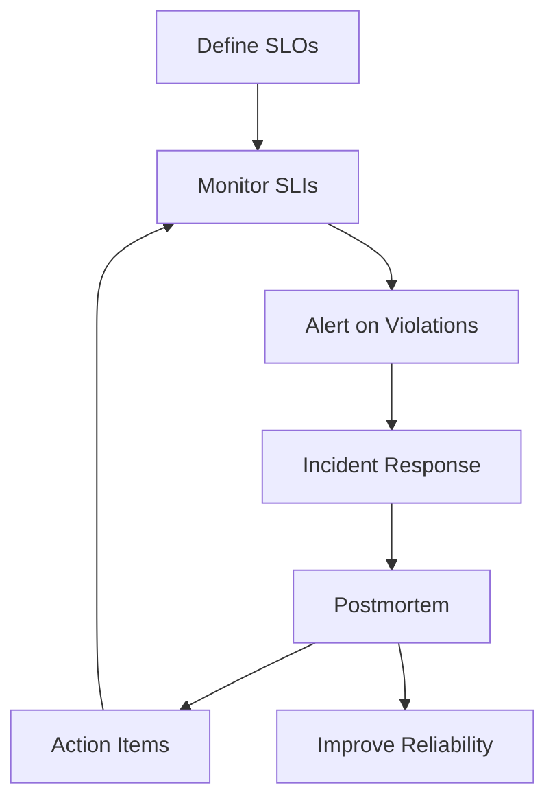
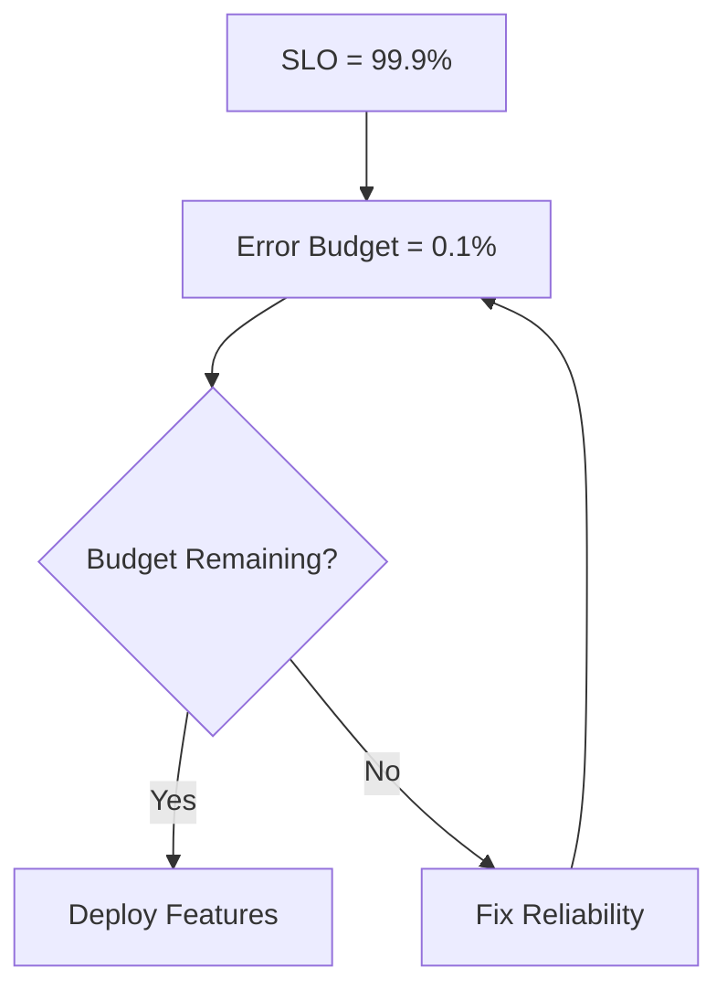
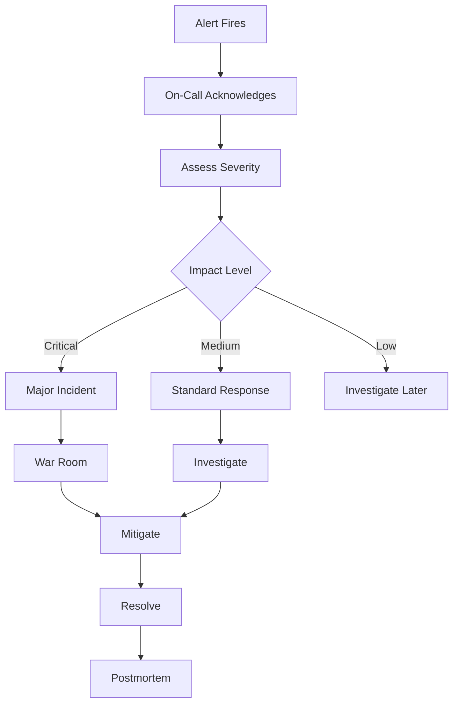

## Table of Contents
- [Introduction](#introduction)
- [Learning Roadmap](#learning-roadmap)
- [Theory Notes](#theory-notes)
- [Key Concepts](#key-concepts)
- [FAQ (35+ Q&A)](#faq-35-qa)
- [Hands-on Practice](#hands-on-practice)
- [FAANG Questions](#faang-questions)
- [Common Mistakes](#common-mistakes)
- [Best Practices](#best-practices)
- [Cheat Sheet](#cheat-sheet)
- [Flash Cards (30)](#flash-cards-30)
- [Mind Map](#mind-map)
- [Mermaid Diagrams](#mermaid-diagrams)
- [Code Examples](#code-examples)
- [Projects](#projects)
- [Resources](#resources)
- [Checklist](#checklist)
- [Revision Plans](#revision-plans)
- [Mock Interviews](#mock-interviews)
- [Difficulty Rating](#difficulty-rating)
- [Summary](#summary)

---

## Introduction

Site Reliability Engineering (SRE) is a software engineering approach to IT operations. Created at Google, SRE applies software engineering practices to operations problems: automation, monitoring, incident response, and capacity planning. SRE teams build and maintain large-scale production systems, balancing reliability with feature velocity.

SRE focuses on measuring and improving reliability through Service Level Objectives (SLOs), error budgets, and automation. It treats operations as a software problem, reducing toil through engineering solutions.

SRE is fundamentally about applying the discipline of software engineering to operations, creating systems that are reliable, scalable, and efficient. The goal is to remove manual work, automate everything possible, and make data-driven decisions about reliability trade-offs.

---

## Learning Roadmap

### Phase 1: SRE Fundamentals (Week 1-2)
- SRE principles and philosophy
- SLAs, SLOs, SLIs
- Error budgets
- Toil reduction

### Phase 2: Monitoring and Observability (Week 3-4)
- Metrics, logs, traces
- Alerting design
- Dashboards
- Prometheus, Grafana, ELK

### Phase 3: Incident Management (Week 5-6)
- On-call practices
- Incident response process
- Postmortems
- Communication during incidents

### Phase 4: Reliability Engineering (Week 7-8)
- Capacity planning
- Load balancing
- Redundancy and failover
- Chaos engineering

### Phase 5: Advanced (Week 9-12)
- Automation and toil reduction
- Release engineering
- Change management
- Cost optimization
- SRE team building

---

## Theory Notes

### SLAs, SLOs, SLIs
- **SLI (Service Level Indicator)**: Quantitative metric (latency, error rate, throughput)
- **SLO (Service Level Objective)**: Target value for SLI (99.9% availability)
- **SLA (Service Level Agreement)**: Contractual commitment with consequences for missing targets

Example: SLI = request latency, SLO = 99% of requests < 200ms, SLA = 99.9% availability with credits for violations.

### Error Budget
Remaining acceptable unreliability based on SLO:
- If SLO is 99.9%, error budget = 0.1% (43 minutes/month)
- When budget is spent, slow down feature releases
- Balances reliability with velocity

### Toil
Manual, repetitive, automatable, reactive work that scales linearly with service growth. SRE goal: reduce toil to less than 50% of time. Automate everything else.

### Monitoring and Observability
- **Monitoring**: Collecting and alerting on known failure modes
- **Observability**: Understanding system state from external outputs
- **Three pillars**: Metrics (Prometheus), Logs (ELK), Traces (Jaeger)

### Alerting Best Practices
- Alert on symptoms, not causes
- Alerts should require human action
- Multiple severity levels
- Avoid alert fatigue
- Include runbooks

### Incident Response
1. **Detection**: Alert fires, on-call engineer acknowledges
2. **Triage**: Assess severity, identify impact
3. **Mitigate**: Stop the bleeding (rollback, scale, feature flag)
4. **Resolve**: Fix root cause
5. **Postmortem**: Blameless analysis, action items

### Postmortem
Blameless analysis of incidents:
- Timeline of events
- Root cause analysis
- What went well / what could improve
- Action items with owners and deadlines
- Learnings shared broadly

### Chaos Engineering
Deliberately injecting failures to test resilience:
- Game days
- Chaos Monkey (random instance termination)
- Network partitions
- Latency injection
- Chaos engineering builds confidence in system reliability

### Capacity Planning
Ensuring systems can handle expected load:
- Forecast demand
- Model resource usage
- Plan for growth
- Cost optimization
- Auto-scaling strategies

### Deployment Strategies
- **Blue-Green**: Two identical environments, swap traffic
- **Canary**: Gradual rollout to small percentage first
- **Rolling**: Update instances incrementally
- **Feature Flags**: Toggle features without deployment

---

## Key Concepts

| Concept | Description |
|---------|-------------|
| SLI | Service Level Indicator - quantitative metric |
| SLO | Service Level Objective - target for SLI |
| SLA | Service Level Agreement - contractual commitment |
| Error Budget | Remaining acceptable unreliability |
| Toil | Manual, repetitive, automatable work |
| Postmortem | Blameless incident analysis |
| Chaos Engineering | Deliberately injecting failures |
| Observability | Understanding system state from outputs |
| Runbook | Step-by-step incident response guide |
| Toil Budget | Target keeping toil below 50% |
| MTTR | Mean Time To Repair |
| MTBF | Mean Time Between Failures |
| Canary Deployment | Gradual rollout to small traffic percentage |
| Feature Flag | Toggle features without deployment |

---

## FAQ (35+ Q&A)

### Q1: What is the difference between SLA, SLO, and SLI?
**A:** SLI is a metric (latency, error rate). SLO is the target for that metric (99.9%). SLA is the contractual promise with consequences. SLIs feed SLOs; SLOs define SLAs.

### Q2: What is an error budget?
**A:** The difference between 100% and your SLO. If SLO is 99.9%, error budget is 0.1% (43 min/month). When exhausted, halt features and focus on reliability.

### Q3: What is toil?
**A:** Manual, repetitive, automatable, reactive work that scales linearly. Examples: manual deployments, repetitive troubleshooting, ticket processing. SREs should automate this away.

### Q4: What is a postmortem?
**A:** Blameless analysis after an incident. Documents timeline, root cause, impact, what went well, what could improve, and action items. Purpose is learning, not blame.

### Q5: What is observability?
**A:** Understanding internal system state from external outputs. Built on three pillars: metrics (what happened), logs (details), traces (request flow). Enables debugging complex distributed systems.

### Q6: What is chaos engineering?
**A:** Deliberately injecting failures to test resilience before they happen naturally. Builds confidence in system's ability to handle real failures. Netflix's Chaos Monkey is a famous example.

### Q7: How do you design good alerts?
**A:** Alert on symptoms not causes. Each alert should require human action. Include severity levels and runbooks. Avoid alert fatigue by tuning thresholds. PagerDuty, OpsGenie for routing.

### Q8: What is the difference between monitoring and observability?
**A:** Monitoring watches known failure modes and alerts. Observability enables understanding any system state from outputs, including unknown failures. Monitoring tells you something is wrong; observability helps you understand why.

### Q9: What is capacity planning?
**A:** Ensuring systems handle expected load. Forecast demand, model resource usage, plan for growth, balance cost and reliability. Use auto-scaling for dynamic workloads.

### Q10: What is a runbook?
**A:** Step-by-step guide for handling specific incidents. Reduces MTTR by giving on-call engineers clear procedures. Should be kept updated and easily accessible.

### Q11: How do you balance reliability with feature velocity?
**A:** Error budgets. High reliability (99.99%) limits feature velocity. Lower SLOs (99.9%) allow more features. Error budget policy defines when to slow down features.

### Q12: What is the difference between SRE and DevOps?
**A:** DevOps is a cultural movement emphasizing collaboration. SRE is a specific implementation of DevOps with software engineering practices for operations. SRE is what happens when you treat ops as a software problem.

### Q13: What is MTTR and MTBF?
**A:** MTTR: Mean Time To Repair (recovery time). MTBF: Mean Time Between Failures (reliability). Both important metrics for measuring system reliability and operational efficiency.

### Q14: What is auto-scaling?
**A:** Automatically adjusting resources based on demand. Horizontal: add more instances. Vertical: increase instance size. Configure based on metrics (CPU, memory, request count).

### Q15: What is redundancy?
**A:** Duplicating critical components so failure of one does not cause system failure. Types: active-active, active-passive. N+1 means one extra component beyond what is needed.

### Q16: What is a SLA violation?
**A:** Failing to meet the contracted availability/performance targets. May trigger penalties, credits, or legal consequences. SRE teams work to prevent SLA violations through SLO management.

### Q17: How do you measure SLOs?
**A:** Define clear SLIs (request latency, error rate, throughput). Collect metrics continuously. Calculate compliance against SLO over rolling window. Track error budget consumption.

### Q18: What is release engineering?
**A:** Practices for safe, efficient software releases: canary deployments, feature flags, rollbacks, blue-green deployments. SRE ensures releases do not compromise reliability.

### Q19: What is a blameless postmortem?
**A:** Analysis focusing on systemic improvements rather than individual blame. Everyone acts with best intentions given available information. Focus on what and how to prevent, not who to blame.

### Q20: What is latency vs throughput?
**A:** Latency: time to complete a request. Throughput: number of requests per second. They often trade off. Optimizing for one may affect the other. Both are critical performance metrics.

### Q21: What is a circuit breaker?
**A:** Pattern preventing cascading failures. When a downstream service fails, circuit opens and requests fail fast instead of waiting. Prevents resource exhaustion and gives failing service time to recover.

### Q22: What is graceful degradation?
**A:** System continues operating at reduced functionality when components fail. Non-critical features may be disabled. Prioritizes core functionality. Example: disable recommendations if ML service is down.

### Q23: What is a service mesh?
**A:** Infrastructure layer handling service-to-service communication. Provides load balancing, observability, security, and resilience. Examples: Istio, Linkerd. Simplifies microservices networking.

### Q24: What is the difference between horizontal and vertical scaling?
**A:** Horizontal: adding more machines. Vertical: making existing machines larger. Horizontal scales better and provides redundancy. Vertical is simpler but has limits.

### Q25: What is a SLI error budget policy?
**A:** Documented rules for what happens when error budget is consumed. Example: 0% remaining = freeze all non-critical releases, all hands on reliability. Prevents ad-hoc decisions.

### Q26: What is a golden signal?
**A:** Four key metrics Google recommends monitoring: latency, traffic, errors, saturation. Provides comprehensive view of service health. Good starting point for monitoring design.

### Q27: What is the difference between latency and response time?
**A:** Latency is network time (round trip). Response time includes server processing. Response time = latency + processing time. Both matter but for different reasons.

### Q28: What is a distributed system challenge?
**A:** Issues unique to distributed systems: network partitions, partial failures, clock skew, split-brain, eventual consistency. CAP theorem defines trade-offs between consistency, availability, partition tolerance.

### Q29: What is feature flag management?
**A:** System for toggling features without deployment. Enables gradual rollouts, A/B testing, and instant rollbacks. Reduces risk of releases. Tools: LaunchDarkly, Unleash.

### Q30: What is a SLI specification?
**A:** Detailed document defining how each SLI is measured: what metric, what threshold, what timeframe, what data source. Ensures consistent measurement across teams.

### Q31: What is the difference between a drill and a game day?
**A:** Drill: practicing specific incident response procedure. Game day: full chaos engineering exercise simulating realistic failures. Drills are focused; game days are comprehensive.

### Q32: What is multi-region redundancy?
**A:** Deploying across multiple geographic regions. Provides disaster recovery and reduces latency for global users. Requires data replication, traffic routing, and failover automation.

### Q33: What is a blameless culture?
**A:** Organizational culture where mistakes are learning opportunities, not punishment occasions. Encourages transparency, reporting, and systemic improvement. Foundation of effective postmortems.

### Q34: What is an SLO dashboard?
**A:** Visual display showing SLI performance against SLO targets, error budget consumption, and trends. Helps teams understand reliability status at a glance. Often shows burn rate.

### Q35: What is burn rate?
**A:** Rate at which error budget is being consumed. If burn rate is 2x, budget will be exhausted in half the time. High burn rate triggers alerts to slow down feature releases.

---

## FAANG Questions

1. **Google**: Design SLOs for a search engine. What SLIs would you use and what targets?
2. **Meta**: A production service is experiencing 5% error rate. Walk through your response.
3. **Amazon**: Design a monitoring system for a microservices architecture.
4. **Netflix**: How would you implement chaos engineering in a production environment?
5. **Google**: Design a postmortem process that drives real improvement.
6. **Microsoft**: How do you calculate and manage error budgets across hundreds of services?
7. **Amazon**: Build an auto-scaling system handling 10x traffic spikes.
8. **Google**: Design a capacity planning model for a growing service.
9. **Meta**: How would you reduce toil for an SRE team?
10. **Netflix**: Design a multi-region failover strategy with less than 1 minute recovery.

---

## Common Mistakes

1. Alerting on causes instead of symptoms
2. Alert fatigue from too many non-actionable alerts
3. Skipping postmortems after incidents
4. Blaming individuals instead of systemic analysis
5. Not tracking error budgets
6. Ignoring toil accumulation
7. Monitoring only infrastructure, not user experience
8. Not testing failover procedures
9. Over-engineering for edge cases
10. Not documenting runbooks
11. Setting SLOs too high (preventing feature development)
12. Not validating monitoring in production
13. Ignoring dependency failures
14. Not having on-call rotation policies
15. Forgetting to update runbooks after changes

---

## Best Practices

1. Define clear SLOs for every service
2. Track and manage error budgets
3. Invest in automation to reduce toil
4. Conduct blameless postmortems
5. Practice chaos engineering
6. Design alerts requiring human action
7. Maintain updated runbooks
8. Test failover and recovery regularly
9. Monitor user experience, not just infrastructure
10. Share learnings across teams
11. Balance reliability with feature velocity
12. Plan capacity proactively
13. Use golden signals for monitoring
14. Implement circuit breakers and graceful degradation
15. Document SLI measurement methodology

---

## Cheat Sheet

### SRE Formulas
| Metric | Formula |
|--------|---------|
| Availability | (Total Time - Downtime) / Total Time |
| Error Budget | 1 - SLO |
| MTBF | Total Uptime / Number of Failures |
| MTTR | Total Repair Time / Number of Repairs |
| Throughput | Requests / Time Period |

### SLO Targets Guide
| SLO | Downtime/Month | Downtime/Year |
|-----|---------------|---------------|
| 99% | 7.3 hours | 3.65 days |
| 99.9% | 43 min | 8.76 hours |
| 99.99% | 4.3 min | 52.6 min |
| 99.999% | 26 sec | 5.26 min |

### Monitoring Stack
| Tool | Purpose |
|------|---------|
| Prometheus | Metrics collection and alerting |
| Grafana | Dashboard visualization |
| ELK Stack | Log aggregation and search |
| Jaeger | Distributed tracing |
| PagerDuty | Incident routing |
| OpsGenie | Alert management |

### Golden Signals
| Signal | What It Measures |
|--------|-----------------|
| Latency | Time to serve requests |
| Traffic | Demand on system |
| Errors | Rate of failed requests |
| Saturation | Resource utilization |

---

## Flash Cards (30)

**Card 1:** Q: SLA vs SLO vs SLI? A: SLI = metric, SLO = target, SLA = contract.

**Card 2:** Q: What is error budget? A: Remaining acceptable unreliability based on SLO.

**Card 3:** Q: What is toil? A: Manual, repetitive, automatable work that scales linearly.

**Card 4:** Q: What is a postmortem? A: Blameless analysis of incidents for learning.

**Card 5:** Q: Monitoring vs observability? A: Monitoring watches known failures; observability understands any state.

**Card 6:** Q: What is chaos engineering? A: Deliberately injecting failures to test resilience.

**Card 7:** Q: MTTR meaning? A: Mean Time To Repair - average recovery time.

**Card 8:** Q: What is a runbook? A: Step-by-step guide for handling specific incidents.

**Card 9:** Q: What is auto-scaling? A: Automatically adjusting resources based on demand.

**Card 10:** Q: What is redundancy? A: Duplicating components so single failure does not cause outage.

**Card 11:** Q: Alert on symptoms or causes? A: Symptoms - what users experience, not internal details.

**Card 12:** Q: What is toil budget? A: Target keeping toil below 50% of engineering time.

**Card 13:** Q: SRE vs DevOps? A: SRE is a specific implementation of DevOps with SWE practices.

**Card 14:** Q: What is release engineering? A: Practices for safe, efficient software releases.

**Card 15:** Q: Latency vs throughput? A: Latency = request time; Throughput = requests per second.

**Card 16:** Q: What is a SLA violation? A: Failing contracted availability with consequences.

**Card 17:** Q: Blameless postmortem? A: Focus on systemic improvements, not individual blame.

**Card 18:** Q: What is canary deployment? A: Gradually rolling out to small traffic percentage.

**Card 19:** Q: What is feature flag? A: Toggle to enable/disable features without deployment.

**Card 20:** Q: 99.9% availability? A: ~43 minutes downtime per month allowed.

**Card 21:** Q: What is golden signals? A: Latency, Traffic, Errors, Saturation.

**Card 22:** Q: What is a circuit breaker? A: Pattern preventing cascading downstream failures.

**Card 23:** Q: Graceful degradation? A: System operates at reduced functionality when components fail.

**Card 24:** Q: Horizontal vs vertical scaling? A: Horizontal = add machines; Vertical = bigger machines.

**Card 25:** Q: What is burn rate? A: Rate of error budget consumption.

**Card 26:** Q: What is a service mesh? A: Infrastructure layer for service-to-service communication.

**Card 27:** Q: Blue-green vs canary? A: Blue-green = swap environments; Canary = gradual percentage rollout.

**Card 28:** Q: What is a game day? A: Comprehensive chaos engineering exercise simulating failures.

**Card 29:** Q: What is multi-region? A: Deploying across regions for disaster recovery and performance.

**Card 30:** Q: What is a blameless culture? A: Mistakes are learning opportunities, not punishment occasions.

---

## Mind Map

```
SRE
├── Fundamentals
│   ├── SLIs / SLOs / SLAs
│   ├── Error Budgets
│   └── Toil Reduction
├── Monitoring
│   ├── Metrics
│   ├── Logs
│   ├── Traces
│   └── Alerting
├── Incident Management
│   ├── On-Call
│   ├── Response Process
│   └── Postmortems
├── Reliability
│   ├── Capacity Planning
│   ├── Redundancy
│   ├── Chaos Engineering
│   └── Failover
└── Automation
    ├── Deployment
    ├── Scaling
    └── Recovery
```

---

## Mermaid Diagrams

### SRE Lifecycle


### Error Budget Flow


### Incident Response Process


---

## Code Examples

### Prometheus Alert Rule
```yaml
groups:
- name: sre-alerts
  rules:
  - alert: HighErrorRate
    expr: |
      sum(rate(http_requests_total{status=~"5.."}[5m]))
      / sum(rate(http_requests_total[5m])) > 0.01
    for: 5m
    labels:
      severity: critical
    annotations:
      summary: "High error rate detected"
      description: "Error rate is above 1% for 5 minutes"
      runbook_url: "https://wiki/runbooks/high-error-rate"

  - alert: HighLatency
    expr: |
      histogram_quantile(0.99, rate(http_request_duration_seconds_bucket[5m])) > 2
    for: 5m
    labels:
      severity: warning
    annotations:
      summary: "High p99 latency"
      description: "p99 latency is above 2 seconds"
```

### SLO Monitoring (Python)
```python
def calculate_slo_compliance(metric_data, slo_target, window_days=30):
    total_requests = metric_data['total']
    failed_requests = metric_data['failed']
    error_rate = failed_requests / total_requests
    availability = 1 - error_rate
    slo_compliance = availability >= slo_target
    error_budget_remaining = max(0, (slo_target - error_rate) / (1 - slo_target))
    return {
        'availability': availability,
        'slo_met': slo_compliance,
        'error_budget_pct': error_budget_remaining * 100,
        'error_rate': error_rate
    }
```

### Auto-Scaling Configuration
```python
# AWS Auto Scaling with custom metrics
scaling_config = {
    'min_size': 2,
    'max_size': 20,
    'cooldown': 300,
    'scaling_policies': [
        {
            'metric': 'CPUUtilization',
            'threshold': 70,
            'adjustment': 'AddCapacity',
            'step': 2
        },
        {
            'metric': 'RequestCount',
            'threshold': 1000,
            'adjustment': 'AddCapacity',
            'step': 1
        }
    ]
}
```

---

## Projects

1. **Monitoring Stack**: Set up Prometheus + Grafana for application monitoring
2. **Incident Response**: Create IR process with runbooks and on-call rotation
3. **Chaos Engineering**: Implement failure injection testing
4. **SLO Dashboard**: Build dashboard tracking SLIs and error budgets
5. **Auto-Scaling**: Configure auto-scaling based on custom metrics
6. **Alert Tuning**: Reduce alert noise and improve signal-to-noise ratio
7. **Capacity Planning**: Model resource usage for growth forecasting
8. **Toil Automation**: Identify and automate repetitive operational tasks

---

## Resources

- **Books**: "Site Reliability Engineering" (Google), "The Site Reliability Workbook", "Google SRE Workbook", "Monitoring Distributed Systems" (Google SRE Book)
- **Courses**: Google SRE courses, Coursera SRE, Linux Foundation SRE training
- **Tools**: Prometheus, Grafana, PagerDuty, OpsGenie, Terraform, Ansible, Kubernetes
- **Certifications**: Google Cloud Professional SRE, CKA (Certified Kubernetes Administrator)
- **YouTube**: Google Cloud, SREcon talks, InfoQ SRE presentations
- **Community**: SRE Weekly newsletter, r/sre, SREcon conference talks
- **Practice**: Set up home lab with monitoring, practice incident response scenarios
- **Frameworks**: Google SRE Book practices, ITIL for incident management

---

## Checklist

- [ ] SLIs, SLOs, SLAs understanding
- [ ] Error budget management
- [ ] Monitoring and observability
- [ ] Alerting best practices
- [ ] Incident response process
- [ ] Postmortem practice
- [ ] Toil identification and reduction
- [ ] Chaos engineering basics
- [ ] Capacity planning
- [ ] Automation mindset
- [ ] Deployment strategies
- [ ] Circuit breakers and graceful degradation
- [ ] Golden signals monitoring
- [ ] Runbook documentation
- [ ] Blameless culture promotion

---

## Revision Plans

### Week 1-2: Foundations
- SRE principles, SLIs/SLOs/SLAs
- Error budget calculations
- Toil identification

### Week 3-4: Monitoring
- Metrics, logs, traces
- Prometheus and Grafana
- Alerting design

### Week 5-6: Incidents
- Response process
- Postmortem writing
- Communication during incidents

### Week 7-8: Reliability
- Capacity planning
- Chaos engineering
- Deployment strategies

### Final Week: Integration
- Build monitoring dashboard
- Write runbooks
- Practice mock incidents

---

## Mock Interviews

### Round 1: SRE Concepts
1. Explain the difference between SLA, SLO, and SLI
2. How do you calculate and manage error budgets?
3. What is the difference between monitoring and observability?

### Round 2: Incident Response
1. A service is returning 50% errors. Walk through your response
2. How would you design a postmortem process?
3. What makes a good alert?

### Round 3: Design
1. Design an SLO framework for a microservices architecture
2. How would you implement chaos engineering safely?
3. Design an auto-scaling strategy for 10x traffic spikes

---

## Difficulty Rating

| Topic | Difficulty | Frequency |
|-------|-----------|-----------|
| SLAs/SLOs/SLIs | Medium | Very High |
| Monitoring | Medium | Very High |
| Alerting | Medium | High |
| Incident Response | Medium | High |
| Postmortems | Medium | High |
| Toil Reduction | Medium | Medium |
| Chaos Engineering | Hard | Growing |
| Capacity Planning | Medium-High | Medium |
| Auto-Scaling | Medium | High |
| Deployment Strategies | Medium | High |

---

## Summary

SRE interviews test reliability engineering principles, monitoring, incident management, and automation mindset. Master SLIs/SLOs/SLAs, understand error budgets, know incident response processes, and practice blameless postmortems. The SRE mindset of automate everything, measure everything, learn from everything is what distinguishes great SREs. Understanding both the technical and cultural aspects of SRE demonstrates comprehensive expertise.

---

## Key Takeaways

1. SLIs, SLOs, and SLAs are the foundation of SRE practice
2. Error budgets balance reliability with feature velocity
3. Toil should be identified, measured, and automated away
4. Monitoring and observability are critical for system health
5. Alerting should focus on symptoms requiring human action
6. Postmortems must be blameless and action-oriented
7. Chaos engineering builds confidence in system resilience
8. Capacity planning prevents outages from traffic growth
9. Deployment strategies (canary, blue-green) reduce release risk
10. The SRE mindset is about engineering solutions to operations problems
