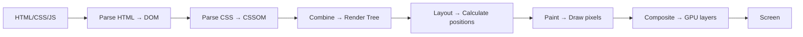
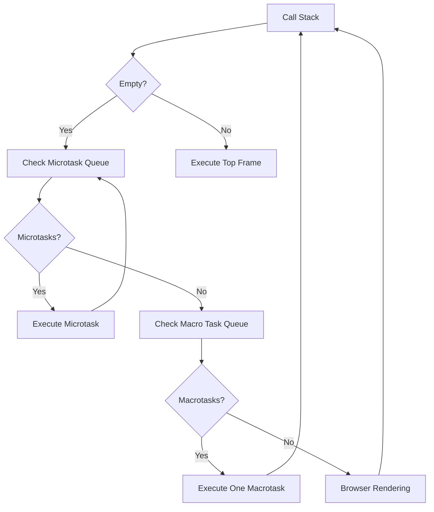
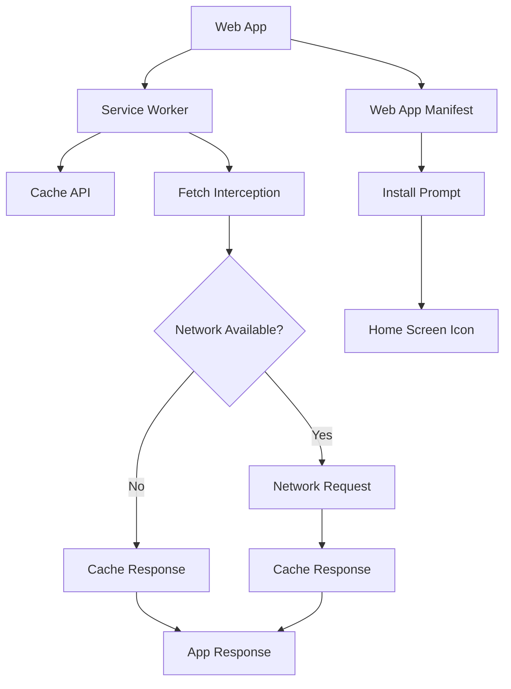
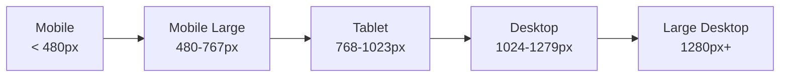

## Introduction

Web development encompasses the creation of websites and web applications that run in web browsers. It spans from simple static pages to complex single-page applications (SPAs) that rival native desktop software. Web development consists of three pillars: HTML (structure), CSS (styling), and JavaScript (behavior). Modern web development also includes progressive web apps (PWAs), web performance optimization, security, and responsive design.

Web developers must understand browser rendering pipelines, the DOM, event handling, HTTP protocols, accessibility standards, and the ever-evolving ecosystem of frameworks and tools. This guide covers HTML5, CSS3 (Flexbox, Grid), JavaScript fundamentals, responsive design, web APIs, security basics, PWAs, performance optimization, and common web development interview questions.

---

## Learning Roadmap

### Phase 1: Foundations (Weeks 1-4)
- HTML5 semantics, forms, and accessibility
- CSS3 basics: selectors, box model, positioning
- CSS Flexbox and Grid layouts
- JavaScript fundamentals: variables, types, functions, scope
- DOM manipulation and event handling
- Browser DevTools proficiency

### Phase 2: Intermediate (Weeks 5-8)
- JavaScript: async/await, Promises, closures, prototypes
- CSS responsive design (media queries, relative units)
- CSS animations and transitions
- Fetch API and AJAX
- JSON and data handling
- Web storage (localStorage, sessionStorage, IndexedDB)

### Phase 3: Advanced (Weeks 9-12)
- JavaScript: ES modules, proxies, generators, iterators
- Web APIs: Service Workers, Web Workers, WebSockets
- Progressive Web Apps (PWAs)
- Web performance optimization (Core Web Vitals)
- Web security (CORS, CSP, XSS, CSRF)
- Testing (Jest, Cypress, Playwright)

### Phase 4: Professional (Weeks 13-16)
- Framework fundamentals (React, Vue, or Angular)
- Build tools (Vite, webpack, esbuild)
- Package managers (npm, yarn, pnpm)
- Version control with Git
- CI/CD basics
- Deployment and hosting

---

## Theory Notes

### HTML5

#### Semantic Elements
Semantic HTML provides meaning to the content, improving accessibility, SEO, and code readability:
- `<header>`: Introductory content or navigation
- `<nav>`: Navigation links
- `<main>`: Dominant content of the document
- `<section>`: Thematic grouping of content
- `<article>`: Self-contained composition
- `<aside>`: Tangentially related content
- `<footer>`: Footer for its nearest sectioning ancestor
- `<figure>` / `<figcaption>`: Self-contained content with caption
- `<time>`: Represents a specific period in time

#### Forms and Validation
HTML5 provides built-in form validation without JavaScript:
```html
<form>
  <input type="email" required placeholder="email@example.com" />
  <input type="number" min="0" max="100" step="5" />
  <input type="text" pattern="[A-Za-z]{3,}" title="Three or more characters" />
  <input type="text" required minlength="8" />
  <input type="url" />
  <input type="date" min="2024-01-01" max="2024-12-31" />
  <button type="submit">Submit</button>
</form>
```

#### Accessibility (a11y)
- Use proper heading hierarchy (h1-h6, no skipping levels)
- Add `alt` text to images
- Use ARIA labels and roles when native elements aren't sufficient
- Ensure keyboard navigation works for all interactive elements
- Maintain color contrast ratios (4.5:1 for normal text)
- Use `tabindex` appropriately
- Provide skip navigation links
- Label form elements with `<label>` elements

### CSS3

#### Box Model
Every element is a rectangular box with four areas:
- **Content**: The actual content (text, images)
- **Padding**: Space between content and border
- **Border**: The edge of the element
- **Margin**: Space outside the border

`box-sizing: border-box` makes width/height include padding and border (recommended for all elements).

#### Flexbox
Flexbox is a one-dimensional layout method for laying out items in rows or columns:
```css
.container {
  display: flex;
  flex-direction: row; /* row | row-reverse | column | column-reverse */
  justify-content: space-between; /* flex-start | flex-end | center | space-between | space-around | space-evenly */
  align-items: center; /* flex-start | flex-end | center | stretch | baseline */
  flex-wrap: wrap; /* nowrap | wrap | wrap-reverse */
  gap: 1rem;
}

.item {
  flex-grow: 1;   /* How much the item grows relative to siblings */
  flex-shrink: 0; /* How much the item shrinks relative to siblings */
  flex-basis: auto; /* Default size before grow/shrink */
  /* shorthand: flex: 1 0 auto; */
}
```

#### CSS Grid
CSS Grid is a two-dimensional layout system for complex layouts:
```css
.container {
  display: grid;
  grid-template-columns: repeat(3, 1fr); /* 3 equal columns */
  grid-template-rows: auto 1fr auto;
  gap: 1rem;
  grid-template-areas:
    "header header header"
    "sidebar main main"
    "footer footer footer";
}

.header { grid-area: header; }
.sidebar { grid-area: sidebar; }
.main { grid-area: main; }
.footer { grid-area: footer; }

/* Responsive grid without media queries */
.auto-grid {
  display: grid;
  grid-template-columns: repeat(auto-fill, minmax(250px, 1fr));
  gap: 1rem;
}
```

#### Responsive Design
```css
/* Mobile-first approach */
.container {
  width: 100%;
  padding: 1rem;
}

/* Tablet */
@media (min-width: 768px) {
  .container {
    width: 720px;
    margin: 0 auto;
  }
}

/* Desktop */
@media (min-width: 1024px) {
  .container {
    width: 960px;
  }
}

/* Large desktop */
@media (min-width: 1280px) {
  .container {
    width: 1140px;
  }
}

/* Responsive typography */
html {
  font-size: 16px;
}
@media (min-width: 768px) {
  html { font-size: 18px; }
}
@media (min-width: 1280px) {
  html { font-size: 20px; }
}

/* Fluid typography with clamp() */
h1 {
  font-size: clamp(1.5rem, 4vw, 3rem);
}
```

### JavaScript Fundamentals

#### Variables and Scope
```javascript
// var - function-scoped, hoisted, can be redeclared
var x = 10;

// let - block-scoped, hoisted but not initialized (temporal dead zone)
let y = 20;

// const - block-scoped, must be initialized, cannot be reassigned
const z = 30;

// Scope chain
function outer() {
  const a = 1;
  function inner() {
    const b = 2;
    console.log(a + b); // Can access 'a' through scope chain
  }
  inner();
}
```

#### Closures
A closure is a function that remembers the variables from its lexical scope even when executed outside that scope:
```javascript
function createCounter(initial = 0) {
  let count = initial;
  return {
    increment: () => ++count,
    decrement: () => --count,
    getCount: () => count,
    reset: () => { count = initial; }
  };
}

const counter = createCounter(10);
counter.increment(); // 11
counter.increment(); // 12
counter.getCount();  // 12
counter.reset();     // 10
```

#### Prototypal Inheritance
```javascript
// Every object has a hidden [[Prototype]] link
const animal = {
  eats: true,
  walk() { console.log('Walking'); }
};

const dog = Object.create(animal);
dog.barks = true;
dog.walk(); // Inherits from animal

// ES6 Classes (syntactic sugar over prototypes)
class Person {
  #name; // Private field

  constructor(name, age) {
    this.#name = name;
    this.age = age;
  }

  greet() {
    return `Hi, I'm ${this.#name}`;
  }

  static create(name, age) {
    return new Person(name, age);
  }
}

class Student extends Person {
  constructor(name, age, grade) {
    super(name, age);
    this.grade = grade;
  }

  study() {
    return `${this.#name} is studying`;
  }
}
```

#### Promises and Async/Await
```javascript
// Promise chain
fetch('/api/data')
  .then(response => response.json())
  .then(data => console.log(data))
  .catch(error => console.error(error))
  .finally(() => console.log('Done'));

// Async/Await
async function fetchData() {
  try {
    const response = await fetch('/api/data');
    if (!response.ok) throw new Error(`HTTP ${response.status}`);
    const data = await response.json();
    return data;
  } catch (error) {
    console.error('Fetch failed:', error);
    throw error;
  }
}

// Parallel execution
async function loadDashboard() {
  const [users, posts, comments] = await Promise.all([
    fetch('/api/users').then(r => r.json()),
    fetch('/api/posts').then(r => r.json()),
    fetch('/api/comments').then(r => r.json()),
  ]);
  return { users, posts, comments };
}

// Promise.allSettled - doesn't reject on first failure
const results = await Promise.allSettled([
  fetch('/api/fast'),
  fetch('/api/slow'),
  fetch('/api/timeout'),
]);
// results: [{status: 'fulfilled', value: ...}, {status: 'rejected', reason: ...}, ...]
```

#### Event Loop
```javascript
console.log('1');                          // Synchronous - Call stack

setTimeout(() => console.log('2'), 0);     // Macro task - Task queue

Promise.resolve().then(() => console.log('3')); // Micro task - Microtask queue

queueMicrotask(() => console.log('4'));     // Micro task

requestAnimationFrame(() => console.log('5')); // Render callback

console.log('6');                          // Synchronous - Call stack

// Output: 1, 6, 3, 4, 2, 5
```

---

## Key Concepts

### Web APIs

#### Fetch API
```javascript
// Basic GET request
const response = await fetch('https://api.example.com/data');
const data = await response.json();

// POST with options
const response = await fetch('https://api.example.com/data', {
  method: 'POST',
  headers: { 'Content-Type': 'application/json' },
  body: JSON.stringify({ name: 'John', age: 30 }),
});

// Abort controller for timeout
const controller = new AbortController();
setTimeout(() => controller.abort(), 5000);
const response = await fetch('/api/data', { signal: controller.signal });
```

#### Web Storage
```javascript
// localStorage - persists across sessions, ~5-10MB
localStorage.setItem('user', JSON.stringify({ name: 'John' }));
const user = JSON.parse(localStorage.getItem('user'));
localStorage.removeItem('user');
localStorage.clear();

// sessionStorage - per tab/session
sessionStorage.setItem('token', 'abc123');

// IndexedDB - large structured data
const request = indexedDB.open('MyDB', 1);
request.onupgradeneeded = (event) => {
  const db = event.target.result;
  const store = db.createObjectStore('users', { keyPath: 'id' });
  store.createIndex('name', 'name', { unique: false });
};
```

#### Service Workers
```javascript
// Register
if ('serviceWorker' in navigator) {
  navigator.serviceWorker.register('/sw.js');
}

// sw.js
self.addEventListener('install', (event) => {
  event.waitUntil(
    caches.open('v1').then(cache => cache.addAll([
      '/',
      '/index.html',
      '/styles.css',
      '/app.js',
    ]))
  );
});

self.addEventListener('fetch', (event) => {
  event.respondWith(
    caches.match(event.request).then(response => {
      return response || fetch(event.request);
    })
  );
});
```

#### Web Workers
```javascript
// Main thread
const worker = new Worker('worker.js');
worker.postMessage({ data: largeArray });
worker.onmessage = (event) => {
  console.log('Result:', event.data);
};

// worker.js
self.onmessage = (event) => {
  const result = processLargeData(event.data.data);
  self.postMessage(result);
};
```

### Web Security

#### Cross-Origin Resource Sharing (CORS)
CORS is a browser security feature that restricts cross-origin HTTP requests. The server must explicitly allow other origins:
```
Access-Control-Allow-Origin: https://example.com
Access-Control-Allow-Methods: GET, POST, PUT, DELETE
Access-Control-Allow-Headers: Content-Type, Authorization
Access-Control-Max-Age: 86400
```

#### Content Security Policy (CSP)
CSP prevents XSS by specifying which resources can be loaded:
```
Content-Security-Policy: default-src 'self'; script-src 'self' 'nonce-abc123'; style-src 'self' 'unsafe-inline'; img-src 'self' data: https:
```

#### Common Vulnerabilities
- **XSS (Cross-Site Scripting)**: Inject malicious scripts. Prevent with input sanitization, CSP, and output encoding
- **CSRF (Cross-Site Request Forgery)**: Trick users into making unintended requests. Prevent with CSRF tokens, SameSite cookies
- **Clickjacking**: Invisible iframes. Prevent with X-Frame-Options header

### Progressive Web Apps (PWAs)
- **HTTPS**: Must be served over HTTPS
- **Service Worker**: Enables offline support and caching
- **Web App Manifest**: Metadata for installation
- **Responsive**: Works on all screen sizes
- **App-like**: Add to home screen, splash screens, offline functionality

### Web Performance

#### Core Web Vitals
- **LCP (Largest Contentful Paint)**: Time for largest content to paint (< 2.5s)
- **INP (Interaction to Next Paint)**: Time for UI to respond to input (< 200ms)
- **CLS (Cumulative Layout Shift)**: Visual stability (< 0.1)

#### Optimization Techniques
- **Code splitting**: Load only what's needed
- **Lazy loading**: Defer non-critical resources
- **Image optimization**: WebP format, responsive images, lazy loading
- **Minification**: Remove whitespace and comments
- **Compression**: Gzip/Brotli compression
- **Caching**: HTTP caching, service worker caching
- **CDN**: Serve assets from edge locations
- **Preloading**: `<link rel="preload">` for critical resources
- **DNS prefetch**: `<link rel="dns-prefetch">` for third-party domains

---

## FAQ (20+ Q&A)

### Q1: What is the difference between `==` and `===` in JavaScript?
**A:** `==` performs type coercion before comparison (loose equality). `===` compares both value and type without coercion (strict equality). Always use `===` to avoid unexpected behavior.

```javascript
0 == ''   // true (coercion: '' becomes 0)
0 === ''  // false (different types: number vs string)
null == undefined  // true
null === undefined // false
```

### Q2: What is the difference between `let`, `const`, and `var`?
**A:** `var` is function-scoped, hoisted, and can be redeclared. `let` is block-scoped, hoisted but not initialized (TDZ), and cannot be redeclared. `const` is block-scoped, must be initialized, and cannot be reassigned (though objects/arrays can be mutated).

### Q3: What is event delegation?
**A:** Event delegation uses event bubbling to handle events at a parent level instead of attaching handlers to each child. It's efficient for dynamic content and reduces memory usage. Attach one listener to a parent; check `event.target` to determine which child was clicked.

### Q4: What is the virtual DOM?
**A:** The virtual DOM is a lightweight JavaScript representation of the real DOM. When state changes, a new virtual DOM tree is created, compared with the previous one (diffing), and only the minimal necessary DOM updates are applied (reconciliation). React and Vue both use this approach.

### Q5: What is the difference between Flexbox and Grid?
**A:** Flexbox is one-dimensional (row OR column). Grid is two-dimensional (rows AND columns). Use Flexbox for component-level layout (navigation bars, card content). Use Grid for page-level layout (overall page structure, complex grid layouts). They work great together.

### Q6: What is the Box Model and why does `box-sizing: border-box` matter?
**A:** The box model consists of content, padding, border, and margin. By default (`content-box`), width/height only includes content, making layout calculations complex. `border-box` includes padding and border in width/height, making layout much more predictable.

### Q7: What is CORS and why does it exist?
**A:** CORS (Cross-Origin Resource Sharing) is a browser security mechanism that restricts web pages from making requests to a different origin. It exists to prevent malicious websites from accessing data from other sites. Servers must explicitly allow cross-origin requests via headers.

### Q8: What is the difference between localStorage, sessionStorage, and cookies?
**A:** `localStorage` persists until explicitly cleared, ~5-10MB. `sessionStorage` clears when the tab closes, ~5MB. Cookies are sent with every HTTP request, ~4KB, support expiration. Use localStorage for user preferences, sessionStorage for temporary data, cookies for authentication tokens.

### Q9: What are Web Components?
**A:** Web Components are a set of web platform APIs that let you create reusable custom elements with encapsulated functionality. They consist of Custom Elements (new HTML tags), Shadow DOM (encapsulated markup/styles), HTML Templates (`<template>` and `<slot>`), and ES Modules.

### Q10: What is the difference between synchronous and asynchronous JavaScript?
**A:** Synchronous code executes line by line, blocking the main thread. Asynchronous code (callbacks, promises, async/await) allows other code to run while waiting for operations like network requests. JavaScript is single-threaded, so async is essential for non-blocking I/O.

### Q11: What are CSS Custom Properties (Variables)?
**A:** CSS Custom Properties are variables defined with `--` prefix that cascade through the DOM. They're more powerful than preprocessors variables because they can be changed at runtime and are scoped to elements.

```css
:root { --primary: #3498db; }
.button { background: var(--primary); }
.dark .button { --primary: #2980b9; }
```

### Q12: What is the difference between `display: none`, `visibility: hidden`, and `opacity: 0`?
**A:** `display: none` removes the element from the document flow entirely (no space reserved). `visibility: hidden` hides the element but reserves its space. `opacity: 0` makes the element invisible but it still participates in layout and events.

### Q13: What is `position: sticky` and how does it differ from `fixed`?
**A:** `sticky` behaves like `relative` until it reaches a scroll threshold, then behaves like `fixed`. It stays within its parent container. `fixed` is always relative to the viewport and removed from the document flow. `sticky` requires `top`, `bottom`, `left`, or `right` to work.

### Q14: What is the `this` keyword in JavaScript?
**A:** `this` refers to the execution context. In regular functions, it's determined by how the function is called. In methods, it's the owning object. In classes, it's the instance. Arrow functions inherit `this` from their enclosing scope. Call/apply/bind can explicitly set `this`.

### Q15: What is event bubbling and capturing?
**A:** When an event occurs on an element, it first goes through the **capture phase** (root to target), then the **target phase**, then the **bubble phase** (target to root). Most event listeners fire during bubbling. Use `addEventListener(event, handler, true)` for capture phase.

### Q16: What is a Promise and what are its states?
**A:** A Promise represents the eventual completion of an async operation. States: **pending** (initial), **fulfilled** (resolved successfully), **rejected** (failed). Promises have `.then()` for success, `.catch()` for failure, and `.finally()` regardless of outcome.

### Q17: What is hoisting in JavaScript?
**A:** Hoisting is JavaScript's behavior of moving declarations to the top of their scope during compilation. `var` declarations and function declarations are hoisted and initialized. `let`/`const` are hoisted but not initialized (Temporal Dead Zone). Function expressions are not hoisted.

### Q18: What is the difference between REST and GraphQL?
**A:** REST uses multiple endpoints with fixed data structures per endpoint. GraphQL uses a single endpoint where clients specify exactly what data they need. REST can over-fetch or under-fetch. GraphQL provides precise data but adds complexity. REST is simpler; GraphQL is more flexible.

### Q19: What are CSS Container Queries?
**A:** Container Queries let you style elements based on their container's size rather than the viewport. This enables truly reusable responsive components. Define a containment context on a parent, then query it in child styles.

```css
.card-container { container-type: inline-size; }
@container (min-width: 400px) {
  .card { display: flex; }
}
```

### Q20: What is the Shadow DOM?
**A:** Shadow DOM provides encapsulated DOM and CSS for web components. Styles inside a shadow root don't leak out, and external styles don't leak in. This prevents CSS conflicts and enables truly isolated components. Accessed via `element.attachShadow({mode: 'open'})`.

### Q21: What are Web Animations API and CSS Animations?
**A:** CSS Animations are declarative (define in CSS, browser handles timing). Web Animations API is imperative (control from JavaScript). CSS is simpler for standard animations. Web Animations API provides more control, programmatic playback, and better performance for complex sequences.

### Q22: What is the difference between `debounce` and `throttle`?
**A:** **Debounce** delays execution until after a pause in events (wait for user to stop typing). **Throttle** limits execution to once per interval (scroll event handler). Use debounce for search inputs, throttle for scroll/resize handlers.

---

## Hands-on Practice

### Practice Projects

#### 1. Responsive Portfolio Website (Easy)
- Semantic HTML structure
- CSS Grid/Flexbox layout
- Responsive images and typography
- Dark mode toggle
- **Skills**: HTML semantics, CSS layout, responsive design

#### 2. Interactive Quiz Application (Medium)
- Question rendering with multiple choice
- Score tracking and progress bar
- Timer functionality
- Results page with statistics
- **Skills**: DOM manipulation, event handling, state management

#### 3. Weather Dashboard (Medium)
- API integration with weather service
- Geolocation API for current location
- Service worker for offline caching
- Responsive design with CSS Grid
- **Skills**: Fetch API, geolocation, PWA, error handling

#### 4. E-commerce Storefront (Hard)
- Product listing with filters and sorting
- Shopping cart with local storage persistence
- Checkout form with validation
- Responsive product grid
- Search with debouncing
- **Skills**: Complex state management, forms, localStorage, performance

#### 5. Real-time Chat Application (Expert)
- WebSocket connection for live messaging
- User authentication
- Message history with pagination
- File sharing
- Typing indicators
- **Skills**: WebSockets, real-time data, authentication, complex UI

### Code Snippets

#### Responsive Navigation Bar
```html
<nav class="navbar">
  <a href="/" class="logo">MyApp</a>
  <button class="menu-toggle" aria-label="Toggle menu" aria-expanded="false">
    <span class="hamburger"></span>
  </button>
  <ul class="nav-links">
    <li><a href="/about">About</a></li>
    <li><a href="/services">Services</a></li>
    <li><a href="/contact">Contact</a></li>
  </ul>
</nav>

<style>
  .navbar {
    display: flex;
    align-items: center;
    justify-content: space-between;
    padding: 1rem 2rem;
    background: var(--bg-primary, #fff);
    box-shadow: 0 2px 4px rgba(0,0,0,0.1);
  }
  .nav-links {
    display: flex;
    list-style: none;
    gap: 2rem;
  }
  .menu-toggle { display: none; }

  @media (max-width: 768px) {
    .menu-toggle { display: block; }
    .nav-links {
      position: fixed;
      top: 60px;
      left: 0;
      right: 0;
      background: white;
      flex-direction: column;
      align-items: center;
      padding: 2rem;
      transform: translateY(-100%);
      opacity: 0;
      transition: all 0.3s ease;
    }
    .nav-links.active {
      transform: translateY(0);
      opacity: 1;
    }
  }
</style>
```

#### Debounce Implementation
```javascript
function debounce(fn, delay = 300) {
  let timer;
  return function (...args) {
    clearTimeout(timer);
    timer = setTimeout(() => fn.apply(this, args), delay);
  };
}

// Usage
const searchInput = document.getElementById('search');
searchInput.addEventListener('input', debounce((e) => {
  fetchSearchResults(e.target.value);
}, 300));
```

#### Image Lazy Loading
```html
<!-- Native lazy loading -->


<!-- Intersection Observer lazy loading -->
<script>
const observer = new IntersectionObserver((entries) => {
  entries.forEach(entry => {
    if (entry.isIntersecting) {
      const img = entry.target;
      img.src = img.dataset.src;
      img.classList.add('loaded');
      observer.unobserve(img);
    }
  });
}, { rootMargin: '200px' });

document.querySelectorAll('img[data-src]').forEach(img => observer.observe(img));
</script>
```

---

## FAANG Questions

### Google
1. How would you optimize a web application that takes 15 seconds to load? Walk through your approach to diagnosing and fixing performance issues.
2. Design a Google Maps-like interface for the web. How would you handle tile loading, pinch-to-zoom, and rendering performance?

### Meta
3. Build a Facebook News Feed component that handles infinite scrolling, real-time updates, and dynamic ad insertion. What are the performance considerations?
4. How would you implement Facebook's "Like" animation with smooth transitions while maintaining accessibility?

### Amazon
5. Design Amazon's product page layout. How would you handle dynamic content loading, A/B testing variants, and personalized recommendations?
6. How would you implement Amazon's search with autocomplete, typo tolerance, and real-time results?

### Apple
7. Design iCloud.com's web interface. How would you handle drag-and-drop, file previews, and real-time collaboration?
8. How would you build a responsive web app that feels native on both desktop and iPad?

### Microsoft
9. Design Microsoft 365's web editor. How would you handle real-time collaboration, offline editing, and complex document formatting?
10. How would you implement Teams' web notification system with proper browser notification permissions?

### Netflix
11. Design Netflix's browsing interface. How would you handle row-based scrolling, preview on hover, and video autoplay?
12. How would you implement Netflix's responsive player with adaptive quality and subtitle support?

---

## Common Mistakes

1. **Not using semantic HTML**: Divs everywhere hurts accessibility and SEO
2. **Ignoring mobile-first design**: Designing for desktop first leads to worse mobile experience
3. **Not optimizing images**: Large unoptimized images are the #1 performance killer
4. **Excessive JavaScript**: Too much JS blocks rendering and increases load time
5. **Not handling errors**: Missing error states in API calls and user interactions
6. **Accessibility afterthoughts**: Should be considered from the start, not bolted on
7. **Hardcoded values**: Magic numbers in CSS and JS make maintenance difficult
8. **Not using `box-sizing: border-box`**: Makes layout calculations unnecessarily complex
9. **Ignoring browser compatibility**: Not testing across browsers
10. **No loading states**: Users should always know something is happening
11. **Not using semantic form elements**: Custom divs instead of `<button>`, `<input>`, `<select>`
12. **Over-relying on frameworks**: Not understanding vanilla HTML/CSS/JS fundamentals

---

## Best Practices

### HTML
- Use semantic elements (`<nav>`, `<main>`, `<article>`, `<section>`)
- Maintain proper heading hierarchy (h1 → h2 → h3)
- Add meaningful `alt` text to images
- Use `<label>` elements for form inputs
- Include `lang` attribute on `<html>`
- Use `<meta name="viewport">` for responsive design
- Validate HTML with W3C validator

### CSS
- Use CSS Custom Properties for theming
- Mobile-first responsive design
- Use `rem`/`em` for font sizes, `px` for borders
- Avoid `!important` — increase specificity instead
- Use CSS Grid for page layout, Flexbox for component layout
- Minimize layout thrashing (batch DOM reads/writes)
- Use `will-change` sparingly for animation hints
- Organize CSS logically (BEM naming convention)

### JavaScript
- Use `const` by default, `let` when reassignment is needed, never `var`
- Always use `===` instead of `==`
- Handle errors with try/catch for async code
- Avoid global variables
- Use meaningful variable and function names
- Write pure functions when possible
- Use optional chaining (`?.`) and nullish coalescing (`??`)
- Prefer `async/await` over raw Promises
- Use `requestAnimationFrame` for animations
- Debounce/throttle expensive event handlers

### Performance
- Lazy load images and non-critical resources
- Use `<link rel="preload">` for critical resources
- Minimize HTTP requests (bundle, inline small assets)
- Use compression (Brotli > Gzip)
- Optimize images (WebP, responsive images)
- Use `content-visibility: auto` for below-the-fold content
- Avoid layout shifts (set image dimensions, use aspect-ratio)
- Profile regularly with Lighthouse and Chrome DevTools

---

## Cheat Sheet

### CSS Flexbox
```
display: flex
flex-direction: row | column | row-reverse | column-reverse
justify-content: flex-start | flex-end | center | space-between | space-around | space-evenly
align-items: flex-start | flex-end | center | stretch | baseline
flex-wrap: nowrap | wrap
gap: <length>
flex-grow: <number>     — how much to grow
flex-shrink: <number>   — how much to shrink
flex-basis: <length>    — initial size
align-self: auto | flex-start | flex-end | center | stretch
order: <number>
```

### CSS Grid
```
display: grid
grid-template-columns: repeat(n, 1fr) | repeat(auto-fill, minmax(Xpx, 1fr))
grid-template-rows: auto | <length> | 1fr
gap: <row-gap> <column-gap>
grid-area: <name>
grid-column: span <n> | <start> / <end>
grid-row: span <n> | <start> / <end>
justify-items: start | end | center | stretch
align-items: start | end | center | stretch
place-items: <align-items> <justify-items>
```

### JavaScript Array Methods
```
map()      — transform each element
filter()   — select elements matching condition
reduce()   — accumulate into single value
find()     — first element matching condition
some()     — any element matches?
every()    — all elements match?
flat()     — flatten nested arrays
flatMap()  — map + flatten one level
includes() — array contains value?
sort()     — sort in place
slice()    — extract portion
splice()  — add/remove elements
```

### HTTP Status Codes
```
200 OK | 201 Created | 204 No Content
301 Moved Permanently | 304 Not Modified
400 Bad Request | 401 Unauthorized | 403 Forbidden
404 Not Found | 409 Conflict | 422 Unprocessable
429 Too Many Requests | 500 Internal Server Error
502 Bad Gateway | 503 Service Unavailable
```

---

## Flash Cards (20)

### Card 1
**Q:** What is the difference between `document.getElementById()` and `document.querySelector()`?
**A:** `getElementById` selects by ID, returns single element, faster. `querySelector` uses CSS selectors, returns first match, more flexible. `querySelectorAll` returns all matches as a NodeList.

### Card 2
**Q:** What does `box-sizing: border-box` do?
**A:** Makes the `width` and `height` properties include padding and border, not just the content. This makes layout calculations much more predictable.

### Card 3
**Q:** What is the difference between `em` and `rem`?
**A:** `em` is relative to the parent element's font size. `rem` is relative to the root (`<html>`) font size. `rem` is more predictable for consistent sizing.

### Card 4
**Q:** What is event propagation?
**A:** Events propagate through the DOM in three phases: capture (root → target), target, and bubble (target → root). Most listeners fire during bubbling.

### Card 5
**Q:** What is the difference between `null` and `undefined`?
**A:** `null` is an intentional assignment of "no value". `undefined` means a variable has been declared but not assigned, a function has no return, or an object property doesn't exist.

### Card 6
**Q:** What is CSS specificity?
**A:** Specificity determines which CSS rule wins when multiple rules target the same element. Order: inline (1000) > ID (100) > class/attribute/pseudo-class (10) > element/pseudo-element (1).

### Card 7
**Q:** What is the `async` attribute on a `<script>` tag?
**A:** `async` downloads the script in parallel with HTML parsing and executes it as soon as downloaded (doesn't wait for HTML parsing to complete). Use for independent scripts like analytics.

### Card 8
**Q:** What is the `defer` attribute on a `<script>` tag?
**A:** `defer` downloads the script in parallel with HTML parsing but executes it after HTML parsing completes, in order. Use for scripts that need the DOM but not async loading.

### Card 9
**Q:** What is the difference between `position: relative` and `position: absolute`?
**A:** `relative` positions the element relative to its normal position while keeping its space in the document flow. `absolute` positions relative to the nearest positioned ancestor and removes it from the document flow.

### Card 10
**Q:** What is the spread operator (`...`)?
**A:** The spread operator expands an iterable into individual elements. Used for copying arrays/objects, merging, passing arguments, and shallow cloning.

### Card 11
**Q:** What is the difference between `map()` and `forEach()`?
**A:** `map()` returns a new array with transformed elements. `forEach()` returns `undefined` and is used for side effects. Use `map()` when you need a new array; use `forEach()` for actions.

### Card 12
**Q:** What is CORS?
**A:** Cross-Origin Resource Sharing is a browser security mechanism that restricts cross-origin HTTP requests. Servers must explicitly allow other origins via `Access-Control-Allow-Origin` headers.

### Card 13
**Q:** What is the DOM?
**A:** The Document Object Model is a tree-structured representation of an HTML document. JavaScript can manipulate the DOM to dynamically change content, structure, and styles of a web page.

### Card 14
**Q:** What is a closure?
**A:** A closure is a function that retains access to its lexical scope even when executed outside that scope. It "closes over" the variables from its enclosing function.

### Card 15
**Q:** What is CSS `z-index`?
**A:** `z-index` controls the stacking order of positioned elements. Higher values appear in front of lower values. Only works on elements with a `position` value other than `static`.

### Card 16
**Q:** What is the Fetch API?
**A:** The Fetch API provides a modern, promise-based interface for making HTTP requests. It replaces XMLHttpRequest with a cleaner syntax and supports streaming responses.

### Card 17
**Q:** What is `localStorage`?
**A:** `localStorage` is a Web Storage API that stores key-value pairs in the browser with no expiration time. Data persists even after the browser is closed. Limited to ~5-10MB.

### Card 18
**Q:** What is a Service Worker?
**A:** A Service Worker is a script that runs in the browser background, enabling features like offline support, push notifications, and background sync. It intercepts network requests and can cache responses.

### Card 19
**Q:** What is responsive web design?
**A:** Responsive design makes web pages render well on all devices and screen sizes using fluid grids, flexible images, and CSS media queries. Mobile-first approach is recommended.

### Card 20
**Q:** What is a Single Page Application (SPA)?
**A:** An SPA loads a single HTML page and dynamically updates content via JavaScript without full page reloads. Examples: Gmail, Google Maps, React/Vue/Angular apps.

---

## Mind Map

```
Web Development
├── HTML5
│   ├── Semantic Elements
│   ├── Forms & Validation
│   ├── Accessibility (a11y)
│   ├── Media Elements (audio, video)
│   ├── Canvas & SVG
│   └── Meta Tags & SEO
├── CSS3
│   ├── Selectors & Specificity
│   ├── Box Model
│   ├── Flexbox (1D layout)
│   ├── Grid (2D layout)
│   ├── Responsive Design
│   │   ├── Media Queries
│   │   ├── Fluid Typography
│   │   └── Container Queries
│   ├── Animations & Transitions
│   ├── CSS Custom Properties
│   └── Preprocessors (Sass, Less)
├── JavaScript
│   ├── ES6+ Features
│   │   ├── let/const
│   │   ├── Arrow Functions
│   │   ├── Destructuring
│   │   ├── Template Literals
│   │   ├── Spread/Rest
│   │   └── Modules (import/export)
│   ├── DOM Manipulation
│   ├── Event Handling
│   ├── Async Programming
│   │   ├── Callbacks
│   │   ├── Promises
│   │   └── Async/Await
│   ├── Closures & Scope
│   ├── Prototypal Inheritance
│   └── Error Handling
├── Web APIs
│   ├── Fetch API
│   ├── Web Storage
│   ├── Service Workers
│   ├── Web Workers
│   ├── WebSockets
│   ├── Geolocation
│   ├── Canvas API
│   └── Web Animations API
├── Performance
│   ├── Core Web Vitals (LCP, INP, CLS)
│   ├── Code Splitting & Lazy Loading
│   ├── Image Optimization
│   ├── Caching Strategies
│   ├── CDN Usage
│   └── Minification & Compression
├── Security
│   ├── CORS
│   ├── CSP
│   ├── XSS Prevention
│   ├── CSRF Prevention
│   └── HTTPS
├── PWAs
│   ├── Service Workers
│   ├── Web App Manifest
│   ├── Offline Support
│   └── Push Notifications
└── Tools
    ├── DevTools
    ├── Lighthouse
    ├── npm/yarn
    ├── Build Tools (Vite, webpack)
    └── Testing (Jest, Cypress)
```

---

## Mermaid Diagrams

### Browser Rendering Pipeline


### JavaScript Event Loop


### PWA Architecture


### Responsive Design Breakpoints


---

## Code Examples

### Complete Responsive Gallery
```html
<!DOCTYPE html>
<html lang="en">
<head>
  <meta charset="UTF-8">
  <meta name="viewport" content="width=device-width, initial-scale=1.0">
  <title>Responsive Gallery</title>
  <style>
    * { margin: 0; padding: 0; box-sizing: border-box; }
    :root {
      --primary: #2563eb;
      --bg: #f8fafc;
      --text: #1e293b;
      --card-bg: #ffffff;
      --shadow: 0 1px 3px rgba(0,0,0,0.12);
    }
    body { font-family: system-ui, sans-serif; background: var(--bg); color: var(--text); }
    .gallery {
      display: grid;
      grid-template-columns: repeat(auto-fill, minmax(280px, 1fr));
      gap: 1.5rem;
      padding: 1.5rem;
      max-width: 1400px;
      margin: 0 auto;
    }
    .card {
      background: var(--card-bg);
      border-radius: 12px;
      overflow: hidden;
      box-shadow: var(--shadow);
      transition: transform 0.2s, box-shadow 0.2s;
    }
    .card:hover {
      transform: translateY(-4px);
      box-shadow: 0 8px 24px rgba(0,0,0,0.15);
    }
    .card img {
      width: 100%;
      aspect-ratio: 16/10;
      object-fit: cover;
    }
    .card-body { padding: 1rem; }
    .card h3 { font-size: 1.1rem; margin-bottom: 0.5rem; }
    .card p { font-size: 0.9rem; color: #64748b; line-height: 1.5; }
    .filter-bar {
      display: flex;
      gap: 0.5rem;
      padding: 1rem 1.5rem;
      flex-wrap: wrap;
      max-width: 1400px;
      margin: 0 auto;
    }
    .filter-btn {
      padding: 0.5rem 1rem;
      border: 1px solid #e2e8f0;
      border-radius: 20px;
      background: white;
      cursor: pointer;
      font-size: 0.85rem;
      transition: all 0.2s;
    }
    .filter-btn.active, .filter-btn:hover {
      background: var(--primary);
      color: white;
      border-color: var(--primary);
    }
  </style>
</head>
<body>
  <div class="filter-bar">
    <button class="filter-btn active" data-filter="all">All</button>
    <button class="filter-btn" data-filter="nature">Nature</button>
    <button class="filter-btn" data-filter="architecture">Architecture</button>
    <button class="filter-btn" data-filter="people">People</button>
  </div>
  <div class="gallery" id="gallery"></div>
  <script>
    const photos = [
      { src: 'https://picsum.photos/400/250?random=1', title: 'Mountain Sunrise', category: 'nature' },
      { src: 'https://picsum.photos/400/250?random=2', title: 'City Skyline', category: 'architecture' },
      { src: 'https://picsum.photos/400/250?random=3', title: 'Street Portrait', category: 'people' },
      // Add more photos...
    ];

    function renderGallery(filter = 'all') {
      const gallery = document.getElementById('gallery');
      const filtered = filter === 'all' ? photos : photos.filter(p => p.category === filter);
      gallery.innerHTML = filtered.map(photo => `
        <div class="card" data-category="${photo.category}">
          
          <div class="card-body">
            <h3>${photo.title}</h3>
            <p>${photo.category}</p>
          </div>
        </div>
      `).join('');
    }

    document.querySelectorAll('.filter-btn').forEach(btn => {
      btn.addEventListener('click', () => {
        document.querySelectorAll('.filter-btn').forEach(b => b.classList.remove('active'));
        btn.classList.add('active');
        renderGallery(btn.dataset.filter);
      });
    });

    renderGallery();
  </script>
</body>
</html>
```

### Promise-based Cache
```javascript
class APICache {
  #cache = new Map();
  #ttl;

  constructor(ttlMs = 5 * 60 * 1000) {
    this.#ttl = ttlMs;
  }

  async get(key, fetchFn) {
    const cached = this.#cache.get(key);
    if (cached && Date.now() - cached.timestamp < this.#ttl) {
      return cached.data;
    }
    const data = await fetchFn();
    this.#cache.set(key, { data, timestamp: Date.now() });
    return data;
  }

  invalidate(key) {
    this.#cache.delete(key);
  }

  clear() {
    this.#cache.clear();
  }
}

// Usage
const cache = new APICache(10 * 60 * 1000); // 10 min TTL
const users = await cache.get('users', () => fetch('/api/users').then(r => r.json()));
```

---

## Projects

### Project 1: Personal Blog (Easy)
- Static site with HTML/CSS
- Responsive design with CSS Grid
- Dark mode toggle
- **Skills**: Semantic HTML, CSS layout, basic JS

### Project 2: Task Management App (Medium)
- CRUD operations with localStorage
- Drag-and-drop reordering
- Filter and search
- Keyboard shortcuts
- **Skills**: DOM manipulation, events, local storage, drag-and-drop API

### Project 3: Real-time Dashboard (Medium-Hard)
- WebSocket connection for live data
- Charts and data visualization
- Responsive grid layout
- Offline support with Service Worker
- **Skills**: WebSockets, Canvas API, Service Workers, performance

### Project 4: E-commerce SPA (Hard)
- Client-side routing
- Product catalog with search/filter
- Shopping cart with state management
- Checkout flow with validation
- **Skills**: SPA architecture, state management, forms, routing

---

## Resources

### Documentation
- [MDN Web Docs](https://developer.mozilla.org)
- [CSS-Tricks](https://css-tricks.com)
- [JavaScript.info](https://javascript.info)
- [Web.dev](https://web.dev)

### Tools
- [Chrome DevTools](https://developer.chrome.com/docs/devtools/)
- [Lighthouse](https://developer.chrome.com/docs/lighthouse/)
- [Can I Use](https://caniuse.com)
- [MDN Web Docs Compatibility Tables](https://developer.mozilla.org/en-US/docs/Web)

### Practice
- [FreeCodeCamp](https://freecodecamp.org)
- [CSS Battle](https://cssbattle.dev)
- [JavaScript30](https://javascript30.com)
- [Frontend Mentor](https://frontendmentor.io)

---

## Checklist

### Before Your Web Development Interview
- [ ] Can explain semantic HTML and why it matters
- [ ] Understand Flexbox and Grid thoroughly
- [ ] Know the CSS box model and `box-sizing`
- [ ] Can implement responsive designs from scratch
- [ ] Understand JavaScript closures, prototypes, and `this`
- [ ] Can explain the event loop and async/await
- [ ] Know CORS, CSP, and basic web security
- [ ] Understand DOM manipulation and event delegation
- [ ] Can optimize web performance (Core Web Vitals)
- [ ] Familiar with PWAs and Service Workers
- [ ] Know the difference between HTTP methods
- [ ] Can explain REST and GraphQL concepts
- [ ] Understand browser rendering pipeline
- [ ] Familiar with testing frameworks
- [ ] Can build responsive layouts without frameworks

---

## Revision Plans

### 3-Day Crash Course
| Day | Topic | Practice |
|-----|-------|----------|
| Day 1 | HTML5 semantics + CSS3 layout | Build responsive page from scratch |
| Day 2 | JavaScript fundamentals + DOM | Interactive form with validation |
| Day 3 | Async JS + Web APIs + Security | Fetch API project with error handling |

### 1-Week Deep Dive
| Day | Topic |
|-----|-------|
| Mon | HTML semantics + forms + accessibility |
| Tue | CSS Flexbox + Grid (master both) |
| Wed | CSS responsive design + animations |
| Thu | JavaScript fundamentals (scope, closures, prototypes) |
| Fri | Async programming (promises, async/await) |
| Sat | Web APIs, security, performance |
| Sun | Review + build practice project |

---

## Mock Interviews

### Round 1: Fundamentals
1. Explain the CSS box model. What happens when you set `box-sizing: border-box`?
2. What is event delegation and when would you use it?
3. Explain the difference between `let`, `const`, and `var`.

### Round 2: JavaScript Deep Dive
4. What is the event loop? How do microtasks differ from macrotasks?
5. Explain closures with a practical example.
6. How does prototypal inheritance work in JavaScript?

### Round 3: System Design
7. Design a responsive image gallery that works on all screen sizes and loads efficiently.
8. How would you build an offline-first web application?

---

## Difficulty Rating

| Topic | Difficulty | Interview Frequency |
|-------|-----------|-------------------|
| HTML Semantics | ★☆☆☆☆ | Very High |
| CSS Flexbox | ★★☆☆☆ | Very High |
| CSS Grid | ★★★☆☆ | Very High |
| Responsive Design | ★★★☆☆ | Very High |
| JavaScript Fundamentals | ★★★☆☆ | Very High |
| Closures & Scope | ★★★★☆ | Very High |
| Async/Await | ★★★☆☆ | High |
| Event Loop | ★★★★☆ | High |
| CORS/Security | ★★★☆☆ | High |
| Web Performance | ★★★★☆ | Medium |
| PWAs | ★★★★☆ | Medium |
| Web Workers | ★★★★☆ | Medium |
| Service Workers | ★★★★★ | Medium |
| Container Queries | ★★★☆☆ | Low-Medium |

---

## Summary

Web development is built on three pillars — HTML, CSS, and JavaScript — each evolving rapidly. Key takeaways:

1. **Semantic HTML is fundamental** — it improves accessibility, SEO, and maintainability
2. **Master CSS layout** — Flexbox for components, Grid for pages, responsive design always
3. **JavaScript deep knowledge matters** — closures, prototypes, event loop, and async patterns are frequent interview topics
4. **Performance is a feature** — Core Web Vitals directly impact user experience and SEO rankings
5. **Security is everyone's responsibility** — understand CORS, CSP, XSS, and CSRF
6. **PWAs are the future** — offline support and app-like experiences are expected
7. **Test your code** — unit tests, integration tests, and end-to-end tests
8. **Accessibility is not optional** — build inclusive experiences from the start
9. **Stay current** — web standards evolve; keep up with new CSS features and JavaScript proposals
10. **Practice building** — the best way to learn is by building real projects
