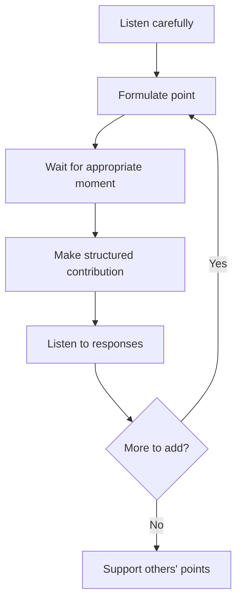
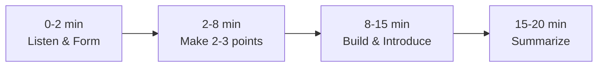
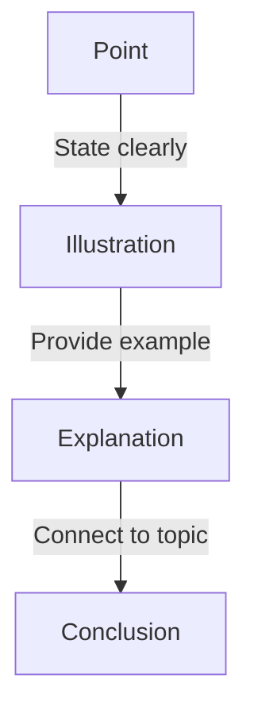

## Introduction

Group discussions (GD) are a common evaluation method in interviews, especially for management trainee programs, consulting roles, and campus placements. A GD assesses your communication skills, leadership potential, teamwork, subject knowledge, and ability to think on your feet. It typically involves 8-12 candidates discussing a topic for 15-30 minutes while evaluators observe.

This guide covers GD formats (topic-based, case-based, fishbowl), speaking strategies, listening skills, structuring arguments, time management, body language, common GD topics, and evaluation criteria. Success in GDs requires a balance of speaking assertively while being collaborative.

---

## Learning Roadmap

### Phase 1: Preparation (Days 1-3)
- Learn different GD formats and rules
- Practice current affairs and general knowledge
- Study common GD topics
- Understand evaluation criteria

### Phase 2: Practice (Days 4-7)
- Participate in mock GDs with friends
- Practice structured argument building
- Work on listening and responding
- Develop time management strategies

### Phase 3: Refinement (Days 8-10)
- Record practice GDs and review
- Focus on body language and confidence
- Practice diverse topics
- Develop strategies for dominant participants

---

## Theory Notes

### GD Formats

#### Topic-Based GD
- Abstract or factual topic (e.g., "Is social media a net positive for society?")
- Open discussion with no case study
- Tests general knowledge, opinion formation, and articulation

#### Case-Based GD
- Business case or scenario provided
- Must analyze data and reach a recommendation
- Tests analytical thinking and business acumen

#### Fishbowl GD
- Small group discusses while others observe
- Observers can "tap in" to replace a speaker
- Tests observation and quick thinking

### Speaking Strategies

#### Opening the GD
- Start with a clear structure: "I'd like to begin by outlining three perspectives..."
- Acknowledge the topic's complexity
- Set a collaborative tone
- Don't force an opening — only start if you have a clear structure

#### Building on Points
- "Building on what [Name] said..."
- "I agree with that point, and I'd add..."
- "That's an interesting perspective. Another way to look at it is..."
- "Let me offer a different angle..."

#### Handling Disagreement
- "I see your point, but the data suggests..."
- "That's valid. However, from a [different perspective]..."
- "I'd like to challenge that assumption because..."
- Stay respectful — disagree with ideas, not people

#### Summarizing
- Summarize key points from the discussion
- Note areas of agreement and disagreement
- Highlight the group's conclusion or recommendation
- Keep it under 1 minute

### Structuring Arguments

#### Point-Illustration-Explanation (PIE)
1. **Point**: State your argument clearly
2. **Illustration**: Provide an example or data
3. **Explanation**: Connect it back to the topic

#### PREP Framework
1. **Point**: State your position
2. **Reason**: Explain why
3. **Example**: Provide evidence
4. **Point**: Restate your conclusion

### Time Management in GD
- **First 2 minutes**: Listen, form your structure
- **Minutes 2-8**: Make 2-3 strong contributions
- **Minutes 8-15**: Build on others' points, introduce new angles
- **Last 2-3 minutes**: Summarize or support the summary

---

## Key Concepts

### Evaluation Criteria
| Criterion | What Evaluators Look For |
|-----------|------------------------|
| **Communication** | Clarity, fluency, structure |
| **Leadership** | Initiating, guiding, facilitating |
| **Teamwork** | Building on others, inclusion |
| **Subject Knowledge** | Depth of understanding |
| **Analytical Skills** | Logical reasoning, data usage |
| **Assertiveness** | Speaking confidently without dominating |
| **Listening** | Responding to others' points |
| **Initiative** | Contributing new ideas |

### Body Language
- Sit upright with open posture
- Make eye contact with the speaker and group
- Nod to show engagement
- Use purposeful hand gestures
- Avoid fidgeting, crossing arms, or looking at your phone
- Smile naturally when appropriate

### Common GD Topics

#### Current Affairs
- Remote work vs office work
- AI impact on employment
- Climate change and technology
- Digital privacy and surveillance
- Social media regulation

#### Abstract Topics
- "Is competition better than cooperation?"
- "Can money buy happiness?"
- "Is technology making us less human?"
- "Does the end justify the means?"

#### Business/Management
- "Should startups prioritize growth or profitability?"
- "Is diversification always good for business?"
- "Should companies prioritize stakeholder value over shareholder value?"
- "Is remote work sustainable for long-term productivity?"
- "Should AI regulation be left to governments or industry?"

#### Ethics and Society
- "Is data privacy more important than national security?"
- "Should social media platforms censor content?"
- "Is genetic engineering ethical?"
- "Should developing countries prioritize economic growth over environmental protection?"

#### Education and Career
- "Is a college degree still necessary?"
- "Should coding be mandatory in schools?"
- "Is online learning as effective as classroom learning?"
- "Should companies require employees to return to office?"

### GD Roles You Can Naturally Assume

#### The Initiator
- Opens the discussion with structure
- Sets the agenda and tone
- Earns credit for organizing the group
- Risk: If your opening is weak, it hurts more than helping

#### The Devil's Advocate
- Challenges popular opinions constructively
- Brings fresh perspectives
- Shows critical thinking
- Risk: Must be respectful and constructive, not combative

#### The Summarizer
- Captures key points throughout
- Synthesizes at the end
- Shows listening and organizational skills
- Risk: Must track points throughout, not just at the end

#### The Facilitator
- Includes quieter members
- Redirects when off-track
- Manages dominant participants
- Shows leadership through service

#### The Data Provider
- Brings facts and statistics
- Strengthens arguments with evidence
- Adds credibility to points
- Risk: Must be honest about data accuracy

### How to Handle Specific GD Scenarios

#### When You Disagree with Everyone
1. Acknowledge the prevailing view
2. Present your contrarian perspective with reasoning
3. Support with data or logical argument
4. Remain open to being persuaded
5. "I understand why everyone leans toward X. However, consider Y because..."

#### When Someone Steals Your Point
1. Don't get frustrated — it means your preparation was good
2. Build on the stolen point: "Building on what was just said..."
3. Add your unique perspective or data
4. Move on gracefully — credit matters less than contribution

#### When the Discussion Becomes Heated
1. Stay calm and composed
2. Acknowledge emotions: "I can see this is a topic people feel strongly about"
3. Redirect to facts: "Let's look at what the data says"
4. Find common ground: "We all agree on X, even if we differ on Y"
5. If necessary, suggest a structured approach: "Let's each state our position in 30 seconds"

#### When You Don't Know the Topic Well
1. Listen carefully to others' arguments
2. Ask thoughtful questions: "Could you explain how X works?"
3. Build on others' points with logical reasoning
4. Offer a general framework even without specific data
5. Be honest: "I'm not an expert in this area, but logically..."

### GD Scoring Rubric (What Evaluators Actually Use)

| Score | Communication | Leadership | Teamwork | Knowledge |
|-------|-------------|------------|----------|-----------|
| **5** | Clear, structured, persuasive | Naturally guides discussion | Builds on others, inclusive | Deep, factual, relevant |
| **4** | Clear and organized | Makes key contributions | Collaborative | Good understanding |
| **3** | Generally clear | Participates actively | Works with others | Adequate knowledge |
| **2** | Sometimes unclear | Minimal contribution | Doesn't build on others | Surface knowledge |
| **1** | Difficult to follow | No leadership shown | Dismissive of others | Lacks basic knowledge |

---

## FAQ (20+ Q&A)

### Q1: How many times should I speak in a GD?
**A:** Aim for 4-6 meaningful contributions. Quality over quantity. Each contribution should add value — a new point, building on someone else's idea, or providing data/examples.

### Q2: What if I don't know much about the topic?
**A:** Listen carefully to others' points and build on them. Ask questions to draw out information. Offer logical reasoning even without specific data. "While I don't have specific numbers, the logical argument would be..."

### Q3: How do I handle a dominant participant?
**A:** Acknowledge their points, then redirect. "That's a good point. I'd also like to hear from others who haven't spoken yet." Or directly: "I'd like to build on that, and I think [Name] had a related idea."

### Q4: Should I always try to start the GD?
**A:** No. Only start if you have a clear structure or opening point. Starting with a strong structure earns credit, but a weak opening hurts more than not starting at all.

### Q5: How do I summarize effectively?
**A:** Listen throughout and take mental notes. Summarize key points, note agreements/disagreements, and state the group's conclusion. Keep it under 1 minute. "The group discussed X, Y, and Z. We agreed on A but debated B. Our recommendation is..."

### Q6: What if the group goes off-topic?
**A:** Gently redirect. "Those are interesting points. Let me bring us back to the core question, which is..." This shows leadership and focus.

### Q7: How do I show leadership in a GD?
**A:** Initiate with structure, build on others' ideas, facilitate quieter members, keep the discussion on track, and summarize key points. Leadership is about guiding, not dominating.

### Q8: What body language should I maintain?
**A:** Sit upright, make eye contact, use open gestures, nod to show engagement, and avoid crossing arms or fidgeting. Confident body language reinforces your verbal communication.

### Q9: How do I disagree respectfully?
**A:** "I see your point about X. However, from a different angle..." or "That's valid, but the data suggests otherwise." Always disagree with ideas, not people.

### Q10: What if I make a factual error?
**A:** Acknowledge it gracefully. "I stand corrected — thank you for that. Let me revise my point..." Honesty and humility earn respect.

### Q11: How do I contribute if I'm not the loudest person?
**A:** Choose your moments carefully. Make 2-3 strong, well-structured points. Build on others' ideas. Ask clarifying questions. Quality contributions count more than volume.

### Q12: Should I take notes during the GD?
**A:** Yes, brief notes help you track key points for summarizing. Don't spend too much time writing — stay engaged in the discussion.

### Q13: How do I handle a GD where no one agrees?
**A:** Find common ground. "It seems we all agree on X, even if we disagree on Y. Can we focus on what we agree on and present a unified recommendation?"

### Q14: What if the topic is controversial?
**A:** Stay balanced, present multiple perspectives, and be respectful. Avoid strong personal opinions on highly sensitive topics. Focus on facts and logical reasoning.

### Q15: How do I prepare for a GD?
**A:** Read current affairs, practice with friends, study common topics, develop structured arguments, and work on body language and listening skills.

### Q16: What's the biggest mistake in a GD?
**A:** Dominating without listening. Speaking for the sake of speaking. Not building on others' points. Being aggressive or disrespectful. Ignoring quieter members.

### Q17: How do I handle GDs in virtual settings?
**A:** Use the "raise hand" feature, be concise (others may have audio issues), use chat for supplementary points, and maintain good lighting and camera position.

### Q18: Should I use data in my arguments?
**A:** Yes, data makes arguments more convincing. But don't fabricate statistics. Use approximate numbers with transparency. "Roughly 60%..." is better than a made-up exact figure.

### Q19: How do I handle a GD with unequal participation?
**A:** Invite quieter members: "I'd like to hear from others who haven't spoken." This shows leadership and inclusivity.

### Q20: What's the ideal GD pace?
**A:** Speak clearly at a moderate pace. Don't rush. Pause briefly before speaking to gather thoughts. Each contribution should be 30-60 seconds.

### Q21: How do I prepare for a GD in a non-English speaking country?
**A:** Focus on clear articulation over complex vocabulary. Simple, well-structured arguments are more effective than fancy language. Practice speaking clearly and at a moderate pace.

### Q22: What if the topic is completely unfamiliar to me?
**A:** Listen carefully to others, ask clarifying questions, and offer logical reasoning. You can say "While I don't have specific expertise in this area, logically speaking..." This shows humility and analytical thinking.

### Q23: How do I handle a GD with people from different educational backgrounds?
**A:** Respect diverse perspectives, avoid jargon, and focus on logical reasoning that anyone can follow. Different backgrounds often lead to richer discussions.

### Q24: Should I make eye contact with the evaluator or the group?
**A:** Primarily with the group (they're your audience), but occasionally glance at the evaluator to show awareness. Don't stare at the evaluator — it looks like you're performing for them rather than engaging with the group.

### Q25: How do I handle when someone quotes a wrong fact?
**A:** If it's minor and irrelevant, let it go. If it affects the discussion, politely correct: "I believe the figure is actually X, according to [source]." Never be condescending.

---

## Common Mistakes

1. **Dominating the discussion**: Speaking too much and not listening
2. **Being aggressive**: Interrupting, talking over others
3. **Not listening**: Waiting for your turn to speak instead of engaging
4. **Going off-topic**: Losing focus on the core question
5. **Being silent**: Not contributing at all
6. **Lacking structure**: Rambling without clear points
7. **Ignoring others**: Not building on previous points
8. **Poor body language**: Crossing arms, not making eye contact
9. **Faking knowledge**: Making up facts or statistics
10. **Being defensive**: Not accepting feedback or corrections

---

## Best Practices

### Before the GD
- Research the topic (if known) or current affairs
- Practice with a timer
- Prepare a general opening framework
- Review evaluation criteria

### During the GD
- Listen actively before speaking
- Make structured contributions
- Build on others' points
- Stay calm and composed
- Keep track of time
- Invite quieter members to contribute

### After the GD
- Reflect on your performance
- Note areas for improvement
- Seek feedback from peers
- Practice regularly

---

## Cheat Sheet

### GD Opening Template
```
"This is an interesting topic with multiple dimensions. Let me outline
three key perspectives we could explore: [1], [2], and [3]. I'd like
to start with [perspective] because..."
```

### Building on Points Template
```
"Building on what [Name] said about [topic], I'd add that [your point].
For example, [illustration]. This connects to our broader discussion
because [explanation]."
```

### Summary Template
```
"In summary, the group discussed [key themes]. We agreed that [consensus
points]. There was debate on [disagreements]. Our overall position is
[recommendation]. The main supporting arguments were [1], [2], and [3]."
```

---

## Flash Cards (20)

### Card 1
**Q:** What is the ideal number of contributions in a GD?
**A:** 4-6 meaningful contributions. Quality over quantity. Each should add value — new point, building on others, or providing evidence.

### Card 2
**Q:** How do you handle a dominant participant?
**A:** Acknowledge their point, then redirect: "I'd also like to hear from others." Or: "Building on that, I think [Name] had a related idea."

### Card 3
**Q:** What is the PIE framework for arguments?
**A:** Point (state argument), Illustration (provide example/data), Explanation (connect to topic). Structure makes arguments memorable.

### Card 4
**Q:** Should you always start the GD?
**A:** Only if you have a clear structure. A strong opening earns credit, but a weak opening hurts. Starting isn't required for success.

### Card 5
**Q:** How do you summarize a GD effectively?
**A:** Listen throughout, note key points. Summarize themes, agreements, disagreements, and the group's conclusion. Keep under 1 minute.

### Card 6
**Q:** What body language should you maintain?
**A:** Upright posture, open gestures, eye contact, nodding to show engagement. Avoid crossing arms, fidgeting, or looking disinterested.

### Card 7
**Q:** How do you contribute if you're not the loudest?
**A:** Choose moments for 2-3 strong points. Build on others' ideas. Ask questions. Quality contributions count more than volume.

### Card 8
**Q:** What is the biggest GD mistake?
**A:** Dominating without listening. Speaking for the sake of speaking. Being aggressive. Not building on others' points.

### Card 9
**Q:** How do you show leadership in a GD?
**A:** Initiate with structure, build on others, facilitate quieter members, keep discussion on track, and summarize.

### Card 10
**Q:** How do you handle a GD where no one agrees?
**A:** Find common ground. "We agree on X even if we disagree on Y. Can we focus on what we agree on?"

### Card 11
**Q:** Should you use data in your arguments?
**A:** Yes, data makes arguments convincing. Use approximate numbers honestly. "Roughly 60%..." is better than fabricated exact figures.

### Card 12
**Q:** How do you handle a GD with unequal participation?
**A:** Invite quieter members: "I'd like to hear from others who haven't spoken." Shows leadership and inclusivity.

### Card 13
**Q:** What is the ideal GD pace?
**A:** Moderate pace, clear articulation. Each contribution 30-60 seconds. Pause briefly before speaking.

### Card 14
**Q:** How do you disagree respectfully?
**A:** "I see your point about X. However, from a different angle..." Disagree with ideas, not people.

### Card 15
**Q:** What if you make a factual error?
**A:** Acknowledge gracefully. "I stand corrected — thank you. Let me revise my point..." Honesty earns respect.

### Card 16
**Q:** How do you handle off-topic discussions?
**A:** Gently redirect. "Interesting points. Let me bring us back to the core question..."

### Card 17
**Q:** Should you take notes during a GD?
**A:** Yes, brief notes help for summarizing. Don't spend too much time writing — stay engaged.

### Card 18
**Q:** How do you prepare for a GD?
**A:** Read current affairs, practice with friends, study common topics, develop structured arguments, work on body language.

### Card 19
**Q:** What if the topic is controversial?
**A:** Stay balanced, present multiple perspectives, be respectful. Focus on facts and logical reasoning.

### Card 20
**Q:** How do you handle virtual GDs?
**A:** Use raise hand feature, be concise, use chat for supplementary points, maintain good camera/lighting.

---

## Mind Map

```
Group Discussion
├── Formats
│   ├── Topic-based
│   ├── Case-based
│   └── Fishbowl
├── Speaking Strategies
│   ├── Opening
│   ├── Building on points
│   ├── Handling disagreement
│   └── Summarizing
├── Argument Frameworks
│   ├── PIE (Point-Illustration-Explanation)
│   └── PREP (Point-Reason-Example-Point)
├── Evaluation Criteria
│   ├── Communication
│   ├── Leadership
│   ├── Teamwork
│   ├── Subject knowledge
│   ├── Analytical skills
│   └── Listening
├── Body Language
│   ├── Eye contact
│   ├── Posture
│   ├── Gestures
│   └── Engagement
└── Common Topics
    ├── Current affairs
    ├── Abstract
    └── Business/Management
```

---

## Mermaid Diagrams

### GD Contribution Flow


### GD Time Management


### Argument Structure (PIE)


---

## Projects

### Project 1: GD Practice Group
- Form a group of 4-6 people
- Practice 2 GDs per week on different topics
- Record and review performances
- Give each other feedback
- **Skills**: Communication, teamwork, leadership

### Project 2: Current Affairs Knowledge
- Read 2 news articles daily
- Form opinions on current topics
- Practice articulating views
- Build a knowledge base
- **Skills**: Knowledge, opinion formation

### Project 3: Mock GD Assessment
- Conduct formal mock GDs with evaluation
- Score on communication, leadership, teamwork
- Track improvement over time
- **Skills**: Self-assessment, continuous improvement

### Project 4: Topic Research Portfolio
- Pick 10 common GD topics
- Research each thoroughly (stats, arguments for/against)
- Create one-page summaries for each
- Practice discussing each topic
- **Skills**: Research, knowledge, articulation

### Project 5: Leadership Role Practice
- In each mock GD, try a different role (initiator, summarizer, facilitator)
- Track which role feels most natural
- Develop your "signature" GD style
- **Skills**: Self-awareness, adaptability

---

## Resources

### Books
- *Group Discussions for Campus Placements* by Ramendra Kumar
- *How to Win Friends and Influence People* by Dale Carnegie
- *The Art of Speaking* by John Lim
- *Thinking, Fast and Slow* by Daniel Kahneman (decision-making)
- *Influence* by Robert Cialdini (persuasion techniques)
- *Never Split the Difference* by Chris Voss (negotiation in discussions)

### Online
- [IndiaBIX GD Topics](https://indibix.com/group-discussion)
- [GeeksforGeeks GD Guide](https://geeksforgeeks.org)
- [Prepinsta GD Topics](https://prepinsta.com/group-discussion/)
- [Current Affairs Apps](https://play.google.com) — Stay updated daily
- [YouTube GD Practice Videos](https://youtube.com) — Watch and learn from examples

---

## GD Quick Reference Guide

### 30-Second Opening Template
```
"This is a multi-faceted topic. I'd like to suggest three angles:
[1] [Primary perspective],
[2] [Contrasting perspective], and
[3] [Practical/business perspective].
Let me start with [chosen angle] because [brief reason]."
```

### 30-Second Contribution Template
```
"Building on what [Name] said about [topic],
[add your perspective].
For example, [illustration or data].
This is relevant because [connection to topic]."
```

### 60-Second Summary Template
```
"In summary, we discussed [theme 1], [theme 2], and [theme 3].
We broadly agreed that [consensus points].
The main debate centered on [disagreements].
Our overall position is [conclusion].
The strongest arguments were [1], [2], and [3]."
```

### Key Phrases to Use
- "I'd like to build on that point..."
- "That's a valid perspective. Another way to look at it..."
- "I'd like to offer a different angle..."
- "Let me bring us back to the core question..."
- "I'd like to hear from others who haven't spoken..."
- "To summarize what I'm hearing..."
- "The data suggests that..."
- "While I see your point, consider this..."

### Phrases to Avoid
- "You're wrong about that..."
- "I disagree completely..."
- "That doesn't make sense..."
- "I don't care about that..."
- "Let me interrupt..."
- "Actually, I already said that..."
- "Nobody cares about..."
- "That's irrelevant..."
- "Well, actually..." (dismissive tone)
- "I think we're going off track" (too blunt — use redirect instead)

### GD Preparation Resources

### Daily Current Affairs Routine
1. Read 2-3 news articles during breakfast
2. Form an opinion on each topic
3. Note key statistics and facts
4. Practice articulating your view in 30 seconds
5. Discuss with a friend or colleague

### Weekly GD Practice Schedule
- **Monday**: Topic-based GD (current affairs)
- **Wednesday**: Case-based GD (business scenario)
- **Friday**: Abstract GD (philosophical/ethical)
- **Weekend**: Review and feedback session

### Top 30 GD Topics to Practice

**Technology:**
1. AI will replace more jobs than it creates
2. Social media does more harm than good
3. Cryptocurrency is the future of money
4. Remote work is the new normal
5. Open source is better than proprietary software

**Business:**
6. Startups are better than corporate jobs
7. Profitability matters more than growth
8. Customer is always right
9. Competition drives innovation
10. Diversification weakens focus

**Society:**
11. College education is overrated
12. Money can buy happiness
13. Privacy is more important than security
14. Climate change requires individual action
15. Technology is making us less social

**Ethics:**
16. The end justifies the means
17. Censorship is sometimes necessary
18. Genetic engineering should be regulated
19. Animal testing should be banned
20. Capital punishment is justified

**Education:**
21. Online learning will replace traditional classrooms
22. Coding should be mandatory in schools
23. Grades don't measure intelligence
24. Internships should be paid
25. Sports should be part of academic curriculum

**Work:**
26. 4-day work week increases productivity
27. Job hopping shows ambition not disloyalty
28. Work-life balance is a myth
29. Men and women have different leadership styles
30. Experience matters more than education

---

## Checklist

### GD Preparation
- [ ] Understand GD formats and rules
- [ ] Practice structured argument building
- [ ] Study common GD topics
- [ ] Practice with a group
- [ ] Work on body language
- [ ] Develop listening skills
- [ ] Practice summarizing
- [ ] Know evaluation criteria
- [ ] Handle dominant participants
- [ ] Time management strategy

---

## Difficulty Rating

| Topic | Difficulty | Interview Frequency |
|-------|-----------|-------------------|
| Topic-Based GD | ★★☆☆☆ | High |
| Case-Based GD | ★★★☆☆ | Medium |
| Structured Arguments | ★★☆☆☆ | High |
| Listening & Building | ★★☆☆☆ | High |
| Summary | ★★★☆☆ | Medium |
| Dominant Participants | ★★★☆☆ | Medium |
| Body Language | ★★☆☆☆ | High |

---

## Summary

Group discussions assess communication, leadership, and teamwork. Key takeaways:

1. **Quality over quantity** — 4-6 strong contributions beat 10 weak ones
2. **Listen actively** — building on others shows collaboration
3. **Structure matters** — PIE or PREP frameworks make arguments clear
4. **Show leadership** — initiate with structure, facilitate others
5. **Be inclusive** — invite quieter members to contribute
6. **Stay on topic** — redirect when discussions drift
7. **Body language counts** — confidence and engagement are visible
8. **Summarize effectively** — capture key points and conclusions
9. **Practice regularly** — GD skills improve with repetition
10. **Stay respectful** — disagree with ideas, not people
