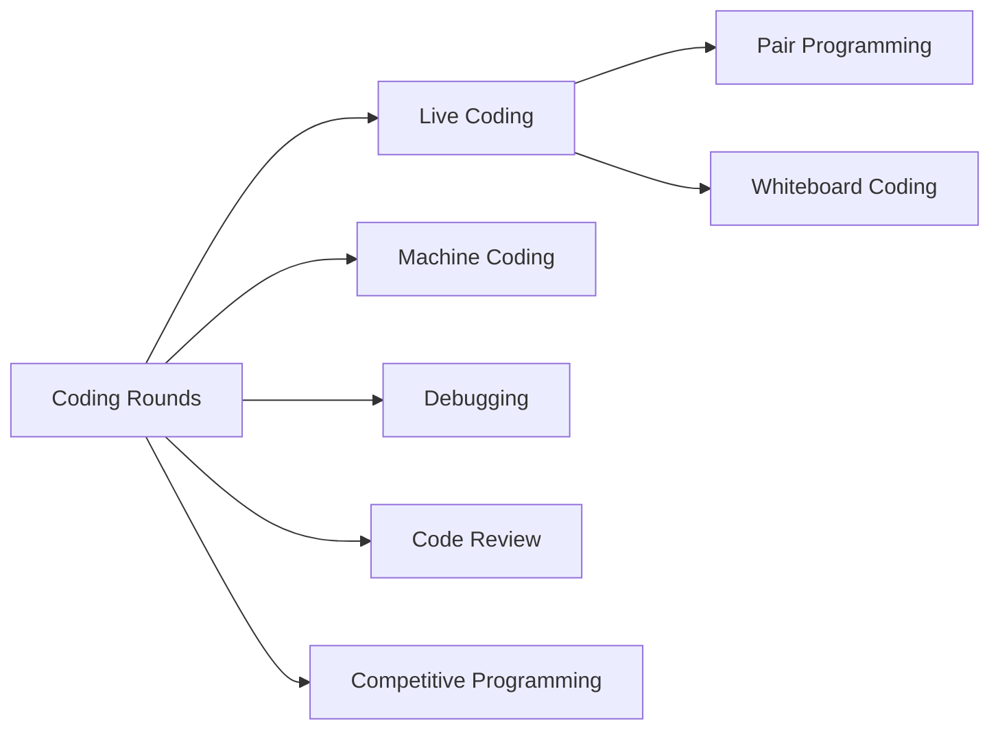

# Coding

{: .note }
Master the art of coding interviews — from live coding sessions to competitive programming challenges.

---

## Overview

The Coding category covers every format and skill needed to excel in the technical coding portions of software engineering interviews. Whether you're solving problems on a whiteboard, debugging production code, or designing a system in real-time, these modules prepare you for it all.

---

## Topics

| # | Topic | Focus Area |
|---|-------|------------|
| 1 | [Coding Rounds](coding-rounds) | The 5-step interview framework, core patterns, and problem-solving strategies |
| 2 | [Live Coding](live-coding) | Real-time coding sessions, thinking aloud, platform familiarity, and pressure management |
| 3 | [Pair Programming](pair-programming) | Driver/navigator roles, collaboration, constructive feedback, and remote tools |
| 4 | [Machine Coding](machine-coding) | OOP design, SOLID principles, design patterns, and complete system implementation |
| 5 | [Whiteboard Coding](whiteboard-coding) | Board organization, diagramming, pseudocode, and visual communication |
| 6 | [Debugging](debugging) | Bug identification, scientific debugging method, tools, and systematic problem-solving |
| 7 | [Code Review](code-review) | Review etiquette, security/performance checks, giving feedback, and PR workflows |
| 8 | [Competitive Programming](competitive-programming) | Contest strategies, advanced algorithms, constraint analysis, and speed techniques |

---

## Learning Path

**Recommended order:**
1. Start with **Coding Rounds** to build the foundational problem-solving framework
2. Practice **Live Coding** and **Whiteboard Coding** for interview format readiness
3. Study **Machine Coding** for system design implementation skills
4. Strengthen **Debugging** and **Code Review** for production-quality thinking
5. Explore **Competitive Programming** for advanced algorithmic depth

---

## Quick Links

- **Practice Platforms:** [LeetCode](https://leetcode.com), [HackerRank](https://hackerrank.com), [Codeforces](https://codeforces.com)
- **Mock Interviews:** [Pramp](https://pramp.com), [Interviewing.io](https://interviewing.io)
- **Reference:** [Big-O Cheat Sheet](https://bigocheatsheet.com)

---

*Estimated total study time: 12-16 weeks (1-2 hours daily)*
