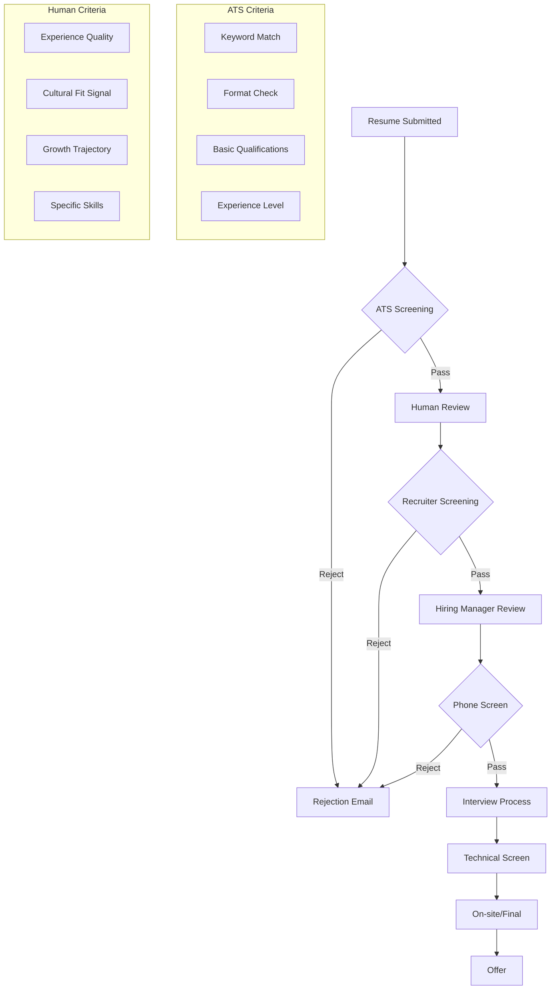
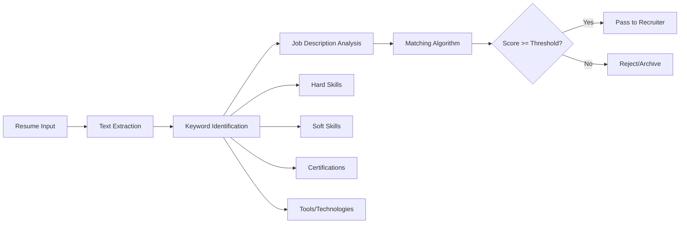
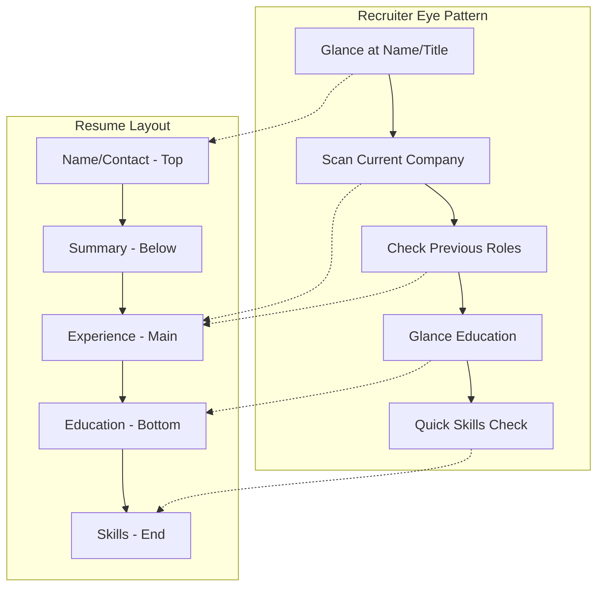
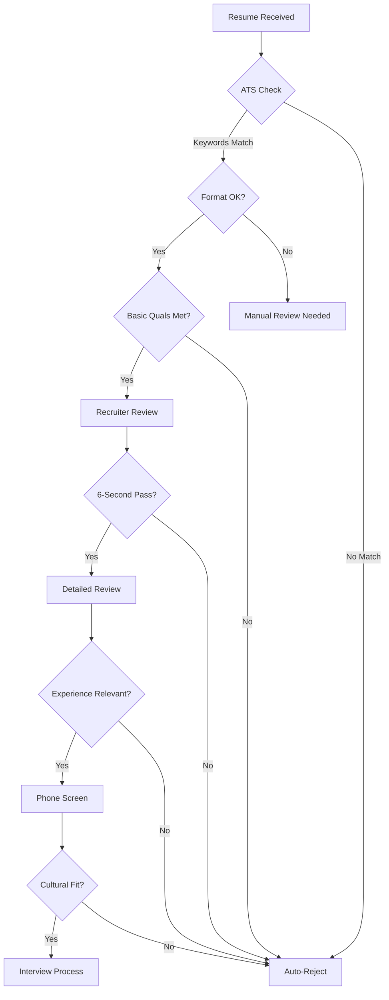

## Introduction

**What is Resume Screening?**
Resume screening is the initial evaluation process where recruiters, hiring managers, or automated systems review resumes to determine if candidates meet the minimum qualifications for a position. This critical first step filters hundreds or thousands of applications down to a manageable pool of qualified candidates for interviews.

**Why Does it Matter for Interviews?**
Understanding resume screening is essential because:
- 75% of resumes are rejected by ATS (Applicant Tracking Systems) before a human sees them
- Recruiters spend an average of 6-7 seconds scanning a resume initially
- Your resume must pass both automated and human screening to reach interviewers
- Screening criteria vary significantly by company size, industry, and role
- Knowing what screened you in or out helps you prepare better for interviews

**The Dual Screening Process:**
1. **ATS Screening**: Automated systems scan for keywords, formatting, and basic qualifications
2. **Human Screening**: Recruiters evaluate fit, experience quality, and potential

---

## Learning Roadmap

### Mermaid Diagram



### Screening Timeline

| Stage | Who Reviews | Time Spent | Key Focus |
|-------|-------------|------------|-----------|
| Initial ATS Scan | Automated System | < 1 second | Keywords, formatting, basic quals |
| Recruiter First Pass | Recruiter | 6-7 seconds | Overall impression, red flags |
| Detailed Recruiter Review | Recruiter | 30-60 seconds | Experience relevance, career story |
| Hiring Manager Review | Hiring Manager | 1-2 minutes | Technical fit, team needs |
| Phone Screen Prep | Recruiter | 2-3 minutes | Interview questions, scheduling |

---

## Theory Notes

### ATS (Applicant Tracking Systems) Deep Dive

**How ATS Systems Work:**
1. **Resume Parsing**: Extracts text, identifies sections, converts to structured data
2. **Keyword Matching**: Compares resume content against job description requirements
3. **Scoring Algorithm**: Assigns relevance scores based on match quality
4. **Ranking**: Orders candidates by score, highest first
5. **Filtering**: Applies recruiter-set filters (location, experience, education)

**Major ATS Platforms:**
- Workday (used by 50%+ of Fortune 500)
- Taleo (Oracle)
- Greenhouse
- Lever
- iCIMS
- BambooHR
- SmartRecruiters

**ATS Optimization Strategies:**
1. Use standard section headings (Experience, Education, Skills)
2. Avoid tables, columns, and graphics
3. Include exact keywords from job description
4. Use standard fonts (Arial, Calibri, Times New Roman)
5. Save as .docx or .pdf (check job posting preference)
6. Avoid headers/footers (ATS often can't read them)
7. Use standard date formats (MM/YYYY)
8. Don't use creative section names

### Human Screening Psychology

**The 6-Second Rule:**
Research shows recruiters spend approximately 6-7 seconds on initial resume scan. During this time, they look at:
1. Name and current title (1 second)
2. Current company and start date (1 second)
3. Previous title and company (1 second)
4. Start and end dates (1 second)
5. Education (1 second)
6. Overall visual impression (2 seconds)

**Cognitive Biases in Screening:**
- **Name bias**: Unconscious bias based on name appearance
- **Institution bias**: Favoritism toward known universities
- **Company prestige bias**: Preference for well-known employers
- **Recency bias**: Overvaluing recent experience
- **Pattern matching**: Looking for "typical" career paths
- **Halo effect**: One strong element coloring overall perception

**Visual Hierarchy and Eye Tracking:**
Studies show recruiters' eyes follow specific patterns:
- Top-left to bottom-right scanning
- Heavy focus on left third of page
- Quick vertical scan before horizontal reading
- Preference for bullet points over paragraphs
- Attention to bold text and section headers

### Screening Criteria by Role

**Software Engineer:**
- Technical skills match (languages, frameworks, tools)
- Years of experience with relevant technologies
- Project complexity and impact
- Education (often less important than experience)
- Open source contributions, GitHub profile
- Company prestige and growth trajectory

**Product Manager:**
- Industry experience and domain knowledge
- Product launches and measurable outcomes
- Cross-functional collaboration evidence
- Data-driven decision making examples
- Customer focus and user research experience
- Leadership without authority examples

**Data Scientist:**
- Programming skills (Python, R, SQL)
- Statistical and ML knowledge
- Business impact of analyses
- Published research or competitions (Kaggle)
- Tool proficiency (TensorFlow, PyTorch, etc.)
- Communication of complex findings

**Designer:**
- Portfolio quality and relevance
- Design process documentation
- User research and testing experience
- Collaboration with engineering/product
- Visual design and interaction skills
- Case studies showing problem-solving

**Marketing:**
- Campaign results with metrics
- Channel expertise (paid, organic, social)
- Budget management experience
- Tools proficiency (Analytics, CRM, etc.)
- Industry relevance
- Creative examples and content samples

---

## Key Concepts

| Concept | Definition | Screening Impact |
|---------|------------|------------------|
| ATS Keyword Optimization | Matching resume content to job description keywords | Determines if resume reaches human reviewer |
| Recruiter Screening | Initial human evaluation of resume quality and fit | Gates access to hiring manager |
| Resume Metrics | Quantifiable achievements and results | Differentiates strong candidates |
| Career Trajectory | Pattern of growth and progression | Signals potential and ambition |
| Red Flags | Warning signs that raise concerns | Can lead to immediate rejection |
| Formatting Standards | Visual organization and readability | Affects initial impression and ATS parsing |
| Quantification | Using numbers to demonstrate impact | Makes achievements concrete and credible |
| Relevance Matching | Aligning experience with job requirements | Determines perceived fit |
| Brevity vs. Detail | Balancing conciseness with completeness | Respects reviewer time while showing depth |
| Digital Presence | Online profiles and portfolios | Supplements resume claims |

---

## Frequently Asked Interview Questions

### Beginner Level

1. **Q: How long does a recruiter typically spend reviewing a resume?**
   A: Studies show recruiters spend an average of 6-7 seconds on initial resume scan, with detailed review taking 30-60 seconds. This means your resume must make a strong immediate impression through clear formatting, relevant keywords, and compelling achievements.

2. **Q: What is an ATS and why does it matter?**
   A: ATS (Applicant Tracking System) is software that companies use to manage job applications. It automatically scans resumes for keywords, qualifications, and formatting. Up to 75% of resumes are filtered out by ATS before a human sees them, so optimizing for these systems is crucial.

3. **Q: Should I include a photo on my resume?**
   A: In the US and UK, no - it can trigger unconscious bias and many ATS systems can't parse images. In some European and Asian countries, it's expected. Always check cultural norms for your target market.

4. **Q: How important is resume formatting?**
   A: Extremely important. Clean, professional formatting helps both ATS systems parse your content correctly and recruiters quickly find information. Use standard headings, consistent bullet points, readable fonts, and adequate white space.

5. **Q: What makes a resume get rejected immediately?**
   A: Common immediate rejection reasons include: failing ATS keyword matching, obvious typos/grammar errors, unclear career progression, irrelevant experience, missing required qualifications, and poor formatting that's hard to scan.

### Intermediate Level

6. **Q: How do I optimize my resume for ATS systems?**
   A: Key strategies include: using exact keywords from the job description, standard section headings, simple formatting without tables/columns, saving in ATS-friendly formats (.docx preferred), avoiding headers/footers, and including all relevant skills explicitly.

7. **Q: What are the most common resume red flags?**
   A: Red flags include: unexplained employment gaps, frequent job changes (under 1 year), overqualified or underqualified, generic objective statements, spelling errors, inconsistent formatting, unprofessional email, and missing contact information.

8. **Q: How do I quantify achievements when my role doesn't seem quantifiable?**
   A: Even non-quantitative roles have metrics: team size managed, projects completed, processes improved (time saved), training delivered (people trained), budgets managed, customer satisfaction scores, error reduction rates, or efficiency improvements.

9. **Q: What's the ideal resume length?**
   A: For most professionals: 1 page (0-10 years experience), 2 pages (10-20 years), rarely 3+ pages (executives/academics). Recruiters prefer concise resumes that highlight relevant achievements over exhaustive work histories.

10. **Q: How do employment gaps affect screening?**
    A: Gaps aren't automatically disqualifying but need explanation. Brief gaps (few months) are normal. Longer gaps should be addressed with a brief note (caregiving, education, freelance work). Unexplained multi-year gaps raise concerns about skills currency and work commitment.

### Advanced Level

11. **Q: How do different company sizes approach resume screening?**
    A: Startups often have founders/hiring managers review personally, valuing versatility and cultural fit. Mid-size companies use recruiters with more standardized processes. Enterprise companies rely heavily on ATS and have multiple screening layers. Tailor your resume accordingly.

12. **Q: What's the difference between screening for technical vs. non-technical roles?**
    A: Technical screening focuses on specific skills, tools, and project complexity. Non-technical screening emphasizes transferable skills, business impact, and leadership potential. Technical resumes benefit from GitHub/portfolio links; non-technical benefit from metrics and storytelling.

13. **Q: How do recruiter agencies screen differently than in-house recruiters?**
    A: Agency recruiters often screen for client requirements more strictly, may have technical expertise to evaluate skills, and work on commission (so prioritize quality). In-house recruiters focus on culture fit, long-term potential, and company-specific requirements.

14. **Q: What role does LinkedIn play in resume screening?**
    A: Recruiters cross-reference resumes with LinkedIn profiles. Inconsistencies raise red flags. LinkedIn provides additional context (recommendations, endorsements, activity). An optimized LinkedIn can compensate for resume weaknesses, but the resume remains primary.

15. **Q: How has AI changed resume screening?**
    A: AI now handles keyword matching, sentiment analysis, career trajectory prediction, and even video resume analysis. This means resumes need to be both ATS-friendly and contain genuine, substantive content that passes AI quality assessments.

### FAANG Level

16. **Q: How do FAANG companies screen resumes differently?**
    A: FAANG companies receive thousands of applications daily. They use sophisticated ATS with multiple scoring dimensions, often have dedicated screening teams, may use coding challenges as initial filters, and place high value on specific company referrals.

17. **Q: What's the impact of employee referrals on screening?**
    A: Referrals often bypass initial ATS screening, get flagged for priority review, and carry implicit endorsement. Referred candidates are 4-5x more likely to be hired. Building internal connections is one of the most effective job search strategies.

18. **Q: How do screening criteria change for senior roles?**
    A: Senior roles prioritize leadership evidence, business impact, strategic thinking, and industry expertise over specific technical skills. Career progression, P&L responsibility, and team-building become more important. Resume should demonstrate executive presence.

19. **Q: What's the role of portfolio/work samples in screening?**
    A: For creative and technical roles, portfolios provide evidence of skills that resumes can only claim. Strong portfolios can overcome resume weaknesses. They should be curated, relevant, and demonstrate both process and results.

20. **Q: How do international resumes differ in screening?**
    A: Different countries have different expectations: EU often includes photos/personal details, UK emphasizes personal statements, Japan requires specific formats. Research local norms and adapt. Some companies screen international resumes with cultural bias awareness training.

21. **Q: What's the most common screening mistake candidates make?**
    A: The biggest mistake is sending a generic resume to every job. Tailoring your resume to each specific role - matching keywords, highlighting relevant experience, and addressing specific requirements - dramatically increases screening success rates.

---

## Hands-on Practice

### Exercise 1: ATS Optimization Test
Take a job description and rewrite your resume to maximize ATS compatibility:
1. Extract 20 keywords from the job description
2. Ensure each appears naturally in your resume
3. Use exact phrasing from the job posting
4. Save as both .docx and .pdf
5. Test with a free ATS simulator

### Exercise 2: 6-Second Test
Show your resume to 5 people for exactly 6 seconds, then ask:
- What role is this person applying for?
- What's their strongest qualification?
- What company did they last work for?
- Would you interview them? Why/why not?

### Exercise 3: Red Flag Audit
Review your resume for common red flags:
- Unexplained gaps (add brief explanations)
- Inconsistent formatting (standardize)
- Typos (run spellcheck + proofread)
- Unprofessional email (create professional one)
- Missing LinkedIn (add or create profile)

### Exercise 4: Quantification Challenge
Take 5 bullet points from your resume and add metrics:
- "Managed social media" → "Managed 5 social accounts, growing following 40% to 50K in 6 months"
- "Improved processes" → "Streamlined onboarding process, reducing time-to-productivity from 3 weeks to 1 week"
- "Led team projects" → "Led cross-functional team of 8 to deliver $500K project 2 weeks ahead of schedule"

### Exercise 5: Role-Specific Tailoring
Create 3 versions of your resume for different roles:
1. Software Engineer version
2. Technical Lead version
3. Engineering Manager version
Highlight different skills and experiences for each.

### Exercise 6: Peer Review Exchange
Swap resumes with a job-seeking friend and:
1. Identify 3 strengths
2. Identify 3 areas for improvement
3. Note any red flags you notice
4. Suggest 2 quantification opportunities
5. Check ATS compatibility together

### Exercise 7: Company-Specific Customization
Take your top 3 target companies and:
1. Research their values and culture
2. Align your resume language with their terminology
3. Highlight relevant company-specific experience
4. Adjust bullet points to match their priorities
5. Get feedback from someone at each company if possible

### Exercise 8: Before/After Comparison
Keep your current resume and create an optimized version. Track:
- Number of keywords matched
- Quantified achievements added
- Red flags addressed
- Formatting improvements made
- Estimated ATS score improvement

---

## Real FAANG Interview Questions

| Company | Question | Difficulty |
|---------|----------|------------|
| Google | How would you improve Google's resume screening process? | Advanced |
| Amazon | What metrics would you track to measure screening effectiveness? | Intermediate |
| Facebook | How would you reduce bias in resume screening? | Advanced |
| Apple | What makes a resume stand out in Apple's creative culture? | Intermediate |
| Netflix | How would you screen for "high performance" culture fit? | Advanced |
| Microsoft | What's the ideal resume format for technical roles at Microsoft? | Beginner |
| Google | How would you design an ATS for Google's unique hiring needs? | Advanced |
| Amazon | How do Amazon's Leadership Principles appear in effective resumes? | Intermediate |
| Facebook | What screening criteria would you prioritize for a PM role? | Intermediate |
| Apple | How does Apple's brand affect resume expectations? | Beginner |
| Netflix | How would you screen for "radical candor" culture? | Advanced |
| Microsoft, Google | What's the impact of open source contributions on screening? | Intermediate |
| Amazon, Facebook | How do you screen for "disagree and commit" mentality? | Advanced |
| Apple, Netflix | What non-traditional experience stands out in screening? | Intermediate |
| All FAANG | How would you improve the current hiring process? | Advanced |
| Google | What role does AI play in modern resume screening? | Advanced |
| Amazon | How do you screen for "bias for action" in resumes? | Intermediate |
| Facebook | What's the ideal length for a Facebook engineering resume? | Beginner |
| Apple | How does Apple's secrecy affect resume screening? | Intermediate |
| Netflix | How would you screen for "context not control" leadership? | Advanced |

---

## Common Mistakes

| Mistake | Why It's Bad | How to Fix |
|---------|--------------|------------|
| Generic resume for all applications | Shows lack of interest, poor ATS match | Tailor each resume to specific job |
| Missing keywords from job description | ATS filters out non-matching resumes | Extract and include relevant keywords |
| Walls of text instead of bullets | Hard to scan quickly, poor readability | Use concise bullet points (2-3 lines max) |
| Inconsistent formatting | Looks unprofessional, confuses ATS | Standardize fonts, spacing, and structure |
| Missing quantification | Claims lack credibility | Add metrics to every achievement |
| Irrelevant experience | Clutters resume, distracts from fit | Remove or minimize unrelated roles |
| Outdated technology skills | Shows skills may be current | Keep skills section updated and relevant |
| Unprofessional email address | Creates poor first impression | Use firstname.lastname@ email |
| Missing LinkedIn URL | Misses opportunity for validation | Add optimized LinkedIn profile link |
| Typos and grammar errors | Signals carelessness | Proofread multiple times, use tools |
| Objective statement instead of summary | Outdated and self-focused | Write compelling professional summary |
| Overly creative formatting | ATS can't parse, distracting | Use clean, professional, ATS-friendly format |

---

## Best Practices

1. **Tailor Every Resume**: Customize for each specific job application
2. **Mirror Job Description Language**: Use exact keywords and phrases from the posting
3. **Quantify Everything**: Add metrics to demonstrate impact (%, $, #, time)
4. **Lead with Strongest Points**: Put most relevant experience first in each section
5. **Keep it Concise**: 1 page for early career, 2 pages max for experienced professionals
6. **Use Standard Formatting**: Avoid tables, columns, graphics, and unusual fonts
7. **Include Contact Info**: Phone, professional email, LinkedIn, portfolio if applicable
8. **Proofread Religiously**: Zero tolerance for typos and grammar errors
9. **Save in Right Format**: .docx unless PDF specifically requested
10. **Update Regularly**: Keep resume current even when not job searching
11. **Get Feedback**: Have peers and mentors review your resume
12. **Research ATS Requirements**: Understand specific company's screening systems
13. **Address Gaps Proactively**: Brief explanations for employment gaps
14. **Show Progression**: Demonstrate career growth and increasing responsibility
15. **Include Relevant Keywords**: Technical skills, tools, methodologies, certifications

---

## Cheat Sheet

```
╔══════════════════════════════════════════════════════════════╗
║                RESUME SCREENING CHEAT SHEET                 ║
╠══════════════════════════════════════════════════════════════╣
║                                                              ║
║  ATS OPTIMIZATION:                                           ║
║  ✓ Use standard headings (Experience, Education, Skills)     ║
║  ✓ Include exact keywords from job description               ║
║  ✓ Avoid tables, columns, graphics, text boxes               ║
║  ✓ Use .docx format (unless PDF requested)                   ║
║  ✓ No headers/footers (ATS can't read them)                  ║
║  ✓ Standard fonts (Arial, Calibri, Times New Roman)          ║
║  ✓ Standard date format (MM/YYYY)                            ║
║                                                              ║
║  RECRUITER SCREENING (6-Second Scan):                        ║
║  → Current title and company (top left)                      ║
║  → Most recent 2 positions                                   ║
║  → Education credentials                                     ║
║  → Key skills/keywords                                       ║
║  → Overall visual impression                                 ║
║                                                              ║
║  RED FLAGS TO AVOID:                                         ║
║  ✗ Employment gaps without explanation                       ║
║  ✗ Job hopping (multiple <1 year stints)                     ║
║  ✗ Typos and grammar errors                                  ║
║  ✗ Unprofessional email                                      ║
║  ✗ Missing contact information                               ║
║  ✗ Overly generic content                                    ║
║  ✗ Inconsistent formatting                                   ║
║                                                              ║
║  QUANTIFICATION FORMULA:                                     ║
║  [Action Verb] + [What You Did] + [Measurable Result]        ║
║  Example: "Increased sales by 25% in 6 months by            ║
║  implementing new CRM system"                                ║
║                                                              ║
║  RESUME LENGTH GUIDELINES:                                   ║
║  • 0-10 years experience: 1 page                             ║
║  • 10-20 years experience: 2 pages                           ║
║  • 20+ years / Executive: 2-3 pages max                     ║
║                                                              ║
╚══════════════════════════════════════════════════════════════╝
```

---

## Flash Cards

| # | Question | Answer |
|---|----------|--------|
| 1 | What does ATS stand for? | Applicant Tracking System |
| 2 | How long do recruiters spend on initial resume scan? | 6-7 seconds |
| 3 | What file format is best for ATS? | .docx (unless PDF specified) |
| 4 | What percentage of resumes are rejected by ATS? | ~75% |
| 5 | What is the "6-second rule"? | Average time recruiters spend on initial resume review |
| 6 | Should you include a photo on US resumes? | No - can trigger bias and ATS issues |
| 7 | What is the ideal resume length for early career? | 1 page |
| 8 | What makes a resume ATS-friendly? | Standard headings, keywords, simple formatting |
| 9 | What are common resume red flags? | Gaps, typos, generic content, poor formatting |
| 10 | How important are quantified achievements? | Very - they provide concrete evidence of impact |
| 11 | What is a resume "summary"? | Brief professional overview replacing outdated "objective" |
| 12 | Should you list all skills or just relevant ones? | Only relevant skills for the specific job |
| 13 | What is "keyword optimization"? | Matching resume content to job description terms |
| 14 | How do referrals affect screening? | Often bypass ATS, get priority review |
| 15 | What is "reverse chronological" format? | Most recent experience listed first |
| 16 | Should you include GPA? | If recent grad with strong GPA (3.5+), otherwise skip |
| 17 | What is a "portfolio resume"? | Resume focused on showcasing work samples |
| 18 | How often should you update your resume? | Every 6 months or after major achievements |
| 19 | What is "tailoring" a resume? | Customizing content for specific job applications |
| 20 | What is the first thing recruiters look at? | Current job title and company |

---

## Mind Map

```
Resume Screening
├── ATS Screening
│   ├── Keyword Matching
│   ├── Format Checking
│   ├── Qualification Filtering
│   └── Scoring Algorithm
├── Human Screening
│   ├── 6-Second Scan
│   ├── Detailed Review
│   ├── Red Flag Detection
│   └── Fit Assessment
├── Role-Specific Criteria
│   ├── Technical Skills
│   ├── Experience Level
│   ├── Education
│   └── Industry Knowledge
├── Common Issues
│   ├── ATS Rejection
│   ├── Formatting Problems
│   ├── Missing Keywords
│   └── Red Flags
├── Optimization Strategies
│   ├── Keyword Optimization
│   ├── Formatting Standards
│   ├── Quantification
│   └── Tailoring
├── Company Size Differences
│   ├── Startup (Personal review)
│   ├── Mid-size (Recruiter focus)
│   └── Enterprise (ATS heavy)
└── Best Practices
    ├── Tailor Each Resume
    ├── Mirror Job Description
    ├── Quantify Achievements
    └── Proofread Religiously
```

---

## Mermaid Diagrams

### Screening Funnel

```mermaid
funnel
    title Resume Screening Funnel
    section Applications
        All Applications: 1000
    section ATS Screening
        Pass ATS: 250
    section Recruiter Review
        Recruiter Screen: 50
    section Hiring Manager
        HM Interest: 20
    section Phone Screen
        Phone Interview: 10
    section Final Round
        On-site/Final: 5
    section Offer
        Offer Extended: 2
```

### ATS Keyword Matching Process



### Resume Review Eye Tracking



### Screening Decision Tree



---

## Code Examples

### Python: Resume ATS Score Calculator

```python
import re
from typing import List, Dict, Tuple
from dataclasses import dataclass, field

@dataclass
class JobDescription:
    title: str
    required_keywords: List[str]
    preferred_keywords: List[str]
    required_skills: List[str]
    preferred_skills: List[str]
    min_experience_years: int
    education_requirement: str

@dataclass
class Resume:
    name: str
    summary: str
    experience_years: int
    skills: List[str]
    education: str
    keywords_found: List[str] = field(default_factory=list)
    content: str = ""

class ResumeATSScorer:
    def __init__(self):
        self.score_breakdown = {}
    
    def calculate_score(self, resume: Resume, job: JobDescription) -> Tuple[float, Dict]:
        scores = {}
        
        # Keyword matching (40% weight)
        keyword_score = self._score_keywords(resume, job)
        scores['keywords'] = keyword_score
        
        # Skills matching (30% weight)
        skills_score = self._score_skills(resume, job)
        scores['skills'] = skills_score
        
        # Experience matching (20% weight)
        experience_score = self._score_experience(resume, job)
        scores['experience'] = experience_score
        
        # Education matching (10% weight)
        education_score = self._score_education(resume, job)
        scores['education'] = education_score
        
        # Calculate weighted total
        total_score = (
            keyword_score * 0.4 +
            skills_score * 0.3 +
            experience_score * 0.2 +
            education_score * 0.1
        )
        
        self.score_breakdown = scores
        return total_score, scores
    
    def _score_keywords(self, resume: Resume, job: JobDescription) -> float:
        all_keywords = job.required_keywords + job.preferred_keywords
        resume_text = resume.content.lower()
        
        found = 0
        resume.keywords_found = []
        
        for keyword in all_keywords:
            if keyword.lower() in resume_text:
                found += 1
                resume.keywords_found.append(keyword)
        
        # Required keywords are weighted more heavily
        required_found = sum(1 for kw in job.required_keywords 
                           if kw.lower() in resume_text)
        
        required_ratio = required_found / len(job.required_keywords) if job.required_keywords else 1
        total_ratio = found / len(all_keywords) if all_keywords else 0
        
        # 70% required, 30% total
        return (required_ratio * 0.7 + total_ratio * 0.3) * 100
    
    def _score_skills(self, resume: Resume, job: JobDescription) -> float:
        required_skills = set(skill.lower() for skill in job.required_skills)
        preferred_skills = set(skill.lower() for skill in job.preferred_skills)
        resume_skills = set(skill.lower() for skill in resume.skills)
        
        required_match = len(required_skills & resume_skills) / len(required_skills) if required_skills else 1
        preferred_match = len(preferred_skills & resume_skills) / len(preferred_skills) if preferred_skills else 0.5
        
        return (required_match * 0.7 + preferred_match * 0.3) * 100
    
    def _score_experience(self, resume: Resume, job: JobDescription) -> float:
        if resume.experience_years >= job.min_experience_years:
            # Bonus for exceeding requirements
            excess = min((resume.experience_years - job.min_experience_years) / 5, 1)
            return min(100, 80 + (excess * 20))
        else:
            # Penalty for being underqualified
            ratio = resume.experience_years / job.min_experience_years if job.min_experience_years > 0 else 1
            return max(0, ratio * 80)
    
    def _score_education(self, resume: Resume, job: JobDescription) -> float:
        education_levels = {
            'high school': 1,
            'associate': 2,
            'bachelor': 3,
            'master': 4,
            'phd': 5,
            'doctorate': 5
        }
        
        resume_level = 0
        for level, num in education_levels.items():
            if level in resume.education.lower():
                resume_level = num
                break
        
        required_level = 0
        for level, num in education_levels.items():
            if level in job.education_requirement.lower():
                required_level = num
                break
        
        if resume_level >= required_level:
            return 100
        else:
            return max(0, (resume_level / required_level) * 80) if required_level > 0 else 100
    
    def generate_report(self, score: float, scores: Dict) -> str:
        report = f"""
═══════════════════════════════════════════════════════════════
                    ATS SCORE REPORT
═══════════════════════════════════════════════════════════════

OVERALL SCORE: {score:.1f}/100
{'█' * int(score/5)}{'░' * (20 - int(score/5))} {score:.1f}%

BREAKDOWN:
───────────────────────────────────────────────────────────────
Keywords Match:    {scores['keywords']:.1f}/100 (40% weight)
Skills Match:      {scores['skills']:.1f}/100 (30% weight)
Experience Match:  {scores['experience']:.1f}/100 (20% weight)
Education Match:   {scores['education']:.1f}/100 (10% weight)

RECOMMENDATIONS:
───────────────────────────────────────────────────────────────"""
        
        if scores['keywords'] < 70:
            report += "\n• Add more keywords from job description"
        if scores['skills'] < 70:
            report += "\n• Highlight relevant skills more prominently"
        if scores['experience'] < 70:
            report += "\n• Emphasize relevant experience and achievements"
        if scores['education'] < 70:
            report += "\n• Ensure education section is clear and relevant"
        
        report += "\n\n" + "=" * 63
        return report


def extract_keywords_from_jd(jd_text: str) -> List[str]:
    """Extract potential keywords from job description"""
    # Common technical keywords pattern
    keyword_patterns = [
        r'\b(Python|Java|JavaScript|SQL|AWS|Azure|GCP)\b',
        r'\b(Agile|Scrum|DevOps|CI/CD)\b',
        r'\b(machine learning|data science|cloud computing)\b',
        r'\b(team leadership|project management|communication)\b',
    ]
    
    keywords = set()
    for pattern in keyword_patterns:
        matches = re.findall(pattern, jd_text, re.IGNORECASE)
        keywords.update(matches)
    
    return list(keywords)


# Example usage
if __name__ == "__main__":
    # Create sample job description
    job = JobDescription(
        title="Senior Software Engineer",
        required_keywords=["python", "aws", "sql", "api", "microservices"],
        preferred_keywords=["kubernetes", "docker", "ci/cd", "agile"],
        required_skills=["Python", "AWS", "SQL", "REST APIs"],
        preferred_skills=["Kubernetes", "Docker", "CI/CD", "Terraform"],
        min_experience_years=5,
        education_requirement="bachelor"
    )
    
    # Create sample resume
    resume = Resume(
        name="John Doe",
        summary="Experienced software engineer with 7 years in cloud development",
        experience_years=7,
        skills=["Python", "AWS", "SQL", "Docker", "REST APIs", "Git"],
        education="Bachelor of Science in Computer Science",
        content="""
        Senior Software Engineer at TechCorp (2020-Present)
        - Built microservices architecture using Python and AWS
        - Designed and implemented REST APIs serving 1M+ requests daily
        - Managed SQL databases and optimized query performance
        - Implemented CI/CD pipelines using GitHub Actions
        
        Software Engineer at StartupXYZ (2017-2020)
        - Developed Python applications for data processing
        - Migrated legacy systems to AWS cloud infrastructure
        - Collaborated with cross-functional teams using Agile methodology
        """
    )
    
    # Calculate ATS score
    scorer = ResumeATSScorer()
    total_score, breakdown = scorer.calculate_score(resume, job)
    
    # Generate report
    print(scorer.generate_report(total_score, breakdown))
```

### JavaScript: Resume Keyword Analyzer

```javascript
class ResumeKeywordAnalyzer {
    constructor() {
        this.stopWords = new Set(['the', 'a', 'an', 'and', 'or', 'but', 'in', 'on', 'at', 'to']);
    }

    extractKeywords(text) {
        const words = text.toLowerCase()
            .replace(/[^\w\s]/g, ' ')
            .split(/\s+/)
            .filter(word => word.length > 3 && !this.stopWords.has(word));
        
        const wordFreq = {};
        words.forEach(word => {
            wordFreq[word] = (wordFreq[word] || 0) + 1;
        });
        
        return Object.entries(wordFreq)
            .sort(([,a], [,b]) => b - a)
            .slice(0, 20)
            .map(([word, count]) => ({ word, count }));
    }

    matchKeywords(resumeText, jobDescription) {
        const resumeKeywords = new Set(this.extractKeywords(resumeText).map(k => k.word));
        const jobKeywords = new Set(this.extractKeywords(jobDescription).map(k => k.word));
        
        const matched = [...resumeKeywords].filter(kw => jobKeywords.has(kw));
        const missing = [...jobKeywords].filter(kw => !resumeKeywords.has(kw));
        
        const matchRate = (matched.length / jobKeywords.size) * 100;
        
        return {
            matched,
            missing,
            matchRate: matchRate.toFixed(1),
            matchedCount: matched.length,
            totalCount: jobKeywords.size
        };
    }

    analyzeATSCompatibility(resumeText) {
        const issues = [];
        
        // Check for tables/columns indicators
        if (resumeText.includes('\t') && resumeText.split('\t').length > 10) {
            issues.push('May contain tables - ATS might not parse correctly');
        }
        
        // Check for special characters
        const specialChars = resumeText.match(/[★☆●○■□▲△]/g);
        if (specialChars && specialChars.length > 5) {
            issues.push('Contains special characters that may confuse ATS');
        }
        
        // Check for standard sections
        const sections = ['experience', 'education', 'skills', 'summary'];
        const foundSections = sections.filter(s => 
            resumeText.toLowerCase().includes(s)
        );
        
        if (foundSections.length < 3) {
            issues.push('Missing standard resume sections');
        }
        
        // Check for contact info
        const hasEmail = resumeText.includes('@');
        const hasPhone = /\d{3}[-.]?\d{3}[-.]?\d{4}/.test(resumeText);
        
        if (!hasEmail) issues.push('Missing email address');
        if (!hasPhone) issues.push('Missing phone number');
        
        return {
            isATSCompatible: issues.length === 0,
            issues,
            score: Math.max(0, 100 - (issues.length * 20))
        };
    }

    generateOptimizationSuggestions(resumeText, jobDescription) {
        const keywordMatch = this.matchKeywords(resumeText, jobDescription);
        const atsCheck = this.analyzeATSCompatibility(resumeText);
        
        const suggestions = [];
        
        if (keywordMatch.matchRate < 50) {
            suggestions.push({
                priority: 'high',
                category: 'keywords',
                suggestion: `Add missing keywords: ${keywordMatch.missing.slice(0, 5).join(', ')}`
            });
        }
        
        atsCheck.issues.forEach(issue => {
            suggestions.push({
                priority: 'medium',
                category: 'formatting',
                suggestion: issue
            });
        });
        
        return {
            keywordMatch,
            atsCompatibility: atsCheck,
            suggestions,
            overallScore: (parseFloat(keywordMatch.matchRate) + atsCheck.score) / 2
        };
    }
}

// Example usage
const analyzer = new ResumeKeywordAnalyzer();

const resumeText = `
Senior Software Engineer with 7 years of experience in Python development.
Built scalable microservices using AWS and Docker.
Led team of 5 engineers in agile environment.
Implemented CI/CD pipelines and automated testing.
Experience with SQL databases and REST API design.
`;

const jobDescription = `
Looking for Senior Software Engineer with Python, AWS, and microservices experience.
Required: Python, AWS, SQL, Docker, Kubernetes, CI/CD
Nice to have: Terraform, GraphQL, team leadership
5+ years experience required
`;

const analysis = analyzer.generateOptimizationSuggestions(resumeText, jobDescription);
console.log(JSON.stringify(analysis, null, 2));
```

### Python: Resume Gap Analyzer

```python
from datetime import datetime, timedelta
from typing import List, Tuple
from dataclasses import dataclass
from enum import Enum

class GapSeverity(Enum):
    NONE = "none"
    MINOR = "minor"      # < 3 months
    MODERATE = "moderate" # 3-6 months
    MAJOR = "major"       # 6-12 months
    SIGNIFICANT = "significant"  # > 12 months

@dataclass
class EmploymentPeriod:
    company: str
    title: str
    start_date: datetime
    end_date: datetime  # None if current
    
    @property
    def duration_months(self) -> int:
        end = self.end_date or datetime.now()
        return (end.year - self.start_date.year) * 12 + (end.month - self.start_date.month)

@dataclass
class GapAnalysis:
    gap_start: datetime
    gap_end: datetime
    duration_months: int
    severity: GapSeverity
    explanation_suggestion: str

class ResumeGapAnalyzer:
    def __init__(self):
        self.employment_history: List[EmploymentPeriod] = []
    
    def add_employment(self, employment: EmploymentPeriod):
        self.employment_history.append(employment)
        self.employment_history.sort(key=lambda x: x.start_date, reverse=True)
    
    def analyze_gaps(self) -> List[GapAnalysis]:
        if len(self.employment_history) < 2:
            return []
        
        gaps = []
        
        for i in range(len(self.employment_history) - 1):
            current_end = self.employment_history[i].end_date or datetime.now()
            next_start = self.employment_history[i + 1].start_date
            
            gap_days = (next_start - current_end).days
            
            if gap_days > 30:  # More than 30 days is considered a gap
                gap_months = gap_days // 30
                severity = self._determine_severity(gap_months)
                explanation = self._suggest_explanation(severity, gap_months)
                
                gaps.append(GapAnalysis(
                    gap_start=current_end,
                    gap_end=next_start,
                    duration_months=gap_months,
                    severity=severity,
                    explanation_suggestion=explanation
                ))
        
        return gaps
    
    def _determine_severity(self, months: int) -> GapSeverity:
        if months < 3:
            return GapSeverity.MINOR
        elif months < 6:
            return GapSeverity.MODERATE
        elif months < 12:
            return GapSeverity.MAJOR
        else:
            return GapSeverity.SIGNIFICANT
    
    def _suggest_explanation(self, severity: GapSeverity, months: int) -> str:
        suggestions = {
            GapSeverity.MINOR: [
                "Brief transition between roles",
                "Took time for personal development",
                "Contract/freelance work",
                "Job search period"
            ],
            GapSeverity.MODERATE: [
                "Career break for education/certification",
                "Family/personal reasons",
                "Freelance/consulting work",
                "Health-related leave",
                "Relocation period"
            ],
            GapSeverity.MAJOR: [
                "Extended career break (specify reason)",
                "Full-time education/sabbatical",
                "Family caregiving responsibilities",
                "Health recovery period",
                "Entrepreneurial venture"
            ],
            GapSeverity.SIGNIFICANT: [
                "Major career transition",
                "Extended sabbatical",
                "Family/personal circumstances",
                "Long-term project or research",
                "Note: May require detailed explanation"
            ]
        }
        
        return suggestions[severity][0]
    
    def generate_report(self) -> str:
        gaps = self.analyze_gaps()
        
        report = """
═══════════════════════════════════════════════════════════════
                    EMPLOYMENT GAP ANALYSIS
═══════════════════════════════════════════════════════════════

EMPLOYMENT TIMELINE:
───────────────────────────────────────────────────────────────"""
        
        for emp in self.employment_history:
            end_str = emp.end_date.strftime('%Y-%m') if emp.end_date else 'Present'
            report += f"\n{emp.company}: {emp.title}"
            report += f"\n  {emp.start_date.strftime('%Y-%m')} - {end_str} ({emp.duration_months} months)"
        
        report += "\n\nGAP ANALYSIS:"
        report += "\n" + "─" * 63
        
        if not gaps:
            report += "\n✓ No significant employment gaps detected"
        else:
            for gap in gaps:
                report += f"\n\n⚠ GAP: {gap.gap_start.strftime('%Y-%m')} to {gap.gap_end.strftime('%Y-%m')}"
                report += f"\n  Duration: {gap.duration_months} months"
                report += f"\n  Severity: {gap.severity.value.upper()}"
                report += f"\n  Suggested explanation: {gap.explanation_suggestion}"
        
        report += "\n\nRECOMMENDATIONS:"
        report += "\n" + "─" * 63
        
        significant_gaps = [g for g in gaps if g.severity in [GapSeverity.MAJOR, GapSeverity.SIGNIFICANT]]
        if significant_gaps:
            report += "\n• Consider adding a brief explanation for significant gaps"
            report += "\n• Highlight any productive activities during gaps (learning, volunteering, freelancing)"
            report += "\n• Address gaps proactively in cover letter if relevant"
        else:
            report += "\n• Minor gaps are generally acceptable"
            report += "\n• Focus on achievements rather than gap explanations"
        
        return report


# Example usage
if __name__ == "__main__":
    analyzer = ResumeGapAnalyzer()
    
    # Add employment history
    analyzer.add_employment(EmploymentPeriod(
        company="TechCorp",
        title="Senior Engineer",
        start_date=datetime(2022, 3, 1),
        end_date=None  # Current
    ))
    
    analyzer.add_employment(EmploymentPeriod(
        company="StartupXYZ",
        title="Software Engineer",
        start_date=datetime(2019, 6, 1),
        end_date=datetime(2021, 12, 1)
    ))
    
    analyzer.add_employment(EmploymentPeriod(
        company="BigTech Inc",
        title="Junior Engineer",
        start_date=datetime(2017, 1, 1),
        end_date=datetime(2019, 3, 1)
    ))
    
    # Generate and print report
    print(analyzer.generate_report())
```

---

## Mini Project: Resume ATS Optimizer

Build a web tool that helps optimize resumes for ATS systems:

**Features:**
- Upload resume (PDF/DOCX) and job description
- Extract keywords from job description
- Score resume against job requirements
- Highlight missing keywords
- Suggest improvements
- Generate optimized version

**Tech Stack:**
- Python Flask/FastAPI backend
- PDF/DOCX parsing (PyPDF2, python-docx)
- NLP for keyword extraction
- React/Vue frontend
- Simple scoring algorithm

---

## Intermediate Project: Resume Analytics Dashboard

Build a comprehensive resume tracking and analytics tool:

**Features:**
- Track multiple resume versions
- Monitor application statuses
- Analyze screening success rates
- A/B test different resume versions
- Generate performance reports
- Integrate with job boards (via API)

**Tech Stack:**
- React + TypeScript frontend
- Node.js/Express backend
- MongoDB for data storage
- Chart.js for visualizations
- Email integration for tracking

---

## Advanced Project: AI Resume Writer

Build an AI-powered tool that generates tailored resumes:

**Features:**
- Natural language processing for content generation
- Automatic keyword optimization
- Achievement quantification suggestions
- Industry-specific formatting
- Multi-language support
- Integration with LinkedIn for data import

**Tech Stack:**
- Python (FastAPI)
- OpenAI/GPT API integration
- Document generation (ReportLab/WeasyPrint)
- React frontend
- PostgreSQL database
- Redis for caching

---

## Project Ideas Table

| # | Project | Difficulty | Skills Practiced | Time Estimate |
|---|---------|------------|------------------|---------------|
| 1 | ATS Keyword Extractor | Beginner | Python, regex, file parsing | 3-4 hours |
| 2 | Resume Format Checker | Beginner | HTML/CSS, validation | 4-6 hours |
| 3 | Job Description Analyzer | Intermediate | NLP, keyword extraction | 1 week |
| 4 | Resume Version Tracker | Intermediate | React, state management | 1-2 weeks |
| 5 | Cover Letter Generator | Intermediate | AI API, templating | 1 week |
| 6 | Application Tracker | Intermediate | Full-stack development | 2 weeks |
| 7 | Resume A/B Testing Tool | Advanced | Analytics, experimentation | 2-3 weeks |
| 8 | ATS Simulator | Advanced | Algorithm design, UI | 3-4 weeks |
| 9 | Career Path Analyzer | Advanced | ML, data visualization | 3-4 weeks |
| 10 | AI Resume Optimization Suite | Expert | NLP, full-stack, ML | 4-6 weeks |

---

## Resources

### Practice Websites

| Website | Purpose | URL |
|---------|---------|-----|
| Jobscan | ATS optimization scoring | jobscan.co |
| Resume Worded | AI resume feedback | resumeworded.com |
| Zety | Resume builder with templates | zety.com |
| ResumeGo | Professional resume review | resumego.com |
| TopResume | Free resume review | topresume.com |

### Books

| Book | Author | Focus Area |
|------|--------|------------|
| "The Resume Writing Guide" | Lisa McGrimmon | Complete resume writing |
| "Knock 'Em Dead Resumes" | Martin Yate | Professional resume strategies |
| "Modernize Your Resume" | Wendy Enelow | Contemporary resume trends |
| "The Google Resume" | Gayle Laakmann McDowell | Tech resume writing |
| "Executive Job Search for Dummies" | Wendy Enelow | Executive-level resumes |

### Tools & Software

| Tool | Purpose |
|------|---------|
| Jobscan | ATS compatibility checking |
| Grammarly | Grammar and spelling |
| Hemingway Editor | Readability optimization |
| VisualCV | Resume design |
| ResumeLab | Templates and examples |

### Online Courses

| Course | Platform | Focus |
|--------|----------|-------|
| Resume Writing Mastery | Udemy | Complete resume writing |
| LinkedIn Profile Optimization | LinkedIn Learning | Professional branding |
| ATS Optimization | Coursera | Technical resume optimization |
| Career Coaching | Skillshare | Job search strategies |

### YouTube Channels

| Channel | Content |
|---------|---------|
| Andrew LaCivita | Resume and interview tips |
| CareerVidz | Resume writing tutorials |
| The Muse | Career advice |
| Harvard Business Review | Professional development |

---

## Checklist

### ATS Optimization
- [ ] Used standard section headings (Experience, Education, Skills)
- [ ] Included keywords from job description
- [ ] Avoided tables, columns, and graphics
- [ ] Saved in .docx format (unless PDF specified)
- [ ] No information in headers or footers
- [ ] Standard fonts used (Arial, Calibri, Times New Roman)
- [ ] Standard date format (MM/YYYY)

### Content Quality
- [ ] Professional summary included (not objective)
- [ ] Quantified achievements with metrics
- [ ] Relevant experience highlighted first
- [ ] Skills section includes job-specific terms
- [ ] Education section is complete and accurate
- [ ] No typos or grammar errors (proofread 3x)

### Formatting
- [ ] Consistent formatting throughout
- [ ] Adequate white space for readability
- [ ] Bullet points are concise (2-3 lines max)
- [ ] Contact information is complete
- [ ] LinkedIn URL included
- [ ] Professional email address

### Red Flag Check
- [ ] Employment gaps addressed (if any)
- [ ] Job changes have reasonable explanations
- [ ] Career progression is clear
- [ ] No irrelevant experience included
- [ ] Not overqualified or underqualified

### Tailoring
- [ ] Customized for specific job application
- [ ] Mirrors language from job description
- [ ] Highlights relevant achievements
- [ ] Addresses specific requirements
- [ ] Aligned with company culture/values

---

## Revision Notes

### Quick ATS Optimization Checklist
1. Mirror job description keywords exactly
2. Use standard section headings
3. Avoid graphics, tables, columns
4. Save as .docx
5. Include relevant skills explicitly
6. No headers/footers

### Recruiter Screening Red Flags
- Unexplained employment gaps
- Frequent job changes (<1 year)
- Generic, non-tailored content
- Typos and grammar errors
- Missing contact information
- Unprofessional email
- Inconsistent formatting
- Missing quantification

### Quantification Formula
**[Action Verb] + [What You Did] + [Measurable Result]**
Example: "Increased customer retention by 25% through implementing automated follow-up system, reducing churn from 15% to 11%"

### One-Day Optimization Plan
- Morning: ATS keyword optimization (2 hours)
- Afternoon: Quantification and content improvement (2 hours)
- Evening: Formatting, proofreading, and final review (1 hour)

### One-Week Optimization Plan
- Days 1-2: Research target job requirements and ATS optimization
- Days 3-4: Content improvement and quantification
- Days 5-6: Formatting, proofreading, and peer review
- Day 7: Final adjustments and multiple format saving

---

## Mock Interview Questions

### Screening Process Questions

1. "Walk me through your resume." (Tests storytelling ability and career narrative)

2. "I see you changed jobs frequently. Can you explain?" (Tests honesty and self-awareness)

3. "What's the gap in your employment history?" (Tests ability to address concerns)

4. "How does your experience prepare you for this specific role?" (Tests relevance and tailoring)

5. "What would your current manager say about your performance?" (Tests self-awareness and references)

### Behavioral Screening Questions

6. "Tell me about a time you had to learn something quickly." (Tests adaptability)

7. "Describe your biggest professional accomplishment." (Tests achievement orientation)

8. "How do you handle pressure and tight deadlines?" (Tests stress management)

9. "Give an example of when you had to collaborate with difficult team members." (Tests interpersonal skills)

10. "What motivates you in your work?" (Tests cultural fit and values)

---

## Difficulty Rating

| Task | Time Required | Difficulty | Impact |
|------|---------------|------------|--------|
| ATS keyword optimization | 2-3 hours | Medium | Very High |
| Quantification of achievements | 2-3 hours | Medium | High |
| Formatting standardization | 1-2 hours | Easy | Medium |
| Peer review and feedback | 1-2 hours | Easy | High |
| Role-specific tailoring | 2-3 hours | Medium | Very High |
| Company-specific customization | 1-2 hours per company | Medium | High |
| Portfolio/resume alignment | 2-3 hours | Medium | Medium |
| LinkedIn resume synchronization | 1-2 hours | Easy | Medium |
| Full resume overhaul | 8-12 hours | Hard | Very High |

---

## Summary

Resume screening is the critical gateway to interview opportunities. Understanding how both ATS systems and human recruiters evaluate resumes allows you to optimize strategically:

1. **ATS Optimization**: Use exact keywords, standard formatting, and relevant qualifications
2. **Human Appeal**: Create compelling, scannable content that tells your professional story
3. **Quantification**: Transform vague claims into concrete, measurable achievements
4. **Tailoring**: Customize for each specific role and company
5. **Red Flag Management**: Address gaps, changes, and concerns proactively

The resume screening process rewards preparation, attention to detail, and genuine alignment with job requirements. By investing time in understanding and optimizing for this process, you significantly increase your chances of reaching the interview stage where you can truly showcase your value.

**Key Takeaway**: Your resume is a marketing document, not a historical record. Every element should serve the purpose of getting you to the next stage of the hiring process. Treat it as a living document that evolves with your career and adapts to each opportunity.

