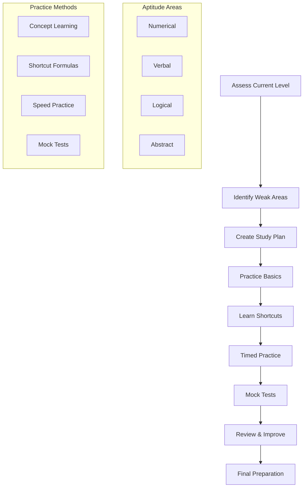
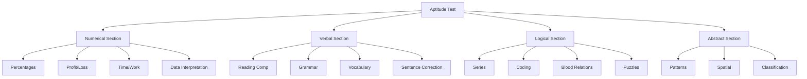
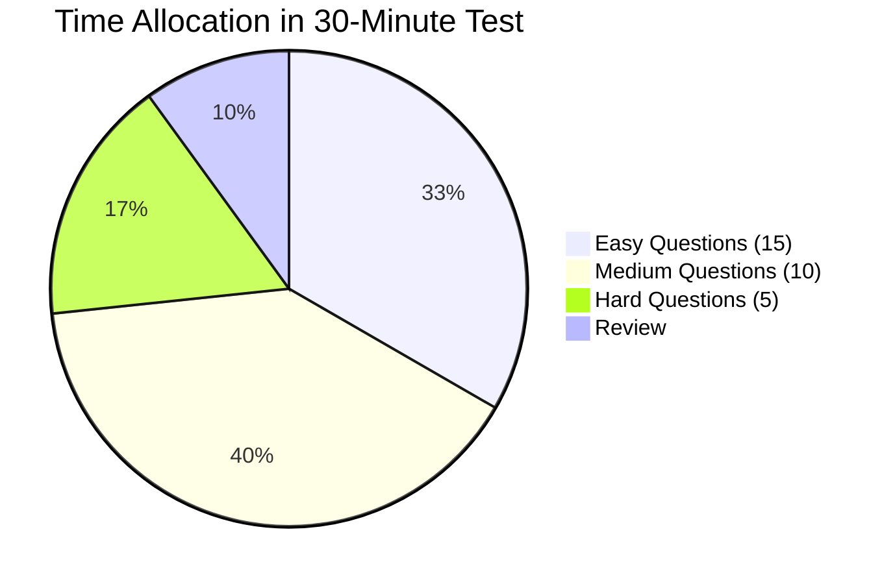
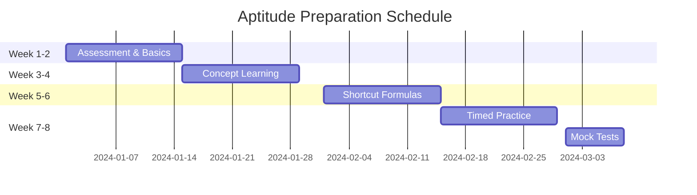
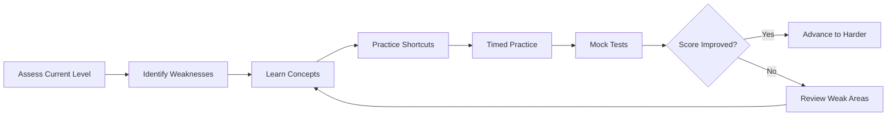

## Introduction

**What is General Aptitude?**
General aptitude refers to the broad set of cognitive abilities and skills that indicate a person's potential to learn, adapt, and perform in various situations. In the context of job interviews, aptitude tests measure numerical reasoning, verbal ability, logical thinking, and problem-solving skills that are fundamental to most professional roles.

**Why Does it Matter for Interviews?**
Aptitude tests matter because:
- They are used by 70%+ of companies as initial screening
- They measure raw cognitive ability, not just learned skills
- They predict job performance across various roles
- They standardize evaluation across candidates
- They test fundamental skills needed in most jobs
- They can compensate for lack of specific experience

**Aptitude Test Categories:**
1. **Numerical Reasoning**: Math, data interpretation, calculations
2. **Verbal Reasoning**: Reading comprehension, grammar, vocabulary
3. **Logical Reasoning**: Pattern recognition, critical thinking
4. **Abstract Reasoning**: Visual patterns, spatial reasoning
5. **Situational Judgment**: Work-related scenarios and decisions

---

## Learning Roadmap

### Mermaid Diagram



### Preparation Timeline

| Phase | Duration | Activities | Goal |
|-------|----------|------------|------|
| Week 1 | 3-4 hours/day | Assess level, identify weak areas | Baseline established |
| Week 2-3 | 4-5 hours/day | Learn concepts and shortcuts | Conceptual clarity |
| Week 4-5 | 4-5 hours/day | Timed practice, speed improvement | Speed development |
| Week 6-7 | 3-4 hours/day | Mock tests, analysis | Test readiness |
| Week 8 | 2-3 hours/day | Final review, weak area focus | Polish skills |
| Test Day | As scheduled | Take actual test | Pass assessment |

---

## Theory Notes

### Numerical Reasoning

**Core Topics:**
1. **Percentages**: Calculating percentages, percentage change, successive percentages
2. **Profit & Loss**: Cost price, selling price, profit/loss percentage, discount
3. **Ratio & Proportion**: Simple ratio, compound ratio, direct/inverse proportion
4. **Time & Work**: Individual work rates, combined work, efficiency
5. **Time & Distance**: Speed, time, distance, relative speed, trains/platforms
6. **Simple & Compound Interest**: Principal, rate, time, compound interest
7. **Averages**: Weighted average, average of averages
8. **Number Systems**: LCM, HCF, divisibility rules, remainders

**Key Formulas to Remember:**
- Percentage change = (New - Old) / Old × 100
- Profit % = (Profit / CP) × 100
- Speed = Distance / Time
- Work = Rate × Time
- SI = P × R × T / 100
- CI = P(1 + R/100)^T - P

### Verbal Reasoning

**Core Areas:**
1. **Reading Comprehension**: Understanding passages, inferring meaning
2. **Grammar**: Tenses, subject-verb agreement, articles, prepositions
3. **Vocabulary**: Synonyms, antonyms, word meanings, context clues
4. **Sentence Correction**: Identifying and fixing grammatical errors
5. **Para Jumbles**: Arranging sentences in logical order
6. **Fill in the Blanks**: Choosing appropriate words

**Grammar Essentials:**
- Subject-verb agreement
- Correct tense usage
- Pronoun-antecedent agreement
- Parallel structure
- Modifier placement
- Commonly confused words

### Logical Reasoning

**Core Types:**
1. **Series Completion**: Number series, letter series, mixed series
2. **Coding-Decoding**: Letter coding, number coding, mixed coding
3. **Blood Relations**: Family tree problems
4. **Direction Sense**: Navigation and direction problems
5. **Syllogisms**: Logical deductions from statements
6. **Puzzles**: Complex logical problems
7. **Seating Arrangements**: Circular/linear arrangements
8. **Inequalities**: Logical inequalities

**Key Approaches:**
- Identify patterns in series
- Create systematic tables for coding
- Draw family trees for blood relations
- Use directional diagrams
- Apply Venn diagrams for syllogisms

### Time Management Strategies

**The 80/20 Rule:**
- Spend 80% time on problems you can solve
- Spend 20% time on challenging problems
- Don't get stuck on any single question

**Time Allocation Framework:**
- For 30 questions in 30 minutes: 1 minute per question
- For 40 questions in 45 minutes: ~1.1 minutes per question
- For 50 questions in 60 minutes: 1.2 minutes per question

**Question Selection Strategy:**
1. Scan all questions first
2. Identify easy/medium/hard problems
3. Start with questions you're confident about
4. Build momentum and confidence
5. Return to harder problems later

---

## Key Concepts

| Concept | Definition | Test Impact |
|---------|------------|-------------|
| Mental Math | Performing calculations without calculator | Speed and accuracy |
| Pattern Recognition | Identifying sequences and规律 | Logical reasoning |
| Time Management | Allocating time efficiently | Maximizing score |
| Process of Elimination | Ruling out wrong answers | Improving accuracy |
| Estimation | Approximating answers quickly | Speed improvement |
| Keyword Analysis | Identifying important information | Reading comprehension |
| Logical Deduction | Drawing conclusions from facts | Problem solving |
| Memory Techniques | Remembering formulas and patterns | Recall speed |
| Stress Management | Handling pressure during test | Maintaining performance |
| Strategic Skipping | Skipping difficult questions | Time optimization |

---

## Frequently Asked Interview Questions

### Beginner Level

1. **Q: What is a general aptitude test?**
   A: A general aptitude test measures cognitive abilities including numerical reasoning, verbal ability, logical thinking, and problem-solving skills. These tests assess your potential to learn and perform in professional roles.

2. **Q: How long should I prepare for an aptitude test?**
   A: For comprehensive preparation, 6-8 weeks of consistent practice (3-4 hours/day) is recommended. This allows time to learn concepts, practice shortcuts, and build speed through timed practice.

3. **Q: What's the most important skill for aptitude tests?**
   A: Time management is the most critical skill. Many candidates know the concepts but fail to complete questions within time limits. Practice solving problems quickly and accurately.

4. **Q: Should I use a calculator during preparation?**
   A: Practice without a calculator to build mental math skills. Most aptitude tests don't allow calculators, and mental math speed is crucial for completing questions on time.

5. **Q: How do I improve my speed?**
   A: Speed improves through: learning shortcut formulas, practicing mental math, solving similar problems repeatedly, and taking timed practice tests. Focus on accuracy first, then speed.

### Intermediate Level

6. **Q: What are the most common aptitude test topics?**
   A: The most common topics are: percentages, profit/loss, ratio/proportion, time/work, time/distance, simple/compound interest, averages, and number systems. Master these and you'll handle most questions.

7. **Q: How do I handle data interpretation questions?**
   A: For DI: Read the question first, identify what data you need, locate relevant charts/tables, perform calculations carefully, and check for common traps. Practice reading graphs quickly.

8. **Q: What's the best way to improve vocabulary?**
   A: Effective vocabulary building includes: reading extensively, learning words in context, using flashcards (Anki), studying root words/prefixes/suffixes, and practicing word games.

9. **Q: How do I improve reading comprehension speed?**
   A: Practice: active reading (underline key points), skimming for main ideas, identifying question types, practicing with timed passages, and reading diverse materials regularly.

10. **Q: Should I guess on questions I don't know?**
    A: Generally yes, if there's no negative marking. If there's negative marking, only guess if you can eliminate at least 2 options. Random guessing is better than leaving questions blank (without negative marking).

### Advanced Level

11. **Q: How do companies use aptitude test scores?**
    A: Companies use scores as initial screening (top 20-30% advance), compare candidates objectively, predict job performance, and sometimes as tie-breakers. Strong scores significantly improve interview chances.

12. **Q: What's the difference between aptitude tests and technical tests?**
    A: Aptitude tests measure general cognitive abilities (math, verbal, logical). Technical tests measure specific job-related skills (coding, domain knowledge). Most hiring processes include both.

13. **Q: How do I handle pressure during timed tests?**
    A: Strategies include: deep breathing before starting, skipping difficult questions initially, positive self-talk, focusing on one question at a time, and maintaining steady pace.

14. **Q: What if I have test anxiety?**
    A: Manage anxiety through: thorough preparation, practice under timed conditions, relaxation techniques, positive visualization, and focusing on effort rather than outcome. Professional help may be needed for severe anxiety.

15. **Q: How do aptitude tests vary by industry?**
    A: Tech companies focus on numerical/logical. Finance emphasizes numerical/analytical. Consulting values verbal/logical. Marketing prioritizes verbal/creative. Research companies emphasize quantitative/logical.

### FAANG Level

16. **Q: How do FAANG companies structure aptitude assessments?**
    A: FAANG companies often combine aptitude with technical tests. Amazon uses numerical/logical reasoning. Google has custom assessments. They typically have 20-40 questions in 30-45 minutes.

17. **Q: What score do I need to pass FAANG aptitude tests?**
    A: Cut-offs vary but typically top 30-40% of candidates advance. FAANG companies can be selective, so aim for 80%+ accuracy. Some companies use absolute thresholds, others relative ranking.

18. **Q: How should I prepare specifically for FAANG aptitude tests?**
    A: Focus on: medium-hard problems, company-specific patterns, speed improvement, and stress management. FAANG tests often have tricky questions designed to differentiate candidates.

19. **Q: Do aptitude test scores matter for experienced professionals?**
    A: Yes, especially for career changers or when switching industries. Strong aptitude scores can compensate for lack of specific experience and demonstrate learning potential.

20. **Q: How do I balance aptitude preparation with technical preparation?**
    A: Prioritize based on the hiring process. If aptitude is first, focus there initially. Once passed, shift to technical preparation. Some preparation (like numerical skills) overlaps with technical tests.

21. **Q: Are online aptitude tests different from in-person?**
    A: The content is similar, but online tests often have stricter time limits, remote proctoring, and may include anti-cheating measures. Practice under similar conditions for best results.

---

## Hands-on Practice

### Exercise 1: Baseline Assessment
Take a 30-question aptitude test and analyze:
1. Score by category (numerical, verbal, logical)
2. Time spent per question
3. Questions skipped
4. Areas of strength/weakness

### Exercise 2: Mental Math Challenge
Practice mental calculations for 15 minutes daily:
1. Multiplication tables (12-20)
2. Square roots
3. Percentage calculations
4. Quick additions/subtractions
Track improvement over 2 weeks.

### Exercise 3: Speed Reading Practice
Practice reading comprehension with time limits:
1. Read passages in 3-4 minutes
2. Answer 5 questions in 3 minutes
3. Practice skimming techniques
4. Track comprehension accuracy

### Exercise 4: Pattern Recognition
Practice series completion problems:
1. Number series (20 problems)
2. Letter series (20 problems)
3. Mixed series (10 problems)
Time yourself and track accuracy.

### Exercise 5: Timed Section Practice
Practice each aptitude section with time limits:
1. Numerical: 20 questions in 20 minutes
2. Verbal: 20 questions in 20 minutes
3. Logical: 20 questions in 20 minutes
Analyze time management in each.

### Exercise 6: Vocabulary Building
Learn 10 new words daily for 2 weeks:
1. Use flashcard apps (Anki)
2. Learn words in context
3. Practice using words in sentences
4. Review and test yourself

### Exercise 7: Data Interpretation Practice
Practice DI sets with various chart types:
1. Bar graphs (5 sets)
2. Line charts (5 sets)
3. Pie charts (5 sets)
4. Tables (5 sets)
Focus on quick data extraction.

### Exercise 8: Mock Test Simulation
Take a full-length aptitude test under exam conditions:
1. Quiet environment
2. Strict time limit
3. No breaks
4. Review all answers afterward
5. Analyze performance patterns

### Exercise 9: Shortcut Formula Practice
Learn and practice 5 shortcut formulas daily:
1. Percentage shortcuts
2. Profit/loss shortcuts
3. Time/work shortcuts
4. Speed/distance shortcuts
5. Interest calculation shortcuts

### Exercise 10: Weak Area Focus
Identify your weakest area and dedicate extra practice:
1. Spend 1 week on focused practice
2. Learn specific techniques for that area
3. Take targeted practice tests
4. Measure improvement

---

## Real FAANG Interview Questions

| Company | Question | Difficulty |
|---------|----------|------------|
| Google | How would you design an aptitude test for software engineers? | Advanced |
| Amazon | What metrics would you track for aptitude test effectiveness? | Intermediate |
| Facebook | How do you ensure aptitude tests are fair across demographics? | Advanced |
| Apple | What role does aptitude testing play in Apple's hiring? | Intermediate |
| Netflix | How would you adapt aptitude tests for creative roles? | Advanced |
| Microsoft | What makes a good numerical reasoning question? | Beginner |
| Google | How would you use AI to improve aptitude testing? | Advanced |
| Amazon | How do aptitude scores correlate with job performance? | Intermediate |
| Facebook, Apple | What innovations would you bring to aptitude testing? | Advanced |
| Microsoft, Google | How do you handle test anxiety in candidates? | Intermediate |
| All FAANG | How would you redesign aptitude testing for remote hiring? | Advanced |
| Google | How do you prevent cheating in online aptitude tests? | Advanced |
| Amazon | What's the ideal aptitude test length and structure? | Intermediate |
| Facebook | How do you balance speed vs. accuracy in aptitude tests? | Advanced |
| Apple, Netflix | How do you make aptitude tests accessible? | Advanced |
| Microsoft | What data would you collect from aptitude tests? | Intermediate |
| Google, Amazon | How do you validate aptitude test questions? | Advanced |
| Facebook | How would you use aptitude tests for career development? | Advanced |
| Apple | What's the future of aptitude testing? | Advanced |
| All FAANG | How do you ensure aptitude tests predict job success? | Expert |

---

## Common Mistakes

| Mistake | Why It's Bad | How to Fix |
|---------|--------------|------------|
| Spending too much time on one question | Miss easier questions | Set time limits, move on if stuck |
| Not practicing under timed conditions | Unprepared for real test | Always practice with time limits |
| Ignoring weak areas | Consistent poor performance | Identify and focus on weaknesses |
| Using calculator during practice | Doesn't build mental math | Practice mental calculations |
| Not reviewing mistakes | Don't learn from errors | Analyze every mistake |
| Cramming last minute | Increased anxiety, poor retention | Spread preparation over weeks |
| Skipping mock tests | Unprepared for test format | Take regular mock tests |
| Poor time management strategy | Run out of time | Allocate time per question |
| Not reading questions carefully | Misunderstand requirements | Read questions thoroughly |
| Panic when stuck | Affects remaining performance | Stay calm, skip and return |
| Ignoring negative marking strategy | Loses points unnecessarily | Guess strategically if negative marking |
| Not getting enough sleep | Reduced cognitive function | Sleep well before test day |

---

## Best Practices

1. **Start Early**: Begin preparation 6-8 weeks before the test
2. **Practice Daily**: Consistent practice beats cramming
3. **Time Yourself**: Always practice under timed conditions
4. **Learn Shortcuts**: Master shortcut formulas for speed
5. **Build Mental Math**: Practice calculations without calculator
6. **Focus on Weaknesses**: Spend extra time on weak areas
7. **Take Mock Tests**: Simulate real test conditions regularly
8. **Review Mistakes**: Analyze errors to avoid repetition
9. **Read Regularly**: Improve verbal skills through reading
10. **Learn Vocabulary**: Build word knowledge systematically
11. **Practice DI**: Master data interpretation with various charts
12. **Manage Stress**: Develop techniques for test anxiety
13. **Get Enough Sleep**: Ensure proper rest before test day
14. **Stay Healthy**: Exercise and nutrition affect cognitive function
15. **Stay Positive**: Maintain confidence in your preparation

---

## Cheat Sheet

```
╔══════════════════════════════════════════════════════════════╗
║                APTITUDE TEST CHEAT SHEET                    ║
╠══════════════════════════════════════════════════════════════╣
║                                                              ║
║  KEY FORMULAS:                                               ║
║  ─────────────────────────────────────────────────────────── ║
║  Percentage Change = (New-Old)/Old × 100                     ║
║  Profit % = (Profit/CP) × 100                               ║
║  Speed = Distance/Time                                       ║
║  Work = Rate × Time                                          ║
║  SI = P×R×T/100                                             ║
║  CI = P(1+R/100)^T - P                                      ║
║  Average = Sum/Count                                         ║
║  Ratio = A:B = A/(A+B)                                      ║
║                                                              ║
║  TIME MANAGEMENT:                                            ║
║  ─────────────────────────────────────────────────────────── ║
║  • 30 questions/30 min → 1 min/question                      ║
║  • 40 questions/45 min → ~1.1 min/question                   ║
║  • 50 questions/60 min → 1.2 min/question                    ║
║  • Skip if stuck > 1.5 min                                   ║
║  • Return to skipped questions at end                        ║
║                                                              ║
║  QUESTION STRATEGY:                                          ║
║  ─────────────────────────────────────────────────────────── ║
║  1. Scan all questions first (2 min)                         ║
║  2. Identify easy/medium/hard                                ║
║  3. Start with easy (build confidence)                       ║
║  4. Tackle medium next                                       ║
║  5. Attempt hard last                                        ║
║  6. Review skipped questions                                 ║
║                                                              ║
║  VERBAL TIPS:                                                ║
║  ─────────────────────────────────────────────────────────── ║
║  • Read questions before passages                            ║
║  • Underline key words                                       ║
║  • Eliminate obviously wrong options                         ║
║  • Don't change answers unless sure                          ║
║                                                              ║
║  LOGICAL TIPS:                                               ║
║  ─────────────────────────────────────────────────────────── ║
║  • Identify patterns immediately                             ║
║  • Use process of elimination                                ║
║  • Draw diagrams for spatial problems                        ║
║  • Test assumptions                                           ║
║                                                              ║
╚══════════════════════════════════════════════════════════════╝
```

---

## Flash Cards

| # | Question | Answer |
|---|----------|--------|
| 1 | What is aptitude testing? | Measures cognitive abilities for job potential |
| 2 | What are the main aptitude areas? | Numerical, verbal, logical, abstract reasoning |
| 3 | How long to prepare? | 6-8 weeks, 3-4 hours/day |
| 4 | What's most important skill? | Time management |
| 5 | Should you use calculator? | No - practice mental math |
| 6 | What if you don't know answer? | Guess if no negative marking |
| 7 | How improve speed? | Shortcut formulas, mental math, practice |
| 8 | What is process of elimination? | Ruling out wrong answers to improve odds |
| 9 | How handle test anxiety? | Preparation, relaxation techniques, practice |
| 10 | What percentage score to aim? | 80%+ for competitive positions |
| 11 | How often take mock tests? | Weekly during preparation |
| 12 | What's DI? | Data Interpretation - reading charts/graphs |
| 13 | How improve vocabulary? | Flashcards, reading, learning in context |
| 14 | What's series completion? | Finding patterns in sequences |
| 15 | How manage time during test? | Allocate per question, skip if stuck |
| 16 | What's negative marking? | Points deducted for wrong answers |
| 17 | How review mistakes? | Analyze why wrong, learn correct approach |
| 18 | What's shortcut formula? | Quick calculation method for common problems |
| 19 | How handle stuck questions? | Skip, return later if time permits |
| 20 | What to do test day? | Sleep well, arrive early, stay calm |

---

## Mind Map

```
Aptitude Preparation
├── Numerical Reasoning
│   ├── Percentages
│   ├── Profit & Loss
│   ├── Ratio & Proportion
│   ├── Time & Work
│   ├── Time & Distance
│   ├── Interest (SI/CI)
│   ├── Averages
│   └── Number Systems
├── Verbal Reasoning
│   ├── Reading Comprehension
│   ├── Grammar
│   ├── Vocabulary
│   ├── Sentence Correction
│   ├── Para Jumbles
│   └── Fill in Blanks
├── Logical Reasoning
│   ├── Series Completion
│   ├── Coding-Decoding
│   ├── Blood Relations
│   ├── Direction Sense
│   ├── Syllogisms
│   ├── Puzzles
│   └── Seating Arrangements
├── Test Strategies
│   ├── Time Management
│   ├── Question Selection
│   ├── Process of Elimination
│   └── Stress Management
└── Preparation Methods
    ├── Concept Learning
    ├── Shortcut Formulas
    ├── Timed Practice
    └── Mock Tests
```

---

## Mermaid Diagrams

### Aptitude Test Structure



### Time Management Strategy



### Preparation Progress



### Improvement Flow



---

## Code Examples

### Python: Aptitude Problem Generator

```python
import random
from typing import List, Tuple, Dict
from dataclasses import dataclass
from enum import Enum

class Difficulty(Enum):
    EASY = "easy"
    MEDIUM = "medium"
    HARD = "hard"

class AptitudeCategory(Enum):
    NUMERICAL = "numerical"
    VERBAL = "verbal"
    LOGICAL = "logical"

@dataclass
class AptitudeQuestion:
    category: AptitudeCategory
    difficulty: Difficulty
    question: str
    options: List[str]
    correct_answer: str
    explanation: str

class AptitudeGenerator:
    def __init__(self):
        self.question_count = 0
    
    def generate_percentage_question(self, difficulty: Difficulty) -> AptitudeQuestion:
        if difficulty == Difficulty.EASY:
            x = random.randint(10, 100)
            y = random.randint(10, 50)
            question = f"What is {y}% of {x}?"
            answer = str(int(x * y / 100))
            explanation = f"{y}% of {x} = {x} × {y}/100 = {answer}"
        elif difficulty == Difficulty.MEDIUM:
            x = random.randint(100, 1000)
            increase = random.randint(10, 50)
            question = f"A number is increased by {increase}%. If the original number is {x}, what is the new number?"
            answer = str(int(x * (1 + increase/100)))
            explanation = f"New number = {x} × (1 + {increase}/100) = {answer}"
        else:
            x = random.randint(100, 1000)
            increase = random.randint(10, 50)
            decrease = random.randint(10, 30)
            question = f"A number is increased by {increase}% and then decreased by {decrease}%. If the original number is {x}, what is the final number?"
            answer = str(int(x * (1 + increase/100) * (1 - decrease/100)))
            explanation = f"Final = {x} × {1 + increase/100} × {1 - decrease/100} = {answer}"
        
        options = self._generate_options(answer, difficulty)
        
        return AptitudeQuestion(
            category=AptitudeCategory.NUMERICAL,
            difficulty=difficulty,
            question=question,
            options=options,
            correct_answer=answer,
            explanation=explanation
        )
    
    def generate_profit_loss_question(self, difficulty: Difficulty) -> AptitudeQuestion:
        if difficulty == Difficulty.EASY:
            cp = random.randint(100, 1000)
            profit_percent = random.randint(5, 50)
            question = f"If the cost price is ${cp} and profit is {profit_percent}%, what is the selling price?"
            answer = str(int(cp * (1 + profit_percent/100)))
            explanation = f"SP = {cp} × (1 + {profit_percent}/100) = {answer}"
        elif difficulty == Difficulty.MEDIUM:
            sp = random.randint(100, 1000)
            loss_percent = random.randint(5, 30)
            question = f"If the selling price is ${sp} and there is a loss of {loss_percent}%, what is the cost price?"
            answer = str(int(sp / (1 - loss_percent/100)))
            explanation = f"CP = {sp} / (1 - {loss_percent}/100) = {answer}"
        else:
            cp = random.randint(100, 1000)
            markup = random.randint(20, 50)
            discount = random.randint(10, 30)
            question = f"A product costing ${cp} is marked up by {markup}% and then discounted by {discount}%. What is the final price?"
            answer = str(int(cp * (1 + markup/100) * (1 - discount/100)))
            explanation = f"Final = {cp} × {1 + markup/100} × {1 - discount/100} = {answer}"
        
        options = self._generate_options(answer, difficulty)
        
        return AptitudeQuestion(
            category=AptitudeCategory.NUMERICAL,
            difficulty=difficulty,
            question=question,
            options=options,
            correct_answer=answer,
            explanation=explanation
        )
    
    def generate_time_work_question(self, difficulty: Difficulty) -> AptitudeQuestion:
        if difficulty == Difficulty.EASY:
            a_days = random.randint(2, 10)
            b_days = random.randint(2, 10)
            question = f"If A can do a work in {a_days} days and B can do it in {b_days} days, how many days will they take together?"
            answer = f"{a_days * b_days / (a_days + b_days):.1f}"
            explanation = f"Combined rate = 1/{a_days} + 1/{b_days} = {a_days + b_days}/{a_days * b_days}. Days = {a_days * b_days}/{a_days + b_days} = {answer}"
        elif difficulty == Difficulty.MEDIUM:
            a_days = random.randint(2, 10)
            b_days = random.randint(2, 10)
            c_days = random.randint(2, 10)
            question = f"If A, B, and C can do a work in {a_days}, {b_days}, and {c_days} days respectively, how long will they take together?"
            answer = f"{1 / (1/a_days + 1/b_days + 1/c_days):.1f}"
            explanation = f"Combined rate = 1/{a_days} + 1/{b_days} + 1/{c_days}. Days = 1/rate = {answer}"
        else:
            a_days = random.randint(2, 10)
            b_days = random.randint(2, 10)
            days_worked = random.randint(2, 5)
            question = f"A can do work in {a_days} days, B in {b_days} days. They start together, but A leaves after {days_worked} days. How many more days will B take?"
            work_done = days_worked * (1/a_days + 1/b_days)
            remaining = 1 - work_done
            answer = f"{remaining / (1/b_days):.1f}"
            explanation = f"Work done in {days_worked} days = {work_done:.2f}. Remaining = {remaining:.2f}. B takes {answer} more days"
        
        options = self._generate_options(answer, difficulty)
        
        return AptitudeQuestion(
            category=AptitudeCategory.NUMERICAL,
            difficulty=difficulty,
            question=question,
            options=options,
            correct_answer=answer,
            explanation=explanation
        )
    
    def generate_series_question(self, difficulty: Difficulty) -> AptitudeQuestion:
        if difficulty == Difficulty.EASY:
            start = random.randint(1, 10)
            diff = random.randint(2, 5)
            series = [start + i * diff for i in range(5)]
            question = f"What comes next in the series: {', '.join(map(str, series))}, ?"
            answer = str(start + 5 * diff)
            explanation = f"Arithmetic series with common difference {diff}"
        elif difficulty == Difficulty.MEDIUM:
            start = random.randint(1, 5)
            ratio = random.randint(2, 3)
            series = [start * ratio ** i for i in range(5)]
            question = f"What comes next in the series: {', '.join(map(str, series))}, ?"
            answer = str(start * ratio ** 5)
            explanation = f"Geometric series with common ratio {ratio}"
        else:
            # Fibonacci-like
            a, b = random.randint(1, 5), random.randint(1, 5)
            series = [a, b]
            for _ in range(4):
                series.append(series[-1] + series[-2])
            question = f"What comes next in the series: {', '.join(map(str, series))}, ?"
            answer = str(series[-1] + series[-2])
            explanation = f"Each number is sum of previous two numbers"
        
        options = self._generate_options(answer, difficulty)
        
        return AptitudeQuestion(
            category=AptitudeCategory.LOGICAL,
            difficulty=difficulty,
            question=question,
            options=options,
            correct_answer=answer,
            explanation=explanation
        )
    
    def _generate_options(self, correct: str, difficulty: Difficulty) -> List[str]:
        try:
            correct_num = float(correct)
        except:
            return [correct, "None of these", "Cannot be determined", "Data insufficient"]
        
        options = [correct]
        while len(options) < 4:
            if difficulty == Difficulty.EASY:
                offset = random.randint(1, 5) * random.choice([-1, 1])
            elif difficulty == Difficulty.MEDIUM:
                offset = random.randint(5, 15) * random.choice([-1, 1])
            else:
                offset = random.randint(10, 30) * random.choice([-1, 1])
            
            new_option = str(int(correct_num + offset))
            if new_option not in options and new_option != "0":
                options.append(new_option)
        
        random.shuffle(options)
        return options
    
    def generate_test(self, num_questions: int = 30) -> List[AptitudeQuestion]:
        questions = []
        
        # Distribution: 40% easy, 40% medium, 20% hard
        for i in range(num_questions):
            if i < num_questions * 0.4:
                difficulty = Difficulty.EASY
            elif i < num_questions * 0.8:
                difficulty = Difficulty.MEDIUM
            else:
                difficulty = Difficulty.HARD
            
            # Mix of categories
            if i % 3 == 0:
                questions.append(self.generate_percentage_question(difficulty))
            elif i % 3 == 1:
                questions.append(self.generate_profit_loss_question(difficulty))
            else:
                questions.append(self.generate_series_question(difficulty))
        
        return questions


# Example usage
if __name__ == "__main__":
    generator = AptitudeGenerator()
    
    # Generate a test
    test = generator.generate_test(10)
    
    print("=" * 63)
    print("APTITUDE TEST")
    print("=" * 63)
    
    for i, q in enumerate(test, 1):
        print(f"\n{i}. {q.question}")
        for j, option in enumerate(q.options, 1):
            print(f"   {chr(64+j)}. {option}")
        print(f"   Answer: {q.correct_answer}")
        print(f"   Explanation: {q.explanation}")
```

### JavaScript: Aptitude Practice App

```javascript
class AptitudePractice {
    constructor() {
        this.questions = [];
        this.score = 0;
        this.total = 0;
        this.timeSpent = 0;
        this.startTime = null;
    }

    generateQuestion(type) {
        switch(type) {
            case 'percentage':
                return this.generatePercentageQuestion();
            case 'profit_loss':
                return this.generateProfitLossQuestion();
            case 'time_work':
                return this.generateTimeWorkQuestion();
            case 'series':
                return this.generateSeriesQuestion();
            default:
                return this.generatePercentageQuestion();
        }
    }

    generatePercentageQuestion() {
        const base = Math.floor(Math.random() * 90) + 10;
        const percent = Math.floor(Math.random() * 40) + 10;
        const answer = Math.round(base * percent / 100);
        
        return {
            question: `What is ${percent}% of ${base}?`,
            options: this.generateOptions(answer),
            correct: answer.toString(),
            explanation: `${percent}% of ${base} = ${base} × ${percent}/100 = ${answer}`
        };
    }

    generateProfitLossQuestion() {
        const cp = Math.floor(Math.random() * 900) + 100;
        const percent = Math.floor(Math.random() * 40) + 10;
        const isProfit = Math.random() > 0.5;
        const answer = isProfit 
            ? Math.round(cp * (1 + percent/100))
            : Math.round(cp * (1 - percent/100));
        
        return {
            question: `A product costs $${cp}. ${isProfit ? 'Profit' : 'Loss'} is ${percent}%. Selling price?`,
            options: this.generateOptions(answer),
            correct: answer.toString(),
            explanation: `SP = ${cp} × (1 ${isProfit ? '+' : '-'} ${percent}/100) = ${answer}`
        };
    }

    generateTimeWorkQuestion() {
        const a = Math.floor(Math.random() * 8) + 2;
        const b = Math.floor(Math.random() * 8) + 2;
        const answer = (a * b / (a + b)).toFixed(1);
        
        return {
            question: `A completes work in ${a} days, B in ${b} days. Together?`,
            options: this.generateOptions(parseFloat(answer)),
            correct: answer,
            explanation: `Combined rate = 1/${a} + 1/${b} = ${(a+b)/(a*b)}. Days = ${answer}`
        };
    }

    generateSeriesQuestion() {
        const start = Math.floor(Math.random() * 5) + 1;
        const diff = Math.floor(Math.random() * 4) + 2;
        const series = Array.from({length: 5}, (_, i) => start + i * diff);
        const answer = start + 5 * diff;
        
        return {
            question: `Next in series: ${series.join(', ')}, ?`,
            options: this.generateOptions(answer),
            correct: answer.toString(),
            explanation: `Arithmetic series with difference ${diff}`
        };
    }

    generateOptions(correct) {
        const options = new Set([correct]);
        while (options.size < 4) {
            const offset = Math.floor(Math.random() * 20) - 10;
            const newOption = correct + offset;
            if (newOption > 0 && newOption !== correct) {
                options.add(newOption);
            }
        }
        return Array.from(options).sort(() => Math.random() - 0.5).map(String);
    }

    startPractice(numQuestions = 10) {
        this.questions = [];
        this.score = 0;
        this.total = numQuestions;
        this.startTime = Date.now();
        
        const types = ['percentage', 'profit_loss', 'time_work', 'series'];
        for (let i = 0; i < numQuestions; i++) {
            const type = types[i % types.length];
            this.questions.push(this.generateQuestion(type));
        }
        
        return this.questions;
    }

    submitAnswer(questionIndex, answer) {
        const question = this.questions[questionIndex];
        const isCorrect = answer === question.correct;
        
        if (isCorrect) {
            this.score++;
        }
        
        return {
            isCorrect,
            correctAnswer: question.correct,
            explanation: question.explanation
        };
    }

    finishPractice() {
        this.timeSpent = Date.now() - this.startTime;
        
        return {
            score: this.score,
            total: this.total,
            percentage: (this.score / this.total) * 100,
            timeSpent: this.timeSpent,
            averageTimePerQuestion: this.timeSpent / this.total
        };
    }

    generateReport() {
        const results = this.finishPractice();
        
        return `
═══════════════════════════════════════════════════════════════
                    PRACTICE RESULTS
═══════════════════════════════════════════════════════════════

SCORE
───────────────────────────────────────────────────────────────
Correct: ${results.score}/${results.total}
Percentage: ${results.percentage.toFixed(1)}%

TIME ANALYSIS
───────────────────────────────────────────────────────────────
Total Time: ${(results.timeSpent / 1000).toFixed(1)} seconds
Average Time per Question: ${(results.averageTimePerQuestion / 1000).toFixed(1)} seconds

PERFORMANCE RATING
───────────────────────────────────────────────────────────────
${results.percentage >= 80 ? 'Excellent! You\'re well prepared.' : 
  results.percentage >= 60 ? 'Good progress. Keep practicing.' : 
  'Needs improvement. Focus on weak areas.'}
`;
    }
}

// Usage example
const practice = new AptitudePractice();
const questions = practice.startPractice(10);

console.log("Practice Questions:");
questions.forEach((q, i) => {
    console.log(`\n${i + 1}. ${q.question}`);
    console.log(`Options: ${q.options.join(', ')}`);
});

// Simulate answering
questions.forEach((q, i) => {
    const userAnswer = q.options[0]; // Just pick first option
    const result = practice.submitAnswer(i, userAnswer);
    console.log(`\nQ${i + 1}: ${result.isCorrect ? 'Correct' : 'Incorrect'}`);
});

console.log(practice.generateReport());
```

### Python: Aptitude Study Planner

```python
from typing import Dict, List
from dataclasses import dataclass
from datetime import datetime, timedelta

@dataclass
class StudySession:
    topic: str
    duration_minutes: int
    focus_area: str
    difficulty: str

class AptitudeStudyPlanner:
    def __init__(self):
        self.topics = {
            'numerical': [
                'percentages', 'profit_loss', 'ratio_proportion',
                'time_work', 'time_distance', 'interest', 'averages', 'number_systems'
            ],
            'verbal': [
                'reading_comprehension', 'grammar', 'vocabulary',
                'sentence_correction', 'para_jumbles', 'fill_blanks'
            ],
            'logical': [
                'series', 'coding_decoding', 'blood_relations',
                'direction_sense', 'syllogisms', 'puzzles', 'seating'
            ]
        }
        
        self.daily_hours = 4
        self.preparation_weeks = 8
    
    def create_study_plan(self, weak_areas: List[str] = None) -> List[Dict]:
        plan = []
        start_date = datetime.now()
        
        # Week 1-2: Basics
        for day in range(14):
            date = start_date + timedelta(days=day)
            sessions = self._generate_basic_sessions(day % 3)
            plan.append({
                'date': date.strftime('%Y-%m-%d'),
                'week': day // 7 + 1,
                'phase': 'Basics',
                'sessions': sessions
            })
        
        # Week 3-4: Intermediate
        for day in range(14, 28):
            date = start_date + timedelta(days=day)
            sessions = self._generate_intermediate_sessions(day % 3)
            plan.append({
                'date': date.strftime('%Y-%m-%d'),
                'week': day // 7 + 1,
                'phase': 'Intermediate',
                'sessions': sessions
            })
        
        # Week 5-6: Advanced
        for day in range(28, 42):
            date = start_date + timedelta(days=day)
            sessions = self._generate_advanced_sessions(day % 3)
            plan.append({
                'date': date.strftime('%Y-%m-%d'),
                'week': day // 7 + 1,
                'phase': 'Advanced',
                'sessions': sessions
            })
        
        # Week 7-8: Mock Tests
        for day in range(42, 56):
            date = start_date + timedelta(days=day)
            sessions = self._generate_mock_sessions(day % 2 == 0)
            plan.append({
                'date': date.strftime('%Y-%m-%d'),
                'week': day // 7 + 1,
                'phase': 'Mock Tests',
                'sessions': sessions
            })
        
        return plan
    
    def _generate_basic_sessions(self, focus: int) -> List[StudySession]:
        sessions = []
        
        if focus == 0:  # Numerical
            sessions.append(StudySession('percentages', 60, 'concepts', 'easy'))
            sessions.append(StudySession('profit_loss', 60, 'concepts', 'easy'))
            sessions.append(StudySession('mental_math', 30, 'speed', 'easy'))
        elif focus == 1:  # Verbal
            sessions.append(StudySession('vocabulary', 45, 'learning', 'easy'))
            sessions.append(StudySession('grammar_basics', 60, 'concepts', 'easy'))
            sessions.append(StudySession('reading_practice', 45, 'practice', 'easy'))
        else:  # Logical
            sessions.append(StudySession('series', 60, 'concepts', 'easy'))
            sessions.append(StudySession('coding_decoding', 60, 'concepts', 'easy'))
            sessions.append(StudySession('pattern_practice', 30, 'practice', 'easy'))
        
        return sessions
    
    def _generate_intermediate_sessions(self, focus: int) -> List[StudySession]:
        sessions = []
        
        if focus == 0:
            sessions.append(StudySession('ratio_proportion', 60, 'concepts', 'medium'))
            sessions.append(StudySession('time_work', 60, 'concepts', 'medium'))
            sessions.append(StudySession('shortcut_formulas', 30, 'speed', 'medium'))
        elif focus == 1:
            sessions.append(StudySession('reading_comprehension', 60, 'practice', 'medium'))
            sessions.append(StudySession('sentence_correction', 45, 'practice', 'medium'))
            sessions.append(StudySession('para_jumbles', 45, 'practice', 'medium'))
        else:
            sessions.append(StudySession('blood_relations', 60, 'concepts', 'medium'))
            sessions.append(StudySession('direction_sense', 60, 'concepts', 'medium'))
            sessions.append(StudySession('syllogisms', 45, 'concepts', 'medium'))
        
        return sessions
    
    def _generate_advanced_sessions(self, focus: int) -> List[StudySession]:
        sessions = []
        
        if focus == 0:
            sessions.append(StudySession('time_distance', 60, 'concepts', 'hard'))
            sessions.append(StudySession('data_interpretation', 90, 'practice', 'hard'))
            sessions.append(StudySession('speed_practice', 30, 'speed', 'hard'))
        elif focus == 1:
            sessions.append(StudySession('advanced_grammar', 60, 'concepts', 'hard'))
            sessions.append(StudySession('critical_reasoning', 60, 'practice', 'hard'))
            sessions.append(StudySession('vocabulary_advanced', 30, 'learning', 'hard'))
        else:
            sessions.append(StudySession('complex_puzzles', 90, 'practice', 'hard'))
            sessions.append(StudySession('seating_arrangements', 60, 'practice', 'hard'))
            sessions.append(StudySession('inequalities', 45, 'concepts', 'hard'))
        
        return sessions
    
    def _generate_mock_sessions(self, is_full_test: bool) -> List[StudySession]:
        if is_full_test:
            return [
                StudySession('full_mock_test', 120, 'mock', 'mixed'),
                StudySession('test_analysis', 60, 'review', 'mixed')
            ]
        else:
            return [
                StudySession('timed_practice', 60, 'speed', 'mixed'),
                StudySession('weak_area_focus', 60, 'practice', 'mixed')
            ]
    
    def generate_weekly_schedule(self) -> str:
        schedule = """
═══════════════════════════════════════════════════════════════
                    WEEKLY STUDY SCHEDULE
═══════════════════════════════════════════════════════════════

WEEKLY OVERVIEW
───────────────────────────────────────────────────────────────
Total Study Hours: 28 hours (4 hours/day)
Focus Areas: Numerical, Verbal, Logical
Practice: Daily problems + Weekly mock tests

DAILY SCHEDULE
───────────────────────────────────────────────────────────────
Morning (2 hours): Concept learning
  • 30 min: Review previous day
  • 60 min: New concept/practice
  • 30 min: Shortcut formulas

Afternoon (2 hours): Practice
  • 30 min: Timed problems
  • 60 min: Topic-specific practice
  • 30 min: Review mistakes

Weekly Plan
───────────────────────────────────────────────────────────────"""
        
        days = ['Monday', 'Tuesday', 'Wednesday', 'Thursday', 'Friday', 'Saturday', 'Sunday']
        focuses = [
            ('Numerical - Percentages', 'Numerical - Profit/Loss'),
            ('Verbal - Vocabulary', 'Verbal - Grammar'),
            ('Logical - Series', 'Logical - Coding'),
            ('Numerical - Time/Work', 'Numerical - Time/Distance'),
            ('Verbal - Reading Comp', 'Verbal - Sentence Correction'),
            ('Mock Test', 'Review & Analysis'),
            ('Weak Area Focus', 'Rest & Light Review')
        ]
        
        for day, (morning, afternoon) in zip(days, focuses):
            schedule += f"\n{day}:"
            schedule += f"\n  Morning: {morning}"
            schedule += f"\n  Afternoon: {afternoon}"
        
        return schedule
    
    def get_daily_tasks(self, week: int, day: int) -> List[str]:
        tasks = {
            1: ['Learn percentage basics', 'Practice 10 percentage problems', 'Learn 5 new words'],
            2: ['Practice 15 percentage problems', 'Learn profit/loss basics', 'Read 1 article'],
            3: ['Practice 10 profit/loss problems', 'Learn series basics', 'Practice grammar'],
            4: ['Timed practice: 20 questions', 'Review mistakes', 'Learn new vocabulary'],
            5: ['Learn ratio/proportion', 'Practice coding problems', 'Reading comprehension'],
            6: ['Full mock test', 'Analyze performance', 'Plan improvements'],
            7: ['Light review', 'Rest', 'Prepare for next week']
        }
        
        return tasks.get(day, ['General practice', 'Review weak areas', 'Learn new concepts'])


# Example usage
planner = AptitudeStudyPlanner()

# Generate study plan
plan = planner.create_study_plan()

# Print weekly schedule
print(planner.generate_weekly_schedule())

# Get daily tasks for week 1, day 1
print("\nDay 1 Tasks:")
for task in planner.get_daily_tasks(1, 1):
    print(f"  • {task}")
```

---

## Mini Project: Aptitude Practice App

Build a web application for aptitude practice:

**Features:**
- Question bank by category and difficulty
- Timer and progress tracking
- Score analysis and reporting
- Daily practice reminders
- Performance trends

**Tech Stack:**
- React frontend
- Node.js backend
- Question database
- Analytics dashboard

---

## Intermediate Project: Aptitude Test Simulator

Build a tool that simulates real aptitude tests:

**Features:**
- Realistic test interface
- Multiple question types
- Time limits and scoring
- Detailed performance reports
- Company-specific test formats

**Tech Stack:**
- React frontend
- Python backend
- Question generation algorithm
- PDF report generation

---

## Advanced Project: AI Aptitude Coach

Build an AI-powered aptitude preparation tool:

**Features:**
- Personalized study plans
- Adaptive difficulty
- Real-time feedback
- Performance prediction
- Weakness analysis

**Tech Stack:**
- Python (FastAPI)
- ML for recommendation
- React frontend
- Analytics engine

---

## Project Ideas Table

| # | Project | Difficulty | Skills Practiced | Time Estimate |
|---|---------|------------|------------------|---------------|
| 1 | Aptitude Question Bank | Beginner | Content creation, database | 1 week |
| 2 | Timer App for Practice | Beginner | JavaScript, timers | 4-6 hours |
| 3 | Score Tracker | Intermediate | React, data visualization | 1-2 weeks |
| 4 | Mock Test Platform | Intermediate | Full-stack development | 2-3 weeks |
| 5 | Performance Analytics | Intermediate | Data analysis, charts | 1-2 weeks |
| 6 | Question Generator | Advanced | Algorithms, content generation | 2-3 weeks |
| 7 | Adaptive Practice System | Advanced | ML, recommendation | 3-4 weeks |
| 8 | Test Simulator | Advanced | Full-stack, PDF generation | 3-4 weeks |
| 9 | AI Study Planner | Expert | ML, scheduling algorithms | 4-6 weeks |
| 10 | Complete Learning Platform | Expert | Full-stack, AI, analytics | 8-10 weeks |

---

## Resources

### Practice Websites

| Website | Purpose | URL |
|---------|---------|-----|
| IndiaBIX | Comprehensive aptitude practice | indiabix.com |
| Smartkeeda | Aptitude and logical reasoning | smartkeeda.com |
| Testbook | Government exam preparation | testbook.com |
| PrepInsta | Company-specific preparation | prepinsta.com |
| facePrep | Interview preparation | faceprep.in |

### Books

| Book | Author | Focus |
|------|--------|-------|
| "Quantitative Aptitude" | R.S. Aggarwal | Complete quant guide |
| "Verbal Ability" | R.S. Aggarwal | English language skills |
| "Logical Reasoning" | R.S. Aggarwal | Reasoning patterns |
| "Aptitude Test" | Jim Barrett | Test preparation |
| "How to Pass Aptitude Tests" | Rob Williams | Test strategies |

### Online Courses

| Course | Platform | Focus |
|--------|----------|-------|
| Quantitative Aptitude | Unacademy | Complete quant course |
| Logical Reasoning | Adda247 | Reasoning patterns |
| Verbal Ability | Gradeup | English skills |
| Aptitude Mastery | Udemy | Comprehensive preparation |

### YouTube Channels

| Channel | Content |
|---------|---------|
| Adda247 | Aptitude tutorials |
| Study IQ | Government exam prep |
| Unacademy | Comprehensive courses |
| Gradeup | Practice problems |

---

## Checklist

### Basics
- [ ] Learn key formulas for all topics
- [ ] Practice mental math daily
- [ ] Build vocabulary systematically
- [ ] Learn logical reasoning patterns
- [ ] Understand test format

### Practice
- [ ] Solve 10 problems daily minimum
- [ ] Practice under timed conditions
- [ ] Take weekly mock tests
- [ ] Review all mistakes
- [ ] Track improvement over time

### Test Day
- [ ] Sleep well previous night
- [ ] Arrive early
- [ ] Read instructions carefully
- [ ] Manage time effectively
- [ ] Stay calm and focused

### Continuous Improvement
- [ ] Identify weak areas
- [ ] Focus extra practice on weaknesses
- [ ] Learn shortcut formulas
- [ ] Build speed through practice
- [ ] Maintain consistency

---

## Revision Notes

### Key Formulas
- Percentage change = (New-Old)/Old × 100
- Profit % = (Profit/CP) × 100
- Speed = Distance/Time
- Work = Rate × Time
- SI = P×R×T/100
- CI = P(1+R/100)^T - P

### Time Management
- 30 questions/30 min → 1 min/question
- Skip if stuck > 1.5 min
- Start with easy questions
- Review skipped questions

### Test Strategy
1. Scan all questions
2. Identify difficulty levels
3. Start with confident questions
4. Build momentum
5. Return to hard questions

### One-Day Review
- Morning: Key formulas (1 hour)
- Afternoon: Practice problems (2 hours)
- Evening: Light review, relax (1 hour)

### One-Week Plan
- Days 1-2: Formula review
- Days 3-4: Topic practice
- Days 5-6: Mock tests
- Day 7: Final review

---

## Mock Interview Questions

### Aptitude Strategy Questions

1. "How do you prepare for aptitude tests?"

2. "What's your approach to timed assessments?"

3. "How do you manage time during tests?"

4. "What do you do when you encounter a difficult question?"

5. "How do you handle test anxiety?"

### Technical Questions About Aptitude

6. "What makes a good aptitude test question?"

7. "How would you design an aptitude assessment?"

8. "What metrics would you use to evaluate aptitude?"

9. "How do aptitude tests predict job performance?"

10. "What improvements would you make to aptitude testing?"

### Behavioral Questions

11. "Tell me about a time you performed well under pressure."

12. "How do you handle failure in assessments?"

13. "Describe your preparation strategy for tests."

14. "How do you improve your weak areas?"

15. "What's the most challenging aptitude topic for you?"

---

## Difficulty Rating

| Task | Time Required | Difficulty | Impact |
|------|---------------|------------|--------|
| Learn basic formulas | 1-2 weeks | Easy | High |
| Practice mental math | 2-3 weeks | Medium | High |
| Build vocabulary | 4-6 weeks | Medium | Medium |
| Master logical reasoning | 3-4 weeks | Medium | High |
| Take mock tests | 2-3 weeks | Medium | Very High |
| Achieve 80%+ score | 6-8 weeks | Hard | Very High |

---

## Summary

General aptitude tests are a critical first step in the hiring process, used by 70%+ of companies as initial screening. Success requires:

1. **Conceptual clarity** - Master fundamental concepts
2. **Shortcut formulas** - Learn quick calculation methods
3. **Speed practice** - Build mental math and quick thinking
4. **Time management** - Allocate time wisely during tests
5. **Regular practice** - Consistent daily practice beats cramming

**Key Takeaway**: Aptitude preparation is about building cognitive skills that improve over time with consistent practice. Focus on fundamentals, practice under timed conditions, and learn from your mistakes. With 6-8 weeks of dedicated preparation, you can significantly improve your aptitude test performance.

