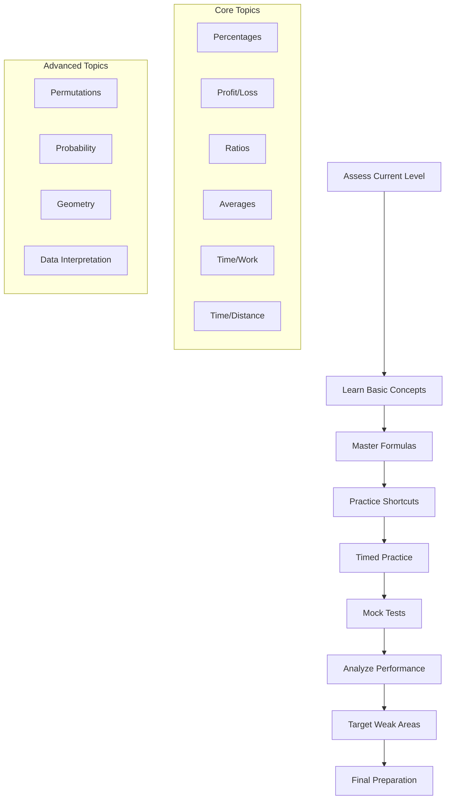
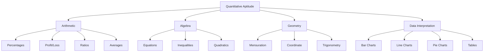
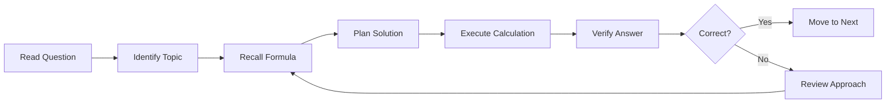
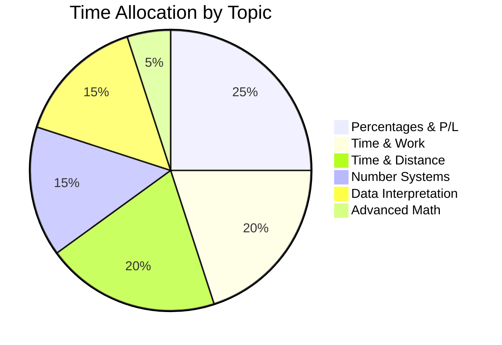
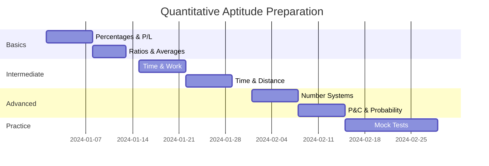

## Introduction

**What is Quantitative Aptitude?**
Quantitative aptitude refers to the ability to understand and work with numerical information, mathematical concepts, and data analysis. It encompasses a wide range of mathematical topics including arithmetic, algebra, geometry, data interpretation, and advanced mathematics used in problem-solving.

**Why Does it Matter for Interviews?**
Quantitative aptitude matters because:
- It's a core component of most aptitude tests
- It measures analytical and logical thinking abilities
- It's essential for roles in finance, consulting, and technology
- Companies use it to screen candidates objectively
- Strong quant skills indicate problem-solving capability
- It's often the first filter in hiring processes

**Key Areas of Quantitative Aptitude:**
1. **Arithmetic**: Percentages, profit/loss, ratios, averages
2. **Algebra**: Equations, inequalities, quadratics
3. **Geometry**: Mensuration, coordinate geometry
4. **Data Interpretation**: Charts, graphs, tables
5. **Number Systems**: LCM, HCF, divisibility
6. **Modern Math**: Permutations, combinations, probability

---

## Learning Roadmap

### Mermaid Diagram



### Topic-wise Timeline

| Topic | Days Required | Difficulty | Importance |
|-------|---------------|------------|------------|
| Percentages | 3-4 days | Easy | Very High |
| Profit & Loss | 3-4 days | Easy | High |
| Ratio & Proportion | 2-3 days | Easy | High |
| Averages | 2-3 days | Easy | Medium |
| Time & Work | 4-5 days | Medium | Very High |
| Time & Distance | 4-5 days | Medium | Very High |
| Interest (SI/CI) | 3-4 days | Medium | High |
| Number Systems | 5-6 days | Medium | High |
| Permutations | 4-5 days | Hard | Medium |
| Probability | 3-4 days | Hard | Medium |
| Geometry | 5-6 days | Hard | Medium |
| Data Interpretation | 4-5 days | Medium | Very High |

---

## Theory Notes

### Percentages

**Basic Concepts:**
- Percentage means "per hundred"
- x% of y = (x/100) × y
- y% of x = (y/100) × x (same result)
- To express a/b as percentage: (a/b) × 100

**Key Formulas:**
1. Percentage change = (New Value - Old Value) / Old Value × 100
2. If A is x% more than B, then B is [100x/(100+x)]% less than A
3. If A is x% less than B, then B is [100x/(100-x)]% more than A
4. Successive percentage change: x + y + xy/100

**Successive Percentage Changes:**
- If a value changes by x% and then by y%, the net change is:
  x + y + (x × y)/100

**Example:** If a price increases by 20% and then decreases by 10%:
Net change = 20 - 10 + (20 × (-10))/100 = 10 - 2 = 8% increase

### Profit and Loss

**Basic Terms:**
- Cost Price (CP): Price at which article is bought
- Selling Price (SP): Price at which article is sold
- Profit = SP - CP (when SP > CP)
- Loss = CP - SP (when CP > SP)

**Key Formulas:**
1. Profit % = (Profit/CP) × 100
2. Loss % = (Loss/CP) × 100
3. SP = CP × (1 + Profit%/100)
4. SP = CP × (1 - Loss%/100)
5. CP = SP × (100/(100 + Profit%))
6. CP = SP × (100/(100 - Loss%))

**Discount:**
- Discount = Marked Price (MP) - Selling Price (SP)
- Discount % = (Discount/MP) × 100
- SP = MP × (1 - Discount%/100)

**Marked Price and Discount:**
- If an article is marked x% above CP and sold at y% discount:
  Profit/Loss % = x - y - (x × y)/100

### Ratio and Proportion

**Basic Concepts:**
- Ratio: Comparison of two quantities (a:b)
- Proportion: Equality of two ratios (a:b = c:d)
- Continued proportion: a:b = b:c

**Key Properties:**
1. If a:b = c:d, then a × d = b × c (cross multiplication)
2. If a:b = c:d = e:f, then (a+c+e):(b+d+f) = a:b
3. Componendo: (a+b)/b = (c+d)/d
4. Dividendo: (a-b)/b = (c-d)/d
5. Componendo and Dividendo: (a+b)/(a-b) = (c+d)/(c-d)

**Partnership:**
- If A and B invest for different time periods:
  Profit ratio = (A's investment × Time) : (B's investment × Time)

### Averages

**Basic Formula:**
- Average = Sum of values / Number of values

**Weighted Average:**
- Weighted Average = Σ(w_i × x_i) / Σw_i

**Average Speed:**
- If distance is covered at different speeds:
  Average Speed = 2xy/(x+y) (for equal distances)
  Average Speed = Total Distance / Total Time

**Average of Consecutive Numbers:**
- Average of n consecutive numbers = (First + Last)/2

### Time and Work

**Basic Concepts:**
- If A can do work in x days, A's 1 day's work = 1/x
- If A and B can do work in x days, (A+B)'s 1 day's work = 1/x
- Efficiency = 1/Time taken

**Key Formulas:**
1. If A can do work in x days and B in y days:
   Together they take xy/(x+y) days
2. If A and B together can do work in x days, and A alone in y days:
   B alone takes xy/(y-x) days
3. If efficiency ratio of A:B = a:b:
   Time ratio = b:a

**Alternate Approach (LCM Method):**
- Let total work = LCM of days taken by individuals
- Calculate individual efficiency
- Add efficiencies for combined work

### Time and Distance

**Basic Formula:**
- Speed = Distance/Time
- Distance = Speed × Time
- Time = Distance/Speed

**Unit Conversion:**
- km/h to m/s: Multiply by 5/18
- m/s to km/h: Multiply by 18/5

**Relative Speed:**
- Same direction: Relative speed = |Speed1 - Speed2|
- Opposite direction: Relative speed = Speed1 + Speed2

**Trains and Platforms:**
- Time to cross a pole = Length of train / Speed of train
- Time to cross a platform = (Length of train + Length of platform) / Speed
- Time for two trains to cross each other = (Length1 + Length2) / Relative speed

**Boats and Streams:**
- Speed downstream = Speed in still water + Speed of stream
- Speed upstream = Speed in still water - Speed of stream
- Speed in still water = (Downstream speed + Upstream speed)/2
- Speed of stream = (Downstream speed - Upstream speed)/2

### Simple and Compound Interest

**Simple Interest (SI):**
- SI = P × R × T / 100
- Where P = Principal, R = Rate per annum, T = Time in years
- Amount = P + SI = P(1 + RT/100)

**Compound Interest (CI):**
- Amount = P(1 + R/100)^T
- CI = Amount - P = P[(1 + R/100)^T - 1]

**CI for Half-yearly compounding:**
- Amount = P(1 + R/200)^(2T)

**CI for Quarterly compounding:**
- Amount = P(1 + R/400)^(4T)

**Difference between CI and SI:**
- For 2 years: Difference = P(R/100)^2
- For 3 years: Difference = P(R/100)^2 × (3 + R/100)

### Number Systems

**Divisibility Rules:**
- Divisible by 2: Last digit is even
- Divisible by 3: Sum of digits is divisible by 3
- Divisible by 4: Last two digits divisible by 4
- Divisible by 5: Last digit is 0 or 5
- Divisible by 6: Divisible by both 2 and 3
- Divisible by 8: Last three digits divisible by 8
- Divisible by 9: Sum of digits is divisible by 9
- Divisible by 10: Last digit is 0
- Divisible by 11: Difference of sum of digits at odd and even places is 0 or multiple of 11

**LCM and HCF:**
- LCM(a,b) × HCF(a,b) = a × b
- LCM of fractions = LCM of numerators / HCF of denominators
- HCF of fractions = HCF of numerators / LCM of denominators

**Remainder Theorem:**
- If a number is divided by d, remainder is r:
  Number = d × Quotient + r

### Permutations and Combinations

**Permutations (Order matters):**
- nPr = n! / (n-r)!
- n! = n × (n-1) × ... × 2 × 1

**Combinations (Order doesn't matter):**
- nCr = n! / [r! × (n-r)!]
- nCr = nC(n-r)

**Key Properties:**
1. nC0 = nCn = 1
2. nC1 = n
3. nCr + nCr-1 = n+1Cr

**Circular Permutations:**
- (n-1)! for clockwise/counter-clockwise considered different
- (n-1)!/2 for clockwise/counter-clockwise considered same

### Probability

**Basic Formula:**
- Probability = Number of favorable outcomes / Total number of outcomes

**Key Concepts:**
- P(A) + P(not A) = 1
- P(A or B) = P(A) + P(B) - P(A and B)
- P(A and B) = P(A) × P(B|A) (conditional probability)

**Mutually Exclusive Events:**
- P(A and B) = 0
- P(A or B) = P(A) + P(B)

**Independent Events:**
- P(A and B) = P(A) × P(B)

### Data Interpretation

**Types of Charts:**
1. Bar Charts: Comparing quantities
2. Line Charts: Showing trends over time
3. Pie Charts: Showing proportions
4. Tables: Presenting detailed data
5. Mixed Charts: Combination of above

**Key Calculation Techniques:**
- Approximation for quick calculations
- Percentage change = (New - Old)/Old × 100
- Reading values accurately from graphs
- Identifying trends and patterns

---

## Key Concepts

| Concept | Formula/Method | Application |
|---------|----------------|-------------|
| Percentage Change | (New-Old)/Old × 100 | Growth rates, comparisons |
| Profit Margin | Profit/CP × 100 | Business profitability |
| Average Speed | 2xy/(x+y) | Travel problems |
| Work Efficiency | 1/Time taken | Project completion |
| Relative Speed | Speed1 ± Speed2 | Moving objects |
| Simple Interest | PRT/100 | Basic interest calculation |
| Compound Interest | P(1+R/100)^T - P | Compound growth |
| LCM/HCF | Product = LCM × HCF | Divisibility problems |
| Permutations | nPr = n!/(n-r)! | Arrangement problems |
| Combinations | nCr = n!/[r!(n-r)!] | Selection problems |
| Probability | Favorable/Total | Chance calculations |

---

## Frequently Asked Interview Questions

### Beginner Level

1. **Q: What is the formula for percentage change?**
   A: Percentage change = (New Value - Old Value) / Old Value × 100. This calculates the relative change between two values as a percentage.

2. **Q: How do you calculate profit percentage?**
   A: Profit % = (Profit / Cost Price) × 100. Profit is the difference between Selling Price and Cost Price (SP - CP).

3. **Q: What is the relationship between LCM and HCF?**
   A: LCM(a,b) × HCF(a,b) = a × b. This is a fundamental property connecting these two concepts.

4. **Q: How do you convert km/h to m/s?**
   A: Multiply by 5/18. So, x km/h = x × 5/18 m/s.

5. **Q: What is the formula for simple interest?**
   A: SI = P × R × T / 100, where P is Principal, R is Rate per annum, and T is Time in years.

### Intermediate Level

6. **Q: How do you solve time and work problems efficiently?**
   A: Use the LCM method: Let total work = LCM of individual times. Calculate efficiency (work per day) for each person. Add efficiencies for combined work rate.

7. **Q: What is the difference between permutations and combinations?**
   A: Permutations consider order (arrangements), while combinations don't (selections). Use permutations when order matters, combinations when it doesn't.

8. **Q: How do you solve problems involving successive percentages?**
   A: Use the formula: Net change = x + y + (x × y)/100, where x and y are the successive percentage changes.

9. **Q: What is the average speed formula for equal distances?**
   A: Average Speed = 2xy/(x+y), where x and y are the two speeds covering equal distances.

10. **Q: How do you calculate compound interest for half-yearly compounding?**
    A: Amount = P(1 + R/200)^(2T), where R is annual rate and T is time in years. CI = Amount - Principal.

### Advanced Level

11. **Q: How do you solve complex ratio problems involving multiple ratios?**
    A: Use the concept of equivalence: If a:b = c:d, then a/b = c/d, so a×d = b×c. For multiple ratios, find a common term to combine them.

12. **Q: What is the shortcut for calculating squares of numbers?**
    A: For numbers near 100: (100 ± a)² = 10000 ± 200a + a². For example, 97² = (100-3)² = 10000 - 600 + 9 = 9409.

13. **Q: How do you solve data interpretation questions quickly?**
    A: Use approximation techniques, identify what the question asks before calculating, eliminate obviously wrong options, and practice reading charts accurately.

14. **Q: What is the probability of at least one event occurring?**
    A: P(at least one) = 1 - P(none). This is often easier to calculate than finding all favorable cases directly.

15. **Q: How do you solve problems involving trains crossing platforms?**
    A: Time = (Length of train + Length of platform) / Speed of train. Remember to keep units consistent.

### FAANG Level

16. **Q: How would you explain compound interest to a non-mathematical person?**
    A: Simple interest is like earning interest only on your original deposit. Compound interest is like earning interest on your deposit plus all the interest you've already earned - it grows exponentially.

17. **Q: What's the most efficient way to calculate large powers in mental math?**
    A: Use breaking down techniques. For example, 2^10 = 1024, so 2^20 = (2^10)² ≈ 1 million. Build up from known values.

18. **Q: How do you handle data with different scales in interpretation?**
    A: Use percentages or ratios to normalize data, create consistent scales, or use dual-axis charts. Always clarify what the data represents before analyzing.

19. **Q: What's the relationship between permutations, combinations, and probability?**
    A: Probability often uses combinations (favorable outcomes / total outcomes). Permutations are used when order matters in outcomes. They're interconnected through counting principles.

20. **Q: How would you teach someone who struggles with quantitative aptitude?**
    A: Start with real-world examples, focus on concepts not formulas, practice progressively harder problems, celebrate small wins, and address specific weak areas systematically.

21. **Q: What's the most common mistake in quantitative aptitude tests?**
    A: Misreading the question. Always read carefully, identify what's being asked, and note any constraints. Many errors come from solving the wrong problem.

---

## Hands-on Practice

### Exercise 1: Percentage Mastery
Solve 20 percentage problems of varying difficulty:
- Basic percentage calculations
- Percentage change problems
- Successive percentage changes
- Percentage increase/decrease applications
Time yourself and aim for 80% accuracy.

### Exercise 2: Profit/Loss Scenario Practice
Create and solve 10 business scenarios:
- Buying and selling with profit
- Discount calculations
- Marked price problems
- Combined transactions
Focus on understanding the business context.

### Exercise 3: Time and Work Efficiency
Solve 15 time and work problems:
- Individual work rates
- Combined work rates
- Efficiency problems
- Partial work problems
Use both traditional and LCM methods.

### Exercise 4: Speed and Distance Mastery
Practice 20 speed-distance-time problems:
- Basic calculations
- Relative speed problems
- Train/platform problems
- Boat/stream problems
Pay attention to unit conversions.

### Exercise 5: Number System Fundamentals
Practice 25 number system problems:
- Divisibility rules
- LCM and HCF
- Remainder problems
- Factor counting
Build speed with mental calculations.

### Exercise 6: Data Interpretation Sets
Practice 5 different DI sets:
- Bar graph interpretation
- Line chart analysis
- Pie chart calculations
- Table-based questions
- Mixed chart problems
Aim for accuracy over speed initially.

### Exercise 7: Permutation/Combination Application
Solve 15 P&C problems:
- Basic permutations
- Basic combinations
- Circular arrangements
- Selection problems
Understand when to use which.

### Exercise 8: Probability Scenarios
Practice 10 probability problems:
- Basic probability
- Conditional probability
- Independent events
- Mutually exclusive events
Use real-world examples.

### Exercise 9: Mixed Practice Test
Take a 30-question timed test covering all topics:
- 10 easy questions
- 15 medium questions
- 5 hard questions
Analyze your performance by topic.

### Exercise 10: Shortcut Formula Practice
Learn and practice 10 shortcut formulas:
- Percentage shortcuts
- Profit/loss shortcuts
- Time/work shortcuts
- Speed/distance shortcuts
Apply them to problems.

---

## Real FAANG Interview Questions

| Company | Question | Difficulty |
|---------|----------|------------|
| Google | How would you calculate percentage increase in users if it grows from 1M to 1.2M? | Beginner |
| Amazon | If a product costs $100 and is marked up 30% then discounted 20%, what's the final price? | Intermediate |
| Facebook | What's the probability of getting at least one head in 3 coin tosses? | Intermediate |
| Apple | If 5 workers can build a wall in 10 days, how many days for 10 workers? | Beginner |
| Netflix | A train 100m long crosses a 200m platform in 15 seconds. What's its speed? | Intermediate |
| Microsoft | What's the compound interest on $1000 at 10% for 2 years? | Beginner |
| Google | How many ways can you arrange 5 books on a shelf? | Intermediate |
| Amazon, Facebook | If you increase price by 20% and sales decrease by 10%, what's the net effect on revenue? | Advanced |
| Apple | What's the average speed if you travel at 60 km/h going and 40 km/h returning? | Intermediate |
| Netflix | What's the probability of drawing 2 red balls from a bag with 3 red and 2 blue? | Advanced |
| Microsoft, Google | If A is 20% more efficient than B, how long will they take together? | Advanced |
| All FAANG | How would you explain compound interest to a 5-year-old? | Beginner |
| Google | What's the remainder when 2^10 is divided by 3? | Intermediate |
| Amazon | How do you calculate the break-even point in a business scenario? | Advanced |
| Facebook | What's the probability of rolling a sum of 7 with two dice? | Intermediate |
| Apple, Netflix | How would you solve a problem with incomplete information? | Advanced |
| Microsoft | What's the HCF of 24 and 36? | Beginner |
| Google, Amazon | If a job takes 6 hours with 3 people, how long with 9 people? | Intermediate |
| Facebook | What's the probability of getting exactly 2 heads in 4 tosses? | Advanced |
| All FAANG | How would you approach a problem you've never seen before? | Advanced |

---

## Common Mistakes

| Mistake | Why It's Bad | How to Fix |
|---------|--------------|------------|
| Misreading questions | Solves wrong problem | Read carefully, identify what's asked |
| Forgetting unit conversions | Incorrect calculations | Always check units, convert consistently |
| Using wrong formula | Wrong answer | Understand when to use each formula |
| Arithmetic errors | Calculation mistakes | Practice mental math, double-check |
| Not approximating | Wasting time | Use estimation to eliminate options |
| Ignoring negative numbers | Wrong results | Consider all possibilities |
| Overcomplicating simple problems | Time waste | Look for simpler approaches |
| Not practicing enough | Can't solve quickly | Daily practice with timer |
| Memorizing without understanding | Can't apply to new problems | Focus on concepts, not just formulas |
| Skipping basics | Weak foundation | Master fundamentals first |
| Not reviewing mistakes | Don't learn | Analyze every error |
| Panic during test | Affects performance | Stay calm, skip difficult questions |

---

## Best Practices

1. **Master Formulas**: Learn and understand all key formulas
2. **Practice Daily**: Consistent practice builds speed and accuracy
3. **Use Shortcuts**: Learn quick calculation methods
4. **Understand Concepts**: Don't just memorize, understand why
5. **Time Yourself**: Always practice under timed conditions
6. **Start Easy**: Begin with simpler problems, build confidence
7. **Review Mistakes**: Analyze errors to avoid repetition
8. **Use Approximation**: Estimate to eliminate wrong options
9. **Practice Mental Math**: Build calculation speed
10. **Focus on Weaknesses**: Spend extra time on difficult topics
11. **Take Mock Tests**: Simulate real test conditions
12. **Learn from Solutions**: Study correct approaches
13. **Stay Consistent**: Regular practice beats cramming
14. **Get Feedback**: Have others check your work
15. **Stay Positive**: Confidence improves performance

---

## Cheat Sheet

```
╔══════════════════════════════════════════════════════════════╗
║              QUANTITATIVE APTITUDE CHEAT SHEET              ║
╠══════════════════════════════════════════════════════════════╣
║                                                              ║
║  PERCENTAGES:                                                ║
║  • % Change = (New-Old)/Old × 100                           ║
║  • Successive: x+y+xy/100                                    ║
║  • A is x% more than B → B is 100x/(100+x)% less           ║
║                                                              ║
║  PROFIT & LOSS:                                              ║
║  • Profit% = Profit/CP × 100                                ║
║  • SP = CP(1 + Profit%/100)                                  ║
║  • CP = SP(100/(100 + Profit%))                              ║
║                                                              ║
║  TIME & WORK:                                                ║
║  • A+B together: xy/(x+y) days                              ║
║  • Efficiency = 1/Time taken                                 ║
║  • Use LCM method for quick calculation                      ║
║                                                              ║
║  TIME & DISTANCE:                                            ║
║  • Speed = Distance/Time                                     ║
║  • km/h to m/s: × 5/18                                      ║
║  • Average speed (equal distances): 2xy/(x+y)               ║
║                                                              ║
║  INTEREST:                                                   ║
║  • SI = PRT/100                                             ║
║  • CI = P(1+R/100)^T - P                                    ║
║  • CI for 2 years: P(R/100)^2                                ║
║                                                              ║
║  NUMBERS:                                                    ║
║  • LCM × HCF = Product                                      ║
║  • Divisibility: 2,3,4,5,6,8,9,10,11                        ║
║  • Sum of n natural numbers: n(n+1)/2                       ║
║                                                              ║
║  P&C:                                                        ║
║  • nPr = n!/(n-r)!                                          ║
║  • nCr = n!/[r!(n-r)!]                                      ║
║  • Circular: (n-1)!                                         ║
║                                                              ║
║  PROBABILITY:                                                ║
║  • P = Favorable/Total                                      ║
║  • P(A∪B) = P(A) + P(B) - P(A∩B)                            ║
║  • P(at least one) = 1 - P(none)                            ║
║                                                              ║
╚══════════════════════════════════════════════════════════════╝
```

---

## Flash Cards

| # | Question | Answer |
|---|----------|--------|
| 1 | What is percentage change formula? | (New-Old)/Old × 100 |
| 2 | Profit % formula? | Profit/CP × 100 |
| 3 | Average speed formula (equal distances)? | 2xy/(x+y) |
| 4 | Time and work formula (A+B together)? | xy/(x+y) days |
| 5 | Simple interest formula? | PRT/100 |
| 6 | Compound interest formula? | P(1+R/100)^T - P |
| 7 | LCM × HCF equals? | Product of numbers |
| 8 | km/h to m/s conversion? | Multiply by 5/18 |
| 9 | Permutation formula? | nPr = n!/(n-r)! |
| 10 | Combination formula? | nCr = n!/[r!(n-r)!] |
| 11 | Probability formula? | Favorable outcomes/Total outcomes |
| 12 | Sum of n natural numbers? | n(n+1)/2 |
| 13 | Divisibility by 3 rule? | Sum of digits divisible by 3 |
| 14 | Divisibility by 11 rule? | Alternating sum difference is 0 or multiple of 11 |
| 15 | Average of consecutive numbers? | (First + Last)/2 |
| 16 | Successive percentage change? | x+y+xy/100 |
| 17 | If A is 20% more efficient than B, ratio of times? | 5:6 (inverse of efficiency) |
| 18 | Probability of at least one event? | 1 - P(none) |
| 19 | Relative speed (same direction)? | Speed1 - Speed2 |
| 20 | Train crossing platform time? | (Length1 + Length2)/Speed |

---

## Mind Map

```
Quantitative Aptitude
├── Arithmetic
│   ├── Percentages
│   │   ├── Basic calculations
│   │   ├── Percentage change
│   │   ├── Successive changes
│   │   └── Applications
│   ├── Profit & Loss
│   │   ├── CP, SP, Profit, Loss
│   │   ├── Discount
│   │   ├── Marked Price
│   │   └── Combined transactions
│   ├── Ratio & Proportion
│   │   ├── Basic ratio
│   │   ├── Proportion
│   │   ├── Partnership
│   │   └── Mixture problems
│   └── Averages
│       ├── Simple average
│       ├── Weighted average
│       ├── Average speed
│       └── Average of series
├── Time & Work
│   ├── Individual work rates
│   ├── Combined work
│   ├── Efficiency
│   └── Pipes and cisterns
├── Time & Distance
│   ├── Speed, Time, Distance
│   ├── Relative speed
│   ├── Trains & platforms
│   └── Boats & streams
├── Interest
│   ├── Simple Interest
│   ├── Compound Interest
│   ├── Half-yearly/Quarterly
│   └── Difference CI-SI
├── Number Systems
│   ├── Divisibility rules
│   ├── LCM & HCF
│   ├── Remainders
│   └── Factors
├── Advanced Math
│   ├── Permutations
│   ├── Combinations
│   ├── Probability
│   └── Geometry
└── Data Interpretation
    ├── Bar charts
    ├── Line charts
    ├── Pie charts
    └── Tables
```

---

## Mermaid Diagrams

### Quantitative Aptitude Topics



### Problem-Solving Flow



### Formula Reference Chart



### Preparation Progress



---

## Code Examples

### Python: Quantitative Problem Solver

```python
from typing import List, Tuple, Optional
from dataclasses import dataclass
from enum import Enum
import math

class Topic(Enum):
    PERCENTAGE = "percentage"
    PROFIT_LOSS = "profit_loss"
    TIME_WORK = "time_work"
    TIME_DISTANCE = "time_distance"
    INTEREST = "interest"
    NUMBERS = "numbers"
    PERMUTATION = "permutation"
    PROBABILITY = "probability"

@dataclass
class QuantProblem:
    topic: Topic
    question: str
    solution: str
    answer: str
    formula_used: str

class QuantSolver:
    def __init__(self):
        self.formulas = self._load_formulas()
    
    def _load_formulas(self) -> dict:
        return {
            Topic.PERCENTAGE: {
                'percentage_change': '(new - old) / old * 100',
                'successive': 'x + y + x*y/100',
                'increase_decrease': 'A is x% more than B → B is 100x/(100+x)% less'
            },
            Topic.PROFIT_LOSS: {
                'profit_percent': 'profit/cp * 100',
                'sp_from_cp': 'cp * (1 + profit%/100)',
                'cp_from_sp': 'sp / (1 + profit%/100)',
                'discount': 'mp * (1 - discount%/100)'
            },
            Topic.TIME_WORK: {
                'together': 'xy/(x+y) days',
                'efficiency': '1/time taken',
                'lcm_method': 'Total work = LCM, efficiency = work/day'
            },
            Topic.TIME_DISTANCE: {
                'speed': 'distance/time',
                'average_speed': '2xy/(x+y) for equal distances',
                'conversion': 'km/h to m/s: * 5/18'
            },
            Topic.INTEREST: {
                'simple': 'P*R*T/100',
                'compound': 'P(1+R/100)^T - P',
                'ci_2years': 'P(R/100)^2'
            },
            Topic.NUMBERS: {
                'lcm_hcf': 'LCM * HCF = Product',
                'sum_n': 'n(n+1)/2',
                'divisibility': 'Rules for 2,3,4,5,6,8,9,10,11'
            },
            Topic.PERMUTATION: {
                'permutation': 'nPr = n!/(n-r)!',
                'combination': 'nCr = n!/[r!(n-r)!]',
                'circular': '(n-1)!'
            },
            Topic.PROBABILITY: {
                'basic': 'favorable/total',
                'union': 'P(A∪B) = P(A) + P(B) - P(A∩B)',
                'at_least_one': '1 - P(none)'
            }
        }
    
    def solve_percentage(self, old: float, new: float) -> QuantProblem:
        change = (new - old) / old * 100
        return QuantProblem(
            topic=Topic.PERCENTAGE,
            question=f"What is the percentage change from {old} to {new}?",
            solution=f"({new} - {old}) / {old} * 100 = {change:.2f}%",
            answer=f"{change:.2f}%",
            formula_used="(new - old) / old * 100"
        )
    
    def solve_profit_loss(self, cp: float, sp: float) -> QuantProblem:
        if sp > cp:
            profit = sp - cp
            percent = profit / cp * 100
            result = f"Profit: ${profit}, {percent:.2f}%"
        else:
            loss = cp - sp
            percent = loss / cp * 100
            result = f"Loss: ${loss}, {percent:.2f}%"
        
        return QuantProblem(
            topic=Topic.PROFIT_LOSS,
            question=f"Find profit/loss if CP=${cp}, SP=${sp}",
            solution=f"{'Profit' if sp > cp else 'Loss'} = ${abs(sp-cp)}, % = {abs(sp-cp)/cp*100:.2f}%",
            answer=result,
            formula_used="profit/loss = |SP - CP|, % = profit/loss * 100"
        )
    
    def solve_time_work(self, a_days: int, b_days: int) -> QuantProblem:
        together = a_days * b_days / (a_days + b_days)
        return QuantProblem(
            topic=Topic.TIME_WORK,
            question=f"A takes {a_days} days, B takes {b_days} days. Together?",
            solution=f"1/{a_days} + 1/{b_days} = {a_days+b_days}/{a_days*b_days}. Days = {together:.1f}",
            answer=f"{together:.1f} days",
            formula_used="xy/(x+y)"
        )
    
    def solve_time_distance(self, distance: float, speed: float) -> QuantProblem:
        time = distance / speed
        return QuantProblem(
            topic=Topic.TIME_DISTANCE,
            question=f"Time to travel {distance} km at {speed} km/h?",
            solution=f"Time = {distance}/{speed} = {time:.2f} hours",
            answer=f"{time:.2f} hours ({time*60:.0f} minutes)",
            formula_used="Time = Distance/Speed"
        )
    
    def solve_simple_interest(self, p: float, r: float, t: float) -> QuantProblem:
        si = p * r * t / 100
        amount = p + si
        return QuantProblem(
            topic=Topic.INTEREST,
            question=f"SI on ${p} at {r}% for {t} years?",
            solution=f"SI = {p}×{r}×{t}/100 = ${si:.2f}, Amount = ${amount:.2f}",
            answer=f"SI = ${si:.2f}, Amount = ${amount:.2f}",
            formula_used="SI = PRT/100"
        )
    
    def solve_compound_interest(self, p: float, r: float, t: float) -> QuantProblem:
        amount = p * (1 + r/100) ** t
        ci = amount - p
        return QuantProblem(
            topic=Topic.INTEREST,
            question=f"CI on ${p} at {r}% for {t} years?",
            solution=f"Amount = {p}×(1+{r}/100)^{t} = ${amount:.2f}, CI = ${ci:.2f}",
            answer=f"CI = ${ci:.2f}, Amount = ${amount:.2f}",
            formula_used="CI = P(1+R/100)^T - P"
        )
    
    def solve_permutation(self, n: int, r: int) -> QuantProblem:
        npr = math.factorial(n) // math.factorial(n - r)
        return QuantProblem(
            topic=Topic.PERMUTATION,
            question=f"How many permutations of {n} items taken {r} at a time?",
            solution=f"{n}P{r} = {n}!/({n}-{r})! = {n}!/{n-r}! = {npr}",
            answer=str(npr),
            formula_used="nPr = n!/(n-r)!"
        )
    
    def solve_combination(self, n: int, r: int) -> QuantProblem:
        ncr = math.factorial(n) // (math.factorial(r) * math.factorial(n - r))
        return QuantProblem(
            topic=Topic.PERMUTATION,
            question=f"How many combinations of {n} items taken {r} at a time?",
            solution=f"{n}C{r} = {n}!/({r}!×({n}-{r})!) = {ncr}",
            answer=str(ncr),
            formula_used="nCr = n!/[r!(n-r)!]"
        )
    
    def solve_probability(self, favorable: int, total: int) -> QuantProblem:
        prob = favorable / total
        return QuantProblem(
            topic=Topic.PROBABILITY,
            question=f"Probability of {favorable} favorable outcomes out of {total}?",
            solution=f"P = {favorable}/{total} = {prob:.4f}",
            answer=f"{prob:.4f} ({prob*100:.2f}%)",
            formula_used="P = Favorable/Total"
        )
    
    def print_problem(self, problem: QuantProblem):
        print(f"\n{'='*63}")
        print(f"TOPIC: {problem.topic.value.upper()}")
        print(f"{'='*63}")
        print(f"Question: {problem.question}")
        print(f"Formula: {problem.formula_used}")
        print(f"Solution: {problem.solution}")
        print(f"Answer: {problem.answer}")


# Example usage
if __name__ == "__main__":
    solver = QuantSolver()
    
    # Solve various problems
    problems = [
        solver.solve_percentage(500, 600),
        solver.solve_profit_loss(100, 120),
        solver.solve_time_work(10, 15),
        solver.solve_time_distance(120, 60),
        solver.solve_simple_interest(1000, 10, 2),
        solver.solve_compound_interest(1000, 10, 2),
        solver.solve_permutation(10, 3),
        solver.solve_combination(10, 3),
        solver.solve_probability(3, 10)
    ]
    
    for problem in problems:
        solver.print_problem(problem)
    
    # Print all formulas
    print("\n\n" + "="*63)
    print("FORMULA REFERENCE")
    print("="*63)
    for topic, formulas in solver.formulas.items():
        print(f"\n{topic.value.upper()}:")
        for name, formula in formulas.items():
            print(f"  • {name}: {formula}")
```

### JavaScript: Quantitative Practice App

```javascript
class QuantPractice {
    constructor() {
        this.problems = [];
        this.scores = {};
        this.timeSpent = {};
    }

    generateProblem(type) {
        switch(type) {
            case 'percentage': return this.generatePercentageProblem();
            case 'profit_loss': return this.generateProfitLossProblem();
            case 'time_work': return this.generateTimeWorkProblem();
            case 'time_distance': return this.generateTimeDistanceProblem();
            case 'interest': return this.generateInterestProblem();
            default: return this.generatePercentageProblem();
        }
    }

    generatePercentageProblem() {
        const base = Math.floor(Math.random() * 900) + 100;
        const percent = Math.floor(Math.random() * 40) + 10;
        const answer = Math.round(base * percent / 100);
        
        return {
            type: 'percentage',
            question: `What is ${percent}% of ${base}?`,
            options: this.generateOptions(answer),
            correct: answer.toString(),
            formula: `${percent}% of ${base} = ${base} × ${percent}/100 = ${answer}`
        };
    }

    generateProfitLossProblem() {
        const cp = Math.floor(Math.random() * 900) + 100;
        const isProfit = Math.random() > 0.5;
        const percent = Math.floor(Math.random() * 30) + 10;
        const sp = isProfit 
            ? Math.round(cp * (1 + percent/100))
            : Math.round(cp * (1 - percent/100));
        
        return {
            type: 'profit_loss',
            question: `A product costs $${cp}. ${isProfit ? 'Profit' : 'Loss'} is ${percent}%. SP?`,
            options: this.generateOptions(sp),
            correct: sp.toString(),
            formula: `SP = ${cp} × (1 ${isProfit ? '+' : '-'} ${percent}/100) = ${sp}`
        };
    }

    generateTimeWorkProblem() {
        const a = Math.floor(Math.random() * 8) + 2;
        const b = Math.floor(Math.random() * 8) + 2;
        const together = (a * b / (a + b)).toFixed(1);
        
        return {
            type: 'time_work',
            question: `A completes in ${a} days, B in ${b} days. Together?`,
            options: this.generateOptions(parseFloat(together)),
            correct: together,
            formula: `Together = ${a}×${b}/(${a}+${b}) = ${together} days`
        };
    }

    generateTimeDistanceProblem() {
        const distance = Math.floor(Math.random() * 200) + 50;
        const speed = Math.floor(Math.random() * 80) + 20;
        const time = (distance / speed).toFixed(2);
        
        return {
            type: 'time_distance',
            question: `Time to travel ${distance} km at ${speed} km/h?`,
            options: this.generateOptions(parseFloat(time)),
            correct: time,
            formula: `Time = ${distance}/${speed} = ${time} hours`
        };
    }

    generateInterestProblem() {
        const p = Math.floor(Math.random() * 9000) + 1000;
        const r = Math.floor(Math.random() * 10) + 5;
        const t = Math.floor(Math.random() * 5) + 1;
        const si = (p * r * t / 100).toFixed(0);
        
        return {
            type: 'interest',
            question: `SI on $${p} at ${r}% for ${t} years?`,
            options: this.generateOptions(parseInt(si)),
            correct: si,
            formula: `SI = ${p}×${r}×${t}/100 = ${si}`
        };
    }

    generateOptions(correct) {
        const options = new Set([correct]);
        while (options.size < 4) {
            const offset = Math.floor(Math.random() * 50) - 25;
            const newOption = correct + offset;
            if (newOption > 0 && newOption !== correct) {
                options.add(newOption);
            }
        }
        return Array.from(options).sort(() => Math.random() - 0.5).map(String);
    }

    startPractice(numQuestions = 10) {
        this.problems = [];
        const types = ['percentage', 'profit_loss', 'time_work', 'time_distance', 'interest'];
        
        for (let i = 0; i < numQuestions; i++) {
            const type = types[i % types.length];
            this.problems.push(this.generateProblem(type));
        }
        
        return this.problems;
    }

    submitAnswer(problemIndex, answer) {
        const problem = this.problems[problemIndex];
        const isCorrect = answer === problem.correct;
        
        if (!this.scores[problem.type]) {
            this.scores[problem.type] = { correct: 0, total: 0 };
        }
        
        this.scores[problem.type].total++;
        if (isCorrect) {
            this.scores[problem.type].correct++;
        }
        
        return {
            isCorrect,
            correctAnswer: problem.correct,
            explanation: problem.formula
        };
    }

    generateReport() {
        let report = `
═══════════════════════════════════════════════════════════════
                    PRACTICE RESULTS
═══════════════════════════════════════════════════════════════

TOPIC-WISE PERFORMANCE
───────────────────────────────────────────────────────────────`;
        
        for (const [topic, score] of Object.entries(this.scores)) {
            const percentage = (score.correct / score.total * 100).toFixed(1);
            report += `\n${topic.padEnd(15)} ${score.correct}/${score.total} (${percentage}%)`;
        }
        
        const totalCorrect = Object.values(this.scores).reduce((sum, s) => sum + s.correct, 0);
        const totalQuestions = Object.values(this.scores).reduce((sum, s) => sum + s.total, 0);
        const overallPercentage = (totalCorrect / totalQuestions * 100).toFixed(1);
        
        report += `\n\nOVERALL: ${totalCorrect}/${totalQuestions} (${overallPercentage}%)`;
        
        // Identify weak areas
        const weakTopics = Object.entries(this.scores)
            .filter(([_, score]) => (score.correct / score.total) < 0.7)
            .map(([topic]) => topic);
        
        if (weakTopics.length > 0) {
            report += `\n\nWEAK AREAS TO FOCUS: ${weakTopics.join(', ')}`;
        }
        
        return report;
    }
}

// Usage example
const practice = new QuantPractice();
const problems = practice.startPractice(10);

console.log("Practice Questions:");
problems.forEach((p, i) => {
    console.log(`\n${i + 1}. ${p.question}`);
    console.log(`Options: ${p.options.join(', ')}`);
});

// Simulate answering
problems.forEach((p, i) => {
    const userAnswer = p.options[0];
    const result = practice.submitAnswer(i, userAnswer);
    console.log(`\nQ${i + 1}: ${result.isCorrect ? 'Correct' : 'Incorrect'}`);
});

console.log(practice.generateReport());
```

### Python: Quantitative Formula Reference

```python
from typing import Dict, List
from dataclasses import dataclass

@dataclass
class Formula:
    name: str
    formula: str
    description: str
    example: str

class QuantFormulaSheet:
    def __init__(self):
        self.formulas = self._load_formulas()
    
    def _load_formulas(self) -> Dict[str, List[Formula]]:
        return {
            'percentages': [
                Formula('Percentage Change', '(new - old) / old * 100', 
                       'Calculate relative change as percentage', 
                       'From 50 to 60: (60-50)/50 * 100 = 20%'),
                Formula('Successive Change', 'x + y + x*y/100',
                       'Net effect of two successive percentage changes',
                       '20% increase then 10% decrease: 20-10-2 = 8% net increase'),
                Formula('Reverse Percentage', 'A is x% more than B → B is 100x/(100+x)% less',
                       'Find percentage decrease from the other perspective',
                       'A is 25% more than B → B is 20% less than A'),
            ],
            'profit_loss': [
                Formula('Profit %', 'profit/cp * 100',
                       'Calculate profit as percentage of cost price',
                       'CP=100, SP=120: Profit=20, %=20%'),
                Formula('Selling Price', 'cp * (1 + profit%/100)',
                       'Find SP given CP and profit percentage',
                       'CP=100, Profit=20%: SP=120'),
                Formula('Cost Price', 'sp / (1 + profit%/100)',
                       'Find CP given SP and profit percentage',
                       'SP=120, Profit=20%: CP=100'),
                Formula('Discount', 'mp * (1 - discount%/100)',
                       'Calculate selling price after discount',
                       'MP=200, Discount=10%: SP=180'),
            ],
            'time_work': [
                Formula('Together', 'xy/(x+y) days',
                       'Time when A and B work together',
                       'A=10 days, B=15 days: Together=6 days'),
                Formula('Efficiency', '1/time taken',
                       'Work done per unit time',
                       'If A takes 10 days, efficiency=1/10'),
                Formula('LCM Method', 'Total work = LCM of days',
                       'Find total work as LCM, then calculate efficiencies',
                       'A=6 days, B=8 days: Total work=24, A efficiency=4, B=3'),
            ],
            'time_distance': [
                Formula('Speed', 'distance/time',
                       'Basic speed calculation',
                       'Distance=120 km, Time=2 hours: Speed=60 km/h'),
                Formula('Average Speed', '2xy/(x+y)',
                       'Average speed for equal distances at two speeds',
                       '60 km/h and 40 km/h: Avg=48 km/h'),
                Formula('Unit Conversion', 'km/h to m/s: * 5/18',
                       'Convert between units',
                       '36 km/h = 10 m/s'),
            ],
            'interest': [
                Formula('Simple Interest', 'P*R*T/100',
                       'Calculate simple interest',
                       'P=1000, R=10%, T=2: SI=200'),
                Formula('Compound Interest', 'P(1+R/100)^T - P',
                       'Calculate compound interest',
                       'P=1000, R=10%, T=2: CI=210'),
                Formula('CI for 2 years', 'P(R/100)^2',
                       'Quick calculation for 2-year CI',
                       'P=1000, R=10%: CI=100'),
            ],
            'numbers': [
                Formula('LCM × HCF', '= Product of numbers',
                       'Relationship between LCM and HCF',
                       'LCM(12,18)=36, HCF=6, Product=72'),
                Formula('Sum of n numbers', 'n(n+1)/2',
                       'Sum of first n natural numbers',
                       'Sum 1 to 10 = 55'),
                Formula('Sum of squares', 'n(n+1)(2n+1)/6',
                       'Sum of squares of first n natural numbers',
                       'Sum of squares 1 to 5 = 55'),
            ],
            'permutation_combination': [
                Formula('Permutation', 'nPr = n!/(n-r)!',
                       'Arrangements where order matters',
                       '5P3 = 60'),
                Formula('Combination', 'nCr = n!/[r!(n-r)!]',
                       'Selections where order doesn\'t matter',
                       '5C3 = 10'),
                Formula('Circular Permutation', '(n-1)!',
                       'Arrangements in a circle',
                       '5 people in circle: 24 ways'),
            ],
            'probability': [
                Formula('Basic Probability', 'favorable/total',
                       'Probability of an event',
                       '2 heads in 4 tosses: 6/16 = 3/8'),
                Formula('Union', 'P(A∪B) = P(A) + P(B) - P(A∩B)',
                       'Probability of A or B occurring',
                       'If P(A)=0.5, P(B)=0.3, P(A∩B)=0.1: P(A∪B)=0.7'),
                Formula('At Least One', '1 - P(none)',
                       'Probability of at least one event',
                       'At least one head in 2 tosses: 1 - 1/4 = 3/4'),
            ]
        }
    
    def print_formula_sheet(self):
        print("="*63)
        print("QUANTITATIVE APTITUDE FORMULA SHEET")
        print("="*63)
        
        for topic, formulas in self.formulas.items():
            print(f"\n{topic.upper().replace('_', ' ')}")
            print("-"*63)
            
            for formula in formulas:
                print(f"\n{formula.name}:")
                print(f"  Formula: {formula.formula}")
                print(f"  Use: {formula.description}")
                print(f"  Example: {formula.example}")
    
    def search_formulas(self, keyword: str) -> List[Formula]:
        results = []
        for formulas in self.formulas.values():
            for formula in formulas:
                if (keyword.lower() in formula.name.lower() or 
                    keyword.lower() in formula.description.lower()):
                    results.append(formula)
        return results
    
    def get_formulas_by_topic(self, topic: str) -> List[Formula]:
        return self.formulas.get(topic.lower(), [])


# Example usage
sheet = QuantFormulaSheet()

# Print complete formula sheet
sheet.print_formula_sheet()

# Search for formulas
print("\n\nSEARCHING FOR 'interest' FORMULAS:")
results = sheet.search_formulas('interest')
for formula in results:
    print(f"  • {formula.name}: {formula.formula}")

# Get formulas by topic
print("\n\nPERCENTAGE FORMULAS:")
percent_formulas = sheet.get_formulas_by_topic('percentages')
for formula in percent_formulas:
    print(f"  • {formula.name}: {formula.formula}")
```

---

## Mini Project: Quantitative Problem Bank

Build a comprehensive problem bank for quantitative aptitude:

**Features:**
- 1000+ problems across all topics
- Difficulty levels (easy/medium/hard)
- Topic-wise organization
- Solution explanations
- Progress tracking

**Tech Stack:**
- React frontend
- Node.js backend
- Problem database
- Analytics dashboard

---

## Intermediate Project: Quantitative Calculator Tool

Build a tool that solves quantitative problems step-by-step:

**Features:**
- Formula selection
- Step-by-step solutions
- Multiple problem types
- Practice mode
- Cheat sheet generator

**Tech Stack:**
- Python backend
- Math libraries
- React frontend
- PDF generation

---

## Advanced Project: AI Quantitative Tutor

Build an AI-powered quantitative aptitude tutor:

**Features:**
- Personalized problem recommendations
- Adaptive difficulty
- Real-time feedback
- Concept explanations
- Performance analytics

**Tech Stack:**
- Python (FastAPI)
- ML for recommendations
- NLP for explanations
- React frontend
- Analytics engine

---

## Project Ideas Table

| # | Project | Difficulty | Skills Practiced | Time Estimate |
|---|---------|------------|------------------|---------------|
| 1 | Formula Reference App | Beginner | HTML/CSS, basic JS | 4-6 hours |
| 2 | Problem Generator | Beginner | Python, math | 1 week |
| 3 | Practice Quiz App | Intermediate | React, state management | 1-2 weeks |
| 4 | Step-by-Step Solver | Intermediate | Algorithms, UI | 2-3 weeks |
| 5 | Progress Tracker | Intermediate | Data visualization | 1-2 weeks |
| 6 | Comprehensive Problem Bank | Advanced | Database, content creation | 3-4 weeks |
| 7 | Adaptive Learning System | Advanced | ML, recommendation | 4-6 weeks |
| 8 | AI Tutor | Expert | NLP, ML, full-stack | 6-8 weeks |
| 9 | Mobile Practice App | Expert | React Native, backend | 8-10 weeks |
| 10 | Complete Learning Platform | Expert | Full-stack, AI, analytics | 10-12 weeks |

---

## Resources

### Practice Websites

| Website | Purpose | URL |
|---------|---------|-----|
| IndiaBIX | Comprehensive quant practice | indiabix.com |
| Smartkeeda | Quantitative problems | smartkeeda.com |
| PrepInsta | Company-specific prep | prepinsta.com |
| Testbook | Government exam prep | testbook.com |
| Gradeup | Quantitative practice | gradeup.co |

### Books

| Book | Author | Focus |
|------|--------|-------|
| "Quantitative Aptitude" | R.S. Aggarwal | Complete quant guide |
| "Fast Track Objective Arithmetic" | Rajesh Verma | Quick calculations |
| "Quantitative Aptitude" | Arun Sharma | Advanced problems |
| "Mathematics for MBA" | R.S. Aggarwal | MBA entrance prep |

### Online Courses

| Course | Platform | Focus |
|--------|----------|-------|
| Quantitative Aptitude | Unacademy | Complete course |
| Data Interpretation | Adda247 | DI mastery |
| Speed Math | Udemy | Mental calculations |
| Vedic Math | Coursera | Quick calculations |

### YouTube Channels

| Channel | Content |
|---------|---------|
| Adda247 | Quant tutorials |
| Unacademy | Complete courses |
| Study IQ | Quantitative problems |
| Gradeup | Practice sessions |

---

## Checklist

### Fundamentals
- [ ] Learn all basic formulas
- [ ] Understand concept behind each formula
- [ ] Practice mental math daily
- [ ] Learn shortcut methods
- [ ] Build calculation speed

### Topic Mastery
- [ ] Master percentages
- [ ] Master profit/loss
- [ ] Master time/work
- [ ] Master time/distance
- [ ] Master number systems
- [ ] Master basic P&C
- [ ] Master basic probability

### Practice
- [ ] Solve 20 problems daily
- [ ] Practice under timed conditions
- [ ] Take weekly mock tests
- [ ] Review all mistakes
- [ ] Track improvement

### Test Readiness
- [ ] Achieve 80%+ in practice tests
- [ ] Complete problems within time limit
- [ ] Handle pressure during tests
- [ ] Review and learn from errors

---

## Revision Notes

### Key Formulas to Memorize
1. Percentage change = (New-Old)/Old × 100
2. Profit % = Profit/CP × 100
3. Average speed = 2xy/(x+y)
4. Together work = xy/(x+y) days
5. SI = PRT/100
6. CI = P(1+R/100)^T - P
7. LCM × HCF = Product
8. Sum n numbers = n(n+1)/2
9. nPr = n!/(n-r)!
10. nCr = n!/[r!(n-r)!]

### Time Management
- 30 questions/30 minutes
- Skip if stuck > 1.5 minutes
- Start with easy questions
- Use approximation to eliminate options

### Common Mistakes to Avoid
- Misreading questions
- Forgetting unit conversions
- Using wrong formula
- Arithmetic errors
- Not practicing enough

### One-Day Review
- Morning: Formula review (1 hour)
- Afternoon: Practice problems (3 hours)
- Evening: Light review, relax (1 hour)

### One-Week Plan
- Days 1-2: Formula review
- Days 3-4: Topic practice
- Days 5-6: Mock tests
- Day 7: Final review

---

## Mock Interview Questions

### Quantitative Concepts

1. "Explain the difference between simple and compound interest."

2. "How do you calculate percentage change?"

3. "What is the relationship between LCM and HCF?"

4. "Explain the average speed formula for equal distances."

5. "How do you solve time and work problems?"

### Problem-Solving Questions

6. "Walk me through solving a profit/loss problem."

7. "How would you approach a complex percentage problem?"

8. "What's your strategy for data interpretation questions?"

9. "How do you handle problems with incomplete information?"

10. "What shortcuts do you use for mental math?"

### Application Questions

11. "How would you explain compound interest to a non-mathematical person?"

12. "What's the most common mistake in quantitative aptitude?"

13. "How do you improve calculation speed?"

14. "What's the best way to prepare for quantitative tests?"

15. "How do you handle time pressure during tests?"

---

## Difficulty Rating

| Task | Time Required | Difficulty | Impact |
|------|---------------|------------|--------|
| Learn basic formulas | 1-2 weeks | Easy | High |
| Master percentages | 3-4 days | Easy | Very High |
| Master profit/loss | 3-4 days | Easy | High |
| Master time/work | 4-5 days | Medium | Very High |
| Master time/distance | 4-5 days | Medium | Very High |
| Master number systems | 5-6 days | Medium | High |
| Learn shortcuts | 2-3 weeks | Medium | High |
| Achieve 80%+ accuracy | 6-8 weeks | Hard | Very High |

---

## Summary

Quantitative aptitude is a critical component of most aptitude tests, measuring mathematical and analytical abilities. Success requires:

1. **Conceptual clarity** - Understand formulas, don't just memorize
2. **Shortcut methods** - Learn quick calculation techniques
3. **Mental math** - Build calculation speed
4. **Regular practice** - Consistent daily practice
5. **Time management** - Allocate time wisely during tests

**Key Takeaway**: Quantitative aptitude improves with consistent practice. Start with fundamentals, build speed through shortcuts, and practice under timed conditions. With 6-8 weeks of dedicated preparation, you can significantly improve your quantitative aptitude performance.

