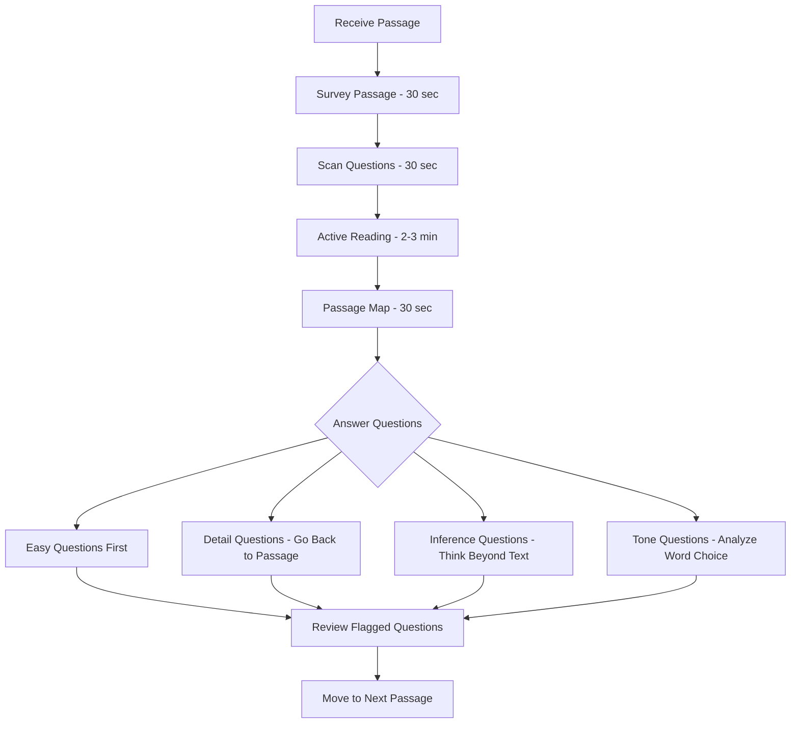
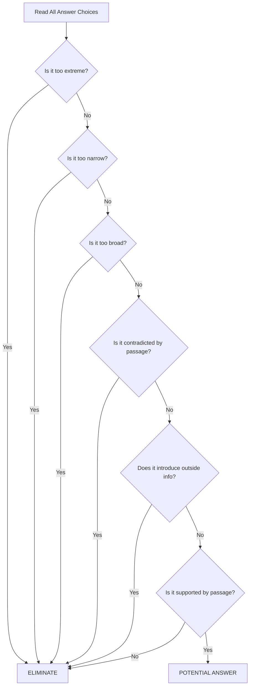
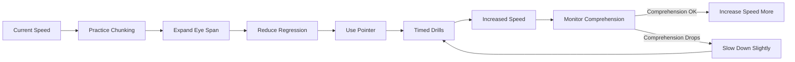

---

## 1. Introduction

### What is Reading Comprehension?
Reading comprehension is the ability to read, process, and understand the meaning of written text. It goes beyond simply reading words on a page — it involves interpretation, inference, critical analysis, and retention of information. In interview contexts, reading comprehension tests assess your ability to quickly grasp, analyze, and draw conclusions from written passages.

### Why It Matters for Interviews
Reading comprehension is a core component of:
- **Online assessments** (AMCAT, eLitmus, company-specific tests)
- **Aptitude sections** in campus placements
- **Verbal ability rounds** at most companies
- **Case study discussions** in managerial interviews
- **Document review tasks** during technical interviews
- **Email and proposal analysis** in client-facing roles

Strong reading comprehension signals to interviewers that you can process complex information quickly, think critically, and communicate effectively.

### How It Matters for Your Career
Every professional role requires reading — emails, documentation, reports, contracts, specifications, and research. Poor comprehension leads to misunderstandings, missed deadlines, and errors. Strong comprehension enables faster learning, better decision-making, and more effective communication.

---

## 2. Learning Roadmap

```mermaid
graph TD
    A[Reading Comprehension] --> B[Foundational Skills]
    A --> C[Question Types]
    A --> D[Advanced Techniques]
    B --> B1[Active Reading]
    B --> B2[Vocabulary Building]
    B --> B3[Speed Reading]
    B --> B4[Skimming & Scanning]
    C --> C1[Main Idea Questions]
    C --> C2[Inference Questions]
    C --> C3[Detail Questions]
    C --> C4[Tone & Purpose]
    C --> C5[Vocabulary in Context]
    C --> C6[Comparison Questions]
    C --> C7[Structure Questions]
    D --> D1[Critical Analysis]
    D --> D2[Passage Mapping]
    D --> D3[Elimination Strategy]
    D --> D4[Time Management]
    E[Practice] --> E1[Daily Reading]
    E --> E2[Timed Practice]
    E --> E3[Mock Tests]
    E --> E4[Error Analysis]
```



### Timeline
| Phase | Duration | Focus |
|-------|----------|-------|
| Week 1 | Days 1-3 | Active reading, vocabulary building |
| Week 1 | Days 4-7 | Main idea, detail questions |
| Week 2 | Days 8-10 | Inference, tone/purpose questions |
| Week 2 | Days 11-14 | Vocabulary in context, comparison questions |
| Week 3 | Days 15-17 | Speed reading, skimming, scanning |
| Week 3 | Days 18-21 | Timed practice, elimination strategies |
| Week 4 | Days 22-28 | Full mock tests, error analysis, review |

---

## 3. Theory Notes

### 3.1 The Reading Process

**Stage 1: Pre-Reading**
- Survey the passage: title, headings, first/last paragraphs
- Identify the topic and predict content
- Set a purpose: What do I need to find?

**Stage 2: Active Reading**
- Read with purpose, not passively
- Mentally summarize each paragraph as you read
- Note the author's main point in each section
- Mark (mentally or on scratch paper) key ideas and transitions

**Stage 3: Post-Reading**
- Recall the main idea before looking at questions
- Review your mental map of the passage
- Address questions systematically

### 3.2 Types of Passages in Interviews

| Passage Type | Characteristics | Strategy |
|-------------|----------------|----------|
| **Narrative** | Tells a story, chronological order | Track sequence of events |
| **Expository** | Explains a concept or process | Identify topic sentences |
| **Argumentative** | Presents and defends a position | Find claims, evidence, reasoning |
| **Descriptive** | Describes a scene, person, or thing | Note sensory details and adjectives |
| **Compare/Contrast** | Examines similarities and differences | Track both sides systematically |
| **Cause/Effect** | Analyzes causes and outcomes | Map causal relationships |
| **Technical** | Domain-specific, data-heavy | Focus on data and conclusions |

### 3.3 Question Types Deep Dive

#### Main Idea Questions
**Signal words:** "mainly about," "best summarizes," "central idea," "primary focus"
**Strategy:** The main idea is usually expressed in the first or last sentence of the passage, or the first sentence of each paragraph. It covers the ENTIRE passage, not just one part.

**Common trap:** An answer that is too narrow (covers only one paragraph) or too broad (goes beyond the passage).

#### Inference Questions
**Signal words:** "implies," "suggests," "can be inferred," "most likely"
**Strategy:** The correct answer is not directly stated but must be logically deduced. Look for:
- Statements the author implies but doesn't state directly
- Logical conclusions from the evidence presented
- What must be true based on the passage

**Common trap:** Answers that are too extreme, introduce outside information, or are contradicted by the passage.

#### Detail Questions
**Signal words:** "according to the passage," "the author states," "is mentioned"
**Strategy:** The answer is explicitly stated in the passage. Locate the specific section and match exactly. Don't rely on memory — go back to the passage.

**Common trap:** Answers that are almost correct but change one detail.

#### Tone & Purpose Questions
**Signal words:** "the author's attitude," "tone," "purpose," "intent"
**Strategy:** Look at:
- Word choice (positive, negative, neutral connotations)
- Emotional language or neutral language
- Whether the author supports, criticizes, or objectively presents

**Tone indicators:**
| Tone | Indicators |
|------|-----------|
| Positive | praise, admiration, enthusiasm, hopeful |
| Negative | criticism, skepticism, concern, frustration |
| Neutral | objective, factual, balanced, analytical |
| Sarcastic | ironic, exaggerated praise, mocking |

#### Vocabulary in Context Questions
**Signal words:** "as used in the passage," "closest in meaning," "the word ___ means"
**Strategy:**
1. Locate the word in the passage
2. Read the surrounding sentences
3. Substitute each answer choice
4. The correct answer makes sense in context (the word's meaning may differ from its common meaning)

**Example:** "The company's new policy had a *salutary* effect on productivity."
If you don't know "salutary," look at context: positive effect on productivity → means "beneficial."

#### Comparison Questions
**Signal words:** "compared to," "in contrast," "similarities," "differences"
**Strategy:** Create a mental (or scratch paper) comparison:
- What is being compared?
- What are the similarities?
- What are the differences?
- What is the author's conclusion about the comparison?

#### Structure/Organization Questions
**Signal words:** "organization of the passage," "structure," "arranged," "progression"
**Strategy:** Identify:
- How the passage moves (chronological, general-to-specific, problem-solution)
- The function of each paragraph
- Transition words (however, moreover, in contrast, consequently)

### 3.4 Speed Reading Techniques

**1. Minimize Subvocalization**
Reduce the inner voice that reads each word. Practice reading chunks of words rather than individual words.

**2. Expand Eye Span**
Train your eyes to take in groups of 3-4 words at a time rather than one word at a time.

**3. Reduce Regression**
Stop re-reading words you've already read. Trust your first reading and move forward.

**4. Use a Pointer**
Use your finger or pen to guide your eyes. This maintains focus and speed.

**5. Chunking**
Group related words together: "The/quick/brown/fox" → "The quick brown fox"

**Target speeds:**
| Level | Speed (words/min) | Comprehension |
|-------|-------------------|---------------|
| Beginner | 150-250 | 70%+ |
| Average | 250-400 | 70%+ |
| Good | 400-600 | 60%+ |
| Excellent | 600-800+ | 60%+ |

### 3.5 Active Reading Strategies

**1. SQ3R Method**
- **Survey:** Preview the passage (title, headings, structure)
- **Question:** Turn headings into questions
- **Read:** Read to answer your questions
- **Recite:** Summarize each section in your own words
- **Review:** Go back and review key points

**2. Annotation Strategy (mental or on scratch paper)**
- Circle key terms
- Underline main ideas
- Star important details
- Write brief margin notes (mental or physical)
- Mark transitions between ideas

**3. Passage Mapping**
After reading, quickly create a mental map:
- Paragraph 1: Topic = _____, Main point = _____
- Paragraph 2: Topic = _____, Main point = _____
- Paragraph 3: Topic = _____, Main point = _____
- Overall: Main idea = _____, Author's position = _____

### 3.6 Elimination Strategy

When stuck between answer choices, eliminate wrong answers:

1. **Too extreme:** Watch for words like "always," "never," "all," "none," "completely"
2. **Too narrow:** Only covers part of the passage
3. **Too broad:** Goes beyond what the passage discusses
4. **Not supported:** Can't be found or inferred from the passage
5. **Opposite:** Contradicts the passage
6. **Out of scope:** Introduces information not in the passage

**Process of elimination increases your accuracy from 25% (random guess) to 50-75%.**

### 3.7 Time Management Strategy

For a typical RC section with 4-5 passages and 3-5 questions each:

| Step | Action | Time per Passage |
|------|--------|-----------------|
| 1 | Survey passage (30 sec) | 0:30 |
| 2 | Active reading (2-3 min) | 2:30 |
| 3 | Answer questions (2-3 min) | 3:00 |
| 4 | Review flagged questions (30 sec) | 0:30 |
| **Total** | | **~6 minutes** |

**Rules:**
- Spend no more than 6-8 minutes per passage
- If a question takes more than 90 seconds, mark your best guess and move on
- Don't get stuck on any single question
- Answer easier questions first within each passage

---

## 4. Key Concepts

| Concept | Definition | Interview Application |
|---------|-----------|----------------------|
| Main Idea | The central point of the entire passage | "What is this passage mainly about?" |
| Inference | A logical conclusion drawn from evidence | "What can be inferred from..." |
| Tone | The author's attitude toward the subject | "The author's tone is..." |
| Purpose | Why the author wrote the passage | "The primary purpose is to..." |
| Explicit Information | Directly stated in the text | "According to the passage..." |
| Implicit Information | Implied but not stated | "The passage suggests that..." |
| Context Clues | Words surrounding an unfamiliar word | "The word X means..." |
| Supporting Evidence | Facts, examples, data that support claims | "Which detail supports..." |
| Counter-argument | An opposing viewpoint the author addresses | "The author addresses the objection that..." |
| Logical Structure | How ideas are organized | "The passage is organized by..." |

---

## 5. Frequently Asked Interview Questions

### Beginner Level

1. **Q: What is the main idea of a passage?**
   A: The main idea is the central point or message the author wants to convey. It typically appears in the first or last sentence of the passage or is implied throughout. All other details support or elaborate on this idea. The main idea covers the ENTIRE passage, not just one section.

2. **Q: How do I find the main idea quickly?**
   A: Read the first and last sentences of each paragraph. The topic sentence of each paragraph supports the overall main idea. Ask yourself: "What is the author trying to say in one sentence?" The correct answer will encompass ALL paragraphs, not just one.

3. **Q: What is the difference between explicit and implicit information?**
   A: Explicit information is directly stated in the text ("The company reported a 20% increase in revenue."). Implicit information requires inference — drawing a conclusion from stated facts ("The company likely expanded its market share." — not directly stated but logically follows).

4. **Q: How do I handle vocabulary I don't know?**
   A: Use context clues: look at the sentences before and after the word. The author often provides definitions, examples, or contrasts that hint at the meaning. Also look at word parts (prefixes, suffixes, roots). If still unsure, eliminate answer choices that don't fit the context.

5. **Q: What is an inference question asking me to do?**
   A: Inference questions ask you to figure out something the author didn't directly say but clearly implied. The correct answer must be supported by evidence in the passage — it's a logical step beyond what's written, not a wild guess.

6. **Q: How do I identify the author's tone?**
   A: Look at the author's word choice. Positive words (brilliant, effective, promising) indicate positive tone. Negative words (disappointing, flawed, problematic) indicate negative tone. Neutral, factual language indicates objective tone. Also consider whether the author uses emotional language or presents facts.

7. **Q: What is the difference between summary and inference?**
   A: A summary condenses what's explicitly stated in the passage. An inference goes beyond what's stated to draw a logical conclusion. Summary: "The passage discusses climate change impacts." Inference: "The author believes immediate action is needed."

8. **Q: How many times should I read the passage?**
   A: Ideally once for comprehension, then scan back for specific detail questions. First reading should give you the main idea, structure, and key details. Going back to the passage for each question is normal and expected.

### Intermediate Level

9. **Q: How do I handle "EXCEPT" questions?**
   A: "EXCEPT" questions are essentially "all of the following are true EXCEPT" — find the ONE that's NOT stated or supported. Strategy: verify each answer choice against the passage. The correct answer is the one that contradicts or is not supported by the passage.

10. **Q: What are common traps in RC answer choices?**
    A: (1) Too extreme (uses "always," "never" when passage is moderate); (2) Too narrow (only covers one paragraph); (3) Too broad (goes beyond passage scope); (4) Opposite of what's stated; (5) Uses passage words but changes the meaning; (6) Introduces outside information not in the passage.

11. **Q: How do I compare two viewpoints in a passage?**
    A: Create a quick mental comparison chart: Viewpoint A's claims, evidence, and conclusion vs. Viewpoint B's claims, evidence, and conclusion. Note where they agree and disagree. Identify which viewpoint the author seems to favor (often indicated by word choice and placement).

12. **Q: What signal words indicate cause-and-effect relationships?**
    A: Because, since, therefore, consequently, as a result, thus, hence, due to, leads to, causes, results in, owing to. These words help you map the logical flow of arguments.

13. **Q: How do I handle technical/academic passages?**
    A: Don't panic about domain knowledge — the questions only test comprehension, not expertise. Focus on the logical structure: What is being defined? What examples support the definition? What is the author's conclusion? Skip jargon you don't understand; the context will usually clarify.

14. **Q: What is "passage mapping" and how does it help?**
    A: After reading, spend 30 seconds creating a mental map: What each paragraph is about and how they connect. This helps you quickly locate information for detail questions and ensures you understand the overall structure. It's especially helpful for long passages.

### Advanced Level

15. **Q: How do I handle passages with multiple viewpoints or arguments?**
    A: Track each viewpoint separately. Note: Who holds each view? What evidence supports it? Does the author agree? Use a mental or scratch-paper Venn diagram. The questions will often ask about relationships between viewpoints.

16. **Q: What's the difference between "author would most likely agree" and "passage suggests"?**
    A: "Passage suggests" = what can be directly inferred from the text. "Author would most likely agree" = what the author's overall position implies, even if not explicitly stated. Both must be supported by the passage, but the latter allows for broader inference.

17. **Q: How do I handle data-heavy passages (with statistics, percentages)?**
    A: Don't try to memorize all numbers. Instead, note what each data point is being used to argue. Focus on trends and conclusions, not individual numbers. For questions about specific data, go back to the exact location.

18. **Q: How do I manage time when passages vary in difficulty?**
    A: Scan all passages first. Start with the easiest (familiar topic, clear structure). Spend 6-8 minutes on easy passages, up to 10 minutes on hard ones. If a passage is taking too long, guess on remaining questions and move on.

### FAANG Level

19. **Q: How would you approach a 1000-word passage with 8 questions in 10 minutes?**
    A: (1) Survey in 20 seconds — identify type, structure, difficulty. (2) Active read in 3 minutes — focus on main ideas, skip minor details. (3) Passage map in 20 seconds. (4) Answer questions in 5 minutes — easy first, difficult last. (5) Guess on any remaining questions. Key: don't re-read the entire passage for each question.

20. **Q: In a case study interview, how does reading comprehension relate to performance?**
    A: Case studies require reading a business scenario and making recommendations. Strong comprehension lets you identify key facts, understand relationships between variables, spot the real problem (not just symptoms), and evaluate proposed solutions. Misreading one detail can derail your entire analysis.

21. **Q: How would you teach someone with weak reading comprehension to improve for interviews?**
    A: Start with short, interesting passages (news articles). Build vocabulary systematically. Practice active reading with the SQ3R method. Focus on identifying main ideas before details. Gradually increase passage length and difficulty. Time practice sessions to build speed. Review wrong answers to understand why.

22. **Q: How do you handle ambiguous passages where multiple answers seem correct?**
    A: Choose the answer MOST supported by the passage. Eliminate extremes first. Consider which answer requires the fewest assumptions. If two answers are close, re-read the relevant section carefully. The best answer is the one with the most direct textual support.

23. **Q: What role does background knowledge play in reading comprehension?**
    A: Background knowledge helps you understand context and make inferences, but answers must come from the passage, not your knowledge. Be careful not to let outside knowledge override what the passage says. The passage is the authority, even if you know differently.

24. **Q: How do you balance speed and comprehension?**
    A: For interviews, aim for 80% comprehension at maximum comfortable speed. Perfect comprehension at slow speed is worse than good comprehension at fast speed in timed tests. Practice increasing speed gradually while monitoring comprehension. Use skimming for main ideas and scanning for specific details.

25. **Q: How would you approach reading comprehension in a non-native language?**
    A: Focus on structure over vocabulary — identify main ideas from topic sentences. Use elimination aggressively. Build academic vocabulary systematically. Practice with timed sessions to build familiarity with test pressure. Read English articles daily to build automaticity.

---

## 6. Hands-on Practice

### Exercise 1: Main Idea Identification

Read the following passage and identify the main idea:

> "Artificial intelligence is transforming healthcare in unprecedented ways. From diagnosing diseases through medical imaging to predicting patient outcomes using machine learning algorithms, AI tools are helping doctors make better decisions. However, these technologies also raise concerns about data privacy, algorithmic bias, and the potential displacement of certain medical roles. As hospitals increasingly adopt AI solutions, the need for clear regulatory frameworks and ethical guidelines becomes more pressing."

**Question:** What is the main idea of this passage?
A) AI is replacing doctors in healthcare
B) Medical imaging is the best application of AI
C) AI is transforming healthcare but raises important concerns requiring regulatory attention
D) Data privacy is the biggest issue in healthcare AI

**Answer: C** — The passage discusses both the benefits AND concerns of AI in healthcare, concluding with the need for regulation. A is too extreme (AI is not replacing doctors), B is too narrow (one example), D is too narrow (one concern).

### Exercise 2: Inference Practice

> "Sarah had been applying to jobs for three months without success. After revising her resume to highlight quantified achievements and tailoring each cover letter to the specific company, she received interview calls from two top-tier firms within a week."

**Question:** What can be inferred about Sarah's initial job applications?
A) She was applying to the wrong companies
B) Her initial resume and cover letters were likely generic and not tailored
C) She didn't have enough experience
D) She wasn't applying to enough positions

**Answer: B** — The passage implies that the change (tailored resume and cover letters) led to success, suggesting the initial applications lacked these qualities.

### Exercise 3: Tone Identification

> "The new policy, while well-intentioned, has created more confusion than clarity. Employees are unsure about compliance requirements, and managers report spending more time interpreting the guidelines than implementing them. One can only hope that revisions will address these practical concerns."

**Question:** What is the author's tone?
A) Enthusiastic
B) Neutral
C) Critically constructive
D) Aggressive

**Answer: C** — The author acknowledges good intentions (constructive) but clearly identifies problems (critical). Not aggressive (no hostile language) or enthusiastic (clearly identifies problems).

### Exercise 4: Vocabulary in Context

> "The CEO's decision to pivot the company's strategy was met with skepticism from the board, who felt the move was premature given the current market conditions."

**Question:** In this context, "premature" most likely means:
A) Too early
B) Too expensive
C) Too risky
D) Too ambitious

**Answer: A** — The board questions the timing ("premature"), not the cost, risk, or ambition. Context: they felt it was too soon given market conditions.

### Exercise 5: Detail Questions

> "Amazon's revenue grew 38% year-over-year, driven primarily by its cloud computing division, AWS, which accounted for 62% of the company's operating income. The e-commerce segment saw modest growth of 7%, while the advertising business grew 58%, emerging as the fastest-growing segment."

**Question:** Which segment contributed the MOST to Amazon's operating income?
A) E-commerce
B) AWS
C) Advertising
D) Not specified

**Answer: B** — AWS "accounted for 62% of the company's operating income." While advertising grew fastest, AWS contributed the most.

### Exercise 6: Main Idea vs. Supporting Detail

Read this passage and answer the questions:

> "Remote work has become a permanent feature of the modern workplace. A Stanford study found that remote workers are 13% more productive than their in-office counterparts. Companies like Spotify and Twitter have adopted permanent remote work policies. However, remote work also presents challenges: employee isolation, communication difficulties, and maintaining company culture. Effective remote work requires intentional investment in technology, management training, and social connection opportunities."

**Q1:** What is the main idea?
A) Stanford conducted a study on remote work productivity
B) Spotify and Twitter allow remote work
C) Remote work offers benefits but requires intentional strategies to address challenges
D) Remote workers are 13% more productive

**Answer: C** — A and B are supporting details. D is a supporting detail. C captures the overall message.

**Q2:** Which of the following is a supporting detail?
A) Remote work requires intentional investment
B) Remote work is a permanent feature
C) Employee isolation is a challenge
D) All of the above

**Answer: D** — All are details that support the main idea about remote work's benefits and challenges.

### Exercise 7: Process of Elimination

For each question, identify which answer choice is eliminated FIRST and why:

**Passage:** "While renewable energy sources have become increasingly cost-competitive, their adoption faces significant infrastructure challenges. The intermittent nature of solar and wind power requires substantial energy storage solutions, which remain expensive at scale."

**Q: What is the biggest barrier to renewable energy adoption?**
A) The technology is too expensive
B) Infrastructure and storage challenges
C) People don't want renewable energy
D) Governments oppose renewable energy

**Elimination process:**
1. **First eliminate C** — Not mentioned in the passage. Out of scope.
2. **Then eliminate D** — Not mentioned. Opposite of reality.
3. **Then eliminate A** — The passage says renewables are "cost-competitive," contradicting "too expensive."
4. **Answer: B** — Directly stated as the challenge.

### Exercise 8: Speed Reading Drill

Read this passage in exactly 60 seconds, then answer without looking back:

> "The global semiconductor industry, valued at approximately $580 billion in 2023, faces a critical talent shortage. Industry estimates suggest that by 2030, there will be a shortfall of 1 million skilled workers. This shortage threatens to slow innovation in sectors ranging from consumer electronics to autonomous vehicles. Companies are responding through partnerships with universities, internal training programs, and aggressive hiring from competitors. Governments, recognizing the strategic importance of semiconductor manufacturing, have allocated billions in subsidies and incentives to build domestic chip production capabilities."

**Q1:** What is the industry valued at approximately?
**Q2:** What is the projected talent shortfall by 2030?
**Q3:** How are companies responding to the shortage?
**Q4:** What are governments doing?

**Answers:** Q1: $580 billion (2023). Q2: 1 million skilled workers. Q3: University partnerships, training programs, hiring from competitors. Q4: Subsidies and incentives for domestic chip production.

### Exercise 9: Compare and Contrast

> "Traditional waterfall development follows a sequential process: requirements, design, implementation, testing, and deployment. Each phase must be completed before the next begins. Agile development, in contrast, works in iterative cycles called sprints, typically lasting 2-4 weeks. Each sprint delivers a potentially shippable product increment. While waterfall provides clear structure and documentation, Agile offers flexibility and faster feedback. Many organizations now adopt hybrid approaches that combine elements of both methodologies."

**Q:** What is a key difference between waterfall and Agile?
A) Waterfall is faster than Agile
B) Waterfall is sequential; Agile is iterative
C) Agile doesn't require testing
D) Waterfall is more flexible than Agile

**Answer: B** — Directly stated: waterfall is "sequential" while Agile works in "iterative cycles." A contradicts the passage (Agile is faster). C is not stated. D contradicts the passage (Agile offers more flexibility).

### Exercise 10: Time-Pressured Practice

Set a timer for 7 minutes. Read the passage and answer all questions:

> "The paradox of choice suggests that having too many options can lead to decision paralysis, decreased satisfaction, and increased regret. In a famous study, researchers set up a jam tasting booth at a grocery store. On one day, they offered 24 varieties of jam; on another day, only 6. While the larger display attracted more initial interest (60% of passersby stopped), the smaller display led to more purchases (30% vs. 3%). Customers overwhelmed by choice often deferred their decision entirely, while those with fewer options felt more confident in their selection. This principle extends beyond consumer behavior — it affects career choices, relationship decisions, and even dietary habits."

**Q1:** What is the paradox of choice?
**Q2:** Which display attracted more initial interest?
**Q3:** Which display led to more actual purchases?
**Q4:** What percentage stopped at the larger display?
**Q5:** What does the passage suggest about career choices?

**Answers:**
Q1: Too many options can lead to decision paralysis and decreased satisfaction.
Q2: The larger display (24 varieties) — 60% stopped.
Q3: The smaller display (6 varieties) — 30% purchased.
Q4: 60%.
Q5: The paradox of choice affects career decisions too — too many options can lead to decision paralysis.

---

## 7. Real FAANG Interview Questions

| Company | Passage Topic | Question Type | Difficulty |
|---------|--------------|---------------|------------|
| Google | AI ethics and regulation | Main idea + Inference | Advanced |
| Google | Quantum computing applications | Detail + Vocabulary | Advanced |
| Meta | Social media's impact on democracy | Tone + Inference | Advanced |
| Meta | Data privacy legislation comparison | Compare/Contrast | Intermediate |
| Amazon | Supply chain optimization | Detail + Main idea | Intermediate |
| Amazon | Climate change and business | Inference + Purpose | Intermediate |
| Apple | Design philosophy and user experience | Tone + Purpose | Advanced |
| Apple | Accessibility in technology | Main idea + Inference | Intermediate |
| Microsoft | Cloud computing market analysis | Detail + Data interpretation | Advanced |
| Microsoft | Open source software adoption | Inference + Purpose | Intermediate |
| Netflix | Content recommendation algorithms | Technical comprehension | Advanced |
| Netflix | Streaming industry competition | Compare/Contrast | Intermediate |

---

## 8. Common Mistakes

| Mistake | Description | How to Avoid |
|---------|------------|--------------|
| Reading too slowly | Trying to memorize every word | Focus on main ideas; scan for details when needed |
| Not reading the questions first | Reading the entire passage before knowing what to look for | Skim questions first (30 sec) to know what to focus on |
| Choosing extreme answers | Selecting answers with "always," "never," "all" | Prefer moderate, qualified answers |
| Relying on outside knowledge | Using what you know instead of what the passage says | Only use information from the passage |
| Not using elimination | Trying to find the "right" answer instead of eliminating wrong ones | Always eliminate obviously wrong choices first |
| Rushing through questions | Not reading answer choices carefully | Read ALL answer choices before selecting |
| Ignoring passage structure | Not noting how the passage is organized | Map the structure to quickly locate information |
| Spending too long on one question | Getting stuck on a difficult question | Mark and move on; return if time permits |
| Not checking for "NOT" in questions | Missing that the question asks what is NOT true | Read questions carefully — note "EXCEPT," "NOT," "LEAST" |
| Over-inferencing | Drawing conclusions too far from the text | Keep inferences close to what's explicitly stated |

---

## 9. Best Practices

1. **Read the questions before the passage** — Spend 30 seconds scanning questions so you know what to look for during reading.
2. **Read actively, not passively** — Mentally summarize each paragraph. Ask "What is the author's point here?"
3. **Map the passage** — After reading, spend 30 seconds creating a mental map of the passage structure.
4. **Always go back to the passage** — Don't rely on memory. Locate the specific section for each question.
5. **Use process of elimination** — Eliminate clearly wrong answers first, then choose the best remaining option.
6. **Watch for extreme language** — Answers with "always," "never," "all," "none" are usually wrong.
7. **Practice timing** — Use a timer during practice to build speed without sacrificing comprehension.
8. **Build vocabulary systematically** — Learn 5-10 new words daily from academic and professional contexts.
9. **Read diverse topics** — Practice with passages on technology, science, business, arts, and social issues.
10. **Analyze your errors** — After each practice test, review wrong answers and identify why you got them wrong.
11. **Build a daily reading habit** — Read quality articles (The Economist, The Atlantic, Scientific American) daily.
12. **Practice mental summarization** — After reading any article, summarize it in one sentence.

---

## 10. Cheat Sheet

```
+---------------------------------------------------------------+
|             READING COMPREHENSION CHEAT SHEET                 |
+---------------------------------------------------------------+
|                                                               |
|  QUESTION TYPES & SIGNAL WORDS                               |
|  Main Idea:    "mainly about," "best summarizes," "central"  |
|  Inference:    "implies," "suggests," "can be inferred"      |
|  Detail:       "according to," "author states," "mentioned"  |
|  Tone:         "attitude," "tone," "author's perspective"    |
|  Purpose:      "primary purpose," "written to"               |
|  Vocabulary:   "as used in," "closest in meaning"            |
|  Compare:      "compared to," "in contrast," "similarities"  |
|  Structure:    "organization," "arranged," "progression"     |
|                                                               |
|  ELIMINATION RULES                                           |
|  ✗ Too extreme (always, never, all, none)                   |
|  ✗ Too narrow (only covers one paragraph)                   |
|  ✗ Too broad (goes beyond passage scope)                    |
|  ✗ Not supported (can't find in passage)                    |
|  ✗ Opposite (contradicts the passage)                       |
|  ✗ Out of scope (introduces new information)                |
|                                                               |
|  TIME MANAGEMENT (per passage)                               |
|  Survey:       30 seconds                                    |
|  Read:         2-3 minutes                                  |
|  Answer:       2-3 minutes                                  |
|  Review:       30 seconds                                   |
|  TOTAL:        6-8 minutes                                  |
|                                                               |
|  ACTIVE READING (SQ3R)                                      |
|  Survey → Question → Read → Recite → Review                 |
|                                                               |
|  SPEED READING TARGETS                                       |
|  Beginner:    150-250 wpm (70%+ comprehension)              |
|  Average:     250-400 wpm (70%+ comprehension)              |
|  Good:        400-600 wpm (60%+ comprehension)              |
|                                                               |
+---------------------------------------------------------------+
```

---

## 11. Flash Cards

| # | Question | Answer |
|---|----------|--------|
| 1 | What is the main idea? | The central point the author wants to convey, covering the ENTIRE passage |
| 2 | What signal words indicate inference questions? | "implies," "suggests," "can be inferred," "most likely" |
| 3 | What is the #1 trap in RC answers? | Extreme language (always, never, all, none) |
| 4 | What does SQ3R stand for? | Survey, Question, Read, Recite, Review |
| 5 | What is "passage mapping"? | Creating a mental summary of each paragraph's main point after reading |
| 6 | How long should you spend per passage? | 6-8 minutes total (including reading and answering) |
| 7 | What is explicit information? | Information directly stated in the text |
| 8 | What is implicit information? | Information that must be inferred from stated facts |
| 9 | How do you identify author's tone? | By analyzing word choice (positive/negative/neutral connotations) |
| 10 | What is process of elimination? | Removing obviously wrong answers to improve guessing odds |
| 11 | What is "out of scope" as an answer type? | An answer that introduces information not discussed in the passage |
| 12 | What does "EXCEPT" in a question mean? | Find the one option that is NOT supported by the passage |
| 13 | What is vocabulary in context? | Determining a word's meaning based on surrounding text |
| 14 | Should you read questions before the passage? | Yes — spend 30 sec scanning questions first |
| 15 | What is a topic sentence? | The sentence that expresses the main idea of a paragraph |
| 16 | What signal words indicate cause-effect? | because, therefore, consequently, as a result, thus |
| 17 | How do you handle data-heavy passages? | Focus on trends and conclusions, not individual numbers |
| 18 | What is a "distractor" answer? | An answer that looks right but has a subtle error |
| 19 | What should you do if stuck on a question? | Mark your best guess and move on; return if time permits |
| 20 | How do you improve RC speed? | Daily timed practice, expand eye span, reduce subvocalization |

---

## 12. Mind Map

```
Reading Comprehension
│
├── Passage Types
│   ├── Narrative (story, chronological)
│   ├── Expository (explains concepts)
│   ├── Argumentative (defends position)
│   ├── Descriptive (describes scenes)
│   ├── Compare/Contrast
│   ├── Cause/Effect
│   └── Technical (data-heavy)
│
├── Question Types
│   ├── Main Idea
│   ├── Inference
│   ├── Detail/Fact
│   ├── Tone/Attitude
│   ├── Purpose
│   ├── Vocabulary in Context
│   ├── Compare/Contrast
│   └── Structure/Organization
│
├── Strategies
│   ├── SQ3R Method
│   ├── Passage Mapping
│   ├── Process of Elimination
│   ├── Time Management
│   └── Active Reading
│
├── Skills
│   ├── Speed Reading
│   ├── Vocabulary Building
│   ├── Critical Analysis
│   ├── Context Clue Usage
│   └── Mental Summarization
│
└── Common Pitfalls
    ├── Extreme answers
    ├── Out of scope answers
    ├── Relying on outside knowledge
    ├── Spending too long on one question
    └── Not reading questions first
```

---

## 13. Mermaid Diagrams

### Diagram 1: Reading Comprehension Strategy Flow


### Diagram 2: Question Type Decision Tree
```mermaid
flowchart TD
    A[Read Question] --> B{Contains "mainly about" or "best summarizes"?}
    B -->|Yes| C[Main Idea Question]
    B -->|No| D{Contains "implies" or "suggests"?}
    D -->|Yes| E[Inference Question]
    D -->|No| F{Contains "according to" or "author states"?}
    F -->|Yes| G[Detail Question]
    F -->|No| H{Contains "tone" or "attitude"?}
    H -->|Yes| I[Tone Question]
    H -->|No| J{Contains "purpose" or "written to"?}
    J -->|Yes| K[Purpose Question]
    J -->|No| L{Contains "closest in meaning"?}
    L -->|Yes| M[Vocabulary Question]
    L -->|No| N[Compare/Structure Question]
```

### Diagram 3: Process of Elimination


### Diagram 4: Speed Reading Improvement


---

## 14. Code Examples

### Example 1: Reading Comprehension Scorer (Python)
```python
class RCScorer:
    def __init__(self):
        self.passages_read = 0
        self.questions_attempted = 0
        self.correct_answers = 0
        self.time_spent = []

    def log_attempt(self, passage_id, question_id, correct, time_seconds):
        self.passages_read = max(self.passages_read, passage_id)
        self.questions_attempted += 1
        if correct:
            self.correct_answers += 1
        self.time_spent.append(time_seconds)

    def get_accuracy(self):
        if self.questions_attempted == 0:
            return 0
        return (self.correct_answers / self.questions_attempted) * 100

    def get_avg_time_per_question(self):
        if not self.time_spent:
            return 0
        return sum(self.time_spent) / len(self.time_spent)

    def get_avg_time_per_passage(self, questions_per_passage=4):
        if self.questions_attempted == 0:
            return 0
        total_time = sum(self.time_spent)
        num_passages = self.questions_attempted / questions_per_passage
        return total_time / max(num_passages, 1)

    def get_performance_report(self):
        accuracy = self.get_accuracy()
        avg_time = self.get_avg_time_per_question()

        if accuracy >= 80 and avg_time <= 90:
            level = "Excellent"
            advice = "Maintain your performance. Focus on speed optimization."
        elif accuracy >= 60:
            level = "Good"
            advice = "Work on eliminating extreme answers and improving inference skills."
        elif accuracy >= 40:
            level = "Needs Improvement"
            advice = "Focus on active reading, passage mapping, and vocabulary building."
        else:
            level = "Requires Significant Practice"
            advice = "Start with short passages. Master main idea questions before advancing."

        return {
            "accuracy": f"{accuracy:.1f}%",
            "avg_time_per_question": f"{avg_time:.1f}s",
            "total_questions": self.questions_attempted,
            "level": level,
            "advice": advice
        }

scorer = RCScorer()

attempts = [
    (1, 1, True, 45), (1, 2, True, 60), (1, 3, False, 90), (1, 4, True, 55),
    (2, 1, True, 40), (2, 2, False, 75), (2, 3, True, 50), (2, 4, True, 65),
    (3, 1, True, 35), (3, 2, True, 55), (3, 3, True, 70), (3, 4, False, 95),
]

for p, q, correct, time in attempts:
    scorer.log_attempt(p, q, correct, time)

report = scorer.get_performance_report()
for key, value in report.items():
    print(f"{key}: {value}")
```

### Example 2: Passage Analyzer
```python
import re
from collections import Counter

class PassageAnalyzer:
    def __init__(self, text):
        self.text = text
        self.sentences = [s.strip() for s in text.split('.') if s.strip()]
        self.words = text.split()
        self.paragraphs = [p.strip() for p in text.split('\n\n') if p.strip()]

    def word_count(self):
        return len(self.words)

    def sentence_count(self):
        return len(self.sentences)

    def paragraph_count(self):
        return len(self.paragraphs)

    def avg_words_per_sentence(self):
        return round(len(self.words) / max(len(self.sentences), 1), 1)

    def avg_sentences_per_paragraph(self):
        return round(len(self.sentences) / max(len(self.paragraphs), 1), 1)

    def readability_score(self):
        avg_wps = self.avg_words_per_sentence()
        if avg_wps < 15:
            return "Easy"
        elif avg_wps < 25:
            return "Moderate"
        elif avg_wps < 35:
            return "Difficult"
        else:
            return "Very Difficult"

    def find_signal_words(self):
        signal_categories = {
            "cause_effect": ["because", "since", "therefore", "consequently", "thus", "hence", "results in", "leads to"],
            "contrast": ["however", "but", "although", "despite", "nevertheless", "on the other hand", "in contrast"],
            "addition": ["moreover", "furthermore", "additionally", "also", "in addition", "besides"],
            "sequence": ["first", "second", "then", "finally", "next", "subsequently", "meanwhile"],
            "example": ["for example", "for instance", "such as", "specifically", "in particular"],
            "conclusion": ["in conclusion", "therefore", "thus", "overall", "in summary", "to sum up"],
        }

        found = {}
        text_lower = self.text.lower()
        for category, words in signal_categories.items():
            matches = [w for w in words if w in text_lower]
            if matches:
                found[category] = matches
        return found

    def find_transition_words(self):
        transitions = ["however", "moreover", "furthermore", "therefore", "consequently",
                       "nevertheless", "meanwhile", "subsequently", "additionally", "in contrast",
                       "on the other hand", "for example", "in conclusion"]
        found = [t for t in transitions if t in self.text.lower()]
        return found

    def topic_sentences(self):
        sentences = []
        for para in self.paragraphs:
            first_sentence = para.split('.')[0].strip()
            if first_sentence:
                sentences.append(first_sentence)
        return sentences

    def get_summary(self):
        return {
            "word_count": self.word_count(),
            "sentence_count": self.sentence_count(),
            "paragraph_count": self.paragraph_count(),
            "avg_words_per_sentence": self.avg_words_per_sentence(),
            "readability": self.readability_score(),
            "signal_words": self.find_signal_words(),
            "transitions": self.find_transition_words(),
            "topic_sentences": self.topic_sentences()
        }

sample = """Artificial intelligence is transforming healthcare in unprecedented ways. From diagnosing diseases through medical imaging to predicting patient outcomes using machine learning algorithms, AI tools are helping doctors make better decisions. However, these technologies also raise concerns about data privacy, algorithmic bias, and the potential displacement of certain medical roles. As hospitals increasingly adopt AI solutions, the need for clear regulatory frameworks and ethical guidelines becomes more pressing. Therefore, policymakers must act swiftly to balance innovation with patient safety."""

analyzer = PassageAnalyzer(sample)
summary = analyzer.get_summary()

for key, value in summary.items():
    print(f"\n{key}:")
    if isinstance(value, dict):
        for k, v in value.items():
            print(f"  {k}: {v}")
    elif isinstance(value, list):
        for item in value:
            print(f"  - {item}")
    else:
        print(f"  {value}")
```

### Example 3: Vocabulary in Context Quiz
```python
class VocabularyQuiz:
    def __init__(self):
        self.questions = [
            {
                "word": "salutary",
                "context": "The company's new policy had a salutary effect on employee morale.",
                "options": ["harmful", "beneficial", "surprising", "temporary"],
                "correct": 1,
                "explanation": "'Salutary' means producing beneficial or good effects."
            },
            {
                "word": "precarious",
                "context": "The startup's financial situation was precarious, with only two months of runway remaining.",
                "options": ["stable", "dangerously uncertain", "profitable", "growing"],
                "correct": 1,
                "explanation": "'Precarious' means not secure and likely to change for the worse."
            },
            {
                "word": "mundane",
                "context": "While the project was exciting, the daily mundane tasks of documentation and testing became tedious.",
                "options": ["exciting", "routine and boring", "creative", "challenging"],
                "correct": 1,
                "explanation": "'Mundane' means dull, ordinary, or lacking interest."
            },
            {
                "word": "diligent",
                "context": "The diligent programmer reviewed every line of code before committing.",
                "options": ["lazy", "careful and thorough", "fast", "creative"],
                "correct": 1,
                "explanation": "'Diligent' means showing care and conscientiousness."
            },
            {
                "word": "ambiguous",
                "context": "The requirement was ambiguous, leading to different interpretations by the team.",
                "options": ["clear", "open to multiple interpretations", "simple", "important"],
                "correct": 1,
                "explanation": "'Ambiguous' means open to more than one interpretation."
            }
        ]

    def run_quiz(self):
        score = 0
        for i, q in enumerate(self.questions, 1):
            print(f"\nQ{i}: What does '{q['word']}' mean in this context?")
            print(f"   \"{q['context']}\"")
            for j, option in enumerate(q['options'], 1):
                print(f"   {j}. {option}")

            answer = int(input("Your answer (1-4): ")) - 1
            if answer == q['correct']:
                print("Correct!")
                score += 1
            else:
                print(f"Incorrect. {q['explanation']}")

        print(f"\nScore: {score}/{len(self.questions)}")
        return score

# quiz = VocabularyQuiz()
# quiz.run_quiz()
```

---

## 15. Projects

### Mini Project 1: RC Passage Generator
Build a tool that generates reading comprehension passages of varying difficulty levels (easy, medium, hard) on random topics, with auto-generated questions (main idea, detail, inference).

### Mini Project 2: Speed Reading Trainer
Create a web app that displays text at adjustable speeds, tracks comprehension through quizzes, and provides progress reports over time.

### Mini Project 3: Vocabulary Builder
Develop an app that extracts unfamiliar words from passages, provides definitions, context clues, and spaced-repetition flashcards.

### Intermediate Project 1: RC Practice Platform
Build a full RC practice platform with timed passages, multiple question types, performance analytics, difficulty adaptive scoring, and progress tracking.

### Intermediate Project 2: Passage Difficulty Analyzer
Create a tool that analyzes any text passage and predicts its difficulty level based on sentence length, vocabulary complexity, abstractness, and structure.

### Advanced Project 1: AI Reading Tutor
Develop an adaptive AI tutor that provides personalized RC practice based on user weaknesses, generates targeted exercises, and provides detailed explanations for wrong answers.

### Advanced Project 2: Interview RC Simulator
Build a timed simulation that replicates actual interview RC sections with realistic passages, question formats, scoring, and time pressure.

### Project Ideas (10 total)
1. Passage summarizer that extracts main ideas automatically
2. Vocabulary difficulty scorer for any text
3. Reading speed tracker with daily goals
4. RC question bank organized by type and difficulty
5. Text-to-speech RC practice tool for auditory learners
6. Compare two passages tool for analysis practice
7. Passage annotation tool with highlight and note features
8. RC flashcard generator from any article
9. Reading comprehension benchmark test
10. Multi-language RC practice platform

---

## 16. Resources

### Practice Websites
| Website | URL | Focus |
|---------|-----|-------|
| GMAT Club | gmatclub.com | GMAT RC practice |
| CATKing | catking.in | CAT verbal ability |
| IndiaBIX | indiabix.com | Verbal ability questions |
| 4tests.com | 4tests.com | Free RC practice tests |
| Manhattan Prep | manhattanprep.com | GMAT/GRE RC |

### Books
| Book | Author | Level |
|------|--------|-------|
| *Reading Comprehension for the GMAT* | Manhattan Prep | Advanced |
| *How to Read Better and Faster* | Norman Lewis | All levels |
| *Verbal Ability and Reading Comprehension* | Arun Sharma | Intermediate |
| *Word Power Made Easy* | Norman Lewis | Vocabulary building |
| *The Art of Speed Reading* | Paula Nutting | Speed improvement |
| *Cracking the GRE Reading Comprehension* | Princeton Review | Advanced |

### Documentation
- ETS Official GRE Verbal Practice
- GMAT Official Guide Verbal Review
- CAT Previous Year Papers (Verbal)
- AMCAT Verbal Ability Syllabus
- eLitmus Verbal Section Guide

### YouTube Channels
| Channel | Focus |
|---------|-------|
| Wren & Martin Grammar | Grammar fundamentals |
| CAT Preparation - Unacademy | CAT verbal sections |
| GMAT Club | GMAT verbal strategies |
| EngVid | English reading skills |
| Verbal Reasoning Guru | Verbal aptitude |

### Blogs
- Manhattan Prep Blog
- Kaplan Test Prep Blog
- GMAT Club Blog
- Magoosh GRE Blog
- Pratham Test Prep Blog

### Certifications
- Cambridge English: Advanced (CAE)
- TOEFL iBT
- IELTS Academic
- GMAT Verbal Score
- Business English Certificate (BEC)

---

## 17. Checklist

- [ ] I can identify the main idea of any passage quickly
- [ ] I can distinguish between explicit and implicit information
- [ ] I can identify the author's tone from word choice
- [ ] I can use process of elimination effectively
- [ ] I can answer inference questions with textual support
- [ ] I can determine vocabulary meaning from context clues
- [ ] I can map passage structure (main idea per paragraph)
- [ ] I can manage time effectively (6-8 min per passage)
- [ ] I can handle all question types (main idea, inference, detail, tone, vocabulary, comparison)
- [ ] I can identify common answer traps (extreme, narrow, broad, opposite)
- [ ] I can read at 250+ words per minute with 70%+ comprehension
- [ ] I practice active reading (SQ3R method)
- [ ] I can analyze data-heavy passages quickly
- [ ] I can handle passages on unfamiliar topics
- [ ] I track and analyze my errors
- [ ] I have a daily reading habit
- [ ] I build vocabulary systematically
- [ ] I practice with timed mock tests
- [ ] I can explain why wrong answers are wrong
- [ ] I feel confident with RC in interview settings

---

## 18. Revision Notes

### Key Formulas & Rules
- **Main Idea:** Covers entire passage; usually in first/last sentence
- **Inference:** Must be supported by passage evidence; not direct quote
- **Tone:** Derived from word choice (positive/negative/neutral)
- **Vocabulary in Context:** Meaning depends on surrounding text
- **Elimination:** Remove extremes, narrow, broad, unsupported, opposite answers
- **Time:** 6-8 minutes per passage (30s survey + 30s questions + 3min read + 3min answer)
- **SQ3R:** Survey → Question → Read → Recite → Review

### One-Day Revision Plan
| Time | Activity |
|------|----------|
| Morning (1.5 hrs) | Review question types and signal words |
| Mid-morning (1.5 hrs) | Practice 2 passages with strict timing |
| Afternoon (2 hrs) | Review wrong answers — analyze WHY each was wrong |
| Late afternoon (1 hr) | Practice elimination strategy on 20 questions |
| Evening (1.5 hrs) | Speed reading drill + vocabulary building |
| Night (30 min) | Review cheat sheet and flash cards |

### One-Week Revision Plan
| Day | Focus |
|-----|-------|
| Monday | Main idea + detail questions (3 passages) |
| Tuesday | Inference questions (3 passages) |
| Wednesday | Tone/purpose + vocabulary in context (3 passages) |
| Thursday | Comparison + structure questions (3 passages) |
| Friday | Timed practice — 4 passages in 30 minutes |
| Saturday | Full mock test — analyze all errors |
| Sunday | Review all error patterns, revise weak areas |

---

## 19. Mock Interview Questions

### Round 1: Quick Comprehension (5 minutes)
Read the following 200-word passage and answer 3 questions:

> "The gig economy has fundamentally altered the traditional employment landscape. Platforms like Uber, Fiverr, and DoorDash have created millions of flexible work opportunities. Workers enjoy the autonomy to choose their hours and clients. However, this flexibility comes at a cost: no health insurance, no retirement benefits, no job security. A 2024 study found that 59% of gig workers earn below minimum wage after accounting for expenses. Critics argue that companies are exploiting workers by classifying them as independent contractors to avoid providing benefits. Supporters counter that gig work provides income opportunities that wouldn't otherwise exist. The debate continues as governments worldwide grapple with how to regulate this evolving sector."

**Q1:** What is the main idea?
**Q2:** What can be inferred about the author's position?
**Q3:** The author's tone is: a) Enthusiastic b) Neutral and balanced c) Critical of gig companies d) Supportive of gig workers

### Round 2: Detailed Analysis (10 minutes)
Read a 400-word technical passage and answer 5 questions covering all question types.

### Round 3: Speed Challenge (5 minutes)
Read a 300-word passage and answer 4 questions in 5 minutes.

### Round 4: Discussion (10 minutes)
Discuss with the interviewer: How would you improve the readability of a technical document for a non-technical audience?

---

## 20. Difficulty Rating

| Skill | Difficulty (1-5) | Interview Frequency | Priority |
|-------|-------------------|--------------------|----|
| Main Idea Identification | 2 | Very High | Must Know |
| Detail Questions | 2 | Very High | Must Know |
| Inference Questions | 3 | High | Must Know |
| Tone Identification | 3 | High | Should Know |
| Vocabulary in Context | 3 | High | Should Know |
| Comparison Questions | 3 | Medium | Should Know |
| Purpose Questions | 3 | Medium | Should Know |
| Structure Questions | 4 | Medium | Nice to Know |
| Speed Reading | 4 | High | Should Know |
| Elimination Strategy | 2 | Very High | Must Know |
| Time Management | 3 | Very High | Must Know |
| Data-Heavy Passages | 4 | Medium | Should Know |
| Technical Passages | 4 | Medium | Should Know |
| Multiple Viewpoints | 4 | Medium | Nice to Know |
| Active Reading (SQ3R) | 2 | High | Should Know |

---

## 21. Summary

Reading comprehension is a critical skill assessed in virtually every interview process, from campus placements to FAANG interviews. Success depends on a combination of reading strategies, question-type familiarity, vocabulary, and time management.

**Key Takeaways:**
- Master all question types and their signal words
- Use SQ3R or similar active reading strategies
- Practice process of elimination — it's your most powerful tool
- Build speed through daily timed practice
- Maintain a vocabulary building habit
- Always go back to the passage for answers
- Track and analyze your errors systematically
- Manage time ruthlessly — don't get stuck on any question

**Interview Success Formula:**
RC Excellence = Active Reading + Strategy + Vocabulary + Speed + Practice

**Next Steps:**
1. Take a diagnostic test to identify your baseline
2. Focus on your weakest question types
3. Build a daily reading habit (20 minutes of quality articles)
4. Practice 2-3 timed passages daily
5. Maintain a vocabulary journal
6. Review your error patterns weekly
7. Take full mock tests bi-weekly

---

*Last Updated: July 2026*
*Total Sections: 21*
*Estimated Study Time: 4 weeks (1-2 hours daily)*

