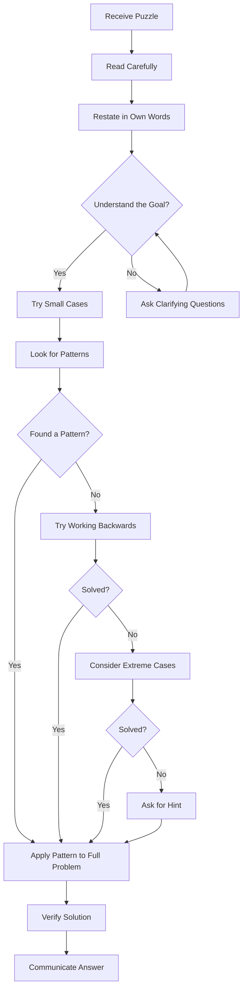
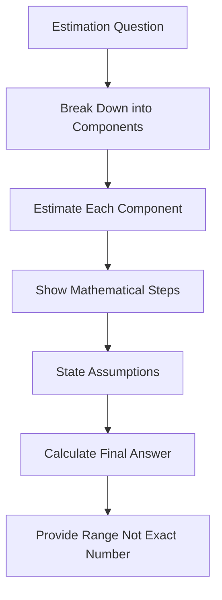
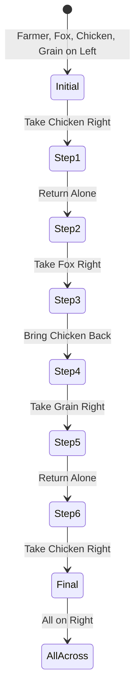

---

## 1. Introduction

### What is Puzzle Solving?
Puzzle solving in interviews refers to brain teasers, logic puzzles, and mathematical challenges that test your analytical thinking, creativity, and problem-solving approach under pressure. Unlike coding problems, puzzles often require lateral thinking, pattern recognition, and the ability to break conventional assumptions.

### Why It Matters for Interviews
Puzzle-solving is used in interviews at:
- **Consulting firms** (McKinsey, BCG, Bain — case interview puzzles)
- **Investment banking** (Goldman Sachs, JP Morgan — brain teasers)
- **Tech companies** (Google, Microsoft — logical reasoning puzzles)
- **Management consulting** (strategic thinking assessment)
- **Product management** (analytical problem-solving)
- **Quantitative finance** (mathematical puzzles)

Puzzles test raw thinking ability, creativity, and how you approach unfamiliar problems — skills that can't be learned from textbooks.

### How It Impacts Your Career
- Demonstrates creative problem-solving ability
- Shows how you think through unfamiliar challenges
- Tests your ability to remain calm under pressure
- Reveals your logical reasoning skills
- Differentiates analytical thinkers from rote learners

---

## 2. Learning Roadmap

```mermaid
graph TD
    A[Puzzle Solving] --> B[Classic Puzzles]
    A --> C[Mathematical Puzzles]
    A --> D[Lateral Thinking]
    A --> E[Interview-Specific]
    B --> B1[Weighing Puzzles]
    B --> B2[River Crossing]
    B --> B3[Hat Puzzles]
    B --> B4[Prisoner Puzzles]
    C --> C1[Probability]
    C --> C2[Combinatorics]
    C --> C3[Number Theory]
    C --> C4[Geometry]
    D --> D1[Breaking Assumptions]
    D --> D2[Creative Solutions]
    D --> D3[Unconventional Thinking]
    E --> E1[Estimation Questions]
    E --> E2[Strategy Puzzles]
    E --> E3[Logic Grids]
    E --> E4[Pattern Recognition]
    F[Frameworks] --> F1[Problem Decomposition]
    F --> F2[Pattern Identification]
    F --> F3[Working Backwards]
    F --> F4[Simplification]
```



### Timeline
| Phase | Duration | Focus |
|-------|----------|-------|
| Week 1 | Days 1-3 | Classic puzzles (weighing, river crossing) |
| Week 1 | Days 4-7 | Mathematical puzzles (probability, numbers) |
| Week 2 | Days 8-10 | Lateral thinking puzzles |
| Week 2 | Days 11-14 | Interview-specific puzzles |
| Week 3 | Days 15-17 | Estimation questions (Fermi problems) |
| Week 3 | Days 18-21 | Practice and mock interviews |

---

## 3. Theory Notes

### 3.1 Puzzle-Solving Framework

**Step 1: Understand the Puzzle**
- Read carefully — every detail matters
- Identify what you know and what you need to find
- Restate the puzzle in your own words
- Ask clarifying questions if anything is ambiguous

**Step 2: Simplify**
- Try a smaller version of the problem
- Solve for n=2, n=3 before tackling the general case
- Remove constraints one by one to build understanding

**Step 3: Identify Patterns**
- Look for patterns in smaller cases
- Consider mathematical relationships
- Think about symmetry and invariants

**Step 4: Work Backwards**
- Start from the desired outcome
- Trace back what conditions must be true
- Identify the minimum steps needed

**Step 5: Consider Extreme Cases**
- What happens with 0 items? 1 item? 2 items?
- What happens with very large numbers?
- Edge cases often reveal the pattern

**Step 6: Verify Your Solution**
- Test with small examples
- Check that your solution satisfies all constraints
- Consider if there's a simpler solution

### 3.2 Classic Puzzles

#### Weighing Puzzles

**Problem:** You have 12 balls. One is either heavier or lighter than the rest. Using a balance scale exactly 3 times, find the odd ball and determine if it's heavier or lighter.

**Solution Strategy:**
1. Divide into 3 groups of 4
2. Weigh group 1 vs group 2
3. Based on result, narrow down to 4 balls
4. Use remaining weighings to identify the ball

**Key Insight:** Each weighing has 3 outcomes (left heavy, right heavy, balanced), giving 3³ = 27 possible outcomes. 12 balls × 2 states (heavy/light) = 24 possibilities. So 3 weighings are sufficient.

#### River Crossing Puzzles

**Problem:** A farmer needs to cross a river with a wolf, a goat, and a cabbage. The boat can carry only one item at a time. The wolf will eat the goat if left alone, and the goat will eat the cabbage if left alone.

**Solution Strategy:**
1. Take the goat across first
2. Return alone
3. Take the wolf across
4. Bring the goat back
5. Take the cabbage across
6. Return alone
7. Take the goat across

**Key Insight:** The goat is the constraint — it conflicts with both the wolf and the cabbage. Handle the goat first, then manage the conflicts.

#### Hat Puzzles

**Problem:** Three prisoners wear hats (3 black, 2 white from a set of 5). Each can see others' hats but not their own. They must guess their hat color without communicating.

**Solution Strategy:**
- Use logic and information from others' guesses
- The first person's guess provides information to others
- Consider what each person can deduce from what they see

### 3.3 Mathematical Puzzles

#### Probability Puzzles

**Monty Hall Problem:**
You pick one of 3 doors. Behind one is a car, behind the others are goats. The host opens a door with a goat. Should you switch?

**Answer:** Yes, always switch. Switching gives 2/3 probability of winning. Staying gives 1/3.

**Birthday Paradox:**
In a room of 23 people, what's the probability two share a birthday?

**Answer:** About 50.7%. (Counterintuitive because we think about matching a specific date, not any match.)

#### Number Theory Puzzles

**Problem:** How many times do the hands of a clock overlap in 12 hours?
**Answer:** 11 times (not 12, because the overlap happens slightly after each hour except 12 o'clock).

**Problem:** What is 111,111,111 × 111,111,111?
**Answer:** 12,345,678,987,654,321 (a palindrome pattern).

#### Combinatorics Puzzles

**Problem:** How many ways can 8 queens be placed on an 8×8 chessboard so no two attack each other?
**Answer:** 92 solutions (12 unique solutions considering symmetry).

### 3.4 Lateral Thinking Puzzles

Lateral thinking requires approaching problems from unexpected angles.

**Example:** A man pushes his car to a hotel and loses his fortune. What happened?
**Answer:** He's playing Monopoly.

**Key approaches:**
1. Challenge assumptions — "car" might not mean a real car
2. Consider context — what scenario makes this make sense?
3. Think about word meanings — multiple interpretations
4. Consider the literal vs. figurative

### 3.5 Interview-Specific Puzzles

#### Estimation Questions (Fermi Problems)

**"How many piano tuners are in Chicago?"**
Approach:
1. Chicago population: ~3 million
2. Households: ~1 million
3. Pianos per household: ~1 in 20 → 50,000 pianos
4. Tunings per year: ~2 → 100,000 tunings
5. Tunings per tuner per day: ~4 → ~1,000 per year
6. Piano tuners needed: 100,000 / 1,000 = ~100

**"How many golf balls fit in a school bus?"**
Approach:
1. Bus volume: ~40ft × 8ft × 8ft = 2,560 cubic feet
2. Golf ball volume: ~2.5 cubic inches
3. Packing efficiency: ~60%
4. Convert and calculate

#### Strategy Puzzles

**"You have 25 horses and 5 race tracks. What's the minimum number of races to find the top 3?"**
**Answer:** 7 races. Race 5 groups of 5, then race the winners, then strategically race remaining candidates.

### 3.6 Puzzle-Solving Patterns

| Pattern | Description | Example |
|---------|------------|---------|
| **Parity** | Even/odd considerations | Light switch puzzles |
| **Invariance** | What stays the same | Tower of Hanoi |
| **Pigeonhole** | More items than containers | Birthday paradox |
| **Modular arithmetic** | Clock arithmetic | Day of week problems |
| **Recursion** | Smaller subproblems | Fibonacci, Tower of Hanoi |
| **Binary search** | Halving the search space | Guessing numbers |
| **Graph theory** | Nodes and connections | River crossing |
| **Contradiction** | Assume opposite, find contradiction | Proof puzzles |

---

## 4. Key Concepts

| Concept | Description | Application |
|---------|------------|-------------|
| Pattern Recognition | Identifying recurring structures | All puzzles |
| Lateral Thinking | Approaching from unexpected angles | Creative puzzles |
| Logical Deduction | Drawing conclusions from premises | Logic puzzles |
| Mathematical Reasoning | Using math to solve | Number puzzles |
| Working Backwards | Starting from the answer | Strategy puzzles |
| Simplification | Solving smaller versions first | Complex puzzles |
| Assumption Challenging | Questioning implicit assumptions | Lateral puzzles |
| Estimation | Approximating with reasonable assumptions | Fermi problems |

---

## 5. Frequently Asked Interview Questions

### Beginner Level

1. **Q: How should I approach a puzzle I've never seen before?**
   A: (1) Read carefully — every word matters. (2) Restate the puzzle. (3) Try small cases. (4) Look for patterns. (5) Consider extreme cases. (6) Work backwards if stuck. (7) Stay calm — the process matters as much as the answer.

2. **Q: What if I can't solve a puzzle?**
   A: Walk through your thought process. Explain what you've tried and why. Interviewers often give hints to see if you can incorporate them. Saying "I don't know but here's how I'd approach it" is better than silence.

3. **Q: Are puzzles about the answer or the process?**
   A: Primarily the process. Interviewers want to see how you think: how you break down problems, handle dead ends, and incorporate feedback. Getting the right answer is great, but showing your thought process is essential.

4. **Q: How do I prepare for puzzle interviews?**
   A: Practice classic puzzles (10-20 common ones), learn the frameworks (simplify, work backwards, look for patterns), and practice explaining your thought process aloud. Do estimation questions regularly.

5. **Q: What's a Fermi problem?**
   A: An estimation question that requires breaking down a seemingly impossible question into reasonable approximations. Example: "How many piano tuners are in Chicago?" The answer doesn't need to be exact — the approach matters.

6. **Q: Should I say "I don't know"?**
   A: It's better to say "I'm not sure, but let me think through this" and show your approach. If truly stuck after trying, saying "I'd approach this by..." shows your thinking even without the final answer.

7. **Q: How long should I spend on a puzzle before asking for a hint?**
   A: Spend 2-3 minutes actively thinking. If stuck, explain your approach and ask: "Am I on the right track?" or "Can you give me a hint?" Interviewers prefer progress over prolonged silence.

8. **Q: What if two puzzles seem similar but have different solutions?**
   A: Treat each puzzle independently. Don't assume the solution is the same just because it looks similar. Read carefully and verify your approach works for the specific puzzle.

### Intermediate Level

9. **Q: How do I solve weighing puzzles?**
   A: Key insight: each weighing has 3 outcomes (left heavy, right heavy, balanced). Use this to narrow down possibilities. Divide into 3 groups when possible. Track what each outcome tells you.

10. **Q: How do I approach estimation questions?**
    A: Break down into components: "I need to estimate X. X depends on A, B, C." Estimate each component using reasonable assumptions. Show your math. State your assumptions clearly. Give a range, not a single number.

11. **Q: What's the Monty Hall problem and why is it counterintuitive?**
    A: You pick one of 3 doors (1 car, 2 goats). Host opens a goat door. Should you switch? YES — switching gives 2/3 chance. It's counterintuitive because people think it's 50/50 after a door opens, but the host's action provides information.

12. **Q: How do I solve river crossing puzzles?**
    A: Identify constraints (what can't be left alone together). Find the bottleneck item. Move the bottleneck first. Then manage conflicts by bringing items back as needed. Model as state transitions.

13. **Q: What's the best approach for probability puzzles?**
    A: Draw a tree diagram or table. List all possible outcomes. Count favorable outcomes. Consider conditional probabilities. Don't rely on intuition — calculate formally.

14. **Q: How do I handle time pressure during puzzles?**
    A: Spend the first minute understanding the puzzle. Then spend 2-3 minutes thinking. If stuck, verbalize your approach and ask for a hint. Don't spend 10 minutes in silence — communicate.

15. **Q: What if the puzzle requires knowledge I don't have?**
    A: State what you know and don't know. Use first principles to reason from what you do know. "I don't know the exact value, but I can reason about it from..."

16. **Q: How do I handle ambiguous puzzles?**
    A: Ask clarifying questions: "By X, do you mean...?" Make reasonable assumptions and state them: "I'll assume X for now." Ambiguity is often intentional — testing your ability to clarify.

### Advanced Level

17. **Q: How do I solve the 12 balls weighing puzzle?**
    A: Divide into 3 groups of 4. Weigh group 1 vs 2. If balanced, odd ball is in group 3. If not, note which side is heavy. Use remaining weighings to isolate among 4 balls. Key: each weighing gives 3 outcomes → 3³ = 27 possibilities cover 24 (12 balls × 2 states).

18. **Q: How do I approach puzzles with infinite scenarios?**
    A: Consider invariants — what stays the same regardless of actions? Think about parity (even/odd). Look for mathematical properties that constrain the solution space.

19. **Q: What's the strategy for the 25 horses puzzle?**
    A: Race 5 groups of 5 (5 races). Race the 5 winners (6th race). The fastest horse is the winner of race 6. For 2nd and 3rd, consider only horses that could possibly be in the top 3 (at most 5 candidates). Race them (7th race).

20. **Q: How do I solve puzzles that seem impossible?**
    A: Step back and consider: Am I making wrong assumptions? Is there a simpler version? Can I work backwards? Is there a mathematical shortcut? Sometimes the answer is surprisingly simple once you see the right perspective.

### FAANG Level

21. **Q: How does Google use puzzle interviews?**
    A: Google uses puzzles in some interviews to assess raw problem-solving ability. They look for creative approaches, logical reasoning, and how you handle unfamiliar challenges. The process matters more than the answer.

22. **Q: What's the relationship between puzzles and system design?**
    A: Both require breaking down complex problems, identifying constraints, and finding elegant solutions. Puzzles test the thinking skills needed for system design: abstraction, pattern recognition, and creative problem-solving.

23. **Q: How do you approach puzzles you've seen before in an interview?**
    A: Don't reveal you've seen it. Solve it as if new, demonstrating your thought process. Use the opportunity to show thorough analysis and discuss alternatives you might not have considered before.

24. **Q: What makes someone excellent at puzzle interviews?**
    A: (1) Structured approach (not random guessing). (2) Clear communication of thought process. (3) Willingness to try different approaches. (4) Calm under pressure. (5) Ability to incorporate hints. (6) Creative thinking.

25. **Q: How do you prepare for estimation/Fermi questions?**
    A: Practice breaking down complex questions into components. Build a mental database of common estimates (US population, number of cars, etc.). Practice order-of-magnitude reasoning. Do 2-3 Fermi questions daily.

---

## 6. Hands-on Practice

### Exercise 1: River Crossing
A farmer needs to cross a river with a fox, a chicken, and a bag of grain. The boat can carry only the farmer and one item. The fox eats the chicken if left alone, and the chicken eats the grain if left alone. How does the farmer get everything across?

**Solution:**
1. Take chicken across
2. Return alone
3. Take fox across
4. Bring chicken back
5. Take grain across
6. Return alone
7. Take chicken across

### Exercise 2: Weighing Puzzle
You have 9 balls. One is heavier. Using a balance scale only 2 times, find the heavy ball.

**Solution:**
1. Divide into 3 groups of 3
2. Weigh group 1 vs group 2
3. If balanced → heavy ball is in group 3
4. If not → heavy ball is on the heavier side
5. Weigh 2 balls from the identified group
6. If balanced → the third ball is heavy
7. If not → the heavier ball is identified

### Exercise 3: Estimation Question
Estimate how many tennis balls can fit in a room.

**Approach:**
1. Room dimensions: ~10m × 10m × 3m = 300 m³
2. Tennis ball diameter: ~6.7cm = 0.067m
3. Tennis ball volume: ~1.57 × 10⁻⁴ m³
4. Packing efficiency: ~60% (random packing)
5. Calculation: (300 × 0.6) / (1.57 × 10⁻⁴) ≈ 1.15 million

### Exercise 4: Logic Puzzle
Five houses in a row, each a different color. Each owner has a different nationality, pet, drink, and cigarette brand. Using 15 clues, determine who owns the fish.

(This is the Einstein's Riddle — a classic logic grid puzzle)

**Approach:** Create a 5×5 grid. Use process of elimination with each clue.

### Exercise 5: Probability Puzzle
You flip a fair coin 3 times. What's the probability of getting at least 2 heads?

**Solution:**
- Total outcomes: 2³ = 8
- Favorable: HHT, HTH, THH, HHH = 4
- Probability: 4/8 = 1/2 = 50%

### Exercise 6: Number Pattern
What comes next: 1, 11, 21, 1211, 111221, ?

**Answer:** 312211 (Each term describes the previous: "3 ones, 2 twos, 1 one")

### Exercise 7: Lateral Thinking
A man is found dead in a room with 53 bicycles. How did he die?

**Answer:** He was cheating at cards (Bicycle is a brand of playing cards). The 53 bicycles (cards) indicate he was caught cheating.

### Exercise 8: Strategy Puzzle
You have 100 lockers in a row, all closed. 100 students walk by. Student 1 opens every locker. Student 2 toggles every 2nd locker. Student 3 toggles every 3rd locker, etc. Which lockers are open at the end?

**Answer:** Lockers with perfect square numbers (1, 4, 9, 16, 25, 36, 49, 64, 81, 100). A locker is toggled once for each of its factors. Perfect squares have an odd number of factors.

### Exercise 9: Estimation Question
How many barbers are there in Chicago?

**Approach:**
1. Chicago population: ~2.7 million
2. Males: ~1.35 million
3. Males who get haircuts: ~80% → 1.08 million
4. Haircuts per year: ~12 → 12.96 million haircuts
5. Haircuts per barber per day: ~8 → ~2,000 per year
6. Barbers needed: 12.96M / 2,000 ≈ 6,500

### Exercise 10: Hat Puzzle
Three people (A, B, C) each have a hat — either red or blue. They can see each other's hats but not their own. They simultaneously guess their hat color. How can at least one person guarantee a correct guess?

**Answer:** Each person guesses the color that makes the total number of red hats even. Since there are only 2 possible parity states (even or odd), and 3 people guessing, at least one person's strategy will be correct.

---

## 7. Real FAANG Interview Questions

| Company | Puzzle Type | Example | Difficulty |
|---------|------------|---------|------------|
| Google | Estimation | How many golf balls fit in a school bus? | Medium |
| Google | Logic | 100 lockers puzzle | Medium |
| Amazon | Strategy | 25 horses puzzle | Hard |
| Amazon | Probability | Monty Hall variant | Medium |
| McKinsey | Estimation | How many coffee shops in NYC? | Medium |
| BCG | Strategy | Pirate gold distribution | Hard |
| Goldman Sachs | Brain teaser | Clock hands overlap | Easy |
| Microsoft | Logic | Poisoned wine puzzle | Hard |
| Meta | Lateral thinking | Man in room with bicycles | Medium |
| Apple | Probability | Card drawing probability | Medium |

---

## 8. Common Mistakes

| Mistake | Description | How to Avoid |
|---------|------------|--------------|
| Rushing to answer | Giving an answer without thinking | Take 1-2 minutes to think first |
| Not communicating | Thinking in silence | Verbalize your thought process |
| Giving up too quickly | Saying "I don't know" immediately | Try at least one approach |
| Ignoring details | Missing key information in the puzzle | Read carefully, note every detail |
| Not testing solution | Assuming your answer is correct | Verify with small examples |
| Overthinking | Making it more complex than needed | Start with the simplest approach |
| Not asking questions | Accepting ambiguous puzzles | Clarify if anything is unclear |
| Tunnel vision | Stuck on one approach | Consider alternative approaches |
| Mathematical errors | Calculation mistakes | Double-check your math |
| Not using frameworks | Solving randomly | Apply simplify → pattern → solve |

---

## 9. Best Practices

1. **Read the puzzle carefully** — Every word matters. Read it twice if needed.
2. **Restate the puzzle** — Confirm your understanding by restating it.
3. **Start with small cases** — Solve for n=2, n=3 to find patterns.
4. **Think aloud** — Explain your approach, even if uncertain.
5. **Look for patterns** — Mathematical, logical, or structural patterns.
6. **Work backwards** — Start from the answer and trace back.
7. **Consider extreme cases** — 0, 1, or very large numbers.
8. **Challenge assumptions** — Question what you take for granted.
9. **Ask clarifying questions** — Don't make unnecessary assumptions.
10. **Verify your answer** — Test with examples and edge cases.
11. **Practice regularly** — Do 1-2 puzzles daily.
12. **Learn from solutions** — After attempting, study the solution thoroughly.

---

## 10. Cheat Sheet

```
+---------------------------------------------------------------+
|            PUZZLE SOLVING CHEAT SHEET                          |
+---------------------------------------------------------------+
|                                                               |
|  PUZZLE-SOLVING FRAMEWORK                                     |
|  1. Understand — read carefully, restate                      |
|  2. Simplify — try small cases                                |
|  3. Pattern — look for recurring structures                   |
|  4. Work backwards — start from the answer                    |
|  5. Verify — test with examples                               |
|                                                               |
|  COMMON PATTERNS                                              |
|  Parity         - Even/odd considerations                     |
|  Pigeonhole     - More items than containers                  |
|  Invariance     - What stays the same                        |
|  Binary search  - Halving the search space                    |
|  Recursion      - Smaller subproblems                        |
|  Modular arith  - Clock arithmetic                           |
|  Contradiction  - Assume opposite, find contradiction        |
|                                                               |
|  ESTIMATION FRAMEWORK (Fermi)                                 |
|  1. Break down the question                                  |
|  2. Estimate each component                                  |
|  3. Show your math                                           |
|  4. State assumptions                                        |
|  5. Give a range                                            |
|                                                               |
|  CLASSIC PUZZLES TO KNOW                                      |
|  - Weighing puzzles (balance scale)                          |
|  - River crossing (constraints)                              |
|  - Hat puzzles (deduction)                                   |
|  - Monty Hall (probability)                                  |
|  - 25 horses (strategy)                                      |
|  - 100 lockers (invariant)                                   |
|  - 12 balls weighing (3 weighings)                           |
|                                                               |
|  WHEN STUCK                                                   |
|  1. Try a smaller version                                    |
|  2. Consider extreme cases                                   |
|  3. Work backwards from the answer                           |
|  4. Challenge your assumptions                               |
|  5. Ask for a hint                                           |
|                                                               |
+---------------------------------------------------------------+
```

---

## 11. Flash Cards

| # | Question | Answer |
|---|----------|--------|
| 1 | What is the Monty Hall problem? | Switch doors — gives 2/3 probability of winning |
| 2 | How many outcomes per weighing? | 3 (left heavy, right heavy, balanced) |
| 3 | In the river crossing puzzle, what's the constraint? | Goat conflicts with both wolf and cabbage |
| 4 | What's a Fermi problem? | Estimation question broken into components |
| 5 | What are the 100 lockers that stay open? | Perfect squares (1, 4, 9, 16, 25, 36, 49, 64, 81, 100) |
| 6 | How many races for 25 horses, 5 tracks? | 7 races |
| 7 | Birthday paradox: 23 people, probability of shared birthday? | ~50.7% |
| 8 | What is lateral thinking? | Approaching problems from unexpected angles |
| 9 | What's the first step in solving a puzzle? | Understand it — read carefully and restate |
| 10 | What's the pigeonhole principle? | If n+1 items go into n containers, one has 2+ |
| 11 | How many times do clock hands overlap in 12 hours? | 11 times |
| 12 | What's 111,111,111 × 111,111,111? | 12,345,678,987,654,321 |
| 13 | What's the key to estimation questions? | Break down into components, show math |
| 14 | What's working backwards? | Starting from the answer and tracing back |
| 15 | How many piano tuners in Chicago? | ~100 (Fermi estimation) |
| 16 | What's the key to probability puzzles? | List all outcomes, count favorable ones |
| 17 | How do you handle ambiguous puzzles? | Ask clarifying questions, state assumptions |
| 18 | What's the best way to prepare? | Practice 1-2 puzzles daily, learn frameworks |
| 19 | What matters more — the answer or the process? | The process (how you think) matters more |
| 20 | When should you ask for a hint? | After 2-3 minutes of active thinking |

---

## 12. Mind Map

```
Puzzle Solving
│
├── Classic Puzzles
│   ├── Weighing Puzzles (balance scale)
│   ├── River Crossing (constraint management)
│   ├── Hat Puzzles (deduction)
│   ├── Prisoner Puzzles (logic)
│   └── Tower of Hanoi (recursion)
│
├── Mathematical Puzzles
│   ├── Probability (Monty Hall, cards)
│   ├── Number Theory (patterns, sequences)
│   ├── Combinatorics (counting, arrangements)
│   ├── Geometry (spatial reasoning)
│   └── Modular Arithmetic (clock problems)
│
├── Lateral Thinking
│   ├── Breaking Assumptions
│   ├── Word Puzzles
│   ├── Unconventional Solutions
│   └── Creative Connections
│
├── Interview-Specific
│   ├── Estimation (Fermi problems)
│   ├── Strategy Puzzles
│   ├── Logic Grids
│   └── Pattern Recognition
│
├── Frameworks
│   ├── Simplify (small cases)
│   ├── Pattern Recognition
│   ├── Working Backwards
│   ├── Extreme Cases
│   └── Assumption Challenging
│
└── Key Skills
    ├── Analytical Thinking
    ├── Creative Problem-Solving
    ├── Mathematical Reasoning
    ├── Clear Communication
    └── Calm Under Pressure
```

---

## 13. Mermaid Diagrams

### Diagram 1: Puzzle-Solving Decision Tree


### Diagram 2: Estimation Framework


### Diagram 3: River Crossing State Space


---

## 14. Code Examples

### Example 1: 100 Lockers Puzzle
```python
def locker_puzzle(num_lockers=100):
    """
    100 lockers, all closed.
    Student 1 toggles every locker.
    Student 2 toggles every 2nd locker.
    Student 3 toggles every 3rd locker.
    ...etc.
    Which lockers are open?
    """
    lockers = [False] * (num_lockers + 1)  # False = closed

    for student in range(1, num_lockers + 1):
        for locker in range(student, num_lockers + 1, student):
            lockers[locker] = not lockers[locker]

    open_lockers = [i for i in range(1, num_lockers + 1) if lockers[i]]
    return open_lockers

result = locker_puzzle()
print(f"Open lockers: {result}")
print(f"Number of open lockers: {len(result)}")
print(f"These are perfect squares: {[i*i for i in range(1, 11)]}")
```

### Example 2: Monty Hall Simulation
```python
import random

def monty_hall_simulation(num_trials=100000, switch=True):
    """
    Simulate the Monty Hall problem.
    Returns win rate for given strategy.
    """
    wins = 0

    for _ in range(num_trials):
        # Place car behind random door
        doors = [0, 0, 0]
        car = random.randint(0, 2)
        doors[car] = 1

        # Player picks a door
        player_pick = random.randint(0, 2)

        # Host opens a door with a goat
        available = [i for i in range(3) if i != player_pick and doors[i] == 0]
        host_opens = random.choice(available)

        # Strategy: switch or stay
        if switch:
            player_pick = [i for i in range(3) if i != player_pick and i != host_opens][0]

        if doors[player_pick] == 1:
            wins += 1

    return wins / num_trials

stay_rate = monty_hall_simulation(switch=False)
switch_rate = monty_hall_simulation(switch=True)
print(f"Stay win rate: {stay_rate:.3f}")   # ~0.333
print(f"Switch win rate: {switch_rate:.3f}")  # ~0.667
```

### Example 3: Fermi Estimation Calculator
```python
class FermiEstimator:
    def __init__(self, question):
        self.question = question
        self.assumptions = []
        self.components = {}

    def add_assumption(self, assumption):
        self.assumptions.append(assumption)

    def add_component(self, name, value, unit=""):
        self.components[name] = {"value": value, "unit": unit}

    def calculate(self, formula):
        result = formula(self.components)
        return result

    def display(self, result):
        print(f"\nQuestion: {self.question}")
        print(f"\nAssumptions:")
        for a in self.assumptions:
            print(f"  - {a}")
        print(f"\nComponents:")
        for name, data in self.components.items():
            print(f"  {name}: {data['value']:,} {data['unit']}")
        print(f"\nEstimated Answer: {result:,}")

# Example: How many piano tuners in Chicago?
estimator = FermiEstimator("How many piano tuners are in Chicago?")
estimator.add_assumption("Chicago population: ~3 million")
estimator.add_assumption("About 1 in 20 households has a piano")
estimator.add_assumption("Each piano is tuned twice per year")
estimator.add_assumption("A tuner can tune 4 pianos per day, 250 days/year")

estimator.add_component("population", 3000000, "people")
estimator.add_component("household_size", 2.5, "people")
estimator.add_component("piano_rate", 0.05, "pianos/household")
estimator.add_component("tunings_per_year", 2, "tunings/piano")
estimator.add_component("tunings_per_tuner", 1000, "tunings/tuner/year")

result = estimator.calculate(lambda c: int(
    (c["population"]["value"] / c["household_size"]["value"]) *
    c["piano_rate"]["value"] *
    c["tunings_per_year"]["value"] /
    c["tunings_per_tuner"]["value"]
))

estimator.display(result)
```

### Example 4: River Crossing Solver
```python
from itertools import combinations

def river_crossing_solver():
    """
    Solve the fox-chicken-grain puzzle using state-space search.
    State: (farmer_side, fox_side, chicken_side, grain_side)
    0 = left, 1 = right
    """
    def is_valid(state):
        f, fo, c, g = state
        # Fox and chicken on same side without farmer
        if fo == c and f != fo:
            return False
        # Chicken and grain on same side without farmer
        if c == g and f != c:
            return False
        return True

    def get_moves(state):
        f, fo, c, g = state
        moves = []
        items = [("fox", 1), ("chicken", 2), ("grain", 3)]

        # Farmer moves alone
        new_state = list(state)
        new_state[0] = 1 - f
        if is_valid(tuple(new_state)):
            moves.append((tuple(new_state), "Farmer crosses alone"))

        # Farmer takes an item
        for name, idx in items:
            if state[idx] == f:  # Item is on same side as farmer
                new_state = list(state)
                new_state[0] = 1 - f
                new_state[idx] = 1 - state[idx]
                if is_valid(tuple(new_state)):
                    moves.append((tuple(new_state), f"Farmer takes {name}"))

        return moves

    initial = (0, 0, 0, 0)
    goal = (1, 1, 1, 1)

    # BFS to find shortest solution
    queue = [(initial, [])]
    visited = {initial}

    while queue:
        state, path = queue.pop(0)
        if state == goal:
            return path

        for new_state, action in get_moves(state):
            if new_state not in visited:
                visited.add(new_state)
                queue.append((new_state, path + [action]))

    return None

solution = river_crossing_solver()
print("Solution:")
for i, step in enumerate(solution, 1):
    print(f"  Step {i}: {step}")
```

---

## 15. Projects

### Mini Project 1: Puzzle Generator
Build a tool that generates random puzzles (weighing, logic, probability) with solutions.

### Mini Project 2: Estimation Practice App
Create an app that presents Fermi estimation questions and evaluates your approach.

### Mini Project 3: Logic Grid Solver
Develop a solver for logic grid puzzles (like Einstein's Riddle).

### Intermediate Project 1: Puzzle Bank
Build a comprehensive database of puzzles categorized by type, difficulty, and solution approach.

### Intermediate Project 2: River Crossing Simulator
Create an interactive simulator for river crossing puzzles with different constraint sets.

### Advanced Project 1: AI Puzzle Solver
Build an AI that can solve novel puzzles using constraint satisfaction and search algorithms.

### Advanced Project 2: Puzzle Interview Trainer
Develop a full training platform with timed puzzles, solution explanations, and progress tracking.

### Project Ideas (10 total)
1. Weighing puzzle simulator with visual scale
2. Probability calculator for card/coin puzzles
3. Fermi estimation practice with auto-scoring
4. Logic puzzle generator and solver
5. Tower of Hanoi visual solver
6. N-Queens visual solver
7. Sudoku solver with explanation
8. Knight's tour solver
9. Maze generator and solver
10. Cryptarithmetic puzzle solver

---

## 16. Resources

### Practice Websites
| Website | URL | Focus |
|---------|-----|-------|
| Brilliant | brilliant.org | Math and logic puzzles |
| Project Euler | projecteuler.net | Mathematical puzzles |
| Math is Fun | mathsisfun.com | Logic puzzles |
| Brainzilla | brainzilla.com | Logic and thinking puzzles |
| Puzzle Prime | puzzleprime.com | Various puzzles |

### Books
| Book | Author | Level |
|------|--------|-------|
| *The Art and Craft of Problem Solving* | Paul Zeitz | Intermediate |
| *Algorithmic Puzzles* | Levitin & Levitin | Advanced |
| *My Best Mathematical and Logic Puzzles* | Martin Gardner | All levels |
| *The Moscow Puzzles* | Boris Kordemsky | Beginner |
| *Heard on the Street* | Timothy Crack | Interview-focused |

### Documentation
- Project Euler Problem Archive
- Brilliant.org Problem Sets
- Art of Problem Solving (AoPS)
- MIT OpenCourseWare (Logic)

### YouTube Channels
| Channel | Focus |
|---------|-------|
| MindYourDecisions | Math and logic puzzles |
| Numberphile | Number theory puzzles |
| Veritasium | Science and logic |
| Computerphile | Algorithmic puzzles |
| 3Blue1Brown | Mathematical visualization |

### Blogs
- MindYourDecisions Blog
- Math Overflow
- Art of Problem Solving Forum
- Brilliant Wiki
- Cut-the-Knot (Alexander Bogomolny)

### Certifications
- AMC/AIME (American Mathematics Competitions)
- MATHCOUNTS
- International Math Olympiad preparation
- Brilliant.org Certificates

---

## 17. Checklist

- [ ] I know the puzzle-solving framework (understand → simplify → pattern → solve → verify)
- [ ] I can solve classic weighing puzzles
- [ ] I can solve river crossing puzzles
- [ ] I can solve probability puzzles (Monty Hall, etc.)
- [ ] I can do Fermi estimation questions
- [ ] I can solve logic grid puzzles
- [ ] I can solve strategy puzzles (25 horses, etc.)
- [ ] I can work backwards from an answer
- [ ] I can identify patterns in number sequences
- [ ] I can solve lateral thinking puzzles
- [ ] I can explain my thought process clearly
- [ ] I can handle time pressure
- [ ] I can ask clarifying questions
- [ ] I can incorporate hints effectively
- [ ] I can verify my solutions with examples
- [ ] I have practiced 20+ different puzzles
- [ ] I feel confident about puzzle interviews

---

## 18. Revision Notes

### Key Frameworks
1. **Understand → Simplify → Pattern → Solve → Verify**
2. **Work backwards from the answer**
3. **Try small cases first (n=2, n=3)**
4. **Consider extreme cases (0, 1, very large)**
5. **Challenge your assumptions**

### One-Day Revision Plan
| Time | Activity |
|------|----------|
| Morning (1.5 hrs) | Review classic puzzles with solutions |
| Mid-morning (1 hr) | Practice estimation questions (3 Fermi problems) |
| Afternoon (2 hrs) | Solve 5 puzzles from different categories |
| Late afternoon (1 hr) | Practice explaining solutions aloud |
| Evening (1.5 hrs) | Mock puzzle interview session |

### One-Week Revision Plan
| Day | Focus |
|-----|-------|
| Monday | Weighing and balance puzzles |
| Tuesday | River crossing and constraint puzzles |
| Wednesday | Probability puzzles |
| Thursday | Estimation (Fermi) questions |
| Friday | Logic grid puzzles |
| Saturday | Strategy puzzles |
| Sunday | Full mock puzzle interview |

---

## 19. Mock Interview Questions

### Round 1: Quick Puzzles (5 minutes each)
1. Monty Hall problem
2. Clock hands overlap (how many times in 12 hours?)
3. What's 111,111,111 × 111,111,111?
4. 100 lockers puzzle
5. How many golf balls fit in a school bus?

### Round 2: Strategy Puzzles (10 minutes each)
1. 25 horses puzzle
2. Poisoned wine puzzle
3. Pirate gold distribution
4. Blue-eyed islanders

### Round 3: Estimation (10 minutes each)
1. How many barbers in Chicago?
2. How many piano tuners in the US?
3. How many tennis balls are used in Wimbledon?
4. How many gas stations are in the US?

### Round 4: Lateral Thinking (5 minutes each)
1. A man pushes his car to a hotel and loses his fortune
2. What appears once in a minute, twice in a moment, but never in a thousand years?
3. I have cities but no houses, mountains but no trees

---

## 20. Difficulty Rating

| Puzzle Type | Difficulty (1-5) | Interview Frequency | Priority |
|-------------|-------------------|--------------------|----|
| Estimation (Fermi) | 3 | Very High | Must Know |
| Basic Logic | 2 | High | Should Know |
| Probability | 3 | High | Should Know |
| Weighing Puzzles | 4 | Medium | Should Know |
| River Crossing | 3 | Medium | Nice to Know |
| Strategy Puzzles | 4 | Medium | Should Know |
| Lateral Thinking | 3 | Medium | Nice to Know |
| Number Patterns | 2 | Medium | Nice to Know |
| Logic Grids | 4 | Low | Nice to Know |
| Hat Puzzles | 4 | Low | Nice to Know |

---

## 21. Summary

Puzzle-solving interviews test your raw thinking ability, creativity, and approach to unfamiliar challenges. They're used by consulting firms, investment banks, and tech companies to identify analytical thinkers.

**Key Takeaways:**
- Master the puzzle-solving framework (understand → simplify → pattern → solve → verify)
- Practice 10-20 classic puzzles and their solutions
- Learn to do Fermi estimation questions
- Always communicate your thought process
- Start with small cases to find patterns
- Work backwards when stuck
- Challenge your assumptions
- Verify your solutions with examples
- Practice under time pressure

**Interview Success Formula:**
Puzzle Success = Framework + Practice + Communication + Creativity

**Next Steps:**
1. Learn 10 classic puzzles and their solutions
2. Practice 3 Fermi estimation questions daily
3. Learn the puzzle-solving framework
4. Practice explaining your thought process
5. Do mock puzzle interviews with friends
6. Review solutions to understand the patterns

---

*Last Updated: July 2026*
*Total Sections: 21*
*Estimated Study Time: 3 weeks (1-2 hours daily)*

