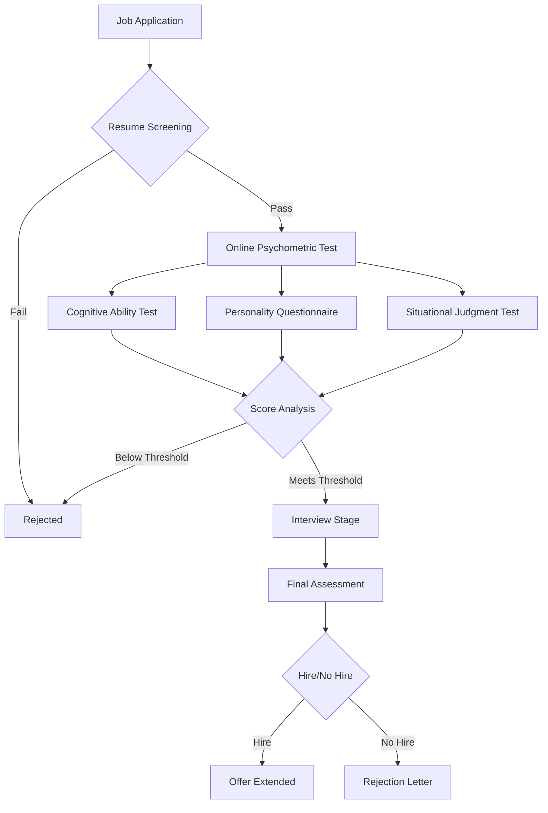
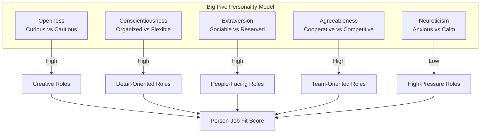
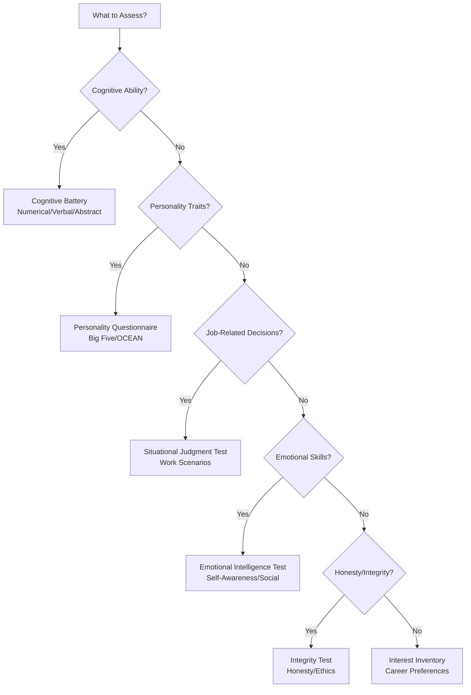

---

## Table of Contents

1. [Introduction](#1-introduction)
2. [Learning Roadmap](#2-learning-roadmap)
3. [Theory Notes](#3-theory-notes)
4. [Key Concepts](#4-key-concepts)
5. [Interview Questions & Answers](#5-interview-questions--answers)
6. [Hands-on Practice](#6-hands-on-practice)
7. [FAANG Interview Questions](#7-faang-interview-questions)
8. [Common Mistakes to Avoid](#8-common-mistakes-to-avoid)
9. [Best Practices](#9-best-practices)
10. [Cheat Sheet](#10-cheat-sheet)
11. [Flash Cards](#11-flash-cards)
12. [Mind Map](#12-mind-map)
13. [Mermaid Diagrams](#13-mermaid-diagrams)
14. [Code Examples](#14-code-examples)
15. [Projects & Ideas](#15-projects--ideas)
16. [Resources](#16-resources)
17. [Interview Preparation Checklist](#17-interview-preparation-checklist)
18. [Revision Notes](#18-revision-notes)
19. [Mock Interview Questions](#19-mock-interview-questions)
20. [Difficulty Rating](#20-difficulty-rating)
21. [Summary](#21-summary)

---

## 1. Introduction

Psychometric tests are standardized assessments used by employers to measure candidates' mental capabilities, behavioral style, and cognitive aptitude. These tests go beyond technical skills to evaluate how candidates think, solve problems, and interact with others. Companies use psychometric testing as part of their hiring process to predict job performance, cultural fit, and long-term potential.

### Why Psychometric Tests Matter

- **Objective measurement** — Remove bias from hiring decisions
- **Predictive validity** — Correlate with actual job performance
- **Large-scale screening** — Efficiently filter thousands of applicants
- **Holistic assessment** — Evaluate personality, not just skills
- **Standardized comparison** — Compare candidates across backgrounds

### Types of Psychometric Tests

| Test Type | Purpose | Duration | Questions |
|-----------|---------|----------|-----------|
| Personality Questionnaire | Assess behavioral traits | 20-40 min | 50-200 |
| Cognitive Ability Test | Measure reasoning skills | 30-60 min | 20-50 |
| Situational Judgment | Evaluate decision-making | 20-30 min | 15-25 |
| Emotional Intelligence | Assess emotional awareness | 15-30 min | 30-60 |
| Integrity Test | Measure honesty/ethics | 10-20 min | 20-40 |
| Interest Inventory | Match career preferences | 15-30 min | 50-100 |
| Mechanical Comprehension | Test mechanical reasoning | 20-30 min | 20-30 |
| Abstract Reasoning | Measure pattern recognition | 15-25 min | 15-25 |

---

## 2. Learning Roadmap

### Phase 1: Understanding (Days 1-3)
- Learn what psychometric tests measure
- Understand the science behind psychometrics
- Identify which tests you'll encounter
- Take a free practice test online

### Phase 2: Cognitive Preparation (Days 4-7)
- Practice numerical reasoning daily
- Work on verbal reasoning exercises
- Train logical/abstract reasoning patterns
- Build speed with timed practice

### Phase 3: Personality Preparation (Days 8-10)
- Research target company culture
- Understand desired role traits
- Practice self-awareness exercises
- Learn about Big Five personality model

### Phase 4: Situational Practice (Days 11-13)
- Study situational judgment frameworks
- Practice work scenario decisions
- Review leadership and teamwork scenarios
- Time yourself on practice tests

### Phase 5: Full Simulation (Days 14-15)
- Take complete timed practice tests
- Review results and identify weaknesses
- Retake tests to improve scores
- Build test-day confidence

---

## 3. Theory Notes

### 3.1 The Science of Psychometrics

Psychometrics is the field of study concerned with the theory and technique of psychological measurement. It combines psychology, statistics, and measurement theory to create reliable and valid assessment tools.

**Key Principles:**
- **Reliability** — Consistency of results across multiple administrations
- **Validity** — Whether the test measures what it claims to measure
- **Norms** — Reference groups for comparing scores
- **Standardization** — Uniform administration and scoring procedures

### 3.2 Big Five Personality Model (OCEAN)

The Big Five is the most widely accepted personality framework in industrial-organizational psychology.

| Trait | High Score | Low Score |
|-------|-----------|-----------|
| **Openness** | Creative, curious, adventurous | Practical, conventional, routine-seeking |
| **Conscientiousness** | Organized, dependable, disciplined | Flexible, spontaneous, easy-going |
| **Extraversion** | Outgoing, energetic, talkative | Reserved, solitary, reflective |
| **Agreeableness** | Cooperative, trusting, helpful | Competitive, skeptical, challenging |
| **Neuroticism** | Anxious, moody, emotionally reactive | Calm, confident, emotionally stable |

### 3.3 Cognitive Ability Domains

**Fluid Intelligence (Gf):**
- Novel problem-solving
- Pattern recognition
- Abstract reasoning
- Independent of acquired knowledge

**Crystallized Intelligence (Gc):**
- Vocabulary and verbal comprehension
- General knowledge
- Learned skills and procedures
- Accumulated experience

**Working Memory (Gwm):**
- Holding and manipulating information
- Sequential processing
- Attention control

**Processing Speed (Gs):**
- Speed of mental operations
- Reaction time
- Perceptual speed

### 3.4 Validity and Reliability

**Types of Validity:**
- **Content validity** — Test covers the full domain
- **Criterion validity** — Scores correlate with outcomes
- **Construct validity** — Measures the intended construct

**Types of Reliability:**
- **Test-retest** — Consistency over time
- **Internal consistency** — Items measure the same construct
- **Inter-rater** — Agreement between scorers

---

## 4. Key Concepts

### 4.1 Personality Assessment Concepts

**Social Desirability Bias:**
The tendency to present oneself favorably rather than honestly. Tests use embedded lie detector items and consistency checks to identify this.

**Forced-Choice Format:**
When candidates must choose between equally desirable options, reducing social desirability bias.

**Ipsative Scoring:**
Comparing a candidate's scores against their own other scores rather than against a norm group.

**Normative Scoring:**
Comparing a candidate's scores against a reference population.

### 4.2 Cognitive Test Concepts

**Item Response Theory (IRT):**
A paradigm for the design, analysis, and scoring of tests where:
- Item difficulty is estimated alongside ability
- Each item provides information about the trait
- More precise at extreme ability levels

**Classical Test Theory (CTT):**
Observed Score = True Score + Error

**Speeded vs. Power Tests:**
- **Speeded** — Limited time, most people won't finish
- **Power** — Sufficient time, difficulty determines score

**Adaptive Testing:**
Questions adjust difficulty based on previous answers, providing more accurate measurement with fewer items.

### 4.3 Situational Judgment Test Concepts

**Critical Incident Technique:**
Based on real workplace scenarios that differentiate successful from unsuccessful performers.

**Behavioral Anchors:**
Scale points described in terms of specific behaviors rather than abstract labels.

**Face Validity:**
Whether the test appears to measure what it claims to measure, affecting candidate perception.

---

## 5. Interview Questions & Answers

### Personality Assessment Questions

**Q1: What is the difference between normative and ipsative scoring?**
**A:** Normative scoring compares your results against a reference population (e.g., scoring in the 75th percentile means you scored higher than 75% of people). Ipsative scoring compares your results against your own other scores, forcing a ranking of your traits relative to each other. Normative scoring tells us how you compare to others; ipsative scoring tells us your internal trait priorities.

**Q2: How do psychometric tests detect dishonest or socially desirable responding?**
**A:** Tests use several methods: (1) Embedded lie detector items with extreme statements ("I always tell the truth"), (2) Consistency checks where similar questions are asked in different ways, (3) Impression management scales that measure social desirability directly, (4) Infrequency scales that flag unlikely response patterns, and (5) Forced-choice items that make it harder to fake because both options seem equally desirable.

**Q3: Why is the Big Five model preferred over MBTI for hiring?**
**A:** The Big Five has strong empirical support with high test-retest reliability and predictive validity for job performance. MBTI has poor reliability (many people get different types on retakes), uses forced dichotomies instead of dimensions, and lacks evidence for predictive validity in workplace settings. The Big Five's continuous scoring provides more nuanced and actionable information.

**Q4: Can you really be prepared for a personality test?**
**A:** While you shouldn't try to "fake" a personality test (inconsistencies will be flagged and it can lead to poor job fit), you can prepare by: (1) Understanding the role requirements and company culture, (2) Taking practice tests to reduce anxiety, (3) Being consistently authentic rather than inconsistent, (4) Understanding that there are no universally "right" answers, and (5) Ensuring adequate rest so you respond naturally rather than impulsively.

**Q5: What is a T-score and how is it interpreted?**
**A:** A T-score is a standardized score with a mean of 50 and standard deviation of 10. A T-score of 60 means you scored one standard deviation above the mean. In personality testing, T-scores help compare results across different scales. Generally, scores between 40-60 are average, 60-70 are moderately high, and above 70 are very high. Below 40 is moderately low and below 30 is very low.

### Cognitive Test Questions

**Q6: What is the difference between fluid and crystallized intelligence?**
**A:** Fluid intelligence (Gf) is the ability to solve novel problems independent of prior knowledge — it involves pattern recognition, abstract reasoning, and quick thinking. Crystallized intelligence (Gc) is accumulated knowledge and skills — vocabulary, general knowledge, and learned procedures. Fluid intelligence tends to decline with age while crystallized intelligence remains stable or increases.

**Q7: How does adaptive testing work?**
**A:** Adaptive testing starts with a medium-difficulty question. If answered correctly, the next question becomes harder; if answered incorrectly, it becomes easier. This process continues until the system determines your ability level with high precision. Benefits include: fewer questions needed, shorter test time, reduced frustration from overly easy/hard items, and more accurate measurement at the tails of the ability distribution.

**Q8: What is a good strategy for numerical reasoning tests?**
**A:** (1) Read the question before examining data to know what to look for, (2) Estimate first — many answers can be eliminated through approximation, (3) Check units and scales carefully, (4) Practice mental math for speed calculations, (5) Watch for common traps like percentages vs. absolute numbers, (6) Use process of elimination, and (7) Don't spend too long on any single question.

**Q9: What does g-factor measure?**
**A:** The g-factor (general intelligence factor) represents the underlying cognitive ability that influences performance across all mental tasks. It was discovered by Charles Spearman and accounts for the positive correlations between different cognitive abilities. High g-factor correlates with faster learning, better problem-solving, and higher academic achievement. It's measured through factor analysis of multiple cognitive tests.

**Q10: How are situational judgment tests scored?**
**A:** SJTs are typically scored by comparing responses to expert-generated keys. There are two main scoring methods: (1) Consensus scoring — the most popular response receives the most points, (2) Expert scoring — responses are weighted according to how well they align with expert judgments. Some SJTs also assess the reasoning behind choices through follow-up questions, evaluating the decision-making process, not just the outcome.

---

## 6. Hands-on Practice

### Practice Test 1: Numerical Reasoning (10 minutes)

**Question 1:** A company's revenue grew from $4.2M to $5.7M over 3 years. What is the approximate annual growth rate?

**Question 2:** If 35% of 1,200 employees took leave in Q1, and the average leave was 4.2 days, how many working days were lost?

**Question 3:** Product A costs $24 and has a 35% margin. Product B costs $18 and has a 28% margin. If you sell 200 units of A and 350 units of B, what is the total gross profit?

**Question 4:** A stock fell 15% in January and rose 20% in February. What is the net percentage change?

**Question 5:** If the ratio of male to female employees is 3:5, and there are 240 male employees, what is the total workforce?

### Practice Test 2: Verbal Reasoning (10 minutes)

**For Questions 6-8, determine if the statement is TRUE, FALSE, or CANNOT SAY based on the passage.**

*Passage:* "The company implemented a flexible work policy in 2023, allowing employees to work from home up to three days per week. Initial results showed a 12% increase in productivity and a 28% reduction in voluntary turnover. However, managers reported that team cohesion declined in the first quarter, requiring additional virtual team-building initiatives. By Q4, employee satisfaction scores reached their highest level in five years."

**Q6:** The flexible work policy was implemented primarily to reduce office costs.

**Q7:** Some managers found it harder to maintain team unity after the policy change.

**Q8:** Employee satisfaction improved every quarter after the policy was introduced.

### Practice Test 3: Abstract Reasoning (8 minutes)

**Q9:** Complete the pattern: 2, 6, 12, 20, 30, ?

**Q10:** If A=1, B=2, C=3... what does CAFE equal?

**Q11:** Which comes next in the sequence: △, □, ○, △, □, ?

**Q12:** If all Blips are Blops, and some Blops are Blaps, which must be true?

### Answers

1. **$5.7M / $4.2M = 1.357 → 1.357^(1/3) - 1 ≈ 10.7%**
2. **1,200 × 0.35 = 420 employees × 4.2 days = 1,764 days**
3. **A: $24 × 0.35 = $8.40 × 200 = $1,680; B: $18 × 0.28 = $5.04 × 350 = $1,764; Total = $3,444**
4. **Start at 100 → 85 after Jan → 85 × 1.20 = 102 → Net change = +2%**
5. **240 / 3 × 8 = 640**
6. **CANNOT SAY** — The passage doesn't state the reason for implementation
7. **TRUE** — "managers reported team cohesion declined"
8. **CANNOT SAY** — We only know Q4 was highest, not that it improved every quarter
9. **42** (differences: 4, 6, 8, 10, 12)
10. **3 + 1 + 6 + 5 = 15**
11. **○** (pattern repeats every 3)
12. **Cannot say definitively** — some Blops being Blaps doesn't mean all are

---

## 7. FAANG Interview Questions

### Google

**Q: How would you design a psychometric assessment system for Google's hiring?**
**A:** I'd design a multi-stage system: (1) **Cognitive battery** — adaptive numerical, verbal, and abstract reasoning tests using IRT for precision, (2) **Situational judgment** — role-specific scenarios based on critical incidents from successful Google employees, (3) **Personality inventory** — Big Five assessment with forced-choice format to reduce faking, (4) **Collaborative problem-solving** — multiplayer game-based assessment measuring teamwork and communication, (5) **Learning agility test** — measure ability to acquire new skills. The system would use machine learning to weight each component based on which predicts success for specific roles. Results would be combined with structured interview scores for holistic evaluation. Data privacy would be ensured through anonymization and strict access controls.

### Amazon

**Q: How do you ensure psychometric tests don't discriminate against protected groups?**
**A:** I'd implement: (1) **Adverse impact analysis** — regularly test whether selection rates differ significantly across demographic groups using the four-fifths rule, (2) **Differential item functioning (DIF)** — statistically identify items that function differently across groups after controlling for ability, (3) **Content review panels** — diverse subject matter experts review items for cultural bias, (4) **Accessibility testing** — ensure tests are usable by people with disabilities, (5) **Validation studies** — confirm tests predict job performance for all subgroups, (6) **Alternative assessment paths** — provide multiple ways to demonstrate capability, (7) **Regular auditing** — quarterly reviews of demographic impact data.

### Meta

**Q: How would you measure emotional intelligence for a customer-facing role?**
**A:** I'd design a multi-method EI assessment: (1) **Self-report EI measure** — using established scales like the TEIQue covering well-being, self-control, emotionality, and sociability, (2) **Ability-based EI test** — using MSCEIT-style questions where candidates read emotional scenarios and identify appropriate responses, (3) **Video-based scenarios** — candidates watch customer interaction clips and identify emotions, suggest responses, (4) **Emotional recognition task** — rapid identification of facial expressions and vocal tones, (5) **Situational judgment items** — specifically designed for customer service emotional challenges. Each method captures a different facet, and triangulation provides a comprehensive picture.

### Apple

**Q: How do you prevent candidates from gaming personality assessments?**
**A:** Multiple strategies: (1) **Forced-choice items** — present paired statements where neither is obviously "better," (2) **Bogus items** — include implausible statements that catch dishonest responding, (3) **Consistency checks** — embed similar items throughout to detect contradictions, (4) **Social desirability scales** — directly measure impression management tendency, (5) **Random response times** — flag suspiciously fast completion, (6) **Behavioral consistency** — cross-reference with interview responses and work samples, (7) **Longitudinal approach** — re-assess after hiring to validate predictions, (8) **Item characteristic curves** — statistical methods to detect unusual response patterns.

### Netflix

**Q: How would you use psychometric data to improve team composition?**
**A:** I'd create a team analytics dashboard: (1) **Individual profiles** — Big Five personality maps for each team member, (2) **Complementarity analysis** — identify where team members' strengths compensate for others' weaknesses, (3) **Communication style matching** — predict potential friction points in communication preferences, (4) **Role-person fit scoring** — match personality traits to role requirements, (5) **Team climate prediction** — model how adding a new member would shift team dynamics, (6) **Conflict early warning** — flag trait combinations historically associated with interpersonal conflict, (7) **Development recommendations** — suggest training based on team-level personality gaps, (8) **Succession planning** — identify internal candidates whose profiles match future leadership needs.

---

## 8. Common Mistakes to Avoid

### Personality Test Mistakes

| Mistake | Why It's Harmful | Better Approach |
|---------|-----------------|-----------------|
| Trying to be "perfect" | Creates inconsistencies that tests detect | Be authentically yourself |
| Answering too quickly | May not reflect true preferences | Take a moment to think |
| Overthinking "right" answers | There are no universally right answers | Answer based on typical behavior |
| Being inconsistent | Contradictions flag dishonesty | Maintain consistency throughout |
| Ignoring role requirements | May show poor fit | Understand what the role needs |
| Copying someone else's profile | Different roles need different traits | Stay true to your own traits |

### Cognitive Test Mistakes

| Mistake | Why It's Harmful | Better Approach |
|---------|-----------------|-----------------|
| Spending too long on one question | Miss easier questions later | Move on if stuck after 60 seconds |
| Not reading instructions carefully | Misunderstand the task | Read every instruction thoroughly |
| Ignoring time management | Don't complete the test | Pace yourself, check time regularly |
| Second-guessing answers | Change correct to incorrect | Trust your first instinct |
| Not practicing beforehand | Lower scores due to unfamiliarity | Practice with similar test formats |
| Studying "tricks" instead of concepts | Fails on novel questions | Build underlying reasoning skills |

### Situational Judgment Mistakes

| Mistake | Why It's Harmful | Better Approach |
|---------|-----------------|-----------------|
| Giving idealistic rather than practical answers | Unrealistic expectations | Choose realistic, actionable responses |
| Ignoring company values | Shows poor cultural fit | Research and align with values |
| Choosing "firefighting" responses | May indicate poor planning | Balance urgency with prevention |
| Not considering stakeholder impact | Shows narrow perspective | Think about all affected parties |
| Selecting the most dramatic response | Usually not the best approach | Choose measured, professional responses |

---

## 9. Best Practices

### Before the Test

1. **Research the company** — Understand their values and culture
2. **Know the role** — Study job descriptions for required traits
3. **Practice with free tests** — Get familiar with formats
4. **Sleep well** — Cognitive performance depends on rest
5. **Eat properly** — Brain needs fuel for optimal function
6. **Prepare your environment** — Quiet, well-lit, distraction-free
7. **Test your technology** — Ensure internet, browser, webcam work
8. **Have ID ready** — Many tests require identity verification

### During the Test

1. **Read instructions carefully** — Don't assume you know the format
2. **Manage time** — Don't spend too long on any question
3. **Be consistent** — Answer similarly to similar questions
4. **Be honest** — Authentic responses are best for fit
5. **Stay calm** — Anxiety impairs cognitive performance
6. **Use elimination** — Narrow down answer choices
7. **Check your work** — If time permits, review answers
8. **Don't rush the end** — Many tests weight later items

### After the Test

1. **Don't obsess** — You can't change answers
2. **Reflect on performance** — Note areas for improvement
3. **Request feedback** — Some companies provide results
4. **Prepare for next stages** — Tests are one part of the process
5. **Learn from the experience** — Improve for future tests

---

## 10. Cheat Sheet

```
PSYCHOMETRIC TEST CHEAT SHEET
═══════════════════════════════

BIG FIVE PERSONALITY TRAITS (OCEAN)
───────────────────────────────────
O = Openness: Creative ↔ Practical
C = Conscientiousness: Organized ↔ Spontaneous
E = Extraversion: Outgoing ↔ Reserved
A = Agreeableness: Cooperative ↔ Competitive
N = Neuroticism: Anxious ↔ Calm

COGNITIVE ABILITY DOMAINS
─────────────────────────
Gf = Fluid Intelligence (novel problems)
Gc = Crystallized Intelligence (knowledge)
Gwm = Working Memory (hold & manipulate info)
Gs = Processing Speed (speed of operations)

SCORING METHODS
───────────────
T-score: Mean=50, SD=10
Z-score: Mean=0, SD=1
Percentile: Rank in reference group

TEST TYPES BY PURPOSE
─────────────────────
Personality → Behavioral style
Cognitive → Mental capabilities
SJT → Decision-making in scenarios
EI → Emotional awareness
Integrity → Honesty/ethics

NUMERICAL REASONING SHORTCUTS
──────────────────────────────
• Percent change: (New-Old)/Old × 100
• Compound growth: Final = Initial × (1+r)^n
• Ratio problems: Use common multipliers
• Estimation: Round first, calculate, then adjust
• Reverse percentages: Original = New / (1 + rate)

VERBAL REASONING KEY
─────────────────────
TRUE = Statement is definitely supported
FALSE = Statement is definitely contradicted
CANNOT SAY = Not enough information to determine

TIME MANAGEMENT RULES
──────────────────────
• Total time / Total questions = Time per question
• If stuck > 1.5× time per question → Skip & return
• Mark uncertain answers for review
• Save 2-3 minutes for final review
```

---

## 11. Flash Cards

### Personality Assessment

**Card 1:** What is social desirability bias?
→ The tendency to present oneself favorably rather than honestly on self-report measures.

**Card 2:** What does ipsative scoring compare?
→ A candidate's scores against their own other scores, not against a reference population.

**Card 3:** Name the five Big Five traits.
→ Openness, Conscientiousness, Extraversion, Agreeableness, Neuroticism.

**Card 4:** What is a forced-choice format?
→ A format where candidates choose between equally desirable options, reducing faking.

### Cognitive Testing

**Card 5:** What is Gf (fluid intelligence)?
→ The ability to solve novel problems independent of prior knowledge.

**Card 6:** What is the difference between speeded and power tests?
→ Speeded: limited time, most won't finish. Power: sufficient time, difficulty determines score.

**Card 7:** How does adaptive testing adjust difficulty?
→ If answered correctly, next question is harder; if incorrectly, next is easier.

**Card 8:** What is item response theory (IRT)?
→ A testing paradigm where item difficulty and person ability are estimated simultaneously.

### Situational Judgment

**Card 9:** What is the critical incident technique?
→ A method for collecting real workplace scenarios that differentiate successful from unsuccessful performers.

**Card 10:** What are behavioral anchors in scoring?
→ Scale points described in terms of specific observable behaviors rather than abstract labels.

---

## 12. Mind Map

```
Psychometric Testing
│
├─── Personality
│    ├─── Big Five (OCEAN)
│    ├─── Myers-Briggs (less valid)
│    ├─── DISC Assessment
│    ├─── Enneagram
│    └─── Values Assessment
│
├─── Cognitive Ability
│    ├─── Fluid Intelligence (Gf)
│    ├─── Crystallized Intelligence (Gc)
│    ├─── Working Memory (Gwm)
│    ├─── Processing Speed (Gs)
│    └─── General Intelligence (g)
│
├─── Situational
│    ├─── SJTs
│    ├─── Case Studies
│    ├─── Role Plays
│    └─── In-Basket Exercises
│
├─── Emotional Intelligence
│    ├─── Self-Awareness
│    ├─── Self-Regulation
│    ├─── Social Awareness
│    └─── Relationship Management
│
├─── Measurement
│    ├─── Reliability
│    ├─── Validity
│    ├─── Norms
│    └─── Standardization
│
└─── Applications
     ├─── Pre-Employment Screening
     ├─── Team Building
     ├─── Leadership Development
     ├─── Career Counseling
     └─── Training Needs Analysis
```

---

## 13. Mermaid Diagrams

### Psychometric Assessment Flow



### Big Five Trait Interaction



### Test Selection Decision Tree



---

## 14. Code Examples

### Python: Personality Score Analyzer

```python
class PsychometricAnalyzer:
    """Analyze and interpret psychometric test results."""

    T_SCORE_MEAN = 50
    T_SCORE_SD = 10

    def __init__(self, raw_scores: dict, max_scores: dict):
        self.raw_scores = raw_scores
        self.max_scores = max_scores

    def calculate_t_scores(self) -> dict:
        """Convert raw scores to T-scores."""
        t_scores = {}
        for trait, raw in self.raw_scores.items():
            max_raw = self.max_scores[trait]
            proportion = raw / max_raw
            t_scores[trait] = round(
                self.T_SCORE_MEAN + (proportion - 0.5) * 2 * self.T_SCORE_SD, 1
            )
        return t_scores

    def interpret_trait(self, trait: str, t_score: float) -> str:
        """Interpret a T-score for a given trait."""
        if t_score >= 70:
            return f"{trait}: Very High — Strong tendency toward this trait"
        elif t_score >= 60:
            return f"{trait}: Moderately High — Noticeable tendency"
        elif t_score >= 40:
            return f"{trait}: Average — Within normal range"
        elif t_score >= 30:
            return f"{trait}: Moderately Low — Noticeable absence"
        else:
            return f"{trait}: Very Low — Strong absence of this trait"

    def generate_profile(self) -> list:
        """Generate complete personality profile."""
        t_scores = self.calculate_t_scores()
        profile = []
        for trait, score in t_scores.items():
            profile.append(self.interpret_trait(trait, score))
        return profile

    def assess_role_fit(self, role_requirements: dict) -> dict:
        """Assess fit for a specific role based on requirements."""
        t_scores = self.calculate_t_scores()
        fit_scores = {}
        for trait, required_range in role_requirements.items():
            if trait in t_scores:
                score = t_scores[trait]
                low, high = required_range
                if low <= score <= high:
                    fit_scores[trait] = "Good Fit"
                elif score < low:
                    fit_scores[trait] = "Below Requirement"
                else:
                    fit_scores[trait] = "Above Requirement"
        return fit_scores


# Example usage
raw_scores = {
    "Openness": 42,
    "Conscientiousness": 38,
    "Extraversion": 28,
    "Agreeableness": 35,
    "Neuroticism": 15
}
max_scores = {t: 50 for t in raw_scores}

analyzer = PsychometricAnalyzer(raw_scores, max_scores)

print("=== Personality Profile ===")
for interpretation in analyzer.generate_profile():
    print(f"  {interpretation}")

print("\n=== Role Fit Assessment ===")
role_reqs = {
    "Openness": (40, 70),
    "Conscientiousness": (50, 80),
    "Extraversion": (30, 60)
}
fit = analyzer.assess_role_fit(role_reqs)
for trait, status in fit.items():
    print(f"  {trait}: {status}")
```

### Python: Cognitive Test Time Manager

```python
import time
from dataclasses import dataclass, field


@dataclass
class CognitiveTestManager:
    """Manage timing and strategy for cognitive tests."""

    total_questions: int
    time_limit_minutes: int
    hard_question_threshold: float = 1.5

    def __post_init__(self):
        self.time_per_question = (
            self.time_limit_minutes * 60
        ) / self.total_questions
        self.hard_time_limit = self.time_per_question * self.hard_question_threshold
        self.questions_answered = 0
        self.questions_skipped = []
        self.start_time = None

    def start_test(self):
        """Begin the test timer."""
        self.start_time = time.time()
        print(f"Test started. {self.total_questions} questions in "
              f"{self.time_limit_minutes} minutes.")
        print(f"Time per question: {self.time_per_question:.1f}s")
        print(f"Skip threshold: {self.hard_time_limit:.1f}s")

    def check_time(self) -> dict:
        """Check current time status."""
        elapsed = time.time() - self.start_time
        remaining = (self.time_limit_minutes * 60) - elapsed
        questions_remaining = self.total_questions - self.questions_answered
        pace = self.questions_answered / (elapsed / 60) if elapsed > 0 else 0

        return {
            "elapsed_minutes": elapsed / 60,
            "remaining_minutes": remaining / 60,
            "questions_remaining": questions_remaining,
            "questions_per_minute": round(pace, 2),
            "on_track": remaining > (questions_remaining * self.time_per_question),
            "should_skip": elapsed > self.hard_time_limit
        }

    def answer_question(self, question_number: int, difficulty: str = "normal"):
        """Record answering a question."""
        self.questions_answered += 1
        status = self.check_time()
        print(f"Q{question_number} answered ({difficulty}). "
              f"Progress: {self.questions_answered}/{self.total_questions}")
        if not status["on_track"]:
            print("⚠ Running behind pace. Consider skipping harder questions.")

    def skip_question(self, question_number: int):
        """Skip a question for later review."""
        self.questions_skipped.append(question_number)
        print(f"Q{question_number} skipped. "
              f"{len(self.questions_skipped)} questions to review.")


# Example usage
manager = CognitiveTestManager(total_questions=30, time_limit_minutes=15)
manager.start_test()

# Simulate answering
for q in range(1, 31):
    if q % 7 == 0:
        manager.skip_question(q)
    else:
        difficulty = "hard" if q > 20 else "normal"
        manager.answer_question(q, difficulty)
```

### Python: Situational Judgment Scorer

```python
from dataclasses import dataclass


@dataclass
class SJTScorer:
    """Score situational judgment test responses."""

    def __init__(self, expert_key: dict):
        """
        expert_key format:
        {
            "scenario_1": {
                "best": "B",
                "worst": "D",
                "scoring": {"A": 3, "B": 5, "C": 2, "D": 0}
            }
        }
        """
        self.expert_key = expert_key
        self.results = []

    def score_response(self, scenario_id: str, response: str) -> dict:
        """Score a single response against expert key."""
        if scenario_id not in self.expert_key:
            return {"error": "Unknown scenario"}

        key = self.expert_key[scenario_id]
        score = key["scoring"].get(response, 0)
        is_best = response == key["best"]
        is_worst = response == key["worst"]

        result = {
            "scenario": scenario_id,
            "response": response,
            "score": score,
            "max_score": max(key["scoring"].values()),
            "is_best_choice": is_best,
            "is_worst_choice": is_worst,
            "percentage": round(
                (score / max(key["scoring"].values())) * 100
            )
        }
        self.results.append(result)
        return result

    def get_summary(self) -> dict:
        """Generate summary of all scored responses."""
        if not self.results:
            return {"error": "No responses scored yet"}

        total_score = sum(r["score"] for r in self.results)
        max_possible = sum(r["max_score"] for r in self.results)
        best_choices = sum(1 for r in self.results if r["is_best_choice"])

        return {
            "total_scenarios": len(self.results),
            "total_score": total_score,
            "max_possible": max_possible,
            "percentage": round((total_score / max_possible) * 100, 1),
            "best_choices_made": best_choices,
            "average_score_per_scenario": round(
                total_score / len(self.results), 2
            ),
            "performance_band": self._get_band(total_score / max_possible)
        }

    def _get_band(self, ratio: float) -> str:
        """Determine performance band from score ratio."""
        if ratio >= 0.9:
            return "Exceptional"
        elif ratio >= 0.75:
            return "Strong"
        elif ratio >= 0.6:
            return "Competent"
        elif ratio >= 0.4:
            return "Developing"
        else:
            return "Needs Improvement"


# Example usage
expert_key = {
    "scenario_1": {
        "best": "B",
        "worst": "D",
        "scoring": {"A": 3, "B": 5, "C": 2, "D": 0}
    },
    "scenario_2": {
        "best": "A",
        "worst": "C",
        "scoring": {"A": 5, "B": 3, "C": 0, "D": 1}
    },
    "scenario_3": {
        "best": "C",
        "worst": "A",
        "scoring": {"A": 0, "B": 2, "C": 5, "D": 3}
    }
}

scorer = SJTScorer(expert_key)

responses = ["B", "A", "D"]
for i, resp in enumerate(responses, 1):
    result = scorer.score_response(f"scenario_{i}", resp)
    print(f"Scenario {i}: {resp} → Score: {result['score']}/{result['max_score']} "
          f"({result['percentage']}%)")

summary = scorer.get_summary()
print(f"\nOverall: {summary['percentage']}% - {summary['performance_band']}")
```

---

## 15. Projects & Ideas

| # | Project | Description | Difficulty | Tools |
|---|---------|-------------|------------|-------|
| 1 | Practice Test Platform | Build an online psychometric practice test system | ⭐⭐⭐⭐ | React, Node.js, MongoDB |
| 2 | Score Predictor ML | Predict test scores from demographic data | ⭐⭐⭐⭐ | Python, scikit-learn, Pandas |
| 3 | Personality Dashboard | Visualize personality assessment results | ⭐⭐⭐ | D3.js, React, TypeScript |
| 4 | Adaptive Test Engine | Implement computer-adaptive testing algorithm | ⭐⭐⭐⭐⭐ | Python, ItemResponseTheory |
| 5 | SJT Generator | Auto-generate situational judgment items | ⭐⭐⭐⭐ | GPT API, Python, Flask |
| 6 | Test Fairness Analyzer | Detect bias in psychometric items | ⭐⭐⭐⭐ | R, Python, statistical libraries |
| 7 | Cognitive Training App | Gamified cognitive skill improvement | ⭐⭐⭐ | React Native, Firebase |
| 8 | Team Compatibility Tool | Analyze personality compatibility for teams | ⭐⭐⭐ | Python, FastAPI, Vue.js |
| 9 | Test Anxiety Helper | CBT-based anxiety management for test-takers | ⭐⭐ | React Native, Calm API |
| 10 | Report Generator | Auto-generate candidate assessment reports | ⭐⭐⭐ | Python, PDF libraries |

---

## 16. Resources

### Books
- **"Industrial and Organizational Psychology"** by Paul Spector
- **"Psychological Testing"** by Ann Anastasi
- **"The Big Five" by Robert McCrae & Paul Costa**
- **"Emotional Intelligence"** by Daniel Goleman
- **"Measuring Human Resources"** by Cascio & Aguinis

### Online Courses
- **Coursera:** Industrial/Organizational Psychology — University of Minnesota
- **edX:** Introduction to Psychology — University of Toronto
- **LinkedIn Learning:** Understanding Psychometric Tests
- **Udemy:** Psychometric Test Practice & Preparation

### Practice Platforms
- **SHL Practice Tests** — shl.com/products/assessments
- **AssessmentDay** — assessmentday.com
- **Psychometric Success** — psychometric-success.com
- **Kenexa/IBM** — Kenexa-style practice tests
- **TalentQ** — talentq.com practice materials

### Research
- **Journal of Applied Psychology** — APA journal
- **Personnel Psychology** — Wiley journal
- **International Journal of Selection and Assessment**
- **Society for Industrial and Organizational Psychology (SIOP)**

---

## 17. Interview Preparation Checklist

### Foundation Knowledge
- [ ] Understand what psychometric tests measure
- [ ] Learn the Big Five personality model
- [ ] Know the difference between reliability and validity
- [ ] Understand adaptive vs. fixed-form testing
- [ ] Learn about social desirability bias

### Cognitive Preparation
- [ ] Practice numerical reasoning (daily for 2 weeks)
- [ ] Complete verbal reasoning exercises
- [ ] Work on abstract/logical reasoning puzzles
- [ ] Build speed with timed practice tests
- [ ] Learn mental math shortcuts

### Personality Awareness
- [ ] Take a free Big Five assessment
- [ ] Identify your dominant traits
- [ ] Research target company culture
- [ ] Understand role-specific trait requirements
- [ ] Practice self-reflection exercises

### Situational Practice
- [ ] Complete 10+ situational judgment scenarios
- [ ] Study leadership and teamwork frameworks
- [ ] Practice work-related decision-making
- [ ] Review company-specific SJT examples

### Test Day Readiness
- [ ] Test your technology (browser, internet, webcam)
- [ ] Prepare a quiet, well-lit testing environment
- [ ] Have valid identification ready
- [ ] Get adequate sleep the night before
- [ ] Eat a balanced meal before the test
- [ ] Arrive/log in 10-15 minutes early

---

## 18. Revision Notes

### Key Definitions to Remember

**Psychometrics:** The science of measuring mental capacities and processes.

**Reliability:** The consistency of a measure — if you retake the test, do you get similar results?

**Validity:** Whether the test actually measures what it claims to measure.

**Norm Group:** The reference population against which scores are compared.

**Standard Score:** A score converted to a common scale (T-score, Z-score, etc.).

**Item Difficulty:** The proportion of test-takers who answer an item correctly.

**Item Discrimination:** How well an item differentiates between high and low performers.

**Cutoff Score:** The minimum score required to pass or advance to the next stage.

### Common Formulas

**T-Score:** T = 50 + 10 × Z (where Z is the standard score)

**Percentile Rank:** (Number below score / Total number) × 100

**Correlation (r):** Measures relationship strength (-1 to +1)

**Cronbach's Alpha:** Internal consistency reliability (>0.7 is acceptable)

**Standard Error of Measurement:** SEM = SD × √(1 - reliability)

---

## 19. Mock Interview Questions

### Personality Test Discussion

**Q1:** "Tell me about a time you had to adapt your communication style for different audiences."

**Q2:** "How do you handle situations where you disagree with a team decision?"

**Q3:** "Describe your ideal work environment."

**Q4:** "How do you respond when you receive critical feedback?"

**Q5:** "Give an example of when you had to prioritize competing deadlines."

### Cognitive Test Strategy

**Q6:** "How would you approach a numerical reasoning test under time pressure?"

**Q7:** "What strategies do you use for verbal reasoning questions?"

**Q8:** "How do you handle abstract reasoning puzzles you haven't seen before?"

**Q9:** "Walk me through your approach to a timed cognitive assessment."

**Q10:** "How do you balance speed and accuracy in psychometric tests?"

### Situational Judgment Discussion

**Q11:** "A colleague takes credit for your work. What do you do?"

**Q12:** "You notice a process inefficiency that others overlook. How do you handle it?"

**Q13:** "Your manager gives you unclear instructions. What steps do you take?"

**Q14:** "A team member is consistently underperforming. How do you address it?"

**Q15:** "You're assigned to a project outside your expertise. How do you approach it?"

---

## 20. Difficulty Rating

| Topic | Difficulty | Time to Master | Priority |
|-------|-----------|----------------|----------|
| Personality Test Concepts | ⭐⭐ | 3-5 days | High |
| Cognitive Test Strategy | ⭐⭐⭐ | 1-2 weeks | High |
| Numerical Reasoning | ⭐⭐⭐ | 2-3 weeks | High |
| Verbal Reasoning | ⭐⭐⭐ | 1-2 weeks | Medium |
| Abstract Reasoning | ⭐⭐⭐⭐ | 2-3 weeks | Medium |
| Situational Judgment | ⭐⭐ | 3-5 days | High |
| Emotional Intelligence | ⭐⭐⭐ | 1 week | Medium |
| Test-Taking Strategy | ⭐⭐ | 2-3 days | High |
| Statistical Concepts | ⭐⭐⭐⭐ | 2 weeks | Low |
| Test Design Principles | ⭐⭐⭐⭐⭐ | 3-4 weeks | Low |

**Overall Interview Difficulty:** ⭐⭐⭐ (Moderate)

---

## 21. Summary

Psychometric tests are a critical component of modern hiring processes, providing standardized, objective measures of candidates' cognitive abilities, personality traits, and decision-making skills. Success requires understanding the science behind these tests, practicing with relevant formats, and approaching them with authentic self-awareness rather than attempting to game the system.

### Key Takeaways

1. **Understand the science** — Know what each test measures and why
2. **Practice regularly** — Cognitive skills improve with practice
3. **Be authentic** — Tests detect dishonesty; genuine responses are best
4. **Know the company** — Align your preparation with their values
5. **Manage time** — Speed and accuracy are both important
6. **Stay calm** — Anxiety impairs cognitive performance
7. **Review results** — Learn from each assessment experience
8. **Build skills** — Long-term cognitive improvement benefits all tests

### Next Steps

- Complete 3 practice tests per week for 2 weeks
- Take a free Big Five personality assessment
- Study company-specific test formats
- Practice time management strategies
- Review and learn from each test attempt

---

> **Pro Tip:** The best preparation for psychometric tests is building genuine cognitive skills through consistent practice, not memorizing answers or trying to fake personality traits. Companies use these tests to find the best fit — being authentic helps both you and the employer make the right decision.
