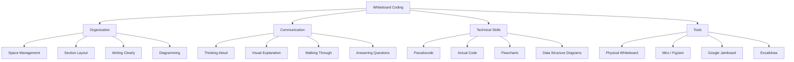
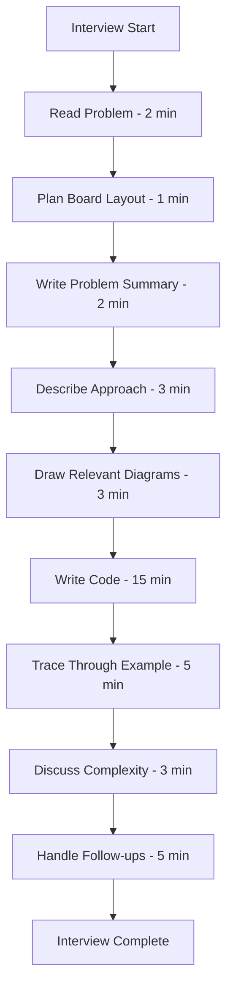
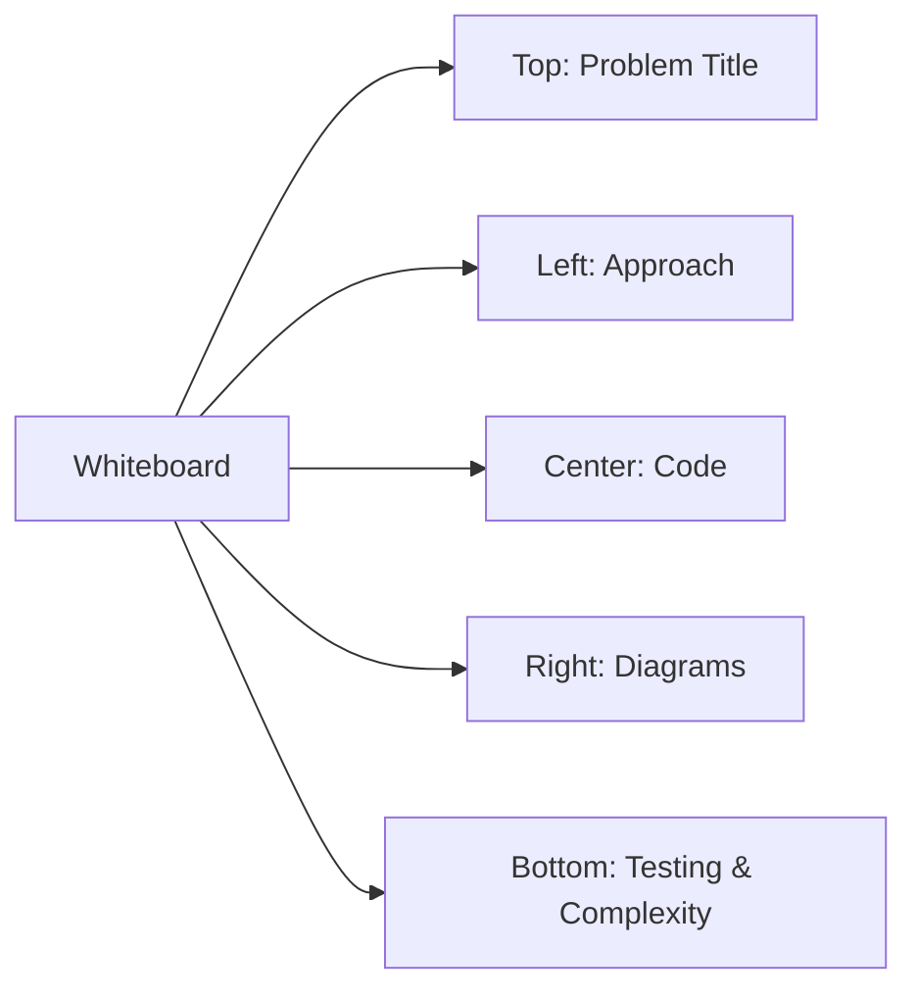
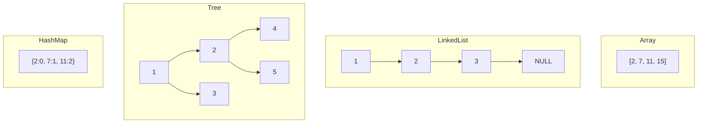

---

## 1. Introduction

### What is Whiteboard Coding?
Whiteboard coding is an interview format where candidates solve programming problems by writing code, drawing diagrams, and explaining their approach on a physical or virtual whiteboard. It tests your ability to think clearly, communicate visually, and write code without the aid of an IDE or compiler. It's one of the most traditional and widely used interview formats.

### Why It Matters for Interviews
Whiteboard coding is used by:
- **Onsite interviews** at FAANG and top-tier companies
- **University campus placements** (physical whiteboard)
- **Consulting firms** (case-based whiteboarding)
- **Startup interviews** (informal whiteboard sessions)
- **Remote interviews** (virtual whiteboard tools)

It strips away IDE support, testing raw coding ability, communication, and problem-solving under observation.

### How It Impacts Your Career
- Demonstrates strong fundamentals (no IDE crutch)
- Shows ability to think and communicate clearly
- Tests visual communication skills
- Proves you can work under pressure without tools
- Differentiates strong communicators from silent coders

---

## 2. Learning Roadmap



### Timeline
| Phase | Duration | Focus |
|-------|----------|-------|
| Week 1 | Days 1-3 | Whiteboard organization and layout |
| Week 1 | Days 4-7 | Pseudocode and flowcharts |
| Week 2 | Days 8-10 | Coding on whiteboard |
| Week 2 | Days 11-14 | Communication and explanation |
| Week 3 | Days 15-17 | Practice problems |
| Week 3 | Days 18-21 | Full mock whiteboard sessions |

---

## 3. Theory Notes

### 3.1 Whiteboard Organization

**Layout Strategy:**
```
+------------------------------------------+
|  Problem: Two Sum                        |
|                                          |
|  Approach: [describe approach here]      |
|                                          |
|  +------+  +------+------+  +--------+  |
|  | Code |  |Diagram/Trace|  | Testing|  |
|  |      |  |             |  |        |  |
|  |      |  |             |  |        |  |
|  |      |  |             |  |        |  |
|  +------+  +------+------+  +--------+  |
|                                          |
|  Complexity: Time O(n), Space O(n)       |
+------------------------------------------+
```

**Key Principles:**
1. **Divide the board** into sections (approach, code, diagrams, testing)
2. **Leave space** between sections for clarity
3. **Write large enough** for the interviewer to read
4. **Use consistent notation** (arrows, boxes, circles)
5. **Number your steps** for easy reference

### 3.2 Section-by-Section Approach

**Section 1: Problem Statement (top)**
- Write the problem name and key requirements
- List input/output examples
- Note constraints

**Section 2: Approach (left)**
- Describe your approach in 2-3 sentences
- Draw a high-level diagram if applicable
- Mention time/space complexity targets

**Section 3: Code (center)**
- Write clean, readable code
- Use proper indentation
- Handle edge cases
- Number lines if helpful

**Section 4: Diagrams/Trace (right)**
- Draw data structure diagrams
- Trace through an example
- Show step-by-step execution

**Section 5: Testing (bottom or right)**
- List test cases
- Walk through with example
- Note edge cases

### 3.3 Pseudocode Strategies

**When to Use Pseudocode:**
- When the problem is complex and you need to outline logic first
- When the interviewer asks for a high-level approach
- When you're unsure about specific syntax
- When explaining a recursive or complex algorithm

**Pseudocode Style:**
```
FUNCTION twoSum(nums, target):
    CREATE empty hash map "seen"
    FOR each index i, value num in nums:
        CALCULATE complement = target - num
        IF complement IN seen:
            RETURN [seen[complement], i]
        ADD num -> i to seen
    RETURN empty list
```

**Benefits:**
- Focuses on logic, not syntax
- Easier to write quickly on whiteboard
- Clearer for the interviewer to follow
- Can be translated to any language

### 3.4 Diagramming Approaches

**Data Structure Diagrams:**
```
Array:    [2, 7, 11, 15]
           ↑  ↑
          i  j (two pointers)

Linked List: 1 -> 2 -> 3 -> NULL
              ↑
             head

Hash Map: {2:0, 7:1}  (value:index)

Tree:      1
          / \
         2   3
        / \
       4   5
```

**Flowcharts:**
```
Start → Read Input → Check Edge Cases → Main Logic → Return Result
```

**Execution Trace:**
```
Input: [2, 7, 11, 15], target = 9
Step 1: i=0, num=2, complement=7, seen={}, 7 not in seen
Step 2: i=1, num=7, complement=2, seen={2:0}, 2 in seen! Return [0,1]
```

### 3.5 Space Management Tips

| Tip | Why |
|-----|-----|
| Write from top-left to bottom-right | Natural reading order |
| Use consistent margins | Looks organized |
| Leave space between sections | Prevents clutter |
| Use abbreviations when possible | Saves space |
| Draw diagrams compactly | Don't waste space |
| Use bullet points | Cleaner than paragraphs |
| Draw boxes around sections | Visual organization |

### 3.6 Communication on Whiteboard

**What to say while writing:**
- "Let me write the approach first..."
- "I'm creating a hash map here..."
- "This loop iterates through each element..."
- "Let me draw the data structure..."
- "Now let me trace through an example..."

**What to point at while explaining:**
- The specific line of code you're discussing
- The diagram you're referencing
- The test case you're walking through

### 3.7 Physical vs. Virtual Whiteboards

| Aspect | Physical | Virtual |
|--------|----------|---------|
| **Tools** | Marker, eraser | Miro, FigJam, Excalidraw |
| **Writing** | Handwriting | Mouse/keyboard |
| **Erasing** | Easy with eraser | Undo/redo |
| **Diagrams** | Freehand drawing | Templates and shapes |
| **Sharing** | In-person | Screen share |
| **Practice** | Buy a whiteboard | Use online tools |

**Virtual Whiteboard Tips:**
- Practice with the specific tool beforehand
- Use keyboard shortcuts for efficiency
- Pre-create templates for common diagrams
- Have a drawing tablet if possible
- Test screen sharing and audio before the session

### 3.8 Common Whiteboard Problems

| Problem | Key Concepts | Diagram Needed |
|---------|-------------|----------------|
| Two Sum | Hash map | Map visualization |
| Reverse Linked List | Pointers | Node connections |
| Binary Tree Traversal | Recursion/queue | Tree structure |
| Valid Parentheses | Stack | Stack diagram |
| Merge Intervals | Sorting, merging | Interval visualization |
| BFS/DFS | Queue/stack, graph | Graph with visited nodes |
| LRU Cache | Hash map + linked list | Combined structure |

---

## 4. Key Concepts

| Concept | Description | Importance |
|---------|------------|-----------|
| Space Management | Organizing the whiteboard effectively | Very High |
| Pseudocode | High-level code without syntax | High |
| Diagramming | Visual representation of data structures | Very High |
| Communication | Explaining while writing | Very High |
| Clean Writing | Legible, organized text | High |
| Execution Trace | Step-by-step walkthrough | High |
| Test Cases | Verifying with examples | High |
| Time Management | Allocating time across sections | High |

---

## 5. Frequently Asked Interview Questions

### Beginner Level

1. **Q: What should I write on the whiteboard first?**
   A: Start with the problem name/key requirements at the top. Then write your approach in 2-3 sentences. Then draw any necessary diagrams. Then write the code. This gives the interviewer a roadmap.

2. **Q: Should I write pseudocode or actual code?**
   A: Start with pseudocode if the logic is complex, then fill in actual code. For simple problems, go directly to code. The key is that the interviewer can follow your logic.

3. **Q: What if my handwriting is bad?**
   A: Practice writing clearly and largely. Use block letters. Write slowly enough to be legible. Use abbreviations for common words. If using a virtual whiteboard, type instead of draw.

4. **Q: How do I organize the whiteboard?**
   A: Divide into sections: top (problem), left (approach), center (code), right (diagrams), bottom (testing). Leave space between sections. Use boxes or lines to separate.

5. **Q: What if I make a mistake on the whiteboard?**
   A: Cross it out clearly and continue. Don't waste time erasing perfectly. Say "Let me correct this" and move on. Interviewers understand whiteboard mistakes.

6. **Q: Should I draw diagrams?**
   A: Yes! Diagrams help explain data structures and algorithms visually. Draw arrays, linked lists, trees, graphs, hash maps, and stacks when relevant. They also help you think.

7. **Q: How do I explain while writing?**
   A: Talk through what you're writing: "I'm creating a function that takes an array and target..." Don't write in silence. The interviewer needs to follow your thought process.

8. **Q: What if the interviewer asks me to change my approach?**
   A: Acknowledge the suggestion, discuss why it might be better, and adapt. "That's a good point. Let me adjust the approach to..." Flexibility is valued.

### Intermediate Level

9. **Q: How do I handle time pressure on a whiteboard?**
   A: Focus on core functionality first. Write clean pseudocode if you're running low on time. Don't sacrifice readability for speed. Better to have a working core than rushed, messy code.

10. **Q: What if I need more space?**
    A: If using a physical whiteboard, ask for another board or move to a clean section. If virtual, scroll to create more space. Organize your writing to maximize available space.

11. **Q: How do I trace through an example on the whiteboard?**
    A: Draw the data structure, then use arrows or annotations to show each step. Write the variable values at each step. "Step 1: i=0, num=2, seen={}" — show the state evolving.

12. **Q: Should I write comments in my code?**
    A: Use brief comments for complex logic. Don't over-comment obvious code. Comments help the interviewer follow your reasoning: "// Check if complement exists in map"

13. **Q: How do I handle a virtual whiteboard interview?**
    A: Practice with the tool beforehand. Use keyboard shortcuts. Type code instead of handwriting. Use templates for diagrams. Test screen sharing before the interview.

14. **Q: What if the interviewer can't read my writing?**
    A: Slow down, write more clearly, and ask: "Can you read this?" Offer to rewrite sections if needed. Communication is key — don't let illegible writing derail the interview.

15. **Q: How do I handle complex algorithms on the whiteboard?**
    A: Break into smaller functions. Use pseudocode for complex parts. Draw diagrams to explain the algorithm. Walk through the algorithm step by step before coding.

16. **Q: What if I forget a specific syntax?**
    A: Write pseudocode for that part and note: "This is the [data structure] operation — I'd use [function name] here." Interviewers care about logic, not syntax memorization.

### Advanced Level

17. **Q: How do I design a system on a whiteboard?**
    A: Start with high-level components (boxes). Draw arrows for data flow. Label each component's responsibility. Then dive into details for the most important component.

18. **Q: What if the problem requires multiple data structures?**
    A: Draw each data structure separately. Show how they connect. Use different sections of the whiteboard for each. Label clearly.

19. **Q: How do I handle a dynamic programming problem on the whiteboard?**
    A: Draw the DP table/memoization cache. Show the recurrence relation. Fill in the table step by step. Trace through the example in the table.

20. **Q: How do I end a whiteboard session effectively?**
    A: Summarize your solution. State the complexity. Mention optimizations. Ask if there are any questions. Clean up your whiteboard logically.

### FAANG Level

21. **Q: How does Google's whiteboard interview differ from Amazon's?**
    A: Google focuses on algorithmic clarity and optimal solutions. They appreciate clean diagrams and clear communication. Amazon may ask about practical considerations and scalability. Both value visual communication.

22. **Q: What's the most important whiteboard skill for senior roles?**
    A: System-level diagramming — showing components, data flow, and trade-offs visually. Senior roles require communicating architecture, not just writing code.

23. **Q: How do you handle a whiteboard interview with multiple problems?**
    A: Allocate time per problem. Complete one before starting the next. Use separate sections of the whiteboard for each problem. Keep the interviewer informed about your progress.

24. **Q: What if the interviewer takes over the whiteboard?**
    A: Let them guide if they're explaining something. Take notes. Ask questions. When it's your turn again, incorporate their input. This shows you can learn and adapt.

25. **Q: How do you prepare for whiteboard interviews specifically?**
    A: (1) Buy a whiteboard and practice daily. (2) Time yourself. (3) Practice explaining while writing. (4) Practice diagrams and flowcharts. (5) Do mock whiteboard interviews. (6) Practice with both physical and virtual tools.

---

## 6. Hands-on Practice

### Exercise 1: Board Layout Practice
Set up a whiteboard (physical or virtual). Practice dividing it into sections. Write a problem title, approach, code, and diagram in separate areas. Time yourself: 5 minutes.

### Exercise 2: Pseudocode to Code
Write the following in pseudocode, then translate to actual code on the whiteboard:
1. Two Sum
2. Reverse a string
3. Find maximum in array
4. Check if palindrome
5. Binary search

### Exercise 3: Diagram Drawing
Draw the following data structures on the whiteboard:
1. Array with 6 elements (show indices)
2. Linked list with 5 nodes
3. Binary tree with 7 nodes
4. Hash map with 4 entries
5. Stack with 3 elements
6. Graph with 5 nodes and edges

### Exercise 4: Execution Trace
For Two Sum with input [2, 7, 11, 15], target=9, trace through each step on the whiteboard:
- Show the hash map at each step
- Write the variable values
- Indicate when the answer is found

### Exercise 5: Flowchart Practice
Draw flowcharts for:
1. Binary search algorithm
2. BFS traversal
3. Palindrome check
4. Merge sort (high level)
5. Factorial (recursive)

### Exercise 6: Time-Pressured Coding
Set a 20-minute timer. Write a complete solution for a medium problem on the whiteboard, including approach, code, diagram, and test trace.

### Exercise 7: Communication Practice
Solve a problem on the whiteboard while speaking aloud. Record yourself (video if possible). Review: Was your writing legible? Did you communicate clearly? Were diagrams helpful?

### Exercise 8: Edge Case Handling
For each problem, write edge cases on the whiteboard:
1. Two Sum → empty array, one pair, duplicates
2. Linked List → empty list, single node, cycle
3. Binary Tree → empty tree, single node, unbalanced

### Exercise 9: Virtual Whiteboard Drill
Use Miro, FigJam, or Excalidraw. Solve a problem using only the virtual whiteboard. Focus on: typing code, drawing diagrams, organizing sections.

### Exercise 10: Full Mock Whiteboard Interview
Simulate a complete whiteboard interview (45 minutes):
- Problem introduction (5 min)
- Approach discussion (5 min)
- Whiteboard coding (25 min)
- Testing and trace (5 min)
- Discussion (5 min)

---

## 7. Real FAANG Interview Questions

| Company | Problem | Format | Duration |
|---------|---------|--------|----------|
| Google | Longest Substring Without Repeating | Whiteboard | 45 min |
| Google | Binary Tree Level Order Traversal | Whiteboard | 45 min |
| Amazon | Design a Parking Lot (High Level) | Whiteboard | 60 min |
| Amazon | Number of Islands | Whiteboard | 45 min |
| Meta | Valid Palindrome | Whiteboard | 30 min |
| Meta | Clone Graph | Whiteboard | 45 min |
| Apple | Reverse Linked List | Whiteboard | 30 min |
| Apple | Lowest Common Ancestor | Whiteboard | 45 min |
| Microsoft | Two Sum | Whiteboard | 30 min |
| Microsoft | Merge K Sorted Lists | Whiteboard | 60 min |

---

## 8. Common Mistakes

| Mistake | Description | How to Avoid |
|---------|------------|--------------|
| Poor organization | Writing everywhere without structure | Divide board into sections |
| Illegible writing | Can't read what you wrote | Write large and clear |
| Not drawing diagrams | Missing visual explanations | Always draw relevant diagrams |
| Silent writing | Not explaining while writing | Think aloud constantly |
| Not enough space | Running out of room | Plan layout before writing |
| Erasing too much | Wasting time on perfect writing | Cross out and continue |
| Not testing | Writing code without verification | Trace through example on board |
| Ignoring edge cases | Not mentioning edge cases | Write edge cases in testing section |
| Rushing | Writing too fast to be readable | Slow down, prioritize clarity |
| Not using the board effectively | Writing tiny text in one corner | Use the entire board strategically |

---

## 9. Best Practices

1. **Plan before writing** — Spend 30 seconds deciding where each section goes.
2. **Write large and clear** — The interviewer must be able to read from a distance.
3. **Use sections** — Divide the board logically (approach, code, diagrams, testing).
4. **Draw diagrams** — Visual representations clarify complex concepts.
5. **Explain while writing** — Never write in silence.
6. **Number your steps** — Makes it easy to reference.
7. **Use pseudocode for complex parts** — Focus on logic over syntax.
8. **Trace through examples** — Show the algorithm working step by step.
9. **Leave space** — Between sections and for additions.
10. **Practice on a whiteboard** — Buy one and use it regularly.
11. **Be adaptable** — If the interviewer suggests changes, incorporate them.
12. **End cleanly** — Summarize, discuss complexity, mention optimizations.

---

## 10. Cheat Sheet

```
+---------------------------------------------------------------+
|            WHITEBOARD CODING CHEAT SHEET                       |
+---------------------------------------------------------------+
|                                                               |
|  BOARD LAYOUT                                                 |
|  +------------------------------------------+                |
|  | Problem: [Title]                         |                |
|  |                                           |                |
|  | Approach:  | Code:          | Diagrams:  |                |
|  | [2-3 lines] | [clean code]  | [drawings] |                |
|  |            |                |            |                |
|  |            |                |            |                |
|  |                                           |                |
|  | Testing: [test cases]   Complexity: O(n)  |                |
|  +------------------------------------------+                |
|                                                               |
|  WRITING TIPS                                                 |
|  - Write large and clear (marker/pen)                        |
|  - Use block letters for readability                         |
|  - Number your lines                                         |
|  - Leave space between sections                              |
|  - Use abbreviations when helpful                            |
|                                                               |
|  COMMUNICATION                                                |
|  - "Let me write the approach first..."                      |
|  - "I'm creating a hash map to store..."                     |
|  - "Let me trace through this example..."                    |
|  - "The time complexity is O(...) because..."                |
|                                                               |
|  DIAGRAMS TO DRAW                                             |
|  - Array: [val1, val2, val3] with indices                    |
|  - Linked List: node -> node -> node -> NULL                 |
|  - Tree: nodes with lines connecting                         |
|  - Hash Map: {key: value, key: value}                        |
|  - Stack: vertical box with elements                         |
|  - Graph: circles with connecting lines                      |
|                                                               |
|  WHEN STUCK                                                   |
|  1. Draw the data structure                                  |
|  2. Trace through a small example                            |
|  3. Think of similar problems                                |
|  4. Ask the interviewer                                      |
|                                                               |
+---------------------------------------------------------------+
```

---

## 11. Flash Cards

| # | Question | Answer |
|---|----------|--------|
| 1 | What should you write first on the whiteboard? | Problem title and key requirements |
| 2 | How should you divide the whiteboard? | Into sections: approach, code, diagrams, testing |
| 3 | Should you write pseudocode or actual code? | Either — pseudocode for complex logic, code for simple problems |
| 4 | What if you make a mistake on the whiteboard? | Cross it out clearly and continue |
| 5 | Should you draw diagrams? | Yes — visual explanations clarify concepts |
| 6 | What should you say while writing? | Explain your thought process and decisions |
| 7 | How do you handle running out of space? | Ask for another board or scroll on virtual |
| 8 | What if the interviewer can't read your writing? | Slow down, write more clearly, offer to rewrite |
| 9 | How do you trace through an example? | Draw the data structure and show each step |
| 10 | What should you do before starting? | Plan the layout for 30 seconds |
| 11 | Should you erase mistakes completely? | No — cross out and continue (saves time) |
| 12 | What data structures should you always diagram? | Arrays, linked lists, trees, graphs, hash maps |
| 13 | How do you end a whiteboard session? | Summarize, discuss complexity, mention optimizations |
| 14 | What's the biggest whiteboard mistake? | Poor organization and illegible writing |
| 15 | Should you write comments in your code? | Brief comments for complex logic only |
| 16 | How do you handle a virtual whiteboard? | Practice the tool, use keyboard shortcuts, type code |
| 17 | What if you forget syntax? | Write pseudocode and describe what you'd use |
| 18 | How do you manage time? | Allocate time per section, focus on core code |
| 19 | What's important for senior-level whiteboarding? | System-level diagrams and architecture |
| 20 | How do you prepare? | Practice on a whiteboard daily with timed sessions |

---

## 12. Mind Map

```
Whiteboard Coding
│
├── Organization
│   ├── Board Layout (sections)
│   ├── Writing Clarity
│   ├── Space Management
│   ├── Numbering Steps
│   └── Using Abbreviations
│
├── Content Sections
│   ├── Problem Statement
│   ├── Approach Description
│   ├── Code (pseudocode or actual)
│   ├── Diagrams (data structures)
│   ├── Execution Trace
│   ├── Test Cases
│   └── Complexity Analysis
│
├── Communication
│   ├── Thinking Aloud
│   ├── Explaining While Writing
│   ├── Pointing at Specific Lines
│   ├── Walking Through Examples
│   └── Answering Questions
│
├── Diagrams
│   ├── Array Visualization
│   ├── Linked List Nodes
│   ├── Tree Structures
│   ├── Hash Map Entries
│   ├── Stack/Queue
│   ├── Graph Nodes and Edges
│   └── Flowcharts
│
└── Tools
    ├── Physical Whiteboard
    ├── Miro / FigJam
    ├── Google Jamboard
    ├── Excalidraw
    └── CodeSandbox Whiteboard
```

---

## 13. Mermaid Diagrams

### Diagram 1: Whiteboard Interview Flow


### Diagram 2: Board Layout Strategy


### Diagram 3: Data Structure Diagrams


---

## 14. Code Examples

### Example 1: Two Sum on Whiteboard
```
========================================
Problem: Two Sum
Given: array of integers, target
Return: indices of two numbers that add to target

Approach: Use hash map for O(n) lookup
- Store seen values with their indices
- For each number, check if complement exists

Time: O(n)  |  Space: O(n)
========================================

Code:
-------
def two_sum(nums, target):
    seen = {}
    for i, num in enumerate(nums):
        complement = target - num
        if complement in seen:
            return [seen[complement], i]
        seen[num] = i
    return []

Trace:
-------
Input: [2, 7, 11, 15], target = 9

Step 1: i=0, num=2, complement=7
        seen = {}
        7 not in seen → seen = {2: 0}

Step 2: i=1, num=7, complement=2
        seen = {2: 0}
        2 in seen! → Return [0, 1] ✓

Test Cases:
-----------
[2,7,11,15], 9 → [0,1] ✓
[3,2,4], 6 → [1,2] ✓
[3,3], 6 → [0,1] ✓
```

### Example 2: Board Layout Template
```
+------------------------------------------+
| Problem: Reverse Linked List              |
| Input: 1 -> 2 -> 3 -> NULL               |
| Output: 3 -> 2 -> 1 -> NULL              |
+------------------------------------------+

| Approach          | Code                  |
| Use three pointers| def reverse(head):    |
| prev, curr, next  |     prev = None       |
| Reverse each link |     curr = head       |
|                   |     while curr:       |
|                   |         next = curr.n |
|                   |         curr.next = pr |
|                   |         prev = curr   |
|                   |         curr = next   |
|                   |     return prev       |

| Diagram           | Testing               |
| NULL<-1  2->3->NULL | Step 1: prev=NULL    |
|       ^  ^          |         curr=1       |
|       |  curr       |         next=2       |
|       prev          |         1.next=NULL  |
|                     |         prev=1,curr=2|
| NULL<-1<-2  3->NULL | Step 2: prev=1       |
|          ^  ^       |         curr=2       |
|          |  curr    |         next=3       |
|          prev       |         2.next=1     |
|                     |         prev=2,curr=3|

Complexity: Time O(n), Space O(1)
========================================
```

### Example 3: Binary Search Flowchart
```
+------------------------------------------+
| Binary Search Flowchart                   |
|                                          |
|          +-----------+                   |
|          |   Start   |                   |
|          +-----+-----+                   |
|                |                          |
|          +-----v-----+                   |
|          | left=0     |                   |
|          | right=n-1  |                   |
|          +-----+-----+                   |
|                |                          |
|          +-----v-----+      No           |
|          | left<=right?+-------->+       |
|          +-----+------+        |       |
|                | Yes             |       |
|          +-----v-----+         |       |
|          | mid=(l+r)/2 |        |       |
|          +-----+------+        |       |
|                |                  |       |
|          +-----v-----+         |       |
|          | arr[mid]==t?+---Yes-->+       |
|          +-----+------+  |     |       |
|                | No       |     |       |
|          +-----v-----+   |     |       |
|          | arr[mid]<t?+--Yes    |       |
|          +-----+------+  |     |       |
|                | No       |     |       |
|          +-----v-----+   |     |       |
|          | right=mid-1+  |     |       |
|          +-----+------+   |     |       |
|                |           |     |       |
|          +-----v-----+   |     |       |
|          | left=mid+1  +  |     |       |
|          +-----+------+   |     |       |
|                |           |     |       |
|                +-----------+     |       |
|                                  |       |
|          +-----v-----+         |       |
|          | return mid / -1 |<----+       |
|          +-----+------+                   |
|                |                          |
|          +-----v-----+                   |
|          |    End     |                   |
|          +-----------+                   |
+------------------------------------------+
```

---

## 15. Projects

### Mini Project 1: Whiteboard Layout Generator
Build a tool that generates whiteboard layout templates for different problem types.

### Mini Project 2: Code Diagram Generator
Create a tool that generates data structure diagrams from code.

### Mini Project 3: Whiteboard Timer
Develop a timer app that guides you through whiteboard interview phases.

### Intermediate Project 1: Virtual Whiteboard Practice Tool
Build a web-based virtual whiteboard specifically for coding interview practice.

### Intermediate Project 2: Whiteboard Problem Library
Create a collection of whiteboard problems with solution templates and diagrams.

### Advanced Project 1: AI Whiteboard Reviewer
Build an AI tool that analyzes whiteboard code and diagrams for clarity and correctness.

### Advanced Project 2: Whiteboard Interview Simulator
Develop a full simulation of whiteboard interviews with timed prompts and feedback.

### Project Ideas (10 total)
1. Whiteboard template library for common problems
2. Data structure diagram generator
3. Code tracing visualizer
4. Whiteboard handwriting practice tool
5. Virtual whiteboard with collaboration
6. Whiteboard problem randomizer
7. Algorithm flowchart generator
8. Whiteboard scoring rubric
9. Whiteboard practice scheduler
10. Whiteboard presentation trainer

---

## 16. Resources

### Practice Websites
| Website | URL | Focus |
|---------|-----|-------|
| Excalidraw | excalidraw.com | Virtual whiteboard |
| Miro | miro.com | Collaborative whiteboard |
| FigJam | figjam.com | Design whiteboard |
| CoderPad | coderpad.io | Interview IDE |
| Pramp | pramp.com | Mock interviews |

### Books
| Book | Author | Level |
|------|--------|-------|
| *Cracking the Coding Interview* | Gayle Laakmann | All levels |
| *Programming Interviews Exposed* | John Mongan | All levels |
| *Elements of Programming Interviews* | Adnan Aziz | Intermediate |

### Documentation
- Google Interview Preparation Guide
- Amazon Leadership Principles
- Whiteboard Coding Best Practices (various)
- Virtual Whiteboard Tool Guides

### YouTube Channels
| Channel | Focus |
|---------|-------|
| NeetCode | Problem-solving approaches |
| take U forward | DSA concepts |
| Clement Mihailescu | Interview experiences |
| Kevin Naughton Jr. | LeetCode solutions |

### Blogs
- Blind (Interview experiences)
- LeetCode Discuss
- Medium (Interview tagged)
- Dev.to (Coding tips)

### Certifications
- HackerRank Problem Solving
- CodeSignal Certified Developer
- AWS Developer (for cloud roles)

---

## 17. Checklist

- [ ] I can organize a whiteboard into clear sections
- [ ] I can write code legibly on a whiteboard
- [ ] I can draw data structure diagrams
- [ ] I can explain while writing (think aloud)
- [ ] I can write pseudocode for complex logic
- [ ] I can trace through examples step by step
- [ ] I can handle time pressure on a whiteboard
- [ ] I can adapt to virtual whiteboard tools
- [ ] I practice on a whiteboard regularly
- [ ] I can solve medium problems on a whiteboard in 25 min
- [ ] I can handle edge cases on the whiteboard
- [ ] I can discuss complexity after coding
- [ ] I can handle interviewer questions during coding
- [ ] I can use arrows, boxes, and notation effectively
- [ ] I feel confident about whiteboard coding interviews

---

## 18. Revision Notes

### Key Principles
1. **Organize first** — Plan your board layout before writing
2. **Write large and clear** — The interviewer must read from a distance
3. **Explain while writing** — Never write in silence
4. **Draw diagrams** — Visual explanations clarify concepts
5. **Test on the board** — Trace through examples step by step

### One-Day Revision Plan
| Time | Activity |
|------|----------|
| Morning (1 hr) | Review board layout and organization techniques |
| Mid-morning (1 hr) | Practice drawing data structure diagrams |
| Afternoon (2 hrs) | Solve 2 problems on the whiteboard (timed) |
| Late afternoon (1 hr) | Practice explaining while writing |
| Evening (1.5 hrs) | Full mock whiteboard interview |
| Night (30 min) | Review cheat sheet and flash cards |

### One-Week Revision Plan
| Day | Focus |
|-----|-------|
| Monday | Board layout and organization practice |
| Tuesday | Pseudocode to code translation |
| Wednesday | Data structure diagramming |
| Thursday | Medium problems on whiteboard (2 problems) |
| Friday | Communication practice (explain while writing) |
| Saturday | Virtual whiteboard practice |
| Sunday | Full mock whiteboard interview |

---

## 19. Mock Interview Questions

### Round 1: Easy (30 minutes)
1. Two Sum — write complete solution with diagram
2. Valid Palindrome — explain approach, code, and test
3. Maximum Subarray — trace through example

### Round 2: Medium (45 minutes)
1. Binary Tree Level Order — draw tree, code BFS, trace
2. Merge Intervals — draw intervals, code merge, test
3. LRU Cache — design classes, implement, test

### Round 3: Hard (60 minutes)
1. Word Break II — draw recursion tree, code backtracking
2. Alien Dictionary — draw graph, code topological sort
3. Serialize Binary Tree — design format, code, test

### Round 4: Follow-ups
After each solution:
1. "Can you optimize this?"
2. "What if the input is very large?"
3. "How would you handle errors?"

---

## 20. Difficulty Rating

| Skill | Difficulty (1-5) | Interview Frequency | Priority |
|-------|-------------------|--------------------|----|
| Board Organization | 2 | Very High | Must Know |
| Clear Writing | 2 | Very High | Must Know |
| Pseudocode | 2 | High | Should Know |
| Diagram Drawing | 3 | High | Should Know |
| Thinking Aloud | 3 | Very High | Must Know |
| Code Writing | 3 | Very High | Must Know |
| Execution Tracing | 3 | High | Should Know |
| Time Management | 3 | Very High | Must Know |
| Virtual Whiteboard | 3 | High | Should Know |
| Complex Diagrams | 4 | Medium | Nice to Know |
| System Diagrams | 4 | Medium | Nice to Know |
| Adaptability | 3 | High | Should Know |

---

## 21. Summary

Whiteboard coding is a traditional and widely used interview format that tests your ability to think, communicate, and code without IDE support.

**Key Takeaways:**
- Organize your whiteboard into clear sections
- Write large, legible text
- Draw diagrams for all data structures
- Explain your thought process while writing
- Trace through examples step by step
- Practice on both physical and virtual whiteboards
- Manage your time across sections
- Practice under timed conditions regularly

**Interview Success Formula:**
Whiteboard Success = Organization + Clarity + Communication + Diagrams

**Next Steps:**
1. Buy a whiteboard and practice daily
2. Practice board layout for 10 different problems
3. Draw data structure diagrams until they're natural
4. Practice thinking aloud while writing
5. Do mock whiteboard interviews with friends
6. Practice on virtual whiteboard tools

---

*Last Updated: July 2026*
*Total Sections: 21*
*Estimated Study Time: 3 weeks (1-2 hours daily)*

