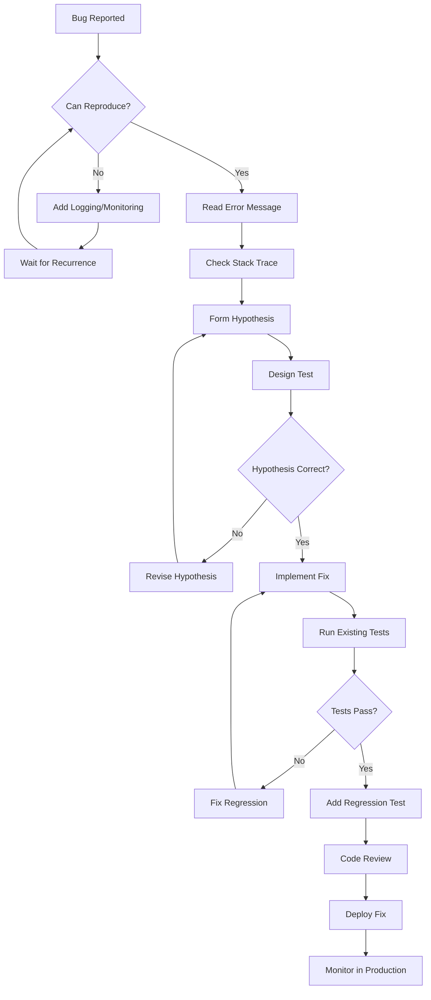
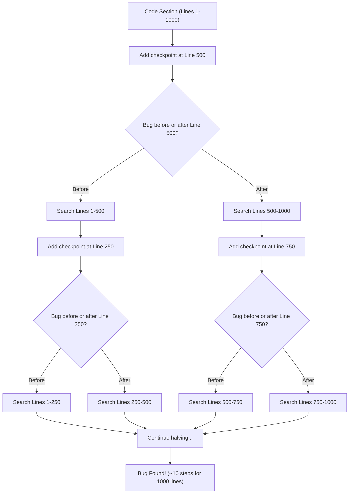
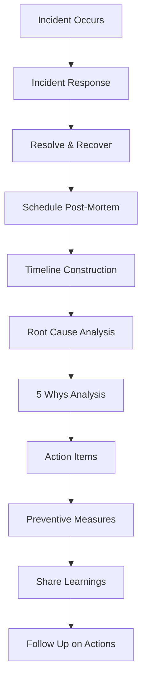

## 1. Introduction

Debugging is the process of finding and resolving defects or problems within a program. The term "bug" was popularized by Grace Hopper in 1947 when a moth was found trapped in a relay of the Harvard Mark II computer. Today, debugging remains one of the most critical skills for software engineers and is frequently assessed during technical interviews.

Debugging is not merely about fixing errors — it is a systematic, analytical process of understanding why software behaves unexpectedly. Strong debugging skills distinguish senior engineers from junior ones. Companies like Google, Amazon, and Microsoft explicitly evaluate a candidate's debugging ability during interviews, presenting buggy code and asking candidates to identify and fix issues.

This module covers debugging methodologies, tools, common bug categories, and strategies for systematic problem-solving. Mastering these concepts will help you in interviews and in real-world software development where debugging can consume 50% or more of development time.

---

## 2. Learning Roadmap

### Phase 1: Foundations (Week 1-2)
- [ ] Understand what bugs are and their types
- [ ] Learn print/logging debugging basics
- [ ] Master the scientific method of debugging
- [ ] Practice reading error messages and stack traces
- [ ] Learn to reproduce bugs consistently

### Phase 2: Tools and Techniques (Week 3-4)
- [ ] Master IDE debugger (breakpoints, step-through, watch variables)
- [ ] Learn binary search debugging technique
- [ ] Understand rubber duck debugging
- [ ] Practice with common bug categories (off-by-one, null, race conditions)
- [ ] Learn to use logging frameworks effectively

### Phase 3: Advanced Debugging (Week 5-6)
- [ ] Debug memory leaks using profilers and analyzers
- [ ] Learn production debugging techniques
- [ ] Understand distributed system debugging
- [ ] Master post-mortem analysis and root cause analysis
- [ ] Practice debugging concurrent and asynchronous code

### Phase 4: Interview Mastery (Week 7-8)
- [ ] Solve buggy code challenges on LeetCode and HackerRank
- [ ] Practice thinking aloud while debugging
- [ ] Learn to quickly identify time/space complexity bugs
- [ ] Mock interviews with debugging-focused questions
- [ ] Review real-world post-mortems from major tech companies

---

## 3. Theory Notes

### 3.1 The Scientific Method of Debugging

Debugging follows the scientific method:

1. **Reproduce the bug** — Consistently trigger the failure
2. **Hypothesize** — Form a theory about the cause
3. **Test** — Design an experiment to confirm or deny the hypothesis
4. **Fix** — Once confirmed, implement the fix
5. **Verify** — Ensure the fix works and doesn't introduce new bugs

### 3.2 Types of Bugs

| Bug Type | Description | Example |
|----------|-------------|---------|
| Syntax Error | Violation of language grammar | Missing semicolon |
| Runtime Error | Error during execution | Division by zero, null access |
| Logic Error | Code runs but produces wrong result | Off-by-one in loop |
| Semantic Error | Code means something different than intended | Wrong operator used |
| Resource Leak | Resources not properly released | Unclosed file handles |
| Concurrency Bug | Timing-dependent failures | Race condition |
| Performance Bug | Correct but too slow | O(n²) where O(n) is needed |

### 3.3 Bug Distribution (IBM Study)

According to the famous IBM Systems Sciences Institute study:
- **56%** of bugs are in the design/requirements phase
- **27%** are in the coding phase
- **10%** are in the testing phase
- **7%** are in the documentation phase

The cost of fixing bugs increases exponentially the later they are found:
- Found in design: **1x** cost
- Found in coding: **5x** cost
- Found in testing: **10x** cost
- Found in production: **100x** cost

### 3.4 Error Messages and Stack Traces

A stack trace tells you:
- **What** went wrong (exception type and message)
- **Where** it happened (file, line number, method)
- **How** you got there (call stack from top to bottom)

Reading stack traces bottom-up follows the execution flow; top-down shows where the error was caught.

---

## 4. Key Concepts

### 4.1 Print/Logging Debugging

The oldest and most universal debugging technique. Insert print statements to inspect variable values at key points.

```python
def binary_search(arr, target):
    left, right = 0, len(arr) - 1
    while left <= right:
        mid = (left + right) // 2
        print(f"left={left}, right={right}, mid={mid}, arr[mid]={arr[mid]}")  # Debug
        if arr[mid] == target:
            return mid
        elif arr[mid] < target:
            left = mid + 1
        else:
            right = mid - 1
    return -1
```

**Pros:** Simple, universal, no tools needed
**Cons:** Requires code modification, can be slow, cluttered output

### 4.2 Binary Search Debugging

When you know the bug exists in a large section of code but not where:

1. Place a checkpoint (assert/print) in the **middle** of the suspicious code
2. If the bug appears before the checkpoint, the bug is in the first half
3. If the bug appears after the checkpoint, the bug is in the second half
4. Repeat, halving the search space each time

This approach has O(log n) efficiency — for 1000 lines, you need only ~10 steps.

### 4.3 Rubber Duck Debugging

Explain your code, line by line, to an inanimate object (or another person). The act of verbalizing forces you to slow down and examine assumptions you might otherwise skip. Named after the practice of keeping a rubber duck on your desk to explain code to.

### 4.4 IDE Debugger Features

| Feature | Description |
|---------|-------------|
| Breakpoints | Pause execution at specific lines |
| Step Over | Execute current line, move to next |
| Step Into | Enter function calls |
| Step Out | Exit current function back to caller |
| Watch | Monitor variable values in real-time |
| Call Stack | View the chain of function calls |
| Conditional Break | Break only when a condition is true |
| Exception Break | Pause when exceptions are thrown |

### 4.5 Common Bug Categories

#### Off-by-One Errors
```python
# BUG: Accessing index out of bounds
for i in range(len(arr) + 1):  # +1 causes IndexError
    print(arr[i])

# FIX:
for i in range(len(arr)):
    print(arr[i])
```

#### Null/None Pointer Dereference
```python
# BUG: Node could be None
def get_value(node):
    return node.val  # AttributeError if node is None

# FIX:
def get_value(node):
    if node is None:
        return None
    return node.val
```

#### Race Conditions
```python
# BUG: Non-atomic check-then-act
import threading

counter = 0

def increment():
    global counter
    temp = counter    # Read
    # Thread switch can happen here!
    counter = temp + 1  # Write

# FIX: Use locks
lock = threading.Lock()

def increment():
    global counter
    with lock:
        counter += 1
```

#### Memory Leaks
```cpp
// BUG: Memory not freed
void process() {
    int* data = new int[1000];
    if (error) return;  // Memory leak!
    delete[] data;
}

// FIX:
void process() {
    int* data = new int[1000];
    if (error) {
        delete[] data;
        return;
    }
    delete[] data;
}
// BETTER: Use smart pointers
void process() {
    auto data = std::make_unique<int[]>(1000);
    if (error) return;  // Auto-cleanup
}
```

---

## 5. FAQ (20+ Q&A)

**Q1: What is the difference between debugging and testing?**
Testing is the process of finding bugs by executing programs under controlled conditions. Debugging is the process of finding the root cause of a known bug and fixing it. Testing identifies *that* a bug exists; debugging finds *why* it exists.

**Q2: How should I approach a bug I can't reproduce?**
First, look for timing-dependent issues (race conditions, async code). Add extensive logging. Try to narrow down the conditions under which the bug occurs. Use deterministic testing tools. Sometimes adding a delay or disabling concurrency can help isolate the issue.

**Q3: What is the most efficient debugging technique?**
Binary search debugging is generally the most efficient for unknown bug locations. For known symptoms, educated guessing based on experience is fastest. The scientific method (hypothesis → test → confirm/revise) is the most reliable approach overall.

**Q4: How do I debug code during an interview?**
Think aloud — explain your reasoning. Start with the simplest cases. Use print statements or trace through the algorithm by hand. Check edge cases. Break the problem into smaller pieces. Don't silently stare at the code.

**Q5: What tools should every developer know for debugging?**
IDE debugger (VS Code, IntelliJ, or similar), browser developer tools, version control (git bisect), logging frameworks, memory profilers, and language-specific tools (e.g., Python debugger `pdb`, Java JDB, GDB for C/C++).

**Q6: How does git bisect help with debugging?**
`git bisect` performs a binary search through your commit history to find which commit introduced a bug. You mark a known-good commit and a known-bad commit, and git checks out the middle commit for you to test, narrowing down the culprit in O(log n) steps.

**Q7: What is a post-mortem analysis?**
A post-mortem is a systematic review conducted after a significant incident (outage, data loss, etc.) to determine the root cause, contributing factors, and preventive measures. It is blameless and focuses on systemic improvements.

**Q8: What is the difference between a memory leak and memory corruption?**
A memory leak is when allocated memory is no longer reachable but not freed, causing growing memory usage. Memory corruption is when memory is written incorrectly (buffer overflow, use-after-free), leading to unpredictable behavior, crashes, or security vulnerabilities.

**Q9: How do I debug race conditions?**
Use thread-safe logging, add assertions, use tools like ThreadSanitizer (TSan), run with randomized thread scheduling, add artificial delays to expose timing issues, and simplify concurrent code to reduce the surface area for races.

**Q10: What are the best practices for logging?**
Use appropriate log levels (DEBUG, INFO, WARN, ERROR), include relevant context (request IDs, timestamps), avoid logging sensitive data, use structured logging (JSON), don't log in tight loops, and configure different levels for different environments.

**Q11: How do I debug memory leaks in C/C++?**
Use tools like Valgrind (memcheck), AddressSanitizer (ASan), LeakSanitizer, or platform-specific tools like Dr. Memory. Compile with debug flags and run your test suite to identify leaks.

**Q12: How do I debug memory issues in Python?**
Use `tracemalloc` to track allocations, `objgraph` to find reference cycles, `gc.get_referrers()` to inspect objects, and weak references to detect circular references. Python's garbage collector handles most cases, but reference cycles with `__del__` methods can leak.

**Q13: What is a Heisenbug?**
A Heisenbug is a bug that appears to disappear or alter its behavior when you try to study it (often due to adding debug output that changes timing or memory layout). Named after Heisenberg's uncertainty principle.

**Q14: What is a Bohrbug?**
A Bohrbug is a deterministic bug that can be reliably reproduced — the opposite of a Heisenbug. Most common bugs are Bohrbugs.

**Q15: How do I debug production issues without affecting users?**
Use feature flags to toggle problematic code, deploy with canary releases, use shadow traffic/mirroring, implement circuit breakers, and always have a rollback plan. Never debug directly on production without proper safeguards.

**Q16: What is the role of assertions in debugging?**
Assertions validate assumptions about program state at specific points. They act as documentation of expectations and fail fast when assumptions are violated, catching bugs early. Use them during development; remove or configure for production as needed.

**Q17: How do I find bugs in recursive functions?**
Trace through the recursion tree manually for small inputs. Check the base case — it should terminate. Check the recursive case — it should make progress toward the base case. Use print statements to observe the call depth and parameter values.

**Q18: What is rubber duck debugging and why does it work?**
Rubber duck debugging involves explaining your code line-by-line to an inanimate object. It works because verbalizing forces you to articulate assumptions, slow down your thinking, and examine each step deliberately. It often reveals logical gaps you'd otherwise skip.

**Q19: How do I debug issues in third-party libraries?**
Read the library source code if possible. Check for version-specific bugs. Create minimal reproducible examples. Check GitHub issues. Use dependency pinning to rule out version changes. Try substituting with a known-good implementation.

**Q20: What is the debugging mindset?**
Stay curious, not frustrated. Assume the bug makes sense. Question your own assumptions. Start from what you know and work toward what you don't. Be systematic rather than random. Document what you've tried.

**Q21: How do I debug SQL query issues?**
Use `EXPLAIN`/`EXPLAIN ANALYZE` to check execution plans. Add logging of query parameters. Test queries independently. Check for missing indexes. Watch for N+1 query problems. Use database profiling tools.

**Q22: What is debugging through elimination?**
Comment out or disable sections of code systematically to isolate the buggy area. Start by halving the codebase. This is essentially binary search applied to source code.

---

## 6. Hands-on Practice

### Exercise 1: Fix the Off-by-One Bug
```python
# This function should return the sum of all elements, but has a bug
def array_sum(arr):
    total = 0
    for i in range(1, len(arr)):  # Bug here
        total += arr[i]
    return total

# Fix the bug
# Answer: range(1, len(arr)) should be range(len(arr)) or range(0, len(arr))
```

### Exercise 2: Find the Race Condition
```java
// This class is supposed to be thread-safe but isn't. Find the bug.
public class Counter {
    private int count = 0;
    
    public void increment() {
        count++;  // Not atomic!
    }
    
    public int getCount() {
        return count;
    }
}

// Fix: Use synchronized or AtomicInteger
```

### Exercise 3: Debug the Recursive Function
```python
# This binary search has a bug. Find and fix it.
def binary_search(arr, target, low, high):
    if low > high:
        return -1
    mid = (low + high) // 2
    if arr[mid] == target:
        return mid
    elif arr[mid] < target:
        return binary_search(arr, target, mid, high)  # Bug: mid should be mid+1
    else:
        return binary_search(arr, target, low, mid)   # Bug: mid should be mid-1

# Fix: Use mid+1 and mid-1 to avoid infinite loops
```

### Exercise 4: Memory Leak Challenge
```c
// Find all memory leaks in this code
void process_data(int n) {
    char* buffer = malloc(256);
    int* indices = malloc(n * sizeof(int));
    
    for (int i = 0; i < n; i++) {
        indices[i] = i;
        if (i == 5) {
            return;  // Memory leak: both buffer and indices not freed
        }
    }
    
    free(indices);
    free(buffer);
}

// Fix: Free memory before every return path, or use RAII patterns
```

### Exercise 5: Trace the Bug
```python
# What's wrong with this code? Trace through with input [3, 1, 4, 1, 5, 9]
def find_duplicates(arr):
    seen = set()
    duplicates = []
    for i in range(len(arr)):
        if arr[i] in seen:
            duplicates.append(i)  # Bug: appends index, not value
        seen.add(arr[i])
    return duplicates

# Fix: duplicates.append(arr[i]) instead of duplicates.append(i)
```

---

## 7. FAANG Questions

### Google
1. **"You have a program that runs correctly in development but crashes in production. Walk me through your debugging approach."**
   - Start by checking environment differences (OS, configs, data volume)
   - Look at crash logs and stack traces
   - Check for race conditions exposed by higher concurrency
   - Check resource limits (memory, file handles, connections)
   - Add monitoring/logging and reproduce if possible

2. **"How would you debug a system that is slow but not broken?"**
   - Profile first — don't guess
   - Check CPU usage, memory allocation, I/O wait times
   - Look for O(n²) or worse algorithms
   - Check for cache misses and memory allocation patterns
   - Trace the slow path and add timing instrumentation

### Amazon
3. **"Describe a time you found a critical bug in production. How did you handle it?"**
   - Follow STAR format (Situation, Task, Action, Result)
   - Emphasize systematic approach, communication, and post-mortem

4. **"Given a piece of code with a bug, walk me through how you'd find and fix it."**
   - Read the code carefully
   - Trace through with example inputs
   - Check edge cases
   - Form hypotheses and test them
   - Propose and verify the fix

### Meta
5. **"How would you debug a memory leak in a long-running service?"**
   - Monitor memory usage over time
   - Take heap snapshots at intervals and compare
   - Look for growing object counts
   - Check for unclosed connections, file handles, event listeners
   - Use profiling tools (e.g., heaptrack, jmap, memray)

### Apple
6. **"What's the most subtle bug you've encountered and how did you find it?"**
   - Discuss floating-point precision issues, timezone bugs, Unicode handling, or endianness
   - Emphasize the methodology used

### Netflix
7. **"How do you ensure bugs don't make it to production?"**
   - Unit tests, integration tests, code reviews
   - Static analysis, fuzzing, chaos engineering
   - Canary deployments, feature flags, monitoring

---

## 8. Common Mistakes

### Mistake 1: Randomly Changing Code Without Understanding
**Problem:** Making changes hoping the bug goes away without understanding root cause.
**Fix:** Always form a hypothesis first. Make one change at a time.

### Mistake 2: Ignoring Error Messages
**Problem:** Skipping or dismissing error messages and stack traces.
**Fix:** Read error messages carefully. They usually tell you exactly what went wrong.

### Mistake 3: Assuming the Bug is Where It Appears
**Problem:** The symptom location is often not the root cause.
**Fix:** Trace the data flow backward. Bugs in output often originate in input processing.

### Mistake 4: Not Reproducing First
**Problem:** Trying to fix a bug before you can reliably reproduce it.
**Fix:** Always establish reproduction steps first. If you can't reproduce it, you can't verify the fix.

### Mistake 5: Debugging Without Version Control
**Problem:** Making changes without the ability to revert.
**Fix:** Always work on a branch. Commit before major changes so you can revert.

### Mistake 6: Over-Reliance on Print Statements
**Problem:** Inserting dozens of print statements instead of using a proper debugger.
**Fix:** Use a debugger for complex issues. Use logging strategically for production.

### Mistake 7: Fixing Symptoms Instead of Root Cause
**Problem:** Patching the symptom without addressing why it occurred.
**Fix:** Ask "why" five times (5 Whys technique) to reach the root cause.

### Mistake 8: Not Checking Edge Cases
**Problem:** The bug only manifests with specific inputs (empty arrays, null values, max integers).
**Fix:** Always test with edge cases: empty, single element, very large, null/None inputs.

### Mistake 9: Making the Fix Too Narrow
**Problem:** Fixing the specific instance of the bug without checking for similar issues elsewhere.
**Fix:** Search for similar patterns throughout the codebase that might have the same bug.

### Mistake 10: Not Adding a Test After Fixing
**Problem:** The same bug can return if no regression test is added.
**Fix:** Always add a test case that specifically exercises the bug scenario.

---

## 9. Best Practices

### Debugging Process
1. **Reproduce** — Make the bug happen reliably
2. **Isolate** — Narrow down the location and conditions
3. **Diagnose** — Find the root cause
4. **Fix** — Implement the minimal correct fix
5. **Test** — Verify the fix works and doesn't break anything
6. **Document** — Record what happened and what was learned
7. **Prevent** — Add tests and process improvements

### When Stuck
- Take a break and come back with fresh eyes
- Explain the problem to someone else (rubber duck)
- Binary search through the code
- Check your assumptions — are they actually true?
- Simplify the problem to its minimal failing case
- Search for similar known bugs online

### Logging Best Practices
- Use structured logging (JSON format)
- Include correlation IDs for request tracing
- Use appropriate log levels consistently
- Don't log sensitive data (passwords, tokens, PII)
- Log at boundaries (entry/exit of functions, API calls)
- Use sampling in high-throughput systems

### Production Debugging
- Use feature flags to toggle diagnostic code
- Implement health checks and circuit breakers
- Use distributed tracing (Jaeger, Zipkin, OpenTelemetry)
- Keep production debugging changes minimal and temporary
- Always have a rollback plan

---

## 10. Cheat Sheet

```
DEBUGGING QUICK REFERENCE
==========================

ERROR MESSAGE READING:
  1. Read the exception type
  2. Read the message
  3. Look at the FIRST line of YOUR code in the stack trace
  4. Check the line number

BINARY SEARCH DEBUGGING:
  - Place checkpoint in middle of suspicious code
  - If bug before checkpoint → first half
  - If bug after checkpoint → second half
  - Repeat until found (O(log n) steps)

RUBBER DUCK DEBUGGING:
  - Explain code line by line to someone/something
  - Don't skip anything
  - Question every assumption
  - Most bugs found in first 10 lines of explanation

COMMON BUG PATTERNS:
  Off-by-one:    Check loop bounds (< vs <=, 0 vs 1 start)
  Null access:   Check all dereferences for null
  Race condition: Check shared mutable state without synchronization
  Memory leak:   Check every allocation has a matching deallocation
  Infinite loop: Check loop termination condition makes progress

DEBUGGING TOOLS BY LANGUAGE:
  Python:  pdb, breakpoints(), tracemalloc, objgraph
  Java:    JDB, IntelliJ debugger, JProfiler, VisualVM
  JS:      Chrome DevTools, node --inspect, React DevTools
  C/C++:   GDB, Valgrind, AddressSanitizer, lldb
  Go:      Delve (dlv), pprof, go vet
  Rust:    rust-gdb, lldb, cargo clippy

GIT BISECT:
  git bisect start
  git bisect bad          # Current commit is bad
  git bisect good <hash>  # This commit was good
  # Git checks out middle commit; test and mark:
  git bisect good  (or git bisect bad)
  # Repeat until first bad commit is found
```

---

## 11. Flash Cards

**Card 1:** What is a Heisenbug?
**Answer:** A bug that disappears or changes behavior when you try to observe or debug it.

**Card 2:** What is git bisect used for?
**Answer:** Binary searching through commit history to find which commit introduced a bug.

**Card 3:** What is the 5 Whys technique?
**Answer:** A root cause analysis method where you ask "why" five times to drill down from symptom to root cause.

**Card 4:** What is an off-by-one error?
**Answer:** A bug where a loop iterates one too many or one too few times, usually due to incorrect boundary conditions.

**Card 5:** What is a race condition?
**Answer:** A bug that occurs when the behavior depends on the timing or ordering of uncontrollable events, typically in concurrent code.

**Card 6:** Name the steps of the scientific method of debugging.
**Answer:** Reproduce → Hypothesize → Test → Fix → Verify.

**Card 7:** What tool is used to find memory leaks in C/C++?
**Answer:** Valgrind (memcheck), AddressSanitizer, or LeakSanitizer.

**Card 8:** What is rubber duck debugging?
**Answer:** Explaining your code line by line to an inanimate object to find bugs through forced articulation of assumptions.

**Card 9:** What is a post-mortem?
**Answer:** A blameless review after an incident to determine root cause and preventive measures.

**Card 10:** What is the cost ratio of fixing bugs in design vs production?
**Answer:** Approximately 1x in design vs 100x in production (IBM study).

**Card 11:** What is a Bohrbug?
**Answer:** A deterministic, reliably reproducible bug (opposite of Heisenbug).

**Card 12:** What is binary search debugging?
**Answer:** Placing checkpoints in the middle of suspicious code and halving the search space until the bug is found.

**Card 13:** What does a stack trace tell you?
**Answer:** The exception type, the error message, the file/line where it occurred, and the full call chain.

**Card 14:** What is the difference between a memory leak and memory corruption?
**Answer:** A leak is unreachable memory not freed; corruption is incorrect memory writes causing unpredictable behavior.

**Card 15:** What is a conditional breakpoint?
**Answer:** A breakpoint that only pauses execution when a specified condition evaluates to true.

**Card 16:** What should you always add after fixing a bug?
**Answer:** A regression test that specifically exercises the bug scenario.

**Card 17:** What is the most important first step before fixing any bug?
**Answer:** Reproduce the bug reliably.

**Card 18:** What logging level indicates something went wrong?
**Answer:** ERROR level (or FATAL for critical failures).

**Card 19:** What is a feature flag?
**Answer:** A toggle in code that enables or disables functionality, useful for debugging in production without redeployment.

**Card 20:** What is the "fix one bug at a time" rule?
**Answer:** Making one change at a time ensures you know exactly what caused the fix (or failure), preventing confusing interactions.

---

## 12. Mind Map

```
                          DEBUGGING
                              |
          ┌───────────────────┼───────────────────┐
          |                   |                   |
     METHODOLOGY           TOOLS              BUG TYPES
          |                   |                   |
    ┌─────┼─────┐     ┌──────┼──────┐     ┌──────┼──────┐
    |     |     |     |      |      |     |      |      |
 Scientific Rubber  Binary  IDE   Git   Off-  Null  Race
 Method    Duck   Search  Debug  Bisect by-One Ptr  Cond
    |     Debug  Debug   Tools        |     |      |
    |      |      |     (VS Code,     |  Memory  Timing
 Reproduce |   Breakpoint IntelliJ)   |  Leak   Dependent
 Hypothesize|  Midpoint  |            |
 Test     Explain  |   Watch, Step    Concurrency
 Fix      Line by  |   Call Stack     Bugs
 Verify   Line   Narrow              |
          to 1   Search              Logic
          Line                     Errors
```

---

## 13. Mermaid Diagrams

### Debugging Workflow



### Bug Discovery Over Time


### Binary Search Debugging Process



### Post-Mortem Process



---

## 14. Code Examples

### Example 1: Debugging a Linked List Cycle Detection Bug

```python
# BUGGY VERSION
class ListNode:
    def __init__(self, val=0, next=None):
        self.val = val
        self.next = next

def has_cycle(head):
    slow = head
    fast = head
    while fast and fast.next:
        slow = slow.next
        fast = fast.next.next
        if slow == fast:
            return True
    return False

# BUG: If head is None, slow = None, but we access slow.next below
# Actually this version is fine. Let's introduce a realistic bug:

def has_cycle_buggy(head):
    slow = head
    fast = head.next  # BUG: What if head is None?
    while fast and fast.next:
        slow = slow.next
        fast = fast.next.next
        if slow == fast:
            return True
    return False

# FIX:
def has_cycle_fixed(head):
    if not head:
        return False
    slow = head
    fast = head.next
    while fast and fast.next:
        slow = slow.next
        fast = fast.next.next
        if slow == fast:
            return True
    return False
```

### Example 2: Debugging an Infinite Loop

```python
# BUGGY VERSION: Mergesort
def merge_sort(arr):
    if len(arr) <= 1:
        return arr
    mid = len(arr) // 2
    left = merge_sort(arr[:mid])
    right = merge_sort(arr[mid:])  # BUG: arr[mid:] when mid == 0
    return merge(left, right)

# The real bug: mid could equal 0 for single-element arrays
# if len(arr) == 1, mid = 0, arr[:0] = [], arr[0:] = [element]
# This actually works... Let's show a classic infinite loop:

def find_first_negative(arr):
    i = 0
    while arr[i] >= 0:
        i += 1
    return i

# BUG: If no negative number exists, infinite loop / IndexError
# FIX:
def find_first_negative_fixed(arr):
    i = 0
    while i < len(arr):
        if arr[i] < 0:
            return i
        i += 1
    return -1  # Not found
```

### Example 3: Debugging a Dynamic Programming Bug

```python
# Climbing Stairs - should count distinct ways to reach step n
def climb_stairs(n):
    if n <= 2:
        return n
    dp = [0] * (n + 1)
    dp[1] = 1
    dp[2] = 2
    for i in range(3, n + 1):
        dp[i] = dp[i - 1] + dp[i - 3]  # BUG: Should be dp[i-2], not dp[i-3]
    return dp[n]

# FIX:
def climb_stairs_fixed(n):
    if n <= 2:
        return n
    dp = [0] * (n + 1)
    dp[1] = 1
    dp[2] = 2
    for i in range(3, n + 1):
        dp[i] = dp[i - 1] + dp[i - 2]  # Correct recurrence
    return dp[n]
```

### Example 4: Debugging a Concurrency Bug

```java
// BUGGY: Shared mutable state without synchronization
public class SharedCounter {
    private int count = 0;
    
    public void increment() {
        count++;  // NOT atomic: read, increment, write
    }
    
    public int get() {
        return count;
    }
}

// FIX 1: Synchronized
public class SharedCounter {
    private int count = 0;
    
    public synchronized void increment() {
        count++;
    }
    
    public synchronized int get() {
        return count;
    }
}

// FIX 2: AtomicInteger
import java.util.concurrent.atomic.AtomicInteger;

public class SharedCounter {
    private AtomicInteger count = new AtomicInteger(0);
    
    public void increment() {
        count.incrementAndGet();
    }
    
    public int get() {
        return count.get();
    }
}
```

### Example 5: Debugging a Binary Search Bug

```python
def search_insert(nums, target):
    left, right = 0, len(nums)
    while left < right:
        mid = (left + right) // 2
        if nums[mid] == target:
            return mid
        elif nums[mid] < target:
            left = mid + 1
        else:
            right = mid - 1  # BUG: Should be right = mid, not mid-1
    return left

# The bug: right = mid - 1 skips potential candidates
# When nums[mid] > target, the answer could be at mid, so right = mid
# FIX:
def search_insert_fixed(nums, target):
    left, right = 0, len(nums)
    while left < right:
        mid = (left + right) // 2
        if nums[mid] == target:
            return mid
        elif nums[mid] < target:
            left = mid + 1
        else:
            right = mid  # Correct: answer could be at mid
    return left
```

---

## 15. Projects

### Project 1: Bug Hunter Challenge
Create a repository with 20 intentionally buggy programs in different languages. For each:
- Write the buggy code
- Write test cases that expose the bug
- Write the fixed version
- Document the debugging process

### Project 2: Debugging Dashboard
Build a web application that:
- Accepts code snippets and simulates common bugs
- Provides guided debugging exercises
- Tracks user progress and hints used
- Includes a timer for interview simulation

### Project 3: Log Analyzer
Create a tool that:
- Parses application logs in various formats
- Identifies error patterns and frequency
- Groups related errors together
- Suggests common fixes based on error signatures

### Project 4: Static Bug Detector
Build a simple static analyzer that detects:
- Off-by-one errors in loops
- Potential null/None dereferences
- Resource leaks (unclosed files/connections)
- Common anti-patterns

---

## 16. Resources

### Books
- "Debugging: The 9 Indispensable Rules" by David Agans
- "The Art of Debugging" by Norman Matloff and Peter Salzman
- "Why Programs Fail" by Andreas Zeller
- "How to Solve It" by George Polya (general problem-solving)

### Online Resources
- [Debugging Skills 101](https://www.google.com/technology/machinelearning-debugging)
- [Google SRE Book - Postmortem Culture](https://sre.google/sre-book/postmortem-culture/)
- [Mastering the Art of Debugging](https://www.freecodecamp.org/news/debugging-skills/)
- [Git Bisect Tutorial](https://git-scm.com/docs/git-bisect)

### Tools
- [Valgrind](https://valgrind.org/) — Memory debugging for C/C++
- [AddressSanitizer](https://github.com/google/sanitizers) — Memory error detector
- [ThreadSanitizer](https://github.com/google/sanitizers/wiki/ThreadSanitizerCppManual) — Race condition detector
- [Chrome DevTools](https://developer.chrome.com/docs/devtools/) — Web debugging
- [Python Debugger (pdb)](https://docs.python.org/3/library/pdb.html)

### Practice Platforms
- [Debugging Exercises on LeetCode](https://leetcode.com/)
- [HackerRank Debugging Challenges](https://www.hackerrank.com/)
- [Exercism Debugging Track](https://exercism.org/)

---

## 17. Checklist

### Pre-Debugging
- [ ] Can I reproduce the bug consistently?
- [ ] Have I read the complete error message?
- [ ] Have I checked the stack trace?
- [ ] Have I identified the exact conditions that trigger the bug?
- [ ] Have I checked recent changes (git log)?

### During Debugging
- [ ] Am I using the scientific method?
- [ ] Am I making one change at a time?
- [ ] Am I using a debugger, not just print statements?
- [ ] Am I testing with edge cases (null, empty, large inputs)?
- [ ] Am I documenting what I've tried?

### After Fixing
- [ ] Does the fix resolve the original bug?
- [ ] Do all existing tests pass?
- [ ] Have I added a regression test?
- [ ] Have I checked for similar bugs elsewhere in the codebase?
- [ ] Have I done a code review?
- [ ] Have I updated documentation if needed?
- [ ] Have I considered performance implications?

---

## 18. Revision Plans

### Week 1: Foundation
- Read about the scientific method of debugging
- Practice reading stack traces in your primary language
- Solve 5 buggy code challenges

### Week 2: Tools
- Master your IDE debugger (breakpoints, watch, step-through)
- Learn git bisect and practice on a real repository
- Practice rubber duck debugging on a complex function

### Week 3: Common Bugs
- Study each common bug category (off-by-one, null, race condition, memory leak)
- Solve 10 challenges for each category
- Write documentation for common bugs in your codebase

### Week 4: Advanced Topics
- Debug a real memory leak using profiling tools
- Practice production debugging techniques
- Write a post-mortem for a simulated incident

### Week 5: Interview Prep
- Practice debugging problems on LeetCode
- Time yourself on debugging challenges
- Do mock interviews focused on debugging

---

## 19. Mock Interviews

### Mock Interview 1: Code Walkthrough
**Interviewer:** Here is a function that should return the kth largest element, but it returns wrong results. Walk me through how you'd debug it.

```python
def kth_largest(nums, k):
    nums.sort()
    return nums[k]  # Hint: What's wrong here?

# Candidate should identify: nums[k] is the kth element (0-indexed),
# but kth largest from the end. Should be nums[-k] or nums[len(nums)-k]
```

### Mock Interview 2: System Debugging
**Interviewer:** Our API responds correctly in staging but returns 500 errors in production with 10x more traffic. Walk me through your debugging approach.

### Mock Interview 3: Performance Bug
**Interviewer:** This function should run in O(n) but benchmarks show O(n²). Find the performance bug.

```python
def count_unique(nums):
    unique = []
    for num in nums:
        if num not in unique:  # O(n) check makes this O(n²)
            unique.append(num)
    return len(unique)

# Fix: Use a set instead
def count_unique(nums):
    return len(set(nums))
```

---

## 20. Difficulty Rating

| Topic | Difficulty | Time to Master |
|-------|-----------|---------------|
| Print/Logging Debugging | ⭐ (1/5) | 1 day |
| Reading Stack Traces | ⭐ (1/5) | 1-2 days |
| IDE Debugger Basics | ⭐⭐ (2/5) | 2-3 days |
| Rubber Duck Debugging | ⭐ (1/5) | 1 day |
| Binary Search Debugging | ⭐⭐ (2/5) | 1 week |
| Off-by-One Errors | ⭐⭐ (2/5) | 1 week |
| Null Pointer Bugs | ⭐ (1/5) | 1 week |
| Race Conditions | ⭐⭐⭐⭐ (4/5) | 2-4 weeks |
| Memory Leaks (C/C++) | ⭐⭐⭐ (3/5) | 2-3 weeks |
| Memory Leaks (Managed Lang) | ⭐⭐ (2/5) | 1-2 weeks |
| Git Bisect | ⭐ (1/5) | 1 day |
| Production Debugging | ⭐⭐⭐⭐ (4/5) | 4-6 weeks |
| Post-Mortem Analysis | ⭐⭐⭐ (3/5) | 2-3 weeks |
| Distributed System Debugging | ⭐⭐⭐⭐⭐ (5/5) | 2-3 months |

---

## 21. Summary

Debugging is a systematic skill that improves dramatically with practice and deliberate study. The key principles to remember:

1. **Always reproduce first** — If you can't reproduce it, you can't fix it or verify the fix.
2. **Use the scientific method** — Form hypotheses, test them, and revise based on evidence.
3. **Leverage tools** — IDE debuggers, profilers, and specialized tools are far more efficient than print statements for complex bugs.
4. **Think systematically** — Binary search, rubber duck debugging, and elimination are proven techniques.
5. **Prevent recurrence** — Add regression tests, conduct post-mortems, and improve processes.

In interviews, demonstrate your debugging methodology clearly. Think aloud, be systematic, check edge cases, and show that you can approach bugs methodically rather than randomly guessing. The ability to debug efficiently is one of the most valued skills in software engineering.

